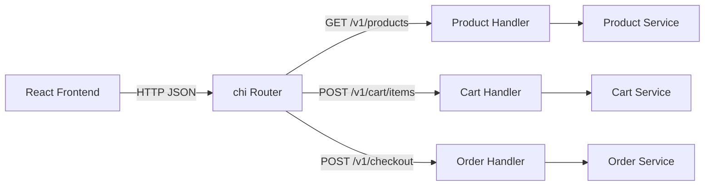
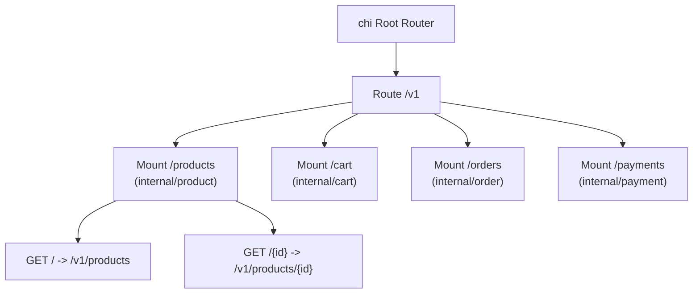
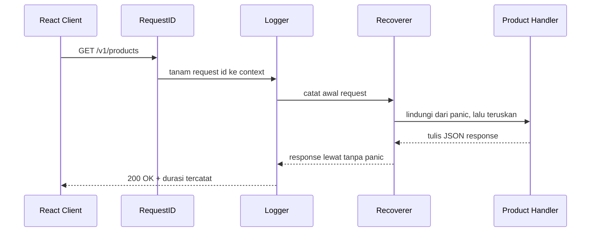

import { Section, Box, Steps, Step, Recap, CardGrid, Card, Chip, Hero, Compare, FileTree, Endpoint, Def } from "@components";

<Hero eyebrow="Roadmap 2 &middot; Web API" title="Routing dengan <em>chi</em><br />REST yang Rapi dan Tumbuh">
  <p>Di modul ini kita naik dari handler `net/http` murni ke routing REST yang enak dirawat: grouping `/v1`, subrouter per domain, dan middleware chain untuk backend online shop skincare.</p>
  <Fragment slot="meta">
    <Chip icon="code">Bahasa: <b>Go 1.26</b></Chip>
    <Chip icon="route">chi <b>v5.3.0</b></Chip>
    <Chip icon="clock">~60 menit baca</Chip>
  </Fragment>
</Hero>

<Section num="01" id="intro" title="Kenapa chi?" sub="Dari handler tunggal ke peta API yang jelas">

<p class="lead">Di modul sebelumnya kamu sudah menulis handler dengan standard library `net/http`. Sekarang kita butuh cara menyusun puluhan endpoint tanpa membuat `main.go` jadi papan tempel route yang panjang.</p>

Di Express.js kamu terbiasa memakai `express.Router()` untuk memecah route produk, cart, dan order ke file terpisah. Di Laravel kamu menulis grup route di `routes/api.php` dengan `Route::prefix('v1')->group(...)`. chi memberi pengalaman serupa di Go, tetapi tetap berdiri di atas `net/http`. Router chi pada akhirnya hanyalah sebuah `http.Handler`, jadi bisa langsung diberikan ke `http.ListenAndServe` tanpa lapisan ajaib di tengah.

[Dokumentasi resmi chi](https://pkg.go.dev/github.com/go-chi/chi/v5) menyebut dirinya router yang ringan, idiomatik, dan composable untuk HTTP service Go. Artinya chi bukan framework besar seperti Laravel atau NestJS. Ia fokus pada tiga hal: mencocokkan route, menyusun middleware, dan mengkomposisi handler. Validasi, business logic, dan akses database tetap urusan kamu, persis seperti di modul `net/http`.

<Box variant="bridge" icon="🌉" label="Jembatan: dari express.Router() ke chi.NewRouter()"><p>Anggap chi seperti `express.Router()`, tetapi state request tidak pernah disimpan di object router. Data request tetap hidup di `*http.Request`, path parameter dibaca dari context route, dan handler tetap berbentuk `func(w http.ResponseWriter, r *http.Request)` yang sama persis seperti modul lalu.</p></Box>

<CardGrid cols={2}>
  <Card><h4>Tetap `http.Handler`</h4><p>Router, subrouter, dan middleware chi semuanya `http.Handler`, jadi `httptest` dan tooling standard library tetap jalan.</p></Card>
  <Card><h4>Grouping dan versioning</h4><p>Prefix `/v1`, group customer, dan group admin tersusun rapi tanpa mengulang string path di tiap endpoint.</p></Card>
  <Card><h4>Middleware ergonomis</h4><p>RequestID, Logger, Recoverer, Timeout, dan auth dirangkai per group dengan satu `r.Use`.</p></Card>
  <Card><h4>Mount per domain</h4><p>Tiap domain (produk, cart, order) mengekspos router sendiri lalu dipasang ke root router lewat `Mount`.</p></Card>
</CardGrid>

<Box variant="note" icon="📝" label="Catatan versi paket"><p>Modul ini memakai import `github.com/go-chi/chi/v5` (versi `v5.3.0`), bukan `github.com/go-chi/chi` lama tanpa suffix `/v5`. Module proyek kita adalah `github.com/kamu/skincare-backend` dengan `go 1.26` di `go.mod`.</p></Box>

</Section>

<Section num="02" id="mental-model-router" title="Mental Model Router" sub="Router adalah dispatcher, bukan tempat business logic">

<p class="lead">Tugas router hanya satu: memilih handler berdasarkan method dan path. Ia tidak menghitung diskon, tidak mengecek stok, dan tidak menyimpan order.</p>

<Def term="router"><p>Komponen yang menerima HTTP request, mencocokkan kombinasi method dan path, lalu memanggil handler yang sesuai. Tidak lebih dari itu.</p></Def>

Dalam backend skincare, `GET /v1/products` harus jatuh ke handler katalog, dan `POST /v1/checkout` harus jatuh ke handler checkout. Router menjaga peta ini tetap eksplisit dan mudah dibaca, sehingga siapa pun yang membuka kode tahu endpoint apa saja yang ada hanya dengan melihat definisi route.

<Compare aLabel="Express.js / Laravel" bLabel="Go + chi" aTone="muted" bTone="violet">
  <Fragment slot="a"><ul><li>`router.get('/products/:id', handler)` memakai callback `(req, res)` atau closure controller.</li><li>Middleware bisa menempel data langsung ke `req` dengan pola bebas.</li><li>Banyak aplikasi mencampur routing, validasi, dan business logic di file route yang sama.</li></ul></Fragment>
  <Fragment slot="b"><ul><li>`r.Get("/products/{id}", handler)` menerima pattern dan `http.HandlerFunc` standar.</li><li>Data request lewat `*http.Request` dan context, bukan object global yang bisa dimutasi sembarangan.</li><li>Router idealnya hanya wiring; validasi dan business logic pindah ke handler atau service.</li></ul></Fragment>
</Compare>

chi tidak mengubah cara kerja HTTP di Go. Ia hanya membuat pencocokan route, pembacaan path parameter, grouping, mounting, dan middleware terasa jauh lebih ergonomis dibanding menyusunnya manual di atas `http.ServeMux`.



<p class="fig-cap"><b>Gambar 1.</b> Router hanya memilih handler. Aturan bisnis domain hidup di service, yang baru kita rapikan di Roadmap 4.</p>

<Box variant="note" icon="📝" label="Soal bentuk response di modul ini"><p>Di sini kita pakai helper sederhana `writeJSON` (menulis payload apa adanya) dan `writeError(w, status, message)` yang menghasilkan `{"error":"pesan"}`. Envelope response yang konsisten dan terstruktur (`data`, `meta`, `error` dengan kode) baru dirancang di modul berikutnya, Desain Request &amp; Response. Fokus modul ini adalah routing, bukan format JSON-nya.</p></Box>

</Section>

<Section num="03" id="method-route" title="Method Route REST" sub="GET, POST, PUT, PATCH, DELETE sebagai method helper">

<p class="lead">chi menyediakan helper `r.Get`, `r.Post`, `r.Put`, `r.Patch`, dan `r.Delete` agar mapping REST terbaca langsung dari kode.</p>

Setiap helper menerima pattern path dan handler function. Bentuk handler tetap sama persis seperti `net/http`, jadi seluruh pengetahuan dari modul sebelumnya tetap dipakai tanpa perubahan.

```go title="internal/product/routes.go"
r.Get("/products", h.List)
r.Post("/products", h.Create)
r.Get("/products/{id}", h.GetByID)
r.Put("/products/{id}", h.Replace)
r.Patch("/products/{id}", h.UpdatePartial)
r.Delete("/products/{id}", h.Delete)
```

Untuk API skincare, pemilihan method menyatakan niat endpoint dengan jelas. Frontend dan mobile tahu apa yang akan terjadi hanya dari kombinasi method dan path.

<Endpoint method="GET" path="/v1/products" desc="Daftar produk skincare, dengan filter kategori, q (pencarian), dan pagination" />
<Endpoint method="POST" path="/v1/admin/products" desc="Buat produk baru dari admin dashboard" />
<Endpoint method="PUT" path="/v1/admin/products/{id}" desc="Ganti representasi produk secara penuh" />
<Endpoint method="PATCH" path="/v1/admin/products/{id}" desc="Ubah sebagian data produk, misalnya stok atau status" />
<Endpoint method="DELETE" path="/v1/admin/products/{id}" desc="Hapus atau nonaktifkan produk dari katalog" />

<Box variant="bridge" icon="🌉" label="Jembatan: dari Route::apiResource ke method helper"><p>Di Laravel, `Route::apiResource('products', ...)` membuat lima route REST sekaligus secara otomatis. chi sengaja tidak melakukan itu; kamu menulis tiap method helper satu per satu. Lebih verbose, tetapi setiap route eksplisit dan tidak ada method tersembunyi yang muncul tanpa kamu sadari.</p></Box>

<Box variant="tip" icon="💡" label="Idiom route"><p>Pakai method helper untuk route REST umum. Gunakan `r.Method(verb, pattern, handler)` atau `r.MethodFunc` hanya saat kamu benar-benar perlu verb non-standar. Untuk satu handler yang melayani semua method pada satu path, ada `r.HandleFunc`, tetapi jarang dibutuhkan di REST.</p></Box>

</Section>

<Section num="04" id="path-parameter" title="Path Parameter dengan URLParam" sub="Membaca id dari URL secara eksplisit lalu memvalidasinya">

<p class="lead">Path parameter dipakai ketika identitas resource menjadi bagian dari URL: produk tertentu, item cart tertentu, atau order tertentu.</p>

Di Express kamu membaca `req.params.id`, di Laravel argumen method controller. Di chi, parameter URL dibaca dengan `chi.URLParam(r, "id")`. Nilainya selalu `string`, jadi untuk ID numerik kita parse dan validasi secara eksplisit sebelum dipakai.

```go title="internal/product/handler.go"
func productIDFromRequest(r *http.Request) (int64, error) {
	rawID := chi.URLParam(r, "id")
	id, err := strconv.ParseInt(rawID, 10, 64)
	if err != nil || id <= 0 {
		return 0, fmt.Errorf("product id tidak valid: %q", rawID)
	}
	return id, nil
}
```

<Box variant="bridge" icon="🌉" label="Jembatan: req.params.id vs chi.URLParam"><p>`req.params.id` di Express terasa seperti field siap pakai yang sudah tersedia. Di chi, parameter diambil dari route context yang ditanam chi ke dalam `*http.Request`. Hasilnya tetap eksplisit dan dekat dengan model `net/http`, bukan sihir framework.</p></Box>

<Box variant="warn" icon="⚠️" label="Jebakan: string ID mentah"><p>Jangan langsung memakai string dari URL untuk query database. Parse ke tipe yang tepat, validasi (di sini menolak ID `&lt;= 0`), lalu kirim `int64` ke service atau repository. Tanpa ini, input `/v1/products/abc` atau `/v1/products/-1` bisa lolos ke layer bawah.</p></Box>

<Box variant="note" icon="🧩" label="Wildcard dan regex"><p>Selain `{id}`, chi mendukung wildcard `*` untuk menangkap sisa path (mis. `r.Get("/files/*", ...)` lalu `chi.URLParam(r, "*")`), dan pattern bertipe regex seperti `{id:[0-9]+}`. Untuk REST biasa, parameter bernama plus validasi manual sudah cukup dan lebih mudah dibaca.</p></Box>

</Section>

<Section num="05" id="grouping-versioning" title="Grouping, Mount, dan Versioning" sub="Menyusun route berdasarkan prefix dan domain">

<p class="lead">Route grouping membuat prefix seperti `/v1` tidak diulang di setiap endpoint, dan mounting membuat tiap domain bisa hidup di package sendiri.</p>

Versioning penting karena client mobile dan frontend bisa hidup lebih lama daripada satu siklus deploy backend. Ketika nanti ada perubahan kontrak besar, kita bisa menambah `/v2` tanpa mematahkan client lama yang masih memanggil `/v1`.

Ada dua alat yang sering tertukar: `r.Route` dan `r.Mount`. Memahami bedanya adalah kunci struktur router yang bersih.

<Compare aLabel="r.Route(pattern, fn)" bLabel="r.Mount(pattern, handler)" aTone="blue" bTone="violet">
  <Fragment slot="a"><ul><li>Membuat subrouter inline lewat closure `func(r chi.Router)`.</li><li>Cocok untuk grouping lokal di file yang sama, mis. prefix `/v1` di root router.</li><li>Kamu tetap menulis tiap route di dalam closure tersebut.</li></ul></Fragment>
  <Fragment slot="b"><ul><li>Memasang sebuah `http.Handler` (biasanya router dari package lain) di bawah prefix.</li><li>Cocok saat subrouter datang dari domain lain, mis. `internal/product`.</li><li>Domain itu tidak tahu prefix `/v1`; ia hanya tahu route relatifnya sendiri (`/`, `/{id}`).</li></ul></Fragment>
</Compare>

Berikut root router yang memakai keduanya. `Route("/v1", ...)` membuat grup versi, lalu di dalamnya `Mount` memasang router tiap domain.

```go title="internal/router/router.go"
func New(products, cart, orders, payments http.Handler) http.Handler {
	r := chi.NewRouter()

	r.Route("/v1", func(r chi.Router) {
		r.Mount("/products", products)
		r.Mount("/cart", cart)
		r.Mount("/orders", orders)
		r.Mount("/payments", payments)
	})

	return r
}
```

Karena `Mount` menempel router produk di `/products`, di dalam `internal/product` kamu cukup menulis route relatif `/` untuk koleksi dan `/{id}` untuk detail. Path penuh terbentuk dari gabungan prefix mount dan route relatif.

```go title="internal/product/handler.go"
func (h *Handler) Routes() chi.Router {
	r := chi.NewRouter()

	r.Get("/", h.List)               // -> GET /v1/products
	r.Get("/{id}", h.GetByID)        // -> GET /v1/products/{id}

	return r
}
```



<p class="fig-cap"><b>Gambar 2.</b> Prefix `/v1` ditulis sekali di root. Tiap domain hanya tahu route relatifnya sendiri, sehingga pindah versi cukup menyentuh satu tempat.</p>

<Box variant="bridge" icon="🌉" label="Jembatan: dari Route::prefix('v1')->group()"><p>Di Laravel, `Route::prefix('v1')->group(fn () =&gt; ...)` adalah padanan langsung `r.Route("/v1", func(r chi.Router) { ... })`. Memasang router dari package lain dengan `r.Mount("/products", productRouter)` mirip memuat file route terpisah; bedanya di Go yang dipasang adalah sebuah `http.Handler` konkret, bukan referensi file.</p></Box>

<Box variant="note" icon="📝" label="Kapan membuat /v2?"><p>Jangan membuat versi baru untuk perubahan kecil yang backward compatible (menambah field response, menambah endpoint baru). Buat `/v2` hanya saat kontrak response berubah cara baca-nya, behavior utama bergeser, atau lifecycle resource berubah besar sehingga client lama akan rusak.</p></Box>

</Section>

<Section num="06" id="middleware-chain" title="Middleware Chain dan Urutannya" sub="Layer lintas request sebelum sampai ke handler">

<p class="lead">Middleware adalah fungsi yang membungkus handler untuk menjalankan logic lintas route: request id, logging, panic recovery, timeout, auth, dan CORS.</p>

Signature middleware Go selalu sama: menerima `http.Handler`, mengembalikan `http.Handler`. Inilah alasan middleware chi tetap kompatibel dengan standard library, dan kenapa middleware yang kamu tulis sendiri di modul `net/http` tetap bisa dipakai di chi tanpa diubah.

```go title="middleware-signature.go"
func Middleware(next http.Handler) http.Handler {
	return http.HandlerFunc(func(w http.ResponseWriter, r *http.Request) {
		// logic SEBELUM handler berjalan
		next.ServeHTTP(w, r)
		// logic SETELAH handler selesai
	})
}
```

chi membawa kumpulan middleware bawaan di subpackage `github.com/go-chi/chi/v5/middleware`. Untuk root router proyek, set inti yang aman dan idiomatik adalah RequestID, Logger, Recoverer, dan Timeout.

```go title="internal/router/router.go"
r := chi.NewRouter()

r.Use(middleware.RequestID)              // beri setiap request id unik
r.Use(middleware.Logger)                 // log method, path, status, durasi
r.Use(middleware.Recoverer)              // ubah panic jadi 500, bukan crash server
r.Use(middleware.Timeout(15 * time.Second)) // batasi durasi request
```

<Box variant="warn" icon="⚠️" label="Jangan pakai middleware.RealIP sebagai default"><p>Banyak tutorial lama menaruh `middleware.RealIP` di sini. Hindari. RealIP kini ditandai deprecated karena rawan IP spoofing (advisory GHSA-3fxj-6jh8-hvhx, severity Critical): ia memutasi `r.RemoteAddr` dan memercayai header `X-Forwarded-For` apa adanya, padahal header itu bisa dipalsukan client. Pakai middleware client-IP yang eksplisit sesuai infrastruktur (mis. `ClientIPFromXFFTrustedProxies(n)` bila di belakang ALB atau proxy tepercaya), lalu baca hasilnya lewat `GetClientIP(ctx)`. Kita bahas tuntas di modul Middleware.</p></Box>

Urutan `r.Use` menentukan urutan eksekusi: middleware yang didaftarkan lebih dulu membungkus yang setelahnya, seperti lapisan bawang. Recoverer harus berada cukup luar agar bisa menangkap panic dari middleware dan handler di dalamnya, dan RequestID di paling luar agar setiap log sudah membawa id.



<p class="fig-cap"><b>Gambar 3.</b> Middleware membungkus dari luar ke dalam. Request menembus tiap lapisan menuju handler, lalu response kembali menembus lapisan yang sama dalam urutan terbalik.</p>

<Box variant="bridge" icon="🌉" label="Jembatan: middleware Express vs Go"><p>Express middleware memanggil `next()` untuk meneruskan. Di Go, middleware memanggil `next.ServeHTTP(w, r)`. Konsepnya identik (kontrol diteruskan ke lapisan berikutnya), tetapi bentuknya interface `http.Handler`, bukan function dengan callback `next`.</p></Box>

Tidak semua middleware harus global. chi punya dua cara memasang middleware pada sebagian route saja: `r.Group` (untuk beberapa route tanpa menambah prefix) dan `r.With` (untuk satu route).

```go title="internal/router/router.go"
r.Route("/v1", func(r chi.Router) {
	// Route publik: tanpa auth
	r.Get("/products", productHandler.List)
	r.Get("/products/{id}", productHandler.GetByID)
	r.Post("/payments/webhook", paymentHandler.Webhook) // publik, verifikasi signature provider

	// Group route yang butuh login customer (tanpa prefix tambahan)
	r.Group(func(r chi.Router) {
		r.Use(authMiddleware) // hanya berlaku di group ini
		r.Get("/cart", cartHandler.Get)
		r.Post("/cart/items", cartHandler.AddItem)
		r.Post("/checkout", orderHandler.Checkout)
	})

	// Satu route dengan middleware tambahan via With
	r.With(rateLimitWebhook).Post("/payments/refund", paymentHandler.Refund)
})
```

<Box variant="tip" icon="💡" label="Group vs With vs Route"><p>`r.Route(prefix, fn)` membuat subrouter berprefix. `r.Group(fn)` membuat subrouter tanpa prefix, ideal untuk menerapkan middleware (mis. auth) ke sekumpulan route yang path-nya berbeda-beda. `r.With(mw...)` menempel middleware ke satu route tunggal. Webhook pembayaran sengaja diletakkan publik di luar group auth karena dipanggil server provider, bukan user login. Detail webhook lengkap kita rakit di modul peta API final.</p></Box>

<Box variant="warn" icon="⚠️" label="Middleware harus didaftarkan sebelum route"><p>Pada chi, `r.Use(...)` wajib dipanggil sebelum route apa pun didefinisikan di router atau group yang sama. Mendaftarkan middleware setelah route akan memicu panic saat startup. Letakkan semua `r.Use` di paling atas blok router.</p></Box>

</Section>

<Section num="07" id="not-found-method" title="NotFound dan MethodNotAllowed" sub="Balas 404 dan 405 dengan JSON, bukan teks polos">

<p class="lead">Secara default, chi membalas route tak dikenal dengan teks `404 page not found` dan method salah dengan `405 method not allowed` polos. Untuk API JSON, dua respons ini sebaiknya konsisten dengan format error endpoint lain.</p>

Frontend React kamu hampir pasti menjalankan `await response.json()` untuk setiap respons. Bila 404 mengembalikan teks polos, parsing JSON di sisi client gagal dan pesan error jadi membingungkan. Maka kita pasang handler kustom di root router.

```go title="internal/router/router.go"
r.NotFound(func(w http.ResponseWriter, r *http.Request) {
	writeError(w, http.StatusNotFound, "rute tidak ditemukan")
})

r.MethodNotAllowed(func(w http.ResponseWriter, r *http.Request) {
	writeError(w, http.StatusMethodNotAllowed, "method tidak diizinkan untuk rute ini")
})
```

<Box variant="bridge" icon="🌉" label="Jembatan: fallback route Express dan Laravel"><p>Di Express kamu menulis `app.use((req, res) =&gt; res.status(404).json(...))` di paling akhir. Di Laravel ada `Route::fallback(...)` dan exception handler untuk `MethodNotAllowedHttpException`. `r.NotFound` dan `r.MethodNotAllowed` chi adalah padanan langsungnya, hanya saja terdaftar di router, bukan sebagai route terakhir.</p></Box>

<Box variant="note" icon="📝" label="Beda 404 dan 405"><p>`404 Not Found` berarti tidak ada route yang cocok dengan path sama sekali. `405 Method Not Allowed` berarti path-nya ada tetapi method-nya salah, misalnya `DELETE /v1/products` padahal hanya `GET` dan `POST` yang terdaftar di path itu. chi membedakan keduanya otomatis selama kamu mendaftarkan kedua handler ini.</p></Box>

</Section>

<Section num="08" id="struktur-proyek" title="Struktur Router Proyek Skincare" sub="Root router di satu tempat, domain router di package masing-masing">

<p class="lead">Struktur yang rapi membuat route mudah ditemukan tanpa membuat setiap package saling bergantung.</p>

<FileTree title="Struktur router skincare API" tree={`
cmd/
  api/
    main.go        # entry point server HTTP
internal/
  router/
    router.go      # root router: middleware global, versioning, mount
  product/
    handler.go     # route katalog produk
  cart/
    handler.go     # route keranjang (butuh login)
  order/
    handler.go     # route checkout dan order
  payment/
    handler.go     # webhook pembayaran (publik)
go.mod
`} />

Root router mengurus hal lintas domain: middleware global, health check, versioning, mount subrouter, plus NotFound dan MethodNotAllowed. Tiap domain package mengurus route miliknya sendiri dan tidak tahu prefix `/v1`.

```go title="go.mod"
module github.com/kamu/skincare-backend

go 1.26

require github.com/go-chi/chi/v5 v5.3.0
```

```go title="internal/router/router.go"
package router

import (
	"encoding/json"
	"net/http"
	"time"

	"github.com/go-chi/chi/v5"
	"github.com/go-chi/chi/v5/middleware"
)

func New(products, cart, orders, payments http.Handler) http.Handler {
	r := chi.NewRouter()

	// Middleware global: daftarkan SEBELUM route apa pun.
	r.Use(middleware.RequestID)
	r.Use(middleware.Logger)
	r.Use(middleware.Recoverer)
	r.Use(middleware.Timeout(15 * time.Second))

	// Respons 404 dan 405 yang konsisten dalam bentuk JSON.
	r.NotFound(func(w http.ResponseWriter, r *http.Request) {
		writeError(w, http.StatusNotFound, "rute tidak ditemukan")
	})
	r.MethodNotAllowed(func(w http.ResponseWriter, r *http.Request) {
		writeError(w, http.StatusMethodNotAllowed, "method tidak diizinkan untuk rute ini")
	})

	r.Get("/healthz", healthz)

	r.Route("/v1", func(r chi.Router) {
		r.Mount("/products", products)
		r.Mount("/cart", cart)
		r.Mount("/orders", orders)
		r.Mount("/payments", payments)
	})

	return r
}

func healthz(w http.ResponseWriter, r *http.Request) {
	writeJSON(w, http.StatusOK, map[string]string{"status": "ok"})
}

func writeJSON(w http.ResponseWriter, status int, payload any) {
	w.Header().Set("Content-Type", "application/json")
	w.WriteHeader(status)
	_ = json.NewEncoder(w).Encode(payload)
}

func writeError(w http.ResponseWriter, status int, message string) {
	writeJSON(w, status, map[string]string{"error": message})
}
```

<Box variant="tip" icon="💡" label="Kenapa root router menerima http.Handler?"><p>Dengan menerima `http.Handler`, root router tidak peduli apakah router produk berasal dari chi, `http.ServeMux`, atau handler buatan sendiri. Ini menjaga dependency antar package tetap rendah dan membuat tiap domain bisa dites terisolasi.</p></Box>

<Box variant="note" icon="🧩" label="Peta route lengkap proyek"><p>Modul ini menyusun kerangkanya: `/v1/products` dan `/v1/products/{id}` publik, group `/v1/cart`, `/v1/checkout`, dan `/v1/orders` butuh login customer, group `/v1/admin/products` butuh role admin, dan `/v1/payments/webhook` publik untuk provider pembayaran. Peta penuh beserta auth dan validasinya dirakit utuh di modul peta API e-commerce di akhir Roadmap 2.</p></Box>

</Section>

<Section num="09" id="hands-on" title="Hands-on Router Produk" sub="Bangun router produk yang bisa dijalankan lokal">

<p class="lead">Sekarang kita susun contoh minimum yang memperlihatkan `chi.NewRouter`, method route, `chi.URLParam`, grouping, mounting, NotFound, dan `http.ListenAndServe`.</p>

<Steps>
  <Step><b>Tambahkan dependency chi</b><p>Jalankan `go get github.com/go-chi/chi/v5@v5.3.0` dari root project.</p></Step>
  <Step><b>Buat product handler</b><p>Letakkan route produk di `internal/product/handler.go` agar domain produk tidak bercampur dengan root router.</p></Step>
  <Step><b>Buat root router</b><p>Pakai `internal/router/router.go` dari section sebelumnya untuk middleware global, versioning, dan mount.</p></Step>
  <Step><b>Jalankan server</b><p>Gunakan `go run ./cmd/api`, lalu coba endpoint dengan `curl`.</p></Step>
</Steps>

```go title="internal/product/handler.go"
package product

import (
	"encoding/json"
	"fmt"
	"net/http"
	"strconv"

	"github.com/go-chi/chi/v5"
)

type Handler struct{}

type Product struct {
	ID          int64  `json:"id"`
	Name        string `json:"name"`
	Slug        string `json:"slug"`
	Category    string `json:"category"`
	PriceRupiah int64  `json:"price"`
	Stock       int    `json:"stock"`
	Status      string `json:"status"`
}

type CreateProductRequest struct {
	Name        string `json:"name"`
	Slug        string `json:"slug"`
	Category    string `json:"category"`
	PriceRupiah int64  `json:"price"`
	Stock       int    `json:"stock"`
}

type PatchProductRequest struct {
	Name        *string `json:"name,omitempty"`
	PriceRupiah *int64  `json:"price,omitempty"`
	Stock       *int    `json:"stock,omitempty"`
	Status      *string `json:"status,omitempty"`
}

func NewHandler() *Handler {
	return &Handler{}
}

func (h *Handler) Routes() chi.Router {
	r := chi.NewRouter()

	r.Get("/", h.List)
	r.Post("/", h.Create)
	r.Get("/{id}", h.GetByID)
	r.Put("/{id}", h.Replace)
	r.Patch("/{id}", h.UpdatePartial)
	r.Delete("/{id}", h.Delete)

	return r
}

func (h *Handler) List(w http.ResponseWriter, r *http.Request) {
	products := []Product{
		{ID: 1, Name: "Gentle Low pH Cleanser", Slug: "gentle-low-ph-cleanser", Category: "cleanser", PriceRupiah: 129000, Stock: 24, Status: "active"},
		{ID: 2, Name: "Niacinamide Barrier Serum", Slug: "niacinamide-barrier-serum", Category: "serum", PriceRupiah: 179000, Stock: 18, Status: "active"},
	}

	writeJSON(w, http.StatusOK, products)
}

func (h *Handler) Create(w http.ResponseWriter, r *http.Request) {
	var req CreateProductRequest
	if err := json.NewDecoder(r.Body).Decode(&req); err != nil {
		writeError(w, http.StatusBadRequest, "request body harus berupa JSON produk yang valid")
		return
	}

	product := Product{
		ID:          99,
		Name:        req.Name,
		Slug:        req.Slug,
		Category:    req.Category,
		PriceRupiah: req.PriceRupiah,
		Stock:       req.Stock,
		Status:      "active",
	}

	writeJSON(w, http.StatusCreated, product)
}

func (h *Handler) GetByID(w http.ResponseWriter, r *http.Request) {
	id, err := productIDFromRequest(r)
	if err != nil {
		writeError(w, http.StatusBadRequest, err.Error())
		return
	}

	product := Product{ID: id, Name: "Gentle Low pH Cleanser", Slug: "gentle-low-ph-cleanser", Category: "cleanser", PriceRupiah: 129000, Stock: 24, Status: "active"}
	writeJSON(w, http.StatusOK, product)
}

func (h *Handler) Replace(w http.ResponseWriter, r *http.Request) {
	id, err := productIDFromRequest(r)
	if err != nil {
		writeError(w, http.StatusBadRequest, err.Error())
		return
	}

	var req CreateProductRequest
	if err := json.NewDecoder(r.Body).Decode(&req); err != nil {
		writeError(w, http.StatusBadRequest, "request body harus berupa JSON produk yang valid")
		return
	}

	product := Product{ID: id, Name: req.Name, Slug: req.Slug, Category: req.Category, PriceRupiah: req.PriceRupiah, Stock: req.Stock, Status: "active"}
	writeJSON(w, http.StatusOK, product)
}

func (h *Handler) UpdatePartial(w http.ResponseWriter, r *http.Request) {
	id, err := productIDFromRequest(r)
	if err != nil {
		writeError(w, http.StatusBadRequest, err.Error())
		return
	}

	var req PatchProductRequest
	if err := json.NewDecoder(r.Body).Decode(&req); err != nil {
		writeError(w, http.StatusBadRequest, "request body harus berupa JSON produk yang valid")
		return
	}

	writeJSON(w, http.StatusOK, map[string]any{"id": id, "patched": req})
}

func (h *Handler) Delete(w http.ResponseWriter, r *http.Request) {
	if _, err := productIDFromRequest(r); err != nil {
		writeError(w, http.StatusBadRequest, err.Error())
		return
	}

	w.WriteHeader(http.StatusNoContent)
}

func productIDFromRequest(r *http.Request) (int64, error) {
	rawID := chi.URLParam(r, "id")
	id, err := strconv.ParseInt(rawID, 10, 64)
	if err != nil || id <= 0 {
		return 0, fmt.Errorf("product id tidak valid: %q", rawID)
	}
	return id, nil
}

func writeJSON(w http.ResponseWriter, status int, payload any) {
	w.Header().Set("Content-Type", "application/json")
	w.WriteHeader(status)
	_ = json.NewEncoder(w).Encode(payload)
}

func writeError(w http.ResponseWriter, status int, message string) {
	writeJSON(w, status, map[string]string{"error": message})
}
```

```go title="cmd/api/main.go"
package main

import (
	"encoding/json"
	"log"
	"net/http"

	"github.com/go-chi/chi/v5"
	"github.com/kamu/skincare-backend/internal/product"
	"github.com/kamu/skincare-backend/internal/router"
)

func main() {
	productHandler := product.NewHandler()

	r := router.New(
		productHandler.Routes(),
		placeholderRoutes("cart"),
		placeholderRoutes("orders"),
		placeholderRoutes("payments"),
	)

	log.Println("listening on :8080")
	if err := http.ListenAndServe(":8080", r); err != nil {
		log.Fatal(err)
	}
}

func placeholderRoutes(name string) http.Handler {
	r := chi.NewRouter()
	r.Get("/", func(w http.ResponseWriter, r *http.Request) {
		w.Header().Set("Content-Type", "application/json")
		w.WriteHeader(http.StatusOK)
		_ = json.NewEncoder(w).Encode(map[string]string{
			"module": name,
			"status": "belum diimplementasi",
		})
	})
	return r
}
```

```bash title="Terminal"
go get github.com/go-chi/chi/v5@v5.3.0
go run ./cmd/api
```

Coba health check, lalu daftar dan detail produk.

```bash title="Terminal"
curl -i http://localhost:8080/healthz
curl -i http://localhost:8080/v1/products
curl -i http://localhost:8080/v1/products/1
```

Coba membuat produk baru. Perhatikan field JSON-nya bernama `price`, walau di Go tipenya `PriceRupiah int64`.

```bash title="Terminal"
curl -i -X POST http://localhost:8080/v1/products \
  -H 'Content-Type: application/json' \
  -d '{"name":"Hydrating Toner","slug":"hydrating-toner","category":"toner","price":149000,"stock":30}'
```

Coba juga route yang tidak ada dan method yang salah untuk melihat 404 dan 405 dalam bentuk JSON.

```bash title="Terminal"
curl -i http://localhost:8080/v1/tidak-ada
curl -i -X DELETE http://localhost:8080/v1/products
```

<Box variant="note" icon="📝" label="Kenapa contoh belum pakai database?"><p>Fokus modul ini adalah routing. Data produk masih hardcoded di handler. Repository PostgreSQL dengan `pgxpool` masuk di Roadmap 3, lalu service layer yang rapi masuk di Roadmap 4.</p></Box>

</Section>

<Section num="10" id="jebakan-umum" title="Jebakan Umum" sub="Hal kecil yang sering membuat route sulit dirawat">

<p class="lead">chi sederhana, tetapi pola yang salah bisa membuat API cepat berantakan.</p>

<CardGrid cols={2}>
  <Card><h4>Business logic di router</h4><p>Router jangan menghitung total order, validasi stok, atau memanggil banyak query. Router cukup menyusun middleware dan route.</p></Card>
  <Card><h4>Path parameter tidak divalidasi</h4><p>`chi.URLParam` mengembalikan string. Parse dan validasi sebelum masuk service atau repository.</p></Card>
  <Card><h4>Prefix versi tersebar</h4><p>Jangan menulis `/v1` di tiap package domain. Letakkan versioning di root router lewat `Route("/v1", ...)`.</p></Card>
  <Card><h4>Mount path duplikat</h4><p>Hindari mount dua subrouter pada path yang sama. Root router harus jadi satu sumber kebenaran daftar mount.</p></Card>
  <Card><h4>r.Use setelah route</h4><p>Mendaftarkan middleware sesudah route memicu panic saat startup. Taruh semua `r.Use` di paling atas blok router.</p></Card>
  <Card><h4>404 dan 405 teks polos</h4><p>Tanpa `NotFound` dan `MethodNotAllowed` kustom, client React gagal `response.json()`. Balas JSON yang konsisten.</p></Card>
  <Card><h4>RealIP sebagai default</h4><p>`middleware.RealIP` deprecated dan rawan spoofing. Pakai middleware client-IP eksplisit sesuai infrastruktur.</p></Card>
  <Card><h4>Webhook di balik auth login</h4><p>`/v1/payments/webhook` dipanggil server provider, bukan user. Biarkan publik, amankan dengan verifikasi signature.</p></Card>
</CardGrid>

<Box variant="warn" icon="⚠️" label="Jangan simpan state request di router"><p>Router dibuat sekali lalu melayani banyak request secara concurrent. Jangan menaruh data user login, cart sementara, atau payload request sebagai field router. State request hidup di `*http.Request` dan context, bukan di object router.</p></Box>

<Box variant="tip" icon="💡" label="Pola yang akan kita bawa ke modul berikutnya"><p>Mulai dari sini, tiap domain punya handler dan `Routes()` sendiri. Saat auth masuk di modul Autentikasi, kita cukup membungkus group yang perlu dilindungi dengan `r.Group(func(r chi.Router) { r.Use(authMiddleware); ... })`, tanpa menyentuh route publik seperti katalog dan webhook.</p></Box>

</Section>

<Section num="11" id="ringkasan" title="Ringkasan & Poin Penting">

<p class="lead">Routing dengan chi membuat API Go tetap dekat dengan `net/http`, tetapi jauh lebih rapi untuk proyek REST yang tumbuh.</p>

<Recap title="Yang Wajib Menempel"><ul><li>`chi.NewRouter()` membuat router yang tetap memenuhi `http.Handler`, jadi `httptest` dan `ListenAndServe` jalan tanpa perubahan.</li><li>`r.Get`, `r.Post`, `r.Put`, `r.Patch`, dan `r.Delete` membuat mapping REST eksplisit, dengan handler bentuk standar `net/http`.</li><li>`chi.URLParam(r, "id")` mengambil path parameter sebagai string; selalu parse ke `int64` dan validasi sebelum dipakai.</li><li>`r.Route("/v1", ...)` untuk grouping prefix, `r.Mount("/products", router)` untuk memasang subrouter domain dari package lain.</li><li>`r.Use` menyusun middleware chain global (RequestID, Logger, Recoverer, Timeout) dengan urutan luar-ke-dalam, dan harus didaftarkan sebelum route.</li><li>`r.Group` menerapkan middleware ke sekumpulan route tanpa prefix, `r.With` ke satu route; pakai untuk memisahkan route publik, customer, dan admin.</li><li>Hindari `middleware.RealIP` (deprecated, rawan spoofing); pasang `NotFound` dan `MethodNotAllowed` kustom agar 404 dan 405 tetap JSON.</li><li>Di proyek skincare, root router di `internal/router` memetakan `/v1/products` (publik), `/v1/cart` dan `/v1/checkout` (customer), `/v1/admin/products` (admin), serta `/v1/payments/webhook` (publik).</li></ul></Recap>

Modul ini memindahkan kita dari handler tunggal ke struktur API yang siap tumbuh. Di modul berikutnya, Desain Request &amp; Response, kita merapikan bentuk JSON menjadi envelope yang konsisten (`data`, `meta`, dan `error` terstruktur), lalu lanjut ke middleware serius, validasi, autentikasi, dan akhirnya peta API e-commerce yang merakit semuanya.

</Section>
