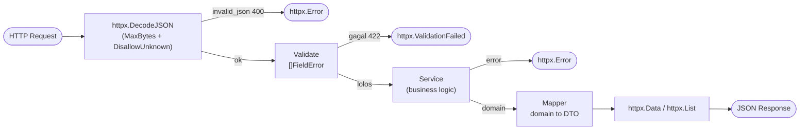
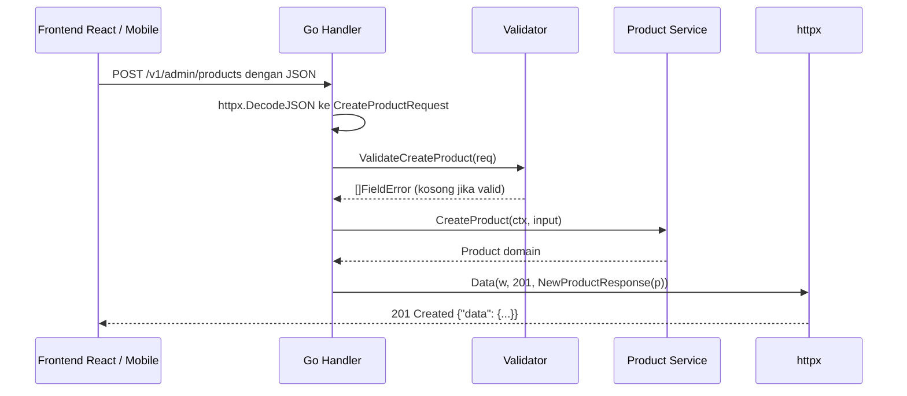

import { Section, Box, Steps, Step, Recap, CardGrid, Card, Chip, Hero, Compare, FileTree, Endpoint, Def } from "@components";

<Hero eyebrow="Roadmap 2 &middot; Web API" title="Desain Request dan <em>Response API</em><br />yang Konsisten">
  <p>Modul ini menetapkan envelope JSON kanonik proyek skincare, package `internal/httpx` yang dipakai ulang sampai modul peta API final.</p>
  <Fragment slot="meta">
    <Chip icon="code">Bahasa: <b>Go 1.26</b></Chip>
    <Chip icon="route">Roadmap 2</Chip>
    <Chip icon="clock">~65 menit baca</Chip>
  </Fragment>
</Hero>

<Section num="01" id="intro" title="Kenapa Kontrak API Harus Konsisten?" sub="Satu bentuk JSON yang sama di seluruh endpoint">

<p class="lead">Di React atau mobile client, API yang konsisten terasa seperti komponen dengan props yang jelas: gampang dipakai, gampang dites, dan jarang memaksa kamu menebak.</p>

Di modul sebelumnya kita sudah membuat handler `net/http` lalu merapikan routing dengan chi. Pada modul routing, response sengaja kita tulis lewat helper sederhana `writeJSON` dan `writeError` yang menghasilkan `{"error":"pesan"}`. Sekarang fokusnya bergeser dari "route apa yang dipanggil" ke "bentuk data apa yang selalu dikirim dan diterima". Endpoint katalog, cart, checkout, dan admin produk harus memakai pola response yang sama, sehingga frontend cukup menulis satu lapis data fetching dan satu lapis error handling.

<Box variant="bridge" icon="🌉" label="Jembatan: dari TypeScript type ke Go struct"><p>Kalau di TypeScript kamu membuat `CreateProductPayload` dan `ProductViewModel`, di Go kita membuat struct DTO dengan JSON tag, supaya nama field di JSON tetap stabil walau nama field Go memakai PascalCase yang idiomatik.</p></Box>

<Def term="DTO (Data Transfer Object)"><p>Struct yang khusus dipakai di batas masuk dan keluar API, bukan untuk menampung semua aturan domain. Ia adalah "bentuk kabel" data, bukan model bisnis.</p></Def>

Modul ini adalah modul kontrak. Apa yang kita putuskan di sini, mulai dari nama field `data`, `meta`, `error` sampai tipe `Meta` dan `FieldError`, akan dipakai ulang oleh modul middleware, validasi, autentikasi, dan peta API final. Jadi anggap ini sebagai menulis konstitusi kecil untuk seluruh API skincare.

<CardGrid cols={3}>
  <Card><h4>Frontend lebih tenang</h4><p>Sukses dan error selalu berpola sama, jadi data fetching dan error boundary cukup ditulis sekali.</p></Card>
  <Card><h4>Backend lebih bebas</h4><p>Domain model boleh berubah tanpa langsung merusak kontrak JSON publik yang dipakai client.</p></Card>
  <Card><h4>Testing lebih jelas</h4><p>Handler test bisa assert `data`, `meta`, dan `error` tanpa menebak format khusus tiap endpoint.</p></Card>
</CardGrid>

</Section>

<Section num="02" id="bentuk-kontrak" title="Bentuk Envelope yang Kita Sepakati" sub="Empat bentuk JSON: sukses tunggal, sukses list, error, dan validation">

<p class="lead">Envelope adalah amplop yang membungkus payload. Isinya berbeda tiap endpoint, tetapi amplopnya selalu sama, sehingga client tahu di mana mencari data dan di mana mencari error.</p>

Kita sepakati empat bentuk untuk seluruh proyek skincare. Hafalkan keempatnya, karena ini kontrak yang dipakai dari modul ini sampai modul peta API final.

```json title="Sukses tunggal (GET /v1/products/{id})"
{
  "data": {
    "id": 101,
    "name": "Hydrating Toner",
    "category": "toner",
    "price": 129000,
    "stock": 42,
    "status": "active"
  }
}
```

```json title="Sukses list (GET /v1/products?page=1)"
{
  "data": [
    { "id": 101, "name": "Hydrating Toner", "price": 129000 },
    { "id": 102, "name": "Niacinamide Serum", "price": 189000 }
  ],
  "meta": { "page": 1, "per_page": 20, "total": 135, "total_pages": 7 }
}
```

```json title="Error biasa (404 Not Found)"
{
  "error": { "code": "product_not_found", "message": "Produk tidak ditemukan." }
}
```

```json title="Error validasi (422 Unprocessable Entity)"
{
  "error": {
    "code": "validation_error",
    "message": "Validasi gagal",
    "fields": [
      { "field": "price", "message": "harga harus lebih dari 0" }
    ]
  }
}
```

<Box variant="tip" icon="💡" label="Aturan amplop"><p>`data` untuk payload utama, `meta` untuk informasi pendamping seperti pagination, `error` untuk semua kegagalan yang bisa dipahami client. Sukses tidak pernah membawa `error`, dan error tidak pernah membawa `data`.</p></Box>

<Box variant="bridge" icon="🌉" label="Jembatan: kenapa pakai amplop, bukan array telanjang"><p>Di banyak API Laravel atau Express, list dikirim sebagai array JSON polos `[...]`. Masalahnya, begitu kamu butuh menambah pagination, array telanjang tidak punya tempat untuk `meta` tanpa mengubah bentuk. Amplop `{"data": [...], "meta": {...}}` sejak awal menyediakan ruang itu, jadi kontrak tidak pecah belakangan.</p></Box>

Inilah peta endpoint yang akan memakai envelope ini sepanjang proyek.

<Endpoint method="GET" path="/v1/products" desc="List produk: data array plus meta pagination" />
<Endpoint method="GET" path="/v1/products/{id}" desc="Detail produk: data object tunggal" />
<Endpoint method="POST" path="/v1/admin/products" desc="Create produk: 201 dengan data object, atau 422 validation_error" />
<Endpoint method="POST" path="/v1/cart/items" desc="Tambah item cart: error validasi bila quantity atau product_id tidak valid" />

</Section>

<Section num="03" id="request-dto" title="Request DTO dengan JSON Tags" sub="Gerbang masuk: bentuk JSON yang boleh dikirim client">

<p class="lead">Request DTO mendeskripsikan JSON yang boleh client kirim ke API. Ia tipis, eksplisit, dan sengaja terpisah dari model domain.</p>

Di Go, field struct yang ingin diakses package lain harus exported, artinya diawali huruf kapital. JSON API biasanya memakai `snake_case` atau nama domain seperti `price`. JSON tag adalah jembatan antara `PriceRupiah` di Go dan `price` di JSON. Package standard library [encoding/json](https://pkg.go.dev/encoding/json) menyediakan `NewDecoder`, `Decode`, `NewEncoder`, dan `Encode` untuk proses ini.

<Compare aLabel="TypeScript DTO" bLabel="Go request DTO" aTone="muted" bTone="violet">
  <Fragment slot="a"><ul><li>`type CreateProductPayload` hanya hidup saat compile, lalu hilang di runtime JavaScript.</li><li>Validasi runtime butuh library seperti Zod atau logic manual.</li><li>Field opsional ditandai `?`, dan `undefined` membedakan "tidak dikirim" dari "dikirim null".</li></ul></Fragment>
  <Fragment slot="b"><ul><li>`struct` tetap nyata saat runtime, dipakai `encoding/json` untuk decode body.</li><li>JSON tag menjaga nama field API tanpa mengorbankan naming idiomatik Go.</li><li>Field opsional dipakai sebagai pointer agar bisa membedakan "tidak dikirim" dari "dikirim nol".</li></ul></Fragment>
</Compare>

```go title="internal/product/dto.go"
package product

// CreateProductRequest adalah bentuk JSON saat admin membuat produk baru.
type CreateProductRequest struct {
	Name        string `json:"name"`
	Slug        string `json:"slug"`
	Category    string `json:"category"`
	PriceRupiah int64  `json:"price"`
	Stock       int    `json:"stock"`
	Description string `json:"description"`
}

// AddCartItemRequest dipakai customer untuk menambah item ke keranjang.
type AddCartItemRequest struct {
	ProductID int64 `json:"product_id"`
	Quantity  int   `json:"quantity"`
}
```

<Box variant="note" icon="📝" label="Harga selalu int64 rupiah"><p>Rupiah tidak punya pecahan sen yang dipakai sehari-hari, jadi `PriceRupiah` bertipe `int64` dengan JSON tag `price`. Angka `129000` berarti Rp 129.000. Hindari `float64` untuk uang agar tidak ada galat pembulatan; aturan ini konsisten di seluruh proyek.</p></Box>

Untuk endpoint update parsial (PATCH), kita butuh membedakan "field ini sengaja dikosongkan" dari "field ini tidak disebut sama sekali". Di sinilah pointer berguna.

```go title="internal/product/dto.go"
// UpdateProductRequest dipakai PATCH /v1/admin/products/{id}.
// Pointer membuat kita bisa membedakan field absent (nil) dari field nol.
type UpdateProductRequest struct {
	Name        *string `json:"name"`
	Category    *string `json:"category"`
	PriceRupiah *int64  `json:"price"`
	Stock       *int    `json:"stock"`
	Status      *string `json:"status"`
}
```

<Box variant="bridge" icon="🌉" label="Jembatan: pointer di PATCH = undefined di JS"><p>Di JavaScript, `body.price === undefined` berarti client tidak mengirim harga, sedangkan `body.price === 0` berarti client mengirim nol. Di Go, `*int64` melakukan hal yang sama: `req.PriceRupiah == nil` artinya field absent, sedangkan `*req.PriceRupiah == 0` artinya client benar-benar mengirim nol. Tanpa pointer, kamu tidak bisa membedakan keduanya, karena zero value `int64` juga `0`.</p></Box>

<Box variant="warn" icon="⚠️" label="Jangan jadikan request DTO sebagai domain model"><p>`CreateProductRequest` adalah bentuk input API, bukan representasi bisnis final. Service layer sebaiknya menerima input command yang lebih dekat ke use case, bukan DTO HTTP mentah. Pemisahan ini menjaga handler tetap tipis dan domain tetap bersih.</p></Box>

</Section>

<Section num="04" id="decode-aman" title="Decode Body dengan Aman" sub="MaxBytesReader, DisallowUnknownFields, dan satu error JSON yang stabil">

<p class="lead">Sebelum membahas response, kita rapikan dulu cara membaca request. Decode body adalah titik masuk paling rawan, jadi kita bungkus dalam satu helper yang konsisten.</p>

Ada tiga pertahanan kecil yang hampir selalu kita pasang saat membaca JSON dari client: batasi ukuran body, tolak field tak dikenal, dan kembalikan satu error stabil saat JSON rusak.

<CardGrid cols={3}>
  <Card><h4>`MaxBytesReader`</h4><p>Membatasi body agar client nakal tidak bisa mengirim payload raksasa dan menghabiskan memori server.</p></Card>
  <Card><h4>`DisallowUnknownFields`</h4><p>Menolak field JSON yang tidak ada di struct, sehingga typo seperti `pirce` ketahuan, bukan diam-diam diabaikan.</p></Card>
  <Card><h4>Satu error JSON</h4><p>Apa pun bentuk kerusakan, client menerima `invalid_json` yang sama, bukan pesan internal yang bocor.</p></Card>
</CardGrid>

Kita taruh helper decode di package `httpx` agar semua handler memakainya tanpa mengulang boilerplate.

```go title="internal/httpx/decode.go"
package httpx

import (
	"encoding/json"
	"errors"
	"io"
	"net/http"
)

// maxBodyBytes membatasi ukuran request body menjadi 1 MB.
const maxBodyBytes = 1 << 20

// ErrInvalidJSON adalah satu-satunya error decode yang kita ekspos ke handler.
// Detail teknis (syntax error, EOF, tipe salah) sengaja tidak dibocorkan.
var ErrInvalidJSON = errors.New("invalid json")

// DecodeJSON membaca body JSON ke dst dengan tiga pertahanan:
// batas ukuran, tolak field tak dikenal, dan tolak body kosong atau ganda.
func DecodeJSON(w http.ResponseWriter, r *http.Request, dst any) error {
	r.Body = http.MaxBytesReader(w, r.Body, maxBodyBytes)

	dec := json.NewDecoder(r.Body)
	dec.DisallowUnknownFields()

	if err := dec.Decode(dst); err != nil {
		return ErrInvalidJSON
	}

	// Pastikan tidak ada JSON kedua menempel setelah object pertama.
	if err := dec.Decode(&struct{}{}); err != io.EOF {
		return ErrInvalidJSON
	}

	return nil
}
```

<Box variant="note" icon="🧩" label="Kenapa decode kedua dipanggil"><p>`dec.Decode(&amp;struct{}{})` memastikan body hanya berisi satu nilai JSON. Tanpa cek ini, body seperti `{"name":"A"}{"name":"B"}` akan lolos dengan hanya object pertama terbaca. Kita ingin `io.EOF`, yang berarti "tidak ada apa-apa lagi setelahnya".</p></Box>

<Box variant="bridge" icon="🌉" label="Jembatan: dari express.json() ke DecodeJSON"><p>Di Express, middleware `express.json()` mengisi `req.body` secara ajaib sebelum handler jalan, dan limit ukuran diatur di satu tempat global. Di Go, decode terlihat eksplisit di awal handler lewat `httpx.DecodeJSON(w, r, &amp;req)`. Lebih banyak satu baris, tetapi alurnya jelas dan tidak ada middleware tersembunyi yang mengubah body.</p></Box>

Pemakaian di handler menjadi ringkas, dan error JSON selalu dipetakan ke satu kode stabil.

```go title="internal/product/handler.go"
var req CreateProductRequest
if err := httpx.DecodeJSON(w, r, &req); err != nil {
	httpx.Error(w, http.StatusBadRequest, "invalid_json", "Body JSON tidak valid.")
	return
}
```

</Section>

<Section num="05" id="response-dto" title="Response DTO Terpisah dari Domain" sub="Tampilkan hanya field yang aman, jangan bocorkan isi database">

<p class="lead">Response DTO adalah bentuk data yang sengaja kita tampilkan ke client, bukan seluruh isi domain atau baris database.</p>

Domain model sering punya field internal seperti `CostRupiah`, `SupplierID`, `DeletedAt`, atau, paling berbahaya, `PasswordHash` di model user. Field seperti itu tidak boleh bocor ke client. Karena itu response dipetakan eksplisit dari domain ke DTO, mirip API Resource di Laravel atau serialization DTO di NestJS, tetapi di Go biasanya cukup struct plus satu fungsi mapper kecil.

```go title="internal/product/model.go"
package product

import "time"

// Product adalah model domain. Tidak semua field di sini boleh tampil di API.
type Product struct {
	ID          int64
	Name        string
	Slug        string
	Category    string
	PriceRupiah int64
	CostRupiah  int64 // harga modal, internal, JANGAN bocor ke client
	SupplierID  int64 // internal
	Stock       int
	Description string
	Status      string
	CreatedAt   time.Time
	DeletedAt   *time.Time // soft delete, internal
}
```

```go title="internal/product/dto.go"
package product

// ProductResponse hanya memuat field yang aman dan stabil untuk client.
type ProductResponse struct {
	ID          int64  `json:"id"`
	Name        string `json:"name"`
	Slug        string `json:"slug"`
	Category    string `json:"category"`
	PriceRupiah int64  `json:"price"`
	Stock       int    `json:"stock"`
	Description string `json:"description,omitempty"`
	Status      string `json:"status"`
	CreatedAt   string `json:"created_at"`
}
```

```go title="internal/product/mapper.go"
package product

import "time"

// NewProductResponse memetakan domain Product ke ProductResponse.
// Hanya field aman yang ikut; CostRupiah, SupplierID, DeletedAt ditinggalkan.
func NewProductResponse(p Product) ProductResponse {
	return ProductResponse{
		ID:          p.ID,
		Name:        p.Name,
		Slug:        p.Slug,
		Category:    p.Category,
		PriceRupiah: p.PriceRupiah,
		Stock:       p.Stock,
		Description: p.Description,
		Status:      p.Status,
		CreatedAt:   p.CreatedAt.UTC().Format(time.RFC3339),
	}
}

// NewProductResponseList memetakan slice domain menjadi slice DTO.
func NewProductResponseList(items []Product) []ProductResponse {
	out := make([]ProductResponse, 0, len(items))
	for _, p := range items {
		out = append(out, NewProductResponse(p))
	}
	return out
}
```

<Box variant="bridge" icon="🌉" label="Jembatan: Laravel API Resource dan NestJS serialization"><p>Di Laravel, `ProductResource` memilih dan memformat field sebelum dikirim. Di NestJS, `class-transformer` dengan `@Exclude()` menyembunyikan field sensitif. Di Go, `NewProductResponse` mengambil peran yang sama secara manual dan eksplisit: tidak ada field yang lolos kecuali kamu menulisnya. Kelebihannya, tidak ada "kebocoran ajaib" karena lupa memasang dekorator.</p></Box>

<Box variant="warn" icon="⚠️" label="Jangan pernah Encode model domain langsung"><p>`json.NewEncoder(w).Encode(product)` akan men-serialize SEMUA field exported, termasuk yang internal. Untuk model `User`, ini berarti `PasswordHash` bisa bocor ke client. Selalu lewati mapper menuju response DTO. Untuk lapis pertahanan tambahan, beri field sensitif tag `json:"-"` di model agar tidak pernah ikut diserialisasi.</p></Box>

</Section>

<Section num="06" id="httpx-helper" title="Package httpx: Satu Tempat untuk Semua Response" sub="JSON, Data, List, Error, ValidationFailed">

<p class="lead">Daripada mengulang set header, status, dan encode di setiap handler, kita pusatkan semuanya di satu package kecil bernama `httpx`. Inilah inti modul ini.</p>

Package `internal/httpx` adalah kontrak teknis envelope. Lima helper publiknya menutup semua kebutuhan response API skincare. Mari bangun dari bawah ke atas.

```go title="internal/httpx/response.go"
package httpx

import (
	"encoding/json"
	"log/slog"
	"net/http"
)

// JSON adalah primitif terendah: set header, tulis status, encode payload.
// Semua helper lain memanggil JSON di akhir.
func JSON(w http.ResponseWriter, status int, payload any) {
	w.Header().Set("Content-Type", "application/json; charset=utf-8")
	w.WriteHeader(status)
	if err := json.NewEncoder(w).Encode(payload); err != nil {
		// Status sudah terkirim, jadi kita hanya bisa mencatat, bukan membalas.
		slog.Error("encode response", "error", err)
	}
}

// dataEnvelope membungkus payload sukses tunggal menjadi {"data": ...}.
type dataEnvelope struct {
	Data any `json:"data"`
}

// Data menulis response sukses tunggal: {"data": <obj>}.
func Data(w http.ResponseWriter, status int, data any) {
	JSON(w, status, dataEnvelope{Data: data})
}

// listEnvelope membungkus list menjadi {"data": [...], "meta": {...}}.
type listEnvelope struct {
	Data any  `json:"data"`
	Meta Meta `json:"meta"`
}

// List menulis response sukses list dengan meta pagination.
func List(w http.ResponseWriter, status int, data any, meta Meta) {
	JSON(w, status, listEnvelope{Data: data, Meta: meta})
}
```

<Box variant="tip" icon="💡" label="Kenapa envelope dibungkus struct tak-exported"><p>`dataEnvelope` dan `listEnvelope` huruf kecil (tak-exported), jadi tidak ada package lain yang bisa membuat envelope sendiri secara langsung. Satu-satunya jalan keluar adalah lewat `Data` dan `List`. Ini menjaga bentuk JSON tetap seragam: tidak ada handler yang diam-diam menulis `data` dengan struktur berbeda.</p></Box>

Sekarang sisi error. Kita definisikan `Meta` dan `FieldError` di sini karena keduanya dipakai lintas modul (pagination dan validasi).

```go title="internal/httpx/response.go"
// Meta adalah informasi pagination untuk response list.
type Meta struct {
	Page       int   `json:"page"`
	PerPage    int   `json:"per_page"`
	Total      int64 `json:"total"`
	TotalPages int   `json:"total_pages"`
}

// FieldError menjelaskan satu field yang gagal validasi.
type FieldError struct {
	Field   string `json:"field"`
	Message string `json:"message"`
}
```

Pemakaian helper sukses di handler menjadi sangat ringkas, dan bentuk JSON dijamin konsisten.

```go title="internal/product/handler.go"
// Detail produk: satu object.
httpx.Data(w, http.StatusOK, NewProductResponse(p))

// Produk baru dibuat: 201 dengan object.
httpx.Data(w, http.StatusCreated, NewProductResponse(created))

// List produk: array plus meta pagination.
httpx.List(w, http.StatusOK, NewProductResponseList(items), meta)
```

<Box variant="bridge" icon="🌉" label="Jembatan: accept interfaces, return structs"><p>Perhatikan `data any` pada signature `Data` dan `List`. Inilah idiom Go "accept interfaces": helper menerima tipe selonggar mungkin (`any`) sehingga bisa menampung `ProductResponse`, `[]ProductResponse`, atau DTO apa pun. Di TypeScript kamu akan memakai generic `<T>`; di Go, `any` sudah cukup karena `encoding/json` memakai refleksi untuk membaca JSON tag pada saat runtime.</p></Box>

</Section>

<Section num="07" id="envelope-error" title="Envelope Error yang Stabil" sub="code machine-readable, message untuk manusia">

<p class="lead">Error response yang stabil membuat frontend bisa membedakan salah input, belum login, data tidak ditemukan, dan konflik bisnis tanpa parsing teks bebas.</p>

Jangan kirim sekadar `{"error":"bad request"}`. Client butuh `code` yang machine-readable (untuk logic) dan `message` yang aman ditampilkan ke pengguna. Kita pakai `code` snake_case agar stabil dan mudah dicocokkan.

```go title="internal/httpx/errors.go"
package httpx

import "net/http"

// errBody adalah isi dari {"error": {...}}.
type errBody struct {
	Code    string       `json:"code"`
	Message string       `json:"message"`
	Fields  []FieldError `json:"fields,omitempty"`
}

// errEnvelope membungkus error menjadi {"error": {...}}.
type errEnvelope struct {
	Error errBody `json:"error"`
}

// Error menulis response error biasa: {"error": {"code": ..., "message": ...}}.
func Error(w http.ResponseWriter, status int, code, message string) {
	JSON(w, status, errEnvelope{
		Error: errBody{Code: code, Message: message},
	})
}

// ValidationFailed menulis 422 dengan daftar field bermasalah.
func ValidationFailed(w http.ResponseWriter, fields []FieldError) {
	JSON(w, http.StatusUnprocessableEntity, errEnvelope{
		Error: errBody{
			Code:    "validation_error",
			Message: "Validasi gagal",
			Fields:  fields,
		},
	})
}
```

Kode error dipakai konsisten di seluruh proyek. Hafalkan daftar pendek ini.

<CardGrid cols={2}>
  <Card><h4>`invalid_json` &middot; 400</h4><p>Body JSON rusak, kosong, ganda, atau memuat field tak dikenal.</p></Card>
  <Card><h4>`validation_error` &middot; 422</h4><p>JSON terbaca, tetapi nilai field melanggar aturan aplikasi. Selalu membawa `fields`.</p></Card>
  <Card><h4>`unauthorized` &middot; 401</h4><p>Token tidak ada atau tidak valid. Dipakai oleh middleware auth di modul berikutnya.</p></Card>
  <Card><h4>`forbidden` &middot; 403</h4><p>Sudah login, tetapi role tidak cukup, misalnya customer mengakses route admin.</p></Card>
  <Card><h4>`product_not_found` &middot; 404</h4><p>Resource spesifik tidak ada. Pakai juga `order_not_found`, atau `not_found` generik.</p></Card>
  <Card><h4>`conflict` &middot; 409</h4><p>Bentrok state, misalnya slug produk sudah dipakai atau stok tidak cukup saat checkout.</p></Card>
  <Card><h4>`internal_error` &middot; 500</h4><p>Kegagalan tak terduga di server. Detail dicatat di log, bukan dikirim ke client.</p></Card>
</CardGrid>

```go title="internal/product/handler.go"
// Produk tidak ditemukan.
httpx.Error(w, http.StatusNotFound, "product_not_found", "Produk tidak ditemukan.")

// Slug bentrok saat create.
httpx.Error(w, http.StatusConflict, "conflict", "Slug produk sudah dipakai.")
```

<Box variant="warn" icon="⚠️" label="Pisahkan pesan internal dari pesan client"><p>Jangan pernah bocorkan error database mentah seperti `duplicate key value violates unique constraint "products_slug_key"`. Catat detail itu di log server dengan `slog`, lalu kirim `conflict` plus pesan yang aman ke client. Untuk error tak terduga, balas `internal_error` dengan pesan generik, dan log error aslinya untuk debugging.</p></Box>

<Box variant="bridge" icon="🌉" label="Jembatan: error code mirip exception class di Laravel"><p>Di Laravel kamu mungkin menangkap `ModelNotFoundException` dan memetakannya ke 404. Di Go tidak ada exception, jadi pemetaan dilakukan eksplisit di handler: cek error dari service, lalu panggil `httpx.Error` dengan kode yang sesuai. Lebih banyak kode, tetapi tidak ada jalur error tersembunyi yang lompat ke middleware jauh di atas.</p></Box>

</Section>

<Section num="08" id="validation-error" title="Validation Error per Field" sub="Kumpulkan semua kesalahan, jangan berhenti di yang pertama">

<p class="lead">Validation error harus menandai field mana yang bermasalah, bukan hanya bilang request gagal. Frontend butuh ini untuk menaruh pesan tepat di bawah input form.</p>

Pada modul ini kita validasi secara manual agar polanya jelas. Hasil validasi adalah `[]httpx.FieldError`, lalu diteruskan ke `httpx.ValidationFailed`. Modul Validasi API berikutnya akan memperdalam ini dengan aturan panjang string, format email, dan opsi library validator, tetapi bentuk outputnya tetap `[]httpx.FieldError` yang sama.

```go title="internal/product/validation.go"
package product

import (
	"strings"

	"github.com/kamu/skincare-backend/internal/httpx"
)

// ValidateCreateProduct mengumpulkan SEMUA error, bukan berhenti di yang pertama.
func ValidateCreateProduct(req CreateProductRequest) []httpx.FieldError {
	var fields []httpx.FieldError

	if strings.TrimSpace(req.Name) == "" {
		fields = append(fields, httpx.FieldError{
			Field: "name", Message: "nama produk wajib diisi",
		})
	}
	if strings.TrimSpace(req.Slug) == "" {
		fields = append(fields, httpx.FieldError{
			Field: "slug", Message: "slug produk wajib diisi",
		})
	}
	if strings.TrimSpace(req.Category) == "" {
		fields = append(fields, httpx.FieldError{
			Field: "category", Message: "kategori produk wajib dipilih",
		})
	}
	if req.PriceRupiah <= 0 {
		fields = append(fields, httpx.FieldError{
			Field: "price", Message: "harga harus lebih dari 0",
		})
	}
	if req.Stock < 0 {
		fields = append(fields, httpx.FieldError{
			Field: "stock", Message: "stok tidak boleh negatif",
		})
	}

	return fields
}
```

```go title="internal/product/handler.go"
func (h *Handler) CreateProduct(w http.ResponseWriter, r *http.Request) {
	var req CreateProductRequest
	if err := httpx.DecodeJSON(w, r, &req); err != nil {
		httpx.Error(w, http.StatusBadRequest, "invalid_json", "Body JSON tidak valid.")
		return
	}

	if fields := ValidateCreateProduct(req); len(fields) > 0 {
		httpx.ValidationFailed(w, fields)
		return
	}

	created, err := h.service.CreateProduct(r.Context(), CreateProductInput{
		Name:        strings.TrimSpace(req.Name),
		Slug:        strings.TrimSpace(req.Slug),
		Category:    strings.TrimSpace(req.Category),
		PriceRupiah: req.PriceRupiah,
		Stock:       req.Stock,
		Description: strings.TrimSpace(req.Description),
	})
	if err != nil {
		httpx.Error(w, http.StatusInternalServerError, "internal_error", "Produk gagal dibuat.")
		return
	}

	httpx.Data(w, http.StatusCreated, NewProductResponse(created))
}
```

<Box variant="tip" icon="💡" label="Kumpulkan semua, jangan fail-fast"><p>Perhatikan validator tidak `return` di error pertama, melainkan menambah ke slice `fields` lalu lanjut. Frontend bisa menyorot semua input bermasalah sekaligus, bukan memaksa pengguna memperbaiki satu per satu lalu submit ulang. Inilah perbedaan UX antara validasi yang menyebalkan dan yang membantu.</p></Box>

<Box variant="note" icon="📝" label="Kenapa 422, bukan 400, untuk validasi"><p>`400 Bad Request` cocok saat JSON rusak atau tidak bisa dibaca (`invalid_json`). `422 Unprocessable Entity` cocok saat JSON terbaca sempurna, tetapi nilainya melanggar aturan aplikasi seperti harga nol. Memisahkan keduanya membuat client tahu apakah masalahnya di format atau di isi.</p></Box>

<Box variant="bridge" icon="🌉" label="Jembatan: dari Zod issues ke FieldError"><p>Di React kamu mungkin pakai Zod, yang menghasilkan `error.issues` berisi `path` dan `message`. Bentuk `fields[]` kita di sini sengaja mirip: `field` adalah `path`, `message` adalah pesannya. Jadi adapter di frontend untuk memetakan `fields[]` ke state form terasa familier.</p></Box>

</Section>

<Section num="09" id="pagination" title="Pagination: Page, PerPage, Total, TotalPages" sub="Clamp input, hitung total_pages, kembalikan meta yang jujur">

<p class="lead">Endpoint list hampir selalu butuh pagination agar response tetap ringan dan predictable. Kuncinya: jangan percaya angka dari client mentah-mentah, clamp dulu.</p>

Client mengirim `page` dan `per_page` lewat query string, dan keduanya bisa berisi apa saja: nol, negatif, ribuan, atau bukan angka. Kita clamp ke rentang aman, lalu hitung `total_pages` dari `total` yang diberikan repository. Helper ini hidup di `httpx` agar dipakai semua endpoint list.

```go title="internal/httpx/pagination.go"
package httpx

import (
	"net/http"
	"strconv"
)

const (
	defaultPerPage = 20
	maxPerPage     = 100
)

// PageParams membaca page dan per_page dari query lalu meng-clamp ke rentang aman.
// page minimal 1; per_page antara 1 dan maxPerPage, default 20.
func PageParams(r *http.Request) (page, perPage int) {
	page = atoiDefault(r.URL.Query().Get("page"), 1)
	if page < 1 {
		page = 1
	}

	perPage = atoiDefault(r.URL.Query().Get("per_page"), defaultPerPage)
	if perPage < 1 {
		perPage = defaultPerPage
	}
	if perPage > maxPerPage {
		perPage = maxPerPage
	}

	return page, perPage
}

// Offset menghitung jumlah baris yang dilewati untuk LIMIT/OFFSET di SQL nanti.
func Offset(page, perPage int) int {
	return (page - 1) * perPage
}

// NewMeta membangun Meta lengkap dengan total_pages yang dihitung dari total.
func NewMeta(page, perPage int, total int64) Meta {
	totalPages := 0
	if perPage > 0 {
		// Pembulatan ke atas: ceil(total / perPage).
		totalPages = int((total + int64(perPage) - 1) / int64(perPage))
	}
	return Meta{
		Page:       page,
		PerPage:    perPage,
		Total:      total,
		TotalPages: totalPages,
	}
}

func atoiDefault(raw string, fallback int) int {
	n, err := strconv.Atoi(raw)
	if err != nil {
		return fallback
	}
	return n
}
```

<Box variant="warn" icon="⚠️" label="Clamp itu wajib, bukan opsional"><p>Tanpa clamp, request `GET /v1/products?per_page=1000000` memaksa server memuat sejuta baris ke memori dalam satu query. Itu pintu DoS yang dibuka tanpa sengaja. Batas `maxPerPage` melindungi server, dan `page` minimal 1 mencegah offset negatif yang bisa membuat query SQL error.</p></Box>

Perhitungan `total_pages` memakai trik pembulatan ke atas tanpa float: `(total + perPage - 1) / perPage`. Untuk 135 produk dengan `per_page` 20, hasilnya `(135 + 19) / 20 = 7` halaman, sesuai harapan.

```go title="internal/product/handler.go"
func (h *Handler) ListProducts(w http.ResponseWriter, r *http.Request) {
	page, perPage := httpx.PageParams(r)
	category := strings.TrimSpace(r.URL.Query().Get("category"))
	q := strings.TrimSpace(r.URL.Query().Get("q"))

	items, total, err := h.service.ListProducts(r.Context(), ListProductFilter{
		Category: category,
		Query:    q,
		Limit:    perPage,
		Offset:   httpx.Offset(page, perPage),
	})
	if err != nil {
		httpx.Error(w, http.StatusInternalServerError, "internal_error", "Gagal memuat produk.")
		return
	}

	meta := httpx.NewMeta(page, perPage, total)
	httpx.List(w, http.StatusOK, NewProductResponseList(items), meta)
}
```

```json title="GET /v1/products?page=1&per_page=20"
{
  "data": [
    { "id": 101, "name": "Hydrating Toner", "category": "toner", "price": 129000, "stock": 42, "status": "active", "created_at": "2026-06-06T02:15:00Z" }
  ],
  "meta": { "page": 1, "per_page": 20, "total": 135, "total_pages": 7 }
}
```

<Box variant="bridge" icon="🌉" label="Jembatan: mirip paginate() Laravel, lebih eksplisit"><p>Di Laravel, `Product::paginate(20)` otomatis menghasilkan `data`, `current_page`, `last_page`, dan `total`. Di Go kita merakitnya sendiri, tetapi karena itu kita bebas menamai field (`page`, `per_page`, `total`, `total_pages`) dan tahu persis berapa query yang berjalan: satu untuk data, satu untuk `COUNT`. Tidak ada query tersembunyi.</p></Box>

<Box variant="note" icon="🧭" label="Cursor pagination datang nanti"><p>Pagination berbasis `page` dan `offset` cukup untuk katalog dan admin. Saat data sangat besar atau sering berubah, cursor pagination (`?after=<id>`) lebih stabil dan cepat. Kita akan menyentuhnya di roadmap scaling; untuk sekarang, offset sudah memadai.</p></Box>

</Section>

<Section num="10" id="alur-handler" title="Alur Handler dari Decode sampai Encode" sub="Jalur yang sama untuk setiap endpoint">

<p class="lead">Handler yang rapi punya alur yang mudah dibaca dan selalu sama: decode, validate, panggil service, map ke response DTO, lalu encode lewat httpx.</p>



<p class="fig-cap"><b>Gambar 1.</b> Setiap handler melewati jalur yang sama. Cabang error selalu lewat `httpx`, sehingga bentuk error JSON konsisten di seluruh API.</p>

Diagram berikut menunjukkan urutan waktu satu request create produk, dari frontend sampai response kembali.



<p class="fig-cap"><b>Gambar 2.</b> Handler menjaga batas antara JSON contract, validasi, service layer, dan response DTO. Context request (`r.Context()`) diteruskan ke service sebagai parameter pertama.</p>

```go title="internal/product/handler.go"
package product

import (
	"context"
	"net/http"

	"github.com/kamu/skincare-backend/internal/httpx"
)

// ProductService adalah interface yang dibutuhkan handler.
// Handler menerima interface (accept interfaces), bukan implementasi konkret.
type ProductService interface {
	CreateProduct(ctx context.Context, in CreateProductInput) (Product, error)
	ListProducts(ctx context.Context, f ListProductFilter) ([]Product, int64, error)
}

type Handler struct {
	service ProductService
}

func NewHandler(service ProductService) *Handler {
	return &Handler{service: service}
}
```

<Box variant="bridge" icon="🌉" label="Jembatan: context sebagai parameter pertama"><p>Di Express, `req` membawa segala konteks request. Di Go, `r.Context()` diambil dari request lalu diteruskan ke service sebagai argumen pertama (`ctx context.Context`). Ini idiom Go: context membawa deadline, cancellation, dan nilai request-scoped, sehingga saat client memutus koneksi, query database pun ikut dibatalkan.</p></Box>

</Section>

<Section num="11" id="struktur-proyek" title="Struktur DTO di Proyek Skincare" sub="DTO dekat fiturnya, helper response di httpx">

<p class="lead">DTO sebaiknya hidup dekat fitur yang memakainya, sementara helper response umum tinggal di package kecil `internal/httpx`.</p>

<FileTree title="Struktur request dan response" tree={`
cmd/
  api/
    main.go              # wiring router dan server
internal/
  httpx/
    response.go          # JSON, Data, List, Meta, FieldError
    errors.go            # Error, ValidationFailed, error codes
    decode.go            # DecodeJSON: MaxBytes + DisallowUnknownFields
    pagination.go        # PageParams, Offset, NewMeta
  product/
    model.go             # domain Product (punya field internal)
    dto.go               # CreateProductRequest, ProductResponse, UpdateProductRequest
    mapper.go            # NewProductResponse, NewProductResponseList
    validation.go        # ValidateCreateProduct -> []httpx.FieldError
    handler.go           # decode, validate, service, encode
  cart/
    dto.go               # AddCartItemRequest, CartItemResponse
    handler.go
  router/
    router.go            # route /v1/products, /v1/cart, /v1/orders
go.mod                   # module github.com/kamu/skincare-backend, go 1.26
`} />

```go title="go.mod"
module github.com/kamu/skincare-backend

go 1.26

require github.com/go-chi/chi/v5 v5.3.0
```

```go title="internal/router/router.go"
package router

import (
	"github.com/go-chi/chi/v5"

	"github.com/kamu/skincare-backend/internal/product"
)

func New(productHandler *product.Handler) chi.Router {
	r := chi.NewRouter()

	r.Route("/v1", func(r chi.Router) {
		r.Get("/products", productHandler.ListProducts)
		r.Get("/products/{id}", productHandler.GetProduct)
		// Route admin produk akan dilindungi middleware auth di modul berikutnya.
		r.Post("/admin/products", productHandler.CreateProduct)
	})

	return r
}
```

<Box variant="note" icon="📝" label="Kenapa httpx, bukan utils"><p>Nama package yang spesifik membantu pembaca tahu konteksnya. `httpx` berarti "helper HTTP internal", sehingga isinya jelas: encode, decode, envelope, pagination. Sebaliknya `utils` cenderung jadi tempat campur aduk yang tumbuh tak terkendali. Di Go, nama package adalah dokumentasi.</p></Box>

</Section>

<Section num="12" id="hands-on" title="Hands-on: Kontrak Create dan List Produk" sub="Bangun envelope lalu uji sukses, validasi, dan pagination">

<p class="lead">Latihan ini merakit kontrak create dan list produk lengkap, dari request, validasi, sampai response sukses, error, dan pagination.</p>

<Steps>
  <Step><b>Bangun package httpx</b><p>Buat `response.go`, `errors.go`, `decode.go`, dan `pagination.go` sesuai kode di modul ini. Ini fondasi yang dipakai modul-modul berikutnya.</p></Step>
  <Step><b>Buat DTO dan mapper produk</b><p>Tambah `CreateProductRequest`, `ProductResponse`, dan `NewProductResponse` di package `product`.</p></Step>
  <Step><b>Validasi input</b><p>Tulis `ValidateCreateProduct` yang mengembalikan `[]httpx.FieldError`, lalu sambungkan ke `httpx.ValidationFailed`.</p></Step>
  <Step><b>Uji lewat curl</b><p>Kirim request valid, request tidak valid, dan list dengan query pagination, lalu pastikan tiap envelope sesuai kontrak.</p></Step>
</Steps>

Kirim produk valid dan amati `201 Created` dengan amplop `data`.

```bash title="Terminal"
curl -i -X POST http://localhost:8080/v1/admin/products \
  -H 'Content-Type: application/json' \
  -d '{"name":"Hydrating Toner","slug":"hydrating-toner","category":"toner","price":129000,"stock":42,"description":"Toner pelembap harian"}'
```

```json title="Expected 201 Created"
{
  "data": {
    "id": 101,
    "name": "Hydrating Toner",
    "slug": "hydrating-toner",
    "category": "toner",
    "price": 129000,
    "stock": 42,
    "description": "Toner pelembap harian",
    "status": "active",
    "created_at": "2026-06-06T02:15:00Z"
  }
}
```

Kirim produk tidak valid dan amati `422` dengan daftar `fields`.

```bash title="Terminal"
curl -i -X POST http://localhost:8080/v1/admin/products \
  -H 'Content-Type: application/json' \
  -d '{"name":"","slug":"","category":"","price":0,"stock":-1}'
```

```json title="Expected 422 Unprocessable Entity"
{
  "error": {
    "code": "validation_error",
    "message": "Validasi gagal",
    "fields": [
      { "field": "name", "message": "nama produk wajib diisi" },
      { "field": "slug", "message": "slug produk wajib diisi" },
      { "field": "category", "message": "kategori produk wajib dipilih" },
      { "field": "price", "message": "harga harus lebih dari 0" },
      { "field": "stock", "message": "stok tidak boleh negatif" }
    ]
  }
}
```

Ambil daftar produk dengan pagination dan amati amplop `data` plus `meta`.

```bash title="Terminal"
curl -i "http://localhost:8080/v1/products?page=1&per_page=20&category=toner"
```

```json title="Expected 200 OK"
{
  "data": [
    { "id": 101, "name": "Hydrating Toner", "category": "toner", "price": 129000, "stock": 42, "status": "active", "created_at": "2026-06-06T02:15:00Z" }
  ],
  "meta": { "page": 1, "per_page": 20, "total": 1, "total_pages": 1 }
}
```

<Box variant="tip" icon="💡" label="Uji juga jalur kotor"><p>Coba kirim `per_page=99999` dan pastikan `meta.per_page` ter-clamp ke 100. Coba kirim body dengan field asing seperti `{"name":"X","secret":"y"}` dan pastikan kamu menerima `invalid_json`. Menguji jalur kotor lebih penting daripada jalur ideal, karena di situlah bug kontrak bersembunyi.</p></Box>

</Section>

<Section num="13" id="jebakan" title="Jebakan Umum dari JS dan PHP" sub="Bug kontrak yang sering terbawa dari Express atau Laravel">

<p class="lead">Sebagian bug API Go bukan karena sintaks sulit, tetapi karena kontrak JSON tidak sengaja berubah atau terlalu dekat dengan database.</p>

<CardGrid cols={2}>
  <Card><h4>Meng-encode domain mentah</h4><p>`Encode(product)` ikut membawa field internal. Untuk model `User`, ini bisa membocorkan `PasswordHash`. Selalu lewati mapper ke response DTO.</p></Card>
  <Card><h4>Lupa JSON tag</h4><p>Tanpa tag, `PriceRupiah` menjadi `PriceRupiah` di JSON, bukan `price`. Kontrak langsung melenceng dari kesepakatan.</p></Card>
  <Card><h4>Menganggap omitempty sebagai validasi</h4><p>`omitempty` hanya memengaruhi output JSON saat encode. Ia tidak menolak input kosong saat decode.</p></Card>
  <Card><h4>Field opsional tanpa pointer</h4><p>Untuk PATCH, `int64` biasa tidak bisa membedakan "tidak dikirim" dari "dikirim nol". Pakai `*int64` agar absent terbaca sebagai `nil`.</p></Card>
  <Card><h4>Error code berubah-ubah</h4><p>Frontend jangan bergantung pada teks error bebas. Beri `code` stabil snake_case seperti `validation_error` dan `product_not_found`.</p></Card>
  <Card><h4>List tanpa amplop</h4><p>Mengirim array telanjang `[...]` membuat kamu tidak punya tempat untuk `meta` saat butuh pagination. Bungkus sejak awal.</p></Card>
  <Card><h4>Lupa clamp pagination</h4><p>Menerima `per_page` apa adanya membuka pintu DoS. Selalu clamp ke rentang aman sebelum query.</p></Card>
  <Card><h4>Membocorkan error internal</h4><p>Pesan database mentah jangan dikirim ke client. Log detail di server, balas kode bisnis yang aman.</p></Card>
</CardGrid>

<Box variant="warn" icon="⚠️" label="Field tak dikenal default-nya lolos"><p>`encoding/json` secara default mengabaikan field JSON yang tidak ada di struct. Typo seperti `{"pirce": 10000}` akan diterima diam-diam dengan `price` tetap nol. `DisallowUnknownFields` di `httpx.DecodeJSON` menutup celah ini, jadi typo client langsung ditolak sebagai `invalid_json`.</p></Box>

<Box variant="bridge" icon="🌉" label="Jembatan: dari PHP array ke Go struct"><p>Di PHP, array response bisa tumbuh spontan dengan key baru di mana saja. Di Go, struct membuat bentuk response eksplisit dan terkunci saat compile, tetapi kamu harus disiplin membuat DTO agar kontrak tidak tersebar liar. Disiplin ini terbayar saat tim frontend bisa mengandalkan bentuk yang sama selamanya.</p></Box>

</Section>

<Section num="14" id="ringkasan" title="Ringkasan & Poin Penting">

<p class="lead">Desain request dan response adalah fondasi kontrak publik API skincare. Package `internal/httpx` yang kita bangun di sini akan dipakai ulang di modul middleware, validasi, autentikasi, sampai peta API final.</p>

<Recap title="Yang Wajib Menempel"><ul><li>Empat bentuk envelope kanonik: sukses tunggal `{"data": {...}}`, sukses list `{"data": [...], "meta": {...}}`, error `{"error": {"code","message"}}`, dan validation dengan `fields[]`.</li><li>Request DTO terpisah dari domain, memakai JSON tag, dan pointer (`*int64`, `*string`) untuk field opsional di PATCH agar absent bisa dibedakan dari nol.</li><li>Decode body lewat `httpx.DecodeJSON`: `MaxBytesReader` membatasi ukuran, `DisallowUnknownFields` menolak typo, dan semua kerusakan dipetakan ke `invalid_json`.</li><li>Response DTO tidak pernah meng-encode model domain langsung; mapper memilih field aman saja, sehingga `PasswordHash` dan field internal tidak bocor.</li><li>Package `httpx` memusatkan response: `JSON`, `Data`, `List`, `Error`, `ValidationFailed`, dengan tipe `Meta` dan `FieldError` yang dipakai lintas modul.</li><li>Error memakai `code` snake_case yang stabil (`invalid_json`, `validation_error`, `not_found`, `conflict`, `internal_error`) dan status code yang sesuai.</li><li>Pagination meng-clamp `page` dan `per_page`, lalu menghitung `total_pages` dengan pembulatan ke atas tanpa float.</li><li>Harga selalu `PriceRupiah int64` dengan JSON tag `price`, dan module path proyek adalah `github.com/kamu/skincare-backend`.</li></ul></Recap>

Untuk proyek online shop skincare, modul ini menetapkan konstitusi response API. Langkah berikutnya adalah modul Middleware, tempat kita memasang logging, recoverer, request ID, dan CORS di sekitar handler ini, lalu modul Validasi API yang memperdalam `ValidateCreateProduct` dengan aturan panjang string dan format email, tetap menghasilkan `[]httpx.FieldError` yang sama. Saat contoh masih in-memory, ingat bahwa repository PostgreSQL dengan pgx akan datang di Roadmap 3, dan `httpx` akan tetap menjadi lapisan response yang tidak berubah.

</Section>
