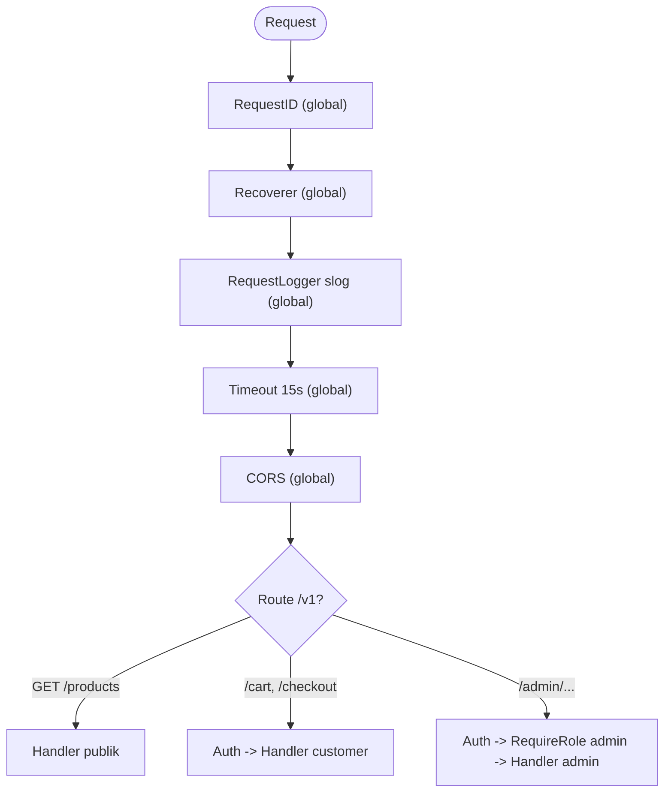

import { Section, Box, Steps, Step, Recap, CardGrid, Card, Chip, Hero, Compare, FileTree, Endpoint, Def } from "@components";

<Hero eyebrow="Roadmap 2 &middot; Web API" title="Middleware dengan <em>chi</em><br />Request yang Terjaga">
  <p>Logging, recovery, request id, CORS, timeout, dan auth adalah pekerjaan lintas request. Modul ini merangkainya rapi di satu jalur, dengan urutan yang benar dan alasannya.</p>
  <Fragment slot="meta">
    <Chip icon="code">Bahasa: <b>Go 1.26</b></Chip>
    <Chip icon="route">Roadmap 2</Chip>
    <Chip icon="shield">chi v5.3.0</Chip>
    <Chip icon="clock">~65 menit baca</Chip>
  </Fragment>
</Hero>

<Section num="01" id="intro" title="Kenapa Middleware?" sub="Concern lintas request jangan bocor ke handler bisnis">

<p class="lead">Di modul sebelumnya kita merancang envelope response yang konsisten (`data`, `meta`, `error`). Sekarang kita pasang pagar yang melindungi dan mengamati setiap request sebelum ia menyentuh handler domain.</p>

Bayangkan route `POST /v1/checkout`. Handler checkout seharusnya fokus mengubah cart menjadi order dalam satu transaksi, bukan sibuk membuat request id, menulis log, mengecek CORS, memulihkan panic, membaca JWT, dan memasang batas waktu. Semua pekerjaan lintas request itu identik di puluhan endpoint, jadi memindahkannya ke lapisan luar membuat handler tetap ramping dan satu kebijakan berlaku seragam.

<Box variant="bridge" icon="🌉" label="Jembatan: dari app.use() dan Kernel ke chi"><p>Di Express kamu menulis `app.use(authMiddleware)`. Di Laravel kamu mendaftarkan middleware di `Kernel.php` lalu memasangnya per route lewat `->middleware('auth')`. chi punya ide yang sama lewat `r.Use(...)` dan `r.Group(...)`, tetapi bentuknya lebih eksplisit: middleware menerima `next` sebagai `http.Handler`, bukan memanggil callback `next()`.</p></Box>

Dalam proyek skincare, middleware menjaga tiga hal tetap konsisten. Rujukan resmi yang relevan: [net/http](https://pkg.go.dev/net/http), [context](https://pkg.go.dev/context), [chi middleware](https://pkg.go.dev/github.com/go-chi/chi/v5/middleware), dan [go-chi/cors](https://github.com/go-chi/cors).

<CardGrid cols={3}>
  <Card><h4>Observability</h4><p>Setiap request punya id dan satu baris log terstruktur (method, path, status, durasi) yang bisa dilacak ketika customer melaporkan checkout gagal.</p></Card>
  <Card><h4>Safety</h4><p>Panic di handler tidak membuat server crash dan tidak membocorkan stack trace, client tetap menerima `500 internal_error` yang terkendali.</p></Card>
  <Card><h4>Policy</h4><p>Auth, CORS, dan timeout diterapkan di satu tempat dengan satu aturan, bukan disalin dan mudah berbeda di tiap handler.</p></Card>
</CardGrid>

<Def term="middleware"><p>Fungsi pembungkus yang menerima handler berikutnya, mengembalikan handler baru, lalu menyisipkan logika sebelum dan sesudah request diteruskan ke handler di dalamnya.</p></Def>

</Section>

<Section num="02" id="bentuk-middleware" title="Bentuk Middleware di Go" sub="Signature kecil, dampaknya besar">

<p class="lead">Karena seluruh server HTTP Go dibangun di atas satu interface `http.Handler`, bentuk middleware pun sangat sederhana: fungsi yang menerima satu handler dan mengembalikan satu handler.</p>

Signature kanoniknya seperti ini. Inilah tipe yang dipahami `r.Use`, `r.With`, dan `r.Group` di chi.

```go title="internal/middleware/signature.go"
package middleware

import "net/http"

// Middleware membungkus satu http.Handler dan mengembalikan http.Handler baru.
type Middleware func(next http.Handler) http.Handler
```

`http.Handler` adalah interface dengan satu method, `ServeHTTP(w, r)`. Karena `http.HandlerFunc` adalah adapter yang mengubah fungsi biasa menjadi `http.Handler`, sebuah middleware bisa membungkus handler final, satu route group, atau seluruh router. Pola idiomatiknya: kembalikan `http.HandlerFunc` yang menjalankan kode kamu lalu memanggil `next.ServeHTTP(w, r)`.

```go title="internal/middleware/logger_simple.go"
package middleware

import (
	"log/slog"
	"net/http"
	"time"
)

func SimpleLogger(next http.Handler) http.Handler {
	return http.HandlerFunc(func(w http.ResponseWriter, r *http.Request) {
		start := time.Now()

		next.ServeHTTP(w, r) // teruskan ke handler di dalamnya

		slog.Info("request selesai",
			"method", r.Method,
			"path", r.URL.Path,
			"duration", time.Since(start),
		)
	})
}
```

Perhatikan dua bagian penting: kode sebelum `next.ServeHTTP` berjalan saat request masuk, dan kode sesudahnya berjalan saat response sudah pulang. Middleware yang butuh konfigurasi (misalnya durasi timeout atau daftar origin) ditulis sebagai fungsi yang mengembalikan middleware, sehingga config tertangkap di closure.

```go title="internal/middleware/header.go"
package middleware

import "net/http"

// SetHeader menerima konfigurasi, lalu mengembalikan middleware.
func SetHeader(key, value string) func(http.Handler) http.Handler {
	return func(next http.Handler) http.Handler {
		return http.HandlerFunc(func(w http.ResponseWriter, r *http.Request) {
			w.Header().Set(key, value)
			next.ServeHTTP(w, r)
		})
	}
}
```

<Compare aLabel="Express.js: (req, res, next)" bLabel="Go: func(http.Handler) http.Handler" aTone="muted" bTone="violet">
  <Fragment slot="a"><ul><li>`req`, `res`, dan `next` masuk sebagai parameter fungsi.</li><li>Lanjut dengan memanggil `next()`, lupa memanggilnya membuat request menggantung.</li><li>Error async perlu pola khusus (`next(err)`) agar tidak hilang.</li></ul></Fragment>
  <Fragment slot="b"><ul><li>`next` adalah `http.Handler` utuh yang kamu bungkus.</li><li>Lanjut dengan `next.ServeHTTP(w, r)`, kamu mengontrol kapan ia dipanggil.</li><li>Kode sebelum dan sesudah handler ditulis di satu fungsi, terbaca berurutan.</li></ul></Fragment>
</Compare>

<Box variant="tip" icon="💡" label="Idiom yang dipakai semua middleware chi"><p>Middleware tanpa config ditulis langsung sebagai `func(next http.Handler) http.Handler` (contoh: `chimw.RequestID`). Middleware dengan config ditulis sebagai fungsi yang mengembalikan bentuk itu (contoh: `chimw.Timeout(10*time.Second)`). Keduanya pas dipasang di `r.Use(...)`.</p></Box>

</Section>

<Section num="03" id="alur-chain" title="Model Onion: Cara Chain Bekerja" sub="Request masuk dari luar, handler berjalan di inti, response keluar terbalik">

<p class="lead">Middleware chain bekerja seperti lapisan bawang. Request menembus lapisan luar menuju inti (handler), lalu response keluar melewati lapisan yang sama dalam urutan terbalik.</p>

Pemahaman ini wajib karena menentukan dua hal sekaligus: siapa yang melihat request lebih dulu, dan siapa yang bisa menangkap apa yang terjadi setelah handler selesai (status code, durasi, atau panic). Middleware yang dipasang lebih awal (`r.Use` pertama) adalah lapisan paling luar.

```mermaid
flowchart LR
  REQ([Request]) --> RID
  subgraph Onion["Middleware chain (model onion)"]
    direction LR
    RID["RequestID<br/>(luar)"] --> REC["Recoverer"]
    REC --> LOG["Logger"]
    LOG --> TO["Timeout"]
    TO --> CORS["CORS"]
    CORS --> AUTH["Auth<br/>(per-group)"]
  end
  AUTH --> H["Handler domain<br/>(inti)"]
  H -. response balik .-> CORS
  CORS -. .-> TO
  TO -. .-> LOG
  LOG -. .-> REC
  REC -. .-> RID
  RID --> RES([Response])
```

<p class="fig-cap"><b>Gambar 1.</b> Garis tegas = arah request masuk. Garis putus = response keluar melewati middleware secara terbalik. Logger menulis log di jalur keluar karena baru di situ status dan durasi diketahui.</p>

Untuk membuktikan urutan masuk dan keluar tidak simetris, pasang dua middleware bernomor lalu amati log-nya.

```go title="internal/middleware/trace.go"
package middleware

import (
	"log/slog"
	"net/http"
)

func Trace(label string) func(http.Handler) http.Handler {
	return func(next http.Handler) http.Handler {
		return http.HandlerFunc(func(w http.ResponseWriter, r *http.Request) {
			slog.Info("masuk", "mw", label)
			next.ServeHTTP(w, r)
			slog.Info("keluar", "mw", label)
		})
	}
}

// r.Use(Trace("A")) lalu r.Use(Trace("B")) menghasilkan urutan:
// masuk A, masuk B, [handler], keluar B, keluar A
```

<Box variant="analogy" icon="🧅" label="Analogi: checkpoint gudang skincare"><p>Request seperti paket masuk gudang. Di pintu pertama diberi nomor tracking (RequestID), dijaga petugas keamanan (Recoverer), dicatat di buku (Logger), diberi batas waktu antar (Timeout), dicek aturan lintas-gedung (CORS), lalu dicek kartu akses (Auth) sebelum sampai ke rak produk atau meja checkout. Saat paket keluar, ia melewati pos yang sama dengan urutan terbalik, dan petugas catat (Logger) baru tahu paket sukses atau gagal di titik itu.</p></Box>

<Box variant="warn" icon="⚠️" label="Lapisan luar tidak otomatis lihat hasil handler"><p>Jika sebuah middleware ingin tahu status code atau ukuran body response (seperti logger), ia harus membungkus `http.ResponseWriter`. Tanpa itu, ia hanya tahu request masuk, bukan hasil akhirnya. Kita pakai `middleware.WrapResponseWriter` untuk ini di Section logging.</p></Box>

</Section>

<Section num="04" id="bawaan-chi" title="Middleware Bawaan chi" sub="Baterai yang sudah disertakan di subpackage middleware">

<p class="lead">Subpackage `github.com/go-chi/chi/v5/middleware` (kita beri alias `chimw`) berisi middleware production-ready yang menutup sebagian besar kebutuhan dasar tanpa dependency tambahan.</p>

Kita import chi dan subpackage middleware-nya seperti ini. Versi yang dipakai modul ini adalah chi v5.3.0.

```go title="internal/router/router.go"
package router

import (
	"net/http"

	"github.com/go-chi/chi/v5"
	chimw "github.com/go-chi/chi/v5/middleware"
)

func NewBasicRouter() http.Handler {
	r := chi.NewRouter()

	r.Use(chimw.RequestID) // ID unik per request, masuk ke context
	r.Use(chimw.Recoverer) // tangkap panic, balas 500
	r.Use(chimw.Logger)    // log bawaan, kita ganti slog nanti

	r.Get("/healthz", func(w http.ResponseWriter, r *http.Request) {
		w.WriteHeader(http.StatusOK)
		_, _ = w.Write([]byte("ok"))
	})

	return r
}
```

<CardGrid cols={2}>
  <Card><h4>`RequestID`</h4><p>Menaruh id unik di context dan header `X-Request-Id`. Ambil lewat `chimw.GetReqID(ctx)`.</p></Card>
  <Card><h4>`Recoverer`</h4><p>Menangkap panic dari lapisan di bawahnya, mencetak stack ke log, lalu membalas `500` alih-alih membuat server mati.</p></Card>
  <Card><h4>`Logger`</h4><p>Log request bawaan untuk fase belajar. Untuk production kita ganti dengan logger slog terstruktur.</p></Card>
  <Card><h4>`Timeout(d)`</h4><p>Memberi deadline pada `r.Context()`. Pekerjaan di bawahnya harus menghormati `ctx.Done()`.</p></Card>
  <Card><h4>`Heartbeat("/ping")`</h4><p>Membalas `200` cepat di path tertentu untuk health check load balancer, tanpa menyentuh router utama.</p></Card>
  <Card><h4>`CleanPath`</h4><p>Menormalkan path ganda seperti `/v1//products` menjadi `/v1/products` sebelum routing.</p></Card>
  <Card><h4>`StripSlashes`</h4><p>Membuang trailing slash agar `/v1/products/` dan `/v1/products` diperlakukan sama.</p></Card>
  <Card><h4>`GetReqID(ctx)`</h4><p>Helper membaca request id dari context, dipakai handler dan logger untuk korelasi log.</p></Card>
</CardGrid>

`RequestID` adalah contoh paling jelas kenapa context berguna. ID dibuat sekali di lapisan terluar, lalu handler mana pun bisa membacanya untuk mengisi log atau membalas ke client agar gampang dilacak ke server.

```go title="internal/health/handler.go"
package health

import (
	"net/http"

	chimw "github.com/go-chi/chi/v5/middleware"

	"github.com/kamu/skincare-backend/internal/httpx"
)

type Response struct {
	Status    string `json:"status"`
	RequestID string `json:"request_id"`
}

func Health(w http.ResponseWriter, r *http.Request) {
	httpx.Data(w, http.StatusOK, Response{
		Status:    "ok",
		RequestID: chimw.GetReqID(r.Context()),
	})
}
```

<Box variant="note" icon="🧭" label="Pilih secukupnya"><p>`CleanPath` dan `StripSlashes` praktis tapi mengubah path yang dilihat client. Pasang hanya bila kamu memang ingin URL toleran. Untuk API yang ketat, biarkan path apa adanya dan kembalikan `404` agar kontrak jelas.</p></Box>

</Section>

<Section num="05" id="logging-slog" title="Structured Logging dengan slog" sub="Satu baris log per request: method, path, status, durasi, request_id">

<p class="lead">Logger bawaan chi enak dibaca manusia, tetapi sistem observability lebih suka log terstruktur. Kita tulis logger sendiri dengan `log/slog` agar tiap field bisa di-query.</p>

Masalahnya: logger ada di lapisan luar, sedangkan status code baru ditentukan handler di inti. Untuk menangkap status dan jumlah byte yang ditulis, kita bungkus `http.ResponseWriter` dengan `middleware.WrapResponseWriter`, yang menyediakan `Status()` dan `BytesWritten()` setelah handler selesai.

```go title="internal/middleware/logging.go"
package middleware

import (
	"log/slog"
	"net/http"
	"time"

	chimw "github.com/go-chi/chi/v5/middleware"
)

// RequestLogger menulis satu baris log terstruktur per request setelah handler selesai.
func RequestLogger(logger *slog.Logger) func(http.Handler) http.Handler {
	return func(next http.Handler) http.Handler {
		return http.HandlerFunc(func(w http.ResponseWriter, r *http.Request) {
			start := time.Now()

			// Bungkus writer agar bisa membaca status & byte setelah handler jalan.
			ww := chimw.NewWrapResponseWriter(w, r.ProtoMajor)

			next.ServeHTTP(ww, r) // handler menulis ke ww, bukan w

			logger.LogAttrs(r.Context(), slog.LevelInfo, "http request",
				slog.String("method", r.Method),
				slog.String("path", r.URL.Path),
				slog.Int("status", ww.Status()),
				slog.Int("bytes", ww.BytesWritten()),
				slog.Duration("duration", time.Since(start)),
				slog.String("request_id", chimw.GetReqID(r.Context())),
			)
		})
	}
}
```

<Box variant="warn" icon="⚠️" label="Wajib teruskan ww, bukan w"><p>Setelah membungkus, semua lapisan di bawah harus memakai `ww`. Jika kamu memanggil `next.ServeHTTP(w, r)` (writer asli), `ww.Status()` akan tetap `0` karena handler menulis ke writer yang lain. Ini penyebab umum log status selalu kosong.</p></Box>

Saat aplikasi start, kita siapkan satu `*slog.Logger` JSON dan suntikkan ke middleware. Di production, output JSON gampang diserap oleh CloudWatch, Loki, atau Datadog.

```go title="cmd/api/main.go"
package main

import (
	"log/slog"
	"net/http"
	"os"

	"github.com/kamu/skincare-backend/internal/router"
)

func main() {
	logger := slog.New(slog.NewJSONHandler(os.Stdout, &slog.HandlerOptions{
		Level: slog.LevelInfo,
	}))
	slog.SetDefault(logger)

	handler := router.New(router.Deps{Logger: logger})

	logger.Info("server listening", "addr", ":8080")
	if err := http.ListenAndServe(":8080", handler); err != nil {
		logger.Error("server stopped", "error", err)
		os.Exit(1)
	}
}
```

<Box variant="bridge" icon="🌉" label="Jembatan: dari pino/winston dan Monolog"><p>Logger JSON slog setara dengan pino di Node atau Monolog di Laravel: satu event = satu baris JSON dengan field terstruktur. Bedanya, slog ada di standard library Go (`log/slog`, stabil sejak Go 1.21), jadi tidak ada dependency tambahan untuk mulai.</p></Box>

<Box variant="tip" icon="💡" label="Bedakan log akses dan log error"><p>Logger request di atas mencatat semua request (log akses). Untuk error bisnis, handler tetap menulis log sendiri dengan konteks lebih kaya (mis. `order_id`) memakai `request_id` yang sama, sehingga satu kejadian bisa dirangkai dari beberapa baris log.</p></Box>

</Section>

<Section num="06" id="recovery" title="Recovery yang Membalas JSON" sub="Panic tetap jadi 500 yang rapi, sesuai envelope httpx">

<p class="lead">`chimw.Recoverer` menyelamatkan server dari panic, tetapi response default-nya bukan JSON envelope kita. Untuk API yang konsisten, kita tulis recoverer sendiri yang membalas `500 internal_error` lewat `httpx.Error`.</p>

Di Go, panic yang tidak ditangani akan menjalar naik dan, di server HTTP, default-nya membuat goroutine request mati dengan response yang setengah jadi. Recoverer memasang `defer recover()` di lapisan luar agar panic dari handler mana pun tertangkap, dicatat lengkap dengan stack untuk debugging, lalu dibalas sebagai error terkendali tanpa membocorkan detail internal ke client.

```go title="internal/middleware/recovery.go"
package middleware

import (
	"log/slog"
	"net/http"
	"runtime/debug"

	chimw "github.com/go-chi/chi/v5/middleware"

	"github.com/kamu/skincare-backend/internal/httpx"
)

// Recoverer menangkap panic, mencatat stack, lalu membalas 500 envelope httpx.
func Recoverer(logger *slog.Logger) func(http.Handler) http.Handler {
	return func(next http.Handler) http.Handler {
		return http.HandlerFunc(func(w http.ResponseWriter, r *http.Request) {
			defer func() {
				if rec := recover(); rec != nil {
					// http.ErrAbortHandler sengaja dipakai untuk memutus koneksi,
					// jangan ditelan: lempar lagi agar server menanganinya.
					if rec == http.ErrAbortHandler {
						panic(rec)
					}

					logger.LogAttrs(r.Context(), slog.LevelError, "panic dipulihkan",
						slog.Any("recover", rec),
						slog.String("request_id", chimw.GetReqID(r.Context())),
						slog.String("stack", string(debug.Stack())),
					)

					httpx.Error(w, http.StatusInternalServerError,
						"internal_error", "Terjadi kesalahan di server.")
				}
			}()

			next.ServeHTTP(w, r)
		})
	}
}
```

<Box variant="warn" icon="⚠️" label="Recovery bukan pengganti error handling"><p>Recoverer adalah pagar terakhir untuk bug yang tidak disengaja (nil dereference, index out of range), bukan cara normal menangani kesalahan. Handler bisnis tetap wajib mengembalikan error sebagai nilai dan membalas kode yang tepat (`404 not_found`, `422 validation_error`, dan seterusnya).</p></Box>

<Box variant="note" icon="📝" label="Kenapa tidak membocorkan stack ke client"><p>Stack trace dan pesan panic sering memuat path file, query, atau detail internal. Itu berharga di log server, berbahaya bila dikirim ke client. Pola kita: detail lengkap ke `logger`, pesan aman dan generik ke `httpx.Error`.</p></Box>

Jika kamu cukup dengan recoverer bawaan tetapi ingin response JSON, alternatif ringkasnya adalah memasang `chimw.Recoverer` lalu menimpa `chimw.SetRecoverErrorWriter`. Tetapi untuk proyek ini recoverer kustom di atas lebih lurus karena langsung memakai `httpx.Error`, jadi format error panic identik dengan error lain di API.

</Section>

<Section num="07" id="cors" title="CORS untuk Frontend React" sub="Aturan browser, bukan fitur auth backend">

<p class="lead">CORS menentukan apakah browser mengizinkan JavaScript di satu origin membaca response dari origin lain. Ini murni kebijakan browser, bukan lapisan keamanan server.</p>

Saat React berjalan di `http://localhost:5173` dan API di `http://localhost:8080`, origin keduanya berbeda. Untuk request tertentu (misalnya yang membawa header `Authorization` atau `Content-Type: application/json`), browser mengirim preflight `OPTIONS` lebih dulu untuk menanyakan apakah request asli boleh dilakukan. Kita pakai library resmi `github.com/go-chi/cors` versi v1.2.2 yang menangani preflight, header izin, dan kredensial.

```go title="internal/router/cors.go"
package router

import (
	"net/http"
	"time"

	"github.com/go-chi/cors"
)

// corsOptions: origin React lokal dan domain produksi.
func corsMiddleware() func(http.Handler) http.Handler {
	return cors.Handler(cors.Options{
		AllowedOrigins: []string{
			"http://localhost:5173",      // React dev (Vite)
			"https://app.skincare.example", // frontend produksi
		},
		AllowedMethods:   []string{"GET", "POST", "PUT", "PATCH", "DELETE", "OPTIONS"},
		AllowedHeaders:   []string{"Accept", "Authorization", "Content-Type", "X-Request-Id"},
		ExposedHeaders:   []string{"X-Request-Id"},
		AllowCredentials: false, // true hanya bila pakai cookie, lihat catatan
		MaxAge:           300,   // cache preflight 5 menit
	})
}
```

<Endpoint method="OPTIONS" path="/v1/cart" desc="Preflight otomatis dari browser sebelum request membawa header Authorization" />
<Endpoint method="GET" path="/v1/cart" desc="Request asli, baru berjalan setelah preflight dijawab dengan header izin yang cocok" />

<Box variant="bridge" icon="🌉" label="Jembatan: error CORS di Network tab"><p>Di React, error CORS muncul seperti kegagalan `fetch` padahal server mungkin membalas `200`. Yang terjadi: browser memblokir JavaScript membaca response karena header izin tidak cocok. Server tetap menerima request, jadi CORS sama sekali bukan jaminan keamanan.</p></Box>

<Box variant="warn" icon="⚠️" label="Wildcard origin dan credentials tidak bisa bersama"><p>Jangan pakai `AllowedOrigins: ["*"]` untuk API yang membawa identitas. Bila `AllowCredentials: true` (mengirim cookie atau kredensial), spec CORS melarang origin wildcard, browser akan menolak. Sebut origin secara eksplisit. Karena auth kita pakai bearer token di header (bukan cookie), `AllowCredentials` biasanya tetap `false`.</p></Box>

<Box variant="note" icon="📝" label="CORS bukan security boundary"><p>cURL, mobile app, Postman, atau service lain tidak menjalankan aturan CORS, jadi mereka tetap bisa memanggil API. Authentication dan authorization (Section auth dan modul r2c07) tetap wajib, terlepas dari CORS.</p></Box>

</Section>

<Section num="08" id="client-ip" title="Client IP: RealIP Sudah Usang" sub="middleware.RealIP rentan spoofing, pakai resolver eksplisit">

<p class="lead">Untuk rate limiting dan audit log, kamu sering butuh IP client. Dulu jawabannya `middleware.RealIP`, tetapi kini middleware itu deprecated karena rentan IP spoofing.</p>

`middleware.RealIP` membaca header seperti `X-Forwarded-For` lalu memutasi `r.RemoteAddr`. Masalahnya, header itu bisa dipalsukan oleh client kecuali kamu benar-benar di belakang proxy tepercaya yang menimpanya. Karena memercayai input client secara buta, ia ditandai sebagai kerentanan (GHSA-3fxj-6jh8-hvhx, severity Critical). RealIP masih ada demi kompatibilitas, tetapi jangan ajarkan atau pakai sebagai default.

<Compare aLabel="middleware.RealIP (deprecated)" bLabel="Resolver IP eksplisit" aTone="red" bTone="teal">
  <Fragment slot="a"><ul><li>Memutasi `r.RemoteAddr` dari header client.</li><li>Memercayai `X-Forwarded-For` walau tanpa proxy tepercaya.</li><li>Bisa dipalsukan, sehingga rate limit dan audit bisa diakali.</li></ul></Fragment>
  <Fragment slot="b"><ul><li>Kamu pilih resolver sesuai topologi: langsung atau di belakang proxy.</li><li>Hanya percaya header bila proxy hop-nya terverifikasi.</li><li>IP dibaca lewat `GetClientIP(ctx)`, `r.RemoteAddr` tidak dimutasi.</li></ul></Fragment>
</Compare>

Pilih resolver sesuai cara server di-deploy, lalu baca hasilnya dari context.

```go title="internal/router/client_ip.go"
package router

import (
	"net/http"

	chimw "github.com/go-chi/chi/v5/middleware"
)

// Pilih SATU sesuai infrastruktur:
//
//   Terhubung langsung ke internet (tanpa proxy):
//     r.Use(chimw.ClientIPFromRemoteAddr)
//
//   Di belakang 1 proxy/ALB tepercaya:
//     r.Use(chimw.ClientIPFromXFFTrustedProxies(1))
//
//   Di belakang proxy dengan prefix IP yang diketahui:
//     r.Use(chimw.ClientIPFromXFF("10.0.0.0/8"))
//
//   Header khusus dari CDN tepercaya (mis. True-Client-IP):
//     r.Use(chimw.ClientIPFromHeader("True-Client-IP"))

func clientIP(r *http.Request) string {
	return chimw.GetClientIP(r.Context())
}
```

<Box variant="warn" icon="⚠️" label="Pilih sesuai topologi, jangan menebak"><p>Di lokal atau VM yang langsung menerima koneksi, pakai `ClientIPFromRemoteAddr`. Di AWS di belakang ALB (Roadmap 8), pakai `ClientIPFromXFFTrustedProxies(n)` dengan `n` = jumlah proxy hop tepercaya. Salah hitung hop membuka celah spoofing lagi.</p></Box>

<Box variant="note" icon="📝" label="GetClientIP vs GetClientIPAddr"><p>`GetClientIP(ctx)` mengembalikan `string`, praktis untuk log dan key rate limit. `GetClientIPAddr(ctx)` mengembalikan `netip.Addr` bila kamu butuh membandingkan CIDR atau memvalidasi bentuk IP secara tipe.</p></Box>

</Section>

<Section num="09" id="auth-context" title="Bentuk Auth Middleware dan Context" sub="Verifikasi token sekali, bawa user ke handler lewat context">

<p class="lead">Auth middleware membaca bearer token dari header, memverifikasinya, lalu menaruh identitas user di request context. Modul ini menunjukkan bentuk-nya, detail JWT lengkap menyusul di r2c07.</p>

Polanya: di lapisan auth, ekstrak token dari `Authorization: Bearer ...`, verifikasi, lalu simpan hasilnya di context memakai key bertipe unexported agar tidak bentrok dengan package lain. Gagal verifikasi berarti `401 unauthorized` lewat envelope `httpx`. Verifikasi JWT konkret (HS256, secret dari env, cek exp) datang di r2c07, jadi di sini kita pisahkan lewat interface kecil agar handler tidak peduli cara token dibaca.

```go title="internal/auth/context.go"
package auth

import "context"

// ctxKey unexported: tidak ada package lain yang bisa membuat key ini,
// jadi value di context aman dari tabrakan.
type ctxKey int

const userKey ctxKey = 0

// Claims adalah bentuk final di r2c07 (UserID, Role, jwt.RegisteredClaims).
// Di modul ini cukup ringkas untuk menunjukkan alurnya.
type Claims struct {
	UserID int64  `json:"uid"`
	Role   string `json:"role"`
}

// UserFrom membaca claims dari context. Handler memakai ini, bukan ctx.Value langsung.
func UserFrom(ctx context.Context) (*Claims, bool) {
	c, ok := ctx.Value(userKey).(*Claims)
	return c, ok
}

func withUser(ctx context.Context, c *Claims) context.Context {
	return context.WithValue(ctx, userKey, c)
}
```

```go title="internal/auth/middleware.go"
package auth

import (
	"context"
	"net/http"
	"strings"

	"github.com/kamu/skincare-backend/internal/httpx"
)

// Verifier diimplementasikan oleh JWT verifier konkret di r2c07.
type Verifier interface {
	Verify(token string) (*Claims, error)
}

// Middleware mengekstrak bearer token, verifikasi, lalu set claims di context.
func Middleware(v Verifier) func(http.Handler) http.Handler {
	return func(next http.Handler) http.Handler {
		return http.HandlerFunc(func(w http.ResponseWriter, r *http.Request) {
			token, ok := bearerToken(r.Header.Get("Authorization"))
			if !ok {
				httpx.Error(w, http.StatusUnauthorized,
					"unauthorized", "Bearer token wajib disertakan.")
				return
			}

			claims, err := v.Verify(token)
			if err != nil {
				httpx.Error(w, http.StatusUnauthorized,
					"unauthorized", "Token tidak valid atau sudah kedaluwarsa.")
				return
			}

			ctx := withUser(r.Context(), claims)
			next.ServeHTTP(w, r.WithContext(ctx))
		})
	}
}

func bearerToken(header string) (string, bool) {
	const prefix = "Bearer "
	if !strings.HasPrefix(header, prefix) {
		return "", false
	}
	token := strings.TrimSpace(strings.TrimPrefix(header, prefix))
	return token, token != ""
}

var _ context.Context // jaga import context tetap dipakai lewat helper context.go
```

Handler yang butuh user login mengambilnya lewat `auth.UserFrom`, bukan menebak isi context.

```go title="internal/cart/handler.go"
package cart

import (
	"net/http"

	"github.com/kamu/skincare-backend/internal/auth"
	"github.com/kamu/skincare-backend/internal/httpx"
)

type Handler struct {
	service Service
}

func (h *Handler) GetCart(w http.ResponseWriter, r *http.Request) {
	user, ok := auth.UserFrom(r.Context())
	if !ok {
		// Tidak seharusnya terjadi bila route dilindungi auth middleware.
		httpx.Error(w, http.StatusUnauthorized, "unauthorized", "Tidak ada sesi.")
		return
	}

	cart, err := h.service.GetCart(r.Context(), user.UserID)
	if err != nil {
		httpx.Error(w, http.StatusInternalServerError, "internal_error", "Gagal memuat cart.")
		return
	}

	httpx.Data(w, http.StatusOK, cart)
}
```

<Box variant="warn" icon="⚠️" label="Context key wajib bertipe unexported"><p>Jangan pakai `string` biasa sebagai context key (mis. `"user"`). Dua package bisa memilih string yang sama dan saling menimpa. Tipe `ctxKey int` yang unexported memastikan hanya package `auth` yang bisa menulis dan membaca slot tersebut.</p></Box>

<Box variant="note" icon="📝" label="Context untuk data request-scoped saja"><p>Gunakan context untuk data per request seperti claims user dan request id. Jangan menyelipkan dependency besar (pool database, service, config) ke context, itu membuat dependency tersembunyi dan sulit dilacak. Dependency disuntikkan lewat struct handler, seperti `Handler.service` di atas.</p></Box>

Role-based access (mis. route admin) mengikuti pola yang sama: middleware `RequireRole("admin")` membaca claims dari context, lalu membalas `403 forbidden` bila peran tidak cocok. Bentuk lengkapnya dibahas di r2c07.

</Section>

<Section num="10" id="timeout" title="Timeout, Cancellation, dan Rate Limit" sub="Request lambat berhenti rapi, request berlebihan ditahan">

<p class="lead">Timeout middleware memberi deadline pada context request. Tetapi deadline hanya berguna jika kode di bawahnya benar-benar memeriksa sinyal pembatalan.</p>

`chimw.Timeout(d)` memasang deadline pada `r.Context()`. Saat waktu habis, `ctx.Done()` ditutup dan handler bisa berhenti lebih awal. Yang krusial: timeout tidak menghentikan kode secara paksa. Goroutine handler hanya berhenti bila kamu memeriksa `ctx` atau meneruskannya ke operasi yang menghormati context (query database, HTTP call keluar).

```go title="internal/router/timeout_demo.go"
package router

import (
	"net/http"
	"time"

	chimw "github.com/go-chi/chi/v5/middleware"
	"github.com/go-chi/chi/v5"
)

func mountTimeoutDemo(r chi.Router) {
	r.Use(chimw.Timeout(10 * time.Second))

	r.Get("/v1/admin/search/rebuild", func(w http.ResponseWriter, r *http.Request) {
		ctx := r.Context()

		select {
		case <-ctx.Done():
			// Client membatalkan atau timeout tercapai. Berhenti, jangan tulis response.
			return
		case <-time.After(2 * time.Second):
			w.WriteHeader(http.StatusAccepted)
			_, _ = w.Write([]byte("dijadwalkan"))
		}
	})
}
```

Pola ini makin penting di Roadmap 3 saat query memakai `ctx`. Repository pgx menerima context sebagai parameter pertama, sehingga timeout di middleware otomatis membatalkan query yang menggantung.

```go title="internal/product/repository.go"
package product

import (
	"context"

	"github.com/jackc/pgx/v5/pgxpool"
)

type Repository struct {
	pool *pgxpool.Pool
}

func (r *Repository) CountActive(ctx context.Context) (int64, error) {
	const query = `select count(*) from products where status = 'active'`

	var total int64
	if err := r.pool.QueryRow(ctx, query).Scan(&total); err != nil {
		return 0, err // termasuk context.DeadlineExceeded saat timeout
	}
	return total, nil
}
```

<Box variant="bridge" icon="🌉" label="Jembatan: dari AbortController ke context.Context"><p>Di JavaScript kamu membatalkan `fetch` dengan `AbortController`. Di Go, sinyal pembatalan dibawa `context.Context` yang mengalir dari middleware ke handler ke service ke repository. Satu deadline di lapisan luar otomatis membatalkan seluruh pekerjaan di bawahnya, asalkan ctx diteruskan.</p></Box>

<Box variant="note" icon="🧭" label="middleware.Timeout vs http.TimeoutHandler"><p>`chimw.Timeout` membatalkan context dan mengandalkan handler berhenti sukarela. `http.TimeoutHandler` (standard library) lebih keras: ia membungkus response writer, dan bila deadline lewat ia menulis `503` sendiri serta mengabaikan tulisan handler yang terlambat. Untuk batas keras di tepi server, `http.TimeoutHandler` lebih aman. Untuk membatalkan kerja downstream lewat context, `chimw.Timeout` lebih tepat. Keduanya bisa dipakai bersama.</p></Box>

<h3>Rate limiting</h3>

Rate limiting menahan client yang mengirim terlalu banyak request dalam jangka waktu tertentu, melindungi API dari abuse dan lonjakan tak wajar (mis. brute force login). Idenya: hitung request per key (biasanya IP atau user id) dalam window waktu, dan tolak dengan `429 Too Many Requests` saat batas terlampaui.

Implementasi siap pakai ada di `github.com/go-chi/httprate`. Karena key sering memakai IP, ia memanfaatkan resolver client IP dari Section 08, bukan `RealIP` yang usang.

```go title="internal/router/ratelimit.go"
package router

import (
	"net/http"
	"time"

	"github.com/go-chi/chi/v5"
	"github.com/go-chi/httprate"
)

func mountAuthRateLimit(r chi.Router) {
	// Maksimal 20 percobaan login per IP per menit.
	r.Use(httprate.LimitByIP(20, time.Minute))

	r.Post("/v1/auth/login", loginHandler)
}
```

<Box variant="warn" icon="⚠️" label="Rate limit in-memory tidak berbagi antar instance"><p>`httprate` default menyimpan hitungan di memori satu proses. Saat API di-scale ke beberapa instance di belakang load balancer, tiap instance menghitung sendiri, sehingga batas efektif jadi kelipatan jumlah instance. Untuk batas global, pakai backend bersama seperti Redis. Konsep ini dibahas lebih dalam di Roadmap 9.</p></Box>

</Section>

<Section num="11" id="urutan-middleware" title="Urutan Middleware dan Alasannya" sub="Middleware yang benar tapi salah urutan tetap menyulitkan">

<p class="lead">Urutan menentukan siapa melihat request lebih dulu dan siapa bisa menangkap error dari lapisan bawah. Berikut urutan yang dipakai skincare API beserta alasannya.</p>

<Steps>
  <Step><b>RequestID paling awal</b><p>ID dibuat sebelum log dan error apa pun, sehingga semua middleware dan log setelahnya berbagi id yang sama dan bisa dikorelasikan.</p></Step>
  <Step><b>Recoverer cukup luar</b><p>Dipasang dekat luar agar menangkap panic dari logger, timeout, auth, sampai handler. Tetap di dalam RequestID supaya log panic membawa request id.</p></Step>
  <Step><b>Logger setelah Recoverer</b><p>Logger membungkus response writer, jadi ia melihat status akhir, termasuk 500 yang dihasilkan recoverer di dalamnya.</p></Step>
  <Step><b>Timeout sebelum kerja mahal</b><p>Memberi deadline pada context sebelum request masuk ke handler, service, dan query yang berpotensi lambat.</p></Step>
  <Step><b>CORS sebelum route domain</b><p>Preflight OPTIONS dari browser harus dijawab di top-level, sebelum tersaring route auth atau route sempit yang tidak punya handler OPTIONS.</p></Step>
  <Step><b>Auth per-group, dekat handler</b><p>Hanya route privat yang butuh token. Endpoint publik (katalog, health) tidak boleh dipaksa login, jadi auth dipasang di dalam `r.Group`, bukan global.</p></Step>
</Steps>

Inilah router lengkap yang merangkai semuanya, memakai middleware kustom kita (logger slog, recoverer JSON, auth) dan bawaan chi. Perhatikan auth berada di dalam `r.Group`, bukan di `r.Use` global.

```go title="internal/router/router.go"
package router

import (
	"log/slog"
	"net/http"
	"time"

	"github.com/go-chi/chi/v5"
	chimw "github.com/go-chi/chi/v5/middleware"

	"github.com/kamu/skincare-backend/internal/auth"
	mw "github.com/kamu/skincare-backend/internal/middleware"
)

// Deps adalah dependency yang disuntikkan dari main.
type Deps struct {
	Logger   *slog.Logger
	Verifier auth.Verifier
	Products ProductHandler
	Cart     CartHandler
	Orders   OrderHandler
	Admin    AdminHandler
}

func New(d Deps) http.Handler {
	r := chi.NewRouter()

	// Global: berlaku untuk semua request, dari luar ke dalam.
	r.Use(chimw.RequestID)            // 1. id unik dulu
	r.Use(mw.Recoverer(d.Logger))     // 2. pagar panic -> 500 internal_error
	r.Use(mw.RequestLogger(d.Logger)) // 3. log akses terstruktur
	r.Use(chimw.Timeout(15 * time.Second)) // 4. deadline context
	r.Use(corsMiddleware())           // 5. CORS sebelum route

	r.Get("/healthz", health)

	r.Route("/v1", func(r chi.Router) {
		// Publik: katalog dan auth endpoint, tanpa login.
		r.Get("/products", d.Products.List)
		r.Get("/products/{id}", d.Products.Get)

		// Privat customer: butuh bearer token.
		r.Group(func(r chi.Router) {
			r.Use(auth.Middleware(d.Verifier))

			r.Get("/cart", d.Cart.Get)
			r.Post("/cart/items", d.Cart.AddItem)
			r.Post("/checkout", d.Orders.Checkout)
			r.Get("/orders", d.Orders.List)
		})

		// Admin: butuh login + peran admin.
		r.Group(func(r chi.Router) {
			r.Use(auth.Middleware(d.Verifier))
			r.Use(auth.RequireRole("admin"))

			r.Post("/admin/products", d.Admin.CreateProduct)
			r.Put("/admin/products/{id}", d.Admin.UpdateProduct)
			r.Delete("/admin/products/{id}", d.Admin.DeleteProduct)
		})
	})

	return r
}

func health(w http.ResponseWriter, r *http.Request) {
	w.WriteHeader(http.StatusOK)
	_, _ = w.Write([]byte("ok"))
}
```



<p class="fig-cap"><b>Gambar 2.</b> Middleware global berlaku untuk semua request. Auth dan RequireRole hanya menempel di group yang membutuhkannya, sehingga katalog publik tetap bebas token.</p>

<Box variant="tip" icon="💡" label="Global untuk yang selalu berlaku, group untuk yang kondisional"><p>Pasang di `r.Use` global hanya concern yang berlaku untuk semua request (id, recovery, log, timeout, CORS). Concern yang bergantung route (auth customer, auth admin, rate limit login) dipasang dengan `r.Group` atau `r.With` agar tidak bocor ke endpoint yang tidak membutuhkannya.</p></Box>

</Section>

<Section num="12" id="struktur-hands-on" title="Struktur Proyek dan Hands-on" sub="Middleware dekat router, lalu uji dari terminal">

<p class="lead">Middleware adalah infrastruktur HTTP, jadi tempatnya di lapisan transport, dekat router, bukan di package domain seperti `product` atau `cart`.</p>

<FileTree title="Struktur middleware, router, dan domain" tree={`
cmd/
  api/
    main.go                 # entry point: siapkan slog, panggil router.New
internal/
  httpx/
    response.go             # envelope Data/List/Error (dari r2c04)
  middleware/
    logging.go              # RequestLogger slog + WrapResponseWriter
    recovery.go             # Recoverer JSON -> 500 internal_error
  router/
    router.go               # rangkai chi router + middleware chain
    cors.go                 # konfigurasi go-chi/cors
  auth/
    context.go              # ctxKey + UserFrom
    middleware.go           # ekstrak bearer, set claims (detail di r2c07)
  product/
    handler.go              # endpoint katalog publik
  cart/
    handler.go              # endpoint cart privat
  order/
    handler.go              # checkout + riwayat order privat
go.mod                      # module github.com/kamu/skincare-backend, go 1.26
`} />

Endpoint yang dijaga middleware terlihat seperti ini: publik bebas token, privat butuh bearer, admin butuh peran.

<Endpoint method="GET" path="/healthz" desc="Publik, tanpa auth, untuk load balancer dan monitoring" />
<Endpoint method="GET" path="/v1/products" desc="Publik, katalog skincare yang bisa dilihat semua pengunjung" />
<Endpoint method="GET" path="/v1/cart" desc="Privat, butuh bearer token customer" />
<Endpoint method="POST" path="/v1/checkout" desc="Privat, mengubah cart menjadi order dalam satu transaksi" />
<Endpoint method="POST" path="/v1/admin/products" desc="Admin, butuh login dan peran admin" />

Sekarang pasang dependency dan jalankan latihan kecil: router dengan request id, recovery, logger slog, timeout, CORS, dan satu route privat dengan verifier dummy.

<Steps>
  <Step><b>Pasang dependency</b><p>Tambahkan chi v5, go-chi/cors, dan (opsional) go-chi/httprate ke module.</p></Step>
  <Step><b>Rangkai router</b><p>Salin pola `router.go`, pasang middleware global lalu group privat dengan auth.</p></Step>
  <Step><b>Buat verifier dummy</b><p>Untuk latihan, terima token `dev-token` sebelum diganti JWT sungguhan di r2c07.</p></Step>
  <Step><b>Uji publik dan privat</b><p>Pastikan route privat membalas 401 tanpa token dan 200 dengan token valid.</p></Step>
</Steps>

```bash title="Terminal"
go get github.com/go-chi/chi/v5@v5.3.0
go get github.com/go-chi/cors@v1.2.2
go get github.com/go-chi/httprate
go run ./cmd/api
```

```go title="internal/auth/dev_verifier.go"
package auth

import "errors"

// DevVerifier hanya untuk latihan modul ini. Diganti JWT verifier di r2c07.
type DevVerifier struct{}

func (DevVerifier) Verify(token string) (*Claims, error) {
	if token != "dev-token" {
		return nil, errors.New("token dev tidak valid")
	}
	return &Claims{UserID: 1001, Role: "customer"}, nil
}
```

```bash title="Terminal"
curl -i http://localhost:8080/healthz
curl -i http://localhost:8080/v1/cart
curl -i -H "Authorization: Bearer dev-token" http://localhost:8080/v1/cart
```

<Box variant="tip" icon="💡" label="Amati log dan status"><p>Tiap request mencetak satu baris JSON dengan `method`, `path`, `status`, `duration`, dan `request_id`. Bandingkan: `GET /v1/cart` tanpa token membalas `401` dengan body envelope `{"error":{"code":"unauthorized",...}}`, dengan `dev-token` membalas `200`. Itulah seluruh alur middleware bekerja.</p></Box>

</Section>

<Section num="13" id="jebakan-umum" title="Jebakan Umum dari JS/PHP" sub="Bug kecil di middleware terasa seperti masalah misterius di frontend">

<p class="lead">Middleware berada di jalur semua request, jadi satu kesalahan kecil bisa memengaruhi seluruh API sekaligus.</p>

<CardGrid cols={2}>
  <Card><h4>Lupa memanggil `next`</h4><p>Tanpa `next.ServeHTTP(w, r)`, request berhenti di middleware itu dan client menunggu sia-sia.</p></Card>
  <Card><h4>Lupa `return` setelah error</h4><p>Setelah `httpx.Error`, segera `return`. Tanpa itu, handler lanjut dan menulis response kedua.</p></Card>
  <Card><h4>Logger tidak membungkus writer</h4><p>Memanggil `next.ServeHTTP(w, r)` alih-alih `ww` membuat `ww.Status()` selalu 0. Teruskan `ww`.</p></Card>
  <Card><h4>Auth dipasang global</h4><p>Auth di `r.Use` global membuat `/healthz` dan `/v1/products` ikut menuntut token. Pasang di group.</p></Card>
  <Card><h4>CORS di group sempit</h4><p>Preflight OPTIONS gagal karena group tidak punya handler OPTIONS. Pasang CORS di top-level.</p></Card>
  <Card><h4>Context key bertipe string</h4><p>String key bisa bentrok antar package. Pakai tipe `ctxKey int` unexported.</p></Card>
  <Card><h4>Mengandalkan `RealIP`</h4><p>Deprecated dan bisa di-spoof. Pakai resolver `ClientIPFromXFFTrustedProxies` sesuai topologi.</p></Card>
  <Card><h4>Timeout tanpa cek `ctx`</h4><p>Deadline tidak menghentikan kode yang tidak memeriksa `ctx.Done()` atau tidak meneruskan ctx.</p></Card>
</CardGrid>

<Box variant="warn" icon="⚠️" label="Jebakan dari dunia Express"><p>Di Express, kamu memanggil `next()` lalu error ditangani middleware error terpisah. Di Go, alur itu kamu bentuk sendiri dengan `next.ServeHTTP`, `return`, dan response writer eksplisit. Tidak ada error-handling middleware ajaib, recoverer hanya menangkap panic, bukan error nilai biasa.</p></Box>

<Box variant="bridge" icon="🌉" label="Jembatan: Laravel middleware vs chi"><p>Di Laravel, middleware punya method `handle($request, Closure $next)` dan kamu memanggil `$next($request)`. Di chi, padanannya `next.ServeHTTP(w, r)`. Kode sebelum panggilan itu = logika pre-request, kode sesudahnya = logika post-response, persis seperti yang ditulis setelah `$next($request)` di Laravel.</p></Box>

</Section>

<Section num="14" id="ringkasan" title="Ringkasan & Poin Penting">

<p class="lead">Sekarang API skincare punya pagar produksi dasar: setiap request diberi id, dilindungi dari panic, dicatat terstruktur, dibatasi waktu, dan dilindungi auth pada route yang tepat.</p>

<Recap title="Yang Wajib Menempel"><ul><li>Middleware Go berbentuk `func(next http.Handler) http.Handler`, meneruskan request dengan `next.ServeHTTP(w, r)`. Middleware berconfig ditulis sebagai fungsi yang mengembalikan bentuk itu.</li><li>Chain bekerja seperti onion: yang dipasang lebih awal adalah lapisan terluar, response keluar melewati middleware dalam urutan terbalik.</li><li>chi menyediakan `RequestID`, `Recoverer`, `Logger`, `Timeout`, `Heartbeat`, `CleanPath`, dan `StripSlashes` siap pakai di subpackage `chimw`.</li><li>Logger slog membungkus response writer dengan `WrapResponseWriter` agar bisa mencatat status, byte, durasi, dan `request_id` dalam satu baris JSON.</li><li>Recoverer kustom membalas `500 internal_error` lewat `httpx.Error`, mencatat stack ke log server tanpa membocorkannya ke client.</li><li>CORS adalah aturan browser via `go-chi/cors`, bukan pengganti auth. Wildcard origin tidak bisa dipakai bersama credentials.</li><li>`middleware.RealIP` sudah deprecated (rentan spoofing). Pakai `ClientIPFromXFFTrustedProxies` sesuai topologi, baca via `GetClientIP(ctx)`.</li><li>Auth middleware memverifikasi token sekali, menaruh `*Claims` di context lewat key unexported, dibaca handler via `auth.UserFrom(ctx)`. Detail JWT di r2c07.</li><li>Timeout bekerja lewat `context.Context`, jadi ctx wajib diteruskan ke service dan repository. Rate limiting konsepnya via `go-chi/httprate`.</li><li>Urutan: RequestID, Recoverer, Logger, Timeout, CORS sebagai global, lalu Auth dan RequireRole hanya di group route privat.</li></ul></Recap>

Untuk proyek online shop skincare, modul ini mengubah API dari sekadar endpoint menjadi layanan yang bisa diamati dan dijaga. Katalog tetap publik, sedangkan cart, checkout, order, dan admin terlindung auth. Di modul berikutnya (r2c06) kita memperketat gerbang input dengan validasi per field yang menghasilkan `httpx.ValidationFailed`, lalu r2c07 mengganti verifier dummy dengan JWT sungguhan dan menambah RequireRole untuk admin.

</Section>
