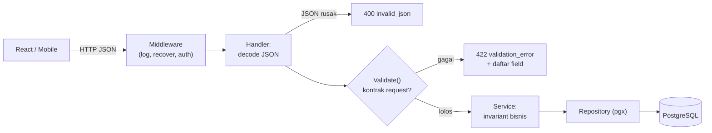

import { Section, Box, Steps, Step, Recap, CardGrid, Card, Chip, Hero, Compare, FileTree, Endpoint, Def } from "@components";

<Hero eyebrow="Roadmap 2 &middot; Web API" title="Validasi Input <em>API</em><br />Gerbang Sebelum Business Logic">
  <p>Di modul ini kita membangun validasi request yang eksplisit, per field, dan konsisten untuk backend online shop skincare, memakai envelope error yang sudah kita rancang di modul Desain Request &amp; Response.</p>
  <Fragment slot="meta">
    <Chip icon="code">Bahasa: <b>Go 1.26</b></Chip>
    <Chip icon="shield">Validasi <b>input</b></Chip>
    <Chip icon="clock">~60 menit baca</Chip>
  </Fragment>
</Hero>

<Section num="01" id="intro" title="Validasi sebagai Gerbang API" sub="Pintu pertama sebelum request menyentuh service dan database">

<p class="lead">Validasi input adalah gerbang pertama: ia memutuskan request mana yang boleh lewat ke business logic, dan request mana yang ditolak sopan dengan pesan yang bisa dipahami client.</p>

Kalau kamu pernah memakai [Zod](https://zod.dev) atau class-validator di React, atau Form Request di Laravel, kamu sudah punya model mental yang benar: ada satu lapisan yang memeriksa bentuk data sebelum kode bisnis menyentuhnya. Di Go dengan [net/http](https://pkg.go.dev/net/http) dan chi, pola paling jelas adalah decode JSON di handler, validasi DTO request, lalu baru panggil service.

<Def term="validasi input"><p>Proses memastikan payload request memenuhi kontrak API: field wajib terisi, string tidak melewati batas panjang, email masuk akal, harga lebih dari nol, dan quantity minimal satu, sebelum data dipercaya oleh kode bisnis.</p></Def>

Validasi bukan sekadar urusan pengalaman frontend. Untuk backend, ia mengecilkan permukaan serangan, mencegah data sampah masuk ke service, dan memberi respons error yang konsisten agar React app atau client mobile bisa menandai field mana yang salah.

<Box variant="bridge" icon="🌉" label="Jembatan: dari Form Request Laravel & Zod ke method Validate()"><p>Di Laravel, aturan hidup di Form Request (`rules()` mengembalikan map field ke aturan). Di React, schema Zod seperti `z.object({ price: z.number().positive() })` memvalidasi sebelum submit. Di Go, kita menaruh aturan itu di method `Validate()` pada DTO request, dan handler memanggilnya tepat setelah decode JSON, sebelum service.</p></Box>

Sepanjang modul ini kita memakai endpoint domain skincare yang sama yang sudah muncul di modul routing dan response.

<Endpoint method="POST" path="/v1/admin/products" desc="Admin membuat produk skincare baru" />
<Endpoint method="POST" path="/v1/auth/register" desc="Registrasi customer dengan email dan password" />
<Endpoint method="POST" path="/v1/cart/items" desc="Customer menambah produk ke keranjang" />
<Endpoint method="POST" path="/v1/checkout" desc="Mengubah keranjang menjadi order dalam satu transaksi" />



<p class="fig-cap"><b>Gambar 1.</b> Validasi adalah gerbang antara dunia luar dan business logic. Hanya request yang lolos kontrak yang sampai ke service.</p>

</Section>

<Section num="02" id="handler-layer" title="Kenapa Validasi di Handler?" sub="Handler adalah batas kontrak HTTP, bukan tempat business rule">

<p class="lead">Handler adalah batas terluar kontrak HTTP, jadi handler yang bertanggung jawab membaca payload dan menolak request yang bentuknya tidak valid.</p>

Ada dua jenis pemeriksaan yang sering tertukar. Validasi request memastikan payload cocok dengan kontrak API: field ada, tipe benar, panjang masuk akal, angka di rentang yang sah. Validasi domain memastikan aturan bisnis tetap benar di semua jalur masuk, termasuk worker, CLI, import CSV, atau event consumer yang tidak lewat HTTP sama sekali.

<Compare aLabel="React / Laravel" bLabel="Go Web API" aTone="muted" bTone="violet">
  <Fragment slot="a"><ul><li>Validasi form React melindungi UX, tetapi gampang dilewati dengan curl atau Postman.</li><li>Form Request Laravel berdiri sebelum controller untuk menolak input buruk.</li><li>Sering tergoda mencampur aturan UI dan aturan bisnis dalam satu tempat.</li></ul></Fragment>
  <Fragment slot="b"><ul><li>Handler: decode JSON, validasi request DTO, baru panggil service.</li><li>Service: jaga invariant bisnis (stok cukup, produk aktif, voucher sah) yang tak bergantung HTTP.</li><li>Database: constraint terakhir (unique slug, stock CHECK &gt;= 0, foreign key).</li></ul></Fragment>
</Compare>

Pembagian tanggung jawab yang sehat membuat tiap lapisan punya satu pekerjaan, sehingga gampang dites dan tidak saling membocorkan detail.

<CardGrid cols={3}>
  <Card><h4>Handler</h4><p>`name` wajib, `price` lebih dari nol, `email` format masuk akal, `quantity` minimal satu. Berhenti di bentuk dan rentang.</p></Card>
  <Card><h4>Service</h4><p>Produk aktif, stok cukup saat checkout, user boleh memesan, total dihitung dari harga server bukan dari client.</p></Card>
  <Card><h4>Database</h4><p>Constraint keras: unique `slug`, `CHECK (stock >= 0)`, foreign key item ke produk. Benteng terakhir jika lapisan lain bolong.</p></Card>
</CardGrid>

<Box variant="warn" icon="⚠️" label="Jangan salah lapisan"><p>Jangan menaruh `json.Decode`, status code, atau bentuk payload error di service. Service yang ikut tahu HTTP jadi sulit dipakai ulang dari worker dan sulit dites tanpa membuat `httptest`. Sebaliknya, jangan menaruh aturan bisnis (stok, harga voucher) di handler, karena worker dan event consumer tidak lewat handler.</p></Box>

<Box variant="tip" icon="💡" label="Aturan praktis"><p>Pertanyaan pembeda: apakah aturan ini benar untuk SEMUA jalur masuk data, atau hanya untuk request HTTP ini? Kalau untuk semua jalur, ia milik service atau database. Kalau hanya soal bentuk payload HTTP, ia milik handler.</p></Box>

</Section>

<Section num="03" id="required-zero-value" title="Required Field dan Jebakan Zero Value" sub="Go tidak punya undefined, jadi field hilang menjadi zero value">

<p class="lead">Go tidak punya `undefined`. Saat field tidak dikirim client, struct DTO tetap terisi, hanya saja dengan zero value tipenya.</p>

Saat `json.NewDecoder(r.Body).Decode(&req)` mengisi struct, field yang absen dari JSON tidak memunculkan error. `string` jadi `""`, `int`/`int64` jadi `0`, `bool` jadi `false`, pointer dan slice jadi `nil`. Decode hanya gagal jika JSON-nya benar-benar rusak atau tipenya tidak cocok, bukan karena field hilang.

<Def term="zero value"><p>Nilai default otomatis tiap tipe Go saat variabel dibuat tanpa nilai eksplisit: `0` untuk angka, `""` untuk string, `false` untuk bool, `nil` untuk pointer, slice, dan map. Tidak ada `undefined` di Go.</p></Def>

<Box variant="bridge" icon="🌉" label="Jembatan: undefined / null JS vs zero value Go"><p>Di JS kamu bisa membedakan `undefined`, `null`, dan `""`. Di Go, untuk field non-pointer, ketiga keadaan itu runtuh jadi satu nilai default. `{"name":""}`, `{"name":null}`, dan body tanpa `name` semuanya menghasilkan `req.Name == ""`. Itu sebabnya required harus dicek eksplisit, bukan diandaikan dari hasil decode.</p></Box>

Untuk required field, cek zero value yang tidak masuk akal bagi domain. Nama produk tidak boleh string kosong. Harga tidak boleh nol. Quantity tidak boleh nol, karena menambahkan nol item ke keranjang tidak punya arti.

```go title="internal/product/dto.go"
package product

// PriceRupiah disimpan integer (tanpa float) dengan JSON tag price,
// konsisten dengan seluruh modul Go Artisan.
type CreateProductRequest struct {
	Name        string `json:"name"`
	Slug        string `json:"slug"`
	Category    string `json:"category"`
	PriceRupiah int64  `json:"price"`
	Stock       int    `json:"stock"`
	Description string `json:"description"`
}
```

<Box variant="tip" icon="💡" label="Trim dulu, baru cek required"><p>Pakai `strings.TrimSpace` sebelum mengecek required string. Tanpa itu, payload `{"name":"   "}` lolos karena secara teknis bukan string kosong, padahal jelas tidak valid.</p></Box>

<Box variant="warn" icon="⚠️" label="Zero value yang sah vs tidak sah"><p>Hati-hati: untuk `Stock`, nilai `0` itu SAH (produk bisa habis). Untuk `PriceRupiah`, nilai `0` TIDAK sah. Jadi aturan required tidak selalu berarti bukan-nol. Pikirkan per field: mana nilai nol yang valid, mana yang harus ditolak.</p></Box>

</Section>

<Section num="04" id="pointer-patch" title="Absen vs Nol: Pointer untuk Field Opsional" sub="Membedakan field yang tidak dikirim dari field yang dikirim bernilai nol">

<p class="lead">Untuk endpoint PATCH dan field opsional, kamu perlu membedakan field yang absen dari field yang dikirim bernilai nol. Di sinilah pointer di DTO jadi penting.</p>

Bayangkan endpoint `PATCH /v1/admin/products/{id}` untuk update sebagian. Client hanya mengirim field yang ingin diubah. Jika `Stock` bertipe `int`, kamu tidak bisa membedakan "client tidak menyentuh stok" dari "client mau set stok jadi 0". Keduanya tampak sebagai `0`.

<Box variant="bridge" icon="🌉" label="Jembatan: optional di TypeScript vs pointer di Go"><p>Di TypeScript kamu menulis `stock?: number`, dan field absen menjadi `undefined`, beda dari `0`. Di Go, padanannya adalah pointer: `*int`. Field yang absen tetap `nil`, sedangkan field yang dikirim (termasuk `0`) menunjuk ke nilai konkret. Pointer mengembalikan kemampuan membedakan "absen" dari "nol" yang hilang pada tipe nilai biasa.</p></Box>

```go title="internal/product/dto.go"
// PATCH: semua field opsional. nil berarti "jangan ubah".
type UpdateProductRequest struct {
	Name        *string `json:"name"`
	PriceRupiah *int64  `json:"price"`
	Stock       *int    `json:"stock"`
	Status      *string `json:"status"`
}
```

Setelah decode, `nil` berarti field tidak dikirim, jadi lewati. Pointer yang terisi berarti client memang mengirim nilai itu, jadi validasi dan terapkan, termasuk saat nilainya nol.

```go title="internal/product/dto.go"
func (r UpdateProductRequest) Validate() []httpx.FieldError {
	var fields []httpx.FieldError

	// Hanya validasi field yang benar-benar dikirim.
	if r.Name != nil && strings.TrimSpace(*r.Name) == "" {
		fields = append(fields, httpx.FieldError{Field: "name", Message: "nama tidak boleh kosong"})
	}
	if r.PriceRupiah != nil && *r.PriceRupiah <= 0 {
		fields = append(fields, httpx.FieldError{Field: "price", Message: "harga harus lebih dari 0"})
	}
	if r.Stock != nil && *r.Stock < 0 {
		// *r.Stock == 0 di sini SAH dan ikut tervalidasi, bukan dilewati.
		fields = append(fields, httpx.FieldError{Field: "stock", Message: "stok tidak boleh negatif"})
	}
	if r.Status != nil && *r.Status != "active" && *r.Status != "archived" {
		fields = append(fields, httpx.FieldError{Field: "status", Message: "status harus active atau archived"})
	}

	return fields
}
```

<Box variant="note" icon="📝" label="Pointer hanya saat perlu"><p>Jangan jadikan semua field pointer. Untuk endpoint POST (create) yang field-nya wajib, tipe nilai biasa lebih simpel dan lebih aman. Pointer dipakai hanya saat kamu benar-benar perlu membedakan absen dari nol, yaitu PATCH dan field opsional sejati.</p></Box>

<Box variant="warn" icon="⚠️" label="json:omitempty bukan alat validasi"><p>`omitempty` hanya memengaruhi encoding (output), yaitu menghilangkan field bernilai zero saat menulis JSON. Ia tidak punya efek apa pun saat decode dan tidak membuat field jadi required. Required tetap dicek manual di `Validate()`.</p></Box>

</Section>

<Section num="05" id="string-email-phone" title="String, Email, dan Nomor Telepon" sub="Byte vs karakter, dan kapan regex itu jebakan">

<p class="lead">Validasi string di Go menuntut kamu sadar perbedaan byte dan karakter. Salah satu, batas panjang jadi keliru untuk teks non-ASCII.</p>

`len(s)` menghitung byte, bukan jumlah karakter manusia. String UTF-8 seperti emoji atau aksara non-Latin memakai lebih dari satu byte per karakter. Untuk membatasi nama produk, alamat, atau nama penerima dalam satuan karakter, pakai [utf8.RuneCountInString](https://pkg.go.dev/unicode/utf8#RuneCountInString).

```go title="rune-vs-byte.go"
package main

import (
	"fmt"
	"unicode/utf8"
)

func main() {
	name := "Serum Cerah ✨"

	fmt.Println(len(name))                    // 14 byte (emoji 4 byte)
	fmt.Println(utf8.RuneCountInString(name)) // 12 karakter
}
```

<Box variant="bridge" icon="🌉" label="Jembatan: string.length JS vs len(s) Go"><p>Di JavaScript, `"abc".length` menghitung unit UTF-16, dekat dengan jumlah karakter untuk teks umum. Di Go, `len(s)` menghitung byte UTF-8 mentah. Untuk batas panjang yang dirasakan user (maksimal 120 karakter nama produk), `utf8.RuneCountInString` adalah padanan yang benar, bukan `len`.</p></Box>

Untuk email, jangan menulis regex sendiri. Standard library punya [net/mail.ParseAddress](https://pkg.go.dev/net/mail#ParseAddress) yang mengikuti aturan RFC 5322 dan menangani kasus aneh jauh lebih baik daripada regex buatan tangan.

```go title="email-check.go"
import "net/mail"

func validEmail(value string) bool {
	addr, err := mail.ParseAddress(value)
	// ParseAddress menerima format "Nama <a@b.com>" juga, maka kita
	// pastikan input murni alamat dengan membandingkan addr.Address.
	return err == nil && addr.Address == value
}
```

<Box variant="warn" icon="⚠️" label="ParseAddress menerima nama tampilan"><p>`mail.ParseAddress("Budi &lt;budi@toko.id&gt;")` lolos tanpa error karena format itu sah secara RFC. Untuk kolom email murni, bandingkan `addr.Address == value` agar `"Budi &lt;budi@toko.id&gt;"` ditolak dan hanya `"budi@toko.id"` yang diterima.</p></Box>

Nomor telepon paling sering bikin validasi salah, karena tiap negara punya format berbeda. Untuk online shop skincare di Indonesia, aturan yang masuk akal: hanya angka (setelah membuang spasi, tanda hubung, dan kurung), boleh diawali `+62`, `62`, atau `0`, lalu dinormalkan ke format yang konsisten sebelum disimpan.

```go title="phone-id.go"
import (
	"regexp"
	"strings"
)

// Buang pemisah yang umum diketik user.
var phoneSeparators = strings.NewReplacer(" ", "", "-", "", "(", "", ")", "")

// Hanya digit setelah normalisasi prefix.
var idDigits = regexp.MustCompile(`^[0-9]{9,13}$`)

// normalizePhoneID mengubah +62, 62, atau 0 di depan menjadi "0",
// lalu memastikan sisanya digit dengan panjang masuk akal untuk Indonesia.
func normalizePhoneID(raw string) (string, bool) {
	s := phoneSeparators.Replace(strings.TrimSpace(raw))
	switch {
	case strings.HasPrefix(s, "+62"):
		s = "0" + s[3:]
	case strings.HasPrefix(s, "62"):
		s = "0" + s[2:]
	}
	if !strings.HasPrefix(s, "0") || !idDigits.MatchString(s) {
		return "", false
	}
	return s, true
}
```

<Box variant="note" icon="📝" label="Validasi format bukan verifikasi kepemilikan"><p>Lolos format hanya berarti angkanya terlihat seperti nomor Indonesia, bukan bahwa nomor itu aktif dan milik si pengirim. Verifikasi sungguhan (OTP SMS, konfirmasi email) adalah langkah terpisah di luar validasi handler. Validasi handler cukup menyaring input yang jelas salah bentuk.</p></Box>

</Section>

<Section num="06" id="numeric-domain" title="Angka dan Aturan Domain" sub="Angka yang lolos decode belum tentu masuk akal untuk bisnis">

<p class="lead">Decode JSON hanya memastikan `123` adalah angka. Apakah `123` masuk akal sebagai harga, stok, atau quantity, itu aturan domain yang harus kamu tegakkan sendiri.</p>

Untuk online shop skincare, angka tampak sederhana tetapi membawa makna bisnis. Harga harus lebih dari nol. Quantity keranjang minimal satu. Stok tidak boleh negatif. Diskon persen ada di rentang nol sampai seratus.

<CardGrid cols={2}>
  <Card><h4>Create product</h4><p>`price` lebih dari 0, `stock` minimal 0, `slug` dan `category` wajib, `name` maksimal 120 karakter.</p></Card>
  <Card><h4>Add to cart</h4><p>`product_id` wajib dan lebih dari 0, `quantity` antara 1 sampai batas wajar (misalnya 99) per item.</p></Card>
  <Card><h4>Checkout</h4><p>Minimal satu item, tiap item quantity minimal 1, alamat kirim tidak kosong, email valid.</p></Card>
  <Card><h4>Registration</h4><p>Email valid, password minimal 8 karakter (rune), nama tidak kosong.</p></Card>
</CardGrid>

<Box variant="warn" icon="⚠️" label="Uang adalah integer, bukan float"><p>Rupiah tidak punya pecahan sen yang dipakai sehari-hari, jadi `PriceRupiah` adalah `int64` (nilai `189000` berarti Rp 189.000). Menghindari `float64` untuk uang adalah praktik standar agar tidak ada galat pembulatan. Validasi `price` cukup mengecek `> 0` sebagai `int64`, tanpa pusing soal presisi desimal.</p></Box>

<Box variant="bridge" icon="🌉" label="Jembatan: batas atas quantity"><p>Di frontend kamu sering membatasi quantity lewat stepper `max`. Di backend, batas itu tetap harus ditegakkan: tanpa batas atas, client nakal bisa mengirim `quantity: 1000000` dan membuat perhitungan total atau cadangan stok jadi aneh. Tetapkan rentang `1..99` per item di handler, dan biarkan service mengecek apakah stok sungguhan mencukupi.</p></Box>

</Section>

<Section num="07" id="validation-error-response" title="Format Validation Error" sub="Reuse envelope httpx.ValidationFailed dari modul Response">

<p class="lead">Client butuh error yang stabil dan terstruktur agar bisa menandai field yang salah, bukan sekadar string "request tidak valid".</p>

Di modul Desain Request &amp; Response kita sudah mendefinisikan envelope kanonik di package `internal/httpx`. Modul validasi ini tidak membuat format baru, ia memakai ulang yang sudah ada. Hasil validasi adalah `[]httpx.FieldError`, dan kita kirim lewat `httpx.ValidationFailed`.

```go title="internal/httpx/response.go (sudah ada dari modul Response)"
package httpx

import (
	"encoding/json"
	"net/http"
)

// FieldError menggambarkan satu field yang gagal validasi.
type FieldError struct {
	Field   string `json:"field"`
	Message string `json:"message"`
}

// JSON adalah encoder low-level: set header, status, lalu tulis body.
func JSON(w http.ResponseWriter, status int, payload any) {
	w.Header().Set("Content-Type", "application/json")
	w.WriteHeader(status)
	_ = json.NewEncoder(w).Encode(payload)
}

// Error membungkus error tunggal: {"error": {"code": ..., "message": ...}}.
func Error(w http.ResponseWriter, status int, code, message string) {
	JSON(w, status, map[string]any{
		"error": map[string]any{"code": code, "message": message},
	})
}

// ValidationFailed selalu HTTP 422 dengan code validation_error dan daftar field.
func ValidationFailed(w http.ResponseWriter, fields []FieldError) {
	JSON(w, http.StatusUnprocessableEntity, map[string]any{
		"error": map[string]any{
			"code":    "validation_error",
			"message": "Validasi gagal",
			"fields":  fields,
		},
	})
}
```

Bentuk JSON yang dilihat frontend persis seperti kontrak envelope: code `snake_case` yang stabil, pesan umum untuk manusia, dan daftar `fields` yang bisa dipetakan ke input form.

```json title="response 422"
{
  "error": {
    "code": "validation_error",
    "message": "Validasi gagal",
    "fields": [
      { "field": "name", "message": "nama produk wajib diisi" },
      { "field": "price", "message": "harga harus lebih dari 0" }
    ]
  }
}
```

<Box variant="tip" icon="💡" label="Pakai nama JSON, bukan nama struct Go"><p>Isi `field` harus memakai nama JSON (`price`), bukan nama field Go (`PriceRupiah`). Frontend memetakan pesan ke input berdasarkan key JSON yang ia kirim, jadi ketidakcocokan nama membuat pesan error nyangkut di field yang salah.</p></Box>

<Box variant="note" icon="📝" label="400 vs 422"><p>Pisahkan dua kegagalan. JSON yang tidak bisa di-decode (rusak, tipe salah) adalah `400 invalid_json`, karena request-nya saja tidak terbaca. JSON yang terbaca tetapi melanggar aturan adalah `422 validation_error`. Pemisahan ini membantu client membedakan bug serialisasi dari input user yang salah.</p></Box>

</Section>

<Section num="08" id="reusable-validate" title="Validator Reusable yang Eksplisit" sub="Helper kecil yang mengisi []httpx.FieldError">

<p class="lead">Validasi yang rapi dibuat kecil, eksplisit, dan bisa dipakai ulang banyak DTO. Kita kumpulkan helper di package `httpx` agar tiap `Validate()` tinggal merangkainya.</p>

Setiap helper menerima pointer ke slice `[]httpx.FieldError`, lalu menambah entri saat aturan dilanggar. Pola "kumpulkan semua error lalu kembalikan sekaligus" lebih ramah daripada berhenti di error pertama, karena user melihat seluruh masalah dalam satu kali submit.

```go title="internal/httpx/validate.go"
package httpx

import (
	"fmt"
	"net/mail"
	"strings"
	"unicode/utf8"
)

// Required menambah error bila string kosong (setelah trim).
func Required(fields *[]FieldError, name, value string) {
	if strings.TrimSpace(value) == "" {
		*fields = append(*fields, FieldError{Field: name, Message: name + " wajib diisi"})
	}
}

// MaxRunes membatasi panjang dalam satuan karakter, bukan byte.
func MaxRunes(fields *[]FieldError, name, value string, max int) {
	if utf8.RuneCountInString(value) > max {
		*fields = append(*fields, FieldError{
			Field:   name,
			Message: fmt.Sprintf("%s maksimal %d karakter", name, max),
		})
	}
}

// MinRunes berguna untuk password dan teks minimum.
func MinRunes(fields *[]FieldError, name, value string, min int) {
	if utf8.RuneCountInString(value) < min {
		*fields = append(*fields, FieldError{
			Field:   name,
			Message: fmt.Sprintf("%s minimal %d karakter", name, min),
		})
	}
}

// PositiveInt64 untuk harga: harus lebih dari nol.
func PositiveInt64(fields *[]FieldError, name string, value int64) {
	if value <= 0 {
		*fields = append(*fields, FieldError{Field: name, Message: name + " harus lebih dari 0"})
	}
}

// IntInRange untuk quantity, diskon, dan rentang tertutup lain.
func IntInRange(fields *[]FieldError, name string, value, min, max int) {
	if value < min || value > max {
		*fields = append(*fields, FieldError{
			Field:   name,
			Message: fmt.Sprintf("%s harus di antara %d dan %d", name, min, max),
		})
	}
}

// MinInt untuk stok: 0 sah, negatif tidak.
func MinInt(fields *[]FieldError, name string, value, min int) {
	if value < min {
		*fields = append(*fields, FieldError{
			Field:   name,
			Message: fmt.Sprintf("%s minimal %d", name, min),
		})
	}
}

// Email memakai net/mail dan menolak format "Nama <alamat>".
func Email(fields *[]FieldError, name, value string) {
	value = strings.TrimSpace(value)
	if value == "" {
		return // kekosongan diurus oleh Required, bukan di sini
	}
	addr, err := mail.ParseAddress(value)
	if err != nil || addr.Address != value {
		*fields = append(*fields, FieldError{Field: name, Message: name + " harus berupa email valid"})
	}
}
```

<Box variant="tip" icon="💡" label="Satu aturan, satu helper, satu tanggung jawab"><p>`Email` sengaja tidak ikut mengecek required. Kalau `email` boleh kosong di suatu DTO, kamu cukup tidak memanggil `Required`. Memisahkan "wajib ada" dari "kalau ada harus valid" membuat helper bisa dipakai ulang untuk field opsional tanpa duplikasi.</p></Box>

<Box variant="bridge" icon="🌉" label="Jembatan: kenapa pointer ke slice"><p>Di JS kamu akan `errors.push(...)` pada array yang dibagikan lewat closure. Di Go, slice yang di-`append` bisa direlokasi ke array baru, jadi mutasi tidak terlihat di pemanggil kecuali kamu mengoper `*[]FieldError` dan menulis balik lewat `*fields = append(...)`. Itulah kenapa parameternya pointer ke slice, bukan slice biasa.</p></Box>

</Section>

<Section num="09" id="domain-request-validation" title="Validasi Request Domain Skincare" sub="Memasang helper ke DTO produk, registrasi, cart, dan checkout">

<p class="lead">Sekarang kita rangkai helper tadi menjadi method `Validate()` pada tiap DTO, lalu handler memanggilnya tepat setelah decode.</p>

Create product adalah request admin. Validasi menjaga agar produk yang masuk katalog punya nama, slug, kategori, harga, dan stok yang masuk akal.

```go title="internal/product/dto.go"
package product

import (
	"strings"

	"github.com/kamu/skincare-backend/internal/httpx"
)

type CreateProductRequest struct {
	Name        string `json:"name"`
	Slug        string `json:"slug"`
	Category    string `json:"category"`
	PriceRupiah int64  `json:"price"`
	Stock       int    `json:"stock"`
	Description string `json:"description"`
}

func (r CreateProductRequest) Validate() []httpx.FieldError {
	var fields []httpx.FieldError

	httpx.Required(&fields, "name", r.Name)
	httpx.MaxRunes(&fields, "name", r.Name, 120)
	httpx.Required(&fields, "slug", r.Slug)
	httpx.MaxRunes(&fields, "slug", r.Slug, 140)
	httpx.Required(&fields, "category", r.Category)
	httpx.PositiveInt64(&fields, "price", r.PriceRupiah)
	httpx.MinInt(&fields, "stock", r.Stock, 0)
	httpx.MaxRunes(&fields, "description", r.Description, 2000)

	return fields
}
```

Registrasi customer menggabungkan email, password, dan nama. Password divalidasi panjang minimum di sini, lalu di-hash dengan bcrypt di modul Auth (jangan pernah disimpan plaintext).

```go title="internal/auth/dto.go"
package auth

import "github.com/kamu/skincare-backend/internal/httpx"

type RegisterRequest struct {
	Name     string `json:"name"`
	Email    string `json:"email"`
	Password string `json:"password"`
}

func (r RegisterRequest) Validate() []httpx.FieldError {
	var fields []httpx.FieldError

	httpx.Required(&fields, "name", r.Name)
	httpx.MaxRunes(&fields, "name", r.Name, 80)
	httpx.Required(&fields, "email", r.Email)
	httpx.Email(&fields, "email", r.Email)
	httpx.Required(&fields, "password", r.Password)
	httpx.MinRunes(&fields, "password", r.Password, 8)
	httpx.MaxRunes(&fields, "password", r.Password, 72) // batas bcrypt: 72 byte

	return fields
}
```

<Box variant="warn" icon="⚠️" label="bcrypt memotong di 72 byte"><p>`bcrypt` hanya memakai 72 byte pertama dari input. Password lebih panjang dari itu diam-diam terpotong, sehingga dua password berbeda bisa menghasilkan hash sama. Batasi panjang password di validasi (atau pakai pre-hash) agar kejutan ini tidak terjadi. Detail hashing dibahas tuntas di modul Auth.</p></Box>

Add to cart: `product_id` wajib dan positif, `quantity` di rentang wajar.

```go title="internal/cart/dto.go"
package cart

import "github.com/kamu/skincare-backend/internal/httpx"

type AddItemRequest struct {
	ProductID int64 `json:"product_id"`
	Quantity  int   `json:"quantity"`
}

func (r AddItemRequest) Validate() []httpx.FieldError {
	var fields []httpx.FieldError

	httpx.PositiveInt64(&fields, "product_id", r.ProductID)
	httpx.IntInRange(&fields, "quantity", r.Quantity, 1, 99)

	return fields
}
```

Checkout punya aturan terbanyak karena menyentuh email, nomor telepon, alamat, dan daftar item. Alamat kita pisah menjadi sub-struct agar tervalidasi per field.

```go title="internal/checkout/dto.go"
package checkout

import (
	"fmt"
	"strings"

	"github.com/kamu/skincare-backend/internal/httpx"
)

type Address struct {
	Recipient string `json:"recipient"`
	Phone     string `json:"phone"`
	Line      string `json:"line"`
	City      string `json:"city"`
	PostCode  string `json:"post_code"`
}

type CheckoutItem struct {
	ProductID int64 `json:"product_id"`
	Quantity  int   `json:"quantity"`
}

type CheckoutRequest struct {
	Email           string         `json:"email"`
	ShippingAddress Address        `json:"shipping_address"`
	Items           []CheckoutItem `json:"items"`
}

func (r CheckoutRequest) Validate() []httpx.FieldError {
	var fields []httpx.FieldError

	httpx.Required(&fields, "email", r.Email)
	httpx.Email(&fields, "email", r.Email)

	a := r.ShippingAddress
	httpx.Required(&fields, "shipping_address.recipient", a.Recipient)
	httpx.Required(&fields, "shipping_address.line", a.Line)
	httpx.MaxRunes(&fields, "shipping_address.line", a.Line, 400)
	httpx.Required(&fields, "shipping_address.city", a.City)
	if _, ok := normalizePhoneID(a.Phone); !ok {
		fields = append(fields, httpx.FieldError{
			Field:   "shipping_address.phone",
			Message: "nomor telepon harus nomor Indonesia yang valid",
		})
	}

	if len(r.Items) == 0 {
		fields = append(fields, httpx.FieldError{Field: "items", Message: "minimal satu produk"})
	}
	for i, item := range r.Items {
		prefix := fmt.Sprintf("items[%d]", i)
		if item.ProductID <= 0 {
			fields = append(fields, httpx.FieldError{Field: prefix + ".product_id", Message: "product_id wajib diisi"})
		}
		if item.Quantity < 1 || item.Quantity > 99 {
			fields = append(fields, httpx.FieldError{Field: prefix + ".quantity", Message: "quantity harus di antara 1 dan 99"})
		}
	}

	return fields
}

var _ = strings.TrimSpace // normalizePhoneID hidup di file phone helper paket ini
```

Handler tinggal merangkai tiga langkah: decode, validasi, baru service. Perhatikan tiga return berbeda untuk tiga kegagalan berbeda.

```go title="internal/product/handler.go"
package product

import (
	"context"
	"encoding/json"
	"errors"
	"net/http"

	"github.com/kamu/skincare-backend/internal/httpx"
)

type ProductService interface {
	Create(ctx context.Context, in CreateProductRequest) (Product, error)
}

type Handler struct {
	service ProductService
}

func (h *Handler) Create(w http.ResponseWriter, r *http.Request) {
	r.Body = http.MaxBytesReader(w, r.Body, 1<<20) // 1 MB

	var req CreateProductRequest
	if err := json.NewDecoder(r.Body).Decode(&req); err != nil {
		httpx.Error(w, http.StatusBadRequest, "invalid_json", "Body JSON tidak valid")
		return
	}

	if fields := req.Validate(); len(fields) > 0 {
		httpx.ValidationFailed(w, fields) // 422 validation_error
		return
	}

	product, err := h.service.Create(r.Context(), req)
	if err != nil {
		if errors.Is(err, ErrDuplicateSlug) {
			httpx.Error(w, http.StatusConflict, "conflict", "Slug produk sudah dipakai")
			return
		}
		httpx.Error(w, http.StatusInternalServerError, "internal_error", "Gagal membuat produk")
		return
	}

	httpx.Data(w, http.StatusCreated, product)
}
```

<Box variant="note" icon="📝" label="Asumsi modul lain"><p>`httpx.Data`, `httpx.Error`, `httpx.ValidationFailed`, dan `ErrDuplicateSlug` berasal dari modul Response dan service. Repository pgx untuk benar-benar menyimpan produk datang di Roadmap 3. Di sini fokusnya tetap pada gerbang validasi sebelum service.</p></Box>

<Box variant="tip" icon="💡" label="Validasi sebelum service, selalu"><p>Urutan `decode → validate → service` membuat service menerima request yang sudah pasti berbentuk. Service tidak perlu lagi mengecek "apakah name kosong", ia langsung mengurus invariant bisnis. Inilah manfaat menaruh gerbang di tempat yang benar.</p></Box>

</Section>

<Section num="10" id="custom-validation" title="Custom Validation Lintas Field" sub="Aturan yang melibatkan lebih dari satu field sekaligus">

<p class="lead">Sebagian aturan tidak bisa diperiksa satu field saja. Ia butuh melihat beberapa field bersamaan, atau memeriksa nilai terhadap daftar yang sah.</p>

Contoh paling umum: field yang nilainya harus berasal dari himpunan terbatas (enum), dan aturan antar-field seperti "diskon hanya boleh ada jika ada harga". Helper generik tidak cukup, jadi kita tulis logika eksplisit di dalam `Validate()`.

```go title="internal/product/validate_custom.go"
package product

import "github.com/kamu/skincare-backend/internal/httpx"

// Kategori yang diizinkan katalog skincare.
var allowedCategories = map[string]bool{
	"cleanser":    true,
	"serum":       true,
	"moisturizer": true,
	"sunscreen":   true,
	"toner":       true,
}

// inSet adalah custom validation: nilai harus anggota himpunan sah.
func inSet(fields *[]httpx.FieldError, name, value string, allowed map[string]bool) {
	if value != "" && !allowed[value] {
		*fields = append(*fields, httpx.FieldError{
			Field:   name,
			Message: name + " tidak dikenali",
		})
	}
}
```

Aturan lintas field hidup setelah pemeriksaan per field, agar pesan dasar muncul lebih dulu.

```go title="internal/product/dto.go (lanjutan Validate)"
func (r CreateProductRequest) ValidateWithRules() []httpx.FieldError {
	fields := r.Validate() // pemeriksaan dasar dari section sebelumnya

	// Custom: kategori harus salah satu yang dikenali katalog.
	inSet(&fields, "category", r.Category, allowedCategories)

	// Lintas field: produk gratis (price kecil) tidak boleh stok besar
	// tanpa penanda, contoh aturan domain ringan di batas handler.
	if r.PriceRupiah > 0 && r.PriceRupiah < 1000 && r.Stock > 1000 {
		fields = append(fields, httpx.FieldError{
			Field:   "price",
			Message: "harga di bawah Rp 1.000 dengan stok besar perlu konfirmasi admin",
		})
	}

	return fields
}
```

<Box variant="bridge" icon="🌉" label="Jembatan: refine() Zod & after() Laravel"><p>Di Zod kamu memakai `.refine()` atau `.superRefine()` untuk aturan lintas field. Di Laravel ada `after()` pada Form Request. Di Go, tidak ada gula sintaks khusus: kamu menulis `if` biasa di akhir `Validate()`, yang justru membuat aturan rumit lebih mudah dibaca dan dites karena tidak ada lapisan abstraksi yang menyembunyikannya.</p></Box>

<Box variant="warn" icon="⚠️" label="Enum: validasi, jangan asumsi"><p>Jangan andaikan client hanya mengirim kategori yang valid karena dropdown frontend dibatasi. Request bisa datang dari skrip atau Postman. Validasi enum di server, dan idealnya tegakkan juga lewat foreign key atau `CHECK` di database saat masuk Roadmap 3.</p></Box>

</Section>

<Section num="11" id="library-validator" title="Pilihan Library: go-playground/validator" sub="Struct tag yang ringkas, diterjemahkan ke []httpx.FieldError yang sama">

<p class="lead">Validasi manual jernih untuk belajar dan pesan custom. Saat jumlah DTO membengkak, library berbasis struct tag bisa memangkas boilerplate, asalkan kamu tetap mengembalikan format error yang sama.</p>

Library standar de facto adalah [go-playground/validator/v10](https://pkg.go.dev/github.com/go-playground/validator/v10) (versi v10.30.3). Aturan ditulis sebagai struct tag, lalu satu panggilan `validate.Struct(req)` memeriksa semuanya.

```bash title="Terminal"
go get github.com/go-playground/validator/v10@v10.30.3
```

```go title="internal/product/dto_tags.go"
package product

import "github.com/go-playground/validator/v10"

type CreateProductTagged struct {
	Name        string `json:"name" validate:"required,max=120"`
	Slug        string `json:"slug" validate:"required,max=140"`
	Category    string `json:"category" validate:"required,oneof=cleanser serum moisturizer sunscreen toner"`
	PriceRupiah int64  `json:"price" validate:"required,gt=0"`
	Stock       int    `json:"stock" validate:"gte=0"`
	Email       string `json:"email" validate:"omitempty,email"`
}

// validate dibuat sekali dan thread-safe untuk dipakai ulang.
var validate = validator.New(validator.WithRequiredStructEnabled())
```

Kunci agar library tidak merusak kontrak API: terjemahkan `validator.ValidationErrors` ke `[]httpx.FieldError` yang sama, dan gunakan nama JSON sebagai `field`. Daftarkan fungsi nama-tag agar pesan memakai key JSON, bukan nama field Go.

```go title="internal/httpx/validator_bridge.go"
package httpx

import (
	"fmt"
	"reflect"
	"strings"

	"github.com/go-playground/validator/v10"
)

// RegisterJSONNames membuat err.Field() mengembalikan nama JSON tag,
// bukan nama field Go, supaya cocok dengan kontrak frontend.
func RegisterJSONNames(v *validator.Validate) {
	v.RegisterTagNameFunc(func(f reflect.StructField) string {
		name := strings.SplitN(f.Tag.Get("json"), ",", 2)[0]
		if name == "-" {
			return ""
		}
		return name
	})
}

// Translate mengubah error library menjadi []FieldError yang seragam.
func Translate(err error) []FieldError {
	var verrs validator.ValidationErrors
	if err == nil {
		return nil
	}
	// errors.As lebih aman, tetapi untuk ringkas kita type-assert langsung.
	verrs, ok := err.(validator.ValidationErrors)
	if !ok {
		return []FieldError{{Field: "_", Message: "validasi gagal"}}
	}

	fields := make([]FieldError, 0, len(verrs))
	for _, fe := range verrs {
		fields = append(fields, FieldError{
			Field:   fe.Field(), // sudah nama JSON berkat RegisterJSONNames
			Message: messageFor(fe),
		})
	}
	return fields
}

// messageFor memetakan tag ke pesan Bahasa Indonesia yang ramah.
func messageFor(fe validator.FieldError) string {
	switch fe.Tag() {
	case "required":
		return fe.Field() + " wajib diisi"
	case "email":
		return fe.Field() + " harus berupa email valid"
	case "gt":
		return fmt.Sprintf("%s harus lebih dari %s", fe.Field(), fe.Param())
	case "gte":
		return fmt.Sprintf("%s minimal %s", fe.Field(), fe.Param())
	case "max":
		return fmt.Sprintf("%s maksimal %s karakter", fe.Field(), fe.Param())
	case "oneof":
		return fe.Field() + " tidak dikenali"
	default:
		return fe.Field() + " tidak valid"
	}
}
```

Handler memakai library nyaris identik dengan versi manual: panggilan validasi berbeda, tetapi respons error tetap `httpx.ValidationFailed` dengan bentuk yang sama persis.

```go title="internal/product/handler_tagged.go"
func (h *Handler) CreateTagged(w http.ResponseWriter, r *http.Request) {
	var req CreateProductTagged
	if err := json.NewDecoder(r.Body).Decode(&req); err != nil {
		httpx.Error(w, http.StatusBadRequest, "invalid_json", "Body JSON tidak valid")
		return
	}

	if err := validate.Struct(req); err != nil {
		httpx.ValidationFailed(w, httpx.Translate(err))
		return
	}
	// ... lanjut ke service, sama seperti versi manual.
}
```

<Compare aLabel="Manual Validate()" bLabel="go-playground/validator" aTone="teal" bTone="blue">
  <Fragment slot="a"><ul><li>Aturan eksplisit, mudah ditempel pesan Bahasa Indonesia tepat di lokasinya.</li><li>Lebih verbose, tetapi paling jelas untuk aturan domain dan lintas field yang rumit.</li><li>Tanpa dependency tambahan, gampang dites unit.</li></ul></Fragment>
  <Fragment slot="b"><ul><li>Ringkas untuk aturan umum: required, max, email, gt, gte, oneof.</li><li>Butuh lapisan terjemahan agar pesan dan nama field tetap ramah client.</li><li>Aturan kompleks tetap perlu custom validator yang didaftarkan terpisah.</li></ul></Fragment>
</Compare>

<Box variant="tip" icon="💡" label="Pilihan untuk Go Artisan"><p>Mulai dari validasi manual agar kamu paham setiap aturan. Saat DTO bertambah banyak, perkenalkan `validator` untuk aturan generik, tetapi pertahankan `[]httpx.FieldError` dan `httpx.ValidationFailed` sebagai satu-satunya bentuk respons. Frontend tidak perlu tahu library mana yang kamu pakai di dalam.</p></Box>

</Section>

<Section num="12" id="hands-on" title="Hands-on: Tolak Payload Buruk" sub="Kirim input cacat dan amati respons 422 per field">

<p class="lead">Sekarang pasang validasi ke endpoint yang sudah kamu buat di modul routing dan middleware, lalu uji dengan payload yang sengaja salah.</p>

<FileTree title="Tambahan untuk modul ini" tree={`
internal/
  httpx/
    response.go        # sudah ada: JSON, Data, Error, ValidationFailed
    validate.go        # baru: Required, MaxRunes, Email, dst
    validator_bridge.go # opsional: Translate dari go-playground/validator
  product/
    dto.go             # CreateProductRequest + Validate()
    handler.go         # decode -> Validate -> service
  cart/
    dto.go
  checkout/
    dto.go
`} />

<Steps>
  <Step><b>Tambah helper validasi</b><p>Buat `internal/httpx/validate.go` berisi `Required`, `MaxRunes`, `MinRunes`, `PositiveInt64`, `IntInRange`, `MinInt`, dan `Email`.</p></Step>
  <Step><b>Tambah method `Validate()`</b><p>Mulai dari `CreateProductRequest`, lalu `RegisterRequest`, `AddItemRequest`, dan `CheckoutRequest`.</p></Step>
  <Step><b>Panggil dari handler</b><p>Setelah decode sukses, panggil `req.Validate()`. Jika ada field, balas `httpx.ValidationFailed` dan jangan sentuh service.</p></Step>
  <Step><b>Uji dengan curl</b><p>Kirim nama kosong, harga nol, stok negatif, dan email rusak untuk melihat seluruh field error sekaligus.</p></Step>
</Steps>

```bash title="Terminal"
curl -i -X POST http://localhost:8080/v1/admin/products \
  -H 'Content-Type: application/json' \
  -d '{"name":"  ","slug":"","category":"makanan","price":0,"stock":-3}'
```

Respons yang diharapkan adalah `422 Unprocessable Entity` dengan satu entri per aturan yang dilanggar.

```json title="response 422"
{
  "error": {
    "code": "validation_error",
    "message": "Validasi gagal",
    "fields": [
      { "field": "name", "message": "name wajib diisi" },
      { "field": "slug", "message": "slug wajib diisi" },
      { "field": "category", "message": "category tidak dikenali" },
      { "field": "price", "message": "price harus lebih dari 0" },
      { "field": "stock", "message": "stock minimal 0" }
    ]
  }
}
```

Lalu kirim JSON yang rusak (kurung tidak ditutup) untuk membuktikan jalur `400` terpisah dari `422`.

```bash title="Terminal"
curl -i -X POST http://localhost:8080/v1/admin/products \
  -H 'Content-Type: application/json' \
  -d '{"name":"Serum",'
```

```json title="response 400"
{ "error": { "code": "invalid_json", "message": "Body JSON tidak valid" } }
```

<Box variant="note" icon="📝" label="Yang perlu kamu amati"><p>Perhatikan dua hal: status `422` membawa daftar `fields` (bukan satu string), dan JSON rusak menghasilkan `400 invalid_json` yang berbeda. Inilah kontrak yang React app pakai untuk menandai input merah versus menampilkan "ada yang salah dengan request".</p></Box>

</Section>

<Section num="13" id="jebakan" title="Jebakan Umum dari JS/PHP" sub="Kebiasaan lama yang menyamar jadi bug validasi">

<p class="lead">Banyak bug validasi bukan karena Go sulit, melainkan karena kebiasaan dari Express.js atau Laravel terbawa tanpa disesuaikan ke model zero value dan rune.</p>

<CardGrid cols={2}>
  <Card><h4>Mengira field hilang pasti error</h4><p>`encoding/json` tidak error saat field absen. Struct tetap terisi zero value, jadi required dicek manual.</p></Card>
  <Card><h4>Tidak membedakan absen dari nol</h4><p>Untuk PATCH, `int` biasa menyatukan "tidak dikirim" dan "0". Pakai pointer (`*int`) agar keduanya terpisah.</p></Card>
  <Card><h4>Memakai `len` untuk batas karakter</h4><p>`len` menghitung byte. Untuk teks user-facing, pakai `utf8.RuneCountInString`.</p></Card>
  <Card><h4>Menulis regex email sendiri</h4><p>Regex email selalu bocor. Pakai `net/mail.ParseAddress` dan bandingkan `addr.Address` dengan input.</p></Card>
  <Card><h4>Nama field salah di error</h4><p>Pakai nama JSON (`price`), bukan nama Go (`PriceRupiah`), agar frontend memetakan pesan ke input yang benar.</p></Card>
  <Card><h4>Business rule bocor ke handler</h4><p>Handler cek bentuk request. Service tetap cek stok cukup, produk aktif, dan voucher sah.</p></Card>
  <Card><h4>Lupa `return` setelah error</h4><p>Setelah `ValidationFailed`, tanpa `return` handler lanjut dan menulis response dua kali.</p></Card>
  <Card><h4>Hanya percaya validasi handler</h4><p>Constraint database tetap perlu, karena data juga masuk dari worker, migration, atau import CSV.</p></Card>
</CardGrid>

<Box variant="bridge" icon="🌉" label="Jembatan: validasi bukan satu-satunya benteng"><p>Seperti validasi React tidak menggantikan validasi backend, validasi handler juga tidak menggantikan auth, authorization, rate limit, dan constraint database. Validasi input adalah lapisan pertama, bukan satu-satunya. Modul berikutnya, Auth, menambah lapisan siapa yang boleh melakukan apa.</p></Box>

</Section>

<Section num="14" id="ringkasan" title="Ringkasan &amp; Poin Penting" sub="Gerbang yang konsisten untuk seluruh endpoint skincare">

<p class="lead">Validasi input memastikan service menerima data yang sudah jelas bentuknya, tanpa mencampur kontrak HTTP ke business logic, dan dengan respons error yang sama di semua endpoint.</p>

<Recap title="Yang Wajib Menempel"><ul><li>Validasi request hidup di handler karena handler adalah batas kontrak HTTP. Invariant bisnis (stok, harga, voucher) tetap milik service, dan constraint keras milik database.</li><li>Go tidak punya `undefined`. Field absen menjadi zero value, jadi required dicek eksplisit setelah `strings.TrimSpace`. Hati-hati: `0` sah untuk stok, tidak sah untuk harga.</li><li>Untuk PATCH dan field opsional, pakai pointer (`*int`, `*string`) agar "tidak dikirim" (`nil`) bisa dibedakan dari "dikirim bernilai nol".</li><li>`len(s)` menghitung byte; pakai `utf8.RuneCountInString(s)` untuk batas karakter. Email lewat `net/mail.ParseAddress`, telepon dinormalkan ke format Indonesia.</li><li>Hasil validasi adalah `[]httpx.FieldError`, dikirim lewat `httpx.ValidationFailed` (422, code `validation_error`). JSON rusak adalah `400 invalid_json`, jalur yang terpisah.</li><li>`field` selalu memakai nama JSON, bukan nama struct Go, agar frontend memetakan pesan ke input yang benar.</li><li>Mulai dari validasi manual yang eksplisit. `go-playground/validator/v10` boleh dipakai untuk aturan generik, asalkan diterjemahkan ke `[]httpx.FieldError` yang sama.</li></ul></Recap>

Di proyek online shop skincare, validasi ini adalah pagar depan untuk produk, registrasi, cart, dan checkout. Modul berikutnya, Autentikasi, menambah lapisan identitas dan peran: siapa yang boleh membuat produk, siapa yang boleh checkout. Setelah Roadmap 2 selesai, Roadmap 3 menyambungkan handler tervalidasi ini ke PostgreSQL lewat pgx, dan aturan domain yang lebih dalam pindah ke service serta repository.

</Section>
