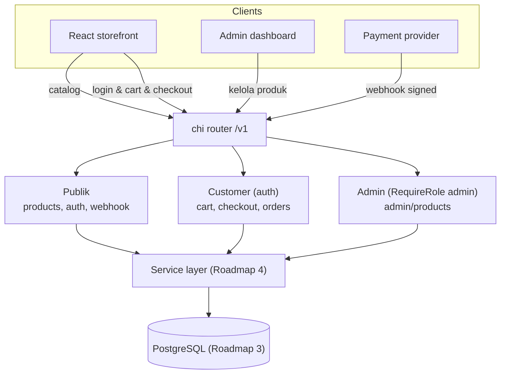
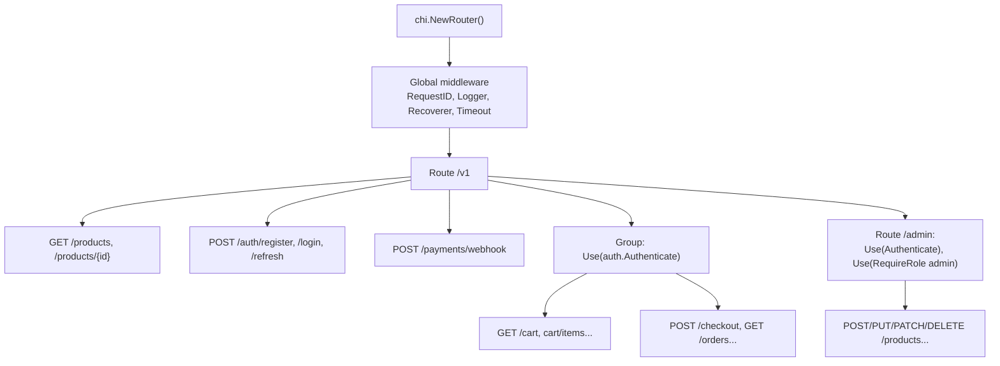
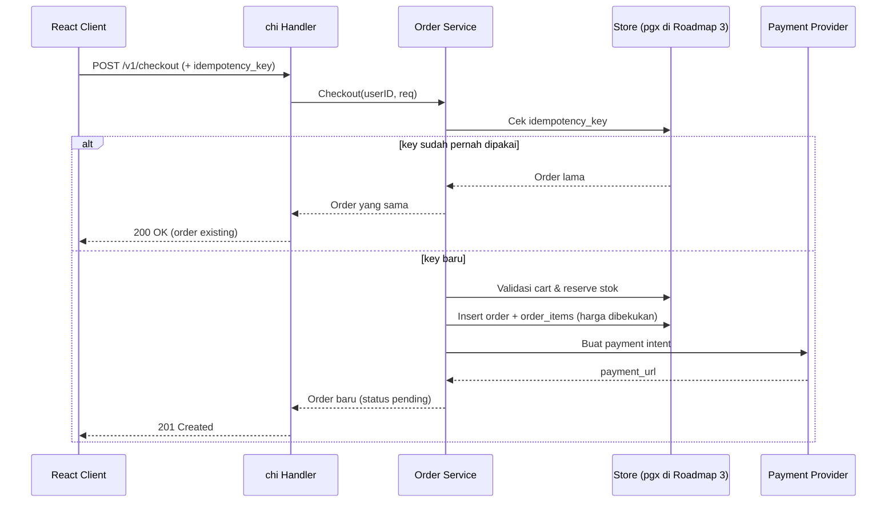
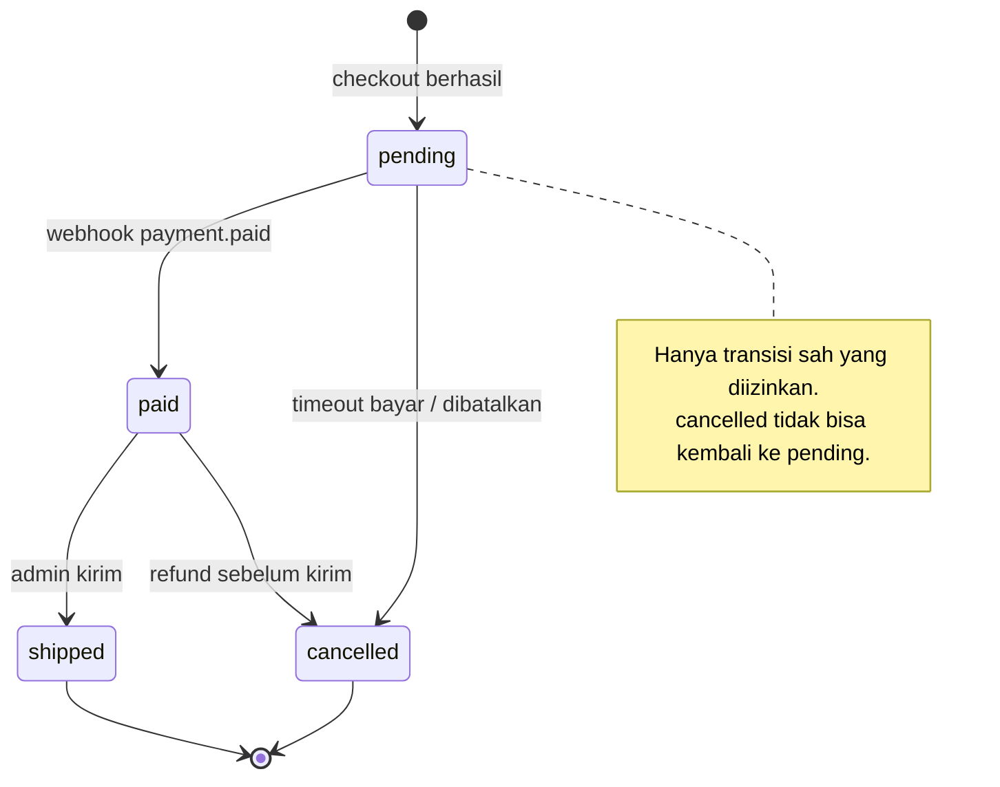
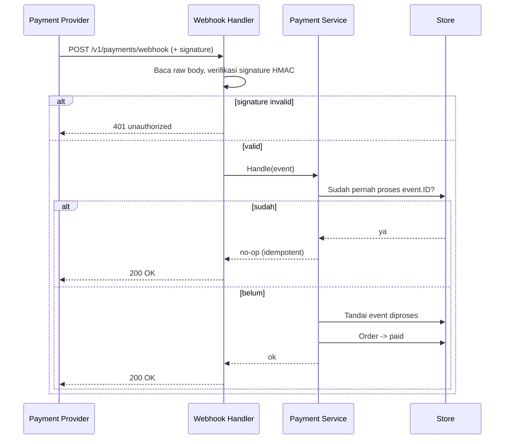

import { Section, Box, Steps, Step, Recap, CardGrid, Card, Chip, Hero, Compare, FileTree, Endpoint, Def } from "@components";

<Hero eyebrow="Roadmap 2 &middot; Web API" title="Desain REST API <em>E-Commerce</em><br />Skincare yang Utuh">
  <p>Chapter penutup Roadmap 2: kita satukan handler, router chi, middleware, envelope respons, validasi, dan auth menjadi satu permukaan API online shop yang konsisten dan siap dibangun.</p>
  <Fragment slot="meta">
    <Chip icon="code">Bahasa: <b>Go 1.26</b></Chip>
    <Chip icon="route">Roadmap 2</Chip>
    <Chip icon="rocket">Capstone</Chip>
    <Chip icon="clock">~75 menit baca</Chip>
  </Fragment>
</Hero>

<Section num="01" id="intro" title="API sebagai Permukaan Produk" sub="Kontrak yang dipakai storefront, admin, dan payment provider">

<p class="lead">REST API adalah kontrak jangka panjang yang dipakai frontend React, mobile app, admin dashboard, dan payment provider untuk berbicara dengan backend. Ini chapter di mana semua potongan Roadmap 2 berkumpul.</p>

Enam modul terakhir membangun satu proyek menerus: backend online shop skincare. Kamu sudah punya handler `net/http`, routing chi, envelope respons `httpx`, middleware, validasi, dan autentikasi JWT. Modul ini tidak memperkenalkan banyak konsep baru, melainkan merakit semuanya menjadi satu peta API yang utuh dan menjawab pertanyaan desain yang sebenarnya: resource apa yang kita ekspos, dan bagaimana client memahaminya.

Di React, kamu sering mulai dari kebutuhan layar: halaman katalog butuh data produk, halaman cart butuh item, halaman checkout butuh order. Di backend, kita membalik sudut pandang itu menjadi resource dan aksi HTTP yang stabil. Endpoint tidak dinamai mengikuti function internal, melainkan mengikuti cara client memahami bisnis online shop.

<Box variant="bridge" icon="🌉" label="Jembatan: dari route React ke route API"><p>Route React seperti `/products/:id` menentukan komponen yang dirender browser, sedangkan route API seperti `/v1/products/{id}` menentukan resource yang dibaca atau diubah client. Keduanya kebetulan mirip, tetapi tujuannya berbeda: satu untuk navigasi UI, satu untuk kontrak data.</p></Box>

Di Laravel kamu terbiasa dengan resource controller dan route group. Di Go dengan `net/http` dan [chi](https://github.com/go-chi/chi), ide besarnya sama, tetapi semuanya lebih eksplisit: handler menerima `http.ResponseWriter` dan `*http.Request`, router menyusun method dan path, middleware adalah function yang membungkus `http.Handler`.

<Def term="surface API"><p>Kumpulan endpoint publik yang menjadi kontrak antara backend dan client. Implementasi internal (database, service, cache) boleh berubah kapan saja, tetapi surface API harus stabil dan konsisten agar client lama tidak rusak.</p></Def>

Permukaan API Roadmap 2 mencakup katalog produk publik, autentikasi, cart customer, checkout, riwayat order, admin product management, dan webhook pembayaran. Database, transaksi, dan repository pgx diperdalam di Roadmap 3, tetapi bentuk API harus sudah jelas dan benar sejak sekarang, karena kontrak inilah yang akan dipakai frontend untuk mulai bekerja paralel.

</Section>

<Section num="02" id="prinsip-rest" title="Prinsip REST untuk E-Commerce" sub="Bukan sekadar JSON di atas HTTP">

<p class="lead">REST yang baik membuat resource mudah ditebak, aman dikonsumsi, dan tahan terhadap retry. Untuk e-commerce, beberapa prinsip ini menentukan apakah uang dan stok tetap konsisten.</p>

<CardGrid cols={3}>
  <Card><h4>Resource dulu, bukan verb</h4><p>Gunakan noun seperti `products`, `cart/items`, `orders`. Hindari `getProducts` atau `doCheckout`. Aksi diwakili HTTP method, bukan nama path.</p></Card>
  <Card><h4>Method bermakna</h4><p>`GET` membaca (aman, tanpa efek samping), `POST` membuat, `PATCH` mengubah sebagian, `PUT` mengganti penuh, `DELETE` menghapus atau menonaktifkan.</p></Card>
  <Card><h4>Response konsisten</h4><p>Sukses selalu `{"data": ...}` (plus `meta` untuk list), error selalu `{"error": {code, message}}`. Envelope ini sudah kita rancang di modul Request &amp; Response.</p></Card>
</CardGrid>

<Compare aLabel="Laravel/PHP: resource controller" bLabel="Go: handler per package" aTone="muted" bTone="violet">
  <Fragment slot="a"><ul><li>`ProductController@index` memegang request, validasi ringan, dan response sekaligus.</li><li>Route group dan middleware sering ditulis terpusat di `routes/api.php`.</li><li>Konvensi resource route otomatis (`Route::apiResource`).</li></ul></Fragment>
  <Fragment slot="b"><ul><li>`product.Handler.List` menerima `*http.Request`, parse query, lalu memanggil service.</li><li>Route group chi ditulis eksplisit di package `router`, terlihat jelas mana publik, customer, dan admin.</li><li>Tidak ada sihir resource route; setiap baris route kamu tulis sendiri (dan itu disengaja).</li></ul></Fragment>
</Compare>

Selain itu, ada empat properti khusus e-commerce yang wajib dipikirkan sejak desain, bukan ditambal belakangan.

<Steps>
  <Step><b>Idempotensi</b><p>Checkout tidak boleh membuat order ganda saat user menekan tombol dua kali atau jaringan retry. Webhook pembayaran harus bisa menerima event yang sama berkali-kali tanpa mengubah status order dua kali.</p></Step>
  <Step><b>Otorisasi berlapis</b><p>Catalog publik bebas dibaca, cart dan order butuh login, admin product butuh role `admin`. Tiga lapis ini tercermin di struktur router, bukan di `if` tersebar dalam handler.</p></Step>
  <Step><b>Lifecycle yang eksplisit</b><p>Order punya status (`pending`, `paid`, `shipped`, `cancelled`) yang berpindah dengan aturan jelas, bukan field bebas yang bisa diisi apa saja.</p></Step>
  <Step><b>Stabilitas harga dan nama</b><p>Saat produk masuk order, harga dan nama saat itu dibekukan. Mengubah harga produk besok tidak boleh mengubah total order kemarin.</p></Step>
</Steps>

<Box variant="tip" icon="💡" label="Tes lakmus desain endpoint"><p>Endpoint yang bagus bisa dijelaskan ke frontend tanpa membuka kode backend. Kalau frontend sulit menebak path atau shape response, biasanya surface API terlalu bocor dari detail internal (nama kolom, nama function, struktur tabel).</p></Box>

</Section>

<Section num="03" id="peta-endpoint" title="Peta Endpoint /v1 Penuh" sub="Tiga lapis akses: publik, customer, admin, plus webhook">

<p class="lead">Inilah peta kanonik permukaan API skincare. Semua modul Roadmap 2 mengarah ke sini, dan Roadmap 3 sampai 5 akan mengisinya dengan implementasi nyata.</p>

<h3>Publik (tanpa autentikasi)</h3>

<Endpoint method="GET" path="/v1/products" desc="Daftar produk dengan filter kategori, q, rentang harga, sort, dan pagination" />
<Endpoint method="GET" path="/v1/products/{id}" desc="Detail satu produk skincare untuk halaman PDP" />
<Endpoint method="POST" path="/v1/auth/register" desc="Daftar akun customer baru" />
<Endpoint method="POST" path="/v1/auth/login" desc="Login dan terima access token plus refresh token" />
<Endpoint method="POST" path="/v1/auth/refresh" desc="Tukar refresh token dengan access token baru" />
<Endpoint method="POST" path="/v1/payments/webhook" desc="Terima event pembayaran dari provider, verifikasi signature, idempotent" />

<h3>Customer (butuh login)</h3>

<Endpoint method="GET" path="/v1/cart" desc="Lihat isi cart customer yang sedang login" />
<Endpoint method="POST" path="/v1/cart/items" desc="Tambah produk ke cart" />
<Endpoint method="PATCH" path="/v1/cart/items/{id}" desc="Ubah quantity satu item cart" />
<Endpoint method="DELETE" path="/v1/cart/items/{id}" desc="Hapus satu item dari cart" />
<Endpoint method="POST" path="/v1/checkout" desc="Ubah cart menjadi order dalam satu transaksi, idempotent" />
<Endpoint method="GET" path="/v1/orders" desc="Riwayat order milik customer" />
<Endpoint method="GET" path="/v1/orders/{id}" desc="Detail satu order milik customer" />

<h3>Admin (butuh role admin)</h3>

<Endpoint method="POST" path="/v1/admin/products" desc="Buat produk baru di katalog" />
<Endpoint method="PUT" path="/v1/admin/products/{id}" desc="Ganti seluruh data produk" />
<Endpoint method="PATCH" path="/v1/admin/products/{id}" desc="Ubah sebagian field, misalnya harga atau status" />
<Endpoint method="DELETE" path="/v1/admin/products/{id}" desc="Arsipkan produk agar tidak tampil di katalog publik" />



<p class="fig-cap"><b>Gambar 1.</b> Permukaan API dibagi tiga grup akses plus webhook publik. Pembagian ini akan kita wujudkan langsung sebagai grup middleware di router chi.</p>

<Box variant="note" icon="📝" label="Kenapa prefix /v1"><p>Prefix `/v1` membuat kontrak API eksplisit dan bisa dievolusikan. Kalau suatu saat ada perubahan breaking pada shape response, kita bisa menambah `/v2` berdampingan tanpa memutus client lama yang masih memakai `/v1`.</p></Box>

<Box variant="bridge" icon="🌉" label="Jembatan: cart dan checkout bukan endpoint yang sama"><p>Di frontend kamu mungkin menganggap cart dan checkout satu alur. Di REST keduanya resource berbeda: `cart/items` dimutasi sepanjang sesi belanja, sedangkan `POST /v1/checkout` adalah satu aksi yang mengubah cart menjadi order. Memisahkannya membuat idempotensi checkout jauh lebih mudah dijaga.</p></Box>

</Section>

<Section num="04" id="model-domain" title="Model Domain dan DTO" sub="Tipe inti yang dipakai lintas seluruh permukaan API">

<p class="lead">Sebelum menulis handler, kunci dulu model domainnya. Konsistensi tipe inilah yang membuat enam modul terasa seperti satu proyek, bukan enam latihan terpisah.</p>

Uang disimpan sebagai integer rupiah, bukan `float64`. Field `PriceRupiah int64` dengan JSON tag `price` menghindari galat pembulatan yang khas pada tipe pecahan. Total order memakai `TotalRupiah int64` dengan JSON tag `total`. Ini konvensi yang sama persis di seluruh proyek.

```go title="internal/product/model.go"
package product

type Product struct {
	ID          int64  `json:"id"`
	Name        string `json:"name"`
	Slug        string `json:"slug"`
	Category    string `json:"category"`
	PriceRupiah int64  `json:"price"`
	Stock       int    `json:"stock"`
	Description string `json:"description,omitempty"`
	Status      string `json:"status"` // draft, active, archived
}
```

```go title="internal/cart/model.go"
package cart

type CartItem struct {
	ID          int64 `json:"id"`
	ProductID   int64 `json:"product_id"`
	Name        string `json:"name"`
	Quantity    int    `json:"quantity"`
	PriceRupiah int64  `json:"price"`     // harga satuan saat ditambahkan
	Subtotal    int64  `json:"subtotal"`  // PriceRupiah * Quantity
}
```

```go title="internal/order/model.go"
package order

import "time"

type Order struct {
	ID          int64       `json:"id"`
	Items       []OrderItem `json:"items"`
	TotalRupiah int64       `json:"total"`
	Status      string      `json:"status"` // pending, paid, shipped, cancelled
	CreatedAt   time.Time   `json:"created_at"`
}

type OrderItem struct {
	ProductID   int64  `json:"product_id"`
	Name        string `json:"name"`        // dibekukan saat checkout
	Quantity    int    `json:"quantity"`
	PriceRupiah int64  `json:"price"`       // dibekukan saat checkout
	Subtotal    int64  `json:"subtotal"`
}
```

```go title="internal/user/model.go"
package user

type User struct {
	ID           int64  `json:"id"`
	Email        string `json:"email"`
	Role         string `json:"role"`  // customer, admin
	PasswordHash string `json:"-"`     // JANGAN pernah keluar ke client
}
```

<Box variant="warn" icon="⚠️" label="Hash password tidak pernah jadi response"><p>JSON tag `json:"-"` pada `PasswordHash` memastikan field ini di-skip oleh encoder. Bahkan jika kamu lalai mengoper struct `User` mentah ke `httpx.Data`, hash tidak ikut bocor. Tetap, kebiasaan terbaik adalah memakai DTO response terpisah (`UserResponse`) yang memang tidak punya field hash sama sekali.</p></Box>

<Box variant="bridge" icon="🌉" label="Jembatan: Eloquent model vs struct domain + DTO"><p>Di Laravel, satu model Eloquent sering merangkap representasi database dan response API (dibatasi `$hidden` atau API Resource). Di Go kita pisahkan: struct domain untuk logika, dan DTO response untuk client. Pemisahan ini membuat perubahan kolom database tidak otomatis mengubah kontrak API.</p></Box>

Untuk response yang dibaca client, kita memakai envelope `httpx` yang sudah dirancang di modul Request &amp; Response. Itu kontrak yang tidak diulang di sini, hanya dipakai.

```go title="internal/httpx/response.go (ringkasan kontrak dari modul Request & Response)"
package httpx

// Meta menemani response list (pagination).
type Meta struct {
	Page       int   `json:"page"`
	PerPage    int   `json:"per_page"`
	Total      int64 `json:"total"`
	TotalPages int   `json:"total_pages"`
}

// FieldError dipakai oleh hasil validasi.
type FieldError struct {
	Field   string `json:"field"`
	Message string `json:"message"`
}

func JSON(w http.ResponseWriter, status int, payload any)            // encode + set header
func Data(w http.ResponseWriter, status int, data any)               // {"data": ...}
func List(w http.ResponseWriter, status int, data any, meta Meta)    // {"data": ..., "meta": ...}
func Error(w http.ResponseWriter, status int, code, message string)  // {"error": {code, message}}
func ValidationFailed(w http.ResponseWriter, fields []FieldError)    // 422 validation_error
```

<Box variant="note" icon="🧩" label="Kode error snake_case yang dipakai modul ini"><p>Sepanjang permukaan API kita memakai kode error yang machine-readable dan konsisten: `invalid_json`, `validation_error`, `unauthorized`, `forbidden`, `not_found` (atau lebih spesifik `product_not_found`, `order_not_found`), `conflict`, dan `internal_error`. Frontend memetakan kode ini ke pesan UI, bukan mem-parsing teks bebas.</p></Box>

</Section>

<Section num="05" id="struktur-folder" title="Struktur Folder dan Arsitektur Router" sub="Modular monolith kecil, dipecah per domain">

<p class="lead">Di akhir Roadmap 2, struktur folder sudah menyerupai modular monolith. Setiap domain punya package sendiri yang mengumpulkan handler, request, dan response yang berubah bersama.</p>

<FileTree title="Struktur final Roadmap 2" tree={`
cmd/
  api/
    main.go                  # entry point: rakit handler, router, http.Server
internal/
  httpx/
    response.go              # envelope Data, List, Error, ValidationFailed
    pagination.go            # helper Meta dari page, per_page, total
  auth/
    auth.go                  # Claims, token sign & verify (JWT v5)
    middleware.go            # Authenticate, RequireRole
    context.go              # UserFrom(ctx) (*Claims, bool)
  product/
    model.go                 # struct Product
    handler.go               # katalog publik dan admin product
    request.go               # parse query list dan body upsert
    response.go              # DTO product
  cart/
    model.go
    handler.go               # GET cart, POST/PATCH/DELETE item
    request.go
  order/
    model.go
    handler.go               # checkout dan riwayat order
    request.go
  payment/
    webhook.go               # handler webhook publik, verifikasi signature
  router/
    router.go                # semua route chi dirakit di sini
go.mod                       # module github.com/kamu/skincare-backend, go 1.26
`} />

Package dipisah per domain (`product`, `cart`, `order`), bukan per layer global (`controllers/`, `services/`, `models/`). Di Go, package yang sehat mengumpulkan hal yang berubah bersama. Saat kontrak katalog berubah, `product/handler.go`, `product/request.go`, dan `product/response.go` cenderung berubah bareng, jadi enak kalau bertetangga.

<Box variant="bridge" icon="🌉" label="Jembatan: folder Laravel vs package Go"><p>Laravel memisahkan berdasarkan peran teknis: `app/Http/Controllers`, `app/Http/Requests`, `app/Http/Resources`. Go cenderung memisahkan berdasarkan domain bisnis. Keuntungannya: import jadi jelas (`product` tidak perlu tahu `cart`), dan dependensi melingkar lebih mudah dihindari.</p></Box>

Router final memetakan langsung tiga lapis akses dari peta endpoint ke tiga konstruksi chi: route biasa untuk publik, satu `r.Group` dengan `Authenticate` untuk customer, dan satu `r.Route("/admin")` dengan `Authenticate` plus `RequireRole("admin")` untuk admin.



<p class="fig-cap"><b>Gambar 2.</b> Arsitektur router. Publik, customer, dan admin bukan sekadar konvensi path, tetapi grup middleware yang nyata dan terlihat di kode.</p>

</Section>

<Section num="06" id="katalog-produk" title="Katalog Produk: Filter dan Pagination" sub="Endpoint paling sering dibaca, jadi kontraknya harus paling stabil">

<p class="lead">Katalog adalah endpoint yang paling sering dipanggil. Desain query dan pagination-nya menentukan apakah frontend bisa membangun halaman list yang nyaman tanpa menebak.</p>

<Endpoint method="GET" path="/v1/products" desc="List produk publik dengan filter dan pagination" />
<Endpoint method="GET" path="/v1/products/{id}" desc="Detail satu produk" />

Query list harus mencerminkan kebutuhan UI (filter kategori, kata kunci, rentang harga, sort, halaman), bukan membuka semua kolom database mentah-mentah. Kita parse query ke struct, beri default yang aman, dan batasi `per_page` agar tidak ada yang meminta sejuta baris sekaligus.

```go title="internal/product/request.go"
package product

import (
	"net/http"
	"strconv"
	"strings"
)

type ListQuery struct {
	Category string
	Search   string
	MinPrice int64
	MaxPrice int64
	Sort     string
	Page     int
	PerPage  int
}

func ParseListQuery(r *http.Request) ListQuery {
	q := r.URL.Query()

	lq := ListQuery{
		Category: strings.TrimSpace(q.Get("category")),
		Search:   strings.TrimSpace(q.Get("q")),
		MinPrice: int64FromQuery(q.Get("min_price"), 0),
		MaxPrice: int64FromQuery(q.Get("max_price"), 0),
		Sort:     q.Get("sort"),
		Page:     intFromQuery(q.Get("page"), 1),
		PerPage:  intFromQuery(q.Get("per_page"), 20),
	}

	if lq.Page < 1 {
		lq.Page = 1
	}
	if lq.PerPage < 1 || lq.PerPage > 100 {
		lq.PerPage = 20
	}
	if !allowedSort(lq.Sort) {
		lq.Sort = "newest"
	}
	return lq
}

// allowedSort memakai allowlist, bukan nama kolom bebas dari client.
func allowedSort(sort string) bool {
	switch sort {
	case "", "newest", "price_asc", "price_desc", "name_asc":
		return true
	default:
		return false
	}
}

func intFromQuery(value string, fallback int) int {
	if value == "" {
		return fallback
	}
	n, err := strconv.Atoi(value)
	if err != nil {
		return fallback
	}
	return n
}

func int64FromQuery(value string, fallback int64) int64 {
	if value == "" {
		return fallback
	}
	n, err := strconv.ParseInt(value, 10, 64)
	if err != nil {
		return fallback
	}
	return n
}
```

Handler list memanggil service, lalu membungkus hasil dengan `httpx.List` agar response membawa `data` dan `meta` pagination. Detail produk yang tidak ditemukan membalas `404` dengan kode `product_not_found`, bukan `500`.

```go title="internal/product/handler.go"
package product

import (
	"errors"
	"net/http"

	"github.com/go-chi/chi/v5"

	"github.com/kamu/skincare-backend/internal/httpx"
)

type Handler struct {
	service Service
}

type Service interface {
	List(ctx context.Context, q ListQuery) (items []Product, total int64, err error)
	GetByID(ctx context.Context, id int64) (Product, error)
}

var ErrProductNotFound = errors.New("product not found")

func (h *Handler) List(w http.ResponseWriter, r *http.Request) {
	q := ParseListQuery(r)

	items, total, err := h.service.List(r.Context(), q)
	if err != nil {
		httpx.Error(w, http.StatusInternalServerError, "internal_error", "gagal memuat produk")
		return
	}

	meta := httpx.NewMeta(q.Page, q.PerPage, total)
	httpx.List(w, http.StatusOK, toResponses(items), meta)
}

func (h *Handler) Detail(w http.ResponseWriter, r *http.Request) {
	id, err := parseID(chi.URLParam(r, "id"))
	if err != nil {
		httpx.Error(w, http.StatusBadRequest, "invalid_json", "id produk harus angka positif")
		return
	}

	product, err := h.service.GetByID(r.Context(), id)
	if errors.Is(err, ErrProductNotFound) {
		httpx.Error(w, http.StatusNotFound, "product_not_found", "produk tidak ditemukan")
		return
	}
	if err != nil {
		httpx.Error(w, http.StatusInternalServerError, "internal_error", "gagal memuat produk")
		return
	}

	httpx.Data(w, http.StatusOK, toDetailResponse(product))
}
```

<Box variant="warn" icon="⚠️" label="Jangan bocorkan nama kolom ke client"><p>Hindari menerima `sort=products.price asc` atau filter mentah dari query. Pakai allowlist seperti `price_asc` yang nanti dipetakan ke `ORDER BY` aman di Roadmap 3. Filter dinamis dari string client adalah pintu masuk klasik SQL injection dan query yang tidak bisa di-index.</p></Box>

<Box variant="note" icon="📝" label="Pagination dibalas di meta, bukan di data"><p>`httpx.List` menaruh `page`, `per_page`, `total`, dan `total_pages` di `meta`. Frontend memakai `total_pages` untuk menggambar paginator tanpa harus menghitung sendiri. Helper `httpx.NewMeta` menghitung `total_pages` dari `total` dan `per_page`.</p></Box>

</Section>

<Section num="07" id="cart" title="Cart sebagai Resource Customer" sub="Milik user yang login, bukan dikirim dari client">

<p class="lead">Cart adalah resource milik user yang sedang login. Identitas user diambil dari token, bukan dari body request, sehingga endpoint cart tidak pernah menerima `user_id` dari client.</p>

<Endpoint method="GET" path="/v1/cart" desc="Lihat cart customer yang sedang login" />
<Endpoint method="POST" path="/v1/cart/items" desc="Tambah item ke cart" />
<Endpoint method="PATCH" path="/v1/cart/items/{id}" desc="Ubah quantity item" />
<Endpoint method="DELETE" path="/v1/cart/items/{id}" desc="Hapus item dari cart" />

Perhatikan: `cart/items/{id}` merujuk ID item cart, bukan ID produk. Satu item cart punya metadata sendiri (quantity, harga saat dimasukkan, kelak varian), sehingga ia layak jadi resource tersendiri yang bisa di-`PATCH` dan di-`DELETE`.

Validasi memakai pola yang sudah kita sepakati di modul Validasi: hasil validasi adalah `[]httpx.FieldError`, lalu dibalas dengan `httpx.ValidationFailed` (HTTP 422, kode `validation_error`). Validasi manual eksplisit di boundary handler, sadar akan zero value Go.

```go title="internal/cart/request.go"
package cart

import "github.com/kamu/skincare-backend/internal/httpx"

type AddItemRequest struct {
	ProductID int64 `json:"product_id"`
	Quantity  int   `json:"quantity"`
}

type UpdateItemRequest struct {
	Quantity int `json:"quantity"`
}

func (r AddItemRequest) Validate() []httpx.FieldError {
	var fields []httpx.FieldError
	if r.ProductID <= 0 {
		fields = append(fields, httpx.FieldError{Field: "product_id", Message: "product_id wajib diisi"})
	}
	if r.Quantity < 1 {
		fields = append(fields, httpx.FieldError{Field: "quantity", Message: "quantity minimal 1"})
	}
	return fields
}

func (r UpdateItemRequest) Validate() []httpx.FieldError {
	var fields []httpx.FieldError
	if r.Quantity < 1 {
		fields = append(fields, httpx.FieldError{Field: "quantity", Message: "quantity minimal 1"})
	}
	return fields
}
```

```go title="internal/cart/handler.go"
package cart

import (
	"encoding/json"
	"errors"
	"net/http"

	"github.com/go-chi/chi/v5"

	"github.com/kamu/skincare-backend/internal/auth"
	"github.com/kamu/skincare-backend/internal/httpx"
)

type Handler struct {
	service Service
}

func (h *Handler) AddItem(w http.ResponseWriter, r *http.Request) {
	claims, ok := auth.UserFrom(r.Context())
	if !ok {
		httpx.Error(w, http.StatusUnauthorized, "unauthorized", "silakan login dulu")
		return
	}

	var req AddItemRequest
	if err := json.NewDecoder(r.Body).Decode(&req); err != nil {
		httpx.Error(w, http.StatusBadRequest, "invalid_json", "body bukan JSON yang valid")
		return
	}
	if fields := req.Validate(); len(fields) > 0 {
		httpx.ValidationFailed(w, fields)
		return
	}

	cart, err := h.service.AddItem(r.Context(), claims.UserID, req)
	if errors.Is(err, ErrProductNotFound) {
		httpx.Error(w, http.StatusNotFound, "product_not_found", "produk tidak ditemukan")
		return
	}
	if err != nil {
		httpx.Error(w, http.StatusInternalServerError, "internal_error", "gagal menambah item")
		return
	}

	httpx.Data(w, http.StatusCreated, toCartResponse(cart))
}

func (h *Handler) UpdateItem(w http.ResponseWriter, r *http.Request) {
	claims, ok := auth.UserFrom(r.Context())
	if !ok {
		httpx.Error(w, http.StatusUnauthorized, "unauthorized", "silakan login dulu")
		return
	}

	itemID, err := parseID(chi.URLParam(r, "id"))
	if err != nil {
		httpx.Error(w, http.StatusBadRequest, "invalid_json", "id item harus angka positif")
		return
	}

	var req UpdateItemRequest
	if err := json.NewDecoder(r.Body).Decode(&req); err != nil {
		httpx.Error(w, http.StatusBadRequest, "invalid_json", "body bukan JSON yang valid")
		return
	}
	if fields := req.Validate(); len(fields) > 0 {
		httpx.ValidationFailed(w, fields)
		return
	}

	cart, err := h.service.UpdateItem(r.Context(), claims.UserID, itemID, req)
	if errors.Is(err, ErrItemNotFound) {
		httpx.Error(w, http.StatusNotFound, "not_found", "item cart tidak ditemukan")
		return
	}
	if err != nil {
		httpx.Error(w, http.StatusInternalServerError, "internal_error", "gagal mengubah item")
		return
	}

	httpx.Data(w, http.StatusOK, toCartResponse(cart))
}
```

<Box variant="bridge" icon="🌉" label="Jembatan: cart state di frontend vs backend"><p>Di React, cart sering dimulai sebagai state lokal atau store (Redux/Zustand) yang hilang saat ganti device. Di backend, cart adalah resource server-side yang konsisten lintas device dan session. Frontend boleh punya cache optimistik, tetapi sumber kebenaran tetap di server.</p></Box>

<Box variant="tip" icon="💡" label="Cart kepunyaan diperiksa di service"><p>Karena `itemID` dari URL bisa milik siapa saja, service wajib memastikan item itu memang berada di cart milik `claims.UserID`. Kalau bukan, balas `404` (bukan `403`), agar tidak membocorkan keberadaan item milik user lain. Ini pola otorisasi tingkat-resource yang penting di e-commerce.</p></Box>

</Section>

<Section num="08" id="checkout-order" title="Checkout, Order, dan Idempotensi" sub="Batas antara belanja dan transaksi bisnis">

<p class="lead">Checkout adalah momen di mana cart berubah menjadi order. Ini titik paling rawan di seluruh API: ia menyentuh stok, harga, dan uang, jadi harus idempotent dan konsisten.</p>

<Endpoint method="POST" path="/v1/checkout" desc="Ubah cart menjadi order dalam satu transaksi" />
<Endpoint method="GET" path="/v1/orders" desc="Riwayat order customer" />
<Endpoint method="GET" path="/v1/orders/{id}" desc="Detail satu order" />

Body checkout tidak perlu mengirim seluruh item, karena sumber kebenaran cart ada di server. Client cukup mengirim alamat pengiriman, metode pengiriman, metode pembayaran, dan satu `idempotency_key` yang ia bangkitkan sendiri (misalnya UUID per percobaan checkout).

```go title="internal/order/request.go"
package order

import "github.com/kamu/skincare-backend/internal/httpx"

type CheckoutRequest struct {
	ShippingAddressID int64  `json:"shipping_address_id"`
	ShippingMethod    string `json:"shipping_method"`
	PaymentMethod     string `json:"payment_method"`
	IdempotencyKey    string `json:"idempotency_key"`
}

func (r CheckoutRequest) Validate() []httpx.FieldError {
	var fields []httpx.FieldError
	if r.ShippingAddressID <= 0 {
		fields = append(fields, httpx.FieldError{Field: "shipping_address_id", Message: "alamat pengiriman wajib dipilih"})
	}
	if r.ShippingMethod == "" {
		fields = append(fields, httpx.FieldError{Field: "shipping_method", Message: "metode pengiriman wajib diisi"})
	}
	if r.PaymentMethod == "" {
		fields = append(fields, httpx.FieldError{Field: "payment_method", Message: "metode pembayaran wajib diisi"})
	}
	if r.IdempotencyKey == "" {
		fields = append(fields, httpx.FieldError{Field: "idempotency_key", Message: "idempotency_key wajib diisi"})
	}
	return fields
}
```

Diagram berikut menunjukkan alur checkout end-to-end. Di Roadmap 2 service masih in-memory, tetapi bentuk langkahnya sudah final. Di Roadmap 3, langkah validasi cart sampai insert order akan dibungkus satu transaksi database.



<p class="fig-cap"><b>Gambar 3.</b> Idempotensi checkout: request dengan `idempotency_key` yang sama mengembalikan order yang sama, bukan membuat order kedua.</p>

Handler checkout merakit semua lapis: ambil user dari context, decode dan validasi body, panggil service, lalu pilih status code yang jujur. Order yang baru dibuat membalas `201`, sedangkan idempotency hit membalas `200` dengan order yang sudah ada.

```go title="internal/order/handler.go"
package order

import (
	"encoding/json"
	"errors"
	"net/http"

	"github.com/kamu/skincare-backend/internal/auth"
	"github.com/kamu/skincare-backend/internal/httpx"
)

var (
	ErrCartEmpty     = errors.New("cart kosong")
	ErrStockNotEnough = errors.New("stok tidak cukup")
)

func (h *Handler) Checkout(w http.ResponseWriter, r *http.Request) {
	claims, ok := auth.UserFrom(r.Context())
	if !ok {
		httpx.Error(w, http.StatusUnauthorized, "unauthorized", "silakan login dulu")
		return
	}

	var req CheckoutRequest
	if err := json.NewDecoder(r.Body).Decode(&req); err != nil {
		httpx.Error(w, http.StatusBadRequest, "invalid_json", "body bukan JSON yang valid")
		return
	}
	if fields := req.Validate(); len(fields) > 0 {
		httpx.ValidationFailed(w, fields)
		return
	}

	order, created, err := h.service.Checkout(r.Context(), claims.UserID, req)
	switch {
	case errors.Is(err, ErrCartEmpty):
		httpx.Error(w, http.StatusConflict, "conflict", "cart kosong, tidak bisa checkout")
		return
	case errors.Is(err, ErrStockNotEnough):
		httpx.Error(w, http.StatusConflict, "conflict", "stok salah satu produk tidak mencukupi")
		return
	case err != nil:
		httpx.Error(w, http.StatusInternalServerError, "internal_error", "gagal memproses checkout")
		return
	}

	status := http.StatusOK
	if created {
		status = http.StatusCreated
	}
	httpx.Data(w, status, toOrderResponse(order))
}
```

Status order berpindah mengikuti state machine yang eksplisit. Bukan field bebas, melainkan transisi yang punya aturan.



<p class="fig-cap"><b>Gambar 4.</b> State machine order. Service menolak transisi tidak sah (misalnya `shipped` langsung ke `pending`), sehingga status tidak bisa korup.</p>

<Box variant="tip" icon="💡" label="Kenapa idempotency key"><p>Mobile network putus-nyambung dan tombol bisa ditekan dua kali. `idempotency_key` membuat service mengenali checkout yang sama, lalu mengembalikan order yang sudah ada alih-alih membuat order kedua. Ini sama pentingnya untuk checkout seperti untuk webhook pembayaran.</p></Box>

<Box variant="bridge" icon="🌉" label="Jembatan: transaksi DB vs Promise.all"><p>Di Node, kamu mungkin menjalankan beberapa operasi dengan `await` berurutan dan berharap semuanya sukses. Di Go (Roadmap 3), validasi cart, reserve stok, dan insert order akan dibungkus satu transaksi database: kalau salah satu gagal, semuanya di-rollback. Tidak ada order setengah jadi.</p></Box>

</Section>

<Section num="09" id="admin-products" title="Admin Product Management" sub="Route, validasi, dan role guard yang lebih ketat">

<p class="lead">Admin API memodifikasi katalog, jadi route-nya terpisah dan dilindungi `RequireRole("admin")`. Kebutuhan admin berbeda dari storefront, sehingga endpoint-nya pun berbeda.</p>

<Endpoint method="POST" path="/v1/admin/products" desc="Buat produk baru" />
<Endpoint method="PUT" path="/v1/admin/products/{id}" desc="Ganti seluruh data produk" />
<Endpoint method="PATCH" path="/v1/admin/products/{id}" desc="Ubah sebagian field produk" />
<Endpoint method="DELETE" path="/v1/admin/products/{id}" desc="Arsipkan produk" />

`PUT` mengganti seluruh resource, jadi setiap field wajib dikirim. `PATCH` mengubah sebagian, jadi field opsional. Di Go, membedakan "field tidak dikirim" dari "field dikirim bernilai kosong" penting, dan kita memakai pointer untuk itu pada DTO patch.

<Compare aLabel="PUT: ganti penuh" bLabel="PATCH: ubah sebagian" aTone="violet" bTone="teal">
  <Fragment slot="a"><ul><li>Semua field wajib ada di body.</li><li>Field yang hilang dianggap dikosongkan.</li><li>DTO memakai tipe nilai biasa (`string`, `int64`).</li></ul></Fragment>
  <Fragment slot="b"><ul><li>Hanya field yang dikirim yang diubah.</li><li>Field yang hilang tetap apa adanya.</li><li>DTO memakai pointer (`*string`, `*int64`) agar `nil` berarti "tidak diubah".</li></ul></Fragment>
</Compare>

```go title="internal/product/request.go (admin)"
package product

import (
	"unicode/utf8"

	"github.com/kamu/skincare-backend/internal/httpx"
)

// CreateProductRequest dipakai POST dan PUT (semua field wajib).
type CreateProductRequest struct {
	Name        string `json:"name"`
	Category    string `json:"category"`
	PriceRupiah int64  `json:"price"`
	Stock       int    `json:"stock"`
	Description string `json:"description"`
	Status      string `json:"status"`
}

func (r CreateProductRequest) Validate() []httpx.FieldError {
	var fields []httpx.FieldError
	if utf8.RuneCountInString(r.Name) < 3 {
		fields = append(fields, httpx.FieldError{Field: "name", Message: "nama minimal 3 karakter"})
	}
	if r.Category == "" {
		fields = append(fields, httpx.FieldError{Field: "category", Message: "kategori wajib diisi"})
	}
	if r.PriceRupiah <= 0 {
		fields = append(fields, httpx.FieldError{Field: "price", Message: "harga harus lebih dari 0"})
	}
	if r.Stock < 0 {
		fields = append(fields, httpx.FieldError{Field: "stock", Message: "stok tidak boleh negatif"})
	}
	if !allowedStatus(r.Status) {
		fields = append(fields, httpx.FieldError{Field: "status", Message: "status harus draft, active, atau archived"})
	}
	return fields
}

// PatchProductRequest dipakai PATCH. Pointer nil berarti "tidak diubah".
type PatchProductRequest struct {
	Name        *string `json:"name"`
	Category    *string `json:"category"`
	PriceRupiah *int64  `json:"price"`
	Stock       *int    `json:"stock"`
	Status      *string `json:"status"`
}

func (r PatchProductRequest) Validate() []httpx.FieldError {
	var fields []httpx.FieldError
	if r.Name != nil && utf8.RuneCountInString(*r.Name) < 3 {
		fields = append(fields, httpx.FieldError{Field: "name", Message: "nama minimal 3 karakter"})
	}
	if r.PriceRupiah != nil && *r.PriceRupiah <= 0 {
		fields = append(fields, httpx.FieldError{Field: "price", Message: "harga harus lebih dari 0"})
	}
	if r.Status != nil && !allowedStatus(*r.Status) {
		fields = append(fields, httpx.FieldError{Field: "status", Message: "status harus draft, active, atau archived"})
	}
	return fields
}

func allowedStatus(status string) bool {
	switch status {
	case "draft", "active", "archived":
		return true
	default:
		return false
	}
}
```

<Box variant="bridge" icon="🌉" label="Jembatan: undefined di JS vs pointer nil di Go"><p>Di JavaScript, `body.price === undefined` membedakan field yang tidak dikirim dari field bernilai `0`. Go tidak punya `undefined`: `int64` selalu punya zero value `0`. Pointer `*int64` mengembalikan kemampuan itu. `nil` berarti "tidak ada di body", sedangkan `&amp;0` berarti "dikirim bernilai 0".</p></Box>

<Box variant="warn" icon="⚠️" label="DELETE bukan hard delete"><p>`DELETE /v1/admin/products/{id}` sebaiknya mengarsipkan produk (set `status = archived`), bukan menghapus baris. Produk yang sudah pernah dibeli masih dirujuk `order_items` lewat nama dan harga saat itu. Hard delete bisa merusak riwayat order yang sah secara hukum dan akuntansi.</p></Box>

<Box variant="note" icon="📝" label="Opsi library validator"><p>Selain validasi manual, kamu bisa memakai [go-playground/validator](https://github.com/go-playground/validator) (v10) dengan tag `validate:"required,min=3,gt=0"`. Hasilnya `validator.ValidationErrors` lalu kamu terjemahkan ke `[]httpx.FieldError` yang sama, sehingga shape error ke client tetap identik. Pilih satu pendekatan dan konsisten; modul Validasi membahas keduanya.</p></Box>

</Section>

<Section num="10" id="payment-webhook" title="Payment Webhook yang Aman" sub="Request dari sistem lain, bukan dari user yang login">

<p class="lead">Webhook adalah panggilan dari payment provider ke API kita. Ia publik (tidak memakai JWT customer), tetapi tetap harus diverifikasi dan diproses idempotent.</p>

<Endpoint method="POST" path="/v1/payments/webhook" desc="Terima event pembayaran dari provider" />

Tiga aturan webhook pembayaran: verifikasi signature dari raw body (bukan JSON yang sudah di-decode ulang), proses idempotent berdasarkan event ID, dan balas `200` secepat mungkin agar provider tidak menganggap gagal lalu retry berlebihan.



<p class="fig-cap"><b>Gambar 5.</b> Webhook harus tahan retry. Provider bisa mengirim event yang sama beberapa kali, dan kita hanya boleh memproses efeknya sekali.</p>

```go title="internal/payment/webhook.go"
package payment

import (
	"crypto/hmac"
	"crypto/sha256"
	"encoding/hex"
	"encoding/json"
	"io"
	"net/http"

	"github.com/kamu/skincare-backend/internal/httpx"
)

type WebhookHandler struct {
	service Service
	secret  []byte
}

type Event struct {
	ID      string `json:"id"`
	Type    string `json:"type"`     // payment.paid, payment.failed
	OrderID int64  `json:"order_id"`
}

func (h *WebhookHandler) Handle(w http.ResponseWriter, r *http.Request) {
	// Batasi ukuran body webhook agar provider nakal tidak membanjiri kita.
	r.Body = http.MaxBytesReader(w, r.Body, 1<<20)

	rawBody, err := io.ReadAll(r.Body)
	if err != nil {
		httpx.Error(w, http.StatusBadRequest, "invalid_json", "gagal membaca body")
		return
	}

	if !verifySignature(r.Header.Get("X-Signature"), rawBody, h.secret) {
		httpx.Error(w, http.StatusUnauthorized, "unauthorized", "signature tidak valid")
		return
	}

	var event Event
	if err := json.Unmarshal(rawBody, &event); err != nil {
		httpx.Error(w, http.StatusBadRequest, "invalid_json", "body bukan event yang valid")
		return
	}

	// HandleEvent idempotent: cek event.ID sebelum mengubah status order.
	if err := h.service.HandleEvent(r.Context(), event); err != nil {
		httpx.Error(w, http.StatusInternalServerError, "internal_error", "gagal memproses event")
		return
	}

	httpx.JSON(w, http.StatusOK, map[string]string{"status": "ok"})
}

// verifySignature membandingkan HMAC-SHA256 raw body dengan header signature.
// hmac.Equal memakai perbandingan constant-time agar aman dari timing attack.
func verifySignature(signature string, body, secret []byte) bool {
	if signature == "" {
		return false
	}
	mac := hmac.New(sha256.New, secret)
	mac.Write(body)
	expected := hex.EncodeToString(mac.Sum(nil))
	return hmac.Equal([]byte(expected), []byte(signature))
}
```

<Box variant="warn" icon="⚠️" label="Verifikasi dari raw body, bukan JSON re-encode"><p>Provider menghitung signature dari byte mentah body. Jika kamu `json.Decode` lalu `json.Encode` ulang untuk verifikasi, urutan field dan whitespace berubah, dan signature pasti gagal. Selalu `io.ReadAll` dulu, verifikasi byte itu, baru `json.Unmarshal` dari byte yang sama.</p></Box>

<Box variant="tip" icon="💡" label="Constant-time compare"><p>`hmac.Equal` membandingkan dalam waktu konstan, tidak short-circuit di byte pertama yang beda. Jangan pakai `==` biasa untuk membandingkan signature, karena membuka celah timing attack yang bisa dipakai menebak signature byte per byte.</p></Box>

<Box variant="note" icon="📝" label="Webhook itu publik di router"><p>Karena pemanggilnya provider, bukan user, route webhook diletakkan di luar grup auth: `r.Post("/payments/webhook", ...)` langsung di bawah `/v1`. Keamanannya datang dari signature, bukan dari JWT. Salah menaruhnya di grup auth justru membuat provider selalu kena `401`.</p></Box>

</Section>

<Section num="11" id="router-chi" title="Merakit Router Final dengan chi" sub="Tiga lapis akses menjadi tiga konstruksi chi">

<p class="lead">Sekarang semua bertemu. Router chi menyusun publik, customer, dan admin sebagai grup middleware yang nyata, dan menyambungkan setiap domain ke peta endpoint.</p>

Package [net/http](https://pkg.go.dev/net/http) tetap fondasinya. chi (`github.com/go-chi/chi/v5`) kompatibel dengan `http.Handler`, jadi route tetap idiomatik Go, bukan framework tertutup. Middleware umum dipasang sekali di atas, lalu auth dan role guard dipasang per grup.

```go title="internal/router/router.go"
package router

import (
	"net/http"
	"time"

	"github.com/go-chi/chi/v5"
	"github.com/go-chi/chi/v5/middleware"

	"github.com/kamu/skincare-backend/internal/auth"
	"github.com/kamu/skincare-backend/internal/cart"
	"github.com/kamu/skincare-backend/internal/order"
	"github.com/kamu/skincare-backend/internal/payment"
	"github.com/kamu/skincare-backend/internal/product"
)

type Handlers struct {
	Auth    *auth.Handler
	Product *product.Handler
	Cart    *cart.Handler
	Order   *order.Handler
	Webhook *payment.WebhookHandler
}

func New(h Handlers) http.Handler {
	r := chi.NewRouter()

	// Middleware global, dipasang sekali untuk semua route.
	r.Use(middleware.RequestID)
	r.Use(middleware.Logger)
	r.Use(middleware.Recoverer)
	r.Use(middleware.Timeout(15 * time.Second))

	r.Get("/healthz", func(w http.ResponseWriter, r *http.Request) {
		w.WriteHeader(http.StatusOK)
		_, _ = w.Write([]byte("ok"))
	})

	r.Route("/v1", func(r chi.Router) {
		// --- Publik ---
		r.Get("/products", h.Product.List)
		r.Get("/products/{id}", h.Product.Detail)
		r.Post("/auth/register", h.Auth.Register)
		r.Post("/auth/login", h.Auth.Login)
		r.Post("/auth/refresh", h.Auth.Refresh)
		r.Post("/payments/webhook", h.Webhook.Handle)

		// --- Customer (butuh login) ---
		r.Group(func(r chi.Router) {
			r.Use(auth.Authenticate)

			r.Get("/cart", h.Cart.Get)
			r.Post("/cart/items", h.Cart.AddItem)
			r.Patch("/cart/items/{id}", h.Cart.UpdateItem)
			r.Delete("/cart/items/{id}", h.Cart.DeleteItem)

			r.Post("/checkout", h.Order.Checkout)
			r.Get("/orders", h.Order.ListMine)
			r.Get("/orders/{id}", h.Order.DetailMine)
		})

		// --- Admin (butuh role admin) ---
		r.Route("/admin", func(r chi.Router) {
			r.Use(auth.Authenticate)
			r.Use(auth.RequireRole("admin"))

			r.Post("/products", h.Product.AdminCreate)
			r.Put("/products/{id}", h.Product.AdminReplace)
			r.Patch("/products/{id}", h.Product.AdminPatch)
			r.Delete("/products/{id}", h.Product.AdminArchive)
		})
	})

	return r
}
```

<Box variant="bridge" icon="🌉" label="Jembatan: Route::middleware vs r.Group"><p>Di Laravel kamu menulis `Route::middleware('auth:sanctum')->group(...)`. Di chi, `r.Group(func(r chi.Router) { r.Use(auth.Authenticate); ... })` melakukan hal yang sama: middleware berlaku hanya pada route di dalam grup, tanpa memengaruhi route publik di luarnya.</p></Box>

<Box variant="warn" icon="⚠️" label="Jangan pakai middleware.RealIP sebagai default"><p>`middleware.RealIP` kini deprecated karena celah IP spoofing (GHSA-3fxj-6jh8-hvhx, severity Critical): ia memutasi `r.RemoteAddr` dan memercayai header dari client. Pengganti yang benar bergantung infrastruktur, misalnya middleware yang membaca `X-Forwarded-For` hanya dari proxy tepercaya (`ClientIPFromXFFTrustedProxies`) saat di belakang ALB, lalu ambil hasilnya via `GetClientIP(ctx)`. Bila server terhubung langsung, pakai `r.RemoteAddr` apa adanya. Pilih sesuai topologi deploy, jangan asal pasang `RealIP`.</p></Box>

Middleware `Authenticate` membaca header `Authorization: Bearer ...`, memverifikasi token, lalu menaruh `*Claims` di context. Handler mengambilnya lewat `auth.UserFrom`. Inilah perekat antara modul Auth dan permukaan API ini.

```go title="internal/auth/middleware.go (ringkasan dari modul Autentikasi)"
package auth

import (
	"net/http"
	"strings"

	"github.com/kamu/skincare-backend/internal/httpx"
)

func Authenticate(next http.Handler) http.Handler {
	return http.HandlerFunc(func(w http.ResponseWriter, r *http.Request) {
		raw := strings.TrimPrefix(r.Header.Get("Authorization"), "Bearer ")
		claims, err := ParseToken(raw)
		if err != nil {
			httpx.Error(w, http.StatusUnauthorized, "unauthorized", "token tidak valid")
			return
		}
		ctx := withClaims(r.Context(), claims)
		next.ServeHTTP(w, r.WithContext(ctx))
	})
}

func RequireRole(role string) func(http.Handler) http.Handler {
	return func(next http.Handler) http.Handler {
		return http.HandlerFunc(func(w http.ResponseWriter, r *http.Request) {
			claims, ok := UserFrom(r.Context())
			if !ok {
				httpx.Error(w, http.StatusUnauthorized, "unauthorized", "silakan login dulu")
				return
			}
			if claims.Role != role {
				httpx.Error(w, http.StatusForbidden, "forbidden", "akses ditolak")
				return
			}
			next.ServeHTTP(w, r)
		})
	}
}
```

<Compare aLabel="Express.js" bLabel="chi" aTone="muted" bTone="blue">
  <Fragment slot="a"><ul><li>`router.use(auth)` menerima `req`, `res`, `next`.</li><li>Path param dibaca dari `req.params.id`.</li><li>Grup route dengan `express.Router()` terpisah.</li></ul></Fragment>
  <Fragment slot="b"><ul><li>Middleware adalah `func(http.Handler) http.Handler` yang membungkus handler berikutnya.</li><li>Path param dibaca `chi.URLParam(r, "id")`.</li><li>Grup route dengan `r.Group` atau `r.Route` di dalam closure.</li></ul></Fragment>
</Compare>

</Section>

<Section num="12" id="hands-on" title="Hands-on: Jalankan Peta API" sub="Route bisa diuji walau service masih in-memory">

<p class="lead">Latihan ini membuat peta route hidup walau service dan database masih dummy. Tujuannya: frontend dan backend bisa menyepakati kontrak lebih awal.</p>

<Steps>
  <Step><b>Inisialisasi module</b><p>Jalankan `go mod init github.com/kamu/skincare-backend` lalu `go mod tidy` setelah menambahkan import chi.</p></Step>
  <Step><b>Rakit router</b><p>Tambahkan `internal/router/router.go`, sambungkan dari `cmd/api/main.go`.</p></Step>
  <Step><b>Handler stub</b><p>Untuk tiap domain, buat method handler yang membalas JSON sederhana lewat `httpx.Data` agar route bisa diuji dulu.</p></Step>
  <Step><b>Uji tiap lapis</b><p>Kirim curl ke route publik, customer (dengan Bearer token), admin, dan webhook. Catat shape response sukses dan error sebagai kontrak.</p></Step>
</Steps>

```go title="cmd/api/main.go"
package main

import (
	"log/slog"
	"net/http"
	"os"

	"github.com/kamu/skincare-backend/internal/router"
)

func main() {
	// Di proyek nyata, handler diisi service + repository.
	// Untuk peta route, handler stub sudah cukup.
	h := router.Handlers{}

	srv := router.New(h)

	addr := ":8080"
	slog.Info("server listening", "addr", addr)
	if err := http.ListenAndServe(addr, srv); err != nil {
		slog.Error("server stopped", "error", err)
		os.Exit(1)
	}
}
```

```bash title="Terminal"
go mod init github.com/kamu/skincare-backend
go get github.com/go-chi/chi/v5@v5.3.0
go mod tidy
go run ./cmd/api
```

Uji health check dan katalog publik.

```bash title="Terminal"
curl -i http://localhost:8080/healthz
curl -i "http://localhost:8080/v1/products?category=serum&page=1&per_page=20"
```

Uji route customer dengan Bearer token (token didapat dari `POST /v1/auth/login`).

```bash title="Terminal"
curl -i http://localhost:8080/v1/cart \
  -H "Authorization: Bearer <ACCESS_TOKEN>"

curl -i -X POST http://localhost:8080/v1/checkout \
  -H "Authorization: Bearer <ACCESS_TOKEN>" \
  -H "Content-Type: application/json" \
  -d '{"shipping_address_id":1,"shipping_method":"regular","payment_method":"va_bca","idempotency_key":"chk-1f2e"}'
```

Uji route admin (token dengan role admin) dan webhook publik.

```bash title="Terminal"
curl -i -X POST http://localhost:8080/v1/admin/products \
  -H "Authorization: Bearer <ADMIN_TOKEN>" \
  -H "Content-Type: application/json" \
  -d '{"name":"Niacinamide 10% Serum","category":"serum","price":189000,"stock":40,"status":"active"}'

curl -i -X POST http://localhost:8080/v1/payments/webhook \
  -H "X-Signature: <HMAC_HEX>" \
  -H "Content-Type: application/json" \
  -d '{"id":"evt_123","type":"payment.paid","order_id":1001}'
```

<Box variant="note" icon="📝" label="Kenapa stub dulu"><p>Route stub membuat frontend bisa mulai integrasi tanpa menunggu database. Saat service dan repository pgx datang di Roadmap 3, path dan shape response tidak berubah, hanya isinya yang jadi nyata.</p></Box>

</Section>

<Section num="13" id="jebakan-umum" title="Jebakan Umum Desain API" sub="Bug e-commerce sering datang dari kontrak yang kabur, bukan syntax Go">

<p class="lead">Sebagian besar masalah API e-commerce bukan error kompilasi, melainkan keputusan desain yang terbawa kebiasaan dari Express atau Laravel tanpa disesuaikan.</p>

<CardGrid cols={2}>
  <Card><h4>Verb di dalam path</h4><p>Hindari `/v1/createProduct` atau `/v1/doCheckout`. Pakai resource plus method: `POST /v1/admin/products`, `POST /v1/checkout`.</p></Card>
  <Card><h4>user_id dari body</h4><p>Untuk route customer, ambil user dari context hasil `Authenticate`. Jangan pernah percaya `user_id` yang dikirim client.</p></Card>
  <Card><h4>Filter terlalu bebas</h4><p>Query parameter harus divalidasi dan memakai allowlist, agar tidak jadi SQL dinamis yang rentan saat masuk Roadmap 3.</p></Card>
  <Card><h4>Webhook seperti route login</h4><p>Webhook tidak memakai JWT. Verifikasi signature dari raw body dan proses idempotent berdasarkan event ID.</p></Card>
  <Card><h4>DELETE merusak histori</h4><p>Produk yang pernah dibeli diarsipkan, bukan dihapus. `order_items` masih merujuk nama dan harga saat itu.</p></Card>
  <Card><h4>Checkout tidak idempotent</h4><p>Tanpa `idempotency_key`, satu klik ganda atau retry jaringan bisa membuat dua order untuk pembayaran yang sama.</p></Card>
  <Card><h4>Harga tidak dibekukan</h4><p>Mengubah harga produk hari ini tidak boleh mengubah total order kemarin. Bekukan harga ke `order_items` saat checkout.</p></Card>
  <Card><h4>Status code asal 200</h4><p>Balas `201` untuk created, `422` untuk validasi, `409` untuk konflik bisnis (stok habis), `404` untuk resource tidak ada, bukan semuanya `200` atau `500`.</p></Card>
</CardGrid>

<Box variant="warn" icon="⚠️" label="Jebakan terbesar: API mengikuti tabel database 1:1"><p>Jangan mendesain endpoint mengikuti struktur tabel satu lawan satu. REST API adalah kontrak produk, database adalah detail penyimpanan. `cart_items` di database boleh berbeda dari bentuk `data` yang dibalas `GET /v1/cart`. Pemisahan inilah yang membuat kamu bisa mengganti skema database tanpa merusak frontend.</p></Box>

<Box variant="bridge" icon="🌉" label="Jembatan: API Resource Laravel sebagai disiplin"><p>Disiplin `App\Http\Resources` di Laravel (memilih field yang aman dan stabil untuk client) sama persis dengan disiplin DTO response di Go. Keduanya menjaga agar perubahan internal tidak bocor ke kontrak publik. Bedanya, di Go ini eksplisit lewat struct, bukan magic method.</p></Box>

</Section>

<Section num="14" id="ringkasan" title="Ringkasan & Poin Penting">

<p class="lead">Chapter ini menutup Roadmap 2 dengan satu permukaan API e-commerce yang utuh, merakit semua yang kamu pelajari dari handler sampai auth.</p>

<Recap title="Yang Wajib Menempel"><ul><li>Permukaan API skincare terdiri dari katalog publik, auth, cart customer, checkout, riwayat order, admin product management, dan payment webhook, semuanya di bawah prefix `/v1`.</li><li>Tiga lapis akses (publik, customer, admin) diwujudkan sebagai grup middleware chi: route biasa, `r.Group` dengan `auth.Authenticate`, dan `r.Route("/admin")` dengan `Authenticate` plus `RequireRole("admin")`.</li><li>Semua response memakai envelope `httpx`: `Data` untuk satu objek, `List` untuk koleksi plus `meta` pagination, `Error` untuk error berkode, dan `ValidationFailed` (422) untuk `[]FieldError`.</li><li>Uang selalu integer rupiah: `PriceRupiah int64` (`json:"price"`) dan `TotalRupiah int64` (`json:"total"`). Tidak ada `float64` untuk uang.</li><li>Checkout dan webhook wajib idempotent: `idempotency_key` untuk checkout, event ID untuk webhook. Webhook diverifikasi lewat HMAC raw body, bukan JWT.</li><li>`PUT` mengganti penuh (nilai biasa), `PATCH` mengubah sebagian (pointer agar `nil` berarti "tidak diubah"). `DELETE` produk berarti arsip, bukan hard delete.</li><li>Status order berpindah lewat state machine eksplisit (`pending`, `paid`, `shipped`, `cancelled`), dan status code dipilih jujur: `201`, `200`, `404`, `409`, `422`.</li></ul></Recap>

Setelah ini, Roadmap 3 masuk ke PostgreSQL dan pgx. Peta endpoint yang sudah kita desain akan mendapat storage nyata: tabel `products`, `cart_items`, `orders`, `order_items`, `payments`, query pagination, transaksi checkout, dan repository yang menerima `context.Context`. Roadmap 4 menambah service layer dan clean architecture di antara handler dan repository.

<Box variant="tip" icon="🚀" label="Langkah berikutnya"><p>Pakai peta route ini sebagai kontrak yang dijaga. Saat database dan service masuk, ubah implementasi internal, bukan surface API. Endpoint, status code, dan shape response yang kamu sepakati hari ini adalah janji ke frontend yang harus tetap stabil.</p></Box>

</Section>
