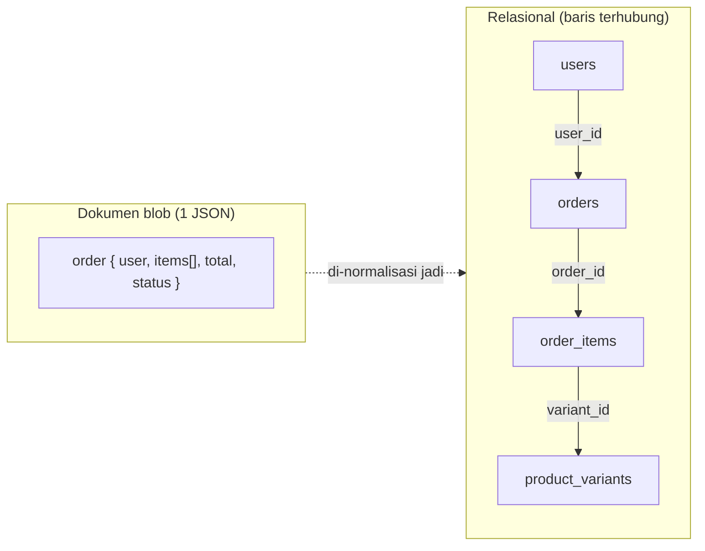
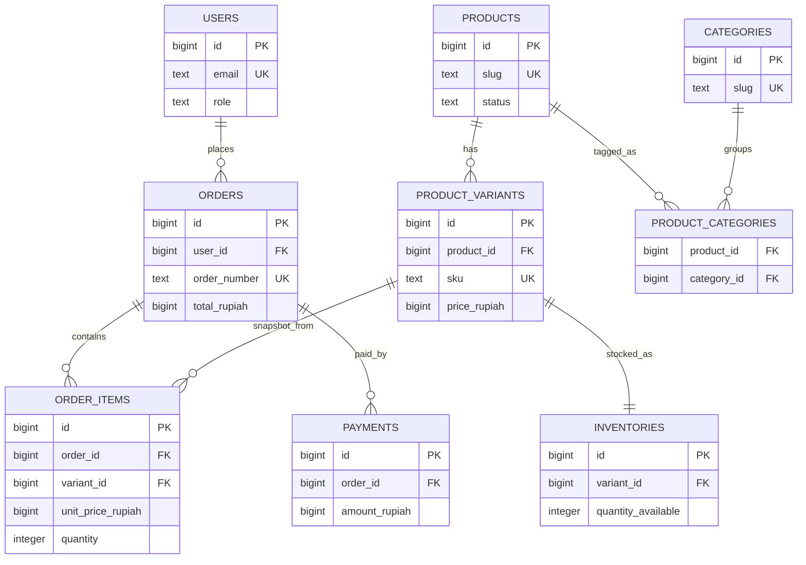
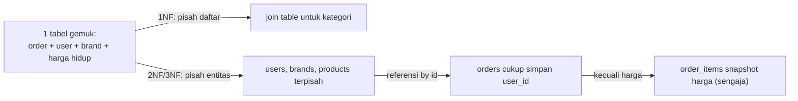
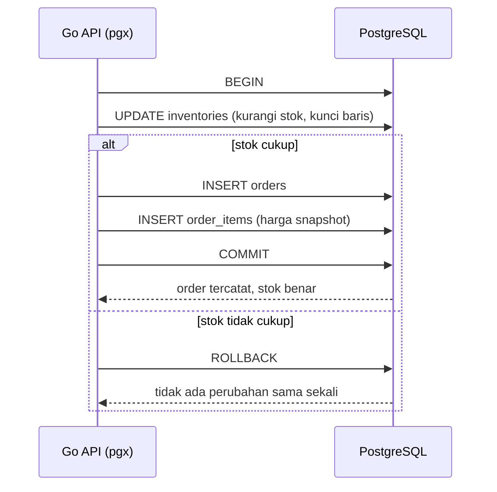

import { Section, Box, Steps, Step, Recap, CardGrid, Card, Chip, Hero, Compare, FileTree, Def } from "@components";

<Hero eyebrow="Roadmap 3 &middot; PostgreSQL dan pgx" title="Fundamental Basis Data <em>Relasional</em><br />untuk Backend Skincare">
  <p>Sebelum Go berbicara ke PostgreSQL lewat pgx, kita kunci dulu cara berpikir data: bentuk, identitas, relasi, dan aturan yang menjaga stok, order, serta uang tetap konsisten.</p>
  <Fragment slot="meta">
    <Chip icon="database">Fokus: <b>PostgreSQL 18</b></Chip>
    <Chip icon="code">Bahasa: <b>Go 1.26</b></Chip>
    <Chip icon="route">Roadmap 3</Chip>
    <Chip icon="clock">~80 menit baca</Chip>
  </Fragment>
</Hero>

<Section num="01" id="intro" title="Kenapa Relasional Dulu?" sub="Sebelum query, pahami dulu bentuk dan aturan datanya">

<p class="lead">Backend e-commerce tidak hanya menyimpan JSON. Ia menjaga agar stok, order, pembayaran, dan user tetap konsisten walau ribuan request masuk bersamaan. Itu pekerjaan basis data, bukan handler.</p>

Roadmap 2 berhenti tepat di titik menarik: kita sudah punya permukaan REST API utuh (katalog, cart, checkout, order, payment webhook), tetapi semua service-nya masih in-memory. Sekarang data itu butuh rumah permanen. Pertanyaannya bukan sekadar "database mana", melainkan "bentuk data seperti apa yang membuat API tadi tetap benar saat dipakai sungguhan".

Kalau kamu datang dari React, data sering terlihat sebagai array of object di state, lalu dikirim sebagai JSON ke API. Kalau datang dari Laravel, kamu mungkin terbiasa dengan model Eloquent dan migration. Di balik keduanya, basis data relasional bekerja dengan kontrak yang jauh lebih ketat: data ditempatkan dalam tabel, dihubungkan dengan key, dan dijaga oleh constraint yang aktif bahkan saat kode aplikasimu salah.

<Box variant="bridge" icon="🌉" label="Jembatan: dari array object ke tabel"><p>Array object di JavaScript fleksibel karena tiap object boleh punya shape berbeda. Tabel relasional sengaja tidak sefleksibel itu, karena backend butuh bentuk data yang bisa dipercaya oleh API, worker, laporan penjualan, refund, dan rekonsiliasi pembayaran sekaligus. Disiplin di muka menukar kebebasan kecil dengan ketenangan besar.</p></Box>

<Def term="basis data relasional"><p>Sistem yang menyimpan data sebagai relasi berbentuk tabel (kumpulan baris dengan kolom bertipe), lalu menghubungkan tabel memakai key dan menegakkan aturan lewat constraint, sehingga data tetap konsisten lintas proses dan lintas waktu.</p></Def>

Di proyek online shop skincare, kita akan menyimpan user, brand, produk beserta varian, kategori, inventory, cart, order, item order, payment, shipment, review, dan promosi. Kalau relasi dasarnya salah, kode Go yang rapi tetap akan menderita, karena bug berpindah ke layer service, handler, dan worker. Modul ini menanam fondasi itu, hampir tanpa kode Go, supaya tiga modul berikutnya (SQL dasar, pgxpool, transaksi) berdiri di atas tanah yang stabil.

<CardGrid cols={3}>
  <Card><h4>Data punya bentuk</h4><p>Kolom menentukan tipe dan arti data, bukan sekadar field bebas seperti object literal yang bisa berubah tiap baris.</p></Card>
  <Card><h4>Data punya identitas</h4><p>Setiap baris penting (user, order, payment) butuh identitas stabil yang tidak berubah walau atribut bisnisnya berubah.</p></Card>
  <Card><h4>Data punya aturan</h4><p>Database ikut menolak data rusak, misalnya email duplikat, harga negatif, atau order yang menunjuk user yang tidak ada.</p></Card>
</CardGrid>

Rujukan resmi yang relevan untuk modul ini adalah dokumentasi PostgreSQL tentang [constraints](https://www.postgresql.org/docs/current/ddl-constraints.html), [index](https://www.postgresql.org/docs/current/indexes.html), [transaction](https://www.postgresql.org/docs/current/tutorial-transactions.html), [isolasi transaksi](https://www.postgresql.org/docs/current/transaction-iso.html), [tipe JSON](https://www.postgresql.org/docs/current/datatype-json.html), dan [full-text search](https://www.postgresql.org/docs/current/textsearch.html). Kita tidak menyalin dokumentasi itu, melainkan memakai konsepnya untuk mendesain backend skincare yang benar sejak awal.

</Section>

<Section num="02" id="tabel-baris-kolom" title="Tabel, Baris, dan Kolom" sub="Bayangkan spreadsheet, tetapi dengan aturan yang ditegakkan mesin">

<p class="lead">Tabel adalah tempat data sejenis dikumpulkan, baris adalah satu record, kolom adalah atribut yang punya nama, tipe, dan makna yang dijaga database.</p>

Spreadsheet bagus untuk membayangkan bentuk data. Ada header kolom, ada baris, ada nilai di tiap sel. Bedanya, PostgreSQL tidak menerima data sembarang setelah kamu mendefinisikan kolom dan constraint. Kolom `price_rupiah` bisa dibuat `bigint`, `slug` bisa dibuat unik, `created_at` bisa dibuat wajib ada dengan default `now()`. Aturan itu hidup di skema, bukan di kepala developer.

<Compare aLabel="Spreadsheet / JSON bebas" bLabel="Tabel relasional" aTone="muted" bTone="violet">
  <Fragment slot="a"><ul><li>Field bisa berubah antar baris.</li><li>Tipe data sering hanya kebiasaan manusia, tidak ditegakkan.</li><li>Duplikasi dan data kosong mudah lolos tanpa ketahuan.</li><li>Tidak ada penjaga relasi antar lembar.</li></ul></Fragment>
  <Fragment slot="b"><ul><li>Kolom punya nama dan tipe yang jelas serta wajib dipatuhi.</li><li>Database menolak nilai yang melanggar aturan.</li><li>Keunikan dijaga oleh constraint, bukan harapan.</li><li>Relasi antar tabel dijaga oleh foreign key.</li></ul></Fragment>
</Compare>

Kita pakai tabel `product_variants` sebagai contoh utama sepanjang modul, karena di toko skincare varian (SKU) adalah unit yang benar-benar dijual dan menyimpan harga. Satu produk "Hyaluronic Acid Serum" bisa punya beberapa varian ukuran (30ml, 50ml), dan tiap varian punya `price_rupiah` sendiri.

```text title="Contoh isi tabel product_variants"
id | product_id | sku        | variant_name | price_rupiah | is_active
1  | 7          | SRM-HA-30  | 30 ml        | 139000       | true
2  | 7          | SRM-HA-50  | 50 ml        | 199000       | true
3  | 12         | SPF-50-PA  | 50 ml        | 119000       | false
```

Di SQL, bentuk data ini diterjemahkan menjadi `CREATE TABLE`. Untuk modul ini fokusnya bukan menghafal sintaks, tetapi membaca maksud desainnya. Perhatikan tiga hal: identitas (`id`), referensi ke produk induk (`product_id`), dan uang sebagai integer rupiah (`price_rupiah bigint`), bukan pecahan.

```sql title="migrations/000002_create_catalog.up.sql (potongan product_variants)"
CREATE TABLE product_variants (
  id           bigint GENERATED ALWAYS AS IDENTITY PRIMARY KEY,
  product_id   bigint NOT NULL REFERENCES products (id) ON DELETE CASCADE,
  sku          text   NOT NULL UNIQUE,
  variant_name text   NOT NULL,
  size_label   text,
  price_rupiah bigint NOT NULL CHECK (price_rupiah >= 0),
  is_active    boolean NOT NULL DEFAULT true,
  created_at   timestamptz NOT NULL DEFAULT now(),
  updated_at   timestamptz NOT NULL DEFAULT now()
);
```

<Box variant="tip" icon="💡" label="Prinsip awal"><p>Satu tabel idealnya berisi satu jenis konsep bisnis. `products` untuk produk, `product_variants` untuk SKU yang dijual, `orders` untuk order, `payments` untuk pembayaran. Jangan campur semua data order dan produk dalam satu tabel raksasa.</p></Box>

<Box variant="bridge" icon="🌉" label="Jembatan: dari TypeScript interface ke skema tabel"><p>Sebuah `interface ProductVariant { id: number; priceRupiah: number }` di TypeScript hanya hidup saat compile, lalu hilang di runtime. Skema tabel adalah "interface yang dijaga selamanya": tipe `bigint` pada `price_rupiah` ditegakkan PostgreSQL pada setiap insert, dari API, worker, maupun query manual di psql.</p></Box>

Satu detail penting yang sudah kita putuskan untuk seluruh proyek: uang selalu `bigint` dalam satuan rupiah utuh. Tidak ada `numeric`, tidak ada `float`, tidak ada `_cents`. Alasannya dibahas tuntas di bagian ACID, tetapi pegang dulu konvensinya sejak baris pertama kamu membaca skema.

</Section>

<Section num="03" id="dokumen-vs-relasional" title="Dokumen Blob vs Baris Relasional" sub="Satu order, dua filosofi penyimpanan yang sangat berbeda">

<p class="lead">Cara tercepat memahami "kenapa relasional" adalah membandingkan bagaimana satu order disimpan sebagai dokumen tunggal di MongoDB/Firestore versus sebagai beberapa baris terhubung di PostgreSQL.</p>

Di dunia dokumen (MongoDB, Firestore), godaan alaminya adalah menyimpan seluruh order sebagai satu blob JSON: data user di-embed, daftar item di-embed sebagai array, snapshot produk ikut menempel. Terasa nyaman karena satu kali baca langsung dapat semuanya. Tetapi konsistensi, integritas, dan query lintas-entitas menjadi tanggung jawab aplikasi sepenuhnya.

```json title="order sebagai satu dokumen (gaya MongoDB / Firestore)"
{
  "id": "ord_8f3",
  "user": { "id": "u_12", "email": "tata@mail.com", "name": "Tata" },
  "items": [
    { "variant_id": "v_7", "name": "Serum HA 30ml", "price": 139000, "qty": 2 },
    { "variant_id": "v_9", "name": "Sunscreen SPF50", "price": 119000, "qty": 1 }
  ],
  "total": 397000,
  "status": "pending"
}
```

Di dunia relasional, order yang sama dipecah menjadi baris di beberapa tabel yang saling menunjuk lewat foreign key. `orders` memegang fakta tingkat order (total, status, user), sedangkan `order_items` memegang tiap baris item dan menunjuk balik ke `orders.id`. Data user tidak di-embed, cukup direferensikan lewat `user_id`.

```text title="order yang sama, terpecah relasional"
orders
  id | user_id | order_number | status  | subtotal_rupiah | total_rupiah
  1  | 12      | INV-2026-001 | pending | 397000          | 397000

order_items
  id | order_id | variant_id | product_name      | unit_price_rupiah | quantity
  1  | 1        | 7          | Serum HA 30ml     | 139000            | 2
  2  | 1        | 9          | Sunscreen SPF50   | 119000            | 1
```



<p class="fig-cap"><b>Gambar 1.</b> Satu order sebagai dokumen tunggal versus sebagai baris-baris yang terhubung lewat foreign key. Yang kiri cepat dibaca utuh, yang kanan aman dipakai lintas laporan, refund, dan rekonsiliasi.</p>

<Compare aLabel="MongoDB / Firestore: dokumen" bLabel="PostgreSQL: baris relasional" aTone="muted" bTone="violet">
  <Fragment slot="a"><ul><li>Satu read mengambil order utuh, enak untuk satu layar detail.</li><li>Email user di-embed, jadi update email harus menyentuh ribuan dokumen order lama.</li><li>"Berapa total penjualan varian X bulan ini" butuh aggregation manual lintas dokumen.</li><li>Tidak ada penjaga: item bisa menunjuk varian yang sudah dihapus tanpa error.</li></ul></Fragment>
  <Fragment slot="b"><ul><li>Email user disimpan sekali di `users`, order cukup menyimpan `user_id`.</li><li>Update email satu baris langsung benar untuk semua order user itu.</li><li>Laporan penjualan per varian tinggal `JOIN` plus `GROUP BY`, cepat dan eksak.</li><li>Foreign key menolak `order_items` yang menunjuk varian fiktif.</li></ul></Fragment>
</Compare>

<Box variant="note" icon="📝" label="Bukan dokumen itu jahat"><p>Model dokumen unggul untuk data yang memang menyatu dan jarang di-query silang (misalnya `raw_payload` webhook dari provider pembayaran). Justru karena itu PostgreSQL menyediakan `jsonb`: kamu boleh menyimpan blob di dalam kolom saat memang tepat, tanpa membuang model relasional untuk data inti seperti order dan stok.</p></Box>

<Box variant="warn" icon="⚠️" label="Jebakan: meng-embed yang seharusnya direferensikan"><p>Menyimpan email atau harga "hidup" user/produk yang di-embed ke dalam tiap order terasa cepat, tetapi membuat update jadi mahal dan rawan tidak sinkron. Kebalikannya juga ada (snapshot harga di order memang sengaja dibekukan), dan membedakan keduanya adalah inti normalisasi yang kita bahas di bagian 08.</p></Box>

</Section>

<Section num="04" id="primary-key" title="Primary Key sebagai Identitas" sub="Setiap baris penting harus bisa ditunjuk secara unik dan stabil">

<p class="lead">Primary key adalah identitas unik untuk satu baris, mirip `id` stabil yang kamu pakai saat render list React, tetapi jauh lebih formal dan ditegakkan database.</p>

Di React kamu memberi `key={variant.id}` agar reconciler tahu item mana yang berubah. Di database, primary key punya peran lebih besar: ia adalah cara aman mengidentifikasi satu baris, target yang ditunjuk foreign key dari tabel lain, dan jangkar untuk update, delete, dan audit. Kalau identitasnya goyah, seluruh relasi ikut goyah.

<Def term="primary key"><p>Constraint yang menyatakan satu kolom (atau gabungan kolom) menjadi identitas unik tiap baris. Nilainya harus unik dan tidak boleh null. Satu tabel hanya punya satu primary key, tetapi boleh punya banyak `UNIQUE` lain.</p></Def>

Konvensi proyek kita: setiap tabel inti memakai `id bigint GENERATED ALWAYS AS IDENTITY PRIMARY KEY`. Ini pengganti modern untuk `serial`, dan `GENERATED ALWAYS` mencegah aplikasi keliru menyetel `id` secara manual. Angka `bigint` memberi ruang jauh lebih besar daripada `integer` biasa, penting untuk tabel yang tumbuh seperti `order_items` dan `payments`.

```sql title="migrations/000001_create_users.up.sql (potongan)"
CREATE TABLE users (
  id            bigint GENERATED ALWAYS AS IDENTITY PRIMARY KEY,
  name          text NOT NULL,
  email         text NOT NULL UNIQUE,
  password_hash text NOT NULL,
  role          text NOT NULL DEFAULT 'customer'
                  CHECK (role IN ('customer', 'admin')),
  created_at    timestamptz NOT NULL DEFAULT now(),
  updated_at    timestamptz NOT NULL DEFAULT now(),
  deleted_at    timestamptz
);
```

Kenapa jangan memakai `email` sebagai primary key user? Karena `email` adalah atribut bisnis yang bisa berubah. Customer mengganti email, admin memperbaiki typo, login bisa berpindah provider. Primary key sebaiknya stabil, tanpa makna bisnis yang gampang berubah, dan aman menjadi referensi dari `orders`, `addresses`, `reviews`, dan tabel lain. `email` tetap penting, jadi kita jaga keunikannya lewat `UNIQUE`, bukan menjadikannya identitas.

<CardGrid cols={3}>
  <Card><h4>Stabil</h4><p>Nilainya tidak berubah hanya karena atribut bisnis (email, nama, harga) berubah.</p></Card>
  <Card><h4>Unik</h4><p>Tidak pernah ada dua baris dengan identitas sama, dijaga otomatis oleh database.</p></Card>
  <Card><h4>Referensial</h4><p>Tabel lain menunjuknya lewat foreign key, sehingga relasi punya jangkar yang pasti.</p></Card>
</CardGrid>

Ada kalanya primary key bukan satu kolom, melainkan gabungan beberapa kolom. Tabel penghubung `product_categories` memetakan produk ke kategori secara many-to-many, dan identitas barisnya adalah pasangan `(product_id, category_id)`. Ini disebut composite primary key, dan ia sekaligus mencegah satu produk dipasangkan ke kategori yang sama dua kali.

```sql title="migrations/000002_create_catalog.up.sql (potongan product_categories)"
CREATE TABLE product_categories (
  product_id  bigint NOT NULL REFERENCES products (id) ON DELETE CASCADE,
  category_id bigint NOT NULL REFERENCES categories (id) ON DELETE RESTRICT,
  PRIMARY KEY (product_id, category_id)
);
```

<Box variant="bridge" icon="🌉" label="Jembatan: dari Eloquent $primaryKey ke GENERATED IDENTITY"><p>Di Laravel, `$model->id` auto-increment terasa otomatis dan kamu jarang memikirkannya. PostgreSQL melakukan hal serupa lewat `GENERATED ALWAYS AS IDENTITY`, tetapi lebih tegas: aplikasi tidak boleh menimpa nilai `id`. Untuk ID yang diekspos publik (misalnya nomor invoice di URL), kita justru pakai kolom terpisah seperti `order_number` atau `uuid`, bukan membocorkan `id` internal yang berurutan.</p></Box>

<Box variant="warn" icon="⚠️" label="Jebakan: ID bukan sekadar angka tampilan"><p>Jangan menganggap `id` cuma nomor urut untuk dicetak di layar. Di backend, `id` adalah kontrak identitas untuk update, delete, join, audit log, idempotensi, dan relasi antar tabel. ID yang berubah-ubah atau dapat ditebak bocor lewat URL bisa jadi masalah keamanan dan integritas.</p></Box>

</Section>

<Section num="05" id="foreign-key" title="Foreign Key dan Integritas Relasi" sub="Relasi bukan komentar di kode, relasi harus ditegakkan database">

<p class="lead">Foreign key memastikan nilai di satu tabel benar-benar menunjuk baris yang ada di tabel lain. Inilah penjaga yang membuat data yatim mustahil tersimpan.</p>

Kalau `orders` punya `user_id`, kita tidak mau ada order dengan `user_id` yang tidak pernah ada di `users`. Di layer Go kamu bisa mengecek user dulu sebelum membuat order. Tetapi pengecekan aplikasi saja tidak cukup, karena ada race condition, worker latar, script admin, migration, dan proses lain yang juga menulis ke database. Foreign key membuat aturan itu berlaku untuk semua jalur penulisan, bukan hanya jalur yang kamu ingat.

<Def term="foreign key"><p>Constraint yang mewajibkan nilai di kolom tertentu cocok dengan primary key (atau unique key) di tabel lain, sehingga integritas referensial terjaga. Foreign key juga menentukan apa yang terjadi pada baris anak saat baris induk dihapus, lewat klausa `ON DELETE`.</p></Def>

```sql title="migrations/000005_create_orders.up.sql (potongan orders)"
CREATE TABLE orders (
  id              bigint GENERATED ALWAYS AS IDENTITY PRIMARY KEY,
  user_id         bigint NOT NULL REFERENCES users (id) ON DELETE RESTRICT,
  order_number    text   NOT NULL UNIQUE,
  idempotency_key text   NOT NULL UNIQUE,
  status          text   NOT NULL DEFAULT 'pending',
  subtotal_rupiah bigint NOT NULL CHECK (subtotal_rupiah >= 0),
  total_rupiah    bigint NOT NULL CHECK (total_rupiah >= 0),
  created_at      timestamptz NOT NULL DEFAULT now()
);
```

Di contoh ini, `orders.user_id` tidak boleh menunjuk user fiktif. Kalau baris user tidak ada, PostgreSQL menolak insert order dengan error. Inilah beda desain data yang "berharap kode selalu benar" dengan desain data yang punya pagar bawaan.

Bagian yang sering terlewat adalah perilaku saat penghapusan. Klausa `ON DELETE` menentukan nasib baris anak ketika induknya dihapus, dan pilihannya adalah keputusan bisnis, bukan teknis semata.

<CardGrid cols={3}>
  <Card><h4>ON DELETE CASCADE</h4><p>Hapus induk ikut menghapus anak. Cocok untuk `cart_items` saat `carts` dihapus, atau `order_items` saat `orders` dihapus.</p></Card>
  <Card><h4>ON DELETE RESTRICT</h4><p>Tolak hapus induk selama masih punya anak. Cocok untuk `users` di `orders`: order adalah riwayat bisnis yang tidak boleh hilang.</p></Card>
  <Card><h4>ON DELETE SET NULL</h4><p>Kosongkan referensi di anak. Cocok untuk `categories.parent_id` saat kategori induk dihapus, tanpa menghapus kategori anaknya.</p></Card>
</CardGrid>

<Box variant="bridge" icon="🌉" label="Jembatan: dari Laravel relationship ke foreign key"><p>Di Laravel, `hasMany` dan `belongsTo` membantu membaca relasi lewat model, dan `onDelete('cascade')` di migration menulis aturan ini. Tetapi relationship di ORM tanpa foreign key fisik tetap bisa menghasilkan data yatim, karena ORM hanya menjaga jalur yang lewat model. Foreign key di database adalah penjaga sebenarnya, berlaku juga untuk query mentah, seed, dan tooling lain.</p></Box>

Untuk online shop, relasi order dan varian produk tidak ditulis sebagai `orders.variant_id`, karena satu order berisi banyak varian. Kita butuh tabel anak `order_items`, dan tiap baris menunjuk dua induk sekaligus: order tempatnya bernaung, dan varian yang dibeli.

```sql title="migrations/000005_create_orders.up.sql (potongan order_items)"
CREATE TABLE order_items (
  id                bigint GENERATED ALWAYS AS IDENTITY PRIMARY KEY,
  order_id          bigint NOT NULL REFERENCES orders (id) ON DELETE CASCADE,
  variant_id        bigint NOT NULL REFERENCES product_variants (id) ON DELETE RESTRICT,
  product_name      text   NOT NULL,
  sku               text   NOT NULL,
  unit_price_rupiah bigint NOT NULL CHECK (unit_price_rupiah >= 0),
  quantity          integer NOT NULL CHECK (quantity > 0),
  created_at        timestamptz NOT NULL DEFAULT now()
);
```

Perhatikan `unit_price_rupiah`, `product_name`, dan `sku`. Kita menyimpan harga dan nama saat checkout, bukan hanya membaca data terbaru dari `product_variants`. Kalau harga serum berubah besok, total order kemarin tidak boleh ikut berubah. Inilah snapshot, dan kita bahas alasannya lebih dalam di bagian normalisasi.

<Box variant="warn" icon="⚠️" label="Jebakan: variant_id RESTRICT, bukan CASCADE"><p>Pada `order_items`, referensi ke `product_variants` sengaja `ON DELETE RESTRICT`, bukan `CASCADE`. Menghapus varian yang sudah pernah dibeli akan merusak riwayat order yang sah. Karena itulah di praktik nyata varian tidak dihapus, melainkan dinonaktifkan lewat `is_active = false`. Hapus fisik disediakan hanya untuk varian yang belum pernah masuk order mana pun.</p></Box>

</Section>

<Section num="06" id="constraints" title="Constraints sebagai Pagar Data" sub="Validasi bukan hanya tugas handler dan service">

<p class="lead">Constraint adalah aturan database yang menolak data tidak valid, bahkan ketika bug di aplikasi mencoba menyimpannya. Ia adalah pagar terakhir, bukan pagar pertama.</p>

Di Roadmap 2 kita memvalidasi request di handler dengan `[]httpx.FieldError`. Di Roadmap 4 service layer akan memvalidasi aturan bisnis. Tetapi constraint tetap diperlukan karena database adalah sumber kebenaran terakhir untuk integritas data. Tiga lapis validasi ini saling melengkapi, bukan saling menggantikan.

<CardGrid cols={2}>
  <Card><h4>NOT NULL</h4><p>Kolom wajib berisi nilai. Contoh: `products.name`, `orders.user_id`, `order_items.unit_price_rupiah`.</p></Card>
  <Card><h4>UNIQUE</h4><p>Nilai tidak boleh duplikat. Contoh: `users.email`, `product_variants.sku`, `products.slug`, `orders.idempotency_key`.</p></Card>
  <Card><h4>CHECK</h4><p>Nilai harus memenuhi ekspresi. Contoh: `price_rupiah >= 0`, `quantity > 0`, `rating BETWEEN 1 AND 5`.</p></Card>
  <Card><h4>FOREIGN KEY</h4><p>Nilai harus menunjuk baris yang ada di tabel lain. Contoh: `order_items.order_id` menunjuk `orders.id`.</p></Card>
</CardGrid>

Tabel constraint berikut merangkum jenis utama beserta contoh konkret dari skema skincare, supaya kamu bisa membaca skema apa pun lebih cepat.

<div class="tbl-wrap">
<table>
  <thead>
    <tr><th>Constraint</th><th>Menjamin</th><th>Contoh di proyek skincare</th></tr>
  </thead>
  <tbody>
    <tr><td><code>NOT NULL</code></td><td>Kolom selalu berisi nilai</td><td><code>products.name NOT NULL</code></td></tr>
    <tr><td><code>UNIQUE</code></td><td>Tidak ada nilai kembar</td><td><code>users.email</code>, <code>product_variants.sku</code></td></tr>
    <tr><td><code>PRIMARY KEY</code></td><td>Identitas unik dan bukan null</td><td><code>orders.id</code>, <code>(product_id, category_id)</code></td></tr>
    <tr><td><code>FOREIGN KEY</code></td><td>Referensi menunjuk baris yang ada</td><td><code>orders.user_id &rarr; users.id</code></td></tr>
    <tr><td><code>CHECK</code></td><td>Nilai memenuhi ekspresi logika</td><td><code>CHECK (price_rupiah &gt;= 0)</code>, <code>CHECK (quantity &gt; 0)</code></td></tr>
    <tr><td><code>CHECK ... IN</code></td><td>Nilai terbatas pada himpunan sah</td><td><code>CHECK (status IN ('pending','paid',...))</code></td></tr>
    <tr><td><code>DEFAULT</code></td><td>Nilai otomatis bila tidak diisi</td><td><code>created_at timestamptz DEFAULT now()</code></td></tr>
    <tr><td><code>GENERATED</code></td><td>Nilai dihitung dari kolom lain</td><td><code>line_total_rupiah</code> dihitung dari harga &times; qty</td></tr>
  </tbody>
</table>
</div>

<p class="fig-cap"><b>Tabel 1.</b> Jenis constraint utama PostgreSQL dan perannya di skema online shop skincare.</p>

```sql title="migrations/000002_create_catalog.up.sql (constraint pada product_variants)"
CREATE TABLE product_variants (
  id                      bigint GENERATED ALWAYS AS IDENTITY PRIMARY KEY,
  product_id              bigint  NOT NULL REFERENCES products (id) ON DELETE CASCADE,
  sku                     text    NOT NULL UNIQUE,
  variant_name            text    NOT NULL,
  price_rupiah            bigint  NOT NULL CHECK (price_rupiah >= 0),
  compare_at_price_rupiah bigint  CHECK (
                            compare_at_price_rupiah IS NULL
                            OR compare_at_price_rupiah >= price_rupiah),
  is_active               boolean NOT NULL DEFAULT true
);
```

CHECK tidak harus hanya melihat satu kolom. `compare_at_price_rupiah >= price_rupiah` adalah CHECK lintas kolom yang menjamin "harga coret" tidak pernah lebih kecil dari harga jual. Aturan bisnis seperti ini lebih aman dipasang di database daripada hanya diingat di service.

<Compare aLabel="Validasi di Go (handler + service)" bLabel="Constraint di PostgreSQL" aTone="blue" bTone="violet">
  <Fragment slot="a"><ul><li>Memberi pesan error ramah dan terlokalisasi untuk client.</li><li>Bisa membaca konteks bisnis dari request dan current user.</li><li>Tetap bisa punya bug, terlewat di code path lain, atau dilangkahi worker.</li></ul></Fragment>
  <Fragment slot="b"><ul><li>Menjadi pagar terakhir sebelum data benar-benar tersimpan.</li><li>Berlaku untuk API, worker, script admin, dan migration sekaligus.</li><li>Error perlu diterjemahkan ke respons API yang manusiawi (kita lakukan di Roadmap 3).</li></ul></Fragment>
</Compare>

<Box variant="tip" icon="💡" label="Pola tiga lapis yang sehat"><p>Validasi request untuk pengalaman pengguna, validasi service untuk aturan bisnis yang butuh konteks, constraint database untuk menjaga integritas permanen. Ketiganya bekerja sama: handler menolak `quantity` nol dengan pesan ramah, tetapi jika satu bug lolos, `CHECK (quantity > 0)` di `cart_items` tetap menjaga agar item mustahil tidak pernah tersimpan.</p></Box>

<Box variant="warn" icon="⚠️" label="Jebakan: status sebagai string bebas"><p>Kolom `status text` tanpa `CHECK` membuat typo seperti `pendding` atau `Paid` ikut tersimpan, lalu query `WHERE status = 'paid'` diam-diam meleset. `CHECK (status IN ('pending','paid','processing','shipped','completed','cancelled','refunded'))` di `orders` memberi himpunan nilai sah yang ditegakkan, lebih mudah diubah daripada tipe `ENUM` native PostgreSQL.</p></Box>

</Section>

<Section num="07" id="relasi" title="Relasi One-to-One, One-to-Many, Many-to-Many" sub="Pilih bentuk relasi dari aturan bisnis, bukan dari kenyamanan query pertama">

<p class="lead">Relasi adalah cara menyatakan hubungan antar konsep bisnis, seperti user memiliki banyak order, satu varian punya satu baris inventory, dan satu produk masuk banyak kategori.</p>

Tiga bentuk relasi ini menutup hampir semua kebutuhan e-commerce. Yang membedakan bukan teknis, melainkan pertanyaan bisnis: berapa banyak sisi A boleh dipasangkan ke berapa banyak sisi B.

<h3>One-to-one: varian dan inventory</h3>

One-to-one berarti satu baris di tabel A terkait maksimal dengan satu baris di tabel B. Di proyek skincare, satu varian punya tepat satu baris stok. Kita memisahkan `inventories` dari `product_variants` karena stok berubah jauh lebih sering daripada data varian, dan memisahkannya mempermudah penguncian baris saat checkout. Kunci one-to-one adalah `UNIQUE` pada kolom foreign key sisi anak.

```sql title="migrations/000003_create_inventory.up.sql (potongan inventories)"
CREATE TABLE inventories (
  id                 bigint GENERATED ALWAYS AS IDENTITY PRIMARY KEY,
  variant_id         bigint NOT NULL UNIQUE
                       REFERENCES product_variants (id) ON DELETE CASCADE,
  quantity_available integer NOT NULL DEFAULT 0 CHECK (quantity_available >= 0),
  quantity_reserved  integer NOT NULL DEFAULT 0 CHECK (quantity_reserved >= 0),
  updated_at         timestamptz NOT NULL DEFAULT now(),
  CHECK (quantity_available >= quantity_reserved)
);
```

<h3>One-to-many: user dan order</h3>

One-to-many berarti satu baris induk punya banyak baris anak. Satu user punya banyak order, tetapi satu order hanya milik satu user. Foreign key selalu ditaruh di sisi "many", yaitu `orders.user_id`. Inilah relasi paling umum di basis data relasional, dan hampir setiap tabel anak di skema kita mengikuti pola ini.

```sql title="contoh konsep one-to-many"
-- users (1) ---> (banyak) orders
-- orders.user_id menunjuk users.id
-- carts (1) ---> (banyak) cart_items
-- cart_items.cart_id menunjuk carts.id
```

<h3>Many-to-many: produk dan kategori</h3>

Many-to-many berarti satu produk bisa masuk banyak kategori, dan satu kategori berisi banyak produk. Relasi ini tidak bisa diwakili satu foreign key di salah satu sisi. Solusinya adalah tabel penghubung (join table) `product_categories` yang berisi sepasang foreign key dan menjadikannya composite primary key. Pola yang sama dipakai `promotion_products` untuk memetakan promo ke produk tertentu.



<p class="fig-cap"><b>Gambar 2.</b> Inti relasi skincare: user membuat order (one-to-many), order memuat item snapshot dari varian, varian punya satu inventory (one-to-one), dan produk masuk banyak kategori lewat join table (many-to-many).</p>

<Box variant="bridge" icon="🌉" label="Jembatan: dari belongsToMany Eloquent ke join table"><p>Di Laravel, `$product->categories()` dengan `belongsToMany` menyembunyikan tabel pivot di belakang layar. Di database, pivot itu nyata: `product_categories` dengan `PRIMARY KEY (product_id, category_id)`. Memahami tabel penghubung secara eksplisit membuatmu siap menambah kolom ekstra di pivot (misalnya `sort_order`) tanpa kebingungan, sesuatu yang sering canggung di ORM.</p></Box>

<Box variant="warn" icon="⚠️" label="Jebakan: menyimpan daftar id sebagai array/JSON"><p>Menyimpan daftar `category_id` sebagai string `"3,7,9"` atau array JSON di `products` terasa cepat di awal, tetapi mematikan foreign key, menyulitkan query "produk di kategori 7", dan tidak bisa di-index dengan baik untuk join. Pakai join table. PostgreSQL memang punya tipe array dan `jsonb`, tetapi keduanya bukan pengganti relasi inti yang sering di-query silang.</p></Box>

</Section>

<Section num="08" id="normalisasi" title="Normalisasi, Denormalisasi, dan Snapshot" sub="Kapan memecah data, kapan sengaja menduplikasinya">

<p class="lead">Normalisasi adalah disiplin menata kolom agar tiap fakta disimpan satu kali di tempat yang tepat. Denormalisasi dan snapshot adalah pengecualian yang disengaja, dengan alasan yang jelas.</p>

Kamu tidak perlu menghafal teori normalisasi formal. Tiga tingkat pertama (1NF sampai 3NF) bisa diringkas jadi aturan praktis yang langsung berguna saat membaca skema skincare.

<Steps>
  <Step><b>1NF: satu sel, satu nilai</b><p>Tidak ada kolom berisi daftar. Jangan menaruh `"serum,sunscreen"` di satu kolom kategori. Pecah jadi baris di join table `product_categories`. Satu sel memuat satu nilai atomik.</p></Step>
  <Step><b>2NF: tiap kolom bergantung pada seluruh key</b><p>Di `order_items` dengan key `id`, semua kolom (qty, harga snapshot) memang milik baris item itu. Jangan menaruh nama user di `order_items`, karena nama user bergantung pada user, bukan pada item.</p></Step>
  <Step><b>3NF: hindari kolom yang bergantung pada kolom non-key</b><p>Jangan menyimpan `brand_name` di `products`. Nama brand bergantung pada `brand_id`, bukan pada produk. Simpan di `brands`, lalu join saat butuh. Mengubah nama brand cukup satu baris.</p></Step>
</Steps>



<p class="fig-cap"><b>Gambar 3.</b> Dari satu tabel gemuk menuju skema ternormalisasi, dengan satu pengecualian yang disengaja: harga di order dibekukan sebagai snapshot.</p>

Normalisasi punya batas. Kadang join terus-menerus mahal, atau sebuah fakta memang harus dibekukan pada momen tertentu. Di situ kita memilih denormalisasi atau snapshot secara sadar, bukan karena malas.

<Compare aLabel="Normalisasi (default)" bLabel="Denormalisasi / snapshot (pengecualian sadar)" aTone="violet" bTone="teal">
  <Fragment slot="a"><ul><li>Tiap fakta disimpan satu kali, update jadi murah dan konsisten.</li><li>Cocok untuk data hidup: nama brand, email user, harga katalog saat ini.</li><li>Butuh join untuk merangkai data, sedikit lebih ramai di query.</li></ul></Fragment>
  <Fragment slot="b"><ul><li>Data sengaja diduplikasi atau dibekukan untuk alasan tertentu.</li><li>Snapshot harga di `order_items.unit_price_rupiah` membekukan harga saat checkout.</li><li>Mengubah katalog besok tidak boleh mengubah invoice kemarin.</li></ul></Fragment>
</Compare>

Inilah kenapa `order_items` menyimpan `product_name`, `sku`, dan `unit_price_rupiah` sendiri, padahal semuanya juga ada di `product_variants`. Ini bukan pelanggaran normalisasi yang ceroboh, melainkan keputusan bisnis: invoice adalah dokumen historis. Order yang sudah jadi harus tetap menampilkan harga dan nama saat pembelian, walau katalog berubah, varian dinonaktifkan, atau brand berganti nama.

<Box variant="analogy" icon="🧾" label="Analogi: struk belanja"><p>Struk belanja mencetak harga saat kamu membayar, bukan harga hari ini. Kalau toko menaikkan harga besok, struk lamamu tidak ikut berubah. `order_items` adalah struk digital: harga di sana dibekukan pada momen checkout, selamanya.</p></Box>

<Box variant="bridge" icon="🌉" label="Jembatan: dari API Resource Laravel ke snapshot"><p>Di Laravel kamu mungkin pernah memuat harga produk "live" saat menampilkan order lama lewat relasi `order->product->price`. Itu bug halus: total order bisa berubah saat harga katalog berubah. Snapshot di kolom `order_items` menutup celah itu di level data, bukan sekadar di level tampilan.</p></Box>

</Section>

<Section num="09" id="index" title="Index dan Performa Query" sub="Index mempercepat baca, tetapi tidak gratis">

<p class="lead">Index adalah struktur data tambahan yang membantu PostgreSQL menemukan baris jauh lebih cepat tanpa membaca seluruh tabel.</p>

Bayangkan mencari varian dengan SKU `SRM-HA-30`. Tanpa index, database mungkin perlu memeriksa banyak baris satu per satu (sequential scan). Dengan index pada `sku`, database punya jalur pencarian yang jauh lebih efisien (index scan). Dokumentasi PostgreSQL menegaskan index mempercepat pencarian baris, tetapi juga menambah overhead, jadi harus dipakai dengan sadar.

<Compare aLabel="Tanpa index" bLabel="Dengan index" aTone="muted" bTone="teal">
  <Fragment slot="a"><ul><li>Database cenderung membaca banyak baris (sequential scan).</li><li>Masih masuk akal untuk tabel kecil seperti `brands`.</li><li>Mulai terasa lambat saat data tumbuh ke ratusan ribu baris.</li></ul></Fragment>
  <Fragment slot="b"><ul><li>Database punya struktur pencarian tambahan (umumnya B-tree).</li><li>Query filter, join, dan sort tertentu jadi jauh lebih cepat.</li><li>Insert, update, dan delete punya biaya ekstra karena index ikut diperbarui.</li></ul></Fragment>
</Compare>

Beberapa index sebenarnya lahir otomatis dari constraint. `PRIMARY KEY` dan `UNIQUE` membuat unique index di belakang layar, jadi `users.email` dan `product_variants.sku` sudah ter-index tanpa kamu menulis apa-apa. Sisanya kamu buat mengikuti pola query nyata.

```sql title="migrations/000005_create_orders.up.sql (index yang dibuat mengikuti query)"
-- Riwayat order per user, terbaru dulu: GET /v1/orders
CREATE INDEX orders_user_id_created_at_idx
  ON orders (user_id, created_at DESC);

-- Item milik satu order: detail order dan invoice
CREATE INDEX order_items_order_id_idx
  ON order_items (order_id);

-- Filter status untuk dashboard admin
CREATE INDEX orders_status_idx ON orders (status);
```

Index `orders (user_id, created_at DESC)` adalah composite index. Ia berguna untuk `WHERE user_id = $1 ORDER BY created_at DESC`, persis pola endpoint riwayat order. Aturan leftmost-prefix berlaku: index ini juga membantu `WHERE user_id = $1` saja, tetapi tidak membantu `WHERE created_at > $1` tanpa menyebut `user_id`. Urutan kolom di index adalah keputusan desain, bukan kebetulan.

<Box variant="tip" icon="💡" label="Mental model: daftar isi buku"><p>Index mirip daftar isi buku. Mencari topik tertentu jadi cepat, tetapi setiap kali isi buku berubah, daftar isi ikut harus diperbarui. Karena itu jangan membuat index karena terlihat keren. Buat index karena ada query nyata yang membutuhkannya, dan ukur dengan `EXPLAIN` saat ragu.</p></Box>

<Box variant="bridge" icon="🌉" label="Jembatan: dari $table->index() Laravel ke CREATE INDEX"><p>Di Laravel kamu menulis `$table->index(['user_id', 'created_at'])` di migration dan jarang memikirkan apa yang terjadi. PostgreSQL melakukan hal yang sama lewat `CREATE INDEX`, tetapi memberimu kendali lebih: arah sort per kolom, index parsial (`WHERE is_active`), index ekspresi (`lower(email)`), dan tipe khusus seperti GIN untuk pencarian teks. Kendali ini yang membuat tuning di Roadmap 9 mungkin dilakukan.</p></Box>

Kita akan mendalami `EXPLAIN (ANALYZE)`, index parsial, dan GIN untuk full-text search di modul indexing lanjutan. Untuk sekarang cukup pegang prinsipnya: kolom yang sering dipakai untuk filter, join, sort, dan keunikan adalah kandidat index utama.

</Section>

<Section num="10" id="acid-uang" title="Kenapa Uang dan Inventory Butuh ACID" sub="Checkout adalah momen paling rawan di seluruh backend">

<p class="lead">ACID adalah jaminan yang membuat checkout aman: serangkaian perubahan berhasil semua atau dibatalkan semua, tanpa pernah meninggalkan order setengah jadi atau stok yang salah hitung.</p>

<Def term="ACID"><p>Empat sifat transaksi database: Atomicity (semua atau tidak sama sekali), Consistency (constraint selalu terjaga), Isolation (transaksi paralel tidak saling mengacak), dan Durability (data yang ter-commit tidak hilang walau server mati). PostgreSQL memberikan keempatnya secara default.</p></Def>

Checkout bukan satu insert. Ia menyentuh banyak baris: mengurangi `quantity_available` di `inventories`, membuat baris `orders`, membuat beberapa baris `order_items` dengan harga snapshot, lalu mungkin membuat baris `payments`. Kalau salah satu langkah gagal di tengah (misalnya stok ternyata habis), semua langkah sebelumnya harus dibatalkan. Tanpa atomicity, kamu bisa berakhir dengan stok berkurang tetapi order tidak pernah tercatat, alias uang dan barang menguap.

```sql title="konsep checkout dalam satu transaksi"
BEGIN;

-- Kurangi stok hanya jika cukup; baris dikunci selama transaksi
UPDATE inventories
SET quantity_available = quantity_available - 2
WHERE variant_id = 7 AND quantity_available >= 2;

-- Buat order dan item dengan harga yang dibekukan
INSERT INTO orders (user_id, order_number, idempotency_key,
                    subtotal_rupiah, total_rupiah)
VALUES (12, 'INV-2026-001', 'chk-1f2e', 278000, 278000);

INSERT INTO order_items (order_id, variant_id, product_name, sku,
                         unit_price_rupiah, quantity)
VALUES (1, 7, 'Serum HA 30ml', 'SRM-HA-30', 139000, 2);

COMMIT;  -- gagal di tengah? ROLLBACK membatalkan semuanya
```



<p class="fig-cap"><b>Gambar 4.</b> Checkout dibungkus satu transaksi. Atomicity menjamin tidak ada keadaan setengah jadi: stok berkurang dan order tercatat bersama, atau tidak terjadi apa-apa.</p>

Isolation menjaga dua checkout bersamaan atas varian terakhir tidak sama-sama lolos. PostgreSQL memakai penguncian baris dan tingkat isolasi untuk mencegah dua transaksi membaca stok `1`, lalu sama-sama menguranginya jadi `0`, sehingga satu unit terjual dua kali (oversell). Inilah masalah yang tidak bisa diselesaikan rapi di layer aplikasi sendirian, dan sebab utama uang serta inventory menuntut database yang benar-benar ACID.

<Box variant="bridge" icon="🌉" label="Jembatan: dari Promise.all ke transaksi database"><p>Di Node kamu mungkin menjalankan beberapa operasi dengan `await` berurutan dan berharap semuanya sukses. Tetapi `Promise.all` tidak punya rollback: jika langkah ketiga gagal, dua perubahan pertama sudah terlanjur tertulis. Transaksi PostgreSQL (`BEGIN`/`COMMIT`/`ROLLBACK`) memberi atomicity sejati. Di Roadmap transaksi nanti, pgx menjalankan ini lewat `pool.Begin(ctx)`, `tx.Commit(ctx)`, dan `defer tx.Rollback(ctx)`.</p></Box>

<Box variant="warn" icon="⚠️" label="Kenapa uang harus integer, bukan float"><p>`0.1 + 0.2` di banyak bahasa menghasilkan `0.30000000000000004` karena `float` biner tidak bisa mewakili pecahan desimal secara persis. Untuk uang, galat sekecil itu menumpuk dan merusak rekonsiliasi. Karena itu seluruh proyek memakai `price_rupiah bigint` dan `total_rupiah bigint` dalam rupiah utuh, bukan `float`, bukan `numeric`, bukan `_cents`. Field Go padanannya `PriceRupiah int64` dan `TotalRupiah int64`.</p></Box>

</Section>

<Section num="11" id="postgresql-untuk-skincare" title="Kenapa PostgreSQL untuk Online Shop?" sub="Relasional kuat, fitur modern tetap ada">

<p class="lead">PostgreSQL cocok untuk online shop karena kebutuhan e-commerce adalah campuran integritas transaksi, query relasional, pencarian produk, dan data semi-terstruktur dalam satu sistem.</p>

<CardGrid cols={3}>
  <Card><h4>ACID dan transaksi</h4><p>Checkout harus all-or-nothing. Stok berkurang, order dibuat, item tersimpan, semuanya berhasil atau semuanya batal.</p></Card>
  <Card><h4>JSON dan jsonb</h4><p>Data tambahan seperti `raw_payload` webhook payment atau `ingredients` produk fleksibel disimpan tanpa membuang model relasional inti.</p></Card>
  <Card><h4>Full-text search</h4><p>Pencarian produk (serum, sunscreen, cleanser) bisa tumbuh dari `ILIKE` sederhana menuju search GIN yang serius, tanpa pindah sistem.</p></Card>
</CardGrid>

<h3>JSON tanpa mengorbankan relasi</h3>

PostgreSQL mendukung `json` dan `jsonb`. Ini berguna untuk data yang strukturnya bervariasi, misalnya payload mentah dari provider pembayaran atau atribut bahan produk yang berbeda-beda per produk. Tetapi jangan menjadikannya alasan membuang relasi inti seperti `orders`, `order_items`, dan `product_variants`. Pakai `jsonb` untuk yang memang menyatu dan jarang di-query silang.

```sql title="migrations/000006_create_payments.up.sql (potongan payments)"
CREATE TABLE payments (
  id          bigint GENERATED ALWAYS AS IDENTITY PRIMARY KEY,
  order_id    bigint NOT NULL REFERENCES orders (id) ON DELETE CASCADE,
  provider    text   NOT NULL,
  status      text   NOT NULL DEFAULT 'pending'
                CHECK (status IN ('pending','paid','failed','expired','refunded')),
  amount_rupiah bigint NOT NULL CHECK (amount_rupiah >= 0),
  raw_payload jsonb  NOT NULL DEFAULT '{}',
  paid_at     timestamptz,
  created_at  timestamptz NOT NULL DEFAULT now()
);
```

Perhatikan keseimbangannya: `order_id`, `status`, dan `amount_rupiah` tetap kolom relasional yang bisa di-join, di-CHECK, dan di-index. Hanya `raw_payload`, yang bentuknya berbeda tiap provider dan jarang di-query per-field, yang disimpan sebagai `jsonb`. Ini paduan yang sulit didapat di database yang murni dokumen atau murni relasional.

<h3>Full-text search untuk katalog</h3>

Untuk versi awal, pencarian produk cukup memakai `ILIKE '%serum%'`. Saat katalog membesar, PostgreSQL punya full-text search dengan `tsvector`, `tsquery`, dan index GIN, memberi jalur bertahap sebelum kamu benar-benar butuh search engine terpisah seperti Elasticsearch. Kamu tidak harus pindah sistem hanya untuk pencarian yang lebih baik.

<Compare aLabel="MySQL klasik" bLabel="PostgreSQL" aTone="muted" bTone="blue">
  <Fragment slot="a"><ul><li>Sangat umum, ekosistem luas, cocok untuk banyak kasus.</li><li>Dukungan JSON dan full-text search lebih terbatas secara historis.</li><li>Beberapa perilaku constraint dan tipe data kurang ketat secara default.</li></ul></Fragment>
  <Fragment slot="b"><ul><li>Relasional ketat plus `jsonb`, full-text search, dan array dalam satu sistem.</li><li>Tipe data kaya (`timestamptz`, `text[]`, `uuid`) dan constraint ekspresif.</li><li>Ekosistem pgx di Go matang dan idiomatik untuk pola kita.</li></ul></Fragment>
</Compare>

<Box variant="warn" icon="⚠️" label="Batasan: PostgreSQL bukan palu untuk semua paku"><p>PostgreSQL kuat, tetapi bukan berarti semua hal harus dipaksa masuk satu query. Search berskala sangat besar, analytics berat, dan event streaming punya desain lanjutan tersendiri. Untuk online shop skincare di jalur ini, PostgreSQL lebih dari cukup, dan kita memakainya sampai jauh ke produksi.</p></Box>

</Section>

<Section num="12" id="hands-on" title="Hands-on: Baca Skema Katalog dan Order" sub="Latihan membaca desain, bukan menghafal semua SQL">

<p class="lead">Latihan ini membangun skema minimal yang menjadi fondasi modul SQL dasar, pgxpool, transaksi, dan repository di Roadmap 3. Tujuannya membaca maksud desain, bukan menghafal sintaks.</p>

<Steps>
  <Step><b>Buat pasangan file migration</b><p>Simpan SQL berikut sebagai `migrations/000001_create_core.up.sql`. Setiap `up` nanti punya pasangan `down` saat kita masuk modul migration formal dengan golang-migrate.</p></Step>
  <Step><b>Baca dari atas ke bawah</b><p>Perhatikan urutannya: tabel induk (`users`, `products`) dibuat dulu, lalu tabel anak yang punya foreign key (`product_variants`, `orders`, `order_items`) menyusul. Urutan ini bukan gaya, melainkan keharusan referensial.</p></Step>
  <Step><b>Interogasi tiap constraint</b><p>Untuk setiap `NOT NULL`, `UNIQUE`, `CHECK`, dan `REFERENCES`, tanyakan: bug apa yang sedang dicegah aturan ini? Kalau tidak ada jawabannya, mungkin aturan itu salah atau kurang.</p></Step>
  <Step><b>Tandai snapshot</b><p>Cari kolom yang sengaja diduplikasi (`order_items.unit_price_rupiah`, `product_name`, `sku`) dan pastikan kamu paham kenapa harga dibekukan di sana.</p></Step>
</Steps>

<FileTree title="Posisi file migration awal di proyek" tree={`
skincare-backend/
  migrations/
    000001_create_core.up.sql    # users, products, product_variants, orders, order_items
    000001_create_core.down.sql  # menyusul di modul migration
  internal/
    database/
      postgres.go                # pgxpool, menyusul di modul koneksi
    product/
      model.go                   # struct domain, menyusul
  src/
    content/
      modules/
        r3c01-relational-db.mdx
`} />

```sql title="migrations/000001_create_core.up.sql"
CREATE TABLE users (
  id            bigint GENERATED ALWAYS AS IDENTITY PRIMARY KEY,
  name          text NOT NULL,
  email         text NOT NULL UNIQUE,
  password_hash text NOT NULL,
  role          text NOT NULL DEFAULT 'customer'
                  CHECK (role IN ('customer', 'admin')),
  created_at    timestamptz NOT NULL DEFAULT now(),
  updated_at    timestamptz NOT NULL DEFAULT now()
);

CREATE TABLE products (
  id          bigint GENERATED ALWAYS AS IDENTITY PRIMARY KEY,
  slug        text NOT NULL UNIQUE,
  name        text NOT NULL,
  description text NOT NULL DEFAULT '',
  status      text NOT NULL DEFAULT 'draft'
                CHECK (status IN ('draft', 'active', 'archived')),
  created_at  timestamptz NOT NULL DEFAULT now(),
  updated_at  timestamptz NOT NULL DEFAULT now()
);

CREATE TABLE product_variants (
  id           bigint GENERATED ALWAYS AS IDENTITY PRIMARY KEY,
  product_id   bigint NOT NULL REFERENCES products (id) ON DELETE CASCADE,
  sku          text   NOT NULL UNIQUE,
  variant_name text   NOT NULL,
  size_label   text,
  price_rupiah bigint NOT NULL CHECK (price_rupiah >= 0),
  is_active    boolean NOT NULL DEFAULT true,
  created_at   timestamptz NOT NULL DEFAULT now(),
  updated_at   timestamptz NOT NULL DEFAULT now()
);

CREATE TABLE orders (
  id              bigint GENERATED ALWAYS AS IDENTITY PRIMARY KEY,
  user_id         bigint NOT NULL REFERENCES users (id) ON DELETE RESTRICT,
  order_number    text   NOT NULL UNIQUE,
  idempotency_key text   NOT NULL UNIQUE,
  status          text   NOT NULL DEFAULT 'pending'
                    CHECK (status IN ('pending','paid','processing','shipped',
                                      'completed','cancelled','refunded')),
  subtotal_rupiah bigint NOT NULL CHECK (subtotal_rupiah >= 0),
  total_rupiah    bigint NOT NULL CHECK (total_rupiah >= 0),
  created_at      timestamptz NOT NULL DEFAULT now()
);

CREATE TABLE order_items (
  id                bigint GENERATED ALWAYS AS IDENTITY PRIMARY KEY,
  order_id          bigint NOT NULL REFERENCES orders (id) ON DELETE CASCADE,
  variant_id        bigint NOT NULL REFERENCES product_variants (id) ON DELETE RESTRICT,
  product_name      text   NOT NULL,
  sku               text   NOT NULL,
  unit_price_rupiah bigint NOT NULL CHECK (unit_price_rupiah >= 0),
  quantity          integer NOT NULL CHECK (quantity > 0),
  created_at        timestamptz NOT NULL DEFAULT now()
);

CREATE INDEX orders_user_id_created_at_idx ON orders (user_id, created_at DESC);
CREATE INDEX order_items_order_id_idx ON order_items (order_id);
CREATE INDEX product_variants_product_id_idx ON product_variants (product_id);
```

Setelah file ini ada, modul berikutnya mulai masuk ke SQL dasar: `SELECT`, `INSERT`, `UPDATE`, `DELETE`, `JOIN`, filter, sort, dan pagination. Baru setelah itu Go memakai pgx untuk menjalankan query dengan `context.Context`, dan repository menerjemahkan method seperti `FindVariantByID(ctx, id)` menjadi query yang aman.

<Box variant="bridge" icon="🌉" label="Jembatan: dari migration Laravel ke file SQL berurut"><p>Di Laravel kamu menulis migration dengan Schema builder PHP dan menjalankan `php artisan migrate`. Di jalur Go kita menulis SQL langsung dalam pasangan `NNNNNN_name.up.sql` dan `.down.sql`, dijalankan oleh golang-migrate. Lebih eksplisit, tetapi idenya sama: skema berevolusi lewat langkah-langkah berversi yang bisa di-roll back, bukan diubah manual di production.</p></Box>

</Section>

<Section num="13" id="jebakan" title="Jebakan Umum Developer JS dan PHP" sub="Masalah database sering menyamar sebagai masalah kode">

<p class="lead">Banyak bug backend bukan berasal dari sintaks SQL, melainkan dari asumsi yang terlalu longgar tentang identitas, relasi, constraint, snapshot, dan index.</p>

<CardGrid cols={2}>
  <Card><h4>Menganggap database seperti object store</h4><p>`jsonb` berguna, tetapi data inti e-commerce (user, varian, order, payment) tetap lebih aman dimodelkan sebagai tabel relasional yang bisa di-join dan di-CHECK.</p></Card>
  <Card><h4>Mengandalkan validasi frontend</h4><p>Validasi React membantu UX, tetapi tidak boleh menjadi satu-satunya penjaga harga, stok, status order, atau kepemilikan data. Constraint dan service ikut menjaga.</p></Card>
  <Card><h4>Foreign key dipasang setelah production rusak</h4><p>Tanpa foreign key, data yatim menumpuk diam-diam, lalu baru terasa saat laporan, refund, atau migrasi data.</p></Card>
  <Card><h4>Index dibuat tanpa pola query</h4><p>Terlalu sedikit index membuat query lambat, terlalu banyak membuat write mahal. Buat index dari query nyata, bukan firasat.</p></Card>
  <Card><h4>Harga tidak dibekukan ke order</h4><p>Membaca harga "live" dari `product_variants` untuk order lama membuat total order kemarin bisa berubah. Snapshot ke `order_items`.</p></Card>
  <Card><h4>Uang disimpan sebagai float</h4><p>`float` menumpuk galat pembulatan. Pakai `bigint` rupiah utuh (`price_rupiah`, `total_rupiah`) konsisten di seluruh skema.</p></Card>
</CardGrid>

<Box variant="warn" icon="⚠️" label="Jebakan: soft delete bentrok dengan UNIQUE"><p>Kalau memakai soft delete lewat `deleted_at`, constraint `UNIQUE (email)` bisa menolak user baru yang memakai email user lama yang sudah "dihapus". Solusinya biasanya partial unique index seperti `UNIQUE (email) WHERE deleted_at IS NULL`, dan kita bahas saat masuk desain production yang lebih matang.</p></Box>

<Box variant="warn" icon="⚠️" label="Jebakan: race condition stok diabaikan"><p>Mengecek stok di Go (`if stok >= qty`) lalu meng-update di langkah terpisah membuka celah oversell saat dua request datang bersamaan. Andalkan `UPDATE inventories SET quantity_available = quantity_available - $1 WHERE variant_id = $2 AND quantity_available >= $1` di dalam transaksi, sehingga pengecekan dan pengurangan terjadi atomik di database.</p></Box>

<Box variant="tip" icon="💡" label="Cara berpikir saat mendesain tabel"><p>Jangan hanya bertanya "bagaimana menyimpan data ini". Tanyakan juga "data rusak apa yang harus mustahil masuk", lalu jadikan jawabannya sebagai constraint. Skema yang baik menolak keadaan yang tidak valid sebelum kode aplikasi sempat membuatnya.</p></Box>

</Section>

<Section num="14" id="ringkasan" title="Ringkasan & Poin Penting" sub="Fondasi data untuk seluruh Roadmap 3">

<p class="lead">Basis data relasional adalah fondasi proyek skincare, karena API yang baik tetap bergantung pada data yang konsisten, terhubung, dan dapat dicari.</p>

<Recap title="Yang Wajib Menempel">
  <ul><li>Tabel menyimpan satu jenis konsep bisnis, baris adalah satu record, kolom adalah atribut bertipe jelas yang ditegakkan database.</li><li>Dokumen blob enak dibaca utuh tetapi rapuh untuk query silang; baris relasional terhubung lewat foreign key dan aman untuk laporan, refund, serta rekonsiliasi.</li><li>Primary key memberi identitas stabil; proyek memakai `id bigint GENERATED ALWAYS AS IDENTITY`, dan join table memakai composite key.</li><li>Foreign key menjaga relasi tidak yatim, dan `ON DELETE` (CASCADE, RESTRICT, SET NULL) adalah keputusan bisnis.</li><li>Constraint `NOT NULL`, `UNIQUE`, `CHECK`, dan `FOREIGN KEY` adalah pagar terakhir, melengkapi validasi handler dan service.</li><li>Relasi one-to-one, one-to-many, dan many-to-many dipilih dari aturan bisnis; many-to-many butuh join table.</li><li>Normalisasi menyimpan tiap fakta satu kali; snapshot harga di `order_items` adalah denormalisasi yang disengaja agar invoice historis tidak berubah.</li><li>Index mempercepat baca tetapi memperlambat write; buat dari pola query nyata dan ukur dengan `EXPLAIN`.</li><li>Uang dan inventory butuh ACID; uang selalu `bigint` rupiah utuh (`price_rupiah`, `total_rupiah`), bukan `float`.</li><li>PostgreSQL menyatukan relasional ketat, `jsonb`, dan full-text search dalam satu sistem yang cukup sampai produksi.</li></ul>
</Recap>

Di peta proyek, modul ini menjadi dasar sebelum kita menulis SQL nyata. Setelah ini kita membaca dan menulis data dengan `SELECT`, `INSERT`, `UPDATE`, `DELETE`, lalu menghubungkannya ke Go lewat pgx dan pgxpool, membungkus checkout dalam transaksi, dan merapikannya menjadi repository. Fondasi yang benar di sini membuat repository, transaksi checkout, dan testing integrasi di Roadmap 3 sampai 6 jauh lebih bersih.

<Box variant="tip" icon="🚀" label="Langkah berikutnya"><p>Simpan skema di `migrations/000001_create_core.up.sql` sebagai titik awal. Di modul SQL dasar, kita mengisinya dengan data skincare nyata lalu belajar membacanya kembali dengan query. Kontrak data yang kamu pahami hari ini adalah pondasi yang akan dipakai sampai backend ini berjalan di AWS.</p></Box>

</Section>
