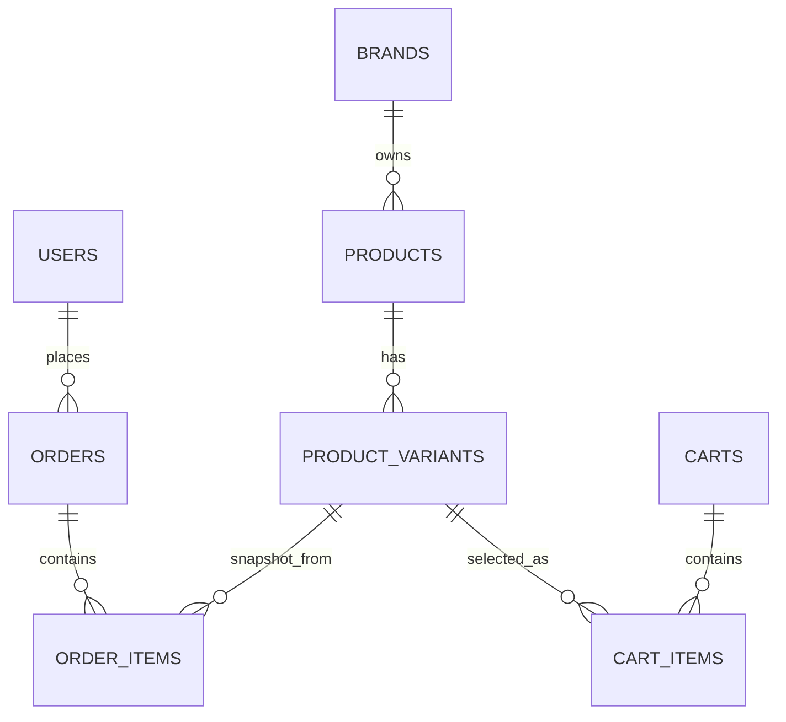
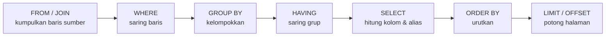
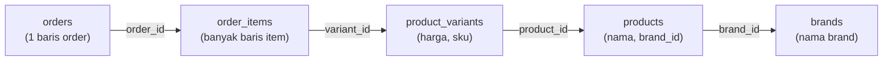
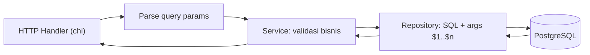

import { Section, Box, Steps, Step, Recap, CardGrid, Card, Chip, Hero, Compare, Endpoint, Def } from "@components";

<Hero eyebrow="Roadmap 3 &middot; PostgreSQL dan pgx" title="SQL Dasar<br /><em>untuk Backend API</em>">
  <p>Query SQL yang kamu tulis di modul ini akan menjadi fondasi repository Go untuk produk, cart, dan order skincare.</p>
  <Fragment slot="meta">
    <Chip icon="database">PostgreSQL <b>18</b></Chip>
    <Chip icon="code">Bahasa: <b>Go 1.26</b></Chip>
    <Chip icon="clock">~80 menit baca</Chip>
  </Fragment>
</Hero>

<Section num="01" id="intro" title="SQL sebagai Bahasa Kontrak Data" sub="Deklaratif, bukan imperatif seperti loop JavaScript">

<p class="lead">Di Laravel, Eloquent sering membuat SQL terasa tersembunyi. Di Go, kita justru lebih dekat dengan SQL, karena repository sengaja dibuat eksplisit, mudah dibaca saat code review, dan mudah diuji.</p>

SQL adalah bahasa deklaratif untuk membaca dan mengubah data relasional. Kamu tidak menulis langkah per langkah seperti `for` di JavaScript. Kamu menyatakan data seperti apa yang dibutuhkan, lalu PostgreSQL yang memilih cara eksekusinya lewat komponen bernama query planner. Ini pergeseran cara berpikir yang penting: dari "bagaimana mengambil" menjadi "apa yang diambil".

<Box variant="bridge" icon="🌉" label="Jembatan: dari Eloquent ke SQL eksplisit"><p>Di Laravel, `ProductVariant::where('is_active', true)->get()` membungkus SQL di balik fluent API. Di Go dengan pgx, kamu menulis `SELECT ... FROM product_variants WHERE is_active = true` langsung, sehingga kolom yang dipilih, filter yang dipakai, dan biaya query terlihat sejak baris pertama repository, bukan tersembunyi di balik method chaining.</p></Box>

<Box variant="bridge" icon="🌉" label="Jembatan: deklaratif seperti React, bukan imperatif seperti jQuery"><p>Ingat lompatan dari jQuery (perintahkan tiap langkah DOM) ke React (deklarasikan tampilan akhir, biar React yang mengurus cara mencapainya). SQL adalah pola yang sama untuk data. Kamu deklarasikan hasil akhir, planner PostgreSQL menentukan urutan scan, index, dan join yang paling murah.</p></Box>

<Def term="query"><p>Perintah SQL yang dikirim aplikasi ke database, misalnya membaca produk aktif, memasukkan order baru, atau menghitung total belanja seorang customer.</p></Def>

<Def term="result set"><p>Kumpulan baris yang dikembalikan oleh query `SELECT`. Di Go, result set dibaca lewat `rows.Next()` lalu dipindahkan (scan) ke struct domain atau DTO response.</p></Def>

<Def term="query planner"><p>Mesin PostgreSQL yang menerjemahkan query deklaratif menjadi rencana eksekusi nyata (urutan scan tabel, pemakaian index, strategi join). Kamu tidak menulis rencananya, tetapi bisa melihatnya dengan `EXPLAIN`, yang dibahas mendalam di chapter indexing.</p></Def>

<CardGrid cols={3}>
  <Card><h4>Katalog Produk</h4><p>`SELECT`, `WHERE`, `JOIN`, `ORDER BY`, dan pagination memberi makan endpoint katalog publik.</p></Card>
  <Card><h4>Cart</h4><p>`INSERT`, `UPDATE`, `DELETE`, dan constraint dipakai saat customer mengubah isi keranjang.</p></Card>
  <Card><h4>Order &amp; Laporan</h4><p>`JOIN`, `GROUP BY`, `SUM`, dan `HAVING` menggerakkan riwayat order dan dashboard admin.</p></Card>
</CardGrid>

Modul ini fokus pada satu hal: menulis SQL yang akurat dan aman, dengan tabel skincare yang sama persis seperti yang akan kita pakai di repository pgx nanti. Kita belum memanggil database dari Go di sini (itu dimulai di chapter koneksi pgx), tetapi setiap query sudah ditulis dengan placeholder `$1` agar tinggal disalin ke kode Go tanpa perombakan.

Untuk rujukan resmi, modul ini selaras dengan dokumentasi PostgreSQL 18 tentang [`SELECT`](https://www.postgresql.org/docs/current/sql-select.html), [`INSERT`](https://www.postgresql.org/docs/current/sql-insert.html), [`RETURNING`](https://www.postgresql.org/docs/current/dml-returning.html), [`LIMIT/OFFSET`](https://www.postgresql.org/docs/current/queries-limit.html), serta aggregate function dan join.

</Section>

<Section num="02" id="skema-contoh" title="Skema Skincare untuk Latihan" sub="Tabel kanonik yang dipakai sepanjang Roadmap 3">

<p class="lead">Sebelum query, kita kunci dulu skema. Tabel di bawah ini adalah subset kanonik online shop skincare yang akan dipakai semua chapter Roadmap 3, jadi nama tabel dan kolomnya tidak boleh berubah-ubah.</p>

Inti penjualan skincare bukan produk, melainkan variant. Satu produk (misalnya "Gentle Cleanser") punya banyak variant (ukuran 100ml dan 200ml, atau shade berbeda), dan justru variant inilah yang memegang harga lewat kolom `price_rupiah` serta punya `sku` unik. `cart_items` dan `order_items` mengacu ke `variant_id`, bukan ke produk langsung.

```sql title="migrations/000002_catalog.up.sql (subset)"
CREATE TABLE brands (
  id          bigint GENERATED ALWAYS AS IDENTITY PRIMARY KEY,
  slug        text NOT NULL UNIQUE,
  name        text NOT NULL,
  created_at  timestamptz NOT NULL DEFAULT now()
);

CREATE TABLE products (
  id          bigint GENERATED ALWAYS AS IDENTITY PRIMARY KEY,
  brand_id    bigint NOT NULL REFERENCES brands(id),
  slug        text NOT NULL UNIQUE,
  name        text NOT NULL,
  status      text NOT NULL DEFAULT 'draft'
                CHECK (status IN ('draft', 'active', 'archived')),
  created_at  timestamptz NOT NULL DEFAULT now(),
  deleted_at  timestamptz
);

CREATE TABLE product_variants (
  id            bigint GENERATED ALWAYS AS IDENTITY PRIMARY KEY,
  product_id    bigint NOT NULL REFERENCES products(id) ON DELETE CASCADE,
  sku           text NOT NULL UNIQUE,
  variant_name  text NOT NULL,
  size_label    text,
  shade         text,
  price_rupiah  bigint NOT NULL CHECK (price_rupiah >= 0),
  is_active     boolean NOT NULL DEFAULT true,
  created_at    timestamptz NOT NULL DEFAULT now()
);
```

```sql title="migrations/000005_orders.up.sql (subset)"
CREATE TABLE orders (
  id              bigint GENERATED ALWAYS AS IDENTITY PRIMARY KEY,
  user_id         bigint NOT NULL REFERENCES users(id),
  order_number    text NOT NULL UNIQUE,
  status          text NOT NULL DEFAULT 'pending'
                    CHECK (status IN ('pending','paid','processing','shipped','completed','cancelled','refunded')),
  subtotal_rupiah bigint NOT NULL CHECK (subtotal_rupiah >= 0),
  total_rupiah    bigint NOT NULL CHECK (total_rupiah >= 0),
  placed_at       timestamptz NOT NULL DEFAULT now(),
  created_at      timestamptz NOT NULL DEFAULT now()
);

CREATE TABLE order_items (
  id                bigint GENERATED ALWAYS AS IDENTITY PRIMARY KEY,
  order_id          bigint NOT NULL REFERENCES orders(id) ON DELETE CASCADE,
  variant_id        bigint NOT NULL REFERENCES product_variants(id),
  product_name      text NOT NULL,   -- snapshot saat checkout
  sku               text NOT NULL,   -- snapshot saat checkout
  unit_price_rupiah bigint NOT NULL CHECK (unit_price_rupiah >= 0),
  quantity          integer NOT NULL CHECK (quantity > 0)
);
```



<p class="fig-cap"><b>Gambar 1.</b> ERD subset skincare untuk latihan SQL. Variant memegang harga; cart dan order item mengacu ke variant.</p>

<Box variant="warn" icon="💰" label="Uang selalu integer rupiah, bukan float"><p>Kolom uang memakai `bigint` rupiah utuh: `price_rupiah`, `subtotal_rupiah`, `total_rupiah`, `unit_price_rupiah`. Jangan pernah `float`, `numeric`, atau kolom `_cents`. Di Go ini memetakan ke `int64`, sehingga harga 129.000 rupiah disimpan sebagai angka `129000`, bebas dari galat pembulatan pecahan.</p></Box>

<Box variant="note" icon="🧭" label="Snapshot di order_items"><p>`order_items` menyalin `product_name`, `sku`, dan `unit_price_rupiah` saat checkout. Ini sengaja: jika harga variant naik besok, invoice kemarin tetap menampilkan harga saat dibeli. Kita akan sering mem-`JOIN` ke `product_variants` untuk catalog, tetapi laporan order membaca kolom snapshot.</p></Box>

</Section>

<Section num="03" id="urutan-eksekusi" title="Urutan Eksekusi Logis Query" sub="Kenapa WHERE tidak bisa memakai alias dari SELECT">

<p class="lead">Satu sumber kebingungan terbesar pendatang baru SQL: query ditulis dengan urutan `SELECT ... FROM ... WHERE`, tetapi PostgreSQL mengevaluasinya dengan urutan logis yang sangat berbeda. Memahami urutan ini menjelaskan banyak error sekaligus.</p>

Urutan kamu menulis klausa bukan urutan database memprosesnya. Secara logis, PostgreSQL mulai dari `FROM` (tentukan sumber baris), lalu menyaring dengan `WHERE`, mengelompokkan dengan `GROUP BY`, menyaring grup dengan `HAVING`, baru kemudian menghitung kolom `SELECT`, mengurutkan dengan `ORDER BY`, dan terakhir memotong dengan `LIMIT/OFFSET`.



<p class="fig-cap"><b>Gambar 2.</b> Urutan eksekusi logis. `SELECT` dievaluasi setelah `WHERE` dan `GROUP BY`, itulah sebabnya alias kolom belum tersedia di `WHERE`.</p>

Konsekuensi praktis pertama: alias yang kamu definisikan di `SELECT` belum ada saat `WHERE` berjalan. Query berikut akan error karena `harga` belum dikenal di tahap `WHERE`.

```sql title="salah.sql"
-- ERROR: column "harga" does not exist
SELECT price_rupiah AS harga
FROM product_variants
WHERE harga <= 200000;
```

Solusinya: pakai ekspresi aslinya di `WHERE`, atau pakai alias di `ORDER BY` (yang memang berjalan setelah `SELECT`).

```sql title="benar.sql"
SELECT price_rupiah AS harga
FROM product_variants
WHERE price_rupiah <= 200000   -- ekspresi asli, bukan alias
ORDER BY harga ASC;            -- alias boleh di sini, ORDER BY setelah SELECT
```

<Box variant="bridge" icon="🌉" label="Jembatan: rantai array method JS punya urutan eksplisit"><p>Di JavaScript kamu menulis `arr.filter(...).map(...).sort(...).slice(0, 20)`, dan setiap langkah jelas urutannya karena kamu sendiri yang merangkainya. SQL menyembunyikan urutan itu di balik satu pernyataan, jadi kamu harus menghafalnya: `WHERE` (filter) selalu sebelum `SELECT` (map), dan `LIMIT` (slice) selalu paling akhir.</p></Box>

<Box variant="tip" icon="💡" label="Kenapa ini penting untuk performa"><p>Karena `WHERE` berjalan lebih dulu, filter yang selektif memangkas baris sebelum operasi mahal seperti `ORDER BY` atau aggregate. Menaruh filter yang tepat (dan, nanti, index yang tepat) di `WHERE` adalah tuas performa terbesar yang kamu kendalikan.</p></Box>

</Section>

<Section num="04" id="select-where" title="SELECT, FROM, dan WHERE" sub="Query yang menggerakkan hampir setiap endpoint baca">

<p class="lead">`SELECT` adalah query paling sering muncul di backend API karena hampir semua endpoint membaca data sebelum merespons client.</p>

Bentuk dasarnya `SELECT kolom FROM tabel WHERE kondisi`. Pilih kolom yang benar-benar dibutuhkan. Jangan refleks memakai `SELECT *` di endpoint produksi: ia menarik kolom yang tidak perlu, membuat kontrak ke struct Go rapuh, dan gampang membocorkan kolom internal.

```sql title="queries/list-active-variants.sql"
SELECT id, product_id, sku, variant_name, price_rupiah
FROM product_variants
WHERE is_active = true;
```

Untuk detail produk publik, kita cari dengan `slug`, karena `slug` enak dipakai di URL. `id` dipakai untuk relasi internal.

```sql title="queries/product-detail-by-slug.sql"
SELECT id, brand_id, slug, name, status, created_at
FROM products
WHERE slug = 'gentle-cleanser'
  AND status = 'active'
  AND deleted_at IS NULL;
```

<Box variant="warn" icon="⚠️" label="Jebakan: SELECT * terasa praktis, tapi rapuh"><p>`SELECT *` membuat API gampang membocorkan kolom internal seperti `deleted_at`, dan kode Go mudah rusak saat urutan atau jumlah kolom berubah (`rows.Scan` memetakan kolom berdasarkan posisi). Tulis kolom eksplisit, selalu.</p></Box>

<h3>WHERE untuk filter katalog</h3>

Filter produk skincare biasanya datang dari query parameter React app: brand, harga maksimum, dan status stok. Operator perbandingan (`=`, `<>`, `<=`, `>=`), `BETWEEN`, `IN`, dan pencocokan teks `ILIKE` (case-insensitive) adalah perkakas sehari-hari.

```sql title="queries/variant-filter.sql"
SELECT id, sku, variant_name, shade, price_rupiah
FROM product_variants
WHERE is_active = true
  AND price_rupiah BETWEEN 50000 AND 250000
  AND variant_name ILIKE '%toner%';
```

`IN` cocok untuk menyaring beberapa nilai sekaligus, misalnya beberapa status order.

```sql title="queries/orders-by-status.sql"
SELECT id, order_number, status, total_rupiah
FROM orders
WHERE status IN ('paid', 'processing', 'shipped');
```

<Box variant="bridge" icon="🌉" label="Jembatan: WHERE adalah Array.filter()"><p>`WHERE price_rupiah <= 250000` sama persis maksudnya dengan `variants.filter(v => v.priceRupiah <= 250000)` di JavaScript. Bedanya, SQL menyaring di database sebelum data dikirim lewat jaringan, sedangkan `filter` JS berjalan setelah seluruh data sudah ada di memori aplikasi. Untuk dataset besar, perbedaan ini menentukan apakah API cepat atau lambat.</p></Box>

<Endpoint method="GET" path="/v1/products" desc="Daftar produk aktif dengan filter brand dan harga" />
<Endpoint method="GET" path="/v1/products/gentle-cleanser" desc="Detail produk berdasarkan slug publik" />

</Section>

<Section num="05" id="null-semantics" title="NULL dan Tiga Nilai Logika" sub="Bukan sekadar null JavaScript, ini logika tiga-nilai">

<p class="lead">`NULL` di SQL berarti "tidak diketahui", dan ia mengikuti aturan logika tiga-nilai (true, false, unknown). Salah memahami ini adalah sumber bug filter yang paling sering lolos sampai produksi.</p>

Aturan kunci: apa pun yang dibandingkan dengan `NULL` lewat `=` atau `<>` menghasilkan `unknown`, bukan true atau false. Dan `WHERE` hanya meloloskan baris yang kondisinya bernilai `true`. Maka `WHERE deleted_at = NULL` tidak pernah meloloskan baris apa pun, walau niatmu mencari yang belum dihapus.

```sql title="null-salah-vs-benar.sql"
-- SALAH: = NULL menghasilkan unknown, baris tidak pernah lolos
SELECT id FROM products WHERE deleted_at = NULL;

-- BENAR: pakai IS NULL / IS NOT NULL
SELECT id FROM products WHERE deleted_at IS NULL;      -- belum dihapus
SELECT id FROM products WHERE deleted_at IS NOT NULL;  -- sudah soft-deleted
```

<Box variant="bridge" icon="🌉" label="Jembatan: NULL bukan undefined JS dan bukan null PHP"><p>Di JS, `value === null` bekerja normal dan `null == undefined` bernilai true. Di SQL, `value = NULL` justru tidak pernah true, karena `NULL` berarti "tidak diketahui" dan dua hal tak-diketahui tidak bisa dibilang sama. Selalu pakai `IS NULL` dan `IS NOT NULL`, jangan `= NULL`.</p></Box>

<h3>NULL dalam aggregate dan COALESCE</h3>

`COUNT(*)` menghitung semua baris, tetapi `COUNT(kolom)` melewati baris yang kolomnya `NULL`. `SUM` dan `AVG` juga mengabaikan `NULL`. Saat kamu butuh angka `0` alih-alih `NULL` (misalnya total belanja customer yang belum pernah order), bungkus dengan `COALESCE`.

```sql title="coalesce-default.sql"
-- COALESCE mengembalikan argumen pertama yang bukan NULL
SELECT
  u.id,
  COALESCE(SUM(o.total_rupiah), 0) AS total_spent_rupiah
FROM users u
LEFT JOIN orders o ON o.user_id = u.id
GROUP BY u.id;
```

<Box variant="warn" icon="⚠️" label="Jebakan: NOT IN dengan NULL"><p>`WHERE id NOT IN (1, 2, NULL)` akan mengembalikan nol baris, karena perbandingan dengan `NULL` di dalam list membuat seluruh kondisi `unknown`. Pastikan subquery di balik `NOT IN` tidak pernah menghasilkan `NULL`, atau pakai `NOT EXISTS` yang lebih aman terhadap `NULL`.</p></Box>

<Def term="three-valued logic"><p>Logika SQL dengan tiga hasil: `true`, `false`, dan `unknown`. `WHERE` dan `HAVING` hanya meloloskan baris yang kondisinya `true`. `NULL` dalam perbandingan menghasilkan `unknown`, sehingga baris tersaring keluar diam-diam.</p></Def>

</Section>

<Section num="06" id="insert-returning" title="INSERT dengan RETURNING" sub="Dapatkan id baru tanpa query kedua">

<p class="lead">Di PostgreSQL, `RETURNING` sangat penting untuk backend Go, karena kita hampir selalu butuh `id` (atau kolom yang dibuat database) segera setelah insert, tanpa harus melakukan `SELECT` susulan.</p>

Bentuk dasarnya `INSERT INTO tabel (kolom) VALUES (nilai) RETURNING id`. PostgreSQL mendukung `RETURNING` pada perintah yang memodifikasi baris (`INSERT`, `UPDATE`, `DELETE`), dan ini menghemat satu round-trip ke database.

```sql title="queries/create-variant.sql"
INSERT INTO product_variants
  (product_id, sku, variant_name, size_label, price_rupiah)
VALUES
  (1, 'GC-100ML', 'Gentle Cleanser 100ml', '100ml', 129000)
RETURNING id;
```

Untuk response `201 Created`, kita sering ingin mengembalikan seluruh data baris baru, termasuk kolom yang diisi default oleh database (seperti `created_at` dan `is_active`).

```sql title="queries/create-variant-full.sql"
INSERT INTO product_variants
  (product_id, sku, variant_name, size_label, price_rupiah)
VALUES
  (1, 'GC-200ML', 'Gentle Cleanser 200ml', '200ml', 199000)
RETURNING id, sku, variant_name, price_rupiah, is_active, created_at;
```

<Box variant="bridge" icon="🌉" label="Jembatan: dari Eloquent create() ke INSERT RETURNING"><p>`ProductVariant::create($data)` di Laravel otomatis mengisi atribut `id` model setelah insert (di balik layar Eloquent menjalankan query lagi atau memakai `lastInsertId`). Di Go, `INSERT ... RETURNING id` adalah cara eksplisit dan satu round-trip untuk mendapatkan nilai yang dibuat database, tanpa sihir.</p></Box>

<h3>Insert cart item</h3>

Saat customer menambahkan item ke cart, `cart_items` menyimpan `cart_id`, `variant_id`, dan `quantity`. Perhatikan: cart item tidak menyimpan harga. Harga dibaca segar dari `product_variants` saat checkout, supaya cart selalu memantulkan harga terkini.

```sql title="queries/add-cart-item.sql"
INSERT INTO cart_items (cart_id, variant_id, quantity)
VALUES (10, 7, 2)
RETURNING id, cart_id, variant_id, quantity, created_at;
```

<Box variant="tip" icon="💡" label="Upsert untuk cart yang sama"><p>Jika customer menambah variant yang sudah ada di cart, idealnya quantity bertambah, bukan baris baru. PostgreSQL punya `INSERT ... ON CONFLICT (cart_id, variant_id) DO UPDATE SET quantity = cart_items.quantity + EXCLUDED.quantity`. Pola upsert ini kita perdalam di chapter write pgx; untuk sekarang cukup tahu bahwa unique constraint `(cart_id, variant_id)` membuatnya mungkin.</p></Box>

<Endpoint method="POST" path="/v1/admin/variants" desc="Admin membuat variant produk, API mengembalikan id dari PostgreSQL" />
<Endpoint method="POST" path="/v1/cart/items" desc="Customer menambah variant ke keranjang" />

</Section>

<Section num="07" id="update-delete" title="UPDATE, DELETE, dan Soft Delete" sub="Perintah yang wajib dijaga ketat dengan WHERE">

<p class="lead">`UPDATE` dan `DELETE` terlihat sederhana, tetapi di backend nyata keduanya selalu harus dibatasi dengan `WHERE` yang jelas. Satu klausa yang lupa bisa mengubah seluruh tabel.</p>

`UPDATE` mengubah baris yang sudah ada. Untuk admin katalog, query umum adalah mengubah harga, nama, atau status aktif variant. Gabungkan dengan `RETURNING` agar handler langsung punya data terbaru untuk dikirim ke client.

```sql title="queries/update-variant-price.sql"
UPDATE product_variants
SET price_rupiah = 139000
WHERE id = 7
RETURNING id, sku, price_rupiah;
```

<Box variant="warn" icon="🚨" label="Jebakan besar: UPDATE atau DELETE tanpa WHERE"><p>`UPDATE product_variants SET price_rupiah = 139000` (tanpa `WHERE`) akan mengubah harga SEMUA variant di seluruh katalog. Biasakan menulis `WHERE` lebih dulu, baru `SET`. Di klien interaktif, banyak tim mengaktifkan mode "safe update" yang menolak `UPDATE`/`DELETE` tanpa kunci.</p></Box>

`DELETE` menghapus baris secara fisik. Untuk data transaksi (order, payment), ini hampir selalu salah karena riwayat audit hilang. Untuk item cart, hard delete masuk akal karena cart bersifat sementara.

```sql title="queries/delete-cart-item.sql"
DELETE FROM cart_items
WHERE id = 15
  AND cart_id = 10;
```

<Box variant="tip" icon="💡" label="Selalu sertakan pemilik baris di WHERE"><p>Untuk aksi milik customer seperti menghapus item cart, tambahkan `AND cart_id = $2` (atau lewat join ke cart milik user yang login). Tanpa itu, customer bisa menghapus item milik orang lain hanya dengan menebak `id`. Ini bukan optimasi, ini kontrol akses.</p></Box>

<h3>Soft delete: hapus tanpa menghapus</h3>

Soft delete berarti baris tidak benar-benar dihapus. Kita isi kolom `deleted_at`, lalu semua query publik menambahkan filter `deleted_at IS NULL`. Pola ini menjaga riwayat (produk yang sudah pernah dibeli tetap bisa dirujuk order lama) sambil menyembunyikannya dari katalog.

```sql title="queries/soft-delete-product.sql"
UPDATE products
SET deleted_at = now(),
    status = 'archived'
WHERE id = 1
  AND deleted_at IS NULL
RETURNING id, status, deleted_at;
```

```sql title="queries/public-products.sql"
-- Katalog publik selalu menyaring yang sudah soft-deleted
SELECT id, slug, name, status
FROM products
WHERE deleted_at IS NULL
  AND status = 'active';
```

<Box variant="bridge" icon="🌉" label="Jembatan: SoftDeletes trait Laravel"><p>Laravel menyediakan trait `SoftDeletes` yang otomatis menambahkan `WHERE deleted_at IS NULL` ke setiap query Eloquent. Di Go raw SQL, tidak ada sihir otomatis: kamu menulis `deleted_at IS NULL` sendiri di setiap query publik. Lebih berisik, tetapi tidak ada filter tersembunyi yang mengejutkanmu saat debugging.</p></Box>

<Endpoint method="PATCH" path="/v1/admin/variants/7" desc="Admin mengubah harga atau status variant" />
<Endpoint method="DELETE" path="/v1/admin/products/1" desc="Admin mengarsipkan produk (soft delete)" />

</Section>

<Section num="08" id="pagination" title="ORDER BY, LIMIT, dan OFFSET" sub="Pagination untuk katalog, order history, dan dashboard">

<p class="lead">Pagination adalah kebutuhan harian: product listing, order history, dan tabel admin semuanya butuh memotong hasil menjadi halaman.</p>

`ORDER BY` menentukan urutan baris, `LIMIT` membatasi jumlah, dan `OFFSET` melewati sejumlah baris di awal. PostgreSQL mengingatkan bahwa tanpa `ORDER BY` yang deterministik, urutan baris tidak dijamin, sehingga `LIMIT/OFFSET` bisa memberi halaman yang acak atau tumpang tindih.

```sql title="queries/products-page-1.sql"
SELECT id, slug, name, created_at
FROM products
WHERE deleted_at IS NULL
  AND status = 'active'
ORDER BY created_at DESC, id DESC   -- tie-breaker id agar deterministik
LIMIT 20
OFFSET 0;
```

Halaman kedua dengan `per_page = 20` memakai `OFFSET 20`. Rumusnya `offset = (page - 1) * per_page`.

```sql title="queries/products-page-2.sql"
SELECT id, slug, name, created_at
FROM products
WHERE deleted_at IS NULL
  AND status = 'active'
ORDER BY created_at DESC, id DESC
LIMIT 20
OFFSET 20;
```

<Box variant="tip" icon="💡" label="Selalu tambahkan tie-breaker unik"><p>`ORDER BY created_at DESC` saja berbahaya: jika dua baris punya `created_at` sama persis (mudah terjadi pada insert batch), urutannya tidak pasti dan satu produk bisa muncul di dua halaman. Tambahkan `id DESC` sebagai tie-breaker, karena `id` selalu unik.</p></Box>

<h3>Sort dari harga termurah</h3>

```sql title="queries/variants-cheapest-first.sql"
SELECT id, sku, variant_name, price_rupiah
FROM product_variants
WHERE is_active = true
ORDER BY price_rupiah ASC, id ASC
LIMIT 12
OFFSET 0;
```

<Box variant="bridge" icon="🌉" label="Jembatan: ini sort().slice() di JavaScript"><p>`ORDER BY price_rupiah ASC LIMIT 12 OFFSET 0` setara dengan `variants.sort((a,b)=>a.priceRupiah-b.priceRupiah).slice(0, 12)`. Sekali lagi bedanya lokasi: SQL mengurutkan dan memotong di database, jadi hanya 12 baris yang melintasi jaringan, bukan seluruh katalog.</p></Box>

<Box variant="warn" icon="⚠️" label="Jebakan: OFFSET besar makin lambat"><p>`OFFSET 100000` tetap memaksa PostgreSQL memindai dan membuang 100.000 baris pertama sebelum mengembalikan 20 baris. Untuk halaman dalam, biaya ini membengkak. Solusi yang lebih cepat adalah keyset pagination (`WHERE (created_at, id) < ($1, $2) ORDER BY created_at DESC, id DESC LIMIT 20`), yang kita bahas tuntas di chapter indexing dan performa. Untuk sekarang, `LIMIT/OFFSET` sudah cukup dan paling mudah dipahami.</p></Box>

</Section>

<Section num="09" id="join" title="INNER JOIN dan LEFT JOIN" sub="Menggabungkan beberapa tabel dalam satu response">

<p class="lead">Relasi tabel menjadi nyata saat API perlu menggabungkan data dari beberapa tabel dalam satu response, misalnya menampilkan variant beserta nama produk dan brand-nya.</p>

`INNER JOIN` hanya mengembalikan baris yang punya pasangan di kedua tabel. Untuk halaman katalog yang menampilkan variant beserta produk dan brand, ini tepat: kita hanya mau variant yang memang terhubung ke produk yang ada.

```sql title="queries/variants-with-product.sql"
SELECT
  v.id            AS variant_id,
  v.sku,
  v.variant_name,
  v.price_rupiah,
  p.name          AS product_name,
  b.name          AS brand_name
FROM product_variants v
INNER JOIN products p ON p.id = v.product_id
INNER JOIN brands b   ON b.id = p.brand_id
WHERE v.is_active = true
  AND p.deleted_at IS NULL
  AND p.status = 'active'
ORDER BY p.name ASC, v.price_rupiah ASC;
```

`LEFT JOIN` mengembalikan semua baris tabel kiri, walau tabel kanan tidak punya pasangan. Kolom dari sisi kanan akan `NULL` untuk baris tak berpasangan. Ini berguna untuk admin, misalnya menemukan produk yang belum punya variant agar segera dilengkapi.

```sql title="queries/products-without-variants.sql"
SELECT
  p.id   AS product_id,
  p.name AS product_name,
  v.id   AS variant_id
FROM products p
LEFT JOIN product_variants v ON v.product_id = p.id
WHERE p.deleted_at IS NULL
  AND v.id IS NULL   -- hanya produk yang TIDAK punya variant
ORDER BY p.name ASC;
```



<p class="fig-cap"><b>Gambar 3.</b> Rantai JOIN untuk menampilkan detail order lengkap: dari order ke item, ke variant, ke produk, ke brand.</p>

Untuk menampilkan detail satu order lengkap dengan nama produk dan brand, kita rantai beberapa join. Perhatikan, untuk laporan order kita pakai kolom snapshot (`oi.product_name`, `oi.unit_price_rupiah`) agar harga historis akurat, dan join ke katalog hanya untuk data yang memang ingin "fresh".

```sql title="queries/order-detail.sql"
SELECT
  o.order_number,
  o.status,
  oi.product_name,           -- snapshot saat checkout
  oi.unit_price_rupiah,      -- snapshot saat checkout
  oi.quantity,
  b.name AS current_brand    -- data katalog terkini (boleh berbeda)
FROM orders o
INNER JOIN order_items oi      ON oi.order_id = o.id
INNER JOIN product_variants v  ON v.id = oi.variant_id
INNER JOIN products p          ON p.id = v.product_id
INNER JOIN brands b            ON b.id = p.brand_id
WHERE o.id = $1
ORDER BY oi.id ASC;
```

<Compare aLabel="INNER JOIN" bLabel="LEFT JOIN" aTone="teal" bTone="violet">
  <Fragment slot="a"><ul><li>Hanya baris yang punya pasangan di kedua tabel.</li><li>Cocok untuk response publik yang butuh data lengkap.</li><li>Variant tanpa produk tidak akan muncul.</li></ul></Fragment>
  <Fragment slot="b"><ul><li>Semua baris tabel kiri tetap tampil; sisi kanan jadi `NULL` bila tak berpasangan.</li><li>Cocok untuk dashboard admin dan mencari data yang belum lengkap.</li><li>Filter `v.id IS NULL` mengisolasi baris tak berpasangan.</li></ul></Fragment>
</Compare>

<Box variant="warn" icon="⚠️" label="Jebakan: nama kolom ambigu"><p>Kalau dua tabel sama-sama punya kolom `id` atau `name`, query gagal tanpa kualifikasi tabel. Selalu beri prefix tabel (`v.id`, `p.name`) dan alias kolom hasil (`AS variant_id`, `AS product_name`) agar mapping ke struct Go lewat `rows.Scan` jelas dan tidak tertukar.</p></Box>

<Box variant="warn" icon="⚠️" label="Jebakan: LEFT JOIN lalu memfilter sisi kanan di WHERE"><p>Menulis `LEFT JOIN ... WHERE v.is_active = true` diam-diam mengubah `LEFT JOIN` menjadi `INNER JOIN`, karena baris dengan `v` `NULL` gagal lolos `v.is_active = true`. Jika kamu butuh syarat pada sisi kanan tetapi tetap mempertahankan baris kiri, taruh syarat itu di klausa `ON` (`LEFT JOIN ... ON v.product_id = p.id AND v.is_active = true`), bukan di `WHERE`.</p></Box>

</Section>

<Section num="10" id="group-by" title="GROUP BY, Aggregate, dan HAVING" sub="Mengubah banyak baris menjadi angka ringkas">

<p class="lead">Aggregate query meringkas banyak baris menjadi angka, cocok untuk dashboard, ringkasan order, dan laporan penjualan. `GROUP BY` mengelompokkan, `HAVING` menyaring grup.</p>

Fungsi aggregate inti: `COUNT` (jumlah baris), `SUM` (penjumlahan), `AVG` (rata-rata), `MIN`/`MAX` (nilai ekstrem). `GROUP BY` membagi baris menjadi grup, lalu aggregate dihitung per grup.

```sql title="queries/order-count-per-user.sql"
SELECT
  u.id        AS user_id,
  u.email,
  COUNT(o.id) AS total_orders
FROM users u
LEFT JOIN orders o ON o.user_id = u.id
GROUP BY u.id, u.email
ORDER BY total_orders DESC;
```

Untuk total nilai belanja per customer, gunakan `SUM`. Karena `LEFT JOIN` bisa menghasilkan `NULL` untuk customer tanpa order, `COALESCE(SUM(...), 0)` mengubahnya menjadi `0`.

```sql title="queries/customer-spending.sql"
SELECT
  u.id        AS user_id,
  u.email,
  COUNT(o.id) AS total_orders,
  COALESCE(SUM(o.total_rupiah), 0) AS total_spent_rupiah
FROM users u
LEFT JOIN orders o ON o.user_id = u.id
   AND o.status IN ('paid', 'completed')   -- hanya order yang benar dibayar
GROUP BY u.id, u.email
ORDER BY total_spent_rupiah DESC;
```

<h3>HAVING: menyaring setelah dikelompokkan</h3>

`WHERE` menyaring baris sebelum dikelompokkan; `HAVING` menyaring grup setelah aggregate dihitung. Untuk menemukan "customer VIP" yang sudah belanja lebih dari 1 juta rupiah, syarat itu memakai hasil `SUM`, sehingga harus di `HAVING`, bukan `WHERE`.

```sql title="queries/vip-customers.sql"
SELECT
  u.id,
  u.email,
  SUM(o.total_rupiah) AS total_spent_rupiah
FROM users u
INNER JOIN orders o ON o.user_id = u.id
WHERE o.status IN ('paid', 'completed')   -- saring baris dulu (sebelum grup)
GROUP BY u.id, u.email
HAVING SUM(o.total_rupiah) > 1000000      -- saring grup (setelah aggregate)
ORDER BY total_spent_rupiah DESC;
```

<h3>Variant terlaris</h3>

Menggabungkan join dan aggregate untuk laporan: variant mana yang paling banyak terjual, memakai snapshot di `order_items`.

```sql title="queries/best-selling-variants.sql"
SELECT
  oi.sku,
  oi.product_name,
  SUM(oi.quantity)                          AS units_sold,
  SUM(oi.unit_price_rupiah * oi.quantity)   AS revenue_rupiah
FROM order_items oi
INNER JOIN orders o ON o.id = oi.order_id
WHERE o.status IN ('paid', 'completed', 'shipped')
GROUP BY oi.sku, oi.product_name
ORDER BY units_sold DESC
LIMIT 10;
```

<Box variant="bridge" icon="🌉" label="Jembatan: GROUP BY + SUM adalah reduce yang dikelompokkan"><p>`SUM(o.total_rupiah)` per user mirip `orders.reduce((acc, o) => acc + o.total, 0)`, tetapi `GROUP BY u.id` membuatnya seperti mengelompokkan dulu dengan `Object.groupBy` lalu `reduce` tiap grup. Bedanya, agregasi terjadi di database dekat data, sehingga hanya angka ringkas (bukan ribuan baris order) yang dikirim ke Go.</p></Box>

<Box variant="warn" icon="⚠️" label="Jebakan GROUP BY: kolom non-aggregate wajib ikut"><p>Setiap kolom di `SELECT` yang bukan fungsi aggregate harus muncul di `GROUP BY`. Menulis `SELECT u.email, u.name, COUNT(o.id) ... GROUP BY u.id` akan ditolak PostgreSQL kecuali `u.email` dan `u.name` ikut di `GROUP BY` (atau kolom-kolom itu bergantung fungsional pada primary key `u.id` yang sudah ada di `GROUP BY`). Aturan amannya: cantumkan semua kolom non-aggregate di `GROUP BY`.</p></Box>

</Section>

<Section num="11" id="parameterized-query" title="Parameterized Query dan SQL Injection" sub="Pemisahan perintah dan data, garis pertahanan utama">

<p class="lead">Query API tidak boleh menyisipkan input user langsung ke string SQL. Gunakan parameter agar nilai dan perintah SQL tetap terpisah. Ini bukan sekadar gaya, ini pertahanan keamanan paling fundamental terhadap SQL injection.</p>

Di PostgreSQL, placeholder parameter ditulis berdasarkan posisi: `$1`, `$2`, `$3`, dan seterusnya. Ini berbeda dari MySQL/PDO yang memakai `?`. Nilai yang dikirim sebagai argumen tidak pernah ditafsirkan sebagai SQL, ia selalu diperlakukan sebagai data murni.

```sql title="queries/variant-search-parameterized.sql"
SELECT id, sku, variant_name, price_rupiah
FROM product_variants
WHERE is_active = true
  AND variant_name ILIKE $1
  AND price_rupiah <= $2
ORDER BY price_rupiah ASC, id ASC
LIMIT $3
OFFSET $4;
```

<Box variant="warn" icon="🚨" label="Bahaya nyata: jangan pernah merangkai SQL dari string input"><p>Membuat query lewat `fmt.Sprintf("... WHERE slug = '%s'", slug)` membuka pintu SQL injection. Jika `slug` berisi `' OR '1'='1`, kondisi `WHERE` menjadi selalu true dan seluruh tabel bocor. Lebih parah, input `'; DROP TABLE products; --` bisa merusak data. Solusinya mutlak: SELALU pakai `$1`, `$2` dan oper nilai sebagai argumen terpisah, jangan tempel ke string.</p></Box>

Bandingkan langsung cara berbahaya dan cara aman saat dipanggil dari Go dengan pgx. Yang aman membuat driver mengirim template dan nilai secara terpisah ke server, sehingga input tidak mungkin "keluar" dari posisinya sebagai data.

<Compare aLabel="BERBAHAYA: string concatenation" bLabel="AMAN: parameter $1" aTone="red" bTone="teal">
  <Fragment slot="a"><ul><li>`fmt.Sprintf("... WHERE slug = '%s'", slug)`</li><li>Input user menyatu dengan perintah SQL.</li><li>`' OR '1'='1` membocorkan seluruh tabel.</li><li>Rentan, dan dilarang di repository proyek ini.</li></ul></Fragment>
  <Fragment slot="b"><ul><li>`pool.QueryRow(ctx, "... WHERE slug = $1", slug)`</li><li>Driver mengirim template dan nilai terpisah.</li><li>Input selalu diperlakukan sebagai data, bukan SQL.</li><li>Aman, dan ini standar pgx.</li></ul></Fragment>
</Compare>

<Def term="parameterized query"><p>Query yang memisahkan template SQL dari nilai input. Nilai user dikirim sebagai argumen lewat placeholder `$1`, `$2`, bukan ditempel ke string SQL. Inilah mekanisme yang menutup celah SQL injection.</p></Def>

<h3>Contoh pemanggilan dari Go dengan pgxpool</h3>

Inilah preview cara query parameterized dipanggil dari Go. Kita belum membahas pgx secara penuh (itu chapter berikutnya), tetapi perhatikan tiga hal idiomatik: `context.Context` sebagai parameter pertama, SQL sebagai konstanta, dan nilai dioper sebagai argumen di belakang.

```go title="internal/product/repository.go"
package product

import (
	"context"
	"errors"

	"github.com/jackc/pgx/v5"
	"github.com/jackc/pgx/v5/pgxpool"
)

type Variant struct {
	ID          int64
	SKU         string
	VariantName string
	PriceRupiah int64
}

type Repository struct {
	pool *pgxpool.Pool
}

func NewRepository(pool *pgxpool.Pool) *Repository {
	return &Repository{pool: pool}
}

func (r *Repository) FindVariantBySKU(ctx context.Context, sku string) (Variant, error) {
	const query = `
SELECT id, sku, variant_name, price_rupiah
FROM product_variants
WHERE sku = $1
  AND is_active = true`

	var v Variant
	err := r.pool.QueryRow(ctx, query, sku).Scan(
		&v.ID,
		&v.SKU,
		&v.VariantName,
		&v.PriceRupiah,
	)
	if errors.Is(err, pgx.ErrNoRows) {
		return Variant{}, ErrVariantNotFound
	}
	if err != nil {
		return Variant{}, err
	}
	return v, nil
}
```

<Box variant="tip" icon="💡" label="Idiom Go: cek ErrNoRows terpisah"><p>`r.pool.QueryRow(...).Scan(...)` mengembalikan `pgx.ErrNoRows` saat tidak ada baris cocok. Periksa dengan `errors.Is(err, pgx.ErrNoRows)` dan ubah menjadi error domain (`ErrVariantNotFound`) yang nanti dipetakan handler ke `404`. Error lain diteruskan sebagai `500`. Pola ini berulang di seluruh repository pgx.</p></Box>

<Box variant="bridge" icon="🌉" label="Jembatan: bukan tanda tanya MySQL"><p>Jika kamu terbiasa PDO MySQL atau query builder Laravel, placeholder `?` terasa akrab. Di PostgreSQL native (dan pgx), gunakan `$1`, `$2`, dan seterusnya. Nomornya berbasis posisi, jadi `$1` boleh dipakai berkali-kali dalam satu query untuk merujuk argumen pertama yang sama.</p></Box>

</Section>

<Section num="12" id="array-method-map" title="Peta JS Array ke Klausa SQL" sub="Pemetaan langsung dari yang sudah kamu kuasai">

<p class="lead">Karena kamu kuat di JavaScript, cara tercepat menjinakkan SQL adalah memetakannya ke array method yang sudah kamu pakai setiap hari. Hampir setiap klausa SQL punya padanan langsung.</p>

<div class="tbl-wrap">
<table>
  <thead><tr><th>JavaScript array</th><th>Klausa SQL</th><th>Contoh skincare</th></tr></thead>
  <tbody>
    <tr><td><code>.filter(v =&gt; ...)</code></td><td><code>WHERE</code></td><td><code>WHERE price_rupiah &lt;= 250000</code></td></tr>
    <tr><td><code>.map(v =&gt; v.x)</code></td><td><code>SELECT</code> kolom</td><td><code>SELECT sku, price_rupiah</code></td></tr>
    <tr><td><code>.sort((a,b)=&gt;...)</code></td><td><code>ORDER BY</code></td><td><code>ORDER BY price_rupiah ASC</code></td></tr>
    <tr><td><code>.slice(0, 20)</code></td><td><code>LIMIT</code> / <code>OFFSET</code></td><td><code>LIMIT 20 OFFSET 0</code></td></tr>
    <tr><td><code>.reduce((a,o)=&gt;a+o.total,0)</code></td><td><code>SUM()</code></td><td><code>SUM(total_rupiah)</code></td></tr>
    <tr><td><code>.length</code></td><td><code>COUNT(&#42;)</code></td><td><code>COUNT(&#42;) AS total</code></td></tr>
    <tr><td><code>Object.groupBy(...)</code></td><td><code>GROUP BY</code></td><td><code>GROUP BY user_id</code></td></tr>
    <tr><td><code>.find(v =&gt; v.id===id)</code></td><td><code>WHERE</code> + <code>LIMIT 1</code></td><td><code>WHERE id = $1 LIMIT 1</code></td></tr>
    <tr><td>gabung 2 array berdasar key</td><td><code>JOIN ... ON</code></td><td><code>JOIN products p ON p.id = v.product_id</code></td></tr>
  </tbody>
</table>
</div>

<p class="fig-cap"><b>Gambar 4.</b> Peta padanan array method JavaScript ke klausa SQL.</p>

Yang membuat SQL bukan sekadar "array method di database" adalah dua hal. Pertama, urutan eksekusi logis tetap (`WHERE` selalu sebelum `SELECT`), tidak sebebas merangkai method. Kedua, dan ini pembeda nyata, SQL mengeksekusi semuanya dekat data lalu hanya mengirim hasil akhir lewat jaringan.

<Box variant="bridge" icon="🌉" label="Jembatan: kenapa tidak ambil semua lalu .filter() di Go?"><p>Godaan pemula adalah `SELECT * FROM orders` lalu memfilter di Go dengan slice operation. Untuk 10 baris tidak masalah, tetapi untuk 10 juta baris ini menarik seluruh tabel ke memori aplikasi (mahal di RAM dan jaringan). Biarkan database melakukan `WHERE`, `JOIN`, dan `SUM`; Go hanya menerima hasil yang sudah ringkas. Aturan praktis: dorong pekerjaan data ke tempat data tinggal.</p></Box>

<Box variant="note" icon="📌" label="Padanan Laravel query builder"><p>Untuk yang datang dari Laravel, peta serupa berlaku: `where()` jadi `WHERE`, `select()` jadi `SELECT`, `orderBy()` jadi `ORDER BY`, `limit()/offset()` jadi `LIMIT/OFFSET`, `join()` jadi `JOIN`, `groupBy()` jadi `GROUP BY`, dan `sum()/count()` jadi aggregate. Di Go kita menulis SQL-nya langsung, jadi tidak ada lapisan builder di antaranya.</p></Box>

</Section>

<Section num="13" id="hands-on" title="Hands-on Query API Skincare" sub="Tiga query yang siap dibawa ke repository">

<p class="lead">Latihan ini menyusun tiga query nyata yang langsung bisa kamu pindahkan ke repository produk, cart, dan order di chapter pgx. Semuanya sudah memakai placeholder `$1` dan kolom kanonik.</p>

<Steps>
  <Step><b>Query listing katalog</b><p>Ambil variant aktif beserta nama produk dan brand, urut terbaru, dengan pagination parameterized.</p></Step>
  <Step><b>Query tambah cart item</b><p>Masukkan `cart_id`, `variant_id`, dan `quantity`, lalu ambil baris baru dengan `RETURNING`.</p></Step>
  <Step><b>Query order history</b><p>Gabungkan `orders` dan `order_items`, hitung total item per order, dengan paginasi.</p></Step>
</Steps>

```sql title="hands-on/01-list-catalog.sql"
SELECT
  v.id            AS variant_id,
  v.sku,
  v.variant_name,
  v.price_rupiah,
  p.name          AS product_name,
  b.name          AS brand_name
FROM product_variants v
INNER JOIN products p ON p.id = v.product_id
INNER JOIN brands b   ON b.id = p.brand_id
WHERE v.is_active = true
  AND p.deleted_at IS NULL
  AND p.status = 'active'
ORDER BY p.created_at DESC, v.id DESC
LIMIT $1
OFFSET $2;
```

```sql title="hands-on/02-add-cart-item.sql"
INSERT INTO cart_items (cart_id, variant_id, quantity)
VALUES ($1, $2, $3)
RETURNING id, cart_id, variant_id, quantity, created_at;
```

```sql title="hands-on/03-order-history.sql"
SELECT
  o.id              AS order_id,
  o.order_number,
  o.status,
  o.total_rupiah,
  o.placed_at,
  COUNT(oi.id)      AS line_count,
  SUM(oi.quantity)  AS total_items
FROM orders o
INNER JOIN order_items oi ON oi.order_id = o.id
WHERE o.user_id = $1
GROUP BY o.id, o.order_number, o.status, o.total_rupiah, o.placed_at
ORDER BY o.placed_at DESC, o.id DESC
LIMIT $2
OFFSET $3;
```

<h3>Checklist sebelum query masuk repository</h3>

<ul><li>Semua input user memakai `$1`, `$2`, bukan string concatenation.</li><li>`SELECT` mengambil kolom eksplisit, bukan `*`.</li><li>`UPDATE` dan `DELETE` selalu punya `WHERE` yang membatasi baris, plus kunci pemilik.</li><li>Filter nullable memakai `IS NULL` / `IS NOT NULL`, bukan `= NULL`.</li><li>Pagination memakai `ORDER BY` deterministik dengan tie-breaker `id`.</li><li>Kolom hasil `JOIN` diberi alias agar mudah di-scan ke struct Go.</li><li>Kolom non-aggregate di query `GROUP BY` ikut dicantumkan di `GROUP BY`.</li></ul>



<p class="fig-cap"><b>Gambar 5.</b> Posisi SQL dalam alur request API Go. SQL hidup di lapisan repository, dipanggil dengan argumen parameterized.</p>

<Endpoint method="GET" path="/v1/products" desc="Memakai 01-list-catalog.sql" />
<Endpoint method="POST" path="/v1/cart/items" desc="Memakai 02-add-cart-item.sql" />
<Endpoint method="GET" path="/v1/orders" desc="Memakai 03-order-history.sql" />

</Section>

<Section num="14" id="ringkasan" title="Ringkasan & Poin Penting" sub="Fondasi sebelum pgxpool, transaksi, dan repository">

<p class="lead">SQL dasar di modul ini adalah fondasi sebelum kita menyentuh pgxpool, transaksi, dan repository pattern di chapter-chapter berikutnya Roadmap 3.</p>

<Recap title="Yang Wajib Menempel"><ul><li>SQL itu deklaratif: nyatakan apa yang dibutuhkan, planner PostgreSQL urus caranya.</li><li>Urutan eksekusi logis (`FROM`, `WHERE`, `GROUP BY`, `HAVING`, `SELECT`, `ORDER BY`, `LIMIT`) menjelaskan kenapa alias `SELECT` tak bisa dipakai di `WHERE`.</li><li>`NULL` itu "tidak diketahui": pakai `IS NULL` / `IS NOT NULL`, jangan `= NULL`; bungkus aggregate dengan `COALESCE`.</li><li>`INSERT ... RETURNING id` adalah pola PostgreSQL satu round-trip yang penting untuk Go.</li><li>`UPDATE` dan `DELETE` wajib dibatasi `WHERE` plus kunci pemilik; soft delete memakai `deleted_at IS NULL`.</li><li>`ORDER BY` + `LIMIT/OFFSET` membentuk pagination, selalu dengan tie-breaker `id`; keyset menyusul di chapter indexing.</li><li>`INNER JOIN` mengambil pasangan lengkap, `LEFT JOIN` menjaga baris kiri; syarat sisi kanan taruh di `ON`, bukan `WHERE`.</li><li>`GROUP BY` dengan `COUNT`/`SUM` dan saringan `HAVING` menggerakkan laporan dan dashboard.</li><li>Parameter `$1`, `$2` (bukan `?` MySQL) memisahkan data dari perintah dan menutup celah SQL injection.</li></ul></Recap>

<CardGrid cols={3}>
  <Card><h4>Sudah dikuasai</h4><p>Membaca, menulis, menggabung, dan meringkas data skincare dengan SQL parameterized yang aman.</p></Card>
  <Card><h4>Berikutnya: pgx</h4><p>Query ini dipanggil dari Go lewat `pgxpool`, `QueryRow`, `Query`, `Exec`, dengan `context.Context`.</p></Card>
  <Card><h4>Lalu: transaksi &amp; index</h4><p>Checkout multi-tabel pakai transaksi; pagination cepat dan `EXPLAIN` dibahas di chapter indexing.</p></Card>
</CardGrid>

<Box variant="tip" icon="🚀" label="Langkah berikutnya"><p>Di chapter koneksi dan query pgx, query yang sudah kamu tulis di sini akan dieksekusi dari Go: `pool.Query(ctx, sql, args...)` untuk banyak baris, `pool.QueryRow(...)` untuk satu baris, dan `pool.Exec(...)` untuk write. Kolom dan placeholder `$1` yang sudah rapi membuat perpindahannya nyaris tanpa friksi.</p></Box>

</Section>
