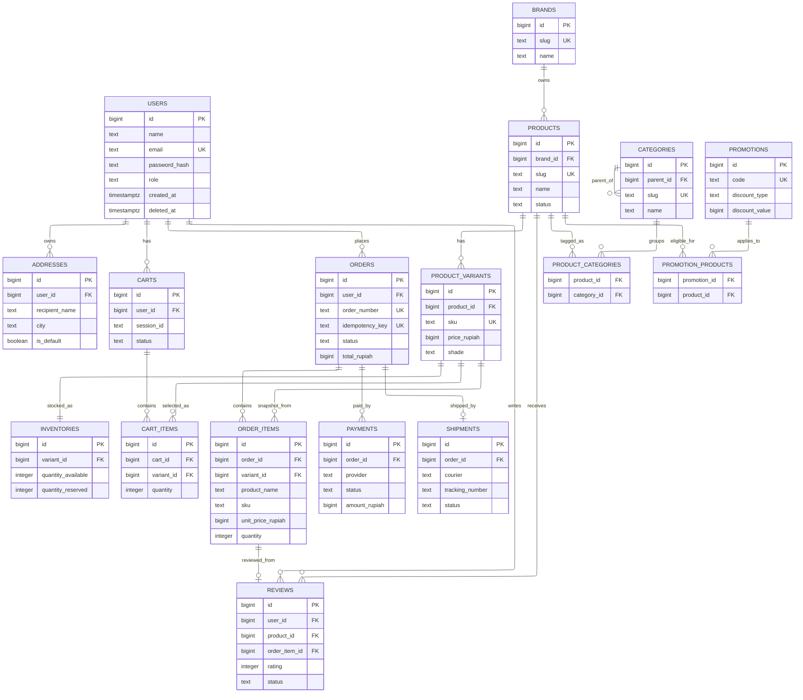
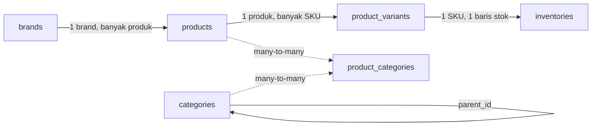
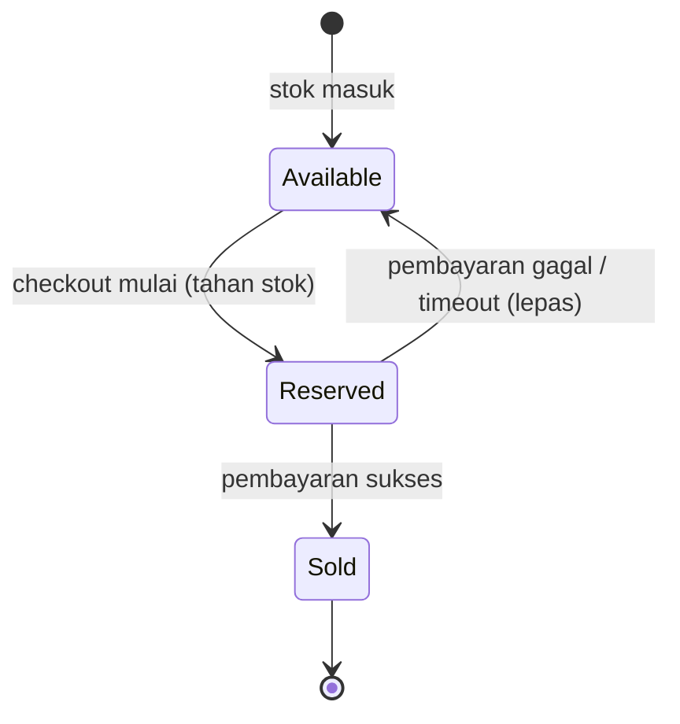
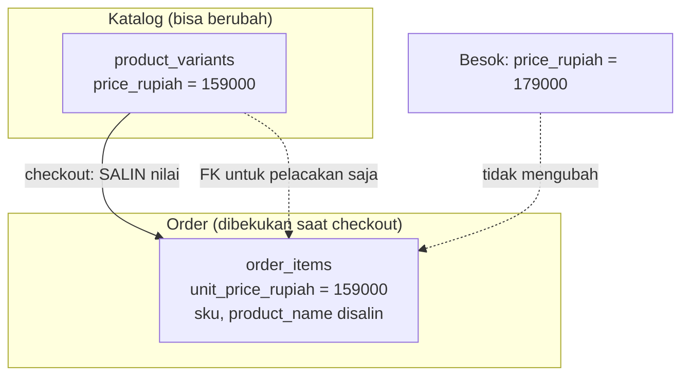
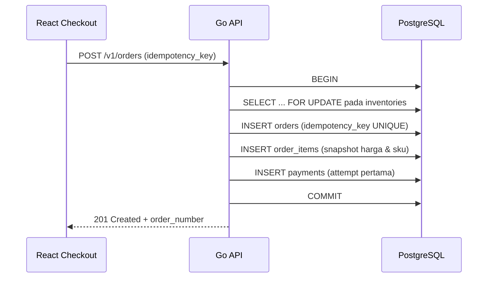

import { Section, Box, Steps, Step, Recap, CardGrid, Card, Chip, Hero, Compare, FileTree, Def } from "@components";

<Hero eyebrow="Roadmap 3 &middot; PostgreSQL dan pgx" title="Pemodelan Data <em>Online Shop</em><br />Skincare">
  <p>Modul ini adalah sumber kebenaran skema untuk seluruh Roadmap 3. Kita ubah domain skincare shop menjadi blueprint tabel PostgreSQL yang dipakai oleh setiap query, transaksi, dan repository pgx berikutnya.</p>
  <Fragment slot="meta">
    <Chip icon="database">PostgreSQL: <b>18</b></Chip>
    <Chip icon="code">Bahasa: <b>Go 1.26</b></Chip>
    <Chip icon="stack">15 tabel inti</Chip>
    <Chip icon="clock">~80 menit baca</Chip>
  </Fragment>
</Hero>

<Section num="01" id="intro" title="Kenapa Data Modeling Menentukan API" sub="Schema yang benar membuat handler dan repository jauh lebih sederhana">

<p class="lead">Di React kamu sering mulai dari shape state, di Laravel kamu sering mulai dari model Eloquent, di backend Go yang memakai pgx kita mulai dari kontrak database yang eksplisit.</p>

Data modeling adalah proses menerjemahkan kebutuhan bisnis menjadi tabel, kolom, relasi, constraint, dan index. Untuk online shop skincare, model data bukan sekadar tempat menyimpan produk. Model ini menentukan apakah checkout konsisten, stok aman dari oversell, invoice tetap benar saat harga produk berubah, dan laporan penjualan bisa dihitung tanpa menebak.

Modul ini berbeda dari modul lain di Roadmap 3. Ia adalah <em class="term">schema authority module</em>: setiap nama tabel, nama kolom, tipe, dan constraint yang kita putuskan di sini akan dipakai apa adanya oleh modul query pgx, modul transaksi checkout, modul indexing, dan modul repository. Maka kita tidak cukup membuat skema yang "jalan", kita membuat skema yang benar dan stabil untuk dipakai berbulan-bulan ke depan.

<Box variant="bridge" icon="🌉" label="Jembatan: dari state frontend ke schema database"><p>Di React, state cart boleh dibentuk ulang kapan saja, karena ia hanya hidup di memori browser. Di database, order yang sudah dibayar adalah jejak bisnis permanen yang dipakai untuk invoice, refund, dan laporan pajak. Karena itu skema order harus menyimpan snapshot harga, nama produk, alamat, dan status yang relevan pada saat checkout, bukan sekadar referensi ke katalog yang masih bisa berubah.</p></Box>

Ada satu mindset shift penting bagi developer yang datang dari Laravel atau dari ORM JavaScript seperti Prisma. Di sana, "model" adalah class di kode aplikasi, dan tabel database sering dianggap detail yang digenerate otomatis. Di jalur Go ini, urutannya dibalik. Skema SQL adalah kontrak utama yang kita tulis dengan sengaja, dan struct Go menyesuaikan diri dengan skema, bukan sebaliknya.

<Compare aLabel="ORM-first (Prisma / Eloquent)" bLabel="Schema-first (Go + pgx)" aTone="muted" bTone="violet">
  <Fragment slot="a"><ul><li>Model class atau `schema.prisma` jadi sumber kebenaran.</li><li>Tabel dan migrasi digenerate dari model.</li><li>Relasi dan aturan bisnis menempel ke model.</li></ul></Fragment>
  <Fragment slot="b"><ul><li>DDL SQL adalah sumber kebenaran yang ditulis tangan.</li><li>Struct Go memetakan kolom hasil query, bukan mendefinisikannya.</li><li>Constraint hidup di database, aturan alur di service.</li></ul></Fragment>
</Compare>

Di Roadmap 3 ini kita belum membahas migration runner, transaction helper, atau repository lengkap. Namun skema dari modul ini akan menjadi dasar untuk chapter pgx berikutnya: koneksi pool, query baca, query tulis, transaksi checkout, indexing, dan repository pattern. Setiap baris SQL di sini punya konsekuensi nyata di kode Go nanti.

<Def term="data modeling"><p>Data modeling adalah desain struktur data yang menjawab tiga hal: data apa yang disimpan, bagaimana data saling berelasi, dan aturan apa yang harus dijaga database lewat constraint, bukan hanya oleh kode aplikasi.</p></Def>

</Section>

<Section num="02" id="prinsip-desain" title="Prinsip Desain Skema" sub="Keputusan kecil di DDL bisa menghindari bug mahal saat checkout">

<p class="lead">Skema yang baik tidak hanya normal, tetapi juga menjaga fakta bisnis yang tidak boleh berubah.</p>

Kita memakai PostgreSQL karena ia kuat untuk transaksi, relasi, constraint, index, JSONB, dan tipe data native yang kaya. Dokumentasi resminya menyediakan rujukan untuk [CREATE TABLE](https://www.postgresql.org/docs/current/sql-createtable.html), [Constraints](https://www.postgresql.org/docs/current/ddl-constraints.html), dan [Data Types](https://www.postgresql.org/docs/current/datatype.html). Sepanjang modul ini kita mengacu ke perilaku PostgreSQL 18 yang menjadi versi target proyek.

Sebelum menyentuh tabel pertama, ada empat prinsip yang memandu setiap keputusan. Keempatnya bukan teori akademik, melainkan jawaban atas bug yang benar-benar terjadi di toko online sungguhan.

<CardGrid cols={2}>
  <Card><h4>Normalisasi katalog, snapshot transaksi</h4><p>Data yang masih hidup (produk, harga, alamat) dinormalisasi agar satu sumber kebenaran. Data yang sudah jadi bukti (order, invoice) menyalin fakta agar tidak ikut berubah.</p></Card>
  <Card><h4>Constraint dulu, kode belakangan</h4><p>`CHECK`, `UNIQUE`, dan `FOREIGN KEY` membuat database ikut menjaga aturan. Validasi di service bisa lupa atau di-bypass, constraint database tidak.</p></Card>
  <Card><h4>Uang selalu integer rupiah</h4><p>Harga disimpan sebagai `bigint` dalam satuan rupiah penuh, bukan `float`, `numeric`, atau `money`. Kolom diberi sufiks `_rupiah` agar niat tegas.</p></Card>
  <Card><h4>Setiap baris bisa dilacak waktunya</h4><p>`created_at` dan `updated_at` ada di hampir semua tabel. Soft delete `deleted_at` dipakai di entitas yang tidak boleh hilang dari histori.</p></Card>
</CardGrid>

<Compare aLabel="Laravel Eloquent" bLabel="Go + pgx" aTone="muted" bTone="violet">
  <Fragment slot="a"><ul><li>Model class sering menjadi pusat relasi, query, dan lifecycle hook.</li><li>Developer tergoda menaruh aturan bisnis di model dan accessor.</li><li>Migrasi ditulis dalam PHP lewat schema builder.</li></ul></Fragment>
  <Fragment slot="b"><ul><li>Skema SQL dan query eksplisit menjadi kontrak utama.</li><li>Service Go mengatur alur bisnis, repository pgx mengeksekusi query.</li><li>Migrasi ditulis sebagai file SQL `.up`/`.down` yang dibaca langsung.</li></ul></Fragment>
</Compare>

<Box variant="tip" icon="💡" label="Prinsip utama untuk proyek ini"><p>Normalisasi data untuk katalog dan user, tetapi snapshot fakta checkout di order. Data yang masih berubah boleh direferensikan, data yang menjadi bukti transaksi harus disalin. Aturan ini akan terus muncul di hampir setiap keputusan desain modul ini.</p></Box>

<h3>Kenapa constraint di database, bukan hanya di service Go</h3>

Developer JS sering terbiasa memvalidasi di handler atau di middleware, lalu menganggap database sebagai penyimpan pasif. Itu rapuh. Selama umur proyek, data masuk dari banyak jalur: handler API, script seed, job background, perbaikan manual lewat `psql`, dan import data. Satu-satunya titik yang dilewati semua jalur itu adalah database. Maka aturan yang benar-benar tidak boleh dilanggar (harga tidak negatif, rating antara 1 dan 5, satu cart aktif per user) lebih aman dijaga oleh constraint.

<Box variant="analogy" icon="🛡️" label="Analogi: constraint seperti pagar pembatas tol"><p>Validasi di service seperti rambu "kurangi kecepatan", berguna tapi bisa diabaikan. Constraint database seperti pagar beton di tepi tol. Saat ada satu jalur tak terduga (script manual, bug di handler baru), pagar itu yang mencegah data kotor masuk dan merusak laporan keuangan.</p></Box>

</Section>

<Section num="03" id="kunci-tipe" title="Primary Key, Uang, dan Tipe Data" sub="Tiga keputusan tipe yang menentukan kualitas skema seumur proyek">

<p class="lead">Sebelum menggambar tabel, kita kunci tiga keputusan tipe yang akan diulang ratusan kali di seluruh skema: bentuk primary key, representasi uang, dan pilihan tipe kolom umum.</p>

<h3>Primary key: bigint identity, bukan serial atau UUID di mana-mana</h3>

Untuk primary key internal, proyek ini memakai `bigint GENERATED ALWAYS AS IDENTITY`. Ini adalah cara standar SQL untuk membuat kolom auto-increment di PostgreSQL modern, dan menggantikan `serial` lama yang punya kejutan soal kepemilikan sequence. Hasilnya angka 64-bit yang rapat, cepat di-join, dan hemat di index.

<Compare aLabel="UUID di mana-mana" bLabel="bigint identity (pilihan kita)" aTone="muted" bTone="blue">
  <Fragment slot="a"><ul><li>16 byte per nilai, index lebih besar, join lebih berat.</li><li>Aman diekspos publik karena tidak bisa ditebak.</li><li>Bisa dibuat di client sebelum insert.</li></ul></Fragment>
  <Fragment slot="b"><ul><li>8 byte, kompak, index dan foreign key efisien.</li><li>Berurutan, bagus untuk locality dan pagination keyset.</li><li>Dibuat oleh database saat insert, satu sumber kebenaran.</li></ul></Fragment>
</Compare>

Lalu kapan UUID dipakai? Ketika ID benar-benar diekspos ke pihak luar dan urutannya tidak boleh bocor, misalnya token publik atau referensi yang muncul di URL pihak ketiga. Untuk online shop skincare ini, kita tetap memakai `bigint` sebagai PK internal, dan untuk hal yang harus aman ditebak kita pakai kolom terpisah yang sengaja unik, seperti `order_number` (nomor invoice yang dilihat customer) dan `idempotency_key`.

<Box variant="bridge" icon="🌉" label="Jembatan: dari id auto-increment Laravel"><p>Di Laravel, `$table->id()` membuat `bigint unsigned auto_increment`. Konsep `bigint GENERATED ALWAYS AS IDENTITY` di PostgreSQL adalah padanannya yang lebih standar SQL. Bedanya, `GENERATED ALWAYS` menolak insert manual ke kolom id kecuali kamu pakai `OVERRIDING SYSTEM VALUE`, sehingga lebih sulit salah.</p></Box>

<h3>Uang: selalu bigint rupiah, tidak pernah float</h3>

Inilah aturan paling keras di proyek ini. Uang disimpan sebagai `bigint` dalam satuan rupiah penuh. Rp150.000 disimpan sebagai `150000`. Nama kolomnya selalu berakhiran `_rupiah`: `price_rupiah`, `unit_price_rupiah`, `subtotal_rupiah`, `total_rupiah`, `amount_rupiah`. Di Go, field-nya `int64` dengan tag JSON yang ringkas seperti `price` atau `total`.

Kenapa bukan `float`, `numeric`, atau tipe `money` bawaan? `float` punya galat pembulatan biner yang fatal untuk uang (`0.1 + 0.2` tidak persis `0.3`). `numeric` akurat tetapi lebih lambat dan mengundang desimal yang tidak kita butuhkan, karena rupiah praktis tidak memakai sen. Tipe `money` PostgreSQL bergantung pada locale server dan sulit dipindahkan. `bigint` rupiah menghindari semua itu: aritmetika integer yang eksak, cepat, dan jelas.

<Box variant="warn" icon="⚠️" label="Hindari float untuk uang, selamanya"><p>Sekali ada satu kolom uang bertipe `float` atau `double precision`, galat pembulatan akan menyebar ke subtotal, diskon, dan total. Bug ini muncul belakangan saat angka sudah besar dan sulit dilacak. Pakai `bigint` rupiah dari awal, dan jadikan `CHECK (price_rupiah >= 0)` sebagai pengaman.</p></Box>

<h3>Tipe kolom umum lainnya</h3>

Beberapa pilihan tipe diulang di seluruh skema, jadi kita sepakati sekali di sini.

<div class="tbl-wrap">

| Kebutuhan | Tipe yang dipakai | Alasan singkat |
|---|---|---|
| Teks bebas (nama, slug, deskripsi) | `text` | Tanpa batas panjang artifisial. Sama cepat dengan `varchar(n)` di PostgreSQL. Tambahkan `CHECK (length(col) <= n)` hanya bila perlu batas nyata. |
| Waktu | `timestamptz` | Disimpan UTC dan tz-aware, memetakan ke `time.Time` Go. Hindari `timestamp` tanpa zona. |
| Status terbatas | `text` + `CHECK (... IN (...))` | Mudah diubah saat status bertambah, tanpa migrasi tipe `ENUM` yang kaku. |
| Daftar tag (skin type, concern) | `text[]` | Array native PostgreSQL, cocok untuk filter `&&` dan `@>`. |
| Data semi-terstruktur (snapshot, payload) | `jsonb` | Fleksibel, bisa diindeks GIN, tetapi bukan pengganti kolom relasional inti. |
| Boolean (is_active, is_default) | `boolean` | Eksplisit, dengan `DEFAULT` yang jelas. |

</div>

<Box variant="note" icon="📝" label="Status pakai CHECK, bukan ENUM"><p>Status seperti `pending`, `paid`, `shipped` ditulis sebagai `text` dengan `CHECK (status IN (...))`. Saat bisnis menambah status baru, kita cukup `ALTER TABLE ... DROP CONSTRAINT` lalu pasang ulang dengan daftar baru. Tipe `ENUM` native lebih sulit diubah dan tidak bisa menghapus nilai tanpa pekerjaan ekstra.</p></Box>

</Section>

<Section num="04" id="peta-relasi" title="Peta Relasi Online Shop" sub="ERD besar dengan layout elk agar hubungan utama tetap terbaca">

<p class="lead">Diagram berikut menunjukkan semua kelompok data yang akan dipakai oleh API skincare: customer, katalog, stok, cart, checkout, fulfillment, review, dan marketing.</p>

Sebelum menyelami tiap tabel, lihat dulu peta keseluruhannya. ERD ini adalah pusat modul. Tabel-tabel berikutnya hanyalah perbesaran dari kelompok-kelompok yang kamu lihat di sini. Perhatikan tiga gugus besar: gugus customer (kiri atas), gugus katalog dan stok (tengah), dan gugus transaksi order, payment, shipment (kanan bawah).



<p class="fig-cap"><b>Gambar 1.</b> ERD lengkap untuk blueprint online shop skincare. Notasi crow's foot menandai kardinalitas: satu-ke-banyak, satu-ke-satu, dan satu-ke-nol-atau-satu. Mermaid memakai layout `elk` agar diagram sebesar ini tetap terbaca.</p>

<Box variant="note" icon="🧭" label="Cara membaca ERD ini"><p>Relasi katalog dan user bersifat normalisasi: satu fakta disimpan satu kali dan direferensikan lewat foreign key. Relasi order tetap menyimpan foreign key ke variant untuk pelacakan, tetapi juga menyimpan snapshot nama, SKU, dan harga, agar invoice lama tidak berubah saat katalog diedit.</p></Box>

<h3>Membaca kardinalitas: garis crow's foot</h3>

Notasi ERD ini mungkin baru bagi yang terbiasa dengan diagram class React. Cara cepat membacanya: ujung "cabang ayam" (banyak) menempel di tabel anak, ujung lurus (satu) menempel di tabel induk, dan lingkaran berarti opsional (boleh nol).

<CardGrid cols={2}>
  <Card><h4>Satu user, banyak address</h4><p>Satu sisi di USERS, sisi banyak di ADDRESSES. Customer boleh punya beberapa alamat di address book.</p></Card>
  <Card><h4>Satu varian, satu stok</h4><p>Relasi satu-ke-satu antara PRODUCT_VARIANTS dan INVENTORIES. Tepat satu baris stok per SKU.</p></Card>
  <Card><h4>Satu order, nol atau satu shipment</h4><p>Relasi satu-ke-nol-atau-satu. Order yang belum dikirim belum punya baris shipment.</p></Card>
  <Card><h4>Satu produk, banyak review</h4><p>Sisi banyak di REVIEWS. Satu produk bisa menerima banyak ulasan, atau belum ada sama sekali.</p></Card>
</CardGrid>

</Section>

<Section num="05" id="customer-catalog" title="Customer, Katalog, dan Varian" sub="Pisahkan produk konseptual dari SKU yang benar-benar dijual">

<p class="lead">Dalam skincare, satu produk bisa punya beberapa ukuran, shade, bundle, atau varian harga. Karena itu `products` dan `product_variants` harus dipisah.</p>

<h3>User dan address</h3>

`users` menyimpan identitas login dan role. Kolom `role` dibatasi `CHECK (role IN ('customer', 'admin'))` karena toko ini hanya butuh dua peran. `email` `UNIQUE` mencegah dua akun dengan email sama. Kolom `deleted_at` membuat soft delete: saat user "menghapus" akun, kita set `deleted_at = now()` agar order lama yang mereferensikan user tidak ikut hilang.

`addresses` dipisah karena satu user bisa punya banyak alamat. Saat checkout, alamat dari `addresses` tidak cukup hanya direferensikan oleh order. Order harus menyimpan salinan alamat sebagai `jsonb` (`shipping_address`), karena user bisa mengubah atau menghapus alamat setelah order dibayar, dan invoice harus tetap menampilkan ke mana barang dikirim saat itu.

<Box variant="bridge" icon="🌉" label="Jembatan: alamat seperti props, order seperti receipt"><p>Di React, komponen checkout bisa menerima `address` sebagai props yang berubah-ubah. Setelah pembayaran berhasil, order bukan props lagi, tetapi receipt yang dibekukan. Receipt harus tetap sama walau user mengubah address book setelahnya. Itulah kenapa `orders.shipping_address` adalah snapshot, bukan foreign key.</p></Box>

Soft delete punya satu konsekuensi yang sering terlewat: index `UNIQUE` pada `email` tetap berlaku untuk baris yang sudah "dihapus". Jadi jika kamu butuh mengizinkan email lama dipakai ulang setelah soft delete, kamu perlu unique index parsial seperti `WHERE deleted_at IS NULL`. Untuk proyek ini kita biarkan unik penuh demi kesederhanaan, dan menandainya sebagai keputusan yang sadar.

<h3>Brand, category, product, variant</h3>

`brands` dipisah dari `products` supaya filter brand konsisten dan satu brand bisa punya banyak produk. Foreign key `products.brand_id` memakai `ON DELETE RESTRICT`: sebuah brand tidak boleh dihapus selama masih punya produk, karena itu akan meninggalkan produk yatim.

`categories` mendukung `parent_id` yang mereferensikan dirinya sendiri, sehingga bisa membentuk pohon seperti Cleanser, Serum, Sunscreen, dan Makeup Remover, dengan subkategori di bawahnya. Relasi produk ke kategori dibuat many-to-many melalui tabel join `product_categories`, karena satu serum bisa masuk kategori Serum, Brightening, dan Sensitive Skin sekaligus.



<p class="fig-cap"><b>Gambar 2.</b> Aliran katalog: brand memayungi product, product punya banyak variant (SKU), dan setiap variant punya satu baris inventory. Kategori terhubung ke produk lewat tabel join.</p>

Pemisahan `products` dan `product_variants` adalah inti desain katalog. `products` mewakili halaman produk yang dilihat pengunjung: nama, slug, deskripsi, brand, status publikasi, dan atribut skincare seperti `skin_types` dan `concerns`. `product_variants` mewakili SKU yang benar-benar dijual dan distok: ukuran 30ml, shade tertentu, barcode, berat, dan yang paling penting, harga jual `price_rupiah`.

<CardGrid cols={2}>
  <Card><h4>`products`</h4><p>Halaman produk konseptual. Tidak punya harga dan tidak punya stok. Punya `slug` `UNIQUE` untuk URL, `status` (draft, active, archived), dan atribut katalog.</p></Card>
  <Card><h4>`product_variants`</h4><p>SKU yang dijual. Memegang `price_rupiah`, `sku` `UNIQUE`, `size_label`, `shade`, dan `is_active`. Inilah unit yang ditambahkan ke cart dan order.</p></Card>
</CardGrid>

<Box variant="warn" icon="⚠️" label="Harga ada di variant, bukan di product"><p>Kesalahan umum adalah menaruh `price` di tabel `products`. Padahal serum 30ml dan 60ml dari produk yang sama berbeda harga. Harga jual hidup di `product_variants.price_rupiah`. Tabel `products` sengaja tidak punya kolom harga sama sekali.</p></Box>

<Def term="SKU"><p>SKU (Stock Keeping Unit) adalah identitas operasional untuk item yang benar-benar bisa dibeli dan distok. Dalam skema ini SKU berada di `product_variants.sku` dan bersifat `UNIQUE`, bukan di `products`.</p></Def>

<Box variant="bridge" icon="🌉" label="Jembatan: product vs variant seperti komponen vs instance"><p>Bayangkan di React kamu punya komponen `Button` (definisi) dan banyak `<Button size="sm" />` (instance dengan props berbeda). `products` adalah definisinya, `product_variants` adalah instance konkret dengan ukuran, shade, dan harga yang spesifik. Cart dan order selalu menunjuk ke instance (variant), bukan ke definisi (product).</p></Box>

</Section>

<Section num="06" id="inventory-cart" title="Inventory dan Cart" sub="Stok adalah angka bisnis, cart adalah niat belanja yang belum final">

<p class="lead">Inventory harus aman untuk checkout, sedangkan cart harus fleksibel karena user masih bisa berubah pikiran.</p>

<h3>Inventory dipisah dari variant</h3>

`inventories` dibuat one-to-one dengan `product_variants` lewat foreign key `variant_id` yang `UNIQUE`. Kenapa stok tidak jadi kolom di `product_variants` saja? Karena stok adalah angka yang sering berubah dan sering dikunci (`SELECT ... FOR UPDATE`) saat checkout, sedangkan data variant relatif stabil. Memisahkannya membuat update stok tidak mengganggu pembacaan katalog dan mengurangi kontensi lock.

Inventory punya dua angka penting yang sering tertukar. `quantity_available` adalah stok yang siap dijual. `quantity_reserved` adalah stok yang sedang ditahan sementara, misalnya saat checkout sedang menunggu pembayaran. Table-level `CHECK (quantity_available >= quantity_reserved)` menjaga agar reservasi tidak pernah melebihi stok nyata.

<Box variant="bridge" icon="🌉" label="Jembatan: available vs reserved seperti optimistic UI"><p>Di React kamu mengenal optimistic update: UI langsung menampilkan perubahan sebelum server mengonfirmasi. `quantity_reserved` adalah versi backend dari ide itu. Stok ditahan dulu agar dua pembeli tidak merebut item terakhir yang sama, lalu dikonfirmasi (dikurangi dari available) saat pembayaran sukses, atau dilepas saat pembayaran gagal.</p></Box>



<p class="fig-cap"><b>Gambar 3.</b> Siklus hidup satu unit stok. Reservasi adalah jeda aman antara niat beli dan pembayaran sukses, mencegah oversell pada item terakhir.</p>

Operasi penahanan dan pelepasan stok ini akan dijaga dengan transaksi dan row lock di modul transaksi Roadmap 3. Di modul ini cukup kita pastikan strukturnya benar: dua angka terpisah, dengan constraint yang menjaga keduanya tetap masuk akal.

<h3>Cart: niat belanja, bukan transaksi</h3>

`carts` mendukung user login dan guest session. Karena itu `user_id` boleh `NULL`, tetapi `session_id` harus ada jika user belum login. Table-level `CHECK (user_id IS NOT NULL OR session_id IS NOT NULL)` memastikan minimal salah satunya terisi, sehingga tidak ada cart tanpa pemilik.

Yang menarik adalah dua partial unique index. `carts_one_active_per_user_idx` menjaga satu user hanya punya satu cart berstatus `active` dalam satu waktu, dan `carts_one_active_per_session_idx` melakukan hal sama untuk guest. Ini elegan: aturan "satu cart aktif" dijaga database, bukan kode, dan tetap mengizinkan banyak cart lama yang sudah `converted` atau `abandoned`.

<Box variant="bridge" icon="🌉" label="Jembatan: partial index seperti where pada useEffect dependency"><p>Partial unique index `... WHERE status = 'active'` hanya memberlakukan keunikan pada baris yang cocok kondisi, mirip cara kamu membatasi efek hanya pada kondisi tertentu. Cart lama yang `abandoned` tidak ikut diperiksa, jadi user bisa punya riwayat banyak cart, tapi hanya satu yang aktif.</p></Box>

Keputusan paling penting tentang cart: `cart_items` tidak menyimpan harga. Hanya menyimpan `variant_id` dan `quantity`. Harga dibaca segar saat checkout. Ini sengaja, karena harga di cart hanyalah preview yang bisa kedaluwarsa, sedangkan harga yang mengikat secara hukum adalah harga saat order dibuat.

<Compare aLabel="Cart di frontend" bLabel="Cart di database" aTone="muted" bTone="blue">
  <Fragment slot="a"><ul><li>Bisa disimpan di state, localStorage, atau cache.</li><li>Harga dan stok yang tampil hanya preview.</li><li>Boleh dibentuk ulang kapan saja.</li></ul></Fragment>
  <Fragment slot="b"><ul><li>Menjadi sumber sementara untuk checkout.</li><li>Tidak menyimpan harga, hanya variant dan quantity.</li><li>Harus divalidasi ulang sebelum order dibuat.</li></ul></Fragment>
</Compare>

<Box variant="warn" icon="⚠️" label="Jangan percaya cart saat checkout"><p>Cart item tidak menyimpan harga final. Saat checkout, service harus membaca `price_rupiah` dan stok terbaru, menghitung diskon, lalu membuat `orders` dan `order_items` dalam satu transaksi. Memakai harga dari cart yang basi adalah celah yang bisa dipakai membeli barang dengan harga lama.</p></Box>

</Section>

<Section num="07" id="checkout-order" title="Order, Payment, dan Shipment" sub="Bagian ini adalah audit trail bisnis, bukan sekadar cache dari katalog">

<p class="lead">Checkout adalah momen ketika data yang sebelumnya fleksibel berubah menjadi fakta transaksi yang dibekukan.</p>

`orders` menyimpan header transaksi: user, nomor order, status, total uang, alamat pengiriman snapshot, dan kode promosi yang dipakai. `order_items` menyimpan daftar item yang dibeli beserta snapshot-nya. Keputusan desain terpenting dalam modul ini hidup di sini: order menyalin fakta, tidak hanya mereferensikannya.

<h3>Snapshot harga: membekukan fakta saat checkout</h3>

`order_items` menyimpan `product_name`, `variant_name`, `sku`, dan `unit_price_rupiah` sebagai salinan, bukan sebagai join ke katalog. Harga produk bisa berubah besok, nama produk bisa diedit, variant bisa dinonaktifkan, bahkan brand bisa ganti nama. Invoice dan laporan penjualan tetap harus menunjukkan fakta saat order dibuat.



<p class="fig-cap"><b>Gambar 4.</b> Saat checkout, harga dan identitas item disalin ke `order_items`. Perubahan harga katalog esok hari tidak menyentuh order yang sudah jadi. Foreign key ke variant tetap ada, tapi hanya untuk pelacakan, bukan sumber harga.</p>

<Box variant="tip" icon="💡" label="Kenapa harga di order_items harus snapshot"><p>Tanpa snapshot, kamu harus join ke `product_variants` untuk menampilkan invoice lama, dan harga yang muncul akan ikut harga sekarang, bukan harga saat pembelian. Itu salah secara akuntansi dan bisa jadi masalah hukum. Maka `order_items.unit_price_rupiah` disalin saat checkout dan tidak pernah diubah lagi.</p></Box>

Total order dijaga konsisten oleh constraint, bukan oleh kepercayaan pada kode. `orders` punya `CHECK (total_rupiah = subtotal_rupiah + shipping_rupiah - discount_rupiah)`. Sementara `order_items.line_total_rupiah` adalah generated column yang dihitung database dari `(unit_price_rupiah * quantity) - item_discount_rupiah`. Aritmetika uang tidak diserahkan ke aplikasi sepenuhnya.

<Box variant="bridge" icon="🌉" label="Jembatan: generated column seperti computed property"><p>Di Vue ada computed property, di React ada nilai turunan yang dihitung dari state. `line_total_rupiah GENERATED ALWAYS AS (...) STORED` adalah versi database-nya: kolom yang nilainya selalu dihitung dari kolom lain dan tidak bisa di-set manual. Konsistensinya dijaga PostgreSQL, bukan oleh ingatan kita untuk menghitung ulang.</p></Box>

<h3>Idempotency: mencegah double order</h3>

`orders` punya `idempotency_key` yang `UNIQUE`. Saat tombol "Bayar" diklik dua kali, atau jaringan mengirim ulang request, client mengirim idempotency key yang sama. Karena kolom itu `UNIQUE`, insert kedua gagal di level database, dan service bisa mengembalikan order yang sudah ada alih-alih membuat order ganda.

<Box variant="bridge" icon="🌉" label="Jembatan: idempotency key seperti dedup di React Query"><p>Di React Query, `mutationKey` membantu menghindari mutation ganda. `idempotency_key` adalah pengaman yang sama tapi di sisi server dan permanen di database. Bedanya, ini bukan sekadar optimasi UI, melainkan jaminan keras bahwa satu intent pembayaran menghasilkan tepat satu order, dijaga oleh unique constraint.</p></Box>

<h3>Payment dan shipment dipisah dari order</h3>

`payments` dibuat terpisah dari `orders` karena satu order bisa punya lebih dari satu attempt pembayaran. Payment pertama bisa expired, lalu user mencoba lagi dengan metode lain. Setiap attempt adalah baris sendiri dengan `status` dan `amount_rupiah`. Kolom `event_id` menyimpan id event dari provider untuk idempotency webhook, dan partial unique index mencegah memproses event yang sama dua kali.

`shipments` dipisah karena pengiriman punya lifecycle sendiri: pending, packed, shipped, delivered, failed, atau returned. Relasinya one-to-one dengan order (`order_id` `UNIQUE`). Seperti order, shipment juga menyimpan `address_snapshot` dan `recipient_name`, sehingga label pengiriman tetap benar walau alamat asal berubah.



<p class="fig-cap"><b>Gambar 5.</b> Order, item snapshot, dan payment attempt dibuat dalam satu transaksi. Row lock pada inventory mencegah oversell, dan idempotency key mencegah order ganda. Alur transaksi ini diperdalam di modul transaksi.</p>

<Box variant="note" icon="📌" label="Order pakai RESTRICT, bukan CASCADE"><p>Foreign key `orders.user_id` memakai `ON DELETE RESTRICT`, bukan `CASCADE`. Order adalah histori bisnis permanen. Jika user dihapus keras dan order ikut terhapus, kamu kehilangan catatan penjualan. Karena itu user dihapus lewat soft delete (`deleted_at`), dan order tetap utuh.</p></Box>

</Section>

<Section num="08" id="review-promotion" title="Review dan Promotion" sub="Data pasca-transaksi dan marketing tetap harus punya batasan yang jelas">

<p class="lead">Review membantu katalog, promotion membantu conversion, tetapi keduanya tidak boleh merusak fakta order lama.</p>

`reviews` terhubung ke `users`, `products`, dan opsional `order_items`. Jika review berasal dari pembelian nyata, `order_item_id` membuat review bisa ditandai sebagai verified purchase. Constraint `CHECK (rating BETWEEN 1 AND 5)` menjaga rentang nilai, dan `UNIQUE (user_id, product_id)` mencegah satu user menulis dua review untuk produk yang sama.

<Box variant="bridge" icon="🌉" label="Jembatan: verified purchase lewat nullable FK"><p>`order_item_id` adalah foreign key yang boleh `NULL`. Saat ada nilainya, ia menautkan review ke item order yang nyata, mirip optional chaining di TS (`order?.item`). Saat `NULL`, review tetap valid tapi tanpa lencana verified. `ON DELETE SET NULL` menjaga review tetap ada walau item order sumbernya hilang.</p></Box>

`promotions` menyimpan kode, tipe diskon (`percentage` atau `fixed_amount`), nilai diskon, periode aktif (`starts_at`, `ends_at`), batas penggunaan, dan minimum order. Constraint `CHECK (ends_at > starts_at)` menjaga periode masuk akal. Tabel join `promotion_products` membuat promosi bisa dibatasi ke produk tertentu; jika kosong, service menafsirkannya sebagai promo global.

<CardGrid cols={2}>
  <Card><h4>Promotion definition</h4><p>`promotions` menjawab aturan diskon yang berlaku saat ini: tipe, nilai, periode, dan batas. Data ini hidup dan bisa diubah.</p></Card>
  <Card><h4>Order snapshot</h4><p>`orders.promotion_code` dan `discount_rupiah` menyimpan hasil diskon saat checkout. Data ini beku dan tidak ikut berubah saat promosi diedit.</p></Card>
</CardGrid>

<Box variant="note" icon="📝" label="Promosi bukan foreign key wajib di order"><p>Order menyimpan `promotion_code` sebagai teks snapshot, sengaja bukan foreign key. Dengan begitu laporan tetap bisa dibaca walau promosi sudah dinonaktifkan atau dihapus dari katalog aktif. Sama persisnya dengan harga: yang menjadi bukti transaksi disalin, bukan direferensikan.</p></Box>

<Box variant="bridge" icon="🌉" label="Jembatan: percentage vs fixed seperti discriminated union"><p>`discount_type` plus `discount_value` membentuk pola yang mirip discriminated union di TypeScript: satu kolom menentukan tipe, kolom lain memuat nilainya. Service membaca `discount_type` untuk memutuskan apakah `discount_value` ditafsirkan sebagai persen atau sebagai rupiah penuh, seperti `switch` pada field `kind`.</p></Box>

</Section>

<Section num="09" id="schema-sql" title="DDL Penuh dan Tabel Kunci" sub="Satu blueprint SQL yang menjadi fondasi seluruh Roadmap 3">

<p class="lead">DDL berikut adalah baseline schema lengkap. Di section berikutnya ia dipecah menjadi migration file, tetapi secara konsep inilah blueprint utama proyek.</p>

Sebelum membaca seluruh DDL, perhatikan dua tabel paling kritis. `product_variants` adalah sumber harga, dan `orders` adalah audit trail uang. Dua tabel ini paling sering dipakai dan paling tidak boleh salah, jadi kolom kuncinya kita rangkum lebih dulu.

<h3>Kolom kunci `product_variants`</h3>

<div class="tbl-wrap">

| Kolom | Tipe | Catatan |
|---|---|---|
| id | bigint identity | Primary key internal. |
| product_id | bigint FK | Ke `products.id`, `ON DELETE CASCADE`. |
| sku | text UNIQUE | Identitas operasional SKU. |
| variant_name | text | Nama varian, misalnya "30ml" atau shade tertentu. |
| price_rupiah | bigint | Harga jual rupiah penuh. `CHECK (price_rupiah >= 0)`. |
| compare_at_price_rupiah | bigint NULL | Harga coret, harus &ge; `price_rupiah` bila diisi. |
| is_active | boolean | Varian bisa dimatikan tanpa dihapus. |

</div>

<h3>Kolom kunci `orders`</h3>

<div class="tbl-wrap">

| Kolom | Tipe | Catatan |
|---|---|---|
| id | bigint identity | Primary key internal. |
| user_id | bigint FK | Ke `users.id`, `ON DELETE RESTRICT` (histori permanen). |
| order_number | text UNIQUE | Nomor invoice yang dilihat customer. |
| idempotency_key | text UNIQUE | Pencegah order ganda saat retry. |
| status | text + CHECK | pending, paid, processing, shipped, completed, cancelled, refunded. |
| subtotal_rupiah | bigint | Jumlah harga item sebelum ongkir dan diskon. |
| discount_rupiah | bigint | Diskon total, default 0. |
| shipping_rupiah | bigint | Ongkir, default 0. |
| total_rupiah | bigint | Dijaga `CHECK (total_rupiah = subtotal_rupiah + shipping_rupiah - discount_rupiah)`. |
| shipping_address | jsonb | Snapshot alamat saat checkout. |

</div>

Berikut DDL penuh. Bacalah dari atas ke bawah, dari `users` (akar) menuju `orders` dan turunannya. Urutan ini penting karena foreign key hanya bisa menunjuk ke tabel yang sudah ada.

```sql title="schema.sql"
-- PostgreSQL 18+
-- Blueprint utama Online Shop Skincare untuk Roadmap 3.
-- Uang selalu bigint rupiah penuh. PK selalu bigint GENERATED ALWAYS AS IDENTITY.

CREATE TABLE users (
    id bigint GENERATED ALWAYS AS IDENTITY PRIMARY KEY,
    name TEXT NOT NULL,
    email TEXT NOT NULL UNIQUE,
    password_hash TEXT NOT NULL,
    role TEXT NOT NULL DEFAULT 'customer' CHECK (role IN ('customer', 'admin')),
    phone TEXT,
    created_at TIMESTAMPTZ NOT NULL DEFAULT now(),
    updated_at TIMESTAMPTZ NOT NULL DEFAULT now(),
    deleted_at TIMESTAMPTZ
);

CREATE TABLE addresses (
    id bigint GENERATED ALWAYS AS IDENTITY PRIMARY KEY,
    user_id bigint NOT NULL REFERENCES users(id) ON DELETE CASCADE,
    label TEXT NOT NULL,
    recipient_name TEXT NOT NULL,
    phone TEXT NOT NULL,
    line1 TEXT NOT NULL,
    line2 TEXT,
    city TEXT NOT NULL,
    province TEXT NOT NULL,
    postal_code TEXT NOT NULL,
    country TEXT NOT NULL DEFAULT 'ID',
    is_default BOOLEAN NOT NULL DEFAULT false,
    created_at TIMESTAMPTZ NOT NULL DEFAULT now(),
    updated_at TIMESTAMPTZ NOT NULL DEFAULT now()
);

CREATE INDEX addresses_user_id_idx ON addresses(user_id);
CREATE UNIQUE INDEX addresses_one_default_per_user_idx ON addresses(user_id) WHERE is_default;

CREATE TABLE brands (
    id bigint GENERATED ALWAYS AS IDENTITY PRIMARY KEY,
    slug TEXT NOT NULL UNIQUE,
    name TEXT NOT NULL,
    description TEXT,
    created_at TIMESTAMPTZ NOT NULL DEFAULT now(),
    updated_at TIMESTAMPTZ NOT NULL DEFAULT now()
);

CREATE TABLE categories (
    id bigint GENERATED ALWAYS AS IDENTITY PRIMARY KEY,
    parent_id bigint REFERENCES categories(id) ON DELETE SET NULL,
    slug TEXT NOT NULL UNIQUE,
    name TEXT NOT NULL,
    sort_order INTEGER NOT NULL DEFAULT 0,
    created_at TIMESTAMPTZ NOT NULL DEFAULT now(),
    updated_at TIMESTAMPTZ NOT NULL DEFAULT now()
);

CREATE INDEX categories_parent_id_idx ON categories(parent_id);

CREATE TABLE products (
    id bigint GENERATED ALWAYS AS IDENTITY PRIMARY KEY,
    brand_id bigint NOT NULL REFERENCES brands(id) ON DELETE RESTRICT,
    slug TEXT NOT NULL UNIQUE,
    name TEXT NOT NULL,
    description TEXT NOT NULL DEFAULT '',
    skin_types TEXT[] NOT NULL DEFAULT '{}'::text[],
    concerns TEXT[] NOT NULL DEFAULT '{}'::text[],
    ingredients JSONB NOT NULL DEFAULT '{}'::jsonb,
    status TEXT NOT NULL DEFAULT 'draft' CHECK (status IN ('draft', 'active', 'archived')),
    created_at TIMESTAMPTZ NOT NULL DEFAULT now(),
    updated_at TIMESTAMPTZ NOT NULL DEFAULT now(),
    deleted_at TIMESTAMPTZ
);

CREATE INDEX products_brand_id_idx ON products(brand_id);
CREATE INDEX products_status_idx ON products(status);

CREATE TABLE product_variants (
    id bigint GENERATED ALWAYS AS IDENTITY PRIMARY KEY,
    product_id bigint NOT NULL REFERENCES products(id) ON DELETE CASCADE,
    sku TEXT NOT NULL UNIQUE,
    variant_name TEXT NOT NULL,
    size_label TEXT,
    shade TEXT,
    price_rupiah bigint NOT NULL CHECK (price_rupiah >= 0),
    compare_at_price_rupiah bigint CHECK (compare_at_price_rupiah IS NULL OR compare_at_price_rupiah >= price_rupiah),
    weight_grams INTEGER CHECK (weight_grams IS NULL OR weight_grams > 0),
    barcode TEXT,
    is_active BOOLEAN NOT NULL DEFAULT true,
    created_at TIMESTAMPTZ NOT NULL DEFAULT now(),
    updated_at TIMESTAMPTZ NOT NULL DEFAULT now()
);

CREATE INDEX product_variants_product_id_idx ON product_variants(product_id);
CREATE INDEX product_variants_active_idx ON product_variants(is_active);

CREATE TABLE product_categories (
    product_id bigint NOT NULL REFERENCES products(id) ON DELETE CASCADE,
    category_id bigint NOT NULL REFERENCES categories(id) ON DELETE RESTRICT,
    PRIMARY KEY (product_id, category_id)
);

CREATE INDEX product_categories_category_id_idx ON product_categories(category_id);

CREATE TABLE inventories (
    id bigint GENERATED ALWAYS AS IDENTITY PRIMARY KEY,
    variant_id bigint NOT NULL UNIQUE REFERENCES product_variants(id) ON DELETE CASCADE,
    quantity_available INTEGER NOT NULL DEFAULT 0 CHECK (quantity_available >= 0),
    quantity_reserved INTEGER NOT NULL DEFAULT 0 CHECK (quantity_reserved >= 0),
    low_stock_threshold INTEGER NOT NULL DEFAULT 5 CHECK (low_stock_threshold >= 0),
    updated_at TIMESTAMPTZ NOT NULL DEFAULT now(),
    CHECK (quantity_available >= quantity_reserved)
);

CREATE TABLE carts (
    id bigint GENERATED ALWAYS AS IDENTITY PRIMARY KEY,
    user_id bigint REFERENCES users(id) ON DELETE CASCADE,
    session_id TEXT,
    status TEXT NOT NULL DEFAULT 'active' CHECK (status IN ('active', 'converted', 'abandoned')),
    created_at TIMESTAMPTZ NOT NULL DEFAULT now(),
    updated_at TIMESTAMPTZ NOT NULL DEFAULT now(),
    CHECK (user_id IS NOT NULL OR session_id IS NOT NULL)
);

CREATE INDEX carts_user_id_idx ON carts(user_id);
CREATE UNIQUE INDEX carts_one_active_per_user_idx ON carts(user_id) WHERE status = 'active' AND user_id IS NOT NULL;
CREATE UNIQUE INDEX carts_one_active_per_session_idx ON carts(session_id) WHERE status = 'active' AND session_id IS NOT NULL;

CREATE TABLE cart_items (
    id bigint GENERATED ALWAYS AS IDENTITY PRIMARY KEY,
    cart_id bigint NOT NULL REFERENCES carts(id) ON DELETE CASCADE,
    variant_id bigint NOT NULL REFERENCES product_variants(id) ON DELETE RESTRICT,
    quantity INTEGER NOT NULL CHECK (quantity > 0),
    created_at TIMESTAMPTZ NOT NULL DEFAULT now(),
    updated_at TIMESTAMPTZ NOT NULL DEFAULT now(),
    UNIQUE (cart_id, variant_id)
);

CREATE INDEX cart_items_variant_id_idx ON cart_items(variant_id);

CREATE TABLE orders (
    id bigint GENERATED ALWAYS AS IDENTITY PRIMARY KEY,
    user_id bigint NOT NULL REFERENCES users(id) ON DELETE RESTRICT,
    order_number TEXT NOT NULL UNIQUE,
    idempotency_key TEXT NOT NULL UNIQUE,
    status TEXT NOT NULL DEFAULT 'pending' CHECK (status IN ('pending', 'paid', 'processing', 'shipped', 'completed', 'cancelled', 'refunded')),
    payment_status TEXT NOT NULL DEFAULT 'unpaid' CHECK (payment_status IN ('unpaid', 'pending', 'paid', 'failed', 'refunded')),
    currency TEXT NOT NULL DEFAULT 'IDR',
    subtotal_rupiah bigint NOT NULL CHECK (subtotal_rupiah >= 0),
    discount_rupiah bigint NOT NULL DEFAULT 0 CHECK (discount_rupiah >= 0),
    shipping_rupiah bigint NOT NULL DEFAULT 0 CHECK (shipping_rupiah >= 0),
    total_rupiah bigint NOT NULL CHECK (total_rupiah >= 0),
    promotion_code TEXT,
    shipping_address JSONB NOT NULL,
    note TEXT,
    placed_at TIMESTAMPTZ NOT NULL DEFAULT now(),
    created_at TIMESTAMPTZ NOT NULL DEFAULT now(),
    updated_at TIMESTAMPTZ NOT NULL DEFAULT now(),
    CHECK (subtotal_rupiah + shipping_rupiah >= discount_rupiah),
    CHECK (total_rupiah = subtotal_rupiah + shipping_rupiah - discount_rupiah)
);

CREATE INDEX orders_user_id_created_at_idx ON orders(user_id, created_at DESC);
CREATE INDEX orders_status_idx ON orders(status);

CREATE TABLE order_items (
    id bigint GENERATED ALWAYS AS IDENTITY PRIMARY KEY,
    order_id bigint NOT NULL REFERENCES orders(id) ON DELETE CASCADE,
    variant_id bigint NOT NULL REFERENCES product_variants(id) ON DELETE RESTRICT,
    product_name TEXT NOT NULL,
    variant_name TEXT NOT NULL,
    sku TEXT NOT NULL,
    unit_price_rupiah bigint NOT NULL CHECK (unit_price_rupiah >= 0),
    quantity INTEGER NOT NULL CHECK (quantity > 0),
    item_discount_rupiah bigint NOT NULL DEFAULT 0 CHECK (item_discount_rupiah >= 0),
    line_total_rupiah bigint GENERATED ALWAYS AS ((unit_price_rupiah * quantity) - item_discount_rupiah) STORED,
    snapshot_metadata JSONB NOT NULL DEFAULT '{}'::jsonb,
    created_at TIMESTAMPTZ NOT NULL DEFAULT now(),
    CHECK ((unit_price_rupiah * quantity) >= item_discount_rupiah)
);

CREATE INDEX order_items_order_id_idx ON order_items(order_id);
CREATE INDEX order_items_variant_id_idx ON order_items(variant_id);

CREATE TABLE payments (
    id bigint GENERATED ALWAYS AS IDENTITY PRIMARY KEY,
    order_id bigint NOT NULL REFERENCES orders(id) ON DELETE CASCADE,
    provider TEXT NOT NULL,
    provider_reference TEXT,
    event_id TEXT,
    status TEXT NOT NULL DEFAULT 'pending' CHECK (status IN ('pending', 'paid', 'failed', 'expired', 'refunded')),
    amount_rupiah bigint NOT NULL CHECK (amount_rupiah >= 0),
    raw_payload JSONB NOT NULL DEFAULT '{}'::jsonb,
    paid_at TIMESTAMPTZ,
    created_at TIMESTAMPTZ NOT NULL DEFAULT now(),
    updated_at TIMESTAMPTZ NOT NULL DEFAULT now()
);

CREATE INDEX payments_order_id_idx ON payments(order_id);
CREATE UNIQUE INDEX payments_provider_reference_idx ON payments(provider, provider_reference) WHERE provider_reference IS NOT NULL;
CREATE UNIQUE INDEX payments_event_id_idx ON payments(event_id) WHERE event_id IS NOT NULL;

CREATE TABLE shipments (
    id bigint GENERATED ALWAYS AS IDENTITY PRIMARY KEY,
    order_id bigint NOT NULL UNIQUE REFERENCES orders(id) ON DELETE CASCADE,
    courier TEXT NOT NULL,
    service_level TEXT,
    tracking_number TEXT,
    status TEXT NOT NULL DEFAULT 'pending' CHECK (status IN ('pending', 'packed', 'shipped', 'delivered', 'failed', 'returned')),
    recipient_name TEXT NOT NULL,
    phone TEXT NOT NULL,
    address_snapshot JSONB NOT NULL,
    shipped_at TIMESTAMPTZ,
    delivered_at TIMESTAMPTZ,
    created_at TIMESTAMPTZ NOT NULL DEFAULT now(),
    updated_at TIMESTAMPTZ NOT NULL DEFAULT now()
);

CREATE INDEX shipments_status_idx ON shipments(status);
CREATE INDEX shipments_tracking_number_idx ON shipments(tracking_number);

CREATE TABLE reviews (
    id bigint GENERATED ALWAYS AS IDENTITY PRIMARY KEY,
    user_id bigint NOT NULL REFERENCES users(id) ON DELETE CASCADE,
    product_id bigint NOT NULL REFERENCES products(id) ON DELETE CASCADE,
    order_item_id bigint REFERENCES order_items(id) ON DELETE SET NULL,
    rating INTEGER NOT NULL CHECK (rating BETWEEN 1 AND 5),
    title TEXT,
    body TEXT NOT NULL,
    status TEXT NOT NULL DEFAULT 'pending' CHECK (status IN ('pending', 'published', 'rejected')),
    created_at TIMESTAMPTZ NOT NULL DEFAULT now(),
    updated_at TIMESTAMPTZ NOT NULL DEFAULT now(),
    UNIQUE (user_id, product_id)
);

CREATE INDEX reviews_product_id_status_idx ON reviews(product_id, status);

CREATE TABLE promotions (
    id bigint GENERATED ALWAYS AS IDENTITY PRIMARY KEY,
    code TEXT NOT NULL UNIQUE,
    name TEXT NOT NULL,
    discount_type TEXT NOT NULL CHECK (discount_type IN ('percentage', 'fixed_amount')),
    discount_value bigint NOT NULL CHECK (discount_value > 0),
    min_order_rupiah bigint NOT NULL DEFAULT 0 CHECK (min_order_rupiah >= 0),
    max_discount_rupiah bigint CHECK (max_discount_rupiah IS NULL OR max_discount_rupiah >= 0),
    starts_at TIMESTAMPTZ NOT NULL,
    ends_at TIMESTAMPTZ NOT NULL,
    usage_limit INTEGER CHECK (usage_limit IS NULL OR usage_limit > 0),
    used_count INTEGER NOT NULL DEFAULT 0 CHECK (used_count >= 0),
    is_active BOOLEAN NOT NULL DEFAULT true,
    created_at TIMESTAMPTZ NOT NULL DEFAULT now(),
    updated_at TIMESTAMPTZ NOT NULL DEFAULT now(),
    CHECK (ends_at > starts_at)
);

CREATE INDEX promotions_active_period_idx ON promotions(is_active, starts_at, ends_at);

CREATE TABLE promotion_products (
    promotion_id bigint NOT NULL REFERENCES promotions(id) ON DELETE CASCADE,
    product_id bigint NOT NULL REFERENCES products(id) ON DELETE CASCADE,
    PRIMARY KEY (promotion_id, product_id)
);

CREATE INDEX promotion_products_product_id_idx ON promotion_products(product_id);
```

<Box variant="tip" icon="💡" label="Generated column di order_items"><p>`line_total_rupiah` memakai generated column agar database menghitung total baris dari `unit_price_rupiah`, `quantity`, dan `item_discount_rupiah`. Kata kunci `STORED` berarti nilainya benar-benar disimpan di disk dan ikut diindeks, bukan dihitung ulang setiap dibaca. PostgreSQL menjamin nilai ini selalu konsisten dengan kolom sumbernya.</p></Box>

<Box variant="note" icon="📌" label="Tentang updated_at"><p>DDL ini tidak membuat trigger otomatis untuk `updated_at`. Di proyek Go, kita akan mengatur `updated_at = now()` secara eksplisit di setiap query `UPDATE`, supaya perilaku terlihat jelas di repository pgx dan tidak ada magic tersembunyi. Trigger bisa ditambahkan nanti bila diperlukan.</p></Box>

</Section>

<Section num="10" id="migrations" title="Memecah Skema jadi Migration" sub="Dari satu schema.sql menjadi pasangan up dan down yang berurutan">

<p class="lead">Satu file `schema.sql` enak dibaca, tetapi produksi butuh migrasi bertahap yang bisa maju dan mundur. Inilah cara kita memecahnya.</p>

Di Laravel kamu menulis migration sebagai class PHP dengan method `up()` dan `down()`. Di jalur Go ini kita memakai [golang-migrate](https://github.com/golang-migrate/migrate), yang membaca pasangan file SQL polos: satu `.up.sql` untuk maju dan satu `.down.sql` untuk mundur. Tidak ada DSL, hanya SQL yang sama persis dengan yang sudah kamu pahami.

<Box variant="bridge" icon="🌉" label="Jembatan: dari Schema::create ke file .up.sql"><p>`Schema::create('users', function (Blueprint $table) {...})` di Laravel menjadi sebuah file `000001_create_users.up.sql` berisi `CREATE TABLE users (...)`. Method `down()` yang melakukan `Schema::dropIfExists('users')` menjadi `000001_create_users.down.sql` berisi `DROP TABLE IF EXISTS users`. Konsepnya identik, hanya bentuknya SQL telanjang.</p></Box>

Penomoran berurutan menentukan urutan eksekusi, dan urutan harus menghormati dependensi foreign key: tabel induk dibuat sebelum tabel anak. Kita kelompokkan tabel yang berkerabat ke dalam satu migration agar jumlah file tetap terkelola.

<FileTree title="Struktur folder migrations" tree={`
migrations/
  000001_create_users.up.sql        # users, addresses
  000001_create_users.down.sql
  000002_create_catalog.up.sql      # brands, categories, products, product_variants, product_categories
  000002_create_catalog.down.sql
  000003_create_inventory.up.sql    # inventories
  000003_create_inventory.down.sql
  000004_create_cart.up.sql         # carts, cart_items
  000004_create_cart.down.sql
  000005_create_orders.up.sql       # orders, order_items
  000005_create_orders.down.sql
  000006_create_payments.up.sql     # payments, shipments
  000006_create_payments.down.sql
  000007_create_reviews.up.sql      # reviews
  000007_create_reviews.down.sql
  000008_create_promotions.up.sql   # promotions, promotion_products
  000008_create_promotions.down.sql
`} />

Setiap `.up.sql` berisi `CREATE TABLE` dan `CREATE INDEX` untuk kelompoknya. Setiap `.down.sql` membatalkannya dengan urutan terbalik: tabel anak di-drop dulu, baru tabel induk, agar foreign key tidak menghalangi.

```sql title="migrations/000005_create_orders.up.sql"
CREATE TABLE orders (
    id bigint GENERATED ALWAYS AS IDENTITY PRIMARY KEY,
    user_id bigint NOT NULL REFERENCES users(id) ON DELETE RESTRICT,
    order_number TEXT NOT NULL UNIQUE,
    idempotency_key TEXT NOT NULL UNIQUE,
    status TEXT NOT NULL DEFAULT 'pending' CHECK (status IN ('pending', 'paid', 'processing', 'shipped', 'completed', 'cancelled', 'refunded')),
    payment_status TEXT NOT NULL DEFAULT 'unpaid' CHECK (payment_status IN ('unpaid', 'pending', 'paid', 'failed', 'refunded')),
    currency TEXT NOT NULL DEFAULT 'IDR',
    subtotal_rupiah bigint NOT NULL CHECK (subtotal_rupiah >= 0),
    discount_rupiah bigint NOT NULL DEFAULT 0 CHECK (discount_rupiah >= 0),
    shipping_rupiah bigint NOT NULL DEFAULT 0 CHECK (shipping_rupiah >= 0),
    total_rupiah bigint NOT NULL CHECK (total_rupiah >= 0),
    promotion_code TEXT,
    shipping_address JSONB NOT NULL,
    note TEXT,
    placed_at TIMESTAMPTZ NOT NULL DEFAULT now(),
    created_at TIMESTAMPTZ NOT NULL DEFAULT now(),
    updated_at TIMESTAMPTZ NOT NULL DEFAULT now(),
    CHECK (subtotal_rupiah + shipping_rupiah >= discount_rupiah),
    CHECK (total_rupiah = subtotal_rupiah + shipping_rupiah - discount_rupiah)
);

CREATE INDEX orders_user_id_created_at_idx ON orders(user_id, created_at DESC);
CREATE INDEX orders_status_idx ON orders(status);

CREATE TABLE order_items (
    id bigint GENERATED ALWAYS AS IDENTITY PRIMARY KEY,
    order_id bigint NOT NULL REFERENCES orders(id) ON DELETE CASCADE,
    variant_id bigint NOT NULL REFERENCES product_variants(id) ON DELETE RESTRICT,
    product_name TEXT NOT NULL,
    variant_name TEXT NOT NULL,
    sku TEXT NOT NULL,
    unit_price_rupiah bigint NOT NULL CHECK (unit_price_rupiah >= 0),
    quantity INTEGER NOT NULL CHECK (quantity > 0),
    item_discount_rupiah bigint NOT NULL DEFAULT 0 CHECK (item_discount_rupiah >= 0),
    line_total_rupiah bigint GENERATED ALWAYS AS ((unit_price_rupiah * quantity) - item_discount_rupiah) STORED,
    snapshot_metadata JSONB NOT NULL DEFAULT '{}'::jsonb,
    created_at TIMESTAMPTZ NOT NULL DEFAULT now(),
    CHECK ((unit_price_rupiah * quantity) >= item_discount_rupiah)
);

CREATE INDEX order_items_order_id_idx ON order_items(order_id);
CREATE INDEX order_items_variant_id_idx ON order_items(variant_id);
```

```sql title="migrations/000005_create_orders.down.sql"
DROP TABLE IF EXISTS order_items;
DROP TABLE IF EXISTS orders;
```

<Box variant="warn" icon="⚠️" label="Down harus benar-benar membalik up"><p>Banyak developer menulis `.up.sql` dengan teliti lalu mengisi `.down.sql` asal-asalan. Saat rollback dibutuhkan di produksi, down yang salah justru memperparah keadaan. Tulis down dengan urutan drop terbalik (anak dulu, induk belakangan), dan uji rollback di lokal setiap kali menulis migrasi baru.</p></Box>

<Box variant="note" icon="📝" label="Detail runner ada di modul migration"><p>Modul ini fokus pada isi SQL dan urutan dependensi. Cara menjalankan golang-migrate, embedding lewat `go:embed`, dan menangani status `dirty` dibahas tuntas di modul migration Roadmap 3. Yang penting sekarang: skema sudah terpetakan ke file-file yang siap dijalankan.</p></Box>

</Section>

<Section num="11" id="hands-on" title="Hands-on: Bangun dan Uji Schema" sub="Jalankan schema lokal sebelum masuk ke pgx repository">

<p class="lead">Kamu belum perlu menulis Go code di modul ini. Fokusnya adalah memastikan database bisa dibuat, constraint bekerja, dan struct Go memetakan kolom dengan benar.</p>

<Steps>
  <Step><b>Buat database lokal</b><p>Gunakan nama yang jelas seperti `skincare_dev` supaya tidak tercampur dengan proyek lain. Jalankan `createdb skincare_dev`.</p></Step>
  <Step><b>Jalankan schema</b><p>Simpan DDL penuh sebagai `schema.sql`, lalu muat dengan `psql skincare_dev -f schema.sql`. Pastikan tidak ada error urutan foreign key.</p></Step>
  <Step><b>Seed data minimal</b><p>Masukkan satu brand, satu category, satu product, satu variant, dan satu inventory agar ada data untuk diuji di modul query berikutnya.</p></Step>
  <Step><b>Uji constraint</b><p>Coba insert `price_rupiah = -1` atau `rating = 6`, lalu perhatikan database menolak. Constraint yang menolak data invalid adalah tanda skema bekerja.</p></Step>
</Steps>

```bash title="Terminal"
createdb skincare_dev
psql skincare_dev -f schema.sql
```

Setelah skema termuat, masukkan data minimal. Perhatikan `price_rupiah` ditulis sebagai rupiah penuh: `159000` berarti Rp159.000, bukan sen.

```sql title="seed-minimal.sql"
INSERT INTO brands (slug, name)
VALUES ('glow-lab', 'Glow Lab')
RETURNING id;

INSERT INTO categories (slug, name)
VALUES ('serum', 'Serum')
RETURNING id;

INSERT INTO products (brand_id, slug, name, description, status)
VALUES (
    (SELECT id FROM brands WHERE slug = 'glow-lab'),
    'vitamin-c-brightening-serum',
    'Vitamin C Brightening Serum',
    'Serum pencerah untuk pemakaian malam.',
    'active'
)
RETURNING id;

INSERT INTO product_variants (product_id, sku, variant_name, size_label, price_rupiah)
VALUES (
    (SELECT id FROM products WHERE slug = 'vitamin-c-brightening-serum'),
    'GLB-SERUM-VC-30ML',
    '30ml',
    '30ml',
    159000
)
RETURNING id;

INSERT INTO inventories (variant_id, quantity_available, quantity_reserved)
VALUES (
    (SELECT id FROM product_variants WHERE sku = 'GLB-SERUM-VC-30ML'),
    100,
    0
);
```

Sekarang buktikan constraint benar-benar menjaga. Dua perintah berikut harus ditolak database, bukan diterima diam-diam.

```sql title="uji-constraint.sql"
-- Harga negatif harus ditolak oleh CHECK (price_rupiah >= 0)
INSERT INTO product_variants (product_id, sku, variant_name, price_rupiah)
VALUES (1, 'BAD-SKU', 'rusak', -5000);
-- ERROR: new row violates check constraint "product_variants_price_rupiah_check"

-- Rating di luar 1..5 harus ditolak oleh CHECK (rating BETWEEN 1 AND 5)
INSERT INTO reviews (user_id, product_id, rating, body)
VALUES (1, 1, 6, 'rating tidak valid');
-- ERROR: new row violates check constraint "reviews_rating_check"
```

<Box variant="tip" icon="💡" label="Error constraint adalah fitur, bukan gangguan"><p>Saat insert di atas gagal, itu pertanda bagus. Database menolak data yang akan merusak laporan keuangan dan katalog. Di modul pgx nanti, kamu akan menangkap error ini di Go dan menerjemahkannya menjadi respons 400 atau 409 yang ramah untuk client.</p></Box>

<h3>Struct Go memetakan kolom, bukan mendefinisikannya</h3>

Inilah pembuktian filosofi schema-first. Struct Go berikut hanya mengikuti kolom yang sudah kita putuskan di SQL. Perhatikan `PriceRupiah int64` dengan tag JSON `price`, dan tipe pointer untuk kolom nullable.

```go title="internal/product/model.go"
package product

import "time"

type Product struct {
	ID          int64      `json:"id"`
	BrandID     int64      `json:"brand_id"`
	Slug        string     `json:"slug"`
	Name        string     `json:"name"`
	Description string     `json:"description"`
	SkinTypes   []string   `json:"skin_types"`
	Concerns    []string   `json:"concerns"`
	Status      string     `json:"status"` // draft, active, archived
	CreatedAt   time.Time  `json:"created_at"`
	UpdatedAt   time.Time  `json:"updated_at"`
	DeletedAt   *time.Time `json:"deleted_at,omitempty"`
}

type ProductVariant struct {
	ID                   int64     `json:"id"`
	ProductID            int64     `json:"product_id"`
	SKU                  string    `json:"sku"`
	VariantName          string    `json:"variant_name"`
	SizeLabel            string    `json:"size_label,omitempty"`
	Shade                string    `json:"shade,omitempty"`
	PriceRupiah          int64     `json:"price"`
	CompareAtPriceRupiah *int64    `json:"compare_at_price,omitempty"`
	WeightGrams          *int      `json:"weight_grams,omitempty"`
	IsActive             bool      `json:"is_active"`
	CreatedAt            time.Time `json:"created_at"`
	UpdatedAt            time.Time `json:"updated_at"`
}
```

<Box variant="bridge" icon="🌉" label="Jembatan: nullable kolom jadi pointer di Go"><p>Di TypeScript kamu menandai opsional dengan `compareAtPrice?: number`. Di Go, kolom yang `NULL`-able dipetakan ke pointer (`*int64`, `*time.Time`). Pointer `nil` berarti `NULL` di database. Ini bukan gaya, melainkan keharusan: men-scan `NULL` ke `int64` biasa akan error di pgx.</p></Box>

<Box variant="warn" icon="⚠️" label="Seed bukan migrasi"><p>DDL membuat struktur, seed membuat data contoh. Jangan campur seed demo dengan migration produksi, karena deployment harus bisa diulang tanpa efek samping. Seed hidup di file terpisah dan hanya dijalankan di lingkungan pengembangan.</p></Box>

</Section>

<Section num="12" id="jebakan-umum" title="Jebakan Umum JS dan PHP Developer" sub="Hal yang sering terlihat benar di kode, tetapi salah di data jangka panjang">

<p class="lead">Banyak bug backend bukan berasal dari handler, tetapi dari asumsi data yang tidak dikunci oleh schema.</p>

<CardGrid cols={2}>
  <Card><h4>Menyimpan harga hanya di products</h4><p>Membuat invoice lama berubah saat admin mengubah harga katalog, dan tidak bisa menangani varian harga berbeda. Harga hidup di `product_variants.price_rupiah`, dan disnapshot ke `order_items.unit_price_rupiah` saat checkout.</p></Card>
  <Card><h4>Cart dianggap final</h4><p>Cart hanya niat belanja. Saat checkout, harga, stok, promosi, dan alamat harus divalidasi ulang dari sumber terbaru, bukan dipercaya dari cart yang bisa basi.</p></Card>
  <Card><h4>Semua relasi pakai cascade</h4><p>`ON DELETE CASCADE` cocok untuk address dan cart item, tetapi berbahaya untuk order. Order memakai `RESTRICT` agar histori penjualan tidak ikut terhapus saat user dihapus.</p></Card>
  <Card><h4>Uang memakai float</h4><p>`float` cocok untuk komputasi ilmiah, bukan uang. Pakai `bigint` rupiah penuh dengan `CHECK (>= 0)`. Galat pembulatan float pada uang muncul belakangan dan sulit dilacak.</p></Card>
  <Card><h4>Status pakai string bebas</h4><p>Tanpa `CHECK`, kolom status bisa terisi typo seperti `'shiped'` atau `'PAID'` yang merusak query filter. Batasi dengan `CHECK (status IN (...))`.</p></Card>
  <Card><h4>Lupa idempotency di checkout</h4><p>Tanpa `idempotency_key` `UNIQUE`, klik ganda atau retry jaringan bisa membuat dua order untuk satu pembayaran. Unique constraint menutup celah ini di level database.</p></Card>
</CardGrid>

<Box variant="bridge" icon="🌉" label="Jembatan: migration di Laravel vs SQL eksplisit"><p>Laravel migration nyaman untuk membangun tabel lewat PHP. Di jalur Go ini, membaca dan menulis DDL mentah penting karena repository pgx akan berinteraksi langsung dengan SQL, bukan dengan ORM berat. Keterampilan membaca DDL adalah investasi yang terpakai di setiap modul berikutnya.</p></Box>

<Box variant="warn" icon="⚠️" label="Hati-hati JSONB"><p>`JSONB` berguna untuk snapshot alamat, payload payment, dan metadata fleksibel. Jangan menjadikan semua data JSONB, karena filter produk, laporan order, dan relasi stok jauh lebih kuat bila dimodelkan sebagai kolom dan foreign key. JSONB adalah pelengkap model relasional, bukan penggantinya.</p></Box>

<Box variant="warn" icon="⚠️" label="Placeholder PostgreSQL pakai $1, bukan ?"><p>Saat menulis query di modul pgx nanti, ingat PostgreSQL memakai placeholder posisional `$1, $2, $3`, bukan `?` ala MySQL. Memakai `?` akan langsung gagal. Ini kebiasaan yang harus diubah bila kamu datang dari Laravel atau driver MySQL.</p></Box>

</Section>

<Section num="13" id="ringkasan" title="Ringkasan & Poin Penting">

<p class="lead">Blueprint data ini adalah fondasi untuk semua query pgx dan transaksi checkout di chapter berikutnya. Apa pun yang kamu tulis di Roadmap 3 akan merujuk ke nama tabel dan kolom yang kita kunci di sini.</p>

<Recap title="Yang Wajib Menempel">
  <ul>
    <li>Primary key internal selalu `bigint GENERATED ALWAYS AS IDENTITY`. UUID hanya untuk ID yang benar-benar diekspos dan tidak boleh ditebak.</li>
    <li>Uang selalu `bigint` rupiah penuh dengan sufiks `_rupiah`, tidak pernah `float`, `numeric`, atau `money`.</li>
    <li>`products` adalah halaman produk, `product_variants` adalah SKU yang dijual dan memegang `price_rupiah`, dan `inventories` adalah stok per SKU.</li>
    <li>`cart_items` tidak menyimpan harga dan tidak boleh dianggap fakta final. Checkout membaca harga segar lalu membuat `orders`, `order_items`, dan `payments` dalam satu transaksi.</li>
    <li>Harga, nama produk, SKU, dan alamat di order disimpan sebagai snapshot agar invoice lama tetap benar walau katalog berubah.</li>
    <li>`CHECK`, `UNIQUE`, foreign key, partial unique index, dan generated column membuat database ikut menjaga aturan bisnis, bukan hanya kode Go.</li>
    <li>`idempotency_key` `UNIQUE` di `orders` mencegah order ganda, dan `ON DELETE RESTRICT` menjaga order sebagai histori permanen.</li>
  </ul>
</Recap>

Di modul berikutnya, kita mulai memakai pgx untuk koneksi pool dan menjalankan query terhadap skema ini. Fokusnya bukan lagi menggambar tabel, tetapi membaca produk dengan filter dan pagination, menulis cart item, lalu membangun transaksi checkout yang menahan stok dan menyalin snapshot harga. Skema yang kita kunci hari ini adalah peta yang akan dipakai sepanjang sisa roadmap.

</Section>
