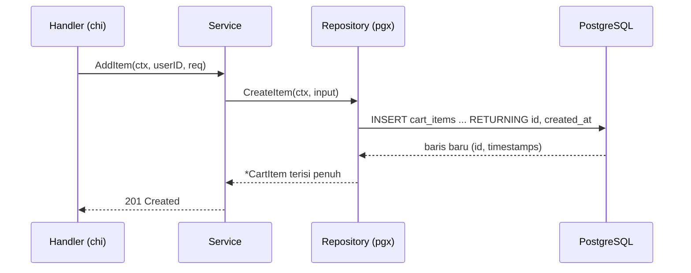
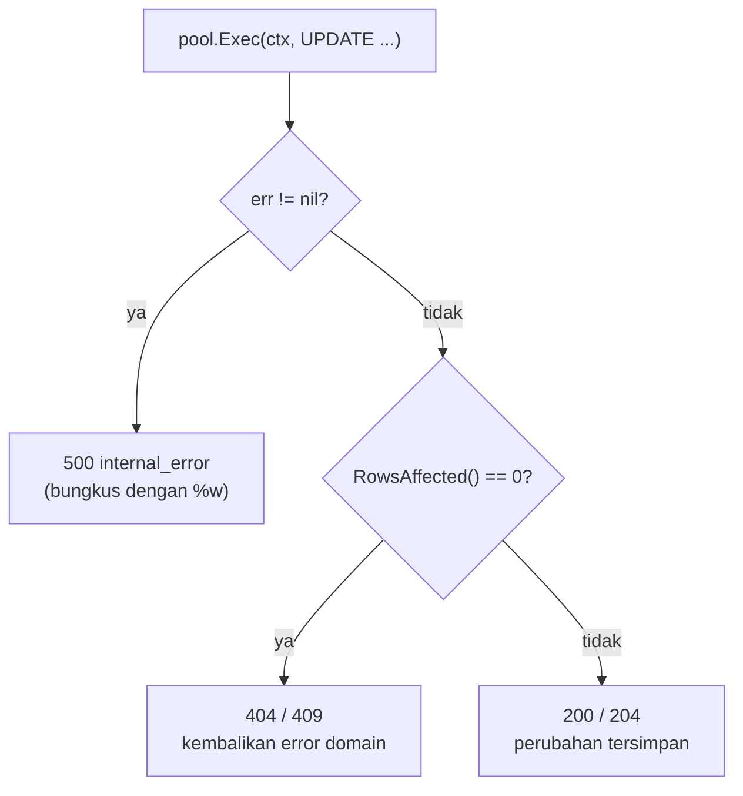
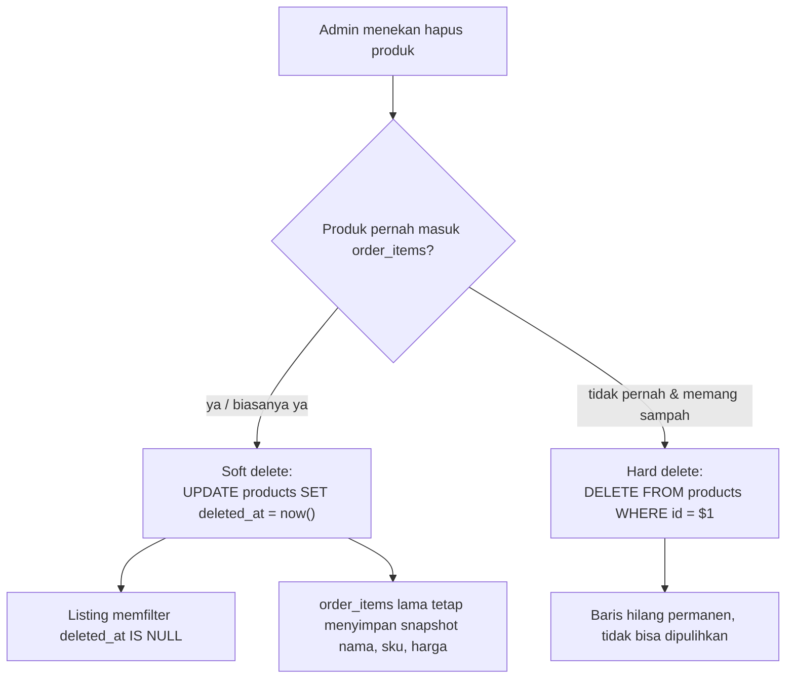
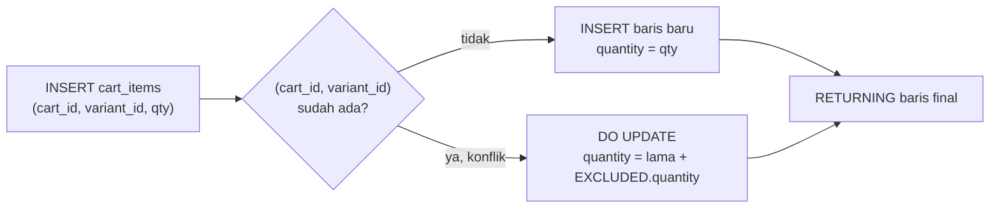
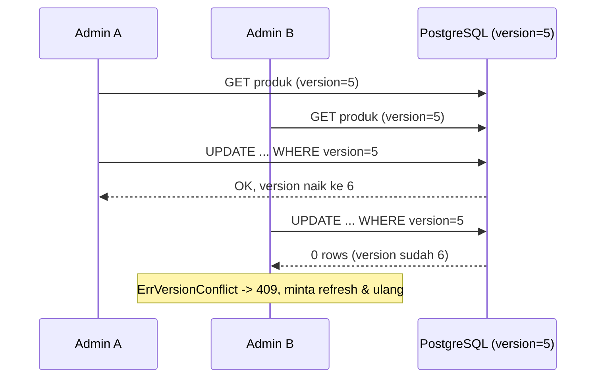

import { Section, Box, Steps, Step, Recap, CardGrid, Card, Chip, Hero, Compare, FileTree, Endpoint, Def } from "@components";

<Hero eyebrow="Roadmap 3 &middot; PostgreSQL dan pgx" title="Menulis Data dengan <em>pgx</em><br />INSERT, UPDATE, DELETE yang Eksplisit">
  <p>Repository proyek skincare berhenti hanya membaca. Mulai chapter ini kita mengubah state bisnis: isi cart, stok varian, harga, status order, sampai soft delete katalog.</p>
  <Fragment slot="meta">
    <Chip icon="database">Roadmap 3</Chip>
    <Chip icon="code">Bahasa: <b>Go 1.26</b></Chip>
    <Chip icon="package">pgx v5</Chip>
    <Chip icon="clock">~80 menit baca</Chip>
  </Fragment>
</Hero>

<Section num="01" id="intro" title="Kenapa Write Query Harus Eksplisit" sub="Di backend e-commerce, write query adalah titik perubahan fakta bisnis.">

<p class="lead">Write query bukan sekadar menyimpan data, melainkan mengubah fakta bisnis: isi cart, jumlah stok varian, harga jual, status order, dan visibilitas produk di katalog.</p>

Di chapter sebelumnya repository hanya membaca: `SELECT` produk, `Scan` ke struct, balas ke handler. Sekarang kita masuk sisi yang lebih berbahaya. Sebuah `SELECT` yang salah hanya menampilkan data yang keliru, tetapi sebuah `UPDATE` yang salah bisa menjual stok yang tidak ada, atau menghapus produk yang masih dirujuk ribuan invoice.

Di Laravel, kamu mungkin terbiasa menulis `$product->update([...])`, `$cart->items()->create([...])`, atau soft delete lewat trait `SoftDeletes` yang terasa otomatis. Di Go dengan pgx, kita menulis SQL secara langsung supaya kontrak ke database terlihat jelas: kolom mana yang berubah, kondisi mana yang wajib terpenuhi sebelum baris boleh berubah, dan apa yang dikembalikan PostgreSQL setelahnya.

<Box variant="bridge" icon="🌉" label="Jembatan: dari Eloquent dan Mongo ke pgx"><p>Eloquent (`save`, `create`, `update`) dan MongoDB (`insertOne`, `updateOne`) menyembunyikan SQL atau perintah wire di balik method. pgx sengaja lebih dekat ke SQL, jadi tiap `INSERT`, `UPDATE`, `DELETE`, dan `ON CONFLICT` terlihat eksplisit di repository. Tidak ada query tersembunyi yang berjalan tanpa kamu tahu.</p></Box>

Dalam proyek online shop skincare, write query dipakai untuk skenario nyata berikut. Endpoint-nya sudah kita rancang di capstone Roadmap 2, sekarang kita beri storage sungguhan.

<Endpoint method="POST" path="/v1/cart/items" desc="Menambahkan varian produk ke cart customer" />
<Endpoint method="PATCH" path="/v1/admin/products/{id}" desc="Mengubah sebagian field produk, misalnya status atau slug" />
<Endpoint method="DELETE" path="/v1/admin/products/{id}" desc="Soft delete produk dari katalog" />
<Endpoint method="POST" path="/v1/checkout" desc="Membuat order baru beserta order items dari cart" />

<Def term="write query"><p>Query yang mengubah data: `INSERT`, `UPDATE`, `DELETE`, dan bentuk gabungan seperti upsert `INSERT ... ON CONFLICT ... DO UPDATE`. Lawannya adalah read query (`SELECT`) yang tidak mengubah state.</p></Def>

PostgreSQL menyediakan klausa `RETURNING` untuk mengambil nilai dari baris yang baru dibuat atau diubah, termasuk `id` yang dibangkitkan database dan `created_at` yang dihitung `now()`. Di sisi Go, `pgxpool.Pool` (yang dibuat di chapter koneksi) menyediakan `Exec` untuk query yang tidak mengembalikan row dan `QueryRow` untuk query yang mengembalikan satu row. Dua method itu adalah seluruh fondasi chapter ini.

<Box variant="note" icon="🧭" label="Konvensi proyek yang dipakai sepanjang chapter"><p>Uang selalu integer rupiah (`price_rupiah`, `unit_price_rupiah`, `total_rupiah` bertipe `bigint` di SQL, `int64` di Go). Primary key `id bigint GENERATED ALWAYS AS IDENTITY`. Timestamp `created_at` dan `updated_at` bertipe `timestamptz NOT NULL DEFAULT now()`. Soft delete lewat kolom `deleted_at timestamptz` yang nullable.</p></Box>

</Section>

<Section num="02" id="fondasi-exec-queryrow" title="Exec vs QueryRow untuk Write" sub="Pilih method berdasarkan apakah SQL mengembalikan baris atau tidak.">

<p class="lead">Aturan praktisnya cuma satu kalimat: pakai `Exec` ketika tidak butuh baris balik, pakai `QueryRow` ketika SQL memakai `RETURNING`.</p>

`pool.Exec(ctx, sql, args...)` menjalankan SQL dan mengembalikan sebuah `pgconn.CommandTag`. Dari `CommandTag` kita bisa membaca berapa baris yang benar-benar terdampak lewat `RowsAffected()`. Ini pilihan tepat untuk `UPDATE` dan `DELETE` yang hasilnya cukup "berhasil atau tidak".

```go title="internal/inventory/repository.go"
commandTag, err := r.pool.Exec(ctx, `
	UPDATE inventories
	SET quantity_available = quantity_available - $2,
	    updated_at = now()
	WHERE variant_id = $1
	  AND quantity_available >= $2
`, variantID, qty)
if err != nil {
	return fmt.Errorf("decrease stock: %w", err)
}

if commandTag.RowsAffected() == 0 {
	return ErrInsufficientStock
}
```

`pool.QueryRow(ctx, sql, args...)` menjalankan SQL yang diharapkan menghasilkan maksimal satu baris, lalu mengembalikan sebuah `pgx.Row`. Satu hal yang sering mengejutkan pendatang dari ORM: error dari query muncul saat `Scan`, bukan saat `QueryRow` dipanggil. `QueryRow` sendiri tidak pernah mengembalikan error.

```go title="internal/cart/repository.go"
var item CartItem
err := r.pool.QueryRow(ctx, `
	INSERT INTO cart_items (cart_id, variant_id, quantity)
	VALUES ($1, $2, $3)
	RETURNING id, created_at, updated_at
`, cartID, variantID, qty).Scan(&item.ID, &item.CreatedAt, &item.UpdatedAt)
if err != nil {
	return nil, fmt.Errorf("create cart item: %w", err)
}
```

<Compare aLabel="Laravel / Mongo: method menyembunyikan SQL" bLabel="Go + pgx: SQL eksplisit" aTone="muted" bTone="violet">
  <Fragment slot="a"><ul><li>`$model->save()` dan `collection.insertOne()` menebak operasi dari state objek (dirty checking) atau argumen.</li><li>Hasilnya kadang boolean, kadang model terisi, kadang dokumen yang sudah punya `_id`.</li><li>Timestamps sering diisi otomatis tanpa kamu menulisnya.</li></ul></Fragment>
  <Fragment slot="b"><ul><li>`Exec` mengembalikan `CommandTag`, sumber kebenaran untuk affected rows.</li><li>`QueryRow` dipakai saat SQL memakai `RETURNING`, hasilnya diambil dengan `Scan`.</li><li>Apa pun yang diisi database (id, timestamp) kamu minta secara eksplisit lewat `RETURNING`.</li></ul></Fragment>
</Compare>

<CardGrid cols={3}>
  <Card><h4>`Exec`</h4><p>Untuk `UPDATE`, `DELETE`, atau `INSERT` yang tidak perlu data balik. Beri `CommandTag`.</p></Card>
  <Card><h4>`QueryRow`</h4><p>Untuk `INSERT ... RETURNING` atau `UPDATE ... RETURNING`. Hasil diambil lewat `Scan`.</p></Card>
  <Card><h4>`Query`</h4><p>Untuk write yang mengembalikan banyak baris, misalnya `DELETE ... RETURNING id` pada banyak row.</p></Card>
</CardGrid>

<Box variant="warn" icon="⚠️" label="Placeholder PostgreSQL adalah $1, bukan ?"><p>Parameter SQL PostgreSQL memakai posisi `$1`, `$2`, dan seterusnya. Tanda tanya `?` adalah gaya MySQL atau driver lain, dan akan langsung error di pgx. Selalu pakai placeholder bernomor, jangan sekali pun menyusun SQL dengan string interpolation dari input user.</p></Box>

<Box variant="note" icon="🧾" label="CommandTag menyimpan lebih dari sekadar jumlah baris"><p>`pgconn.CommandTag` juga punya `Insert()`, `Update()`, `Delete()`, dan `String()` (misalnya menghasilkan `"UPDATE 1"`). Di praktik repository, `RowsAffected()` adalah yang paling sering dipakai, tetapi `String()` berguna untuk logging saat debugging migrasi.</p></Box>

</Section>

<Section num="03" id="insert-returning" title="INSERT RETURNING untuk ID Baru" sub="Database yang membuat ID, Go yang menerima hasilnya dalam satu round trip.">

<p class="lead">Saat membuat baris baru, biarkan PostgreSQL membangkitkan `id` dan `created_at`, lalu ambil nilainya dengan `RETURNING`. Go tidak perlu menebak ID berikutnya.</p>

Tabel `cart_items` di skema kanonik memakai `id bigint GENERATED ALWAYS AS IDENTITY` (pengganti modern untuk `serial`), plus timestamp ber-default `now()`. Aplikasi cukup mengirim data yang ia tahu (cart, varian, quantity), dan biarkan database mengisi sisanya.

```sql title="migrations/000004_create_cart.up.sql"
CREATE TABLE cart_items (
    id          bigint GENERATED ALWAYS AS IDENTITY PRIMARY KEY,
    cart_id     bigint  NOT NULL REFERENCES carts(id) ON DELETE CASCADE,
    variant_id  bigint  NOT NULL REFERENCES product_variants(id) ON DELETE RESTRICT,
    quantity    integer NOT NULL CHECK (quantity > 0),
    created_at  timestamptz NOT NULL DEFAULT now(),
    updated_at  timestamptz NOT NULL DEFAULT now(),
    UNIQUE (cart_id, variant_id)
);
```

Method repository-nya menerima `context.Context` sebagai parameter pertama (idiom Go), memetakan input ke `$1`, `$2`, `$3`, dan membaca kembali kolom yang dibuat database. Perhatikan: `cart_items` sengaja tidak menyimpan harga, karena harga dibaca segar saat checkout, bukan saat barang masuk cart.

```go title="internal/cart/repository.go"
package cart

import (
	"context"
	"fmt"
	"time"

	"github.com/jackc/pgx/v5/pgxpool"
)

type Repository struct {
	pool *pgxpool.Pool
}

func NewRepository(pool *pgxpool.Pool) *Repository {
	return &Repository{pool: pool}
}

type CreateItemInput struct {
	CartID    int64
	VariantID int64
	Quantity  int
}

func (r *Repository) CreateItem(ctx context.Context, in CreateItemInput) (*CartItem, error) {
	const q = `
		INSERT INTO cart_items (cart_id, variant_id, quantity)
		VALUES ($1, $2, $3)
		RETURNING id, cart_id, variant_id, quantity, created_at, updated_at
	`

	var item CartItem
	err := r.pool.QueryRow(ctx, q, in.CartID, in.VariantID, in.Quantity).Scan(
		&item.ID,
		&item.CartID,
		&item.VariantID,
		&item.Quantity,
		&item.CreatedAt,
		&item.UpdatedAt,
	)
	if err != nil {
		return nil, fmt.Errorf("create cart item: %w", err)
	}

	return &item, nil
}

type CartItem struct {
	ID        int64     `json:"id"`
	CartID    int64     `json:"cart_id"`
	VariantID int64     `json:"variant_id"`
	Quantity  int       `json:"quantity"`
	CreatedAt time.Time `json:"created_at"`
	UpdatedAt time.Time `json:"updated_at"`
}
```

<Box variant="bridge" icon="🌉" label="Jembatan: insertOne lalu baca insertedId"><p>Di MongoDB kamu memanggil `const res = await db.collection('cartItems').insertOne(doc)` lalu membaca `res.insertedId`. Di pgx, `RETURNING id` melakukan hal serupa, bedanya ID dibangkitkan database (bukan client) dan kamu sekaligus bisa minta kolom lain seperti `created_at` dalam satu perjalanan ke server.</p></Box>

Alur mentalnya satu round trip: insert dan pembacaan hasil terjadi dalam satu perjalanan query, bukan insert dulu lalu `SELECT` lagi.



<p class="fig-cap"><b>Gambar 1.</b> `INSERT ... RETURNING` menggabungkan write dan pembacaan hasil dalam satu round trip, menghemat satu query dibanding pola insert-lalu-select.</p>

<Box variant="tip" icon="💡" label="Kenapa RETURNING lebih enak daripada LastInsertId"><p>Di MySQL klasik kamu memanggil `LastInsertId()` setelah insert. Pola itu rapuh untuk insert banyak baris dan untuk kolom yang dihitung trigger. `RETURNING` bekerja untuk satu maupun banyak baris dan bisa mengembalikan kolom apa pun, termasuk generated column seperti `line_total_rupiah`.</p></Box>

<Box variant="warn" icon="⚠️" label="Hindari RETURNING * di repository produksi"><p>`RETURNING *` praktis saat eksplorasi di `psql`, tetapi di kode produksi pilih kolom eksplisit. Kalau suatu hari ada migrasi yang menambah kolom, `RETURNING *` mengubah jumlah kolom yang harus di-`Scan` dan kode kamu langsung panik tanpa peringatan kompiler.</p></Box>

</Section>

<Section num="04" id="update-returning" title="UPDATE, updated_at, dan RETURNING" sub="PostgreSQL bisa mengembalikan nilai baru dari baris yang diubah.">

<p class="lead">Untuk operasi update yang perlu memberi tahu client kapan data berubah, gabungkan `SET updated_at = now()` dengan `RETURNING updated_at`.</p>

`created_at` dan `updated_at` memang punya `DEFAULT now()`, tetapi default hanya bekerja saat baris dibuat. Untuk `UPDATE`, PostgreSQL tidak otomatis menyentuh `updated_at`. Kamu harus menuliskannya sendiri di klausa `SET`, atau memasang trigger database. Lupa langkah ini adalah salah satu bug paling halus saat pindah dari Eloquent, yang mengisi `updated_at` di balik layar.

Harga varian disimpan di tabel `product_variants` dengan kolom `price_rupiah bigint`. Method update harga mengubah nilai, menyentuh `updated_at`, lalu mengembalikan timestamp resmi ke service supaya API bisa membalas waktu yang dihasilkan database, bukan jam browser.

```go title="internal/product/repository.go"
func (r *Repository) UpdateVariantPrice(ctx context.Context, variantID int64, priceRupiah int64) (time.Time, error) {
	const q = `
		UPDATE product_variants
		SET price_rupiah = $2,
		    updated_at   = now()
		WHERE id = $1
		  AND is_active = true
		RETURNING updated_at
	`

	var updatedAt time.Time
	err := r.pool.QueryRow(ctx, q, variantID, priceRupiah).Scan(&updatedAt)
	if errors.Is(err, pgx.ErrNoRows) {
		return time.Time{}, ErrVariantNotFound
	}
	if err != nil {
		return time.Time{}, fmt.Errorf("update variant price: %w", err)
	}

	return updatedAt, nil
}
```

Perhatikan pola `errors.Is(err, pgx.ErrNoRows)`. Ketika `UPDATE ... RETURNING` tidak menyentuh satu baris pun (varian tidak ada atau sudah non-aktif), `RETURNING` tidak menghasilkan baris, dan `Scan` mengembalikan `pgx.ErrNoRows`. Itulah cara `QueryRow` memberi tahu kita bahwa "tidak ada yang berubah". Repository menerjemahkannya menjadi error domain `ErrVariantNotFound` agar handler bisa membalas `404`.

<Compare aLabel="Frontend: optimistic update" bLabel="Backend: source of truth" aTone="blue" bTone="teal">
  <Fragment slot="a"><ul><li>React boleh langsung menampilkan harga baru begitu request sukses, demi UX yang cepat.</li><li>Tetapi waktu perubahan menurut browser tidak boleh dianggap kebenaran.</li></ul></Fragment>
  <Fragment slot="b"><ul><li>PostgreSQL menghasilkan `updated_at` lewat `now()` pada server database.</li><li>API mengembalikan timestamp resmi itu, sehingga semua client sepakat soal waktu.</li></ul></Fragment>
</Compare>

<Box variant="note" icon="🧾" label="Kapan pakai Exec, kapan pakai QueryRow untuk UPDATE"><p>Kalau service hanya perlu tahu sukses atau tidak, `Exec` plus `RowsAffected()` sudah cukup dan satu baris lebih ringkas. Kalau service butuh nilai baru (timestamp, total ter-hitung, status setelah transisi), pakai `QueryRow` plus `RETURNING`. Keduanya valid, pilihannya soal "apakah aku butuh data balik".</p></Box>

<Box variant="tip" icon="💡" label="Trigger updated_at jika kamu mau otomatis"><p>Jika kamu ingin perilaku ala Eloquent, buat trigger `BEFORE UPDATE` yang men-set `NEW.updated_at = now()`. Itu menjaga konsistensi walau ada UPDATE yang lupa menyentuh kolomnya. Trade-off-nya: perilaku jadi "magic" lagi (tidak terlihat di SQL aplikasi), jadi dokumentasikan di migrasi. Sepanjang materi ini kita menulisnya eksplisit agar setiap perubahan kasat mata.</p></Box>

</Section>

<Section num="05" id="affected-rows" title="RowsAffected sebagai Guardrail 404" sub="SQL sukses dieksekusi belum tentu ada baris yang berubah.">

<p class="lead">`RowsAffected()` adalah pagar pengaman yang membedakan dua hal yang sering dikira sama: query berhasil dieksekusi, dan data benar-benar berubah.</p>

Contoh paling penting adalah update stok. Query bisa valid secara sintaks, koneksi database sehat, dan tetap nol baris berubah karena stok kurang atau varian tidak ditemukan. Untuk backend e-commerce, eksekusi tanpa error itu bukan sukses bisnis. Inilah jembatan langsung dari kontrak HTTP yang kita rancang di Roadmap 2: nol baris berubah biasanya berarti `404` (resource tidak ada) atau `409` (kondisi bisnis tidak terpenuhi), bukan `200`.



<p class="fig-cap"><b>Gambar 2.</b> Dua cabang keputusan setelah Exec: error teknis menuju 500, sedangkan nol baris berubah menuju 404 atau 409 tergantung konteks bisnis.</p>

```go title="internal/inventory/repository.go"
var ErrInsufficientStock = errors.New("insufficient stock")
var ErrInventoryNotFound = errors.New("inventory not found")

func (r *Repository) DecreaseAvailable(ctx context.Context, variantID int64, qty int) error {
	const q = `
		UPDATE inventories
		SET quantity_available = quantity_available - $2,
		    updated_at = now()
		WHERE variant_id = $1
		  AND quantity_available >= $2
	`

	tag, err := r.pool.Exec(ctx, q, variantID, qty)
	if err != nil {
		return fmt.Errorf("decrease available: %w", err)
	}

	if tag.RowsAffected() == 0 {
		// Bisa karena stok kurang, bisa karena variant_id tidak ada.
		// Bedakan dengan satu SELECT cek keberadaan bila perlu pesan akurat.
		return ErrInsufficientStock
	}

	return nil
}
```

<Def term="affected rows"><p>Jumlah baris yang benar-benar terkena `INSERT`, `UPDATE`, atau `DELETE`. Berbeda dari "query sukses dieksekusi": query dengan `WHERE` yang tidak cocok satu baris pun tetap sukses, tetapi affected rows-nya nol.</p></Def>

<CardGrid cols={2}>
  <Card><h4>Valid secara teknis</h4><p>Database mengeksekusi query tanpa error: sintaks benar, koneksi sehat, tipe cocok.</p></Card>
  <Card><h4>Valid secara bisnis</h4><p>Ada baris yang memenuhi `WHERE`, sehingga state bisnis (stok, status) benar-benar berpindah.</p></Card>
</CardGrid>

<Box variant="bridge" icon="🌉" label="Jembatan: matchedCount dan modifiedCount di Mongo"><p>Di MongoDB, `updateOne` mengembalikan `matchedCount` dan `modifiedCount` untuk persoalan yang sama. `RowsAffected()` adalah padanan pgx-nya: ia memberitahu apakah `WHERE` kamu benar-benar menyentuh data. Di Eloquent, `$query->update([...])` mengembalikan jumlah baris yang ter-update, itulah angka yang sama.</p></Box>

<Box variant="tip" icon="💡" label="Pindahkan aturan bisnis sederhana ke WHERE"><p>Pola `WHERE quantity_available >= $2` menaruh aturan "tidak boleh oversell" langsung di database. Hasilnya atomik: cek dan pengurangan terjadi dalam satu statement, sehingga dua request paralel tidak bisa sama-sama lolos cek lalu sama-sama mengurangi. Lalu `RowsAffected() == 0` jadi sinyal bahwa aturan itu tidak terpenuhi.</p></Box>

</Section>

<Section num="06" id="soft-delete" title="Soft Delete vs Hard Delete" sub="Tidak semua penghapusan boleh benar-benar menghapus baris.">

<p class="lead">Untuk katalog e-commerce, soft delete sering lebih aman daripada `DELETE FROM products`, karena riwayat order tetap membutuhkan produk untuk tetap ada.</p>

Bedakan dua operasi. Hard delete (`DELETE`) menghapus baris secara fisik, cocok untuk data yang benar-benar boleh hilang (misalnya membersihkan satu `cart_items` saat user menekan tombol hapus). Soft delete menandai baris sebagai terhapus lewat kolom `deleted_at` tanpa menghilangkannya, cocok untuk data yang masih dirujuk histori (produk yang pernah dibeli).



<p class="fig-cap"><b>Gambar 3.</b> Pohon keputusan soft delete vs hard delete. Untuk produk yang punya jejak transaksi, soft delete menyembunyikannya dari katalog tanpa merusak invoice lama.</p>

Soft delete produk hanya menyentuh `deleted_at` dan `updated_at`. Karena ini operasi tanpa data balik, `Exec` plus `RowsAffected()` sudah pas: nol baris berubah berarti produk sudah terhapus sebelumnya atau memang tidak ada, dan kita balas `404`.

```go title="internal/product/repository.go"
func (r *Repository) SoftDelete(ctx context.Context, productID int64) error {
	const q = `
		UPDATE products
		SET deleted_at = now(),
		    updated_at = now()
		WHERE id = $1
		  AND deleted_at IS NULL
	`

	tag, err := r.pool.Exec(ctx, q, productID)
	if err != nil {
		return fmt.Errorf("soft delete product: %w", err)
	}

	if tag.RowsAffected() == 0 {
		return ErrProductNotFound
	}

	return nil
}
```

Untuk cart item, hard delete justru tepat. Item cart tidak punya nilai histori; ketika user menghapusnya, ia memang harus hilang. Di sini kita pakai `DELETE`, dan `RowsAffected()` membedakan "item dihapus" dari "item tidak ada / bukan milik cart ini".

```go title="internal/cart/repository.go"
func (r *Repository) DeleteItem(ctx context.Context, cartID, itemID int64) error {
	const q = `DELETE FROM cart_items WHERE id = $1 AND cart_id = $2`

	tag, err := r.pool.Exec(ctx, q, itemID, cartID)
	if err != nil {
		return fmt.Errorf("delete cart item: %w", err)
	}

	if tag.RowsAffected() == 0 {
		return ErrItemNotFound
	}

	return nil
}
```

<Box variant="bridge" icon="🌉" label="Jembatan: Laravel SoftDeletes vs filter manual"><p>Trait `SoftDeletes` di Laravel otomatis menambahkan global scope `whereNull('deleted_at')` ke setiap query model. Di Go tidak ada magic itu: setiap query listing dan detail produk harus sengaja menulis `AND deleted_at IS NULL`. Lebih repot, tetapi konsekuensinya kasat mata dan tidak ada query yang diam-diam memfilter.</p></Box>

<Box variant="warn" icon="⚠️" label="Filter deleted_at harus konsisten di SEMUA query baca"><p>Kalau satu query listing lupa `deleted_at IS NULL`, produk yang sudah dihapus akan muncul lagi di API publik. Ini bug data, bukan bug syntax, jadi kompiler diam saja. Solusinya: standarkan view atau helper query yang selalu menyertakan filter, dan jadikan `SELECT * FROM products` mentah sebagai pelanggaran kode review.</p></Box>

<Box variant="warn" icon="⚠️" label="Hard delete produk bisa merusak invoice lama"><p>Jangan pernah `DELETE` produk yang sudah dirujuk `order_items`. Walau `order_items` menyimpan snapshot nama dan harga, foreign key `order_items.variant_id -> product_variants.id` dengan `ON DELETE RESTRICT` akan menolak penghapusan, dan kalaupun lolos, laporan dan audit jadi pincang. Soft delete menjaga referensi tetap utuh.</p></Box>

</Section>

<Section num="07" id="upsert" title="Upsert Cart Item dengan ON CONFLICT" sub="Tambah baru kalau belum ada, jumlahkan kalau sudah ada, dalam satu statement.">

<p class="lead">Saat customer menambahkan varian yang sudah ada di cart, kita tidak ingin baris duplikat. Kita ingin quantity bertambah. PostgreSQL menyelesaikan ini dengan satu statement `INSERT ... ON CONFLICT`.</p>

Tabel `cart_items` punya `UNIQUE (cart_id, variant_id)`. Tanpa upsert, kamu harus `SELECT` dulu untuk cek apakah item ada, lalu memilih `INSERT` atau `UPDATE`. Pola "cek lalu tulis" itu rawan race condition: dua request paralel bisa sama-sama lolos `SELECT` lalu sama-sama `INSERT`, dan salah satu gagal karena melanggar unique constraint. `ON CONFLICT` menutup celah itu karena cek dan tulis terjadi atomik di database.

```go title="internal/cart/repository.go"
func (r *Repository) UpsertItem(ctx context.Context, in CreateItemInput) (*CartItem, error) {
	const q = `
		INSERT INTO cart_items (cart_id, variant_id, quantity)
		VALUES ($1, $2, $3)
		ON CONFLICT (cart_id, variant_id) DO UPDATE
		SET quantity   = cart_items.quantity + EXCLUDED.quantity,
		    updated_at = now()
		RETURNING id, cart_id, variant_id, quantity, created_at, updated_at
	`

	var item CartItem
	err := r.pool.QueryRow(ctx, q, in.CartID, in.VariantID, in.Quantity).Scan(
		&item.ID,
		&item.CartID,
		&item.VariantID,
		&item.Quantity,
		&item.CreatedAt,
		&item.UpdatedAt,
	)
	if err != nil {
		return nil, fmt.Errorf("upsert cart item: %w", err)
	}

	return &item, nil
}
```

Dua kata kunci penting di sini. `EXCLUDED` adalah baris yang tadinya hendak di-`INSERT` (nilai dari `VALUES`), jadi `EXCLUDED.quantity` adalah quantity yang baru dikirim customer. `cart_items.quantity` adalah nilai yang sudah ada di baris. Jadi `cart_items.quantity + EXCLUDED.quantity` artinya "jumlah lama ditambah jumlah baru". Kalau kamu ingin perilaku "ganti, bukan jumlahkan", cukup tulis `SET quantity = EXCLUDED.quantity`.



<p class="fig-cap"><b>Gambar 4.</b> Satu upsert menggantikan pola "SELECT lalu pilih INSERT atau UPDATE", sekaligus aman dari race condition karena cek unique terjadi atomik di database.</p>

<Box variant="bridge" icon="🌉" label="Jembatan: updateOne dengan upsert:true di Mongo"><p>Di MongoDB, `updateOne(filter, { $inc: { quantity: n } }, { upsert: true })` melakukan persis ide ini: buat kalau belum ada, naikkan kalau ada. `ON CONFLICT ... DO UPDATE` adalah versi SQL-nya, dengan `EXCLUDED` berperan seperti dokumen yang hendak di-insert. Di Eloquent, padanannya `Model::upsert([...], uniqueBy, update)`.</p></Box>

<Box variant="note" icon="📝" label="DO NOTHING untuk idempotensi sederhana"><p>Kalau kamu hanya ingin "abaikan kalau sudah ada" (misalnya menandai event webhook yang sudah diproses lewat `payments.event_id`), pakai `ON CONFLICT (event_id) DO NOTHING`. Tambahkan `RETURNING id` dan cek apakah ada baris balik untuk tahu apakah ini event baru atau duplikat. Tanpa `DO UPDATE`, tidak ada perubahan pada baris lama.</p></Box>

<Box variant="warn" icon="⚠️" label="Target ON CONFLICT harus punya unique index"><p>`ON CONFLICT (cart_id, variant_id)` hanya bekerja jika ada `UNIQUE` constraint atau unique index pada kolom-kolom itu. Tanpa itu, PostgreSQL tidak tahu konflik apa yang dimaksud dan query error. Pastikan migrasi sudah membuat `UNIQUE (cart_id, variant_id)` sebelum mengandalkan upsert.</p></Box>

</Section>

<Section num="08" id="partial-update" title="Partial Update dengan COALESCE" sub="Ubah hanya field yang dikirim, biarkan sisanya apa adanya.">

<p class="lead">Endpoint `PATCH` mengubah sebagian field. Tantangannya: SQL harus mengubah kolom yang dikirim saja, tanpa menimpa kolom lain dengan nilai kosong.</p>

Di Roadmap 2 kita memakai pointer (`*string`, `*int64`) di DTO patch agar `nil` berarti "tidak dikirim". Sekarang pertanyaannya: bagaimana menerjemahkan itu ke SQL? Ada dua pendekatan bersih, dan keduanya layak kamu kuasai.

<h3>Pendekatan A: COALESCE dengan argumen nullable</h3>

Trik `COALESCE($n, kolom)` berarti "pakai `$n` kalau bukan NULL, kalau NULL pakai nilai kolom yang sekarang". Kita kirim pointer Go langsung sebagai argumen: pgx memetakan pointer `nil` menjadi SQL `NULL`, dan pointer berisi nilai menjadi nilainya. Satu query melayani semua kombinasi field.

```go title="internal/product/repository.go"
type PatchProductInput struct {
	Name        *string
	Slug        *string
	Description *string
	Status      *string // draft, active, archived
}

func (r *Repository) PatchProduct(ctx context.Context, id int64, in PatchProductInput) (time.Time, error) {
	const q = `
		UPDATE products
		SET name        = COALESCE($2, name),
		    slug        = COALESCE($3, slug),
		    description = COALESCE($4, description),
		    status      = COALESCE($5, status),
		    updated_at  = now()
		WHERE id = $1
		  AND deleted_at IS NULL
		RETURNING updated_at
	`

	var updatedAt time.Time
	err := r.pool.QueryRow(ctx, q, id, in.Name, in.Slug, in.Description, in.Status).Scan(&updatedAt)
	if errors.Is(err, pgx.ErrNoRows) {
		return time.Time{}, ErrProductNotFound
	}
	if err != nil {
		return time.Time{}, fmt.Errorf("patch product: %w", err)
	}

	return updatedAt, nil
}
```

<Box variant="warn" icon="⚠️" label="COALESCE tidak bisa membedakan NULL dari 'set ke NULL'"><p>Kelemahan `COALESCE`: kalau sebuah kolom memang boleh di-set menjadi `NULL` oleh user (misalnya menghapus `description`), pola ini tidak bisa membedakan "tidak dikirim" dari "set ke NULL", karena keduanya jadi argumen `NULL`. Untuk kolom yang boleh dikosongkan secara sengaja, pakai pendekatan B di bawah.</p></Box>

<h3>Pendekatan B: dynamic SET (query builder kecil)</h3>

Saat kamu butuh kontrol penuh (termasuk set ke NULL secara sengaja, atau menghindari menulis kolom yang tidak berubah sama sekali), bangun klausa `SET` secara dinamis dari field yang benar-benar dikirim. Kuncinya: nama kolom berasal dari kode kita sendiri (bukan input user), sedangkan nilai tetap lewat placeholder `$n`. Itu menjaga keamanan dari SQL injection.

```go title="internal/product/repository.go"
func (r *Repository) PatchProductDynamic(ctx context.Context, id int64, in PatchProductInput) (time.Time, error) {
	set := make([]string, 0, 5)
	args := make([]any, 0, 6)
	args = append(args, id) // $1 selalu id

	if in.Name != nil {
		args = append(args, *in.Name)
		set = append(set, fmt.Sprintf("name = $%d", len(args)))
	}
	if in.Slug != nil {
		args = append(args, *in.Slug)
		set = append(set, fmt.Sprintf("slug = $%d", len(args)))
	}
	if in.Status != nil {
		args = append(args, *in.Status)
		set = append(set, fmt.Sprintf("status = $%d", len(args)))
	}
	if len(set) == 0 {
		return time.Time{}, ErrNothingToUpdate // tidak ada field dikirim
	}
	set = append(set, "updated_at = now()")

	q := fmt.Sprintf(`
		UPDATE products
		SET %s
		WHERE id = $1 AND deleted_at IS NULL
		RETURNING updated_at
	`, strings.Join(set, ", "))

	var updatedAt time.Time
	err := r.pool.QueryRow(ctx, q, args...).Scan(&updatedAt)
	if errors.Is(err, pgx.ErrNoRows) {
		return time.Time{}, ErrProductNotFound
	}
	if err != nil {
		return time.Time{}, fmt.Errorf("patch product dynamic: %w", err)
	}

	return updatedAt, nil
}
```

<Compare aLabel="COALESCE: satu query statis" bLabel="Dynamic SET: query dirakit" aTone="violet" bTone="teal">
  <Fragment slot="a"><ul><li>SQL tetap, mudah dibaca dan di-review.</li><li>Selalu menyentuh semua kolom (walau nilainya sama).</li><li>Tidak bisa membedakan "tidak dikirim" dari "set ke NULL".</li></ul></Fragment>
  <Fragment slot="b"><ul><li>Hanya menyentuh kolom yang benar-benar berubah.</li><li>Bisa set ke NULL secara sengaja, dan menolak body kosong.</li><li>Sedikit lebih kompleks: nama kolom dari allowlist kode, nilai tetap lewat placeholder.</li></ul></Fragment>
</Compare>

<Box variant="bridge" icon="🌉" label="Jembatan: $fill dirty attributes di Eloquent"><p>Eloquent melakukan dirty checking: `$model->fill($data)->save()` hanya menulis kolom yang berubah. Pendekatan B di atas adalah versi manualnya. Bedanya, kamu yang menentukan allowlist kolom (lewat cek pointer), bukan framework, sehingga tidak ada risiko mass assignment dari field yang tidak kamu izinkan.</p></Box>

<Box variant="tip" icon="💡" label="Untuk proyek besar, pertimbangkan query builder"><p>Membangun SET secara manual baik untuk dipahami, tetapi pada banyak tabel bisa berulang. Library seperti `squirrel` (Masterminds/squirrel) menghasilkan SQL bertanda placeholder dengan aman. Tetap, untuk modular monolith kita yang berukuran sedang, dua pendekatan di atas sudah cukup dan menjaga SQL tetap kasat mata.</p></Box>

</Section>

<Section num="09" id="optimistic-lock" title="Optimistic Concurrency dengan version" sub="Mencegah dua admin saling menimpa tanpa mengunci baris.">

<p class="lead">Bayangkan dua admin membuka editor produk yang sama, lalu menyimpan. Tanpa pengaman, simpanan kedua menimpa diam-diam simpanan pertama. Optimistic locking memakai kolom `version` untuk mendeteksi tabrakan itu.</p>

Ide optimistic concurrency: setiap baris punya kolom `version integer`. Saat membaca, client menerima versi saat ini. Saat menulis, `UPDATE` hanya berhasil kalau versi di database masih sama dengan versi yang dibaca tadi, dan setiap update menaikkan `version`. Kalau ada yang menyalip lebih dulu, versi sudah berubah, `WHERE` tidak cocok, `RowsAffected()` jadi nol, dan kita tahu terjadi konflik.

```sql title="migrations/000009_add_version.up.sql"
ALTER TABLE products
    ADD COLUMN version integer NOT NULL DEFAULT 1;
```

```go title="internal/product/repository.go"
var ErrVersionConflict = errors.New("version conflict")

func (r *Repository) UpdateProductOptimistic(ctx context.Context, id int64, expectedVersion int, name string) (int, error) {
	const q = `
		UPDATE products
		SET name       = $3,
		    version    = version + 1,
		    updated_at = now()
		WHERE id = $1
		  AND version = $2
		  AND deleted_at IS NULL
		RETURNING version
	`

	var newVersion int
	err := r.pool.QueryRow(ctx, q, id, expectedVersion, name).Scan(&newVersion)
	if errors.Is(err, pgx.ErrNoRows) {
		// Baris ada tapi versi tidak cocok (atau produk sudah terhapus).
		return 0, ErrVersionConflict
	}
	if err != nil {
		return 0, fmt.Errorf("optimistic update: %w", err)
	}

	return newVersion, nil
}
```



<p class="fig-cap"><b>Gambar 5.</b> Optimistic locking. Admin B yang menyalip kalah karena versinya basi; handler membalas 409 dan meminta client memuat ulang data terbaru sebelum menyimpan ulang.</p>

<Box variant="bridge" icon="🌉" label="Jembatan: HTTP 409 dan header ETag"><p>Pola ini sama dengan optimistic concurrency di HTTP via `ETag` dan `If-Match`. Kolom `version` berperan seperti ETag baris. Ketika konflik terjadi, balas `409 Conflict` dengan kode error `version_conflict`, lalu frontend memuat versi terbaru dan meminta user menyimpan ulang. Eloquent tidak menyediakan ini secara default, jadi inilah keunggulan menulis SQL eksplisit.</p></Box>

<Box variant="note" icon="📝" label="Optimistic vs pessimistic (SELECT FOR UPDATE)"><p>Optimistic cocok ketika konflik jarang (kebanyakan edit tidak bertabrakan), karena tidak mengunci dan murah. Kalau konflik sering atau kamu wajib menjamin urutan (misalnya saldo), pessimistic locking dengan `SELECT ... FOR UPDATE` di dalam transaksi lebih tepat. Locking dan transaksi penuh dibahas di chapter berikutnya.</p></Box>

</Section>

<Section num="10" id="bulk-insert" title="Bulk Insert Order Items" sub="Menyisipkan banyak baris sekaligus tanpa loop satu-satu.">

<p class="lead">Saat checkout, satu order bisa berisi banyak `order_items`. Menyisipkannya satu per satu lewat loop berarti puluhan round trip. PostgreSQL dan pgx punya cara lebih cepat.</p>

Ada tiga cara menyisipkan banyak baris, dari yang paling sederhana ke yang paling cepat. Untuk jumlah order item yang realistis (beberapa sampai puluhan baris per order), `Batch` adalah titik manis: cepat, fleksibel, dan tetap mendukung `RETURNING`.

<h3>Cara 1: multi-row VALUES (jumlah baris kecil dan tetap)</h3>

Satu `INSERT` dengan banyak baris di klausa `VALUES`. Sederhana, tetapi placeholder-nya ikut bertambah, jadi cocok untuk jumlah baris yang tidak terlalu besar.

```sql title="contoh multi-row insert"
INSERT INTO order_items (order_id, variant_id, product_name, variant_name, sku, unit_price_rupiah, quantity)
VALUES
    ($1, $2, $3, $4, $5, $6, $7),
    ($1, $8, $9, $10, $11, $12, $13)
RETURNING id, line_total_rupiah;
```

<h3>Cara 2: pgx.Batch (banyak statement, satu perjalanan)</h3>

`pgx.Batch` mengantre banyak query lalu mengirimnya dalam satu round trip dengan `SendBatch`. Tiap item bisa berbeda dan tetap bisa `RETURNING`. Inilah cara yang akan kita pakai untuk order items.

```go title="internal/order/repository.go"
type NewOrderItem struct {
	VariantID       int64
	ProductName     string
	VariantName     string
	SKU             string
	UnitPriceRupiah int64
	Quantity        int
}

func (r *Repository) InsertOrderItems(ctx context.Context, orderID int64, items []NewOrderItem) ([]int64, error) {
	batch := &pgx.Batch{}
	const q = `
		INSERT INTO order_items
			(order_id, variant_id, product_name, variant_name, sku, unit_price_rupiah, quantity)
		VALUES ($1, $2, $3, $4, $5, $6, $7)
		RETURNING id
	`
	for _, it := range items {
		batch.Queue(q, orderID, it.VariantID, it.ProductName, it.VariantName, it.SKU, it.UnitPriceRupiah, it.Quantity)
	}

	br := r.pool.SendBatch(ctx, batch)
	defer br.Close()

	ids := make([]int64, 0, len(items))
	for range items {
		var id int64
		if err := br.QueryRow().Scan(&id); err != nil {
			return nil, fmt.Errorf("insert order item: %w", err)
		}
		ids = append(ids, id)
	}

	return ids, nil
}
```

Urutan penting di `Batch`: kamu memanggil `QueryRow` (atau `Exec`) di `BatchResults` sebanyak statement yang di-`Queue`, dalam urutan yang sama. `defer br.Close()` wajib agar koneksi dikembalikan ke pool dan error tertunda ikut terbaca.

<h3>Cara 3: CopyFrom (ribuan baris, paling cepat)</h3>

Untuk impor masif (misalnya seed katalog ribuan varian, bukan order biasa), `CopyFrom` memakai protokol `COPY` PostgreSQL yang jauh lebih cepat dari `INSERT` beruntun. Trade-off-nya: ia tidak mendukung `RETURNING` dan tidak menjalankan trigger `BEFORE INSERT` tertentu, jadi pakai saat kamu memang butuh kecepatan curah.

```go title="internal/product/repository.go"
func (r *Repository) BulkInsertVariants(ctx context.Context, rows [][]any) (int64, error) {
	n, err := r.pool.CopyFrom(
		ctx,
		pgx.Identifier{"product_variants"},
		[]string{"product_id", "sku", "variant_name", "price_rupiah", "is_active"},
		pgx.CopyFromRows(rows),
	)
	if err != nil {
		return 0, fmt.Errorf("bulk insert variants: %w", err)
	}
	return n, nil
}
```

<Compare aLabel="Batch" bLabel="CopyFrom" aTone="blue" bTone="teal">
  <Fragment slot="a"><ul><li>Mendukung `RETURNING` (ambil id atau generated column).</li><li>Tiap statement boleh berbeda; cocok untuk order items per checkout.</li><li>Skala puluhan sampai ratusan baris terasa pas.</li></ul></Fragment>
  <Fragment slot="b"><ul><li>Tercepat untuk ribuan baris (protokol COPY).</li><li>Tidak ada `RETURNING`, tidak menjalankan sebagian trigger.</li><li>Cocok untuk seed dan impor data, bukan transaksi user biasa.</li></ul></Fragment>
</Compare>

<Box variant="bridge" icon="🌉" label="Jembatan: insertMany di Mongo"><p>`db.collection.insertMany([...])` di MongoDB mengirim banyak dokumen sekaligus. `pgx.Batch` adalah padanan terdekatnya untuk write yang butuh hasil per baris, sementara `CopyFrom` adalah jalur curah ekstrem. Di Eloquent, `Model::insert([...])` (tanpa `s`) melakukan multi-row insert mirip Cara 1, tetapi tidak mengisi timestamp dan tidak memicu event model.</p></Box>

<Box variant="warn" icon="⚠️" label="Bulk insert order items idealnya di dalam transaksi"><p>Menyisipkan order items, mengurangi stok, dan membuat header order harus terjadi atomik. Kalau salah satu gagal, semua harus batal supaya tidak ada order setengah jadi. Method di atas menunjukkan mekanika write banyak baris; pembungkusan transaksi (`pool.Begin`, `tx.SendBatch`, `tx.Commit`) adalah inti chapter berikutnya.</p></Box>

</Section>

<Section num="11" id="repository-method" title="Repository Method Lengkap" sub="Satu file yang menggabungkan pola write utama secara realistis.">

<p class="lead">Bagian ini menyatukan `Exec`, `QueryRow`, `RETURNING`, timestamp, soft delete, upsert, dan affected rows ke dalam repository produk yang idiomatik.</p>

Struktur folder tetap mengikuti modular monolith dari roadmap sebelumnya: tiap domain punya package sendiri di `internal/<domain>`, dengan `repository.go` memegang SQL mentah.

<FileTree title="Letak repository write" tree={`
internal/
  product/
    model.go          # struct Product, ProductVariant
    repository.go      # insert, patch, soft delete, optimistic
  cart/
    model.go
    repository.go      # upsert item, delete item
  order/
    model.go
    repository.go      # insert header + batch order_items
  inventory/
    repository.go      # decrease available (guardrail stok)
  database/
    postgres.go        # pgxpool.New dari chapter koneksi
migrations/
  000002_create_catalog.up.sql
  000004_create_cart.up.sql
  000005_create_orders.up.sql
`} />

```go title="internal/product/repository.go"
package product

import (
	"context"
	"errors"
	"fmt"
	"strings"
	"time"

	"github.com/jackc/pgx/v5"
	"github.com/jackc/pgx/v5/pgxpool"
)

var (
	ErrProductNotFound = errors.New("product not found")
	ErrVariantNotFound = errors.New("variant not found")
	ErrNothingToUpdate = errors.New("no fields to update")
	ErrVersionConflict = errors.New("version conflict")
)

type Repository struct {
	pool *pgxpool.Pool
}

func NewRepository(pool *pgxpool.Pool) *Repository {
	return &Repository{pool: pool}
}

type CreateProductInput struct {
	BrandID     int64
	Slug        string
	Name        string
	Description string
	Status      string // draft, active, archived
}

// Create menyisipkan produk baru dan mengembalikan id serta created_at dari database.
func (r *Repository) Create(ctx context.Context, in CreateProductInput) (int64, time.Time, error) {
	const q = `
		INSERT INTO products (brand_id, slug, name, description, status)
		VALUES ($1, $2, $3, $4, $5)
		RETURNING id, created_at
	`

	var (
		id        int64
		createdAt time.Time
	)
	err := r.pool.QueryRow(ctx, q, in.BrandID, in.Slug, in.Name, in.Description, in.Status).
		Scan(&id, &createdAt)
	if err != nil {
		return 0, time.Time{}, fmt.Errorf("create product: %w", err)
	}

	return id, createdAt, nil
}

type PatchProductInput struct {
	Name        *string
	Slug        *string
	Description *string
	Status      *string
}

// Patch mengubah hanya field yang dikirim, lalu mengembalikan updated_at resmi.
func (r *Repository) Patch(ctx context.Context, id int64, in PatchProductInput) (time.Time, error) {
	set := make([]string, 0, 4)
	args := make([]any, 0, 6)
	args = append(args, id) // $1 = id

	if in.Name != nil {
		args = append(args, *in.Name)
		set = append(set, fmt.Sprintf("name = $%d", len(args)))
	}
	if in.Slug != nil {
		args = append(args, *in.Slug)
		set = append(set, fmt.Sprintf("slug = $%d", len(args)))
	}
	if in.Description != nil {
		args = append(args, *in.Description)
		set = append(set, fmt.Sprintf("description = $%d", len(args)))
	}
	if in.Status != nil {
		args = append(args, *in.Status)
		set = append(set, fmt.Sprintf("status = $%d", len(args)))
	}
	if len(set) == 0 {
		return time.Time{}, ErrNothingToUpdate
	}
	set = append(set, "updated_at = now()")

	q := fmt.Sprintf(`
		UPDATE products
		SET %s
		WHERE id = $1 AND deleted_at IS NULL
		RETURNING updated_at
	`, strings.Join(set, ", "))

	var updatedAt time.Time
	err := r.pool.QueryRow(ctx, q, args...).Scan(&updatedAt)
	if errors.Is(err, pgx.ErrNoRows) {
		return time.Time{}, ErrProductNotFound
	}
	if err != nil {
		return time.Time{}, fmt.Errorf("patch product: %w", err)
	}

	return updatedAt, nil
}

// SoftDelete menandai produk terhapus tanpa menghapus baris.
func (r *Repository) SoftDelete(ctx context.Context, id int64) error {
	const q = `
		UPDATE products
		SET deleted_at = now(),
		    updated_at = now()
		WHERE id = $1 AND deleted_at IS NULL
	`

	tag, err := r.pool.Exec(ctx, q, id)
	if err != nil {
		return fmt.Errorf("soft delete product: %w", err)
	}
	if tag.RowsAffected() == 0 {
		return ErrProductNotFound
	}

	return nil
}

// UpdateVariantPrice mengubah harga varian dan mengembalikan timestamp resmi.
func (r *Repository) UpdateVariantPrice(ctx context.Context, variantID, priceRupiah int64) (time.Time, error) {
	const q = `
		UPDATE product_variants
		SET price_rupiah = $2,
		    updated_at   = now()
		WHERE id = $1 AND is_active = true
		RETURNING updated_at
	`

	var updatedAt time.Time
	err := r.pool.QueryRow(ctx, q, variantID, priceRupiah).Scan(&updatedAt)
	if errors.Is(err, pgx.ErrNoRows) {
		return time.Time{}, ErrVariantNotFound
	}
	if err != nil {
		return time.Time{}, fmt.Errorf("update variant price: %w", err)
	}

	return updatedAt, nil
}
```

<Box variant="tip" icon="💡" label="Error domain tetap di repository boundary"><p>Repository menerjemahkan `pgx.ErrNoRows` dan `RowsAffected() == 0` menjadi error domain (`ErrProductNotFound`, `ErrVersionConflict`). Handler lalu memetakan error domain itu ke status HTTP. Dengan begitu, handler tidak perlu tahu apa pun soal pgx, dan kalau suatu hari driver berganti, hanya repository yang berubah.</p></Box>

<Box variant="warn" icon="⚠️" label="Constraint violation perlu pemetaan khusus"><p>Insert yang melanggar `UNIQUE (slug)` atau `CHECK (quantity > 0)` akan mengembalikan `*pgconn.PgError`. Tangkap dengan `errors.As(err, &pgErr)` lalu cek `pgErr.Code` (`23505` untuk unique violation, `23514` untuk check violation) agar bisa membalas `409 conflict` yang ramah, bukan `500`. Detail kode SQLSTATE ini diperdalam di chapter error handling.</p></Box>

</Section>

<Section num="12" id="hands-on" title="Hands-on: Tulis, Ubah, Hapus" sub="Latihan kecil untuk merasakan write flow end-to-end.">

<p class="lead">Latihan ini membuat kamu mempraktikkan empat pola inti: insert returning, upsert, update kondisional dengan guardrail, dan soft delete, langsung di skema kanonik.</p>

<Steps>
  <Step><b>Siapkan tabel target</b><p>Pastikan migrasi `cart_items`, `products`, `product_variants`, dan `inventories` sudah jalan dengan `migrate up`. Cek `created_at`, `updated_at`, `deleted_at`, dan `UNIQUE (cart_id, variant_id)` ada.</p></Step>
  <Step><b>Tulis CreateItem</b><p>Mulai dari `cart.Repository.CreateItem` karena ia menampilkan pola `INSERT ... RETURNING` yang paling sering dipakai sepanjang proyek.</p></Step>
  <Step><b>Ubah jadi UpsertItem</b><p>Ganti ke `INSERT ... ON CONFLICT (cart_id, variant_id) DO UPDATE`, lalu tambahkan dua kali item yang sama dan pastikan quantity bertambah, bukan baris kedua.</p></Step>
  <Step><b>Tambahkan guardrail stok</b><p>Tulis `inventory.Repository.DecreaseAvailable` dengan `Exec`, kembalikan `ErrInsufficientStock` saat `RowsAffected() == 0`.</p></Step>
  <Step><b>Verifikasi di psql</b><p>Panggil repository dengan `context.WithTimeout`, lalu cek hasilnya langsung di database memakai `psql`. Bandingkan timestamp sebelum dan sesudah update.</p></Step>
</Steps>

Jalankan beberapa write langsung di `psql` dulu agar paham efeknya sebelum membungkusnya di Go. Perhatikan `RETURNING` mengembalikan nilai yang dihitung database.

```sql title="psql"
-- 1) Insert cart item, minta id dan timestamp balik.
INSERT INTO cart_items (cart_id, variant_id, quantity)
VALUES (1, 101, 2)
RETURNING id, created_at, updated_at;

-- 2) Upsert: tambah varian yang sama, quantity menjumlah.
INSERT INTO cart_items (cart_id, variant_id, quantity)
VALUES (1, 101, 3)
ON CONFLICT (cart_id, variant_id) DO UPDATE
SET quantity = cart_items.quantity + EXCLUDED.quantity,
    updated_at = now()
RETURNING id, quantity;          -- quantity sekarang 5

-- 3) Kurangi stok dengan guardrail, lihat berapa baris terdampak.
UPDATE inventories
SET quantity_available = quantity_available - 2,
    updated_at = now()
WHERE variant_id = 101
  AND quantity_available >= 2
RETURNING variant_id, quantity_available, updated_at;

-- 4) Soft delete produk, hanya kalau belum terhapus.
UPDATE products
SET deleted_at = now(), updated_at = now()
WHERE id = 10 AND deleted_at IS NULL;
```

Lalu jalankan dari Go lewat test integrasi atau handler, dan cek hasilnya.

```bash title="Terminal"
go test ./internal/...
psql "$DATABASE_URL" -c "SELECT id, quantity, updated_at FROM cart_items WHERE cart_id = 1 AND variant_id = 101;"
psql "$DATABASE_URL" -c "SELECT variant_id, quantity_available FROM inventories WHERE variant_id = 101;"
```

<Box variant="note" icon="🧪" label="Uji bukan cuma happy path"><p>Tes juga jalur gagal: stok kurang (harus `ErrInsufficientStock`), produk sudah soft deleted (update harus nol baris), dan id yang tidak ada (harus `ErrProductNotFound`). Justru jalur inilah yang sering bocor di produksi kalau hanya happy path yang diuji.</p></Box>

<Box variant="tip" icon="💡" label="context.WithTimeout untuk setiap write"><p>Bungkus setiap pemanggilan repository dengan `ctx, cancel := context.WithTimeout(r.Context(), 5*time.Second)` lalu `defer cancel()`. pgx menghormati pembatalan context: kalau request HTTP dibatalkan client, query yang sedang berjalan ikut dibatalkan, sehingga koneksi tidak tertahan sia-sia.</p></Box>

</Section>

<Section num="13" id="jebakan-umum" title="Jebakan Umum dari JS dan PHP" sub="Sebagian bug write datang dari asumsi framework yang terbawa ke Go.">

<p class="lead">pgx memberi kontrol tinggi, dan kontrol itu datang bersama tanggung jawab yang dulu ditangani diam-diam oleh framework.</p>

<CardGrid cols={2}>
  <Card><h4>Lupa cek `RowsAffected`</h4><p>SQL bisa sukses teknis tetapi nol baris berubah karena `WHERE` tidak cocok. Tanpa cek, kamu membalas `200` padahal seharusnya `404` atau `409`.</p></Card>
  <Card><h4>Mengira `updated_at` otomatis</h4><p>`DEFAULT now()` hanya jalan saat insert. Untuk update, set `updated_at = now()` sendiri atau pasang trigger.</p></Card>
  <Card><h4>Memakai `Exec` untuk `RETURNING`</h4><p>Kalau butuh id atau timestamp dari database, gunakan `QueryRow` lalu `Scan`. `Exec` membuang baris hasil `RETURNING`.</p></Card>
  <Card><h4>Lupa filter `deleted_at`</h4><p>Query produk aktif harus konsisten menulis `deleted_at IS NULL`. Lupa satu saja, produk terhapus muncul lagi.</p></Card>
  <Card><h4>Pola cek-lalu-tulis</h4><p>`SELECT` dulu lalu pilih `INSERT`/`UPDATE` rawan race. Pakai `ON CONFLICT` agar atomik.</p></Card>
  <Card><h4>Uang sebagai float</h4><p>Jangan pernah `numeric` apalagi `float` untuk rupiah. Pakai `bigint` (`int64`) sesuai konvensi proyek.</p></Card>
</CardGrid>

<Compare aLabel="Kebiasaan dari Laravel / Mongo" bLabel="Kebiasaan di Go + pgx" aTone="muted" bTone="blue">
  <Fragment slot="a"><ul><li>Framework mengisi `created_at`/`updated_at` otomatis.</li><li>Soft delete menambah global scope diam-diam.</li><li>Kegagalan dilempar sebagai exception yang naik ke handler global.</li><li>`save()` menebak insert atau update dari state objek.</li></ul></Fragment>
  <Fragment slot="b"><ul><li>SQL menulis `updated_at = now()` secara eksplisit.</li><li>Repository menulis `deleted_at IS NULL` di tiap query baca.</li><li>Error adalah nilai yang dicek setelah `Exec` atau `Scan`, dibungkus `%w`.</li><li>Kamu memilih `INSERT`, `UPDATE`, atau `ON CONFLICT` secara sadar.</li></ul></Fragment>
</Compare>

<Box variant="warn" icon="⚠️" label="Jangan susun SQL dengan string interpolation"><p>Selalu pakai placeholder `$1`, `$2`. Bahkan pada dynamic SET, yang dirakit dari kode adalah nama kolom (dari allowlist), bukan nilai. Menyambung input user ke string SQL adalah pintu masuk klasik SQL injection.</p></Box>

<Box variant="bridge" icon="🌉" label="Jembatan: try/catch vs if err != nil"><p>Di JS dan PHP, kegagalan write sering dilempar sebagai exception yang ditangkap jauh di atas. Di Go, error adalah nilai yang harus dicek tepat setelah `Exec`, `Scan`, atau `SendBatch`. Tidak ada yang melempar untuk kamu, jadi tidak ada kegagalan write yang lolos diam-diam, asalkan kamu memeriksa setiap error.</p></Box>

</Section>

<Section num="14" id="ringkasan" title="Ringkasan & Poin Penting">

<p class="lead">Sekarang repository proyek skincare bisa menulis data ke PostgreSQL dengan pola yang eksplisit, aman dari race, dan mudah diuji.</p>

<Recap title="Yang Wajib Menempel"><ul><li>Pakai `pool.Exec(ctx, sql, args...)` untuk write tanpa data balik, dan `pool.QueryRow(...)` untuk `INSERT`/`UPDATE ... RETURNING`.</li><li>`RETURNING id, created_at` mengambil nilai yang dibangkitkan database dalam satu round trip, tanpa query select tambahan.</li><li>`updated_at` harus diubah eksplisit (`SET updated_at = now()`) saat update, kecuali kamu sengaja memasang trigger.</li><li>`tag.RowsAffected() == 0` adalah guardrail: petakan ke `404` (resource tidak ada) atau `409` (kondisi bisnis gagal), bukan `200`.</li><li>Soft delete (`deleted_at = now()`) untuk data berjejak histori; hard delete (`DELETE`) untuk data sekali pakai seperti cart item.</li><li>Upsert `INSERT ... ON CONFLICT (...) DO UPDATE` menggabungkan cart item duplikat secara atomik, memakai `EXCLUDED` untuk nilai baru.</li><li>Partial update lewat `COALESCE($n, kolom)` atau dynamic SET; nilai selalu lewat placeholder, nama kolom dari allowlist kode.</li><li>Optimistic locking dengan kolom `version` mendeteksi tabrakan dua penulis lewat `WHERE version = $expected` dan `RowsAffected() == 0`.</li><li>Bulk insert order items lewat `pgx.Batch` (mendukung `RETURNING`); `CopyFrom` untuk impor curah ribuan baris.</li><li>Uang selalu `bigint`/`int64` rupiah (`price_rupiah`, `unit_price_rupiah`, `total_rupiah`), tidak pernah float.</li></ul></Recap>

Dalam proyek online shop skincare, pola chapter ini langsung dipakai untuk menambah cart item (upsert), mengubah harga dan status produk (partial update), menjaga stok dari oversell (guardrail `RowsAffected`), menyembunyikan produk dari katalog (soft delete), dan menyisipkan order items saat checkout (batch). Yang belum: semua write checkout itu harus terjadi bersama atau batal bersama.

Itulah jembatan ke chapter berikutnya. `CreateOrder` lengkap menyentuh `orders`, `order_items`, `inventories`, dan `carts` sekaligus, jadi tidak boleh setengah jadi. Chapter Transaksi membungkus seluruh rangkaian write ini dalam satu `pool.Begin`, `tx.Commit`, dan `defer tx.Rollback`, lengkap dengan isolation level dan penanganan serialization failure.

<Box variant="note" icon="📚" label="Rujukan resmi"><p>Untuk pendalaman, baca dokumentasi `pgxpool` dan `pgconn.CommandTag` di pkg.go.dev, dokumentasi PostgreSQL untuk `INSERT` (termasuk `ON CONFLICT` dan `RETURNING`), `UPDATE`, dan `DELETE`, serta panduan `COPY` untuk bulk load.</p></Box>

</Section>
