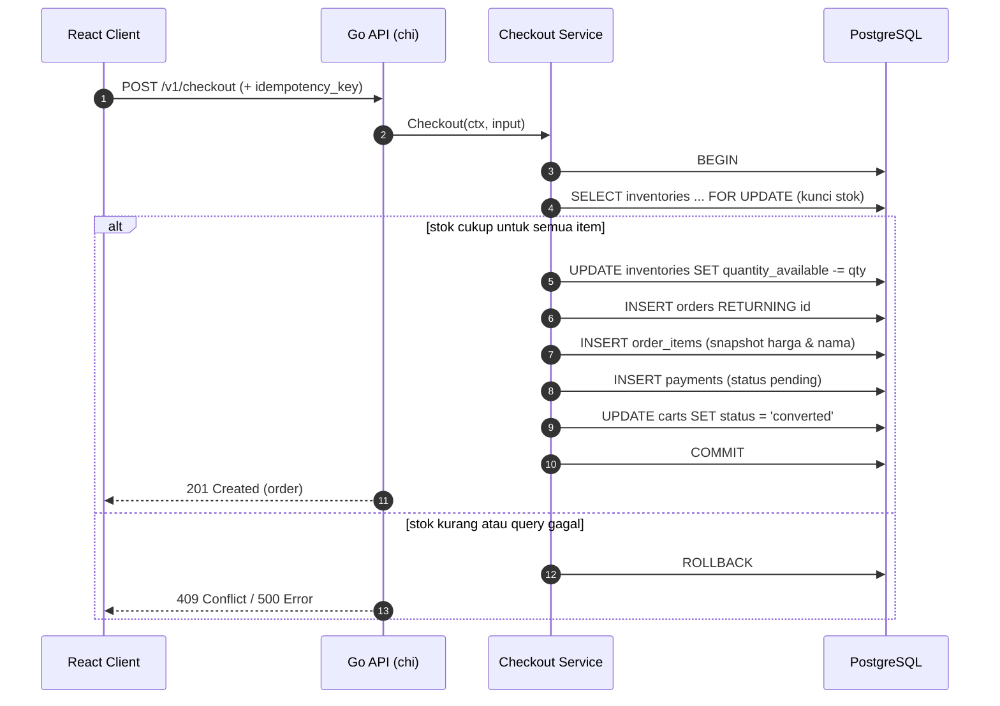
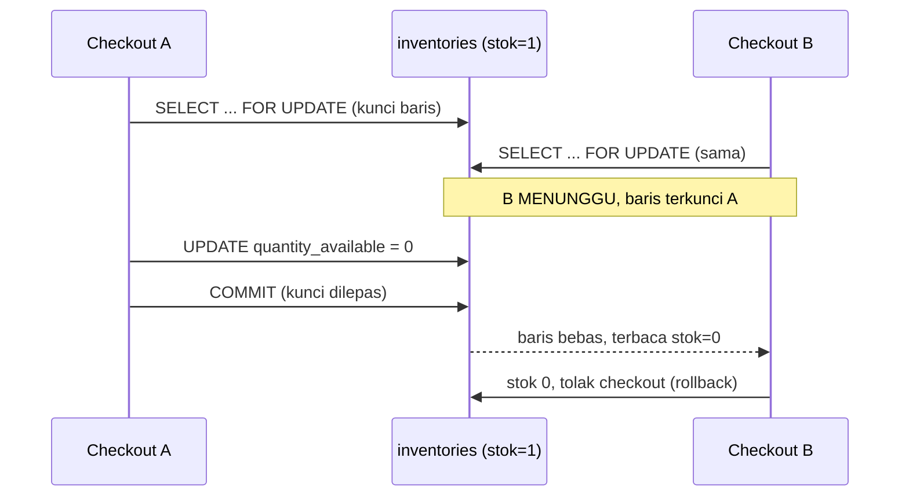
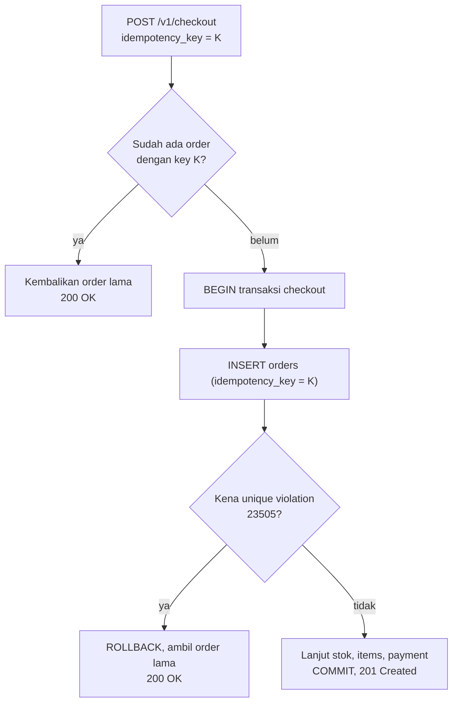
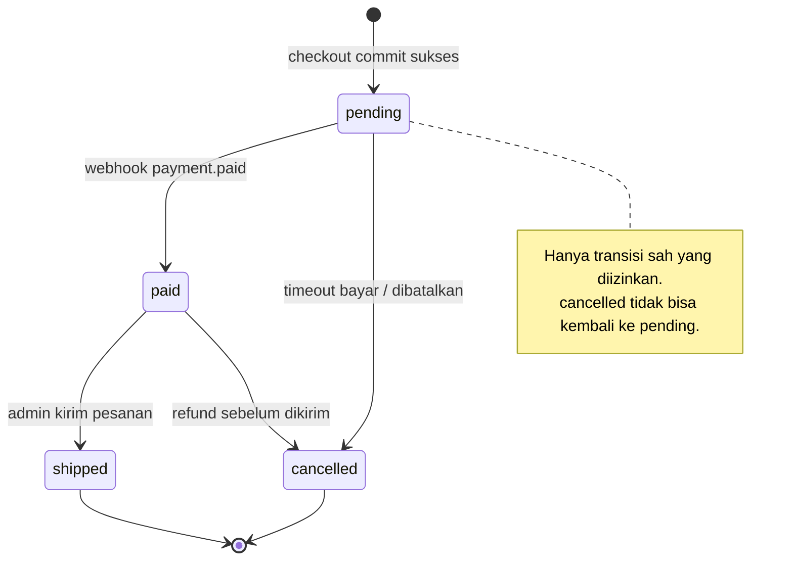

import { Section, Box, Steps, Step, Recap, CardGrid, Card, Chip, Hero, Compare, FileTree, Endpoint, Def } from "@components";

<Hero eyebrow="Roadmap 3 &middot; PostgreSQL dan pgx" title="Transaksi Database<br /><em>untuk Operasi Kritis</em>">
  <p>Checkout online shop skincare tidak boleh setengah sukses, stok berkurang tanpa order adalah bug bisnis yang nyata.</p>
  <Fragment slot="meta">
    <Chip icon="database">Bahasa: <b>Go 1.26</b></Chip>
    <Chip icon="package">pgx <b>v5</b></Chip>
    <Chip icon="shield">Konsistensi</Chip>
    <Chip icon="clock">~80 menit baca</Chip>
  </Fragment>
</Hero>

<Section num="01" id="intro" title="Checkout Harus Sukses atau Batal Bersama" sub="Satu aksi bisnis menyentuh banyak tabel, dan semuanya harus konsisten">

<p class="lead">Transaksi adalah pagar pengaman saat satu aksi bisnis mengubah banyak tabel sekaligus. Tanpa pagar itu, checkout bisa berhenti di tengah dan meninggalkan data yang rusak.</p>

Di chapter sebelumnya kamu sudah menulis data dengan `Exec`, `QueryRow`, `INSERT ... RETURNING`, `UPDATE`, dan membaca `RowsAffected`. Semua itu aman untuk satu statement. Setiap statement tunggal di PostgreSQL sebenarnya sudah berjalan dalam transaksi implisit (autocommit): ia sukses penuh atau gagal penuh. Masalah baru muncul saat satu fitur butuh beberapa statement yang harus diperlakukan sebagai satu paket.

Endpoint checkout adalah contoh paling tajam di proyek skincare kita:

<Endpoint method="POST" path="/v1/checkout" desc="Ubah cart menjadi order, kurangi stok, dan buat payment record dalam satu transaksi" />

Satu request checkout menyentuh banyak tabel kanonik sekaligus: ia membaca `cart_items`, mengunci dan mengurangi `inventories`, menulis baris `orders`, menulis beberapa `order_items`, lalu membuat `payments`. Tanpa transaksi, API bisa berhenti setelah `inventories` berkurang tetapi sebelum `orders` tertulis. Dari sisi frontend React, response yang diterima cuma `500`. Dari sisi bisnis, stok hilang tanpa order dan tanpa pembayaran. Itu uang yang menguap diam-diam.

<Box variant="analogy" icon="🧾" label="Analogi: satu struk kasir"><p>Checkout mirip kasir mencetak satu struk. Tidak masuk akal kalau stok toko sudah berkurang, tetapi struknya gagal tercetak dan pembayaran tidak tercatat. Kasir yang baik menyelesaikan seluruh struk sekaligus atau membatalkan semuanya, bukan setengah-setengah.</p></Box>

Transaksi memastikan operasi kritis seperti checkout hanya punya dua hasil yang mungkin: semua perubahan masuk, atau semua perubahan dibatalkan. Tidak ada keadaan setengah jadi. Di Go dengan pgx, kita mendapatkan kontrol penuh atas batas itu, dan itulah yang akan kita rakit sepanjang chapter ini sampai jadi checkout yang aman.

<Box variant="bridge" icon="🌉" label="Jembatan: dari DB::transaction dan $transaction"><p>Di Laravel kamu menulis `DB::transaction(fn () => ...)`, di Prisma kamu menulis `prisma.$transaction([...])`. Keduanya menyembunyikan begin, commit, dan rollback di balik satu pemanggilan. Di Go dengan pgx, langkah itu eksplisit: mulai `tx`, jalankan query lewat `tx`, lalu `Commit` atau `Rollback`. Lebih banyak baris, tetapi setiap baris jelas dan mudah ditelusuri saat ada bug.</p></Box>

<Box variant="note" icon="🗺️" label="Posisi chapter ini"><p>Kita berhenti di transaksi mentah dengan pgx (`pool.Begin`, `tx.Exec`, `tx.Commit`). Cara merapikannya ke dalam layer service dan repository yang bersih dibahas di chapter Repository (R3C10) dan Roadmap 4. Di sini fokusnya satu: memahami batas transaksi dan menulis checkout yang tidak pernah pecah.</p></Box>

</Section>

<Section num="02" id="acid" title="ACID dalam Bahasa Backend" sub="Empat huruf yang menjelaskan kenapa data online shop tetap masuk akal">

<p class="lead">ACID bukan istilah akademik kosong. Ini empat jaminan yang membuat data online shop tetap masuk akal saat request datang bertubi-tubi dan ada yang gagal di tengah.</p>

<Def term="transaksi database"><p>Sekumpulan operasi SQL yang diperlakukan sebagai satu unit kerja: semua sukses lalu commit, atau ada yang gagal lalu rollback. Selama transaksi belum commit, perubahan di dalamnya belum dianggap nyata oleh transaksi lain.</p></Def>

<CardGrid cols={2}>
  <Card><h4>Atomicity</h4><p>Checkout tidak boleh setengah jadi. Pengurangan stok, baris `orders`, semua `order_items`, dan `payments` harus masuk sebagai satu paket, atau tidak sama sekali.</p></Card>
  <Card><h4>Consistency</h4><p>Database tetap memenuhi aturan bisnis di setiap commit, misalnya `inventories.quantity_available >= 0` dan setiap `order_items` punya `orders` yang valid.</p></Card>
  <Card><h4>Isolation</h4><p>Checkout user A tidak boleh melihat perubahan setengah jadi dari checkout user B yang belum commit. Inilah yang mencegah dua orang membeli stok terakhir yang sama.</p></Card>
  <Card><h4>Durability</h4><p>Setelah commit sukses, perubahan dijamin tersimpan oleh database walaupun proses Go langsung mati atau server reboot setelahnya.</p></Card>
</CardGrid>

PostgreSQL menjelaskan transaksi sebagai blok antara `BEGIN` dan `COMMIT`, dan `ROLLBACK` membatalkan seluruh update yang sudah berjalan di dalam blok tersebut. Bacaan resmi yang berguna: [PostgreSQL Transactions](https://www.postgresql.org/docs/current/tutorial-transactions.html) dan [PostgreSQL Glossary: ACID](https://www.postgresql.org/docs/current/glossary.html).

Dari empat huruf itu, dua yang paling sering memusingkan backend engineer pemula adalah **Atomicity** (yang kita jaga dengan boundary transaksi yang benar) dan **Isolation** (yang kita atur dengan isolation level dan kunci baris). Sisa chapter ini berputar di kedua huruf itu, diterapkan langsung ke checkout skincare.

<Box variant="bridge" icon="🌉" label="Jembatan: ini bukan janji Promise"><p>Di JavaScript, `Promise.all([...])` hanya mengoordinasikan operasi async agar selesai bersama. Kalau operasi ketiga gagal, dua operasi pertama yang sudah menulis ke database TIDAK otomatis dibatalkan, Promise tidak tahu apa-apa soal rollback. Atomicity adalah fitur database, bukan fitur runtime async. Inilah jebakan klasik developer Node yang baru pegang SQL serius.</p></Box>

</Section>

<Section num="03" id="begin-commit-rollback" title="Begin, Commit, dan Rollback di pgx" sub="Tiga method yang menjadi tulang punggung setiap transaksi">

<p class="lead">Di pgx, transaksi dimulai dari pool, lalu semua query kritis dijalankan lewat objek `tx`, bukan lewat pool lagi.</p>

`pool.Begin(ctx)` mengambil satu koneksi dari pool dan memulai transaction block di koneksi itu. Hasilnya adalah sebuah `pgx.Tx`. Selama transaksi masih terbuka, koneksi tersebut dipegang khusus untuk transaksi itu sampai kamu memanggil `Commit(ctx)` atau `Rollback(ctx)`. Setelah salah satunya dipanggil, koneksi dikembalikan ke pool. Dokumentasi resmi yang relevan: [pgxpool.Pool.Begin](https://pkg.go.dev/github.com/jackc/pgx/v5/pgxpool#Pool.Begin) dan [pgx.Tx](https://pkg.go.dev/github.com/jackc/pgx/v5#Tx).

```go title="contoh-begin-commit-rollback.go"
tx, err := pool.Begin(ctx)
if err != nil {
	return fmt.Errorf("begin transaction: %w", err)
}
defer tx.Rollback(ctx) // sabuk pengaman, no-op jika sudah commit

tag, err := tx.Exec(ctx, `
	UPDATE inventories
	SET quantity_available = quantity_available - $2,
	    updated_at = now()
	WHERE variant_id = $1
	  AND quantity_available >= $2
`, variantID, qty)
if err != nil {
	return fmt.Errorf("decrement stock: %w", err)
}
if tag.RowsAffected() != 1 {
	return ErrOutOfStock // stok kurang, biarkan defer Rollback membatalkan
}

if err := tx.Commit(ctx); err != nil {
	return fmt.Errorf("commit transaction: %w", err)
}
return nil
```

Tiga hal yang wajib diperhatikan dari potongan di atas. Pertama, query dijalankan lewat `tx.Exec`, bukan `pool.Exec`. Kedua, kita memeriksa `tag.RowsAffected()` karena `UPDATE ... WHERE quantity_available >= $2` bisa sukses secara SQL tetapi mengubah nol baris (artinya stok kurang). Ketiga, `Commit` hanya dipanggil di akhir setelah semua langkah lolos.

<Box variant="tip" icon="💡" label="tx.Exec, tx.Query, tx.QueryRow"><p>`pgx.Tx` punya method yang sama persis bentuknya dengan `*pgxpool.Pool`: `Exec`, `Query`, dan `QueryRow`, semuanya menerima `ctx` sebagai parameter pertama. Jadi setelah kamu nyaman menulis query di chapter sebelumnya, menulis query di dalam transaksi tidak butuh API baru. Yang berubah hanya objek penerimanya: dari `pool` jadi `tx`.</p></Box>

<Compare aLabel="Laravel: DB::transaction(closure)" bLabel="Go + pgx: tx eksplisit" aTone="muted" bTone="violet">
  <Fragment slot="a"><ul><li>`DB::transaction()` membungkus begin, commit, dan rollback dari mata kita.</li><li>Closure yang melempar exception otomatis memicu rollback.</li><li>Praktis, tetapi batas transaksi jadi tersembunyi dan mudah meluas tanpa sadar.</li></ul></Fragment>
  <Fragment slot="b"><ul><li>`pool.Begin(ctx)` mengembalikan `tx` yang kamu pegang sendiri.</li><li>Kamu yang menentukan kapan `Commit` dipanggil, dan `defer Rollback` jadi guard-nya.</li><li>Lebih banyak baris, tetapi boundary transaksi terlihat jelas di kode.</li></ul></Fragment>
</Compare>

<Box variant="warn" icon="⚠️" label="Context cancel tidak otomatis rollback dengan rapi"><p>Membatalkan `ctx` memang akan memutus query yang sedang berjalan, tetapi jangan mengandalkan itu sebagai mekanisme rollback. Cancel context bisa meninggalkan koneksi dalam keadaan tidak menentu. Selalu tutup transaksi secara eksplisit dengan `Commit` atau `Rollback`, jangan biarkan ia menggantung menunggu context mati.</p></Box>

</Section>

<Section num="04" id="defer-rollback" title="Idiom defer tx.Rollback" sub="Rollback dulu sebagai sabuk pengaman, commit hanya di akhir">

<p class="lead">Pola paling aman di pgx adalah menaruh `defer tx.Rollback(ctx)` tepat setelah `Begin`, lalu memanggil `Commit` hanya di akhir saat semua langkah sukses.</p>

`defer tx.Rollback(ctx)` terlihat aneh di awal, karena kamu juga akan memanggil `Commit` di jalur sukses. Bukankah itu berarti rollback dipanggil setelah commit? Betul, dan itu memang disengaja dan aman. Di pgx, memanggil `Rollback` pada transaksi yang sudah berhasil `Commit` akan mengembalikan error `pgx.ErrTxClosed`, dan error itu tidak berbahaya untuk diabaikan. Inilah idiom resmi yang direkomendasikan komunitas pgx.

```go title="pola-defer-rollback.go"
tx, err := pool.Begin(ctx)
if err != nil {
	return fmt.Errorf("begin checkout: %w", err)
}
defer tx.Rollback(ctx) // jalur error & panik aman, jalur sukses jadi no-op

if err := doCheckoutWrites(ctx, tx); err != nil {
	return err // tx otomatis di-rollback oleh defer
}

if err := tx.Commit(ctx); err != nil {
	return fmt.Errorf("commit checkout: %w", err)
}
return nil // defer Rollback jalan, tapi tx sudah committed -> ErrTxClosed (aman)
```

Kenapa idiom ini begitu disukai? Karena ia menutup semua jalur keluar fungsi sekaligus. Apa pun yang membuat fungsi berhenti sebelum `Commit`, entah itu `return err` di tengah, panic, atau early return karena validasi, akan memicu `defer Rollback` dan transaksi tidak menggantung. Tanpa idiom ini, kamu harus menulis `tx.Rollback(ctx)` di setiap titik error secara manual, dan satu yang terlewat berarti koneksi bocor.

<Steps>
  <Step><b>Mulai transaksi</b><p>`pool.Begin(ctx)` membuka transaction block dan memegang satu koneksi sampai transaksi ditutup.</p></Step>
  <Step><b>Pasang rollback guard</b><p>`defer tx.Rollback(ctx)` di baris berikutnya memastikan transaksi tidak menggantung apa pun yang terjadi.</p></Step>
  <Step><b>Jalankan semua query lewat tx</b><p>Pakai `tx.Exec`, `tx.Query`, `tx.QueryRow`. Jangan menyelipkan `pool.Exec` di tengah, karena itu memakai koneksi lain di luar transaction block.</p></Step>
  <Step><b>Commit paling akhir</b><p>`tx.Commit(ctx)` hanya saat semua update, insert, dan pemeriksaan affected rows sudah lolos. Periksa juga error commit-nya.</p></Step>
</Steps>

<Box variant="bridge" icon="🌉" label="Jembatan: defer Rollback itu seperti finally"><p>Di JS/TS kamu mungkin menulis `try { await tx.commit() } catch { await tx.rollback() } finally { ... }`. Di Go, `defer tx.Rollback(ctx)` menggantikan blok `finally` yang membersihkan resource, sedangkan keputusan sukses tetap ditentukan oleh `Commit` eksplisit. Bedanya, defer berjalan walau ada panic, jadi lebih sulit lupa membersihkan.</p></Box>

<Box variant="warn" icon="⚠️" label="Jangan telan error Commit"><p>Error dari `tx.Rollback` di defer boleh diabaikan, tetapi error dari `tx.Commit` TIDAK boleh. Kalau commit gagal, database belum menjamin perubahan tersimpan, sehingga caller harus menerima error itu dan menganggap checkout gagal. Menelan error commit adalah cara paling halus kehilangan order.</p></Box>

Beberapa engineer suka membungkus pola ini dengan helper bawaan pgx, `pgx.BeginFunc(ctx, pool, fn)`, yang otomatis commit jika `fn` mengembalikan `nil` dan rollback jika ada error. Itu mendekatkan rasanya ke `DB::transaction(closure)` Laravel. Untuk chapter ini kita pakai bentuk eksplisit dulu agar setiap langkah terlihat, lalu kamu boleh memilih helper saat polanya sudah melekat.

</Section>

<Section num="05" id="batas-transaksi" title="Batas Transaksi yang Sehat" sub="Cukup luas untuk konsisten, cukup pendek untuk cepat">

<p class="lead">Boundary transaksi yang sehat untuk checkout adalah satu request checkout, bukan satu sesi belanja dan bukan satu proses pembayaran eksternal.</p>

Satu HTTP request `POST /v1/checkout` punya tepat satu transaksi database. Di dalamnya kita melakukan operasi yang harus konsisten di Postgres: baca `cart_items`, kunci dan kurangi `inventories`, tulis `orders`, tulis `order_items`, tulis `payments` lokal, lalu tandai cart selesai. Semua itu pendek, hanya menyentuh PostgreSQL, dan tidak menunggu jaringan luar.

Yang sama pentingnya adalah apa yang TIDAK boleh masuk transaksi. Jangan membuka transaksi sejak user membuka halaman checkout, itu mengunci koneksi terlalu lama. Jangan menunggu response dari payment gateway eksternal di dalam transaksi, karena panggilan itu bisa lambat, retry, atau timeout, dan selama itu transaksi memegang kunci baris `inventories`. Yang kita simpan di dalam transaksi cuma niat pembayaran lokal, misalnya satu baris `payments` dengan `status = 'pending'`. Integrasi ke gateway dilakukan setelah commit.

<CardGrid cols={3}>
  <Card><h4>Masuk transaksi</h4><p>Operasi database yang harus konsisten: kunci stok, kurangi `inventories`, insert `orders`, insert `order_items`, insert `payments` pending.</p></Card>
  <Card><h4>Di luar transaksi</h4><p>Call payment gateway, kirim email konfirmasi, push notification, dan pekerjaan background lain yang lambat atau bisa gagal sendiri.</p></Card>
  <Card><h4>Durasi sehat</h4><p>Sependek mungkin. Semakin lama transaksi memegang kunci baris, semakin besar peluang checkout lain mengantre atau deadlock.</p></Card>
</CardGrid>

<Box variant="bridge" icon="🌉" label="Jembatan: lifecycle request React vs transaksi"><p>Dari frontend, checkout adalah satu klik dan satu request. Dari backend, request itu memegang satu transaksi pendek agar data konsisten tanpa mengunci tabel terlalu lama. Jangan tergoda memetakan "sesi belanja user" ke "satu transaksi database", keduanya skala waktu yang sangat berbeda: sesi bisa berjam-jam, transaksi harus dalam hitungan milidetik.</p></Box>

<Box variant="warn" icon="⚠️" label="Commit di tengah hampir selalu bau desain"><p>Kalau kamu merasa perlu `Commit` di tengah checkout (misalnya commit setelah mengurangi stok, lalu lanjut insert order), itu tanda boundary belum jelas atau ada operasi eksternal yang dipaksa masuk transaksi. Commit di tengah memecah satu operasi bisnis jadi dua operasi permanen, dan rollback setelahnya tidak bisa mengembalikan yang sudah committed.</p></Box>

</Section>

<Section num="06" id="alur-checkout" title="Alur Transaksi Checkout" sub="Satu workflow bisnis dilihat dari satu transaction block">

<p class="lead">Checkout adalah contoh terbaik untuk melihat transaksi sebagai satu workflow bisnis. Diagram berikut menunjukkan urutan langkah di dalam satu blok BEGIN sampai COMMIT.</p>



<p class="fig-cap"><b>Gambar 1.</b> Semua langkah database checkout berada dalam satu transaction block. Antara BEGIN dan COMMIT, baris `inventories` yang relevan terkunci sehingga checkout lain menunggu giliran.</p>

Perhatikan urutannya. Kita mengunci stok dulu dengan `FOR UPDATE` sebelum menguranginya, lalu menulis `orders` dan `order_items` dengan harga yang dibekukan (snapshot), lalu `payments` dalam status `pending`. Cart ditandai `converted` di langkah terakhir sebelum commit. Kalau langkah mana pun gagal, `defer tx.Rollback(ctx)` mengembalikan semuanya seolah checkout tidak pernah terjadi.

Kenapa kita tidak commit di tengah? Karena commit di tengah memecah satu operasi bisnis jadi dua operasi permanen. Kalau pengurangan stok sudah committed tetapi `INSERT orders` kemudian gagal, rollback setelahnya tidak bisa mengembalikan stok yang sudah permanen. Perbaikan manual memang mungkin, tetapi jauh lebih rawan daripada menjaga semuanya dalam satu transaksi pendek.

<Box variant="note" icon="🧊" label="Snapshot harga di order_items"><p>Skema kanonik kita menyimpan `unit_price_rupiah` di `order_items` sebagai snapshot saat checkout, dan `line_total_rupiah` adalah generated column. Artinya harga produk yang berubah besok tidak akan mengubah total order hari ini. Harga dibekukan di dalam transaksi yang sama dengan saat order dibuat, jadi tidak ada celah harga berubah di antaranya.</p></Box>

</Section>

<Section num="07" id="for-update" title="Mengunci Stok dengan SELECT FOR UPDATE" sub="Mencegah dua orang membeli stok terakhir yang sama">

<p class="lead">Inilah jantung Isolation di checkout: mengunci baris stok agar dua checkout paralel tidak sama-sama mengira stok masih ada.</p>

Bayangkan stok serum tinggal 1, lalu dua customer menekan checkout pada saat hampir bersamaan. Tanpa kunci, kedua transaksi membaca `quantity_available = 1`, keduanya merasa stok cukup, lalu keduanya mengurangi stok. Hasilnya `quantity_available = -1` dan dua order untuk satu unit. Itu yang disebut overselling, dan ini bug klasik yang menghancurkan kepercayaan pembeli.

<Def term="SELECT ... FOR UPDATE"><p>Varian SELECT yang mengunci baris hasil sampai transaksi selesai. Transaksi lain yang mencoba mengunci baris yang sama akan menunggu (block) sampai transaksi pertama commit atau rollback. Kunci ini hanya hidup di dalam transaksi, jadi `FOR UPDATE` di luar `BEGIN` tidak ada gunanya.</p></Def>

Dengan `FOR UPDATE`, transaksi pertama mengunci baris stok serum itu. Transaksi kedua yang mencoba `SELECT ... FOR UPDATE` pada baris yang sama akan menunggu sampai transaksi pertama commit. Setelah transaksi pertama selesai dan stok jadi 0, transaksi kedua baru bisa membacanya, melihat stok 0, lalu menolak checkout dengan benar. Tidak ada overselling.

```sql title="kunci-stok.sql"
-- Di dalam transaksi (BEGIN sudah dijalankan oleh pgx):
SELECT id, variant_id, quantity_available, quantity_reserved
FROM inventories
WHERE variant_id = ANY($1::bigint[])
FOR UPDATE;

-- Setelah lolos pengecekan di Go, baru kurangi:
UPDATE inventories
SET quantity_available = quantity_available - $2,
    updated_at = now()
WHERE variant_id = $1
  AND quantity_available >= $2;
```

Ada dua lapis pengaman di sini, dan keduanya sengaja dipasang bersama. `FOR UPDATE` mencegah dua transaksi membaca stok yang sama secara paralel. Sementara `WHERE quantity_available >= $2` pada `UPDATE` adalah jaring kedua: kalau entah bagaimana stok ternyata kurang, `UPDATE` itu mengubah nol baris, dan kita mendeteksinya lewat `RowsAffected()`.



<p class="fig-cap"><b>Gambar 2.</b> `FOR UPDATE` membuat Checkout B menunggu giliran. Saat gilirannya tiba, stok sudah habis, sehingga B menolak checkout alih-alih menjual stok yang sama dua kali.</p>

<Box variant="bridge" icon="🌉" label="Jembatan: kunci pesimistik vs optimistik di Prisma"><p>Di Prisma kamu mungkin terbiasa dengan kunci optimistik lewat field `version` dan retry kalau bentrok. `SELECT ... FOR UPDATE` adalah kunci pesimistik: ia mengunci duluan, bukan menebak lalu retry. Untuk stok yang sering diperebutkan (flash sale skincare), pesimistik sering lebih sederhana dan deterministik. Optimistik lewat isolation level Serializable kita bahas di section berikut.</p></Box>

<Box variant="warn" icon="⚠️" label="Selalu kunci dalam urutan yang konsisten"><p>Kalau satu transaksi mengunci variant 5 lalu variant 9, dan transaksi lain mengunci variant 9 lalu variant 5, keduanya bisa saling menunggu selamanya (deadlock). Kunci baris dalam urutan yang deterministik, misalnya `ORDER BY variant_id`, agar semua transaksi mengantre dengan pola yang sama. PostgreSQL mendeteksi deadlock dan membatalkan salah satu, tetapi mencegahnya jauh lebih baik.</p></Box>

</Section>

<Section num="08" id="isolation" title="Isolation Level dan Retry 40001" sub="Mengatur seberapa ketat transaksi saling mengisolasi">

<p class="lead">Isolation level menentukan seberapa ketat transaksi saling melihat. Default PostgreSQL (Read Committed) sudah cukup untuk banyak kasus, tetapi checkout kadang butuh yang lebih ketat.</p>

PostgreSQL mendukung beberapa isolation level. Default-nya `Read Committed`: setiap statement melihat data yang sudah committed sampai detik statement itu mulai. Untuk checkout yang sudah memakai `FOR UPDATE`, Read Committed biasanya cukup. Tetapi untuk operasi yang membaca banyak baris lalu menyimpulkan sesuatu (misalnya menghitung total stok kategori sebelum memutuskan), kamu mungkin butuh `RepeatableRead` atau `Serializable` agar pembacaan tidak berubah di tengah transaksi.

Di pgx, isolation level diatur lewat `pool.BeginTx(ctx, opts)` dengan `pgx.TxOptions`. Field yang menentukan levelnya bernama `IsoLevel`.

```go title="begin-tx-isolation.go"
tx, err := pool.BeginTx(ctx, pgx.TxOptions{
	IsoLevel:   pgx.Serializable, // paling ketat
	AccessMode: pgx.ReadWrite,
})
if err != nil {
	return fmt.Errorf("begin serializable tx: %w", err)
}
defer tx.Rollback(ctx)
// ... query ...
return tx.Commit(ctx)
```

Konstanta yang tersedia (tipe `pgx.TxIsoLevel`): `pgx.ReadCommitted`, `pgx.RepeatableRead`, `pgx.Serializable`, dan `pgx.ReadUncommitted`. `pgx.Serializable` adalah yang paling ketat, ia berperilaku seolah semua transaksi berjalan satu per satu secara berurutan.

<Box variant="bridge" icon="🌉" label="Jembatan: isolation level di Prisma"><p>Prisma punya opsi `isolationLevel: Prisma.TransactionIsolationLevel.Serializable` pada `$transaction`. Konsepnya identik dengan `pgx.TxOptions{IsoLevel: pgx.Serializable}`. Bedanya, di pgx kamu juga mengatur `AccessMode` (`ReadWrite` atau `ReadOnly`) di struct yang sama, yang berguna untuk transaksi read-only agar lebih ringan.</p></Box>

Harga dari isolation level ketat adalah kemungkinan konflik. Saat dua transaksi `Serializable` atau `RepeatableRead` saling mengganggu, PostgreSQL membatalkan salah satunya dengan error serialisasi. Kode SQLSTATE-nya adalah `40001` (`serialization_failure`). Transaksi yang dibatalkan itu BUKAN bug di kode kamu, ia memang dirancang untuk dicoba ulang dari awal.

<Def term="serialization_failure (40001)"><p>Error yang dilempar PostgreSQL saat ia tidak bisa menjamin dua transaksi ketat berjalan seolah berurutan. Solusinya bukan menyerah, melainkan mengulang seluruh transaksi dari `BEGIN`. Karena itu kode transaksi serializable selalu dibungkus loop retry.</p></Def>

```go title="retry-serialization.go"
package order

import (
	"context"
	"errors"
	"fmt"

	"github.com/jackc/pgx/v5/pgconn"
)

// withRetry mengulang fn saat PostgreSQL melempar 40001 serialization_failure.
func withRetry(ctx context.Context, attempts int, fn func() error) error {
	var lastErr error
	for i := 0; i < attempts; i++ {
		lastErr = fn()
		if lastErr == nil {
			return nil
		}

		var pgErr *pgconn.PgError
		if errors.As(lastErr, &pgErr) && pgErr.Code == "40001" {
			continue // konflik serialisasi, coba lagi dari awal
		}
		return lastErr // error lain, jangan retry
	}
	return fmt.Errorf("checkout gagal setelah %d percobaan: %w", attempts, lastErr)
}
```

Cara memakainya: bungkus seluruh transaksi (termasuk `Begin`) di dalam `fn`, sehingga setiap percobaan dimulai dari transaksi yang benar-benar baru. Jangan hanya mengulang query terakhir, karena transaksi yang sudah kena `40001` harus dibatalkan penuh dan dibuka ulang.

```go title="pakai-retry.go"
err := withRetry(ctx, 3, func() error {
	tx, err := pool.BeginTx(ctx, pgx.TxOptions{IsoLevel: pgx.Serializable})
	if err != nil {
		return err
	}
	defer tx.Rollback(ctx)

	if err := doCheckoutWrites(ctx, tx); err != nil {
		return err
	}
	return tx.Commit(ctx)
})
```

<Box variant="tip" icon="💡" label="Kapan butuh Serializable, kapan cukup FOR UPDATE"><p>Untuk checkout yang menyentuh baris stok spesifik, `FOR UPDATE` di Read Committed sudah deterministik dan biasanya pilihan pertama. `Serializable` lebih cocok saat keputusan bergantung pada agregat banyak baris (misalnya membatasi total pembelian per promosi). Pilih yang paling sederhana yang masih benar, lalu naikkan ketat-nya hanya kalau ada anomali nyata.</p></Box>

</Section>

<Section num="09" id="idempotency" title="Idempotency Key agar Checkout Aman Diulang" sub="Klik ganda dan retry jaringan tidak boleh membuat dua order">

<p class="lead">Transaksi menjaga satu checkout tetap atomik. Idempotency key menjaga DUA request checkout yang sama tidak menghasilkan dua order.</p>

Transaksi dan idempotency menyelesaikan dua masalah berbeda yang sering dikira sama. Transaksi memastikan satu request checkout sukses penuh atau batal penuh. Tetapi kalau frontend mengirim request yang sama dua kali (user double-click, atau jaringan timeout lalu retry), kamu bisa menjalankan dua transaksi sukses dan menghasilkan dua order untuk satu maksud belanja. Transaksi tidak tahu apa-apa soal itu, karena bagi database keduanya request yang sah.

Solusinya: client membangkitkan satu `idempotency_key` (biasanya UUID) per percobaan checkout, lalu mengirimnya di body. Skema kanonik kita sudah menyiapkan kolomnya: `orders.idempotency_key` bertipe `text NOT NULL UNIQUE`. Constraint UNIQUE inilah yang menjadi penjaga sebenarnya, dan ia ditegakkan oleh database, bukan oleh kode aplikasi yang bisa kena race.



<p class="fig-cap"><b>Gambar 3.</b> Idempotency key membuat checkout aman diulang. Pengecekan awal menangani kasus umum, sedangkan unique violation di dalam transaksi menutup celah race dua request yang tiba bersamaan.</p>

Ada dua lapis lagi di sini. Pengecekan `SELECT` di awal menangkap mayoritas retry dengan murah. Tetapi dua request yang tiba benar-benar bersamaan bisa lolos pengecekan itu sebelum salah satunya commit. Lapis kedua adalah unique violation: saat `INSERT orders` melanggar constraint UNIQUE pada `idempotency_key`, PostgreSQL melempar SQLSTATE `23505`. Kita tangkap itu, rollback, lalu kembalikan order yang sudah dibuat request kembarannya.

```go title="tangkap-unique-violation.go"
var orderID int64
err := tx.QueryRow(ctx, `
	INSERT INTO orders (user_id, order_number, idempotency_key, status,
	                    subtotal_rupiah, total_rupiah, shipping_address)
	VALUES ($1, $2, $3, 'pending', $4, $5, $6)
	RETURNING id
`, userID, orderNumber, idempotencyKey, subtotal, total, shippingJSON).Scan(&orderID)

var pgErr *pgconn.PgError
if errors.As(err, &pgErr) && pgErr.Code == "23505" {
	// idempotency_key sudah dipakai: ini retry, bukan order baru.
	return s.findExistingOrder(ctx, idempotencyKey)
}
if err != nil {
	return CheckoutResult{}, fmt.Errorf("insert order: %w", err)
}
```

<Box variant="bridge" icon="🌉" label="Jembatan: Idempotency-Key di Stripe"><p>Kalau kamu pernah integrasi Stripe, kamu kenal header `Idempotency-Key`. Polanya persis sama: client mengirim key unik, server mengembalikan hasil yang sama untuk key yang sama. Bedanya, di sini KITA yang jadi server pembayaran versi internal. Constraint UNIQUE di Postgres adalah implementasi paling kokoh dari ide ini, karena ia anti-race secara bawaan.</p></Box>

<Box variant="warn" icon="⚠️" label="Jangan hanya andalkan SELECT cek di awal"><p>Mengecek `SELECT ... WHERE idempotency_key = $1` lalu memutuskan insert hanya berdasarkan hasilnya adalah pola race klasik (check-then-act). Dua request bisa sama-sama lolos cek sebelum ada yang menulis. Constraint UNIQUE di database adalah satu-satunya penjaga yang benar-benar atomik. Pengecekan awal hanya optimisasi, bukan jaminan.</p></Box>

</Section>

<Section num="10" id="dbtx" title="Querier yang Menerima Pool atau tx" sub="Satu interface kecil agar repository bisa dipakai di luar dan di dalam transaksi">

<p class="lead">Agar query repository bisa berjalan di dalam transaksi maupun di luarnya, repository perlu menerima objek query, bukan selalu memakai pool miliknya sendiri.</p>

Ini masalah desain yang muncul begitu kamu serius dengan transaksi. Method repository seperti `CreateOrder` perlu berjalan di dalam `tx` saat checkout, tetapi method `GetOrder` biasa cukup berjalan di pool. Kalau repository menyimpan `*pgxpool.Pool` dan selalu memakai `r.pool.Exec`, ia tidak akan pernah ikut transaksi checkout, query-nya keluar dari `tx` dan konsistensi pecah.

Cara idiomatik Go menyelesaikan ini adalah interface kecil berisi method yang benar-benar dipakai. Karena `*pgxpool.Pool` dan `pgx.Tx` sama-sama punya `Exec`, `Query`, dan `QueryRow` dengan signature identik, sebuah interface kecil bisa menerima keduanya. Go memakai implicit interface, jadi tidak perlu deklarasi "implements" apa pun.

```go title="internal/database/dbtx.go"
package database

import (
	"context"

	"github.com/jackc/pgx/v5"
	"github.com/jackc/pgx/v5/pgconn"
)

// Querier dipenuhi oleh *pgxpool.Pool maupun pgx.Tx.
// Repository menerima ini, sehingga method yang sama bisa dipakai
// untuk query biasa (pool) atau di dalam transaksi (tx).
type Querier interface {
	Exec(ctx context.Context, sql string, args ...any) (pgconn.CommandTag, error)
	Query(ctx context.Context, sql string, args ...any) (pgx.Rows, error)
	QueryRow(ctx context.Context, sql string, args ...any) pgx.Row
}
```

<Compare aLabel="Repository terkunci ke pool" bLabel="Repository menerima Querier" aTone="red" bTone="blue">
  <Fragment slot="a"><ul><li>Method selalu memakai `r.pool.Exec(...)`.</li><li>Tidak bisa ikut transaksi, query keluar dari `tx`.</li><li>Checkout terpaksa menulis SQL langsung di service, repository jadi mubazir.</li></ul></Fragment>
  <Fragment slot="b"><ul><li>Method menerima parameter `db database.Querier`.</li><li>Dipanggil dengan `pool` untuk query biasa, `tx` untuk checkout.</li><li>SQL tetap rapi di repository, boundary transaksi tetap di service.</li></ul></Fragment>
</Compare>

<Box variant="note" icon="🧩" label="Nama interface tidak penting, methodnya yang penting"><p>Banyak project menamai interface ini `Querier`, `DBTX`, atau `Executor`. Generator seperti sqlc bahkan menghasilkan `DBTX` otomatis. Yang penting bukan namanya, tetapi bahwa methodnya seminimal kebutuhan repository, sehingga `*pgxpool.Pool` dan `pgx.Tx` sama-sama memenuhinya tanpa usaha.</p></Box>

<Box variant="bridge" icon="🌉" label="Jembatan: accept interfaces, return structs"><p>Ini penerapan langsung idiom Go yang sudah kamu temui di Roadmap 1: terima interface, kembalikan struct. Repository menerima `Querier` (interface sempit) alih-alih `*pgxpool.Pool` (struct konkret), sehingga pemanggil bebas memberi pool atau tx. Di Laravel, `DB::transaction` menyuntik koneksi transaksional secara implisit lewat facade; di Go kita melakukannya eksplisit lewat parameter, dan itu membuat alur data terlihat jelas.</p></Box>

Detail lengkap pola repository (interface lengkap, implementasi Postgres, mapping baris ke struct domain) diperdalam di chapter Repository (R3C10). Di sini cukup paham satu hal: tanda tangan method repository menerima `Querier` sebagai parameter pertama setelah `ctx`, dan service yang memutuskan apakah mengoper `pool` atau `tx`.

</Section>

<Section num="11" id="kode-lengkap" title="Contoh Lengkap Checkout" sub="Service memegang transaksi, repository fokus ke SQL">

<p class="lead">Sekarang kita rakit semua: boundary transaksi di service, kunci stok, snapshot harga, payment pending, dan idempotency, dengan repository yang menerima `Querier`.</p>

Service memahami boundary use case checkout, jadi ia yang memegang `tx`. Repository hanya tahu cara menjalankan satu query, ia tidak tahu kapan satu use case harus commit. Pemisahan ini membuat repository bisa dipakai ulang di mana saja.

```go title="internal/order/service.go"
package order

import (
	"context"
	"errors"
	"fmt"

	"github.com/jackc/pgx/v5/pgconn"
	"github.com/jackc/pgx/v5/pgxpool"

	"github.com/kamu/skincare-backend/internal/database"
)

var (
	ErrCartEmpty  = errors.New("cart kosong")
	ErrOutOfStock = errors.New("stok tidak mencukupi")
)

type CheckoutService struct {
	pool        *pgxpool.Pool
	cartRepo    *CartRepository
	invRepo     *InventoryRepository
	orderRepo   *OrderRepository
	paymentRepo *PaymentRepository
}

func NewCheckoutService(pool *pgxpool.Pool) *CheckoutService {
	return &CheckoutService{
		pool:        pool,
		cartRepo:    &CartRepository{},
		invRepo:     &InventoryRepository{},
		orderRepo:   &OrderRepository{},
		paymentRepo: &PaymentRepository{},
	}
}

type CheckoutInput struct {
	UserID         int64
	IdempotencyKey string
	OrderNumber    string
	ShippingJSON   []byte // alamat snapshot, sudah berbentuk jsonb di sisi service
}

type CheckoutResult struct {
	OrderID     int64
	PaymentID   int64
	TotalRupiah int64
	Idempotent  bool // true jika ini hasil retry, bukan order baru
}

func (s *CheckoutService) Checkout(ctx context.Context, in CheckoutInput) (CheckoutResult, error) {
	tx, err := s.pool.Begin(ctx)
	if err != nil {
		return CheckoutResult{}, fmt.Errorf("begin checkout: %w", err)
	}
	defer tx.Rollback(ctx)

	// 1) Baca cart items milik user, kunci variant terkait.
	items, err := s.cartRepo.ListItemsForCheckout(ctx, tx, in.UserID)
	if err != nil {
		return CheckoutResult{}, fmt.Errorf("list cart items: %w", err)
	}
	if len(items) == 0 {
		return CheckoutResult{}, ErrCartEmpty
	}

	// 2) Kunci stok semua variant dalam urutan deterministik (anti-deadlock).
	if err := s.invRepo.LockVariants(ctx, tx, variantIDs(items)); err != nil {
		return CheckoutResult{}, fmt.Errorf("lock inventories: %w", err)
	}

	// 3) Kurangi stok per item, hitung subtotal.
	var subtotal int64
	for _, it := range items {
		subtotal += it.UnitPriceRupiah * int64(it.Quantity)
		if err := s.invRepo.Decrement(ctx, tx, it.VariantID, it.Quantity); err != nil {
			return CheckoutResult{}, fmt.Errorf("decrement variant %d: %w", it.VariantID, err)
		}
	}
	total := subtotal // shipping & discount disederhanakan untuk contoh ini

	// 4) Insert order. Unique violation pada idempotency_key berarti retry.
	orderID, err := s.orderRepo.Create(ctx, tx, CreateOrderParams{
		UserID:         in.UserID,
		OrderNumber:    in.OrderNumber,
		IdempotencyKey: in.IdempotencyKey,
		SubtotalRupiah: subtotal,
		TotalRupiah:    total,
		ShippingJSON:   in.ShippingJSON,
	})
	if isUniqueViolation(err) {
		// Request kembar: jangan buat order kedua, kembalikan yang lama.
		existing, ferr := s.orderRepo.FindByIdempotencyKey(ctx, s.pool, in.IdempotencyKey)
		if ferr != nil {
			return CheckoutResult{}, fmt.Errorf("find existing order: %w", ferr)
		}
		return CheckoutResult{OrderID: existing.ID, TotalRupiah: existing.TotalRupiah, Idempotent: true}, nil
	}
	if err != nil {
		return CheckoutResult{}, fmt.Errorf("create order: %w", err)
	}

	// 5) Insert order_items dengan snapshot nama, sku, dan harga.
	for _, it := range items {
		if err := s.orderRepo.CreateItem(ctx, tx, CreateOrderItemParams{
			OrderID:         orderID,
			VariantID:       it.VariantID,
			ProductName:     it.ProductName,
			VariantName:     it.VariantName,
			SKU:             it.SKU,
			UnitPriceRupiah: it.UnitPriceRupiah,
			Quantity:        it.Quantity,
		}); err != nil {
			return CheckoutResult{}, fmt.Errorf("create order item: %w", err)
		}
	}

	// 6) Buat payment pending lokal (integrasi gateway dilakukan SETELAH commit).
	paymentID, err := s.paymentRepo.CreatePending(ctx, tx, orderID, total)
	if err != nil {
		return CheckoutResult{}, fmt.Errorf("create payment: %w", err)
	}

	// 7) Tandai cart converted.
	if err := s.cartRepo.MarkConverted(ctx, tx, in.UserID); err != nil {
		return CheckoutResult{}, fmt.Errorf("mark cart converted: %w", err)
	}

	if err := tx.Commit(ctx); err != nil {
		return CheckoutResult{}, fmt.Errorf("commit checkout: %w", err)
	}

	return CheckoutResult{OrderID: orderID, PaymentID: paymentID, TotalRupiah: total}, nil
}

func isUniqueViolation(err error) bool {
	var pgErr *pgconn.PgError
	return errors.As(err, &pgErr) && pgErr.Code == "23505"
}

func variantIDs(items []CartItemRow) []int64 {
	ids := make([]int64, 0, len(items))
	for _, it := range items {
		ids = append(ids, it.VariantID)
	}
	return ids
}

// memastikan tipe parameter database.Querier ikut dipakai pada repository.
var _ = database.Querier(nil)
```

Sekarang repository. Perhatikan setiap method menerima `db database.Querier` setelah `ctx`, sehingga service bebas mengoper `tx` (di checkout) atau `pool` (di pembacaan biasa seperti `FindByIdempotencyKey`).

```go title="internal/order/repository.go"
package order

import (
	"context"

	"github.com/kamu/skincare-backend/internal/database"
)

type CartItemRow struct {
	VariantID       int64
	Quantity        int
	UnitPriceRupiah int64
	ProductName     string
	VariantName     string
	SKU             string
}

type CartRepository struct{}

// ListItemsForCheckout membaca isi cart aktif milik user beserta harga variant terkini.
func (r *CartRepository) ListItemsForCheckout(ctx context.Context, db database.Querier, userID int64) ([]CartItemRow, error) {
	rows, err := db.Query(ctx, `
		SELECT ci.variant_id, ci.quantity,
		       pv.price_rupiah, p.name, pv.variant_name, pv.sku
		FROM carts c
		JOIN cart_items ci ON ci.cart_id = c.id
		JOIN product_variants pv ON pv.id = ci.variant_id
		JOIN products p ON p.id = pv.product_id
		WHERE c.user_id = $1 AND c.status = 'active'
		ORDER BY ci.variant_id
	`, userID)
	if err != nil {
		return nil, err
	}
	defer rows.Close()

	items := make([]CartItemRow, 0)
	for rows.Next() {
		var it CartItemRow
		if err := rows.Scan(&it.VariantID, &it.Quantity, &it.UnitPriceRupiah,
			&it.ProductName, &it.VariantName, &it.SKU); err != nil {
			return nil, err
		}
		items = append(items, it)
	}
	return items, rows.Err()
}

func (r *CartRepository) MarkConverted(ctx context.Context, db database.Querier, userID int64) error {
	_, err := db.Exec(ctx, `
		UPDATE carts SET status = 'converted', updated_at = now()
		WHERE user_id = $1 AND status = 'active'
	`, userID)
	return err
}

type InventoryRepository struct{}

// LockVariants mengunci baris inventories untuk semua variant, urut variant_id.
func (r *InventoryRepository) LockVariants(ctx context.Context, db database.Querier, variantIDs []int64) error {
	rows, err := db.Query(ctx, `
		SELECT variant_id FROM inventories
		WHERE variant_id = ANY($1::bigint[])
		ORDER BY variant_id
		FOR UPDATE
	`, variantIDs)
	if err != nil {
		return err
	}
	defer rows.Close()
	return rows.Err()
}

// Decrement mengurangi stok dan menolak bila stok tidak cukup.
func (r *InventoryRepository) Decrement(ctx context.Context, db database.Querier, variantID int64, qty int) error {
	tag, err := db.Exec(ctx, `
		UPDATE inventories
		SET quantity_available = quantity_available - $2, updated_at = now()
		WHERE variant_id = $1 AND quantity_available >= $2
	`, variantID, qty)
	if err != nil {
		return err
	}
	if tag.RowsAffected() != 1 {
		return ErrOutOfStock
	}
	return nil
}

type CreateOrderParams struct {
	UserID         int64
	OrderNumber    string
	IdempotencyKey string
	SubtotalRupiah int64
	TotalRupiah    int64
	ShippingJSON   []byte
}

type OrderRow struct {
	ID          int64
	TotalRupiah int64
}

type OrderRepository struct{}

func (r *OrderRepository) Create(ctx context.Context, db database.Querier, p CreateOrderParams) (int64, error) {
	var id int64
	err := db.QueryRow(ctx, `
		INSERT INTO orders (user_id, order_number, idempotency_key, status,
		                    subtotal_rupiah, total_rupiah, shipping_address)
		VALUES ($1, $2, $3, 'pending', $4, $5, $6)
		RETURNING id
	`, p.UserID, p.OrderNumber, p.IdempotencyKey,
		p.SubtotalRupiah, p.TotalRupiah, p.ShippingJSON).Scan(&id)
	return id, err
}

func (r *OrderRepository) FindByIdempotencyKey(ctx context.Context, db database.Querier, key string) (OrderRow, error) {
	var o OrderRow
	err := db.QueryRow(ctx, `
		SELECT id, total_rupiah FROM orders WHERE idempotency_key = $1
	`, key).Scan(&o.ID, &o.TotalRupiah)
	return o, err
}

type CreateOrderItemParams struct {
	OrderID         int64
	VariantID       int64
	ProductName     string
	VariantName     string
	SKU             string
	UnitPriceRupiah int64
	Quantity        int
}

func (r *OrderRepository) CreateItem(ctx context.Context, db database.Querier, p CreateOrderItemParams) error {
	// line_total_rupiah adalah generated column, jadi tidak ikut di-INSERT.
	_, err := db.Exec(ctx, `
		INSERT INTO order_items (order_id, variant_id, product_name, variant_name,
		                         sku, unit_price_rupiah, quantity)
		VALUES ($1, $2, $3, $4, $5, $6, $7)
	`, p.OrderID, p.VariantID, p.ProductName, p.VariantName,
		p.SKU, p.UnitPriceRupiah, p.Quantity)
	return err
}

type PaymentRepository struct{}

func (r *PaymentRepository) CreatePending(ctx context.Context, db database.Querier, orderID, amount int64) (int64, error) {
	var id int64
	err := db.QueryRow(ctx, `
		INSERT INTO payments (order_id, provider, status, amount_rupiah)
		VALUES ($1, 'manual', 'pending', $2)
		RETURNING id
	`, orderID, amount).Scan(&id)
	return id, err
}
```

<Box variant="tip" icon="💡" label="Kenapa harga dibaca di repository, bukan dari body"><p>`ListItemsForCheckout` mengambil `pv.price_rupiah` langsung dari database, bukan dari body request client. Ini mencegah client mengirim harga sendiri (misalnya Rp1) dan mendikte total. Harga selalu otoritas server, lalu dibekukan ke `order_items.unit_price_rupiah` di dalam transaksi yang sama.</p></Box>

<Box variant="note" icon="📝" label="Snapshot, bukan referensi"><p>`order_items` menyimpan `product_name`, `variant_name`, `sku`, dan `unit_price_rupiah` sebagai snapshot, bukan hanya `variant_id`. Kalau produk diganti nama atau harga besok, invoice order lama tetap menampilkan data saat dibeli. Itu kebutuhan akuntansi, bukan sekadar kenyamanan.</p></Box>

</Section>

<Section num="12" id="status-order" title="State Machine Status Order" sub="Status berpindah lewat aturan, bukan field bebas">

<p class="lead">Order yang lahir dari checkout berstatus `pending`. Sisa hidupnya berpindah lewat transisi yang punya aturan jelas, bukan kolom yang bisa diisi nilai apa saja.</p>

Saat commit checkout sukses, order tersimpan dengan `status = 'pending'` dan `payment_status = 'unpaid'`. Dari sana, status berpindah hanya lewat transisi yang sah. Webhook pembayaran (yang dibahas di chapter Payment) memindahkan `pending` ke `paid`. Admin memindahkan `paid` ke `shipped`. Pembatalan memindahkan `pending` atau `paid` ke `cancelled`. Setiap perpindahan ini juga sebaiknya dibungkus transaksi kecil, karena sering menyentuh lebih dari satu tabel (misalnya update `orders` plus insert `payments`).



<p class="fig-cap"><b>Gambar 4.</b> State machine status order. Service menolak transisi tidak sah (misalnya `shipped` langsung ke `pending`), sehingga kolom status tidak bisa korup walau ada bug di pemanggil.</p>

Cara menegakkan transisi yang sah di SQL adalah memasukkan status lama ke klausa `WHERE`. Kalau status di database bukan yang kita harapkan, `UPDATE` mengubah nol baris, dan kita tahu transisi itu tidak sah tanpa perlu membaca dulu lalu menulis (yang rawan race).

```go title="internal/order/transition.go"
// MarkPaid memindahkan pending -> paid hanya jika status saat ini benar pending.
func (r *OrderRepository) MarkPaid(ctx context.Context, db database.Querier, orderID int64) error {
	tag, err := db.Exec(ctx, `
		UPDATE orders
		SET status = 'paid', payment_status = 'paid', updated_at = now()
		WHERE id = $1 AND status = 'pending'
	`, orderID)
	if err != nil {
		return err
	}
	if tag.RowsAffected() != 1 {
		return ErrInvalidTransition // status bukan pending, transisi ditolak
	}
	return nil
}
```

<Box variant="bridge" icon="🌉" label="Jembatan: enum status di TypeScript vs CHECK di Postgres"><p>Di TypeScript kamu menjaga status dengan `type OrderStatus = 'pending' | 'paid' | ...`. Tipe itu hilang saat data masuk database. Skema kanonik kita menambah `CHECK (status IN (...))` di kolom `orders.status`, sehingga database sendiri menolak nilai status yang ngawur. Tipe TS menjaga kode, CHECK menjaga data. Keduanya saling melengkapi, jangan andalkan salah satu saja.</p></Box>

</Section>

<Section num="13" id="hands-on" title="Hands-on: Buktikan Rollback" sub="Latihan singkat untuk merasakan transaksi sebelum merakit endpoint">

<p class="lead">Latihan ini melatih rasa transaksi langsung di psql, sebelum kamu menempelkannya ke service Go. Tujuannya: melihat dengan mata sendiri bahwa rollback benar-benar mengembalikan keadaan.</p>

<FileTree title="Berkas yang disentuh latihan ini" tree={`
internal/
  database/
    dbtx.go              # interface Querier (pool atau tx)
  order/
    service.go           # boundary transaksi checkout
    repository.go         # query lewat Querier
migrations/
  000003_create_inventory.up.sql   # tabel inventories
`} />

<Steps>
  <Step><b>Siapkan stok kecil</b><p>Pastikan ada satu `product_variants` dan satu baris `inventories` dengan `quantity_available = 1` untuk variant itu.</p></Step>
  <Step><b>Jalankan transaksi lalu rollback</b><p>Di psql, kurangi stok dan insert order di dalam BEGIN, lalu ROLLBACK. Buktikan stok kembali utuh.</p></Step>
  <Step><b>Ulangi dengan COMMIT</b><p>Jalankan ulang, kali ini akhiri dengan COMMIT. Buktikan stok kini benar-benar berkurang dan order tersimpan.</p></Step>
  <Step><b>Paksa gagal di tengah</b><p>Di service Go, sisipkan sementara `return fmt.Errorf("paksa gagal")` setelah Decrement. Jalankan checkout dan pastikan stok TIDAK berkurang, karena defer Rollback bekerja.</p></Step>
</Steps>

```sql title="latihan-rollback.sql"
BEGIN;

-- Kunci dan kurangi stok variant 101 (anggap quantity_available = 1).
SELECT variant_id, quantity_available FROM inventories
WHERE variant_id = 101 FOR UPDATE;

UPDATE inventories
SET quantity_available = quantity_available - 1, updated_at = now()
WHERE variant_id = 101 AND quantity_available >= 1;

INSERT INTO orders (user_id, order_number, idempotency_key, status,
                    subtotal_rupiah, total_rupiah, shipping_address)
VALUES (1, 'ORD-LATIHAN-1', 'idem-latihan-1', 'pending',
        189000, 189000, '{"city":"Jakarta"}')
RETURNING id;

-- Batalkan semuanya. Stok dan order tidak akan permanen.
ROLLBACK;
```

Setelah menjalankan blok di atas, cek lagi stoknya. Karena diakhiri `ROLLBACK`, `quantity_available` harus tetap `1` dan tabel `orders` tidak bertambah. Ganti baris terakhir menjadi `COMMIT;` lalu jalankan ulang untuk melihat perbedaannya.

```bash title="Terminal"
psql "$DATABASE_URL" -c "SELECT variant_id, quantity_available FROM inventories WHERE variant_id = 101;"
go test ./internal/order/...
```

<Box variant="note" icon="📝" label="Lanjutannya jadi integration test"><p>Di Roadmap 6 (Testing), skenario "paksa gagal di tengah" ini akan menjadi integration test dengan database test sungguhan, sehingga rollback benar-benar terbukti otomatis lewat assertion, bukan hanya diamati manual di psql.</p></Box>

</Section>

<Section num="14" id="jebakan" title="Jebakan Umum" sub="Bug transaksi sering datang dari boundary, bukan dari SQL yang salah">

<p class="lead">Sebagian besar bug transaksi bukan karena SQL-nya keliru, melainkan karena boundary salah, objek query salah dipakai, atau hasil query tidak diperiksa.</p>

<CardGrid cols={2}>
  <Card><h4>Query keluar dari tx</h4><p>Di tengah transaksi, jangan memanggil `pool.Exec` lewat repository yang menyimpan pool sendiri. Itu berjalan di koneksi lain, di luar transaction block, dan tidak ikut commit atau rollback.</p></Card>
  <Card><h4>Commit di tengah</h4><p>Commit setelah mengurangi stok membuat rollback berikutnya tidak bisa membatalkan stok yang sudah permanen. Satu operasi bisnis, satu commit.</p></Card>
  <Card><h4>Transaksi menunggu jaringan</h4><p>Memanggil payment gateway, kirim email, atau HTTP eksternal saat tx terbuka mengunci baris terlalu lama dan mengundang timeout serta deadlock.</p></Card>
  <Card><h4>RowsAffected diabaikan</h4><p>`UPDATE ... WHERE quantity_available >= $2` bisa sukses secara SQL tetapi mengubah nol baris. Tanpa cek `RowsAffected()`, stok kurang lolos diam-diam.</p></Card>
  <Card><h4>Lupa FOR UPDATE</h4><p>Tanpa kunci baris, dua checkout paralel sama-sama membaca stok lama dan menjual unit yang sama dua kali (overselling).</p></Card>
  <Card><h4>Cek idempotency hanya di SELECT</h4><p>Pola check-then-act rawan race. Andalkan constraint UNIQUE pada `idempotency_key` plus tangkapan `23505`, bukan hanya `SELECT` di awal.</p></Card>
  <Card><h4>Menelan error Commit</h4><p>Error pada `tx.Commit` berarti database belum menjamin perubahan tersimpan. Caller harus menerima error itu, bukan menganggap checkout sukses.</p></Card>
  <Card><h4>Retry query, bukan transaksi</h4><p>Saat kena `40001`, ulang seluruh transaksi dari `Begin`, jangan hanya mengulang statement terakhir di tx yang sudah batal.</p></Card>
</CardGrid>

<Box variant="warn" icon="⚠️" label="Jebakan terbesar: mencampur boundary database dan eksternal"><p>Godaan paling umum adalah memanggil payment gateway di tengah transaksi agar "order dan pembayaran benar-benar atomik". Itu justru membuat transaksi memegang kunci `inventories` selama menunggu jaringan provider yang bisa detik-detik lamanya. Pisahkan: simpan niat pembayaran lokal (`payments` pending) di dalam transaksi, lalu panggil gateway setelah commit. Konsistensi lintas sistem ditangani dengan idempotency dan webhook, bukan dengan transaksi database yang dipanjangkan.</p></Box>

<Box variant="bridge" icon="🌉" label="Jembatan: $transaction interaktif Prisma yang kelamaan"><p>Prisma punya peringatan serupa: transaksi interaktif yang menunggu `await fetch(...)` di tengah akan kena timeout transaksi. Pelajarannya sama di pgx, jaga transaksi tetap pendek dan murni database. Operasi lambat selalu di luar batas BEGIN sampai COMMIT.</p></Box>

</Section>

<Section num="15" id="ringkasan" title="Ringkasan & Poin Penting" sub="Fondasi konsistensi data sebelum masuk repository pattern">

<p class="lead">Transaksi adalah fondasi keamanan data online shop. Dengan checkout yang atomik, terkunci, dan idempotent, kita siap merapikannya ke repository pattern di chapter berikutnya.</p>

<Recap title="Yang Wajib Menempel">
  <ul><li>Transaksi membuat operasi kritis seperti checkout jadi satu unit kerja: semua commit, atau semua rollback. Ini Atomicity, fitur database, bukan fitur runtime async.</li><li>`pool.Begin(ctx)` menghasilkan `pgx.Tx`. Semua query checkout dijalankan lewat `tx.Exec`, `tx.Query`, `tx.QueryRow`, bukan lewat pool.</li><li>Idiom `defer tx.Rollback(ctx)` tepat setelah `Begin` menutup semua jalur keluar. Rollback setelah Commit aman (mengembalikan `ErrTxClosed` yang diabaikan).</li><li>`SELECT ... FOR UPDATE` mengunci baris `inventories` agar dua checkout paralel tidak overselling. Kunci dalam urutan `variant_id` agar tidak deadlock.</li><li>Periksa `RowsAffected()` pada `UPDATE ... WHERE quantity_available >= $2`. Nol baris berarti stok kurang, bukan sukses.</li><li>Isolation level diatur lewat `pool.BeginTx(ctx, pgx.TxOptions{IsoLevel: ...})`. Konflik `Serializable`/`RepeatableRead` melempar `40001`, yang harus di-retry dengan mengulang seluruh transaksi.</li><li>`orders.idempotency_key` UNIQUE membuat checkout aman diulang. Tangkap unique violation `23505` dan kembalikan order lama alih-alih membuat order kedua.</li><li>Repository menerima interface kecil `Querier` agar bisa dipakai oleh `*pgxpool.Pool` (query biasa) maupun `pgx.Tx` (di dalam checkout). Service yang memegang boundary transaksi.</li><li>Jaga transaksi pendek dan murni database. Payment gateway, email, dan pekerjaan lambat lain dilakukan setelah commit, bukan di dalamnya.</li></ul>
</Recap>

Setelah ini kita sudah punya fondasi PostgreSQL dan pgx yang cukup untuk masuk ke layer repository yang lebih modular. Di chapter Repository (R3C10) dan di Roadmap 4, transaksi checkout ini akan dirapikan ke arsitektur clean modular monolith: handler menerima request, service menentukan boundary transaksi, repository menjalankan query lewat `Querier`, dan domain error (`ErrCartEmpty`, `ErrOutOfStock`, `ErrInvalidTransition`) diterjemahkan menjadi response API yang konsisten lewat envelope `httpx`.

<Box variant="tip" icon="🚀" label="Langkah berikutnya"><p>Pegang satu prinsip ini sebagai pedoman: satu operasi bisnis kritis, satu transaksi pendek, satu commit. Saat kamu ragu apakah sesuatu perlu masuk transaksi, tanya "kalau langkah ini gagal, apakah langkah sebelumnya harus dibatalkan?". Kalau ya, mereka satu transaksi. Kalau tidak, mereka boleh terpisah.</p></Box>

</Section>
