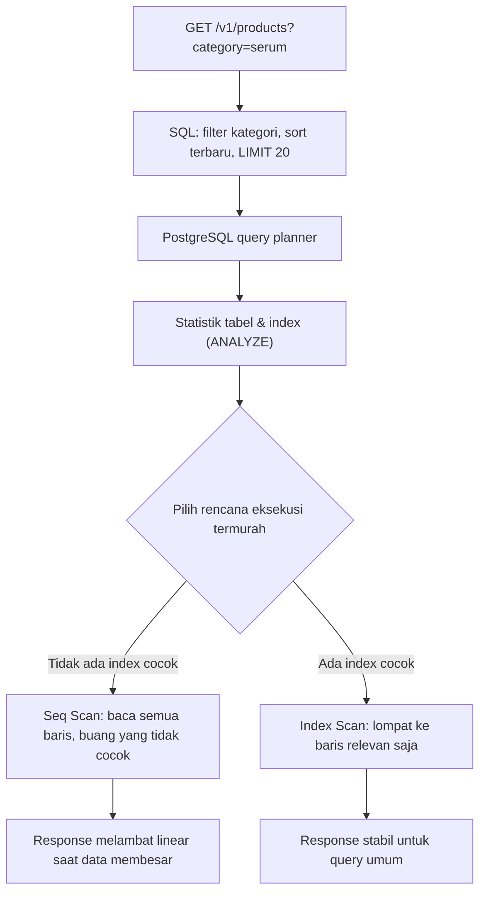
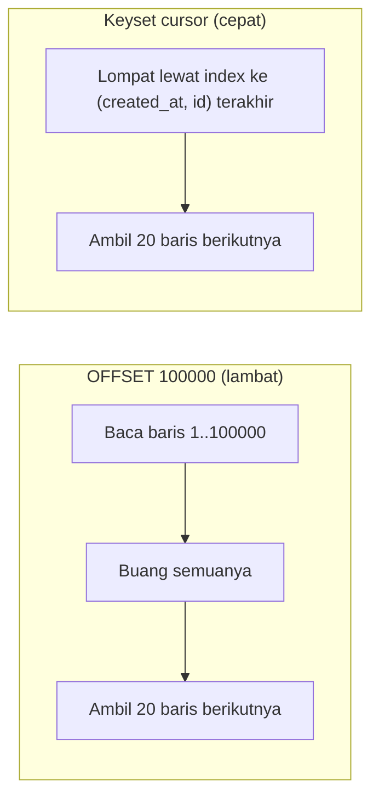

import { Section, Box, Steps, Step, Recap, CardGrid, Card, Chip, Hero, Compare, FileTree, Def } from "@components";

<Hero eyebrow="Roadmap 3 &middot; PostgreSQL dan pgx" title="Indexing dan <em>Performa Query</em><br />untuk API yang Tetap Cepat">
  <p>Index yang tepat membuat endpoint katalog, cart, dan order history tetap responsif saat data tumbuh dari ratusan baris menjadi jutaan baris.</p>
  <Fragment slot="meta">
    <Chip icon="database">Bahasa: <b>Go 1.26</b></Chip>
    <Chip icon="bolt">PostgreSQL <b>18</b></Chip>
    <Chip icon="clock">~80 menit baca</Chip>
  </Fragment>
</Hero>

<Section num="01" id="intro" title="Kenapa Indexing Penting?" sub="Query cepat di laptop bisa lambat di produksi">

<p class="lead">Query yang terasa instan di laptop dengan 100 baris bisa berubah lambat saat tabel `products`, `orders`, dan `payments` berisi jutaan baris. Index adalah cara kita menjaga waktu respons tetap stabil saat data tumbuh.</p>

Di Laravel kamu mungkin pernah menambah index lewat migration setelah halaman admin tiba-tiba melambat. Di Go masalahnya identik, hanya saja lebih terlihat: `pgx` tidak menyembunyikan query di balik ORM, ia hanya mengirim SQL apa adanya ke PostgreSQL. Yang menentukan apakah sebuah query cepat bukan `pgx`, melainkan struktur tabel, statistik, index, dan bentuk query itu sendiri.

<Def term="index"><p>Struktur data tambahan di samping tabel yang membantu PostgreSQL menemukan baris yang dicari tanpa harus membaca seluruh isi tabel. Analoginya seperti indeks di belakang buku: kamu lompat langsung ke halaman, bukan membaca setiap halaman dari depan.</p></Def>

Index mempercepat pencarian, tetapi ia bukan gratis. Setiap index menambah biaya tulis (`INSERT`, `UPDATE`, `DELETE` harus memperbarui index juga) dan memakan ruang disk. Jadi target kita bukan membuat index sebanyak mungkin, melainkan membuat index yang cocok dengan query paling sering dan paling mahal. Indexing yang baik selalu lahir dari daftar endpoint, bukan dari daftar kolom.

<Box variant="analogy" icon="📖" label="Analogi: indeks buku vs membalik tiap halaman"><p>Tanpa index, mencari "produk kategori serum" sama dengan membuka buku 200.000 halaman dan membaca semuanya untuk menemukan yang relevan. Dengan index di `brand_id` atau lewat join kategori, PostgreSQL membuka "indeks belakang buku", melihat daftar baris yang cocok, lalu lompat langsung ke sana.</p></Box>

<Box variant="bridge" icon="🌉" label="Jembatan: dari Map JavaScript ke B-tree index"><p>Di JS, kamu sering mengganti `array.find(u => u.email === x)` (O(n), scan seluruh array) dengan `Map` yang memberi lookup O(1). Index PostgreSQL adalah ide yang sama di sisi database: ubah "scan semua baris" menjadi "lompat langsung". Bedanya, `Map` mencari kunci persis, sedangkan B-tree juga unggul untuk range (`harga antara A dan B`) dan urutan (`ORDER BY`), bukan cuma equality.</p></Box>



<p class="fig-cap"><b>Gambar 1.</b> Index membantu query planner memilih jalur baca yang lebih murah. Tanpa index cocok, planner terpaksa membaca seluruh tabel (Seq Scan).</p>

<Def term="query planner"><p>Otak PostgreSQL yang, untuk setiap query, memperkirakan beberapa cara menjalankannya lalu memilih yang biayanya paling murah. Ia mengandalkan statistik tabel (jumlah baris, sebaran nilai) yang diperbarui oleh `ANALYZE` dan autovacuum. Index yang kamu buat menambah opsi rencana, tetapi planner yang memutuskan memakainya atau tidak.</p></Def>

Yang membuat ini relevan untuk kita: di proyek skincare, beberapa query dipanggil ribuan kali per menit (listing produk, detail produk by slug, riwayat order), sementara tabelnya yang paling cepat tumbuh (`orders`, `order_items`, `payments`). Di sinilah index memberi imbal hasil terbesar.

</Section>

<Section num="02" id="btree-index" title="B-tree: Index Default PostgreSQL" sub="Tipe index yang menutup 90% kebutuhan sehari-hari">

<p class="lead">Saat kamu menulis `CREATE INDEX` tanpa menyebut tipe, PostgreSQL membuat B-tree. Ini tipe paling serbaguna dan paling sering kamu pakai untuk equality, range, dan sorting.</p>

<Def term="B-tree"><p>Struktur pohon seimbang (balanced tree) yang menyimpan nilai kolom dalam keadaan terurut. Karena terurut, ia cepat untuk pencarian persis (`= $1`), rentang (`>`, `<`, `BETWEEN`), dan bisa menyediakan urutan siap pakai untuk `ORDER BY` tanpa langkah sort tambahan.</p></Def>

Di skema skincare kanonik, harga produk ada di tabel `product_variants` (kolom `price_rupiah`), karena varian (SKU) adalah unit yang dijual, bukan `products`. Listing katalog biasanya menyaring produk per brand lalu mengurutkan dari yang terbaru. Mulai dari index satu kolom yang paling jelas dipakai filter.

```sql title="migrations/000009_product_indexes.up.sql"
-- Foreign key lookup: brand -> produk
CREATE INDEX products_brand_id_idx ON products (brand_id);
```

Query listing berikut bisa memanfaatkan index di `brand_id`, terutama ketika satu brand hanya berisi sebagian kecil dari seluruh katalog (selektivitas tinggi).

```sql title="product_listing.sql"
SELECT id, slug, name, status, created_at
FROM products
WHERE brand_id = $1
  AND status = 'active'
  AND deleted_at IS NULL
ORDER BY created_at DESC
LIMIT 20;
```

<h3>Kapan B-tree cocok</h3>

<CardGrid cols={2}>
  <Card><h4>Filter equality</h4><p>`WHERE brand_id = $1`, `WHERE user_id = $1`, `WHERE status = $1`. Ini kasus paling umum dan paling diuntungkan B-tree.</p></Card>
  <Card><h4>Filter range</h4><p>`WHERE created_at >= $1`, `WHERE price_rupiah BETWEEN $1 AND $2`. B-tree terurut, jadi rentang murah dilacak.</p></Card>
  <Card><h4>Sorting</h4><p>`ORDER BY created_at DESC` bisa dilayani langsung dari index jika urutan kolom dan arahnya cocok, menghilangkan node `Sort`.</p></Card>
  <Card><h4>Foreign key lookup</h4><p>Kolom seperti `orders.user_id`, `order_items.order_id`, `product_variants.product_id` sering dipakai join dan WHERE, hampir selalu pantas di-index.</p></Card>
</CardGrid>

<Box variant="warn" icon="⚠️" label="Foreign key TIDAK otomatis ter-index"><p>Salah kaprah yang sering: orang mengira `REFERENCES` membuat index otomatis. PostgreSQL hanya membuat index otomatis untuk PRIMARY KEY dan UNIQUE, BUKAN untuk kolom foreign key. Kolom seperti `order_items.order_id` harus kamu index sendiri, kalau tidak setiap join dan setiap `ON DELETE CASCADE` jadi Seq Scan.</p></Box>

<h3>Down migration: index harus bisa dibatalkan</h3>

Setiap perubahan skema, termasuk index, butuh pasangan `down` agar rollback di staging aman. `IF EXISTS` membuat `down` idempotent (aman dijalankan walau index sudah tidak ada).

```sql title="migrations/000009_product_indexes.down.sql"
DROP INDEX IF EXISTS products_brand_id_idx;
```

<Box variant="note" icon="📝" label="Index bukan tombol turbo universal"><p>Index membantu ketika query memilih SEBAGIAN baris. Jika query mengambil hampir seluruh tabel (selektivitas rendah, misalnya `WHERE status != 'archived'` saat 95% produk aktif), planner bisa tetap memilih Seq Scan karena membaca berurutan dari disk justru lebih murah daripada lompat-lompat lewat index.</p></Box>

</Section>

<Section num="03" id="explain-analyze" title="Membaca EXPLAIN ANALYZE" sub="Berhenti menebak, mulai mengukur">

<p class="lead">Jangan menilai performa query dari perasaan atau dari stopwatch di sisi Go. Pakai `EXPLAIN ANALYZE` untuk melihat rencana sebenarnya yang dipilih planner dan waktu eksekusi aktual di dalam database.</p>

`EXPLAIN` menampilkan query plan yang DIPERKIRAKAN planner, tanpa menjalankan query. `EXPLAIN ANALYZE` benar-benar menjalankan query lalu menambahkan waktu aktual dan jumlah baris aktual. Tambahan `BUFFERS` memperlihatkan berapa banyak blok data yang dibaca, sinyal nyata seberapa berat I/O query itu.

```sql title="explain_product_listing.sql"
EXPLAIN (ANALYZE, BUFFERS)
SELECT id, slug, name, status, created_at
FROM products
WHERE brand_id = 12
  AND deleted_at IS NULL
ORDER BY created_at DESC
LIMIT 20;
```

<Box variant="bridge" icon="🌉" label="Jembatan: dari console.time ke EXPLAIN ANALYZE"><p>Di Node kamu mungkin membungkus query dengan `console.time()`. Itu mengukur total bolak-balik termasuk jaringan dan serialisasi, jadi sulit tahu apakah yang lambat database atau bukan. `EXPLAIN ANALYZE` mengukur DI DALAM PostgreSQL, persis di tempat keputusan baca terjadi, sehingga jauh lebih akurat untuk menyalahkan bagian yang benar.</p></Box>

<h3>Sebelum: tanpa index yang cocok</h3>

Output dibaca dari dalam ke luar (node paling menjorok dijalankan duluan). Perhatikan `Seq Scan`, `Rows Removed by Filter`, dan `Execution Time`.

```text title="EXPLAIN ANALYZE (sebelum index)"
Limit  (cost=4820.11..4820.16 rows=20 width=64) (actual time=48.210..48.216 rows=20 loops=1)
  Buffers: shared hit=120 read=2330
  ->  Sort  (cost=4820.11..4854.80 rows=13875 width=64) (actual time=48.208..48.211 rows=20 loops=1)
        Sort Key: created_at DESC
        Sort Method: top-N heapsort  Memory: 31kB
        ->  Seq Scan on products  (cost=0.00..4450.80 rows=13875 width=64) (actual time=0.041..43.920 rows=14220 loops=1)
              Filter: ((deleted_at IS NULL) AND (brand_id = 12))
              Rows Removed by Filter: 185780
Planning Time: 0.210 ms
Execution Time: 48.250 ms
```

<h3>Tambahkan index yang mengikuti filter dan sort</h3>

Kita gabungkan kolom filter (`brand_id`) dan kolom sort (`created_at DESC`) dalam satu composite index. Section 05 membahas kenapa urutan kolom ini penting.

```sql title="migrations/000010_product_listing_index.up.sql"
CREATE INDEX products_brand_id_created_at_idx
ON products (brand_id, created_at DESC);
```

<h3>Sesudah: Index Scan, tanpa Sort</h3>

```text title="EXPLAIN ANALYZE (sesudah index)"
Limit  (cost=0.42..18.85 rows=20 width=64) (actual time=0.085..0.190 rows=20 loops=1)
  Buffers: shared hit=23
  ->  Index Scan using products_brand_id_created_at_idx on products  (cost=0.42..12780.90 rows=13875 width=64) (actual time=0.083..0.184 rows=20 loops=1)
        Index Cond: (brand_id = 12)
        Filter: (deleted_at IS NULL)
Planning Time: 0.330 ms
Execution Time: 0.224 ms
```

Dari 48 ms menjadi 0,2 ms, sekitar 200x lebih cepat, untuk query yang persis sama. Yang berubah hanya satu index. Perhatikan tiga hal: node `Sort` hilang (index sudah menyediakan urutan), `Seq Scan` menjadi `Index Scan`, dan `Buffers` turun dari ribuan blok menjadi 23 blok.

<h3>Cara baca cepat tiap angka</h3>

<Steps>
  <Step><b>Lihat node terbawah (paling menjorok)</b><p>`Seq Scan`, `Index Scan`, `Bitmap Heap Scan`. Itu titik awal investigasi: dari mana baris diambil dan dengan cara apa.</p></Step>
  <Step><b>Bandingkan estimasi vs aktual</b><p>`rows=13875` (estimasi) vs `actual rows=14220`. Kalau melenceng jauh (misalnya estimasi 10, aktual 100.000), statistik usang, jalankan `ANALYZE products`.</p></Step>
  <Step><b>Cari Rows Removed by Filter</b><p>`Rows Removed by Filter: 185780` berarti database membaca 185.780 baris hanya untuk membuangnya. Ini bendera merah kuat bahwa sebuah index hilang.</p></Step>
  <Step><b>Baca Buffers</b><p>`shared hit` = blok ditemukan di cache memori (murah), `read` = blok dibaca dari disk (mahal). Angka `read` besar menandai query yang berat I/O.</p></Step>
  <Step><b>Execution Time, bukan cost</b><p>`cost` adalah satuan estimasi internal planner yang tak punya satuan waktu. `Execution Time` adalah milidetik nyata, jauh lebih dekat ke pengalaman user.</p></Step>
</Steps>

<Box variant="tip" icon="💡" label="Pakai EXPLAIN (FORMAT JSON) di tooling"><p>Untuk dashboard atau script analisis, `EXPLAIN (ANALYZE, FORMAT JSON)` mengeluarkan plan terstruktur yang mudah diurai. Untuk membaca manual sehari-hari, format teks default lebih nyaman. Situs seperti explain.dave.cm atau explain.depesz.com bisa memvisualkan plan teks ini.</p></Box>

<Box variant="warn" icon="⚠️" label="EXPLAIN ANALYZE benar-benar menjalankan query"><p>Untuk `SELECT` ini aman. Tetapi `EXPLAIN ANALYZE` pada `INSERT`, `UPDATE`, atau `DELETE` AKAN mengubah data sungguhan. Bungkus dalam transaksi lalu rollback: `BEGIN; EXPLAIN ANALYZE UPDATE ...; ROLLBACK;`. Atau uji di staging dengan data representatif, bukan di production.</p></Box>

</Section>

<Section num="04" id="unique-index" title="Unique Index sebagai Penjaga Aturan" sub="Index bukan cuma untuk cepat, tapi juga untuk benar">

<p class="lead">Unique index punya peran ganda: ia mempercepat lookup (sama seperti B-tree biasa) sekaligus memaksa aturan bisnis di level database. Tidak boleh ada dua user dengan email sama, tidak boleh ada dua produk dengan slug sama.</p>

Validasi di handler Go tetap penting untuk pesan error yang ramah. Tetapi database adalah penjaga terakhir yang tidak bisa ditembus, bahkan oleh dua request paralel yang lolos validasi aplikasi pada milidetik yang sama.

```sql title="migrations/000001_create_users.up.sql (cuplikan)"
-- email user wajib unik untuk login
CREATE UNIQUE INDEX users_email_key ON users (email);
```

Di skema kanonik, `users.email` dan `products.slug` keduanya `UNIQUE`, dan `orders.idempotency_key` juga `UNIQUE`. Yang terakhir ini bukan sekadar dedup data, melainkan mesin idempotensi checkout yang kita rancang di Roadmap 2.

```sql title="migrations/000005_create_orders.up.sql (cuplikan)"
CREATE UNIQUE INDEX orders_order_number_key ON orders (order_number);
CREATE UNIQUE INDEX orders_idempotency_key_key ON orders (idempotency_key);
```

<Box variant="bridge" icon="🌉" label="Jembatan: validasi unique di Laravel vs constraint database"><p>Di Laravel kamu menulis `'email' => 'unique:users'`. Aturan itu menjalankan `SELECT` lebih dulu, lalu memutuskan. Di antara `SELECT` dan `INSERT` ada celah waktu (race condition): dua request bisa sama-sama lolos `SELECT`, lalu sama-sama `INSERT`. Unique index menutup celah itu di level database, jadi satu pasti gagal dengan kode error `23505`.</p></Box>

<h3>Menangani pelanggaran unique di Go dengan pgx</h3>

Saat `INSERT` melanggar unique index, PostgreSQL mengembalikan error dengan SQLSTATE `23505` (`unique_violation`). Di Go idiomatik, kamu deteksi lewat `errors.As` ke `*pgconn.PgError`, lalu ubah menjadi error domain yang bersih untuk handler.

```go title="internal/user/repository.go"
package user

import (
	"context"
	"errors"

	"github.com/jackc/pgx/v5/pgconn"
	"github.com/jackc/pgx/v5/pgxpool"
)

var ErrEmailTaken = errors.New("email sudah terdaftar")

type Repository struct {
	pool *pgxpool.Pool
}

func (r *Repository) Create(ctx context.Context, name, email, passwordHash string) (int64, error) {
	var id int64
	err := r.pool.QueryRow(ctx, `
		INSERT INTO users (name, email, password_hash)
		VALUES ($1, $2, $3)
		RETURNING id
	`, name, email, passwordHash).Scan(&id)
	if err != nil {
		var pgErr *pgconn.PgError
		if errors.As(err, &pgErr) && pgErr.Code == "23505" {
			return 0, ErrEmailTaken
		}
		return 0, err
	}
	return id, nil
}
```

<Box variant="tip" icon="💡" label="Validasi di aplikasi, paksa di database"><p>Pola yang sehat: handler menolak email kosong atau format buruk lebih dulu (pesan ramah, cepat, tanpa menyentuh DB), tetapi unique index tetap wajib ada sebagai jaring pengaman. Jangan pernah mengandalkan validasi aplikasi saja untuk aturan keunikan di sistem yang menerima request paralel.</p></Box>

<Box variant="note" icon="📝" label="Unique partial untuk aturan bersyarat"><p>Skema kita punya aturan "satu cart aktif per user". Itu bukan unique penuh di `user_id` (user boleh punya banyak cart lama yang sudah converted), melainkan unique BERSYARAT: `CREATE UNIQUE INDEX ON carts (user_id) WHERE status = 'active' AND user_id IS NOT NULL`. Partial unique index inilah cara mengekspresikan aturan seperti itu. Kita bahas partial index di Section 06.</p></Box>

</Section>

<Section num="05" id="composite-index" title="Composite Index dan Urutan Kolom" sub="Satu index banyak kolom, dan kenapa urutannya menentukan">

<p class="lead">Composite index menggabungkan beberapa kolom dalam satu struktur terurut. Ia bukan sekadar gabungan dua index terpisah, dan urutan kolomnya menentukan query mana yang terbantu.</p>

Order history adalah contoh sempurna. Query-nya selalu menyaring per user, lalu mengurutkan dari yang terbaru, lalu mengambil sedikit baris.

```sql title="order_history.sql"
SELECT id, order_number, status, total_rupiah, created_at
FROM orders
WHERE user_id = $1
ORDER BY created_at DESC
LIMIT 20;
```

Index yang ideal untuk pola ini menyimpan `user_id` lebih dulu (untuk filter equality), lalu `created_at DESC` (untuk urutan). Inilah index kanonik `orders_user_id_created_at_idx` di skema kita.

```sql title="migrations/000005_create_orders.up.sql (cuplikan)"
CREATE INDEX orders_user_id_created_at_idx
ON orders (user_id, created_at DESC);
```

<Def term="leftmost-prefix rule"><p>Aturan inti composite index: index `(a, b, c)` bisa dipakai untuk query yang menyaring dari kolom paling kiri ke kanan secara berurutan: `WHERE a`, `WHERE a AND b`, `WHERE a AND b AND c`. Ia TIDAK efisien untuk `WHERE b` saja atau `WHERE c` saja, karena nilai-nilai itu tersebar di seluruh index tanpa prefix `a` yang mengelompokkannya.</p></Def>

<Compare aLabel="JS / Laravel: urutan method terasa bebas" bLabel="PostgreSQL: urutan kolom index menentukan" aTone="muted" bTone="violet">
  <Fragment slot="a"><ul><li>`where('user_id', $id)->orderBy('created_at', 'desc')` dibaca seperti dua langkah independen.</li><li>Membalik urutan method tidak mengubah hasil, jadi terasa tidak penting.</li><li>Optimasi index sering "terlupa" karena ORM menyembunyikannya.</li></ul></Fragment>
  <Fragment slot="b"><ul><li>Composite `(user_id, created_at DESC)` paling efektif saat query memakai kolom kiri lebih dulu.</li><li>`(created_at, user_id)` BERBEDA total: tidak membantu filter `user_id`.</li><li>Urutan kolom adalah keputusan desain yang harus mengikuti pola query nyata.</li></ul></Fragment>
</Compare>

<h3>Query mana yang terbantu, mana yang tidak</h3>

```sql title="composite_index_examples.sql"
-- COCOK: pakai prefix kiri (user_id) lalu urut created_at
SELECT id, status, created_at
FROM orders
WHERE user_id = $1
ORDER BY created_at DESC
LIMIT 20;

-- MASIH TERBANTU: filter user_id saja juga pakai prefix kiri
SELECT id, status
FROM orders
WHERE user_id = $1;

-- TIDAK COCOK untuk index ini: filter created_at tanpa user_id
-- (created_at ada di posisi kanan, tidak punya prefix user_id)
SELECT id, status
FROM orders
WHERE created_at >= $1;
```

<Box variant="warn" icon="⚠️" label="Arah ASC/DESC harus cocok dengan ORDER BY"><p>Index `(user_id, created_at DESC)` melayani `ORDER BY created_at DESC` tanpa Sort. Tetapi untuk `ORDER BY created_at ASC` PostgreSQL bisa membacanya mundur (masih oke). Yang benar-benar gagal adalah `ORDER BY user_id DESC, created_at ASC`: arah campur yang tidak match akan memaksa langkah Sort terpisah. Kalau butuh kedua arah, definisikan index sesuai arah yang paling sering dipakai.</p></Box>

<Box variant="tip" icon="💡" label="Aturan praktis urutan kolom"><p>Letakkan kolom yang dipakai dengan equality (`=`) lebih dulu, baru kolom range atau sort. `(user_id = $1, created_at DESC)` benar karena `user_id` equality, `created_at` sort. Composite yang menaruh kolom range di depan kolom equality sering memberi hasil lebih buruk.</p></Box>

</Section>

<Section num="06" id="partial-covering" title="Partial Index dan Covering Index" sub="Index lebih kecil, dan index yang menjawab query tanpa menyentuh tabel">

<p class="lead">Dua teknik lanjutan yang sering dilupakan, tetapi sangat cocok untuk pola e-commerce: partial index (index hanya untuk sebagian baris) dan covering index (index yang membawa kolom hasil sekalian).</p>

<h3>Partial index: index sebagian baris</h3>

<Def term="partial index"><p>Index yang hanya mencakup baris yang memenuhi sebuah `WHERE` saat dibuat. Hasilnya index lebih kecil, lebih cepat di-scan, dan lebih murah diperbarui, karena baris yang tidak relevan tidak pernah masuk index.</p></Def>

Di skincare, hampir semua query katalog publik hanya membaca produk aktif yang belum dihapus (`deleted_at IS NULL` dan `status = 'active'`). Membuat index untuk seluruh produk termasuk yang archived itu mubazir. Partial index memotong yang tidak perlu.

```sql title="migrations/000010_product_listing_index.up.sql (revisi partial)"
-- Hanya index produk aktif yang belum dihapus
CREATE INDEX products_active_brand_created_idx
ON products (brand_id, created_at DESC)
WHERE deleted_at IS NULL AND status = 'active';
```

<Box variant="warn" icon="⚠️" label="Query harus cocok dengan predikat partial"><p>Partial index hanya dipakai jika query memuat predikat yang sama atau lebih ketat. Index dengan `WHERE deleted_at IS NULL` TIDAK dipakai oleh query yang tidak menulis `deleted_at IS NULL` di klausa `WHERE`-nya, meskipun secara logika hasilnya sama. Pastikan repository Go selalu menyertakan predikat yang sama persis.</p></Box>

Contoh nyata dari skema kanonik: aturan "satu cart aktif per user" diekspresikan dengan partial unique index, sesuatu yang tidak bisa ditulis dengan unique biasa.

```sql title="migrations/000004_create_cart.up.sql (cuplikan)"
CREATE UNIQUE INDEX carts_one_active_per_user_idx
ON carts (user_id)
WHERE status = 'active' AND user_id IS NOT NULL;
```

<h3>Covering index: jawab query tanpa membuka tabel</h3>

<Def term="covering index / INCLUDE"><p>Index yang memuat semua kolom yang dibutuhkan query (kolom filter di key, kolom hasil di klausa `INCLUDE`), sehingga PostgreSQL bisa menjawab dari index saja tanpa membuka baris di tabel (heap). Plannya muncul sebagai `Index Only Scan`.</p></Def>

Bayangkan endpoint yang sering menjumlahkan total order per user, atau cuma butuh `total_rupiah` saat melisting riwayat. Dengan `INCLUDE`, kolom `total_rupiah` ikut tersimpan di index, jadi tidak perlu fetch ke tabel.

```sql title="migrations/000011_orders_covering_index.up.sql"
CREATE INDEX orders_user_id_covering_idx
ON orders (user_id, created_at DESC)
INCLUDE (total_rupiah, status);
```

```text title="EXPLAIN ANALYZE: Index Only Scan"
Limit  (cost=0.42..2.14 rows=20 width=24) (actual time=0.030..0.061 rows=20 loops=1)
  Buffers: shared hit=4
  ->  Index Only Scan using orders_user_id_covering_idx on orders  (actual time=0.028..0.055 rows=20 loops=1)
        Index Cond: (user_id = 8801)
        Heap Fetches: 0
Planning Time: 0.140 ms
Execution Time: 0.082 ms
```

`Heap Fetches: 0` adalah tanda emasnya: query dijawab sepenuhnya dari index, tabel tidak dibuka sama sekali. `Buffers: shared hit=4` jauh lebih kecil daripada Index Scan biasa yang masih harus mengambil baris dari heap.

<Box variant="bridge" icon="🌉" label="Jembatan: covering index seperti memilih kolom di Map"><p>Di JS, kalau kamu butuh hanya `total` dari tiap order, kamu bisa menyimpan `Map<userId, total[]>` agar tidak perlu membuka objek order penuh. Covering index melakukan hal yang sama di database: simpan kolom yang sering dibaca di dalam struktur lookup, supaya tidak perlu "membuka objek" (baris heap) untuk mengambilnya.</p></Box>

<Box variant="note" icon="📝" label="INCLUDE bukan untuk semua kolom"><p>Godaan menaruh banyak kolom di `INCLUDE` itu nyata, tapi tiap kolom tambahan membesarkan index dan memperlambat tulis. Pakai `INCLUDE` hanya untuk satu atau dua kolom kecil yang benar-benar sering dibaca bersama filter. Untuk listing yang mengembalikan banyak kolom, Index Scan biasa sudah cukup baik.</p></Box>

</Section>

<Section num="07" id="search-index" title="Index untuk Search dan Filter (GIN + pg_trgm)" sub="Kenapa B-tree menyerah pada ILIKE '%serum%'">

<p class="lead">Search bar produk adalah fitur wajib di online shop. Tapi B-tree tidak bisa mempercepat `ILIKE '%term%'`, karena wildcard di depan menghancurkan keunggulan urutan B-tree. Di sinilah GIN dan ekstensi `pg_trgm` masuk.</p>

Query pencarian nama produk umumnya seperti ini, dan tanpa index khusus ia selalu Seq Scan.

```sql title="product_search.sql"
SELECT id, slug, name
FROM products
WHERE name ILIKE '%niacinamide%'
  AND deleted_at IS NULL
ORDER BY name
LIMIT 20;
```

<Box variant="warn" icon="⚠️" label="B-tree mati di wildcard depan"><p>`name LIKE 'niac%'` (wildcard di belakang) masih bisa pakai B-tree, karena prefix-nya tetap. Tetapi `name ILIKE '%niac%'` (wildcard di depan) tidak punya prefix tetap, jadi B-tree tak berguna dan PostgreSQL terpaksa membaca seluruh tabel. Inilah penyebab klasik search bar yang melambat saat katalog membesar.</p></Box>

<Def term="pg_trgm + GIN"><p>`pg_trgm` adalah ekstensi yang memecah teks menjadi trigram (potongan tiga huruf), misalnya "serum" menjadi "ser", "eru", "rum". GIN (Generalized Inverted Index) memetakan tiap trigram ke daftar baris yang memuatnya, mirip indeks kata pada mesin pencari. Gabungan keduanya membuat `ILIKE '%...%'` dan pencarian kemiripan menjadi cepat.</p></Def>

```sql title="migrations/000012_product_search_index.up.sql"
-- Aktifkan ekstensi sekali per database
CREATE EXTENSION IF NOT EXISTS pg_trgm;

-- GIN trigram index untuk pencarian nama produk
CREATE INDEX products_name_trgm_idx
ON products USING gin (name gin_trgm_ops);
```

Setelah index ini ada, query `ILIKE '%niacinamide%'` yang tadinya Seq Scan berubah menjadi `Bitmap Index Scan` di atas GIN, jauh lebih cepat pada katalog besar.

```text title="EXPLAIN ANALYZE: Bitmap Index Scan via GIN"
Limit  (cost=92.18..96.20 rows=20 width=48) (actual time=1.402..1.520 rows=20 loops=1)
  ->  Bitmap Heap Scan on products  (actual time=1.380..1.470 rows=37 loops=1)
        Recheck Cond: (name ~~* '%niacinamide%')
        ->  Bitmap Index Scan on products_name_trgm_idx  (actual time=1.190..1.190 rows=37 loops=1)
              Index Cond: (name ~~* '%niacinamide%')
Planning Time: 0.260 ms
Execution Time: 1.580 ms
```

<Box variant="bridge" icon="🌉" label="Jembatan: dari fuse.js ke index sisi server"><p>Di React kamu mungkin pakai library fuzzy search seperti fuse.js di sisi klien, yang hanya bekerja kalau seluruh data sudah ada di browser. Untuk katalog jutaan produk itu mustahil. GIN + `pg_trgm` memberi pencarian substring dan kemiripan langsung di database, tanpa menarik semua data ke klien. Untuk full-text yang lebih kaya (peringkat relevansi, stemming), PostgreSQL juga punya `tsvector` + GIN, tetapi `pg_trgm` sudah cukup untuk pencarian nama produk.</p></Box>

<Box variant="note" icon="📝" label="GIN juga mengindeks array dan jsonb"><p>Skema kita punya `products.skin_types text[]`, `products.concerns text[]`, dan `products.ingredients jsonb`. GIN adalah tipe index yang tepat untuk mempercepat query seperti `WHERE skin_types @> ARRAY['oily']` atau pencarian di dalam `jsonb`. Satu mekanisme index (GIN) menutup search teks, array, dan jsonb sekaligus.</p></Box>

</Section>

<Section num="08" id="pagination" title="Pagination Cepat: Keyset vs OFFSET" sub="Kenapa LIMIT 20 OFFSET 100000 makin lambat di halaman dalam">

<p class="lead">`LIMIT 20 OFFSET 100000` tampak sederhana, tetapi PostgreSQL tetap harus membaca lalu membuang 100.000 baris sebelum mengembalikan 20 baris yang kamu mau. Makin dalam halamannya, makin lambat. Inilah penyakit OFFSET.</p>

Baris yang dilewati `OFFSET` tetap dihitung di server, tidak di-skip secara ajaib. Untuk halaman awal katalog, `LIMIT/OFFSET` masih bisa diterima. Tetapi untuk infinite scroll, export data, atau order history yang bisa sangat panjang, gunakan keyset pagination.

<Compare aLabel="OFFSET: page number klasik" bLabel="Keyset: cursor posisi terakhir" aTone="red" bTone="teal">
  <Fragment slot="a"><ul><li>`LIMIT 20 OFFSET (page-1)*20`.</li><li>Mudah lompat ke halaman acak (page 5, page 99).</li><li>Makin dalam makin lambat: OFFSET 100000 membaca 100020 baris.</li><li>Rawan duplikat/skip kalau data berubah saat user paging.</li></ul></Fragment>
  <Fragment slot="b"><ul><li>`WHERE (created_at, id) < ($1, $2) LIMIT 20`.</li><li>Selalu cepat, berapa pun dalamnya halaman.</li><li>Tidak bisa lompat ke halaman acak, hanya "berikutnya".</li><li>Stabil saat data baru masuk, karena menunjuk posisi, bukan offset.</li></ul></Fragment>
</Compare>

<Box variant="bridge" icon="🌉" label="Jembatan: dari ?page=5 ke cursor"><p>Frontend React sering meminta `?page=5`. Untuk feed dan order history yang panjang, API memberi cursor: `?after_created_at=...&after_id=...`. Ini persis pola cursor di GraphQL Relay atau di API GitHub (`?after=cursor`). Frontend menyimpan cursor halaman terakhir, lalu mengirimnya untuk meminta halaman berikutnya.</p></Box>



<p class="fig-cap"><b>Gambar 2.</b> OFFSET membaca lalu membuang baris yang dilewati, sementara keyset memakai index untuk lompat langsung ke posisi cursor dan hanya membaca 20 baris yang dibutuhkan.</p>

<h3>OFFSET pagination</h3>

```sql title="offset_pagination.sql"
SELECT id, slug, name, status, created_at
FROM products
WHERE brand_id = $1
  AND deleted_at IS NULL
ORDER BY created_at DESC, id DESC
LIMIT 20 OFFSET 100000;
```

<h3>Keyset pagination berbasis (created_at, id)</h3>

Keyset memakai nilai terakhir dari halaman sebelumnya sebagai titik mulai. Kita pakai pasangan `(created_at, id)` agar urutan tetap unik dan stabil meski beberapa baris punya `created_at` sama persis.

```sql title="keyset_pagination.sql"
SELECT id, slug, name, status, created_at
FROM products
WHERE brand_id = $1
  AND deleted_at IS NULL
  AND (created_at, id) < ($2, $3)
ORDER BY created_at DESC, id DESC
LIMIT 20;
```

Perbandingan tuple `(created_at, id) < ($2, $3)` adalah cara ringkas PostgreSQL membandingkan dua kolom sekaligus secara leksikografis. Ia cocok sempurna dengan index `(brand_id, created_at DESC, id DESC)`.

```sql title="migrations/000013_keyset_index.up.sql"
CREATE INDEX products_brand_created_id_idx
ON products (brand_id, created_at DESC, id DESC)
WHERE deleted_at IS NULL;
```

<h3>Repository Go dengan cursor</h3>

Repository menerima `after *Cursor` opsional. Kalau `nil`, ini halaman pertama. Kalau ada, ia menjadi titik mulai halaman berikutnya. Perhatikan `ctx` sebagai parameter pertama dan pemeriksaan `rows.Err()` setelah loop, idiom pgx v5.

```go title="internal/product/repository.go"
package product

import (
	"context"
	"time"

	"github.com/jackc/pgx/v5/pgxpool"
)

type Repository struct {
	pool *pgxpool.Pool
}

// Cursor menunjuk posisi baris terakhir di halaman sebelumnya.
type Cursor struct {
	CreatedAt time.Time
	ID        int64
}

func (r *Repository) ListByBrand(ctx context.Context, brandID int64, after *Cursor, limit int) ([]Product, error) {
	if limit <= 0 || limit > 100 {
		limit = 20
	}

	query := `
		SELECT id, slug, name, status, created_at
		FROM products
		WHERE brand_id = $1
		  AND deleted_at IS NULL
		ORDER BY created_at DESC, id DESC
		LIMIT $2
	`
	args := []any{brandID, limit}

	if after != nil {
		query = `
			SELECT id, slug, name, status, created_at
			FROM products
			WHERE brand_id = $1
			  AND deleted_at IS NULL
			  AND (created_at, id) < ($2, $3)
			ORDER BY created_at DESC, id DESC
			LIMIT $4
		`
		args = []any{brandID, after.CreatedAt, after.ID, limit}
	}

	rows, err := r.pool.Query(ctx, query, args...)
	if err != nil {
		return nil, err
	}
	defer rows.Close()

	products := make([]Product, 0, limit)
	for rows.Next() {
		var p Product
		if err := rows.Scan(&p.ID, &p.Slug, &p.Name, &p.Status, &p.CreatedAt); err != nil {
			return nil, err
		}
		products = append(products, p)
	}
	if err := rows.Err(); err != nil {
		return nil, err
	}

	return products, nil
}
```

<Box variant="tip" icon="💡" label="Total count itu mahal, jangan otomatis"><p>OFFSET pagination biasanya butuh `COUNT(*)` untuk menggambar total halaman, dan `COUNT(*)` pada tabel besar itu mahal (sering Seq Scan penuh). Keyset tidak butuh total: cukup tahu apakah ada halaman berikutnya (ambil `LIMIT 21`, kalau dapat 21 berarti masih ada lanjutannya). Untuk infinite scroll, ini jauh lebih efisien.</p></Box>

</Section>

<Section num="09" id="pola-skincare" title="Pola Index untuk Online Shop Skincare" sub="Index lahir dari daftar endpoint, bukan daftar kolom">

<p class="lead">Index terbaik datang dari daftar endpoint yang paling sering dipanggil dan paling mahal, bukan dari daftar kolom yang sekilas terlihat penting. Mari petakan endpoint Roadmap 2 ke index yang mendukungnya.</p>

Sebelum membuat index, tanyakan empat hal pada tiap endpoint: kolom apa yang dipakai filter, kolom apa yang dipakai sorting, apakah hasilnya disaring (aktif saja vs semua), dan seberapa selektif filternya.

<CardGrid cols={2}>
  <Card><h4>GET /v1/products</h4><p>Filter `brand_id` + kategori, `status='active'`, `deleted_at IS NULL`, sort `created_at DESC`. Composite partial index.</p></Card>
  <Card><h4>GET /v1/products/&#123;slug&#125;</h4><p>Lookup `slug` harus UNIQUE agar URL produk stabil dan O(log n) cepat.</p></Card>
  <Card><h4>GET /v1/orders</h4><p>Filter `user_id`, sort `created_at DESC`, limit kecil. Composite `(user_id, created_at DESC)`.</p></Card>
  <Card><h4>Search bar</h4><p>`name ILIKE '%term%'`. Butuh GIN + `pg_trgm`, B-tree tidak menolong.</p></Card>
  <Card><h4>Cart aktif</h4><p>Filter `cart_id` di `cart_items`, uniqueness `(cart_id, variant_id)`, dan partial unique cart aktif per user.</p></Card>
  <Card><h4>Payment & shipment</h4><p>Lookup `order_id` (foreign key), plus partial unique `event_id` untuk idempotensi webhook.</p></Card>
</CardGrid>

Berikut migration gabungan yang merangkum index inti Roadmap 3, dengan nama kolom persis dari skema kanonik (`variant_id`, `price_rupiah`, `total_rupiah`, `idempotency_key`).

```sql title="migrations/000014_core_performance_indexes.up.sql"
CREATE EXTENSION IF NOT EXISTS pg_trgm;

-- Login & identitas user
CREATE UNIQUE INDEX users_email_key ON users (email);

-- URL produk (slug unik) & listing katalog aktif
CREATE UNIQUE INDEX products_slug_key ON products (slug);

CREATE INDEX products_active_brand_created_idx
ON products (brand_id, created_at DESC, id DESC)
WHERE deleted_at IS NULL AND status = 'active';

-- Search nama produk
CREATE INDEX products_name_trgm_idx
ON products USING gin (name gin_trgm_ops);

-- Varian & stok (foreign key lookup untuk PDP dan checkout)
CREATE INDEX product_variants_product_id_idx ON product_variants (product_id);
CREATE UNIQUE INDEX product_variants_sku_key ON product_variants (sku);
CREATE UNIQUE INDEX inventories_variant_id_key ON inventories (variant_id);

-- Cart aktif & keunikan item dalam cart
CREATE UNIQUE INDEX carts_one_active_per_user_idx
ON carts (user_id)
WHERE status = 'active' AND user_id IS NOT NULL;

CREATE UNIQUE INDEX cart_items_cart_variant_key
ON cart_items (cart_id, variant_id);

-- Order history & detail order
CREATE INDEX orders_user_id_created_at_idx
ON orders (user_id, created_at DESC);

CREATE UNIQUE INDEX orders_idempotency_key_key ON orders (idempotency_key);
CREATE INDEX order_items_order_id_idx ON order_items (order_id);

-- Payment & shipment tracking
CREATE INDEX payments_order_id_idx ON payments (order_id);
CREATE UNIQUE INDEX payments_event_id_idx
ON payments (event_id)
WHERE event_id IS NOT NULL;

CREATE UNIQUE INDEX shipments_order_id_key ON shipments (order_id);
```

```sql title="migrations/000014_core_performance_indexes.down.sql"
DROP INDEX IF EXISTS shipments_order_id_key;
DROP INDEX IF EXISTS payments_event_id_idx;
DROP INDEX IF EXISTS payments_order_id_idx;
DROP INDEX IF EXISTS order_items_order_id_idx;
DROP INDEX IF EXISTS orders_idempotency_key_key;
DROP INDEX IF EXISTS orders_user_id_created_at_idx;
DROP INDEX IF EXISTS cart_items_cart_variant_key;
DROP INDEX IF EXISTS carts_one_active_per_user_idx;
DROP INDEX IF EXISTS inventories_variant_id_key;
DROP INDEX IF EXISTS product_variants_sku_key;
DROP INDEX IF EXISTS product_variants_product_id_idx;
DROP INDEX IF EXISTS products_name_trgm_idx;
DROP INDEX IF EXISTS products_active_brand_created_idx;
DROP INDEX IF EXISTS products_slug_key;
DROP INDEX IF EXISTS users_email_key;
```

<Box variant="warn" icon="⚠️" label="CREATE INDEX mengunci tulis, pakai CONCURRENTLY di produksi"><p>`CREATE INDEX` biasa mengunci tabel dari operasi tulis (`INSERT`/`UPDATE`/`DELETE`) selama dibangun. Di tabel besar yang hidup ini berarti downtime. Di produksi pakai `CREATE INDEX CONCURRENTLY` yang membangun index tanpa mengunci tulis (lebih lambat tapi tanpa downtime). Catatan: `CONCURRENTLY` tidak boleh berada di dalam blok transaksi, jadi golang-migrate perlu file migration terpisah tanpa transaksi.</p></Box>

<Box variant="tip" icon="💡" label="Petakan struktur folder ke domain"><p>Migration index sebaiknya bertetangga dengan domainnya. Pola `NNNNNN_name.up.sql` / `.down.sql` membuat tiap perubahan punya jejak yang jelas dan bisa di-rollback.</p></Box>

<FileTree title="Index per domain di migrations/" tree={`
migrations/
  000001_create_users.up.sql        # users_email_key (UNIQUE)
  000002_create_catalog.up.sql      # products_slug_key, product_variants_sku_key
  000003_create_inventory.up.sql    # inventories_variant_id_key (1:1)
  000004_create_cart.up.sql         # carts_one_active_per_user_idx (partial unique)
  000005_create_orders.up.sql       # orders_user_id_created_at_idx, idempotency
  000012_product_search_index.up.sql  # GIN pg_trgm untuk search nama
  000014_core_performance_indexes.up.sql  # rangkuman index performa
internal/
  product/
    repository.go                   # query listing & keyset pagination
  order/
    repository.go                   # order history, hindari N+1
`} />

</Section>

<Section num="10" id="hands-on" title="Hands-on: Optimasi Query Listing" sub="Ukur, tambah index, ukur lagi">

<p class="lead">Sekarang kita ambil satu endpoint nyata, ukur dengan `EXPLAIN ANALYZE`, tambahkan index yang mengikuti filter dan sort, lalu ukur lagi. Disiplin ukur-ubah-ukur inilah inti optimasi query.</p>

<Steps>
  <Step><b>Siapkan query awal</b><p>Ambil produk aktif per brand, urut terbaru, limit 20. Pastikan tabel `products` sudah berisi data representatif (puluhan ribu baris), bukan kosong.</p></Step>
  <Step><b>Jalankan EXPLAIN ANALYZE baseline</b><p>Catat apakah muncul `Seq Scan`, `Sort`, berapa `Rows Removed by Filter`, dan `Execution Time`. Ini angka pembanding.</p></Step>
  <Step><b>Buat partial composite index</b><p>Pakai `(brand_id, created_at DESC, id DESC) WHERE deleted_at IS NULL AND status = 'active'` agar cocok filter sekaligus sort.</p></Step>
  <Step><b>Jalankan ANALYZE lalu ukur ulang</b><p>Update statistik dengan `ANALYZE products`, jalankan ulang query yang sama, dan bandingkan plan, jumlah baris dibaca, serta waktu.</p></Step>
</Steps>

```sql title="hands_on_before.sql"
EXPLAIN (ANALYZE, BUFFERS)
SELECT id, slug, name, status, created_at
FROM products
WHERE brand_id = 7
  AND deleted_at IS NULL
  AND status = 'active'
ORDER BY created_at DESC, id DESC
LIMIT 20;
```

```sql title="hands_on_index.sql"
CREATE INDEX products_active_brand_created_id_idx
ON products (brand_id, created_at DESC, id DESC)
WHERE deleted_at IS NULL AND status = 'active';

ANALYZE products;
```

```sql title="hands_on_after.sql"
EXPLAIN (ANALYZE, BUFFERS)
SELECT id, slug, name, status, created_at
FROM products
WHERE brand_id = 7
  AND deleted_at IS NULL
  AND status = 'active'
ORDER BY created_at DESC, id DESC
LIMIT 20;
```

<h3>Checklist membaca hasil</h3>

<ul><li>Apakah plan berubah dari `Seq Scan` menjadi `Index Scan` atau `Bitmap Index Scan`?</li><li>Apakah node `Sort` hilang karena index sudah menyediakan urutan `created_at DESC, id DESC`?</li><li>Apakah `Rows Removed by Filter` turun drastis (idealnya menjadi 0 atau mendekati)?</li><li>Apakah `Buffers: read` dan `Execution Time` turun pada data representatif?</li></ul>

<h3>Mengukur dari sisi Go juga</h3>

Selain `EXPLAIN ANALYZE` di psql, kamu bisa mengukur durasi query dari aplikasi dengan `slog` agar tahu dampak nyata ke endpoint. Ini melengkapi plan database dengan angka end-to-end.

```go title="internal/product/repository.go (instrumentasi ringan)"
func (r *Repository) ListByBrand(ctx context.Context, brandID int64, limit int) ([]Product, error) {
	start := time.Now()
	defer func() {
		slog.Info("product.ListByBrand",
			"brand_id", brandID,
			"limit", limit,
			"duration_ms", time.Since(start).Milliseconds(),
		)
	}()

	// ... query seperti sebelumnya ...
	return nil, nil
}
```

<Box variant="warn" icon="⚠️" label="Jangan benchmark dengan tabel kosong"><p>Index yang tampak "tidak dipakai" pada data kecil belum tentu salah. Planner sengaja memilih Seq Scan saat tabel kecil, karena membaca beberapa halaman secara berurutan memang lebih murah daripada lompat lewat index. Benchmark indexing HARUS pakai data dengan volume mendekati produksi (puluhan ribu sampai jutaan baris), kalau tidak kesimpulannya menyesatkan.</p></Box>

<Box variant="tip" icon="💡" label="Seed data untuk uji"><p>Untuk membuat data uji cepat, `generate_series` sangat berguna: `INSERT INTO products (brand_id, slug, name, status) SELECT (n % 50) + 1, 'p-' || n, 'Produk ' || n, 'active' FROM generate_series(1, 200000) AS n;`. Dengan 200.000 baris, perbedaan sebelum dan sesudah index jadi terasa nyata.</p></Box>

</Section>

<Section num="11" id="jebakan-umum" title="Kapan TIDAK Menambah Index" sub="Index punya biaya, dan kadang jawaban terbaik adalah tidak">

<p class="lead">Mayoritas masalah performa bukan karena PostgreSQL lambat, melainkan karena index tidak lahir dari kebutuhan endpoint. Tetapi sisi lain juga benar: terlalu banyak index sama berbahayanya dengan terlalu sedikit.</p>

<Def term="biaya tulis index"><p>Setiap index harus diperbarui pada setiap `INSERT`, `UPDATE` (yang menyentuh kolom index), dan `DELETE`. Tabel dengan 8 index berarti satu `INSERT` memicu 8 pembaruan struktur tambahan. Pada tabel yang sering ditulis (`orders`, `payments`, `inventories`), index berlebih memperlambat jalur tulis yang justru paling kritis.</p></Def>

<CardGrid cols={2}>
  <Card><h4>Index semua kolom</h4><p>Memperlambat `INSERT`/`UPDATE`/`DELETE` dan membengkakkan storage. Index hanya kolom yang benar-benar dipakai filter/sort/join.</p></Card>
  <Card><h4>Kolom selektivitas rendah</h4><p>Index di kolom boolean seperti `is_active` saja jarang membantu kalau 90% baris bernilai sama. Planner akan mengabaikannya.</p></Card>
  <Card><h4>Index duplikat / tumpang tindih</h4><p>`(user_id)` redundan jika sudah ada `(user_id, created_at)`. Composite-nya sudah melayani filter `user_id`. Buang yang redundan.</p></Card>
  <Card><h4>Salah urutan composite</h4><p>`(created_at, user_id)` tidak membantu order history. Urutan harus `(user_id, created_at)` mengikuti pola query nyata.</p></Card>
  <Card><h4>OFFSET di halaman dalam</h4><p>Page number jauh membuat database menghitung dan membuang banyak baris. Pakai keyset untuk feed panjang.</p></Card>
  <Card><h4>Tidak membaca plan</h4><p>Menambah index tanpa `EXPLAIN ANALYZE` adalah tebak-tebakan. Selalu verifikasi index benar-benar dipakai.</p></Card>
</CardGrid>

<Box variant="bridge" icon="🌉" label="Jembatan: Go membuat biaya database lebih terlihat"><p>Karena Go cenderung eksplisit dan tidak menyembunyikan query di balik ORM berat seperti Eloquent, kamu melihat SQL apa adanya. Itu keuntungan: kamu bisa membaca plan dan mendesain index dari use case nyata sejak awal, bukan setelah ORM diam-diam mengeluarkan query lambat di production.</p></Box>

<h3>Bonus: N+1 query, jebakan yang juga menyentuh index</h3>

N+1 bukan masalah khusus ORM. Go yang eksplisit pun kena kalau repository memanggil query di dalam loop: ambil 20 order, lalu untuk setiap order panggil "ambil item". Hasilnya 1 + 20 = 21 query, dan masing-masing membebani index `order_items.order_id` berkali-kali tanpa perlu.

<Compare aLabel="N+1: query di dalam loop" bLabel="Batch: satu query dengan ANY($1)" aTone="red" bTone="teal">
  <Fragment slot="a"><ul><li>1 query ambil order, lalu 20 query ambil item per order.</li><li>21 round-trip ke database untuk satu layar.</li><li>Beban naik linear dengan jumlah order.</li></ul></Fragment>
  <Fragment slot="b"><ul><li>1 query ambil order, 1 query ambil semua item dengan `WHERE order_id = ANY($1)`.</li><li>2 round-trip, konstan.</li><li>Group hasil di Go pakai `map[int64][]OrderItem`.</li></ul></Fragment>
</Compare>

```go title="internal/order/repository.go (hindari N+1)"
func (r *Repository) listItemsByOrderIDs(ctx context.Context, orderIDs []int64) (map[int64][]OrderItem, error) {
	rows, err := r.pool.Query(ctx, `
		SELECT order_id, variant_id, product_name, sku, unit_price_rupiah, quantity
		FROM order_items
		WHERE order_id = ANY($1)
		ORDER BY order_id, id
	`, orderIDs)
	if err != nil {
		return nil, err
	}
	defer rows.Close()

	itemsByOrderID := make(map[int64][]OrderItem, len(orderIDs))
	for rows.Next() {
		var it OrderItem
		if err := rows.Scan(
			&it.OrderID, &it.VariantID, &it.ProductName,
			&it.SKU, &it.UnitPriceRupiah, &it.Quantity,
		); err != nil {
			return nil, err
		}
		itemsByOrderID[it.OrderID] = append(itemsByOrderID[it.OrderID], it)
	}
	if err := rows.Err(); err != nil {
		return nil, err
	}

	return itemsByOrderID, nil
}
```

Index pendukung untuk batch ini adalah `order_items_order_id_idx` yang sudah ada di skema kanonik. Dengan satu query `ANY($1)` plus index itu, beban turun dari 21 query menjadi 2.

<Box variant="note" icon="📝" label="Index tidak menyelamatkan query yang dipanggil 1000 kali"><p>Pesan penting: index mempercepat SATU query, tetapi tidak menyelamatkanmu dari memanggil query bagus itu seribu kali di dalam loop. Optimasi performa selalu dua sisi: bentuk SQL yang benar (index, batch) DAN pola pemanggilan yang benar di Go (hindari N+1, pakai `context` untuk timeout).</p></Box>

</Section>

<Section num="12" id="ringkasan" title="Ringkasan & Poin Penting">

<p class="lead">Indexing adalah bagian dari desain API, bukan langkah kosmetik yang ditambal setelah query lambat. Index yang baik lahir dari daftar endpoint, diukur dengan `EXPLAIN ANALYZE`, dan dijaga seperlunya.</p>

<Recap title="Yang Wajib Menempel"><ul><li>B-tree adalah index default dan menutup mayoritas kebutuhan: equality (`= $1`), range (`BETWEEN`), dan sorting (`ORDER BY`).</li><li>Foreign key TIDAK ter-index otomatis. Kolom seperti `order_items.order_id` dan `product_variants.product_id` harus kamu index sendiri.</li><li>`UNIQUE INDEX` menjaga aturan bisnis (`users.email`, `products.slug`, `orders.idempotency_key`) sekaligus mempercepat lookup, dan menutup race condition yang lolos validasi aplikasi.</li><li>Composite index mengikuti leftmost-prefix: `(user_id, created_at DESC)` melayani order history; urutan kolom dan arah ASC/DESC harus cocok dengan `WHERE` dan `ORDER BY`.</li><li>Partial index (`WHERE deleted_at IS NULL`) memperkecil index untuk pola katalog aktif; covering index (`INCLUDE`) menghasilkan `Index Only Scan` dengan `Heap Fetches: 0`.</li><li>`ILIKE '%term%'` butuh GIN + `pg_trgm`, bukan B-tree. GIN juga mengindeks `text[]` dan `jsonb`.</li><li>Keyset pagination `(created_at, id) < ($1, $2)` mengalahkan OFFSET besar pada feed panjang, dan tidak butuh `COUNT(*)` yang mahal.</li><li>`EXPLAIN (ANALYZE, BUFFERS)` adalah alat ukur utama: baca `Seq Scan`, `Rows Removed by Filter`, `Buffers`, dan `Execution Time`, bukan menebak.</li><li>Index punya biaya tulis dan storage. Hindari index berlebih, duplikat, dan kolom selektivitas rendah. Di produksi pakai `CREATE INDEX CONCURRENTLY`.</li></ul></Recap>

Di proyek online shop skincare, urutan masuk index yang masuk akal: unique untuk `users.email`, `products.slug`, `product_variants.sku`, dan `orders.idempotency_key`; partial composite untuk listing produk aktif per brand; `orders_user_id_created_at_idx` untuk riwayat order; GIN `pg_trgm` untuk search nama; dan index foreign key seperti `order_items.order_id` dan `payments.order_id` untuk join dan cascade.

Langkah berikutnya di Roadmap 3 adalah menyatukan kemampuan query, write, transaksi, dan indexing menjadi repository per domain yang konsisten dan teruji. Setelah fondasi data ini rapi, Roadmap 4 memakainya untuk masuk ke Clean Architecture dan modular monolith, lalu Roadmap 9 kembali ke topik scaling lanjutan (cache, search engine, partitioning) yang berdiri di atas dasar indexing yang kamu kuasai di chapter ini.

<Box variant="tip" icon="🚀" label="Langkah berikutnya"><p>Jadikan `EXPLAIN ANALYZE` kebiasaan, bukan tindakan darurat. Sebelum sebuah endpoint listing atau lookup naik ke produksi, ukur plannya pada data representatif. Index yang kamu desain dari pola query hari ini adalah investasi yang menjaga API tetap cepat saat katalog dan order tumbuh besar.</p></Box>

</Section>
