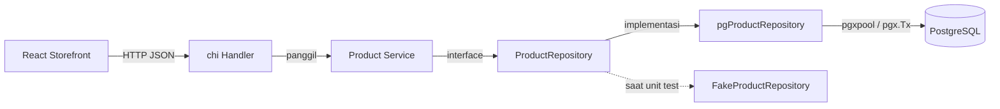
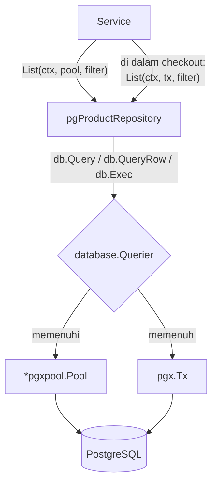
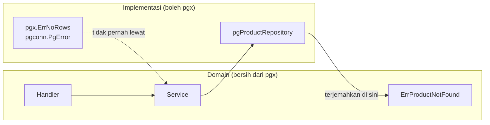

import { Section, Box, Steps, Step, Recap, CardGrid, Card, Chip, Hero, Compare, FileTree, Def } from "@components";

<Hero eyebrow="Roadmap 3 &middot; PostgreSQL dan pgx" title="Repository Pattern <em>dengan pgx</em><br />Akses Database yang Testable">
  <p>Chapter penutup Roadmap 3: kita satukan koneksi pool, query, write, transaksi, dan index menjadi satu lapis akses data yang bersih, lalu pisahkan SQL dari handler agar API skincare siap masuk Clean Architecture di Roadmap 4.</p>
  <Fragment slot="meta">
    <Chip icon="code">Bahasa: <b>Go 1.26</b></Chip>
    <Chip icon="database">pgx: <b>v5</b></Chip>
    <Chip icon="rocket">Capstone</Chip>
    <Chip icon="clock">~80 menit baca</Chip>
  </Fragment>
</Hero>

<Section num="01" id="intro" title="Kenapa Repository Pattern?" sub="Mengunci batas antara aturan bisnis dan SQL PostgreSQL">

<p class="lead">Di sembilan chapter Roadmap 3, kamu sudah menulis koneksi pgxpool, query baca, write dengan RETURNING, transaksi checkout, dan index. Sekarang semuanya dirapikan ke dalam satu lapis yang punya batas jelas: repository.</p>

Repository pattern adalah cara mengisolasi detail penyimpanan data di balik sebuah interface. Handler menerima HTTP, service menjalankan aturan bisnis, repository berbicara dengan PostgreSQL lewat `pgx`. Dengan pemisahan ini, handler tidak pernah tahu nama tabel, tidak pernah menulis `SELECT`, dan tidak pernah memegang connection pool. Yang ia tahu hanya: panggil service, terima hasil, balas JSON.

<Def term="Repository Pattern"><p>Pola desain yang menaruh seluruh operasi baca dan tulis sebuah domain di satu kontrak (interface), misalnya `ProductRepository`, lalu menyembunyikan detail apakah data datang dari PostgreSQL, fake in-memory, cache, atau service lain. Pemakai kontrak tidak peduli implementasinya.</p></Def>

<Box variant="bridge" icon="🌉" label="Jembatan: dari Eloquent ke repository Go"><p>Di Laravel, model Eloquent sering jadi domain model sekaligus query builder sekaligus serializer. Praktis untuk CRUD kecil, tetapi membuat layer atas (controller, job, command) ikut bergantung pada cara data disimpan. Di Go kita sengaja memisahkan struct domain, service, dan repository supaya dependency eksplisit, test lebih ringan, dan perubahan skema tidak merembet ke mana-mana.</p></Box>

Kenapa ini penting untuk online shop skincare? Katalog produk, varian, cart, checkout, inventory, payment, dan riwayat order akan terus bertambah kompleks. Kalau SQL menyebar di handler, setiap perubahan skema (menambah kolom `compare_at_price_rupiah`, mengubah index, memecah tabel) akan menyentuh banyak tempat sekaligus. Kalau SQL tinggal di repository, perubahan database terkurung di satu file per domain.

<Box variant="note" icon="🧭" label="Posisi chapter ini di Roadmap 3"><p>Ini capstone. Koneksi (R3C05), query baca (R3C06), write (R3C07), transaksi (R3C08), dan indexing (R3C09) tadinya berdiri sendiri-sendiri. Repository pattern adalah lem yang menyatukannya menjadi satu modul akses data yang rapi per domain (`product`, `cart`, `order`, `inventory`, `payment`). Setelah ini, Roadmap 4 membungkusnya dalam Clean Architecture penuh.</p></Box>

</Section>

<Section num="02" id="posisi-layer" title="Posisi Repository di Layer Backend" sub="Repository adalah gerbang data, bukan otak domain">

<p class="lead">Repository bukan tempat semua logika bisnis. Ia adalah gerbang data: tahu cara membaca dan menulis baris, tetapi tidak tahu kenapa. Aturan "produk harus aktif sebelum bisa masuk cart" itu milik service, bukan repository.</p>



<p class="fig-cap"><b>Gambar 1.</b> Aliran satu arah. Handler bergantung ke service, service bergantung ke interface repository, implementasi pgx berbicara ke PostgreSQL. Saat unit test, interface yang sama dipenuhi fake in-memory tanpa database.</p>

Setiap lapis punya satu tanggung jawab yang tidak boleh bocor ke tetangganya. Inilah pembagian kerja yang dipakai di seluruh proyek skincare.

<CardGrid cols={3}>
  <Card><h4>Handler</h4><p>Mengurus HTTP: parse request, validasi input dasar, pilih status code, dan tulis response JSON lewat envelope `httpx`. Tidak tahu SQL, tidak tahu pool.</p></Card>
  <Card><h4>Service</h4><p>Mengurus aturan bisnis: harga valid, produk aktif, stok cukup, izin admin, boundary transaksi. Tidak menulis SQL string sendiri.</p></Card>
  <Card><h4>Repository</h4><p>Mengurus SQL, mapping row ke struct domain, `pgx.ErrNoRows`, dan `RowsAffected`. Tidak tahu HTTP, tidak tahu aturan bisnis.</p></Card>
</CardGrid>

<Box variant="warn" icon="⚠️" label="Jangan taruh SQL di handler"><p>Handler yang memanggil `pool.QueryRow(...)` langsung akan sulit dites tanpa database nyata, cepat berubah jadi campuran HTTP, SQL, dan aturan bisnis, dan menggandakan query yang sama di banyak endpoint. Begitu satu handler menyentuh pool, batas layer sudah bocor.</p></Box>

<Box variant="bridge" icon="🌉" label="Jembatan: lapisan ini mirip Controller -> Service -> Repository di Laravel"><p>Pola tiga lapis ini bukan ide baru. Di Laravel matang kamu juga sering memisahkan Controller (HTTP), Service (use case), dan Repository (akses Eloquent atau query builder). Yang berbeda di Go: dependency antar lapis ditulis eksplisit lewat constructor, bukan diselesaikan otomatis oleh service container. Lebih banyak baris, tetapi alurnya selalu bisa kamu ikuti dengan mata.</p></Box>

</Section>

<Section num="03" id="kontrak-interface" title="Repository Interface sebagai Kontrak" sub="Interface ditulis dari kebutuhan service, bukan dari bentuk tabel">

<p class="lead">Interface repository didefinisikan di package domain (`internal/product`) dan menggambarkan apa yang service butuhkan, bukan apa yang kebetulan ada di database.</p>

Di Go, interface dipenuhi secara implisit. Struct `pgProductRepository` tidak perlu menulis `implements ProductRepository`. Selama method-nya cocok (nama, parameter, return), ia otomatis memenuhi kontrak. Ini berbeda dari TypeScript dan PHP yang biasanya menulis relasi `implements` secara eksplisit, dan justru perbedaan inilah yang membuat fake repository di test jadi sangat murah dibuat.

<Compare aLabel="TypeScript / PHP: implements eksplisit" bLabel="Go: interface implisit" aTone="muted" bTone="violet">
  <Fragment slot="a"><ul><li>Kelas menulis `implements ProductRepository` agar compiler tahu kontraknya.</li><li>ORM (Eloquent, Prisma) sering ikut membentuk cara layer lain membaca data.</li><li>Interface biasanya didefinisikan dekat implementasinya.</li></ul></Fragment>
  <Fragment slot="b"><ul><li>Struct cukup punya method yang sama, tanpa keyword khusus.</li><li>Service menerima behavior yang ia butuhkan, bukan detail database.</li><li>Interface didefinisikan di sisi pemakai (package domain), bukan di sisi implementasi.</li></ul></Fragment>
</Compare>

Interface katalog skincare punya lima operasi utama: `List`, `GetBySlug`, `Create`, `Update`, dan `Archive`. Semua menerima `context.Context` sebagai parameter pertama agar timeout dan cancellation dari HTTP request terus terbawa sampai ke query PostgreSQL. Perhatikan juga parameter `db database.Querier` di setiap method: itulah kunci agar repository yang sama bisa dipakai di dalam maupun di luar transaksi, yang kita bahas tuntas di section 05.

```go title="internal/product/repository.go"
package product

import (
	"context"

	"github.com/kamu/skincare-backend/internal/database"
)

// ProductRepository adalah kontrak akses data katalog.
// Diisi pgProductRepository (Postgres) di produksi dan FakeProductRepository di test.
type ProductRepository interface {
	List(ctx context.Context, db database.Querier, filter ProductFilter) ([]Product, error)
	GetBySlug(ctx context.Context, db database.Querier, slug string) (Product, error)
	Create(ctx context.Context, db database.Querier, params CreateProductParams) (Product, error)
	Update(ctx context.Context, db database.Querier, id int64, params UpdateProductParams) (Product, error)
	Archive(ctx context.Context, db database.Querier, id int64) error
}
```

Pola yang sama nanti dipakai untuk cart dan order. Nama method mengikuti bahasa domain, bukan selalu CRUD mentah. Cart butuh `AddItem` dan `RemoveItem`, sedangkan order butuh `CreateFromCheckout` dan `ListByUserID`.

```go title="internal/cart/repository.go"
package cart

import (
	"context"

	"github.com/kamu/skincare-backend/internal/database"
)

type Repository interface {
	GetActiveByUserID(ctx context.Context, db database.Querier, userID int64) (Cart, error)
	AddItem(ctx context.Context, db database.Querier, params AddItemParams) (CartItem, error)
	UpdateItemQuantity(ctx context.Context, db database.Querier, itemID int64, quantity int) (CartItem, error)
	RemoveItem(ctx context.Context, db database.Querier, itemID int64) error
}
```

```go title="internal/order/repository.go"
package order

import (
	"context"

	"github.com/kamu/skincare-backend/internal/database"
)

type Repository interface {
	Create(ctx context.Context, db database.Querier, params CreateOrderParams) (int64, error)
	CreateItem(ctx context.Context, db database.Querier, params CreateOrderItemParams) error
	FindByIdempotencyKey(ctx context.Context, db database.Querier, key string) (Order, error)
	ListByUserID(ctx context.Context, db database.Querier, userID int64, pagination Pagination) ([]Order, error)
}
```

<Box variant="tip" icon="💡" label="Idiom Go: accept interfaces, return structs"><p>Service menerima `ProductRepository` sebagai interface (kontrak abstrak), tetapi implementasi repository mengembalikan `Product` sebagai struct konkret. Yang masuk fleksibel (bisa diganti fake), yang keluar jelas (data siap pakai). Ini idiom paling sering muncul di kode Go yang sehat.</p></Box>

<Box variant="warn" icon="⚠️" label="Interface kecil mengikuti kebutuhan, bukan tabel"><p>Jangan tergoda membuat satu `Repository` raksasa yang punya method untuk setiap tabel. Pecah per domain: `ProductRepository`, `cart.Repository`, `order.Repository`. Interface yang sempit lebih mudah dipenuhi fake dan lebih jelas niatnya. Aturan praktis: kalau sebuah method tidak dipakai service mana pun, jangan masukkan ke interface.</p></Box>

</Section>

<Section num="04" id="model-dan-parameter" title="Model dan Parameter Query" sub="Pisahkan model yang dibaca dari parameter yang menulis">

<p class="lead">Sebelum menulis query, kita pisahkan tiga bentuk data: struct domain yang dibaca, parameter untuk membuat, dan parameter untuk mengubah sebagian.</p>

`Product` adalah bentuk data yang dipakai layer product. Sesuai skema kanonik proyek, katalog memakai `id bigint`, `slug` yang unik, `brand_id`, `status` (`draft`, `active`, `archived`), dan soft delete `deleted_at`. Harga tidak ada di `products`: harga adalah milik `product_variants` (`price_rupiah bigint`), karena varian (SKU) adalah unit yang benar-benar dijual. Uang selalu integer rupiah, tidak pernah `float64`.

```go title="internal/product/model.go"
package product

import "time"

// Product memetakan tabel products. Harga ada di product_variants, bukan di sini.
type Product struct {
	ID          int64      `json:"id"`
	BrandID     int64      `json:"brand_id"`
	Slug        string     `json:"slug"`
	Name        string     `json:"name"`
	Description string     `json:"description"`
	SkinTypes   []string   `json:"skin_types"`
	Concerns    []string   `json:"concerns"`
	Status      string     `json:"status"` // draft, active, archived
	CreatedAt   time.Time  `json:"created_at"`
	UpdatedAt   time.Time  `json:"updated_at"`
	DeletedAt   *time.Time `json:"deleted_at,omitempty"`
}

// ProductFilter adalah input baca List. Pointer berarti filter opsional.
type ProductFilter struct {
	BrandID *int64
	Status  *string
	Search  *string
	Limit   int
	Offset  int
}

// CreateProductParams adalah input tulis Create. Semua field wajib.
type CreateProductParams struct {
	BrandID     int64
	Slug        string
	Name        string
	Description string
	SkinTypes   []string
	Concerns    []string
	Status      string
}

// UpdateProductParams adalah input tulis Update parsial.
// Pointer nil berarti "field ini tidak diubah".
type UpdateProductParams struct {
	BrandID     *int64
	Slug        *string
	Name        *string
	Description *string
	Status      *string
}
```

```go title="internal/product/errors.go"
package product

import "errors"

// ErrProductNotFound adalah error domain, bukan error pgx.
// Handler memetakannya ke HTTP 404, bukan 500.
var ErrProductNotFound = errors.New("product not found")
```

<Box variant="bridge" icon="🌉" label="Jembatan: undefined di JS vs pointer nil di Go"><p>Di JavaScript, field yang tidak dikirim jadi `undefined`, dan `body.status === undefined` membedakannya dari `status: ""`. Go tidak punya `undefined`: `string` selalu punya zero value `""`. Pointer `*string` mengembalikan kemampuan itu. `nil` berarti "tidak dikirim, jangan diubah", sedangkan `&""` berarti "dikirim bernilai kosong". Untuk update parsial (PATCH), pointer adalah cara idiomatik membedakan keduanya.</p></Box>

<Box variant="note" icon="🧩" label="Filter pakai pointer, Create pakai nilai biasa"><p>`CreateProductParams` memakai tipe nilai (`int64`, `string`) karena semua field memang wajib saat membuat produk. `ProductFilter` dan `UpdateProductParams` memakai pointer karena field-nya opsional. Bentuk parameter mengikuti niat operasinya, bukan diseragamkan asal sama.</p></Box>

</Section>

<Section num="05" id="querier-pool-tx" title="Querier: Satu Repository, Pool atau Transaksi" sub="Interface kecil yang dipenuhi *pgxpool.Pool dan pgx.Tx sekaligus">

<p class="lead">Di chapter Transaksi (R3C08) kita memperkenalkan `database.Querier`. Inilah detail yang membuat repository pattern ini istimewa: method repository yang sama bisa dijalankan di luar transaksi (langsung ke pool) maupun di dalam transaksi checkout (lewat `tx`), tanpa menggandakan kode.</p>

Masalahnya begini. Kalau setiap method repository menulis `r.pool.QueryRow(...)`, maka query itu terkunci ke pool dan tidak pernah ikut transaksi yang sedang berjalan. Saat checkout, service membuka satu `pgx.Tx`, dan semua operasi (kunci stok, insert order, insert order_items, tandai cart converted) harus jalan di `tx` yang sama agar atomik. Repository yang terkunci ke pool tidak bisa ikut.

Cara idiomatik Go menyelesaikan ini adalah sebuah interface kecil berisi method yang benar-benar dipakai. Karena `*pgxpool.Pool` dan `pgx.Tx` sama-sama punya `Exec`, `Query`, dan `QueryRow` dengan signature identik, satu interface bisa menerima keduanya. Implicit interface Go membuat keduanya memenuhi `Querier` tanpa deklarasi apa pun.

```go title="internal/database/dbtx.go (dari R3C08, dipakai ulang di sini)"
package database

import (
	"context"

	"github.com/jackc/pgx/v5"
	"github.com/jackc/pgx/v5/pgconn"
)

// Querier dipenuhi oleh *pgxpool.Pool maupun pgx.Tx.
// Repository menerima ini, sehingga method yang sama bisa dipakai
// untuk query biasa (pool) atau di dalam transaksi (tx).
type Querier interface {
	Exec(ctx context.Context, sql string, args ...any) (pgconn.CommandTag, error)
	Query(ctx context.Context, sql string, args ...any) (pgx.Rows, error)
	QueryRow(ctx context.Context, sql string, args ...any) pgx.Row
}
```



<p class="fig-cap"><b>Gambar 2.</b> Repository memanggil method lewat `database.Querier`. Service memutuskan: untuk pembacaan biasa ia mengoper `pool`, untuk checkout ia mengoper `tx` yang sedang terbuka. Method repository tidak berubah sama sekali.</p>

<Compare aLabel="Repository terkunci ke pool" bLabel="Repository menerima Querier" aTone="red" bTone="blue">
  <Fragment slot="a"><ul><li>Field `r.pool` dipakai langsung di setiap method.</li><li>Query tidak bisa ikut transaksi yang sedang berjalan.</li><li>Checkout terpaksa menulis SQL di service, repository jadi mubazir.</li></ul></Fragment>
  <Fragment slot="b"><ul><li>Setiap method menerima `db database.Querier` setelah `ctx`.</li><li>Dipanggil dengan `pool` untuk baca biasa, `tx` untuk checkout.</li><li>SQL tetap rapi di repository, boundary transaksi tetap di service.</li></ul></Fragment>
</Compare>

<Box variant="bridge" icon="🌉" label="Jembatan: DB::transaction Laravel vs Querier eksplisit"><p>Di Laravel, `DB::transaction(fn)` menyuntik koneksi transaksional secara implisit lewat facade, sehingga Eloquent di dalam closure otomatis ikut transaksi tanpa kamu sadari. Di Go kita melakukannya eksplisit: service mengoper `tx` sebagai parameter. Lebih verbose, tetapi siapa yang ikut transaksi dan siapa yang tidak terlihat jelas hanya dengan membaca tanda tangan method.</p></Box>

<Box variant="note" icon="🧩" label="Nama interface tidak penting, methodnya yang penting"><p>Banyak project menamai interface ini `Querier`, `DBTX`, atau `Executor`. Generator seperti sqlc bahkan menghasilkan `DBTX` otomatis. Yang penting bukan namanya, melainkan bahwa methodnya seminimal kebutuhan repository, sehingga `*pgxpool.Pool` dan `pgx.Tx` sama-sama memenuhinya tanpa usaha.</p></Box>

</Section>

<Section num="06" id="implementasi-pgx" title="Implementasi PostgreSQL dengan pgx" sub="Struct implementasi bergantung pada pool, kontrak tetap ProductRepository">

<p class="lead">Implementasi PostgreSQL boleh menyimpan `*pgxpool.Pool` di dalam struct-nya, tetapi kontrak yang dilihat service tetap `ProductRepository`. Constructor mengembalikan interface, bukan tipe konkret.</p>

Struct `pgProductRepository` huruf kecil (unexported) karena tidak ada yang perlu menyebutnya dari luar package. Yang publik hanya constructor `NewPostgresProductRepository`, dan ia mengembalikan `ProductRepository`. Pool disimpan untuk satu hal saja: dipakai sebagai `Querier` default saat service tidak sedang dalam transaksi. Helper scan dan helper nullable di bawah ini akan dipakai berulang oleh method read dan write.

```go title="internal/product/pgx_repository.go"
package product

import (
	"context"
	"errors"
	"fmt"

	"github.com/jackc/pgx/v5"
	"github.com/jackc/pgx/v5/pgconn"
	"github.com/jackc/pgx/v5/pgxpool"

	"github.com/kamu/skincare-backend/internal/database"
)

// pgProductRepository unexported: hanya constructor yang publik.
type pgProductRepository struct {
	pool *pgxpool.Pool
}

// NewPostgresProductRepository mengembalikan interface, bukan struct konkret.
func NewPostgresProductRepository(pool *pgxpool.Pool) ProductRepository {
	return &pgProductRepository{pool: pool}
}

// Pastikan saat compile bahwa pgProductRepository memenuhi ProductRepository.
var _ ProductRepository = (*pgProductRepository)(nil)

// productColumns dipakai konsisten oleh semua query baca dan RETURNING.
const productColumns = `id, brand_id, slug, name, description, skin_types, concerns, status, created_at, updated_at, deleted_at`

// scanProduct memetakan satu baris ke struct Product.
// pgx.Row dan pgx.Rows sama-sama punya Scan(dest ...any) error.
func scanProduct(row interface{ Scan(dest ...any) error }) (Product, error) {
	var p Product
	err := row.Scan(
		&p.ID,
		&p.BrandID,
		&p.Slug,
		&p.Name,
		&p.Description,
		&p.SkinTypes,
		&p.Concerns,
		&p.Status,
		&p.CreatedAt,
		&p.UpdatedAt,
		&p.DeletedAt,
	)
	if err != nil {
		return Product{}, err
	}
	return p, nil
}

// notFoundOnZeroRows menerjemahkan UPDATE/DELETE tanpa baris menjadi error domain.
func notFoundOnZeroRows(tag pgconn.CommandTag) error {
	if tag.RowsAffected() == 0 {
		return ErrProductNotFound
	}
	return nil
}

func ptrOrNil[T any](v *T) any {
	if v == nil {
		return nil
	}
	return *v
}
```

<Box variant="tip" icon="💡" label="var _ Interface = (*impl)(nil) sebagai jaring kompilasi"><p>Baris `var _ ProductRepository = (*pgProductRepository)(nil)` tidak membuat objek apa pun saat runtime, tetapi memaksa compiler memastikan `pgProductRepository` benar-benar memenuhi `ProductRepository`. Kalau suatu hari kamu salah ketik signature method, build gagal di sini dengan pesan jelas, bukan di tempat pemakaian yang jauh.</p></Box>

<Box variant="note" icon="🧭" label="Catatan API pgx v5"><p>`QueryRow` menunda error sampai `Scan` dipanggil, jadi pola kita selalu `scanProduct(db.QueryRow(...))`. `Exec` mengembalikan `pgconn.CommandTag`, dan `tag.RowsAffected()` (bertipe `int64`) memberi tahu berapa baris tersentuh, berguna untuk mendeteksi update atau archive yang tidak menemukan target. Lihat [pgx.Row](https://pkg.go.dev/github.com/jackc/pgx/v5#Row) dan [pgconn.CommandTag](https://pkg.go.dev/github.com/jackc/pgx/v5/pgconn#CommandTag).</p></Box>

<Box variant="bridge" icon="🌉" label="Jembatan: ptrOrNil dan parameter $1, $2 PostgreSQL"><p>Generic kecil `ptrOrNil[T]` mengubah pointer Go menjadi `nil` SQL saat pointer-nya `nil`. Di pgx, placeholder query memakai gaya PostgreSQL `$1, $2, $3`, bukan tanda tanya `?` ala MySQL/PDO. Argumen dikirim terpisah dari string SQL, sehingga aman dari SQL injection tanpa kamu perlu meng-escape manual seperti di query string mentah PHP lama.</p></Box>

</Section>

<Section num="07" id="method-read" title="Method Read: List dan GetBySlug" sub="Query untuk banyak baris, QueryRow untuk satu baris">

<p class="lead">Untuk membaca banyak baris, gunakan `Query`, loop `rows.Next`, lalu tutup rows. Untuk satu baris, gunakan `QueryRow` dan terjemahkan `pgx.ErrNoRows` menjadi error domain `ErrProductNotFound`.</p>

`List` memakai filter opsional `brand_id`, `status`, dan pencarian nama. Di katalog skincare, filter status dipakai agar storefront publik hanya melihat produk `active`, sementara dashboard admin bisa melihat `draft` juga. Limit dijaga agar client tidak menarik sejuta baris dalam satu request, dan pengurutan stabil pakai `created_at DESC, id DESC`.

```go title="internal/product/pgx_repository.go"
func (r *pgProductRepository) List(ctx context.Context, db database.Querier, filter ProductFilter) ([]Product, error) {
	limit := filter.Limit
	if limit <= 0 || limit > 100 {
		limit = 20
	}
	offset := filter.Offset
	if offset < 0 {
		offset = 0
	}

	query := `
SELECT ` + productColumns + `
FROM products
WHERE deleted_at IS NULL
  AND ($1::bigint IS NULL OR brand_id = $1)
  AND ($2::text   IS NULL OR status = $2)
  AND ($3::text   IS NULL OR name ILIKE '%' || $3 || '%')
ORDER BY created_at DESC, id DESC
LIMIT $4 OFFSET $5`

	rows, err := db.Query(ctx, query,
		ptrOrNil(filter.BrandID),
		ptrOrNil(filter.Status),
		ptrOrNil(filter.Search),
		limit,
		offset,
	)
	if err != nil {
		return nil, fmt.Errorf("list products: %w", err)
	}
	defer rows.Close()

	products := make([]Product, 0, limit)
	for rows.Next() {
		p, err := scanProduct(rows)
		if err != nil {
			return nil, fmt.Errorf("scan product: %w", err)
		}
		products = append(products, p)
	}
	if err := rows.Err(); err != nil {
		return nil, fmt.Errorf("iterate products: %w", err)
	}
	return products, nil
}

func (r *pgProductRepository) GetBySlug(ctx context.Context, db database.Querier, slug string) (Product, error) {
	query := `
SELECT ` + productColumns + `
FROM products
WHERE slug = $1 AND deleted_at IS NULL`

	p, err := scanProduct(db.QueryRow(ctx, query, slug))
	if errors.Is(err, pgx.ErrNoRows) {
		return Product{}, ErrProductNotFound
	}
	if err != nil {
		return Product{}, fmt.Errorf("get product by slug: %w", err)
	}
	return p, nil
}
```

<Box variant="warn" icon="⚠️" label="Selalu defer rows.Close dan periksa rows.Err"><p>Pada query banyak baris, `rows.Close` mengembalikan koneksi ke pool. Lupa menutup rows membuat request berikutnya menunggu koneksi kosong sampai timeout. Dan jangan lewatkan `rows.Err()` setelah loop: error jaringan di tengah iterasi tidak muncul di `rows.Next()`, hanya di `rows.Err()`. Loop yang berhenti bukan berarti loop yang sukses.</p></Box>

<Box variant="tip" icon="💡" label="Filter opsional dengan ($1 IS NULL OR kolom = $1)"><p>Trik `($1::bigint IS NULL OR brand_id = $1)` membuat satu query melayani filter ada-atau-tidak tanpa menyusun SQL secara dinamis dengan string concatenation. Saat `$1` `nil`, klausa selalu benar (filter dilewati). Saat ada nilainya, ia menyaring. Cast `::bigint` dan `::text` penting agar PostgreSQL tahu tipe parameter saat nilainya `NULL`. Untuk `ILIKE`, ingat pelajaran indexing R3C09: index `pg_trgm` GIN yang mempercepat pencarian `ILIKE '%...%'`.</p></Box>

</Section>

<Section num="08" id="method-write" title="Method Write: Create, Update, Archive" sub="INSERT ... RETURNING, UPDATE parsial dengan COALESCE, soft delete">

<p class="lead">Untuk operasi tulis yang perlu mengembalikan data terbaru, gunakan `INSERT ... RETURNING` dan `UPDATE ... RETURNING`. Untuk menghapus, proyek skincare memakai soft delete: isi `deleted_at`, bukan hapus baris.</p>

`Create` mengembalikan produk yang baru dibuat, lengkap dengan `id` dan `created_at` yang dibangkitkan PostgreSQL. `Update` parsial memakai `COALESCE($n, kolom)` agar field yang `nil` (tidak dikirim) mempertahankan nilai lamanya. `Archive` adalah soft delete: ia mengisi `deleted_at` dan mengecek `RowsAffected` untuk membedakan "berhasil diarsipkan" dari "produk tidak ada".

```go title="internal/product/pgx_repository.go"
func (r *pgProductRepository) Create(ctx context.Context, db database.Querier, params CreateProductParams) (Product, error) {
	query := `
INSERT INTO products (brand_id, slug, name, description, skin_types, concerns, status)
VALUES ($1, $2, $3, $4, $5, $6, $7)
RETURNING ` + productColumns

	p, err := scanProduct(db.QueryRow(ctx, query,
		params.BrandID,
		params.Slug,
		params.Name,
		params.Description,
		params.SkinTypes,
		params.Concerns,
		params.Status,
	))
	if err != nil {
		return Product{}, fmt.Errorf("create product: %w", err)
	}
	return p, nil
}

func (r *pgProductRepository) Update(ctx context.Context, db database.Querier, id int64, params UpdateProductParams) (Product, error) {
	query := `
UPDATE products
SET brand_id    = COALESCE($2::bigint, brand_id),
    slug        = COALESCE($3::text,   slug),
    name        = COALESCE($4::text,   name),
    description = COALESCE($5::text,   description),
    status      = COALESCE($6::text,   status),
    updated_at  = now()
WHERE id = $1 AND deleted_at IS NULL
RETURNING ` + productColumns

	p, err := scanProduct(db.QueryRow(ctx, query,
		id,
		ptrOrNil(params.BrandID),
		ptrOrNil(params.Slug),
		ptrOrNil(params.Name),
		ptrOrNil(params.Description),
		ptrOrNil(params.Status),
	))
	if errors.Is(err, pgx.ErrNoRows) {
		return Product{}, ErrProductNotFound
	}
	if err != nil {
		return Product{}, fmt.Errorf("update product: %w", err)
	}
	return p, nil
}

func (r *pgProductRepository) Archive(ctx context.Context, db database.Querier, id int64) error {
	query := `
UPDATE products
SET deleted_at = now(), status = 'archived', updated_at = now()
WHERE id = $1 AND deleted_at IS NULL`

	tag, err := db.Exec(ctx, query, id)
	if err != nil {
		return fmt.Errorf("archive product: %w", err)
	}
	return notFoundOnZeroRows(tag)
}
```

<Box variant="bridge" icon="🌉" label="Jembatan: SoftDeletes Laravel vs soft delete eksplisit Go"><p>Laravel punya trait `SoftDeletes` yang otomatis menyisipkan `deleted_at IS NULL` di setiap query dan mengisi `deleted_at` saat `delete()`. Di Go kita melakukannya eksplisit: `Archive` menulis `deleted_at`, dan setiap query read menambahkan `WHERE deleted_at IS NULL`. Lebih banyak ketikan, tetapi tidak ada perilaku tersembunyi. Saat ada bug "produk terhapus masih muncul", kamu tahu persis di mana mencarinya.</p></Box>

<Box variant="warn" icon="⚠️" label="DELETE produk yang pernah dibeli akan merusak histori"><p>Produk yang sudah pernah masuk order tetap dirujuk oleh `order_items` lewat snapshot `product_name`, `sku`, dan `unit_price_rupiah`. Hard delete baris `products` boleh saja secara FK (order_items menyimpan snapshot, bukan FK ke kolom itu), tetapi kamu kehilangan kemampuan menampilkan produk di halaman detail order lama. Soft delete menjaga katalog historis tetap utuh untuk invoice dan laporan.</p></Box>

</Section>

<Section num="09" id="boundary-pgx" title="Jangan Bocorkan Tipe pgx ke Domain" sub="pgx adalah detail implementasi, bukan bagian dari kontrak">

<p class="lead">Aturan emas repository pattern: tipe `pgx` (seperti `pgx.ErrNoRows`, `pgconn.PgError`, `pgx.Rows`) hidup di dalam implementasi, tidak boleh keluar ke service atau handler. Service tahu `ErrProductNotFound`, bukan `pgx.ErrNoRows`.</p>

Kalau service ikut `errors.Is(err, pgx.ErrNoRows)`, maka service tahu-tahu bergantung pada pgx. Suatu hari kamu mau menambah cache, atau mengganti pgx, atau mengetes service dengan fake, dan tiba-tiba semua tempat yang menyentuh `pgx.ErrNoRows` ikut rusak. Repository-lah yang menerjemahkan error pgx menjadi error domain di perbatasan.



<p class="fig-cap"><b>Gambar 3.</b> Garis batas. pgx hidup di kanan (implementasi). Error pgx diterjemahkan menjadi error domain (`ErrProductNotFound`) di repository, sehingga service dan handler di kiri tetap bersih dan bisa dites tanpa pgx.</p>

Contoh nyata: pelanggaran unique constraint pada `products.slug`. PostgreSQL membalas SQLSTATE `23505`. Repository menangkapnya dan mengubahnya menjadi error domain `ErrSlugTaken`, sehingga handler bisa membalas HTTP 409 Conflict, bukan 500.

```go title="internal/product/errors.go"
package product

import "errors"

var (
	ErrProductNotFound = errors.New("product not found")
	ErrSlugTaken       = errors.New("product slug already taken")
)
```

```go title="internal/product/pgx_repository.go (penanganan unique violation)"
import "github.com/jackc/pgx/v5/pgconn"

// translateWriteError mengubah error pgx jadi error domain di perbatasan.
func translateWriteError(err error) error {
	var pgErr *pgconn.PgError
	if errors.As(err, &pgErr) && pgErr.Code == "23505" {
		// 23505 = unique_violation. products.slug UNIQUE.
		return ErrSlugTaken
	}
	return err
}
```

Dengan helper itu, `Create` cukup membungkus error tulisnya: `return Product{}, translateWriteError(fmt.Errorf("create product: %w", err))`. Service tidak pernah melihat `pgconn.PgError`, hanya `ErrSlugTaken` yang ia mengerti.

<Box variant="bridge" icon="🌉" label="Jembatan: QueryException Laravel vs error domain Go"><p>Di Laravel, unique violation muncul sebagai `Illuminate\Database\QueryException` dengan kode driver. Banyak controller malas menangkapnya dan membiarkannya jadi 500. Disiplin yang sama berlaku di Go, tetapi lebih eksplisit: repository menangkap `pgconn.PgError` kode `23505` dan mengubahnya jadi `ErrSlugTaken`. Frontend menerima 409 yang bermakna, bukan 500 yang membingungkan.</p></Box>

<Box variant="tip" icon="💡" label="Tes lakmus boundary"><p>Buka `service.go` dan handler-mu, lalu cari kata `pgx` dan `pgconn` di import. Kalau ada, boundary sudah bocor. Service dan handler yang sehat hanya meng-import package domain dan `internal/httpx`, tidak pernah pgx. Import pgx terkurung di `pgx_repository.go` dan `internal/database`.</p></Box>

</Section>

<Section num="10" id="dependency-injection" title="Dependency Injection di cmd/api/main.go" sub="Wiring manual yang jelas, tanpa container ajaib">

<p class="lead">Dependency injection di Go biasanya manual, sederhana, dan terlihat jelas dari constructor. Tidak ada service container yang menyelesaikan dependency otomatis, dan untuk modular monolith itu justru kelebihan.</p>

Service menerima `ProductRepository` (interface), bukan `*pgProductRepository` (konkret). Handler menerima `*ProductService`, bukan pool. Untuk pembacaan biasa, service mengoper `s.pool` sebagai `Querier`. Hanya saat checkout (di package order) service mengoper `tx`. Rantai dependency disusun sekali di `cmd/api/main.go`.

```go title="internal/product/service.go"
package product

import (
	"context"
	"fmt"
	"strings"

	"github.com/jackc/pgx/v5/pgxpool"
)

type ProductService struct {
	pool *pgxpool.Pool
	repo ProductRepository
}

func NewProductService(pool *pgxpool.Pool, repo ProductRepository) *ProductService {
	return &ProductService{pool: pool, repo: repo}
}

func (s *ProductService) ListProducts(ctx context.Context, filter ProductFilter) ([]Product, error) {
	// Pembacaan biasa: oper pool sebagai Querier.
	return s.repo.List(ctx, s.pool, filter)
}

func (s *ProductService) GetProduct(ctx context.Context, slug string) (Product, error) {
	if strings.TrimSpace(slug) == "" {
		return Product{}, ErrProductNotFound
	}
	return s.repo.GetBySlug(ctx, s.pool, slug)
}

func (s *ProductService) CreateProduct(ctx context.Context, params CreateProductParams) (Product, error) {
	if strings.TrimSpace(params.Name) == "" {
		return Product{}, fmt.Errorf("product name is required")
	}
	if strings.TrimSpace(params.Slug) == "" {
		return Product{}, fmt.Errorf("product slug is required")
	}
	return s.repo.Create(ctx, s.pool, params)
}
```

```go title="internal/product/handler.go"
package product

import (
	"errors"
	"net/http"

	"github.com/go-chi/chi/v5"

	"github.com/kamu/skincare-backend/internal/httpx"
)

type Handler struct {
	service *ProductService
}

func NewHandler(service *ProductService) *Handler {
	return &Handler{service: service}
}

func (h *Handler) Detail(w http.ResponseWriter, r *http.Request) {
	slug := chi.URLParam(r, "slug")

	p, err := h.service.GetProduct(r.Context(), slug)
	if errors.Is(err, ErrProductNotFound) {
		httpx.Error(w, http.StatusNotFound, "product_not_found", "produk tidak ditemukan")
		return
	}
	if err != nil {
		httpx.Error(w, http.StatusInternalServerError, "internal_error", "gagal memuat produk")
		return
	}

	httpx.Data(w, http.StatusOK, p)
}
```

Inilah titik di mana koneksi pgx (R3C05) bertemu repository. Pool dibuka sekali, lalu disuntikkan ke setiap repository dan service. Penutupan pool ditunda dengan `defer pool.Close()` agar koneksi dikembalikan rapi saat aplikasi berhenti.

```go title="cmd/api/main.go"
package main

import (
	"context"
	"log/slog"
	"net/http"
	"os"
	"time"

	"github.com/jackc/pgx/v5/pgxpool"

	"github.com/kamu/skincare-backend/internal/cart"
	"github.com/kamu/skincare-backend/internal/inventory"
	"github.com/kamu/skincare-backend/internal/order"
	"github.com/kamu/skincare-backend/internal/payment"
	"github.com/kamu/skincare-backend/internal/product"
)

func main() {
	ctx := context.Background()

	pool, err := pgxpool.New(ctx, os.Getenv("DATABASE_URL"))
	if err != nil {
		slog.Error("open pool", "error", err)
		os.Exit(1)
	}
	defer pool.Close()

	if err := pool.Ping(ctx); err != nil {
		slog.Error("ping db", "error", err)
		os.Exit(1)
	}

	// --- Wiring per domain: repository -> service -> handler ---
	productRepo := product.NewPostgresProductRepository(pool)
	productSvc := product.NewProductService(pool, productRepo)
	productHandler := product.NewHandler(productSvc)

	cartRepo := cart.NewPostgresRepository(pool)
	inventoryRepo := inventory.NewPostgresRepository(pool)
	orderRepo := order.NewPostgresRepository(pool)
	paymentRepo := payment.NewPostgresRepository(pool)

	// Service checkout memegang pool untuk membuka transaksi sendiri,
	// lalu mengoper tx ke cart/inventory/order/payment repository.
	orderSvc := order.NewService(pool, cartRepo, inventoryRepo, orderRepo, paymentRepo)
	orderHandler := order.NewHandler(orderSvc)

	_ = productHandler
	_ = orderHandler

	addr := ":8080"
	slog.Info("server listening", "addr", addr)
	srv := &http.Server{Addr: addr, ReadHeaderTimeout: 5 * time.Second}
	if err := srv.ListenAndServe(); err != nil {
		slog.Error("server stopped", "error", err)
		os.Exit(1)
	}
}
```

<Box variant="tip" icon="💡" label="Constructor kecil, wiring jelas"><p>Go tidak butuh container dependency injection dulu. Untuk modular monolith, wiring manual di `cmd/api/main.go` lebih mudah diikuti, lebih ramah refactor, dan tidak menyembunyikan urutan inisialisasi. Saat proyek tumbuh besar dan wiring jadi ratusan baris, baru pertimbangkan generator seperti `google/wire`, bukan sebelumnya.</p></Box>

<Box variant="bridge" icon="🌉" label="Jembatan: constructor DI vs service container Laravel"><p>Di Laravel, kamu mendaftarkan binding di `AppServiceProvider` lalu container menyuntik dependency lewat type-hint constructor secara otomatis. Di Go, kamu menyuntik dependency dengan tangan: `product.NewProductService(pool, productRepo)`. Pola TS yang setara adalah constructor DI manual (`new ProductService(repo)`), bukan decorator `@Injectable`. Eksplisit, tetapi tidak ada sihir yang harus dilacak saat debugging.</p></Box>

</Section>

<Section num="11" id="testing-fake" title="Testing dengan Fake Repository" sub="Uji aturan bisnis service tanpa PostgreSQL">

<p class="lead">Kekuatan repository interface paling terasa saat service bisa dites tanpa PostgreSQL, tanpa migration, tanpa Docker, dan tanpa fixture database. Cukup fake repository in-memory yang memenuhi interface yang sama.</p>

Fake repository menyimpan data di map dan mengabaikan parameter `db database.Querier` (ia tidak butuh database). Ini bukan pengganti integration test, tetapi cukup cepat untuk menguji aturan bisnis service ribuan kali per detik. Integration test repository terhadap PostgreSQL asli tetap dibuat di Roadmap 6.

```go title="internal/product/fake_repository.go"
package product

import (
	"context"
	"sync"

	"github.com/kamu/skincare-backend/internal/database"
)

// FakeProductRepository memenuhi ProductRepository tanpa database.
type FakeProductRepository struct {
	mu       sync.Mutex
	nextID   int64
	bySlug   map[string]int64
	products map[int64]Product
}

func NewFakeProductRepository() *FakeProductRepository {
	return &FakeProductRepository{
		nextID:   1,
		bySlug:   make(map[string]int64),
		products: make(map[int64]Product),
	}
}

var _ ProductRepository = (*FakeProductRepository)(nil)

func (f *FakeProductRepository) List(ctx context.Context, _ database.Querier, filter ProductFilter) ([]Product, error) {
	f.mu.Lock()
	defer f.mu.Unlock()

	out := make([]Product, 0, len(f.products))
	for _, p := range f.products {
		if filter.Status != nil && p.Status != *filter.Status {
			continue
		}
		out = append(out, p)
	}
	return out, nil
}

func (f *FakeProductRepository) GetBySlug(ctx context.Context, _ database.Querier, slug string) (Product, error) {
	f.mu.Lock()
	defer f.mu.Unlock()

	id, ok := f.bySlug[slug]
	if !ok {
		return Product{}, ErrProductNotFound
	}
	return f.products[id], nil
}

func (f *FakeProductRepository) Create(ctx context.Context, _ database.Querier, params CreateProductParams) (Product, error) {
	f.mu.Lock()
	defer f.mu.Unlock()

	if _, taken := f.bySlug[params.Slug]; taken {
		return Product{}, ErrSlugTaken
	}
	p := Product{
		ID:          f.nextID,
		BrandID:     params.BrandID,
		Slug:        params.Slug,
		Name:        params.Name,
		Description: params.Description,
		SkinTypes:   params.SkinTypes,
		Concerns:    params.Concerns,
		Status:      params.Status,
	}
	f.products[p.ID] = p
	f.bySlug[p.Slug] = p.ID
	f.nextID++
	return p, nil
}

func (f *FakeProductRepository) Update(ctx context.Context, _ database.Querier, id int64, params UpdateProductParams) (Product, error) {
	f.mu.Lock()
	defer f.mu.Unlock()

	p, ok := f.products[id]
	if !ok {
		return Product{}, ErrProductNotFound
	}
	if params.Name != nil {
		p.Name = *params.Name
	}
	if params.Status != nil {
		p.Status = *params.Status
	}
	f.products[id] = p
	return p, nil
}

func (f *FakeProductRepository) Archive(ctx context.Context, _ database.Querier, id int64) error {
	f.mu.Lock()
	defer f.mu.Unlock()

	p, ok := f.products[id]
	if !ok {
		return ErrProductNotFound
	}
	p.Status = "archived"
	f.products[id] = p
	return nil
}
```

```go title="internal/product/service_test.go"
package product

import (
	"context"
	"errors"
	"testing"
)

func TestProductService_CreateProduct_Success(t *testing.T) {
	repo := NewFakeProductRepository()
	svc := NewProductService(nil, repo) // pool nil: fake mengabaikan Querier

	got, err := svc.CreateProduct(context.Background(), CreateProductParams{
		BrandID: 1,
		Slug:    "hydrating-toner",
		Name:    "Hydrating Toner",
		Status:  "active",
	})
	if err != nil {
		t.Fatalf("CreateProduct error: %v", err)
	}
	if got.ID == 0 {
		t.Fatal("expected generated product id")
	}
	if got.Slug != "hydrating-toner" {
		t.Fatalf("expected slug hydrating-toner, got %q", got.Slug)
	}
}

func TestProductService_CreateProduct_RejectsEmptyName(t *testing.T) {
	svc := NewProductService(nil, NewFakeProductRepository())

	_, err := svc.CreateProduct(context.Background(), CreateProductParams{Slug: "x", Name: "  "})
	if err == nil {
		t.Fatal("expected error for empty name")
	}
}

func TestProductService_GetProduct_NotFound(t *testing.T) {
	svc := NewProductService(nil, NewFakeProductRepository())

	_, err := svc.GetProduct(context.Background(), "missing-slug")
	if !errors.Is(err, ErrProductNotFound) {
		t.Fatalf("expected ErrProductNotFound, got %v", err)
	}
}
```

<Box variant="bridge" icon="🌉" label="Jembatan: fake repo vs mock Jest atau Mockery"><p>Di Jest kamu menulis `jest.fn()` dan di Laravel kamu pakai `Mockery::mock(ProductRepository::class)`. Fake repository Go adalah versi yang lebih jujur: ia implementasi nyata yang menyimpan state, bukan stub yang merekam panggilan. Karena interface dipenuhi implisit, satu struct fake cukup untuk semua test, dan ia menangkap bug logika (slug ganda ditolak) yang mock kosong tidak akan tangkap.</p></Box>

<Box variant="warn" icon="⚠️" label="Fake bukan integration test"><p>Fake repository cocok untuk menguji aturan bisnis service dengan cepat. Tetapi ia tidak membuktikan SQL benar, constraint unik bekerja, index terpakai, transaksi atomik, atau `COALESCE` parsial berperilaku seperti yang kamu kira. Untuk semua itu, tetap buat integration test dengan PostgreSQL asli (lewat testcontainers atau database test khusus) di Roadmap 6.</p></Box>

</Section>

<Section num="12" id="struktur-folder" title="Struktur Folder per Domain" sub="Satu domain, satu package, file yang berubah bersama">

<p class="lead">Setiap domain mengumpulkan model, interface, implementasi pgx, service, handler, dan test di satu package. File yang berubah bersama hidup berdekatan.</p>

<FileTree title="Struktur lapis akses data per domain" tree={`
cmd/
  api/
    main.go                  # wiring pool, repository, service, handler
internal/
  database/
    postgres.go              # pgxpool.New, Ping (dari R3C05)
    dbtx.go                  # interface Querier (pool atau tx, dari R3C08)
  product/
    model.go                 # Product, ProductFilter, Create/Update params
    errors.go                # ErrProductNotFound, ErrSlugTaken
    repository.go            # interface ProductRepository
    pgx_repository.go        # implementasi PostgreSQL dengan pgxpool
    fake_repository.go       # fake in-memory untuk unit test service
    service.go               # aturan bisnis product, tanpa SQL
    handler.go               # HTTP handler, tanpa SQL
    service_test.go          # unit test ProductService pakai fake
  cart/
    model.go
    repository.go            # interface cart.Repository
    pgx_repository.go
    service.go
  order/                     # checkout: service memegang transaksi
    model.go
    repository.go
    pgx_repository.go
    service.go               # boundary tx di sini, oper tx ke repo lain
  inventory/
    repository.go
    pgx_repository.go
  payment/
    repository.go
    pgx_repository.go
go.mod                       # module github.com/kamu/skincare-backend, go 1.26
`} />

Pola per file di dalam satu domain konsisten: `model.go` memegang struct domain dan parameter, `errors.go` memegang error domain, `repository.go` memegang interface, `pgx_repository.go` memegang implementasi Postgres (satu-satunya file yang import pgx), `service.go` memegang aturan bisnis, dan `handler.go` memegang HTTP. Test hidup di package yang sama agar bisa menguji fungsi unexported.

<Box variant="bridge" icon="🌉" label="Jembatan: folder per peran Laravel vs per domain Go"><p>Laravel memisahkan berdasarkan peran teknis: `app/Http/Controllers`, `app/Services`, `app/Repositories`, `app/Models`. Modular monolith Go memisahkan berdasarkan domain bisnis: semua hal product di `internal/product`. Keuntungannya, saat kontrak katalog berubah, semua file yang ikut berubah ada di satu folder, dan dependency antar domain (`order` butuh `product`) terlihat jelas lewat import.</p></Box>

</Section>

<Section num="13" id="jebakan-umum" title="Jebakan Umum dari JS dan PHP" sub="Kesalahan klasik saat datang dari ekosistem ORM dan framework penuh">

<p class="lead">Repository pattern sederhana, tetapi ada beberapa kesalahan yang sering muncul saat datang dari Eloquent, Prisma, atau framework yang mengurus database secara ajaib.</p>

<CardGrid cols={2}>
  <Card><h4>Interface terlalu besar</h4><p>Hindari satu `Repository` raksasa untuk semua tabel. Pecah jadi `ProductRepository`, `cart.Repository`, `order.Repository`. Interface sempit lebih mudah dipenuhi fake.</p></Card>
  <Card><h4>Service menyusun SQL</h4><p>Kalau service mulai meng-concat query string, batas layer bocor. Semua SQL tinggal di `pgx_repository.go`, titik.</p></Card>
  <Card><h4>Handler memegang pool</h4><p>Handler tidak boleh menerima `*pgxpool.Pool`. Ia cukup menerima service dan bekerja dengan HTTP serta `httpx`.</p></Card>
  <Card><h4>pgx bocor ke domain</h4><p>`pgx.ErrNoRows` dan `pgconn.PgError` diterjemahkan di repository menjadi `ErrProductNotFound` atau `ErrSlugTaken`, tidak diteruskan ke service.</p></Card>
  <Card><h4>Semua error jadi 500</h4><p>`ErrProductNotFound` harus jadi 404, `ErrSlugTaken` jadi 409, bukan semuanya 500. Handler memetakan error domain ke status code.</p></Card>
  <Card><h4>Lupa context</h4><p>Setiap method menerima `ctx context.Context` agar timeout request dan cancellation terus aktif sampai PostgreSQL membatalkan query.</p></Card>
  <Card><h4>Repository terkunci ke pool</h4><p>Tanpa parameter `database.Querier`, repository tidak bisa ikut transaksi checkout, dan SQL terpaksa pindah ke service.</p></Card>
  <Card><h4>Fake dianggap integration test</h4><p>Fake cepat untuk aturan bisnis, tetapi tidak membuktikan SQL, index, migration, constraint, atau atomicity transaksi.</p></Card>
</CardGrid>

<Box variant="tip" icon="💡" label="Kapan membuat interface?"><p>Buat interface di sisi pemakai (service), dan hanya saat kamu memang butuh mengganti implementasi (fake saat test) atau punya lebih dari satu varian. Kalau sebuah dependency belum perlu diganti dan belum punya variasi, jangan terburu-buru membuat abstraksi. Abstraksi yang tidak dipakai hanya menambah ketikan tanpa nilai.</p></Box>

<Box variant="bridge" icon="🌉" label="Jembatan: repository pattern bukan menambah ORM"><p>Datang dari Eloquent, godaannya adalah membuat repository jadi mini-ORM dengan magic finders. Tahan diri. Repository Go yang sehat menulis SQL apa adanya (raw SQL, no ORM), mengembalikan struct domain, dan berhenti di situ. Kejelasan query yang kamu jalankan jauh lebih berharga daripada kepraktisan `Product::where(...)->get()` yang menyembunyikan N+1 dan query mahal.</p></Box>

</Section>

<Section num="14" id="hands-on" title="Hands-on: Rakit Lapis Repository" sub="Sambungkan koneksi, query, write, dan transaksi jadi satu modul">

<p class="lead">Latihan ini menyambungkan seluruh Roadmap 3 menjadi satu lapis akses data product yang bersih dan testable, lalu menjalankan unit test tanpa database.</p>

<Steps>
  <Step><b>Pastikan Querier ada</b><p>Konfirmasi `internal/database/dbtx.go` berisi interface `Querier` dari R3C08. Semua method repository akan menerimanya setelah `ctx`.</p></Step>
  <Step><b>Definisikan kontrak</b><p>Buat `internal/product/repository.go` dengan interface `ProductRepository` (List, GetBySlug, Create, Update, Archive), masing-masing menerima `database.Querier`.</p></Step>
  <Step><b>Pindahkan semua SQL</b><p>Tulis `pgx_repository.go`. Pastikan tidak ada satu pun `SELECT`, `INSERT`, atau `UPDATE` yang tersisa di handler atau service.</p></Step>
  <Step><b>Terjemahkan error pgx</b><p>Di repository, ubah `pgx.ErrNoRows` jadi `ErrProductNotFound` dan `pgconn.PgError` kode 23505 jadi `ErrSlugTaken`. Service tidak boleh import pgx.</p></Step>
  <Step><b>Inject dan wiring</b><p>Buat constructor `NewPostgresProductRepository`, `NewProductService`, dan `NewHandler`, lalu sambungkan di `cmd/api/main.go`.</p></Step>
  <Step><b>Buat fake dan uji</b><p>Tambahkan `FakeProductRepository`, tulis `service_test.go`, lalu jalankan test tanpa PostgreSQL.</p></Step>
</Steps>

Verifikasi lapis sudah bersih dengan satu pemeriksaan cepat: tidak ada import pgx di luar `pgx_repository.go` dan `internal/database`.

```bash title="Terminal"
# Pastikan SQL hanya di repository (tidak ada di handler/service)
grep -rn "pool.Query\|pool.Exec\|SELECT \|INSERT \|UPDATE " internal/product/handler.go internal/product/service.go

# Pastikan pgx tidak bocor ke service/handler
grep -rn "jackc/pgx" internal/product/service.go internal/product/handler.go

# Jalankan unit test service (tanpa database)
go test ./internal/product/...
```

Kalau dua `grep` pertama tidak menghasilkan baris apa pun dan `go test` lulus, lapis repository-mu sudah bersih dan testable.

```bash title="Terminal"
ok      github.com/kamu/skincare-backend/internal/product    0.012s
```

<Box variant="note" icon="🧪" label="Latihan lanjutan"><p>Setelah product selesai, ulangi pola yang sama untuk `cart.Repository` dan `inventory.Repository`. Lalu rakit `order.Service.Checkout` yang membuka satu `pgx.Tx`, mengoper `tx` ke `cart`, `inventory`, dan `order` repository, dan commit di akhir. Itu menyatukan transaksi R3C08 dengan repository pattern, persis seperti yang dipakai checkout nyata di proyek skincare.</p></Box>

</Section>

<Section num="15" id="ringkasan" title="Ringkasan & Poin Penting">

<p class="lead">Repository pattern adalah capstone yang menyatukan koneksi, query, write, transaksi, dan index Roadmap 3 menjadi satu lapis akses data yang bersih, dan jembatan menuju Clean Architecture di Roadmap 4.</p>

<Recap title="Yang Wajib Menempel">
  <ul>
    <li>Handler mengurus HTTP, service mengurus aturan bisnis, repository mengurus SQL dan mapping row. Tanggung jawab tidak boleh bocor antar lapis.</li>
    <li>Interface repository (`ProductRepository`) didefinisikan di package domain dari kebutuhan service, dipenuhi implisit oleh `pgProductRepository` dan `FakeProductRepository`.</li>
    <li>Setiap method menerima `database.Querier` setelah `ctx`, sehingga query yang sama jalan di luar transaksi (oper `pool`) maupun di dalam checkout (oper `tx`).</li>
    <li>Idiom accept interfaces, return structs: service menerima interface repository, repository mengembalikan struct domain `Product`.</li>
    <li>`QueryRow` untuk satu baris (tangani `pgx.ErrNoRows` jadi `ErrProductNotFound`), `Query` untuk banyak baris (defer `rows.Close`, cek `rows.Err`), `Exec` untuk write tanpa hasil (`RowsAffected`).</li>
    <li>Tipe pgx (`pgx.ErrNoRows`, `pgconn.PgError` kode 23505) diterjemahkan ke error domain di repository, tidak pernah bocor ke service atau handler.</li>
    <li>DI manual di `cmd/api/main.go`: pool dibuka sekali, disuntik ke repository dan service lewat constructor, tanpa container ajaib.</li>
    <li>Fake repository mempercepat unit test service tanpa database; integration test terhadap PostgreSQL asli tetap diperlukan untuk membuktikan SQL, index, dan transaksi.</li>
    <li>Uang selalu integer rupiah: harga ada di `product_variants.price_rupiah` (`int64`), bukan di `products`, dan tidak pernah `float64`.</li>
  </ul>
</Recap>

Di proyek online shop skincare, pola ini menjadi standar untuk product, cart, order, inventory, payment, shipment, review, dan promotion. Di Roadmap 4, kita menaikkan pola ini menjadi Clean Architecture modular monolith yang punya boundary domain tegas, error mapping terpusat, logging terstruktur, config, dan wiring aplikasi yang lebih matang. Repository yang kamu tulis hari ini akan tetap dipakai apa adanya, hanya dibungkus lebih rapi.

<p>Rujukan resmi yang relevan: [Go 1.26 release notes](https://go.dev/doc/go1.26), [pgx v5](https://pkg.go.dev/github.com/jackc/pgx/v5), [pgxpool v5](https://pkg.go.dev/github.com/jackc/pgx/v5/pgxpool), dan [pgconn (PgError, CommandTag)](https://pkg.go.dev/github.com/jackc/pgx/v5/pgconn).</p>

</Section>
