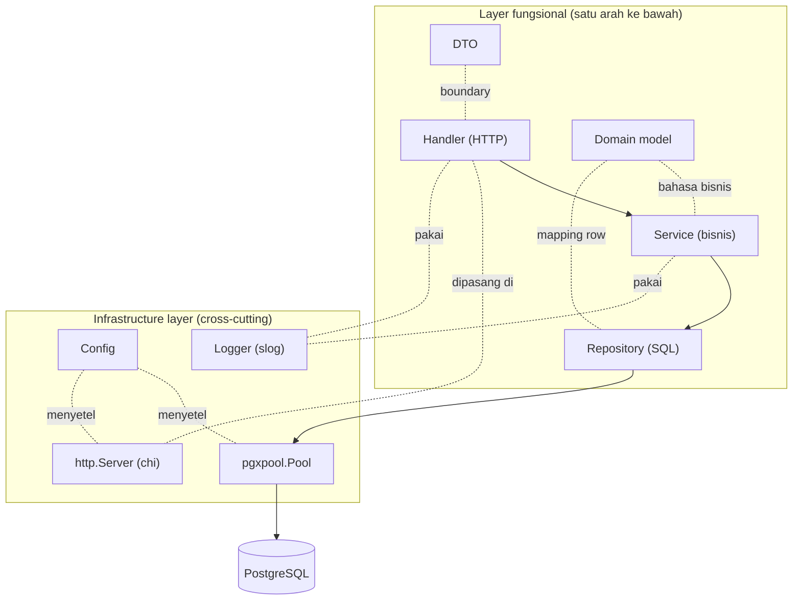
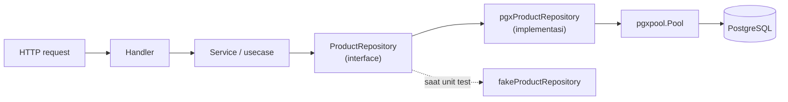
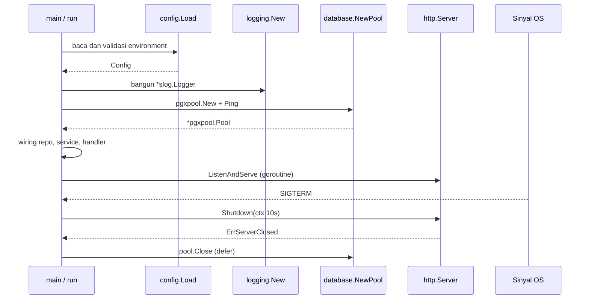
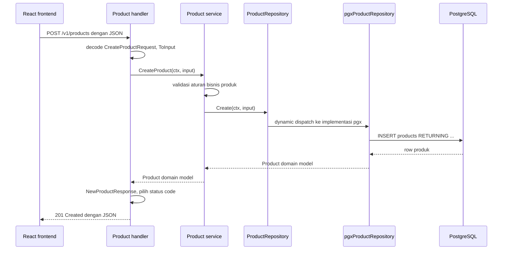

import { Section, Box, Steps, Step, Recap, CardGrid, Card, Chip, Hero, Compare, FileTree, Def } from "@components";

<Hero eyebrow="Roadmap 4 &middot; Clean Backend Architecture" title="Layered Architecture<br /><em>Handler, Service, Repository</em>">
  <p>Kita ubah API skincare dari sekadar berjalan menjadi rapi, testable, dan siap tumbuh: lima layer dengan tanggung jawab tegas, ditopang satu infrastructure layer yang menyiapkan config, logger, pool, dan server.</p>
  <Fragment slot="meta">
    <Chip icon="code">Bahasa: <b>Go 1.26</b></Chip>
    <Chip icon="stack">Roadmap <b>4</b></Chip>
    <Chip icon="clock">~70 menit baca</Chip>
  </Fragment>
</Hero>

<Section num="01" id="intro" title="Kenapa Layered Architecture?" sub="Kode backend yang sehat bukan hanya kode yang jalan, tetapi kode yang batas tanggung jawabnya jelas.">

<p class="lead">Kalau parsing HTTP, validasi bisnis, SQL, dan format response bercampur di satu handler, fitur kecil akan cepat berubah menjadi bola benang.</p>

Di Roadmap 2 kita membuat handler HTTP dengan chi. Di Roadmap 3 kita menulis SQL dengan pgx dan menutupnya dengan repository pattern. Di Roadmap 4, kita menaikkan keduanya menjadi arsitektur yang utuh. Layered architecture membagi kode berdasarkan **tanggung jawab**, bukan berdasarkan selera folder.

Untuk online shop skincare, kita memakai tiga layer inti: **handler** untuk HTTP, **service** untuk aturan bisnis, dan **repository** untuk akses data. Di antara mereka ada **domain model** sebagai bahasa bisnis dan **DTO** sebagai bentuk data di boundary request dan response. Menopang semuanya ada **infrastructure layer**: config, logger, connection pool, dan http server. Lima layer fungsional plus satu layer lintas-potong inilah yang akan kita bedah satu per satu.

Contoh modul ini memakai [Go 1.26](https://go.dev/doc/go1.26), [chi v5](https://pkg.go.dev/github.com/go-chi/chi/v5), [pgxpool v5](https://pkg.go.dev/github.com/jackc/pgx/v5/pgxpool), dan logging stdlib [`log/slog`](https://pkg.go.dev/log/slog), tetapi keputusan arsitekturnya tidak terikat pada framework besar mana pun.

<Box variant="bridge" icon="🌉" label="Jembatan: dari MVC Laravel ke Layered Go"><p>Di Laravel, Controller sering memanggil Model Eloquent yang sekaligus jadi entity, query builder, relasi, mutator, dan serializer. Di Go kita buat eksplisit: Controller menjadi handler, model bisnis menjadi domain struct, query database masuk repository, dan aturan bisnis masuk service. Yang Laravel sembunyikan di service container, kita rakit dengan tangan di satu tempat.</p></Box>

<Box variant="bridge" icon="🌉" label="Jembatan: dari folder per fitur React ke layer per tanggung jawab"><p>Di React kamu terbiasa memisahkan component, hook, dan API client. Naluri "pisahkan tampilan dari pengambilan data" itu persis yang kita pakai di backend, hanya garis batasnya berubah: handler memegang protokol HTTP, service memegang keputusan bisnis, repository memegang query. Sama-sama tentang menjaga satu file tidak mengerjakan dua pekerjaan sekaligus.</p></Box>

Layering bukan ritual enterprise. Manfaatnya terasa justru saat checkout mulai rumit: stok dikunci, promo dihitung, payment dibuat, email dikirim. Tanpa batas layer, satu perubahan kecil bisa menyentuh banyak file yang seharusnya tidak terkait.

<Def term="Layered architecture"><p>Pola organisasi kode yang memisahkan tanggung jawab ke beberapa layer (umumnya presentation, business logic, data access, dan infrastructure) sehingga dependency mengalir satu arah dan tiap layer bisa diuji dengan fokus berbeda.</p></Def>

Di Go modern, kita tetap idiomatik: `context.Context` mengalir dari handler ke service ke repository, error dikembalikan sebagai nilai, interface diterima di sisi yang membutuhkan, dan implementasi konkret tetap sederhana. Dokumentasi resmi [`context`](https://pkg.go.dev/context) menekankan context membawa deadline, cancellation, dan request-scoped value lintas API boundary, jadi pola ini pas untuk HTTP API dan query pgx.

</Section>

<Section num="02" id="peta-layer" title="Peta Lima Layer" sub="Setiap layer punya pekerjaan yang sempit dan jelas, ditopang infrastructure di bawahnya.">

<p class="lead">Cara paling mudah memahami layering adalah bertanya: kode ini sedang mengurus protokol, bisnis, storage, atau penyiapan aplikasi?</p>

<CardGrid cols={3}>
  <Card><h4>Handler layer</h4><p>Urusan HTTP: membaca path, query, header, body JSON, memanggil service, lalu menulis status code dan response JSON.</p></Card>
  <Card><h4>Service layer</h4><p>Urusan bisnis: aturan harga, stok, eligibility promo, izin admin, validasi domain, dan orkestrasi beberapa repository dalam satu transaksi.</p></Card>
  <Card><h4>Repository layer</h4><p>Urusan data: SQL, pgx, mapping row ke domain model, dan menerjemahkan error database menjadi error domain.</p></Card>
  <Card><h4>Domain model</h4><p>Bahasa bisnis: struct Product, Order, Cart tanpa tag JSON dan tanpa tag SQL. Inti yang tidak tahu HTTP maupun PostgreSQL.</p></Card>
  <Card><h4>DTO</h4><p>Kontrak boundary: bentuk request dan response JSON yang boleh berubah mengikuti frontend tanpa mengganggu domain.</p></Card>
  <Card><h4>Infrastructure</h4><p>Penopang lintas-potong: config dari environment, logger terstruktur, pgxpool, dan http server. Semua layer fungsional duduk di atasnya.</p></Card>
</CardGrid>

Handler tidak boleh tahu detail PostgreSQL. Service tidak boleh tahu `http.ResponseWriter`. Repository tidak boleh tahu format JSON. Domain model tidak boleh tahu HTTP maupun SQL. Batas inilah yang membuat tiap layer bisa diuji dengan fokus berbeda.



<p class="fig-cap"><b>Gambar 1.</b> Lima layer fungsional mengalir satu arah dari HTTP ke data, sementara infrastructure layer (config, logger, pool, server) menopang dari bawah sebagai concern lintas-potong.</p>

<Compare aLabel="JS / Laravel yang sering terjadi" bLabel="Go yang kita targetkan" aTone="muted" bTone="violet">
  <Fragment slot="a"><ul><li>Controller membaca request, menjalankan query, memformat response, dan kadang menghitung aturan bisnis sekaligus.</li><li>Model ORM menyimpan query, relasi, serialization, dan event dalam satu kelas.</li><li>Bootstrap aplikasi (config, koneksi, logger) tersembunyi di framework.</li></ul></Fragment>
  <Fragment slot="b"><ul><li>Handler hanya mengubah HTTP menjadi pemanggilan service, lalu hasil service menjadi HTTP response.</li><li>Domain struct tetap bersih, repository menyimpan SQL, service menyimpan keputusan bisnis.</li><li>Infrastructure dirakit eksplisit dan terlihat di satu entry point.</li></ul></Fragment>
</Compare>

Untuk modul `product`, struktur folder yang kita tuju seperti ini. Perhatikan ada `internal/config`, `internal/platform/logging`, dan `internal/database` yang menjadi rumah infrastructure.

<FileTree title="Struktur layer pada proyek skincare" tree={`
cmd/
  api/
    main.go         # entry point: rakit infra lalu wiring domain
internal/
  config/
    config.go       # baca dan validasi environment jadi struct Config
  platform/
    logging/
      logging.go    # bangun *slog.Logger terstruktur
  database/
    postgres.go     # pgxpool.New, Ping, Close (infrastructure)
    dbtx.go         # interface Querier (pool atau tx, dari R3C08)
  product/
    model.go        # domain model dan error bisnis
    dto.go          # request dan response DTO untuk HTTP boundary
    repository.go   # interface repository
    pgx_repository.go # implementasi pgx (satu-satunya file import pgx)
    service.go      # aturan bisnis produk
    handler.go      # HTTP handler untuk route produk
go.mod              # module github.com/kamu/skincare-backend, go 1.26
`} />

<Box variant="note" icon="🧭" label="Catatan batas folder"><p>Kita sengaja menaruh model, dto, repository, service, dan handler di satu package per domain, bukan memecah ke folder handler, service, repository terpisah. Untuk modular monolith, satu package per domain lebih sederhana selama dependency antar file tetap satu arah. Infrastructure dipisah karena memang dipakai lintas domain.</p></Box>

</Section>

<Section num="03" id="domain-dan-dto" title="Domain Model dan DTO" sub="Domain model adalah bahasa bisnis, DTO adalah kontrak di boundary.">

<p class="lead">Banyak backend berantakan karena satu struct dipaksa jadi segalanya: row database, request JSON, response JSON, sekaligus business object.</p>

Di Go, struct ringan. Justru karena ringan, kita tidak perlu takut membuat struct berbeda untuk tujuan berbeda. **Domain model** menyatakan konsep bisnis. **DTO** menyatakan kontrak input dan output di layer HTTP.

<Box variant="bridge" icon="🌉" label="Jembatan: dari TypeScript DTO ke Go struct"><p>Kalau di TypeScript kamu biasa punya `CreateProductRequest` dan `ProductResponse` sebagai interface terpisah dari model domain, di Go konsepnya sama persis. Bedanya, tag JSON ditulis di struct tag (`json:"name"`), dan struct domain sebaiknya tidak otomatis menjadi bentuk API publik.</p></Box>

Domain model untuk produk tidak perlu tag JSON atau tag SQL. Ia tidak sedang bicara HTTP, tidak sedang bicara PostgreSQL. Ia bicara produk dalam domain skincare. Mengikuti skema kanonik proyek dari Roadmap 3, katalog memakai `brand_id`, `slug` unik, `status` (`draft`, `active`, `archived`), dan soft delete `deleted_at`. Harga produk disimpan sebagai integer Rupiah di field `PriceRupiah`, tidak pernah `float64`.

```go title="internal/product/model.go"
package product

import (
	"errors"
	"time"
)

var (
	ErrProductNotFound = errors.New("product not found")
	ErrInvalidProduct  = errors.New("invalid product")
)

// Product adalah domain model katalog. Tanpa tag JSON, tanpa tag SQL.
// Ia bicara bisnis skincare, bukan HTTP dan bukan PostgreSQL.
type Product struct {
	ID          int64
	BrandID     int64
	Slug        string
	Name        string
	Description string
	PriceRupiah int64 // uang selalu integer Rupiah, tidak pernah float64
	Stock       int
	Status      string // draft, active, archived
	CreatedAt   time.Time
	UpdatedAt   time.Time
}

// CanBeSold adalah contoh logika domain murni: aturan kecil yang melekat
// pada konsep produk, bukan pada HTTP atau SQL.
func (p Product) CanBeSold() bool {
	return p.Status == "active" && p.Stock > 0
}

// CreateProductInput adalah parameter bisnis untuk membuat produk.
// Netral terhadap HTTP: tidak peduli datang dari JSON, CLI, atau worker.
type CreateProductInput struct {
	BrandID     int64
	Name        string
	Slug        string
	Description string
	PriceRupiah int64
	Stock       int
}
```

DTO punya tag JSON karena ia memang hidup di boundary HTTP. DTO boleh berubah mengikuti kebutuhan frontend, sedangkan domain model berubah mengikuti bahasa bisnis. Kolom database memakai `price_rupiah`, jadi DTO juga mengeksposnya sebagai `price_rupiah` agar konsisten dari ujung ke ujung.

```go title="internal/product/dto.go"
package product

import "time"

// CreateProductRequest adalah bentuk body JSON yang diterima handler.
type CreateProductRequest struct {
	BrandID     int64  `json:"brand_id"`
	Name        string `json:"name"`
	Slug        string `json:"slug"`
	Description string `json:"description"`
	PriceRupiah int64  `json:"price_rupiah"`
	Stock       int    `json:"stock"`
}

// ProductResponse adalah kontrak publik API. Bentuk ini boleh berbeda
// dari domain model, dan boleh berkembang tanpa mengubah bisnis.
type ProductResponse struct {
	ID          int64     `json:"id"`
	BrandID     int64     `json:"brand_id"`
	Name        string    `json:"name"`
	Slug        string    `json:"slug"`
	Description string    `json:"description"`
	PriceRupiah int64     `json:"price_rupiah"`
	Stock       int       `json:"stock"`
	Status      string    `json:"status"`
	CreatedAt   time.Time `json:"created_at"`
	UpdatedAt   time.Time `json:"updated_at"`
}

// ToInput mengubah DTO request menjadi input bisnis yang netral HTTP.
func (r CreateProductRequest) ToInput() CreateProductInput {
	return CreateProductInput{
		BrandID:     r.BrandID,
		Name:        r.Name,
		Slug:        r.Slug,
		Description: r.Description,
		PriceRupiah: r.PriceRupiah,
		Stock:       r.Stock,
	}
}

// NewProductResponse memetakan domain model ke DTO response.
func NewProductResponse(p Product) ProductResponse {
	return ProductResponse{
		ID:          p.ID,
		BrandID:     p.BrandID,
		Name:        p.Name,
		Slug:        p.Slug,
		Description: p.Description,
		PriceRupiah: p.PriceRupiah,
		Stock:       p.Stock,
		Status:      p.Status,
		CreatedAt:   p.CreatedAt,
		UpdatedAt:   p.UpdatedAt,
	}
}
```

<Box variant="warn" icon="⚠️" label="Jangan bocorkan database schema ke API"><p>Nama kolom bisa berubah, strategi storage bisa berubah, field internal bisa bertambah. Response API adalah kontrak publik, jadi jangan otomatis mengekspor seluruh bentuk database. Dua mapper kecil (`ToInput` dan `NewProductResponse`) adalah ongkos murah untuk kebebasan besar.</p></Box>

<Box variant="tip" icon="💡" label="Mapper di mana?"><p>Letakkan `ToInput` dan `NewProductResponse` di `dto.go`, dekat DTO-nya. Mereka adalah penerjemah boundary, jadi wajar tinggal di lapisan boundary. Handler tinggal memanggil mereka, tetap tipis.</p></Box>

</Section>

<Section num="04" id="dependency-flow" title="Arah Dependency yang Benar" sub="Dependency harus mengalir dari luar ke dalam, bukan bolak-balik.">

<p class="lead">Aturan sederhana: handler punya service, service punya repository (lewat interface), repository punya koneksi database.</p>

Dependency yang benar membuat service bisa dites tanpa HTTP server dan tanpa PostgreSQL, handler bisa dites dengan fake service, dan repository bisa dites dengan database integrasi. Tiap layer punya cara testing yang sesuai tanggung jawabnya.



<p class="fig-cap"><b>Gambar 2.</b> Dependency berjalan satu arah dari HTTP menuju data. Service bergantung pada interface, sehingga implementasi pgx maupun fake in-memory bisa dipasang di lubang yang sama.</p>

Arah yang dilarang: repository memanggil service, service menerima `*http.Request`, domain model membawa tag JSON hanya karena handler butuh response, atau handler membangun SQL langsung.

<Box variant="tip" icon="💡" label="Prinsip praktis"><p>Layer luar boleh tahu layer dalam. Layer dalam tidak boleh tahu detail layer luar. Service boleh tahu interface repository, tetapi service tidak perlu tahu pgx, SQL, atau status code HTTP.</p></Box>

Interface `ProductRepository` didefinisikan di sisi consumer, yaitu dekat service yang membutuhkannya, bukan di package implementasi. Ini idiom Go: interface ditulis dari kebutuhan pemakai, bukan dari bentuk database. Service menerima interface (yang masuk fleksibel), repository mengembalikan struct domain (yang keluar jelas).

```go title="internal/product/repository.go"
package product

import "context"

// ProductRepository adalah kontrak akses data yang dibutuhkan service.
// Diisi pgxProductRepository di produksi dan fakeProductRepository di test.
type ProductRepository interface {
	GetByID(ctx context.Context, id int64) (Product, error)
	Create(ctx context.Context, input CreateProductInput) (Product, error)
}
```

Di Go, dependency injection cukup lewat constructor. Tidak perlu container besar seperti di beberapa framework. Constructor membuat dependency eksplisit dan mudah dibaca saat wiring aplikasi.

<Box variant="bridge" icon="🌉" label="Jembatan: service container Laravel vs constructor DI Go"><p>Di Laravel kamu mendaftarkan binding di `AppServiceProvider`, lalu container menyuntik dependency lewat type-hint constructor secara otomatis. Padanan yang setara di TypeScript adalah constructor DI manual (`new ProductService(repo)`), bukan decorator `@Injectable`. Go memakai cara manual ini: eksplisit, tanpa sihir yang harus dilacak saat debugging.</p></Box>

Wiring penuh (pool, config, logger, server) kita bahas tuntas di section Infrastructure. Untuk sekarang, cukup lihat bentuk constructor-nya: tiap layer menerima dependency layer di bawahnya.

```go title="internal/product/wiring.go (potongan ilustrasi)"
// Rantai constructor: repository <- service <- handler.
// logger berasal dari infrastructure layer (dibangun di Section 06).
productRepo := product.NewPGXProductRepository(pool)
productService := product.NewService(productRepo)
productHandler := product.NewHandler(productService, logger)
```

</Section>

<Section num="05" id="implementasi-product" title="Implementasi Modul Product" sub="Sekarang kita satukan model, repository, service, dan handler dalam contoh realistis.">

<p class="lead">Contoh ini memakai produk skincare karena hampir semua backend e-commerce punya listing, detail, dan create produk admin.</p>

Repository interface menyatakan kebutuhan service. Implementasi pgx menyimpan SQL dan mapping row, lalu menerjemahkan error pgx menjadi error domain di perbatasan. Service tidak menerima `*pgxpool.Pool`, hanya `ProductRepository`.

```go title="internal/product/pgx_repository.go"
package product

import (
	"context"
	"errors"
	"fmt"

	"github.com/jackc/pgx/v5"
	"github.com/jackc/pgx/v5/pgxpool"
)

// pgxProductRepository unexported: hanya constructor yang publik.
type pgxProductRepository struct {
	pool *pgxpool.Pool
}

// NewPGXProductRepository mengembalikan interface, bukan struct konkret.
func NewPGXProductRepository(pool *pgxpool.Pool) ProductRepository {
	return &pgxProductRepository{pool: pool}
}

// Jaring kompilasi: pastikan implementasi memenuhi kontrak.
var _ ProductRepository = (*pgxProductRepository)(nil)

const productColumns = `id, brand_id, slug, name, description, price_rupiah, stock, status, created_at, updated_at`

func (r *pgxProductRepository) GetByID(ctx context.Context, id int64) (Product, error) {
	const query = `
SELECT ` + productColumns + `
FROM products
WHERE id = $1 AND deleted_at IS NULL`

	var p Product
	err := r.pool.QueryRow(ctx, query, id).Scan(
		&p.ID,
		&p.BrandID,
		&p.Slug,
		&p.Name,
		&p.Description,
		&p.PriceRupiah,
		&p.Stock,
		&p.Status,
		&p.CreatedAt,
		&p.UpdatedAt,
	)
	if errors.Is(err, pgx.ErrNoRows) {
		return Product{}, ErrProductNotFound // terjemahkan di perbatasan
	}
	if err != nil {
		return Product{}, fmt.Errorf("get product by id: %w", err)
	}
	return p, nil
}

func (r *pgxProductRepository) Create(ctx context.Context, input CreateProductInput) (Product, error) {
	const query = `
INSERT INTO products (brand_id, slug, name, description, price_rupiah, stock, status)
VALUES ($1, $2, $3, $4, $5, $6, 'active')
RETURNING ` + productColumns

	var p Product
	err := r.pool.QueryRow(ctx, query,
		input.BrandID,
		input.Slug,
		input.Name,
		input.Description,
		input.PriceRupiah,
		input.Stock,
	).Scan(
		&p.ID,
		&p.BrandID,
		&p.Slug,
		&p.Name,
		&p.Description,
		&p.PriceRupiah,
		&p.Stock,
		&p.Status,
		&p.CreatedAt,
		&p.UpdatedAt,
	)
	if err != nil {
		return Product{}, fmt.Errorf("create product: %w", err)
	}
	return p, nil
}
```

Service memegang aturan bisnis. Untuk sekarang aturannya sederhana: nama dan slug wajib ada, harga harus positif, stok tidak boleh negatif. Pada chapter berikutnya, service tumbuh untuk promo, inventory, order, dan payment.

```go title="internal/product/service.go"
package product

import (
	"context"
	"strings"
)

type Service struct {
	repo ProductRepository
}

func NewService(repo ProductRepository) *Service {
	return &Service{repo: repo}
}

func (s *Service) GetProduct(ctx context.Context, id int64) (Product, error) {
	return s.repo.GetByID(ctx, id)
}

func (s *Service) CreateProduct(ctx context.Context, input CreateProductInput) (Product, error) {
	input.Name = strings.TrimSpace(input.Name)
	input.Slug = strings.TrimSpace(input.Slug)
	input.Description = strings.TrimSpace(input.Description)

	if input.Name == "" || input.Slug == "" {
		return Product{}, ErrInvalidProduct
	}
	if input.PriceRupiah <= 0 || input.Stock < 0 {
		return Product{}, ErrInvalidProduct
	}

	return s.repo.Create(ctx, input)
}
```

Handler menerjemahkan HTTP ke service call. Ia boleh tahu JSON, status code, path parameter, chi, dan logger. Ia tidak boleh tahu SQL. Logger di-inject lewat constructor agar handler bisa mencatat error tanpa tahu konfigurasi logging.

```go title="internal/product/handler.go"
package product

import (
	"encoding/json"
	"errors"
	"log/slog"
	"net/http"
	"strconv"

	"github.com/go-chi/chi/v5"
)

type Handler struct {
	service *Service
	logger  *slog.Logger
}

func NewHandler(service *Service, logger *slog.Logger) *Handler {
	return &Handler{service: service, logger: logger}
}

func (h *Handler) Routes(r chi.Router) {
	r.Get("/{id}", h.getProduct)
	r.Post("/", h.createProduct)
}

func (h *Handler) getProduct(w http.ResponseWriter, r *http.Request) {
	id, err := strconv.ParseInt(chi.URLParam(r, "id"), 10, 64)
	if err != nil || id <= 0 {
		writeJSON(w, http.StatusBadRequest, map[string]string{"error": "invalid product id"})
		return
	}

	p, err := h.service.GetProduct(r.Context(), id)
	if errors.Is(err, ErrProductNotFound) {
		writeJSON(w, http.StatusNotFound, map[string]string{"error": "product not found"})
		return
	}
	if err != nil {
		h.logger.ErrorContext(r.Context(), "get product failed", "product_id", id, "error", err)
		writeJSON(w, http.StatusInternalServerError, map[string]string{"error": "internal server error"})
		return
	}

	writeJSON(w, http.StatusOK, NewProductResponse(p))
}

func (h *Handler) createProduct(w http.ResponseWriter, r *http.Request) {
	var req CreateProductRequest
	if err := json.NewDecoder(r.Body).Decode(&req); err != nil {
		writeJSON(w, http.StatusBadRequest, map[string]string{"error": "invalid json body"})
		return
	}

	p, err := h.service.CreateProduct(r.Context(), req.ToInput())
	if errors.Is(err, ErrInvalidProduct) {
		writeJSON(w, http.StatusUnprocessableEntity, map[string]string{"error": "invalid product"})
		return
	}
	if err != nil {
		h.logger.ErrorContext(r.Context(), "create product failed", "slug", req.Slug, "error", err)
		writeJSON(w, http.StatusInternalServerError, map[string]string{"error": "internal server error"})
		return
	}

	writeJSON(w, http.StatusCreated, NewProductResponse(p))
}

func writeJSON(w http.ResponseWriter, status int, body any) {
	w.Header().Set("Content-Type", "application/json")
	w.WriteHeader(status)
	_ = json.NewEncoder(w).Encode(body)
}
```

<Box variant="warn" icon="⚠️" label="Jangan biarkan handler tumbuh liar"><p>Begitu handler mulai menghitung diskon, mengecek stok, atau membuka transaksi sendiri, itu tanda aturan bisnis bocor ke layer HTTP. Pindahkan ke service. Handler yang sehat panjangnya stabil meski fitur bertambah.</p></Box>

<Box variant="tip" icon="💡" label="Tes lakmus boundary pgx"><p>Buka `service.go` dan `handler.go`, lalu cari kata `pgx` di import. Kalau ada, boundary sudah bocor. Service dan handler yang sehat tidak pernah import pgx; ia terkurung di `pgx_repository.go`.</p></Box>

</Section>

<Section num="06" id="infrastructure" title="Infrastructure Layer: Config, Logger, Pool, Server" sub="Layer lintas-potong yang menyiapkan aplikasi sebelum satu request pun masuk.">

<p class="lead">Lima layer fungsional tadi tidak bisa berdiri sendiri. Ada satu layer di bawah mereka yang sering dilupakan padahal menentukan kualitas produksi: infrastructure.</p>

Infrastructure layer adalah rumah untuk concern yang dipakai semua domain: membaca **config** dari environment, membangun **logger** terstruktur, membuka **connection pool**, dan menyalakan **http server**. Ia tidak memuat aturan bisnis. Tugasnya menyiapkan fondasi, lalu menyuntikkannya ke layer fungsional lewat constructor.

<Box variant="bridge" icon="🌉" label="Jembatan: yang Laravel sembunyikan, kita rakit sendiri"><p>Di Laravel, `config/*.php`, koneksi database, logging, dan kernel HTTP disiapkan oleh framework sebelum controller-mu jalan. Di React/Node, `dotenv`, pool koneksi, dan server bootstrap juga sering tersebar di beberapa file. Di Go kita merakitnya eksplisit di satu tempat (`cmd/api/main.go`). Lebih banyak baris, tetapi urutan inisialisasi dan kepemilikan resource terlihat jelas.</p></Box>

<Def term="Cross-cutting concern"><p>Kebutuhan teknis yang melintasi banyak fitur sekaligus (konfigurasi, logging, koneksi database, lifecycle server) sehingga tidak pantas dimiliki satu domain saja, melainkan disediakan oleh infrastructure layer untuk dipakai bersama.</p></Def>

<h3>Config: environment menjadi satu struct</h3>

Config dibaca dari environment variable sekali di awal, divalidasi, lalu dibekukan menjadi satu struct read-only. Tidak ada kode yang memanggil `os.Getenv` tersebar di mana-mana. Satu sumber kebenaran membuat perbedaan local, staging, dan production cukup soal nilai environment, bukan soal kode.

```go title="internal/config/config.go"
package config

import (
	"fmt"
	"os"
	"time"
)

// Config adalah seluruh setting aplikasi, dibaca sekali saat start.
type Config struct {
	Env         string        // local, staging, production
	HTTPAddr    string        // alamat listen, mis. :8080
	DatabaseURL string        // DSN PostgreSQL untuk pgxpool
	LogLevel    string        // debug, info, warn, error
	ReadTimeout time.Duration // batas baca request
}

// Load membaca environment, mengisi default yang aman, dan memvalidasi
// nilai yang wajib ada. Gagal di sini lebih baik daripada gagal saat
// request pertama masuk di production.
func Load() (Config, error) {
	cfg := Config{
		Env:         getEnv("APP_ENV", "local"),
		HTTPAddr:    getEnv("HTTP_ADDR", ":8080"),
		DatabaseURL: os.Getenv("DATABASE_URL"),
		LogLevel:    getEnv("LOG_LEVEL", "info"),
		ReadTimeout: 5 * time.Second,
	}

	if cfg.DatabaseURL == "" {
		return Config{}, fmt.Errorf("config: DATABASE_URL is required")
	}
	return cfg, nil
}

func getEnv(key, fallback string) string {
	if v := os.Getenv(key); v != "" {
		return v
	}
	return fallback
}
```

<Box variant="warn" icon="⚠️" label="Secret bukan config biasa"><p>`DATABASE_URL`, kunci JWT, dan kredensial payment gateway adalah secret, bukan config biasa. Jangan pernah menulisnya di kode, di repo, atau di log. Untuk sekarang kita baca dari environment; di Roadmap 4 chapter Configuration kita perdalam pemisahan secret dari config, dan di Roadmap 8 kita pakai secret manager AWS.</p></Box>

<h3>Logger: structured logging dengan slog</h3>

Logging produksi harus terstruktur (key-value, JSON), bukan `fmt.Println`. Sejak Go 1.21, stdlib menyediakan [`log/slog`](https://pkg.go.dev/log/slog) sehingga kita tidak perlu library pihak ketiga. Logger dibangun sekali di infrastructure, lalu disuntikkan ke handler dan service. Level diatur dari config.

```go title="internal/platform/logging/logging.go"
package logging

import (
	"log/slog"
	"os"
)

// New membangun logger JSON terstruktur dengan level dari string config.
// Field "env" otomatis menempel di setiap baris log lewat With.
func New(level, env string) *slog.Logger {
	handler := slog.NewJSONHandler(os.Stdout, &slog.HandlerOptions{
		Level: parseLevel(level),
	})
	return slog.New(handler).With("env", env)
}

func parseLevel(level string) slog.Level {
	switch level {
	case "debug":
		return slog.LevelDebug
	case "warn":
		return slog.LevelWarn
	case "error":
		return slog.LevelError
	default:
		return slog.LevelInfo
	}
}
```

<Box variant="bridge" icon="🌉" label="Jembatan: console.log vs slog terstruktur"><p>`console.log("user", id)` di Node menghasilkan teks bebas yang sulit dicari di production. `slog` menghasilkan JSON dengan field bernama: `{"level":"INFO","msg":"create product","slug":"hydrating-toner","env":"production"}`. CloudWatch atau Datadog bisa memfilter dan agregasi field itu, sesuatu yang mustahil dengan teks bebas. Naluri "log yang bisa di-query", bukan "log yang dibaca mata", inilah yang dituju.</p></Box>

<Box variant="tip" icon="💡" label="Pakai ...Context dan jangan log secret"><p>Method `logger.ErrorContext(ctx, msg, ...)` membawa context sehingga nanti bisa otomatis menyertakan request ID. Dan jangan pernah memasukkan password, token, atau nomor kartu ke log: detail logging aman ini kita perdalam di Roadmap 4 chapter Logging Strategy.</p></Box>

<h3>Database pool: pgxpool sebagai resource bersama</h3>

Connection pool adalah infrastructure murni. Ia dibuka sekali, dipakai semua repository, dan ditutup rapi saat aplikasi berhenti. Fungsi pembuka tinggal di `internal/database`, persis seperti yang kita siapkan di Roadmap 3.

```go title="internal/database/postgres.go"
package database

import (
	"context"
	"fmt"

	"github.com/jackc/pgx/v5/pgxpool"
)

// NewPool membuka pgxpool dan memverifikasi koneksi dengan Ping.
// Pemanggil bertanggung jawab memanggil pool.Close saat selesai.
func NewPool(ctx context.Context, databaseURL string) (*pgxpool.Pool, error) {
	pool, err := pgxpool.New(ctx, databaseURL)
	if err != nil {
		return nil, fmt.Errorf("open pgx pool: %w", err)
	}
	if err := pool.Ping(ctx); err != nil {
		pool.Close()
		return nil, fmt.Errorf("ping database: %w", err)
	}
	return pool, nil
}
```

<h3>HTTP server: lifecycle dan graceful shutdown</h3>

Server bukan sekadar `http.ListenAndServe`. Server produksi punya timeout dan tahu cara berhenti dengan rapi: menolak koneksi baru, menyelesaikan request yang sedang berjalan, lalu menutup pool. Inilah graceful shutdown, dan ia adalah tanggung jawab infrastructure.

```go title="internal/platform/httpserver/server.go"
package httpserver

import (
	"context"
	"net/http"
	"time"
)

// New membungkus http.Server dengan timeout yang aman untuk produksi.
func New(addr string, handler http.Handler, readTimeout time.Duration) *http.Server {
	return &http.Server{
		Addr:              addr,
		Handler:           handler,
		ReadHeaderTimeout: readTimeout,
		ReadTimeout:       readTimeout,
		WriteTimeout:      10 * time.Second,
		IdleTimeout:       60 * time.Second,
	}
}
```

Semua potongan tadi bertemu di entry point. `cmd/api/main.go` adalah satu-satunya tempat infrastructure dirakit dan domain di-wiring. Ia membaca config, membangun logger dan pool, menyusun rantai constructor product, memasangnya di router chi, lalu menyalakan server dengan graceful shutdown.

```go title="cmd/api/main.go"
package main

import (
	"context"
	"errors"
	"net/http"
	"os"
	"os/signal"
	"syscall"
	"time"

	"github.com/go-chi/chi/v5"

	"github.com/kamu/skincare-backend/internal/config"
	"github.com/kamu/skincare-backend/internal/database"
	"github.com/kamu/skincare-backend/internal/platform/httpserver"
	"github.com/kamu/skincare-backend/internal/platform/logging"
	"github.com/kamu/skincare-backend/internal/product"
)

func main() {
	if err := run(); err != nil {
		os.Exit(1)
	}
}

func run() error {
	ctx := context.Background()

	// 1. Infrastructure: config lebih dulu, karena yang lain bergantung padanya.
	cfg, err := config.Load()
	if err != nil {
		return err
	}

	logger := logging.New(cfg.LogLevel, cfg.Env)

	pool, err := database.NewPool(ctx, cfg.DatabaseURL)
	if err != nil {
		logger.Error("open database failed", "error", err)
		return err
	}
	defer pool.Close()

	// 2. Wiring domain: repository <- service <- handler, suntik logger.
	productRepo := product.NewPGXProductRepository(pool)
	productService := product.NewService(productRepo)
	productHandler := product.NewHandler(productService, logger)

	r := chi.NewRouter()
	r.Route("/v1/products", productHandler.Routes)

	// 3. Server: jalankan di goroutine agar main bisa menunggu sinyal stop.
	srv := httpserver.New(cfg.HTTPAddr, r, cfg.ReadTimeout)

	serverErr := make(chan error, 1)
	go func() {
		logger.Info("server listening", "addr", cfg.HTTPAddr, "env", cfg.Env)
		if err := srv.ListenAndServe(); err != nil && !errors.Is(err, http.ErrServerClosed) {
			serverErr <- err
		}
	}()

	// 4. Graceful shutdown: tunggu sinyal OS atau error server.
	stop := make(chan os.Signal, 1)
	signal.Notify(stop, syscall.SIGINT, syscall.SIGTERM)

	select {
	case err := <-serverErr:
		logger.Error("server failed", "error", err)
		return err
	case sig := <-stop:
		logger.Info("shutdown signal received", "signal", sig.String())
	}

	shutdownCtx, cancel := context.WithTimeout(ctx, 10*time.Second)
	defer cancel()
	if err := srv.Shutdown(shutdownCtx); err != nil {
		logger.Error("graceful shutdown failed", "error", err)
		return err
	}
	logger.Info("server stopped cleanly")
	return nil
}
```



<p class="fig-cap"><b>Gambar 3.</b> Urutan bootstrap dan teardown. Infrastructure disiapkan dari atas ke bawah, lalu dibongkar rapi saat sinyal stop tiba, sehingga request yang sedang jalan tetap selesai.</p>

<Box variant="bridge" icon="🌉" label="Jembatan: pm2 restart vs Shutdown eksplisit"><p>Di Node kamu mengandalkan `process.on("SIGTERM")` atau pm2 untuk menutup koneksi sebelum proses mati. Go menyediakan ini di stdlib: `srv.Shutdown(ctx)` berhenti menerima koneksi baru lalu menunggu request aktif selesai sampai context timeout. Saat ECS atau Kubernetes mengirim SIGTERM ke container, inilah yang membuat deploy tidak memutus request pelanggan di tengah jalan.</p></Box>

<Box variant="warn" icon="⚠️" label="Jangan taruh aturan bisnis di infrastructure"><p>Infrastructure menyiapkan resource, titik. Begitu kamu menulis "kalau env production maka diskon dimatikan" di config loader, aturan bisnis sudah bocor ke tempat yang salah. Keputusan bisnis tetap milik service; infrastructure hanya menyediakan logger, pool, dan server untuk dipakai service.</p></Box>

</Section>

<Section num="07" id="alur-request" title="Alur Request di Proyek Skincare" sub="Mari telusuri satu request bergerak melewati setiap layer.">

<p class="lead">Layering paling terasa saat kita menelusuri satu request dari React app sampai PostgreSQL dan kembali ke response JSON.</p>



<p class="fig-cap"><b>Gambar 4.</b> Handler menerjemahkan protokol HTTP, service mengambil keputusan bisnis, repository mengerjakan SQL. Domain model adalah bahasa bersama yang bergerak naik dari database ke handler.</p>

Perhatikan `ctx` dari `r.Context()` mengalir sampai repository. Saat client disconnect atau request timeout, context membatalkan operasi pgx yang mendukung cancellation. Pola ini sejalan dengan dokumentasi resmi `context.Context`, dan inilah alasan `ctx` selalu jadi parameter pertama di setiap method service dan repository.

<Steps>
  <Step><b>Request masuk</b><p>Handler membaca body JSON dan path parameter, lalu memetakan ke `CreateProductInput` yang netral terhadap HTTP lewat `ToInput`.</p></Step>
  <Step><b>Business rule berjalan</b><p>Service memvalidasi aturan produk: nama dan slug wajib, harga (`PriceRupiah`) harus positif, stok tidak boleh negatif.</p></Step>
  <Step><b>Data disimpan</b><p>Repository menjalankan SQL pgx, melakukan Scan ke domain model, dan menerjemahkan error pgx menjadi error domain bila perlu.</p></Step>
  <Step><b>Response dikirim</b><p>Handler mengubah domain model menjadi `ProductResponse` lewat `NewProductResponse`, memilih status code, dan mencatat error tak terduga ke logger.</p></Step>
</Steps>

<Box variant="tip" icon="💡" label="Cara debug dependency flow"><p>Saat bingung menaruh kode, tanya satu hal: apakah kode ini butuh `http.Request`, aturan bisnis, atau SQL. Jawabannya hampir selalu langsung menunjuk layer yang tepat.</p></Box>

</Section>

<Section num="08" id="hands-on" title="Hands-on: Rapikan Fitur Product" sub="Latihan memindahkan handler gemuk menjadi lima layer plus infrastructure yang bersih.">

<p class="lead">Bayangkan kamu sudah punya handler produk dari Roadmap 2 yang langsung menjalankan query pgx. Sekarang kita refactor bertahap.</p>

<Steps>
  <Step><b>Buat domain model</b><p>Pindahkan struct `Product` ke `internal/product/model.go`, hapus tag JSON, dan pakai field `PriceRupiah int64` (bukan float, bukan cents).</p></Step>
  <Step><b>Buat DTO</b><p>Buat `CreateProductRequest` dan `ProductResponse` di `dto.go` dengan tag `json:"price_rupiah"`, lalu tambahkan mapper `ToInput` dan `NewProductResponse`.</p></Step>
  <Step><b>Buat repository interface</b><p>Tulis interface `ProductRepository` dari kebutuhan service, bukan dari semua query yang mungkin ada di database.</p></Step>
  <Step><b>Pindahkan SQL ke repository pgx</b><p>Semua `QueryRow`, `Query`, `Exec`, dan `Scan` pindah dari handler ke `pgx_repository.go`. Terjemahkan `pgx.ErrNoRows` jadi `ErrProductNotFound`.</p></Step>
  <Step><b>Buat service</b><p>Pindahkan validasi bisnis ke service, lalu injeksi repository lewat constructor `NewService`.</p></Step>
  <Step><b>Tipiskan handler</b><p>Handler hanya decode request, panggil service, handle error, dan encode response. Suntik logger lewat `NewHandler`.</p></Step>
  <Step><b>Rakit infrastructure</b><p>Buat `config.Load`, `logging.New`, `database.NewPool`, dan `httpserver.New`, lalu sambungkan semuanya di `cmd/api/main.go` dengan graceful shutdown.</p></Step>
</Steps>

Setelah refactor, kamu bisa membuat fake repository untuk unit test service tanpa database, tanpa pool, dan tanpa HTTP server.

```go title="internal/product/service_test.go"
package product

import (
	"context"
	"errors"
	"testing"
)

type fakeProductRepository struct {
	created Product
}

func (f *fakeProductRepository) GetByID(ctx context.Context, id int64) (Product, error) {
	return Product{ID: id, Name: "Hydrating Toner", Status: "active"}, nil
}

func (f *fakeProductRepository) Create(ctx context.Context, input CreateProductInput) (Product, error) {
	f.created = Product{
		ID:          1,
		BrandID:     input.BrandID,
		Name:        input.Name,
		Slug:        input.Slug,
		Description: input.Description,
		PriceRupiah: input.PriceRupiah,
		Stock:       input.Stock,
		Status:      "active",
	}
	return f.created, nil
}

func TestServiceCreateProductRejectsInvalidPrice(t *testing.T) {
	repo := &fakeProductRepository{}
	service := NewService(repo)

	_, err := service.CreateProduct(context.Background(), CreateProductInput{
		BrandID:     1,
		Name:        "Hydrating Toner",
		Slug:        "hydrating-toner",
		PriceRupiah: 0, // harga nol harus ditolak
		Stock:       12,
	})
	if !errors.Is(err, ErrInvalidProduct) {
		t.Fatalf("expected ErrInvalidProduct, got %v", err)
	}
}
```

<Box variant="note" icon="🧪" label="Kenapa test service jadi mudah"><p>Service hanya butuh interface repository. Karena itu test tidak perlu HTTP server, tidak perlu pgxpool, dan tidak perlu PostgreSQL. Kita cukup membuat fake kecil sesuai kebutuhan test, dan ia berjalan dalam milidetik.</p></Box>

Verifikasi boundary sudah bersih dengan satu pemeriksaan cepat: tidak ada import pgx di luar `pgx_repository.go`.

```bash title="Terminal"
# Pastikan pgx tidak bocor ke service/handler
grep -rn "jackc/pgx" internal/product/service.go internal/product/handler.go

# Pastikan tidak ada SQL di handler/service
grep -rn "SELECT \|INSERT \|UPDATE " internal/product/handler.go internal/product/service.go

# Jalankan unit test service (tanpa database)
go test ./internal/product/...
```

Kalau dua `grep` pertama tidak menghasilkan baris apa pun dan `go test` lulus, lapis-lapismu sudah bersih dan testable.

</Section>

<Section num="09" id="jebakan-umum" title="Jebakan Umum dari JS dan Laravel" sub="Layering gagal biasanya bukan karena konsepnya sulit, tetapi karena kebiasaan lama ikut terbawa.">

<p class="lead">Developer yang kuat di JS atau Laravel biasanya cepat memahami layer, tetapi ada beberapa kebiasaan yang perlu disesuaikan di Go.</p>

<CardGrid cols={2}>
  <Card><h4>Struct domain diberi tag JSON</h4><p>Akibatnya domain model terikat kontrak API. Buat DTO response terpisah agar API publik bisa berkembang tanpa merusak model bisnis.</p></Card>
  <Card><h4>Service menerima `*http.Request`</h4><p>Ini membuat service tahu HTTP. Kirim data yang sudah diparse (`CreateProductInput`) dan teruskan `ctx` sebagai parameter pertama.</p></Card>
  <Card><h4>Handler menjalankan SQL</h4><p>Cepat di awal, tetapi membuat handler sulit dites dan sulit dipakai ulang saat ada worker atau command internal.</p></Card>
  <Card><h4>Repository berisi aturan bisnis</h4><p>Repository boleh memetakan `pgx.ErrNoRows` menjadi error domain, tetapi tidak boleh menghitung promo atau menentukan boleh-tidaknya checkout.</p></Card>
  <Card><h4>Harga disimpan sebagai float</h4><p>`float64` untuk uang menimbulkan galat pembulatan. Pakai `PriceRupiah int64` dan kolom `price_rupiah`, integer Rupiah dari ujung ke ujung.</p></Card>
  <Card><h4>os.Getenv tersebar di mana-mana</h4><p>Baca environment sekali di `config.Load`, validasi, lalu suntik struct Config. Hindari memanggil `os.Getenv` di dalam handler atau service.</p></Card>
</CardGrid>

<Box variant="bridge" icon="🌉" label="Jembatan: dari fat controller ke service"><p>Di Laravel, fat controller muncul saat validasi, authorization, query, dan response ditulis di satu tempat. Di Go kita sengaja menjadikan service rumah aturan bisnis agar handler tetap tipis, dan menjadikan infrastructure rumah config dan koneksi agar service tetap fokus.</p></Box>

<Box variant="warn" icon="⚠️" label="Jangan membuat layer hanya demi layer"><p>Layering yang baik memperjelas dependency. Kalau sebuah abstraction tidak menyederhanakan test, tidak memperjelas boundary, dan tidak mengurangi coupling, mungkin abstraction itu belum perlu. Mulai dari yang cukup, tambah saat terbukti butuh.</p></Box>

Satu jebakan lain: membuat interface di package implementasi hanya karena terdengar clean. Di Go, interface didefinisikan di sisi consumer. Service adalah consumer repository, maka interface `ProductRepository` berada dekat service dan domain produk, bukan dekat pgx.

<Box variant="tip" icon="💡" label="Aturan interface yang praktis"><p>Jangan membuat interface besar seperti `DatabaseRepository` dengan puluhan method. Buat interface kecil per usecase: `ProductRepository`, `CartRepository`, `OrderRepository`. Interface kecil lebih mudah dipenuhi fake dan lebih jelas niatnya.</p></Box>

</Section>

<Section num="10" id="ringkasan" title="Ringkasan & Poin Penting" sub="Layering plus infrastructure adalah fondasi untuk seluruh Roadmap 4.">

<p class="lead">Setelah modul ini, kamu tahu persis di mana menaruh kode HTTP, business logic, SQL, dan penyiapan aplikasi, lengkap dari request masuk sampai server berhenti dengan rapi.</p>

<Recap title="Yang Wajib Menempel">
  <ul>
    <li>Handler layer hanya mengurus HTTP: parse request, panggil service, pilih status code, tulis response, dan log error tak terduga.</li>
    <li>Service layer menyimpan business logic murni dan tidak tahu `net/http`, chi, pgx, atau SQL. Ia menerima `ctx` sebagai parameter pertama.</li>
    <li>Repository layer menyimpan SQL, pgx, mapping row, dan menerjemahkan error pgx (`pgx.ErrNoRows`) menjadi error domain (`ErrProductNotFound`).</li>
    <li>Domain model adalah bahasa bisnis (tanpa tag JSON atau SQL), sedangkan DTO adalah kontrak request dan response di boundary.</li>
    <li>Infrastructure layer menyiapkan config, logger (slog), pgxpool, dan http server sebagai concern lintas-potong, dirakit eksplisit di `cmd/api/main.go`.</li>
    <li>Dependency mengalir satu arah: handler punya service, service punya interface repository, repository punya pool. Interface ditulis di sisi consumer.</li>
    <li>Graceful shutdown (`srv.Shutdown`) menutup server dan pool dengan rapi saat menerima SIGTERM, sehingga deploy tidak memutus request pelanggan.</li>
    <li>Uang selalu integer Rupiah: domain pakai `PriceRupiah int64` dan kolom DB `price_rupiah`, tidak pernah `float64`.</li>
  </ul>
</Recap>

Untuk proyek online shop skincare, pola ini menjadi struktur default saat kita membangun fitur product, cart, checkout, inventory, payment, shipment, dan review. Fitur sederhana tetap mudah dibaca, fitur kompleks punya tempat jelas untuk berkembang, dan infrastructure yang sama dipakai ulang semua domain tanpa duplikasi.

Langkah berikutnya di Roadmap 4 memperdalam tiap pilar yang baru kita kenalkan: Modular Monolith Structure (memecah domain tanpa dependency cycle), Configuration Management (memisahkan secret dari config dan menyiapkan local, staging, production), Error Handling Strategy (memetakan error domain ke status code secara terpusat), dan Logging Strategy (request ID, user ID, dan konteks error di setiap baris log). Fondasi handler, service, repository, domain, DTO, dan infrastructure yang kamu rakit hari ini akan tetap dipakai apa adanya, hanya dibungkus makin matang.

</Section>
