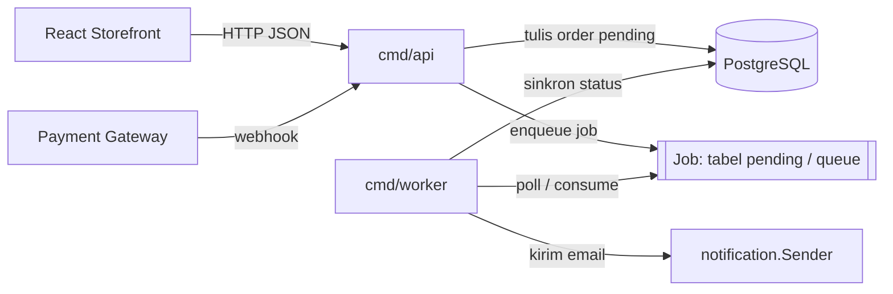
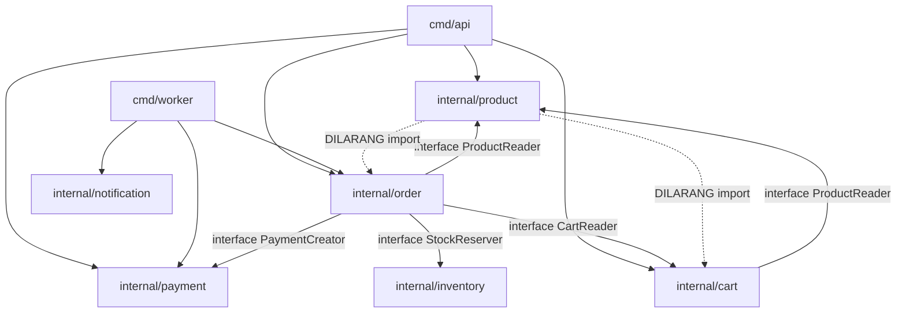
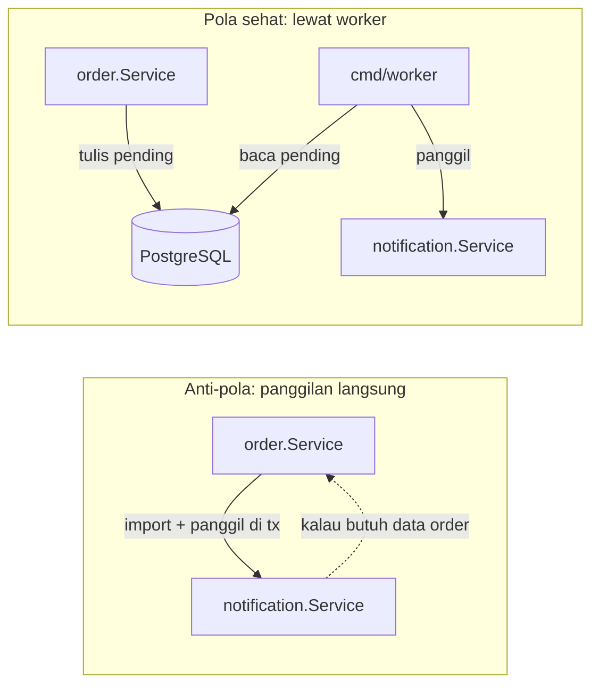
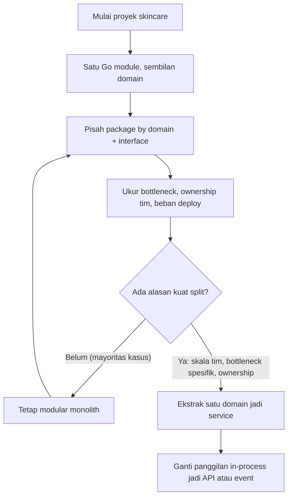

import { Section, Box, Steps, Step, Recap, CardGrid, Card, Chip, Hero, Compare, FileTree, Def } from "@components";

<Hero eyebrow="Roadmap 4 &middot; Clean Backend Architecture" title="Modular Monolith<br /><em>by Domain</em>">
  <p>Kita ubah backend skincare dari kumpulan folder teknis menjadi modul bisnis yang punya batas tegas, satu binary yang mudah dideploy, dan jalur evolusi yang aman menuju service terpisah saat memang dibutuhkan.</p>
  <Fragment slot="meta">
    <Chip icon="code">Bahasa: <b>Go 1.26</b></Chip>
    <Chip icon="stack">Arsitektur: <b>Modular Monolith</b></Chip>
    <Chip icon="package">9 domain bisnis</Chip>
    <Chip icon="clock">~70 menit baca</Chip>
  </Fragment>
</Hero>

<Section num="01" id="intro" title="Kenapa Struktur Folder Ikut Domain?" sub="Folder bukan kosmetik, ia menentukan arah dependency dan kecepatan tim">

<p class="lead">Struktur folder bukan urusan rapi-rapi belaka. Di Go, ia menentukan import path, visibilitas identifier, dan arah dependency, jadi keputusan folder hari ini akan menempel di kode bertahun-tahun.</p>

Di React, kamu mungkin pernah melihat folder `components/`, `hooks/`, dan `services/` membengkak sampai ratusan file, sampai mencari satu fitur berarti membuka empat folder sekaligus. Di Laravel, `app/Http/Controllers`, `app/Services`, `app/Models`, dan `app/Repositories` terasa rapi saat aplikasi kecil. Tetapi di backend bisnis seperti online shop skincare, pertanyaan harian developer biasanya bukan "handler ada di mana", melainkan "fitur checkout ada di mana", "kenapa harga di cart beda dengan harga di order", atau "siapa yang boleh mengurangi stok".

<Def term="modular monolith"><p>Satu aplikasi yang di-deploy sebagai satu unit (satu atau beberapa binary dari satu module), tetapi kode di dalamnya dipecah menjadi modul bisnis dengan boundary tegas yang ditegakkan oleh compiler, bukan sekadar konvensi penamaan folder.</p></Def>

Dalam Go, satu direktori adalah satu package, dan satu package adalah unit visibilitas terkecil. Identifier huruf besar (`Product`) terlihat dari luar package, identifier huruf kecil (`scanProduct`) tidak. Maka struktur folder langsung menjadi struktur arsitektur: kalau kamu menaruh semua kode katalog di `internal/product/`, compiler ikut membantu menjaga agar detail internal katalog tidak bocor ke domain lain. Modul ini mengikuti panduan resmi [Organizing a Go module](https://go.dev/doc/modules/layout) dan [Effective Go](https://go.dev/doc/effective_go), lalu menerapkannya ke sembilan domain proyek skincare: `product`, `cart`, `order`, `payment`, `inventory`, `user`, `promotion`, `review`, dan `notification`.

<Box variant="bridge" icon="🌉" label="Jembatan: dari Laravel MVC dan React feature folder ke Go modular monolith"><p>Di Laravel, folder by-peran teknis sering jadi default bawaan framework. Di React modern, kamu mungkin sudah pindah ke feature folder seperti `features/cart/`. Go mengambil ide feature folder itu lebih jauh: folder domain bukan cuma konvensi, tetapi package yang dipaksakan compiler, sehingga semua file katalog tinggal di `internal/product/` dan tidak bisa diam-diam saling mengintip detail privat antar domain.</p></Box>

<Box variant="note" icon="🧭" label="Posisi chapter ini di Roadmap 4"><p>Di chapter sebelumnya kamu memisahkan tanggung jawab vertikal (handler, service, repository, domain, DTO, infrastructure). Chapter ini menata pemisahan horizontal: bagaimana banyak domain hidup berdampingan dalam satu module tanpa saling membelit. Setelah ini, config, error handling, dan logging tinggal mengisi kerangka domain yang sudah rapi.</p></Box>

</Section>

<Section num="02" id="by-domain-vs-by-layer" title="By Domain, Bukan By Layer Global" sub="Folder utama menjawab area bisnis, layer jadi file di dalamnya">

<p class="lead">By-domain berarti folder tingkat pertama menjawab "fitur bisnis apa", bukan "jenis teknis file apa". Layer (handler, service, repository) tetap ada, tetapi posisinya turun menjadi file di dalam folder domain.</p>

Struktur by-layer global terlihat rapi di hari pertama karena semua handler berkumpul di satu tempat. Masalahnya muncul saat fitur bertambah: untuk memahami satu alur checkout, developer harus membuka `controllers/order_controller.go`, `services/order_service.go`, `repositories/order_repository.go`, dan `models/order.go` yang tersebar jauh. Lebih parah lagi, karena semua handler hidup di package yang sama, tidak ada penghalang teknis yang mencegah `cart_handler` memanggil fungsi internal `payment_service`. Boundary bisnis bocor diam-diam.

Struktur by-domain membalik prioritas. Semua kode `product` tinggal dekat `product`, semua kode `order` tinggal dekat `order`, dan karena tiap domain adalah package terpisah, dependency antar domain menjadi import yang eksplisit dan bisa diatur.

<Compare aLabel="By layer global" bLabel="By domain" aTone="red" bTone="violet">
  <Fragment slot="a"><ul><li>`controllers/`, `services/`, dan `repositories/` global terpisah jauh, satu fitur tersebar di empat folder.</li><li>Folder teknis cepat menjadi gudang besar berisi puluhan file tak berkaitan.</li><li>Semua handler di satu package, jadi boundary bisnis bocor tanpa terlihat.</li><li>Sulit dijawab: "kalau saya hapus fitur review, file mana saja yang ikut hilang?".</li></ul></Fragment>
  <Fragment slot="b"><ul><li>`internal/order/handler.go`, `service.go`, dan `repository.go` tinggal dalam satu domain.</li><li>Developer memahami satu fitur cukup dengan membuka satu folder.</li><li>Dependency antar domain berupa import path yang bisa dibatasi compiler dan linter.</li><li>Mudah dijawab: hapus fitur review berarti hapus `internal/review/` dan satu baris wiring.</li></ul></Fragment>
</Compare>

Sembilan domain skincare di proyek ini punya tanggung jawab yang jelas dan tidak saling tumpang tindih. Inilah peta mental yang akan kita pakai sampai akhir roadmap.

<CardGrid cols={3}>
  <Card><h4>product</h4><p>Katalog, brand, kategori, varian (SKU), harga aktif di `product_variants.price_rupiah`, dan status produk.</p></Card>
  <Card><h4>cart</h4><p>Keranjang customer, item cart, kuantitas, dan validasi ketersediaan sebelum checkout.</p></Card>
  <Card><h4>order</h4><p>Checkout, snapshot harga ke `order_items`, status order, dan riwayat pesanan customer.</p></Card>
  <Card><h4>payment</h4><p>Payment record, webhook gateway, status pembayaran, dan idempotency key.</p></Card>
  <Card><h4>inventory</h4><p>Stok per varian, reservasi saat checkout, pengurangan stok, dan audit pergerakan stok.</p></Card>
  <Card><h4>user</h4><p>Customer dan admin, kredensial, alamat pengiriman, dan profil akun.</p></Card>
  <Card><h4>promotion</h4><p>Voucher, diskon, kampanye, aturan kelayakan, dan masa berlaku promo.</p></Card>
  <Card><h4>review</h4><p>Ulasan produk, rating, moderasi, dan agregasi skor per produk.</p></Card>
  <Card><h4>notification</h4><p>Email order, notifikasi pembayaran, dan template pesan yang dikirim worker.</p></Card>
</CardGrid>

<Box variant="warn" icon="⚠️" label="Jangan buat folder controllers/ global"><p>Godaan terbesar saat datang dari Laravel adalah membuat `internal/controllers/`, `internal/services/`, dan `internal/repositories/` global. Itu menyalin by-layer ke Go dan membuang keuntungan terbesarnya. Layer tetap ada di proyek ini, tetapi sebagai file (`handler.go`, `service.go`, `repository.go`) di dalam folder domain.</p></Box>

</Section>

<Section num="03" id="internal-packages" title="internal/ dan Aturan Visibilitas Go" sub="Direktori bernama internal punya arti khusus yang ditegakkan compiler">

<p class="lead">Folder `internal/` bukan sekadar nama yang kita pilih. Di Go, `internal` adalah kata ajaib yang dimengerti compiler: package di dalamnya hanya boleh di-import oleh kode yang berbagi parent direktori dengan `internal`, bukan oleh project lain.</p>

Artinya, semua package di `internal/` (seperti `internal/product`, `internal/order`) hanya bisa di-import oleh code di dalam module `github.com/kamu/skincare-backend`. Kalau ada orang lain meng-import module-mu untuk dipakai sebagai library, mereka tidak akan bisa menyentuh `internal/`. Ini adalah pagar pertama: detail backend skincare tidak menjadi API publik yang tak sengaja dipakai orang luar dan jadi tak bisa diubah.

```text title="Aturan import internal/"
github.com/kamu/skincare-backend/
  cmd/api/main.go              # BOLEH import internal/* (satu module, di atas internal)
  internal/product/service.go  # BOLEH import internal/order? (lihat section 06)
github.com/orang-lain/app/
  main.go                      # DILARANG import skincare-backend/internal/*
```

Visibilitas Go bekerja di dua lapis yang saling melengkapi. Lapis pertama adalah huruf awal identifier: huruf besar berarti exported (terlihat dari package lain), huruf kecil berarti unexported (terkunci di dalam package). Lapis kedua adalah folder `internal/` yang mengunci seluruh package agar tak bisa di-import dari luar module. Gabungan keduanya membuat kita bisa memilih dengan presisi: apa yang publik untuk seluruh module, apa yang privat untuk satu domain saja.

<Compare aLabel="JS / TS: privasi konvensi" bLabel="Go: privasi ditegakkan compiler" aTone="muted" bTone="violet">
  <Fragment slot="a"><ul><li>Prefix `_privateMethod` atau `#field` di kelas, sebagian hanya konvensi tim.</li><li>Apa yang diekspor diatur `export` di tiap file, mudah lupa atau bocor lewat barrel `index.ts`.</li><li>Tidak ada konsep "package ini hanya untuk internal project" yang dijaga tooling.</li></ul></Fragment>
  <Fragment slot="b"><ul><li>Huruf besar atau kecil pada identifier langsung menentukan visibilitas, dicek compiler.</li><li>Identifier unexported benar-benar tidak bisa disebut dari package lain, bukan sekadar imbauan.</li><li>Folder `internal/` mengunci seluruh package dari import luar module, otomatis.</li></ul></Fragment>
</Compare>

<Box variant="bridge" icon="🌉" label="Jembatan: dari export Laravel dan barrel TypeScript"><p>Di Laravel hampir semua class bersifat publik dan privasi diatur lewat namespace plus disiplin tim. Di TypeScript kamu memilih apa yang muncul lewat `export` dan `index.ts`. Go menggabungkan keduanya menjadi aturan keras: identifier huruf kecil tak terlihat dari luar package, dan folder `internal/` tak terlihat dari luar module. Tidak ada yang bisa "kelupaan diekspor lalu bocor".</p></Box>

<Box variant="tip" icon="💡" label="Pakai internal/ untuk semua kode aplikasi"><p>Letakkan seluruh package aplikasi di bawah `internal/`. Sisakan root module untuk hal yang memang ingin dipublikasikan sebagai library (jarang untuk backend produk). Untuk online shop skincare, praktis semua kode hidup di `internal/`, dan hanya `cmd/` yang berdiri di atasnya sebagai entry point.</p></Box>

</Section>

<Section num="04" id="struktur-proyek" title="Struktur Proyek Skincare Lengkap" sub="Satu repository, satu module Go, sembilan domain plus shared">

<p class="lead">Satu `go.mod` di root, dua entry point di `cmd/`, sembilan domain di `internal/`, dan satu `internal/shared/` kecil untuk kode lintas domain yang benar-benar stabil.</p>

Go module yang bersih meletakkan `go.mod` di root repository, memisahkan command entry point di `cmd/`, dan menaruh seluruh package aplikasi di `internal/`. Tidak semua domain butuh file selengkap product. Domain inti seperti `product`, `cart`, dan `order` punya handler HTTP, service, repository, sampai routes. Domain pendukung seperti `notification` mungkin hanya punya service dan dijalankan worker, tanpa handler HTTP sama sekali. Struktur mengikuti kebutuhan, bukan template seragam.

<FileTree title="Struktur modular monolith skincare" tree={`
skincare-backend/
  cmd/
    api/
      main.go                      # entry point HTTP API (composition root)
    worker/
      main.go                      # entry point background worker
  internal/
    product/                       # domain katalog dan varian (SKU)
      model.go                     # domain model murni, tanpa tag json/sql
      dto.go                       # request dan response DTO (kontrak HTTP)
      handler.go                   # HTTP handler product
      service.go                   # business logic product
      repository.go                # interface repository
      pgx_repository.go            # implementasi repository pgx
      errors.go                    # error domain product
      routes.go                    # binding route product ke chi
    cart/                          # domain keranjang belanja
      model.go
      dto.go
      handler.go
      service.go
      repository.go
      pgx_repository.go
      routes.go
    order/                         # domain checkout dan order
      model.go
      dto.go
      handler.go
      service.go                   # boundary transaksi checkout di sini
      worker.go                    # pemrosesan order pending oleh worker
      repository.go
      pgx_repository.go
      routes.go
    payment/                       # domain pembayaran dan webhook gateway
      model.go
      dto.go
      handler.go                   # termasuk handler webhook
      service.go
      repository.go
      pgx_repository.go
      routes.go
    inventory/                     # domain stok dan reservasi varian
      model.go
      service.go
      repository.go
      pgx_repository.go
    user/                          # domain customer dan admin
      model.go
      service.go
      repository.go
      pgx_repository.go
    promotion/                     # domain voucher dan diskon
      model.go
      service.go
      repository.go
      pgx_repository.go
    review/                        # domain ulasan dan rating produk
      model.go
      service.go
      repository.go
      pgx_repository.go
    notification/                  # domain notifikasi (dipanggil worker)
      model.go
      service.go                   # kirim email order dan pembayaran
      sender.go                    # interface pengirim email
    shared/                        # kode lintas domain yang kecil dan stabil
      config/
        config.go                  # loader environment ke Config struct
      domain/
        id.go                      # UserID, ProductID, OrderID, dst
      errors/
        errors.go                  # error generik lintas domain
      httpx/
        json.go                    # envelope response JSON
      middleware/
        auth.go
        request_id.go
      database/
        pool.go                    # pgxpool.New, Ping
        dbtx.go                    # interface Querier (pool atau tx)
      logger/
        logger.go                  # setup log/slog
  db/
    migrations/
      001_create_products.up.sql
      001_create_products.down.sql
  go.mod
  go.sum
`} />

<Box variant="note" icon="📝" label="Domain tidak harus simetris"><p>Tidak semua domain punya `handler.go`. `notification` dipanggil dari dalam (oleh worker), bukan dari HTTP, jadi ia tidak punya handler maupun routes. `inventory` dan `promotion` dipakai oleh order saat checkout, sehingga sebagian besar aksesnya melalui service domain lain, bukan endpoint langsung. Bentuk folder mengikuti cara domain dipakai.</p></Box>

<Box variant="tip" icon="💡" label="Modular monolith lebih mudah dipecah nanti"><p>Memecah modular monolith yang rapi menjadi microservice jauh lebih murah daripada membongkar monolith acak. Karena boundary sudah berupa package dan interface, mengekstrak `internal/notification` menjadi service terpisah suatu hari nanti berarti mengganti pemanggilan in-process dengan pemanggilan jaringan, bukan menata ulang seluruh kode.</p></Box>

</Section>

<Section num="05" id="entry-point" title="Proses API vs Proses Worker" sub="Dua binary, satu module, domain yang sama dipakai ulang">

<p class="lead">Folder `cmd/` berisi program yang bisa dijalankan, bukan business logic. Proyek skincare punya dua: `cmd/api` melayani HTTP request customer, dan `cmd/worker` menjalankan tugas latar yang tidak boleh memperlambat request.</p>

Memisahkan API dari worker adalah keputusan arsitektur, bukan hanya rapi-rapi file. Request checkout harus cepat: customer menunggu di halaman pembayaran. Mengirim email konfirmasi, memanggil ulang status gateway, atau menulis ke sistem akuntansi adalah tugas lambat yang tidak perlu ditunggu customer. API menulis pekerjaan ke antrian atau ke tabel `pending`, lalu worker mengambilnya di proses terpisah. Keduanya berbagi domain yang sama persis (satu module, satu codebase), hanya entry point dan dependency yang berbeda.



<p class="fig-cap"><b>Gambar 1.</b> API merespons cepat ke customer dan webhook gateway, lalu menitipkan pekerjaan lambat. Worker memprosesnya di proses terpisah, sehingga lonjakan email atau retry gateway tidak pernah memperlambat halaman checkout.</p>

`cmd/api/main.go` adalah composition root: ia boleh tahu semua domain karena tugasnya merakit. Ia membaca config, membuka pool, membangun repository, service, dan handler tiap domain, lalu menyusun router. Domain seperti `internal/product` tidak pernah tahu siapa yang menjalankannya.

```toml title="go.mod"
module github.com/kamu/skincare-backend

go 1.26
```

```go title="cmd/api/main.go"
package main

import (
	"context"
	"errors"
	"log/slog"
	"net/http"
	"os"
	"os/signal"
	"syscall"
	"time"

	"github.com/go-chi/chi/v5"
	"github.com/go-chi/chi/v5/middleware"

	"github.com/kamu/skincare-backend/internal/cart"
	"github.com/kamu/skincare-backend/internal/order"
	"github.com/kamu/skincare-backend/internal/payment"
	"github.com/kamu/skincare-backend/internal/product"
	"github.com/kamu/skincare-backend/internal/shared/config"
	"github.com/kamu/skincare-backend/internal/shared/database"
	"github.com/kamu/skincare-backend/internal/shared/domain"
	"github.com/kamu/skincare-backend/internal/shared/logger"
)

func main() {
	if err := run(); err != nil {
		slog.Error("api fatal", "error", err)
		os.Exit(1)
	}
}

func run() error {
	ctx, stop := signal.NotifyContext(context.Background(), os.Interrupt, syscall.SIGTERM)
	defer stop()

	cfg, err := config.Load()
	if err != nil {
		return err
	}

	log := logger.New(cfg.LogLevel)

	pool, err := database.NewPool(ctx, cfg.DatabaseURL)
	if err != nil {
		return err
	}
	defer pool.Close()

	// --- Wiring per domain: repository -> service -> handler ---
	productRepo := product.NewPostgresRepository(pool)
	productSvc := product.NewService(pool, productRepo)
	productHandler := product.NewHandler(productSvc)

	cartRepo := cart.NewPostgresRepository(pool)
	cartSvc := cart.NewService(pool, cartRepo, productSvc)
	cartHandler := cart.NewHandler(cartSvc)

	paymentRepo := payment.NewPostgresRepository(pool)
	paymentSvc := payment.NewService(pool, paymentRepo)
	paymentHandler := payment.NewHandler(paymentSvc)

	// order butuh membaca product dan cart, serta membuat payment.
	// Ia menerima interface kecil, bukan struct konkret, lihat section 06.
	// productSvc mengembalikan product.Product, sedangkan order.ProductReader
	// minta order.ProductSnapshot, jadi composition root menyisipkan adapter
	// kecil yang memetakan satu tipe ke tipe lainnya (lihat productReaderAdapter).
	orderRepo := order.NewPostgresRepository(pool)
	orderSvc := order.NewService(pool, orderRepo, cartSvc, productReaderAdapter{productSvc}, paymentSvc)
	orderHandler := order.NewHandler(orderSvc)

	r := chi.NewRouter()
	r.Use(middleware.RequestID)
	// middleware.RealIP sudah deprecated di chi v5 (rawan IP spoofing). Untuk server
	// yang berdiri langsung di internet pakai ClientIPFromRemoteAddr; di belakang
	// reverse proxy tepercaya pakai ClientIPFromXFFTrustedProxies(n) sesuai infra.
	r.Use(middleware.ClientIPFromRemoteAddr)
	r.Use(middleware.Recoverer)

	r.Route("/v1", func(r chi.Router) {
		productHandler.Routes(r)
		cartHandler.Routes(r)
		orderHandler.Routes(r)
		paymentHandler.Routes(r)
	})

	srv := &http.Server{
		Addr:              cfg.HTTPAddr,
		Handler:           r,
		ReadHeaderTimeout: 5 * time.Second,
	}

	go func() {
		<-ctx.Done()
		shutdownCtx, cancel := context.WithTimeout(context.Background(), 10*time.Second)
		defer cancel()
		if err := srv.Shutdown(shutdownCtx); err != nil {
			log.Error("graceful shutdown", "error", err)
		}
	}()

	log.Info("api listening", "addr", cfg.HTTPAddr)
	if err := srv.ListenAndServe(); err != nil && !errors.Is(err, http.ErrServerClosed) {
		return err
	}
	return nil
}

// productReaderAdapter membungkus *product.Service agar memenuhi order.ProductReader.
// product.Service mengembalikan product.Product dan product.Variant (model katalog),
// sedangkan order minta order.ProductSnapshot (potret sempit untuk checkout).
// Adapter inilah satu-satunya tempat pemetaan ke ProductSnapshot terjadi: nama dari
// Product, sedangkan harga, SKU, dan variantID dari Variant (price_rupiah ada di varian).
type productReaderAdapter struct {
	svc *product.Service
}

func (a productReaderAdapter) GetProduct(ctx context.Context, id domain.ProductID) (order.ProductSnapshot, error) {
	p, err := a.svc.GetProduct(ctx, id)
	if err != nil {
		return order.ProductSnapshot{}, err
	}
	v, err := a.svc.GetSellableVariant(ctx, id)
	if err != nil {
		return order.ProductSnapshot{}, err
	}
	return order.ProductSnapshot{
		ProductID:   p.ID,
		VariantID:   v.ID,
		Name:        p.Name,
		SKU:         v.SKU,
		PriceRupiah: v.PriceRupiah,
		IsActive:    p.Status == "active" && v.IsActive,
	}, nil
}
```

<Box variant="note" icon="🔌" label="Adapter Product ke ProductSnapshot tinggal di composition root"><p>Karena `product.Service.GetProduct` mengembalikan `product.Product` sedangkan `order.ProductReader` minta `order.ProductSnapshot`, pemetaannya kita taruh di `productReaderAdapter` di `cmd/api`, bukan di domain. Order tetap polos terhadap product, product tetap polos terhadap order, dan satu-satunya tempat yang tahu kedua bentuk adalah entry point yang memang bertugas merakit.</p></Box>

<Box variant="warn" icon="⚠️" label="middleware.RealIP sudah deprecated di chi v5"><p>Sejak chi v5.3, `middleware.RealIP` deprecated karena rawan IP spoofing. Untuk server yang berdiri langsung di internet pakai `middleware.ClientIPFromRemoteAddr`. Di belakang reverse proxy tepercaya (mis. CloudFront atau ALB) pakai `middleware.ClientIPFromXFFTrustedProxies(n)` dengan n jumlah proxy, lalu baca hasilnya lewat `middleware.GetClientIP(ctx)`. Pilih sesuai bentuk infrastruktur, jangan asal pakai yang menerima header dari client mentah-mentah.</p></Box>

`cmd/worker/main.go` memakai domain yang sama, tetapi entry point berbeda. Ia tidak meng-import `net/http`, chi, route, atau handler sama sekali. Background job tidak perlu tahu apa pun soal HTTP, dan kalau worker rontok, API tetap melayani customer.

```go title="cmd/worker/main.go"
package main

import (
	"context"
	"log/slog"
	"os"
	"os/signal"
	"syscall"
	"time"

	"github.com/kamu/skincare-backend/internal/notification"
	"github.com/kamu/skincare-backend/internal/order"
	"github.com/kamu/skincare-backend/internal/payment"
	"github.com/kamu/skincare-backend/internal/shared/config"
	"github.com/kamu/skincare-backend/internal/shared/database"
	"github.com/kamu/skincare-backend/internal/shared/logger"
)

func main() {
	ctx, stop := signal.NotifyContext(context.Background(), os.Interrupt, syscall.SIGTERM)
	defer stop()

	cfg, err := config.Load()
	if err != nil {
		slog.Error("load config", "error", err)
		os.Exit(1)
	}

	log := logger.New(cfg.LogLevel)

	pool, err := database.NewPool(ctx, cfg.DatabaseURL)
	if err != nil {
		log.Error("open pool", "error", err)
		os.Exit(1)
	}
	defer pool.Close()

	// Worker merakit dependency yang ia butuh saja: tidak ada handler, tidak ada chi.
	paymentRepo := payment.NewPostgresRepository(pool)
	paymentSvc := payment.NewService(pool, paymentRepo)

	emailSender := notification.NewSMTPSender(cfg.SMTP)
	notifySvc := notification.NewService(emailSender)

	orderRepo := order.NewPostgresRepository(pool)
	orderWorker := order.NewWorker(pool, orderRepo, paymentSvc, notifySvc)

	ticker := time.NewTicker(5 * time.Second)
	defer ticker.Stop()

	log.Info("worker started")
	for {
		select {
		case <-ctx.Done():
			log.Info("worker stopped")
			return
		case <-ticker.C:
			if err := orderWorker.ProcessPendingOrders(ctx); err != nil {
				log.Error("process pending orders", "error", err)
			}
		}
	}
}
```

<Box variant="bridge" icon="🌉" label="Jembatan: dari queue:work Laravel dan BullMQ ke worker Go"><p>Di Laravel kamu menjalankan `php artisan queue:work` sebagai proses terpisah, dan di Node kamu menyalakan worker BullMQ di proses sendiri. Idenya sama: API menaruh job, worker memprosesnya. Bedanya, di Go kedua proses adalah binary dari satu codebase yang sama (`go build ./cmd/api` dan `go build ./cmd/worker`), jadi domain dan model tidak terduplikasi, tetapi runtime-nya benar-benar terpisah.</p></Box>

<Box variant="tip" icon="💡" label="Composition root di cmd/, bukan di domain"><p>Biarkan seluruh wiring dependency hidup di `cmd/api/main.go` dan `cmd/worker/main.go`. Domain package menerima dependency lewat constructor (`NewService(...)`), bukan membuat pool database atau membaca environment sendiri. Ini membuat domain bisa dites dengan fake dan dipakai ulang oleh API maupun worker tanpa perubahan.</p></Box>

</Section>

<Section num="06" id="batasan-domain" title="Batasan Antar Domain lewat Interface" sub="Domain tingkat tinggi memakai interface kecil, bukan struct konkret tetangga">

<p class="lead">Boundary yang baik bukan sekadar folder terpisah, tetapi aturan: domain mana boleh import domain mana, dan dalam bentuk apa. Kunci agar dependency tetap longgar adalah interface kecil yang dideklarasikan di sisi pemakai.</p>

Dalam proyek skincare, `internal/product` berdiri paling rendah: ia tidak import domain lain karena katalog tidak perlu tahu soal cart atau order. Sebaliknya, `internal/order` berada lebih tinggi karena checkout perlu membaca product, membaca cart, dan membuat payment. Arah dependency mengikuti alur bisnis: yang lebih tinggi boleh bergantung pada yang lebih rendah, tidak boleh sebaliknya.



<p class="fig-cap"><b>Gambar 2.</b> Entry point boleh merakit semua domain. Antar domain, dependency mengalir satu arah dari tinggi ke rendah lewat interface kecil. Product di paling rendah tidak boleh mengenal cart atau order.</p>

Trik idiomatik Go adalah mendeklarasikan interface di package yang memakainya, bukan di package yang mengimplementasikannya. `order` mendefinisikan `ProductReader` berisi hanya method yang ia butuhkan, lalu sebuah adapter kecil di composition root yang memenuhinya. Penting dicatat: `order.ProductReader.GetProduct` mengembalikan `order.ProductSnapshot` (potret sempit yang relevan untuk checkout), sedangkan `product.Service.GetProduct` mengembalikan `product.Product` (model penuh katalog). Karena return type berbeda, `*product.Service` tidak otomatis memenuhi `order.ProductReader`. Inilah pekerjaan adapter: ia memetakan `product.Product` menjadi `order.ProductSnapshot` di `cmd/api`, sehingga `order` tetap cukup tahu kontrak sempit ini tanpa import detail product.

```go title="internal/product/service.go"
package product

import (
	"context"

	"github.com/jackc/pgx/v5/pgxpool"

	"github.com/kamu/skincare-backend/internal/shared/database"
	"github.com/kamu/skincare-backend/internal/shared/domain"
)

type Repository interface {
	FindByID(ctx context.Context, db database.Querier, id domain.ProductID) (Product, error)
	FindSellableVariant(ctx context.Context, db database.Querier, id domain.ProductID) (Variant, error)
	ListActive(ctx context.Context, db database.Querier, filter ListFilter) ([]Product, error)
}

type Service struct {
	pool *pgxpool.Pool
	repo Repository
}

func NewService(pool *pgxpool.Pool, repo Repository) *Service {
	return &Service{pool: pool, repo: repo}
}

// GetProduct dikembalikan sebagai struct konkret Product (model penuh katalog).
func (s *Service) GetProduct(ctx context.Context, id domain.ProductID) (Product, error) {
	return s.repo.FindByID(ctx, s.pool, id)
}

// GetSellableVariant mengembalikan varian aktif yang siap dijual untuk sebuah
// produk, lengkap dengan harga rupiah. Harga hidup di Variant (product_variants),
// bukan di Product, sesuai skema kanonik proyek (lihat R3C10).
func (s *Service) GetSellableVariant(ctx context.Context, id domain.ProductID) (Variant, error) {
	return s.repo.FindSellableVariant(ctx, s.pool, id)
}
```

```go title="internal/order/service.go"
package order

import (
	"context"

	"github.com/jackc/pgx/v5/pgxpool"

	"github.com/kamu/skincare-backend/internal/shared/domain"
)

// ProductReader adalah interface yang DIDEFINISIKAN order, bukan product.
// Order hanya butuh membaca harga dan status produk saat checkout.
type ProductReader interface {
	GetProduct(ctx context.Context, id domain.ProductID) (ProductSnapshot, error)
}

// CartReader dan PaymentCreator dideklarasikan dengan cara yang sama:
// sempit, sesuai kebutuhan order, dipenuhi service tetangga secara implisit.
type CartReader interface {
	GetActiveCart(ctx context.Context, userID domain.UserID) (CheckoutCart, error)
}

type PaymentCreator interface {
	CreatePayment(ctx context.Context, orderID domain.OrderID, amountRupiah int64) (domain.PaymentID, error)
}

type Service struct {
	pool    *pgxpool.Pool
	repo    Repository
	product ProductReader
	cart    CartReader
	payment PaymentCreator
}

func NewService(pool *pgxpool.Pool, repo Repository, cart CartReader, product ProductReader, payment PaymentCreator) *Service {
	return &Service{pool: pool, repo: repo, cart: cart, product: product, payment: payment}
}
```

Perhatikan satu detail penting yang menyelaraskan modul ini dengan skema kanonik proyek: harga dibawa sebagai `int64` rupiah (`amountRupiah int64`, `ProductSnapshot.PriceRupiah`), bukan `float64` dan bukan satuan cent. Saat checkout, order menyalin harga ke `order_items.unit_price_rupiah` sebagai snapshot, agar perubahan harga katalog di masa depan tidak mengubah harga order yang sudah jadi.

```go title="internal/order/model.go"
package order

import "github.com/kamu/skincare-backend/internal/shared/domain"

// ProductSnapshot adalah potret produk yang order butuhkan saat checkout.
// Order tidak mengenal seluruh Product, cukup yang relevan untuk harga dan validasi.
type ProductSnapshot struct {
	ProductID   domain.ProductID
	VariantID   domain.VariantID
	Name        string
	SKU         string
	PriceRupiah int64 // integer rupiah, bukan float, bukan cent
	IsActive    bool
}
```

<Box variant="bridge" icon="🌉" label="Jembatan: interface di sisi pemakai vs interface dekat implementasi"><p>Di Java dan PHP, interface biasanya didefinisikan dekat implementasinya lalu disuntik ke pemakai (`PaymentGatewayInterface` di samping `MidtransPaymentGateway`). Di Go idiomnya terbalik: pemakai (`order`) mendeklarasikan interface sekecil yang ia butuh, dan implementasi (`payment.Service`) memenuhinya tanpa tahu interface itu ada. Hasilnya, `order` tidak terikat pada bentuk lengkap `payment`, hanya pada satu method yang benar-benar ia pakai.</p></Box>

<Box variant="tip" icon="💡" label="Interface kecil, satu sampai tiga method"><p>Semakin kecil interface, semakin longgar ikatan antar domain dan semakin murah membuat fake saat test. `ProductReader` dengan satu method jauh lebih sehat daripada meng-import seluruh `*product.Service`. Kalau order hanya butuh membaca produk, jangan beri ia akses ke create, update, dan archive product.</p></Box>

</Section>

<Section num="07" id="dependency-cycle" title="Menghindari Dependency Cycle" sub="Go menolak import melingkar saat compile, dan itu sinyal desain">

<p class="lead">Go tidak mengizinkan dua package saling import. Kalau `product` import `order` dan `order` import `product`, build langsung gagal. Ini terasa kaku saat datang dari JS atau PHP, tetapi sebenarnya pagar pengaman yang memaksa arah dependency tetap satu arah.</p>

Cycle paling sering muncul dari niat baik: "order butuh memanggil method di product, dan kebetulan product juga butuh satu method di order". Begitu keduanya saling import, compiler menolak. Pesannya jelas dan tidak bisa diakali.

```text title="Terminal: error import cycle"
package github.com/kamu/skincare-backend/cmd/api
	imports github.com/kamu/skincare-backend/internal/order
	imports github.com/kamu/skincare-backend/internal/product
	imports github.com/kamu/skincare-backend/internal/order: import cycle not allowed
```

Ada tiga cara sehat memutus cycle, dari yang paling sering dipakai ke yang paling jarang. Pilih sesuai bentuk masalahnya, jangan langsung lompat ke shared package.

<Steps>
  <Step><b>Balikkan dependency dengan interface di pemakai</b><p>Kalau `order` butuh `product`, biarkan `order` mendeklarasikan `ProductReader` dan `product` memenuhinya. `product` tidak perlu import `order` sama sekali. Ini menyelesaikan mayoritas kasus.</p></Step>
  <Step><b>Pindahkan tipe bersama ke shared/domain</b><p>Kalau dua domain butuh tipe yang sama (`OrderID`, `ProductID`, `Money`), taruh tipe itu di `internal/shared/domain`. Keduanya import shared, bukan saling import.</p></Step>
  <Step><b>Komunikasi lewat event, bukan panggilan langsung</b><p>Kalau `order` perlu memberi tahu `notification` saat checkout selesai, jangan import `notification` dari dalam transaksi. Terbitkan event, dan biarkan worker memanggil `notification`. Ini memutus ikatan sekaligus memisahkan tugas lambat.</p></Step>
</Steps>

Contoh nyata kasus ketiga di proyek skincare: setelah order dibuat, customer perlu menerima email konfirmasi. Godaannya adalah `order.Service` langsung import `notification.Service` dan memanggilnya di dalam transaksi checkout. Itu mengikat order ke notification, memperlambat checkout, dan kalau SMTP lambat, customer ikut menunggu. Solusi yang lebih bersih: order hanya menulis baris ke tabel pending, lalu worker yang memanggil notification.



<p class="fig-cap"><b>Gambar 3.</b> Kiri, order dan notification saling import dan checkout melambat. Kanan, order hanya menulis pekerjaan, worker yang memanggil notification, sehingga tidak ada cycle dan checkout tetap cepat.</p>

<Box variant="warn" icon="⚠️" label="Cycle adalah sinyal desain, bukan sekadar error compiler"><p>Saat Go menolak import cycle, jangan reflek menumpuk semua tipe ke satu package raksasa hanya agar compile. Tanya dulu: kenapa dua domain ini saling membutuhkan? Biasanya jawabannya adalah salah satu arah harusnya lewat interface atau event. Compiler sedang menunjukkan boundary yang keliru, bukan menghalangi.</p></Box>

<Box variant="bridge" icon="🌉" label="Jembatan: circular import di JS dan PHP yang diam-diam lolos"><p>Di JavaScript, circular import sering lolos saat bundling lalu meledak jadi `undefined` saat runtime yang sulit dilacak. Di PHP dengan autoload, dua class bisa saling pakai tanpa keluhan sampai urutan inisialisasi bermasalah. Go menolaknya di compile time, jadi masalah desain ketahuan saat `go build`, bukan jam tiga pagi di produksi.</p></Box>

</Section>

<Section num="08" id="shared-package" title="internal/shared untuk Kode Bersama" sub="Laci kecil untuk konsep lintas domain, bukan tempat buang helper">

<p class="lead">`internal/shared/` adalah laci kecil untuk konsep yang benar-benar lintas domain, stabil, dan tidak membawa aturan bisnis spesifik. Ia bukan tempat sampah untuk fungsi yang bingung ditaruh di mana.</p>

Kode yang layak masuk `shared` punya tiga ciri: dipakai banyak domain, jarang berubah, dan tidak memuat logika bisnis satu domain tertentu. Contohnya tipe ID kustom (`UserID`, `ProductID`), error generik, envelope response JSON, middleware auth, config loader, logger, dan pool PostgreSQL. Kalau sebuah fungsi hanya dipakai order, ia milik `internal/order`, bukan `shared`.

```go title="internal/shared/domain/id.go"
package domain

import "fmt"

type UserID int64
type ProductID int64
type VariantID int64
type OrderID int64
type CartID int64
type PaymentID int64

func NewProductID(v int64) (ProductID, error) {
	if v <= 0 {
		return 0, fmt.Errorf("product id must be positive")
	}
	return ProductID(v), nil
}

func (id ProductID) Int64() int64 {
	return int64(id)
}

func (id UserID) Int64() int64 {
	return int64(id)
}
```

Tipe ID kustom ini adalah investasi kecil dengan hasil besar. Karena `UserID` dan `ProductID` adalah tipe berbeda di mata compiler, kamu tidak bisa tidak sengaja mengoper `UserID` ke fungsi yang minta `ProductID`. Bug klasik "tertukar argumen" yang di JS dan PHP baru ketahuan saat data salah, di Go gagal saat compile.

```go title="internal/product/model.go"
package product

import (
	"time"

	"github.com/kamu/skincare-backend/internal/shared/domain"
)

// Product memetakan tabel products. Harga TIDAK di sini, melainkan di
// product_variants.price_rupiah, sesuai skema kanonik proyek (lihat R3C10).
type Product struct {
	ID          domain.ProductID
	BrandID     int64
	CategoryID  int64
	Name        string
	Slug        string
	Description string
	Status      string // draft, active, archived
	CreatedAt   time.Time
	UpdatedAt   time.Time
	DeletedAt   *time.Time
}

// Variant adalah SKU yang benar-benar dijual, lengkap dengan harga rupiah.
type Variant struct {
	ID          domain.VariantID
	ProductID   domain.ProductID
	SKU         string
	PriceRupiah int64 // integer rupiah, bukan float, bukan cent
	IsActive    bool
}
```

DTO (kontrak HTTP) terpisah dari model domain dan tetap memakai `price_rupiah` di tag JSON, sehingga frontend React menerima angka rupiah utuh tanpa konversi.

```go title="internal/product/dto.go"
package product

type CreateVariantRequest struct {
	ProductID   int64  `json:"product_id"`
	SKU         string `json:"sku"`
	PriceRupiah int64  `json:"price_rupiah"`
}

type VariantResponse struct {
	ID          int64  `json:"id"`
	ProductID   int64  `json:"product_id"`
	SKU         string `json:"sku"`
	PriceRupiah int64  `json:"price_rupiah"`
	IsActive    bool   `json:"is_active"`
}
```

<Box variant="bridge" icon="🌉" label="Jembatan: dari branded type TypeScript ke tipe ID Go"><p>`type ProductID int64` mirip branded type di TypeScript (`type ProductID = number & { __brand: 'ProductID' }`). Bedanya, di TypeScript brand hanya hidup saat type-check dan hilang di runtime, sedangkan di Go ia tipe nyata yang dicek compiler sepenuhnya. `UserID` tidak akan pernah lolos sebagai `ProductID` tanpa konversi eksplisit, di compile time maupun runtime.</p></Box>

<Box variant="warn" icon="⚠️" label="Hindari shared/utils"><p>Nama `utils`, `helpers`, atau `common` hampir selalu terlalu kabur dan jadi magnet untuk segala fungsi tak bertuan. Pilih nama package yang menjelaskan tanggung jawab: `httpx`, `database`, `domain`, `config`, `logger`, `middleware`. Kalau sebuah package isinya bermacam-macam hal tak berkaitan, itu tanda boundary-nya salah.</p></Box>

</Section>

<Section num="09" id="modul-independen" title="Menjaga Modul Tetap Independen" sub="Tes lakmus: bisakah satu domain dipindahkan tanpa menyeret yang lain?">

<p class="lead">Modul yang independen adalah modul yang bisa kamu pahami, ubah, tes, dan suatu hari ekstrak menjadi service, tanpa menyentuh domain lain. Independensi tidak datang otomatis dari folder terpisah, ia dijaga dengan beberapa disiplin konkret.</p>

Ada empat pemeriksaan yang bisa kamu jalankan untuk menilai apakah sebuah domain benar-benar independen. Kalau salah satu gagal, boundary-nya bocor dan perlu dirapikan.

<CardGrid cols={2}>
  <Card><h4>Import mengalir satu arah</h4><p>Domain rendah (`product`) tidak boleh import domain tinggi (`order`). Cek dengan `go list` atau linter import. Arah yang konsisten mencegah bola benang kusut.</p></Card>
  <Card><h4>Komunikasi lewat interface sempit</h4><p>Saat domain butuh tetangga, ia memakai interface kecil yang ia deklarasikan sendiri, bukan struct konkret. Ini membuat tetangga bisa diganti fake saat test.</p></Card>
  <Card><h4>Tipe pgx dan HTTP tidak bocor</h4><p>`pgx.ErrNoRows` dan detail SQL berhenti di `pgx_repository.go`. Detail HTTP berhenti di `handler.go`. Service murni aturan bisnis, bisa dipakai API dan worker.</p></Card>
  <Card><h4>Bisa dites tanpa domain lain</h4><p>`go test ./internal/order/...` lulus tanpa menyalakan product atau payment asli, karena keduanya digantikan fake yang memenuhi interface order.</p></Card>
</CardGrid>

Tes lakmus paling tajam adalah pertanyaan ekstraksi: kalau suatu hari `notification` harus menjadi service terpisah, apa yang berubah? Pada modular monolith yang sehat, jawabannya sempit: ganti pemanggilan `notifySvc.SendOrderConfirmation(...)` di worker dengan pemanggilan HTTP atau publish ke message broker, dan pindahkan folder `internal/notification` ke repository baru. Karena order tidak pernah import notification langsung (lihat section 07), order tidak ikut berubah sama sekali.

```bash title="Terminal: periksa kemandirian domain"
# Domain rendah tidak boleh import domain tinggi
go list -deps ./internal/product/... | grep "internal/order" && echo "BOCOR: product import order"

# Service dan handler tidak boleh import pgx
grep -rn "jackc/pgx" internal/order/service.go internal/order/handler.go

# Tiap domain bisa dites mandiri dengan fake
go test ./internal/order/...
```

<Box variant="bridge" icon="🌉" label="Jembatan: dari modul npm internal ke domain Go"><p>Di monorepo JS, kamu mungkin memecah kode ke package internal (`@app/cart`, `@app/order`) dan mengatur dependency lewat `package.json`. Domain Go mencapai tujuan serupa dengan package dan import, tetapi tanpa overhead tooling monorepo. Compiler dan `go list` adalah alat audit dependency bawaan, jadi kamu tidak perlu Nx atau Turborepo untuk menjaga boundary.</p></Box>

<Box variant="tip" icon="💡" label="Tegakkan boundary dengan linter, bukan cuma niat"><p>Niat baik mudah luntur saat deadline mepet. Pasang linter import (seperti aturan depguard di golangci-lint) yang menolak `internal/product` mengimport `internal/order`. Boundary yang ditegakkan tooling bertahan lebih lama daripada boundary yang hanya ditulis di dokumen onboarding.</p></Box>

</Section>

<Section num="10" id="bukan-microservices-dulu" title="Kenapa Bukan Microservices Dulu?" sub="Microservice memisahkan deployment, bukan otomatis memperbaiki desain domain">

<p class="lead">Microservice memberi pemisahan deployment dan skalabilitas independen, tetapi ia tidak otomatis memperbaiki desain domain. Boundary yang buruk di monolith akan tetap buruk saat dipecah, hanya pindah dari import menjadi panggilan jaringan yang lebih mahal di-debug.</p>

Untuk online shop skincare tahap awal, modular monolith memberi boundary kode tanpa menambah biaya operasional microservice. Kamu tetap punya satu binary API, satu pipeline deploy, satu jalur observability, dan yang terpenting satu transaction boundary. Checkout yang menyentuh cart, inventory, order, dan payment bisa berjalan dalam satu transaksi database lokal yang atomik. Di microservice, transaksi lintas service butuh saga atau outbox pattern yang jauh lebih rumit.

<Compare aLabel="Langsung microservices" bLabel="Mulai modular monolith" aTone="red" bTone="teal">
  <Fragment slot="a"><ul><li>Butuh service discovery, network call, retry, timeout, dan tracing terdistribusi sejak hari pertama.</li><li>Debug satu checkout berarti menyusuri log di banyak service dan proses berbeda.</li><li>Transaksi lintas service butuh saga atau outbox, jauh lebih sulit dari `BEGIN; COMMIT`.</li><li>Tim kecil menghabiskan waktu mengurus infrastruktur, bukan fitur bisnis skincare.</li></ul></Fragment>
  <Fragment slot="b"><ul><li>Boundary domain tetap tegas lewat package, interface, dan import policy.</li><li>Debug sederhana karena API berjalan sebagai satu proses dengan satu jalur log.</li><li>Checkout atomik dalam satu transaksi PostgreSQL lokal.</li><li>Split ke service dilakukan setelah boundary terbukti stabil dan ada alasan nyata.</li></ul></Fragment>
</Compare>

Split menjadi service terpisah layak dipertimbangkan saat ada alasan kuat, bukan karena tren. Pertanyaan keputusannya sederhana: apakah masalahnya benar-benar butuh proses terpisah, atau cukup package terpisah yang sudah kamu punya?



<p class="fig-cap"><b>Gambar 4.</b> Microservice adalah keputusan evolusi yang dipicu data, bukan titik awal wajib. Karena boundary sudah berupa package dan interface, langkah split menjadi terukur, bukan operasi besar.</p>

<Box variant="tip" icon="💡" label="Aturan praktis"><p>Selama tim masih kecil, domain checkout masih sering berubah, dan satu instance masih sanggup menampung beban, modular monolith hampir selalu lebih murah, lebih mudah diuji, dan lebih cepat diubah. Pisahkan service saat ada angka yang menuntutnya, bukan saat ada rapat yang membahasnya.</p></Box>

<Box variant="note" icon="🧭" label="Yang dipindahkan microservice pertama biasanya domain pendukung"><p>Kalau memang harus mulai memecah, domain yang paling cocok diekstrak duluan biasanya yang paling longgar dan paling beda profil bebannya, seperti `notification` (banyak I/O lambat) atau `review` (banyak read, beda skala). Domain inti transaksional seperti `order` dan `payment` justru paling untung tetap berdekatan dalam satu transaksi.</p></Box>

</Section>

<Section num="11" id="hands-on" title="Hands-on: Refactor ke Modular Monolith" sub="Pindahkan struktur by-layer menjadi by-domain tanpa mengubah behavior API">

<p class="lead">Latihan ini memindahkan struktur by-layer menjadi by-domain selangkah demi selangkah, lalu memakai compiler dan test sebagai jaring pengaman agar tidak ada behavior API yang berubah.</p>

<Steps>
  <Step><b>Siapkan kerangka folder</b><p>Buat `cmd/api`, `cmd/worker`, folder tiap domain di `internal/`, dan `internal/shared/` untuk kode lintas domain.</p></Step>
  <Step><b>Pindahkan model domain murni</b><p>Pindahkan struct domain ke `model.go` tiap domain. Lepas tag json dan sql dari model domain inti, biarkan tag json hidup di `dto.go`.</p></Step>
  <Step><b>Pisahkan DTO ke boundary</b><p>Taruh request dan response struct di `dto.go` karena ia kontrak HTTP yang berubah mengikuti client, bukan domain model yang berubah mengikuti bisnis. Pastikan harga tetap `price_rupiah`.</p></Step>
  <Step><b>Deklarasikan interface di sisi pemakai</b><p>Untuk dependency antar domain, deklarasikan interface kecil di domain yang memakai (`order` mendeklarasikan `ProductReader`), bukan di domain yang mengimplementasi.</p></Step>
  <Step><b>Rakit dependency di entry point</b><p>Biarkan `cmd/api/main.go` membangun repository, service, handler, dan route. Biarkan `cmd/worker/main.go` membangun hanya yang dibutuhkan worker.</p></Step>
  <Step><b>Putus cycle dengan event</b><p>Kalau muncul import cycle (mis. order dan notification), pindahkan komunikasi ke worker lewat tabel pending, jangan saling import langsung.</p></Step>
  <Step><b>Verifikasi dengan compiler dan test</b><p>Jalankan `go build ./...` dan `go test ./...` untuk menangkap import cycle, unused import, dan boundary yang bocor.</p></Step>
</Steps>

```bash title="Terminal"
mkdir -p cmd/api cmd/worker
mkdir -p internal/{product,cart,order,payment,inventory,user,promotion,review,notification}
mkdir -p internal/shared/{config,domain,errors,httpx,middleware,database,logger}

go build ./...
go test ./...
```

Import policy berikut menjadi kontrak tim. Tuliskan di README proyek dan tegakkan dengan linter agar tidak luntur seiring waktu.

```text title="Import policy proyek skincare"
BOLEH   cmd/api          -> semua internal/* (composition root)
BOLEH   cmd/worker       -> order, payment, notification, shared/*
BOLEH   internal/order   -> internal/product   (lewat interface ProductReader)
BOLEH   internal/order   -> internal/cart      (lewat interface CartReader)
BOLEH   internal/order   -> internal/inventory (lewat interface StockReserver)
BOLEH   internal/cart    -> internal/product   (validasi produk aktif)
BOLEH   semua domain     -> internal/shared/*  (id, errors, httpx, database)

JANGAN  internal/product   -> internal/order, internal/cart   (arah terbalik)
JANGAN  internal/shared/*  -> internal/<domain bisnis apa pun> (shared di paling bawah)
JANGAN  internal/order     -> internal/notification            (pakai event via worker)
JANGAN  internal/*/service.go -> jackc/pgx                      (pgx hanya di pgx_repository.go)
```

<Box variant="note" icon="🧭" label="Checkpoint"><p>Setelah refactor, seorang developer baru harus bisa membuka `internal/order/` dan memahami alur checkout dari satu folder, tanpa berburu file di `controllers/`, `services/`, dan `repositories/` global. Kalau itu tercapai, refactor berhasil.</p></Box>

<Box variant="tip" icon="💡" label="Refactor selangkah, build sering"><p>Jangan pindahkan semua domain sekaligus. Pindahkan satu domain (mulai dari `product` yang paling rendah), jalankan `go build ./...`, lalu lanjut ke domain berikutnya yang bergantung padanya. Compiler Go cepat, manfaatkan ia sebagai pasangan refactor yang langsung memberi tahu saat ada import yang rusak.</p></Box>

</Section>

<Section num="12" id="jebakan-umum" title="Jebakan Umum" sub="Boundary setengah hati lebih buruk daripada tidak ada boundary sama sekali">

<p class="lead">Sebagian besar masalah modular monolith datang dari boundary yang dibuat setengah jalan: folder sudah dipisah, tetapi disiplin import dan layer belum ditegakkan. Inilah pola yang paling sering muncul saat datang dari ekosistem ORM dan framework penuh.</p>

<CardGrid cols={2}>
  <Card><h4>shared/ terlalu gemuk</h4><p>Kalau hampir semua package import `shared/utils`, kamu hanya memindahkan monolith acak ke folder bernama shared. Isi shared hanya yang stabil dan benar-benar lintas domain.</p></Card>
  <Card><h4>Domain saling import langsung</h4><p>`order` import struct konkret `*product.Service` dan `product` balik import `order` akan berakhir sebagai import cycle. Pakai interface kecil di sisi pemakai.</p></Card>
  <Card><h4>Handler menyimpan business logic</h4><p>Handler boleh parse request dan tulis response, tetapi aturan diskon, stok, dan transisi status order tetap di service, bukan di handler.</p></Card>
  <Card><h4>pgx bocor ke handler dan service</h4><p>Handler dan service tidak boleh tahu `pgx.ErrNoRows`, nama tabel, atau SQL. Detail itu berhenti di `pgx_repository.go`.</p></Card>
  <Card><h4>DTO dipakai sebagai domain model</h4><p>DTO berubah mengikuti API client, domain model berubah mengikuti aturan bisnis. Menyatukannya membuat perubahan API merembet ke logika bisnis.</p></Card>
  <Card><h4>Satuan cent menyusup dari template</h4><p>Skema kanonik proyek memakai `price_rupiah int64` dan field domain `PriceRupiah int64`. Uang adalah integer rupiah utuh (mis. 185000), tidak pernah float dan tidak pernah dipecah ke satuan cent.</p></Card>
  <Card><h4>Worker meng-import handler</h4><p>`cmd/worker` tidak butuh chi, route, atau handler. Kalau worker menyeret `net/http`, pemisahan API dan worker sudah bocor.</p></Card>
  <Card><h4>Microservice terlalu cepat</h4><p>Memecah ke banyak service sebelum boundary package rapi hanya memindahkan kekacauan dari import ke jaringan, dengan biaya operasional yang jauh lebih mahal.</p></Card>
</CardGrid>

<Box variant="warn" icon="⚠️" label="Folder rapi bukan jaminan boundary rapi"><p>Memisahkan folder per domain adalah langkah pertama, bukan terakhir. Tanpa disiplin arah import, interface kecil, dan layer yang tidak bocor, kamu hanya punya monolith acak dengan folder yang terlihat rapi. Boundary nyata ditegakkan compiler dan linter, bukan oleh struktur folder semata.</p></Box>

<Box variant="bridge" icon="🌉" label="Jembatan: dari feature folder React yang cuma konvensi"><p>Di React, `features/cart/` adalah konvensi yang mudah dilanggar: tidak ada yang mencegah `features/order/` meng-import detail internal `features/cart/`. Go menaikkan ide yang sama ke tingkat compiler. Identifier unexported dan folder `internal/` membuat pelanggaran boundary gagal saat build, bukan ditemukan saat code review yang mungkin terlewat.</p></Box>

</Section>

<Section num="13" id="ringkasan" title="Ringkasan & Poin Penting">

<p class="lead">Modular monolith membuat proyek skincare tetap satu aplikasi yang mudah dideploy, tetapi tidak menjadi satu gumpalan kode yang mustahil diubah. Folder mengikuti domain, dependency mengalir satu arah, dan compiler ikut menjaga boundary.</p>

<Recap title="Yang Wajib Menempel">
  <ul>
    <li>Struktur by-domain membuat developer mencari fitur berdasarkan bisnis: `product`, `cart`, `order`, `payment`, `inventory`, `user`, `promotion`, `review`, dan `notification`. Layer tetap ada sebagai file di dalam domain.</li>
    <li>Folder `internal/` adalah kata ajaib Go: package di dalamnya tidak bisa di-import dari luar module, sehingga detail backend tidak menjadi API publik tak sengaja.</li>
    <li>`cmd/api` dan `cmd/worker` adalah dua binary dari satu module: API melayani HTTP cepat, worker mengerjakan tugas lambat, keduanya berbagi domain tanpa duplikasi.</li>
    <li>Dependency antar domain memakai interface kecil yang dideklarasikan di sisi pemakai (`order` mendeklarasikan `ProductReader`), bukan struct konkret tetangga.</li>
    <li>Go menolak import cycle saat compile. Putus cycle dengan membalik dependency lewat interface, memindah tipe ke `shared/domain`, atau komunikasi lewat event di worker.</li>
    <li>`internal/shared/` hanya untuk kode kecil, stabil, dan benar-benar lintas domain: config, httpx, database, errors, logger, middleware, dan tipe ID kustom. Hindari nama kabur seperti `utils`.</li>
    <li>Uang selalu integer rupiah utuh (mis. 185000): harga ada di `product_variants.price_rupiah` (`int64`) dan DTO memakai `price_rupiah`, bukan satuan cent dan bukan `float64`.</li>
    <li>Microservice bukan target awal. Modular monolith memberi boundary kode tanpa biaya operasional, dan jalur evolusi yang aman untuk memecah satu domain saat data benar-benar menuntutnya.</li>
  </ul>
</Recap>

Untuk proyek online shop skincare, struktur ini menjadi fondasi sebelum chapter berikutnya mengisi detailnya: configuration management agar DATABASE_URL, JWT, dan kredensial gateway aman per environment, lalu error handling strategy agar tiap domain memetakan error ke status HTTP yang konsisten, dan logging strategy agar perilaku tiap domain terlihat di produksi. Repository pattern dari R3C10 yang sudah kamu tulis tetap dipakai apa adanya di dalam tiap domain, hanya kini ia hidup dalam kerangka modular yang punya batas tegas dan arah dependency yang jelas.

<p>Rujukan resmi yang relevan: [Organizing a Go module](https://go.dev/doc/modules/layout), [Effective Go](https://go.dev/doc/effective_go), [Go 1.26 release notes](https://go.dev/doc/go1.26), dan [internal packages](https://go.dev/cmd/go/#hdr-Internal_Directories).</p>

</Section>
