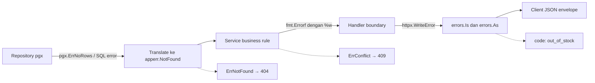
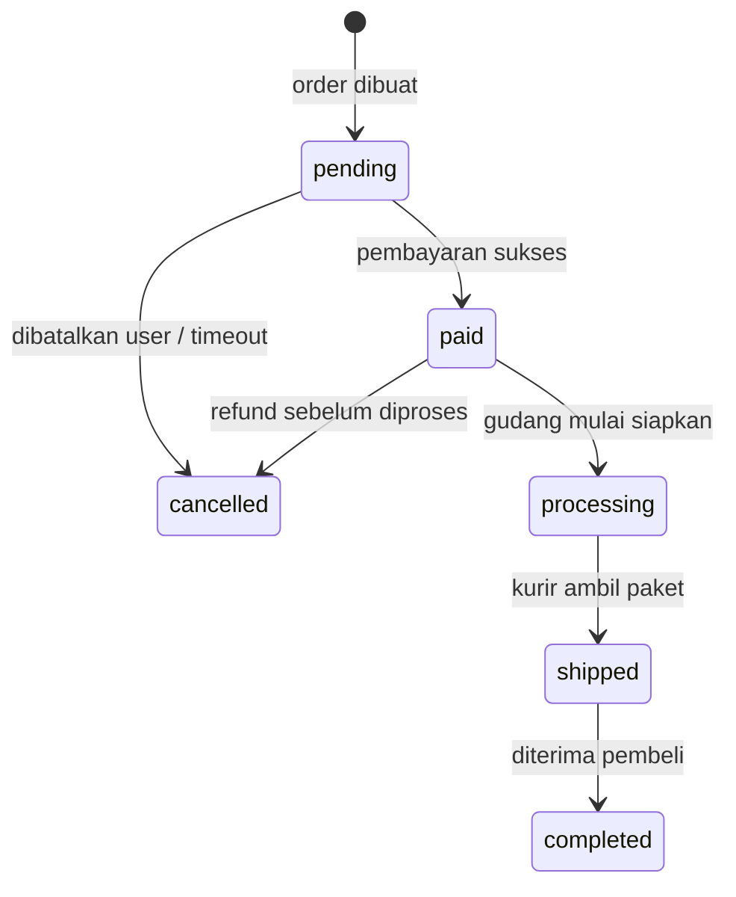

import { Section, Box, Steps, Step, Recap, CardGrid, Card, Chip, Hero, Compare, FileTree, Endpoint, Def } from "@components";

<Hero eyebrow="Roadmap 4 &middot; Clean Architecture" title="Error Handling <em>Konsisten</em><br />dari Domain ke HTTP">
  <p>Error yang baik membuat backend mudah di-debug, aman untuk client, dan tetap jujur terhadap aturan bisnis. Di chapter ini kita mengubah error menjadi kontrak lintas layer, lalu memetakannya ke HTTP status code dengan satu pintu terpusat.</p>
  <Fragment slot="meta">
    <Chip icon="code">Bahasa: <b>Go 1.26</b></Chip>
    <Chip icon="shield">Error sebagai <b>nilai</b></Chip>
    <Chip icon="clock">~70 menit baca</Chip>
  </Fragment>
</Hero>

<Section num="01" id="intro" title="Kenapa Error Strategy Penting?" sub="Error bukan sekadar pesan gagal, error adalah kontrak lintas layer.">

<p class="lead">Di backend online shop skincare, error checkout, stok, pembayaran, dan autentikasi harus punya makna yang stabil dari repository sampai HTTP response. Tanpa strategi, setiap layer akan membuat aturannya sendiri dan API kamu jadi tidak bisa ditebak.</p>

Sampai Roadmap 3 kamu sudah sering menulis `if err != nil` dan, di handler, kamu memanggil `httpx.Error(w, http.StatusNotFound, "product_not_found", "...")` secara manual di setiap endpoint. Itu bekerja untuk satu domain. Tetapi begitu proyek tumbuh menjadi product, cart, order, inventory, payment, dan promotion, mapping manual ini mulai berulang, tidak konsisten, dan rawan bocor. Satu handler membalas `404`, handler lain membalas `500` untuk kasus yang sebenarnya sama.

Chapter ini menjawab tiga pertanyaan yang akan menempel di seluruh proyek: jenis error apa saja yang kita kenal (taksonomi), bagaimana kita menandai dan membungkusnya di service (sentinel dan `AppError`), dan di mana satu-satunya tempat error diubah menjadi HTTP status (boundary handler terpusat).

<Def term="error strategy"><p>Kesepakatan proyek tentang jenis error yang dikenal, cara menandai dan membungkus error, satu tempat memetakan error ke HTTP status, dan pesan aman yang boleh keluar ke client.</p></Def>

<CardGrid cols={3}>
  <Card><h4>Predictable</h4><p>Stok kurang selalu jadi 409, produk hilang selalu 404, di semua domain, tanpa kejutan.</p></Card>
  <Card><h4>Aman</h4><p>Query SQL, nama tabel, DSN, dan stack trace tinggal di log. Client hanya menerima code dan message aman.</p></Card>
  <Card><h4>Testable</h4><p>Service mengembalikan error domain, bukan HTTP status, sehingga bisa diuji tanpa `net/http`.</p></Card>
</CardGrid>

<Box variant="note" icon="🧭" label="Posisi chapter ini di Roadmap 4"><p>Chapter 1 menata layering (handler, service, repository), chapter 2 memecah per domain, chapter 3 mengatur config. Chapter ini mengisi satu kolom kosong di arsitektur itu: bagaimana error mengalir naik dengan rapi. Chapter 5 (logging) lalu membaca chain error yang kita rancang di sini.</p></Box>

Kita memakai package standar Go: `errors.New` untuk sentinel error, `fmt.Errorf` dengan verb `%w` untuk wrapping, serta `errors.Is`, `errors.As`, dan `errors.Join` untuk inspeksi. Rujukan resmi: [package errors](https://pkg.go.dev/errors), [fmt.Errorf](https://pkg.go.dev/fmt#Errorf), dan [konstanta status net/http](https://pkg.go.dev/net/http#pkg-constants).

</Section>

<Section num="02" id="error-sebagai-nilai" title="Dari try/catch ke Error sebagai Nilai" sub="Jembatan utama dari JS/React dan PHP/Laravel ke cara berpikir Go.">

<p class="lead">Sebelum bicara taksonomi, kita luruskan dulu model mentalnya. Inilah perbedaan paling fundamental yang membuat developer JS dan PHP tersandung di Go.</p>

Di JavaScript kamu `throw` lalu menangkapnya di `try/catch`. Di Laravel kamu melempar `ModelNotFoundException` atau `ValidationException`, lalu framework otomatis memetakannya ke response lewat handler global di `app/Exceptions/Handler.php`. Pada kedua dunia itu, error adalah aliran kontrol yang bisa melompati banyak fungsi sampai ada yang menangkapnya. Go menolak model itu. Di Go, error adalah nilai biasa yang dikembalikan sebagai return value terakhir, dan caller wajib memutuskan apa yang akan dilakukan dengannya.

<Compare aLabel="JS / Laravel: exception (control flow)" bLabel="Go: error sebagai nilai (return value)" aTone="muted" bTone="violet">
  <Fragment slot="a"><ul><li>`throw` melempar, stack unwind otomatis sampai ada `catch` atau handler framework.</li><li>Sebuah fungsi bisa gagal tanpa tanda di signature-nya. Kamu tidak tahu ia bisa melempar tanpa membaca isinya.</li><li>Framework sering otomatis memetakan exception ke HTTP response.</li></ul></Fragment>
  <Fragment slot="b"><ul><li>Fungsi mengembalikan `error` sebagai nilai terakhir, terlihat jelas di signature.</li><li>Caller wajib memutuskan: handle, wrap, atau teruskan ke atas. Tidak ada yang otomatis lompat.</li><li>Mapping ke HTTP dibuat eksplisit di boundary handler, bukan tersebar atau tersembunyi.</li></ul></Fragment>
</Compare>

```go title="Perbandingan bentuk kode"
// JavaScript: gagal lewat throw, tidak terlihat di signature.
async function getProduct(slug) {
  const row = await db.findBySlug(slug);
  if (!row) throw new NotFoundError("product not found"); // melompat ke catch
  return row;
}

// Go: gagal lewat return value, terlihat di signature (Product, error).
func (s *Service) GetProduct(ctx context.Context, slug string) (Product, error) {
	p, err := s.repo.GetBySlug(ctx, s.pool, slug)
	if err != nil {
		return Product{}, err // caller wajib memeriksa err ini
	}
	return p, nil
}
```

<Box variant="bridge" icon="🌉" label="Jembatan: jangan cari try/catch global"><p>Di Express atau Laravel, global exception handler terasa alami dan kamu cenderung mengandalkannya. Di Go, boundary terpusat tetap ada (kita bangun di section 08), tetapi setiap fungsi di bawahnya tetap mengembalikan error secara eksplisit. Boundary itu hanya memformat, bukan menangkap lompatan.</p></Box>

<Box variant="warn" icon="⚠️" label="panic bukan pengganti exception"><p>Go punya `panic`, tetapi itu bukan untuk error yang bisa diantisipasi seperti stok kurang atau produk tidak ada. `panic` dipakai untuk bug programmer yang fatal (index out of range, nil dereference). Untuk kegagalan bisnis dan I/O yang wajar, selalu kembalikan `error`. Recovery panic hanya dipakai sebagai jaring pengaman terakhir di middleware, agar satu request rusak tidak menjatuhkan seluruh server.</p></Box>

</Section>

<Section num="03" id="taksonomi-error-domain" title="Taksonomi Error Domain" sub="Buat kategori error yang dekat dengan aturan bisnis, bukan dekat dengan detail database.">

<p class="lead">Domain error adalah bahasa bersama antara service dan handler. Kita butuh kategori yang cukup kecil agar mudah diingat, tetapi cukup ekspresif untuk menggambarkan kasus bisnis utama proyek skincare.</p>

Roadmap menyebut enam kelas error yang harus tercakup: domain error, validation error, not found, unauthorized, conflict, dan internal error. Kita rapikan menjadi lima sentinel kategori plus satu pembeda penting (unauthorized vs forbidden) yang sering tertukar.

<CardGrid cols={3}>
  <Card><h4>ErrNotFound &middot; 404</h4><p>Data tidak ditemukan: produk, varian, cart aktif, order, atau alamat user yang dirujuk tidak ada.</p></Card>
  <Card><h4>ErrValidation &middot; 422</h4><p>Input gagal aturan: quantity nol, email kosong, alamat pengiriman belum lengkap. Membawa daftar field.</p></Card>
  <Card><h4>ErrUnauthorized &middot; 401</h4><p>User belum login atau token tidak valid. Belum tahu siapa kamu, silakan login dulu.</p></Card>
  <Card><h4>ErrForbidden &middot; 403</h4><p>Sudah login, identitas jelas, tetapi role tidak cukup. Misal customer menyentuh route admin.</p></Card>
  <Card><h4>ErrConflict &middot; 409</h4><p>State menolak operasi yang valid: stok tidak cukup, slug terpakai, order sudah dibayar.</p></Card>
  <Card><h4>ErrInternal &middot; 500</h4><p>Kegagalan teknis yang tidak boleh dibocorkan: database down, bug tak terduga, panic ter-recover.</p></Card>
</CardGrid>

<Box variant="bridge" icon="🌉" label="Jembatan: mirip exception class di Laravel"><p>Di Laravel kamu punya class exception berbeda (`ModelNotFoundException`, `AuthorizationException`, `ValidationException`) dan handler global yang memetakan masing-masing ke status. Di Go, peran "class" diisi oleh sentinel error untuk kategori, dan `AppError` untuk metadata (code, message, fields). Diskriminasinya nanti lewat `errors.Is`, bukan `instanceof`.</p></Box>

<Box variant="warn" icon="⚠️" label="Bedakan 401 dan 403 sejak awal"><p>401 Unauthorized berarti "saya tidak tahu siapa kamu" (token hilang atau tidak valid). 403 Forbidden berarti "saya tahu siapa kamu, tapi kamu tidak boleh" (role kurang). Menyatukan keduanya jadi satu kode membuat frontend bingung: apakah harus mengarahkan ke halaman login, atau menampilkan pesan akses ditolak?</p></Box>

<Box variant="note" icon="🧭" label="Prinsip batas tanggung jawab"><p>Repository boleh tahu detail PostgreSQL, service tahu aturan bisnis, handler tahu HTTP. Error strategy menjaga batas ini tetap bersih: error pgx diterjemahkan jadi error domain di repository, error domain dipetakan jadi HTTP hanya di handler.</p></Box>

Di mana kode error strategy ini tinggal? Sesuai layering Roadmap 4, kategori dan `AppError` hidup di satu package lintas-domain. Mapping ke HTTP menumpang di `internal/httpx` yang sudah kita rancang di Roadmap 2, jadi envelope JSON-nya tetap sama dengan seluruh API.

<FileTree title="Lokasi error strategy di modular monolith" tree={`
internal/
  apperr/
    apperr.go          # sentinel kategori dan AppError + constructor
  httpx/
    response.go        # envelope Data, List, Error (dari Roadmap 2)
    errors.go          # errBody, errEnvelope, FieldError (dari Roadmap 2)
    apperror.go        # WriteError: mapping AppError ke HTTP (baru di chapter ini)
  product/
    errors.go          # ErrProductNotFound, ErrSlugTaken (error domain product)
    repository.go      # translate pgx.ErrNoRows jadi error domain
    service.go         # bungkus error domain produk
  order/
    service.go         # checkout dan konflik stok / transisi status
    handler.go         # panggil httpx.WriteError
`} />

<Box variant="tip" icon="💡" label="Kenapa apperr terpisah dari httpx?"><p>`apperr` tidak mengenal HTTP sama sekali, sehingga aman dipakai service, worker, dan CLI. `httpx.WriteError` adalah satu-satunya tempat yang menjembatani `apperr` ke status code. Pemisahan ini menjaga service tetap bebas dari `net/http`, persis batas yang kita jaga sejak repository pattern di Roadmap 3.</p></Box>

</Section>

<Section num="04" id="sentinel-errors" title="Sentinel Error dengan errors.New" sub="Sentinel error adalah nilai error tetap yang bisa dibandingkan lewat errors.Is.">

<p class="lead">Sentinel error memberi identitas stabil pada kategori kegagalan. Inilah jangkar yang dipakai handler untuk memutuskan status HTTP, dan dipakai test untuk assert kategori error.</p>

Di Go, sentinel error dibuat sekali dengan `errors.New` di level package, lalu dibandingkan dengan `errors.Is`. Jangan bandingkan dengan `err == ErrConflict` ketika error mungkin sudah di-wrap, karena perbandingan langsung gagal mengenali error yang dibungkus. `errors.Is` menelusuri seluruh chain.

```go title="internal/apperr/apperr.go"
package apperr

import (
	"errors"
	"fmt"
)

// Sentinel kategori. Inilah lima identitas yang dikenali boundary HTTP.
var (
	ErrNotFound     = errors.New("not found")
	ErrValidation   = errors.New("validation")
	ErrUnauthorized = errors.New("unauthorized")
	ErrForbidden    = errors.New("forbidden")
	ErrConflict     = errors.New("conflict")
	ErrInternal     = errors.New("internal")
)
```

<Def term="sentinel error"><p>Nilai error yang dibuat sekali di level package (`var ErrX = errors.New(...)`) dan dipakai sebagai penanda kategori. Dibandingkan dengan `errors.Is(err, ErrX)`, bukan dengan `==`, agar tetap dikenali walau error sudah dibungkus konteks.</p></Def>

<Box variant="tip" icon="💡" label="Idiom penamaan: awalan Err, huruf kapital"><p>Konvensi Go: sentinel error diberi nama berawalan `Err` dan diekspor dengan huruf kapital (`ErrNotFound`) agar bisa dirujuk dari package lain. Pesannya huruf kecil tanpa tanda baca akhir (`"not found"`, bukan `"Not found."`) karena error sering digabung ke kalimat lebih besar saat di-wrap.</p></Box>

<Box variant="warn" icon="⚠️" label="Sentinel saja tidak cukup membawa data"><p>Sentinel hanya membawa kategori, tidak membawa code stabil untuk frontend, message yang aman, atau field yang gagal. Untuk itu kita butuh struct error. Sentinel dan struct bekerja berpasangan: sentinel untuk diskriminasi kategori, struct untuk metadata. Itu isi section berikutnya.</p></Box>

</Section>

<Section num="05" id="custom-error-struct" title="AppError: Custom Error Struct" sub="Struct memberi metadata tanpa mengorbankan idiom error Go.">

<p class="lead">Custom error struct membuat error bisa dibaca manusia, dipahami frontend lewat code stabil, dan tetap bisa diinspeksi program. `AppError` adalah pembawa metadata yang konsisten untuk seluruh proyek.</p>

Sebuah tipe memenuhi interface `error` ketika punya method `Error() string`. Pada `AppError`, kita menambah `Kind` (sentinel kategori), `Code` (kontrak frontend, snake_case), `Message` (pesan aman untuk client), `Fields` (validasi per field, memakai `httpx.FieldError` yang sudah ada), dan `cause` (error asli untuk log internal, tidak diekspos).

```go title="internal/apperr/apperr.go"
// AppError adalah error domain berstruktur yang membawa kategori dan metadata.
type AppError struct {
	Kind    error              // sentinel: ErrNotFound, ErrConflict, ...
	Code    string             // kode stabil snake_case untuk frontend
	Message string             // pesan aman yang boleh tampil ke user
	Fields  []FieldError       // detail per field, untuk validation error
	cause   error              // error asli, untuk log; tidak pernah ke client
}

// FieldError sengaja sama bentuknya dengan httpx.FieldError, tetapi
// didefinisikan di sini agar apperr tetap bebas dependency ke httpx.
type FieldError struct {
	Field   string
	Message string
}

func (e *AppError) Error() string {
	if e.cause == nil {
		return fmt.Sprintf("%s: %s", e.Code, e.Message)
	}
	return fmt.Sprintf("%s: %s: %v", e.Code, e.Message, e.cause)
}

// Unwrap membuka cause agar errors.Is/As bisa menelusuri error asli.
func (e *AppError) Unwrap() error { return e.cause }

// Is membuat errors.Is(appErr, apperr.ErrConflict) bekerja lewat Kind.
func (e *AppError) Is(target error) bool { return errors.Is(e.Kind, target) }
```

<Def term="memenuhi interface error"><p>Di Go tidak ada kata kunci `implements`. Jika sebuah tipe punya method `Error() string`, tipe itu otomatis memenuhi interface `error`. `*AppError` punya `Error()`, jadi ia adalah `error` yang sah dan bisa dikembalikan di mana pun `error` diharapkan.</p></Def>

Constructor membuat pembuatan `AppError` ringkas dan konsisten. Satu constructor per kategori, plus satu helper untuk validasi yang membawa daftar field.

```go title="internal/apperr/apperr.go"
func newError(kind error, code, message string, cause error) *AppError {
	return &AppError{Kind: kind, Code: code, Message: message, cause: cause}
}

func NotFound(code, message string, cause error) *AppError {
	return newError(ErrNotFound, code, message, cause)
}

func Unauthorized(code, message string, cause error) *AppError {
	return newError(ErrUnauthorized, code, message, cause)
}

func Forbidden(code, message string, cause error) *AppError {
	return newError(ErrForbidden, code, message, cause)
}

func Conflict(code, message string, cause error) *AppError {
	return newError(ErrConflict, code, message, cause)
}

func Internal(cause error) *AppError {
	// Internal selalu memakai code dan message generik yang aman.
	return newError(ErrInternal, "internal_error", "terjadi kesalahan pada server", cause)
}

// Validation membawa daftar field yang gagal, kompatibel dengan envelope httpx.
func Validation(message string, fields []FieldError) *AppError {
	return &AppError{
		Kind:    ErrValidation,
		Code:    "validation_error",
		Message: message,
		Fields:  fields,
	}
}
```

<Compare aLabel="TypeScript: discriminated union" bLabel="Go: sentinel Kind + struct AppError" aTone="teal" bTone="violet">
  <Fragment slot="a"><ul><li>Frontend membuat union `type ApiError = { code: string; message: string }`.</li><li>Diskriminasi lewat properti `code`, dicek dengan `switch (err.code)`.</li></ul></Fragment>
  <Fragment slot="b"><ul><li>Backend menyimpan kategori di `Kind` (sentinel) dan metadata di field struct.</li><li>Diskriminasi kategori lewat `errors.Is`, ambil metadata lewat `errors.As`.</li></ul></Fragment>
</Compare>

<Box variant="warn" icon="⚠️" label="Jangan jadikan pesan string sebagai kontrak"><p>Jangan pernah memeriksa `err.Error() == "stok tidak cukup"`. Pesan bisa berubah demi UX, lokalisasi, atau keamanan. Yang stabil hanya `Kind` (untuk status HTTP) dan `Code` (untuk logic frontend). String pesan adalah untuk manusia, bukan untuk program.</p></Box>

<Box variant="tip" icon="💡" label="cause huruf kecil itu disengaja"><p>Field `cause` tak-diekspor (unexported) supaya tidak ada package lain yang bisa membacanya langsung lalu lalai membocorkannya ke client. Satu-satunya jalan keluar `cause` adalah lewat `Unwrap`, yang dipakai logger di boundary. Frontend tidak akan pernah melihatnya.</p></Box>

</Section>

<Section num="06" id="is-dan-as" title="errors.Is, errors.As, dan errors.Join" sub="Tiga alat standar untuk menginspeksi error tanpa membandingkan string.">

<p class="lead">Setelah punya sentinel dan struct, kita butuh cara membacanya kembali di handler. Inilah tiga fungsi inti dari package `errors` yang menggantikan `instanceof` dan `catch (e: SpecificError)` dari JS/PHP.</p>

`errors.Is(err, target)` menelusuri chain error (lewat `Unwrap`) dan menjawab "apakah `err` ini, atau salah satu error di dalamnya, sama dengan `target`?". Ini cara memeriksa kategori. `errors.As(err, &dst)` mencari error pertama di chain yang tipenya cocok dengan `dst`, lalu mengisinya, sehingga kamu bisa membaca field-nya. Ini cara mengambil metadata.

```go title="Inspeksi error: Is untuk kategori, As untuk metadata"
// Is: apakah error ini termasuk kategori konflik? (untuk status HTTP)
if errors.Is(err, apperr.ErrConflict) {
	// ... balas 409
}

// As: ambil *AppError dari chain untuk membaca Code, Message, Fields.
var appErr *apperr.AppError
if errors.As(err, &appErr) {
	code := appErr.Code        // "out_of_stock"
	message := appErr.Message  // "stok produk tidak cukup"
	fields := appErr.Fields    // detail validasi, jika ada
}
```

<Compare aLabel="TypeScript / PHP: instanceof, catch tipe" bLabel="Go: errors.Is / errors.As" aTone="muted" bTone="violet">
  <Fragment slot="a"><ul><li>`if (err instanceof NotFoundError)` atau `catch (NotFoundException $e)`.</li><li>Hanya melihat tipe paling luar, kecuali kamu menelusuri `err.cause` manual.</li></ul></Fragment>
  <Fragment slot="b"><ul><li>`errors.Is(err, ErrNotFound)` untuk kategori, `errors.As(err, &appErr)` untuk tipe.</li><li>Otomatis menelusuri seluruh chain `%w`, jadi error yang sudah dibungkus tetap terbaca.</li></ul></Fragment>
</Compare>

`errors.Join` menggabungkan beberapa error menjadi satu. Ini berguna saat sebuah operasi punya banyak kegagalan kecil yang ingin dilaporkan sekaligus, misalnya validasi beberapa field tanpa berhenti di yang pertama. `errors.Is` tetap bisa mengenali tiap error di dalam hasil join.

```go title="errors.Join untuk mengumpulkan beberapa kegagalan"
func validateAddress(a Address) error {
	var errs []error
	if a.RecipientName == "" {
		errs = append(errs, apperr.Validation("nama penerima wajib diisi", []apperr.FieldError{
			{Field: "recipient_name", Message: "wajib diisi"},
		}))
	}
	if a.PostalCode == "" {
		errs = append(errs, apperr.Validation("kode pos wajib diisi", []apperr.FieldError{
			{Field: "postal_code", Message: "wajib diisi"},
		}))
	}
	// Join mengembalikan nil jika errs kosong, jadi aman dipanggil selalu.
	return errors.Join(errs...)
}
```

<Box variant="tip" icon="💡" label="Untuk validasi, biasanya satu AppError lebih rapi"><p>`errors.Join` kuat untuk menggabungkan kegagalan teknis di chain. Tetapi untuk validasi per field yang ingin dibalas ke client sebagai satu daftar, lebih sering kita kumpulkan langsung ke satu `[]FieldError` dan bungkus dengan `apperr.Validation` tunggal. Pilih yang membuat boundary HTTP paling sederhana membacanya.</p></Box>

<Box variant="bridge" icon="🌉" label="Jembatan: ini menggantikan instanceof dan catch bertipe"><p>Di TS kamu menulis rantai `if (e instanceof A) ... else if (e instanceof B)`. Di Laravel handler kamu menulis blok `if ($e instanceof ...)` di `render()`. Pola yang sama di Go ditulis dengan `switch` plus `errors.Is`, hanya saja chain `%w` membuatnya tahan terhadap pembungkusan, sesuatu yang `instanceof` di JS tidak otomatis dapatkan.</p></Box>

</Section>

<Section num="07" id="wrapping-error" title="Wrapping Error dengan Konteks" sub="Tambahkan konteks tanpa menghilangkan identitas error asli.">

<p class="lead">Wrapping membuat log lebih berguna karena membawa jejak operasi, tetapi handler tetap bisa mengenali kategori error. Kuncinya adalah verb `%w` pada `fmt.Errorf`.</p>

Saat repository atau service gagal, tambahkan konteks dengan `fmt.Errorf("nama operasi: %w", err)`. Verb `%w` (wrap) menyimpan error lama di dalam error baru, sehingga `errors.Is` dan `errors.As` tetap bisa menelusurinya. Bandingkan dengan `%v` yang hanya mencetak teks error dan memutus chain, membuat kategori hilang.

Di repository, error pgx diterjemahkan menjadi error domain di perbatasan, bukan diteruskan mentah. Inilah disiplin boundary yang kita mulai di repository pattern Roadmap 3, sekarang dipertegas.

```go title="internal/product/repository.go"
package product

import (
	"context"
	"errors"
	"fmt"

	"github.com/jackc/pgx/v5"

	"github.com/kamu/skincare-backend/internal/apperr"
	"github.com/kamu/skincare-backend/internal/database"
)

func (r *pgProductRepository) GetByID(ctx context.Context, db database.Querier, id int64) (Product, error) {
	const query = `
		SELECT id, brand_id, slug, name, status, price_rupiah
		FROM product_variants
		WHERE id = $1 AND deleted_at IS NULL`

	var p Product
	err := db.QueryRow(ctx, query, id).Scan(
		&p.ID, &p.BrandID, &p.Slug, &p.Name, &p.Status, &p.PriceRupiah,
	)
	if err != nil {
		if errors.Is(err, pgx.ErrNoRows) {
			// Terjemahkan error pgx jadi error domain di perbatasan.
			return Product{}, apperr.NotFound(
				"product_not_found",
				"produk tidak ditemukan",
				err, // err asli disimpan sebagai cause untuk log, tidak ke client
			)
		}
		// Error teknis lain: wrap dengan konteks operasi, tetap bisa di-unwrap.
		return Product{}, fmt.Errorf("product repository get by id: %w", err)
	}
	return p, nil
}
```

<Box variant="warn" icon="⚠️" label="%w menjaga chain, %v memutusnya"><p>`fmt.Errorf("get by id: %w", err)` membungkus dan menjaga `err` bisa di-unwrap. `fmt.Errorf("get by id: %v", err)` hanya mencetak teksnya, dan `errors.Is(result, pgx.ErrNoRows)` akan gagal. Untuk error yang ingin tetap dikenali kategorinya, selalu `%w`.</p></Box>

<Box variant="bridge" icon="🌉" label="Jembatan: stack trace otomatis vs error chain eksplisit"><p>Exception di PHP membawa stack trace otomatis. Go lebih eksplisit: kamu membangun chain lewat `%w` dengan menuliskan nama operasi di tiap lapis (`product repository get by id`, lalu `checkout reserve stock`). Saat logger membaca chain ini di boundary, hasilnya adalah jejak operasi yang lebih bermakna daripada stack trace mentah, karena ditulis dengan bahasa domain.</p></Box>

<Box variant="note" icon="🧩" label="Kapan wrap, kapan jangan"><p>Wrap saat berpindah konteks operasi yang berarti, misalnya dari query repository ke operasi bisnis checkout. Jangan wrap berkali-kali dengan pesan yang tidak menambah informasi seperti `fmt.Errorf("error: %w", err)`. Setiap lapisan wrap harus menjawab "operasi apa yang sedang gagal di sini?".</p></Box>

</Section>

<Section num="08" id="handler-terpusat" title="Mapping ke HTTP di Boundary Terpusat" sub="HTTP status code hanya ditentukan di satu tempat: httpx.WriteError.">

<p class="lead">Handler adalah satu-satunya tempat error domain diubah menjadi status code dan JSON. Kita tumpangkan mapping ini di `internal/httpx` agar memakai envelope yang sama dengan seluruh API skincare sejak Roadmap 2.</p>

Service tidak boleh tahu `http.StatusConflict`, karena service harus tetap bisa dipakai worker, CLI, dan test tanpa membawa konsep HTTP. Yang dilakukan `WriteError` cukup tiga langkah: cari `*AppError` di chain (untuk code, message, fields), tentukan status dari `Kind` lewat `errors.Is`, lalu untuk kasus 500 ganti dengan pesan generik dan log error aslinya.

```go title="internal/httpx/apperror.go"
package httpx

import (
	"errors"
	"log/slog"
	"net/http"

	"github.com/kamu/skincare-backend/internal/apperr"
)

// WriteError adalah satu-satunya pintu yang mengubah error jadi HTTP response.
func WriteError(w http.ResponseWriter, logger *slog.Logger, err error) {
	// Default: anggap internal error sampai terbukti sebaliknya.
	status := http.StatusInternalServerError
	code := "internal_error"
	message := "terjadi kesalahan pada server"
	var fields []FieldError

	// Ambil metadata dari AppError jika ada di chain.
	var appErr *apperr.AppError
	if errors.As(err, &appErr) {
		code = appErr.Code
		message = appErr.Message
		fields = toHTTPFields(appErr.Fields)
	}

	// Tentukan status dari kategori (Kind), menelusuri seluruh chain.
	switch {
	case errors.Is(err, apperr.ErrNotFound):
		status = http.StatusNotFound
	case errors.Is(err, apperr.ErrValidation):
		status = http.StatusUnprocessableEntity
	case errors.Is(err, apperr.ErrUnauthorized):
		status = http.StatusUnauthorized
	case errors.Is(err, apperr.ErrForbidden):
		status = http.StatusForbidden
	case errors.Is(err, apperr.ErrConflict):
		status = http.StatusConflict
	}

	// Untuk 500: jangan bocorkan apa pun, log error aslinya secara penuh.
	if status == http.StatusInternalServerError {
		logger.Error("request failed", "error", err)
		Error(w, status, "internal_error", "terjadi kesalahan pada server")
		return
	}

	// Untuk error yang dikenal, kirim envelope yang sama dengan seluruh API.
	JSON(w, status, errEnvelope{
		Error: errBody{Code: code, Message: message, Fields: fields},
	})
}

func toHTTPFields(in []apperr.FieldError) []FieldError {
	if len(in) == 0 {
		return nil
	}
	out := make([]FieldError, 0, len(in))
	for _, f := range in {
		out = append(out, FieldError{Field: f.Field, Message: f.Message})
	}
	return out
}
```

<Box variant="tip" icon="💡" label="Envelope tetap sama dengan Roadmap 2"><p>`WriteError` memakai `errEnvelope`, `errBody`, dan `FieldError` yang sudah didefinisikan di `internal/httpx/errors.go` sejak modul Request &amp; Response. Hasilnya bentuk JSON error tetap `{"error": {"code", "message", "fields"}}` di seluruh API, baik dari mapping manual lama maupun dari `WriteError` baru. Tidak ada kontrak baru yang membingungkan frontend.</p></Box>

Dengan boundary terpusat, handler checkout jadi sangat ringkas. Ia tidak lagi menebak status code, cukup meneruskan error ke `WriteError`.

<Endpoint method="POST" path="/v1/orders" desc="Checkout cart menjadi order; konflik stok dibalas 409 dengan code out_of_stock" />

```go title="internal/order/handler.go"
package order

import (
	"net/http"

	"github.com/kamu/skincare-backend/internal/httpx"
)

func (h *Handler) Checkout(w http.ResponseWriter, r *http.Request) {
	userID := httpx.UserIDFromContext(r.Context())

	// Ambil isi cart aktif dulu, lalu kirim sebagai items ke service.
	items, err := h.service.CartItems(r.Context(), userID)
	if err != nil {
		httpx.WriteError(w, h.logger, err)
		return
	}

	order, err := h.service.Checkout(r.Context(), userID, items)
	if err != nil {
		httpx.WriteError(w, h.logger, err) // satu baris untuk semua kategori
		return
	}

	httpx.Data(w, http.StatusCreated, NewOrderResponse(order))
}
```

<Box variant="warn" icon="🔒" label="Jangan leak detail internal ke client"><p>Untuk status 500, `WriteError` sengaja membuang code, message, dan fields asli, lalu mengganti dengan pesan generik. Query SQL, nama tabel, DSN database, error vendor pgx, dan stack trace hanya boleh masuk log lewat `logger.Error("request failed", "error", err)`. Chapter 5 (logging) memperdalam cara membaca chain ini dengan aman.</p></Box>

<Compare aLabel="Mapping manual lama (per handler)" bLabel="Boundary terpusat (WriteError)" aTone="red" bTone="teal">
  <Fragment slot="a"><ul><li>Setiap handler mengulang `if errors.Is(...) httpx.Error(w, 404, ...)`.</li><li>Mudah tidak konsisten: satu handler 404, handler lain 500 untuk kasus yang sama.</li></ul></Fragment>
  <Fragment slot="b"><ul><li>Handler cukup `httpx.WriteError(w, logger, err)`, satu baris.</li><li>Mapping kategori ke status hidup di satu file, mudah diaudit dan diuji.</li></ul></Fragment>
</Compare>

</Section>

<Section num="09" id="alur-error" title="Alur Error dari Repository ke HTTP" sub="Error bergerak naik, makna bisnis makin jelas, response dibuat hanya di tepi HTTP.">

<p class="lead">Diagram ini menunjukkan kenapa error tidak boleh langsung diubah menjadi HTTP response di repository, dan bagaimana kategori dipertahankan sampai boundary.</p>



<p class="fig-cap"><b>Gambar 1.</b> Repository tahu detail data, service tahu aturan bisnis, handler tahu HTTP. Kategori error (Kind) terbawa utuh lewat chain `%w` sampai dipetakan ke status di satu pintu.</p>

Tabel berikut adalah kontrak ringkas yang dipakai seluruh API skincare. Hafalkan kolom kategori dan status, karena inilah yang membuat error predictable lintas domain.

<div class="tbl-wrap">
<table>
<thead><tr><th>Kategori (Kind)</th><th>HTTP Status</th><th>Contoh code</th><th>Kasus skincare</th></tr></thead>
<tbody>
<tr><td><code>ErrValidation</code></td><td>422</td><td><code>validation_error</code></td><td>quantity nol, alamat kirim belum lengkap</td></tr>
<tr><td><code>ErrUnauthorized</code></td><td>401</td><td><code>unauthorized</code></td><td>token hilang atau kedaluwarsa saat checkout</td></tr>
<tr><td><code>ErrForbidden</code></td><td>403</td><td><code>forbidden</code></td><td>customer mengakses route admin katalog</td></tr>
<tr><td><code>ErrNotFound</code></td><td>404</td><td><code>product_not_found</code></td><td>varian, cart aktif, atau order tidak ada</td></tr>
<tr><td><code>ErrConflict</code></td><td>409</td><td><code>out_of_stock</code></td><td>stok kurang, slug terpakai, order sudah dibayar</td></tr>
<tr><td><code>ErrInternal</code></td><td>500</td><td><code>internal_error</code></td><td>database down, bug, panic ter-recover</td></tr>
</tbody>
</table>
</div>

<Box variant="tip" icon="💡" label="Satu arah tanggung jawab"><p>Error boleh bergerak dari repository ke service lalu handler. Sebaliknya, repository tidak boleh import handler, dan service tidak boleh import `net/http`. Tes lakmus: cari `net/http` di import `service.go`. Kalau ada, boundary sudah bocor.</p></Box>

Format response error dibuat stabil agar frontend React dan mobile client tidak perlu menebak dari teks bebas. Inilah bentuk yang dibalas untuk stok kurang.

```json title="409 Conflict"
{
  "error": {
    "code": "out_of_stock",
    "message": "stok produk tidak cukup"
  }
}
```

Dan inilah bentuk untuk validasi yang gagal di beberapa field sekaligus.

```json title="422 Unprocessable Entity"
{
  "error": {
    "code": "validation_error",
    "message": "Validasi gagal",
    "fields": [
      { "field": "recipient_name", "message": "wajib diisi" },
      { "field": "postal_code", "message": "wajib diisi" }
    ]
  }
}
```

</Section>

<Section num="10" id="checkout-stok-kurang" title="Studi Kasus Checkout: Stok Kurang" sub="Kasus bisnis nyata: cart valid, varian ada, tetapi stok tidak cukup.">

<p class="lead">Stok kurang bukan 500, bukan 400 generik, melainkan konflik state bisnis yang tepat menjadi 409. User valid, varian ada, tetapi state sistem menolak operasi karena `quantity_available` lebih kecil dari yang diminta.</p>

Ingat skema kanonik proyek: stok hidup di tabel `inventories`, one-to-one dengan `product_variants` lewat `variant_id`. Yang ditahan saat checkout adalah `quantity_reserved`, dengan constraint `CHECK (quantity_available >= quantity_reserved)`. Saat reservasi melebihi stok, operasi gagal, dan inilah momen `ErrConflict` lahir.

```go title="internal/order/service.go"
package order

import (
	"context"
	"errors"
	"fmt"

	"github.com/kamu/skincare-backend/internal/apperr"
)

// ErrInsufficientStock adalah sentinel teknis dari layer inventory.
var ErrInsufficientStock = errors.New("insufficient stock")

type InventoryRepository interface {
	// Reserve menahan stok satu varian; mengembalikan ErrInsufficientStock
	// jika quantity_available tidak cukup.
	Reserve(ctx context.Context, variantID int64, quantity int) error
}

func (s *Service) Checkout(ctx context.Context, userID int64, items []CheckoutItem) (*Order, error) {
	if len(items) == 0 {
		return nil, apperr.Validation("keranjang belanja masih kosong", []apperr.FieldError{
			{Field: "items", Message: "minimal satu item"},
		})
	}

	for _, item := range items {
		err := s.inventoryRepo.Reserve(ctx, item.VariantID, item.Quantity)
		if err != nil {
			if errors.Is(err, ErrInsufficientStock) {
				// Stok kurang adalah konflik state: ubah jadi ErrConflict (409).
				return nil, fmt.Errorf("checkout reserve stock: %w", apperr.Conflict(
					"out_of_stock",
					"stok produk tidak cukup",
					err, // cause untuk log, tidak ke client
				))
			}
			// Kegagalan teknis lain tetap dibungkus konteks, jadi 500.
			return nil, fmt.Errorf("checkout reserve stock: %w", err)
		}
	}

	order, err := s.orderRepo.Create(ctx, userID, items)
	if err != nil {
		return nil, fmt.Errorf("checkout create order: %w", err)
	}
	return order, nil
}
```

Perhatikan dua hal yang menjaga idiom Go tetap rapi. Pertama, `ctx` selalu menjadi parameter pertama, sehingga timeout request dan cancellation terus terbawa sampai query reservasi stok. Kedua, sentinel teknis `ErrInsufficientStock` milik layer inventory tidak pernah keluar mentah ke handler. Service menerjemahkannya menjadi `apperr.Conflict` dengan code stabil `out_of_stock`, lalu membungkusnya dengan konteks operasi.

<Compare aLabel="Respons yang buruk" bLabel="Respons yang baik" aTone="red" bTone="teal">
  <Fragment slot="a"><ul><li>Status `500` dengan pesan `ERROR: new row violates check constraint`.</li><li>Frontend tidak tahu harus retry, menampilkan modal stok, atau logout.</li></ul></Fragment>
  <Fragment slot="b"><ul><li>Status `409` dengan code `out_of_stock` dan message aman.</li><li>Frontend menampilkan instruksi jelas: kurangi quantity atau hapus varian.</li></ul></Fragment>
</Compare>

<Box variant="bridge" icon="🌉" label="Jembatan: dari abort(409) Laravel ke apperr.Conflict"><p>Di Laravel kamu mungkin menulis `abort(409, 'stok tidak cukup')` langsung di service atau controller, mencampur HTTP dengan aturan bisnis. Di Go, service tidak menyebut angka 409 sama sekali. Ia hanya tahu ini "konflik" lewat `apperr.Conflict`, dan boundary HTTP yang menerjemahkan kategori itu menjadi 409. Service tetap bisa dipakai worker pembayaran tanpa membawa HTTP.</p></Box>

</Section>

<Section num="11" id="status-transition" title="Conflict pada Transisi Status Order" sub="Tidak semua conflict soal stok; transisi status yang ilegal juga 409.">

<p class="lead">Kategori `ErrConflict` punya teman penting di proyek skincare: transisi status order yang ilegal. Membatalkan order yang sudah dikirim, atau membayar order yang sudah dibayar, adalah operasi valid secara request tetapi ditolak oleh state, persis definisi 409.</p>

Skema `orders.status` dijaga `CHECK` dengan nilai: pending, paid, processing, shipped, completed, cancelled. Aturan transisinya adalah aturan bisnis murni, jadi ia tinggal di service, bukan di database dan bukan di handler.



<p class="fig-cap"><b>Gambar 2.</b> Transisi status order yang sah. Setiap panah yang tidak ada di diagram (misalnya shipped &rarr; cancelled) adalah transisi ilegal yang harus dibalas 409, bukan 500.</p>

Service memvalidasi transisi sebelum menulis ke database. Jika transisi ilegal, ia mengembalikan `apperr.Conflict` dengan code yang menjelaskan keadaan, sehingga frontend bisa menonaktifkan tombol yang tidak relevan.

```go title="internal/order/service.go"
// allowedTransitions memetakan status sekarang ke status berikutnya yang sah.
var allowedTransitions = map[string][]string{
	"pending":    {"paid", "cancelled"},
	"paid":       {"processing", "cancelled"},
	"processing": {"shipped"},
	"shipped":    {"completed"},
}

func canTransition(from, to string) bool {
	for _, next := range allowedTransitions[from] {
		if next == to {
			return true
		}
	}
	return false
}

func (s *Service) Cancel(ctx context.Context, orderID int64) error {
	order, err := s.orderRepo.GetByID(ctx, s.pool, orderID)
	if err != nil {
		// GetByID sudah menerjemahkan pgx.ErrNoRows jadi apperr.NotFound (404).
		return fmt.Errorf("cancel get order: %w", err)
	}

	if !canTransition(order.Status, "cancelled") {
		return apperr.Conflict(
			"order_not_cancellable",
			"order pada status ini tidak bisa dibatalkan",
			nil,
		)
	}

	if err := s.orderRepo.UpdateStatus(ctx, s.pool, orderID, "cancelled"); err != nil {
		return fmt.Errorf("cancel update status: %w", err)
	}
	return nil
}
```

<Box variant="tip" icon="💡" label="Code yang spesifik membantu frontend"><p>Code `order_not_cancellable` lebih berguna daripada `conflict` generik. Dengan code spesifik, frontend bisa menampilkan pesan kontekstual dan menonaktifkan tombol "Batalkan" tepat pada order yang sudah dikirim, tanpa menebak dari teks message.</p></Box>

<Box variant="bridge" icon="🌉" label="Jembatan: state machine, bukan if bertumpuk"><p>Di Laravel kamu mungkin menulis deretan `if ($order->status === 'shipped')` yang panjang di controller. Map `allowedTransitions` adalah cara Go yang lebih jujur: aturan transisi terkumpul di satu tempat sebagai data, mudah dibaca, mudah diuji, dan tidak tersebar di banyak handler. Ini idiom yang sama dengan tabel transisi state machine di frontend (mis. XState), hanya di sisi server.</p></Box>

</Section>

<Section num="12" id="hands-on" title="Hands-on: Pasang Error Strategy" sub="Tambahkan error strategy ke proyek skincare secara bertahap.">

<p class="lead">Target hands-on ini adalah membuat error checkout, product detail, dan pembatalan order punya response yang konsisten lewat satu boundary terpusat.</p>

<Steps>
  <Step><b>Buat package apperr</b><p>Tambahkan `internal/apperr/apperr.go` berisi enam sentinel kategori, struct `AppError`, dan constructor `NotFound`, `Validation`, `Unauthorized`, `Forbidden`, `Conflict`, `Internal`.</p></Step>
  <Step><b>Pasang WriteError di httpx</b><p>Tambahkan `internal/httpx/apperror.go` yang memetakan `Kind` ke status (404, 422, 401, 403, 409, 500) dan memakai envelope `errEnvelope` yang sudah ada. Pastikan 500 selalu pesan generik plus log.</p></Step>
  <Step><b>Terjemahkan error repository</b><p>Di repository pgx, ubah `pgx.ErrNoRows` jadi `apperr.NotFound`, dan `pgconn.PgError` kode 23505 jadi `apperr.Conflict`. Wrap error teknis lain dengan `fmt.Errorf("operasi: %w", err)`.</p></Step>
  <Step><b>Pakai di service checkout</b><p>Jika inventory mengembalikan `ErrInsufficientStock`, ubah jadi `apperr.Conflict` dengan code `out_of_stock`. Tambahkan map `allowedTransitions` untuk pembatalan order.</p></Step>
  <Step><b>Rapikan semua handler</b><p>Ganti mapping manual `if errors.Is(...) httpx.Error(...)` yang berulang dengan satu baris `httpx.WriteError(w, h.logger, err)`.</p></Step>
  <Step><b>Verifikasi boundary bersih</b><p>Pastikan `net/http` tidak ter-import di `service.go` mana pun, dan tipe pgx tidak bocor ke service. Jalankan `go test ./...`.</p></Step>
</Steps>

Jalankan pemeriksaan cepat dari terminal untuk membuktikan boundary tetap bersih dan package terformat.

```bash title="Terminal"
# Service tidak boleh tahu HTTP
grep -rn "net/http" internal/order/service.go internal/product/service.go

# pgx tidak boleh bocor ke service
grep -rn "jackc/pgx" internal/order/service.go internal/product/service.go

# Format dan jalankan test
gofmt -w internal/apperr internal/httpx internal/product internal/order
go test ./...
```

Kalau dua `grep` pertama tidak menghasilkan baris apa pun dan `go test` lulus, error strategy-mu sudah bersih dan boundary tetap terjaga.

<Box variant="note" icon="🧪" label="Arah testing berikutnya"><p>Di Roadmap 6, error strategy ini memudahkan unit test service dan handler test. Kamu bisa assert `errors.Is(err, apperr.ErrConflict)` di unit test service, dan assert status HTTP 409 plus code `out_of_stock` di handler test, sebagai dua hal yang terpisah dan bersih.</p></Box>

</Section>

<Section num="13" id="jebakan-umum" title="Jebakan Umum" sub="Pendatang dari JS, PHP, dan framework full-stack biasanya tersandung di titik ini.">

<p class="lead">Error handling Go terasa sederhana, tetapi mudah menjadi berantakan jika tiap layer membuat aturan sendiri. Ini daftar jebakan yang paling sering muncul.</p>

<CardGrid cols={2}>
  <Card><h4>Membandingkan string error</h4><p>Jangan pakai `err.Error()` sebagai logic. Gunakan `errors.Is` untuk kategori, `errors.As` untuk metadata, dan code stabil untuk frontend.</p></Card>
  <Card><h4>Service mengembalikan HTTP status</h4><p>Service bukan layer HTTP. Kalau service tahu `http.StatusConflict`, reuse untuk worker dan test jadi lebih sulit. Service hanya tahu `apperr.Conflict`.</p></Card>
  <Card><h4>Semua error jadi 500</h4><p>Not found, validation, unauthorized, forbidden, dan conflict punya arti bisnis. Jangan menyembunyikan semuanya sebagai internal error.</p></Card>
  <Card><h4>Leak detail internal</h4><p>Jangan kirim query SQL, stack trace, nama host database, atau error vendor pgx ke client. Untuk 500, selalu pesan generik plus log.</p></Card>
  <Card><h4>Wrap tanpa konteks</h4><p>`fmt.Errorf("failed: %w", err)` terlalu generik. Tulis operasi nyata seperti `checkout reserve stock`.</p></Card>
  <Card><h4>Pakai %v bukan %w</h4><p>`%v` memutus chain, membuat `errors.Is` gagal mengenali kategori. Untuk error yang ingin tetap dikenali, selalu `%w`.</p></Card>
  <Card><h4>Menyatukan 401 dan 403</h4><p>401 = belum tahu siapa kamu (login dulu), 403 = sudah tahu tapi tidak boleh (role kurang). Pisahkan agar frontend tahu harus apa.</p></Card>
  <Card><h4>Logging berkali-kali</h4><p>Cukup log error di boundary request untuk 500. Jika setiap layer ikut log, observability jadi berisik dan satu error tampil berulang.</p></Card>
</CardGrid>

<Box variant="bridge" icon="🌉" label="Jembatan: recover panic sebagai jaring, bukan try/catch"><p>Di Express dan Laravel kamu mengandalkan handler global untuk menangkap apa pun. Di Go, fungsi bisnis tetap mengembalikan error eksplisit. Satu-satunya `recover` yang sehat ada di middleware paling luar, yang menangkap panic tak terduga, mencatatnya, lalu membalas 500 generik lewat `httpx.WriteError`. Itu jaring pengaman, bukan alur kontrol normal.</p></Box>

</Section>

<Section num="14" id="ringkasan" title="Ringkasan & Poin Penting">

<p class="lead">Error strategy menyatukan bahasa domain, debugging internal, dan kontrak HTTP client. Dengan satu taksonomi, satu pembawa metadata, dan satu boundary, error proyek skincare jadi predictable dan aman.</p>

<Recap title="Yang Wajib Menempel">
  <ul>
    <li>Go memakai error sebagai nilai (return value), bukan exception yang melompat. Caller wajib memeriksa, mapping ke HTTP dibuat eksplisit di boundary.</li>
    <li>Gunakan enam sentinel kategori: `ErrNotFound` (404), `ErrValidation` (422), `ErrUnauthorized` (401), `ErrForbidden` (403), `ErrConflict` (409), `ErrInternal` (500). Bedakan 401 dan 403.</li>
    <li>`AppError` membawa `Kind`, `Code` (snake_case), `Message` aman, `Fields`, dan `cause` tak-diekspor untuk log. `cause` tidak pernah keluar ke client.</li>
    <li>`errors.Is` untuk mengenali kategori, `errors.As` untuk mengambil metadata, `errors.Join` untuk menggabungkan beberapa kegagalan. Ketiganya menelusuri chain `%w`.</li>
    <li>Wrap dengan `fmt.Errorf("operasi: %w", err)`, bukan `%v`. `%w` menjaga chain agar `errors.Is` dan `errors.As` tetap bekerja.</li>
    <li>Mapping kategori ke HTTP tinggal di satu pintu, `httpx.WriteError`, memakai envelope `{"error": {code, message, fields}}` yang sama sejak Roadmap 2. Service dan repository tidak menyebut status code.</li>
    <li>Untuk skincare: stok kurang adalah `ErrConflict` jadi 409 `out_of_stock`; transisi status order ilegal adalah `ErrConflict` jadi 409 `order_not_cancellable`; varian hilang adalah `ErrNotFound` jadi 404.</li>
    <li>500 selalu pesan generik plus log error penuh. SQL, DSN, error pgx, dan stack trace tidak pernah dibocorkan ke client.</li>
  </ul>
</Recap>

Pola ini menjadi standar untuk product, cart, order, inventory, payment, shipment, dan promotion. Langkah berikutnya di Roadmap 4 adalah Logging Strategy (chapter 5), yang membaca chain error ini secara aman dan berguna untuk production: request ID, user ID, dan konteks error tanpa membocorkan data sensitif. Setelah itu, Validation and Business Rules (chapter 6) memperdalam `ErrValidation` dengan aturan input dan aturan bisnis yang lebih kaya.

<p>Rujukan resmi yang relevan: [package errors](https://pkg.go.dev/errors), [fmt.Errorf dan verb %w](https://pkg.go.dev/fmt#Errorf), [konstanta status net/http](https://pkg.go.dev/net/http#pkg-constants), dan [log/slog](https://pkg.go.dev/log/slog).</p>

</Section>
