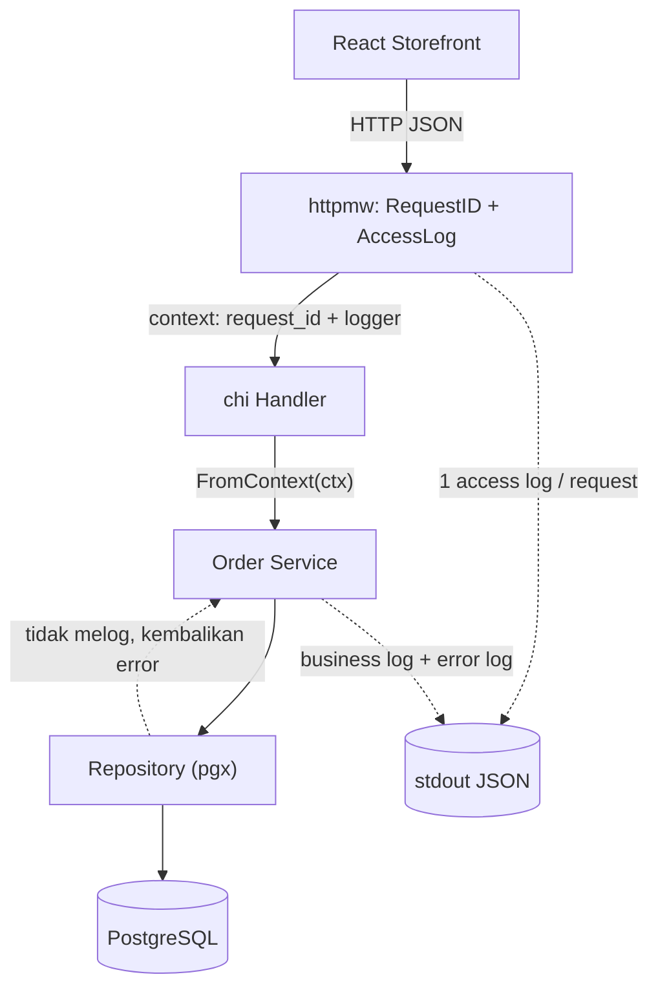
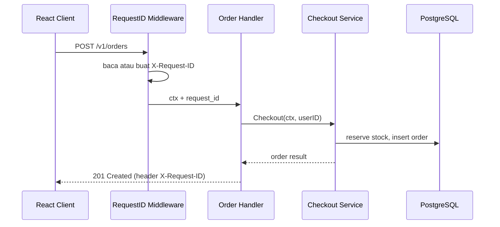
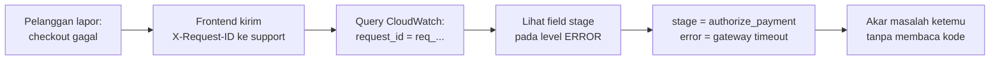

import { Section, Box, Steps, Step, Recap, CardGrid, Card, Chip, Hero, Compare, FileTree, Endpoint, Def } from "@components";

<Hero eyebrow="Roadmap 4 &middot; Clean Backend Architecture" title="Logging Strategy yang <em>Observable</em><br />Backend yang Bisa Ditelusuri">
  <p>Di chapter ini kita merakit logging Go yang mudah dicari, aman dari kebocoran rahasia, dan benar-benar berguna saat checkout skincare bermasalah di staging atau production.</p>
  <Fragment slot="meta">
    <Chip icon="code">Bahasa: <b>Go 1.26</b></Chip>
    <Chip icon="package">stdlib: <b>log/slog</b></Chip>
    <Chip icon="route">Middleware: <b>chi v5</b></Chip>
    <Chip icon="clock">~70 menit baca</Chip>
  </Fragment>
</Hero>

<Section num="01" id="intro" title="Kenapa Logging Harus Observable?" sub="Log bukan catatan yang asal tampil, log adalah alat investigasi ketika sistem hidup.">

<p class="lead">Developer React membaca error dari browser console, developer Laravel membuka `storage/logs/laravel.log`, tetapi backend Go di production butuh log yang bisa ditelusuri lintas request, lintas service, dan lintas jam.</p>

Pada online shop skincare, masalah yang paling mahal jarang muncul sebagai crash yang jelas. Checkout gagal karena stok berubah di detik terakhir, webhook pembayaran datang dua kali, atau customer service menelepon menanyakan order yang statusnya tertahan di `pending` sejak pagi. Tanpa log yang rapi, kita cuma punya dugaan dan tangkapan layar buram dari pelanggan.

<Def term="Observable logging"><p>Logging observable berarti setiap event penting ditulis dengan format konsisten (key-value), membawa konteks yang cukup untuk menjawab "request mana, user mana, order mana, dan berapa lama", lalu bisa dicari dengan presisi di sistem log seperti CloudWatch Logs Insights, bukan cuma dibaca berurutan dari atas ke bawah.</p></Def>

<Box variant="bridge" icon="🌉" label="Jembatan: dari console.log dan Laravel Monolog ke slog"><p>`console.log` enak untuk debugging lokal, dan Laravel punya Monolog yang bisa diarahkan ke banyak channel lewat `config/logging.php`. Padanannya di Go adalah `log/slog` dari standard library: bedanya, kita langsung menulis log JSON sejak awal supaya mesin bisa memfilter field seperti `request_id`, `user_id`, dan `duration_ms`, bukan sekadar membaca string panjang. Tidak ada package eksternal yang perlu dipasang.</p></Box>

Tujuan chapter ini bukan membuat log sebanyak-banyaknya. Tujuannya membuat log yang menjawab pertanyaan production dengan satu query: request mana yang gagal, user mana yang terdampak, order mana yang bermasalah, di tahap apa kegagalannya, dan berapa lama operasi itu berjalan. Itulah arti "men-debug masalah production lebih mudah".

<FileTree title="File logging yang akan kita tambahkan ke proyek skincare" tree={`
cmd/
  api/
    main.go                    # pasang logger global, RequestID, AccessLog
internal/
  logging/
    logger.go                  # setup slog JSON handler + level dinamis
    context.go                 # simpan/ambil logger lewat context.Context
    redact.go                  # tipe Secret pakai slog.LogValuer
  httpmw/
    request_id.go              # buat/teruskan X-Request-ID ke context
    access_log.go              # satu log ringkas per HTTP request
  order/
    service.go                 # contoh business log untuk checkout
`} />

</Section>

<Section num="02" id="string-vs-structured" title="String Log vs Structured Log" sub="Bedanya bukan soal tampilan, tetapi soal bagaimana log dicari oleh manusia dan mesin.">

<p class="lead">String log mudah ditulis tetapi sulit dicari dengan akurat. Structured log menulis event sebagai pasangan key-value, sehingga sistem log bisa memfilter `level`, `request_id`, `user_id`, atau `order_id` tanpa regex yang rapuh.</p>

Bayangkan tiga ribu baris log dari ratusan checkout bercampur dalam satu menit di production. Dengan string log, kamu menelusuri dengan `grep` dan berharap format pesannya konsisten. Dengan structured log, kamu menulis satu query `order_id = 1001 AND level = "ERROR"` dan langsung mendapat semua kegagalan untuk order itu, terurut waktu.

<Compare aLabel="String log" bLabel="Structured log" aTone="red" bTone="violet">
  <Fragment slot="a"><ul><li>`checkout failed for user 42 order 1001` enak dibaca manusia, tetapi sulit difilter tanpa regex.</li><li>Format berubah antar developer (kadang "user 42", kadang "uid=42").</li><li>Field penting tenggelam di dalam teks pesan, tidak bisa di-query.</li><li>Agregasi (berapa banyak checkout gagal per jam) hampir mustahil.</li></ul></Fragment>
  <Fragment slot="b"><ul><li>`msg`, `level`, `user_id`, `order_id`, dan `error` punya field masing-masing.</li><li>Query log mencari `order_id=1001` dengan presisi, bukan kira-kira.</li><li>Format identik di API, worker, dan webhook processor.</li><li>Bisa diagregasi: hitung, kelompokkan, dan beri alert otomatis.</li></ul></Fragment>
</Compare>

```text title="String log: mudah ditulis, sulit di-query"
2026/06/06 10:15:43 checkout failed for user 42 order 1001 payment timeout
```

```json title="Structured log: setiap konteks jadi field"
{
  "time": "2026-06-06T10:15:43.512Z",
  "level": "ERROR",
  "msg": "checkout failed",
  "service": "skincare-api",
  "env": "production",
  "request_id": "req_8f2c1a4d",
  "user_id": 42,
  "order_id": 1001,
  "stage": "authorize_payment",
  "error": "payment gateway timeout"
}
```

<Box variant="bridge" icon="🌉" label="Jembatan: console.log({ obj }) vs slog attribute"><p>Di React kamu mungkin menulis `console.log("checkout failed", { userId, orderId })` dan browser DevTools menampilkannya sebagai objek yang bisa di-expand. `slog` membawa ide yang sama ke server: pesan tetap satu string pendek, dan konteksnya ditulis sebagai attribute terstruktur. Bedanya, output JSON-nya dirancang untuk dibaca mesin di production, bukan mata manusia di DevTools.</p></Box>

<Box variant="note" icon="🧭" label="Kenapa JSON, bukan teks key-value"><p>slog punya `TextHandler` (format `key=value`) dan `JSONHandler`. Teks lebih enak dibaca di terminal lokal, JSON lebih mudah di-parse mesin. Di Roadmap 8 kita akan menjalankan API di container yang menulis ke `stdout`, dan CloudWatch Logs Insights mem-parse JSON secara native. Karena itu kita pakai JSON di mana pun kecuali saat sengaja ingin output ramah-mata di laptop sendiri.</p></Box>

</Section>

<Section num="03" id="posisi-logging" title="Posisi Logging di Modular Monolith" sub="Logging adalah cross-cutting concern, ia menembus semua layer tetapi punya aturan main.">

<p class="lead">Di Chapter 1 sampai 4 kamu sudah menata handler, service, repository, config, dan error. Logging adalah lapis yang berbeda sifatnya: ia menembus semuanya. Justru karena itu, ia butuh aturan agar tidak berubah jadi kebisingan.</p>

Aturan mainnya sederhana: middleware HTTP mencatat satu access log per request, service mencatat event bisnis dan kegagalan di boundary yang punya konteks, repository umumnya tidak melog (ia mengembalikan error ke atas), dan error yang sama tidak dilog dua kali di layer berbeda.



<p class="fig-cap"><b>Gambar 1.</b> Logging menembus semua layer, tetapi dengan pembagian kerja: middleware menulis access log, service menulis business log dan error log, repository hanya mengembalikan error ke atas. Semua mengalir ke `stdout` sebagai JSON.</p>

<CardGrid cols={3}>
  <Card><h4>Middleware</h4><p>Menulis tepat satu access log per request: `method`, `path`, `status`, `duration_ms`, plus `request_id`. Ia juga yang menanam logger ber-konteks ke `context.Context`.</p></Card>
  <Card><h4>Service</h4><p>Menulis business log (`order dibuat`, `webhook diterima`) dan error log di boundary, lengkap dengan `stage` dan field bisnis. Inilah lapis yang paling banyak melog.</p></Card>
  <Card><h4>Repository</h4><p>Umumnya tidak melog. Ia mengembalikan error domain ke service (lihat Chapter 4), dan biarkan service yang punya konteks bisnis memutuskan apa yang dilog.</p></Card>
</CardGrid>

<Box variant="bridge" icon="🌉" label="Jembatan: middleware Laravel vs middleware chi untuk logging"><p>Di Laravel, request logging sering dipasang sebagai middleware di `app/Http/Middleware` atau lewat `Log::channel(...)`. Pola di Go nyaris sama: logging request adalah middleware yang membungkus handler. Bedanya, di Go logger ber-konteks diteruskan eksplisit lewat `context.Context`, bukan diambil dari facade global `Log::`. Lebih verbose, tetapi setiap log line tahu persis request mana yang memilikinya.</p></Box>

<Box variant="warn" icon="⚠️" label="Jangan log error yang sama di setiap layer"><p>Godaan terbesar pemula adalah melog error di repository, lalu melog lagi di service, lalu melog lagi di handler. Hasilnya: satu kegagalan checkout muncul tiga kali dengan pesan berbeda, dan investigasi malah membingungkan. Pilih satu boundary (biasanya service atau handler) sebagai tempat melog, dan layer di bawahnya cukup mengembalikan error yang sudah dibungkus konteks (`fmt.Errorf("...: %w", err)`).</p></Box>

</Section>

<Section num="04" id="slog-handler" title="Setup slog dengan JSON Handler" sub="Go sudah punya structured logging di standard library sejak Go 1.21, dan ia matang di seri 1.26.">

<p class="lead">Paket `log/slog` adalah pilihan default yang aman untuk memulai: structured logging dengan level, message, dan attribute, tanpa membawa satu pun dependency eksternal.</p>

Paket resmi [`log/slog`](https://pkg.go.dev/log/slog) menyediakan tiga lapis konsep: `Logger` (API yang kamu panggil), `Handler` (yang memutuskan format dan tujuan output), dan `Attr` (pasangan key-value). Untuk production kita pakai `slog.NewJSONHandler` yang menulis JSON ke `os.Stdout`. Di container dan AWS, pola standarnya adalah aplikasi menulis ke `stdout`, lalu platform (ECS, CloudWatch) yang mengumpulkan dan menyimpan log itu.

```go title="internal/logging/logger.go"
package logging

import (
	"log/slog"
	"os"
	"strings"
)

// Config diisi dari Chapter 3 (Configuration Management).
type Config struct {
	Env      string // "local", "staging", "production"
	LogLevel string // "debug", "info", "warn", "error"
}

// NewLogger membangun satu logger proses, dipasang sekali saat startup.
func NewLogger(cfg Config) *slog.Logger {
	// LevelVar bisa diubah saat runtime tanpa membuat handler baru.
	level := new(slog.LevelVar)
	level.Set(parseLevel(cfg.LogLevel))

	var handler slog.Handler
	opts := &slog.HandlerOptions{
		Level: level,
		// AddSource menambah file:line. Berguna di lokal, mahal di production.
		AddSource: cfg.Env != "production",
	}

	if cfg.Env == "local" {
		// Lokal: teks ramah-mata di terminal.
		handler = slog.NewTextHandler(os.Stdout, opts)
	} else {
		// Staging/production: JSON untuk mesin (CloudWatch).
		handler = slog.NewJSONHandler(os.Stdout, opts)
	}

	// With menanam field tetap yang ikut di SETIAP log line proses ini.
	logger := slog.New(handler).With(
		slog.String("service", "skincare-api"),
		slog.String("env", cfg.Env),
	)

	// SetDefault agar slog.Info(...) global juga memakai handler ini,
	// termasuk log dari library yang memakai slog.Default().
	slog.SetDefault(logger)

	return logger
}

func parseLevel(s string) slog.Level {
	switch strings.ToLower(s) {
	case "debug":
		return slog.LevelDebug
	case "warn":
		return slog.LevelWarn
	case "error":
		return slog.LevelError
	default:
		return slog.LevelInfo
	}
}
```

<Box variant="tip" icon="💡" label="Kenapa JSON handler untuk production"><p>JSON handler membuat setiap attribute jadi field eksplisit yang stabil untuk query. Mencari `status >= 500` di JSON itu satu klausa; mencari potongan string yang sama di log teks butuh regex yang patah begitu ada developer mengubah kalimat pesan. Pisahkan format berdasarkan environment: teks ramah-mata di lokal, JSON di staging dan production.</p></Box>

<Box variant="warn" icon="⚠️" label="Jangan bangun handler baru di setiap request"><p>Buat logger sekali saat startup, lalu teruskan lewat dependency injection atau context. Logger boleh diperkaya dengan field tambahan via `With` (itu murah, ia menyalin pointer dan menyimpan attribute), tetapi membangun `NewJSONHandler` baru untuk tiap request memboroskan alokasi dan kehilangan field tetap proses.</p></Box>

<Box variant="note" icon="🆕" label="Baru di Go 1.26: slog.MultiHandler"><p>Go 1.26 (rilis 10 Februari 2026) menambahkan `slog.NewMultiHandler` ke standard library, sehingga satu logger bisa menulis ke beberapa tujuan sekaligus tanpa library pihak ketiga, misalnya JSON ke `stdout` untuk CloudWatch plus teks ke file lokal saat debugging. Untuk modul ini satu handler sudah cukup, tetapi simpan ini saat nanti butuh fan-out di Roadmap 8.</p></Box>

</Section>

<Section num="05" id="level" title="Log Level: Disiplin Bersama" sub="Level menjawab seberapa penting, field menjawab konteksnya apa.">

<p class="lead">Structured log baru berguna kalau seluruh tim sepakat kapan memakai `Debug`, `Info`, `Warn`, dan `Error`. Tanpa kesepakatan, level jadi acak dan filter `level = "ERROR"` kehilangan arti.</p>

slog punya empat level bawaan dengan nilai numerik (`Debug` = -4, `Info` = 0, `Warn` = 4, `Error` = 8). Handler hanya menulis log yang levelnya sama atau lebih tinggi dari `Level` yang dipasang. Karena kita memakai `slog.LevelVar`, ambang ini bisa kamu naik-turunkan tanpa restart, misalnya menurunkan ke `Debug` sementara saat sedang menyelidiki insiden, lalu menaikkan lagi ke `Info`.

<CardGrid cols={2}>
  <Card><h4>Debug</h4><p>Detail teknis untuk investigasi di lokal atau staging: payload yang sudah disanitasi, keputusan branching internal, hasil antara. Biasanya dimatikan di production.</p></Card>
  <Card><h4>Info</h4><p>Event bisnis normal yang penting: order dibuat, webhook payment diterima, worker selesai memproses job. Inilah denyut nadi sistem yang sehat.</p></Card>
  <Card><h4>Warn</h4><p>Kondisi tidak ideal tetapi sistem masih jalan: stok hampir habis, signature webhook gagal karena request buruk, retry ke provider. Layak dipantau, belum perlu dibangunkan tengah malam.</p></Card>
  <Card><h4>Error</h4><p>Operasi gagal dan butuh investigasi: checkout gagal, query database error, provider payment timeout. Inilah yang memicu alert di Roadmap 8.</p></Card>
</CardGrid>

Field yang konsisten lebih penting daripada pesan yang puitis. Untuk API skincare, kosakata field minimum yang sering dipakai adalah `request_id`, `method`, `path`, `status`, `duration_ms`, `user_id`, `order_id`, `variant_id`, `stage`, dan `error`. Sepakati nama-nama ini sekali, lalu pakai persis sama di mana pun.

```go title="internal/order/service.go"
// Event normal: pakai Info. Field bisnis sebagai Attr.
logger.InfoContext(ctx, "checkout completed",
	slog.Int64("user_id", userID),
	slog.Int64("order_id", order.ID),
	slog.Int64("total_rupiah", order.TotalRupiah),
	slog.Int("item_count", len(items)),
)

// Kondisi tidak ideal tapi belum gagal: pakai Warn.
logger.WarnContext(ctx, "inventory is low",
	slog.Int64("variant_id", variantID),
	slog.Int("remaining_stock", remainingStock),
)

// Operasi gagal: pakai Error, sertakan stage dan error.
logger.ErrorContext(ctx, "checkout failed",
	slog.Int64("user_id", userID),
	slog.String("stage", "reserve_inventory"),
	slog.String("error", err.Error()),
)
```

<Box variant="bridge" icon="🌉" label="Jembatan: dari Laravel context array ke slog Attr"><p>Di Laravel kamu menulis `Log::info('checkout completed', ['order_id' =&gt; $id])` dengan array context. Di slog, context ditulis sebagai attribute bertipe seperti `slog.Int64("order_id", id)`. Bedanya yang penting: slog meminta kamu menyebut tipe (`Int64`, `String`, `Duration`), sehingga `order_id` selalu angka di JSON, bukan kadang string kadang angka. Konsistensi tipe ini yang membuat query agregasi tidak patah.</p></Box>

<Box variant="tip" icon="💡" label="Pakai *Context dan LogAttrs untuk path panas"><p>Selalu pilih varian `InfoContext`/`ErrorContext` agar `ctx` ikut (penting untuk cancellation dan, nanti, tracing). Untuk path yang sangat sering dipanggil, `logger.LogAttrs(ctx, slog.LevelInfo, msg, attrs...)` sedikit lebih cepat karena menerima `[]slog.Attr` langsung tanpa konversi `...any`.</p></Box>

</Section>

<Section num="06" id="request-id" title="Request ID lewat Middleware chi" sub="Satu request checkout melewati handler, service, repository, dan payment client. Request ID adalah benang merahnya.">

<p class="lead">Tanpa request ID, log dari ratusan pelanggan bercampur jadi satu. Dengan request ID, kamu bisa menarik semua event satu request checkout: dari `POST /v1/orders`, validasi cart, pengurangan stok, otorisasi pembayaran, sampai response akhir, lalu membacanya berurutan.</p>

Kita membuat middleware chi yang membaca header `X-Request-ID` dari client (kalau ada, misalnya dari API gateway), atau membangkitkan satu yang baru, lalu menyimpannya di `context.Context` dan menempelkannya di response. chi v5 punya `middleware.RequestID` bawaan, tetapi membuat sendiri membuat kamu paham persis apa yang terjadi dan bebas memilih format ID-nya.



<p class="fig-cap"><b>Gambar 2.</b> `request_id` lahir di middleware, ikut mengalir lewat `context.Context` ke setiap layer, dan dipantulkan kembali ke client lewat header response.</p>

```go title="internal/httpmw/request_id.go"
package httpmw

import (
	"context"
	"crypto/rand"
	"encoding/hex"
	"net/http"
)

const requestIDHeader = "X-Request-ID"

// contextKey unexported agar tidak bentrok dengan key package lain.
type requestIDContextKey struct{}

// RequestID membaca atau membangkitkan request_id, lalu menaruhnya di context.
func RequestID(next http.Handler) http.Handler {
	return http.HandlerFunc(func(w http.ResponseWriter, r *http.Request) {
		requestID := r.Header.Get(requestIDHeader)
		if requestID == "" {
			requestID = newRequestID()
		}

		// Pantulkan ke client agar frontend bisa menyimpan/menampilkannya.
		w.Header().Set(requestIDHeader, requestID)

		ctx := context.WithValue(r.Context(), requestIDContextKey{}, requestID)
		next.ServeHTTP(w, r.WithContext(ctx))
	})
}

// RequestIDFromContext mengambil request_id; aman dipanggil di layer mana pun.
func RequestIDFromContext(ctx context.Context) string {
	requestID, ok := ctx.Value(requestIDContextKey{}).(string)
	if !ok {
		return ""
	}

	return requestID
}

func newRequestID() string {
	var b [8]byte
	if _, err := rand.Read(b[:]); err != nil {
		return "req_unknown"
	}

	return "req_" + hex.EncodeToString(b[:])
}
```

<Box variant="bridge" icon="🌉" label="Jembatan: AsyncLocalStorage vs context.Context"><p>Di Node, untuk membawa request ID lintas fungsi tanpa mengoper argumen, kamu mungkin pakai `AsyncLocalStorage`. Go tidak punya penyimpanan implisit per-request semacam itu, dan itu disengaja: nilai per-request dibawa eksplisit lewat `context.Context` yang dioper sebagai parameter pertama. Lebih banyak ketikan, tetapi tidak ada keadaan tersembunyi yang sulit dilacak saat dua request berjalan bersamaan.</p></Box>

<Box variant="warn" icon="⚠️" label="Pakai struct kosong sebagai context key, bukan string"><p>`context.WithValue(ctx, "request_id", id)` dengan key string berbahaya: package lain bisa memakai string yang sama dan saling menimpa nilai. Idiom Go adalah tipe unexported `type requestIDContextKey struct{}` sebagai key, sehingga key-nya unik secara tipe dan tidak mungkin bentrok dengan package lain.</p></Box>

</Section>

<Section num="07" id="logger-context" title="Logger di Context: User ID Otomatis" sub="Daripada mengoper request_id dan user_id ke setiap pemanggilan log, tanam logger ber-konteks sekali.">

<p class="lead">Kita bisa mengoper `request_id` ke setiap `logger.Info(...)`, tetapi itu berulang dan mudah lupa. Cara yang lebih bersih: simpan satu `*slog.Logger` yang sudah membawa field request di dalam `context.Context`, lalu setiap layer mengambilnya dengan `FromContext(ctx)`.</p>

Logger yang sudah diperkaya dengan `With(slog.String("request_id", ...))` akan menyertakan field itu di setiap log line, otomatis, tanpa pemanggil perlu mengingatnya. Saat auth middleware (dari Roadmap 2 / Roadmap 7) sudah menaruh `user_id` di context, kita perkaya logger dengan `user_id` juga, sehingga seluruh log untuk request itu langsung membawa siapa pelakunya.

```go title="internal/logging/context.go"
package logging

import (
	"context"
	"log/slog"
)

type loggerContextKey struct{}

// IntoContext menyimpan logger (yang sudah diperkaya) ke dalam context.
func IntoContext(ctx context.Context, logger *slog.Logger) context.Context {
	return context.WithValue(ctx, loggerContextKey{}, logger)
}

// FromContext mengambil logger ber-konteks; jatuh ke slog.Default() bila tak ada,
// sehingga aman dipanggil di mana pun tanpa takut nil pointer.
func FromContext(ctx context.Context) *slog.Logger {
	logger, ok := ctx.Value(loggerContextKey{}).(*slog.Logger)
	if !ok || logger == nil {
		return slog.Default()
	}

	return logger
}
```

Field `user_id` diperkaya di middleware autentikasi, setelah token diverifikasi. Polanya: ambil logger dari context, tambahkan `user_id`, lalu simpan kembali logger yang sudah diperkaya itu ke context untuk layer berikutnya.

```go title="internal/httpmw/enrich_user.go"
package httpmw

import (
	"log/slog"
	"net/http"

	"github.com/kamu/skincare-backend/internal/logging"
)

// EnrichUser dipasang SETELAH middleware auth menaruh user_id di context.
// Ia memperkaya logger ber-konteks dengan user_id agar ikut di semua log line.
//
// UserIDFromContext disediakan oleh middleware autentikasi (Roadmap 7) dan
// tinggal di package httpmw yang sama, jadi forward-reference ini akan tersedia
// begitu modul autentikasi terpasang.
func EnrichUser(next http.Handler) http.Handler {
	return http.HandlerFunc(func(w http.ResponseWriter, r *http.Request) {
		ctx := r.Context()

		userID, ok := UserIDFromContext(ctx)
		if ok {
			logger := logging.FromContext(ctx).With(slog.Int64("user_id", userID))
			ctx = logging.IntoContext(ctx, logger)
		}

		next.ServeHTTP(w, r.WithContext(ctx))
	})
}
```

<Box variant="bridge" icon="🌉" label="Jembatan: Log::withContext Laravel vs logger ber-konteks Go"><p>Laravel 8+ punya `Log::withContext(['user_id' =&gt; $id])` yang menyisipkan field ke semua log berikutnya dalam request itu. slog mencapai hasil yang sama dengan `logger.With(...)` lalu menyimpannya di `context.Context`. Bedanya, di Go konteks itu eksplisit terbawa lewat `ctx`, jadi log dari goroutine yang kamu jalankan untuk request lain tidak akan keliru mengambil `user_id` orang lain.</p></Box>

<Box variant="tip" icon="💡" label="Satu kali perkaya, banyak kali nikmati"><p>Begitu `request_id` dan `user_id` sudah menempel di logger dalam context, service cukup memanggil `logging.FromContext(ctx).InfoContext(ctx, "checkout completed", ...)` dan kedua field itu ikut tanpa diketik ulang. Field bisnis spesifik (`order_id`, `stage`) ditambahkan di titik pemanggilan, field request mengalir otomatis.</p></Box>

</Section>

<Section num="08" id="access-log" title="Access Log Middleware" sub="Setiap request HTTP perlu satu log ringkas yang konsisten: siapa, ke mana, hasilnya apa, berapa lama.">

<p class="lead">Access log adalah satu baris per request yang mencatat metode, path, status, dan durasi. Ia juga tempat yang tepat untuk menanam logger ber-konteks (dengan `request_id`) ke `context.Context`, sehingga layer di bawahnya tinggal mengambilnya.</p>

Di Go, middleware adalah fungsi yang membungkus `http.Handler`. Karena kita perlu tahu status code yang akhirnya ditulis handler, kita bungkus `http.ResponseWriter` dengan recorder kecil yang mengintip `WriteHeader`. Setelah handler selesai, kita hitung durasi dan tulis satu log dengan level yang sesuai status: `Error` untuk 5xx, `Warn` untuk 4xx, `Info` untuk sisanya.

```go title="internal/httpmw/access_log.go"
package httpmw

import (
	"log/slog"
	"net/http"
	"time"

	"github.com/kamu/skincare-backend/internal/logging"
)

// statusRecorder mengintip status code agar bisa dicatat di access log.
type statusRecorder struct {
	http.ResponseWriter
	status int
}

func (r *statusRecorder) WriteHeader(status int) {
	r.status = status
	r.ResponseWriter.WriteHeader(status)
}

// AccessLog menanam logger ber-konteks, menjalankan handler, lalu menulis 1 log.
func AccessLog(baseLogger *slog.Logger) func(http.Handler) http.Handler {
	return func(next http.Handler) http.Handler {
		return http.HandlerFunc(func(w http.ResponseWriter, r *http.Request) {
			startedAt := time.Now()
			requestID := RequestIDFromContext(r.Context())

			// Logger yang membawa request_id, method, path untuk SELURUH request.
			logger := baseLogger.With(
				slog.String("request_id", requestID),
				slog.String("method", r.Method),
				slog.String("path", r.URL.Path),
			)

			// Tanam ke context agar handler dan service mengambilnya.
			ctx := logging.IntoContext(r.Context(), logger)
			recorder := &statusRecorder{ResponseWriter: w, status: http.StatusOK}

			next.ServeHTTP(recorder, r.WithContext(ctx))

			attrs := []slog.Attr{
				slog.Int("status", recorder.status),
				slog.Int64("duration_ms", time.Since(startedAt).Milliseconds()),
			}

			switch {
			case recorder.status >= http.StatusInternalServerError:
				logger.LogAttrs(ctx, slog.LevelError, "http request failed", attrs...)
			case recorder.status >= http.StatusBadRequest:
				logger.LogAttrs(ctx, slog.LevelWarn, "http request client error", attrs...)
			default:
				logger.LogAttrs(ctx, slog.LevelInfo, "http request completed", attrs...)
			}
		})
	}
}
```

Urutan pemasangan middleware menentukan urutan eksekusi. `RequestID` harus jalan lebih dulu agar `AccessLog` bisa membaca request ID dari context. Wiring-nya disusun di `cmd/api/main.go`, menyatu dengan dependency injection dari Chapter sebelumnya.

```go title="cmd/api/main.go"
package main

import (
	"net/http"
	"os"
	"time"

	"github.com/go-chi/chi/v5"

	"github.com/kamu/skincare-backend/internal/httpmw"
	"github.com/kamu/skincare-backend/internal/logging"
)

func main() {
	// Config datang dari Chapter 3 (di sini disederhanakan).
	logger := logging.NewLogger(logging.Config{
		Env:      os.Getenv("APP_ENV"),
		LogLevel: os.Getenv("LOG_LEVEL"),
	})

	r := chi.NewRouter()
	r.Use(httpmw.RequestID)        // 1. buat request_id dulu
	r.Use(httpmw.AccessLog(logger)) // 2. baru access log bisa membacanya

	r.Get("/health", func(w http.ResponseWriter, r *http.Request) {
		w.WriteHeader(http.StatusOK)
		_, _ = w.Write([]byte("ok"))
	})

	logger.Info("api server starting", slog.String("addr", ":8080"))

	srv := &http.Server{
		Addr:              ":8080",
		Handler:           r,
		ReadHeaderTimeout: 5 * time.Second,
	}
	if err := srv.ListenAndServe(); err != nil {
		logger.Error("api server stopped", slog.String("error", err.Error()))
		os.Exit(1)
	}
}
```

<Box variant="warn" icon="⚠️" label="Urutan middleware itu menentukan"><p>`RequestID` wajib dipasang sebelum `AccessLog`, karena access logger membaca `request_id` dari context yang baru diisi oleh `RequestID`. Pasang juga `EnrichUser` setelah middleware autentikasi tetapi sebelum route domain, supaya `user_id` sudah menempel di logger saat handler mulai bekerja. Salah urutan, fieldnya kosong tanpa error apa pun.</p></Box>

<Box variant="note" icon="🧭" label="Catatan: import slog di main"><p>Cuplikan di atas memakai `slog.String`. Tambahkan `"log/slog"` ke blok import `main` saat kamu menyalinnya. Di proyek nyata, `gofmt` dan `goimports` akan merapikan import ini otomatis.</p></Box>

</Section>

<Section num="09" id="error-context" title="Error Context yang Cukup" sub="Log error yang baik memberi tahu operasi apa yang gagal dan input bisnis mana yang relevan.">

<p class="lead">Pesan error mentah jarang cukup. `payment timeout` tidak memberi tahu order mana, user mana, atau di tahap apa kegagalan terjadi. Error context yang baik menjawab semua itu dalam satu log line.</p>

Ingat dari Chapter 4: di Go, error adalah nilai. Repository mengembalikan error domain, service membungkusnya dengan `fmt.Errorf("...: %w", err)` untuk menambah jejak, dan logging dilakukan di boundary yang punya konteks bisnis cukup, bukan di setiap fungsi kecil. `stage` adalah field paling berharga di sini: ia memberi tahu di langkah mana checkout patah.

<Compare aLabel="Kurang berguna" bLabel="Lebih berguna" aTone="red" bTone="teal">
  <Fragment slot="a"><ul><li>`logger.Error("failed", "error", err)` tidak menjelaskan operasi, user, stage, atau order.</li><li>Investigasi terpaksa membaca kode dulu untuk menebak apa yang gagal.</li><li>Tidak bisa diagregasi: berapa banyak gagal di tahap pembayaran vs tahap stok?</li></ul></Fragment>
  <Fragment slot="b"><ul><li>`logger.ErrorContext(ctx, "checkout failed", slog.String("stage", "authorize_payment"), slog.Int64("order_id", id), slog.String("error", err.Error()))` menjelaskan lokasi kegagalan.</li><li>Field bisnis membantu customer support dan engineer melihat pola.</li><li>Bisa di-group by `stage` untuk menemukan tahap paling rapuh.</li></ul></Fragment>
</Compare>

```go title="internal/order/service.go"
package order

import (
	"context"
	"fmt"
	"log/slog"
	"time"

	"github.com/kamu/skincare-backend/internal/logging"
)

type Service struct {
	repo  Repository
	pay   PaymentGateway
	clock func() time.Time
}

// Checkout melog di boundary service: satu Info saat sukses, satu Error per tahap gagal.
func (s *Service) Checkout(ctx context.Context, userID int64) (Order, error) {
	// Ambil logger ber-konteks; request_id dan user_id sudah menempel dari middleware.
	logger := logging.FromContext(ctx)

	cart, err := s.repo.GetActiveCart(ctx, userID)
	if err != nil {
		logger.ErrorContext(ctx, "checkout failed",
			slog.String("stage", "load_cart"),
			slog.String("error", err.Error()),
		)
		return Order{}, fmt.Errorf("load active cart: %w", err)
	}

	order, err := s.repo.CreateOrderFromCart(ctx, cart.ID, s.clock())
	if err != nil {
		logger.ErrorContext(ctx, "checkout failed",
			slog.String("stage", "create_order"),
			slog.Int64("cart_id", cart.ID),
			slog.String("error", err.Error()),
		)
		return Order{}, fmt.Errorf("create order from cart: %w", err)
	}

	if err := s.pay.Authorize(ctx, order.OrderNumber, order.TotalRupiah); err != nil {
		logger.ErrorContext(ctx, "checkout failed",
			slog.String("stage", "authorize_payment"),
			slog.Int64("order_id", order.ID),
			slog.String("order_number", order.OrderNumber),
			slog.String("error", err.Error()),
		)
		return Order{}, fmt.Errorf("authorize payment: %w", err)
	}

	logger.InfoContext(ctx, "checkout completed",
		slog.Int64("order_id", order.ID),
		slog.String("order_number", order.OrderNumber),
		slog.Int64("total_rupiah", order.TotalRupiah),
	)

	return order, nil
}
```

<Box variant="bridge" icon="🌉" label="Jembatan: stack trace JS vs error context + %w di Go"><p>Di JavaScript, error membawa stack trace otomatis yang menunjukkan rantai pemanggilan. Go tidak menyertakan stack trace di error standar; sebagai gantinya, kamu membangun "jejak naratif" dengan `fmt.Errorf("authorize payment: %w", err)` di tiap layer. Saat dicetak, error menjadi `authorize payment: create order from cart: connection refused`, sebuah breadcrumb yang menunjukkan jalur kegagalan. Field `stage` di log melengkapi jejak ini dengan konteks bisnis.</p></Box>

<Box variant="tip" icon="💡" label="Log di boundary, bukan di tiap fungsi"><p>Pilih satu tempat melog: handler, orchestration service, worker job, atau webhook processor, yaitu titik yang tahu konteks bisnis penuh. Layer di bawahnya cukup mengembalikan error yang dibungkus `%w`. Aturan praktisnya: kalau kamu sudah melog error lalu mengembalikannya juga, pemanggil di atas jangan melog lagi, cukup tangani atau teruskan.</p></Box>

</Section>

<Section num="10" id="data-sensitif" title="Data Sensitif yang Tidak Boleh Dilog" sub="Log production sering bertahan berbulan-bulan dan dibaca banyak orang serta banyak sistem.">

<p class="lead">Logging yang baik bukan hanya lengkap, tetapi juga aman. Sekali rahasia masuk ke log, ia tersimpan di banyak tempat (CloudWatch, backup, indeks pencarian) dan sangat sulit dicabut. Pencegahan jauh lebih murah daripada pembersihan.</p>

Untuk online shop skincare, jangan pernah menulis password, hash password yang tidak perlu, access token, refresh token, header `Authorization`, session cookie, nomor kartu lengkap (PAN), CVV, alamat lengkap bila tidak perlu, atau payload webhook mentah yang berisi secret provider. Log cukup ID referensi, status, dan metadata aman untuk tracing.

<CardGrid cols={2}>
  <Card><h4>Aman untuk dilog</h4><p>`request_id`, `user_id`, `order_id`, `order_number`, `provider`, `status`, `payment_status`, `duration_ms`, `error_code`, dan empat digit terakhir kartu (`card_last4`).</p></Card>
  <Card><h4>Jangan pernah dilog</h4><p>`password`, `jwt`, `access_token`, `refresh_token`, header `Authorization`, `Cookie`, nomor kartu penuh (PAN), `cvv`, dan secret provider payment.</p></Card>
</CardGrid>

Cara paling rapuh adalah mengandalkan ingatan setiap developer untuk tidak melog rahasia. Cara idiomatik di slog adalah membuat rahasia itu mustahil dilog dengan benar: bungkus nilai sensitif dalam tipe yang mengimplementasikan `slog.LogValuer`, sehingga ia selalu mencetak `REDACTED` apa pun yang terjadi.

```go title="internal/logging/redact.go"
package logging

import "log/slog"

// Secret membungkus string sensitif (token, password, secret provider).
// Karena ia mengimplementasikan slog.LogValuer, slog TIDAK PERNAH
// mencetak nilai aslinya, bahkan jika developer lupa dan melognya.
type Secret string

// LogValue dipanggil slog saat hendak melog nilai bertipe Secret.
func (Secret) LogValue() slog.Value {
	return slog.StringValue("REDACTED")
}

// Card membungkus nomor kartu agar log hanya menampilkan 4 digit terakhir.
type Card string

func (c Card) LogValue() slog.Value {
	s := string(c)
	if len(s) < 4 {
		return slog.StringValue("****")
	}

	return slog.StringValue("****" + s[len(s)-4:])
}
```

Dengan tipe ini, sekali sebuah field dideklarasikan sebagai `Secret`, ia aman selamanya. Bahkan kalau developer yang sedang terburu-buru menulis `logger.Info("debug", "token", token)`, output-nya tetap `"token":"REDACTED"`.

```go title="contoh pemakaian Secret dan Card"
token := logging.Secret(rawAccessToken)
pan := logging.Card("4111111111111111")

logger.InfoContext(ctx, "payment attempt",
	slog.Int64("order_id", order.ID),
	slog.String("provider", "midtrans"),
	slog.Any("access_token", token), // -> "access_token":"REDACTED"
	slog.Any("card", pan),           // -> "card":"****1111"
)
```

Untuk pertahanan lapis kedua, `HandlerOptions.ReplaceAttr` bisa menyensor field berdasarkan key di seluruh aplikasi, jaring pengaman terakhir kalau ada rahasia yang lolos dengan key yang sudah dikenal seperti `authorization` atau `password`.

```go title="internal/logging/logger.go (tambahan ReplaceAttr)"
var sensitiveKeys = map[string]struct{}{
	"authorization": {},
	"password":      {},
	"access_token":  {},
	"refresh_token": {},
	"cookie":        {},
	"cvv":           {},
}

// redactSensitive dipasang sebagai HandlerOptions.ReplaceAttr.
func redactSensitive(groups []string, a slog.Attr) slog.Attr {
	if _, ok := sensitiveKeys[strings.ToLower(a.Key)]; ok {
		return slog.String(a.Key, "REDACTED")
	}

	return a
}
```

<Box variant="bridge" icon="🌉" label="Jembatan: $hidden Laravel vs slog.LogValuer Go"><p>Laravel menyembunyikan field saat serialisasi model lewat `protected $hidden = ['password']`. slog.LogValuer adalah padanan yang lebih kuat untuk logging: alih-alih daftar nama yang harus diingat, kamu mengikat perilaku redaksi ke tipe data itu sendiri. Tipe `Secret` membawa aturan "jangan tampilkan aku" ke mana pun ia pergi, jadi keamanan tidak bergantung pada kedisiplinan pemanggil.</p></Box>

<Box variant="warn" icon="🚫" label="Jangan log payload webhook mentah"><p>Saat memproses webhook payment, godaan untuk `logger.Info("webhook", "body", string(rawBody))` sangat besar untuk debugging. Jangan. Body mentah berisi signature, secret, dan kadang data kartu. Log cukup `event_id`, `provider`, `order_number`, dan `status` setelah payload diparse dan diverifikasi. Saat butuh lebih untuk debugging, log field yang sudah dipilih satu per satu, bukan seluruh body.</p></Box>

<Box variant="tip" icon="💡" label="Tes lakmus: grep log lokal sebelum merge"><p>Sebelum menggabungkan fitur baru, jalankan endpoint-nya di lokal lalu `grep -iE 'password|bearer|token|cvv|4[0-9]{15}'` pada output log. Kalau ada yang nyangkut, perbaiki sebelum kode itu sampai ke staging. Jadikan ini bagian dari review code, karena rahasia masuk log biasanya bukan karena niat jahat, tetapi karena developer ingin cepat melihat payload saat debugging.</p></Box>

</Section>

<Section num="11" id="hands-on" title="Hands-on: Debug Satu Checkout" sub="Kita rangkai request ID, access log, business log, dan redaksi pada satu endpoint checkout, lalu menelusurinya seperti di production.">

<p class="lead">Hands-on ini menyambungkan semua potongan: middleware, logger ber-konteks, business log, dan redaksi. Targetnya, satu request checkout menghasilkan jejak log yang bisa kamu tarik utuh hanya dengan satu `request_id`.</p>

<Steps>
  <Step><b>Pasang logger dan middleware saat startup</b><p>Buat `logging.NewLogger`, lalu pasang `RequestID`, `AccessLog`, dan (setelah auth) `EnrichUser` pada router sebelum route domain.</p></Step>
  <Step><b>Ambil logger dari context di service</b><p>Pakai `logging.FromContext(ctx)` di `Checkout`, sehingga `request_id`, `method`, `path`, dan `user_id` ikut otomatis di setiap log line.</p></Step>
  <Step><b>Tambahkan field bisnis di tiap tahap</b><p>Sertakan `stage`, `order_id`, `order_number`, dan `total_rupiah` sesuai titik operasi, dan bungkus token/kartu dengan `Secret`/`Card`.</p></Step>
  <Step><b>Kirim request dengan X-Request-ID</b><p>Set header `X-Request-ID` manual lewat curl agar kamu bisa mencari semua log dari request yang sama, persis seperti menelusuri insiden production.</p></Step>
</Steps>

```bash title="Terminal"
curl -i -X POST http://localhost:8080/v1/orders \
  -H "Content-Type: application/json" \
  -H "X-Request-ID: req_demo_checkout_001" \
  -H "Authorization: Bearer dummy-access-token" \
  -d '{"idempotency_key":"chk_2026_0606_42"}'
```

Di terminal, kamu akan melihat tepat dua baris log untuk request sukses: satu dari service (`checkout completed`) dan satu dari access log (`http request completed`). Keduanya membawa `request_id` yang sama. Perhatikan bahwa header `Authorization` tidak pernah muncul di log, karena `ReplaceAttr` dan tipe `Secret` menyensornya.

```json title="Log dari service: checkout completed"
{
  "time": "2026-06-06T10:15:43.418Z",
  "level": "INFO",
  "msg": "checkout completed",
  "service": "skincare-api",
  "env": "staging",
  "request_id": "req_demo_checkout_001",
  "method": "POST",
  "path": "/v1/orders",
  "user_id": 42,
  "order_id": 1001,
  "order_number": "SKN-2026-0606-1001",
  "total_rupiah": 249000
}
```

```json title="Log dari access log middleware: 1 baris per request"
{
  "time": "2026-06-06T10:15:43.421Z",
  "level": "INFO",
  "msg": "http request completed",
  "service": "skincare-api",
  "env": "staging",
  "request_id": "req_demo_checkout_001",
  "method": "POST",
  "path": "/v1/orders",
  "user_id": 42,
  "status": 201,
  "duration_ms": 37
}
```

Sekarang skenario yang sebenarnya kita latih: checkout gagal di tahap pembayaran. Karena setiap kegagalan membawa `stage`, kamu langsung tahu titik patahnya tanpa membaca kode. Inilah alur men-debug masalah production yang menjadi tujuan chapter ini.



<p class="fig-cap"><b>Gambar 3.</b> Alur investigasi nyata. `request_id` menghubungkan keluhan pelanggan ke log, `stage` menunjuk tahap yang patah, dan `error` memberi sebabnya. Tiga field, satu query, akar masalah ketemu.</p>

```json title="Log saat checkout gagal di pembayaran"
{
  "time": "2026-06-06T10:16:02.105Z",
  "level": "ERROR",
  "msg": "checkout failed",
  "service": "skincare-api",
  "env": "staging",
  "request_id": "req_demo_checkout_001",
  "method": "POST",
  "path": "/v1/orders",
  "user_id": 42,
  "stage": "authorize_payment",
  "order_id": 1001,
  "order_number": "SKN-2026-0606-1001",
  "error": "payment gateway timeout"
}
```

<Box variant="note" icon="🧾" label="Query CloudWatch nanti di Roadmap 8"><p>Field JSON seperti `request_id`, `order_id`, dan `stage` akan dipakai langsung di CloudWatch Logs Insights, misalnya `fields @timestamp, msg, stage | filter request_id = "req_demo_checkout_001" | sort @timestamp asc`. Investasi format JSON yang kamu buat hari ini terbayar persis di sana.</p></Box>

<Endpoint method="POST" path="/v1/orders" desc="Checkout: menghasilkan business log + access log dengan request_id yang sama" />
<Endpoint method="GET" path="/health" desc="Health check: tetap melewati access log, berguna memverifikasi pipeline log" />

</Section>

<Section num="12" id="ringkasan" title="Ringkasan & Poin Penting">

<p class="lead">Logging yang observable membuat modular monolith skincare lebih mudah dirawat begitu masuk staging dan production: saat ada yang patah, kamu menelusuri, bukan menebak.</p>

<Recap title="Yang Wajib Menempel"><ul><li>Structured log mengalahkan string log di production karena field bisa di-query, difilter, dan diagregasi, bukan cuma dibaca berurutan.</li><li>`log/slog` adalah structured logging dari standard library Go, dan `slog.NewJSONHandler` ke `stdout` adalah format default untuk container dan CloudWatch.</li><li>Disiplinkan level bersama tim: `Debug` untuk detail teknis, `Info` untuk event bisnis normal, `Warn` untuk kondisi mencurigakan, `Error` untuk kegagalan operasi.</li><li>`request_id` lahir di middleware chi dan mengalir lewat `context.Context`; `user_id` diperkaya setelah auth, sehingga setiap log line tahu request dan pelakunya.</li><li>Log error di satu boundary dengan konteks cukup (`stage`, `order_id`, `error`), bukan berulang di tiap layer; pakai `fmt.Errorf("...: %w", err)` untuk jejak naratif.</li><li>Cegah kebocoran rahasia dengan tipe `slog.LogValuer` (`Secret`, `Card`) plus `ReplaceAttr` sebagai jaring pengaman; jangan pernah melog password, token, header Authorization, PAN, atau CVV.</li><li>Selaraskan kosakata field dengan skema kanonik proyek: `total_rupiah`, `order_number`, `variant_id`, bukan `total_amount` atau `payment_ref`.</li></ul></Recap>

Setelah chapter ini, Roadmap 4 makin siap untuk production: arsitektur sudah berlapis, config sudah rapi, error sudah punya bentuk, dan logging sudah bisa menjawab apa yang terjadi pada satu request tertentu. Langkah berikutnya di Chapter 6 adalah memisahkan validasi input dari aturan bisnis (stok, produk aktif, voucher, transisi status order), lalu Chapter 7 membahas idempotency agar retry jaringan dan webhook ganda tidak menggandakan order. Lebih jauh, di Roadmap 8 logging JSON ini bertemu CloudWatch Logs Insights untuk observability penuh saat backend skincare berjalan di AWS.

</Section>
