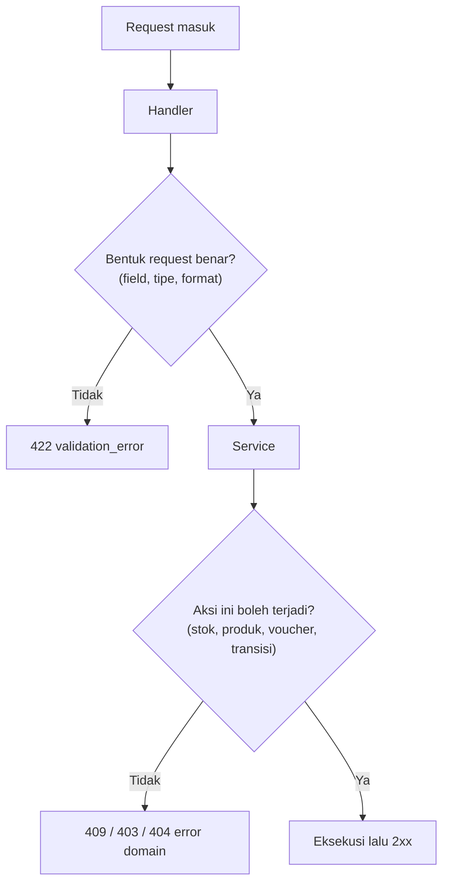
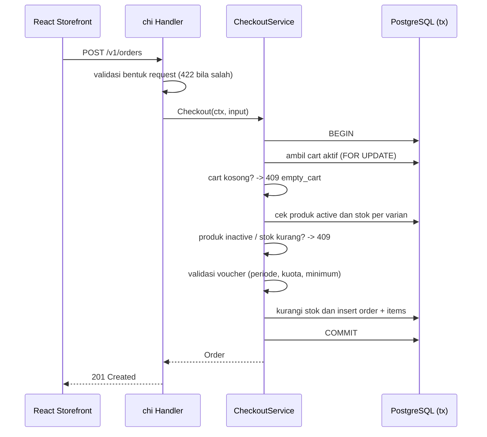
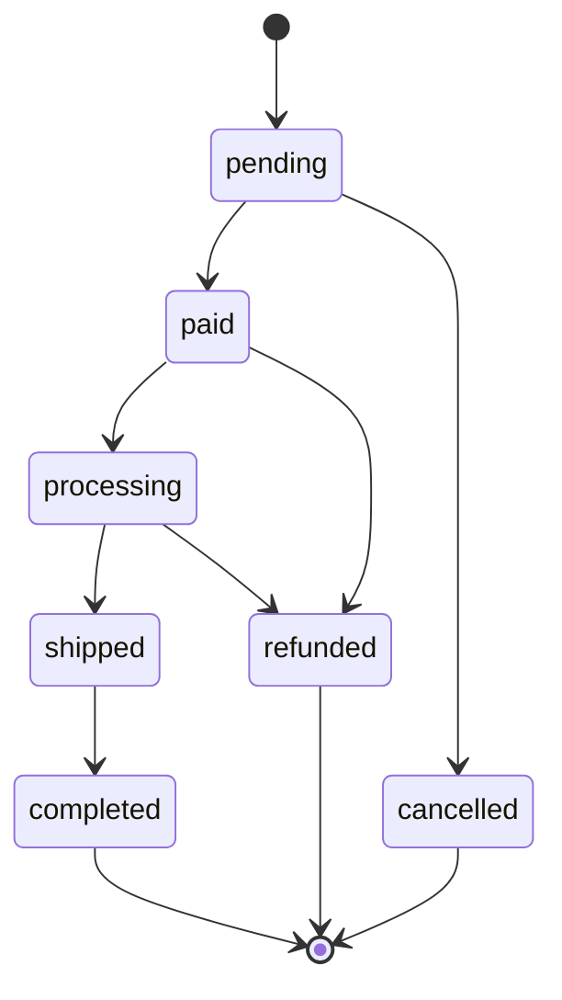
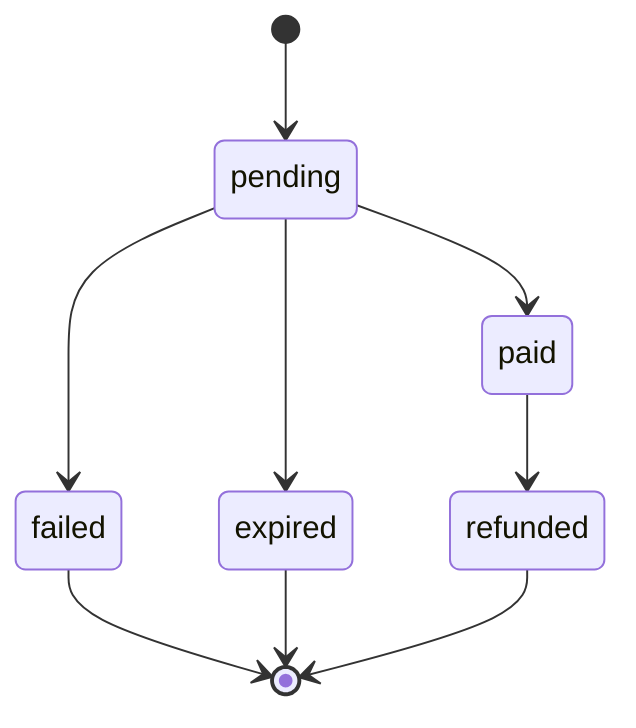

import { Section, Box, Steps, Step, Recap, CardGrid, Card, Chip, Hero, Compare, FileTree, Endpoint, Def } from "@components";

<Hero eyebrow="Roadmap 4 &middot; Clean Backend Architecture" title="Validasi Input vs <em>Business Rules</em><br />Batas Lapisan yang Tegas">
  <p>Kita pisahkan error bentuk request dari error keputusan domain, supaya handler menjaga kontrak HTTP dan service menjaga kebenaran bisnis online shop skincare.</p>
  <Fragment slot="meta">
    <Chip icon="shield">Roadmap 4</Chip>
    <Chip icon="code">Bahasa: <b>Go 1.26</b></Chip>
    <Chip icon="check">Validasi berlapis</Chip>
    <Chip icon="clock">~70 menit baca</Chip>
  </Fragment>
</Hero>

<Section num="01" id="intro" title="Kenapa Validasi Harus Dipisah?" sub="Dua error bisa terlihat sama di client, tetapi sumber dan obatnya berbeda total.">

<p class="lead">Di React kamu mengenal form validation, di Laravel kamu mengenal Form Request dan validasi model. Di Go kita memetakan kedua dunia itu ke dua lapisan yang berbeda: handler untuk bentuk request, service untuk aturan domain.</p>

Bayangkan customer mengirim `quantity` bernilai `0`. Itu masalah bentuk request: angkanya tidak masuk akal apa pun isi databasenya, dan handler boleh menolaknya sebelum memanggil service. Sekarang bayangkan customer mengirim `quantity` bernilai `2` sementara stok serum tinggal `1`. Bentuk request-nya sempurna, tetapi aksinya tidak boleh terjadi. Jawaban "boleh atau tidak" itu butuh data aktual dari sistem, bukan sekadar membaca JSON.

<Box variant="bridge" icon="🌉" label="Jembatan: dari form validation ke domain rule"><p>Di React, validasi form memastikan email terlihat seperti email dan angka terlihat seperti angka. Itu input validation. Tetapi React tidak tahu apakah voucher itu masih punya kuota, apakah produk sudah diarsipkan, atau apakah stok benar-benar tersedia. Pertanyaan itu hanya bisa dijawab server yang memegang state, dan di Go jawabannya hidup di service.</p></Box>

<Def term="Input validation"><p>Pemeriksaan bentuk input yang tidak butuh pengetahuan bisnis: field wajib, tipe data, panjang string, format email, angka positif, dan nilai enum yang dikenal. Cukup melihat request, tanpa menyentuh database.</p></Def>

<Def term="Business rule validation"><p>Pemeriksaan aturan domain yang butuh state aplikasi, database, waktu, atau transisi: stok cukup, produk aktif, voucher belum kedaluwarsa, minimum pembelian terpenuhi, dan transisi order atau pembayaran yang legal.</p></Def>

Pemisahan ini bukan soal kerapian saja, ia menentukan tiga hal sekaligus: di mana sebuah aturan diuji, status HTTP apa yang pas, dan apakah aturan itu konsisten ketika dipanggil dari jalur selain HTTP. Service test memastikan aturan bisnis tetap benar walau dipicu dari HTTP handler, worker, CLI admin, atau webhook payment. Handler test cukup memastikan request buruk ditolak cepat.

<Box variant="note" icon="🧭" label="Posisi chapter ini di Roadmap 4"><p>Chapter 4 sudah menyiapkan tipe error domain (not found, conflict, unauthorized, validation, internal) dan pemetaannya ke status HTTP. Chapter 6 memakai fondasi itu: input validation menghasilkan <em class="term">validation error</em>, sedangkan business rule menghasilkan error domain seperti conflict (409) atau forbidden (403). Untuk gaya idiomatik error, context, dan kompatibilitas Go 1, lihat <a href="https://go.dev/doc/go1.26">Go 1.26 release notes</a>, <a href="https://go.dev/doc/effective_go">Effective Go</a>, dan <a href="https://pkg.go.dev/context">package context</a>.</p></Box>

</Section>

<Section num="02" id="dua-jenis-validasi" title="Dua Jenis Validasi dan Tempatnya" sub="Pisahkan pertanyaan 'input ini berbentuk benar?' dari 'aksi ini boleh terjadi?'.">

<p class="lead">Desainnya bisa diringkas dalam satu kalimat: handler memvalidasi kontrak HTTP, service memvalidasi kebenaran domain. Begitu kamu tahu sebuah aturan butuh database atau waktu, kamu tahu ia milik service.</p>

<Compare aLabel="Handler: input validation" bLabel="Service: business rules" aTone="teal" bTone="violet">
  <Fragment slot="a"><ul><li>Memastikan JSON bisa dibaca dan tidak punya field asing.</li><li>Memeriksa field wajib, tipe data, panjang string, dan format.</li><li>Memeriksa nilai enum dikenal, misalnya status target ada di daftar.</li><li>Tidak menyentuh database untuk aturan domain.</li><li>Mengembalikan 400 Bad Request atau 422 Unprocessable Entity.</li></ul></Fragment>
  <Fragment slot="b"><ul><li>Memeriksa stok aktual dan status produk dari repository.</li><li>Memeriksa voucher: aktif, periode, kuota, dan minimum subtotal.</li><li>Memeriksa transisi status order dan status pembayaran.</li><li>Memutuskan harga final dan diskon dari data segar.</li><li>Mengembalikan error domain: conflict (409), not found (404), forbidden (403).</li></ul></Fragment>
</Compare>

Untuk membuat batas ini konkret, bedah tiga contoh nyata dari proyek skincare. Perhatikan bahwa "harga" muncul di dua sisi sekaligus, dan itu wajar: bentuknya divalidasi di handler, kewajarannya terhadap katalog divalidasi di service.

<CardGrid cols={3}>
  <Card><h4>Format</h4><p>Email customer harus berbentuk email, `quantity` harus integer minimal `1`, `price_rupiah` yang dikirim admin harus lebih besar dari `0`. Cukup dari request body.</p></Card>
  <Card><h4>State domain</h4><p>Produk harus `active` dan belum di-soft-delete, stok varian harus cukup, voucher harus dalam periode aktif dan belum melewati batas pemakaian. Butuh database.</p></Card>
  <Card><h4>Transisi</h4><p>Order boleh berpindah dari `pending` ke `paid`, tetapi tidak boleh dari `cancelled` ke `paid`. Pembayaran `expired` tidak boleh tiba-tiba jadi `paid`. Butuh state saat ini.</p></Card>
</CardGrid>



<p class="fig-cap"><b>Gambar 1.</b> Dua gerbang berurutan. Gerbang pertama (handler) menolak bentuk yang salah dengan 422. Gerbang kedua (service) menolak aksi yang dilarang aturan bisnis dengan status domain yang sesuai.</p>

<Box variant="tip" icon="💡" label="Aturan praktis satu kalimat"><p>Bila sebuah validasi bisa dijawab hanya dari request body, query string, path param, dan header, taruh di handler. Bila ia butuh database, waktu, role, stok, voucher, atau status saat ini, taruh di service. Tidak ada zona abu-abu yang perlu diperdebatkan lama.</p></Box>

</Section>

<Section num="03" id="input-validation-di-handler" title="Input Validation di Handler" sub="Handler adalah gerbang HTTP, bukan tempat aturan bisnis hidup.">

<p class="lead">Handler menerima data mentah dari dunia luar, memastikan bentuknya benar, lalu mengubahnya menjadi input bersih untuk service. Setelah itu ia tidak lagi peduli dari mana data datang.</p>

Go tidak punya magic seperti Laravel Form Request. Kita menulis validasi eksplisit agar kontrak API terbaca jelas. Untuk developer TypeScript, ini mirip membuat schema request (Zod, Yup), hanya saja tanpa runtime schema otomatis kecuali kita memilih library. Pendekatan tangan ini cocok untuk modular monolith karena setiap field error punya bentuk yang konsisten dan mudah dipetakan ke 422.

<Box variant="bridge" icon="🌉" label="Jembatan: dari Laravel Form Request ke method Validate"><p>Laravel memindahkan validasi ke class Form Request lalu controller-nya bersih. Di Go kita biasanya menaruh method `Validate` pada request DTO, ditopang helper di `internal/shared`, lalu handler memanggilnya sebelum service. Idenya sama (validasi keluar dari controller), tetapi alurnya eksplisit: kamu bisa membaca kapan `Validate` dipanggil.</p></Box>

```go title="internal/shared/validation.go"
package shared

import (
	"net/mail"
	"strings"
)

// FieldError adalah satu kesalahan bentuk pada satu field.
type FieldError struct {
	Field   string `json:"field"`
	Code    string `json:"code"`
	Message string `json:"message"`
}

// ValidationErrors mengumpulkan banyak FieldError sekaligus,
// supaya client menerima semua kesalahan dalam satu response.
type ValidationErrors []FieldError

func (e ValidationErrors) Error() string {
	return "validation failed"
}

func (e ValidationErrors) HasErrors() bool {
	return len(e) > 0
}

func (e *ValidationErrors) Add(field, code, message string) {
	*e = append(*e, FieldError{Field: field, Code: code, Message: message})
}

func (e *ValidationErrors) RequireString(field, value string) {
	if strings.TrimSpace(value) == "" {
		e.Add(field, "required", field+" wajib diisi")
	}
}

func (e *ValidationErrors) MaxRunes(field, value string, max int) {
	if len([]rune(value)) > max {
		e.Add(field, "too_long", field+" terlalu panjang")
	}
}

func (e *ValidationErrors) RequirePositiveInt64(field string, value int64) {
	if value <= 0 {
		e.Add(field, "positive", field+" harus lebih dari 0")
	}
}

func (e *ValidationErrors) RequireMinInt(field string, value, min int) {
	if value < min {
		e.Add(field, "min", field+" terlalu kecil")
	}
}

func (e *ValidationErrors) Email(field, value string) {
	if _, err := mail.ParseAddress(value); err != nil {
		e.Add(field, "email", field+" bukan email yang valid")
	}
}
```

Helper di atas memakai receiver pointer agar bisa menumpuk error, dan mengembalikan semua field error sekaligus, bukan berhenti di kesalahan pertama. Itu detail UX penting: form di frontend bisa menandai semua field bermasalah dalam satu giliran. Sekarang DTO produk memakainya.

```go title="internal/product/handler.go"
package product

import (
	"context"
	"encoding/json"
	"net/http"
	"strings"

	"github.com/kamu/skincare-backend/internal/shared"
)

// ProductCreator adalah kebutuhan handler dari service (accept interfaces).
type ProductCreator interface {
	CreateProduct(ctx context.Context, input CreateProductInput) (Product, error)
}

type Handler struct {
	products ProductCreator
}

func NewHandler(products ProductCreator) *Handler {
	return &Handler{products: products}
}

// CreateProductRequest adalah DTO HTTP: bentuk JSON yang masuk.
type CreateProductRequest struct {
	Name        string `json:"name"`
	Slug        string `json:"slug"`
	Description string `json:"description"`
	PriceRupiah int64  `json:"price_rupiah"`
}

// CreateProductInput adalah input bersih untuk service: tanpa jejak HTTP.
type CreateProductInput struct {
	Name        string
	Slug        string
	Description string
	PriceRupiah int64
}

func (h *Handler) CreateProduct(w http.ResponseWriter, r *http.Request) {
	var req CreateProductRequest

	decoder := json.NewDecoder(r.Body)
	decoder.DisallowUnknownFields() // tolak field asing: kontrak ketat

	if err := decoder.Decode(&req); err != nil {
		shared.WriteError(w, http.StatusBadRequest, "invalid_json", "Body JSON tidak valid")
		return
	}

	if err := req.Validate(); err != nil {
		shared.WriteValidationError(w, err)
		return
	}

	created, err := h.products.CreateProduct(r.Context(), req.ToInput())
	if err != nil {
		// Pemetaan error domain ke status HTTP dibahas penuh di Chapter 4.
		shared.WriteDomainError(w, err)
		return
	}

	shared.WriteJSON(w, http.StatusCreated, created)
}

// Validate hanya memeriksa BENTUK. Tidak ada query ke database di sini.
func (r CreateProductRequest) Validate() error {
	var v shared.ValidationErrors

	v.RequireString("name", r.Name)
	v.MaxRunes("name", r.Name, 120)
	v.RequireString("slug", r.Slug)
	v.MaxRunes("description", r.Description, 2_000)
	v.RequirePositiveInt64("price_rupiah", r.PriceRupiah)

	if v.HasErrors() {
		return v
	}
	return nil
}

func (r CreateProductRequest) ToInput() CreateProductInput {
	return CreateProductInput{
		Name:        strings.TrimSpace(r.Name),
		Slug:        strings.TrimSpace(r.Slug),
		Description: strings.TrimSpace(r.Description),
		PriceRupiah: r.PriceRupiah,
	}
}
```

Perhatikan tiga peran yang dipisah rapi. `CreateProductRequest` adalah DTO HTTP yang tahu soal JSON. `CreateProductInput` adalah input bersih yang tidak tahu apa-apa soal JSON, query string, atau dashboard admin. Method `Validate` hanya menyentuh field di dalam request itu sendiri. Service menerima `CreateProductInput`, bukan request HTTP, sehingga aturan bisnisnya bisa dipanggil dari mana saja.

<Box variant="warn" icon="⚠️" label="Jangan query database di input validation"><p>Memastikan `slug` tidak kosong boleh di handler. Tetapi memastikan `slug` belum dipakai produk lain butuh repository, jadi itu business rule atau constraint database (unique violation kode 23505) yang dipetakan menjadi 409 Conflict, bukan dijejalkan ke `Validate`.</p></Box>

<Box variant="tip" icon="💡" label="Uang tetap integer rupiah"><p>DTO memakai `price_rupiah int64` sesuai konvensi proyek: uang selalu integer rupiah penuh (`Rp150.000` disimpan sebagai `150000`), tidak pernah `float64`. Field JSON-nya `price_rupiah` agar niat tegas dan selaras dengan kolom `product_variants.price_rupiah` di PostgreSQL.</p></Box>

</Section>

<Section num="04" id="business-rules-di-service" title="Business Rules di Service" sub="Service adalah tempat keputusan bisnis yang harus konsisten di semua entry point.">

<p class="lead">Business rule menjawab satu pertanyaan: menurut aturan online shop kita, aksi ini boleh terjadi? Jawabannya bergantung pada data segar, bukan pada apa yang dikirim client.</p>

Pada Roadmap 4, service adalah batas utama domain. Handler boleh banyak (`POST /v1/cart/items`, admin panel, worker rekomendasi bundling, import CSV), tetapi mereka semua memanggil service yang sama, sehingga aturannya tidak pernah bercabang. Inilah alasan terbesar mengapa stok, voucher, dan transisi order tidak boleh hidup di handler.

<Box variant="bridge" icon="🌉" label="Jembatan: dari React state ke source of truth"><p>Frontend boleh menampilkan "stok tersisa 1" dari cache demi UX, tetapi Go service tetap satu-satunya source of truth. Jangan percaya state React (atau body request) untuk keputusan stok, voucher, atau status order. Client mengusulkan, server memutuskan.</p></Box>

Sebelum melihat checkout penuh, lihat satu contoh kecil yang jernih: menambah item ke cart. Service mengambil produk dan stok dari repository, menolak produk yang tidak bisa dijual, lalu menolak kuantitas melebihi stok. Error yang dikembalikan adalah error domain (sentinel error), bukan string mentah.

```go title="internal/cart/service.go"
package cart

import (
	"context"
	"errors"
	"fmt"
	"time"
)

// Sentinel error domain. Handler memetakannya ke status HTTP yang tepat.
var (
	ErrInvalidQuantity    = errors.New("invalid quantity")
	ErrProductUnavailable = errors.New("product unavailable")
	ErrInsufficientStock  = errors.New("insufficient stock")
)

// Product memetakan kolom yang relevan untuk keputusan jual.
// Selaras skema: products.status (draft/active/archived) + deleted_at.
type Product struct {
	ID        int64
	Status    string
	DeletedAt *time.Time
}

// CanBeSold mengunci aturan "produk bisa dijual" di satu method domain.
func (p Product) CanBeSold() bool {
	return p.Status == "active" && p.DeletedAt == nil
}

type AddItemInput struct {
	UserID    int64
	ProductID int64
	VariantID int64
	Quantity  int
}

type CartItem struct {
	ID        int64
	VariantID int64
	Quantity  int
}

// Service menerima interface (accept interfaces), bukan tipe konkret pgx.
type ProductRepository interface {
	GetByID(ctx context.Context, id int64) (Product, error)
}

type InventoryRepository interface {
	AvailableStock(ctx context.Context, variantID int64) (int, error)
}

type CartRepository interface {
	UpsertItem(ctx context.Context, input AddItemInput) (CartItem, error)
}

type Service struct {
	products  ProductRepository
	inventory InventoryRepository
	cart      CartRepository
}

func NewService(products ProductRepository, inventory InventoryRepository, cart CartRepository) *Service {
	return &Service{products: products, inventory: inventory, cart: cart}
}

func (s *Service) AddItem(ctx context.Context, input AddItemInput) (CartItem, error) {
	if input.Quantity < 1 {
		return CartItem{}, fmt.Errorf("add cart item: %w", ErrInvalidQuantity)
	}

	product, err := s.products.GetByID(ctx, input.ProductID)
	if err != nil {
		return CartItem{}, fmt.Errorf("get product %d: %w", input.ProductID, err)
	}
	if !product.CanBeSold() {
		return CartItem{}, fmt.Errorf("product %d: %w", input.ProductID, ErrProductUnavailable)
	}

	available, err := s.inventory.AvailableStock(ctx, input.VariantID)
	if err != nil {
		return CartItem{}, fmt.Errorf("available stock variant %d: %w", input.VariantID, err)
	}
	if available < input.Quantity {
		return CartItem{}, fmt.Errorf("variant %d only %d in stock: %w", input.VariantID, available, ErrInsufficientStock)
	}

	item, err := s.cart.UpsertItem(ctx, input)
	if err != nil {
		return CartItem{}, fmt.Errorf("upsert cart item: %w", err)
	}
	return item, nil
}
```

Ada tiga idiom Go yang sengaja dijaga di sini. Pertama, `context.Context` selalu jadi parameter pertama, agar pembatalan request dan deadline mengalir sampai ke repository dan query PostgreSQL. Kedua, service menerima interface repository, sehingga aturan bisnis bisa diuji dengan fake repository tanpa database (pola dari R3C10). Ketiga, error dibungkus dengan `%w` plus konteks, tetapi tetap membawa sentinel error domain di dalamnya, sehingga handler bisa memeriksa dengan `errors.Is`.

<Box variant="tip" icon="💡" label="Kenapa quantity dicek lagi di service?"><p>Kuantitas minimal `1` adalah input validation, dan idealnya sudah ditolak handler. Tetapi service tetap menyimpan guard kecil sebagai invariant: ketika `AddItem` dipanggil dari worker atau CLI yang tidak lewat handler HTTP, aturan minimal tetap berlaku. Service tidak boleh berasumsi pemanggilnya sudah memvalidasi.</p></Box>

<Box variant="warn" icon="⚠️" label="Sentinel error, bukan string mentah"><p>`errors.New(...)` di level package membuat sentinel yang bisa diperiksa handler dengan `errors.Is(err, ErrInsufficientStock)`. Jangan kembalikan `fmt.Errorf("stok kurang")` tanpa sentinel, karena handler terpaksa membandingkan string, dan itu rapuh begitu pesan diubah.</p></Box>

</Section>

<Section num="05" id="stok-dan-produk-aktif" title="Stok, Produk Aktif, dan Checkout" sub="Cart boleh optimistis, checkout harus final dan atomik.">

<p class="lead">Stok dicek dua kali dengan tujuan berbeda. Saat add to cart, cek untuk UX yang baik. Saat checkout, cek lagi untuk kebenaran transaksi, karena dunia sudah berubah sejak item masuk cart.</p>

Stok di online shop bergerak cepat. Customer A memasukkan sunscreen ke cart pukul 10:00, Customer B checkout unit terakhir pukul 10:01. Saat Customer A checkout pukul 10:02, service tidak boleh percaya isi cart lama. Cart hanyalah niat membeli, bukan reservasi. Checkout adalah momen kebenaran.



<p class="fig-cap"><b>Gambar 2.</b> Checkout sebagai satu transaksi. Handler hanya menjaga bentuk request, sedangkan seluruh business rule (cart, produk, stok, voucher) dievaluasi di service di dalam satu `pgx.Tx`, lalu commit di akhir.</p>

```go title="internal/order/checkout.go"
package order

import (
	"context"
	"errors"
	"fmt"

	"github.com/kamu/skincare-backend/internal/promotion"
)

var (
	ErrEmptyCart          = errors.New("empty cart")
	ErrProductUnavailable = errors.New("product unavailable")
	ErrInsufficientStock  = errors.New("insufficient stock")
)

type CheckoutInput struct {
	UserID      int64
	VoucherCode string
}

// CartItem membawa harga snapshot yang sudah dikunci saat dibaca dari katalog.
type CartItem struct {
	ProductID       int64
	VariantID       int64
	Quantity        int
	UnitPriceRupiah int64
}

type Order struct {
	ID             int64
	UserID         int64
	SubtotalRupiah int64
	DiscountRupiah int64
	TotalRupiah    int64
	Status         Status
}

// Kontrak yang dibutuhkan service checkout. Semua interface, mudah di-fake.
type CartReader interface {
	ListActiveItems(ctx context.Context, userID int64) ([]CartItem, error)
}

type ProductReader interface {
	CanBeSold(ctx context.Context, productID int64) (bool, error)
}

type Inventory interface {
	AvailableStock(ctx context.Context, variantID int64) (int, error)
	Reserve(ctx context.Context, variantID int64, quantity int) error
}

type VoucherValidator interface {
	Validate(ctx context.Context, in promotion.ValidateInput) (int64, error)
}

type OrderWriter interface {
	CreateFromCart(ctx context.Context, userID int64, items []CartItem, subtotalRupiah, discountRupiah int64) (Order, error)
}

type CheckoutService struct {
	cart      CartReader
	products  ProductReader
	inventory Inventory
	vouchers  VoucherValidator
	orders    OrderWriter
}

func NewCheckoutService(cart CartReader, products ProductReader, inventory Inventory, vouchers VoucherValidator, orders OrderWriter) *CheckoutService {
	return &CheckoutService{cart: cart, products: products, inventory: inventory, vouchers: vouchers, orders: orders}
}

func (s *CheckoutService) Checkout(ctx context.Context, input CheckoutInput) (Order, error) {
	items, err := s.cart.ListActiveItems(ctx, input.UserID)
	if err != nil {
		return Order{}, fmt.Errorf("list cart items: %w", err)
	}
	if len(items) == 0 {
		return Order{}, fmt.Errorf("checkout user %d: %w", input.UserID, ErrEmptyCart)
	}

	var subtotalRupiah int64
	for _, item := range items {
		sellable, err := s.products.CanBeSold(ctx, item.ProductID)
		if err != nil {
			return Order{}, fmt.Errorf("check product %d: %w", item.ProductID, err)
		}
		if !sellable {
			return Order{}, fmt.Errorf("product %d: %w", item.ProductID, ErrProductUnavailable)
		}

		available, err := s.inventory.AvailableStock(ctx, item.VariantID)
		if err != nil {
			return Order{}, fmt.Errorf("stock variant %d: %w", item.VariantID, err)
		}
		if available < item.Quantity {
			return Order{}, fmt.Errorf("variant %d available %d: %w", item.VariantID, available, ErrInsufficientStock)
		}

		subtotalRupiah += item.UnitPriceRupiah * int64(item.Quantity)
	}

	var discountRupiah int64
	if input.VoucherCode != "" {
		discountRupiah, err = s.vouchers.Validate(ctx, promotion.ValidateInput{
			Code:           input.VoucherCode,
			UserID:         input.UserID,
			SubtotalRupiah: subtotalRupiah,
		})
		if err != nil {
			return Order{}, fmt.Errorf("validate voucher %q: %w", input.VoucherCode, err)
		}
	}

	for _, item := range items {
		if err := s.inventory.Reserve(ctx, item.VariantID, item.Quantity); err != nil {
			return Order{}, fmt.Errorf("reserve variant %d: %w", item.VariantID, err)
		}
	}

	created, err := s.orders.CreateFromCart(ctx, input.UserID, items, subtotalRupiah, discountRupiah)
	if err != nil {
		return Order{}, fmt.Errorf("create order: %w", err)
	}
	return created, nil
}
```

Kode ini sengaja memisahkan langkah cek dan langkah reserve agar alurnya mudah dibaca. Di production, seluruh blok ini berjalan di dalam satu `pgx.Tx` (pola transaksi R3C08): cart dibaca dengan `FOR UPDATE`, stok dikurangi secara atomik, lalu order dan order_items di-insert sebelum commit. Tanpa transaksi, dua checkout paralel bisa lolos cek stok yang sama dan menyebabkan oversell.

<Box variant="warn" icon="⚠️" label="Race condition: cek tanpa kunci itu bohong"><p>`AvailableStock` lalu `Reserve` di luar transaksi adalah celah klasik time-of-check to time-of-use. Di traffic tinggi, dua request bisa sama-sama melihat stok `1` dan sama-sama lolos. Untuk checkout final, kurangi stok dalam transaksi dengan `UPDATE ... SET stock = stock - $1 WHERE stock >= $1` atau `SELECT ... FOR UPDATE`, sehingga database yang menjadi wasit, bukan dua snapshot yang sudah basi.</p></Box>

<Box variant="bridge" icon="🌉" label="Jembatan: harga snapshot, bukan referensi"><p>Di React, harga di cart hanyalah angka di memori yang boleh dihitung ulang. Saat checkout di Go, harga harus dibekukan menjadi `unit_price_rupiah` di `order_items`, persis seperti receipt. Bila esok admin menaikkan `product_variants.price_rupiah`, invoice lama tidak boleh ikut berubah. Inilah kenapa subtotal dihitung dari harga yang dikunci saat checkout, bukan dibaca ulang dari katalog yang masih hidup.</p></Box>

</Section>

<Section num="06" id="voucher-dan-diskon" title="Voucher, Diskon, dan Minimum Pembelian" sub="Voucher adalah aturan domain berlapis, bukan sekadar format string.">

<p class="lead">Sebuah kode voucher bisa valid secara format namun tetap dilarang menurut aturan bisnis. Handler memeriksa bentuknya, service memeriksa kelayakannya.</p>

Handler cukup memastikan `voucher_code` berbentuk string dengan panjang wajar. Service-lah yang memutuskan apakah voucher aktif, dalam periode, masih punya kuota, sesuai customer, dan memenuhi minimum subtotal. Selaras dengan skema `promotions`, voucher memakai `discount_type` (`percentage` atau `fixed_amount`) ditambah `discount_value`. Pola ini mirip discriminated union di TypeScript: satu kolom menentukan tipe, kolom lain memuat nilainya.

```go title="internal/promotion/voucher.go"
package promotion

import (
	"context"
	"errors"
	"fmt"
	"time"
)

var (
	ErrVoucherNotFound     = errors.New("voucher not found")
	ErrVoucherInactive     = errors.New("voucher inactive")
	ErrVoucherNotStarted   = errors.New("voucher not started")
	ErrVoucherExpired      = errors.New("voucher expired")
	ErrVoucherQuotaReached = errors.New("voucher quota reached")
	ErrMinimumSubtotal     = errors.New("minimum subtotal not reached")
)

// Voucher memetakan kolom promotions. discount_type + discount_value
// = discriminated union: 'percentage' (1..100) atau 'fixed_amount' (rupiah).
type Voucher struct {
	Code              string
	Active            bool
	StartsAt          time.Time
	EndsAt            time.Time
	UsageLimit        int // 0 berarti tanpa batas
	UsedCount         int
	MinSubtotalRupiah int64
	DiscountType      string // "percentage" atau "fixed_amount"
	DiscountValue     int64  // persen, atau rupiah, tergantung DiscountType
}

type ValidateInput struct {
	Code           string
	UserID         int64
	SubtotalRupiah int64
}

type VoucherRepository interface {
	FindByCode(ctx context.Context, code string) (Voucher, error)
}

type Service struct {
	vouchers VoucherRepository
	now      func() time.Time // di-inject agar test waktu deterministik
}

func NewService(vouchers VoucherRepository, now func() time.Time) *Service {
	if now == nil {
		now = time.Now
	}
	return &Service{vouchers: vouchers, now: now}
}

// Validate mengembalikan besar diskon dalam rupiah, atau error domain.
func (s *Service) Validate(ctx context.Context, in ValidateInput) (int64, error) {
	v, err := s.vouchers.FindByCode(ctx, in.Code)
	if err != nil {
		return 0, fmt.Errorf("find voucher %q: %w", in.Code, err)
	}

	if !v.Active {
		return 0, fmt.Errorf("voucher %s: %w", v.Code, ErrVoucherInactive)
	}

	now := s.now().UTC()
	if !v.StartsAt.IsZero() && now.Before(v.StartsAt.UTC()) {
		return 0, fmt.Errorf("voucher %s: %w", v.Code, ErrVoucherNotStarted)
	}
	if !v.EndsAt.IsZero() && now.After(v.EndsAt.UTC()) {
		return 0, fmt.Errorf("voucher %s: %w", v.Code, ErrVoucherExpired)
	}

	if v.UsageLimit > 0 && v.UsedCount >= v.UsageLimit {
		return 0, fmt.Errorf("voucher %s: %w", v.Code, ErrVoucherQuotaReached)
	}

	if in.SubtotalRupiah < v.MinSubtotalRupiah {
		return 0, fmt.Errorf("subtotal %d below %d: %w", in.SubtotalRupiah, v.MinSubtotalRupiah, ErrMinimumSubtotal)
	}

	return discountFor(v, in.SubtotalRupiah), nil
}

// discountFor menghitung rupiah diskon, dan tidak pernah melebihi subtotal.
func discountFor(v Voucher, subtotalRupiah int64) int64 {
	var discount int64
	switch v.DiscountType {
	case "percentage":
		discount = subtotalRupiah * v.DiscountValue / 100
	case "fixed_amount":
		discount = v.DiscountValue
	default:
		return 0
	}
	if discount > subtotalRupiah {
		return subtotalRupiah // diskon tidak boleh membuat total negatif
	}
	return discount
}
```

Dua keputusan desain di sini layak diperhatikan. Pertama, `now func() time.Time` di-inject lewat constructor agar test voucher expired tidak bergantung pada jam mesin, persis pola `database.Querier` yang di-inject di repository. Kedua, `discountFor` dipisah menjadi fungsi murni: ia hanya menerima voucher dan subtotal, mengembalikan rupiah, tanpa menyentuh `ctx` atau repository, sehingga sangat mudah diuji untuk semua kombinasi persen dan fixed.

<Box variant="bridge" icon="🌉" label="Jembatan: validasi voucher bukan Form Request"><p>Di Laravel, godaannya adalah memvalidasi voucher di Form Request lewat custom rule yang menyentuh database. Itu membuat aturan diskon tercecer di lapisan HTTP dan tidak bisa dipakai ulang oleh job atau command. Di Go kita meletakkannya di `promotion.Service`, sehingga checkout HTTP, perhitungan ulang keranjang oleh worker, dan simulasi admin memakai logika yang sama persis.</p></Box>

<Box variant="tip" icon="💡" label="Diskon tidak boleh melebihi subtotal"><p>Aturan kecil yang sering terlupa: `fixed_amount Rp100.000` pada subtotal `Rp80.000` harus dibatasi menjadi `Rp80.000`, bukan menghasilkan total negatif. Constraint `CHECK (total_rupiah = subtotal_rupiah + shipping_rupiah - discount_rupiah)` di tabel `orders` akan menolak total negatif, tetapi lebih baik service menjaganya lebih dulu dengan pesan yang ramah daripada menabrak constraint.</p></Box>

Business rule voucher terlihat kecil sekarang, tetapi cepat tumbuh. Di Roadmap 5 kita bisa menambah aturan seperti voucher hanya untuk brand tertentu (lewat tabel join `promotion_products`), voucher first purchase, atau voucher per tier customer. Karena semuanya hidup di `promotion.Service`, penambahan itu tidak menyentuh handler checkout sama sekali.

</Section>

<Section num="07" id="order-status-transition" title="Transisi Status Order" sub="Tidak semua perubahan status order masuk akal. State machine menjaganya.">

<p class="lead">Status order adalah state machine kecil. Bila dibiarkan sebagai string bebas, data order akan mudah jatuh ke keadaan mustahil seperti order `cancelled` yang tiba-tiba `paid`.</p>

Di Laravel, status sering hidup sebagai string di kolom Eloquent, dan transisi dilakukan dengan `$order->status = 'paid'` di mana saja. Di Go, lebih aman membuat custom type `Status` dan memusatkan aturan transisi di satu method domain. Ini bukan soal sintaks, melainkan soal mengunci aturan bisnis di satu tempat sehingga tidak ada handler atau worker yang bisa melompatinya.



<p class="fig-cap"><b>Gambar 3.</b> State machine status order online shop skincare. Status dan namanya selaras skema `orders.status`: pending, paid, processing, shipped, completed, cancelled, refunded. Panah adalah satu-satunya transisi yang diizinkan.</p>

```go title="internal/order/status.go"
package order

import (
	"errors"
	"fmt"
)

// Status selaras dengan CHECK constraint di kolom orders.status.
type Status string

const (
	StatusPending    Status = "pending"
	StatusPaid       Status = "paid"
	StatusProcessing Status = "processing"
	StatusShipped    Status = "shipped"
	StatusCompleted  Status = "completed"
	StatusCancelled  Status = "cancelled"
	StatusRefunded   Status = "refunded"
)

var ErrInvalidStatusTransition = errors.New("invalid order status transition")

// allowedTransitions adalah satu sumber kebenaran aturan transisi.
var allowedTransitions = map[Status][]Status{
	StatusPending:    {StatusPaid, StatusCancelled},
	StatusPaid:       {StatusProcessing, StatusRefunded},
	StatusProcessing: {StatusShipped, StatusRefunded},
	StatusShipped:    {StatusCompleted},
}

func CanTransition(from, to Status) bool {
	for _, allowed := range allowedTransitions[from] {
		if allowed == to {
			return true
		}
	}
	return false
}

// TransitionTo adalah satu-satunya pintu mengubah status order.
func (o *Order) TransitionTo(next Status) error {
	if !CanTransition(o.Status, next) {
		return fmt.Errorf("order %d from %s to %s: %w", o.ID, o.Status, next, ErrInvalidStatusTransition)
	}
	o.Status = next
	return nil
}
```

Memodelkan transisi sebagai map `allowedTransitions` membuat aturan terbaca seperti tabel, mudah ditambah, dan mudah dibandingkan dengan diagram state. `StatusCompleted`, `StatusCancelled`, dan `StatusRefunded` tidak punya entri, sehingga semuanya menjadi state akhir yang otomatis menolak transisi keluar. Tidak ada service yang boleh menulis `order.Status = StatusPaid` langsung. Semua perubahan lewat `TransitionTo`, dan order `cancelled` ke `paid` ditolak tanpa harus menulis pengecualian manual.

<Box variant="warn" icon="⚠️" label="String status tanpa guard cepat jadi bug"><p>Bila status order hanya string bebas, setiap handler, worker, atau perbaikan manual lewat psql bisa mengisinya sembarangan, termasuk typo seperti `'shiped'`. Custom type plus method transisi membuat domain tahan salah, dan `CHECK (status IN (...))` di database menjadi pagar terakhir bila ada jalur yang lolos.</p></Box>

<Box variant="bridge" icon="🌉" label="Jembatan: state machine vs reducer Redux"><p>Pola ini akan terasa akrab bagi developer React. `CanTransition` adalah reducer: ia menerima state sekarang plus aksi (status target), lalu memutuskan state berikutnya atau menolak. Bedanya, di sini state hidup permanen di PostgreSQL, jadi transisi ilegal bukan hanya membuat UI aneh, ia merusak data order yang dipakai untuk invoice dan refund.</p></Box>

</Section>

<Section num="08" id="payment-status-rules" title="Aturan Status Pembayaran" sub="Pembayaran punya lifecycle sendiri yang menggerakkan status order.">

<p class="lead">Skema kita memisahkan `payments` dari `orders`, karena satu order bisa punya beberapa attempt pembayaran. Status pembayaran punya state machine sendiri, dan keberhasilannya yang menggerakkan order dari `pending` ke `paid`.</p>

Selaras skema, `payments.status` adalah salah satu dari `pending`, `paid`, `failed`, `expired`, dan `refunded`. Sementara itu `orders.payment_status` (`unpaid`, `pending`, `paid`, `failed`, `refunded`) merangkum kondisi bayar di level order. Aturan terpentingnya: pembayaran yang sudah `expired` atau `failed` tidak boleh tiba-tiba menjadi `paid`, dan order yang sudah `cancelled` tidak boleh menerima pembayaran sukses.



<p class="fig-cap"><b>Gambar 4.</b> State machine status pembayaran. Hanya `pending` yang boleh menjadi `paid`, `failed`, atau `expired`. Pembayaran sukses (`paid`) hanya boleh berlanjut ke `refunded`.</p>

Karena keputusan ini sering dipicu oleh webhook payment gateway (Midtrans, Xendit) yang bisa datang berulang dan tidak berurutan, aturannya harus dikunci di service. Webhook hanya membawa fakta dari provider; service yang memutuskan apakah fakta itu mengubah state, dan apakah perubahan itu legal.

```go title="internal/payment/status.go"
package payment

import (
	"errors"
	"fmt"
)

// PaymentStatus selaras dengan CHECK constraint payments.status.
type PaymentStatus string

const (
	PaymentPending  PaymentStatus = "pending"
	PaymentPaid     PaymentStatus = "paid"
	PaymentFailed   PaymentStatus = "failed"
	PaymentExpired  PaymentStatus = "expired"
	PaymentRefunded PaymentStatus = "refunded"
)

var ErrInvalidPaymentTransition = errors.New("invalid payment status transition")

var allowedPaymentTransitions = map[PaymentStatus][]PaymentStatus{
	PaymentPending: {PaymentPaid, PaymentFailed, PaymentExpired},
	PaymentPaid:    {PaymentRefunded},
}

func CanTransitionPayment(from, to PaymentStatus) bool {
	for _, allowed := range allowedPaymentTransitions[from] {
		if allowed == to {
			return true
		}
	}
	return false
}

type Payment struct {
	ID      int64
	OrderID int64
	Status  PaymentStatus
}

func (p *Payment) TransitionTo(next PaymentStatus) error {
	if !CanTransitionPayment(p.Status, next) {
		return fmt.Errorf("payment %d from %s to %s: %w", p.ID, p.Status, next, ErrInvalidPaymentTransition)
	}
	p.Status = next
	return nil
}
```

Service pembayaran menggabungkan dua state machine: ketika sebuah pembayaran sah berpindah ke `paid`, order yang bersangkutan didorong dari `pending` ke `paid` lewat interface `OrderUpdater` (accept interfaces), bukan dengan meng-import package `order` secara langsung. Implementasi `MarkPaid` di package `order` yang memanggil `order.TransitionTo`, sehingga aturan order dan aturan pembayaran tidak saling menabrak dan dependency tetap menunjuk ke arah yang benar.

```go title="internal/payment/service.go"
package payment

import (
	"context"
	"fmt"
)

type Repository interface {
	GetByProviderReference(ctx context.Context, ref string) (Payment, error)
	UpdateStatus(ctx context.Context, paymentID int64, status PaymentStatus) error
}

type OrderUpdater interface {
	MarkPaid(ctx context.Context, orderID int64) error
}

type Service struct {
	payments Repository
	orders   OrderUpdater
}

func NewService(payments Repository, orders OrderUpdater) *Service {
	return &Service{payments: payments, orders: orders}
}

// HandleSettlement dipanggil dari webhook gateway saat pembayaran sukses.
func (s *Service) HandleSettlement(ctx context.Context, providerReference string) error {
	p, err := s.payments.GetByProviderReference(ctx, providerReference)
	if err != nil {
		return fmt.Errorf("get payment %q: %w", providerReference, err)
	}

	// Idempotency: webhook bisa datang dua kali. Bila sudah paid, jangan ulang.
	if p.Status == PaymentPaid {
		return nil
	}

	if err := p.TransitionTo(PaymentPaid); err != nil {
		return fmt.Errorf("settle payment: %w", err) // mis. dari expired ke paid
	}

	if err := s.payments.UpdateStatus(ctx, p.ID, PaymentPaid); err != nil {
		return fmt.Errorf("persist payment status: %w", err)
	}

	if err := s.orders.MarkPaid(ctx, p.OrderID); err != nil {
		return fmt.Errorf("mark order paid: %w", err)
	}
	return nil
}
```

<Box variant="warn" icon="⚠️" label="Webhook adalah usulan, bukan perintah mentah"><p>Payload webhook bisa datang terlambat, berulang, atau tidak berurutan. Jangan langsung menulis `payment.status = body.status`. Service harus memeriksa transisi legal lebih dulu, sehingga webhook `expired` yang datang setelah `paid` tidak bisa membatalkan pembayaran yang sudah sah. Pemeriksaan duplikat di awal (`p.Status == PaymentPaid`) menjaga idempotency, topik yang diperdalam di Chapter 7.</p></Box>

<Box variant="bridge" icon="🌉" label="Jembatan: webhook bukan controller biasa"><p>Banyak developer Laravel memperlakukan endpoint webhook seperti controller form biasa: baca body, update model, balas 200. Untuk pembayaran itu berbahaya. Webhook adalah event dari sistem luar yang tidak kamu kendalikan urutannya. Perlakukan ia seperti pesan antrian: verifikasi signature, cek apakah sudah pernah diproses, baru jalankan transisi domain yang legal.</p></Box>

</Section>

<Section num="09" id="implementasi-di-proyek-skincare" title="Implementasi di Proyek Skincare" sub="Letakkan validasi di folder domain, bukan folder global yang kabur tanggung jawabnya.">

<p class="lead">Struktur modular monolith membuat lokasi setiap validasi mudah ditebak: DTO HTTP dan input validation di handler, aturan bisnis di service domain yang bersangkutan.</p>

<FileTree title="Struktur validasi untuk domain skincare" tree={`
cmd/
  api/
    main.go                  # wiring router, handler, service, repository
internal/
  shared/
    validation.go            # helper input validation reusable (FieldError, ValidationErrors)
    response.go              # WriteJSON, WriteError, WriteValidationError, WriteDomainError
    httperr.go               # pemetaan error domain ke status HTTP (dari Chapter 4)
  product/
    handler.go               # CreateProductRequest, Validate (bentuk)
    service.go               # aturan produk: active, slug unik, harga final
    repository.go
  cart/
    handler.go               # AddToCartRequest, Validate
    service.go               # produk active dan stok cukup sebelum add to cart
    repository.go
  order/
    handler.go               # CheckoutRequest, UpdateStatusRequest, Validate
    checkout.go              # business rules checkout
    status.go                # state machine status order
    repository.go
  promotion/
    handler.go               # validasi request voucher admin
    voucher.go               # aturan voucher: periode, kuota, minimum, diskon
    repository.go
  payment/
    handler.go               # webhook handler (verifikasi signature)
    status.go                # state machine status pembayaran
    service.go               # settlement dan idempotency webhook
    repository.go
go.mod
`} />

<Endpoint method="POST" path="/v1/cart/items" desc="Handler validasi product_id, variant_id, quantity. Service cek produk active dan stok cukup." />
<Endpoint method="POST" path="/v1/orders" desc="Handler validasi bentuk request checkout. Service cek cart, produk, stok, voucher, lalu buat order dalam satu transaksi." />
<Endpoint method="PATCH" path="/v1/orders/{id}/status" desc="Handler validasi status target ada di enum. Service menjalankan state transition order." />
<Endpoint method="POST" path="/v1/payments/webhook" desc="Handler verifikasi signature dan bentuk payload. Service menjalankan transisi status pembayaran secara idempotent." />

<Box variant="note" icon="🧩" label="Folder shared bukan tempat semua hal"><p>`internal/shared` boleh berisi helper lintas domain seperti `ValidationErrors`, penulis response, dan pemetaan error ke status HTTP. Tetapi aturan voucher tetap di `internal/promotion`, aturan checkout di `internal/order`, dan aturan pembayaran di `internal/payment`. Helper tidak sama dengan business rule.</p></Box>

Pembatasan ini membayar dirinya sendiri saat proyek tumbuh. Jika suatu hari promotion atau payment dipisah menjadi service sendiri, aturannya sudah berada di domain yang tepat, bukan tercecer di handler checkout. Dependency antar domain pun terlihat jelas: `order/checkout.go` meng-import `promotion` untuk memvalidasi voucher, sedangkan `payment/service.go` mendorong order menjadi `paid` lewat interface `OrderUpdater` (accept interfaces), tanpa coupling import langsung ke package `order`.

</Section>

<Section num="10" id="hands-on" title="Hands-on: Kunci Satu Endpoint" sub="Ubah satu endpoint menjadi bersih secara lapisan, lalu buktikan dengan test.">

<p class="lead">Latihan ini memperkuat pemisahan input validation dan business rule tanpa menambah framework baru. Targetnya: setiap aturan hidup di lapisan yang benar dan punya test di lapisan yang benar.</p>

<Steps>
  <Step><b>Buat helper validation</b><p>Tambahkan `internal/shared/validation.go` agar semua handler punya format field error yang konsisten dan bisa menumpuk banyak error sekaligus.</p></Step>
  <Step><b>Pindahkan validasi request ke DTO</b><p>Untuk `AddToCartRequest`, buat method `Validate` yang hanya memeriksa field wajib dan `quantity` minimal `1`. Tanpa query database.</p></Step>
  <Step><b>Pindahkan aturan stok ke service</b><p>Di `cart.Service.AddItem`, ambil produk dan inventory lewat repository, lalu tolak produk yang tidak `CanBeSold` atau stok kurang.</p></Step>
  <Step><b>Modelkan transisi sebagai state machine</b><p>Buat `order.Status` dengan map `allowedTransitions` dan method `TransitionTo`, sehingga tidak ada kode yang menyetel status langsung.</p></Step>
  <Step><b>Tulis test di lapisan yang benar</b><p>Test transisi murni tanpa database untuk memastikan `cancelled` tidak bisa menjadi `paid`, dan voucher expired ditolak dengan sentinel error yang tepat.</p></Step>
</Steps>

```go title="internal/order/status_test.go"
package order

import (
	"errors"
	"testing"
)

func TestOrderCannotMoveFromCancelledToPaid(t *testing.T) {
	o := &Order{ID: 42, Status: StatusCancelled}

	err := o.TransitionTo(StatusPaid)
	if !errors.Is(err, ErrInvalidStatusTransition) {
		t.Fatalf("expected ErrInvalidStatusTransition, got %v", err)
	}
	if o.Status != StatusCancelled {
		t.Fatalf("status harus tetap cancelled, got %s", o.Status)
	}
}

func TestOrderCanMoveFromPendingToPaid(t *testing.T) {
	o := &Order{ID: 43, Status: StatusPending}

	if err := o.TransitionTo(StatusPaid); err != nil {
		t.Fatalf("transisi gagal: %v", err)
	}
	if o.Status != StatusPaid {
		t.Fatalf("expected paid, got %s", o.Status)
	}
}
```

Karena `discountFor` dan transisi status adalah fungsi murni tanpa `ctx` atau database, test-nya cepat dan deterministik. Untuk aturan voucher yang butuh waktu, inject `now` agar test expired tidak bergantung pada jam mesin.

```go title="internal/promotion/voucher_test.go"
package promotion

import (
	"context"
	"errors"
	"testing"
	"time"
)

type stubRepo struct{ v Voucher }

func (s stubRepo) FindByCode(_ context.Context, _ string) (Voucher, error) {
	return s.v, nil
}

func TestVoucherExpiredIsRejected(t *testing.T) {
	fixedNow := time.Date(2026, 6, 8, 0, 0, 0, 0, time.UTC)
	repo := stubRepo{v: Voucher{
		Code:          "SKIN10",
		Active:        true,
		EndsAt:        fixedNow.Add(-24 * time.Hour), // sudah lewat
		DiscountType:  "percentage",
		DiscountValue: 10,
	}}
	svc := NewService(repo, func() time.Time { return fixedNow })

	_, err := svc.Validate(context.Background(), ValidateInput{Code: "SKIN10", SubtotalRupiah: 200_000})
	if !errors.Is(err, ErrVoucherExpired) {
		t.Fatalf("expected ErrVoucherExpired, got %v", err)
	}
}
```

```bash title="Terminal"
go test ./internal/order/... ./internal/promotion/...
```

<Box variant="tip" icon="💡" label="Sinyal latihan berhasil"><p>Handler test fokus ke status HTTP dan bentuk response (422 untuk bentuk salah). Service test fokus ke rule domain: stok, voucher, transisi order, dan transisi pembayaran. Bila kamu menemukan diri menulis test HTTP untuk menguji aturan stok, itu tanda aturan bocor ke lapisan yang salah.</p></Box>

</Section>

<Section num="11" id="jebakan-umum" title="Jebakan Umum dari JS dan PHP" sub="Kesalahan lapisan tidak terasa di awal, tetapi mahal saat fitur tumbuh.">

<p class="lead">Developer yang datang dari framework besar sering membawa kebiasaan yang perlu disesuaikan dengan gaya Go yang eksplisit dan berlapis.</p>

<CardGrid cols={2}>
  <Card><h4>Business rule di handler</h4><p>Handler jadi gemuk, sulit dites, dan aturan tidak bisa dipakai ulang oleh worker, webhook, atau CLI admin. Stok, voucher, dan transisi adalah milik service.</p></Card>
  <Card><h4>Semua error dianggap 400</h4><p>Bentuk salah lebih cocok 422, stok kurang dan slug ganda cocok 409, akses dilarang 403, data hilang 404. Pemetaan ini fondasi dari Chapter 4.</p></Card>
  <Card><h4>Cart dianggap sumber kebenaran</h4><p>Cart hanya niat membeli. Checkout tetap wajib cek produk active, stok, harga segar, dan voucher saat transaksi berjalan, di dalam satu transaksi.</p></Card>
  <Card><h4>Voucher divalidasi di frontend saja</h4><p>Validasi frontend membantu UX, tetapi tidak boleh jadi penjaga aturan bisnis final. Server tetap memutuskan periode, kuota, dan minimum subtotal.</p></Card>
  <Card><h4>Status sebagai string bebas</h4><p>`order.status = "paid"` di mana saja membuat transisi ilegal lolos. Pusatkan di `TransitionTo` plus `CHECK` constraint di database.</p></Card>
  <Card><h4>Webhook ditulis seperti form biasa</h4><p>Webhook payment bisa berulang dan tidak berurutan. Verifikasi signature, cek idempotency, lalu jalankan transisi legal, jangan menulis status mentah dari body.</p></Card>
</CardGrid>

<Box variant="warn" icon="⚠️" label="Jangan bocorkan alasan internal ke client"><p>Client boleh tahu stok tidak cukup atau voucher kedaluwarsa. Client tidak perlu tahu query SQL, stack trace, nama tabel, atau strategi locking inventory. Repository menerjemahkan error pgx menjadi error domain, dan handler menerjemahkan error domain menjadi pesan yang aman, persis disiplin boundary dari R3C10.</p></Box>

<Box variant="bridge" icon="🌉" label="Jembatan: business rule bukan middleware"><p>Middleware Laravel atau chi cocok untuk hal lintas request: auth, request ID, timeout, rate limit. Business rule seperti minimum pembelian voucher bukan middleware, karena ia spesifik ke use case checkout dan butuh data domain. Menaruhnya di middleware membuat aturan tersebar dan sulit diuji per use case.</p></Box>

</Section>

<Section num="12" id="ringkasan" title="Ringkasan & Poin Penting">

<p class="lead">Validasi yang bersih membuat arsitektur online shop skincare lebih mudah diuji, lebih aman, dan lebih siap tumbuh. Handler menjaga bentuk, service menjaga kebenaran.</p>

<Recap title="Yang Wajib Menempel">
  <ul>
    <li>Input validation hidup di handler dan memeriksa BENTUK request: field wajib, tipe data, panjang string, format email, enum dikenal, dan `price_rupiah` lebih dari 0. Hasilnya 422 dengan daftar field error.</li>
    <li>Business rule validation hidup di service dan memeriksa KEPUTUSAN domain: produk `active` dan belum di-soft-delete, stok cukup, voucher dalam periode dan kuota, transisi order dan pembayaran legal. Hasilnya error domain (409, 403, 404).</li>
    <li>Stok dicek dua kali: saat add to cart untuk UX, lalu lagi saat checkout di dalam satu transaksi untuk kebenaran. Cart hanyalah niat, checkout adalah momen kebenaran.</li>
    <li>Harga dibekukan menjadi `unit_price_rupiah` saat checkout (snapshot, bukan referensi), agar invoice lama tidak berubah saat katalog diedit. Uang selalu `int64` rupiah penuh.</li>
    <li>Voucher memakai `discount_type` plus `discount_value`, divalidasi terhadap aktif, periode, kuota, dan minimum subtotal, dan diskon tidak pernah melebihi subtotal.</li>
    <li>Status order dan status pembayaran adalah state machine. Pusatkan transisi di `TransitionTo` dengan map aturan, jaga `CHECK (status IN (...))` di database sebagai pagar terakhir.</li>
    <li>Webhook pembayaran adalah event tak berurutan: verifikasi signature, cek idempotency, lalu jalankan transisi legal, jangan menulis status mentah dari body.</li>
    <li>Setiap aturan diuji di lapisan tempatnya hidup: handler test untuk status HTTP dan bentuk, service test untuk rule domain dengan fake repository dan `now` yang di-inject.</li>
  </ul>
</Recap>

Modul ini mengunci batas penting dalam proyek: handler menjaga kontrak HTTP, service menjaga kebenaran bisnis. Langkah berikutnya di Roadmap 4 adalah Chapter 7 (idempotency) yang membuat checkout dan webhook payment aman terhadap retry dan duplikasi, lalu Chapter 8 (background worker) yang memindahkan tugas lambat seperti notifikasi dan pemrosesan payment keluar dari request HTTP. Setelah pola validasi ini rapi, Roadmap 5 bisa masuk lebih dalam ke domain katalog, cart, inventory, payment, dan shipment tanpa membuat handler berubah menjadi tempat semua logika.

<p>Rujukan resmi yang relevan: <a href="https://go.dev/doc/go1.26">Go 1.26 release notes</a>, <a href="https://go.dev/doc/effective_go">Effective Go</a>, <a href="https://pkg.go.dev/context">package context</a>, dan <a href="https://pkg.go.dev/errors">package errors</a> untuk `errors.Is`, `errors.As`, dan `errors.Join`.</p>

</Section>
