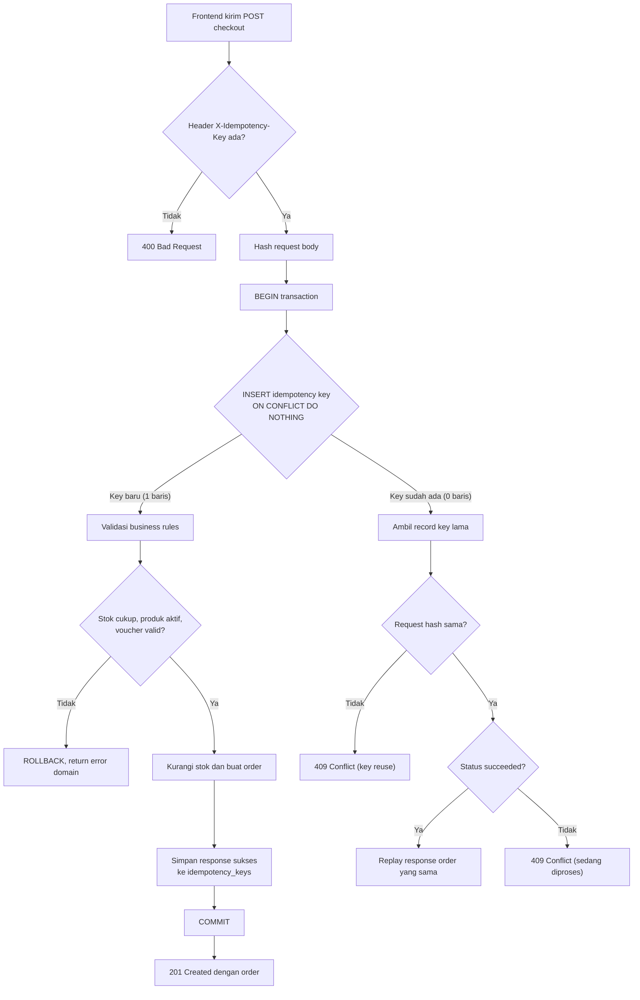
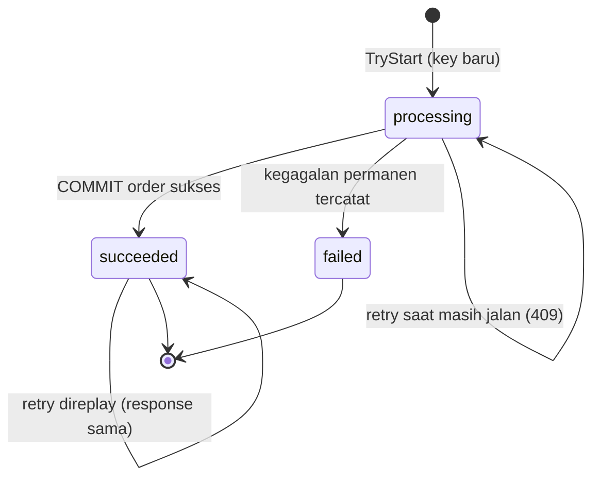
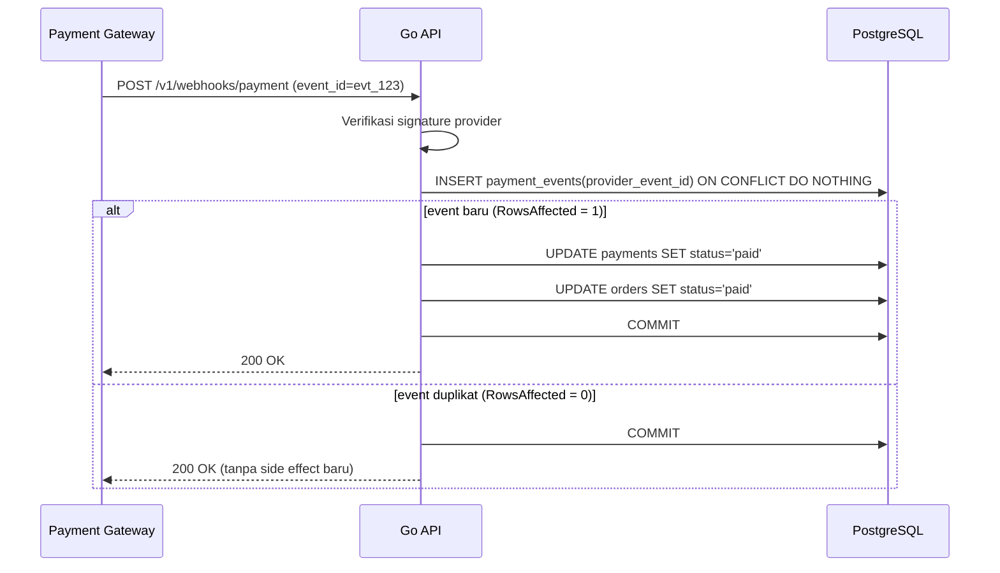

import { Section, Box, Steps, Step, Recap, CardGrid, Card, Chip, Hero, Compare, FileTree, Endpoint, Def } from "@components";

<Hero eyebrow="Roadmap 4 &middot; Clean Architecture" title="Idempotency:<br /><em>Operasi Aman Diulang</em>">
  <p>Checkout dan payment webhook harus tahan retry, double click, timeout, dan pengiriman ulang dari provider, tanpa pernah membuat dua order untuk satu niat.</p>
  <Fragment slot="meta">
    <Chip icon="code">Bahasa: <b>Go 1.26</b></Chip>
    <Chip icon="database">PostgreSQL + <b>pgx v5</b></Chip>
    <Chip icon="shield">Roadmap 4</Chip>
    <Chip icon="clock">~65 menit baca</Chip>
  </Fragment>
</Hero>

<Section num="01" id="intro" title="Masalah Retry di Dunia Nyata" sub="Network timeout bukan berarti operasi gagal">

<p class="lead">Idempotency adalah pagar arsitektur yang membuat operasi penting aman saat client atau provider mengirim request yang sama lebih dari sekali.</p>

Di frontend React, user bisa menekan tombol checkout dua kali karena UI belum sempat disable. Di mobile app, request bisa timeout walau server sebenarnya sudah membuat order, lalu kode retry otomatis mengirim ulang. Di payment gateway, webhook dikirim berulang sampai provider menerima respons `200 OK`. Tanpa desain idempotency, satu niat bisnis bisa berubah jadi dua order, dua payment record, dan dua kali pengurangan stok serum yang sama.

Yang membuat ini berbahaya: kegagalan jaringan itu ambigu. Saat `fetch` di React menerima timeout, client tidak tahu apakah server belum menerima request, sedang memproses, atau sudah selesai tetapi response-nya yang hilang di jalan. Satu-satunya jawaban yang aman adalah retry. Maka backend wajib menganggap retry sebagai kondisi normal, bukan kasus langka.

<Endpoint method="POST" path="/v1/orders/checkout" desc="Membuat order dari cart, wajib memakai header X-Idempotency-Key" />
<Endpoint method="POST" path="/v1/webhooks/payment" desc="Menerima status payment dari provider, wajib tahan duplicate event" />

<Box variant="bridge" icon="🌉" label="Jembatan: dari React double submit ke backend guarantee"><p>Disable tombol di React (`disabled={isSubmitting}`) itu UX guard, bukan data guarantee. Ia gagal kalau user buka dua tab, kalau ada proxy retry, kalau mobile network flaky, atau kalau webhook datang dari provider yang tidak pernah melihat tombolmu. Idempotency di backend adalah guarantee karena ia bekerja di lapisan data, bukan di lapisan UI.</p></Box>

Dalam proyek online shop skincare, idempotency paling penting di dua tempat. Pertama, checkout, karena ia membuat order dan mengurangi stok. Kedua, payment webhook, karena ia mengubah status order dan mencatat pembayaran. Keduanya tidak boleh hanya bersandar pada asumsi "request pasti datang sekali".

Modul ini menutup celah antara teori clean architecture (handler, service, repository, error, logging dari chapter sebelumnya) dan perilaku produksi nyata, tempat jaringan tidak pernah sopan. Dokumen resmi yang relevan: [HTTP Semantics RFC 9110](https://www.rfc-editor.org/rfc/rfc9110.html), [draft IETF Idempotency-Key header](https://datatracker.ietf.org/doc/draft-ietf-httpapi-idempotency-key-header/), [PostgreSQL unique constraints](https://www.postgresql.org/docs/current/ddl-constraints.html), dan [PostgreSQL INSERT ON CONFLICT](https://www.postgresql.org/docs/current/sql-insert.html).

</Section>

<Section num="02" id="definisi-idempotency" title="Apa Itu Idempotency" sub="Efek akhirnya sama, walau request diulang">

<Def term="idempotency"><p>Sifat sebuah operasi ketika dijalankan berkali-kali dengan input yang sama, tetapi efek akhir pada server tetap sama persis seperti dijalankan sekali.</p></Def>

Idempotency tidak selalu berarti response body harus identik byte demi byte, tetapi untuk API checkout jauh lebih nyaman bila retry mendapatkan response order yang sama. Fokus utamanya adalah efek server. Satu niat checkout menghasilkan satu order, bukan dua. Satu webhook `payment.succeeded` menandai satu order sebagai paid sekali, bukan mencatat revenue dua kali.

<Box variant="analogy" icon="🛗" label="Analogi: tombol lift"><p>Menekan tombol panggil lift sekali atau sepuluh kali hasilnya sama, lift tetap datang satu kali. Itu operasi idempotent. Sebaliknya, menambah satu cangkir gula ke kopi tiap kali kamu menekan tombol jelas tidak idempotent. Checkout harus berperilaku seperti tombol lift, bukan seperti penambah gula.</p></Box>

<Compare aLabel="JS / PHP: retry sebagai urusan client" bLabel="Go backend: retry sebagai kontrak data" aTone="muted" bTone="violet">
  <Fragment slot="a"><ul><li>Client bisa `fetch` ulang, axios bisa auto-retry, atau service worker mengulang request offline.</li><li>Laravel queue juga retry job ketika worker crash di tengah jalan.</li><li>Asumsinya: server akan beres sendiri kalau request diulang.</li></ul></Fragment>
  <Fragment slot="b"><ul><li>Service harus aktif mengecek apakah efek bisnis sudah pernah dibuat.</li><li>Database jadi sumber kebenaran lewat UNIQUE constraint dan transaksi.</li><li>Asumsinya: jaringan tidak bisa dipercaya, jadi server yang bertanggung jawab.</li></ul></Fragment>
</Compare>

Operasi idempotent butuh satu hal: identitas yang stabil. Tanpa identitas, server cuma melihat banyak request yang mirip, bukan request yang sama. Untuk checkout, identitas itu adalah `X-Idempotency-Key` buatan client. Untuk payment webhook, identitasnya adalah event ID atau payment ID dari provider. Begitu setiap niat punya identitas stabil, server bisa membedakan "request baru" dari "retry request lama".

<CardGrid cols={3}>
  <Card><h4>Double submit</h4><p>User menekan tombol checkout dua kali dan browser mengirim dua request hampir bersamaan.</p></Card>
  <Card><h4>Network retry</h4><p>Client timeout lalu mengirim ulang, padahal order pertama sudah berhasil dibuat di server.</p></Card>
  <Card><h4>Webhook retry</h4><p>Provider payment mengirim event yang sama berulang sampai menerima respons sukses.</p></Card>
</CardGrid>

</Section>

<Section num="03" id="idempotency-key" title="Idempotency Key dan Request Hash" sub="Header kecil yang menyelamatkan transaksi besar">

<Def term="idempotency key"><p>Token unik buatan client yang menandai satu niat operasi, misalnya satu klik checkout untuk satu cart. Key yang sama dipakai ulang untuk retry niat yang sama.</p></Def>

Untuk endpoint checkout, client mengirim header `X-Idempotency-Key`. Key ini dibuat sekali sebelum request pertama (misalnya UUID v4 atau ULID di sisi client), lalu dipakai ulang untuk setiap retry niat yang sama. Kalau user benar-benar ingin checkout baru, client membuat key baru.

```text title="HTTP request"
POST /v1/orders/checkout HTTP/1.1
Host: api.skincare.test
Authorization: Bearer <access-token>
Content-Type: application/json
X-Idempotency-Key: checkout_01JZ7V6P7Z5D84ZJ77Q0N6E2RK

{
  "cart_id": 42,
  "shipping_address_id": 7,
  "voucher_code": "GLOW10"
}
```

<Box variant="bridge" icon="🌉" label="Jembatan: dari useRef key generation ke header backend"><p>Di React, pola yang umum adalah membuat key sekali saat form di-mount (`const keyRef = useRef(crypto.randomUUID())`) lalu mengirim nilai yang sama di setiap percobaan submit. Key baru hanya dibuat setelah submit benar-benar sukses dan form di-reset. Backend tidak perlu tahu cara client membuat key, ia hanya menjadikan key sebagai identitas niat.</p></Box>

<Box variant="tip" icon="💡" label="Best practice: beri scope pada key"><p>Scope-kan key ke kombinasi user dan endpoint. Key yang sama boleh muncul di endpoint berbeda milik user yang sama, dan key milik user A tidak boleh bentrok dengan user B. Inilah alasan UNIQUE constraint kita memakai `(user_id, endpoint, idempotency_key)`, bukan hanya kolom `idempotency_key`.</p></Box>

<Def term="request hash"><p>Sidik jari (hash) dari body request yang disimpan bersama key, untuk mendeteksi bila key yang sama dipakai dengan payload berbeda.</p></Def>

Request hash penting karena idempotency key bukan voucher sekali pakai untuk apa saja. Kalau client salah dan mengirim key yang sama untuk `cart_id` yang berbeda, server harus membalas `409 Conflict`, bukan diam-diam memutar ulang order lama yang isinya beda. Ini menutup kelas bug frontend yang memakai ulang key terlalu lama atau lintas niat. Inilah persis disiplin yang dipakai Stripe: bandingkan isi request baru dengan request lama sebelum mempercayai key.

```go title="internal/shared/idempotency/hash.go"
package idempotency

import (
	"crypto/sha256"
	"encoding/hex"
	"encoding/json"
)

// HashRequest membuat sidik jari stabil dari body request.
// Disimpan bersama key agar key yang sama dengan payload berbeda terdeteksi.
func HashRequest(v any) (string, error) {
	b, err := json.Marshal(v)
	if err != nil {
		return "", err
	}

	sum := sha256.Sum256(b)
	return hex.EncodeToString(sum[:]), nil
}
```

<Box variant="note" icon="🧭" label="Hash dari struct yang sudah ter-decode, bukan dari raw body"><p>Kita hash struct `CheckoutRequest` yang sudah di-decode, bukan byte mentah body. Hasilnya stabil walau client mengubah urutan field JSON atau spasi, karena `json.Marshal` di Go menulis field struct dengan urutan deterministik. Kalau kamu butuh hash dari raw body (misalnya untuk verifikasi signature webhook), itu kasus berbeda yang dibahas di section 07.</p></Box>

<Box variant="warn" icon="⚠️" label="Idempotency bukan pengganti validasi"><p>Menyimpan key tidak menggantikan validasi input dan business rules. Handler tetap memvalidasi format, dan service tetap mengecek stok, produk aktif, voucher, serta aturan transisi status. Idempotency hanya memastikan operasi yang sah tidak terjadi dua kali, bukan membuat operasi tidak sah jadi sah.</p></Box>

</Section>

<Section num="04" id="desain-database" title="Desain Database dan UNIQUE Constraint" sub="UNIQUE constraint adalah pagar terakhir, bukan map di memory">

<p class="lead">Idempotency yang serius harus masuk database, bukan hanya map di memory, karena API berjalan di banyak instance dan bisa restart kapan saja.</p>

Di Go, `map[string]Result` terlihat menggoda sebagai cache sederhana. Masalahnya, map itu hilang saat process restart dan tidak dibagi antar instance API yang berjalan di ECS atau Kubernetes. Untuk operasi uang dan stok, sumber kebenaran harus PostgreSQL, yang tunggal dan persisten untuk semua instance.

<FileTree title="Tambahan struktur untuk idempotency" tree={`
internal/
  shared/
    idempotency/
      hash.go              # hash request body
      repository.go        # akses tabel idempotency_keys
  order/
    checkout_service.go    # service checkout idempotent
    handler.go             # baca X-Idempotency-Key
  payment/
    webhook_service.go     # webhook idempotent
db/
  migrations/
    027_create_idempotency_keys.up.sql
`} />

```sql title="db/migrations/027_create_idempotency_keys.up.sql"
CREATE TABLE idempotency_keys (
    id              BIGSERIAL PRIMARY KEY,
    user_id         BIGINT NOT NULL REFERENCES users(id),
    endpoint        TEXT NOT NULL,
    idempotency_key TEXT NOT NULL,
    request_hash    TEXT NOT NULL,
    status          TEXT NOT NULL CHECK (status IN ('processing', 'succeeded', 'failed')),
    response_status INTEGER,
    response_body   JSONB,
    created_at      TIMESTAMPTZ NOT NULL DEFAULT now(),
    updated_at      TIMESTAMPTZ NOT NULL DEFAULT now(),
    UNIQUE (user_id, endpoint, idempotency_key)
);

CREATE INDEX idx_idempotency_keys_created_at
    ON idempotency_keys (created_at);

CREATE TABLE payment_events (
    id                  BIGSERIAL PRIMARY KEY,
    provider_event_id   TEXT NOT NULL,
    provider_payment_id TEXT NOT NULL,
    event_type          TEXT NOT NULL,
    payload             JSONB NOT NULL,
    processed_at        TIMESTAMPTZ,
    created_at          TIMESTAMPTZ NOT NULL DEFAULT now(),
    UNIQUE (provider_event_id)
);

CREATE UNIQUE INDEX idx_payments_provider_payment_id_unique
    ON payments (provider_payment_id)
    WHERE provider_payment_id IS NOT NULL;
```

UNIQUE constraint adalah bagian yang membuat desain ini tahan race condition. Dua request checkout dengan key yang sama bisa masuk benar-benar bersamaan dari dua tab. Pada level database, hanya satu yang bisa membuat baris `idempotency_keys`; request kedua akan kalah di konflik UNIQUE dan terpaksa membaca hasil yang sudah ada. Inilah inti pertahanannya: race condition diselesaikan oleh PostgreSQL, bukan oleh kode aplikasi yang berharap-harap. Ada satu kasus halus saat request kedua kalah klaim sementara request pertama masih di tengah transaksi yang belum commit, dan itu kita tangani secara eksplisit di section 06.

<Box variant="warn" icon="⚠️" label="Pola SELECT-lalu-INSERT itu jebakan race condition"><p>Godaan klasik: `SELECT` apakah key sudah ada, kalau belum baru `INSERT`. Di antara `SELECT` dan `INSERT`, request kedua bisa menyelinap dan keduanya melihat "belum ada", lalu sama-sama menulis order. Satu-satunya cara aman adalah membiarkan database yang memutuskan lewat UNIQUE constraint plus `INSERT ... ON CONFLICT`, dalam satu pernyataan atomik.</p></Box>

<Box variant="bridge" icon="🌉" label="Jembatan: dari Laravel Cache::lock ke PostgreSQL constraint"><p>Laravel punya `Cache::lock('checkout:'.$id)->get()` untuk mencegah kerja ganda. Lock membantu koordinasi sementara, tetapi ia hidup di Redis yang bisa kedaluwarsa atau hilang. Untuk checkout kita tetap butuh constraint di database sebagai jaminan permanen. Lock itu kenyamanan, constraint itu kebenaran.</p></Box>

</Section>

<Section num="05" id="alur-checkout" title="Alur Checkout Idempotent" sub="Klaim key dulu, baru buat efek bisnis">

<p class="lead">Urutannya sederhana: klaim key di awal transaksi, jalankan business rules, buat order, simpan response, lalu commit. Semua dalam satu transaksi.</p>



<p class="fig-cap"><b>Gambar 1.</b> Checkpoint idempotency mencegah duplicate checkout dan duplicate pengurangan stok. Cabang kiri membuat order baru, cabang kanan memutar ulang hasil lama.</p>

Perhatikan bahwa stok tetap dicek di service, bukan di handler. Handler hanya membaca header, decode JSON, dan validasi format ringan. Service yang memutuskan apakah stok cukup, produk aktif, voucher valid, dan apakah key boleh diklaim. Pemisahan ini persis seperti yang kita bangun di chapter validasi dan repository.

Sebuah baris `idempotency_keys` punya siklus hidup tersendiri. Ia lahir `processing`, lalu berpindah ke `succeeded` saat operasi selesai dan di-commit, atau ke `failed` bila kita sengaja mencatat kegagalan permanen. Status inilah yang dipakai untuk membedakan retry yang boleh di-replay dari retry yang harus menunggu.



<p class="fig-cap"><b>Gambar 2.</b> Siklus hidup satu baris idempotency key. Hanya status `succeeded` yang boleh di-replay ke client; `processing` menjawab 409 sementara, `failed` ditangani sesuai kebijakan retry.</p>

<Steps>
  <Step><b>Claim key</b><p>Repository mencoba `INSERT` key baru dengan status `processing` dan `ON CONFLICT DO NOTHING`.</p></Step>
  <Step><b>Bandingkan hash</b><p>Jika key sudah ada, service memastikan request hash baru sama dengan request hash lama.</p></Step>
  <Step><b>Replay hasil lama</b><p>Jika operasi sebelumnya `succeeded`, API mengembalikan response order yang sama persis.</p></Step>
  <Step><b>Jalankan checkout baru</b><p>Jika key benar-benar baru, service menjalankan business rules dan menulis order di transaksi yang sama.</p></Step>
</Steps>

</Section>

<Section num="06" id="implementasi-go" title="Implementasi di Go" sub="Repository kecil, service yang eksplisit">

<p class="lead">Kode idempotency paling sehat saat dipecah jadi tiga bagian: helper hash, repository tipis, dan service checkout yang mengikat keduanya ke business rules.</p>

Mulai dari handler. Ia mengambil `X-Idempotency-Key`, decode request, validasi format, lalu meneruskan semuanya ke service. Handler tidak mengurangi stok dan tidak menulis tabel idempotency langsung. Ia juga menerjemahkan error domain idempotency menjadi status HTTP yang tepat.

```go title="internal/order/handler.go"
package order

import (
	"encoding/json"
	"errors"
	"net/http"
	"strings"

	"github.com/kamu/skincare-backend/internal/httpx"
)

type CheckoutHandler struct {
	service *CheckoutService
}

func NewCheckoutHandler(service *CheckoutService) *CheckoutHandler {
	return &CheckoutHandler{service: service}
}

type CheckoutRequest struct {
	CartID            int64  `json:"cart_id"`
	ShippingAddressID int64  `json:"shipping_address_id"`
	VoucherCode       string `json:"voucher_code"`
}

func (h *CheckoutHandler) Checkout(w http.ResponseWriter, r *http.Request) {
	key := strings.TrimSpace(r.Header.Get("X-Idempotency-Key"))
	if key == "" {
		httpx.Error(w, http.StatusBadRequest, "idempotency_key_required", "X-Idempotency-Key wajib diisi")
		return
	}
	if len(key) > 120 {
		httpx.Error(w, http.StatusBadRequest, "idempotency_key_too_long", "X-Idempotency-Key terlalu panjang")
		return
	}

	var req CheckoutRequest
	if err := json.NewDecoder(r.Body).Decode(&req); err != nil {
		httpx.Error(w, http.StatusBadRequest, "invalid_body", "body JSON tidak valid")
		return
	}
	if req.CartID <= 0 || req.ShippingAddressID <= 0 {
		httpx.Error(w, http.StatusBadRequest, "invalid_body", "cart_id dan shipping_address_id wajib diisi")
		return
	}

	result, err := h.service.Checkout(r.Context(), CheckoutInput{
		UserID:         httpx.UserID(r.Context()),
		IdempotencyKey: key,
		Request:        req,
	})
	if errors.Is(err, ErrIdempotencyConflict) {
		httpx.Error(w, http.StatusConflict, "idempotency_conflict", "idempotency key dipakai ulang dengan body berbeda")
		return
	}
	if errors.Is(err, ErrIdempotencyInProgress) {
		httpx.Error(w, http.StatusConflict, "idempotency_in_progress", "operasi dengan key ini masih diproses")
		return
	}
	if err != nil {
		writeDomainError(w, err)
		return
	}

	if result.Replayed {
		w.Header().Set("Idempotent-Replayed", "true")
	}
	httpx.Data(w, result.StatusCode, result.Body)
}
```

<Box variant="note" icon="🧭" label="Header Idempotent-Replayed membantu observability"><p>Saat kita memutar ulang hasil lama, kita set header `Idempotent-Replayed: true`. Client dan tim observability jadi bisa membedakan "order baru dibuat" dari "retry yang dilayani dari cache". Ini konvensi yang dipakai Stripe dan disebut juga di draft IETF Idempotency-Key, dan ia gratis untuk ditambahkan.</p></Box>

Repository idempotency menerima interface kecil `database.Querier` (yang sama dari modul transaksi dan repository pattern) agar bisa dipanggil dengan `pgx.Tx`. Ini penting karena klaim key harus berada di transaksi yang sama dengan pembuatan order.

```go title="internal/shared/idempotency/repository.go"
package idempotency

import (
	"context"
	"encoding/json"
	"errors"
	"time"

	"github.com/jackc/pgx/v5"

	"github.com/kamu/skincare-backend/internal/database"
)

// ErrInProgress menandai key yang diklaim transaksi lain yang belum commit,
// sehingga baris konfliknya belum visible di snapshot Read Committed kita.
var ErrInProgress = errors.New("idempotency key claimed by an in-flight transaction")

type Repository struct{}

func NewRepository() Repository {
	return Repository{}
}

type Record struct {
	ID             int64
	UserID         int64
	Endpoint       string
	Key            string
	RequestHash    string
	Status         string
	ResponseStatus int
	ResponseBody   json.RawMessage
	CreatedAt      time.Time
}

type StartParams struct {
	UserID      int64
	Endpoint    string
	Key         string
	RequestHash string
}

const selectColumns = `id, user_id, endpoint, idempotency_key, request_hash, status,
	COALESCE(response_status, 0), COALESCE(response_body, '{}'::jsonb), created_at`

func scanRecord(row pgx.Row) (Record, error) {
	var rec Record
	err := row.Scan(
		&rec.ID,
		&rec.UserID,
		&rec.Endpoint,
		&rec.Key,
		&rec.RequestHash,
		&rec.Status,
		&rec.ResponseStatus,
		&rec.ResponseBody,
		&rec.CreatedAt,
	)
	return rec, err
}

// TryStart mengklaim key dalam transaksi. Mengembalikan (record, started, error).
// started=true berarti key baru dan operasi boleh dijalankan.
// started=false berarti key sudah ada dan record lama dikembalikan untuk replay.
func (r Repository) TryStart(ctx context.Context, db database.Querier, p StartParams) (Record, bool, error) {
	const stmt = `
INSERT INTO idempotency_keys (user_id, endpoint, idempotency_key, request_hash, status)
VALUES ($1, $2, $3, $4, 'processing')
ON CONFLICT (user_id, endpoint, idempotency_key) DO NOTHING
RETURNING ` + selectColumns

	rec, err := scanRecord(db.QueryRow(ctx, stmt, p.UserID, p.Endpoint, p.Key, p.RequestHash))
	if err == nil {
		return rec, true, nil
	}
	if !errors.Is(err, pgx.ErrNoRows) {
		return Record{}, false, err
	}

	// ON CONFLICT DO NOTHING tidak menulis baris, jadi RETURNING kosong.
	// Key sudah ada: baca record lama untuk diputuskan service.
	existing, err := r.Get(ctx, db, p.UserID, p.Endpoint, p.Key)
	if errors.Is(err, pgx.ErrNoRows) {
		// Edge case Read Committed: baris konflik berasal dari transaksi lain
		// yang belum commit, jadi belum visible di snapshot kita dan Get() kosong.
		// Perlakukan sebagai "sedang diproses transaksi lain", bukan error mentah.
		return Record{}, false, ErrInProgress
	}
	if err != nil {
		return Record{}, false, err
	}
	return existing, false, nil
}

func (r Repository) Get(ctx context.Context, db database.Querier, userID int64, endpoint, key string) (Record, error) {
	const stmt = `
SELECT ` + selectColumns + `
FROM idempotency_keys
WHERE user_id = $1 AND endpoint = $2 AND idempotency_key = $3`

	return scanRecord(db.QueryRow(ctx, stmt, userID, endpoint, key))
}

func (r Repository) FinishSucceeded(ctx context.Context, db database.Querier, id int64, statusCode int, body any) error {
	b, err := json.Marshal(body)
	if err != nil {
		return err
	}

	const stmt = `
UPDATE idempotency_keys
SET status = 'succeeded', response_status = $2, response_body = $3, updated_at = now()
WHERE id = $1`

	_, err = db.Exec(ctx, stmt, id, statusCode, b)
	return err
}
```

<Box variant="tip" icon="💡" label="ON CONFLICT DO NOTHING + RETURNING = klaim atomik"><p>Trik pgx di sini: `INSERT ... ON CONFLICT DO NOTHING RETURNING` mengembalikan baris hanya bila INSERT benar-benar menulis. Bila key sudah ada, tidak ada baris yang ditulis, jadi `RETURNING` kosong dan `QueryRow().Scan()` mengembalikan `pgx.ErrNoRows`. Kita pakai sinyal itu untuk tahu "key sudah ada" tanpa SELECT tambahan dulu, lalu baru membaca record lama. Satu pernyataan, tanpa celah race.</p></Box>

<Box variant="warn" icon="⚠️" label="Edge case Read Committed: konflik dari transaksi yang belum commit"><p>Pada isolation default PostgreSQL (Read Committed) ada satu kasus halus untuk dua request key sama yang benar-benar bersamaan. Request kedua bisa kalah klaim sementara request pertama masih di dalam transaksi processing yang belum commit, sehingga `RETURNING` kosong (DO NOTHING) dan `Get()` berikutnya juga mengembalikan `pgx.ErrNoRows` karena baris itu belum visible di snapshot kita. Kalau dibiarkan, `pgx.ErrNoRows` mentah ini bocor sebagai 500 ke client, bukan 409. Karena itu `TryStart` memetakan `errors.Is(err, pgx.ErrNoRows)` di cabang ini menjadi `ErrInProgress`, lalu service menerjemahkannya ke 409 in_progress. Alternatif lain yang menjamin `RETURNING` selalu berisi baris adalah `INSERT ... ON CONFLICT DO UPDATE` (misalnya `SET updated_at = now()`), dengan trade-off menulis ulang baris di setiap retry.</p></Box>

Sekarang service checkout. Di sinilah idempotency bertemu business rules. Kalau key baru, service membuat order. Kalau key lama dengan request hash sama dan status `succeeded`, service mengembalikan response lama.

```go title="internal/order/checkout_service.go"
package order

import (
	"context"
	"encoding/json"
	"errors"
	"net/http"

	"github.com/jackc/pgx/v5/pgxpool"

	"github.com/kamu/skincare-backend/internal/shared/idempotency"
)

var (
	ErrIdempotencyConflict   = errors.New("idempotency key reused with different request")
	ErrIdempotencyInProgress = errors.New("idempotent operation is still processing")
)

const checkoutEndpoint = "POST /v1/orders/checkout"

type CheckoutService struct {
	pool     *pgxpool.Pool
	idemRepo idempotency.Repository
	orders   OrderRepository
	stock    StockRepository
	voucher  VoucherRepository
}

func NewCheckoutService(
	pool *pgxpool.Pool,
	idemRepo idempotency.Repository,
	orders OrderRepository,
	stock StockRepository,
	voucher VoucherRepository,
) *CheckoutService {
	return &CheckoutService{pool: pool, idemRepo: idemRepo, orders: orders, stock: stock, voucher: voucher}
}

type CheckoutInput struct {
	UserID         int64
	IdempotencyKey string
	Request        CheckoutRequest
}

type CheckoutResult struct {
	StatusCode int
	Body       CheckoutResponse
	Replayed   bool
}

type CheckoutResponse struct {
	OrderID     int64  `json:"order_id"`
	Status      string `json:"status"`
	TotalRupiah int64  `json:"total_rupiah"`
}

func (s *CheckoutService) Checkout(ctx context.Context, in CheckoutInput) (CheckoutResult, error) {
	requestHash, err := idempotency.HashRequest(in.Request)
	if err != nil {
		return CheckoutResult{}, err
	}

	tx, err := s.pool.Begin(ctx)
	if err != nil {
		return CheckoutResult{}, err
	}
	defer tx.Rollback(ctx)

	rec, started, err := s.idemRepo.TryStart(ctx, tx, idempotency.StartParams{
		UserID:      in.UserID,
		Endpoint:    checkoutEndpoint,
		Key:         in.IdempotencyKey,
		RequestHash: requestHash,
	})
	if errors.Is(err, idempotency.ErrInProgress) {
		// Request kedua kalah klaim sementara request pertama masih dalam transaksi.
		return CheckoutResult{}, ErrIdempotencyInProgress
	}
	if err != nil {
		return CheckoutResult{}, err
	}

	if !started {
		// Key sudah ada: putuskan replay atau conflict tanpa menyentuh order.
		return replayCheckout(rec, requestHash)
	}

	cart, err := s.orders.GetCartForCheckout(ctx, tx, in.UserID, in.Request.CartID)
	if err != nil {
		return CheckoutResult{}, err
	}
	if err := s.stock.EnsureAvailable(ctx, tx, cart.Items); err != nil {
		return CheckoutResult{}, err
	}
	if err := s.voucher.EnsureUsable(ctx, tx, in.UserID, in.Request.VoucherCode, cart.TotalRupiah); err != nil {
		return CheckoutResult{}, err
	}

	order, err := s.orders.CreateOrderFromCart(ctx, tx, cart, in.Request.ShippingAddressID, in.Request.VoucherCode)
	if err != nil {
		return CheckoutResult{}, err
	}
	if err := s.stock.DeductForOrder(ctx, tx, order.ID); err != nil {
		return CheckoutResult{}, err
	}

	response := CheckoutResponse{
		OrderID:     order.ID,
		Status:      "pending_payment",
		TotalRupiah: order.TotalRupiah,
	}
	if err := s.idemRepo.FinishSucceeded(ctx, tx, rec.ID, http.StatusCreated, response); err != nil {
		return CheckoutResult{}, err
	}
	if err := tx.Commit(ctx); err != nil {
		return CheckoutResult{}, err
	}

	return CheckoutResult{StatusCode: http.StatusCreated, Body: response, Replayed: false}, nil
}

func replayCheckout(rec idempotency.Record, requestHash string) (CheckoutResult, error) {
	if rec.RequestHash != requestHash {
		return CheckoutResult{}, ErrIdempotencyConflict
	}
	if rec.Status != "succeeded" {
		return CheckoutResult{}, ErrIdempotencyInProgress
	}

	var body CheckoutResponse
	if err := json.Unmarshal(rec.ResponseBody, &body); err != nil {
		return CheckoutResult{}, err
	}
	return CheckoutResult{StatusCode: rec.ResponseStatus, Body: body, Replayed: true}, nil
}
```

<Box variant="warn" icon="⚠️" label="Stok dicek dan dikurangi di transaksi yang sama dengan klaim key"><p>Klaim key (`TryStart`), pengecekan stok, pembuatan order, dan pengurangan stok semuanya berada di satu `tx`. Kalau salah satu gagal, `defer tx.Rollback` membatalkan semua, termasuk baris key. Artinya: key yang gagal tidak meninggalkan jejak `processing` permanen, dan retry berikutnya dengan key sama dimulai bersih. Jangan pecah ini menjadi beberapa transaksi terpisah.</p></Box>

<Box variant="note" icon="🧭" label="Kapan menyimpan response sukses"><p>Kode di atas menyimpan response hanya untuk operasi yang benar-benar sukses dan ter-commit. Untuk error business rule (stok habis, voucher tidak valid), kita rollback dan tidak meninggalkan key, agar retry setelah stok ditambah ulang tetap bisa diproses dengan key yang sama. Untuk kegagalan yang memang permanen, baru pertimbangkan mencatat status `failed` dengan kebijakan retry yang jelas.</p></Box>

</Section>

<Section num="07" id="webhook-payment" title="Payment Webhook Idempotent" sub="Duplicate event harus jadi no-op yang tetap menjawab sukses">

<p class="lead">Webhook payment memakai identitas dari provider, bukan `X-Idempotency-Key` dari frontend, dan duplicate event harus dijawab `200 OK` tanpa efek bisnis kedua.</p>

Provider payment (Midtrans, Xendit, Stripe, dan sejenisnya) punya `event_id` atau `payment_id` untuk tiap event. Event ini bisa dikirim ulang berkali-kali sampai provider menerima respons sukses. Maka service webhook harus mencoba mencatat event dulu lewat UNIQUE constraint. Kalau event sudah pernah dicatat, langsung commit dan return sukses tanpa mengubah order lagi.



<p class="fig-cap"><b>Gambar 3.</b> Webhook duplikat tetap dijawab 200 OK, tetapi tidak menjalankan efek bisnis kedua kali. Provider berhenti retry begitu menerima 200.</p>

```go title="internal/payment/webhook_service.go"
package payment

import (
	"context"
	"encoding/json"
	"errors"

	"github.com/jackc/pgx/v5/pgxpool"
)

var ErrInvalidSignature = errors.New("invalid webhook signature")

type WebhookService struct {
	pool   *pgxpool.Pool
	orders OrderRepository
}

func NewWebhookService(pool *pgxpool.Pool, orders OrderRepository) *WebhookService {
	return &WebhookService{pool: pool, orders: orders}
}

type ProviderEvent struct {
	EventID   string
	PaymentID string
	Type      string
	Payload   json.RawMessage
}

func (s *WebhookService) HandlePaymentWebhook(ctx context.Context, event ProviderEvent) error {
	tx, err := s.pool.Begin(ctx)
	if err != nil {
		return err
	}
	defer tx.Rollback(ctx)

	const insertEvent = `
INSERT INTO payment_events (provider_event_id, provider_payment_id, event_type, payload, processed_at)
VALUES ($1, $2, $3, $4, now())
ON CONFLICT (provider_event_id) DO NOTHING`

	tag, err := tx.Exec(ctx, insertEvent, event.EventID, event.PaymentID, event.Type, event.Payload)
	if err != nil {
		return err
	}
	if tag.RowsAffected() == 0 {
		// Event sudah pernah diproses: commit tanpa efek baru, jawab sukses.
		return tx.Commit(ctx)
	}

	switch event.Type {
	case "payment.succeeded":
		if err := s.orders.MarkPaidByProviderPaymentID(ctx, tx, event.PaymentID); err != nil {
			return err
		}
	case "payment.failed":
		if err := s.orders.MarkPaymentFailed(ctx, tx, event.PaymentID); err != nil {
			return err
		}
	}

	return tx.Commit(ctx)
}
```

<Box variant="bridge" icon="🌉" label="Jembatan: dari Laravel webhook controller ke event log Go"><p>Di Laravel kamu mungkin terbiasa dengan `WebhookController` yang langsung `$order->markAsPaid()` saat event masuk. Pendekatan idempotent Go menyisipkan satu langkah sebelum itu: catat `provider_event_id` ke tabel event dengan UNIQUE constraint, dan baru jalankan efek bila baris benar-benar baru. Tabel event juga jadi audit trail gratis saat ada sengketa pembayaran.</p></Box>

<Box variant="warn" icon="⚠️" label="Verifikasi signature sebelum mempercayai webhook"><p>Webhook datang dari internet terbuka, jadi siapa pun bisa mengirim `POST` palsu. Verifikasi signature provider (HMAC dari raw body) sebelum memproses adalah keharusan keamanan, terpisah dari idempotency. Idempotency mencegah duplicate yang sah; verifikasi signature mencegah event palsu. Keduanya wajib, dan signature dibahas tuntas di Roadmap 7.</p></Box>

<Box variant="warn" icon="⚠️" label="Jangan kurangi stok dari webhook"><p>Di proyek ini, stok sudah dikurangi saat checkout. Webhook payment cukup mengubah status payment dan order. Kalau webhook ikut mengurangi stok, satu duplicate event bisa menjadi pengurangan stok ganda yang mahal, persis bug yang ingin kita cegah. Jaga satu efek di satu tempat.</p></Box>

</Section>

<Section num="08" id="safe-retry" title="Safe Retry: GET, POST, dan Webhook" sub="Setiap HTTP method punya janji yang berbeda">

<p class="lead">Tidak semua retry aman. Aman atau tidaknya bergantung pada method, desain endpoint, dan apakah hasil disimpan.</p>

Menurut HTTP semantics (RFC 9110), `GET`, `HEAD`, dan `OPTIONS` bersifat safe (dan otomatis idempotent) karena tidak dimaksudkan mengubah state server, jadi retry-nya selalu aman. `PUT` dan `DELETE` dirancang idempotent meski tidak safe: `PUT` menulis resource ke keadaan tertentu, `DELETE` memastikan resource hilang, diulang berapa kali pun hasilnya sama. `POST` tidak otomatis idempotent karena biasanya membuat resource baru, kecuali kita menambahkan idempotency key dan penyimpanan hasil, persis yang kita lakukan untuk checkout.

<div class="tbl-wrap">
<table>
<thead><tr><th>Method</th><th>Safe?</th><th>Idempotent bawaan?</th><th>Aman di-retry?</th></tr></thead>
<tbody>
<tr><td><code>GET</code> /v1/products</td><td>Ya</td><td>Ya</td><td>Selalu, hanya membaca</td></tr>
<tr><td><code>PUT</code> /v1/cart/items/7</td><td>Tidak</td><td>Ya</td><td>Ya, menulis ke keadaan tetap</td></tr>
<tr><td><code>DELETE</code> /v1/cart/items/7</td><td>Tidak</td><td>Ya</td><td>Ya, target sudah hilang tetap aman</td></tr>
<tr><td><code>POST</code> /v1/orders/checkout</td><td>Tidak</td><td>Tidak</td><td>Hanya dengan idempotency key</td></tr>
<tr><td><code>POST</code> /v1/webhooks/payment</td><td>Tidak</td><td>Tidak</td><td>Hanya dengan provider event id unik</td></tr>
</tbody>
</table>
</div>

<Compare aLabel="GET /v1/products" bLabel="POST /v1/orders/checkout" aTone="teal" bTone="red">
  <Fragment slot="a"><ul><li>Retry selalu aman karena hanya membaca data.</li><li>Response bisa berubah kalau katalog berubah, tetapi efek server tetap nol.</li><li>Client dan proxy boleh retry tanpa izin khusus.</li></ul></Fragment>
  <Fragment slot="b"><ul><li>Retry tanpa key bisa membuat order baru setiap kali.</li><li>Dengan key, retry mengembalikan order yang sama atau 409 bila payload berubah.</li><li>Hanya aman karena server menyimpan hasil per key.</li></ul></Fragment>
</Compare>

Sisi client juga punya peran. Retry yang baik memakai exponential backoff dengan jitter dan hanya mengulang pada error yang memang bisa diulang (timeout, `5xx`, kegagalan koneksi), bukan pada `4xx` validasi yang jelas salah. Backoff mencegah retry storm yang justru menjatuhkan server saat ia paling rapuh.

```text title="Pola retry client (pseudocode)"
key = uuidv4()                 // dibuat sekali per niat
for attempt in 1..maxAttempts:
  res = POST /v1/orders/checkout  with header X-Idempotency-Key: key
  if res.status in [200, 201, 409]:  return res   // selesai, tidak diulang
  if res.status in [400, 401, 403]:  return res   // salah permanen, jangan diulang
  if res.status in [500, 502, 503, 504] or timeout:
    sleep(backoff(attempt) + jitter)               // baru retry, key sama
```

<Box variant="tip" icon="💡" label="Aturan praktis safe retry"><p>Retry aman bila server bisa mengenali operasi lama dan mengembalikan hasil lama tanpa membuat efek bisnis baru. Untuk `GET` itu otomatis. Untuk `POST` checkout, itu hanya terjadi karena kita membangun idempotency key, request hash, transaksi, dan UNIQUE constraint. Idempotency adalah yang mengubah `POST` yang berbahaya menjadi `POST` yang aman diulang.</p></Box>

</Section>

<Section num="09" id="hands-on" title="Hands-on: Simulasi Double Submit" sub="Pastikan dua request dengan key sama hanya membuat satu order">

<p class="lead">Latihan ini membuktikan endpoint checkout tidak membuat dua order ketika menerima key yang sama, dan webhook tidak memproses event yang sama dua kali.</p>

<Steps>
  <Step><b>Tambahkan migration</b><p>Buat tabel `idempotency_keys` dan `payment_events` dengan UNIQUE constraint dari section 04.</p></Step>
  <Step><b>Baca header di handler</b><p>Wajibkan `X-Idempotency-Key` pada endpoint checkout, tolak `400` bila kosong.</p></Step>
  <Step><b>Klaim key di service</b><p>Jalankan `TryStart` di dalam transaksi sebelum business rules checkout.</p></Step>
  <Step><b>Uji retry</b><p>Kirim request yang sama dua kali dengan key sama, pastikan `order_id` identik dan header `Idempotent-Replayed: true` muncul di response kedua.</p></Step>
</Steps>

```bash title="Terminal"
KEY="checkout_01JZ7V6P7Z5D84ZJ77Q0N6E2RK"

# Request pertama: membuat order baru -> 201 Created
curl -i -X POST http://localhost:8080/v1/orders/checkout \
  -H "Authorization: Bearer $ACCESS_TOKEN" \
  -H "Content-Type: application/json" \
  -H "X-Idempotency-Key: $KEY" \
  -d '{"cart_id":42,"shipping_address_id":7,"voucher_code":"GLOW10"}'

# Request kedua: key sama, body sama -> order yang sama, Idempotent-Replayed: true
curl -i -X POST http://localhost:8080/v1/orders/checkout \
  -H "Authorization: Bearer $ACCESS_TOKEN" \
  -H "Content-Type: application/json" \
  -H "X-Idempotency-Key: $KEY" \
  -d '{"cart_id":42,"shipping_address_id":7,"voucher_code":"GLOW10"}'

# Request ketiga: key sama, body BERBEDA -> 409 Conflict
curl -i -X POST http://localhost:8080/v1/orders/checkout \
  -H "Authorization: Bearer $ACCESS_TOKEN" \
  -H "Content-Type: application/json" \
  -H "X-Idempotency-Key: $KEY" \
  -d '{"cart_id":99,"shipping_address_id":7,"voucher_code":"GLOW10"}'
```

Hasil yang diharapkan: request pertama membuat order, request kedua mengembalikan order yang sama dengan header replay, request ketiga ditolak `409` karena body berbeda. Jumlah baris di `orders` untuk key itu tetap satu, dan pengurangan stok juga tetap satu kali.

```sql title="cek-hasil.sql"
SELECT id, user_id, status, total_rupiah
FROM orders
WHERE user_id = 15
ORDER BY created_at DESC
LIMIT 5;

SELECT user_id, endpoint, idempotency_key, status, response_status
FROM idempotency_keys
WHERE idempotency_key = 'checkout_01JZ7V6P7Z5D84ZJ77Q0N6E2RK';
```

Untuk webhook, kirim event yang sama dua kali. Baris `payment_events` tetap satu, dan status order tetap berubah sekali saja.

```sql title="cek-webhook.sql"
SELECT provider_event_id, provider_payment_id, event_type, processed_at
FROM payment_events
WHERE provider_event_id = 'evt_test_123';
```

</Section>

<Section num="10" id="jebakan-umum" title="Jebakan Umum" sub="Bug idempotency biasanya muncul di production, bukan di local">

<CardGrid cols={2}>
  <Card><h4>Menyimpan key di memory</h4><p>Aman di local satu instance, rusak saat API punya banyak instance atau restart di ECS.</p></Card>
  <Card><h4>Tidak menyimpan request hash</h4><p>Key sama bisa dipakai untuk payload berbeda, dan response lama terlihat seolah sukses.</p></Card>
  <Card><h4>SELECT lalu INSERT tanpa constraint</h4><p>Cek manual `SELECT` sebelum `INSERT` tetap rentan race tanpa UNIQUE constraint.</p></Card>
  <Card><h4>Webhook dianggap pasti sekali</h4><p>Provider sering mengirim event ulang, terutama saat timeout atau koneksi putus.</p></Card>
  <Card><h4>Response lama berisi data sensitif</h4><p>Jangan simpan token, nomor kartu, atau payload rahasia di `response_body` idempotency.</p></Card>
  <Card><h4>Key tanpa scope</h4><p>Pakai kombinasi user, endpoint, dan key agar key satu user tidak bentrok dengan user lain.</p></Card>
</CardGrid>

<Box variant="bridge" icon="🌉" label="Jembatan: dari optimistic UI ke durable backend"><p>React boleh optimis: tampilkan loading, disable tombol, dan tampilkan order seolah sudah jadi. Backend tetap harus pesimis terhadap jaringan, karena request bisa datang ulang tanpa sepengetahuan UI. Optimisme di frontend dan pesimisme di backend justru saling melengkapi, bukan bertentangan.</p></Box>

<Box variant="warn" icon="⚠️" label="Jangan replay error internal sebagai sukses"><p>Untuk error internal `500`, lebih aman tidak menyimpan response sebagai `succeeded`. Simpan hanya hasil operasi yang benar-benar sudah commit. Bila kamu memilih mencatat status `failed`, pastikan kebijakan retry-nya jelas, agar client tidak terjebak memutar ulang kegagalan permanen selamanya.</p></Box>

</Section>

<Section num="11" id="ringkasan" title="Ringkasan & Poin Penting">

<p class="lead">Idempotency membuat checkout dan payment webhook tahan terhadap retry tanpa pernah membuat efek bisnis ganda.</p>

<Recap title="Yang Wajib Menempel"><ul><li>Idempotency berarti request yang sama boleh diulang tanpa membuat efek server ganda; identitas stabil adalah syaratnya.</li><li>Checkout memakai `X-Idempotency-Key`, request hash, response replay, transaksi, dan UNIQUE constraint `(user_id, endpoint, key)`.</li><li>Klaim key (`TryStart`) berada di transaksi yang sama dengan pembuatan order, sehingga rollback membersihkan key yang gagal.</li><li>Payment webhook memakai `provider_event_id` dari provider plus UNIQUE constraint, dan duplicate event dijawab 200 OK tanpa efek baru.</li><li>`GET` aman diulang otomatis; `POST` hanya aman karena kita membangun idempotency key, bukan karena sifat bawaan.</li><li>Database adalah pagar terakhir, bukan map memory, bukan disable button, dan bukan SELECT-lalu-INSERT.</li></ul></Recap>

Dalam proyek online shop skincare, modul ini menutup lubang besar antara clean architecture dan perilaku produksi nyata. Setelah validasi input, business rules, error handling, logging, dan idempotency siap, service checkout mulai layak dibawa ke Roadmap 4 Chapter 8 (background worker, tempat job email dan payment dijalankan di luar request HTTP) lalu ke Roadmap 5, yaitu pendalaman domain order, inventory, payment, dan shipment.

</Section>
