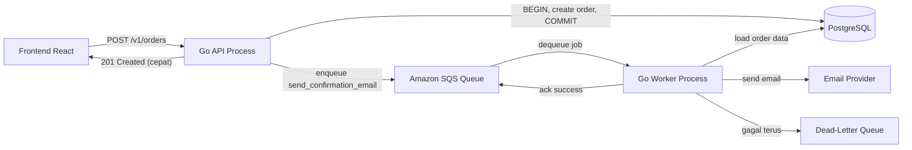
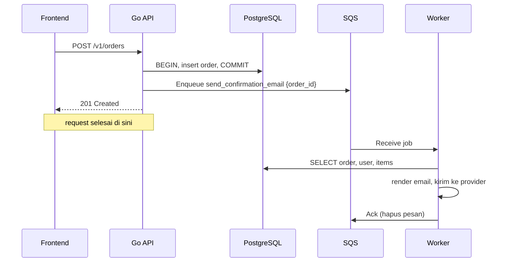
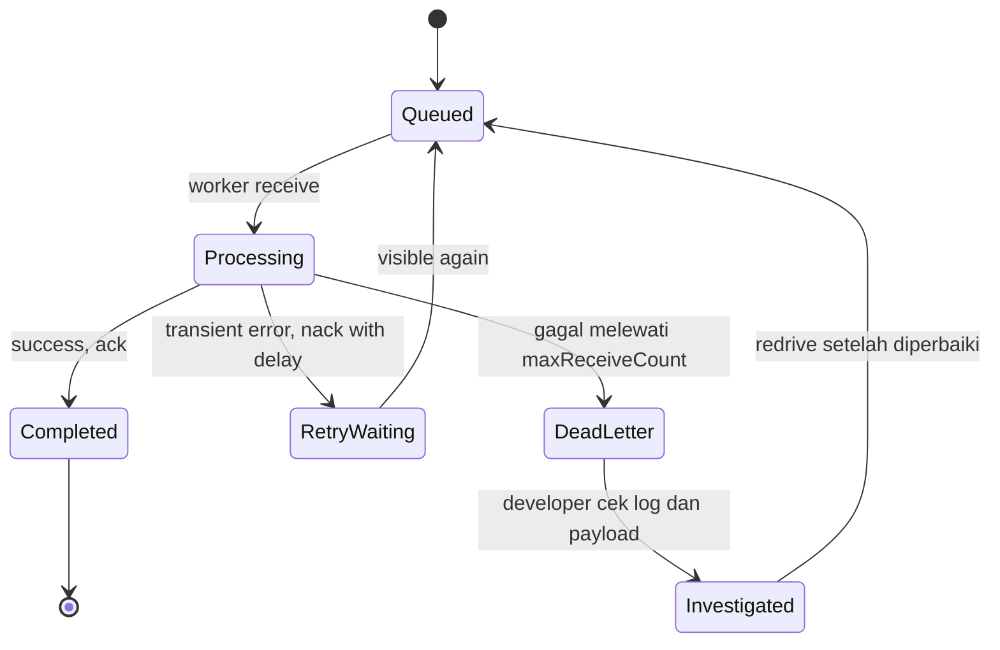
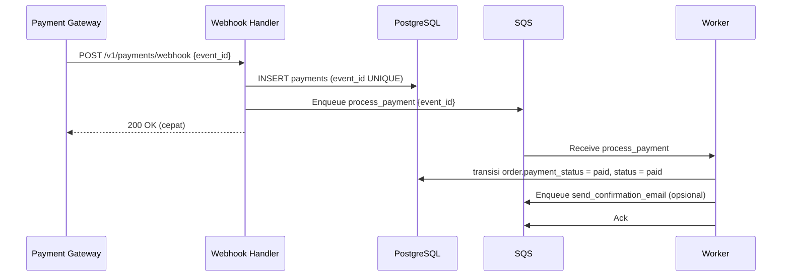
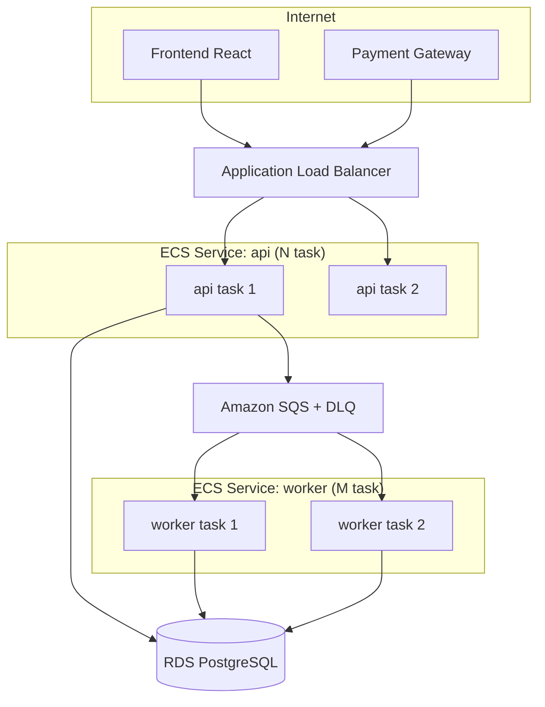

import { Section, Box, Recap, CardGrid, Card, Chip, Hero, Compare, FileTree, Endpoint, Def } from "@components";

<Hero eyebrow="Roadmap 4 &middot; Clean Architecture" title="Background Worker <em>Architecture</em><br />Request Cepat, Tugas Berat Terpisah">
  <p>Di modul ini kita memindahkan pekerjaan lambat (kirim email, proses pembayaran, generate invoice) keluar dari HTTP handler ke proses worker yang aman diulang, mudah dipantau, dan bisa diskalakan sendiri.</p>
  <Fragment slot="meta">
    <Chip icon="code">Bahasa: <b>Go 1.26</b></Chip>
    <Chip icon="stack">Queue: <b>SQS</b></Chip>
    <Chip icon="bolt">Async</Chip>
    <Chip icon="clock">~70 menit baca</Chip>
  </Fragment>
</Hero>

<Section num="01" id="intro" title="Kenapa Butuh Background Worker?" sub="HTTP request harus cepat, sebagian pekerjaan backend memang lambat">

<p class="lead">HTTP request harus cepat selesai, sementara beberapa pekerjaan backend memang lambat dan tidak perlu ditunggu user. Background worker memindahkan pekerjaan lambat itu keluar dari jalur request.</p>

Di React atau Next.js, kamu mungkin pernah memindahkan pekerjaan berat ke server action, queue, atau webhook agar UI tidak terasa macet. Di Laravel, konsepnya mirip `dispatch(new SendOrderEmail($order))` lalu `php artisan queue:work` menjalankannya di latar belakang. Di Go, kita membuat pemisahan yang sama secara eksplisit: proses API menerima request, proses worker mengerjakan job di luar request. Tidak ada framework yang menyembunyikan lifecycle-nya, kita yang memegang kendali.

<Def term="background worker"><p>Proses terpisah yang mengambil job dari queue lalu menjalankannya tanpa membuat user menunggu HTTP response. Ia adalah program Go biasa dengan `main()` sendiri, bukan thread di dalam server HTTP.</p></Def>

Contoh operasi lambat di online shop skincare: kirim email konfirmasi order, proses callback pembayaran dari payment gateway, generate invoice PDF, kirim push notifikasi, sinkronisasi stok ke sistem gudang, dan indexing produk ke search engine. Semua ini punya satu kesamaan: hasilnya tidak perlu dilihat user di detik yang sama ia menekan tombol.

<Box variant="warn" icon="⚠️" label="Jangan kirim email di dalam HTTP handler"><p>Email provider bisa lambat, timeout, rate limited, atau sedang error. Kalau handler menunggu email selesai, checkout yang sebenarnya sukses bisa terasa gagal di sisi user, padahal order sudah masuk database.</p></Box>

Mari hitung kasarnya. Membuat order di PostgreSQL mungkin 20 ms. Memanggil API email provider 300 ms sampai 3 detik, kadang gagal lalu retry. Kalau keduanya di satu handler, response checkout ikut menunggu email, dan user melihat spinner berputar lama untuk pekerjaan yang sebenarnya tidak ia pedulikan. Pisahkan: balas `201 Created` segera setelah order tersimpan, biarkan worker mengirim email setelahnya.

<Box variant="analogy" icon="🍽️" label="Analogi: kasir dan dapur"><p>Kasir (API) mencatat pesanan lalu langsung memberi nomor antrian ke pelanggan. Dapur (worker) memasak di belakang dengan ritmenya sendiri. Pelanggan tidak berdiri di depan kasir menunggu masakan matang, dan kasir bisa melayani pelanggan berikutnya.</p></Box>

</Section>

<Section num="02" id="api-vs-worker" title="API Process vs Worker Process" sub="Dua entry point, satu codebase modular monolith">

<p class="lead">API process fokus pada request dan response, worker process fokus pada pekerjaan asinkron. Keduanya berbagi domain dan repository yang sama, tetapi punya `main()` dan lifecycle yang berbeda.</p>

<Compare aLabel="Laravel / Node: queue worker bawaan" bLabel="Go: proses worker eksplisit" aTone="muted" bTone="violet">
  <Fragment slot="a"><ul><li>Laravel punya `queue:work` dan Horizon yang mengurus retry, backoff, dan dashboard secara otomatis.</li><li>Node sering memakai BullMQ di atas Redis, dengan worker dan concurrency yang dikonfigurasi lewat opsi.</li><li>Framework banyak menyembunyikan detail lifecycle, retry, dan graceful shutdown.</li></ul></Fragment>
  <Fragment slot="b"><ul><li>Go tidak memaksa framework queue tertentu, kita mendesain kontrak queue dan loop worker sendiri.</li><li>Kita mengatur `context`, sinyal shutdown, log terstruktur, retry, dan dependency injection secara eksplisit.</li><li>Lebih banyak kode, tetapi tidak ada perilaku tersembunyi saat debugging produksi jam 2 pagi.</li></ul></Fragment>
</Compare>

<CardGrid cols={3}>
  <Card><h4>API process</h4><p>Menangani route, parse request, validasi input, panggil service, commit transaksi, lalu enqueue job. Hidup selama menerima HTTP, mati saat dihentikan.</p></Card>
  <Card><h4>Queue</h4><p>Menyimpan job sampai worker siap mengambilnya. Tahan restart proses. Di produksi kita pakai Amazon SQS, di test kita pakai fake in-memory.</p></Card>
  <Card><h4>Worker process</h4><p>Mengambil job, menjalankan handler, retry saat error sementara, mengirim ke DLQ saat gagal terus, dan mencatat log dengan `job_id` dan `order_id`.</p></Card>
</CardGrid>

Pemisahan ini bukan microservice duluan. Ini masih modular monolith yang sama dari Roadmap 4, tetapi entry point-nya lebih dari satu: `cmd/api/main.go` untuk HTTP API dan `cmd/worker/main.go` untuk worker. Keduanya meng-import package domain (`order`, `payment`, `notification`) dan repository yang sama. Yang berbeda hanya cara mereka dipicu: satu oleh HTTP, satu oleh queue.

<Box variant="bridge" icon="🌉" label="Jembatan: dari satu artisan command ke satu binary Go"><p>Di Laravel, API dan worker adalah aplikasi PHP yang sama dijalankan dengan perintah berbeda (`php artisan serve` vs `php artisan queue:work`). Di Go polanya identik secara konsep, tetapi konkret: dua file `main.go` di bawah `cmd/`, dikompilasi menjadi dua binary terpisah, dideploy sebagai dua container. Domain dan repository di `internal/` dipakai bersama, persis seperti satu kelas Job dipakai bersama oleh web dan worker Laravel.</p></Box>

<FileTree title="Dua entry point berbagi domain" tree={`
cmd/
  api/
    main.go             # entry point HTTP API
  worker/
    main.go             # entry point background worker
internal/
  order/
    service.go          # checkout, enqueue job setelah order dibuat
  payment/
    service.go          # transisi status pembayaran (dipakai worker)
  notification/
    email.go            # adapter email provider
  job/
    job.go              # kontrak Job dan Queue (interface)
    worker.go           # loop worker umum, retry, ack/nack
    handlers.go         # router job type ke handler konkret
    sqs.go              # adapter SQS (infrastruktur)
  database/
    dbtx.go             # Querier dari Roadmap 3, dipakai ulang
go.mod
`} />

</Section>

<Section num="03" id="job-queue" title="Konsep Job Queue" sub="Antrean pesan: API memasukkan, worker mengambil">

<p class="lead">Job queue adalah antrean pesan yang berdiri di antara dua proses. API memasukkan job (enqueue), worker mengambil job saat siap (dequeue). Queue meredam perbedaan kecepatan antara produsen dan konsumen.</p>

<Def term="job"><p>Unit pekerjaan kecil yang bisa disimpan, diambil, dicoba ulang, dan dilog, misalnya `send_confirmation_email` untuk satu order tertentu.</p></Def>

<Def term="enqueue"><p>Memasukkan job ke queue, biasanya tepat setelah transaksi utama berhasil commit.</p></Def>

<Def term="dequeue"><p>Worker mengambil (menerima) job dari queue untuk diproses, lalu menandainya selesai (ack) atau gagal (nack).</p></Def>

Bentuk job sebaiknya kecil. Untuk email konfirmasi order, simpan `order_id` saja, bukan seluruh HTML email atau snapshot order. Worker mengambil data order terbaru dari database saat job dijalankan. Job kecil lebih murah disimpan, tidak gampang basi, dan tidak menabrak batas ukuran pesan queue (SQS membatasi 256 KB per pesan).

<Compare aLabel="Payload besar (anti-pola)" bLabel="Payload identitas (idiomatik)" aTone="red" bTone="blue">
  <Fragment slot="a"><ul><li>Job membawa seluruh objek order, alamat, daftar item, dan HTML email.</li><li>Data bisa basi: alamat berubah setelah enqueue, tetapi job memakai snapshot lama.</li><li>Mudah menabrak batas 256 KB SQS pada order besar.</li></ul></Fragment>
  <Fragment slot="b"><ul><li>Job membawa `order_id` (dan kadang `event_id`), lalu worker memuat ulang data terbaru.</li><li>Worker selalu bekerja dengan kondisi database paling baru.</li><li>Pesan kecil, murah, dan tidak pernah menabrak batas ukuran.</li></ul></Fragment>
</Compare>

<Box variant="tip" icon="💡" label="Idiom desain"><p>Queue sebaiknya membawa identitas pekerjaan, bukan snapshot data besar yang mudah basi. Pengecualian: data yang harus konsisten persis pada saat enqueue (misalnya nilai pembayaran dari webhook) boleh dibawa, tetapi tetap minimal.</p></Box>

<Endpoint method="POST" path="/v1/orders" desc="Checkout membuat order, commit transaksi, lalu enqueue job email konfirmasi" />
<Endpoint method="POST" path="/v1/payments/webhook" desc="Terima callback gateway, simpan event, lalu enqueue job payment processing" />

</Section>

<Section num="04" id="alur-arsitektur" title="Alur Enqueue dari API ke Worker" sub="Request checkout tetap cepat, email dikirim setelahnya">

<p class="lead">Inti modul ini ada di satu diagram: API menerima request, commit ke database, enqueue job, lalu langsung membalas user. Worker memproses job belakangan, terpisah sepenuhnya dari request yang sudah selesai.</p>



<p class="fig-cap"><b>Gambar 1.</b> Request checkout tetap cepat karena response dikirim segera setelah COMMIT. Email dikirim oleh worker setelah order dibuat, di luar jalur request.</p>

Perhatikan urutan langkah di sisi API. Transaksi order harus selesai dulu (COMMIT), baru job dikirim. Kalau enqueue dilakukan sebelum commit, worker bisa mengambil `order_id` yang belum terlihat olehnya, atau lebih buruk, order akhirnya rollback tetapi job sudah terlanjur antri. Worker lalu memuat order yang tidak ada dan gagal selamanya.



<p class="fig-cap"><b>Gambar 2.</b> Garis "request selesai di sini" memisahkan jalur sinkron (atas) dari jalur asinkron (bawah). User sudah pergi sebelum email dikirim.</p>

<Box variant="warn" icon="⚠️" label="Urutan yang salah: enqueue sebelum commit"><p>Jangan enqueue job dari tengah transaksi lalu commit belakangan. Worker bisa berjalan lebih cepat dari commit dan melihat data yang belum final, atau order rollback dan job menjadi yatim. Aturan tetap: COMMIT dulu, baru enqueue.</p></Box>

<Box variant="note" icon="🧭" label="Risiko sisa: enqueue gagal setelah commit"><p>Pola "commit lalu enqueue" masih menyisakan celah kecil: order tersimpan, tetapi enqueue gagal karena queue sedang error. Untuk job yang wajib jalan, solusi kuatnya adalah outbox pattern (simpan event ke tabel dalam transaksi yang sama, worker terpisah mengirimnya ke queue). Outbox dibahas tuntas sebagai topik scaling di Roadmap 9. Di sini cukup pahami batasnya.</p></Box>

</Section>

<Section num="05" id="job-contract" title="Kontrak Job di Go" sub="Interface kecil agar API dan worker tidak terikat ke SQS">

<p class="lead">Kita mulai dari kontrak kecil. Service order cukup tahu sebuah interface `Queue`, bukan implementasi konkret SQS, Redis, atau in-memory. Inilah idiom Go: interface dibuat di sisi pemakai, sesuai kebutuhan, bukan menyalin API SDK.</p>

Tiga konstanta tipe job dideklarasikan dulu agar enqueue dan handler memakai string yang sama, bukan literal yang gampang salah ketik. `Job` adalah data yang dikirim lewat queue (akan di-marshal ke JSON), sedangkan `Message` adalah amplop yang dikembalikan queue saat receive, lengkap dengan `Attempts` agar worker tahu sudah berapa kali job ini dicoba.

```go title="internal/job/job.go"
package job

import (
	"context"
	"errors"
	"time"
)

const (
	TypeSendConfirmationEmail = "send_confirmation_email"
	TypeProcessPayment        = "process_payment"
	TypeGenerateInvoicePDF    = "generate_invoice_pdf"
)

// ErrNoMessage dikembalikan Receive saat queue kosong.
var ErrNoMessage = errors.New("no message available")

// Job adalah unit pekerjaan yang dikirim lewat queue. Payload sengaja kecil:
// bawa identitas (order_id), bukan snapshot data besar.
type Job struct {
	ID      string            `json:"id"`
	Type    string            `json:"type"`
	Payload map[string]string `json:"payload"`
}

// Message adalah amplop dari queue: Job plus metadata pengiriman.
type Message struct {
	ID       string // receipt handle dari queue, dipakai untuk Ack/Nack
	Job      Job
	Attempts int // sudah berapa kali job ini diterima worker
}

// Queue adalah kontrak yang dipakai API (Enqueue) dan worker (Receive/Ack/Nack).
// Dipenuhi sqsQueue di produksi dan memoryQueue di test.
type Queue interface {
	Enqueue(ctx context.Context, j Job) error
	Receive(ctx context.Context) (Message, error)
	Ack(ctx context.Context, msg Message) error
	Nack(ctx context.Context, msg Message, delay time.Duration) error
}
```

`Nack` sengaja menerima `delay`. Untuk SQS, implementasi memakai `ChangeMessageVisibility` agar pesan muncul lagi setelah jeda tertentu, sehingga retry tidak terjadi seketika. Detail AWS SDK kita perdalam di Roadmap 8, tetapi kontraknya sudah siap dari sekarang dan tidak akan berubah.

<Box variant="bridge" icon="🌉" label="Jembatan: dari Laravel queue driver ke Go interface"><p>Di Laravel, queue driver (sync, database, redis, sqs) diganti lewat `config/queue.php`, dan kode job tidak peduli driver mana yang aktif. Di Go kita mencapai keluwesan yang sama lewat interface kecil `Queue`: service hanya tahu kontraknya, dan kita menyuntikkan implementasi `sqsQueue` atau `memoryQueue` sesuai environment lewat constructor.</p></Box>

<Box variant="tip" icon="💡" label="Idiom: accept interfaces, return structs"><p>Service menerima `job.Queue` (interface), tetapi constructor adapter mengembalikan struct konkret yang dipromosikan ke interface lewat type-nya. Yang masuk fleksibel (bisa difake di test), yang diproses jelas (struct `Job` siap pakai).</p></Box>

</Section>

<Section num="06" id="enqueue-order" title="After Order Created: Enqueue Email" sub="Enqueue hanya setelah order benar-benar tersimpan">

<p class="lead">Checkout hanya boleh enqueue email setelah order benar-benar berhasil dibuat dan transaksi commit. Contoh berikut fokus pada boundary arsitektur, bukan mengulang transaksi checkout yang sudah dibahas di Roadmap 3.</p>

Service order menerima `job.Queue` lewat constructor, persis seperti ia menerima repository. Setelah order dibuat, ia menyusun `Job` dengan payload `order_id` (sebagai string, karena queue membawa JSON) lalu memanggil `Enqueue`. Kalau enqueue gagal, di contoh ini kita memilih tetap mengembalikan error agar caller tahu, sambil mencatat warning. Untuk jaminan lebih keras, pakai outbox.

```go title="internal/order/service.go"
package order

import (
	"context"
	"fmt"
	"log/slog"
	"strconv"

	"github.com/kamu/skincare-backend/internal/job"
)

type Service struct {
	repo   Repository
	jobs   job.Queue
	logger *slog.Logger
}

func NewService(repo Repository, jobs job.Queue, logger *slog.Logger) *Service {
	return &Service{repo: repo, jobs: jobs, logger: logger}
}

type CheckoutInput struct {
	UserID         int64
	IdempotencyKey string
}

type CheckoutResult struct {
	OrderID     int64
	OrderNumber string
	Status      string
}

// Repository di sini disederhanakan; transaksi checkout penuh ada di Roadmap 3.
type Repository interface {
	CreateOrderFromCart(ctx context.Context, userID int64, idempotencyKey string) (Order, error)
}

type Order struct {
	ID          int64
	OrderNumber string
	Status      string
}

func (s *Service) Checkout(ctx context.Context, in CheckoutInput) (CheckoutResult, error) {
	// 1. Transaksi utama: buat order, commit. (Detail di Roadmap 3.)
	o, err := s.repo.CreateOrderFromCart(ctx, in.UserID, in.IdempotencyKey)
	if err != nil {
		return CheckoutResult{}, fmt.Errorf("create order from cart: %w", err)
	}

	// 2. Order sudah commit. Baru sekarang enqueue email konfirmasi.
	j := job.Job{
		ID:   newJobID(),
		Type: job.TypeSendConfirmationEmail,
		Payload: map[string]string{
			"order_id": strconv.FormatInt(o.ID, 10),
		},
	}
	if err := s.jobs.Enqueue(ctx, j); err != nil {
		// Order tetap valid; jangan rollback hanya karena email belum terkirim.
		// Catat agar bisa di-recover lewat retry manual atau outbox.
		s.logger.Error("enqueue confirmation email failed",
			"order_id", o.ID, "error", err)
		return CheckoutResult{}, fmt.Errorf("enqueue confirmation email: %w", err)
	}

	return CheckoutResult{
		OrderID:     o.ID,
		OrderNumber: o.OrderNumber,
		Status:      o.Status,
	}, nil
}
```

Perhatikan dua keputusan kecil yang penting. Pertama, payload hanya `order_id`, bukan seluruh order. Kedua, enqueue terjadi setelah `CreateOrderFromCart` mengembalikan tanpa error, artinya transaksi sudah commit di dalam repository. Tidak ada SQL atau `pgx` yang bocor ke sini, sesuai disiplin boundary dari Roadmap 3.

<Box variant="warn" icon="⚠️" label="Jebakan konsistensi"><p>Kalau email wajib terkirim untuk setiap order, jangan hanya bergantung pada enqueue langsung setelah commit tanpa fallback. Gunakan outbox pattern (Roadmap 9), atau minimal job penyapu yang mengirim email untuk order yang belum punya baris di `order_notifications`.</p></Box>

</Section>

<Section num="07" id="worker-main" title="Struktur cmd/worker/main.go" sub="Program Go biasa dengan dependency, loop, dan shutdown sendiri">

<p class="lead">Worker adalah program Go biasa. Ia punya dependency sendiri (pool database, queue, email provider), loop sendiri, dan lifecycle sendiri. Yang membedakannya dari API hanya cara ia dipicu.</p>

Untuk shutdown yang rapi, gunakan [`signal.NotifyContext`](https://pkg.go.dev/os/signal#NotifyContext) dari standard library. Saat container menerima `SIGTERM` (misalnya ketika ECS men-drain task lama saat deploy), context dibatalkan. Worker berhenti mengambil job baru, menyelesaikan job yang sedang berjalan, lalu keluar. Pesan yang belum sempat di-ack akan muncul lagi di queue dan diambil worker lain, jadi tidak ada job yang hilang.

```go title="cmd/worker/main.go"
package main

import (
	"context"
	"log/slog"
	"os"
	"os/signal"
	"syscall"

	"github.com/kamu/skincare-backend/internal/config"
	"github.com/kamu/skincare-backend/internal/database"
	"github.com/kamu/skincare-backend/internal/job"
	"github.com/kamu/skincare-backend/internal/notification"
	"github.com/kamu/skincare-backend/internal/order"
	"github.com/kamu/skincare-backend/internal/payment"
)

func main() {
	logger := slog.New(slog.NewJSONHandler(os.Stdout, nil))

	// Context dibatalkan saat SIGINT/SIGTERM tiba.
	ctx, stop := signal.NotifyContext(context.Background(), os.Interrupt, syscall.SIGTERM)
	defer stop()

	cfg, err := config.Load()
	if err != nil {
		logger.Error("load config", "error", err)
		os.Exit(1)
	}

	pool, err := database.Open(ctx, cfg.DatabaseURL)
	if err != nil {
		logger.Error("open database", "error", err)
		os.Exit(1)
	}
	defer pool.Close()

	// Adapter infrastruktur: detail SQS dan email provider dikurung di sini.
	queue := job.NewSQSQueue(cfg.SQSQueueURL, logger)
	emailer := notification.NewEmailService(cfg.EmailAPIKey)

	// Service domain dipakai ulang dari package yang sama dengan API.
	orderSvc := order.NewReader(pool)
	paymentSvc := payment.NewService(pool, logger)

	// Router job type -> handler konkret.
	handlers := job.NewHandlers(orderSvc, paymentSvc, emailer, logger)
	worker := job.NewWorker(queue, handlers, logger)

	logger.Info("worker started", "queue", cfg.SQSQueueURL)
	if err := worker.Run(ctx); err != nil {
		logger.Error("worker stopped with error", "error", err)
		os.Exit(1)
	}
	logger.Info("worker stopped gracefully")
}
```

`job.NewSQSQueue` adalah adapter infrastruktur. API dan worker memakai kontrak `job.Queue` yang sama, tetapi detail AWS SDK terkurung di `internal/job/sqs.go`. Domain service (`order`, `payment`) tidak pernah tahu queue-nya SQS, Redis, atau in-memory.

<Box variant="tip" icon="💡" label="Prinsip clean architecture"><p>Handler job boleh tahu usecase domain (memanggil `paymentSvc.ApplyPaidEvent`), tetapi domain service tidak boleh bergantung langsung pada SDK SQS atau email provider. Ketergantungan ke dunia luar selalu lewat interface yang kita miliki sendiri.</p></Box>

<Box variant="bridge" icon="🌉" label="Jembatan: graceful shutdown vs queue:work --stop-when-empty"><p>Laravel Horizon menangani SIGTERM dan menyelesaikan job berjalan sebelum keluar, persis karena worker yang dimatikan di tengah job berbahaya. Di Go kita melakukannya eksplisit dengan `signal.NotifyContext`: context yang dibatalkan menjalar ke loop worker, yang berhenti menerima job baru tetapi tetap menyelesaikan yang sedang jalan. Pola yang sama, kendali di tangan kita.</p></Box>

</Section>

<Section num="08" id="retry-backoff" title="Retry Strategy dan Exponential Backoff" sub="Retry untuk error sementara, dengan jeda yang membesar">

<p class="lead">Retry membantu saat error sementara, tetapi retry tanpa jeda hanya membuat sistem makin sibuk dan email provider makin tercekik. Kuncinya adalah membedakan jenis error dan memberi jeda yang membesar.</p>

Error worker biasanya bisa dibagi dua. Transient error layak dicoba ulang: timeout email provider, koneksi database putus sesaat, gateway pembayaran 503. Permanent error tidak layak dicoba tanpa batas: payload tidak valid, order sudah tidak ada, atau jumlah uang negatif. Membedakan keduanya membuat retry cerdas, bukan membabi buta.

```go title="internal/job/backoff.go"
package job

import "time"

// BackoffDelay menghitung jeda retry yang membesar (exponential backoff),
// dibatasi maksimum 5 menit agar tidak menunda job terlalu lama.
// min adalah builtin sejak Go 1.21, tidak perlu helper sendiri.
func BackoffDelay(attempts int) time.Duration {
	if attempts <= 0 {
		return 5 * time.Second
	}
	// 1<<n: 2, 4, 8, 16, 32, 64 detik, lalu mentok di cap.
	delay := time.Duration(1<<min(attempts, 6)) * time.Second
	return min(delay, 5*time.Minute)
}
```

Loop worker memilih ack atau nack berdasarkan hasil handler. Sukses berarti ack (hapus pesan dari queue). Gagal berarti nack dengan delay dari `BackoffDelay`, sehingga pesan muncul lagi nanti, bukan langsung. Loop juga menghormati `ctx.Done()` di dua tempat agar SIGTERM benar-benar menghentikan worker.

```go title="internal/job/worker.go"
package job

import (
	"context"
	"errors"
	"fmt"
	"log/slog"
	"time"
)

// Handler memetakan satu Job ke pekerjaan konkret.
type Handler interface {
	Handle(ctx context.Context, j Job) error
}

type Worker struct {
	queue   Queue
	handler Handler
	logger  *slog.Logger
}

func NewWorker(queue Queue, handler Handler, logger *slog.Logger) *Worker {
	return &Worker{queue: queue, handler: handler, logger: logger}
}

func (w *Worker) Run(ctx context.Context) error {
	for {
		// Berhenti rapi saat SIGTERM membatalkan ctx.
		select {
		case <-ctx.Done():
			return nil
		default:
		}

		msg, err := w.queue.Receive(ctx)
		if errors.Is(err, ErrNoMessage) {
			// Queue kosong: tunggu sebentar, jangan busy-loop.
			select {
			case <-ctx.Done():
				return nil
			case <-time.After(time.Second):
				continue
			}
		}
		if err != nil {
			return fmt.Errorf("receive job: %w", err)
		}

		if err := w.handler.Handle(ctx, msg.Job); err != nil {
			delay := BackoffDelay(msg.Attempts)
			w.logger.Warn("job failed, retry later",
				"job_id", msg.Job.ID, "type", msg.Job.Type,
				"attempts", msg.Attempts, "delay", delay, "error", err)
			if nackErr := w.queue.Nack(ctx, msg, delay); nackErr != nil {
				return fmt.Errorf("nack job: %w", nackErr)
			}
			continue
		}

		if err := w.queue.Ack(ctx, msg); err != nil {
			return fmt.Errorf("ack job: %w", err)
		}
		w.logger.Info("job completed", "job_id", msg.Job.ID, "type", msg.Job.Type)
	}
}
```

<Box variant="note" icon="📝" label="Retry SQS vs retry aplikasi"><p>Ada dua lapis retry yang sering tertukar. Retry SDK menjawab "bagaimana jika request `ReceiveMessage` ke AWS gagal" dan diurus oleh AWS SDK otomatis. Retry job menjawab "bagaimana jika email provider gagal mengirim email" dan itu yang kita kontrol lewat ack/nack dan backoff. Untuk SQS, retry aplikasi berarti pesan tidak dihapus, lalu visibility timeout atau `ChangeMessageVisibility` membuatnya muncul lagi nanti. Lihat [visibility timeout](https://docs.aws.amazon.com/AWSSimpleQueueService/latest/SQSDeveloperGuide/sqs-visibility-timeout.html).</p></Box>

<Box variant="bridge" icon="🌉" label="Jembatan: tries dan backoff Laravel vs backoff eksplisit Go"><p>Di Laravel, sebuah Job punya properti `$tries` dan method `backoff()` yang mengembalikan array jeda per percobaan, dan Horizon menerapkannya. Di Go kita menulis fungsi `BackoffDelay` sendiri lalu memanggilnya di loop worker. Logika yang sama (jeda yang membesar, batas atas), tetapi terlihat penuh dan bisa diuji sebagai fungsi murni.</p></Box>

</Section>

<Section num="09" id="dead-letter-queue" title="Dead-Letter Queue" sub="Karantina untuk job yang gagal terus, bukan tempat sampah">

<p class="lead">Dead-letter queue (DLQ) menyimpan job yang gagal terus agar tidak memblokir antrean utama. DLQ bukan tempat sampah yang dilupakan, melainkan ruang karantina untuk investigasi.</p>

Setelah job masuk DLQ, tim bisa melihat payload, jumlah attempt, dan error terakhir di log, lalu memutuskan apakah job bisa diperbaiki dan dijalankan ulang. Tanpa DLQ, satu job beracun (poison message) yang gagal selamanya akan terus diambil, gagal, diretry, dan menghabiskan kapasitas worker, menahan job sehat di belakangnya.



<p class="fig-cap"><b>Gambar 3.</b> Job yang gagal sementara berputar di retry, job yang gagal terus melewati ambang lalu pindah ke DLQ. Setelah diperbaiki, job bisa di-redrive kembali ke queue utama.</p>

Untuk SQS, DLQ dikonfigurasi lewat [redrive policy](https://docs.aws.amazon.com/AWSSimpleQueueService/latest/SQSDeveloperGuide/sqs-dead-letter-queues.html). Source queue punya batas `maxReceiveCount`, misalnya 5. Setelah pesan diterima dan gagal diproses 5 kali, SQS otomatis memindahkannya ke DLQ. Kamu lalu memasang alarm CloudWatch pada jumlah pesan di DLQ, sehingga tim tahu ada masalah tanpa harus memelototi dashboard. Konfigurasi penuhnya dibahas di Roadmap 8.

<Box variant="warn" icon="⚠️" label="Jangan retry selamanya"><p>Retry tanpa batas membuat biaya naik, log penuh, dan masalah asli (bug di handler, payload rusak) tertutup oleh noise. Selalu pasang `maxReceiveCount` dan DLQ. Job yang gagal harus berhenti di suatu titik dan minta perhatian manusia.</p></Box>

<Box variant="bridge" icon="🌉" label="Jembatan: failed_jobs Laravel vs DLQ SQS"><p>Laravel menyimpan job yang habis percobaan ke tabel `failed_jobs`, lalu kamu bisa `php artisan queue:retry` untuk menjalankannya ulang. DLQ SQS adalah versi infrastruktur dari ide yang sama: tempat terpisah berisi job gagal, plus mekanisme redrive untuk mencoba ulang setelah penyebabnya diperbaiki. Konsepnya identik, hanya pindah dari tabel database ke antrean terkelola.</p></Box>

</Section>

<Section num="10" id="email-job" title="Job Email Notification" sub="Memuat order, render email, dan menjaga idempotensi">

<p class="lead">Sekarang kita isi handler job email konfirmasi. Handler memuat order terbaru, mengecek apakah email sudah pernah dikirim, lalu mengirim lewat adapter email. Idempotensi penting karena queue bersifat at-least-once: job yang sama bisa datang lebih dari sekali.</p>

`notification.EmailService` adalah interface yang kita miliki, bukan tipe dari SDK provider. Worker hanya tahu `SendOrderConfirmation`, dan implementasi konkret (SES, Resend, Postmark) bersembunyi di balik constructor. Ini menjaga handler tetap mudah diuji dengan fake email service.

```go title="internal/notification/email.go"
package notification

import "context"

// EmailService adalah kontrak yang dipakai handler job.
// Implementasi konkret (SES, Resend) hidup di package ini, tersembunyi di belakang interface.
type EmailService interface {
	SendOrderConfirmation(ctx context.Context, to string, data OrderEmailData) error
}

type OrderEmailData struct {
	OrderNumber string
	TotalRupiah int64
}
```

Handler email memuat order, mengirim email, lalu BARU mencatat pengiriman ke tabel `order_notifications` dengan constraint `UNIQUE (order_id, notification_type)`. Urutan ini (mark-after-send) penting: kalau provider sedang error, kirim gagal, handler return error tanpa menulis baris notifikasi, dan retry berikutnya benar-benar mengirim ulang. Andai kita menandai sebelum kirim, kegagalan transient akan menghasilkan baris notifikasi tanpa email yang sungguh terkirim, sehingga retry justru ack tanpa pernah mengirim. Kalau job datang dua kali setelah kirim sukses, INSERT kedua melanggar unique constraint, handler tahu email sudah pernah dikirim, lalu ack. Database tetap menjadi penjaga idempotensi, dengan risiko paling buruk hanya satu email ganda yang ringan, bukan email yang hilang permanen.

```go title="internal/job/handlers.go"
package job

import (
	"context"
	"errors"
	"fmt"
	"log/slog"
	"strconv"

	"github.com/kamu/skincare-backend/internal/notification"
	"github.com/kamu/skincare-backend/internal/order"
	"github.com/kamu/skincare-backend/internal/payment"
)

// OrderReader adalah subset order service yang dibutuhkan handler email.
type OrderReader interface {
	GetForEmail(ctx context.Context, orderID int64) (order.EmailView, error)
	MarkNotified(ctx context.Context, orderID int64, notificationType string) error
}

// PaymentApplier adalah subset payment service yang dibutuhkan handler payment.
// Interface kecil di sisi pemakai, dipenuhi oleh *payment.Service.
type PaymentApplier interface {
	ApplyPaidEvent(ctx context.Context, eventID string) error
}

type Handlers struct {
	orders   OrderReader
	payments PaymentApplier
	emailer  notification.EmailService
	logger   *slog.Logger
}

func (h *Handlers) handleSendConfirmationEmail(ctx context.Context, j Job) error {
	orderID, err := strconv.ParseInt(j.Payload["order_id"], 10, 64)
	if err != nil {
		// Payload rusak: ini permanent error, biarkan menuju DLQ.
		return fmt.Errorf("invalid order_id payload: %w", err)
	}

	view, err := h.orders.GetForEmail(ctx, orderID)
	if errors.Is(err, order.ErrOrderNotFound) {
		// Order tidak ada (mungkin rollback): ack agar tidak diretry selamanya.
		h.logger.Warn("order not found for email, skipping", "order_id", orderID)
		return nil
	}
	if err != nil {
		return fmt.Errorf("load order for email: %w", err)
	}

	// Kirim dulu. Kalau provider gagal (transient), return error tanpa menulis
	// baris notifikasi, sehingga retry benar-benar mengirim ulang.
	if err := h.emailer.SendOrderConfirmation(ctx, view.Email, notification.OrderEmailData{
		OrderNumber: view.OrderNumber,
		TotalRupiah: view.TotalRupiah,
	}); err != nil {
		return fmt.Errorf("send confirmation email: %w", err)
	}

	// Baru tandai setelah kirim sukses. Kalau job ini duplikat dari pengiriman
	// sebelumnya yang sudah sukses, MarkNotified balas ErrAlreadyNotified dan kita ack.
	if err := h.orders.MarkNotified(ctx, orderID, "confirmation"); err != nil {
		if errors.Is(err, order.ErrAlreadyNotified) {
			h.logger.Info("confirmation email already recorded as sent", "order_id", orderID)
			return nil
		}
		return fmt.Errorf("mark notified: %w", err)
	}
	return nil
}
```

Perhatikan jalur keluar yang berbeda, dan urutan send sebelum mark. Payload rusak mengembalikan error agar menuju DLQ (bug, butuh manusia). Order tidak ada di-ack diam-diam (mungkin rollback, retry tidak akan menolong). Kirim email gagal (provider down) mengembalikan error agar memicu retry, dan karena belum ada baris notifikasi, retry akan mengirim ulang sungguhan. Job duplikat yang datang setelah kirim sukses akan ditandai oleh MarkNotified sebagai ErrAlreadyNotified lalu di-ack. Trade-off mark-after-send: pada kasus langka (kirim sukses tetapi handler mati sebelum sempat MarkNotified), job bisa terkirim dua kali, satu email ganda yang ringan, jauh lebih baik daripada email hilang permanen.

```sql title="db/migrations/038_create_order_notifications.up.sql"
CREATE TABLE order_notifications (
    id bigint GENERATED ALWAYS AS IDENTITY PRIMARY KEY,
    order_id bigint NOT NULL REFERENCES orders(id) ON DELETE CASCADE,
    notification_type TEXT NOT NULL,
    sent_at TIMESTAMPTZ NOT NULL DEFAULT now(),
    UNIQUE (order_id, notification_type)
);
```

<Box variant="bridge" icon="🌉" label="Jembatan: dari React double submit ke job at-least-once"><p>Seperti tombol checkout yang bisa terkirim dua kali dari frontend, worker juga bisa menerima job yang sama lebih dari sekali (visibility timeout habis sebelum ack, redrive, dan sebagainya). Anggap queue selalu at-least-once, lalu desain handler agar aman diulang. Unique constraint di `order_notifications` adalah versi backend dari disabling tombol setelah klik pertama.</p></Box>

</Section>

<Section num="11" id="payment-job" title="Job Payment Processing" sub="Webhook menerima, worker memproses, status order berpindah">

<p class="lead">Pembayaran adalah contoh job yang lebih ketat dari email. Uang tidak boleh diproses dua kali, dan status order harus berpindah sesuai aturan. Polanya: webhook menerima callback gateway secepat mungkin, lalu worker memproses di latar belakang.</p>

Kenapa pembayaran perlu worker, bukan langsung di webhook handler? Karena memproses pembayaran melibatkan beberapa langkah: verifikasi event, update baris `payments`, transisi `orders.payment_status` dan `orders.status`, lalu enqueue lagi (email "pembayaran diterima", trigger pengiriman). Gateway pembayaran biasanya menunggu response webhook dalam beberapa detik dan akan retry kalau lambat. Maka webhook handler harus ringkas: simpan event lalu enqueue, sisanya kerja worker.



<p class="fig-cap"><b>Gambar 4.</b> Webhook handler hanya menyimpan event dan enqueue, lalu balas 200 cepat agar gateway tidak retry. Worker yang melakukan transisi status dan efek lanjutan.</p>

Idempotensi pembayaran bersandar pada kolom `event_id` di tabel `payments`, yang punya partial unique index `payments_event_id_idx`. Gateway sering mengirim event yang sama berkali-kali (sifat at-least-once mereka juga). Insert event kedua melanggar unique constraint, dan kita perlakukan itu sebagai "sudah pernah diproses", bukan error.

```go title="internal/payment/service.go"
package payment

import (
	"context"
	"errors"
	"fmt"
	"log/slog"

	"github.com/jackc/pgx/v5"
	"github.com/jackc/pgx/v5/pgxpool"

	"github.com/kamu/skincare-backend/internal/database"
)

var (
	ErrPaymentNotFound = errors.New("payment not found")
	ErrAlreadyApplied  = errors.New("payment event already applied")
)

type Service struct {
	pool   *pgxpool.Pool
	logger *slog.Logger
}

func NewService(pool *pgxpool.Pool, logger *slog.Logger) *Service {
	return &Service{pool: pool, logger: logger}
}

// ApplyPaidEvent memproses satu event "paid" dari gateway secara idempoten.
// Dipanggil oleh worker, bukan oleh webhook handler.
func (s *Service) ApplyPaidEvent(ctx context.Context, eventID string) error {
	tx, err := s.pool.Begin(ctx)
	if err != nil {
		return fmt.Errorf("begin tx: %w", err)
	}
	defer tx.Rollback(ctx)

	// Ambil payment by event_id; jika sudah berstatus paid, ini event ulang.
	var (
		paymentID int64
		orderID   int64
		status    string
	)
	row := tx.QueryRow(ctx,
		`SELECT id, order_id, status FROM payments WHERE event_id = $1 FOR UPDATE`,
		eventID)
	if err := row.Scan(&paymentID, &orderID, &status); err != nil {
		if errors.Is(err, pgx.ErrNoRows) {
			return ErrPaymentNotFound
		}
		return fmt.Errorf("load payment by event: %w", err)
	}
	if status == "paid" {
		// Sudah diproses sebelumnya: idempoten, bukan error.
		return ErrAlreadyApplied
	}

	if err := s.markPaid(ctx, tx, paymentID, orderID); err != nil {
		return err
	}
	return tx.Commit(ctx)
}

// markPaid menulis status payment dan menggeser status order dalam tx yang sama.
func (s *Service) markPaid(ctx context.Context, db database.Querier, paymentID, orderID int64) error {
	if _, err := db.Exec(ctx,
		`UPDATE payments SET status = 'paid', paid_at = now(), updated_at = now()
		 WHERE id = $1`, paymentID); err != nil {
		return fmt.Errorf("update payment: %w", err)
	}

	// Transisi order hanya dari pending; cegah menimpa order yang sudah maju.
	tag, err := db.Exec(ctx,
		`UPDATE orders
		 SET payment_status = 'paid', status = 'paid', updated_at = now()
		 WHERE id = $1 AND status = 'pending'`, orderID)
	if err != nil {
		return fmt.Errorf("update order status: %w", err)
	}
	if tag.RowsAffected() == 0 {
		// Order tidak lagi pending: mungkin sudah cancelled. Catat, jangan paksa.
		s.logger.Warn("order not in pending state, payment recorded only", "order_id", orderID)
	}
	return nil
}
```

Handler job payment memanggil service di atas dan menerjemahkan hasilnya menjadi ack atau retry. `ErrAlreadyApplied` dan `ErrPaymentNotFound` cukup di-ack (retry tidak akan menolong), sedangkan error lain dibiarkan memicu retry.

```go title="internal/job/handlers.go (lanjutan)"
func (h *Handlers) handleProcessPayment(ctx context.Context, j Job) error {
	eventID := j.Payload["event_id"]
	if eventID == "" {
		return fmt.Errorf("missing event_id in payment job")
	}

	err := h.payments.ApplyPaidEvent(ctx, eventID)
	switch {
	case errors.Is(err, payment.ErrAlreadyApplied):
		h.logger.Info("payment event already applied, skipping", "event_id", eventID)
		return nil
	case errors.Is(err, payment.ErrPaymentNotFound):
		// Webhook handler belum sempat commit? Biarkan retry beberapa kali, lalu DLQ.
		return fmt.Errorf("payment not found for event %s: %w", eventID, err)
	case err != nil:
		return fmt.Errorf("apply paid event: %w", err)
	}
	return nil
}
```

Terakhir, router job menghubungkan tipe job ke handler-nya. Inilah yang dipanggil `Worker` lewat interface `Handler`. Tipe tak dikenal mengembalikan error agar terdeteksi, bukan diam-diam di-ack.

```go title="internal/job/handlers.go (router)"
func NewHandlers(orders OrderReader, payments PaymentApplier, emailer notification.EmailService, logger *slog.Logger) *Handlers {
	return &Handlers{orders: orders, payments: payments, emailer: emailer, logger: logger}
}

func (h *Handlers) Handle(ctx context.Context, j Job) error {
	switch j.Type {
	case TypeSendConfirmationEmail:
		return h.handleSendConfirmationEmail(ctx, j)
	case TypeProcessPayment:
		return h.handleProcessPayment(ctx, j)
	default:
		return fmt.Errorf("unknown job type: %q", j.Type)
	}
}
```

<Box variant="warn" icon="⚠️" label="Uang harus idempoten dan punya transisi sah"><p>Dua aturan tak bisa ditawar untuk job pembayaran. Pertama, idempoten: event yang sama tidak boleh menandai order paid dua kali (dijaga `payments.event_id` unik plus cek status `FOR UPDATE`). Kedua, transisi sah: order hanya bergeser ke `paid` dari `pending`, sehingga retry tidak menimpa order yang sudah `cancelled` atau `refunded`.</p></Box>

<Box variant="bridge" icon="🌉" label="Jembatan: webhook idempotency dari Roadmap 4 Chapter 7"><p>Chapter 7 sudah membahas idempotency key untuk webhook pembayaran. Di sini idenya bersambung: webhook handler menyimpan event secara idempoten (unique `event_id`), lalu menyerahkan kerja berat ke worker. Worker memproses event itu, juga secara idempoten. Dua lapis perlindungan untuk satu pekerjaan yang paling tidak boleh salah, yaitu uang.</p></Box>

</Section>

<Section num="12" id="deployment" title="Deployment API plus Worker" sub="Dua proses, dua container, diskalakan terpisah">

<p class="lead">Karena API dan worker adalah dua binary terpisah, mereka dideploy sebagai dua proses dan diskalakan sendiri-sendiri. Inilah keuntungan besar memisahkan worker: saat ada lonjakan email atau pembayaran, kamu menambah worker tanpa menyentuh API.</p>

Satu codebase menghasilkan dua image (atau satu image dengan dua command). Di AWS, API berjalan sebagai satu ECS service di belakang load balancer, dan worker sebagai ECS service lain tanpa load balancer (ia menarik kerja dari SQS, bukan menerima HTTP). Keduanya berbagi RDS PostgreSQL dan kredensial yang sama lewat Secrets Manager. Detail ECS, RDS, dan SQS dibangun di Roadmap 8, di sini kita kunci bentuk deployment-nya.



<p class="fig-cap"><b>Gambar 5.</b> API berada di belakang ALB dan menerima HTTP. Worker tidak punya ALB, ia menarik job dari SQS. Jumlah task API (N) dan worker (M) diatur terpisah sesuai beban masing-masing.</p>

Pemisahan ini memberi tiga keuntungan operasional yang langsung terasa di proyek skincare. Beban HTTP saat flash sale menambah task API, sementara antrean email yang menumpuk menambah task worker. Crash di worker (job pembayaran beracun) tidak menjatuhkan API yang melayani katalog. Dan deploy worker yang lambat (proses payment yang sedang berjalan) tidak menahan deploy API yang harus cepat naik.

```bash title="Terminal: jalankan dua proses saat lokal"
# Dua binary, satu go.mod, dijalankan di terminal terpisah.
go run ./cmd/api
go run ./cmd/worker
```

```dockerfile title="Dockerfile (multi-target, dipakai untuk dua image)"
# Tahap build sekali, hasilkan dua binary.
FROM golang:1.26 AS build
WORKDIR /src
COPY . .
RUN CGO_ENABLED=0 go build -o /out/api ./cmd/api
RUN CGO_ENABLED=0 go build -o /out/worker ./cmd/worker

# Image API.
FROM gcr.io/distroless/static AS api
COPY --from=build /out/api /api
ENTRYPOINT ["/api"]

# Image worker.
FROM gcr.io/distroless/static AS worker
COPY --from=build /out/worker /worker
ENTRYPOINT ["/worker"]
```

<Box variant="tip" icon="💡" label="Skalakan worker mengikuti antrean, bukan CPU"><p>Metric paling tepat untuk autoscaling worker bukan CPU, melainkan jumlah pesan di queue dan usia pesan tertua (`ApproximateAgeOfOldestMessage` di SQS). Saat antrean menua, tambah worker. Saat kosong, kurangi. Ini berbeda dari API yang biasanya diskalakan mengikuti CPU atau jumlah request.</p></Box>

<Box variant="bridge" icon="🌉" label="Jembatan: dari satu Procfile ke dua ECS service"><p>Di Laravel kamu mungkin punya satu Procfile dengan proses `web` dan `worker`, atau dua dyno di Heroku. Bentuk Go di AWS identik secara konsep: satu repo, dua proses, diskalakan terpisah. Yang berubah hanya nama (ECS service alih-alih dyno) dan cara worker dipicu (SQS alih-alih Redis). Mental modelnya sama persis.</p></Box>

</Section>

<Section num="13" id="jebakan" title="Jebakan Umum" sub="Boundary yang kabur menambah risiko baru">

<p class="lead">Background worker membuat sistem lebih responsif, tetapi juga menambah risiko baru jika boundary tidak jelas. Empat jebakan ini paling sering muncul di proyek nyata.</p>

<CardGrid cols={2}>
  <Card><h4>Email di handler HTTP</h4><p>Checkout menjadi lambat dan rentan gagal karena provider email bukan bagian dari transaksi utama. Pindahkan ke worker, selalu.</p></Card>
  <Card><h4>Payload terlalu besar</h4><p>Job membawa data basi, sulit diubah, dan bisa melewati batas 256 KB SQS. Bawa identitas (`order_id`, `event_id`), muat ulang di worker.</p></Card>
  <Card><h4>Job tidak idempotent</h4><p>Retry bisa mengirim email dua kali, menandai bayar dua kali, atau membuat invoice ganda. Lindungi dengan unique constraint dan transisi status yang sah.</p></Card>
  <Card><h4>Tidak ada observability</h4><p>Tanpa `job_id`, `order_id`, dan `attempts` di log terstruktur, debug produksi menjadi menebak-nebak. Log setiap jalur keluar handler.</p></Card>
</CardGrid>

Jebakan kelima yang halus: enqueue di dalam transaksi. Kalau service memanggil `Enqueue` sebelum `tx.Commit`, worker bisa membaca order yang belum terlihat atau yang akhirnya rollback. Aturan tetap dari section 04: commit dulu, enqueue setelahnya, dan untuk jaminan keras pakai outbox.

<Box variant="bridge" icon="🌉" label="Jembatan: dari at-least-once ke exactly-once yang dipalsukan"><p>Banyak yang mengira queue harus exactly-once. Praktiknya, queue terkelola seperti SQS standar menjamin at-least-once, dan exactly-once diraih dengan handler idempoten, bukan dengan queue ajaib. Disiplinnya sama dengan menangani retry HTTP di frontend: jangan andalkan "pasti sekali", desain agar "aman kalau berulang".</p></Box>

<Box variant="warn" icon="⚠️" label="Jangan menelan error diam-diam"><p>Handler yang `return nil` untuk semua error akan menghapus job yang sebenarnya gagal, dan pekerjaan hilang tanpa jejak. Ack diam-diam hanya boleh untuk kondisi yang retry-nya pasti percuma (payload rusak, sudah diproses, order tidak ada). Sisanya harus memicu retry lalu DLQ.</p></Box>

</Section>

<Section num="14" id="ringkasan" title="Ringkasan & Poin Penting" sub="Worker membuat backend skincare tetap cepat dan siap production">

<p class="lead">Background worker adalah fondasi agar backend online shop tetap cepat, stabil, dan siap production. Modul ini menutup Roadmap 4 dengan memisahkan pekerjaan berat dari jalur request.</p>

<Recap title="Yang Wajib Menempel">
  <ul><li>API process menangani HTTP request, worker process menangani pekerjaan lambat (email, payment processing, invoice PDF). Dua entry point, satu codebase modular monolith.</li><li>API melakukan enqueue setelah COMMIT, worker melakukan dequeue lalu handle, ack, atau nack. Jangan pernah enqueue di tengah transaksi.</li><li>Job membawa identitas (`order_id`, `event_id`), bukan snapshot besar. Worker memuat data terbaru saat menjalankan job.</li><li>Retry hanya untuk error sementara, dengan exponential backoff bertingkat dan batas atas, bukan loop agresif tanpa jeda.</li><li>DLQ mengkarantina job yang gagal terus (`maxReceiveCount`), agar bisa diinvestigasi dan di-redrive tanpa mengganggu queue utama.</li><li>Queue bersifat at-least-once: handler email idempoten lewat `order_notifications`, handler payment idempoten lewat `payments.event_id` plus transisi status yang sah.</li><li>API dan worker dideploy sebagai dua proses (dua ECS service), diskalakan terpisah. Worker mengikuti panjang dan usia antrean, bukan CPU.</li><li>SQS adalah queue production yang detailnya dibangun di Roadmap 8, outbox pattern untuk jaminan keras dibahas di Roadmap 9.</li></ul>
</Recap>

Dalam proyek skincare, modul ini membuat checkout lebih bersih: order creation tetap berada di service utama dan membalas user dengan cepat, sedangkan email konfirmasi, proses pembayaran, dan notifikasi berjalan sebagai job async yang aman diulang. Dengan ini, kamu sudah bisa mendesain deployment API plus worker untuk alur order dan notifikasi, persis sasaran chapter ini.

Langkah berikutnya: Roadmap 6 menguji service dan handler job dengan fake queue dan fake repository, Roadmap 8 membangun SQS, ECS, dan RDS sungguhan, dan Roadmap 9 memperkuat jaminan pengiriman lewat outbox pattern dan arsitektur event-driven.

</Section>
