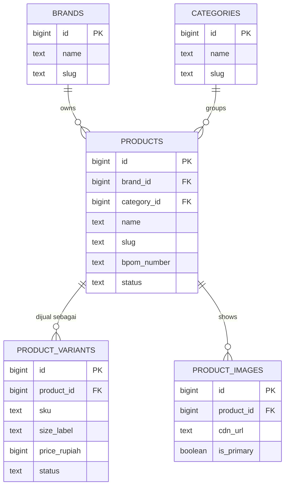
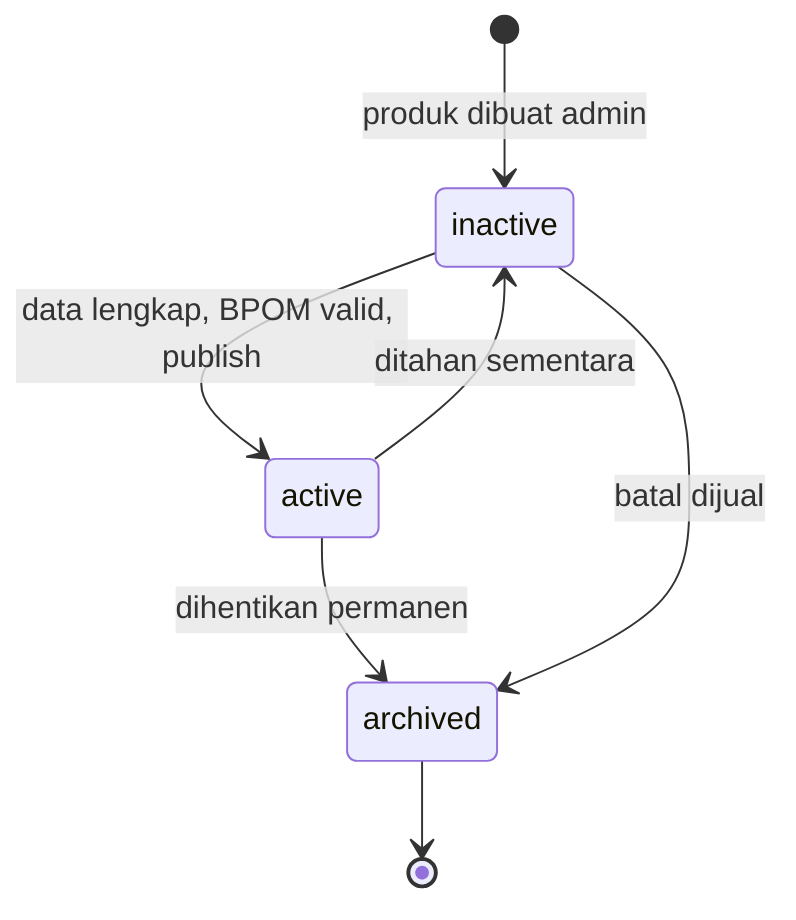
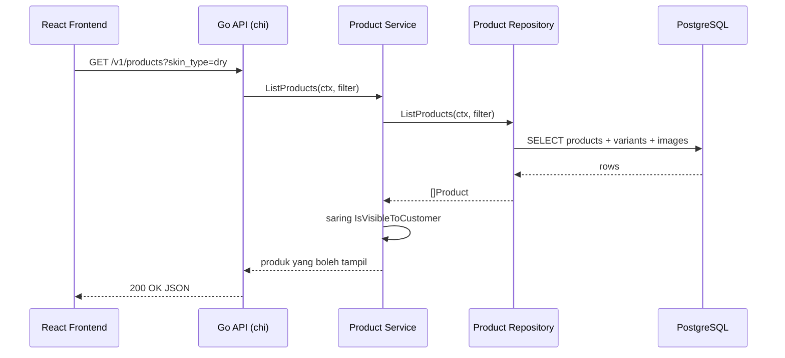

import { Section, Box, Steps, Step, Recap, CardGrid, Card, Chip, Hero, Compare, FileTree, Endpoint, Def } from "@components";

<Hero eyebrow="Roadmap 5 &middot; Domain Mastery" title="Domain Katalog Produk <em>Skincare</em><br />yang Siap Dijual">
  <p>Roadmap 5 dibuka dengan model katalog yang benar-benar paham dunia skincare: brand, variant, SKU, BPOM, tipe kulit, dan concern, bukan sekadar tabel produk generik.</p>
  <Fragment slot="meta">
    <Chip icon="code">Bahasa: <b>Go 1.26</b></Chip>
    <Chip icon="database">DB: <b>PostgreSQL</b></Chip>
    <Chip icon="package">Domain: <b>Katalog</b></Chip>
    <Chip icon="clock">~70 menit baca</Chip>
  </Fragment>
</Hero>

<Section num="01" id="intro" title="Katalog Skincare Bukan Tabel Produk Generik" sub="Katalog adalah pusat data, bukan sekadar daftar kartu produk">

<p class="lead">Di React atau Laravel, katalog sering terasa seperti daftar kartu produk. Di backend, katalog adalah pusat data yang dipakai cart, inventory, checkout, payment, search, SEO, dan admin sekaligus. Salah desain di sini menjalar ke semua modul Roadmap 5.</p>

Produk skincare punya konteks yang jauh lebih kaya daripada produk generik. Toner, serum, sunscreen, dan moisturizer perlu menyimpan tipe kulit yang cocok, concern yang ditangani, bahan aktif, instruksi pemakaian, nomor BPOM, ukuran kemasan, harga per ukuran, dan status kelayakan tampil. Sebuah tabel `products(id, name, price)` ala tutorial tidak cukup untuk satu pun fitur nyata di toko skincare.

<Box variant="bridge" icon="🌉" label="Jembatan: dari product card ke domain model"><p>Di React, satu kartu produk bisa cukup punya `name`, `price`, dan `image`. Di Go backend, satu `Product` harus stabil sebagai sumber kebenaran untuk listing, halaman detail, item cart, snapshot order, laporan, dan workflow admin sekaligus. Beda audiens, beda tuntutan: kartu melayani satu layar, model melayani seluruh sistem.</p></Box>

Maka modul ini tidak mulai dari handler HTTP. Kita mulai dari domain: apa saja entitasnya, data apa yang wajib, mana yang milik produk dan mana yang milik variant, serta batasan apa yang harus dijaga sebelum data tampil ke pelanggan. Handler dan SQL menyusul setelah modelnya benar.

<CardGrid cols={3}>
  <Card><h4>Listing pelanggan</h4><p>Butuh nama, slug, brand, category, gambar utama, status aktif, dan minimal satu variant yang bisa dibeli beserta harganya.</p></Card>
  <Card><h4>Admin katalog</h4><p>Tim admin mengatur BPOM, ingredient, instruksi pakai, status publish, dan SKU variant tanpa menyentuh kode.</p></Card>
  <Card><h4>Checkout nanti</h4><p>Cart dan order tidak membeli product secara langsung, melainkan membeli variant tertentu yang punya SKU dan harga sendiri.</p></Card>
</CardGrid>

<Box variant="analogy" icon="🏬" label="Analogi: rak toko vs gudang"><p>Yang dilihat pelanggan di rak adalah produk (Wardah Hydrating Toner). Yang benar-benar diambil dari gudang, dipindai di kasir, dan dihitung stoknya adalah unit jual spesifik (toner 100ml dengan kode WRD-TON-HYDR-100ML). Katalog harus memodelkan dua lapisan itu, bukan menyatukannya.</p></Box>

</Section>

<Section num="02" id="entitas-inti" title="Entitas Inti dan Relasinya" sub="Empat entitas yang menopang seluruh katalog">

<p class="lead">Katalog skincare kita berdiri di atas empat entitas inti: `Brand`, `Category`, `Product`, dan `ProductVariant`, ditambah `ProductImage` sebagai pelengkap halaman detail.</p>

`Product` adalah konsep barang yang dilihat pelanggan, misalnya Wardah Hydrating Toner. `ProductVariant` adalah pilihan yang benar-benar dibeli, misalnya 100ml atau 200ml. `Brand` memisahkan pemilik produk dan berguna untuk filter serta halaman brand. `Category` menata navigasi, filter, dan SEO. `ProductImage` menyimpan referensi gambar untuk listing dan detail.



<p class="fig-cap"><b>Gambar 1.</b> ERD katalog skincare. Product menjadi induk informasi domain, variant menjadi unit jual yang membawa harga dan stok sendiri.</p>

<Compare aLabel="Laravel / Eloquent" bLabel="Go: model domain + repository" aTone="muted" bTone="violet">
  <Fragment slot="a"><ul><li>Relasi diakses lewat Active Record: `Product::with('variants')->where('status','active')`.</li><li>Business rule gampang terselip di model, controller, request class, atau observer, dan tersebar.</li><li>Lazy loading bisa memicu query N+1 tanpa disadari.</li></ul></Fragment>
  <Fragment slot="b"><ul><li>Struct domain dibuat polos, lalu repository yang tahu cara mengambil produk plus variant dalam query yang sengaja dirancang.</li><li>Aturan seperti "produk boleh tampil" ditaruh eksplisit di method domain kecil (`IsVisibleToCustomer`).</li><li>Tidak ada lazy loading ajaib: query yang jalan adalah query yang kamu tulis.</li></ul></Fragment>
</Compare>

<FileTree title="Folder awal domain katalog" tree={`internal/
  product/                 # domain katalog produk skincare
    model.go               # Product, Brand, Category, ProductVariant, PriceRupiah
    repository.go          # kontrak akses data katalog (interface)
    postgres.go            # implementasi Repository dengan pgx v5
    service.go             # use case listing dan detail produk
    handler.go             # HTTP boundary (Roadmap 2 dan 4)
  shared/
    money.go               # tipe PriceRupiah dipakai lintas modul
cmd/
  api/
    main.go                # wiring router, service, repository
db/
  migrations/
    039_create_catalog.up.sql
    039_create_catalog.down.sql
  seeds/
    catalog.sql
`} />

<Box variant="note" icon="🧭" label="Kenapa empat entitas, bukan satu tabel lebar"><p>Menggabungkan semuanya ke satu tabel `products` raksasa tampak praktis di awal, tetapi merusak begitu satu produk punya banyak ukuran (harga ganda per baris), banyak gambar (kolom `image2`, `image3`, ...), dan banyak brand yang sama dieja berbeda. Memisahkan brand, category, variant, dan image menjaga data tetap konsisten dan siap dipakai filter.</p></Box>

</Section>

<Section num="03" id="product-vs-variant" title="Product vs Variant: Siapa yang Dibeli" sub="Yang masuk cart adalah variant, bukan produk induk">

<p class="lead">Keputusan paling menentukan di katalog adalah memisahkan produk (yang dilihat) dari variant (yang dibeli). Satu produk bisa punya banyak variant, dan harga serta stok melekat ke variant, bukan ke produk.</p>

Wardah Hydrating Toner adalah satu produk. Ukuran 100ml dan 200ml adalah dua variant. Keduanya berbagi nama marketing, brand, category, ingredient, dan instruksi pemakaian, tetapi punya harga berbeda, berat kirim berbeda, dan stok berbeda. Saat pelanggan menekan "Tambah ke keranjang", yang dimasukkan adalah satu variant spesifik, bukan produk abstraknya.

```text title="Contoh katalog yang kita pakai sepanjang Roadmap 5"
Product:
  name: Wardah Hydrating Toner
  brand: Wardah
  category: Toner
  slug: wardah-hydrating-toner
  bpom_number: NA18231234567

Variants:
  SKU: WRD-TON-HYDR-100ML  size: 100ml  price: 35000  weight: 140g
  SKU: WRD-TON-HYDR-200ML  size: 200ml  price: 59000  weight: 260g
```

<Compare aLabel="Anti-pola: harga di Product" bLabel="Idiomatik: harga di Variant" aTone="red" bTone="blue">
  <Fragment slot="a"><ul><li>`products.price` memaksa satu harga untuk semua ukuran.</li><li>Begitu ada ukuran kedua, harus menyalin produk atau menambah kolom `price_200ml`, dan data jadi kacau.</li><li>Cart menyimpan `product_id`, lalu bingung ukuran mana yang dibeli.</li></ul></Fragment>
  <Fragment slot="b"><ul><li>`product_variants.price_rupiah` memberi setiap ukuran harga, berat, dan stok sendiri.</li><li>Menambah ukuran baru cukup satu baris variant, produk tidak berubah.</li><li>Cart menyimpan `variant_id` atau SKU, jelas unit jual mana yang dipilih.</li></ul></Fragment>
</Compare>

<Box variant="bridge" icon="🌉" label="Jembatan: dari product.variants di frontend ke entitas terpisah"><p>Di React kamu mungkin menerima `product.variants[]` sebagai array di dalam objek produk dan memilih satu `selectedVariant` di state. Di backend, variant bukan sekadar properti nested: ia entitas dengan tabel, foreign key, SKU unik, dan harga sendiri, karena ia yang direferensikan oleh `cart_items`, `order_items`, dan baris stok. Nested di JSON respons boleh, tetapi di database ia berdiri sendiri.</p></Box>

<Box variant="tip" icon="💡" label="Prinsip yang menempel"><p>Aturan praktis: apa pun yang punya harga, stok, atau berat kirim sendiri adalah variant. Produk hanya menampung informasi yang sama untuk semua ukuran (deskripsi, ingredient, BPOM, instruksi pakai).</p></Box>

</Section>

<Section num="04" id="sku-bpom" title="SKU dan Nomor BPOM" sub="Dua identitas yang harus stabil dan tidak boleh asal">

<p class="lead">Variant butuh identitas yang stabil untuk gudang dan laporan (SKU), dan produk skincare di Indonesia butuh identitas legal yang bisa diverifikasi (nomor BPOM). Keduanya bukan sekadar kolom teks biasa.</p>

<Def term="SKU"><p>SKU (Stock Keeping Unit) adalah kode unik internal untuk satu unit jual. Wardah Hydrating Toner 100ml dan 200ml punya SKU berbeda meski berasal dari produk yang sama. SKU dipakai inventory, picking gudang, order item, dan laporan.</p></Def>

<Def term="BPOM"><p>BPOM (Badan Pengawas Obat dan Makanan) menerbitkan nomor notifikasi untuk kosmetik yang beredar di Indonesia, umumnya berawalan NA/NB/NC diikuti angka. `bpom_number` menyimpan nomor ini agar bisa ditampilkan ke pelanggan sebagai bukti legalitas dan diverifikasi tim operasional.</p></Def>

Kita sengaja tidak men-generate SKU otomatis dari nama produk saja. SKU harus stabil, unik, dan tetap sama walau nama marketing berubah. Slug boleh berubah demi SEO, tetapi SKU jangan, karena ia tertanam di order lama, laporan keuangan, dan label fisik di gudang. Mengubah SKU berarti memutus jejak inventory.

<Compare aLabel="Slug (boleh berubah)" bLabel="SKU (jangan berubah)" aTone="teal" bTone="violet">
  <Fragment slot="a"><ul><li>Tujuan: URL publik yang ramah SEO, `/products/wardah-hydrating-toner`.</li><li>Boleh berubah saat marketing mengganti nama atau memperbaiki ejaan.</li><li>Saat berubah, pasang redirect 301 dari slug lama.</li></ul></Fragment>
  <Fragment slot="b"><ul><li>Tujuan: identitas unit jual untuk gudang, order, dan laporan.</li><li>Harus stabil seumur hidup variant, dipakai di data historis.</li><li>Unik secara global lewat constraint `UNIQUE` di database.</li></ul></Fragment>
</Compare>

<Box variant="warn" icon="⚠️" label="BPOM bukan kolom opsional untuk pasar Indonesia"><p>Menjual kosmetik tanpa nomor notifikasi BPOM yang valid berisiko secara legal dan merusak kepercayaan. Perlakukan `bpom_number` sebagai data wajib pada produk yang siap tayang, validasi formatnya, dan tampilkan di halaman detail. Ini bagian dari domain, bukan sekadar metadata.</p></Box>

<Box variant="bridge" icon="🌉" label="Jembatan: SKU seperti primary key bisnis"><p>Di Laravel kamu terbiasa `id` auto-increment sebagai identitas teknis. SKU mirip itu tetapi untuk dunia bisnis: ia identitas yang dipahami manusia gudang dan akuntan, bukan database. Pola sehatnya sama dengan memisahkan surrogate key (`id`) dari natural key (`sku`): relasi internal pakai `id`, komunikasi lintas sistem dan manusia pakai SKU.</p></Box>

</Section>

<Section num="05" id="atribut-skincare" title="Atribut Skincare yang Bernilai Bisnis" sub="Tipe kulit, concern, ingredient, dan instruksi pakai">

<p class="lead">Atribut skincare bukan pemanis UI. Ia menentukan filter katalog, rekomendasi, edukasi pelanggan, dan kepercayaan pembeli. Inilah yang membedakan katalog skincare dari katalog kaus.</p>

<CardGrid cols={2}>
  <Card><h4>`skin_types`</h4><p>Nilai seperti `oily`, `dry`, `combination`, `sensitive`. Satu produk bisa cocok untuk lebih dari satu tipe kulit, jadi ini koleksi, bukan satu nilai.</p></Card>
  <Card><h4>`skin_concerns`</h4><p>Concern seperti acne, dullness, dehydration, redness, dark spot. Ini filter penting di listing dan dasar rekomendasi nanti.</p></Card>
  <Card><h4>`ingredients`</h4><p>Daftar bahan atau bahan aktif. Untuk fase awal cukup koleksi teks, lalu dinormalisasi saat search ingredient makin penting.</p></Card>
  <Card><h4>`usage_instruction`</h4><p>Instruksi pemakaian di halaman detail, misalnya gunakan setelah cleansing dan sebelum moisturizer. Teks bebas, milik produk.</p></Card>
</CardGrid>

<Box variant="bridge" icon="🌉" label="Jembatan: dari TypeScript union ke Go custom type"><p>Di TypeScript kamu menulis `type SkinType = 'oily' | 'dry' | 'combination' | 'sensitive'` agar nilai terbatas dan auto-complete. Go tidak punya union literal, tetapi pola padanannya adalah `type SkinType string` plus sekumpulan konstanta. Nilai tetap eksplisit dan mudah dibaca, validasi nilai sah dilakukan oleh fungsi kecil atau constraint database, bukan oleh compiler.</p></Box>

Pisahkan data terstruktur dari copywriting promosi. `skin_types`, `skin_concerns`, dan `ingredients` adalah data domain yang difilter dan dicari. Kalimat seperti "kulit terasa segar dalam 7 hari" adalah marketing dan masuk `description`, bukan menjadi aturan domain. Mencampur keduanya membuat filter dan search berantakan.

<Box variant="note" icon="📝" label="Koleksi: array dulu, tabel relasi nanti"><p>Untuk Roadmap 5 awal, menyimpan `skin_types` dan `ingredients` sebagai array kolom PostgreSQL cukup untuk filter sederhana. Saat search ingredient dan halaman edukasi bahan makin penting, kita pecah `ingredients` menjadi tabel relasi `product_ingredients`. Mulai sederhana, naikkan kompleksitas saat dibutuhkan, bukan sebaliknya.</p></Box>

</Section>

<Section num="06" id="status-slug-image" title="Status, Slug, dan Product Image" sub="Tiga keputusan kecil yang sering salah">

<p class="lead">Produk tidak hanya "ada" atau "tidak ada". Ia punya siklus hidup, URL publik yang harus dijaga, dan gambar yang tidak boleh masuk database sebagai binary.</p>



<p class="fig-cap"><b>Gambar 2.</b> Siklus hidup status produk. Hanya `active` yang boleh tampil ke pelanggan dan variant-nya boleh masuk cart. `archived` tetap disimpan untuk riwayat order lama.</p>

<CardGrid cols={3}>
  <Card><h4>`active`</h4><p>Boleh tampil di katalog publik, variant aktifnya boleh masuk cart dan checkout.</p></Card>
  <Card><h4>`inactive`</h4><p>Disiapkan atau ditahan sementara. Admin bisa melihat, pelanggan tidak.</p></Card>
  <Card><h4>`archived`</h4><p>Dihentikan permanen. Disimpan untuk riwayat dan audit order lama, tidak untuk penjualan baru.</p></Card>
</CardGrid>

<Box variant="warn" icon="⚠️" label="Status boolean tidak cukup"><p>Kolom `is_active boolean` tidak bisa membedakan "draft yang belum siap" dari "produk lama yang diarsipkan". Begitu order lama merujuk produk yang dihapus, riwayat pesanan rusak. Pakai status domain bertingkat dan jangan pernah benar-benar menghapus baris produk yang sudah pernah dibeli.</p></Box>

Slug adalah URL SEO-friendly, misalnya `/products/wardah-hydrating-toner`. Slug harus unik dan stabil, tetapi tidak menjadi primary key. Primary key tetap `id` numerik, karena slug bisa berubah saat marketing mengganti nama. Relasi antar tabel selalu pakai `id`, slug hanya untuk URL.

Product image di database sebaiknya URL CDN, bukan file binary. File gambar hidup di object storage seperti S3 dan disajikan lewat CDN seperti CloudFront pada Roadmap 8. Database cukup menyimpan URL, alt text, urutan, dan penanda gambar utama.

<Box variant="warn" icon="⚠️" label="Jangan simpan binary gambar di tabel produk"><p>Menyimpan `bytea` gambar membuat backup database membengkak, query katalog jadi berat karena ikut menarik kolom besar, dan scaling CDN nyaris mustahil. Simpan file di object storage, simpan referensinya (URL plus metadata) di PostgreSQL.</p></Box>

</Section>

<Section num="07" id="schema-postgresql" title="Skema PostgreSQL untuk Katalog" sub="Cukup ketat untuk integritas, cukup lentur untuk bertumbuh">

<p class="lead">Skema awal harus menjaga integritas (foreign key, constraint, harga positif) tetapi tetap fleksibel saat fitur search, promo, dan rekomendasi masuk. Perhatikan: harga memakai `BIGINT`, bukan `INTEGER`.</p>

<Box variant="tip" icon="💡" label="Uang selalu BIGINT, dalam rupiah bulat"><p>Rupiah tidak punya pecahan sen dalam praktik ritel, jadi kita simpan harga sebagai bilangan bulat rupiah, bukan desimal. Tetapi `INTEGER` PostgreSQL hanya sampai sekitar 2,1 miliar, dan total order paket atau hamper skincare bisa menembusnya. Pakai `BIGINT` untuk semua kolom uang sejak awal agar tidak ada migrasi menyakitkan di kemudian hari.</p></Box>

```sql title="db/migrations/039_create_catalog.up.sql"
CREATE TABLE brands (
  id BIGINT GENERATED ALWAYS AS IDENTITY PRIMARY KEY,
  name TEXT NOT NULL,
  slug TEXT NOT NULL UNIQUE,
  created_at TIMESTAMPTZ NOT NULL DEFAULT NOW(),
  updated_at TIMESTAMPTZ NOT NULL DEFAULT NOW()
);

CREATE TABLE categories (
  id BIGINT GENERATED ALWAYS AS IDENTITY PRIMARY KEY,
  name TEXT NOT NULL,
  slug TEXT NOT NULL UNIQUE,
  created_at TIMESTAMPTZ NOT NULL DEFAULT NOW(),
  updated_at TIMESTAMPTZ NOT NULL DEFAULT NOW()
);

CREATE TABLE products (
  id BIGINT GENERATED ALWAYS AS IDENTITY PRIMARY KEY,
  brand_id BIGINT NOT NULL REFERENCES brands(id),
  category_id BIGINT NOT NULL REFERENCES categories(id),
  name TEXT NOT NULL,
  slug TEXT NOT NULL UNIQUE,
  description TEXT NOT NULL DEFAULT '',
  bpom_number TEXT NOT NULL,
  skin_types TEXT[] NOT NULL DEFAULT '{}',
  skin_concerns TEXT[] NOT NULL DEFAULT '{}',
  ingredients TEXT[] NOT NULL DEFAULT '{}',
  usage_instruction TEXT NOT NULL DEFAULT '',
  status TEXT NOT NULL DEFAULT 'inactive',
  created_at TIMESTAMPTZ NOT NULL DEFAULT NOW(),
  updated_at TIMESTAMPTZ NOT NULL DEFAULT NOW(),
  CONSTRAINT products_status_check CHECK (status IN ('active', 'inactive', 'archived')),
  CONSTRAINT products_skin_types_check CHECK (skin_types <@ ARRAY['oily', 'dry', 'combination', 'sensitive']::TEXT[]),
  CONSTRAINT products_bpom_number_check CHECK (length(trim(bpom_number)) >= 6)
);

CREATE TABLE product_variants (
  id BIGINT GENERATED ALWAYS AS IDENTITY PRIMARY KEY,
  product_id BIGINT NOT NULL REFERENCES products(id),
  sku TEXT NOT NULL UNIQUE,
  size_label TEXT NOT NULL,
  volume_ml INTEGER,
  price_rupiah BIGINT NOT NULL,
  weight_grams INTEGER NOT NULL DEFAULT 0,
  status TEXT NOT NULL DEFAULT 'active',
  created_at TIMESTAMPTZ NOT NULL DEFAULT NOW(),
  updated_at TIMESTAMPTZ NOT NULL DEFAULT NOW(),
  CONSTRAINT product_variants_status_check CHECK (status IN ('active', 'inactive', 'archived')),
  CONSTRAINT product_variants_price_check CHECK (price_rupiah > 0),
  CONSTRAINT product_variants_volume_check CHECK (volume_ml IS NULL OR volume_ml > 0),
  CONSTRAINT product_variants_weight_check CHECK (weight_grams >= 0)
);

CREATE TABLE product_images (
  id BIGINT GENERATED ALWAYS AS IDENTITY PRIMARY KEY,
  product_id BIGINT NOT NULL REFERENCES products(id),
  cdn_url TEXT NOT NULL,
  alt_text TEXT NOT NULL DEFAULT '',
  sort_order INTEGER NOT NULL DEFAULT 0,
  is_primary BOOLEAN NOT NULL DEFAULT FALSE,
  created_at TIMESTAMPTZ NOT NULL DEFAULT NOW(),
  CONSTRAINT product_images_url_check CHECK (cdn_url LIKE 'https://%')
);

CREATE INDEX idx_products_brand_id ON products(brand_id);
CREATE INDEX idx_products_category_id ON products(category_id);
CREATE INDEX idx_products_status ON products(status);
CREATE INDEX idx_product_variants_product_id ON product_variants(product_id);
CREATE UNIQUE INDEX idx_product_images_primary ON product_images(product_id) WHERE is_primary;
```

<Box variant="note" icon="🧭" label="Dua constraint yang sering dilupakan"><p>`products_skin_types_check` memakai operator array `<@` (terkandung dalam) agar tidak ada nilai tipe kulit di luar daftar sah. `idx_product_images_primary` adalah partial unique index yang menjamin setiap produk hanya punya satu gambar utama. Constraint seperti ini menjaga data tetap waras meski input datang dari banyak admin.</p></Box>

<p>Data contoh untuk seed lokal, dengan harga sebagai bilangan rupiah bulat:</p>

```sql title="db/seeds/catalog.sql"
INSERT INTO brands (name, slug) VALUES ('Wardah', 'wardah');
INSERT INTO categories (name, slug) VALUES ('Toner', 'toner');

INSERT INTO products (
  brand_id, category_id, name, slug, description, bpom_number,
  skin_types, skin_concerns, ingredients, usage_instruction, status
)
VALUES (
  1, 1,
  'Wardah Hydrating Toner',
  'wardah-hydrating-toner',
  'Hydrating toner untuk membantu menjaga kelembapan kulit setelah cleansing.',
  'NA18231234567',
  ARRAY['dry', 'combination', 'sensitive'],
  ARRAY['dehydration', 'redness'],
  ARRAY['Aqua', 'Glycerin', 'Aloe Vera Extract'],
  'Tuang ke kapas atau telapak tangan, lalu aplikasikan ke wajah setelah cleansing.',
  'active'
);

INSERT INTO product_variants (product_id, sku, size_label, volume_ml, price_rupiah, weight_grams)
VALUES
  (1, 'WRD-TON-HYDR-100ML', '100ml', 100, 35000, 140),
  (1, 'WRD-TON-HYDR-200ML', '200ml', 200, 59000, 260);

INSERT INTO product_images (product_id, cdn_url, alt_text, sort_order, is_primary)
VALUES (1, 'https://cdn.example.com/products/wardah-hydrating-toner/main.webp', 'Botol Wardah Hydrating Toner', 1, TRUE);
```

</Section>

<Section num="08" id="model-go" title="Model Go dan Boundary Domain" sub="Struct domain murni, tanpa HTTP dan tanpa driver database">

<p class="lead">Model Go dibuat kecil, jelas, dan tidak bergantung ke HTTP maupun pgx. Inilah yang membuat service mudah dites tanpa database dan tanpa `httptest`.</p>

Kita mulai dari tipe uang. Daripada menyebar `int64` polos yang bisa tertukar dengan ID atau kuantitas, kita beri nama: `PriceRupiah`. Tipe ini hidup di package `shared` agar cart, order, dan payment memakai tipe uang yang sama.

```go title="internal/shared/money.go"
package shared

import "fmt"

// PriceRupiah adalah jumlah uang dalam rupiah bulat (tanpa pecahan sen).
// Disimpan sebagai BIGINT di PostgreSQL. Pakai tipe ini, bukan int64 polos,
// agar uang tidak tertukar dengan ID atau kuantitas.
type PriceRupiah int64

// String memformat harga menjadi teks rupiah, misalnya "Rp35.000".
func (p PriceRupiah) String() string {
	n := int64(p)
	neg := n < 0
	if neg {
		n = -n
	}
	digits := fmt.Sprintf("%d", n)
	var out []byte
	for i, c := range digits {
		if i > 0 && (len(digits)-i)%3 == 0 {
			out = append(out, '.')
		}
		out = append(out, byte(c))
	}
	sign := ""
	if neg {
		sign = "-"
	}
	return "Rp" + sign + string(out)
}
```

<Box variant="bridge" icon="🌉" label="Jembatan: dari number JS ke int64 bertipe"><p>Di JavaScript semua angka adalah `number` floating point, dan menyimpan uang di sana berisiko galat pembulatan (`0.1 + 0.2 !== 0.3`). Di PHP kamu mungkin pakai integer cents atau library Money. Di Go kita pilih bilangan bulat rupiah dengan tipe khusus `PriceRupiah int64`: tidak ada pecahan biner yang bocor, dan tipe yang dinamai mencegah salah pasang nilai. Format ribuan hanya untuk tampilan, bukan untuk perhitungan.</p></Box>

Sekarang model domain katalog. Perhatikan `Price` memakai `shared.PriceRupiah`, dan tidak ada satu pun import dari pgx atau net/http di file ini.

```go title="internal/product/model.go"
package product

import (
	"time"

	"github.com/kamu/skincare-backend/internal/shared"
)

type ProductID int64
type BrandID int64
type CategoryID int64
type VariantID int64

type ProductStatus string

const (
	StatusActive   ProductStatus = "active"
	StatusInactive ProductStatus = "inactive"
	StatusArchived ProductStatus = "archived"
)

type SkinType string

const (
	SkinTypeOily        SkinType = "oily"
	SkinTypeDry         SkinType = "dry"
	SkinTypeCombination SkinType = "combination"
	SkinTypeSensitive   SkinType = "sensitive"
)

type Brand struct {
	ID   BrandID
	Name string
	Slug string
}

type Category struct {
	ID   CategoryID
	Name string
	Slug string
}

type Product struct {
	ID               ProductID
	BrandID          BrandID
	CategoryID       CategoryID
	Name             string
	Slug             string
	Description      string
	BPOMNumber       string
	SkinTypes        []SkinType
	SkinConcerns     []string
	Ingredients      []string
	UsageInstruction string
	Status           ProductStatus
	Images           []ProductImage
	Variants         []ProductVariant
	CreatedAt        time.Time
	UpdatedAt        time.Time
}

type ProductVariant struct {
	ID          VariantID
	ProductID   ProductID
	SKU         string
	SizeLabel   string
	VolumeML    *int
	Price       shared.PriceRupiah
	WeightGrams int
	Status      ProductStatus
}

type ProductImage struct {
	ID        int64
	ProductID ProductID
	CDNURL    string
	AltText   string
	SortOrder int
	IsPrimary bool
}

// IsVisibleToCustomer memutuskan apakah produk boleh tampil ke pelanggan.
// Aturan: produk aktif DAN punya minimal satu variant aktif.
func (p Product) IsVisibleToCustomer() bool {
	if p.Status != StatusActive {
		return false
	}
	for _, v := range p.Variants {
		if v.Status == StatusActive {
			return true
		}
	}
	return false
}

// PrimaryImage mengembalikan gambar utama, atau gambar pertama bila tak ada penanda.
func (p Product) PrimaryImage() (ProductImage, bool) {
	if len(p.Images) == 0 {
		return ProductImage{}, false
	}
	for _, img := range p.Images {
		if img.IsPrimary {
			return img, true
		}
	}
	return p.Images[0], true
}
```

<Box variant="tip" icon="💡" label="Idiomatic Go: aturan domain jadi method kecil"><p>`IsVisibleToCustomer` mengubah aturan bisnis yang sebelumnya tersebar di banyak query SQL menjadi satu method yang bisa dibaca dan dites tanpa database. Repository boleh tahu SQL, handler boleh tahu HTTP, tetapi `model.go` tetap domain murni. Inilah inti boundary yang bersih.</p></Box>

`VolumeML` sengaja `*int` (pointer) agar bisa membedakan "tidak diisi" dari "nol". Sabun batang atau sheet mask tidak punya volume ml, dan `nil` mengomunikasikan itu lebih jujur daripada `0`. Ini padanan Go untuk `number | null` di TypeScript.

</Section>

<Section num="09" id="repository-pgx" title="Repository dengan pgx v5" sub="Kontrak di sisi pemakai, implementasi di balik interface">

<p class="lead">Service hanya tahu sebuah interface `Repository`. Implementasi konkret memakai pgx v5 dan tahu cara memetakan baris SQL ke struct domain, termasuk kolom array PostgreSQL.</p>

```go title="internal/product/repository.go"
package product

import "context"

type ListFilter struct {
	CategorySlug string
	BrandSlug    string
	SkinType     SkinType
	Concern      string
	Limit        int
	Offset       int
}

// Repository adalah kontrak akses data katalog. Interface didefinisikan di sisi
// pemakai (package product), bukan menyalin API driver. Service bergantung ke sini.
type Repository interface {
	ListProducts(ctx context.Context, f ListFilter) ([]Product, error)
	GetProductBySlug(ctx context.Context, slug string) (Product, error)
	GetVariantBySKU(ctx context.Context, sku string) (ProductVariant, error)
}
```

Implementasi pgx memetakan kolom `TEXT[]` PostgreSQL langsung ke slice Go. pgx v5 mendukung pemindaian array ke `[]string` tanpa parsing manual, asalkan tipe tujuannya cocok.

```go title="internal/product/postgres.go"
package product

import (
	"context"
	"errors"
	"fmt"

	"github.com/jackc/pgx/v5"
	"github.com/jackc/pgx/v5/pgxpool"

	"github.com/kamu/skincare-backend/internal/shared"
)

type PostgresRepository struct {
	pool *pgxpool.Pool
}

// NewPostgresRepository menerima pool dan mengembalikan struct konkret.
// Idiom: accept interfaces, return structs.
func NewPostgresRepository(pool *pgxpool.Pool) *PostgresRepository {
	return &PostgresRepository{pool: pool}
}

func (r *PostgresRepository) GetProductBySlug(ctx context.Context, slug string) (Product, error) {
	const q = `
		SELECT id, brand_id, category_id, name, slug, description, bpom_number,
		       skin_types, skin_concerns, ingredients, usage_instruction, status,
		       created_at, updated_at
		FROM products
		WHERE slug = $1`

	var (
		p         Product
		skinTypes []string
	)
	row := r.pool.QueryRow(ctx, q, slug)
	err := row.Scan(
		&p.ID, &p.BrandID, &p.CategoryID, &p.Name, &p.Slug, &p.Description, &p.BPOMNumber,
		&skinTypes, &p.SkinConcerns, &p.Ingredients, &p.UsageInstruction, &p.Status,
		&p.CreatedAt, &p.UpdatedAt,
	)
	if errors.Is(err, pgx.ErrNoRows) {
		return Product{}, ErrProductNotFound
	}
	if err != nil {
		return Product{}, fmt.Errorf("scan product: %w", err)
	}

	// Konversi []string -> []SkinType agar domain tetap kuat tipe.
	p.SkinTypes = make([]SkinType, len(skinTypes))
	for i, s := range skinTypes {
		p.SkinTypes[i] = SkinType(s)
	}

	if p.Variants, err = r.variantsByProduct(ctx, p.ID); err != nil {
		return Product{}, err
	}
	if p.Images, err = r.imagesByProduct(ctx, p.ID); err != nil {
		return Product{}, err
	}
	return p, nil
}

func (r *PostgresRepository) variantsByProduct(ctx context.Context, id ProductID) ([]ProductVariant, error) {
	const q = `
		SELECT id, product_id, sku, size_label, volume_ml, price_rupiah, weight_grams, status
		FROM product_variants
		WHERE product_id = $1
		ORDER BY price_rupiah`

	rows, err := r.pool.Query(ctx, q, id)
	if err != nil {
		return nil, fmt.Errorf("query variants: %w", err)
	}
	defer rows.Close()

	var out []ProductVariant
	for rows.Next() {
		var v ProductVariant
		var price int64
		if err := rows.Scan(
			&v.ID, &v.ProductID, &v.SKU, &v.SizeLabel, &v.VolumeML,
			&price, &v.WeightGrams, &v.Status,
		); err != nil {
			return nil, fmt.Errorf("scan variant: %w", err)
		}
		v.Price = shared.PriceRupiah(price)
		out = append(out, v)
	}
	return out, rows.Err()
}
```

<Box variant="warn" icon="⚠️" label="Jangan picu N+1 lewat lazy loading"><p>Memuat variant dan image lewat query terpisah aman untuk satu produk detail. Tetapi pada listing banyak produk, jangan panggil `variantsByProduct` di dalam loop per produk, itu N+1. Untuk listing, ambil semua variant produk yang relevan dalam satu query `WHERE product_id = ANY($1)` lalu kelompokkan di Go. pgx tidak menyembunyikan query seperti Eloquent, jadi N+1 selalu terlihat di kode kita sendiri.</p></Box>

<Box variant="bridge" icon="🌉" label="Jembatan: dari Eloquent eager loading ke query eksplisit"><p>Di Laravel, `Product::with('variants', 'images')` mengeluarkan beberapa query otomatis dan menggabungkannya. Di Go tidak ada keajaiban itu: kamu menulis sendiri query variant dan image, lalu menyusunnya ke struct. Lebih banyak baris, tetapi kamu selalu tahu persis berapa query yang jalan, dan tidak ada N+1 yang menyelinap diam-diam saat data bertambah.</p></Box>

</Section>

<Section num="10" id="api-hands-on" title="API dan Hands-on Ringan" sub="Listing dan detail dulu, admin menyusul">

<p class="lead">Untuk pelanggan, katalog minimal butuh endpoint listing dan detail. Untuk admin, katalog bertambah ke create, update, dan archive pada modul berikutnya.</p>

<Endpoint method="GET" path="/v1/products" desc="Daftar produk aktif dengan filter category, brand, skin_type, concern, limit, dan offset" />
<Endpoint method="GET" path="/v1/products/{slug}" desc="Detail produk aktif beserta brand, category, gambar, dan variant aktif" />
<Endpoint method="GET" path="/v1/admin/products" desc="Daftar produk untuk admin, termasuk inactive dan archived" />

Service memegang use case dan satu aturan kunci: pelanggan hanya boleh melihat produk yang `IsVisibleToCustomer`. Keputusan ini hidup di service dan domain, bukan di handler.

```go title="internal/product/service.go"
package product

import (
	"context"
	"errors"
	"strings"
)

var ErrProductNotFound = errors.New("product not found")

type Service struct {
	repo Repository
}

func NewService(repo Repository) *Service {
	return &Service{repo: repo}
}

func (s *Service) ListProducts(ctx context.Context, f ListFilter) ([]Product, error) {
	if f.Limit <= 0 || f.Limit > 50 {
		f.Limit = 20
	}
	if f.Offset < 0 {
		f.Offset = 0
	}

	products, err := s.repo.ListProducts(ctx, f)
	if err != nil {
		return nil, err
	}

	visible := make([]Product, 0, len(products))
	for _, p := range products {
		if p.IsVisibleToCustomer() {
			visible = append(visible, p)
		}
	}
	return visible, nil
}

func (s *Service) GetProductDetail(ctx context.Context, slug string) (Product, error) {
	slug = strings.TrimSpace(slug)
	if slug == "" {
		return Product{}, ErrProductNotFound
	}

	p, err := s.repo.GetProductBySlug(ctx, slug)
	if err != nil {
		return Product{}, err
	}
	if !p.IsVisibleToCustomer() {
		// Sembunyikan keberadaan produk non-aktif dari pelanggan.
		return Product{}, ErrProductNotFound
	}
	return p, nil
}
```

<p>Alur request katalog publik, dari frontend sampai database:</p>



<p class="fig-cap"><b>Gambar 3.</b> Handler tidak memutuskan produk aktif atau tidak. Keputusan visibility hidup di service dan domain, sehingga mudah dites tanpa HTTP.</p>

<Steps>
  <Step><b>Buat migration katalog</b><p>Simpan DDL dari section skema ke `db/migrations/039_create_catalog.up.sql`.</p></Step>
  <Step><b>Jalankan migration lokal</b><p>Pakai tool migration dari Roadmap 3, lalu verifikasi tabel `products` dan `product_variants` muncul.</p></Step>
  <Step><b>Masukkan seed</b><p>Jalankan seed Wardah Hydrating Toner agar endpoint listing punya data nyata untuk dicoba.</p></Step>
  <Step><b>Bangun repository bertahap</b><p>Mulai dari `GetProductBySlug`, lalu `ListProducts` dengan filter sederhana, sambil menjaga tidak ada N+1.</p></Step>
</Steps>

```bash title="Terminal"
psql "$DB_URL" -f db/migrations/039_create_catalog.up.sql
psql "$DB_URL" -f db/seeds/catalog.sql
psql "$DB_URL" -c "SELECT slug, status FROM products;"
psql "$DB_URL" -c "SELECT sku, price_rupiah FROM product_variants ORDER BY price_rupiah;"
```

<Box variant="note" icon="📝" label="Checkpoint praktik"><p>Setelah modul ini, kamu belum perlu search canggih atau filter ingredient. Targetnya: model katalog yang benar, seed lokal yang masuk akal, dan service yang hanya menampilkan produk aktif beserta variant aktifnya. Search dan filter lanjutan adalah chapter berikutnya.</p></Box>

</Section>

<Section num="11" id="jebakan-umum" title="Jebakan Umum Developer JS dan PHP" sub="Kesalahan katalog hampir selalu soal batas domain, bukan sintaks">

<p class="lead">Bug katalog jarang lahir dari sintaks Go. Ia lahir dari batas domain yang kabur: siapa yang punya harga, siapa yang dibeli, dan apa artinya "produk ada".</p>

<CardGrid cols={2}>
  <Card><h4>Harga di `Product` saja</h4><p>Rusak saat 100ml dan 200ml berbeda harga. Taruh harga jual di `ProductVariant` dengan tipe `PriceRupiah`.</p></Card>
  <Card><h4>Cart menyimpan product ID</h4><p>Cart harus menyimpan variant ID atau SKU, karena pembeli memilih unit jual tertentu, bukan produk abstrak.</p></Card>
  <Card><h4>Slug jadi identitas internal</h4><p>Slug berubah demi SEO. Pakai `id` untuk relasi database, slug hanya untuk URL publik.</p></Card>
  <Card><h4>Gambar masuk DB sebagai binary</h4><p>Database membengkak dan CDN sulit dipakai. Simpan URL CDN plus metadata gambar.</p></Card>
  <Card><h4>Status hanya boolean</h4><p>`is_active` tidak membedakan draft, ditahan, dan arsip. Pakai status domain eksplisit.</p></Card>
  <Card><h4>BPOM dianggap opsional</h4><p>Untuk pasar Indonesia, nomor BPOM penting untuk trust, legalitas, dan moderasi katalog.</p></Card>
  <Card><h4>Harga pakai `INTEGER` atau `float`</h4><p>`INTEGER` bisa overflow di total, `float` membawa galat pembulatan. Pakai `BIGINT` rupiah bulat.</p></Card>
  <Card><h4>N+1 saat memuat variant</h4><p>Memuat variant per produk dalam loop listing meledakkan jumlah query. Batch dengan `= ANY($1)`.</p></Card>
</CardGrid>

<Box variant="warn" icon="⚠️" label="Constraint database bukan pengganti business rule"><p>`price_rupiah > 0` bisa dijaga database dan validasi admin. Tetapi "produk boleh dibeli" adalah business rule: ia bergantung pada status produk, status variant, dan nanti stok inventory. Constraint menjaga data tidak rusak, service menjaga aturan bisnis. Keduanya bekerja sama, bukan saling menggantikan.</p></Box>

<Box variant="bridge" icon="🌉" label="Jembatan: dari validasi FormRequest ke dua lapis penjaga"><p>Di Laravel kamu terbiasa menaruh aturan di FormRequest dan kadang di migration. Di Go pisahkan dengan jelas: constraint PostgreSQL menjaga integritas data (harga positif, status sah, satu gambar utama), sedangkan service Go menjaga aturan bisnis yang butuh konteks (boleh tampil, boleh dibeli). Lapis bawah mencegah data busuk, lapis atas mencegah keputusan salah.</p></Box>

</Section>

<Section num="12" id="ringkasan" title="Ringkasan & Poin Penting" sub="Katalog adalah fondasi seluruh Roadmap 5">

<p class="lead">Katalog adalah fondasi domain online shop skincare. Desain yang benar di sini membuat cart, inventory, checkout, payment, dan search jauh lebih bersih. Salah desain di sini menjalar ke semua modul berikutnya.</p>

<Recap title="Yang Wajib Menempel">
  <ul><li>`Product` adalah konsep yang dilihat pelanggan, `ProductVariant` adalah unit jual yang masuk cart. Harga, berat, dan stok melekat ke variant.</li><li>SKU harus unik dan stabil seumur hidup variant karena dipakai inventory, order, laporan, dan gudang. Slug boleh berubah demi SEO, relasi internal tetap pakai `id`.</li><li>`bpom_number` adalah data domain wajib untuk katalog skincare Indonesia, untuk legalitas dan kepercayaan, bukan metadata opsional.</li><li>Atribut skincare (`skin_types`, `skin_concerns`, `ingredients`, `usage_instruction`) adalah data terstruktur yang menggerakkan filter dan rekomendasi, bukan teks UI.</li><li>Status `active`, `inactive`, `archived` lebih jujur daripada boolean tunggal, dan produk yang pernah dibeli tidak boleh benar-benar dihapus.</li><li>Uang memakai `PriceRupiah int64` di Go dan `BIGINT` di PostgreSQL, rupiah bulat tanpa pecahan dan tanpa risiko overflow atau galat float.</li><li>Gambar disimpan sebagai URL CDN plus metadata, bukan binary di database.</li><li>Model Go tetap domain murni, repository pgx menangani SQL dan array, service menjaga aturan visibility. Hati-hati N+1 saat memuat variant.</li></ul>
</Recap>

Dalam proyek skincare, modul ini meletakkan batu pertama Roadmap 5: model katalog yang paham brand, variant, SKU, BPOM, dan atribut kulit, dengan harga bertipe `PriceRupiah` dan boundary domain yang bersih. Cart tinggal menunjuk variant, inventory tinggal menempel stok ke variant, dan checkout tinggal menjumlahkan harga variant yang sudah benar tipenya.

Langkah berikutnya: chapter Search dan Filter memanfaatkan `skin_types`, `skin_concerns`, dan `category` untuk menyaring katalog secara cepat. Lalu Cart menyimpan `variant_id`, Inventory menempelkan stok per variant, dan Checkout menjumlahkan `PriceRupiah` menjadi total order dalam satu transaksi.

</Section>
