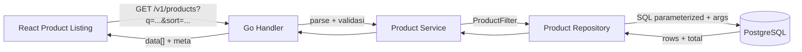
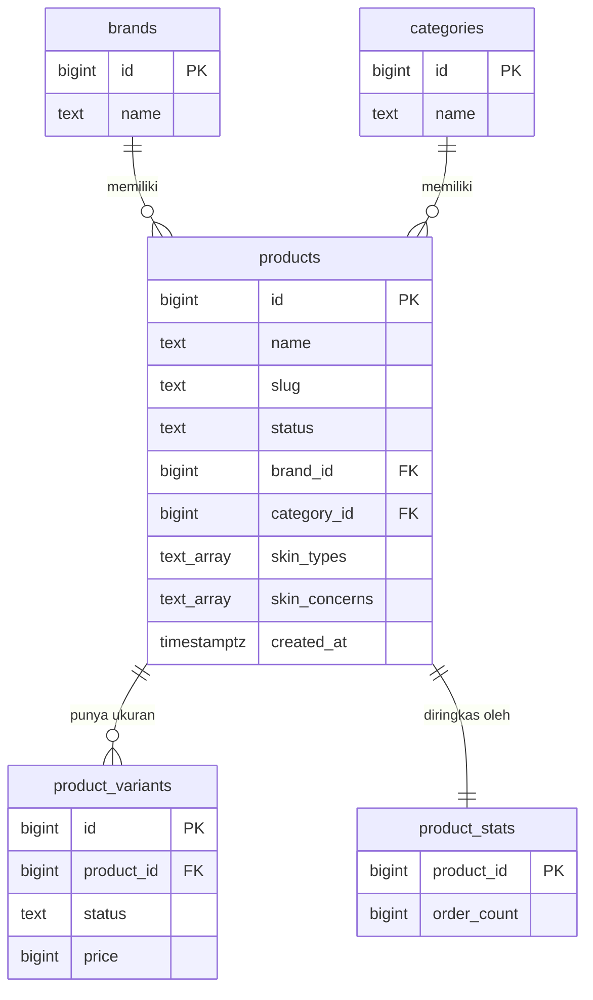
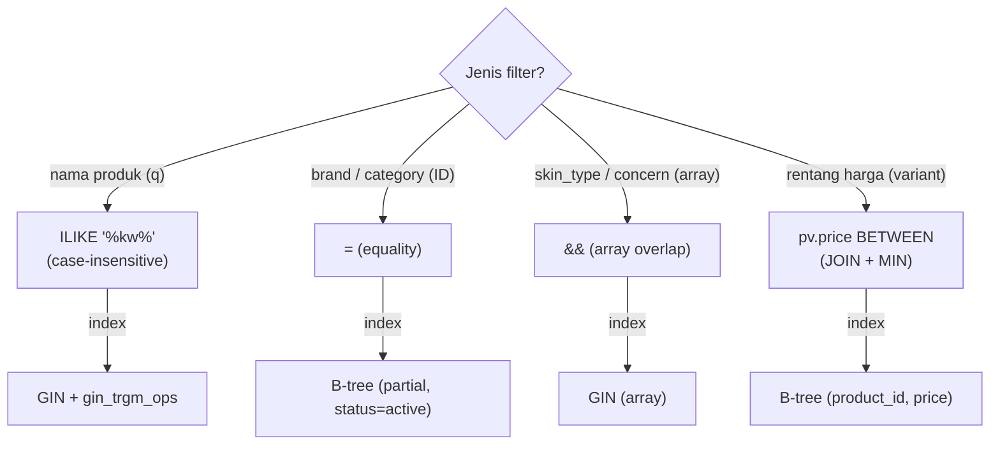

import { Section, Box, Steps, Step, Recap, CardGrid, Card, Chip, Hero, Compare, Endpoint, Def } from "@components";

<Hero eyebrow="Roadmap 5 &middot; Domain Online Shop" title="Product Search <em>and</em> Filtering<br />Discovery yang Cepat dan Aman">
  <p>Modul ini mengubah katalog dari daftar statis menjadi pengalaman belanja yang bisa dicari, disaring per atribut skincare, diurutkan, dan dipaginasi, tanpa membuka celah SQL injection atau melambat saat data membesar.</p>
  <Fragment slot="meta">
    <Chip icon="code">Bahasa: <b>Go 1.26</b></Chip>
    <Chip icon="database">PostgreSQL <b>+ pg_trgm</b></Chip>
    <Chip icon="route">REST: <b>GET /v1/products</b></Chip>
    <Chip icon="clock">~70 menit baca</Chip>
  </Fragment>
</Hero>

<Section num="01" id="intro" title="Discovery sebagai Funnel Belanja" sub="Pencarian produk bukan sekadar SELECT, tetapi pintu masuk customer ke seluruh funnel belanja.">

<p class="lead">Di React, halaman katalog punya search box, filter sidebar, sort dropdown, dan pagination. Di backend Go, semua itu harus menjadi satu kontrak query yang jelas, SQL yang aman, dan response yang stabil. Kalau discovery lambat atau salah, cart dan checkout di modul berikutnya tidak akan pernah terisi.</p>

Di online shop skincare, customer jarang tahu nama produk persis. Mereka mengetik "toner", lalu mempersempit: brand tertentu, untuk `oily skin`, dengan concern `acne`, di rentang harga tertentu, diurutkan dari termurah. API harus melayani perilaku itu sebagai satu endpoint yang bisa di-bookmark, di-cache, dan dilacak di analytics. Inilah fitur dengan bobot bisnis besar: produk yang tidak ditemukan sama dengan produk yang tidak terjual.

<Def term="product discovery"><p>Proses customer menemukan produk relevan lewat search, filter, sorting, dan pagination. Berbeda dari halaman detail produk berbasis slug yang sudah mengasumsikan customer tahu produk apa yang dicari.</p></Def>

<Box variant="bridge" icon="🌉" label="Jembatan: dari filter state React ke ProductFilter Go"><p>Di React, filter hidup sebagai state seperti `search`, `brandId`, `sort`, dan `page` yang disinkronkan ke URL query string. Di Go, bentuk yang sama lebih aman dimodelkan sebagai struct `ProductFilter`, agar parsing HTTP, validasi, dan penyusunan SQL tidak bercampur dalam satu fungsi gemuk yang sulit dites.</p></Box>



<p class="fig-cap"><b>Gambar 1.</b> Alur discovery dari UI sampai response paginasi. Tiap lapis punya tanggung jawab tunggal: handler menerjemahkan HTTP, service memvalidasi aturan, repository menyusun SQL.</p>

Rujukan resmi yang relevan: PostgreSQL [pattern matching](https://www.postgresql.org/docs/current/functions-matching.html), [array operators](https://www.postgresql.org/docs/current/functions-array.html), [GIN index](https://www.postgresql.org/docs/current/gin.html), [pg_trgm](https://www.postgresql.org/docs/current/pgtrgm.html), serta Go [strings.Builder](https://pkg.go.dev/strings#Builder) dan [pgxpool](https://pkg.go.dev/github.com/jackc/pgx/v5/pgxpool).

</Section>

<Section num="02" id="kontrak-api" title="Kontrak API: Query String yang Stabil" sub="Mulai dari URL yang enak dipakai frontend, baru turunkan ke struct dan SQL.">

<p class="lead">Endpoint katalog harus stabil, mudah di-cache, dan mudah dibaca dari log. Desain URL-nya dulu, baru implementasi di belakangnya.</p>

<Endpoint method="GET" path="/v1/products?category_id=1&amp;skin_type=oily&amp;concern=acne&amp;sort=price_asc&amp;page=1" desc="Discovery produk aktif: filter kategori, tipe kulit, concern, sorting harga, dan paginasi" />

Parameter yang didukung modul ini:

<CardGrid cols={3}>
  <Card><h4>`q`</h4><p>Keyword nama produk, misalnya `toner`, `serum`, atau `wardah`. Case-insensitive.</p></Card>
  <Card><h4>`brand_id`, `category_id`</h4><p>Filter relasional berbasis ID, stabil walau nama brand atau kategori berubah.</p></Card>
  <Card><h4>`skin_type`, `concern`</h4><p>Atribut khas skincare. Boleh muncul lebih dari sekali (`skin_type=oily&skin_type=combination`).</p></Card>
  <Card><h4>`price_min`, `price_max`</h4><p>Rentang harga variant dalam rupiah bulat, bukan harga produk tunggal.</p></Card>
  <Card><h4>`sort`</h4><p>Whitelist nilai: `newest`, `price_asc`, `price_desc`, `popular`.</p></Card>
  <Card><h4>`page`, `per_page`</h4><p>Paginasi eksplisit, dengan response meta agar frontend tahu total data dan total halaman.</p></Card>
</CardGrid>

<Box variant="warn" icon="⚠️" label="Listing pakai query string, bukan JSON body"><p>Untuk listing produk, query string lebih cocok daripada body pada GET: URL bisa dibagikan, di-bookmark, dilacak analytics, dan jauh lebih mudah di-cache di CDN atau reverse proxy.</p></Box>

Response memisahkan `data` (item listing) dari `meta` (state pagination), persis bentuk yang gampang dipakai komponen tabel atau infinite scroll di React.

```json title="GET /v1/products response"
{
  "data": [
    {
      "id": 101,
      "name": "Wardah Hydrating Toner",
      "slug": "wardah-hydrating-toner",
      "brand_name": "Wardah",
      "category_name": "Toner",
      "price_min": 29000,
      "order_count": 184
    }
  ],
  "meta": {
    "page": 1,
    "per_page": 20,
    "total": 87,
    "total_pages": 5
  }
}
```

<Box variant="note" icon="🧴" label="price_min, bukan price"><p>Field harga di listing bernama `price_min` karena satu produk skincare bisa punya beberapa ukuran (variant 30ml, 100ml, 200ml) dengan harga berbeda. Listing menampilkan harga termurah yang masih aktif, dan customer melihat detail harga per ukuran di halaman produk.</p></Box>

</Section>

<Section num="03" id="model-data" title="Model Data Discovery Skincare" sub="Filter yang baik mengikuti bentuk data, jadi pahami dulu relasi tabelnya.">

<p class="lead">Sebelum menulis query, kunci dulu bentuk datanya. Discovery skincare menyentuh empat tabel inti dan satu tabel statistik ringkas.</p>



<p class="fig-cap"><b>Gambar 2.</b> Relasi data discovery. Harga hidup di `product_variants` (kolom `price` BIGINT rupiah), popularitas diringkas di `product_stats`, atribut skincare disimpan sebagai array di `products`.</p>

Tiga keputusan desain yang langsung memengaruhi cara filter ditulis:

<CardGrid cols={3}>
  <Card><h4>Brand dan category by ID</h4><p>Relasi via `brand_id` dan `category_id`. Stabil walau label berubah, dan murah di-index.</p></Card>
  <Card><h4>Atribut skincare sebagai array</h4><p>`skin_types text[]` dan `skin_concerns text[]` di tabel `products`. Satu produk bisa cocok untuk beberapa tipe kulit sekaligus.</p></Card>
  <Card><h4>Harga di variant</h4><p>Kolom `price BIGINT` (rupiah bulat) di `product_variants`. Listing mengambil `MIN(price)` dari variant aktif.</p></Card>
</CardGrid>

<Compare aLabel="Atribut sebagai array di products" bLabel="Atribut sebagai join table" aTone="teal" bTone="blue">
  <Fragment slot="a"><ul><li>Cepat untuk awal proyek: `skin_types text[]`, `skin_concerns text[]`.</li><li>Filter pakai operator overlap `&&`, dipercepat GIN index.</li><li>Cukup selama atribut tidak butuh metadata sendiri (slug, urutan, deskripsi).</li></ul></Fragment>
  <Fragment slot="b"><ul><li>Lebih normalisasi: tabel `product_skin_types`, `product_skin_concerns`.</li><li>Cocok bila concern butuh halaman sendiri, admin CRUD, atau ranking.</li><li>Query lebih panjang (extra join), tetapi lebih fleksibel jangka panjang.</li></ul></Fragment>
</Compare>

<Box variant="tip" icon="💡" label="Mulai dari array, naik ke join table saat perlu"><p>Untuk modul ini kita pakai array karena lebih ringkas dan cukup kuat dengan GIN index. Migrasi ke join table adalah keputusan yang bisa diambil belakangan tanpa mengubah kontrak API, karena `skin_type` dan `concern` di URL tetap sama.</p></Box>

</Section>

<Section num="04" id="model-query" title="Model Filter dan Response di Go" sub="Pisahkan input filter, item listing, dan metadata pagination jadi tiga struct kecil.">

<p class="lead">Di Laravel, kamu mungkin menulis query langsung dari `request()->query()`. Di Go, lebih rapi memetakan query string ke struct dulu, sehingga validasi dan penyusunan SQL bekerja di atas data yang sudah bertipe.</p>

```go title="internal/product/search_model.go"
package product

// Sort adalah tipe khusus agar nilai sorting tidak tertukar dengan string biasa.
type Sort string

const (
	SortNewest    Sort = "newest"
	SortPriceAsc  Sort = "price_asc"
	SortPriceDesc Sort = "price_desc"
	SortPopular   Sort = "popular"
)

// ProductFilter adalah input discovery yang sudah bertipe dan tervalidasi.
type ProductFilter struct {
	Search       string
	BrandID      int64
	CategoryID   int64
	SkinTypes    []string
	SkinConcerns []string
	PriceMin     *PriceRupiah // pointer: bedakan "0" yang valid dari "tidak dikirim"
	PriceMax     *PriceRupiah
	Sort         Sort
	Page         int
	PerPage      int
}

// PriceRupiah adalah tipe domain uang: rupiah bulat, bukan float, kolom SQL BIGINT.
type PriceRupiah int64

type ProductListItem struct {
	ID           int64
	Name         string
	Slug         string
	BrandName    string
	CategoryName string
	PriceMin     PriceRupiah
	OrderCount   int64
}

type PageMeta struct {
	Page       int
	PerPage    int
	Total      int
	TotalPages int
}

type ProductSearchResult struct {
	Items []ProductListItem
	Meta  PageMeta
}
```

<Compare aLabel="JS / PHP: nilai kosong sering longgar" bLabel="Go: bedakan kosong dan tidak dikirim" aTone="muted" bTone="violet">
  <Fragment slot="a"><ul><li>`price_min=0` bisa terlihat sama dengan parameter yang tidak ada bila parsing tidak hati-hati.</li><li>Nilai query string semua string dulu, dikonversi belakangan, sering tanpa pengecekan eksplisit.</li></ul></Fragment>
  <Fragment slot="b"><ul><li>`*PriceRupiah` (pointer) membedakan harga `0` yang valid dari parameter yang memang tidak dikirim (`nil`).</li><li>Struct bertipe membuat default, validasi, dan query builder mudah diuji sebagai unit murni.</li></ul></Fragment>
</Compare>

<Box variant="bridge" icon="🌉" label="Jembatan: dari nilai opsional di TypeScript ke pointer Go"><p>Di TypeScript kamu menandai opsional dengan `priceMin?: number`, dan membedakan `0` dari `undefined` lewat pengecekan. Di Go, `*PriceRupiah` adalah padanannya: `nil` berarti "tidak ada filter harga", `&value` berarti "ada batas, walau nilainya nol". Tipe pointer di sini bukan soal performa, tetapi soal memodelkan ketiadaan.</p></Box>

<Box variant="tip" icon="💡" label="Default yang sehat"><p>Gunakan `page=1`, `per_page=20`, sort default `newest`, dan batas maksimum `per_page` 100. Tanpa batas atas, satu request iseng `per_page=100000` bisa menyeret seluruh tabel ke memori.</p></Box>

</Section>

<Section num="05" id="operator-postgresql" title="Memilih Operator PostgreSQL" sub="Pilih operator berdasarkan bentuk data, bukan kebiasaan ORM.">

<p class="lead">PostgreSQL memberi beberapa cara berbeda untuk search dan filter. Yang menentukan kualitas (dan performa) adalah memilih operator yang sesuai bentuk datanya.</p>



<p class="fig-cap"><b>Gambar 3.</b> Peta keputusan operator. Tiap jenis filter punya operator dan jenis index yang berbeda. Memaksakan satu operator untuk semua adalah sumber utama query lambat.</p>

Untuk search nama, `ILIKE '%keyword%'` sudah cukup untuk kebutuhan awal. Operator ini case-insensitive, jadi `wardah`, `Wardah`, dan `WARDAH` memberi hasil sama. Wildcard di depan (`%toner%`) perlu perhatian performa saat data besar, dan kita atasi dengan GIN trigram di section index.

```sql title="search-by-name.sql"
SELECT p.id, p.name, p.slug
FROM products p
WHERE p.status = 'active'
  AND p.name ILIKE '%toner%';
```

Brand dan category memakai equality berbasis ID, relasinya stabil dan murah di-index.

```sql title="filter-brand-category.sql"
SELECT p.id, p.name, p.slug
FROM products p
WHERE p.status = 'active'
  AND p.brand_id = 3
  AND p.category_id = 1;
```

Atribut skincare memakai operator overlap `&&`, yang berarti "punya minimal satu nilai yang sama". Produk untuk `['oily', 'combination']` cocok ketika customer memfilter `oily`.

```sql title="filter-skin-attributes.sql"
SELECT p.id, p.name, p.slug
FROM products p
WHERE p.status = 'active'
  AND p.skin_types && ARRAY['oily']::text[]
  AND p.skin_concerns && ARRAY['acne', 'large_pores']::text[];
```

Harga harus membaca `product_variants`, bukan `products`. Satu produk bisa punya variant 100ml dan 200ml dengan harga berbeda, jadi filter menjawab "apakah ada variant aktif di rentang ini", lalu menampilkan `MIN(price)`.

```sql title="filter-price-range.sql"
SELECT p.id, p.name, MIN(pv.price) AS price_min
FROM products p
JOIN product_variants pv ON pv.product_id = p.id AND pv.status = 'active'
WHERE p.status = 'active'
  AND pv.price >= 25000
  AND pv.price <= 100000
GROUP BY p.id, p.name;
```

<Box variant="warn" icon="⚠️" label="Join variant bisa menggandakan baris produk"><p>Begitu kamu `JOIN product_variants`, satu produk dengan tiga variant muncul tiga kali. Untuk listing yang menampilkan satu kartu per produk, wajib `GROUP BY p.id` (atau `DISTINCT`), dan `COUNT` total harus menghitung produk unik, bukan baris hasil join. Ini sumber bug paling sering di endpoint discovery.</p></Box>

</Section>

<Section num="06" id="query-builder" title="Query Builder Pattern yang Aman" sub="SQL boleh dinamis, tetapi nilai user tetap masuk lewat placeholder.">

<p class="lead">Filter yang opsional membuat SQL-nya dinamis: kadang ada `WHERE name ILIKE`, kadang tidak. Query builder di sini bukan ORM, hanya pola kecil untuk menyusun potongan SQL plus daftar argumen secara aman.</p>

<Def term="query builder pattern"><p>Pola membangun SQL dari bagian kecil (`JOIN`, `WHERE`, `ORDER BY`, `LIMIT`, `args`) sambil tetap memakai parameterized query. Setiap kali sebuah nilai user ditambahkan, ia masuk ke `args` dan menghasilkan placeholder `$N`, bukan disisipkan ke string.</p></Def>

<Box variant="warn" icon="⚠️" label="Aturan tak bisa ditawar"><p>Nilai dari user tidak pernah disisipkan langsung ke string SQL. Ia masuk ke `args`, dan SQL hanya menerima placeholder `$1`, `$2`, dan seterusnya. Hanya struktur (nama kolom, arah ORDER BY) yang boleh dipilih dari whitelist kita sendiri.</p></Box>

Inti polanya satu method kecil: `addArg` menambah nilai ke slice `args` lalu mengembalikan placeholder yang sesuai posisinya. Penomoran `$N` otomatis ikut jumlah argumen, jadi tidak ada risiko salah hitung.

```go title="internal/product/repository_search.go"
package product

import (
	"context"
	"errors"
	"fmt"
	"strings"

	"github.com/jackc/pgx/v5/pgxpool"
)

var ErrInvalidSort = errors.New("invalid product sort")

type Repository struct {
	pool *pgxpool.Pool
}

func NewRepository(pool *pgxpool.Pool) *Repository {
	return &Repository{pool: pool}
}

// queryParts mengumpulkan potongan SQL dinamis plus argumennya.
type queryParts struct {
	joins []string
	where []string
	args  []any
}

// addArg mendaftarkan satu nilai dan mengembalikan placeholder-nya ($1, $2, ...).
func (p *queryParts) addArg(value any) string {
	p.args = append(p.args, value)
	return fmt.Sprintf("$%d", len(p.args))
}

func (r *Repository) ListProducts(ctx context.Context, filter ProductFilter) (ProductSearchResult, error) {
	orderBy, err := orderByClause(filter.Sort)
	if err != nil {
		return ProductSearchResult{}, err
	}

	parts := buildQueryParts(filter)
	whereSQL := strings.Join(parts.where, "\n  AND ")
	joinSQL := strings.Join(parts.joins, "\n")

	// Hitung total produk unik yang cocok filter, SEBELUM limit/offset.
	countSQL := fmt.Sprintf(`
SELECT COUNT(DISTINCT p.id)
FROM products p
%s
WHERE %s`, joinSQL, whereSQL)

	var total int
	if err := r.pool.QueryRow(ctx, countSQL, parts.args...).Scan(&total); err != nil {
		return ProductSearchResult{}, fmt.Errorf("count products: %w", err)
	}

	// limit dan offset adalah nilai user juga: tetap lewat placeholder.
	limitPH := parts.addArg(filter.PerPage)
	offsetPH := parts.addArg((filter.Page - 1) * filter.PerPage)

	listSQL := fmt.Sprintf(`
SELECT
  p.id, p.name, p.slug,
  b.name AS brand_name,
  c.name AS category_name,
  MIN(pv.price) AS price_min,
  COALESCE(ps.order_count, 0) AS order_count
FROM products p
%s
WHERE %s
GROUP BY p.id, p.name, p.slug, b.name, c.name, ps.order_count, p.created_at
ORDER BY %s
LIMIT %s OFFSET %s`, joinSQL, whereSQL, orderBy, limitPH, offsetPH)

	rows, err := r.pool.Query(ctx, listSQL, parts.args...)
	if err != nil {
		return ProductSearchResult{}, fmt.Errorf("list products: %w", err)
	}
	defer rows.Close()

	items := make([]ProductListItem, 0, filter.PerPage)
	for rows.Next() {
		var item ProductListItem
		if err := rows.Scan(
			&item.ID, &item.Name, &item.Slug,
			&item.BrandName, &item.CategoryName,
			&item.PriceMin, &item.OrderCount,
		); err != nil {
			return ProductSearchResult{}, fmt.Errorf("scan product: %w", err)
		}
		items = append(items, item)
	}
	if err := rows.Err(); err != nil {
		return ProductSearchResult{}, fmt.Errorf("iterate products: %w", err)
	}

	return ProductSearchResult{
		Items: items,
		Meta: PageMeta{
			Page:       filter.Page,
			PerPage:    filter.PerPage,
			Total:      total,
			TotalPages: totalPages(total, filter.PerPage),
		},
	}, nil
}
```

`buildQueryParts` menambahkan klausa hanya untuk filter yang benar-benar dikirim. Perhatikan bahwa nilai array (`SkinTypes`, `SkinConcerns`) diserahkan langsung ke pgx sebagai `[]string`: pgx v5 men-encode slice Go menjadi array PostgreSQL pada parameter, jadi tidak perlu merangkai string `ARRAY[...]` sendiri.

```go title="internal/product/repository_search.go (lanjutan)"
func buildQueryParts(filter ProductFilter) queryParts {
	parts := queryParts{
		joins: []string{
			"JOIN brands b ON b.id = p.brand_id",
			"JOIN categories c ON c.id = p.category_id",
			"JOIN product_variants pv ON pv.product_id = p.id AND pv.status = 'active'",
			"LEFT JOIN product_stats ps ON ps.product_id = p.id",
		},
		where: []string{"p.status = 'active'"},
	}

	if filter.Search != "" {
		// escapeLike menetralkan %, _, dan \ agar diperlakukan harfiah.
		pattern := "%" + escapeLike(filter.Search) + "%"
		parts.where = append(parts.where,
			"p.name ILIKE "+parts.addArg(pattern)+` ESCAPE '\'`)
	}
	if filter.BrandID > 0 {
		parts.where = append(parts.where, "p.brand_id = "+parts.addArg(filter.BrandID))
	}
	if filter.CategoryID > 0 {
		parts.where = append(parts.where, "p.category_id = "+parts.addArg(filter.CategoryID))
	}
	if len(filter.SkinTypes) > 0 {
		parts.where = append(parts.where, "p.skin_types && "+parts.addArg(filter.SkinTypes))
	}
	if len(filter.SkinConcerns) > 0 {
		parts.where = append(parts.where, "p.skin_concerns && "+parts.addArg(filter.SkinConcerns))
	}
	if filter.PriceMin != nil {
		parts.where = append(parts.where, "pv.price >= "+parts.addArg(int64(*filter.PriceMin)))
	}
	if filter.PriceMax != nil {
		parts.where = append(parts.where, "pv.price <= "+parts.addArg(int64(*filter.PriceMax)))
	}
	return parts
}

// escapeLike menetralkan karakter wildcard agar input customer diperlakukan harfiah.
// "50%" dicari sebagai teks "50%", bukan "apa saja yang diawali 50".
func escapeLike(value string) string {
	r := strings.NewReplacer(`\`, `\\`, `%`, `\%`, `_`, `\_`)
	return r.Replace(value)
}
```

<Box variant="bridge" icon="🌉" label="Jembatan: dari Eloquent when() ke if append"><p>Di Laravel kamu menulis `$query->when($request->brand_id, fn($q, $id) => $q->where('brand_id', $id))`. Builder ini versi eksplisitnya: tiap `if` menambah satu klausa `WHERE` dan satu argumen. Tidak ada magic, tetapi kamu melihat persis SQL apa yang akan jalan dan argumen mana yang terikat, yang sangat membantu saat debug query lambat.</p></Box>

<Box variant="warn" icon="⚠️" label="ILIKE butuh ESCAPE agar wildcard customer harfiah"><p>Tanpa `escapeLike`, customer yang mengetik `50%` akan memicu pencarian "apa saja yang diawali 50". `escapeLike` menetralkan `%`, `_`, dan `\`, lalu klausa `ESCAPE '\'` memberi tahu PostgreSQL bahwa backslash adalah karakter escape. Nilainya tetap masuk lewat placeholder, jadi ini soal kebenaran pencarian, bukan keamanan, keamanan sudah dijamin parameterized query.</p></Box>

</Section>

<Section num="07" id="sort-pagination" title="Sorting Deterministik dan Pagination" sub="Sorting adalah kontrak bisnis, pagination adalah kontrak operasional.">

<p class="lead">Frontend butuh pilihan sorting yang terasa natural. Backend butuh sorting yang deterministik agar baris tidak lompat antar halaman. Kuncinya: selalu sertakan tie-breaker unik (`id`) di akhir ORDER BY.</p>

Karena placeholder hanya bisa menggantikan nilai, bukan nama kolom atau arah sorting, `ORDER BY` harus dipilih dari daftar yang kita kontrol. Map `sort` ke klausa SQL lewat fungsi whitelist yang mengembalikan error untuk nilai tak dikenal.

```go title="internal/product/sort.go"
package product

// orderByClause memetakan Sort tervalidasi ke klausa ORDER BY.
// Setiap klausa diakhiri p.id agar urutan deterministik (tidak ada baris kembar
// yang bertukar posisi antar halaman saat nilai sort sama).
func orderByClause(sort Sort) (string, error) {
	switch sort {
	case SortNewest:
		return "p.created_at DESC, p.id DESC", nil
	case SortPriceAsc:
		return "price_min ASC, p.id ASC", nil
	case SortPriceDesc:
		return "price_min DESC, p.id DESC", nil
	case SortPopular:
		return "order_count DESC, p.created_at DESC, p.id DESC", nil
	default:
		return "", ErrInvalidSort
	}
}
```

<CardGrid cols={2}>
  <Card><h4>`newest`</h4><p>`created_at DESC, id DESC`, untuk katalog yang sering kedatangan produk baru.</p></Card>
  <Card><h4>`price_asc`</h4><p>`price_min ASC, id ASC`, untuk customer sensitif harga.</p></Card>
  <Card><h4>`price_desc`</h4><p>`price_min DESC, id DESC`, untuk customer yang mencari produk premium.</p></Card>
  <Card><h4>`popular`</h4><p>`order_count DESC, created_at DESC`, untuk highlight produk yang sering dibeli.</p></Card>
</CardGrid>

<Box variant="warn" icon="⚠️" label="Tanpa tie-breaker, halaman bisa duplikat atau bolong"><p>Kalau ORDER BY hanya `price_min ASC` dan banyak produk berharga sama, PostgreSQL bebas menyusun urutan internal, dan urutan itu bisa berbeda antar query. Akibatnya produk yang sama muncul di halaman 1 dan 2, atau hilang sama sekali. Menambah `p.id` sebagai tie-breaker terakhir membuat urutan total dan stabil.</p></Box>

Pagination memakai `page` dan `per_page`. Rumus offset sederhana: `offset = (page - 1) * per_page`. Response meta mengembalikan `total` dan `total_pages` agar React bisa membangun navigasi halaman.

```go title="internal/product/pagination.go"
package product

func totalPages(total, perPage int) int {
	if total == 0 || perPage <= 0 {
		return 0
	}
	// Pembagian membulat ke atas tanpa float: (a + b - 1) / b.
	return (total + perPage - 1) / perPage
}
```

<Box variant="warn" icon="⚠️" label="OFFSET besar makin lambat di halaman dalam"><p>`OFFSET 10000` memaksa PostgreSQL memindai lalu membuang 10.000 baris sebelum mengembalikan 20. Untuk katalog kecil sampai menengah ini tidak masalah. Saat data dan traffic besar, keyset pagination (`WHERE (created_at, id) < ($lastCreatedAt, $lastID)`) membuat halaman dalam tetap cepat. Pola itu dibahas tuntas di Roadmap 9.</p></Box>

<Box variant="note" icon="📊" label="popular butuh tabel ringkas"><p>Sorting `popular` membaca `order_count` dari `product_stats`. Menghitung `COUNT(order_items)` langsung di tiap request katalog akan makin mahal seiring data order menumpuk. Tabel `product_stats` diperbarui saat order selesai (lewat worker dari Roadmap 4), sehingga discovery cukup membaca angka jadi.</p></Box>

```sql title="db/migrations/051_product_stats.up.sql"
CREATE TABLE product_stats (
  product_id BIGINT PRIMARY KEY REFERENCES products(id),
  order_count BIGINT NOT NULL DEFAULT 0,
  updated_at TIMESTAMPTZ NOT NULL DEFAULT now()
);
```

</Section>

<Section num="08" id="service-handler" title="Service dan Handler" sub="Handler menerjemahkan HTTP, service memegang aturan, repository menyusun SQL.">

<p class="lead">Sesuai layering Roadmap 4, parsing query string dan validasi aturan tidak bercampur. Handler mengubah `*http.Request` menjadi `ProductFilter` mentah, service menormalkan dan memvalidasi, repository mengeksekusi.</p>

Handler fokus pada satu hal: membaca query string. Ia tidak tahu aturan bisnis (batas `per_page`, sort default), hanya menerjemahkan tipe.

```go title="internal/product/handler_search.go"
package product

import (
	"net/http"
	"strconv"
)

func parseProductFilter(r *http.Request) (ProductFilter, error) {
	q := r.URL.Query()

	brandID, err := parseInt64(q.Get("brand_id"))
	if err != nil {
		return ProductFilter{}, err
	}
	categoryID, err := parseInt64(q.Get("category_id"))
	if err != nil {
		return ProductFilter{}, err
	}
	priceMin, err := parseOptionalPrice(q.Get("price_min"))
	if err != nil {
		return ProductFilter{}, err
	}
	priceMax, err := parseOptionalPrice(q.Get("price_max"))
	if err != nil {
		return ProductFilter{}, err
	}
	page, err := parseIntDefault(q.Get("page"), 1)
	if err != nil {
		return ProductFilter{}, err
	}
	perPage, err := parseIntDefault(q.Get("per_page"), 20)
	if err != nil {
		return ProductFilter{}, err
	}

	return ProductFilter{
		Search:       q.Get("q"),
		BrandID:      brandID,
		CategoryID:   categoryID,
		SkinTypes:    q["skin_type"], // boleh muncul berkali-kali
		SkinConcerns: q["concern"],
		PriceMin:     priceMin,
		PriceMax:     priceMax,
		Sort:         Sort(q.Get("sort")),
		Page:         page,
		PerPage:      perPage,
	}, nil
}

func parseInt64(value string) (int64, error) {
	if value == "" {
		return 0, nil
	}
	return strconv.ParseInt(value, 10, 64)
}

func parseIntDefault(value string, fallback int) (int, error) {
	if value == "" {
		return fallback, nil
	}
	return strconv.Atoi(value)
}

func parseOptionalPrice(value string) (*PriceRupiah, error) {
	if value == "" {
		return nil, nil // tidak dikirim, bukan nol
	}
	n, err := strconv.ParseInt(value, 10, 64)
	if err != nil {
		return nil, err
	}
	p := PriceRupiah(n)
	return &p, nil
}
```

Service menormalkan filter (default dan batas) lalu memanggil repository. Di sinilah aturan bisnis hidup, dan tempat yang paling mudah diuji tanpa database.

```go title="internal/product/service.go"
package product

import (
	"context"
	"strings"
)

// Lister adalah interface kecil di sisi pemakai: service hanya butuh ini.
type Lister interface {
	ListProducts(ctx context.Context, filter ProductFilter) (ProductSearchResult, error)
}

type Service struct {
	repo Lister
}

func NewService(repo Lister) *Service {
	return &Service{repo: repo}
}

func (s *Service) Search(ctx context.Context, filter ProductFilter) (ProductSearchResult, error) {
	filter = normalizeFilter(filter)
	return s.repo.ListProducts(ctx, filter)
}

// normalizeFilter menerapkan default dan batas yang sehat sebelum query dibangun.
func normalizeFilter(filter ProductFilter) ProductFilter {
	filter.Search = strings.TrimSpace(filter.Search)

	if filter.Page < 1 {
		filter.Page = 1
	}
	switch {
	case filter.PerPage < 1:
		filter.PerPage = 20
	case filter.PerPage > 100:
		filter.PerPage = 100 // batas atas: lindungi database
	}
	if filter.Sort == "" {
		filter.Sort = SortNewest
	}
	return filter
}
```

<Box variant="bridge" icon="🌉" label="Jembatan: mirip Form Request Laravel, tanpa magic"><p>Di Laravel, validasi query sering dikerjakan Form Request yang berjalan otomatis sebelum controller. Di Go kita memisahkannya secara eksplisit: handler menerjemahkan tipe, `normalizeFilter` menerapkan aturan. Sedikit lebih banyak kode, tetapi tiap langkah terlihat dan bisa dites sebagai fungsi murni tanpa membangun HTTP request palsu.</p></Box>

<Steps>
  <Step><b>Model filter dan response</b><p>Buat `search_model.go` dengan `ProductFilter`, `ProductListItem`, `PageMeta`, `PriceRupiah`.</p></Step>
  <Step><b>Repository ListProducts</b><p>Susun SQL dinamis lewat `queryParts`, jaga semua nilai user lewat placeholder `$N`.</p></Step>
  <Step><b>Service dan handler</b><p>Handler parse query string, service `normalizeFilter` lalu panggil repository.</p></Step>
  <Step><b>Migration index</b><p>Jalankan migration index di database lokal, bandingkan `EXPLAIN ANALYZE` sebelum dan sesudah.</p></Step>
  <Step><b>Uji dari terminal</b><p>Pakai `curl` dengan kombinasi filter realistis.</p></Step>
</Steps>

```bash title="Terminal"
curl "http://localhost:8080/v1/products?category_id=1&skin_type=oily&concern=acne&sort=price_asc&page=1&per_page=20"
```

</Section>

<Section num="09" id="index-performa" title="Index untuk Performa Filter" sub="Index mengikuti pola query yang benar-benar dipakai, bukan semua kolom diberi index.">

<p class="lead">Discovery dipanggil sangat sering, kadang lebih sering dari checkout. Tanpa index yang tepat, endpoint ini jadi bottleneck pertama. Tetapi index yang asal banyak memperlambat write dan memakan storage, jadi setiap index harus punya query yang membenarkannya.</p>

PostgreSQL memakai B-tree sebagai default, cocok untuk equality (`brand_id`, `category_id`) dan sorting (`created_at`). Untuk array overlap `&&`, GIN index yang cocok. Untuk `ILIKE '%keyword%'` dengan wildcard di depan, B-tree tidak terpakai sama sekali, jadi kita pasang extension `pg_trgm` dengan GIN index yang bisa mempercepat pencocokan substring.

```sql title="db/migrations/052_product_search_indexes.up.sql"
CREATE EXTENSION IF NOT EXISTS pg_trgm;

-- Search nama: trigram GIN mempercepat ILIKE '%kw%' (termasuk wildcard di depan).
CREATE INDEX CONCURRENTLY IF NOT EXISTS idx_products_name_trgm
ON products USING GIN (name gin_trgm_ops);

-- Equality filter, di-scope ke produk aktif (partial index lebih kecil dan tajam).
CREATE INDEX CONCURRENTLY IF NOT EXISTS idx_products_active_brand
ON products (brand_id) WHERE status = 'active';

CREATE INDEX CONCURRENTLY IF NOT EXISTS idx_products_active_category
ON products (category_id) WHERE status = 'active';

-- Sorting newest: cocokkan arah dengan ORDER BY agar index langsung terpakai.
CREATE INDEX CONCURRENTLY IF NOT EXISTS idx_products_active_created
ON products (created_at DESC, id DESC) WHERE status = 'active';

-- Array overlap: GIN untuk &&.
CREATE INDEX CONCURRENTLY IF NOT EXISTS idx_products_skin_types_gin
ON products USING GIN (skin_types);

CREATE INDEX CONCURRENTLY IF NOT EXISTS idx_products_skin_concerns_gin
ON products USING GIN (skin_concerns);

-- Filter harga + MIN: index gabungan di variant aktif.
CREATE INDEX CONCURRENTLY IF NOT EXISTS idx_variants_active_product_price
ON product_variants (product_id, price) WHERE status = 'active';

-- Sorting popular.
CREATE INDEX CONCURRENTLY IF NOT EXISTS idx_product_stats_order_count
ON product_stats (order_count DESC, product_id);
```

<Box variant="note" icon="📝" label="CONCURRENTLY tidak boleh di dalam transaction block"><p>`CREATE INDEX CONCURRENTLY` membangun index tanpa mengunci tabel untuk write, penting untuk tabel besar di production. Tetapi ia tidak bisa berjalan di dalam `BEGIN ... COMMIT`. Banyak tool migration membungkus tiap file dalam transaksi otomatis, jadi tandai migration ini agar dijalankan di luar transaksi (mis. di golang-migrate, pisahkan ke file sendiri tanpa wrapping).</p></Box>

Jangan percaya feeling. Buktikan index dipakai dengan `EXPLAIN ANALYZE`, dan baca apakah planner memilih `Bitmap Index Scan` (index terpakai) atau `Seq Scan` (tabel dipindai penuh).

```sql title="explain-product-search.sql"
EXPLAIN ANALYZE
SELECT p.id, p.name
FROM products p
JOIN product_variants pv ON pv.product_id = p.id AND pv.status = 'active'
WHERE p.status = 'active'
  AND p.name ILIKE '%toner%'
  AND p.skin_types && ARRAY['oily']::text[]
ORDER BY p.created_at DESC, p.id DESC
LIMIT 20 OFFSET 0;
```

<Box variant="tip" icon="💡" label="Index mengikuti query, bukan sebaliknya"><p>Mulai dari query yang benar-benar dijalankan endpoint discovery, lalu buat index untuk pola itu. Index untuk filter yang tidak pernah dipakai hanya memperlambat INSERT/UPDATE produk dan menambah biaya storage tanpa imbalan.</p></Box>

</Section>

<Section num="10" id="jebakan" title="Jebakan Umum" sub="Mayoritas bug search bukan di SQL rumit, tetapi di detail kecil yang diremehkan.">

<p class="lead">Developer dari JS, PHP, atau ORM biasanya tersandung di tiga area: dynamic SQL, pagination, dan asumsi performa.</p>

<CardGrid cols={2}>
  <Card><h4>String interpolation ke SQL</h4><p>`"WHERE name ILIKE '%" + kw + "%'"` membuka SQL injection dan bug escaping. Nilai selalu lewat `args` dan placeholder `$N`.</p></Card>
  <Card><h4>`sort` user langsung ke ORDER BY</h4><p>`"ORDER BY " + q.Get("sort")` adalah celah injection. Map ke whitelist (`newest`, `price_asc`) yang mengembalikan error untuk nilai asing.</p></Card>
  <Card><h4>Join variant menggandakan produk</h4><p>Tanpa `GROUP BY`/`DISTINCT`, satu produk muncul sebanyak variant-nya. `COUNT` total juga harus `DISTINCT p.id`.</p></Card>
  <Card><h4>Total dihitung setelah limit</h4><p>`meta.total` harus menghitung seluruh hasil yang cocok filter, bukan jumlah item di halaman ini. Count dan list adalah dua query, count tanpa LIMIT.</p></Card>
  <Card><h4>Sort tanpa tie-breaker</h4><p>ORDER BY tanpa `id` di akhir membuat baris berharga sama bertukar posisi antar halaman, menghasilkan duplikat atau item hilang.</p></Card>
  <Card><h4>Harga disimpan tunggal di produk</h4><p>Di skincare, harga berasal dari variant aktif (`MIN(price)`), karena 100ml dan 200ml berbeda harga.</p></Card>
</CardGrid>

<Box variant="warn" icon="⚠️" label="Jangan kejar search engine terlalu cepat"><p>PostgreSQL plus pg_trgm cukup untuk discovery awal sampai menengah. Elasticsearch atau OpenSearch baru masuk akal saat butuh ranking relevansi, toleransi typo, sinonim, dan traffic sudah jelas, bukan sejak hari pertama. Menambah search engine lebih dini berarti menambah satu sistem yang harus disinkronkan, dimonitor, dan dibayar tanpa manfaat yang terbukti.</p></Box>

<Box variant="bridge" icon="🌉" label="Jembatan: dari Laravel Scout ke SQL eksplisit"><p>Di Laravel, Scout membuat full-text search terasa instan lewat satu trait. Kemudahan itu menyembunyikan keputusan penting: driver apa, index disinkronkan kapan, relevansi dihitung bagaimana. Di Go kita memulai dari SQL eksplisit yang transparan dan murah, lalu naik ke search engine khusus hanya ketika datanya membenarkan, sambil tetap memahami persis apa yang terjadi di tiap query.</p></Box>

</Section>

<Section num="11" id="ringkasan" title="Ringkasan & Poin Penting" sub="Search dan filter adalah fondasi pengalaman belanja sebelum cart dan checkout.">

<p class="lead">Katalog skincare yang baik memahami nama produk, brand, kategori, tipe kulit, concern, harga variant, popularitas, dan pagination, semua dalam satu endpoint yang aman dan ber-index.</p>

<Recap title="Yang Wajib Menempel">
  <ul><li>Endpoint discovery utama adalah `GET /v1/products` dengan query string, bukan request body, agar bisa dibagikan, di-bookmark, dan di-cache.</li><li>Filter dimodelkan sebagai struct `ProductFilter`; pakai pointer `*PriceRupiah` untuk membedakan nilai nol yang valid dari parameter yang tidak dikirim.</li><li>Pilih operator sesuai bentuk data: `ILIKE` untuk nama, `=` untuk brand/category ID, `&&` untuk array atribut skincare, dan JOIN ke `product_variants` untuk rentang harga.</li><li>Harga selalu dari variant aktif (`MIN(price)`), karena satu produk skincare punya beberapa ukuran dan harga.</li><li>Dynamic SQL tetap aman selama nilai user masuk ke `args` lewat placeholder `$N`, dan sort dipilih dari whitelist yang mengembalikan error untuk nilai asing.</li><li>ORDER BY selalu diakhiri tie-breaker unik (`p.id`) agar deterministik dan halaman tidak duplikat atau bolong.</li><li>`meta.total` dihitung lewat query `COUNT(DISTINCT p.id)` terpisah tanpa LIMIT; offset pagination cukup untuk awal, keyset menyusul di Roadmap 9.</li><li>Index mengikuti query nyata: trigram GIN untuk nama, partial B-tree untuk filter aktif, GIN untuk array, dan buktikan dengan `EXPLAIN ANALYZE`.</li></ul>
</Recap>

Setelah modul ini, proyek online shop skincare punya API discovery yang realistis untuk halaman katalog React: customer bisa menemukan produk lewat search, filter, sort, dan pagination, dengan SQL yang aman dan cepat. Modul berikutnya di Roadmap 5 memakai produk yang ditemukan ini sebagai input ke cart, inventory, dan checkout, sehingga kualitas search langsung memengaruhi kualitas seluruh funnel belanja. Keyset pagination dan integrasi search engine khusus dibahas saat scaling di Roadmap 9.

</Section>
