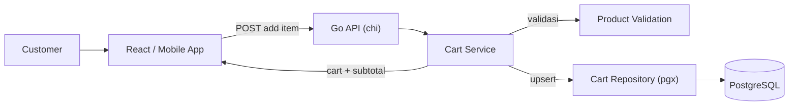
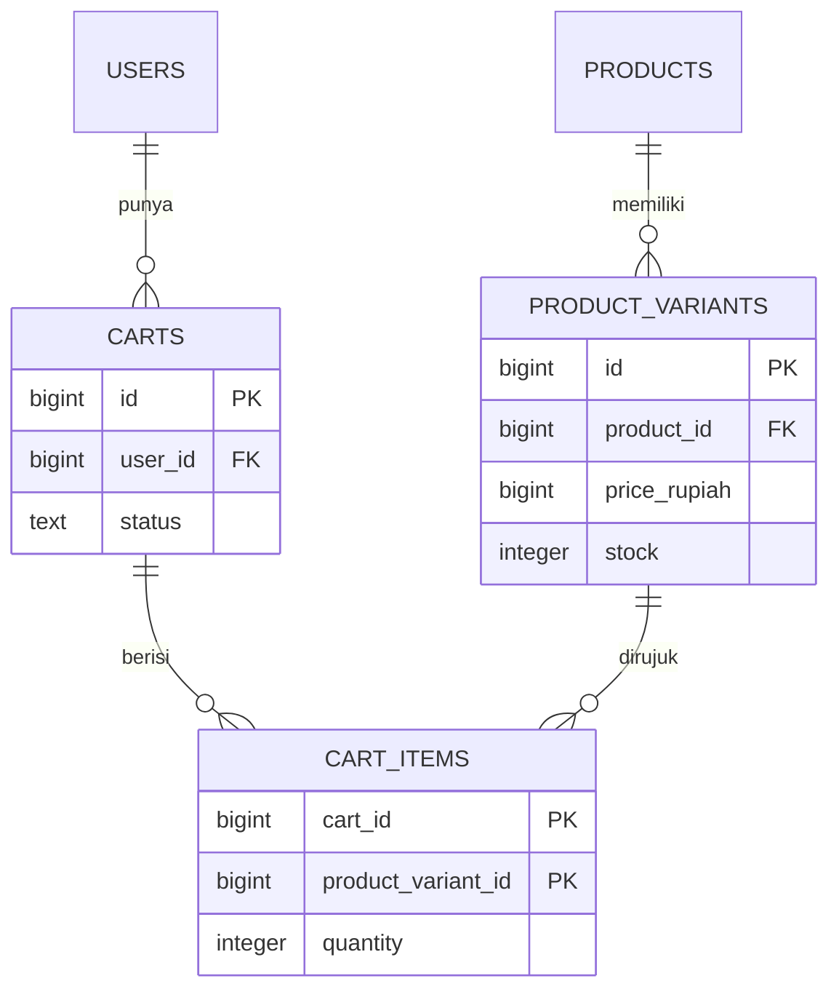
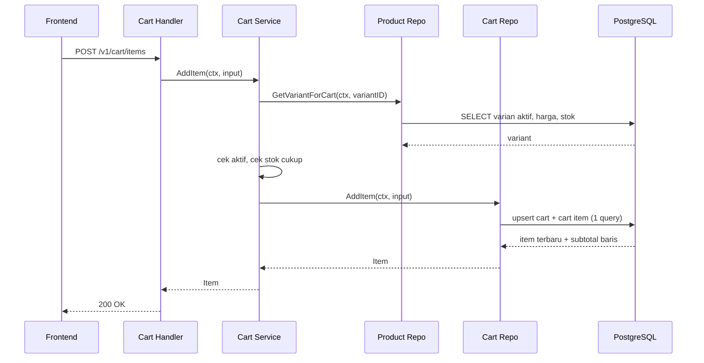
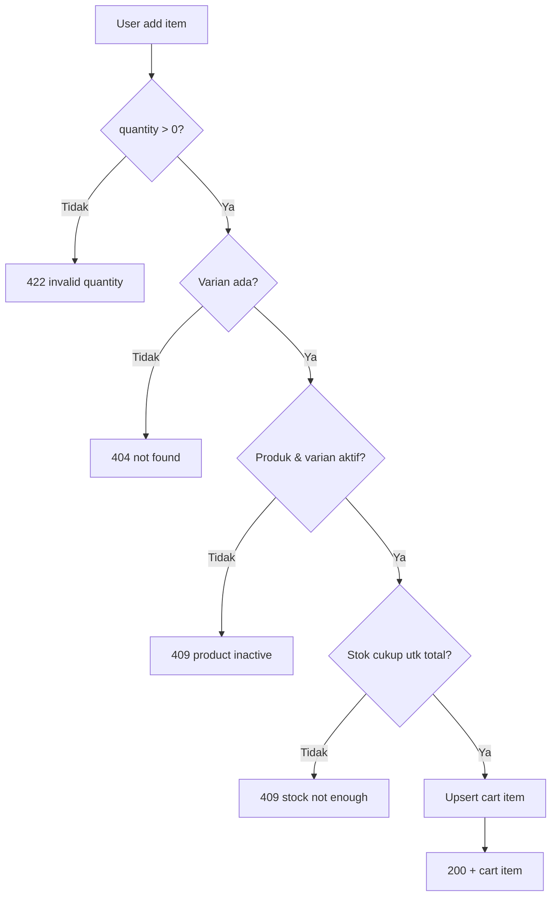
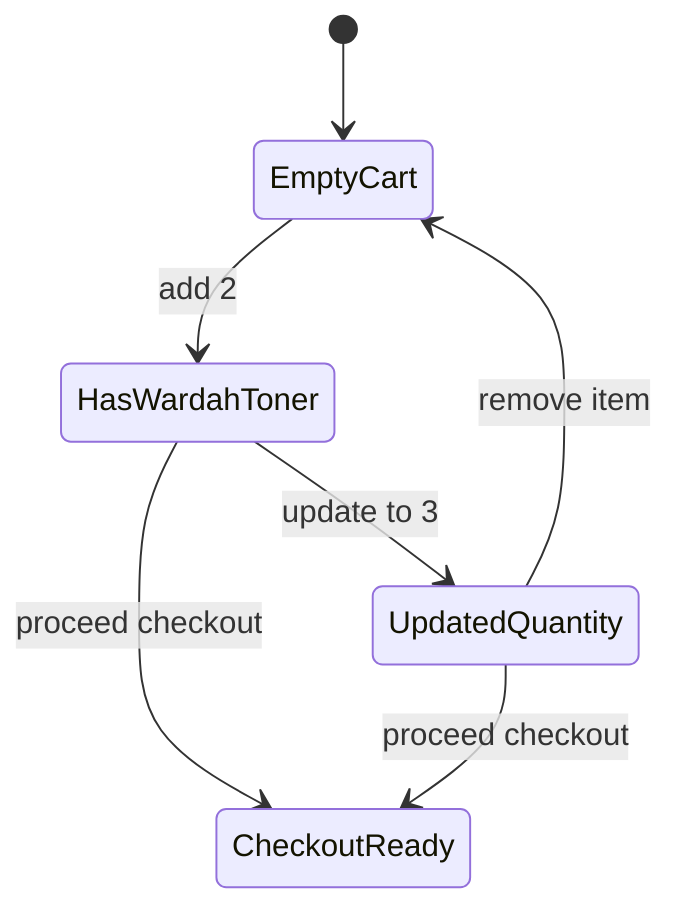

import { Section, Box, Steps, Step, Recap, CardGrid, Card, Chip, Hero, Compare, FileTree, Endpoint, Def } from "@components";

<Hero eyebrow="Roadmap 5 &middot; Online Shop Skincare Domain" title="Domain Cart:<br /><em>Mengelola Niat Beli</em>">
  <p>Cart adalah tempat user menyusun niat beli sebelum checkout. Ia bukan sumber kebenaran harga, stok, atau order, jadi kita rancang ramping tetapi tetap dijaga constraint dan validasi yang serius.</p>
  <Fragment slot="meta">
    <Chip icon="code">Bahasa: <b>Go 1.26</b></Chip>
    <Chip icon="database">DB: <b>PostgreSQL + pgx v5</b></Chip>
    <Chip icon="route">Domain: <b>Cart</b></Chip>
    <Chip icon="clock">~70 menit baca</Chip>
  </Fragment>
</Hero>

<Section num="01" id="intro" title="Cart adalah Niat Beli" sub="Bedakan cart, order, dan inventory sejak baris pertama">

<p class="lead">Di aplikasi belanja, cart terlihat sederhana, tetapi sering menjadi sumber bug karena ia duduk tepat di tengah pertemuan empat hal yang bergerak: state frontend, stok, harga, dan checkout.</p>

Di React kamu mungkin menyimpan cart di local state, Redux, Zustand, atau server state seperti TanStack Query. Cart di sana adalah objek UI yang gampang di-reset saat refresh. Di backend Go, cart harus diperlakukan sebagai **state niat beli milik user** yang tahan refresh, tahan login ulang, konsisten di banyak device, dan aman saat dua request datang nyaris bersamaan. Ia berbeda dari order karena cart belum menjadi transaksi bisnis final, dan berbeda dari inventory karena cart tidak memiliki stok.

<Box variant="bridge" icon="🌉" label="Jembatan: dari React state ke server-side cart"><p>Cart mirip state `items` di React, tetapi versi backend harus tahan refresh browser, login ulang, multi-device, dan race condition antar request. Yang di frontend cukup `useState`, di backend menjadi tabel dengan constraint.</p></Box>

Di Laravel klasik, cart sering disimpan di session (`session()->put('cart', ...)`). Itu enak untuk web monolith satu device, tetapi rapuh untuk REST API yang melayani web dan mobile sekaligus: session terikat ke satu cookie, sulit dihitung ulang saat checkout, dan sulit diaudit. Karena itu kita menyimpan cart di PostgreSQL, sehingga state user konsisten di semua device dan selalu bisa dihitung ulang dengan harga dan stok terbaru.

<Def term="cart"><p>Kumpulan item sementara yang menyatakan produk varian apa yang ingin dibeli user dan berapa quantity-nya. Statusnya `active` sampai user melakukan checkout.</p></Def>

<Def term="cart item"><p>Satu baris relasi antara cart dan product variant, berisi `cart_id`, `product_variant_id`, dan `quantity`. Sengaja tidak menyimpan harga.</p></Def>

<CardGrid cols={3}>
  <Card><h4>Cart</h4><p>State sementara, sering berubah, belum mengunci harga maupun stok. Boleh longgar tetapi tidak boleh kosong dari aturan.</p></Card>
  <Card><h4>Order</h4><p>Transaksi final setelah checkout, menyimpan snapshot harga dan alamat agar invoice tidak berubah walau harga produk berubah besok.</p></Card>
  <Card><h4>Inventory</h4><p>Sumber kebenaran stok. Divalidasi saat add item demi UX, dan wajib divalidasi ulang serta dipotong saat checkout.</p></Card>
</CardGrid>



<p class="fig-cap"><b>Gambar 1.</b> Cart berada di lapisan domain, bukan sekadar detail UI dan bukan sekadar tabel. Service memvalidasi ke produk, lalu menulis lewat repository.</p>

<Box variant="note" icon="🧭" label="Posisi modul ini di Roadmap 5"><p>Chapter 1 dan 2 membangun katalog dan pencarian produk. Modul cart inilah jembatan dari "user menemukan produk" menuju "user siap membayar". Chapter berikutnya, checkout, mengubah cart menjadi order dalam satu transaksi.</p></Box>

</Section>

<Section num="02" id="model-data-cart" title="Model Data Cart" sub="Skema kecil, konsekuensi besar">

<p class="lead">Model cart yang baik sengaja minimal. Data yang berubah cepat seperti harga dan stok tidak boleh digandakan ke dalam cart, karena salinan akan langsung basi begitu admin mengubah harga.</p>

Untuk online shop skincare, yang masuk cart bukan produk, melainkan varian produk. Satu "Wardah Hydrating Toner" bisa punya varian 100ml dan 200ml dengan harga dan stok berbeda. Maka kita butuh dua tabel: `carts` (cart aktif milik user) dan `cart_items` (varian yang dipilih beserta quantity).

<FileTree title="Bagian domain cart dalam modular monolith" tree={`
internal/
  cart/
    model.go          # entity dan DTO domain cart
    repository.go     # kontrak akses data (interface)
    pg_repository.go  # implementasi pgx: add, update, remove, get
    service.go        # business rule cart (validasi, orkestrasi)
    handler.go        # HTTP handler cart (chi)
    routes.go         # registrasi route chi
  product/
    cart_query.go     # kontrak baca varian untuk cart
  shared/
    errors.go         # error domain bersama
db/
  migrations/
    020_create_carts.up.sql
`} />

Inilah migrasinya. Perhatikan tipe uang: kolom harga ada di `product_variants` (dari modul katalog), bukan di cart, dan satuannya `BIGINT` rupiah penuh sesuai konvensi proyek. Cart sama sekali tidak menyimpan harga.

```sql title="db/migrations/020_create_carts.up.sql"
CREATE TABLE carts (
  id         BIGINT GENERATED ALWAYS AS IDENTITY PRIMARY KEY,
  user_id    BIGINT NOT NULL REFERENCES users(id),
  status     TEXT   NOT NULL DEFAULT 'active'
             CHECK (status IN ('active', 'converted', 'abandoned')),
  created_at TIMESTAMPTZ NOT NULL DEFAULT now(),
  updated_at TIMESTAMPTZ NOT NULL DEFAULT now()
);

-- Satu user hanya boleh punya SATU cart aktif. Partial unique index ini
-- adalah pagar konsistensi paling kuat, lebih kuat daripada cek di kode Go.
CREATE UNIQUE INDEX carts_one_active_per_user_idx
  ON carts (user_id)
  WHERE status = 'active';

CREATE TABLE cart_items (
  cart_id            BIGINT NOT NULL REFERENCES carts(id) ON DELETE CASCADE,
  product_variant_id BIGINT NOT NULL REFERENCES product_variants(id),
  quantity           INTEGER NOT NULL CHECK (quantity > 0),
  created_at         TIMESTAMPTZ NOT NULL DEFAULT now(),
  updated_at         TIMESTAMPTZ NOT NULL DEFAULT now(),
  PRIMARY KEY (cart_id, product_variant_id)
);

CREATE INDEX cart_items_variant_id_idx
  ON cart_items (product_variant_id);
```



<p class="fig-cap"><b>Gambar 2.</b> Relasi cart. Harga (`price_rupiah BIGINT`) dan stok tinggal di `product_variants`, cart hanya menunjuk varian lewat foreign key.</p>

<Box variant="note" icon="🧾" label="Catatan desain"><p>`cart_items` tidak punya kolom harga. Harga cart dihitung dari `product_variants.price_rupiah` saat cart dibaca, lalu harga final baru disalin ke `order_items` sebagai snapshot saat checkout.</p></Box>

Domain model Go-nya memakai `PriceRupiah int64`, konsisten dengan konvensi proyek sejak Roadmap 1. Uang selalu integer rupiah, tidak pernah `float64`, agar total tidak meleset satu rupiah.

```go title="internal/cart/model.go"
package cart

import "time"

type Cart struct {
	ID        int64
	UserID    int64
	Status    string
	Items     []Item
	Subtotal  int64 // rupiah, hasil jumlah LineSubtotal
	CreatedAt time.Time
	UpdatedAt time.Time
}

type Item struct {
	ProductVariantID int64
	ProductID        int64
	ProductName      string
	VariantName      string
	BrandName        string
	ImageURL         string
	Quantity         int32
	PriceRupiah      int64 // dibaca dari product_variants saat ini
	LineSubtotal     int64 // Quantity * PriceRupiah, dihitung di SQL
}

type AddItemInput struct {
	UserID           int64
	ProductVariantID int64
	Quantity         int32
}

type UpdateQuantityInput struct {
	UserID           int64
	ProductVariantID int64
	Quantity         int32
}
```

<Compare aLabel="Frontend cart object" bLabel="Backend cart table" aTone="muted" bTone="violet">
  <Fragment slot="a"><ul><li>Boleh menyimpan display name, image URL, dan subtotal sementara demi UX yang responsif.</li><li>Nilainya mudah stale karena harga dan stok bisa berubah di server kapan saja.</li></ul></Fragment>
  <Fragment slot="b"><ul><li>Menyimpan identitas varian dan quantity yang diinginkan user, itu saja.</li><li>Harga, status produk, dan stok dibaca ulang dari sumber kebenaran setiap kali dibutuhkan.</li></ul></Fragment>
</Compare>

</Section>

<Section num="03" id="satu-user-satu-cart" title="Satu User, Satu Cart Aktif" sub="Partial unique index sebagai pagar, bukan cek di kode">

<p class="lead">Aturan domain paling penting di sini: satu user hanya boleh punya satu cart dengan status active pada satu waktu.</p>

Tanpa aturan ini, dua request paralel bisa sama-sama melihat "cart belum ada" lalu sama-sama membuat cart baru, menghasilkan dua cart aktif untuk user yang sama. Bug ini nyata: muncul saat user login di dua tab, saat mobile app melakukan retry otomatis, atau saat frontend mengirim request ganda waktu hydration. Setelah itu, item user tersebar di dua cart dan checkout jadi kacau.

Cek "kalau belum ada, buat" di kode Go saja tidak cukup, karena ada celah waktu (race window) antara SELECT dan INSERT. PostgreSQL memberi alat yang tepat: **partial unique index**. Index `carts_one_active_per_user_idx` memaksa hanya ada satu baris `carts` berstatus `active` per user, di level database, tanpa peduli berapa request masuk bersamaan.

<Box variant="bridge" icon="🌉" label="Jembatan: firstOrCreate yang anti-balapan"><p>Konsepnya mirip `Cart::firstOrCreate(['user_id' => $id])` di Laravel. Bedanya, `firstOrCreate` Eloquent melakukan SELECT lalu INSERT di dua langkah dan bisa balapan. Versi PostgreSQL kita memakai `INSERT ... ON CONFLICT` plus partial unique index sehingga atomic dan aman walau request datang serentak.</p></Box>

Cara mendapatkan id cart aktif (membuatnya kalau belum ada) cukup satu statement. `ON CONFLICT` menargetkan index parsial yang baru kita buat, lalu `RETURNING id` selalu memberi id cart aktif user, entah baru dibuat atau sudah ada.

```sql title="ambil-atau-buat cart aktif (atomic)"
INSERT INTO carts (user_id, status)
VALUES ($1, 'active')
ON CONFLICT (user_id) WHERE status = 'active'
DO UPDATE SET updated_at = now()
RETURNING id;
```

<Box variant="warn" icon="⚠️" label="ON CONFLICT butuh target index yang cocok"><p>Klausa `ON CONFLICT (user_id) WHERE status = 'active'` hanya valid kalau ada partial unique index dengan kolom dan predikat yang persis sama. Tanpa index itu, PostgreSQL menolak dengan error "no unique or exclusion constraint matching". Index dan query adalah satu paket.</p></Box>

Kontrak repository cart kita rumuskan sebagai interface. Sesuai idiom Go "accept interfaces, return structs", service akan menerima interface ini agar mudah diganti fake saat testing. Perhatikan `context.Context` selalu menjadi parameter pertama.

```go title="internal/cart/repository.go"
package cart

import "context"

type Repository interface {
	GetActiveCartID(ctx context.Context, userID int64) (int64, error)
	GetItemQuantity(ctx context.Context, userID, productVariantID int64) (int32, error)
	AddItem(ctx context.Context, in AddItemInput) (Item, error)
	UpdateQuantity(ctx context.Context, in UpdateQuantityInput) (Item, error)
	RemoveItem(ctx context.Context, userID, productVariantID int64) error
	GetCart(ctx context.Context, userID int64) (Cart, error)
}
```

</Section>

<Section num="04" id="add-item-upsert" title="Add Item dengan Upsert" sub="Insert kalau belum ada, tambah quantity kalau sudah ada">

<p class="lead">Add item bukan sekadar insert, karena user bisa menekan tombol "Tambah ke keranjang" untuk varian yang sama berkali-kali.</p>

Perilaku domain add item: kalau `product_variant_id` belum ada di cart, masukkan baris baru. Kalau sudah ada, tambahkan quantity request ke quantity lama. PostgreSQL menyebut pola ini `INSERT ... ON CONFLICT DO UPDATE`, sering disingkat upsert. Tanpa upsert, kita harus SELECT dulu lalu memutuskan INSERT atau UPDATE di kode Go, dan itu kembali membuka race window yang sama seperti di section sebelumnya.

<Def term="upsert"><p>Operasi insert-or-update: buat baris baru saat belum ada, atau perbarui baris lama saat melanggar constraint unik. Satu statement, atomic di level baris.</p></Def>

<Box variant="bridge" icon="🌉" label="Jembatan: dari spread state ke ON CONFLICT"><p>Di React, menambah ke cart yang sudah berisi varian sama biasanya jadi `quantity: existing.quantity + qty` lewat spread. `EXCLUDED.quantity` di PostgreSQL adalah "nilai yang gagal di-insert", jadi `cart_items.quantity + EXCLUDED.quantity` adalah versi SQL dari penjumlahan itu, tetapi dijalankan atomic oleh database.</p></Box>

Kita gabungkan dua langkah (ambil cart aktif, lalu upsert item) menjadi satu query memakai CTE, lalu join ke katalog untuk mengembalikan item yang sudah lengkap dengan nama dan harga terkini. Satu round-trip, satu transaksi implisit.

```go title="internal/cart/pg_repository.go"
package cart

import (
	"context"

	"github.com/jackc/pgx/v5"
	"github.com/jackc/pgx/v5/pgxpool"
)

type pgRepository struct {
	pool *pgxpool.Pool
}

// NewRepository menerima pool, mengembalikan implementasi konkret di balik interface.
func NewRepository(pool *pgxpool.Pool) Repository {
	return &pgRepository{pool: pool}
}

func (r *pgRepository) GetActiveCartID(ctx context.Context, userID int64) (int64, error) {
	const q = `
INSERT INTO carts (user_id, status)
VALUES ($1, 'active')
ON CONFLICT (user_id) WHERE status = 'active'
DO UPDATE SET updated_at = now()
RETURNING id`

	var cartID int64
	if err := r.pool.QueryRow(ctx, q, userID).Scan(&cartID); err != nil {
		return 0, err
	}
	return cartID, nil
}

func (r *pgRepository) GetItemQuantity(ctx context.Context, userID, productVariantID int64) (int32, error) {
	const q = `
SELECT COALESCE((
  SELECT ci.quantity
  FROM carts c
  JOIN cart_items ci ON ci.cart_id = c.id
  WHERE c.user_id = $1
    AND c.status = 'active'
    AND ci.product_variant_id = $2
), 0)`

	var quantity int32
	if err := r.pool.QueryRow(ctx, q, userID, productVariantID).Scan(&quantity); err != nil {
		return 0, err
	}
	return quantity, nil
}

func (r *pgRepository) AddItem(ctx context.Context, in AddItemInput) (Item, error) {
	const q = `
WITH active_cart AS (
  INSERT INTO carts (user_id, status)
  VALUES ($1, 'active')
  ON CONFLICT (user_id) WHERE status = 'active'
  DO UPDATE SET updated_at = now()
  RETURNING id
), upserted AS (
  INSERT INTO cart_items (cart_id, product_variant_id, quantity)
  SELECT id, $2, $3 FROM active_cart
  ON CONFLICT (cart_id, product_variant_id)
  DO UPDATE SET
    quantity   = cart_items.quantity + EXCLUDED.quantity,
    updated_at = now()
  RETURNING cart_id, product_variant_id, quantity
)
SELECT
  u.product_variant_id,
  pv.product_id,
  p.name  AS product_name,
  pv.name AS variant_name,
  b.name  AS brand_name,
  COALESCE(p.image_url, '') AS image_url,
  u.quantity,
  pv.price_rupiah,
  (u.quantity * pv.price_rupiah)::BIGINT AS line_subtotal
FROM upserted u
JOIN product_variants pv ON pv.id = u.product_variant_id
JOIN products p          ON p.id  = pv.product_id
JOIN brands b            ON b.id  = p.brand_id`

	rows, err := r.pool.Query(ctx, q, in.UserID, in.ProductVariantID, in.Quantity)
	if err != nil {
		return Item{}, err
	}
	return pgx.CollectExactlyOneRow(rows, pgx.RowToStructByPos[Item])
}
```

<Box variant="tip" icon="💡" label="Kenapa pgx.CollectExactlyOneRow"><p>`pgx.RowToStructByPos[Item]` memetakan kolom ke field struct berdasarkan urutan, jadi kita tidak perlu menulis daftar `&item.Field` panjang yang gampang salah urut. `CollectExactlyOneRow` mengembalikan error yang cocok dengan `pgx.ErrNoRows` saat kosong, dan `ErrTooManyRows` saat lebih dari satu baris.</p></Box>



<p class="fig-cap"><b>Gambar 3.</b> Add item menggabungkan validasi domain di service dan upsert atomic di repository.</p>

</Section>

<Section num="05" id="update-remove-item" title="Update dan Remove Item" sub="Update memakai set nilai final, bukan increment">

<p class="lead">Update quantity berbeda makna dari add item. Saat user menggeser stepper, ia sedang menetapkan angka final yang ingin dilihat di cart, bukan menambah.</p>

Saat user mengubah quantity dari 2 menjadi 3, endpoint update harus menyimpan 3, bukan menambah 3 menjadi 5. Ini penting karena frontend mengirim nilai absolut dari input stepper. Kalau backend salah memperlakukan update sebagai increment, satu retry jaringan saja bisa membuat quantity melonjak tak terkendali. Inilah inti idempotensi praktis: `PATCH` dengan body `quantity: 3` yang diulang harus tetap menghasilkan quantity 3.

<Compare aLabel="Add item (POST)" bLabel="Update quantity (PATCH)" aTone="teal" bTone="violet">
  <Fragment slot="a"><ul><li>Makna bisnis: menambah niat beli.</li><li>`quantity` request dipakai sebagai increment terhadap nilai lama.</li><li>Aman diulang? Tidak. Dua POST menambah dua kali.</li></ul></Fragment>
  <Fragment slot="b"><ul><li>Makna bisnis: mengganti angka yang terlihat di UI.</li><li>`quantity` request dipakai sebagai nilai final absolut.</li><li>Aman diulang? Ya, hasilnya selalu sama.</li></ul></Fragment>
</Compare>

```go title="internal/cart/pg_repository.go (lanjutan)"
func (r *pgRepository) UpdateQuantity(ctx context.Context, in UpdateQuantityInput) (Item, error) {
	const q = `
WITH active_cart AS (
  SELECT id FROM carts
  WHERE user_id = $1 AND status = 'active'
), updated AS (
  UPDATE cart_items ci
  SET quantity = $3, updated_at = now()
  FROM active_cart ac
  WHERE ci.cart_id = ac.id
    AND ci.product_variant_id = $2
  RETURNING ci.product_variant_id, ci.quantity
)
SELECT
  u.product_variant_id,
  pv.product_id,
  p.name  AS product_name,
  pv.name AS variant_name,
  b.name  AS brand_name,
  COALESCE(p.image_url, '') AS image_url,
  u.quantity,
  pv.price_rupiah,
  (u.quantity * pv.price_rupiah)::BIGINT AS line_subtotal
FROM updated u
JOIN product_variants pv ON pv.id = u.product_variant_id
JOIN products p          ON p.id  = pv.product_id
JOIN brands b            ON b.id  = p.brand_id`

	rows, err := r.pool.Query(ctx, q, in.UserID, in.ProductVariantID, in.Quantity)
	if err != nil {
		return Item{}, err
	}
	return pgx.CollectExactlyOneRow(rows, pgx.RowToStructByPos[Item])
}

func (r *pgRepository) RemoveItem(ctx context.Context, userID, productVariantID int64) error {
	const q = `
DELETE FROM cart_items ci
USING carts c
WHERE c.id = ci.cart_id
  AND c.user_id = $1
  AND c.status = 'active'
  AND ci.product_variant_id = $2`

	_, err := r.pool.Exec(ctx, q, userID, productVariantID)
	return err
}
```

<Box variant="note" icon="🧠" label="Item yang tak ada saat update"><p>Kalau varian tidak ada di cart, CTE `updated` kosong, query tidak mengembalikan baris, dan `CollectExactlyOneRow` mengembalikan error yang cocok `pgx.ErrNoRows`. Service menerjemahkan itu menjadi `404 cart item not found`, bukan `500`.</p></Box>

<Box variant="warn" icon="⚠️" label="Jebakan retry pada PATCH"><p>`PATCH /v1/cart/items/101` dengan body quantity 3 harus idempotent secara praktis: request yang sama diulang berapa kali pun tetap menghasilkan quantity 3. Pakai `SET quantity = $3`, jangan pernah `SET quantity = quantity + $3` di endpoint update.</p></Box>

</Section>

<Section num="06" id="validasi-sebelum-add" title="Validasi sebelum Add" sub="Produk aktif dan stok cukup, tetapi checkout tetap penjaga final">

<p class="lead">Cart boleh longgar, tetapi tidak boleh menerima item yang jelas tidak bisa dibeli. Validasi di sini bertujuan memberi error cepat demi UX, bukan menjamin konsistensi akhir.</p>

Sebelum add item, service memastikan varian ada, produknya masih `active`, variannya masih aktif, dan stok saat ini cukup untuk total quantity setelah penambahan. Kita validasi terhadap **total** (`quantity di cart + quantity request`), bukan hanya quantity request, supaya user tidak bisa melewati batas stok dengan menambah sedikit demi sedikit.

Service cart membaca varian lewat interface milik domain product. Cart tidak menyentuh tabel produk langsung, ia bergantung pada kontrak yang disediakan product. Ini menjaga batas modul tetap bersih di modular monolith.

```go title="internal/product/cart_query.go"
package product

import "context"

type VariantForCart struct {
	ID          int64
	ProductID   int64
	Active      bool  // produk aktif DAN varian aktif
	Stock       int32
	PriceRupiah int64
}

type CartProductRepository interface {
	GetVariantForCart(ctx context.Context, variantID int64) (VariantForCart, error)
}
```

```go title="internal/cart/service.go"
package cart

import (
	"context"
	"errors"

	"github.com/kamu/skincare-backend/internal/product"
)

var (
	ErrInvalidQuantity = errors.New("quantity must be greater than zero")
	ErrProductInactive = errors.New("product is inactive")
	ErrStockNotEnough  = errors.New("stock is not enough")
)

type Service struct {
	carts    Repository
	products product.CartProductRepository
}

// Accept interfaces, return struct pointer untuk service.
func NewService(carts Repository, products product.CartProductRepository) *Service {
	return &Service{carts: carts, products: products}
}

func (s *Service) AddItem(ctx context.Context, in AddItemInput) (Item, error) {
	if in.Quantity <= 0 {
		return Item{}, ErrInvalidQuantity
	}

	variant, err := s.products.GetVariantForCart(ctx, in.ProductVariantID)
	if err != nil {
		return Item{}, err // termasuk pgx.ErrNoRows -> 404 di handler
	}
	if !variant.Active {
		return Item{}, ErrProductInactive
	}

	// Validasi terhadap TOTAL setelah penambahan, bukan hanya quantity request.
	current, err := s.carts.GetItemQuantity(ctx, in.UserID, in.ProductVariantID)
	if err != nil {
		return Item{}, err
	}
	if variant.Stock < current+in.Quantity {
		return Item{}, ErrStockNotEnough
	}

	return s.carts.AddItem(ctx, in)
}

func (s *Service) UpdateQuantity(ctx context.Context, in UpdateQuantityInput) (Item, error) {
	if in.Quantity <= 0 {
		return Item{}, ErrInvalidQuantity
	}

	variant, err := s.products.GetVariantForCart(ctx, in.ProductVariantID)
	if err != nil {
		return Item{}, err
	}
	if !variant.Active {
		return Item{}, ErrProductInactive
	}
	// Update memakai nilai final, jadi validasi langsung terhadap quantity request.
	if variant.Stock < in.Quantity {
		return Item{}, ErrStockNotEnough
	}

	return s.carts.UpdateQuantity(ctx, in)
}

func (s *Service) RemoveItem(ctx context.Context, userID, productVariantID int64) error {
	return s.carts.RemoveItem(ctx, userID, productVariantID)
}

func (s *Service) GetCart(ctx context.Context, userID int64) (Cart, error) {
	return s.carts.GetCart(ctx, userID)
}
```

<Box variant="warn" icon="⚠️" label="Validasi cart bukan reservasi stok"><p>Cek stok di sini hanya membaca, tidak mengunci dan tidak mengurangi. Dua user bisa sama-sama lolos cek "stok cukup" untuk barang terakhir. Itu wajar dan disengaja. Reservasi sebenarnya terjadi di checkout dengan `SELECT ... FOR UPDATE` atau pengurangan stok bersyarat di dalam transaksi. Jangan jadikan cart sebagai penjamin stok.</p></Box>

<Box variant="bridge" icon="🌉" label="Jembatan: dari FormRequest ke validasi berlapis"><p>Di Laravel kamu menaruh aturan di `FormRequest`. Di Go kita memisahkan dua jenis validasi: bentuk input (quantity &gt; 0, parse JSON) di handler, dan aturan bisnis (produk aktif, stok cukup) di service. Handler menolak input cacat, service menolak niat yang melanggar domain.</p></Box>



<p class="fig-cap"><b>Gambar 4.</b> Gerbang validasi add item. Cart tetap masuk akal di sisi UX, sementara transaksi checkout tetap menjadi penjaga konsistensi final.</p>

</Section>

<Section num="07" id="subtotal-real-time" title="Subtotal Real-Time" sub="Cart tidak menyimpan harga, ia menghitungnya">

<p class="lead">Subtotal cart dihitung dari harga saat ini, bukan dari harga yang pernah dilihat user kemarin. Inilah konsekuensi langsung dari keputusan tidak menyimpan harga di cart.</p>

Di domain cart, harga adalah data presentasi dan kalkulasi sementara. Karena itu query cart join ke `product_variants` untuk mengambil `price_rupiah` terbaru, lalu menjumlahkan `quantity * price_rupiah` per baris menjadi subtotal. Saat user checkout, barulah `order_items.unit_price_rupiah` diisi sebagai snapshot, agar invoice tidak ikut berubah ketika harga produk naik besok pagi.

<Box variant="bridge" icon="🌉" label="Jembatan: subtotal adalah computed selector"><p>Subtotal cart mirip selector di Redux atau computed di Vue: ia turunan dari state lain (item dan harga), bukan sumber kebenaran yang perlu disimpan. Menyimpannya justru mengundang bug sinkronisasi.</p></Box>

Untuk membaca cart lengkap, kita pakai `LEFT JOIN` agar cart kosong (tanpa item) tetap mengembalikan satu baris berisi id dan status cart. Lalu kita kumpulkan item dengan pgx, lewati baris "item null" milik cart kosong, dan jumlahkan subtotal di Go.

```go title="internal/cart/pg_repository.go (lanjutan)"
type cartRow struct {
	ID        int64
	UserID    int64
	Status    string
	CreatedAt time.Time
	UpdatedAt time.Time

	ProductVariantID *int64
	ProductID        *int64
	ProductName      *string
	VariantName      *string
	BrandName        *string
	ImageURL         *string
	Quantity         *int32
	PriceRupiah      *int64
	LineSubtotal     *int64
}

func (r *pgRepository) GetCart(ctx context.Context, userID int64) (Cart, error) {
	const q = `
SELECT
  c.id, c.user_id, c.status, c.created_at, c.updated_at,
  ci.product_variant_id,
  pv.product_id,
  p.name  AS product_name,
  pv.name AS variant_name,
  b.name  AS brand_name,
  COALESCE(p.image_url, '') AS image_url,
  ci.quantity,
  pv.price_rupiah,
  (ci.quantity * pv.price_rupiah)::BIGINT AS line_subtotal
FROM carts c
LEFT JOIN cart_items ci      ON ci.cart_id = c.id
LEFT JOIN product_variants pv ON pv.id = ci.product_variant_id
LEFT JOIN products p          ON p.id  = pv.product_id
LEFT JOIN brands b            ON b.id  = p.brand_id
WHERE c.user_id = $1 AND c.status = 'active'
ORDER BY ci.created_at ASC`

	rows, err := r.pool.Query(ctx, q, userID)
	if err != nil {
		return Cart{}, err
	}
	collected, err := pgx.CollectRows(rows, pgx.RowToStructByPos[cartRow])
	if err != nil {
		return Cart{}, err
	}

	// Cart aktif belum ada: buat lalu kembalikan cart kosong.
	if len(collected) == 0 {
		cartID, err := r.GetActiveCartID(ctx, userID)
		if err != nil {
			return Cart{}, err
		}
		return Cart{ID: cartID, UserID: userID, Status: "active"}, nil
	}

	head := collected[0]
	out := Cart{
		ID:        head.ID,
		UserID:    head.UserID,
		Status:    head.Status,
		CreatedAt: head.CreatedAt,
		UpdatedAt: head.UpdatedAt,
	}
	for _, row := range collected {
		if row.ProductVariantID == nil {
			continue // cart kosong: baris LEFT JOIN tanpa item
		}
		item := Item{
			ProductVariantID: *row.ProductVariantID,
			ProductID:        *row.ProductID,
			ProductName:      *row.ProductName,
			VariantName:      *row.VariantName,
			BrandName:        *row.BrandName,
			ImageURL:         *row.ImageURL,
			Quantity:         *row.Quantity,
			PriceRupiah:      *row.PriceRupiah,
			LineSubtotal:     *row.LineSubtotal,
		}
		out.Subtotal += item.LineSubtotal
		out.Items = append(out.Items, item)
	}
	return out, nil
}
```

<Box variant="tip" icon="💡" label="Pointer untuk kolom yang bisa NULL"><p>Karena `LEFT JOIN` bisa menghasilkan kolom item bernilai NULL pada cart kosong, field item di `cartRow` dibuat pointer (`*int64`, `*string`). Pointer nil memetakan NULL dengan rapi, lalu kita dereference hanya setelah memastikan `ProductVariantID != nil`.</p></Box>

Kalau kamu hanya butuh angka subtotal (misalnya untuk badge mini-cart), satu query agregat sudah cukup dan lebih murah daripada menarik seluruh item.

```sql title="subtotal cart saja"
SELECT COALESCE(SUM(ci.quantity * pv.price_rupiah), 0)::BIGINT AS subtotal
FROM carts c
JOIN cart_items ci       ON ci.cart_id = c.id
JOIN product_variants pv ON pv.id = ci.product_variant_id
WHERE c.user_id = $1 AND c.status = 'active';
```

</Section>

<Section num="08" id="api-cart-crud" title="Endpoint Cart CRUD" sub="Route kecil, kontrak jelas, error yang dipetakan rapi">

<p class="lead">Endpoint cart sebaiknya sederhana dan eksplisit, karena frontend memanggilnya sangat sering: setiap perubahan stepper, setiap buka halaman cart.</p>

<Endpoint method="GET" path="/v1/cart" desc="Ambil cart aktif user beserta item dan subtotal real-time" />
<Endpoint method="POST" path="/v1/cart/items" desc="Tambah item ke cart, insert atau increment quantity bila item sudah ada" />
<Endpoint method="PATCH" path="/v1/cart/items/{product_variant_id}" desc="Set quantity final untuk satu item cart" />
<Endpoint method="DELETE" path="/v1/cart/items/{product_variant_id}" desc="Hapus item dari cart aktif" />

Identitas user diambil dari context (hasil middleware auth), bukan dari body, supaya user tidak bisa mengubah cart orang lain. Error domain dipetakan ke status HTTP yang tepat di satu tempat (`writeError`), sehingga handler tetap tipis.

```go title="internal/cart/handler.go"
package cart

import (
	"encoding/json"
	"errors"
	"net/http"
	"strconv"

	"github.com/go-chi/chi/v5"
	"github.com/jackc/pgx/v5"
)

type Handler struct {
	service *Service
}

func NewHandler(service *Service) *Handler {
	return &Handler{service: service}
}

type addItemRequest struct {
	ProductVariantID int64 `json:"product_variant_id"`
	Quantity         int32 `json:"quantity"`
}

type updateQuantityRequest struct {
	Quantity int32 `json:"quantity"`
}

func (h *Handler) GetCart(w http.ResponseWriter, r *http.Request) {
	cart, err := h.service.GetCart(r.Context(), currentUserID(r))
	if err != nil {
		writeError(w, err)
		return
	}
	writeJSON(w, http.StatusOK, cart)
}

func (h *Handler) AddItem(w http.ResponseWriter, r *http.Request) {
	var req addItemRequest
	if err := json.NewDecoder(r.Body).Decode(&req); err != nil {
		http.Error(w, "invalid json body", http.StatusBadRequest)
		return
	}

	item, err := h.service.AddItem(r.Context(), AddItemInput{
		UserID:           currentUserID(r),
		ProductVariantID: req.ProductVariantID,
		Quantity:         req.Quantity,
	})
	if err != nil {
		writeError(w, err)
		return
	}
	writeJSON(w, http.StatusOK, item)
}

func (h *Handler) UpdateQuantity(w http.ResponseWriter, r *http.Request) {
	variantID, err := strconv.ParseInt(chi.URLParam(r, "product_variant_id"), 10, 64)
	if err != nil {
		http.Error(w, "invalid product_variant_id", http.StatusBadRequest)
		return
	}

	var req updateQuantityRequest
	if err := json.NewDecoder(r.Body).Decode(&req); err != nil {
		http.Error(w, "invalid json body", http.StatusBadRequest)
		return
	}

	item, err := h.service.UpdateQuantity(r.Context(), UpdateQuantityInput{
		UserID:           currentUserID(r),
		ProductVariantID: variantID,
		Quantity:         req.Quantity,
	})
	if err != nil {
		writeError(w, err)
		return
	}
	writeJSON(w, http.StatusOK, item)
}

func (h *Handler) RemoveItem(w http.ResponseWriter, r *http.Request) {
	variantID, err := strconv.ParseInt(chi.URLParam(r, "product_variant_id"), 10, 64)
	if err != nil {
		http.Error(w, "invalid product_variant_id", http.StatusBadRequest)
		return
	}

	if err := h.service.RemoveItem(r.Context(), currentUserID(r), variantID); err != nil {
		writeError(w, err)
		return
	}
	w.WriteHeader(http.StatusNoContent)
}

// writeError memetakan error domain ke status HTTP di satu tempat.
func writeError(w http.ResponseWriter, err error) {
	switch {
	case errors.Is(err, ErrInvalidQuantity):
		http.Error(w, err.Error(), http.StatusUnprocessableEntity) // 422
	case errors.Is(err, ErrProductInactive), errors.Is(err, ErrStockNotEnough):
		http.Error(w, err.Error(), http.StatusConflict) // 409
	case errors.Is(err, pgx.ErrNoRows):
		http.Error(w, "resource not found", http.StatusNotFound) // 404
	default:
		http.Error(w, "internal server error", http.StatusInternalServerError) // 500
	}
}
```

<Box variant="warn" icon="⚠️" label="Kurawal di MDX vs di path HTTP"><p>Di teks MDX biasa, kurawal harus di-escape. Di prop komponen seperti `path` (lihat keempat Endpoint di atas), nilainya string biasa, jadi pola route chi `{product_variant_id}` aman ditulis apa adanya tanpa escape.</p></Box>

```go title="internal/cart/routes.go"
package cart

import "github.com/go-chi/chi/v5"

func RegisterRoutes(r chi.Router, h *Handler) {
	r.Route("/v1/cart", func(r chi.Router) {
		r.Get("/", h.GetCart)
		r.Post("/items", h.AddItem)
		r.Patch("/items/{product_variant_id}", h.UpdateQuantity)
		r.Delete("/items/{product_variant_id}", h.RemoveItem)
	})
}
```

Kontrak request dan response add item, dengan harga dalam rupiah penuh:

```json title="POST /v1/cart/items (request)"
{
  "product_variant_id": 101,
  "quantity": 2
}
```

```json title="200 OK (response)"
{
  "ProductVariantID": 101,
  "ProductID": 20,
  "ProductName": "Wardah Hydrating Toner",
  "VariantName": "100ml",
  "BrandName": "Wardah",
  "ImageURL": "https://cdn.example.com/products/wardah-toner.jpg",
  "Quantity": 2,
  "PriceRupiah": 35000,
  "LineSubtotal": 70000
}
```

<Box variant="note" icon="🧾" label="Rapikan JSON tag bila perlu"><p>Field di atas tampil PascalCase karena struct `Item` belum diberi `json` tag. Untuk API publik, tambahkan tag seperti ``PriceRupiah int64 `json:"price_rupiah"` `` agar payload snake_case dan stabil. Di proyek ini, biasakan satu DTO response terpisah dari entity domain.</p></Box>

</Section>

<Section num="09" id="hands-on" title="Hands-on: Wardah Toner" sub="Simulasikan add, update, remove dari terminal">

<p class="lead">Latihan ini membuat perilaku cart terasa konkret sebelum kita masuk ke checkout di chapter berikutnya.</p>

<Steps>
  <Step><b>Add 2 Wardah Toner</b><p>Frontend mengirim `POST /v1/cart/items` dengan `product_variant_id` 101 (Wardah Toner 100ml) dan quantity 2. Subtotal jadi 70000.</p></Step>
  <Step><b>Update jadi 3</b><p>User menggeser stepper ke 3, frontend mengirim `PATCH /v1/cart/items/101` dengan quantity 3. Backend men-set, bukan menambah. Subtotal jadi 105000.</p></Step>
  <Step><b>Remove dari cart</b><p>User membatalkan niat beli, frontend mengirim `DELETE /v1/cart/items/101`. Cart kembali kosong, subtotal 0.</p></Step>
</Steps>

```bash title="Terminal"
TOKEN="ey..."   # JWT user dari login

# 1) Add 2
curl -X POST http://localhost:8080/v1/cart/items \
  -H "Authorization: Bearer $TOKEN" \
  -H "Content-Type: application/json" \
  -d '{"product_variant_id":101,"quantity":2}'

# 2) Set quantity final ke 3 (bukan +3)
curl -X PATCH http://localhost:8080/v1/cart/items/101 \
  -H "Authorization: Bearer $TOKEN" \
  -H "Content-Type: application/json" \
  -d '{"quantity":3}'

# 3) Remove
curl -X DELETE http://localhost:8080/v1/cart/items/101 \
  -H "Authorization: Bearer $TOKEN"
```



<p class="fig-cap"><b>Gambar 5.</b> Cart berpindah state mengikuti niat beli user. Order baru lahir setelah checkout, bukan di sini.</p>

<Box variant="tip" icon="💡" label="Latihan tambahan"><p>Tulis test service yang memastikan `UpdateQuantity` memakai set: beri quantity 3 lewat fake repository, lalu pastikan nilai yang tersimpan 3, bukan quantity lama ditambah 3. Ini test kecil yang menjaga makna bisnis tetap benar saat refactor.</p></Box>

</Section>

<Section num="10" id="jebakan-umum" title="Jebakan Umum" sub="Kesalahan kecil yang dampaknya baru terasa di production">

<p class="lead">Cart domain terlihat seperti CRUD biasa, tetapi bug-nya hampir selalu lahir dari makna bisnis yang tidak ditegaskan, bukan dari sintaks.</p>

<CardGrid cols={2}>
  <Card><h4>Menyimpan harga di cart</h4><p>Membuat harga stale dan membingungkan saat admin mengubah harga. Harga final disimpan di `order_items` saat checkout, bukan di `cart_items`.</p></Card>
  <Card><h4>Tidak punya satu cart aktif</h4><p>Tanpa partial unique index, retry dan request paralel bisa membuat dua cart aktif. Item user tersebar dan checkout kacau.</p></Card>
  <Card><h4>Update dianggap increment</h4><p>`PATCH` yang diulang akan menaikkan quantity berkali-kali. Endpoint update harus men-set nilai final.</p></Card>
  <Card><h4>Mengira validasi cart menjaga stok</h4><p>Cek stok di cart hanya membaca, tidak mengunci. Reservasi stok yang sebenarnya hanya boleh di transaksi checkout.</p></Card>
</CardGrid>

<Box variant="bridge" icon="🌉" label="Jembatan: dari session cart ke database cart"><p>Session cart terasa mudah seperti Laravel klasik, tetapi untuk API multi-device, database cart lebih mudah diaudit, diuji, dan dihubungkan ke checkout. Yang hilang adalah ilusi kesederhanaan, yang didapat adalah konsistensi.</p></Box>

<Box variant="warn" icon="⚠️" label="Jangan ubah cart menjadi order diam-diam"><p>Cart harus tetap cart sampai user menjalankan checkout. Konversi cart ke order butuh transaksi eksplisit: snapshot harga, pengurangan stok bersyarat, pembuatan order item, dan payment record. Tidak ada "auto-convert" yang aman tanpa transaksi.</p></Box>

</Section>

<Section num="11" id="ringkasan" title="Ringkasan & Poin Penting">

<p class="lead">Cart adalah domain niat beli: sementara, sering berubah, tetapi tetap dirancang dengan constraint database dan validasi service yang serius.</p>

<Recap title="Yang Wajib Menempel">
  <ul>
    <li>Satu user hanya boleh punya satu cart aktif, dijaga oleh partial unique index di PostgreSQL, bukan sekadar cek di kode Go.</li>
    <li>`cart_items` cukup menyimpan `cart_id`, `product_variant_id`, dan `quantity`. Tidak ada kolom harga.</li>
    <li>Add item memakai upsert (`INSERT ... ON CONFLICT DO UPDATE`): insert bila belum ada, increment quantity bila sudah ada.</li>
    <li>Update quantity memakai set nilai final, bukan increment, agar idempotent terhadap retry.</li>
    <li>Remove item menghapus satu baris cart item dari cart aktif milik user.</li>
    <li>Validasi produk aktif dan stok cukup dilakukan sebelum add atau update demi UX, tetapi checkout tetap wajib validasi ulang dan jadi penjaga konsistensi.</li>
    <li>Cart tidak menyimpan harga. Subtotal dihitung real-time dari `product_variants.price_rupiah` (BIGINT rupiah, dipetakan ke `PriceRupiah int64`).</li>
    <li>pgx v5 mempermudah pembacaan: `CollectExactlyOneRow` untuk satu baris, `CollectRows` untuk banyak, dengan `RowToStructByPos`.</li>
  </ul>
</Recap>

Di proyek online shop skincare, modul ini menjadi penghubung antara katalog produk dan checkout. Setelah user menemukan produk lewat filter dari Roadmap 5 Chapter 2, ia memasukkan varian ke cart yang kita bangun di sini. Langkah berikutnya adalah **checkout**: mengubah niat beli menjadi order dengan transaksi database, snapshot harga ke `order_items`, reservasi stok, dan payment flow.

<Box variant="note" icon="🧭" label="Langkah berikutnya"><p>Di modul checkout, cart akan dikonversi menjadi order. Di sana kita mulai memakai transaksi database lebih serius (`BEGIN`, `SELECT ... FOR UPDATE`, pengurangan stok bersyarat, `COMMIT`) agar stok, order item, dan payment record selalu konsisten.</p></Box>

</Section>
