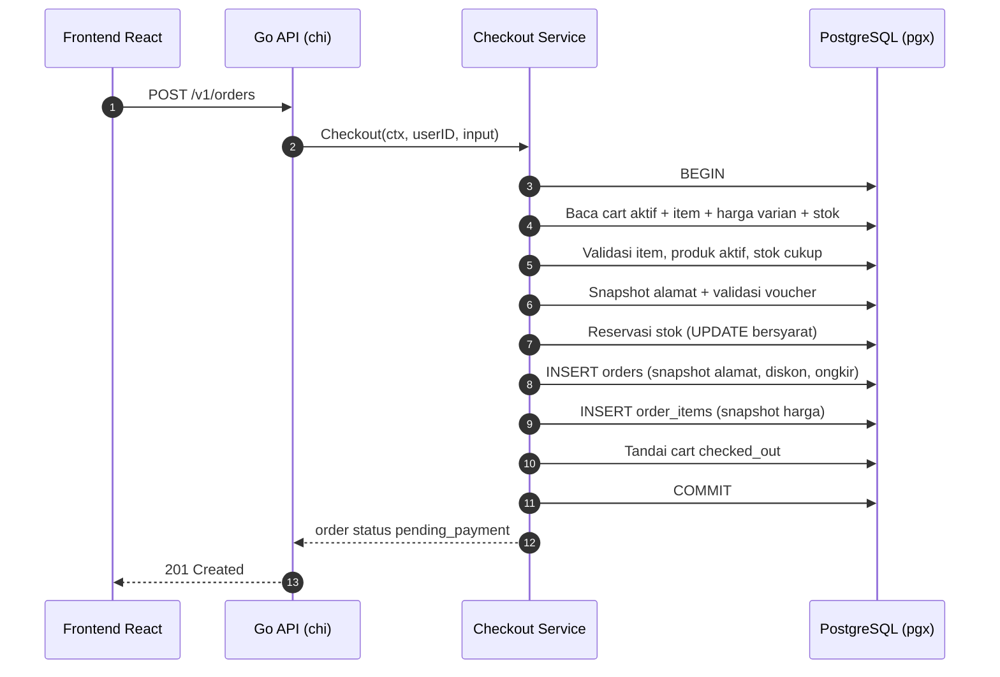
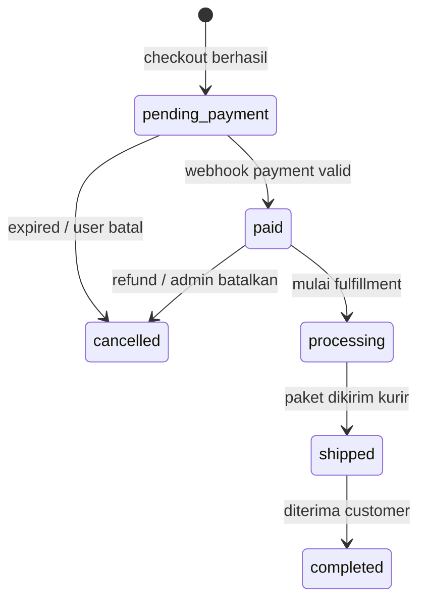
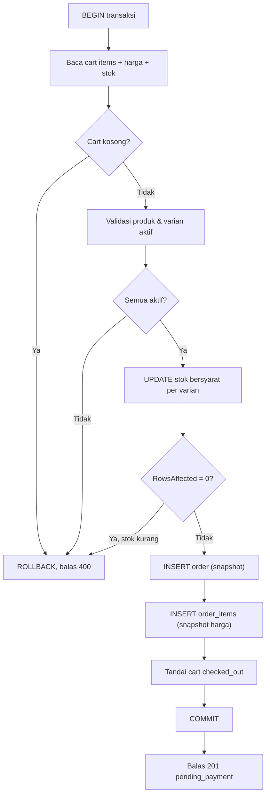

import { Section, Box, Steps, Step, Recap, CardGrid, Card, Chip, Hero, Compare, FileTree, Endpoint, Def } from "@components";

<Hero eyebrow="Roadmap 5 &middot; Online Shop Skincare Domain" title="Dari Cart ke <em>Order</em><br />Checkout yang Konsisten">
  <p>Checkout adalah momen ketika niat beli yang masih boleh berubah berubah menjadi komitmen bisnis yang harus stabil, bisa diaudit, dan tidak boleh terpengaruh perubahan katalog di kemudian hari.</p>
  <Fragment slot="meta">
    <Chip icon="code">Bahasa: <b>Go 1.26</b></Chip>
    <Chip icon="database">DB: <b>PostgreSQL + pgx</b></Chip>
    <Chip icon="shield">Atomic</Chip>
    <Chip icon="clock">~70 menit baca</Chip>
  </Fragment>
</Hero>

<Section num="01" id="intro" title="Checkout: Titik Perubahan State" sub="Cart boleh berubah-ubah, order tidak boleh ikut berubah sembarangan.">

<p class="lead">Di React, cart mirip client state yang bebas berubah kapan saja. Order mirip event final yang sudah tercatat dan harus bisa dipertanggungjawabkan. Checkout adalah jembatan dari yang satu ke yang lain.</p>

Di modul cart sebelumnya, cart sengaja dirancang sebagai **state sementara**. User boleh menambah item, mengubah quantity, menghapus item, lalu pergi tanpa membayar tanpa konsekuensi apa pun. Checkout membalik sifat itu. Begitu user menekan tombol bayar, sistem harus membuat record order yang stabil: total final terkunci, harga tiap item tersimpan, alamat pengiriman terekam, diskon tercatat, dan stok tertahan. Setelah commit, order itu menjadi kebenaran yang tidak boleh diubah oleh perubahan harga atau alamat di masa depan.

<Box variant="bridge" icon="🌉" label="Jembatan: dari submit form ke workflow transaksional"><p>Di React, checkout sering terasa seperti `onSubmit` satu form. Di Laravel mungkin satu `store()` di controller. Di backend Go, checkout adalah workflow transaksional bertahap: baca cart aktif, validasi tiap item, snapshot harga, snapshot alamat, validasi voucher, reservasi stok, buat order, tandai cart selesai, lalu commit. Semua dalam satu transaksi database, atau tidak sama sekali.</p></Box>

<Def term="checkout"><p>Proses mengubah cart aktif milik satu user menjadi order baru, lengkap dengan total final, alamat pengiriman, diskon, biaya kirim, dan status awal, dalam satu transaksi yang atomic.</p></Def>

<Def term="snapshot"><p>Salinan data penting yang diambil tepat pada saat checkout, lalu disimpan di dalam order, supaya order tetap benar walau data sumbernya (harga, alamat, voucher) berubah setelahnya.</p></Def>

Checkout adalah salah satu titik paling kritis di online shop skincare karena ia menjadi simpul yang menyatukan lima domain sekaligus: katalog (harga varian), cart (item yang dipilih), promosi (voucher), inventory (stok), dan order (record final). Satu bug kecil di sini bisa menjelma jadi harga salah, stok negatif, order ganda, atau alamat pengiriman yang berubah diam-diam. Itulah kenapa kita memberinya satu modul penuh.



<p class="fig-cap"><b>Gambar 1.</b> Alur checkout dari `POST /v1/orders` sampai response. Semua langkah database berada di antara `BEGIN` dan `COMMIT`, sehingga gagal di langkah mana pun akan me-rollback seluruhnya.</p>

<FileTree title="Folder domain order dalam modular monolith" tree={`
internal/
  order/
    handler.go         # endpoint POST /v1/orders
    service.go         # workflow checkout transaksional
    model.go           # entity Order dan tipe snapshot
    params.go          # parameter untuk repository
    number.go          # generator nomor order
    repository.go      # interface Store (dipakai service)
    pgx_repository.go  # implementasi Store dengan pgx
  cart/
    repository.go      # baca cart aktif saat checkout
  inventory/
    repository.go      # reservasi stok varian (UPDATE bersyarat)
  promotion/
    service.go         # validasi voucher dan hitung diskon
go.mod                 # module github.com/kamu/skincare-backend
`} />

</Section>

<Section num="02" id="snapshot" title="Kenapa Order Wajib Menyimpan Snapshot" sub="Order harus menceritakan apa yang benar pada saat checkout, bukan apa yang benar sekarang.">

<p class="lead">Data yang sering berubah (harga, alamat, aturan voucher) tidak boleh dibaca ulang mentah-mentah ketika kita menampilkan order lama. Order harus membawa salinannya sendiri.</p>

Cart sengaja tidak menyimpan harga, karena cart mengikuti katalog terbaru: kalau harga naik, cart langsung menampilkan harga baru, itu memang yang diinginkan. Order justru sebaliknya. Order adalah bukti transaksi. Kalau harga Wardah Hydrating Toner naik dari Rp 35.000 menjadi Rp 39.000 sehari setelah checkout, order kemarin tetap harus menampilkan Rp 35.000, karena itulah harga yang disepakati saat user membayar. Kalau kita menampilkan order dengan men-`JOIN` harga produk terbaru, order historis akan "berubah" sendiri dan pembukuan kacau.

<Compare aLabel="Cart: state sementara" bLabel="Order: catatan transaksi" aTone="muted" bTone="violet">
  <Fragment slot="a"><ul><li>Harga dibaca real-time dari `product_variants.price`, selalu ikut katalog.</li><li>Alamat belum final, user masih bebas memilih alamat lain.</li><li>Voucher belum jadi komitmen, masih boleh diganti atau dilepas.</li><li>Boleh basi, boleh kosong, tidak ada konsekuensi keuangan.</li></ul></Fragment>
  <Fragment slot="b"><ul><li>`order_items.unit_price` menyimpan harga pada detik checkout.</li><li>`orders.shipping_*` menyimpan alamat pada detik checkout.</li><li>`orders.voucher_code` dan `discount_amount` mengunci diskon yang dipakai.</li><li>Tidak boleh berubah; satu-satunya kebenaran untuk pembukuan dan invoice.</li></ul></Fragment>
</Compare>

<Box variant="bridge" icon="🌉" label="Jembatan: kenapa tidak cukup foreign key saja?"><p>Pendatang dari Laravel sering refleks: "kan ada relasi `order->variant->price`, tinggal `JOIN`". Itu benar untuk data yang stabil (nama produk boleh di-`JOIN` untuk gambar terbaru), tetapi salah untuk data yang bergerak. Foreign key bagus untuk menjawab "barang ini milik produk apa", buruk untuk menjawab "berapa harganya dulu". Snapshot adalah cara denormalisasi yang disengaja: kita rela menyimpan harga dua kali (di katalog dan di order) supaya histori tidak bisa dibajak perubahan masa depan.</p></Box>

<CardGrid cols={2}>
  <Card><h4>Snapshot harga</h4><p>Disimpan di `order_items.unit_price` dan `line_total`. Dihitung server dari harga varian saat checkout, bukan dari nilai yang dikirim client.</p></Card>
  <Card><h4>Snapshot alamat</h4><p>Disimpan di `orders.shipping_name`, `shipping_address_line`, `shipping_city`, dan seterusnya. Disalin dari address book pada detik checkout.</p></Card>
  <Card><h4>Snapshot diskon</h4><p>Disimpan di `orders.voucher_code` dan `discount_amount`. Nilai diskon dihitung saat voucher masih valid, lalu dibekukan.</p></Card>
  <Card><h4>Snapshot ongkir</h4><p>Disimpan di `orders.shipping_cost` dan `shipping_courier`. Tarif kurir saat checkout, bukan tarif yang mungkin berubah besok.</p></Card>
</CardGrid>

<Box variant="warn" icon="⚠️" label="Jangan pernah join harga produk untuk order lama"><p>Detail order boleh men-`JOIN` ke produk untuk hal yang stabil (gambar, slug terbaru), tetapi angka yang muncul di struk (harga satuan, subtotal, diskon, total) harus berasal dari kolom snapshot di `orders` dan `order_items`. Begitu kamu men-`JOIN` harga hidup ke order historis, kamu kehilangan kebenaran transaksi.</p></Box>

</Section>

<Section num="03" id="skema-order" title="Skema orders dan order_items" sub="Dua tabel menampung snapshot: header order dan baris item.">

<p class="lead">Order disimpan dalam dua tabel. `orders` memegang header (total, status, alamat, diskon, ongkir), `order_items` memegang tiap baris item dengan harga yang sudah disnapshot.</p>

Uang di proyek ini selalu `BIGINT` di SQL dan `int64` di Go, mewakili rupiah dalam bilangan bulat (tidak ada sen pada rupiah, jadi tidak perlu desimal). Kita tidak pernah memakai `float` untuk uang karena pembulatan biner bisa membuat Rp 35.000 menjadi Rp 34.999,9999. Tiap kolom uang juga diberi `CHECK (... >= 0)` sebagai jaring pengaman terakhir di level database, sehingga bug aplikasi tidak bisa menulis total negatif.

```sql title="db/migrations/0042_create_orders.up.sql"
CREATE SEQUENCE IF NOT EXISTS order_number_seq;

CREATE TABLE orders (
  id                    BIGINT GENERATED ALWAYS AS IDENTITY PRIMARY KEY,
  order_number          TEXT   NOT NULL UNIQUE,
  user_id               BIGINT NOT NULL REFERENCES users(id),
  cart_id               BIGINT NOT NULL REFERENCES carts(id),
  status                TEXT   NOT NULL
                          CHECK (status IN ('pending_payment','paid','processing','shipped','completed','cancelled')),

  -- Angka uang: snapshot, tidak boleh dihitung ulang dari katalog.
  subtotal_amount       BIGINT NOT NULL CHECK (subtotal_amount >= 0),
  discount_amount       BIGINT NOT NULL DEFAULT 0 CHECK (discount_amount >= 0),
  shipping_cost         BIGINT NOT NULL DEFAULT 0 CHECK (shipping_cost >= 0),
  total_amount          BIGINT NOT NULL CHECK (total_amount >= 0),

  -- Snapshot diskon.
  voucher_id            BIGINT REFERENCES vouchers(id),
  voucher_code          TEXT,

  -- Snapshot alamat pengiriman (disalin dari address book saat checkout).
  shipping_name         TEXT   NOT NULL,
  shipping_phone        TEXT   NOT NULL,
  shipping_address_line TEXT   NOT NULL,
  shipping_city         TEXT   NOT NULL,
  shipping_province     TEXT   NOT NULL,
  shipping_postal_code  TEXT   NOT NULL,
  shipping_courier      TEXT   NOT NULL,

  created_at            TIMESTAMPTZ NOT NULL DEFAULT now(),
  updated_at            TIMESTAMPTZ NOT NULL DEFAULT now()
);

CREATE TABLE order_items (
  id                 BIGINT GENERATED ALWAYS AS IDENTITY PRIMARY KEY,
  order_id           BIGINT  NOT NULL REFERENCES orders(id) ON DELETE CASCADE,
  product_variant_id BIGINT  NOT NULL REFERENCES product_variants(id),

  -- Snapshot identitas barang, supaya struk tetap terbaca walau produk dihapus.
  sku                TEXT    NOT NULL,
  product_name       TEXT    NOT NULL,
  variant_name       TEXT    NOT NULL,

  -- Snapshot harga: inilah angka yang muncul di struk selamanya.
  unit_price         BIGINT  NOT NULL CHECK (unit_price >= 0),
  quantity           INTEGER NOT NULL CHECK (quantity > 0),
  line_total         BIGINT  NOT NULL CHECK (line_total >= 0),

  created_at         TIMESTAMPTZ NOT NULL DEFAULT now()
);

CREATE INDEX idx_orders_user_created_at ON orders (user_id, created_at DESC);
CREATE INDEX idx_order_items_order_id   ON order_items (order_id);
```

<Box variant="note" icon="📝" label="Kenapa snapshot nama produk juga?"><p>Kita menyimpan `product_name`, `variant_name`, dan `sku` di `order_items`, bukan hanya `product_variant_id`. Alasannya: kalau produk dihapus atau di-rename setahun kemudian, struk order lama tetap terbaca utuh ("Wardah Hydrating Toner 100ml"), bukan menjadi "produk #7 yang sudah tidak ada". Foreign key tetap dipasang untuk relasi, tetapi teks yang tampil di struk berdiri sendiri.</p></Box>

</Section>

<Section num="04" id="validasi" title="Validasi Checkout: Input vs Business Rule" sub="Validasi checkout jauh lebih dalam daripada validasi request body.">

<p class="lead">Checkout menggabungkan dua lapis validasi: format input dari user, dan business rule yang hanya server yang berhak menentukan. Keduanya beda tempat dan beda sumber kebenaran.</p>

Input dari user sebenarnya sedikit dan tidak boleh dipercaya untuk hal penting: `address_id`, `voucher_code`, `shipping_courier`, dan (kalau ongkir belum dihitung server) `shipping_cost`. Yang menentukan total justru data yang harus dihitung ulang oleh server di dalam transaksi: cart aktif, item yang masih ada, produk yang masih aktif, harga varian saat ini, stok yang cukup, voucher yang valid, dan total final. Aturan emasnya: **angka apa pun yang menyangkut uang dan stok dihitung server, bukan diterima dari client.**

<Box variant="bridge" icon="🌉" label="Jembatan: Laravel FormRequest vs validasi di service"><p>Di Laravel, `FormRequest` cocok untuk validasi format: `address_id` wajib ada, `shipping_cost` harus integer non-negatif. Tetapi "stok cukup", "voucher belum kedaluwarsa", dan "produk masih aktif" bukan urusan FormRequest, itu business rule yang bergantung pada state database saat itu. Di Go kita memisahkannya tegas: handler hanya memeriksa bentuk request (decode JSON, cek field wajib), sementara service yang memegang business rule di dalam transaksi. Handler tetap tipis, service yang tahu aturan main.</p></Box>

<Steps>
  <Step><b>Validasi bentuk request</b><p>Di handler: JSON bisa di-decode, `address_id` tidak nol, `shipping_courier` tidak kosong, `shipping_cost` tidak negatif.</p></Step>
  <Step><b>Validasi cart</b><p>Di service: cart aktif milik user harus ada dan punya minimal satu item, kalau kosong tolak dengan `ErrEmptyCart`.</p></Step>
  <Step><b>Validasi produk dan varian</b><p>Tiap item harus mengarah ke varian aktif dari produk aktif, kalau ada yang nonaktif tolak dengan `ErrProductInactive`.</p></Step>
  <Step><b>Validasi stok</b><p>`available_stock` tiap varian harus lebih besar atau sama dengan quantity, dijaga lagi oleh UPDATE bersyarat saat reservasi.</p></Step>
  <Step><b>Validasi voucher</b><p>Voucher harus aktif, belum kedaluwarsa, kuota masih ada, dan subtotal memenuhi minimum pembelian, baru diskon dihitung.</p></Step>
</Steps>

```go title="internal/order/model.go"
package order

// CheckoutInput adalah data yang berasal dari user (lewat handler).
// Hanya field di sinilah yang boleh datang dari client.
type CheckoutInput struct {
	AddressID       int64
	VoucherCode     string
	ShippingCourier string
	ShippingCost    int64 // rupiah; dipercaya sementara, idealnya dihitung server di Roadmap inventory/shipping
}

// CartItemForCheckout adalah item cart yang sudah di-join dengan katalog dan
// inventory, dihitung server di dalam transaksi. Inilah sumber kebenaran harga.
type CartItemForCheckout struct {
	CartItemID       int64
	ProductVariantID int64
	SKU              string
	ProductName      string
	VariantName      string
	ProductActive    bool
	VariantActive    bool
	UnitPrice        int64 // harga varian SAAT INI, akan disnapshot ke order_items
	Quantity         int
	AvailableStock   int
}

// AddressSnapshot adalah salinan alamat yang akan dibekukan ke kolom orders.shipping_*.
type AddressSnapshot struct {
	Name        string
	Phone       string
	AddressLine string
	City        string
	Province    string
	PostalCode  string
}

// DiscountSnapshot adalah hasil validasi voucher: nilai diskon yang dibekukan.
type DiscountSnapshot struct {
	VoucherID      *int64 // pointer karena voucher opsional; nil = tanpa voucher
	VoucherCode    string
	DiscountAmount int64
}

// Order adalah entity hasil checkout yang dikembalikan ke handler.
type Order struct {
	ID             int64
	OrderNumber    string
	UserID         int64
	CartID         int64
	Status         string
	SubtotalAmount int64
	DiscountAmount int64
	ShippingCost   int64
	TotalAmount    int64
}
```

<Box variant="warn" icon="⚠️" label="Harga dari client adalah racun"><p>Jangan pernah mempercayai `unit_price` atau `subtotal` yang dikirim frontend. Penyerang bisa mengirim `unit_price: 1` untuk serum Rp 500.000. Server membaca harga sendiri dari `product_variants.price` di dalam transaksi, lalu mengabaikan harga apa pun yang datang dari body request. Field uang di `CheckoutInput` yang masih ada (`ShippingCost`) pun idealnya digantikan kalkulasi ongkir server.</p></Box>

</Section>

<Section num="05" id="nomor-status" title="Nomor Order dan Status Awal" sub="ID untuk relasi internal, nomor order untuk komunikasi manusia.">

<p class="lead">ID database (BIGINT auto-increment) sempurna untuk relasi internal, tetapi jelek untuk ditunjukkan ke manusia. Nomor order yang manusiawi memudahkan customer support, admin, dan customer sendiri.</p>

Format `INV-20260101-0042` punya tiga keunggulan: mudah dibaca dan dieja lewat telepon oleh customer support, mudah dicari di dashboard admin, dan tidak membocorkan jumlah order harianmu seperti yang dilakukan ID berurutan (`order #1043` memberi tahu kompetitor berapa order yang sudah masuk). Kita ambil komponen angka dari sebuah `SEQUENCE` PostgreSQL, lalu rangkai formatnya di aplikasi.

```go title="internal/order/number.go"
package order

import (
	"fmt"
	"time"
)

// BuildOrderNumber merangkai nomor order yang manusiawi dari tanggal dan sequence.
// Contoh: BuildOrderNumber(2026-01-01, 42) -> "INV-20260101-0042".
// Komponen angka diambil dari order_number_seq agar unik lintas request paralel.
func BuildOrderNumber(now time.Time, sequence int64) string {
	return fmt.Sprintf("INV-%s-%04d", now.Format("20060102"), sequence)
}
```

<Box variant="bridge" icon="🌉" label="Jembatan: kenapa SEQUENCE, bukan COUNT(*) + 1?"><p>Refleks dari banyak tutorial PHP adalah `SELECT COUNT(*) FROM orders` lalu tambah satu. Itu race condition klasik: dua checkout paralel sama-sama membaca 41, sama-sama menghasilkan 42, lalu bentrok. `SEQUENCE` PostgreSQL menjamin tiap pemanggil `nextval()` mendapat angka berbeda bahkan di bawah konkurensi tinggi, tanpa lock manual. Ia bukan transaksional (angka tetap maju walau transaksi rollback), jadi nomor bisa "loncat", tetapi itu justru yang kita mau: nomor unik lebih penting daripada nomor rapat tanpa celah.</p></Box>

Karena `SEQUENCE` saja tidak menjamin format akhir benar-benar unik (misalnya kalau suatu hari kamu mengubah format), tetap pasang `UNIQUE` constraint di kolom `order_number`. Generator aplikasi dan constraint database bekerja berlapis: aplikasi membangun nomor yang hampir pasti unik, database menolak kalau ternyata bentrok.

Status awal order pada checkout adalah `pending_payment`, **bukan** `paid`. Ini penting. Checkout baru membuktikan tiga hal: user ingin membeli, stok sudah direservasi, dan order sudah tercatat. Order baru menjadi `paid` ketika payment gateway mengirim webhook yang valid, yang dibahas di chapter payment berikutnya. Memisahkan "order dibuat" dari "order dibayar" mencegah barang dikirim untuk pembayaran yang belum tentu masuk.



<p class="fig-cap"><b>Gambar 2.</b> Lifecycle status order. Checkout hanya bertanggung jawab atas transisi pertama, dari awal menuju `pending_payment`. Sisa transisi dipegang domain payment dan fulfillment.</p>

<Box variant="tip" icon="💡" label="Pola aman nomor order"><p>Ambil angka dari `nextval('order_number_seq')` di dalam transaksi, rangkai formatnya di aplikasi dengan `BuildOrderNumber`, lalu simpan ke kolom yang punya `UNIQUE` constraint. Tiga lapis: sequence anti-race, aplikasi atur format, database tolak duplikat.</p></Box>

</Section>

<Section num="06" id="reservasi-stok" title="Reservasi Stok dalam Transaksi" sub="Stok dan order berubah bersama, atau tidak berubah sama sekali.">

<p class="lead">Checkout tidak boleh membuat order tanpa menahan stok, dan tidak boleh mengurangi stok tanpa membuat order. Keduanya harus hidup atau mati bersama dalam satu transaksi.</p>

Reservasi stok berarti `available_stock` dikurangi saat checkout, dan biasanya `reserved_stock` ditambah sebagai penanda "stok ini sudah dipesan tapi belum dibayar". Stok reserved nanti dilepas kembali kalau order expired atau dibatalkan, atau dikonversi jadi pengurangan permanen saat order dibayar (dibahas di chapter inventory dan payment). Untuk online shop skincare, reservasi inilah yang mencegah dua user membeli botol terakhir serum yang sama pada detik yang sama, lalu salah satunya kecewa karena stok ternyata habis.

<Def term="stock reservation"><p>Penahanan stok untuk satu order sebelum pembayaran final, sehingga stok yang sama tidak dijual ulang ke user lain selama order masih menunggu bayar.</p></Def>

```sql title="db/migrations/0043_inventory_reservation.up.sql"
ALTER TABLE inventories
  ADD COLUMN IF NOT EXISTS reserved_stock INTEGER NOT NULL DEFAULT 0
    CHECK (reserved_stock >= 0);

-- Jaring pengaman: available_stock tidak boleh pernah negatif, apa pun bug aplikasinya.
ALTER TABLE inventories
  ADD CONSTRAINT inventories_available_non_negative CHECK (available_stock >= 0);
```

Kunci anti-oversell-nya adalah **conditional UPDATE**, bukan baca-lalu-tulis. Pola yang naif adalah: `SELECT available_stock`, cek di aplikasi apakah cukup, lalu `UPDATE`. Di antara `SELECT` dan `UPDATE` itu ada celah waktu, dan dua request paralel bisa sama-sama lolos cek lalu sama-sama mengurangi stok, menghasilkan stok negatif. Solusinya: gabungkan cek dan update jadi satu pernyataan yang kondisinya dievaluasi oleh database saat eksekusi.

```sql title="reserve-stock.sql"
UPDATE inventories
SET available_stock = available_stock - $2,
    reserved_stock  = reserved_stock + $2,
    updated_at      = now()
WHERE product_variant_id = $1
  AND available_stock >= $2
RETURNING available_stock;
```

Mengapa ini aman tanpa `SELECT ... FOR UPDATE` terpisah? Karena `UPDATE` di PostgreSQL secara otomatis mengambil row lock pada baris yang disentuhnya, dan kondisi `available_stock >= $2` dievaluasi terhadap nilai baris yang sudah terkunci saat itu juga. Kalau dua transaksi mencoba mereservasi varian yang sama, yang satu menunggu yang lain selesai, lalu mengevaluasi ulang kondisinya pada nilai terbaru. Bila stok sudah tidak cukup, `UPDATE` cukup tidak menyentuh baris apa pun (`RowsAffected` = 0), dan kita perlakukan itu sebagai stok habis ([detail perilaku lock baris di PostgreSQL](https://www.postgresql.org/docs/current/explicit-locking.html)).

<Box variant="bridge" icon="🌉" label="Jembatan: optimistic update React vs atomic update database"><p>Di React kamu mungkin terbiasa optimistic update: ubah UI dulu, perbaiki kalau server menolak. Conditional UPDATE adalah versi backend yang lebih ketat: kita tidak menebak, kita biarkan database yang memutuskan secara atomic apakah operasi boleh terjadi. Tidak ada "cek dulu lalu kerjakan" yang bisa kedaluwarsa di antaranya, cek dan kerjakan terjadi dalam satu langkah yang tak bisa disela.</p></Box>



<p class="fig-cap"><b>Gambar 3.</b> Seluruh perubahan checkout berada dalam satu transaksi. Setiap jalur "tidak" menuju ROLLBACK, sehingga stok yang sempat dikurangi otomatis kembali dan tidak ada order setengah jadi yang tertinggal.</p>

<Box variant="warn" icon="⚠️" label="Jangan reservasi stok di luar transaksi order"><p>Kalau stok dikurangi lebih dulu di transaksi sendiri, lalu `INSERT order` gagal di transaksi lain, stok bocor: berkurang tanpa order yang menahannya, dan harus diperbaiki manual. Reservasi stok, insert order, insert item, dan tandai cart wajib berada dalam satu `BEGIN ... COMMIT` yang sama agar rollback membatalkan semuanya sekaligus.</p></Box>

</Section>

<Section num="07" id="service" title="Implementasi Service Checkout" sub="Handler menerima HTTP, service menjalankan workflow bisnis di dalam transaksi.">

<p class="lead">Service checkout harus eksplisit, transaksional, dan mudah diuji. Ia menerima sebuah interface `Store`, bukan koneksi pgx langsung, agar test bisa memakai fake tanpa PostgreSQL.</p>

Struktur ini mengikuti pola dari Roadmap 4: handler memanggil service, service memegang business rule dan mengelola transaksi, repository (`Store`) memegang SQL dan pgx. `context.Context` selalu jadi parameter pertama, sehingga cancellation dan timeout dari request menjalar sampai ke query database. Perhatikan bahwa transaksi (`pgx.Tx`) dibuka di service lalu dioper ke tiap method `Store`, supaya semua operasi berbagi satu transaksi yang sama.

```go title="internal/order/repository.go"
package order

import (
	"context"

	"github.com/jackc/pgx/v5"
)

// Store adalah kontrak akses data untuk checkout. Service menerima interface ini
// (accept interfaces), sehingga test bisa memasang fake store dan production
// memasang implementasi pgx. Tiap method menerima tx agar berbagi satu transaksi.
type Store interface {
	NextOrderSequence(ctx context.Context, tx pgx.Tx) (int64, error)
	GetCartItemsForCheckout(ctx context.Context, tx pgx.Tx, userID int64) (cartID int64, items []CartItemForCheckout, err error)
	GetAddressSnapshot(ctx context.Context, tx pgx.Tx, userID, addressID int64) (AddressSnapshot, error)
	ValidateVoucher(ctx context.Context, tx pgx.Tx, userID int64, code string, subtotal int64) (DiscountSnapshot, error)
	ReserveStock(ctx context.Context, tx pgx.Tx, productVariantID int64, quantity int) error
	CreateOrder(ctx context.Context, tx pgx.Tx, p CreateOrderParams) (Order, error)
	CreateOrderItem(ctx context.Context, tx pgx.Tx, p CreateOrderItemParams) error
	MarkCartCheckedOut(ctx context.Context, tx pgx.Tx, cartID, orderID int64) error
}
```

Sekarang service-nya. Alurnya membaca seperti daftar langkah checkout: buka transaksi, baca cart, hitung subtotal, snapshot alamat, validasi voucher, reservasi stok per item, ambil nomor order, buat order, buat tiap item, tandai cart, lalu commit. `defer tx.Rollback(ctx)` di awal memastikan transaksi selalu di-rollback kalau ada `return` error di tengah jalan; rollback setelah commit sukses cukup di-abaikan oleh pgx (ia mengembalikan error yang aman diabaikan).

```go title="internal/order/service.go"
package order

import (
	"context"
	"errors"
	"fmt"
	"time"

	"github.com/jackc/pgx/v5/pgxpool"
)

var (
	ErrEmptyCart          = errors.New("cart is empty")
	ErrProductInactive    = errors.New("product is inactive")
	ErrInsufficientStock  = errors.New("insufficient stock")
	ErrInvalidShippingFee = errors.New("invalid shipping fee")
)

type Service struct {
	pool  *pgxpool.Pool
	store Store
	clock func() time.Time // disuntik agar nomor order bisa diuji deterministik
}

func NewService(pool *pgxpool.Pool, store Store) *Service {
	return &Service{pool: pool, store: store, clock: time.Now}
}

// Checkout mengubah cart aktif user menjadi order dalam satu transaksi atomic.
func (s *Service) Checkout(ctx context.Context, userID int64, in CheckoutInput) (Order, error) {
	if in.ShippingCost < 0 {
		return Order{}, ErrInvalidShippingFee
	}

	tx, err := s.pool.Begin(ctx)
	if err != nil {
		return Order{}, fmt.Errorf("begin checkout tx: %w", err)
	}
	defer func() { _ = tx.Rollback(ctx) }() // no-op kalau sudah commit

	// 1. Baca cart aktif beserta harga varian dan stok terkini.
	cartID, items, err := s.store.GetCartItemsForCheckout(ctx, tx, userID)
	if err != nil {
		return Order{}, fmt.Errorf("get cart items for checkout: %w", err)
	}
	if len(items) == 0 {
		return Order{}, ErrEmptyCart
	}

	// 2. Hitung subtotal dari harga server, sekaligus validasi tiap item.
	subtotal, err := calculateSubtotal(items)
	if err != nil {
		return Order{}, err
	}

	// 3. Snapshot alamat pengiriman dari address book user.
	address, err := s.store.GetAddressSnapshot(ctx, tx, userID, in.AddressID)
	if err != nil {
		return Order{}, fmt.Errorf("get address snapshot: %w", err)
	}

	// 4. Validasi voucher (opsional) dan hitung diskon yang dibekukan.
	var discount DiscountSnapshot
	if in.VoucherCode != "" {
		discount, err = s.store.ValidateVoucher(ctx, tx, userID, in.VoucherCode, subtotal)
		if err != nil {
			return Order{}, fmt.Errorf("validate voucher: %w", err)
		}
	}

	// 5. Reservasi stok per varian dengan UPDATE bersyarat di dalam transaksi.
	for _, item := range items {
		if err := s.store.ReserveStock(ctx, tx, item.ProductVariantID, item.Quantity); err != nil {
			return Order{}, fmt.Errorf("reserve stock variant %d: %w", item.ProductVariantID, err)
		}
	}

	// 6. Ambil nomor order dari sequence, rangkai formatnya.
	sequence, err := s.store.NextOrderSequence(ctx, tx)
	if err != nil {
		return Order{}, fmt.Errorf("next order sequence: %w", err)
	}

	// 7. Bangun dan simpan header order dengan semua snapshot.
	total := subtotal - discount.DiscountAmount + in.ShippingCost
	created, err := s.store.CreateOrder(ctx, tx, CreateOrderParams{
		OrderNumber:    BuildOrderNumber(s.clock(), sequence),
		UserID:         userID,
		CartID:         cartID,
		Status:         "pending_payment",
		SubtotalAmount: subtotal,
		DiscountAmount: discount.DiscountAmount,
		ShippingCost:   in.ShippingCost,
		TotalAmount:    total,
		VoucherID:      discount.VoucherID,
		VoucherCode:    discount.VoucherCode,
		Address:        address,
		Courier:        in.ShippingCourier,
	})
	if err != nil {
		return Order{}, fmt.Errorf("create order: %w", err)
	}

	// 8. Simpan tiap baris item dengan harga yang disnapshot.
	for _, item := range items {
		err := s.store.CreateOrderItem(ctx, tx, CreateOrderItemParams{
			OrderID:          created.ID,
			ProductVariantID: item.ProductVariantID,
			SKU:              item.SKU,
			ProductName:      item.ProductName,
			VariantName:      item.VariantName,
			UnitPrice:        item.UnitPrice,
			Quantity:         item.Quantity,
			LineTotal:        item.UnitPrice * int64(item.Quantity),
		})
		if err != nil {
			return Order{}, fmt.Errorf("create order item: %w", err)
		}
	}

	// 9. Tandai cart selesai agar tidak bisa di-checkout dua kali.
	if err := s.store.MarkCartCheckedOut(ctx, tx, cartID, created.ID); err != nil {
		return Order{}, fmt.Errorf("mark cart checked out: %w", err)
	}

	// 10. Commit: semua perubahan menjadi permanen sekaligus.
	if err := tx.Commit(ctx); err != nil {
		return Order{}, fmt.Errorf("commit checkout tx: %w", err)
	}

	return created, nil
}

// calculateSubtotal menjumlahkan line total dari harga server, memvalidasi
// tiap item sekalian. Subtotal dihitung di sini, bukan diterima dari client.
func calculateSubtotal(items []CartItemForCheckout) (int64, error) {
	var subtotal int64
	for _, item := range items {
		if err := validateCartItem(item); err != nil {
			return 0, err
		}
		subtotal += item.UnitPrice * int64(item.Quantity)
	}
	return subtotal, nil
}

func validateCartItem(item CartItemForCheckout) error {
	if !item.ProductActive || !item.VariantActive {
		return ErrProductInactive
	}
	if item.AvailableStock < item.Quantity {
		return ErrInsufficientStock
	}
	return nil
}
```

Parameter repository dipisah ke file sendiri agar service tetap fokus pada alur. Struct parameter ini juga membuat pemanggilan `CreateOrder` terbaca jelas (named fields) dan tahan terhadap penambahan kolom di masa depan.

```go title="internal/order/params.go"
package order

type CreateOrderParams struct {
	OrderNumber    string
	UserID         int64
	CartID         int64
	Status         string
	SubtotalAmount int64
	DiscountAmount int64
	ShippingCost   int64
	TotalAmount    int64
	VoucherID      *int64
	VoucherCode    string
	Address        AddressSnapshot
	Courier        string
}

type CreateOrderItemParams struct {
	OrderID          int64
	ProductVariantID int64
	SKU              string
	ProductName      string
	VariantName      string
	UnitPrice        int64
	Quantity         int
	LineTotal        int64
}
```

Implementasi pgx-nya menunjukkan dua hal penting: `ReserveStock` memakai conditional UPDATE dan memeriksa `RowsAffected` untuk membedakan "stok kurang" dari error teknis, dan `NextOrderSequence` memanggil `nextval` lewat transaksi yang sama.

```go title="internal/order/pgx_repository.go"
package order

import (
	"context"
	"fmt"

	"github.com/jackc/pgx/v5"
)

type PgxStore struct{}

func NewPgxStore() *PgxStore { return &PgxStore{} }

func (PgxStore) NextOrderSequence(ctx context.Context, tx pgx.Tx) (int64, error) {
	var seq int64
	err := tx.QueryRow(ctx, `SELECT nextval('order_number_seq')`).Scan(&seq)
	if err != nil {
		return 0, fmt.Errorf("nextval order_number_seq: %w", err)
	}
	return seq, nil
}

// ReserveStock mengurangi stok hanya jika masih cukup. RowsAffected == 0 berarti
// kondisi available_stock >= quantity tidak terpenuhi, yaitu stok habis.
func (PgxStore) ReserveStock(ctx context.Context, tx pgx.Tx, productVariantID int64, quantity int) error {
	tag, err := tx.Exec(ctx, `
		UPDATE inventories
		SET available_stock = available_stock - $2,
		    reserved_stock  = reserved_stock + $2,
		    updated_at      = now()
		WHERE product_variant_id = $1
		  AND available_stock >= $2`,
		productVariantID, quantity)
	if err != nil {
		return fmt.Errorf("update inventory: %w", err)
	}
	if tag.RowsAffected() == 0 {
		return ErrInsufficientStock
	}
	return nil
}

func (PgxStore) CreateOrder(ctx context.Context, tx pgx.Tx, p CreateOrderParams) (Order, error) {
	var o Order
	err := tx.QueryRow(ctx, `
		INSERT INTO orders (
			order_number, user_id, cart_id, status,
			subtotal_amount, discount_amount, shipping_cost, total_amount,
			voucher_id, voucher_code,
			shipping_name, shipping_phone, shipping_address_line,
			shipping_city, shipping_province, shipping_postal_code, shipping_courier
		) VALUES ($1,$2,$3,$4,$5,$6,$7,$8,$9,$10,$11,$12,$13,$14,$15,$16,$17)
		RETURNING id, order_number, user_id, cart_id, status,
		          subtotal_amount, discount_amount, shipping_cost, total_amount`,
		p.OrderNumber, p.UserID, p.CartID, p.Status,
		p.SubtotalAmount, p.DiscountAmount, p.ShippingCost, p.TotalAmount,
		p.VoucherID, p.VoucherCode,
		p.Address.Name, p.Address.Phone, p.Address.AddressLine,
		p.Address.City, p.Address.Province, p.Address.PostalCode, p.Courier,
	).Scan(
		&o.ID, &o.OrderNumber, &o.UserID, &o.CartID, &o.Status,
		&o.SubtotalAmount, &o.DiscountAmount, &o.ShippingCost, &o.TotalAmount,
	)
	if err != nil {
		return Order{}, fmt.Errorf("insert order: %w", err)
	}
	return o, nil
}
```

<Box variant="tip" icon="💡" label="Kenapa service menerima interface, repository mengembalikan struct"><p>Idiom Go "accept interfaces, return structs" terlihat di sini. `Service` menerima `Store` (interface) sehingga unit test bisa memasang fake store tanpa PostgreSQL, sementara `NewPgxStore` mengembalikan struct konkret. Yang masuk fleksibel, yang keluar jelas. Konstruktor di produksi menyuntik `NewPgxStore()`, test menyuntik fake.</p></Box>

</Section>

<Section num="08" id="endpoint" title="Endpoint REST dan Handler" sub="Checkout adalah pembuatan resource baru bernama order, bukan update cart.">

<p class="lead">Client mengirim `POST /v1/orders` karena hasil checkout adalah resource baru: sebuah order. Memodelkannya sebagai update cart akan menyesatkan, cart-nya justru "habis" setelah checkout.</p>

<Endpoint method="POST" path="/v1/orders" desc="Checkout cart aktif user menjadi order baru berstatus pending_payment" />
<Endpoint method="GET" path="/v1/orders" desc="Daftar order milik user, untuk halaman riwayat pesanan" />
<Endpoint method="GET" path="/v1/orders/{orderNumber}" desc="Detail order dengan snapshot harga, alamat, item, dan status" />

Bentuk request kecil: hanya identitas alamat, kode voucher opsional, kurir, dan ongkir. Response mengembalikan ringkasan order yang baru dibuat, dengan semua angka yang sudah dihitung server.

```json title="request.json"
{
  "address_id": 12,
  "voucher_code": "GLOW10",
  "shipping_courier": "jne_regular",
  "shipping_cost": 18000
}
```

```json title="response.json"
{
  "order_number": "INV-20260101-0042",
  "status": "pending_payment",
  "subtotal_amount": 105000,
  "discount_amount": 10000,
  "shipping_cost": 18000,
  "total_amount": 113000
}
```

Handler tetap tipis: decode JSON, ambil user dari context (hasil middleware auth), panggil service, lalu terjemahkan hasil atau error menjadi HTTP. Perhatikan `writeCheckoutError`: ia memetakan tiap error domain ke status HTTP yang tepat dengan `errors.Is`, sehingga client tahu beda antara "cart kosong" (400, salahmu) dan "stok habis" (409, kondisi berubah).

```go title="internal/order/handler.go"
package order

import (
	"encoding/json"
	"errors"
	"net/http"
)

type Handler struct {
	service *Service
}

func NewHandler(service *Service) *Handler {
	return &Handler{service: service}
}

type checkoutRequest struct {
	AddressID       int64  `json:"address_id"`
	VoucherCode     string `json:"voucher_code"`
	ShippingCourier string `json:"shipping_courier"`
	ShippingCost    int64  `json:"shipping_cost"`
}

type checkoutResponse struct {
	OrderNumber    string `json:"order_number"`
	Status         string `json:"status"`
	SubtotalAmount int64  `json:"subtotal_amount"`
	DiscountAmount int64  `json:"discount_amount"`
	ShippingCost   int64  `json:"shipping_cost"`
	TotalAmount    int64  `json:"total_amount"`
}

func (h *Handler) Checkout(w http.ResponseWriter, r *http.Request) {
	userID := currentUserID(r) // dari middleware auth (Roadmap 7)

	var req checkoutRequest
	if err := json.NewDecoder(r.Body).Decode(&req); err != nil {
		writeError(w, http.StatusBadRequest, "invalid JSON body")
		return
	}

	created, err := h.service.Checkout(r.Context(), userID, CheckoutInput{
		AddressID:       req.AddressID,
		VoucherCode:     req.VoucherCode,
		ShippingCourier: req.ShippingCourier,
		ShippingCost:    req.ShippingCost,
	})
	if err != nil {
		writeCheckoutError(w, err)
		return
	}

	writeJSON(w, http.StatusCreated, checkoutResponse{
		OrderNumber:    created.OrderNumber,
		Status:         created.Status,
		SubtotalAmount: created.SubtotalAmount,
		DiscountAmount: created.DiscountAmount,
		ShippingCost:   created.ShippingCost,
		TotalAmount:    created.TotalAmount,
	})
}

// writeCheckoutError memetakan error domain ke status HTTP yang tepat.
func writeCheckoutError(w http.ResponseWriter, err error) {
	switch {
	case errors.Is(err, ErrEmptyCart):
		writeError(w, http.StatusBadRequest, "cart is empty")
	case errors.Is(err, ErrInvalidShippingFee):
		writeError(w, http.StatusBadRequest, "invalid shipping fee")
	case errors.Is(err, ErrProductInactive):
		writeError(w, http.StatusConflict, "a product is no longer available")
	case errors.Is(err, ErrInsufficientStock):
		writeError(w, http.StatusConflict, "insufficient stock")
	default:
		writeError(w, http.StatusInternalServerError, "checkout failed")
	}
}
```

<Box variant="note" icon="📝" label="Helper bersama dari Roadmap 4"><p>`currentUserID`, `writeJSON`, dan `writeError` berasal dari middleware auth dan paket response bersama yang sudah dibangun di Roadmap 4. Handler checkout cukup memakainya, tidak perlu menulis ulang serialisasi JSON atau parsing token.</p></Box>

```go title="internal/order/routes.go"
package order

import "github.com/go-chi/chi/v5"

func RegisterRoutes(r chi.Router, h *Handler) {
	r.Post("/v1/orders", h.Checkout)
	r.Get("/v1/orders", h.ListOrders)
	r.Get("/v1/orders/{orderNumber}", h.GetOrder)
}
```

<Box variant="bridge" icon="🌉" label="Jembatan: kenapa 409 Conflict untuk stok habis, bukan 400?"><p>Pendatang dari Express atau Laravel sering memakai 400 untuk semua error client. Tetapi 400 berarti "request-mu salah bentuk", padahal request checkout sudah benar, hanya kondisi dunia yang berubah (stok habis saat user lama memutuskan). 409 Conflict lebih jujur: requestnya sah, tetapi bentrok dengan state server saat ini. Frontend bisa membedakan: 400 berarti perbaiki input, 409 berarti coba lagi atau hapus item yang habis.</p></Box>

</Section>

<Section num="09" id="hands-on" title="Hands-on: Wardah Toner dari Cart ke Order" sub="Latihan kecil untuk membuktikan snapshot dan reservasi stok benar-benar bekerja.">

<p class="lead">Kita simulasikan cart berisi Wardah Hydrating Toner 100ml sebanyak 3 botol, lalu checkout menjadi order pending payment, dan kita verifikasi snapshot serta reservasi stok berubah seperti yang diharapkan.</p>

<Steps>
  <Step><b>Siapkan cart</b><p>User punya cart aktif berisi `product_variant_id = 7` dengan `quantity = 3`.</p></Step>
  <Step><b>Pastikan stok</b><p>Inventory varian 7 punya `available_stock = 10`, sehingga checkout 3 botol boleh lewat.</p></Step>
  <Step><b>Checkout</b><p>Client mengirim alamat, kurir, ongkir, dan voucher opsional ke `POST /v1/orders`.</p></Step>
  <Step><b>Cek snapshot harga</b><p>`order_items.unit_price` menyimpan Rp 35.000 saat checkout, bukan harga katalog yang mungkin berubah besok.</p></Step>
  <Step><b>Cek reservasi stok</b><p>`available_stock` turun dari 10 ke 7, dan `reserved_stock` naik dari 0 ke 3, dalam transaksi yang sama.</p></Step>
</Steps>

```sql title="seed-checkout-demo.sql"
INSERT INTO carts (id, user_id, status, created_at, updated_at)
VALUES (101, 1, 'active', now(), now());

INSERT INTO cart_items (cart_id, product_variant_id, quantity, created_at, updated_at)
VALUES (101, 7, 3, now(), now());

UPDATE product_variants SET price = 35000, is_active = TRUE WHERE id = 7;

UPDATE inventories SET available_stock = 10, reserved_stock = 0
WHERE product_variant_id = 7;
```

```bash title="Terminal"
curl -X POST http://localhost:8080/v1/orders \
  -H "Authorization: Bearer <access-token>" \
  -H "Content-Type: application/json" \
  -d '{"address_id":12,"voucher_code":"GLOW10","shipping_courier":"jne_regular","shipping_cost":18000}'
```

```sql title="verify-checkout.sql"
-- 1. Order dan itemnya, dengan harga yang sudah disnapshot.
SELECT o.order_number, o.status,
       o.subtotal_amount, o.discount_amount, o.shipping_cost, o.total_amount,
       oi.product_name, oi.variant_name, oi.unit_price, oi.quantity, oi.line_total
FROM orders o
JOIN order_items oi ON oi.order_id = o.id
WHERE o.user_id = 1
ORDER BY o.created_at DESC
LIMIT 5;

-- 2. Stok varian 7: available turun 3, reserved naik 3.
SELECT product_variant_id, available_stock, reserved_stock
FROM inventories
WHERE product_variant_id = 7;
```

Setelah checkout sukses, naikkan harga varian 7 menjadi Rp 39.000 lalu jalankan ulang query pertama. Order yang tadi tetap menampilkan `unit_price = 35000`. Itulah bukti snapshot bekerja: order historis tidak ikut berubah walau katalog bergerak.

<Box variant="analogy" icon="🧾" label="Analogi: kasir mencetak struk"><p>Cart seperti keranjang belanja di tangan customer, isinya boleh ditambah-kurang sampai detik terakhir. Checkout seperti kasir mencetak struk: angka di struk dibekukan saat itu. Kalau besok toko mengganti label harga di rak, struk yang sudah tercetak tidak ikut berubah. Order adalah struk, snapshot adalah tintanya yang sudah kering.</p></Box>

</Section>

<Section num="10" id="jebakan" title="Jebakan Umum Checkout" sub="Bug checkout sering baru terlihat saat traffic naik atau ada promo besar.">

<p class="lead">Pendatang dari JS dan PHP biasanya sudah paham alur checkout, tetapi sering belum terbiasa dengan race condition dan disiplin transaksi di database. Di sinilah bug checkout bersembunyi.</p>

<CardGrid cols={2}>
  <Card><h4>Menyimpan harga di cart</h4><p>Cart boleh stale. Harga final dihitung server dari varian aktif saat checkout, lalu disnapshot ke `order_items.unit_price`.</p></Card>
  <Card><h4>Membaca alamat hidup tiap tampil order</h4><p>Alamat di address book bisa berubah. Order harus membekukan alamat pengiriman ke kolom `orders.shipping_*` saat checkout.</p></Card>
  <Card><h4>Cek stok lalu update tanpa kondisi</h4><p>Dua request paralel sama-sama lolos cek, stok jadi negatif. Pakai `UPDATE ... WHERE available_stock >= quantity` yang atomic.</p></Card>
  <Card><h4>Commit sebagian</h4><p>Order, item, status cart, dan reservasi stok harus dalam satu transaksi. Jangan commit di tengah lalu lanjut, gunakan satu `BEGIN ... COMMIT`.</p></Card>
  <Card><h4>Status langsung paid</h4><p>Checkout bukan pembayaran. Status awal tetap `pending_payment` sampai webhook payment yang valid mengubahnya.</p></Card>
  <Card><h4>Percaya harga dari client</h4><p>Body request bisa dipalsukan. Subtotal, diskon, dan total dihitung server, harga client diabaikan total.</p></Card>
</CardGrid>

<Box variant="warn" icon="⚠️" label="Jebakan double-click checkout"><p>Tombol checkout yang diklik dua kali bisa mengirim dua request dan membuat dua order untuk satu cart. Karena `MarkCartCheckedOut` menutup cart di transaksi pertama, request kedua akan menemukan cart yang sudah tidak aktif dan gagal, asalkan pembacaan cart memakai status dan, untuk jaminan keras, idempotency key dari Roadmap 7 dipasang di endpoint checkout production.</p></Box>

<Box variant="bridge" icon="🌉" label="Jembatan: dari at-least-once ke handler yang aman diulang"><p>Sama seperti retry HTTP di frontend yang tidak boleh menggandakan efek, checkout harus tahan terhadap request yang tidak sengaja berulang. Disiplinnya identik: jangan andalkan "pasti sekali", desain agar "aman kalau berulang". Menutup cart, idempotency key, dan transisi status yang sah adalah tiga lapis yang membuat checkout tetap benar walau dipanggil dua kali.</p></Box>

</Section>

<Section num="11" id="ringkasan" title="Ringkasan & Poin Penting" sub="Checkout adalah jembatan dari domain cart menuju payment dan fulfillment.">

<p class="lead">Setelah modul ini, proyek skincare punya aturan jelas dan kode konkret untuk mengubah cart menjadi order yang konsisten, tanpa merusak histori harga, alamat, atau stok.</p>

<Recap title="Yang Wajib Menempel">
  <ul><li>Cart adalah state sementara, order adalah catatan transaksi yang harus stabil dan bisa diaudit. Checkout adalah jembatan yang mengubah sifatnya.</li><li>Harga disnapshot di `order_items.unit_price`, alamat di `orders.shipping_*`, diskon di `voucher_code` dan `discount_amount`, ongkir di `shipping_cost`. Order tidak pernah men-`JOIN` harga hidup untuk angka historis.</li><li>Uang selalu `BIGINT` di SQL dan `int64` di Go (PriceRupiah), tidak pernah `float`. Tiap kolom uang diberi `CHECK (>= 0)`.</li><li>Validasi checkout berlapis: handler memeriksa bentuk request, service memegang business rule (cart tidak kosong, produk aktif, stok cukup, voucher valid) di dalam transaksi.</li><li>Angka uang dihitung server dari `product_variants.price`, harga apa pun yang dikirim client diabaikan.</li><li>Nomor order memakai format manusiawi `INV-20260101-0042` dari `SEQUENCE`, dijaga `UNIQUE` constraint. Bukan `COUNT(*) + 1`.</li><li>Status awal selalu `pending_payment`, baru menjadi `paid` lewat webhook payment di chapter berikutnya.</li><li>Reservasi stok memakai `UPDATE ... WHERE available_stock >= quantity` yang atomic, dan berada dalam satu transaksi dengan insert order serta order_items.</li></ul>
</Recap>

Modul ini memetakan domain cart ke domain order dengan aman. Langkah berikutnya menyambungnya ke dua arah: ke **inventory** (bagaimana stok reserved dilepas saat order expired atau dikonversi jadi pengurangan permanen saat bayar) dan ke **payment** (bagaimana webhook gateway mengubah order dari `pending_payment` menjadi `paid` secara idempoten, lalu fulfillment menggesernya ke `processing`). Order yang kita buat di sini adalah fondasi yang stabil untuk semua transisi itu.

</Section>
