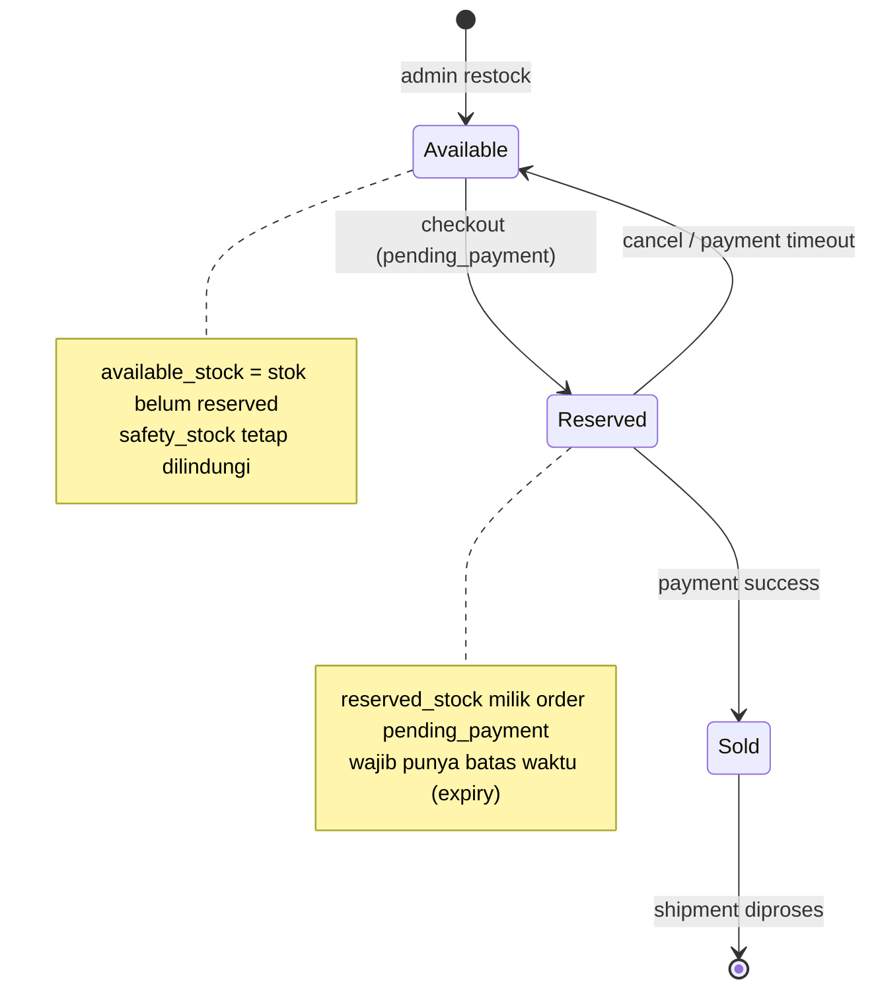
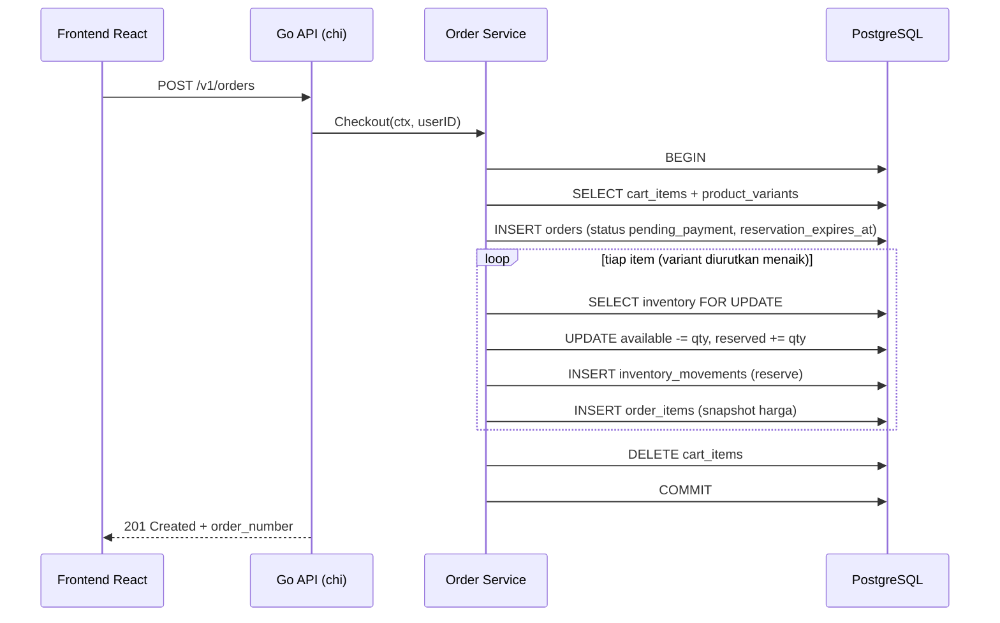
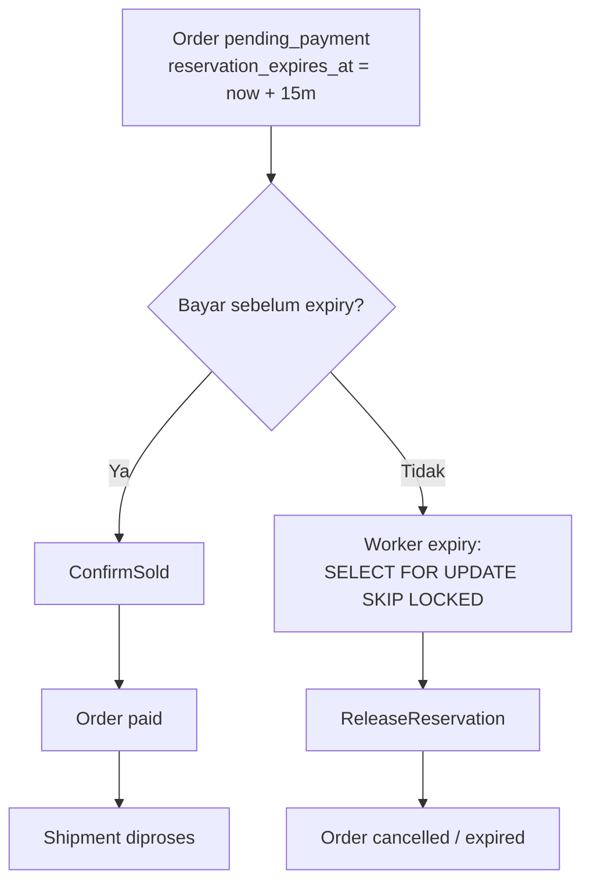

import { Section, Box, Steps, Step, Recap, CardGrid, Card, Chip, Hero, Compare, FileTree, Endpoint, Def } from "@components";

<Hero eyebrow="Roadmap 5 &middot; Online Shop Skincare Domain Mastery" title="Inventory <em>Domain</em><br />Cegah Overselling">
  <p>Inventory adalah pagar terakhir yang memastikan order sah, stok konsisten, dan toko tidak pernah menjual serum yang sebenarnya sudah habis, walau ribuan checkout datang dalam detik yang sama.</p>
  <Fragment slot="meta">
    <Chip icon="code">Bahasa: <b>Go 1.26</b></Chip>
    <Chip icon="database">DB: <b>PostgreSQL</b></Chip>
    <Chip icon="shield">Konsistensi</Chip>
    <Chip icon="clock">~70 menit baca</Chip>
  </Fragment>
</Hero>

<Section num="01" id="intro" title="Kenapa Inventory Mudah Salah?" sub="Masalahnya bukan menyimpan angka stok, tetapi menjaga angka itu tetap benar di bawah beban checkout bersamaan.">

<p class="lead">Di React, cart adalah state UI yang konfliknya selesai dengan render ulang. Di backend, inventory adalah state bisnis yang harus tetap benar walau banyak request menulis baris yang sama pada milidetik yang sama.</p>

Di modul cart, kita sengaja tidak menyimpan harga di cart karena cart hanya niat beli. Di modul checkout, kita membuat order dan snapshot harga. Di modul inventory ini, kita menjawab pertanyaan paling mahal di sebuah online shop: bagaimana kalau dua customer membeli varian terakhir <em>Serum Niacinamide 10%</em> yang sama dalam detik yang sama? Jika jawabannya salah, stok jadi minus, satu order harus dibatalkan manual, dan satu customer kecewa.

Kata kuncinya adalah <em class="term">overselling</em>, yaitu menjual lebih banyak dari yang benar-benar ada. Overselling hampir tidak pernah muncul di laptop kita karena di lokal request datang satu per satu. Ia muncul justru saat traffic naik, persis di momen flash sale yang seharusnya jadi momen terbaik bisnis.

<Box variant="bridge" icon="🌉" label="Jembatan: dari state UI ke state transaksi"><p>Di React, dua komponen yang menulis state yang sama diselesaikan oleh React dengan re-render. Di inventory, dua transaksi yang menulis baris stok yang sama harus diselesaikan oleh database, karena efeknya nyata dan permanen: angka di tabel benar-benar berubah, dan tidak ada tombol undo.</p></Box>

<Compare aLabel="Laravel / PHP" bLabel="Go + PostgreSQL" aTone="muted" bTone="violet">
  <Fragment slot="a"><ul><li>`DB::transaction()` membungkus blok, tetapi sering menyembunyikan detail lock, urutan query, dan error mapping.</li><li>Eloquent membuat `$variant->decrement('stock')` terlihat sepele, padahal concurrency tetap perlu desain `lockForUpdate()` yang eksplisit.</li></ul></Fragment>
  <Fragment slot="b"><ul><li>Service menerima `context.Context`, memulai transaksi `pool.Begin`, lalu repository menjalankan SQL yang terbaca jelas.</li><li>`SELECT ... FOR UPDATE` membuat satu baris inventory diproses bergiliran, dan kita yang memegang kendali transaksinya.</li></ul></Fragment>
</Compare>

Inventory yang sehat tidak hanya punya kolom angka. Ia punya **riwayat alasan perubahan** (movement log), **aturan reservasi** dengan **batas waktu**, **aturan release**, dan **mekanisme lock** saat checkout. PostgreSQL mendokumentasikan bahwa `SELECT ... FOR UPDATE` mengunci baris terpilih terhadap update concurrent, dan lock baris itu dilepas saat transaksi selesai (commit atau rollback). Lihat [PostgreSQL SELECT](https://www.postgresql.org/docs/current/sql-select.html) dan [PostgreSQL Explicit Locking](https://www.postgresql.org/docs/current/explicit-locking.html).

</Section>

<Section num="02" id="model-stok" title="Tiga Angka Stok: Available, Reserved, Sold" sub="Pisahkan stok berdasarkan status bisnisnya, bukan menyimpan satu angka total.">

<p class="lead">Satu kolom `stock` saja tidak cukup. Inventory yang bisa diaudit memisahkan stok menjadi tiga angka: yang siap dialokasikan, yang sedang menunggu pembayaran, dan yang sudah terjual.</p>

<Def term="available_stock"><p>Jumlah stok yang belum reserved dan belum sold, yaitu stok yang masih boleh dijanjikan ke order baru. Jumlah yang benar-benar boleh dijual adalah `available_stock - safety_stock`.</p></Def>

<Def term="reserved_stock"><p>Jumlah stok yang sudah ditahan untuk order `pending_payment`, tetapi belum menjadi penjualan final. Ini adalah janji sementara yang bisa batal.</p></Def>

<Def term="sold_stock"><p>Jumlah stok yang sudah dibayar dan dikonfirmasi sebagai penjualan, biasanya setelah payment gateway mengirim webhook success.</p></Def>

Kunci yang sering keliru: checkout TIDAK langsung menambah `sold_stock`. Checkout memindahkan stok dari `available` ke `reserved`. Yang membuat stok benar-benar `sold` adalah pembayaran. Pemisahan ini yang menahan overselling tanpa membuat customer yang sudah klik checkout kehilangan haknya atas stok.

<CardGrid cols={3}>
  <Card><h4>Checkout</h4><p>`available_stock` turun, `reserved_stock` naik. Customer belum membayar, jadi belum boleh masuk `sold_stock`.</p></Card>
  <Card><h4>Payment success</h4><p>`reserved_stock` turun, `sold_stock` naik. Inilah satu-satunya momen stok dinyatakan benar-benar terjual.</p></Card>
  <Card><h4>Cancel atau timeout</h4><p>`reserved_stock` turun, `available_stock` naik kembali. Stok dilepas agar bisa dibeli customer lain.</p></Card>
</CardGrid>



<p class="fig-cap"><b>Gambar 1.</b> Siklus state stok dari restock, checkout, pembayaran, sampai pengiriman. Reserved punya dua jalan keluar: menjadi Sold atau kembali ke Available.</p>

<Box variant="note" icon="🧾" label="Model stok vs stok fisik"><p>`available + reserved + sold` adalah model stok di aplikasi, bukan janji jumlah fisik gudang yang selalu cocok detik per detik. Selisih karena retur, produk rusak, atau salah hitung gudang diselesaikan lewat manual adjustment yang juga tercatat sebagai movement, sehingga model dan fisik bisa direkonsiliasi.</p></Box>

</Section>

<Section num="03" id="skema" title="Skema dan Stock Movement Log" sub="Setiap perubahan stok harus meninggalkan jejak: kapan, untuk order apa, dari berapa ke berapa, dan kenapa.">

<p class="lead">Tanpa movement log, bug inventory tidak bisa dibuktikan. Dengan movement log, setiap mutasi stok punya audit trail yang menjelaskan dirinya sendiri.</p>

Di Laravel, ini mirip membuat tabel `stock_movements` daripada hanya menimpa kolom `stock` di model `ProductVariant`. Bedanya, di Go kita membuat repository method yang eksplisit untuk tiap transisi stok (`ReserveStock`, `ConfirmSold`, `ReleaseReservation`) agar business rule tidak tersebar ke banyak tempat.

Perhatikan tipe kolom: stok adalah hitungan unit, jadi `INTEGER` cukup dan tepat. Uang TIDAK ada di tabel ini, harga di-snapshot di `order_items` (modul checkout) dengan tipe domain `PriceRupiah int64` dan kolom `BIGINT`. Memisahkan unit dari rupiah membuat model lebih jujur.

```sql title="db/migrations/021_create_inventories.up.sql"
CREATE TABLE inventories (
    product_variant_id BIGINT PRIMARY KEY REFERENCES product_variants(id),
    available_stock    INTEGER     NOT NULL DEFAULT 0,
    reserved_stock     INTEGER     NOT NULL DEFAULT 0,
    sold_stock         INTEGER     NOT NULL DEFAULT 0,
    safety_stock       INTEGER     NOT NULL DEFAULT 0,
    version            BIGINT      NOT NULL DEFAULT 1,
    updated_at         TIMESTAMPTZ NOT NULL DEFAULT NOW(),
    CHECK (available_stock >= 0),
    CHECK (reserved_stock  >= 0),
    CHECK (sold_stock      >= 0),
    CHECK (safety_stock    >= 0)
);

CREATE TABLE inventory_movements (
    id                 BIGSERIAL PRIMARY KEY,
    product_variant_id BIGINT NOT NULL REFERENCES product_variants(id),
    order_id           BIGINT REFERENCES orders(id),
    movement_type      TEXT   NOT NULL CHECK (movement_type IN (
        'reserve',
        'confirm_sold',
        'release_reservation',
        'manual_adjustment',
        'restock'
    )),
    quantity       INTEGER NOT NULL CHECK (quantity > 0),
    from_available INTEGER NOT NULL,
    to_available   INTEGER NOT NULL,
    from_reserved  INTEGER NOT NULL,
    to_reserved    INTEGER NOT NULL,
    from_sold      INTEGER NOT NULL,
    to_sold        INTEGER NOT NULL,
    reason         TEXT  NOT NULL,
    metadata       JSONB NOT NULL DEFAULT '{}'::jsonb,
    created_at     TIMESTAMPTZ NOT NULL DEFAULT NOW()
);

CREATE INDEX idx_inventory_movements_variant_created_at
    ON inventory_movements (product_variant_id, created_at DESC);

CREATE INDEX idx_inventory_movements_order_id
    ON inventory_movements (order_id);
```

`CHECK (available_stock >= 0)` adalah jaring pengaman terakhir di tingkat database. Bahkan jika ada bug logika di Go yang lolos sampai ke `UPDATE`, constraint ini akan menolak commit yang membuat stok minus dengan error, bukan diam-diam merusak data. Kolom `from_*` dan `to_*` menyimpan snapshot sebelum dan sesudah tiap mutasi, sehingga movement log bisa dibaca seperti rekening koran.

<Box variant="tip" icon="💡" label="Movement log dalam transaksi yang sama"><p>Tulis movement log di transaksi yang sama dengan perubahan inventory. Kalau stok berubah tetapi log gagal ditulis (atau sebaliknya), transaksi harus rollback. Audit trail yang bolong lebih berbahaya daripada tidak ada audit trail, karena ia berbohong.</p></Box>

```go title="internal/inventory/model.go"
package inventory

import "time"

type Inventory struct {
	ProductVariantID int64
	AvailableStock   int32
	ReservedStock    int32
	SoldStock        int32
	SafetyStock      int32
	Version          int64
	UpdatedAt        time.Time
}

type MovementType string

const (
	MovementReserve            MovementType = "reserve"
	MovementConfirmSold        MovementType = "confirm_sold"
	MovementReleaseReservation MovementType = "release_reservation"
	MovementManualAdjustment   MovementType = "manual_adjustment"
	MovementRestock            MovementType = "restock"
)

type Movement struct {
	ProductVariantID int64
	OrderID          *int64 // pointer: NULL untuk restock/adjustment tanpa order
	Type             MovementType
	Quantity         int32
	FromAvailable    int32
	ToAvailable      int32
	FromReserved     int32
	ToReserved       int32
	FromSold         int32
	ToSold           int32
	Reason           string
}
```

<Box variant="bridge" icon="🌉" label="Jembatan: dari nullable Eloquent ke *int64"><p>`order_id` boleh kosong untuk restock dan adjustment yang bukan dari order. Di PHP itu cukup `?int $orderId`. Di Go, nullable diwakili pointer `*int64`: `nil` berarti tidak ada order, sedangkan `*int64` yang menunjuk ke `9001` berarti ada. pgx memetakan `nil` ke `NULL` dan sebaliknya secara otomatis.</p></Box>

</Section>

<Section num="04" id="reservasi-checkout" title="Reservasi Saat Checkout" sub="Checkout tidak membuat stok sold. Checkout membuat reservasi untuk order pending_payment.">

<p class="lead">Reservasi adalah janji sementara: stok ditahan untuk satu order tertentu sampai customer membayar atau waktu pembayaran habis.</p>

Saat `POST /v1/orders`, service checkout membaca cart, validasi produk aktif, validasi stok, membuat order, menyimpan order items dengan snapshot harga, lalu reserve stok untuk tiap item. Semua langkah ini harus berjalan dalam SATU transaksi database. Di pgx v5, `pool.Begin(ctx)` (atau `pool.BeginTx` untuk opsi isolation) memulai transaksi, dan dokumentasi pgx menegaskan setiap transaksi wajib ditutup dengan `Commit` atau `Rollback`. Lihat [pgxpool BeginTx](https://pkg.go.dev/github.com/jackc/pgx/v5/pgxpool#Pool.BeginTx).



<p class="fig-cap"><b>Gambar 2.</b> Alur checkout dari `POST /v1/orders` sampai reservasi stok. Semua di dalam satu BEGIN...COMMIT, varian dikunci satu per satu dengan urutan menaik.</p>

Service-lah pemilik transaksi. Repository inventory menerima `pgx.Tx`, bukan `pool`, sehingga reservasi stok ikut dalam transaksi yang sama dengan pembuatan order. Pola ini ("transaction owner di service, repository menerima Tx") sudah kita pakai sejak Roadmap 3.

```go title="internal/order/checkout.go"
package order

import (
	"context"
	"fmt"
	"sort"

	"github.com/jackc/pgx/v5/pgxpool"

	"github.com/kamu/skincare-backend/internal/inventory"
)

type CheckoutService struct {
	pool          *pgxpool.Pool
	cartRepo      CartRepository
	orderRepo     OrderRepository
	inventoryRepo InventoryRepository
}

func (s *CheckoutService) Checkout(ctx context.Context, userID int64) (*Order, error) {
	tx, err := s.pool.Begin(ctx)
	if err != nil {
		return nil, fmt.Errorf("begin checkout tx: %w", err)
	}
	defer tx.Rollback(ctx) // no-op kalau sudah Commit; aman dipanggil ganda

	items, err := s.cartRepo.ListItemsForCheckout(ctx, tx, userID)
	if err != nil {
		return nil, fmt.Errorf("list checkout items: %w", err)
	}
	if len(items) == 0 {
		return nil, ErrEmptyCart
	}

	// Urutkan variant menaik supaya semua transaksi mengunci baris
	// dengan urutan sama. Ini mencegah deadlock saat dua order
	// menyentuh dua variant yang sama dalam urutan berbeda.
	sort.Slice(items, func(i, j int) bool {
		return items[i].ProductVariantID < items[j].ProductVariantID
	})

	order, err := s.orderRepo.CreatePendingPayment(ctx, tx, userID)
	if err != nil {
		return nil, fmt.Errorf("create pending order: %w", err)
	}

	for _, item := range items {
		err := s.inventoryRepo.ReserveStock(ctx, tx, inventory.ReserveStockParams{
			ProductVariantID: item.ProductVariantID,
			OrderID:          order.ID,
			Quantity:         item.Quantity,
			Reason:           "checkout",
		})
		if err != nil {
			return nil, fmt.Errorf("reserve stock variant %d: %w", item.ProductVariantID, err)
		}

		if err := s.orderRepo.CreateItemSnapshot(ctx, tx, order.ID, item); err != nil {
			return nil, fmt.Errorf("create order item snapshot: %w", err)
		}
	}

	if err := s.cartRepo.ClearCart(ctx, tx, userID); err != nil {
		return nil, fmt.Errorf("clear cart: %w", err)
	}

	if err := tx.Commit(ctx); err != nil {
		return nil, fmt.Errorf("commit checkout tx: %w", err)
	}
	return order, nil
}
```

<Box variant="warn" icon="⚠️" label="Jangan commit setengah jalan"><p>Jangan commit setelah order dibuat lalu reserve stok di transaksi baru. Kalau reserve gagal, order sudah telanjur ada tanpa stok yang valid, dan customer melihat order yang sebenarnya tidak punya barang. Order, order items, reservasi stok, dan movement log harus atomic: semua berhasil, atau semua batal.</p></Box>

<Box variant="note" icon="🔁" label="ErrInsufficientStock bukan error 500"><p>Saat satu varian kehabisan stok, `ReserveStock` mengembalikan `ErrInsufficientStock`. Itu kondisi bisnis yang wajar, bukan kerusakan server. Handler memetakannya ke `409 Conflict` (atau `422`) dengan pesan yang ramah, bukan `500`. Transaksi otomatis rollback lewat `defer tx.Rollback`.</p></Box>

</Section>

<Section num="05" id="row-locking" title="Row Locking untuk Concurrent Checkout" sub="Kunci baris inventory yang sama agar dua transaksi tidak menghitung stok dari angka yang sudah basi.">

<p class="lead">Overselling terjadi ketika dua transaksi membaca stok yang sama sebelum salah satunya sempat menulis update. Keduanya melihat angka lama, keduanya lolos validasi, keduanya menulis. Stok pun minus.</p>

Bayangkan `available_stock = 1` dan dua customer membeli 1 item varian yang sama persis pada saat bersamaan. Tanpa lock, urutan kejadiannya bisa seperti ini: T1 membaca `1`, T2 membaca `1`, T1 cek `1 >= 1` lolos, T2 cek `1 >= 1` juga lolos, T1 tulis `0`, T2 tulis `0`. Hasilnya dua reservasi dari stok satu. Itulah overselling.

Dengan `SELECT ... FOR UPDATE`, baris dikunci sejak dibaca. Transaksi kedua yang mencoba mengunci baris yang sama akan MENUNGGU sampai transaksi pertama commit atau rollback, lalu baru membaca angka terbaru. T2 kini melihat `0`, validasi gagal, dan mengembalikan `ErrInsufficientStock`. Tepat satu reservasi yang lolos.

```mermaid
sequenceDiagram
  participant T1 as Checkout A
  participant T2 as Checkout B
  participant DB as Row inventory (variant 101)

  T1->>DB: BEGIN; SELECT ... FOR UPDATE (kunci baris)
  Note over T2,DB: T2 mencoba mengunci baris yang sama
  T2->>DB: BEGIN; SELECT ... FOR UPDATE (menunggu)
  T1->>DB: available 1 -> 0, reserved 0 -> 1
  T1->>DB: COMMIT (lock dilepas)
  DB-->>T2: lock didapat, baca available = 0
  T2->>DB: cek 0 >= 1 GAGAL -> ErrInsufficientStock
  T2->>DB: ROLLBACK
```

<p class="fig-cap"><b>Gambar 3.</b> Dua checkout berebut baris yang sama. FOR UPDATE membuat keduanya bergiliran, sehingga tepat satu yang berhasil reserve.</p>

<Box variant="bridge" icon="🌉" label="Jembatan: dari race condition JS ke database race"><p>Di JavaScript, race condition muncul saat dua promise menulis state yang sama. Refleks pertama developer Go pemula adalah memakai `sync.Mutex`. Tapi mutex hanya melindungi satu proses. Di production API berjalan di banyak container (mis. beberapa task ECS), dan mutex di container A tidak tahu apa-apa soal container B. Lock yang benar harus ada di tempat yang dilihat semua proses: database.</p></Box>

```go title="internal/inventory/repository.go"
package inventory

import (
	"context"
	"errors"
	"fmt"

	"github.com/jackc/pgx/v5"
)

var (
	ErrInventoryNotFound = errors.New("inventory not found")
	ErrInsufficientStock = errors.New("insufficient stock")
	ErrInvalidQuantity   = errors.New("invalid quantity")
)

type ReserveStockParams struct {
	ProductVariantID int64
	OrderID          int64
	Quantity         int32
	Reason           string
}

type Repository struct{}

func (r *Repository) ReserveStock(ctx context.Context, tx pgx.Tx, p ReserveStockParams) error {
	if p.Quantity <= 0 {
		return ErrInvalidQuantity
	}

	inv, err := r.lockInventory(ctx, tx, p.ProductVariantID)
	if err != nil {
		return err
	}

	sellable := inv.AvailableStock - inv.SafetyStock
	if sellable < p.Quantity {
		return fmt.Errorf("%w: need %d, sellable %d", ErrInsufficientStock, p.Quantity, sellable)
	}

	nextAvailable := inv.AvailableStock - p.Quantity
	nextReserved := inv.ReservedStock + p.Quantity

	_, err = tx.Exec(ctx, `
		UPDATE inventories
		SET available_stock = $2,
		    reserved_stock  = $3,
		    version         = version + 1,
		    updated_at      = NOW()
		WHERE product_variant_id = $1
	`, p.ProductVariantID, nextAvailable, nextReserved)
	if err != nil {
		return fmt.Errorf("update reservation: %w", err)
	}

	return r.insertMovement(ctx, tx, movementRow{
		variantID: p.ProductVariantID,
		orderID:   &p.OrderID,
		kind:      MovementReserve,
		quantity:  p.Quantity,
		from:      inv,
		toAvail:   nextAvailable,
		toReserved: nextReserved,
		toSold:    inv.SoldStock,
		reason:    p.Reason,
	})
}

func (r *Repository) lockInventory(ctx context.Context, tx pgx.Tx, variantID int64) (Inventory, error) {
	var inv Inventory
	err := tx.QueryRow(ctx, `
		SELECT product_variant_id, available_stock, reserved_stock,
		       sold_stock, safety_stock, version, updated_at
		FROM inventories
		WHERE product_variant_id = $1
		FOR UPDATE
	`, variantID).Scan(
		&inv.ProductVariantID, &inv.AvailableStock, &inv.ReservedStock,
		&inv.SoldStock, &inv.SafetyStock, &inv.Version, &inv.UpdatedAt,
	)
	if errors.Is(err, pgx.ErrNoRows) {
		return Inventory{}, ErrInventoryNotFound
	}
	if err != nil {
		return Inventory{}, fmt.Errorf("lock inventory: %w", err)
	}
	return inv, nil
}
```

Karena tiga transisi stok (`reserve`, `confirm_sold`, `release_reservation`) menulis movement dengan bentuk yang sama, kita satukan ke satu helper agar tidak ada SQL `INSERT` yang disalin tiga kali (dan berisiko beda satu kolom).

```go title="internal/inventory/movement.go"
package inventory

import (
	"context"
	"fmt"

	"github.com/jackc/pgx/v5"
)

type movementRow struct {
	variantID  int64
	orderID    *int64
	kind       MovementType
	quantity   int32
	from       Inventory
	toAvail    int32
	toReserved int32
	toSold     int32
	reason     string
}

func (r *Repository) insertMovement(ctx context.Context, tx pgx.Tx, m movementRow) error {
	_, err := tx.Exec(ctx, `
		INSERT INTO inventory_movements (
		    product_variant_id, order_id, movement_type, quantity,
		    from_available, to_available,
		    from_reserved,  to_reserved,
		    from_sold,      to_sold,
		    reason
		) VALUES ($1, $2, $3, $4, $5, $6, $7, $8, $9, $10, $11)
	`,
		m.variantID, m.orderID, m.kind, m.quantity,
		m.from.AvailableStock, m.toAvail,
		m.from.ReservedStock, m.toReserved,
		m.from.SoldStock, m.toSold,
		m.reason,
	)
	if err != nil {
		return fmt.Errorf("insert %s movement: %w", m.kind, err)
	}
	return nil
}
```

<Compare aLabel="Update polos (rawan oversell)" bLabel="SELECT FOR UPDATE" aTone="red" bTone="teal">
  <Fragment slot="a"><ul><li>Membaca stok lalu update bisa disisipi transaksi lain di antaranya.</li><li>Validasi memakai angka yang sudah basi, dua-duanya lolos.</li></ul></Fragment>
  <Fragment slot="b"><ul><li>Baris dikunci sejak dibaca sampai commit atau rollback.</li><li>Transaksi kedua membaca angka terbaru, jadi validasinya jujur.</li></ul></Fragment>
</Compare>

<Box variant="warn" icon="🔒" label="Deadlock: kunci dengan urutan yang sama"><p>Kalau order A mengunci variant 5 lalu 9, dan order B mengunci variant 9 lalu 5, keduanya bisa saling menunggu selamanya: deadlock. PostgreSQL akan mendeteksi dan membatalkan salah satunya, tapi itu error yang seharusnya bisa dihindari. Solusinya ada di `checkout.go`: `sort` daftar item berdasarkan `ProductVariantID` menaik sebelum mengunci, sehingga semua transaksi mengunci dengan urutan yang sama.</p></Box>

</Section>

<Section num="06" id="atomic-vs-lock" title="Atomic UPDATE vs SELECT FOR UPDATE" sub="Dua cara mencegah oversell, dan kenapa modul ini memilih lock eksplisit.">

<p class="lead">FOR UPDATE bukan satu-satunya cara. Untuk kasus paling sederhana, satu `UPDATE` kondisional sudah cukup aman. Memahami kapan masing-masing cocok membuat desainmu sadar, bukan asal ikut pola.</p>

Cara pertama, <em class="term">atomic conditional UPDATE</em>, menyatukan cek dan tulis dalam satu pernyataan. Database mengevaluasi `WHERE` dan menulis dalam satu langkah yang tak bisa disisipi, lalu kita periksa berapa baris yang terpengaruh.

```sql title="Atomic UPDATE: cek dan tulis sekali jalan"
UPDATE inventories
SET available_stock = available_stock - $2,
    reserved_stock  = reserved_stock  + $2,
    version         = version + 1,
    updated_at      = NOW()
WHERE product_variant_id = $1
  AND available_stock - safety_stock >= $2;
-- RowsAffected == 0 berarti stok tidak cukup
```

```go title="internal/inventory/reserve_atomic.go"
package inventory

import (
	"context"
	"fmt"

	"github.com/jackc/pgx/v5"
)

// ReserveStockAtomic: varian tanpa SELECT terpisah. Cocok kalau kita
// tidak perlu snapshot before/after di luar movement log.
func (r *Repository) ReserveStockAtomic(ctx context.Context, tx pgx.Tx, p ReserveStockParams) error {
	if p.Quantity <= 0 {
		return ErrInvalidQuantity
	}
	tag, err := tx.Exec(ctx, `
		UPDATE inventories
		SET available_stock = available_stock - $2,
		    reserved_stock  = reserved_stock  + $2,
		    version         = version + 1,
		    updated_at      = NOW()
		WHERE product_variant_id = $1
		  AND available_stock - safety_stock >= $2
	`, p.ProductVariantID, p.Quantity)
	if err != nil {
		return fmt.Errorf("atomic reserve: %w", err)
	}
	if tag.RowsAffected() == 0 {
		return ErrInsufficientStock // stok kurang ATAU baris tidak ada
	}
	return nil
}
```

<Compare aLabel="Atomic UPDATE ... WHERE" bLabel="SELECT FOR UPDATE lalu UPDATE" aTone="blue" bTone="teal">
  <Fragment slot="a"><ul><li>Satu round-trip, paling ringkas dan cepat.</li><li>Tidak punya snapshot before/after di Go sebelum menulis.</li><li>`RowsAffected == 0` ambigu: bisa stok kurang, bisa baris hilang.</li></ul></Fragment>
  <Fragment slot="b"><ul><li>Kita pegang nilai sebelum dan sesudah untuk movement log yang kaya.</li><li>Bisa menjalankan beberapa validasi bisnis di Go di antara read dan write.</li><li>Satu round-trip ekstra, tetapi paling jelas dibaca dan diaudit.</li></ul></Fragment>
</Compare>

Modul ini memilih `SELECT ... FOR UPDATE` karena movement log butuh `from_*` dan `to_*` yang tepat, dan satu reservasi bisa menyentuh beberapa varian dengan validasi bisnis lain (produk aktif, batas per-order). Untuk dekrement stok tunggal yang sederhana tanpa kebutuhan snapshot, atomic UPDATE lebih ringkas dan sama amannya.

<Box variant="note" icon="🧭" label="FOR UPDATE SKIP LOCKED untuk worker"><p>Ada varian ketiga: `FOR UPDATE SKIP LOCKED`, yang melewati baris yang sedang dikunci alih-alih menunggu. Itu BUKAN untuk checkout (kita justru ingin menunggu giliran), tetapi sangat cocok untuk worker yang memproses banyak order kadaluarsa secara paralel tanpa saling menabrak. Kita pakai polanya di section release expiry.</p></Box>

</Section>

<Section num="07" id="payment-success" title="Payment Success: Reserved Menjadi Sold" sub="Stok yang dibayar pindah dari reserved ke sold, bukan dari available ke sold.">

<p class="lead">Payment success TIDAK boleh mengurangi `available_stock` lagi, karena stok sudah ditahan sejak checkout. Yang berubah hanya status janji: dari reserved menjadi sold.</p>

Saat payment gateway mengirim webhook success, service payment membaca order `pending_payment`, lalu memanggil `ConfirmSold` untuk tiap order item, semuanya dalam transaksi yang sama dengan update status order menjadi `paid`. Kalau salah satu gagal, seluruh konfirmasi rollback, dan webhook bisa diulang dengan aman.

```go title="internal/inventory/confirm_sold.go"
package inventory

import (
	"context"
	"fmt"

	"github.com/jackc/pgx/v5"
)

type ConfirmSoldParams struct {
	ProductVariantID int64
	OrderID          int64
	Quantity         int32
	Reason           string
}

func (r *Repository) ConfirmSold(ctx context.Context, tx pgx.Tx, p ConfirmSoldParams) error {
	if p.Quantity <= 0 {
		return ErrInvalidQuantity
	}

	inv, err := r.lockInventory(ctx, tx, p.ProductVariantID)
	if err != nil {
		return err
	}
	if inv.ReservedStock < p.Quantity {
		return fmt.Errorf("%w: reserved %d, need %d", ErrInsufficientStock, inv.ReservedStock, p.Quantity)
	}

	nextReserved := inv.ReservedStock - p.Quantity
	nextSold := inv.SoldStock + p.Quantity

	_, err = tx.Exec(ctx, `
		UPDATE inventories
		SET reserved_stock = $2,
		    sold_stock     = $3,
		    version        = version + 1,
		    updated_at     = NOW()
		WHERE product_variant_id = $1
	`, p.ProductVariantID, nextReserved, nextSold)
	if err != nil {
		return fmt.Errorf("update sold stock: %w", err)
	}

	return r.insertMovement(ctx, tx, movementRow{
		variantID:  p.ProductVariantID,
		orderID:    &p.OrderID,
		kind:       MovementConfirmSold,
		quantity:   p.Quantity,
		from:       inv,
		toAvail:    inv.AvailableStock, // available tidak berubah
		toReserved: nextReserved,
		toSold:     nextSold,
		reason:     p.Reason,
	})
}
```

<Box variant="warn" icon="⚠️" label="Webhook bisa datang lebih dari sekali"><p>Payment gateway sering mengirim webhook yang sama dua kali (at-least-once delivery). Tanpa pengaman, `ConfirmSold` bisa jalan dua kali dan `reserved_stock` berkurang dua kali, lagi-lagi membuat angka minus. Konfirmasi stok harus idempotent.</p></Box>

Cara paling kokoh membuat idempotent BUKAN dengan mengecek di Go, melainkan menyandarkan pada transisi status order yang dijaga database. Service payment hanya boleh memindahkan order dari `pending_payment` ke `paid` satu kali. `UPDATE ... WHERE status = 'pending_payment'` yang menghasilkan nol baris berarti order sudah `paid` sebelumnya, jadi webhook duplikat berhenti sebelum menyentuh stok.

```go title="internal/payment/webhook.go"
package payment

import (
	"context"
	"fmt"

	"github.com/jackc/pgx/v5/pgxpool"

	"github.com/kamu/skincare-backend/internal/inventory"
)

func (s *Service) HandlePaymentSuccess(ctx context.Context, pool *pgxpool.Pool, orderID int64) error {
	tx, err := pool.Begin(ctx)
	if err != nil {
		return fmt.Errorf("begin payment tx: %w", err)
	}
	defer tx.Rollback(ctx)

	// Penjaga idempotensi: transisi status hanya berhasil sekali.
	moved, err := s.orderRepo.MarkPaidIfPending(ctx, tx, orderID)
	if err != nil {
		return fmt.Errorf("mark paid: %w", err)
	}
	if !moved {
		return nil // webhook duplikat, sudah paid, jangan sentuh stok
	}

	items, err := s.orderRepo.ListItems(ctx, tx, orderID)
	if err != nil {
		return fmt.Errorf("list order items: %w", err)
	}
	for _, it := range items {
		err := s.inventoryRepo.ConfirmSold(ctx, tx, inventory.ConfirmSoldParams{
			ProductVariantID: it.ProductVariantID,
			OrderID:          orderID,
			Quantity:         it.Quantity,
			Reason:           "payment success",
		})
		if err != nil {
			return fmt.Errorf("confirm sold variant %d: %w", it.ProductVariantID, err)
		}
	}

	return tx.Commit(ctx)
}
```

<Box variant="bridge" icon="🌉" label="Jembatan: dari guard clause ke database guard"><p>Di Laravel kamu mungkin menulis `if ($order->isPaid()) return;` di awal handler. Itu cek di memori, dan tetap bisa balapan kalau dua webhook tiba bersamaan. Versi Go di sini memindahkan guard ke database lewat `UPDATE ... WHERE status = 'pending_payment'`. Database yang menjamin transisi terjadi tepat sekali, bukan kode aplikasi.</p></Box>

</Section>

<Section num="08" id="release-expiry" title="Release dan Reservation Expiry" sub="Order yang batal atau telat bayar harus mengembalikan stok ke available, otomatis.">

<p class="lead">Reserved stock adalah janji sementara. Janji tanpa batas waktu adalah kebocoran: stok ditahan order yang tidak akan pernah dibayar, dan customer lain melihat barang habis padahal sebenarnya ada.</p>

Release terjadi saat customer membatalkan order, payment expired, fraud check gagal, atau admin membatalkan. Mekanismenya kebalikan dari reserve: `reserved` turun, `available` naik. Validasinya tetap pakai lock agar tidak balapan dengan konfirmasi pembayaran yang mungkin datang di saat yang sama.

```go title="internal/inventory/release_reservation.go"
package inventory

import (
	"context"
	"fmt"

	"github.com/jackc/pgx/v5"
)

type ReleaseReservationParams struct {
	ProductVariantID int64
	OrderID          int64
	Quantity         int32
	Reason           string
}

func (r *Repository) ReleaseReservation(ctx context.Context, tx pgx.Tx, p ReleaseReservationParams) error {
	if p.Quantity <= 0 {
		return ErrInvalidQuantity
	}

	inv, err := r.lockInventory(ctx, tx, p.ProductVariantID)
	if err != nil {
		return err
	}
	if inv.ReservedStock < p.Quantity {
		return fmt.Errorf("%w: reserved %d, need %d", ErrInsufficientStock, inv.ReservedStock, p.Quantity)
	}

	nextAvailable := inv.AvailableStock + p.Quantity
	nextReserved := inv.ReservedStock - p.Quantity

	_, err = tx.Exec(ctx, `
		UPDATE inventories
		SET available_stock = $2,
		    reserved_stock  = $3,
		    version         = version + 1,
		    updated_at      = NOW()
		WHERE product_variant_id = $1
	`, p.ProductVariantID, nextAvailable, nextReserved)
	if err != nil {
		return fmt.Errorf("update release: %w", err)
	}

	return r.insertMovement(ctx, tx, movementRow{
		variantID:  p.ProductVariantID,
		orderID:    &p.OrderID,
		kind:       MovementReleaseReservation,
		quantity:   p.Quantity,
		from:       inv,
		toAvail:    nextAvailable,
		toReserved: nextReserved,
		toSold:     inv.SoldStock,
		reason:     p.Reason,
	})
}
```



<p class="fig-cap"><b>Gambar 4.</b> Reserved stock punya dua jalan keluar normal: menjadi sold lewat pembayaran, atau kembali ke available lewat worker expiry.</p>

Siapa yang memicu release saat customer hanya menutup tab tanpa membayar? Tidak ada request masuk, jadi harus ada worker terjadwal. Kita simpan `reservation_expires_at` di order saat checkout (mis. `NOW() + INTERVAL '15 minutes'`), lalu worker periodik memungut order yang lewat tenggat dan melepasnya. Ini momen `FOR UPDATE SKIP LOCKED` bersinar: beberapa worker (atau beberapa container) bisa berjalan bersamaan, masing-masing memungut order berbeda tanpa saling menunggu.

```sql title="Worker expiry: ambil order kadaluarsa tanpa saling tabrak"
SELECT id
FROM orders
WHERE status = 'pending_payment'
  AND reservation_expires_at < NOW()
ORDER BY reservation_expires_at
FOR UPDATE SKIP LOCKED
LIMIT 50;
-- Untuk tiap order: ReleaseReservation per item, lalu set status 'expired',
-- semuanya dalam transaksi yang sama.
```

<Box variant="note" icon="🧰" label="Worker dari Roadmap 4"><p>Pola background worker dan retry sudah dibangun di modul Background Worker Architecture (Roadmap 4). Di sini kita cukup menambah satu job baru: "release reservasi kadaluarsa". Saat naik ke AWS, scheduler bisa pakai EventBridge yang memicu job, dan antriannya lewat SQS.</p></Box>

</Section>

<Section num="09" id="safety-stock" title="Safety Stock dan Adjustment" sub="Buffer operasional agar stok terakhir tidak selalu dijual, plus jalur memperbaiki selisih gudang.">

<p class="lead">Safety stock adalah stok minimum yang sengaja ditahan untuk risiko operasional: selisih hitung gudang, produk rusak, atau alokasi untuk kanal jualan lain.</p>

Jika `available_stock = 10` dan `safety_stock = 2`, API hanya boleh menjual 8 unit. Aturan ini hidup di backend sebagai sumber kebenaran. UI boleh menampilkan "stok terbatas", tetapi keputusan boleh-tidaknya menjual tetap di service.

```go title="internal/inventory/sellable.go"
package inventory

// SellableStock = stok yang benar-benar boleh dijanjikan ke order baru.
func (i Inventory) SellableStock() int32 {
	sellable := i.AvailableStock - i.SafetyStock
	if sellable < 0 {
		return 0
	}
	return sellable
}

func (i Inventory) CanReserve(qty int32) bool {
	return qty > 0 && i.SellableStock() >= qty
}
```

<Box variant="bridge" icon="🌉" label="Jembatan: dari computed value di React"><p>`SellableStock()` mirip computed value (atau selector) dari state di React: ia tidak disimpan, tetapi diturunkan dari `available` dan `safety`. Bedanya, ia dihitung di backend agar web, mobile, dan admin memakai aturan yang sama persis, bukan tiap client menebak sendiri.</p></Box>

Selisih antara model dan stok fisik gudang diperbaiki lewat <em class="term">manual adjustment</em>: admin mengoreksi `available_stock` dengan alasan wajib, dan koreksi itu juga tercatat sebagai movement. Restock (barang baru masuk) adalah bentuk khusus adjustment yang menaikkan available.

```go title="internal/inventory/adjust.go (inti)"
// Adjust menaikkan/menurunkan available_stock dengan alasan wajib.
// delta boleh negatif (mis. barang rusak), tetapi hasil tetap dijaga >= 0
// oleh CHECK di database. Movement dicatat sebagai manual_adjustment.
func (r *Repository) Adjust(ctx context.Context, tx pgx.Tx, variantID int64, delta int32, reason string) error {
	if reason == "" {
		return fmt.Errorf("%w: reason wajib untuk adjustment", ErrInvalidQuantity)
	}
	inv, err := r.lockInventory(ctx, tx, variantID)
	if err != nil {
		return err
	}
	next := inv.AvailableStock + delta
	if next < 0 {
		return fmt.Errorf("%w: hasil adjustment %d < 0", ErrInsufficientStock, next)
	}
	// UPDATE available_stock = next, lalu insertMovement(MovementManualAdjustment ...)
	// dengan quantity = abs(delta) dan reason yang diberikan admin.
	return nil
}
```

<Compare aLabel="Tanpa safety stock" bLabel="Dengan safety stock" aTone="muted" bTone="blue">
  <Fragment slot="a"><ul><li>Semua stok yang terlihat available langsung bisa dijual.</li><li>Risiko oversell naik saat stok fisik tidak sinkron dengan model.</li></ul></Fragment>
  <Fragment slot="b"><ul><li>Backend menahan buffer minimum per varian.</li><li>Admin punya ruang untuk selisih gudang dan alokasi kanal lain.</li></ul></Fragment>
</Compare>

</Section>

<Section num="10" id="api-struktur" title="API dan Struktur Domain" sub="Mutasi stok kritis dipanggil service domain lain dalam transaksi, bukan oleh customer langsung.">

<p class="lead">Customer tidak pernah memanggil inventory secara langsung. Customer checkout lewat order, dan order service yang memanggil inventory repository di dalam transaksinya.</p>

<Endpoint method="GET" path="/v1/admin/inventories" desc="Admin melihat stok per varian beserta ringkasan movement" />
<Endpoint method="GET" path="/v1/admin/inventories/:variant_id/movements" desc="Admin melihat audit trail perubahan stok satu varian" />
<Endpoint method="POST" path="/v1/admin/inventories/:variant_id/adjustments" desc="Admin melakukan adjustment / restock dengan alasan wajib" />
<Endpoint method="POST" path="/v1/orders" desc="Customer checkout, order service melakukan reserve stok dalam transaksi" />
<Endpoint method="POST" path="/v1/payments/webhook" desc="Payment service mengonfirmasi reserved menjadi sold, idempotent" />
<Endpoint method="POST" path="/v1/orders/:order_id/cancel" desc="Order service melepas reserved stock jika status masih pending_payment" />

<FileTree title="Struktur domain inventory" tree={`
internal/
  inventory/
    model.go                # Inventory, Movement, MovementType
    repository.go           # ReserveStock + lockInventory
    movement.go            # insertMovement (helper bersama)
    confirm_sold.go        # reserved -> sold (payment success)
    release_reservation.go # reserved -> available (cancel/expiry)
    reserve_atomic.go      # varian atomic UPDATE (opsi sederhana)
    adjust.go              # manual adjustment + restock
    sellable.go            # SellableStock, CanReserve
    service.go             # orchestration admin adjustment
    handler.go             # endpoint admin inventory
  order/
    checkout.go            # reserve stok dalam transaksi checkout
  payment/
    webhook.go             # ConfirmSold idempotent
  worker/
    expiry_release.go      # job release reservasi kadaluarsa
db/
  migrations/
    021_create_inventories.up.sql
    021_create_inventories.down.sql
`} />

<Box variant="tip" icon="💡" label="Batas domain yang sehat"><p>`inventory` tidak perlu tahu detail cart, voucher, atau alamat kirim. Ia cukup tahu empat hal: varian mana, order mana, berapa banyak, dan kenapa. Batas yang sempit membuat domain ini mudah diuji dan dipakai ulang oleh order maupun payment.</p></Box>

</Section>

<Section num="11" id="hands-on" title="Hands-on: Dua Checkout Berebut Stok Terakhir" sub="Buktikan sendiri bahwa row lock mencegah oversell, dengan dua goroutine sungguhan.">

<p class="lead">Latihan ini belum memakai HTTP. Tujuannya membuat kamu melihat langsung efek transaksi dan row lock, karena ini perilaku database yang tidak akan muncul di fake repository.</p>

<Steps>
  <Step><b>Seed satu varian</b><p>Masukkan satu row inventory: `available_stock = 1`, `reserved_stock = 0`, `sold_stock = 0`, `safety_stock = 0`.</p></Step>
  <Step><b>Jalankan dua goroutine checkout</b><p>Keduanya memanggil `ReserveStock` untuk varian yang sama dengan quantity 1, masing-masing di transaksinya sendiri.</p></Step>
  <Step><b>Pastikan tepat satu sukses</b><p>Satu berhasil reserve, satu lagi menerima `ErrInsufficientStock` setelah lock dilepas dan stok terbaru (0) terbaca.</p></Step>
  <Step><b>Cek movement log</b><p>Harus ada tepat satu movement `reserve` untuk varian itu. Kalau ada dua, berarti lock-mu tidak bekerja.</p></Step>
</Steps>

```go title="internal/inventory/reserve_stock_test.go"
package inventory_test

import (
	"context"
	"errors"
	"sync"
	"testing"

	"github.com/jackc/pgx/v5/pgxpool"

	"github.com/kamu/skincare-backend/internal/inventory"
)

func TestReserveStockConcurrentCheckout(t *testing.T) {
	ctx := context.Background()
	pool := newTestPool(t)
	repo := &inventory.Repository{}

	const variantID int64 = 101
	seedInventory(t, pool, variantID, 1, 0, 0, 0) // available=1

	var wg sync.WaitGroup
	errs := make(chan error, 2)

	for orderID := int64(9001); orderID <= 9002; orderID++ {
		wg.Add(1)
		go func(orderID int64) {
			defer wg.Done()
			errs <- reserveOne(ctx, pool, repo, variantID, orderID)
		}(orderID)
	}

	wg.Wait()
	close(errs)

	var success, stockErr int
	for err := range errs {
		switch {
		case err == nil:
			success++
		case errors.Is(err, inventory.ErrInsufficientStock):
			stockErr++
		default:
			t.Fatalf("unexpected error: %v", err)
		}
	}

	if success != 1 {
		t.Fatalf("success = %d, want 1", success)
	}
	if stockErr != 1 {
		t.Fatalf("stockErr = %d, want 1", stockErr)
	}
}

func reserveOne(ctx context.Context, pool *pgxpool.Pool, repo *inventory.Repository, variantID, orderID int64) error {
	tx, err := pool.Begin(ctx)
	if err != nil {
		return err
	}
	defer tx.Rollback(ctx)

	err = repo.ReserveStock(ctx, tx, inventory.ReserveStockParams{
		ProductVariantID: variantID,
		OrderID:          orderID,
		Quantity:         1,
		Reason:           "concurrent checkout test",
	})
	if err != nil {
		return err
	}
	return tx.Commit(ctx)
}
```

<Box variant="note" icon="🧪" label="Butuh PostgreSQL sungguhan"><p>Tes ini wajib jalan di test database PostgreSQL nyata (mis. lewat Docker atau Testcontainers), karena row locking adalah perilaku database. Fake repository in-memory tidak akan pernah memunculkan race yang ingin kita buktikan, jadi lulusnya tes itu palsu.</p></Box>

</Section>

<Section num="12" id="jebakan" title="Jebakan Umum" sub="Kesalahan inventory jarang terlihat di lokal, tetapi muncul tepat saat traffic naik.">

<p class="lead">Kalau modul checkout adalah tempat uang masuk, modul inventory adalah tempat janji bisnis diuji di bawah tekanan.</p>

<CardGrid cols={2}>
  <Card><h4>Mengurangi stok baru setelah payment</h4><p>Kalau stok hanya turun saat sudah dibayar, banyak order bisa dibuat dari stok yang sama selama belum ada yang membayar. Di flash sale ini langsung jadi oversell. Turunkan available sejak checkout (reserve).</p></Card>
  <Card><h4>Tidak satu transaksi</h4><p>Order, order items, update inventory, dan movement log harus atomic. Satu commit setengah jalan meninggalkan order tanpa stok atau stok tanpa jejak.</p></Card>
  <Card><h4>Tidak punya movement log</h4><p>Tanpa log, admin hanya melihat stok salah tanpa tahu kapan dan kenapa. Log adalah alat investigasi, bukan kosmetik.</p></Card>
  <Card><h4>Mengunci di memori Go</h4><p>`sync.Mutex` hanya melindungi satu proses. Di production API berjalan di banyak container, jadi lock harus di database.</p></Card>
  <Card><h4>Reservasi tanpa expiry</h4><p>Stok yang ditahan order yang tak pernah dibayar membuat barang "habis" padahal ada. Wajib ada `reservation_expires_at` dan worker pelepas.</p></Card>
  <Card><h4>Webhook tidak idempotent</h4><p>Payment gateway mengirim webhook lebih dari sekali. Tanpa guard transisi status, `confirm_sold` jalan dua kali dan stok minus.</p></Card>
  <Card><h4>Mengunci varian dengan urutan acak</h4><p>Dua order yang mengunci dua varian dalam urutan berbeda bisa deadlock. Urutkan varian menaik sebelum mengunci.</p></Card>
  <Card><h4>Menampilkan stok tanpa safety stock</h4><p>UI boleh informatif, tetapi keputusan boleh-jual tetap di `SellableStock()` di backend.</p></Card>
</CardGrid>

<Box variant="warn" icon="⚠️" label="Jebakan audit"><p>Manual adjustment tanpa alasan akan jadi sumber konflik operasional yang tak terpecahkan. Buat kolom `reason` wajib di tingkat aplikasi dan tolak adjustment dengan alasan kosong sebelum menyentuh database.</p></Box>

</Section>

<Section num="13" id="ringkasan" title="Ringkasan & Poin Penting">

<p class="lead">Inventory yang benar membuat checkout aman, payment konsisten, dan admin selalu punya jejak audit saat stok berubah.</p>

<Recap title="Yang Wajib Menempel"><ul><li>Pisahkan stok jadi `available`, `reserved`, dan `sold`. Checkout memindahkan available ke reserved, bukan langsung ke sold.</li><li>`reserved_stock` turun dan `sold_stock` naik hanya saat payment success tervalidasi, di transaksi yang sama dengan transisi order ke `paid`.</li><li>Reserved stock wajib punya `reservation_expires_at` dan worker yang melepasnya saat kadaluarsa, dengan `FOR UPDATE SKIP LOCKED`.</li><li>Semua mutasi stok ditulis ke `inventory_movements` (dengan `from_*`/`to_*` dan `reason`) di transaksi yang sama.</li><li>`SELECT ... FOR UPDATE` membuat checkout concurrent pada varian yang sama bergiliran; atomic `UPDATE ... WHERE` adalah alternatif ringkas saat snapshot tak diperlukan.</li><li>Kunci varian dengan urutan menaik untuk mencegah deadlock; jaga idempotensi webhook lewat guard transisi status di database.</li><li>`safety_stock` menahan buffer minimum, dan `SellableStock()` adalah sumber kebenaran boleh-tidaknya menjual.</li></ul></Recap>

Di proyek online shop skincare, modul ini adalah fondasi untuk flash sale, payment webhook, shipment, refund, dan admin stock adjustment. Langkah berikutnya, domain payment akan menghubungkan status pembayaran dengan transisi order dan inventory secara idempotent, lalu domain order lifecycle merangkai semua transisi status itu menjadi satu mesin keadaan yang utuh.

</Section>
