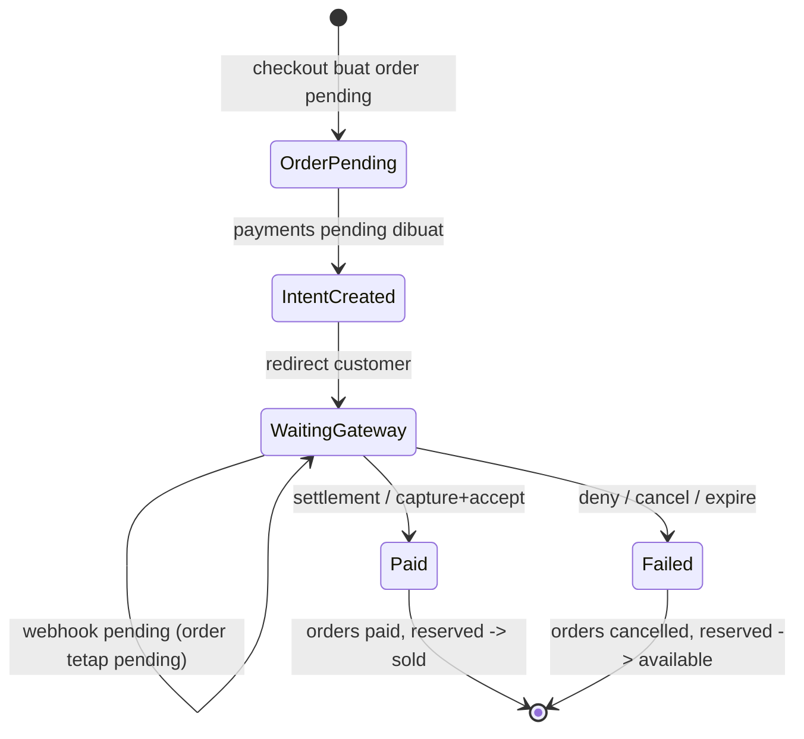

import { Section, Box, Steps, Step, Recap, CardGrid, Card, Chip, Hero, Compare, Endpoint, Def } from "@components";

<Hero eyebrow="Roadmap 5 &middot; Domain Online Shop" title="Domain <em>Payment</em><br />Webhook yang Aman dan Idempotent">
  <p>Payment bukan sekadar redirect ke gateway, melainkan kontrak backend yang harus aman, idempotent, dan bisa diaudit, karena di sini setiap bug berbiaya uang dan stok nyata.</p>
  <Fragment slot="meta">
    <Chip icon="code">Bahasa: <b>Go 1.26</b></Chip>
    <Chip icon="shield">Webhook &amp; Signature</Chip>
    <Chip icon="database">pgx v5</Chip>
    <Chip icon="clock">~70 menit baca</Chip>
  </Fragment>
</Hero>

<Section num="01" id="intro" title="Masalah Payment di Backend Nyata" sub="Redirect berhasil belum tentu uang benar-benar masuk">

<p class="lead">Di frontend React, checkout terlihat selesai saat user kembali dari halaman payment gateway. Tetapi backend tidak boleh percaya redirect itu sebagai bukti pembayaran.</p>

Pada Chapter 4 (Checkout), kita membuat `orders` dengan status awal `pending` dan menyalin total ke `total_rupiah`. Pada Chapter 5 (Inventory), checkout menahan stok: `available_stock` turun, `reserved_stock` naik. Sekarang muncul pertanyaan yang menentukan benar tidaknya uang masuk: kapan order berubah menjadi `paid` dan stok yang ditahan berubah menjadi `sold`? Jawabannya bukan saat user kembali ke aplikasi, melainkan saat gateway mengonfirmasi pembayaran lewat jalur server-to-server.

Dalam online shop skincare, user memilih serum, toner, atau sunscreen, lalu diarahkan ke payment gateway (Midtrans, Xendit, atau sejenis). Setelah itu ada dua jalur informasi yang sering tertukar: **redirect/callback browser** dan **webhook server-to-server**. Redirect berguna untuk pengalaman user. Webhook adalah sumber kebenaran untuk mengubah order menjadi `paid`.

<Box variant="bridge" icon="🌉" label="Jembatan: dari callback frontend ke webhook backend"><p>Di React, "callback" biasanya fungsi yang dipanggil setelah aksi selesai di dalam aplikasi kita. Di payment gateway, webhook adalah HTTP request yang dikirim server gateway ke server kita, dari luar, lewat internet publik. Karena datang dari luar, ia harus diverifikasi (signature), dicatat (event log), dan diproses idempotent. Anggap ia seperti request user anonim, bukan seperti panggilan fungsi internal yang dipercaya.</p></Box>

<Compare aLabel="Frontend redirect / callback" bLabel="Backend webhook" aTone="muted" bTone="violet">
  <Fragment slot="a"><ul><li>User bisa menutup browser, refresh, atau memalsukan query string URL hasil.</li><li>Bisa terpicu tanpa pembayaran benar-benar terjadi (user iseng membuka URL sukses).</li><li>Cocok untuk menampilkan halaman sukses, gagal, atau pending ke user.</li></ul></Fragment>
  <Fragment slot="b"><ul><li>Dikirim dari gateway ke API kita setiap kali status transaksi berubah.</li><li>Ditandatangani (signature) sehingga keasliannya bisa diperiksa.</li><li>Satu-satunya pemicu sah untuk update `payments`, `orders`, dan reservasi inventory.</li></ul></Fragment>
</Compare>

Endpoint minimal pada modul ini:

<Endpoint method="POST" path="/v1/orders/{order_id}/payments" desc="Buat payment intent sebelum user diarahkan ke gateway" />
<Endpoint method="POST" path="/v1/webhooks/midtrans" desc="Terima notifikasi payment gateway secara server-to-server" />
<Endpoint method="GET" path="/v1/payments/{payment_id}" desc="Lihat status payment internal untuk halaman order detail" />

<Box variant="warn" icon="⚠️" label="Aturan produksi nomor satu"><p>Jangan pernah mengubah order menjadi paid hanya karena user diarahkan ke halaman sukses. Ubah status hanya setelah webhook valid (signature dan nominal cocok) atau setelah rekonsiliasi server-to-server memastikan pembayaran memang sukses.</p></Box>

Alur besarnya seperti ini. Perhatikan bahwa garis tebal perubahan state (paid) hanya terjadi di jalur webhook, bukan di jalur redirect.

```mermaid
sequenceDiagram
  participant FE as Frontend React
  participant API as Go API (chi)
  participant DB as PostgreSQL
  participant GW as Payment Gateway

  FE->>API: POST /v1/orders/{order_id}/payments
  API->>DB: INSERT payments (status pending, amount_rupiah)
  API->>GW: create payment request
  GW-->>API: redirect_url + provider_reference
  API-->>FE: payment_url
  Note over FE,GW: user membayar di halaman gateway
  GW-->>FE: redirect ke halaman hasil (UX saja)
  GW->>API: POST /v1/webhooks/midtrans (server-to-server)
  API->>API: verify signature + verify amount
  API->>DB: INSERT payment_events (raw payload)
  API->>DB: BEGIN; update payments, orders, inventories; COMMIT
  API-->>GW: 200 OK
```

<p class="fig-cap"><b>Gambar 1.</b> Redirect membantu UX, webhook menentukan perubahan state backend. Hanya jalur webhook yang menyentuh database bisnis.</p>

</Section>

<Section num="02" id="model-payment" title="Payment Intent, Status, dan Event Log" sub="Tiga tabel kecil, satu kontrak yang bisa diaudit">

<p class="lead">Payment intent adalah catatan niat membayar untuk satu order, dibuat sebelum customer keluar dari aplikasi kita. Event log adalah jejak mentah setiap webhook yang masuk.</p>

<Def term="payment intent"><p>Record internal yang mengikat `order_id`, jumlah yang harus dibayar (`amount_rupiah`), provider gateway, status awal `pending`, dan referensi yang dikirim ke gateway. Ia dibuat lebih dulu agar setiap pembayaran punya jejak internal sebelum user pergi.</p></Def>

<Def term="payment status"><p>State internal pembayaran yang kecil dan stabil: `pending`, `paid`, `failed`, `expired`, `refunded`. State ini adalah hasil pemetaan dari banyak string gateway, bukan string gateway itu sendiri.</p></Def>

<Def term="payment event log"><p>Tabel append-only yang menyimpan setiap webhook yang diterima: raw payload, status validitas signature, provider, referensi transaksi, dan hasil proses. Ia menjadi sumber kebenaran saat audit dan debugging, bukan sekadar log aplikasi yang mudah hilang.</p></Def>

<Box variant="bridge" icon="🌉" label="Jembatan: bukan satu kolom status di tabel orders"><p>Godaan dari Laravel atau monolith PHP adalah menaruh `payment_status` sebagai kolom di tabel `orders` dan meng-update-nya langsung. Di proyek ini, payment punya tabelnya sendiri (`payments`) karena satu order bisa punya beberapa attempt: attempt pertama expired, user coba lagi dengan metode lain. Order hanya peduli sudah `paid` atau belum, sedangkan riwayat percobaan pembayaran hidup di `payments` dan `payment_events`.</p></Box>

Tabel `payments` sudah lahir di Roadmap 3 (Data Modeling). Modul ini memakainya apa adanya dan menambahkan satu tabel baru, `payment_events`, sebagai event log idempotency. Berikut migration tambahannya. Perhatikan: uang memakai `amount_rupiah bigint` (rupiah penuh, bukan cents, bukan float), sesuai aturan keras proyek.

```sql title="db/migrations/024_create_payment_events.up.sql"
-- payments sudah ada sejak migration data modeling:
--   id, order_id, provider, provider_reference, event_id,
--   status ('pending','paid','failed','expired','refunded'),
--   amount_rupiah bigint, raw_payload jsonb, paid_at, created_at, updated_at
-- Index unik penting yang sudah ada:
--   payments_event_id_idx UNIQUE (event_id) WHERE event_id IS NOT NULL
--   payments_provider_reference_idx UNIQUE (provider, provider_reference) WHERE provider_reference IS NOT NULL

CREATE TABLE payment_events (
    id bigint GENERATED ALWAYS AS IDENTITY PRIMARY KEY,
    payment_id bigint REFERENCES payments(id) ON DELETE SET NULL,
    provider TEXT NOT NULL,
    event_key TEXT NOT NULL,
    provider_reference TEXT,
    transaction_id TEXT,
    event_status TEXT NOT NULL,
    signature_valid BOOLEAN NOT NULL DEFAULT false,
    raw_payload JSONB NOT NULL,
    received_at TIMESTAMPTZ NOT NULL DEFAULT now(),
    processed_at TIMESTAMPTZ,
    process_error TEXT,
    UNIQUE (provider, event_key)
);

CREATE INDEX payment_events_payment_id_received_at_idx
    ON payment_events(payment_id, received_at DESC);

CREATE INDEX payments_status_created_at_idx
    ON payments(status, created_at DESC);
```

<Box variant="note" icon="🧾" label="Kenapa raw payload disimpan"><p>Ketika customer service bertanya kenapa order ORD-20260601-0031 belum `paid`, kita membuka `payment_events` dan melihat payload asli dari gateway, lengkap dengan status dan waktu, bukan menebak dari log aplikasi yang sudah ter-rotate. Raw payload juga dibutuhkan beberapa skema signature HMAC yang menghitung hash dari body mentah.</p></Box>

`UNIQUE (provider, event_key)` adalah jantung idempotency modul ini. Kita akan membahasnya detail di section idempotency, tetapi tanamkan dulu: kunci unik di database, bukan di memori aplikasi.

Model Go yang dipakai service. Tag JSON dibuat ringkas, dan uang tetap `int64` rupiah penuh.

```go title="internal/payment/model.go"
package payment

import "time"

// Status adalah state internal pembayaran, hasil pemetaan dari string gateway.
type Status string

const (
	StatusPending  Status = "pending"
	StatusPaid     Status = "paid"
	StatusFailed   Status = "failed"
	StatusExpired  Status = "expired"
	StatusRefunded Status = "refunded"
)

type Payment struct {
	ID                int64     `json:"id"`
	OrderID           int64     `json:"order_id"`
	Provider          string    `json:"provider"`
	ProviderReference string    `json:"provider_reference"`
	EventID           string    `json:"-"`
	Status            Status    `json:"status"`
	AmountRupiah      int64     `json:"amount"`
	PaidAt            *time.Time `json:"paid_at,omitempty"`
	CreatedAt         time.Time `json:"created_at"`
	UpdatedAt         time.Time `json:"updated_at"`
}

type Event struct {
	ID                int64
	PaymentID         *int64
	Provider          string
	EventKey          string
	ProviderReference string
	TransactionID     string
	EventStatus       string
	SignatureValid    bool
	RawPayload        []byte
	ReceivedAt        time.Time
	ProcessedAt       *time.Time
	ProcessError      string
}
```

<Box variant="tip" icon="💡" label="AmountRupiah, bukan AmountCents"><p>Gateway sering mengirim nominal sebagai string desimal seperti `"249000.00"`. Itu format kabel mereka. Di sisi kita, uang selalu `int64` rupiah penuh (`249000`). Konversi terjadi sekali di batas sistem (saat memverifikasi webhook), bukan menyebar ke seluruh domain.</p></Box>

</Section>

<Section num="03" id="create-intent" title="Membuat Payment Intent" sub="Catatan internal lahir sebelum user pergi ke gateway">

<p class="lead">Sebelum mengarahkan customer ke gateway, kita membuat baris `payments` berstatus pending. Ini menjamin setiap pembayaran punya jejak, bahkan jika webhook tiba lebih dulu dari yang kita kira.</p>

Di Laravel, kebiasaannya adalah memanggil SDK gateway langsung di controller. Di Go, kita pisahkan tanggung jawab: handler menerima HTTP, service menyusun alur, repository menyentuh database, dan gateway client bicara ke dunia luar. `context.Context` selalu parameter pertama, error selalu nilai yang diperiksa.

<Box variant="bridge" icon="🌉" label="Jembatan: accept interfaces, return structs"><p>Service tidak bergantung pada struct konkret gateway client, melainkan pada interface kecil `GatewayClient`. Mirip dependency injection di Laravel lewat container, tetapi di Go kontraknya eksplisit dan diketik. Saat testing, kita ganti dengan fake yang memenuhi interface yang sama, tanpa mock framework.</p></Box>

```go title="internal/payment/intent.go"
package payment

import (
	"context"
	"fmt"
)

// GatewayClient bicara ke gateway luar. Service hanya tahu interface ini.
type GatewayClient interface {
	CreateCharge(ctx context.Context, req ChargeRequest) (ChargeResponse, error)
}

type ChargeRequest struct {
	OrderNumber  string
	AmountRupiah int64
	CustomerID   int64
}

type ChargeResponse struct {
	ProviderReference string // id transaksi di sisi gateway
	RedirectURL       string
}

// IntentRepository menyimpan payment intent. Operasi atomik: satu insert.
type IntentRepository interface {
	CreatePending(ctx context.Context, orderID int64, provider, providerReference string, amountRupiah int64) (Payment, error)
}

type IntentService struct {
	repo     IntentRepository
	gateway  GatewayClient
	provider string
}

func NewIntentService(repo IntentRepository, gateway GatewayClient, provider string) *IntentService {
	return &IntentService{repo: repo, gateway: gateway, provider: provider}
}

func (s *IntentService) CreateIntent(ctx context.Context, orderID int64, orderNumber string, amountRupiah int64, customerID int64) (Payment, error) {
	// 1. Minta charge ke gateway dulu supaya kita punya provider_reference.
	res, err := s.gateway.CreateCharge(ctx, ChargeRequest{
		OrderNumber:  orderNumber,
		AmountRupiah: amountRupiah,
		CustomerID:   customerID,
	})
	if err != nil {
		return Payment{}, fmt.Errorf("create gateway charge: %w", err)
	}

	// 2. Simpan payment intent pending dengan referensi gateway.
	//    UNIQUE (provider, provider_reference) menjaga tidak ada intent dobel.
	p, err := s.repo.CreatePending(ctx, orderID, s.provider, res.ProviderReference, amountRupiah)
	if err != nil {
		return Payment{}, fmt.Errorf("create pending payment: %w", err)
	}

	p.ProviderReference = res.ProviderReference
	return p, nil
}
```

```go title="internal/payment/handler_intent.go"
func (h *Handler) CreatePayment(w http.ResponseWriter, r *http.Request) {
	ctx := r.Context()

	orderID, err := strconv.ParseInt(chi.URLParam(r, "order_id"), 10, 64)
	if err != nil {
		writeError(w, http.StatusBadRequest, "invalid order id")
		return
	}

	// order detail diambil dari order service (status harus masih pending).
	order, err := h.orders.GetPayable(ctx, orderID)
	if err != nil {
		writeError(w, http.StatusConflict, "order tidak bisa dibayar")
		return
	}

	p, err := h.intents.CreateIntent(ctx, order.ID, order.Number, order.TotalRupiah, order.CustomerID)
	if err != nil {
		h.logger.ErrorContext(ctx, "create payment intent failed", slog.Int64("order_id", orderID), slog.Any("error", err))
		writeError(w, http.StatusBadGateway, "gagal membuat pembayaran")
		return
	}

	writeJSON(w, http.StatusCreated, map[string]any{
		"payment_id":   p.ID,
		"status":       p.Status,
		"redirect_url": p.ProviderReference, // contoh: url dipetakan dari response gateway
	})
}
```

<Box variant="warn" icon="⚠️" label="Order harus masih boleh dibayar"><p>`GetPayable` wajib menolak order yang sudah `paid`, `cancelled`, atau `expired`. Tanpa cek ini, user bisa membuat banyak intent untuk order yang sudah lunas, dan webhook nyasar bisa membingungkan rekonsiliasi. Idealnya cek dilakukan dengan `SELECT ... FOR UPDATE` pada order agar dua request create-intent tidak berlomba.</p></Box>

</Section>

<Section num="04" id="webhook-aman" title="Webhook yang Aman dan Terverifikasi" sub="Signature dan nominal dulu, business logic belakangan">

<p class="lead">Webhook harus dianggap input publik dari internet, walaupun "katanya" datang dari gateway yang kita percaya. Verifikasi keaslian dan nominal sebelum menyentuh state bisnis.</p>

Provider berbeda punya mekanisme verifikasi berbeda. Midtrans mengirim field `signature_key` pada body notifikasi, dihitung dari `order_id`, `status_code`, `gross_amount`, dan Server Key dengan SHA-512. Xendit umumnya memakai header seperti `x-callback-token` untuk webhook dasar, dan HMAC SHA-256 untuk produk tertentu. Jangan menyalin rumus satu provider ke provider lain. Buat satu adapter verifikasi per provider.

<Box variant="tip" icon="💡" label="Tiga lapis pemeriksaan, berurutan"><p>Verifikasi webhook bukan satu cek, melainkan tiga: (1) signature valid (keaslian), (2) nominal cocok dengan `amount_rupiah` internal (anti payload nominal lain), (3) idempotency lewat event log (anti dobel). Ketiganya berurutan dan gagal di mana pun harus menghentikan proses sebelum menyentuh order.</p></Box>

Contoh notifikasi Midtrans. `gross_amount` adalah string desimal, inilah yang dipakai di rumus signature persis seperti yang dikirim.

```json title="contoh-midtrans-notification.json"
{
  "order_id": "ORD-20260601-0031",
  "transaction_id": "513f1f01-c9da-474c-9fc9-d5c64364b709",
  "transaction_status": "settlement",
  "status_code": "200",
  "gross_amount": "249000.00",
  "signature_key": "2496c78c...cca6eed3",
  "payment_type": "bank_transfer",
  "fraud_status": "accept",
  "currency": "IDR"
}
```

Helper verifikasi signature. Bandingkan dengan `subtle.ConstantTimeCompare`, bukan `==`, agar tidak bocor lewat timing.

```go title="internal/payment/signature.go"
package payment

import (
	"crypto/hmac"
	"crypto/sha256"
	"crypto/sha512"
	"crypto/subtle"
	"encoding/hex"
	"strings"
)

type MidtransNotification struct {
	OrderID           string `json:"order_id"`
	TransactionID     string `json:"transaction_id"`
	TransactionStatus string `json:"transaction_status"`
	StatusCode        string `json:"status_code"`
	GrossAmount       string `json:"gross_amount"`
	SignatureKey      string `json:"signature_key"`
	PaymentType       string `json:"payment_type"`
	FraudStatus       string `json:"fraud_status"`
	Currency          string `json:"currency"`
}

// VerifyMidtransSignature: SHA512(order_id + status_code + gross_amount + serverKey).
func VerifyMidtransSignature(n MidtransNotification, serverKey string) bool {
	message := n.OrderID + n.StatusCode + n.GrossAmount + serverKey
	sum := sha512.Sum512([]byte(message))
	expected := hex.EncodeToString(sum[:])
	return subtle.ConstantTimeCompare([]byte(expected), []byte(n.SignatureKey)) == 1
}

// VerifyHMACSHA256Hex: untuk provider yang menandatangani body mentah.
func VerifyHMACSHA256Hex(body []byte, headerSig string, secret []byte) bool {
	provided, err := hex.DecodeString(strings.TrimPrefix(headerSig, "sha256="))
	if err != nil {
		return false
	}
	mac := hmac.New(sha256.New, secret)
	mac.Write(body)
	return hmac.Equal(provided, mac.Sum(nil))
}

// VerifyStaticToken: untuk webhook bertoken header (mis. x-callback-token).
func VerifyStaticToken(provided, expected string) bool {
	if provided == "" || expected == "" {
		return false
	}
	return subtle.ConstantTimeCompare([]byte(provided), []byte(expected)) == 1
}
```

<Box variant="warn" icon="⚠️" label="Jangan pakai a == b untuk secret"><p>Perbandingan string biasa berhenti di byte pertama yang berbeda, sehingga waktunya bocor sedikit demi sedikit dan bisa dipakai menebak signature. Untuk signature dan token, selalu `hmac.Equal` atau `subtle.ConstantTimeCompare`.</p></Box>

Selain signature, cocokkan nominal. Inilah pengaman yang sering terlewat: tanpa cek nominal, payload yang valid signature-nya tapi untuk jumlah lain bisa menandai order `paid` dengan bayaran kurang. Kita parse `gross_amount` (desimal) ke rupiah penuh dan bandingkan dengan `amount_rupiah` internal.

```go title="internal/payment/amount.go"
package payment

import (
	"fmt"
	"math/big"
	"strings"
)

// parseGrossAmountRupiah mengubah "249000.00" menjadi 249000 (rupiah penuh).
// IDR tidak punya pecahan, jadi bagian desimal harus nol.
func parseGrossAmountRupiah(gross string) (int64, error) {
	rat, ok := new(big.Rat).SetString(strings.TrimSpace(gross))
	if !ok {
		return 0, fmt.Errorf("gross_amount tidak valid: %q", gross)
	}
	if !rat.IsInt() {
		return 0, fmt.Errorf("gross_amount IDR tidak boleh pecahan: %q", gross)
	}
	return rat.Num().Int64(), nil
}

// AmountMatches membandingkan nominal gateway dengan amount_rupiah internal.
func AmountMatches(gross string, internalRupiah int64) bool {
	got, err := parseGrossAmountRupiah(gross)
	if err != nil {
		return false
	}
	return got == internalRupiah
}
```

Handler webhook sebaiknya kecil dan eksplisit. Ia membaca raw body, memverifikasi, lalu menyerahkan ke service. Pekerjaan berat (cocokkan nominal, idempotency, transaksi) hidup di service, bukan di handler.

```go title="internal/payment/handler_webhook.go"
package payment

import (
	"context"
	"encoding/json"
	"errors"
	"io"
	"log/slog"
	"net/http"
)

type WebhookService interface {
	HandleMidtransWebhook(ctx context.Context, raw []byte, n MidtransNotification) error
	RecordRejectedWebhook(ctx context.Context, provider string, raw []byte, reason string) error
}

type Handler struct {
	service           WebhookService
	logger            *slog.Logger
	midtransServerKey string
}

func (h *Handler) MidtransWebhook(w http.ResponseWriter, r *http.Request) {
	ctx := r.Context()
	r.Body = http.MaxBytesReader(w, r.Body, 1<<20) // 1 MiB, batas wajar untuk notifikasi.

	raw, err := io.ReadAll(r.Body)
	if err != nil {
		http.Error(w, "payload too large", http.StatusRequestEntityTooLarge)
		return
	}

	var n MidtransNotification
	if err := json.Unmarshal(raw, &n); err != nil {
		http.Error(w, "invalid json", http.StatusBadRequest)
		return
	}

	if !VerifyMidtransSignature(n, h.midtransServerKey) {
		_ = h.service.RecordRejectedWebhook(ctx, "midtrans", raw, "invalid signature")
		h.logger.WarnContext(ctx, "webhook signature rejected", slog.String("order_id", n.OrderID))
		http.Error(w, "invalid signature", http.StatusUnauthorized)
		return
	}

	if err := h.service.HandleMidtransWebhook(ctx, raw, n); err != nil {
		switch {
		case errors.Is(err, ErrDuplicateWebhook):
			w.WriteHeader(http.StatusOK) // sudah diproses, jangan suruh gateway retry.
		case errors.Is(err, ErrAmountMismatch):
			_ = h.service.RecordRejectedWebhook(ctx, "midtrans", raw, "amount mismatch")
			http.Error(w, "amount mismatch", http.StatusUnprocessableEntity)
		default:
			h.logger.ErrorContext(ctx, "webhook processing failed", slog.String("order_id", n.OrderID), slog.Any("error", err))
			http.Error(w, "webhook failed", http.StatusInternalServerError)
		}
		return
	}

	w.WriteHeader(http.StatusOK)
}
```

<Box variant="note" icon="🧠" label="Balas cepat, kerja berat ke worker"><p>Gateway akan retry jika endpoint tidak membalas 2xx dalam batas waktunya. Cukup simpan state lalu balas 200. Pekerjaan lambat (kirim email invoice, generate PDF, push notification) di-enqueue ke background worker dari Roadmap 4, bukan dikerjakan inline di handler.</p></Box>

</Section>

<Section num="05" id="idempotency" title="Idempotency lewat Event Log" sub="Webhook yang sama bisa datang berkali-kali">

<p class="lead">Idempotency berarti payload yang sama boleh tiba berkali-kali tanpa membuat order dobel paid, stok dobel sold, atau email dobel terkirim. Ini bukan kasus tepi, ini perilaku normal gateway.</p>

Gateway mengirim ulang webhook karena banyak sebab: response kita bukan 2xx, timeout jaringan, atau status memang berubah (pending lalu settlement). Karena itu, idempotency tidak cukup hanya mengecek "order sudah paid". Kita butuh kunci unik di database yang mewakili satu event spesifik.

<Box variant="bridge" icon="🌉" label="Jembatan: bukan Set di memori, tapi UNIQUE di database"><p>Refleks pertama developer JS sering `const seen = new Set()` atau cache di memori. Itu hilang saat proses restart dan tidak aman saat API berjalan di beberapa instance (di belakang load balancer, dua webhook bisa masuk ke pod berbeda). Idempotency yang benar berlabuh di constraint database: `UNIQUE (provider, event_key)`. Database adalah satu-satunya state yang dibagi semua instance.</p></Box>

Pola yang aman, langkah demi langkah:

<Steps>
  <Step><b>Baca raw body</b><p>Dibutuhkan untuk audit dan untuk skema signature HMAC yang menghitung hash dari body mentah.</p></Step>
  <Step><b>Verifikasi signature</b><p>Webhook invalid dicatat sebagai rejected lewat `RecordRejectedWebhook` dan tidak pernah menyentuh order.</p></Step>
  <Step><b>Susun event_key</b><p>Untuk Midtrans, kunci praktis adalah gabungan `transaction_id`, `transaction_status`, dan `fraud_status`. Status berbeda untuk transaksi sama adalah event berbeda yang sah.</p></Step>
  <Step><b>Insert event dengan ON CONFLICT DO NOTHING</b><p>Jika kena UNIQUE constraint, event sudah pernah masuk. Balas 200, jangan proses ulang.</p></Step>
  <Step><b>Lock payment FOR UPDATE</b><p>Ambil baris `payments` dengan `FOR UPDATE` supaya dua webhook concurrent untuk order sama tidak meng-update bersamaan.</p></Step>
  <Step><b>Apply transition</b><p>Update payment, order, dan inventory hanya jika transition sah, semua dalam transaksi yang sama.</p></Step>
</Steps>

<Box variant="warn" icon="⚠️" label="Kenapa event_key bukan hanya transaction_id"><p>Satu transaksi melewati beberapa status: `pending` lalu `settlement`. Kalau `event_key` hanya `transaction_id`, webhook `settlement` yang sah akan ditolak sebagai duplikat dari webhook `pending` sebelumnya. Sertakan status di dalam kunci agar event yang berbeda tetap bisa masuk, tetapi pengiriman ulang event yang sama persis tetap ditolak.</p></Box>

Repository insert event idempotent dan lock payment. Keduanya menerima `pgx.Tx` sehingga ikut transaksi yang sama (accept interfaces, di sini interface adalah `pgx.Tx`).

```go title="internal/payment/repository.go"
package payment

import (
	"context"

	"github.com/jackc/pgx/v5"
)

type PgRepository struct{}

// InsertEvent mengembalikan true bila event baru, false bila duplikat.
func (r *PgRepository) InsertEvent(ctx context.Context, tx pgx.Tx, e Event) (bool, error) {
	const q = `
INSERT INTO payment_events
  (payment_id, provider, event_key, provider_reference, transaction_id, event_status, signature_valid, raw_payload)
VALUES ($1, $2, $3, $4, $5, $6, $7, $8::jsonb)
ON CONFLICT (provider, event_key) DO NOTHING`

	tag, err := tx.Exec(ctx, q,
		e.PaymentID, e.Provider, e.EventKey, e.ProviderReference,
		e.TransactionID, e.EventStatus, e.SignatureValid, e.RawPayload,
	)
	if err != nil {
		return false, err
	}
	return tag.RowsAffected() == 1, nil
}

// LockByProviderReference mengunci baris payments untuk transaksi ini.
func (r *PgRepository) LockByProviderReference(ctx context.Context, tx pgx.Tx, provider, ref string) (Payment, error) {
	const q = `
SELECT id, order_id, provider, provider_reference, status, amount_rupiah, paid_at, created_at, updated_at
FROM payments
WHERE provider = $1 AND provider_reference = $2
FOR UPDATE`

	var p Payment
	err := tx.QueryRow(ctx, q, provider, ref).Scan(
		&p.ID, &p.OrderID, &p.Provider, &p.ProviderReference,
		&p.Status, &p.AmountRupiah, &p.PaidAt, &p.CreatedAt, &p.UpdatedAt,
	)
	if err != nil {
		return Payment{}, err
	}
	return p, nil
}
```

<Box variant="tip" icon="✅" label="Duplikat tetap dibalas 200"><p>Kalau event sudah pernah diproses, balas 200, bukan 409 atau 500. Status error membuat gateway menganggap pengiriman gagal lalu retry lagi tanpa henti. 200 berarti "sudah saya terima dan saya tahu ini sama", persis yang gateway butuhkan untuk berhenti.</p></Box>

</Section>

<Section num="06" id="update-order" title="Satu Transaksi: Payment, Order, Inventory" sub="Tiga tabel berubah bersama atau tidak sama sekali">

<p class="lead">Webhook paid bukan hanya mengubah `payments`. Ia memindahkan order ke `paid` dan mengonfirmasi reservasi inventory menjadi sold. Ketiganya harus dalam satu transaksi database.</p>

Mengingat alurnya: Chapter 4 membuat order `pending` dengan `total_rupiah`. Chapter 5 menahan stok lewat `reserved_stock`. Modul ini menutup loop: saat pembayaran sukses, `reserved_stock` turun dan `sold_stock` naik, sambil order menjadi `paid`. Jika salah satu langkah gagal, semua harus batal, karena order paid tanpa konfirmasi stok adalah overselling, dan stok sold tanpa order paid adalah kehilangan barang.



<p class="fig-cap"><b>Gambar 2.</b> State payment menghubungkan order pending, reservasi inventory, dan penyelesaian akhir. Transition ke Paid dan Failed terjadi dalam satu transaksi.</p>

Service yang merangkai semuanya. Perhatikan urutan: insert event (idempotency), lock payment, cek nominal, lalu apply transition lewat order dan inventory service. Semua memakai `tx` yang sama.

```go title="internal/payment/service.go"
package payment

import (
	"context"
	"errors"
	"strings"
	"time"

	"github.com/jackc/pgx/v5"
	"github.com/jackc/pgx/v5/pgxpool"
)

var (
	ErrDuplicateWebhook = errors.New("duplicate payment webhook")
	ErrAmountMismatch   = errors.New("webhook amount mismatch")
)

type Repository interface {
	InsertEvent(ctx context.Context, tx pgx.Tx, e Event) (bool, error)
	LockByProviderReference(ctx context.Context, tx pgx.Tx, provider, ref string) (Payment, error)
	MarkPaid(ctx context.Context, tx pgx.Tx, paymentID int64, txnID string, at time.Time) error
	MarkFailed(ctx context.Context, tx pgx.Tx, paymentID int64, status Status, at time.Time) error
	MarkEventProcessed(ctx context.Context, tx pgx.Tx, provider, eventKey string) error
}

type OrderService interface {
	MarkPaid(ctx context.Context, tx pgx.Tx, orderID int64, at time.Time) error
	Cancel(ctx context.Context, tx pgx.Tx, orderID int64) error
}

type InventoryService interface {
	ConfirmReservation(ctx context.Context, tx pgx.Tx, orderID int64) error
	ReleaseReservation(ctx context.Context, tx pgx.Tx, orderID int64) error
}

type Service struct {
	pool      *pgxpool.Pool
	repo      Repository
	orders    OrderService
	inventory InventoryService
}

func (s *Service) HandleMidtransWebhook(ctx context.Context, raw []byte, n MidtransNotification) error {
	tx, err := s.pool.Begin(ctx)
	if err != nil {
		return err
	}
	defer tx.Rollback(ctx) // no-op setelah Commit; aman jika ada early return.

	eventKey := strings.Join([]string{n.TransactionID, n.TransactionStatus, n.FraudStatus}, ":")
	inserted, err := s.repo.InsertEvent(ctx, tx, Event{
		Provider:          "midtrans",
		EventKey:          eventKey,
		ProviderReference: n.TransactionID,
		TransactionID:     n.TransactionID,
		EventStatus:       n.TransactionStatus,
		SignatureValid:    true,
		RawPayload:        raw,
	})
	if err != nil {
		return err
	}
	if !inserted {
		return ErrDuplicateWebhook
	}

	p, err := s.repo.LockByProviderReference(ctx, tx, "midtrans", n.TransactionID)
	if err != nil {
		return err
	}

	// Pengaman nominal: payload sah signature-nya pun ditolak jika jumlah beda.
	if !AmountMatches(n.GrossAmount, p.AmountRupiah) {
		return ErrAmountMismatch
	}

	now := time.Now().UTC()
	switch MapMidtransStatus(n) {
	case StatusPaid:
		if p.Status != StatusPaid { // idempotent: skip jika sudah paid.
			if err := s.repo.MarkPaid(ctx, tx, p.ID, n.TransactionID, now); err != nil {
				return err
			}
			if err := s.orders.MarkPaid(ctx, tx, p.OrderID, now); err != nil {
				return err
			}
			if err := s.inventory.ConfirmReservation(ctx, tx, p.OrderID); err != nil {
				return err
			}
		}
	case StatusFailed, StatusExpired:
		if p.Status == StatusPending { // hanya dari pending; jangan batalkan yang sudah paid.
			if err := s.repo.MarkFailed(ctx, tx, p.ID, MapMidtransStatus(n), now); err != nil {
				return err
			}
			if err := s.orders.Cancel(ctx, tx, p.OrderID); err != nil {
				return err
			}
			if err := s.inventory.ReleaseReservation(ctx, tx, p.OrderID); err != nil {
				return err
			}
		}
	}

	if err := s.repo.MarkEventProcessed(ctx, tx, "midtrans", eventKey); err != nil {
		return err
	}
	return tx.Commit(ctx)
}

// MapMidtransStatus memetakan string gateway ke status internal yang kecil.
func MapMidtransStatus(n MidtransNotification) Status {
	switch n.TransactionStatus {
	case "capture":
		if n.FraudStatus == "accept" {
			return StatusPaid
		}
		return StatusPending // challenge: tunggu keputusan fraud.
	case "settlement":
		return StatusPaid
	case "deny", "cancel", "failure":
		return StatusFailed
	case "expire":
		return StatusExpired
	case "refund", "partial_refund":
		return StatusRefunded
	default:
		return StatusPending
	}
}
```

<Box variant="bridge" icon="🌉" label="Jembatan: dari Eloquent transaction ke pgx.Tx"><p>Di Laravel, `DB::transaction(fn () => ...)` membungkus closure dan commit otomatis di akhir. Di Go, kita pegang transaksi eksplisit: `Begin`, `defer Rollback`, lalu `Commit` di jalur sukses. `defer tx.Rollback(ctx)` aman dipasang selalu, karena Rollback setelah Commit hanya menghasilkan error yang sengaja kita abaikan. Pola ini membuat setiap early return otomatis membatalkan transaksi.</p></Box>

SQL untuk transition paid, idempotent lewat klausa `WHERE` status. Update hanya berlaku jika baris masih dalam state yang benar.

```sql title="internal/payment/sql/mark_paid.sql"
-- 1. payments: pending -> paid (idempotent, tidak menimpa paid lama)
UPDATE payments
SET status = 'paid', provider_reference = $2, paid_at = $3, updated_at = now()
WHERE id = $1 AND status = 'pending';

-- 2. orders: pending -> paid
UPDATE orders
SET status = 'paid', updated_at = now()
WHERE id = $1 AND status = 'pending';

-- 3. inventories: konfirmasi reservasi menjadi sold
UPDATE inventories i
SET reserved_stock = i.reserved_stock - oi.quantity,
    sold_stock     = i.sold_stock + oi.quantity,
    updated_at     = now()
FROM order_items oi
WHERE oi.order_id = $1 AND oi.variant_id = i.variant_id;
```

<Box variant="warn" icon="⚠️" label="Jangan pernah dua transaksi terpisah"><p>Update payment paid di satu transaksi lalu inventory di transaksi lain adalah resep inkonsistensi: jika proses crash di tengah, order tampak paid tetapi stok tidak terkonfirmasi. Payment, order, dan inventory adalah satu unit atomik. Satu `Begin`, satu `Commit`.</p></Box>

</Section>

<Section num="07" id="rekonsiliasi" title="Rekonsiliasi Payment" sub="Webhook cepat, laporan gateway tetap perlu dibandingkan">

<p class="lead">Rekonsiliasi memastikan status internal kita cocok dengan status di gateway. Webhook bisa terlambat, endpoint bisa sempat down, atau ada status yang berubah setelah event awal terlewat.</p>

Sistem pembayaran yang sehat tidak hanya bergantung pada webhook. Minimal ada command harian (atau worker terjadwal) yang membaca payment `pending` lama lalu membandingkannya ke status inquiry gateway. Tiga jenis ketidakcocokan yang dicari:

<CardGrid cols={3}>
  <Card><h4>Status mismatch</h4><p>Gateway sudah `settlement`, tetapi `payments.status` internal masih `pending` karena webhook hilang.</p></Card>
  <Card><h4>Amount mismatch</h4><p>Nominal di gateway tidak sama dengan `payments.amount_rupiah` atau `orders.total_rupiah`.</p></Card>
  <Card><h4>Missing event</h4><p>Pembayaran ada di report gateway, tetapi tidak ada raw webhook di `payment_events`.</p></Card>
</CardGrid>

Query kandidat rekonsiliasi: payment yang sudah lama menggantung di `pending`.

```sql title="internal/payment/sql/reconcile_candidates.sql"
SELECT id, order_id, provider, provider_reference, amount_rupiah, status, created_at
FROM payments
WHERE status = 'pending'
  AND created_at < now() - INTERVAL '30 minutes'
ORDER BY created_at ASC
LIMIT 100;
```

Command rekonsiliasi adalah program Go biasa dengan `main()` sendiri, seperti pola worker di Roadmap 4. Ia mengambil kandidat, bertanya ke gateway, lalu memutuskan: yang aman diperbaiki otomatis (mis. menandai paid jika gateway settlement dan nominal cocok), yang meragukan dilaporkan untuk dicek manusia.

```go title="cmd/reconcile-payments/main.go"
package main

import (
	"context"
	"log/slog"
	"os"
	"time"
)

func main() {
	ctx, cancel := context.WithTimeout(context.Background(), 2*time.Minute)
	defer cancel()

	logger := slog.New(slog.NewJSONHandler(os.Stdout, nil))
	if err := run(ctx, logger); err != nil {
		logger.ErrorContext(ctx, "payment reconciliation failed", slog.Any("error", err))
		os.Exit(1)
	}
}

func run(ctx context.Context, logger *slog.Logger) error {
	// 1. SELECT kandidat: payments pending > 30 menit.
	// 2. Untuk tiap kandidat, panggil status inquiry gateway.
	// 3. Bandingkan status, amount_rupiah, dan order_id.
	// 4. Mismatch aman -> proses ulang lewat jalur yang sama dengan webhook
	//    (insert synthetic event + transition dalam satu transaksi).
	// 5. Mismatch berbahaya (nominal beda) -> tulis ke laporan, jangan auto-fix.
	logger.InfoContext(ctx, "reconciliation finished",
		slog.Int("checked", 0), slog.Int("fixed", 0), slog.Int("flagged", 0))
	return nil
}
```

<Box variant="bridge" icon="🌉" label="Jembatan: settlement report yang dijadikan kode"><p>Di tim PHP, rekonsiliasi sering berupa orang yang mengunduh report dari dashboard gateway lalu mencocokkan di spreadsheet. Pekerjaan itu tetap perlu, tetapi di backend Go kita jadikan repeatable: satu command yang sama setiap hari, hasilnya bisa di-log dan dipantau, dan keputusan auto-fix dibatasi pada kasus yang benar-benar aman.</p></Box>

<Box variant="tip" icon="💡" label="Auto-fix lewat jalur yang sama"><p>Saat rekonsiliasi menemukan payment yang seharusnya paid, jangan tulis UPDATE ad-hoc terpisah. Bentuk synthetic event lalu lewatkan ke service transition yang sama dengan webhook. Dengan begitu idempotency, lock, dan atomicity yang sudah teruji ikut terpakai, dan event tercatat di `payment_events`.</p></Box>

</Section>

<Section num="08" id="hands-on" title="Hands-on Ringan" sub="Bangun versi kecil sebelum integrasi SDK sungguhan">

<p class="lead">Hands-on ini membangun fondasi payment tanpa perlu akun gateway. Fokusnya pada idempotency dan atomicity, dua hal yang paling sering salah.</p>

<Steps>
  <Step><b>Jalankan migration</b><p>Tambahkan tabel `payment_events`. Tabel `payments` sudah ada dari Roadmap 3.</p></Step>
  <Step><b>Endpoint create intent</b><p>Cukup buat baris `payments` pending dan kembalikan `redirect_url` dummy.</p></Step>
  <Step><b>Endpoint webhook Midtrans</b><p>Terima JSON, verifikasi `signature_key`, cocokkan `gross_amount` dengan `amount_rupiah`, lalu insert event.</p></Step>
  <Step><b>Simulasikan duplikat</b><p>Kirim payload identik dua kali. Pastikan order tidak berubah dua kali.</p></Step>
  <Step><b>Simulasikan settlement</b><p>Ubah payment, order, dan inventory dalam satu transaksi, lalu cek hasilnya.</p></Step>
</Steps>

Untuk membuat `signature_key` yang valid bagi payload uji, hitung SHA-512 dari `order_id + status_code + gross_amount + serverKey`:

```bash title="Terminal"
ORDER_ID="ORD-20260601-0031"
STATUS_CODE="200"
GROSS="249000.00"
SERVER_KEY="SB-Mid-server-DUMMYKEY"
printf '%s' "${ORDER_ID}${STATUS_CODE}${GROSS}${SERVER_KEY}" | sha512sum | awk '{print $1}'
```

Payload simulasi (ganti `signature_key` dengan hasil perintah di atas):

```json title="tmp/midtrans-settlement.json"
{
  "order_id": "ORD-20260601-0031",
  "transaction_id": "tx-skincare-001",
  "transaction_status": "settlement",
  "status_code": "200",
  "gross_amount": "249000.00",
  "signature_key": "ISI_DENGAN_HASH_SHA512",
  "payment_type": "bank_transfer",
  "fraud_status": "accept",
  "currency": "IDR"
}
```

Kirim dua kali untuk menguji idempotency:

```bash title="Terminal"
curl -X POST 'http://localhost:8080/v1/webhooks/midtrans' \
  -H 'Content-Type: application/json' --data @tmp/midtrans-settlement.json

curl -X POST 'http://localhost:8080/v1/webhooks/midtrans' \
  -H 'Content-Type: application/json' --data @tmp/midtrans-settlement.json
```

Verifikasi hasil. Setelah dua request, payment harus `paid` sekali, dan hanya ada satu efek bisnis.

```sql title="cek-hasil.sql"
SELECT status, provider_reference, paid_at
FROM payments WHERE order_id = (SELECT id FROM orders WHERE number = 'ORD-20260601-0031');

SELECT event_key, event_status, signature_valid, processed_at
FROM payment_events ORDER BY received_at DESC;

SELECT status FROM orders WHERE number = 'ORD-20260601-0031';
```

<Box variant="tip" icon="💡" label="Target hands-on"><p>Request pertama memproses event dan menandai paid. Request kedua mendapat 200, tetapi tidak menambah efek baru: `payment_events` punya satu baru, order tetap `paid` sekali, dan stok hanya berpindah ke sold satu kali. Inilah idempotency yang berlabuh di `UNIQUE (provider, event_key)`.</p></Box>

</Section>

<Section num="09" id="jebakan" title="Jebakan Umum" sub="Bug payment mahal karena efeknya uang dan stok">

<p class="lead">Pendatang dari JS/PHP biasanya cepat membuat endpoint payment, tetapi mudah melewatkan detail operasional yang membuat sistem aman.</p>

<Compare aLabel="Kebiasaan berisiko" bLabel="Pola Go yang lebih aman" aTone="red" bTone="teal">
  <Fragment slot="a"><ul><li>Tandai order paid dari halaman redirect sukses.</li><li>Percaya signature valid tanpa cek nominal.</li><li>Idempotency pakai Set/cache di memori.</li><li>Update payment dan inventory di transaksi terpisah.</li><li>Sebar string gateway (settlement, expire) ke seluruh domain.</li></ul></Fragment>
  <Fragment slot="b"><ul><li>Tandai paid hanya dari webhook valid atau rekonsiliasi.</li><li>Cek signature dan `amount_rupiah` sebelum transition.</li><li>Idempotency lewat `UNIQUE (provider, event_key)`.</li><li>Payment, order, inventory dalam satu `pgx.Tx`.</li><li>Petakan ke `Status` internal yang kecil dan stabil.</li></ul></Fragment>
</Compare>

Daftar jebakan yang wajib dihindari:

<ul>
  <li><strong>Tidak verifikasi signature.</strong> Endpoint webhook itu publik. Tolak payload palsu sebelum menyentuh state bisnis, dan catat penolakannya di `payment_events`.</li>
  <li><strong>Lupa cek nominal.</strong> Signature valid hanya membuktikan keaslian pengirim, bukan jumlahnya. Cocokkan `gross_amount` dengan `amount_rupiah` agar payload nominal kurang tidak melunasi order.</li>
  <li><strong>Idempotency hanya di memori.</strong> Map atau Set global hilang saat restart dan tidak aman saat API punya beberapa instance. Pakai constraint database.</li>
  <li><strong>event_key salah desain.</strong> Unik hanya pada `transaction_id` menolak transition sah `pending` lalu `settlement`. Sertakan status di kunci.</li>
  <li><strong>Balas non-2xx untuk duplikat.</strong> 409 atau 500 membuat gateway retry tanpa henti. Duplikat yang sudah diproses harus dibalas 200.</li>
  <li><strong>Webhook mengerjakan tugas lambat.</strong> Invoice PDF, email, push notification masuk background worker, bukan inline di handler.</li>
  <li><strong>Secret masuk log.</strong> Jangan pernah log Server Key, callback token, Authorization header, atau raw signature secret.</li>
  <li><strong>Tidak punya rekonsiliasi.</strong> Webhook bisa hilang. Finance tetap butuh pembanding terhadap report gateway.</li>
</ul>

<Box variant="warn" icon="⚠️" label="Uang pakai int64 rupiah, bukan float, bukan cents"><p>Generator awal sering memakai `amount_cents` atau `gross_amount` float di domain. Di proyek ini, uang internal selalu `int64` rupiah penuh (`amount_rupiah`, `total_rupiah`). String desimal dari gateway dikonversi sekali di batas sistem lewat `parseGrossAmountRupiah`, lalu tidak pernah dibawa sebagai float ke mana pun.</p></Box>

</Section>

<Section num="10" id="ringkasan" title="Ringkasan & Poin Penting">

<p class="lead">Domain payment adalah penjaga batas antara checkout internal dan realitas uang di gateway eksternal. Aman, idempotent, dan bisa diaudit adalah tiga sifat yang tidak bisa ditawar.</p>

<Recap title="Yang Wajib Menempel"><ul><li>Payment intent (`payments` status `pending`) dibuat sebelum redirect, agar tiap pembayaran punya jejak internal sejak awal.</li><li>Status internal kecil dan stabil: `pending`, `paid`, `failed`, `expired`, `refunded`. String gateway dipetakan, bukan disebar.</li><li>Webhook diverifikasi tiga lapis berurutan: signature valid, nominal cocok dengan `amount_rupiah`, lalu idempotency lewat event log.</li><li>Signature dibandingkan dengan `hmac.Equal` atau `subtle.ConstantTimeCompare`, bukan `==`.</li><li>Idempotency berlabuh di `UNIQUE (provider, event_key)` pada `payment_events`, bukan di memori aplikasi.</li><li>Duplikat yang sudah diproses dibalas 200 agar gateway berhenti retry.</li><li>Payment success mengubah `payments`, `orders`, dan reservasi inventory dalam satu `pgx.Tx`: reserved turun, sold naik, order paid.</li><li>Rekonsiliasi membandingkan internal dengan status inquiry gateway, dan auto-fix lewat jalur transition yang sama dengan webhook.</li></ul></Recap>

Dalam proyek online shop skincare, modul ini menutup loop yang dibuka dua chapter sebelumnya. Checkout (Chapter 4) membuat order `pending` dan inventory (Chapter 5) menahan stok. Webhook payment yang valid di modul ini mengubah order menjadi `paid` dan mengonfirmasi stok menjadi sold dalam satu transaksi. Setelah order benar-benar dibayar, jalur Roadmap 5 berlanjut ke order lifecycle dan fulfillment (Chapter 7), lalu promosi, review, dan back office. Pada Roadmap 6, alur webhook ini menjadi bahan utama integration test, dan pada Roadmap 7 kita memperketat sisi keamanannya (secret management, signature edge case, anti-replay).

</Section>
