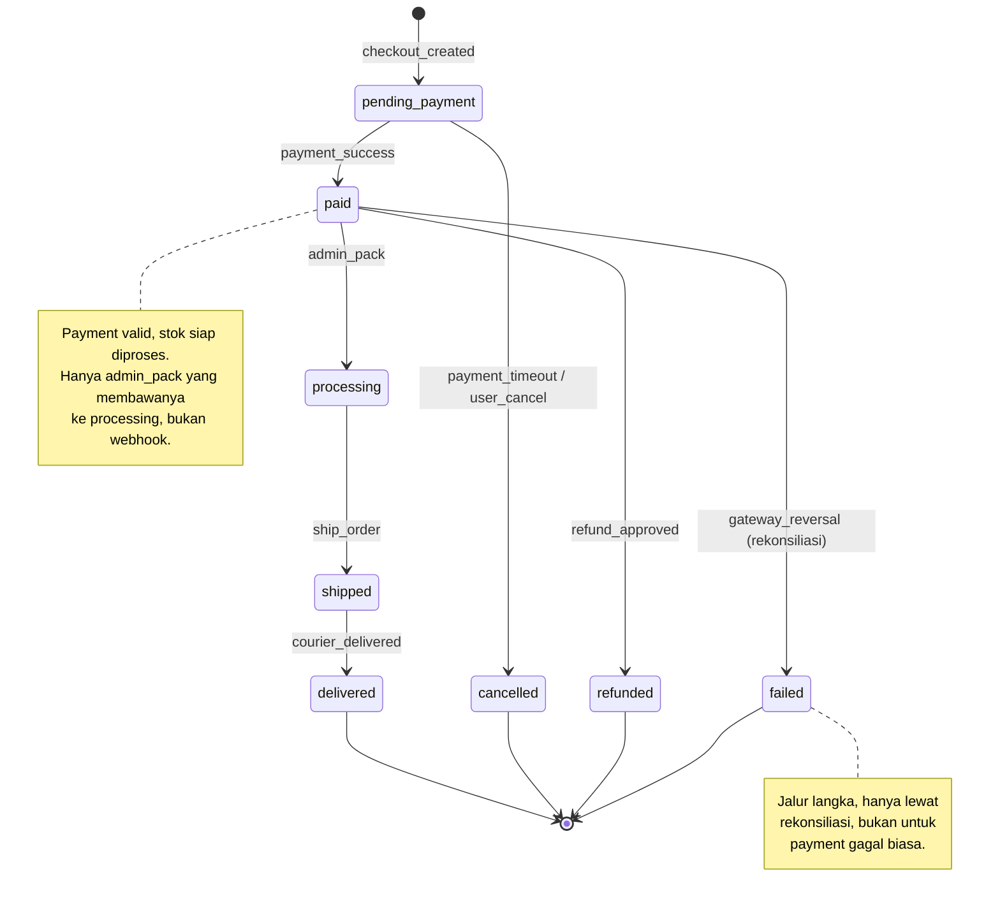
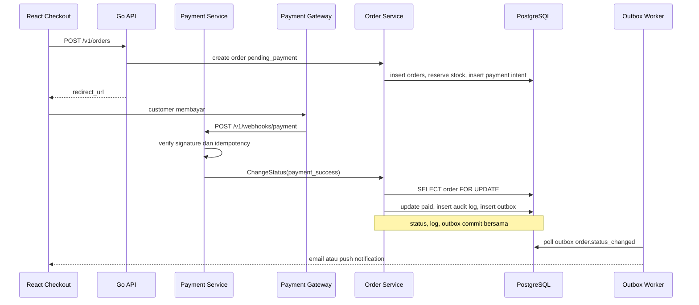

import { Section, Box, Steps, Step, Recap, CardGrid, Card, Chip, Hero, Compare, FileTree, Endpoint, Def } from "@components";

<Hero eyebrow="Roadmap 5 &middot; Domain Mastery" title="Order <em>Lifecycle</em><br />State Machine yang Aman">
  <p>Order bukan sekadar baris di tabel, ia adalah perjalanan bisnis dengan aturan transisi yang harus dijaga oleh domain, bukan oleh handler yang berserakan.</p>
  <Fragment slot="meta">
    <Chip icon="code">Bahasa: <b>Go 1.26</b></Chip>
    <Chip icon="database">Status: <b>state machine</b></Chip>
    <Chip icon="shield">Atomik &amp; teraudit</Chip>
    <Chip icon="clock">~70 menit baca</Chip>
  </Fragment>
</Hero>

<Section num="01" id="intro" title="Kenapa Order Lifecycle Penting?" sub="Di backend, status order adalah kontrak bisnis, bukan label di UI">

<p class="lead">Di frontend React, status order sering terlihat seperti badge berwarna di kartu pesanan. Di backend, status itu adalah kontrak: ia menentukan apakah stok boleh dilepas, apakah refund boleh diproses, dan apakah customer pantas menerima email "pesananmu dikirim".</p>

Pada online shop skincare, satu order melewati banyak aktor: customer yang checkout, payment gateway yang mengirim webhook, admin warehouse yang packing, kurir yang mengantar, dan tim support yang menangani komplain. Setiap aktor ingin mengubah status. Tanpa aturan terpusat, bug kecil bisa membuat order yang sudah `shipped` kembali ke `pending_payment`, stok terkunci selamanya karena reservasi tidak pernah dilepas, atau customer menerima notifikasi refund untuk uang yang tidak pernah dikembalikan.

<Box variant="bridge" icon="🌉" label="Jembatan: dari React state ke domain state"><p>Di React, state berubah lewat event handler dan efeknya berhenti di layar (re-render). Di Go, status order juga berubah karena event, tetapi efeknya permanen dan menjalar: update database, baris audit log, pesan notifikasi, dan integrasi gudang. Salah transisi di UI cuma butuh refresh, salah transisi di backend butuh tim support.</p></Box>

Di Laravel, kamu mungkin pernah membuat kolom `status` lalu memeriksanya dengan `if ($order->status === 'paid')`. Itu cukup untuk hari pertama. Tetapi begitu status bertambah dan pemicunya banyak (timeout pembayaran, webhook gateway, aksi admin, job rekonsiliasi), logika `if` akan tersebar ke controller, observer, dan job. Tidak ada satu tempat yang bisa kamu baca untuk tahu "transisi mana yang sah". Modul ini memindahkan seluruh aturan transisi ke satu state machine kecil yang eksplisit, lalu memastikan semua jalur masuk memakai gerbang yang sama.

<Endpoint method="PATCH" path="/v1/orders/{orderID}/status" desc="Admin atau sistem internal mengubah status order secara eksplisit" />
<Endpoint method="POST" path="/v1/webhooks/payment" desc="Webhook payment success memicu order menjadi paid lewat service yang sama" />
<Endpoint method="POST" path="/v1/orders/{orderID}/ship" desc="Fulfillment menandai order shipped beserta nomor resi" />

Sasaran chapter ini jelas: di akhir modul kamu bisa mendesain transisi status order yang aman, yaitu state machine yang valid (tidak ada lompatan tak sah), atomik (status, audit, dan notifikasi commit bersama), dan tahan konkurensi (dua event simultan tidak saling menimpa). Rujukan teknis yang relevan: [package context](https://pkg.go.dev/context), [package errors](https://pkg.go.dev/errors), [pgx v5 transaksi](https://pkg.go.dev/github.com/jackc/pgx/v5), dan [PostgreSQL row locking](https://www.postgresql.org/docs/current/explicit-locking.html#LOCKING-ROWS).

</Section>

<Section num="02" id="definisi" title="Order Lifecycle sebagai Kontrak" sub="Status, aturan transisi, pemicu, dan efek samping dalam satu definisi">

<p class="lead">Order lifecycle adalah gabungan dari tiga hal: daftar status yang sah, aturan transisi antar status, dan efek samping yang terjadi ketika status berubah. Memisahkan ketiganya membuat domain tetap jernih.</p>

<Def term="order lifecycle"><p>Perjalanan order dari dibuat sampai berakhir (selesai, dibatalkan, gagal, atau direfund). Lifecycle menjawab empat pertanyaan: status apa yang valid, status mana yang boleh menjadi berikutnya, siapa atau apa yang memicunya, dan efek samping apa yang menyertainya.</p></Def>

<Def term="state machine"><p>Pola yang memodelkan objek sebagai sekumpulan state terbatas plus aturan perpindahan. Di sini state machine adalah penjaga: ia menolak transisi yang tidak sah sebelum satu byte pun ditulis ke database.</p></Def>

<Def term="transition trigger"><p>Penyebab perubahan status, misalnya `payment_success`, `payment_timeout`, `admin_pack`, `ship_order`, `courier_delivered`, atau `refund_approved`. Trigger penting karena status tujuan yang sama bisa sah dari satu trigger dan tidak sah dari trigger lain.</p></Def>

<Compare aLabel="JS / Laravel: status sebagai string bebas" bLabel="Go: status sebagai tipe domain" aTone="muted" bTone="violet">
  <Fragment slot="a"><ul><li>String status bisa ditulis dari mana saja, termasuk salah ketik `payd`.</li><li>Typo dan nilai asing baru ketahuan saat runtime, sering di production.</li><li>Aturan transisi tersebar di controller, observer, dan job tanpa satu sumber kebenaran.</li></ul></Fragment>
  <Fragment slot="b"><ul><li>`OrderStatus` jadi tipe khusus (named type), bukan string acak.</li><li>Transisi divalidasi fungsi domain yang sama untuk semua jalur masuk.</li><li>Satu tabel transisi yang bisa dibaca sekilas dan diuji sebagai unit.</li></ul></Fragment>
</Compare>

<Box variant="note" icon="🧭" label="Batas modul: order bukan payment"><p>Order lifecycle bukan pengganti payment lifecycle. Payment punya status sendiri (pending, settlement, expired, failed, refund) yang mengikuti detail gateway. Order hanya menyimpan status bisnis yang perlu dilihat customer dan operasional. Jangan paksa keduanya jadi satu enum raksasa.</p></Box>

</Section>

<Section num="03" id="status-domain" title="Status Domain yang Kita Pakai" sub="Cukup ekspresif untuk bisnis, tidak terikat detail internal gateway">

<p class="lead">Status order harus ekspresif untuk operasional skincare, tetapi tidak boleh mengekor setiap detail internal payment gateway. Delapan status berikut menutup kebutuhan dari checkout sampai selesai.</p>

<CardGrid cols={3}>
  <Card><h4>pending_payment</h4><p>Order dibuat dari checkout, stok sudah direserve, customer belum membayar. Status awal.</p></Card>
  <Card><h4>paid</h4><p>Payment gateway mengonfirmasi pembayaran valid. Order siap masuk fulfillment.</p></Card>
  <Card><h4>processing</h4><p>Warehouse menyiapkan produk: cek serum, toner, sunscreen, lalu menyusun paket.</p></Card>
  <Card><h4>shipped</h4><p>Paket diserahkan ke kurir dan punya nomor resi atau tracking reference.</p></Card>
  <Card><h4>delivered</h4><p>Kurir atau sistem tracking mengonfirmasi paket sudah sampai ke customer.</p></Card>
  <Card><h4>cancelled</h4><p>Dibatalkan saat masih pending payment, karena timeout atau customer membatalkan.</p></Card>
  <Card><h4>refunded</h4><p>Pembayaran yang sudah paid dikembalikan karena komplain, produk rusak, atau keputusan support.</p></Card>
  <Card><h4>failed</h4><p>Edge case setelah paid, misalnya rekonsiliasi gateway menemukan settlement ternyata tidak valid.</p></Card>
</CardGrid>

Empat di antaranya bersifat terminal: `delivered`, `cancelled`, `refunded`, dan `failed`. Begitu order mencapai salah satunya, lifecycle utama berhenti. Membedakan status terminal sejak awal memudahkan kita menulis aturan "tidak boleh ada transisi keluar dari status terminal" sebagai satu cek, bukan sebagai daftar pengecualian yang panjang.



<p class="fig-cap"><b>Gambar 1.</b> State diagram order lifecycle untuk online shop skincare. Tiap panah memuat trigger sahnya, sehingga "status tujuan sama dari trigger berbeda" tetap bisa dibedakan.</p>

<Box variant="warn" icon="⚠️" label="Jangan campur lifecycle yang berbeda"><p>Godaan terbesar adalah menumpuk `payment_failed`, `stock_reserved`, `invoice_sent`, dan `shipped` jadi satu enum besar. Pisahkan lifecycle payment, inventory, notification, dan order. State machine yang mencampur empat domain akan jadi monster yang tidak bisa diuji dan tidak bisa diubah dengan aman.</p></Box>

</Section>

<Section num="04" id="state-machine" title="State Machine Pattern di Go" sub="Tipe domain, konstanta, tabel transisi, dan satu fungsi validasi">

<p class="lead">Untuk domain order yang jelas seperti ini, kita tidak butuh library state machine. Kode eksplisit lebih mudah dibaca, dites, dan diaudit. Resepnya empat bahan: status sebagai named type, trigger sebagai named type, tabel transisi sebagai map, dan satu fungsi `ValidateTransition`.</p>

Named type adalah kunci pertama. `type OrderStatus string` membuat status bukan lagi `string` biasa, sehingga fungsi yang menerima `OrderStatus` menolak string mentah saat kompilasi. Ini perlindungan murah yang tidak ada di PHP maupun JavaScript.

<Box variant="bridge" icon="🌉" label="Jembatan: dari TS string literal union ke Go named type"><p>Di TypeScript kamu mungkin menulis <code>type OrderStatus = "paid" | "shipped"</code> dan compiler menolak nilai lain. Go tidak punya union literal, tetapi <code>type OrderStatus string</code> plus konstanta memberi efek serupa di tingkat tipe: fungsi domain hanya menerima <code>OrderStatus</code>, dan satu-satunya cara membuat nilainya yang tepercaya adalah lewat <code>ParseOrderStatus</code> yang memvalidasi di batas input.</p></Box>

```go title="internal/order/status.go"
package order

import (
	"errors"
	"fmt"
)

// OrderStatus adalah named type, bukan string biasa, agar tidak tertukar dengan teks acak.
type OrderStatus string

const (
	StatusPendingPayment OrderStatus = "pending_payment"
	StatusPaid           OrderStatus = "paid"
	StatusProcessing     OrderStatus = "processing"
	StatusShipped        OrderStatus = "shipped"
	StatusDelivered      OrderStatus = "delivered"
	StatusCancelled      OrderStatus = "cancelled"
	StatusRefunded       OrderStatus = "refunded"
	StatusFailed         OrderStatus = "failed"
)

// TransitionTrigger menyatakan penyebab perpindahan, bukan sekadar status tujuan.
type TransitionTrigger string

const (
	TriggerPaymentSuccess   TransitionTrigger = "payment_success"
	TriggerPaymentTimeout   TransitionTrigger = "payment_timeout"
	TriggerUserCancel       TransitionTrigger = "user_cancel"
	TriggerAdminPack        TransitionTrigger = "admin_pack"
	TriggerShipOrder        TransitionTrigger = "ship_order"
	TriggerCourierDelivered TransitionTrigger = "courier_delivered"
	TriggerRefundApproved   TransitionTrigger = "refund_approved"
	TriggerGatewayReversal  TransitionTrigger = "gateway_reversal"
)

var (
	ErrInvalidOrderStatus = errors.New("invalid order status")
	ErrInvalidTransition  = errors.New("invalid order status transition")
)

// transitionRule menyimpan trigger sah untuk satu pasangan from -> to plus alasan untuk audit.
type transitionRule struct {
	triggers map[TransitionTrigger]struct{}
	reason   string
}

// transitionRules adalah SATU sumber kebenaran lifecycle. Status yang tidak punya entri
// (delivered, cancelled, refunded, failed) otomatis terminal: tidak ada transisi keluar.
var transitionRules = map[OrderStatus]map[OrderStatus]transitionRule{
	StatusPendingPayment: {
		StatusPaid:      allow("payment accepted", TriggerPaymentSuccess),
		StatusCancelled: allow("payment expired or user cancelled", TriggerPaymentTimeout, TriggerUserCancel),
	},
	StatusPaid: {
		StatusProcessing: allow("warehouse starts packing", TriggerAdminPack),
		StatusRefunded:   allow("refund approved by support", TriggerRefundApproved),
		StatusFailed:     allow("gateway reversal after reconciliation", TriggerGatewayReversal),
	},
	StatusProcessing: {
		StatusShipped: allow("order handed to courier", TriggerShipOrder),
	},
	StatusShipped: {
		StatusDelivered: allow("courier confirms delivery", TriggerCourierDelivered),
	},
}

func allow(reason string, triggers ...TransitionTrigger) transitionRule {
	allowed := make(map[TransitionTrigger]struct{}, len(triggers))
	for _, trigger := range triggers {
		allowed[trigger] = struct{}{}
	}
	return transitionRule{triggers: allowed, reason: reason}
}

// ParseOrderStatus adalah satu-satunya gerbang dari string mentah (request, DB) ke OrderStatus tepercaya.
func ParseOrderStatus(value string) (OrderStatus, error) {
	status := OrderStatus(value)
	if !status.IsKnown() {
		return "", fmt.Errorf("%w: %q", ErrInvalidOrderStatus, value)
	}
	return status, nil
}

func (s OrderStatus) IsKnown() bool {
	switch s {
	case StatusPendingPayment, StatusPaid, StatusProcessing, StatusShipped,
		StatusDelivered, StatusCancelled, StatusRefunded, StatusFailed:
		return true
	default:
		return false
	}
}

func (s OrderStatus) IsTerminal() bool {
	switch s {
	case StatusDelivered, StatusCancelled, StatusRefunded, StatusFailed:
		return true
	default:
		return false
	}
}

// ValidateTransition adalah penjaga lifecycle: dipanggil SEMUA jalur masuk sebelum menulis ke DB.
func ValidateTransition(from, to OrderStatus, trigger TransitionTrigger) error {
	if !from.IsKnown() || !to.IsKnown() {
		return ErrInvalidOrderStatus
	}

	toRules, ok := transitionRules[from]
	if !ok {
		return fmt.Errorf("%w: %s is terminal", ErrInvalidTransition, from)
	}

	rule, ok := toRules[to]
	if !ok {
		return fmt.Errorf("%w: %s to %s not allowed", ErrInvalidTransition, from, to)
	}

	if _, ok := rule.triggers[trigger]; !ok {
		return fmt.Errorf("%w: %s to %s by trigger %s", ErrInvalidTransition, from, to, trigger)
	}

	return nil
}
```

<Box variant="tip" icon="💡" label="Kenapa map, bukan if bertingkat?"><p>Map transisi membuat aturan domain terlihat seperti tabel yang bisa dibaca sekilas. Saat status atau trigger bertambah, perubahan terlokalisasi di satu literal dan langsung bisa di-cover unit test. If bertingkat menyembunyikan aturan di dalam aliran kontrol yang sulit dipetakan.</p></Box>

Perhatikan dua keputusan idiomatik. Pertama, error dibungkus dengan `fmt.Errorf("%w: ...", ErrInvalidTransition, ...)`, sehingga handler bisa mengecek jenis error dengan `errors.Is(err, ErrInvalidTransition)` sambil log internal tetap memuat konteks lengkap (`paid to processing by trigger payment_success`). Kedua, status terminal tidak butuh daftar pengecualian: ia cukup tidak punya entri di `transitionRules`, dan cek `toRules, ok := ...` otomatis menolaknya.

</Section>

<Section num="05" id="validasi" title="Validasi Transisi di Domain Layer" sub="Satu service, dipanggil admin, webhook, dan worker">

<p class="lead">Validasi transisi harus tinggal di service atau domain, bukan di handler HTTP. Handler boleh menolak JSON yang formatnya salah, tetapi aturan "shipped tidak boleh kembali ke pending_payment" adalah business rule yang harus berlaku sama untuk admin dashboard, webhook payment, dan worker rekonsiliasi.</p>

<Compare aLabel="Validasi hanya di handler" bLabel="Validasi di service / domain" aTone="red" bTone="teal">
  <Fragment slot="a"><ul><li>Webhook bisa melewati aturan yang cuma ada di endpoint admin.</li><li>Worker bisa update status langsung tanpa audit log.</li><li>Test harus meniru banyak jalur HTTP untuk menguji satu aturan.</li></ul></Fragment>
  <Fragment slot="b"><ul><li>Semua jalur masuk memanggil <code>ChangeStatus</code> yang sama.</li><li>Audit log dan outbox notification selalu lahir bersama update status.</li><li>Unit test cukup fokus ke domain dan service, bukan ke HTTP.</li></ul></Fragment>
</Compare>

Mari mulai dari model. `Order` membawa nilai bisnisnya, termasuk total dalam tipe domain `PriceRupiah` (int64 rupiah bulat, kolom SQL `BIGINT`), bukan `int` atau float. Money di Go selalu bilangan bulat satuan terkecil untuk menghindari error pembulatan, persis seperti kamu menyimpan harga dalam sen di banyak sistem e-commerce.

```go title="internal/order/model.go"
package order

import "time"

// PriceRupiah adalah tipe domain uang: rupiah dalam bilangan bulat (kolom SQL BIGINT).
// Hindari float untuk uang; 0.1 + 0.2 yang tidak presisi adalah bug yang mahal.
type PriceRupiah int64

type ActorType string

const (
	ActorCustomer ActorType = "customer"
	ActorAdmin    ActorType = "admin"
	ActorSystem   ActorType = "system"
	ActorGateway  ActorType = "gateway"
)

type Order struct {
	ID         int64
	Number     string
	UserID     int64
	Status     OrderStatus
	GrandTotal PriceRupiah
	UpdatedAt  time.Time
}

// Actor menjawab "siapa yang memicu transisi" untuk audit log.
type Actor struct {
	Type ActorType
	ID   string
}

// ChangeStatusCommand adalah satu-satunya bentuk perintah ubah status.
type ChangeStatusCommand struct {
	OrderID int64
	To      OrderStatus
	Trigger TransitionTrigger
	Actor   Actor
	Reason  string
}

type OrderStatusLog struct {
	OrderID    int64
	From       OrderStatus
	To         OrderStatus
	Trigger    TransitionTrigger
	ActorType  ActorType
	ActorID    string
	Reason     string
	OccurredAt time.Time
}

type OutboxMessage struct {
	Topic     string
	Key       string
	Payload   []byte
	CreatedAt time.Time
}
```

Sekarang service. `ChangeStatus` membungkus seluruh perubahan dalam satu transaksi: kunci row order, validasi transisi, update status, tulis audit log, lalu sisipkan pesan outbox. Jika salah satu langkah gagal, semuanya rollback. Inilah inti "atomik" dari sasaran chapter.

```go title="internal/order/service.go"
package order

import (
	"context"
	"encoding/json"
	"fmt"
	"time"
)

// Store menyediakan boundary transaksi. Service tidak tahu pgx, ia hanya tahu WithinTx.
type Store interface {
	WithinTx(ctx context.Context, fn func(ctx context.Context, q Queries) error) error
}

// Queries adalah operasi yang dibutuhkan di dalam satu transaksi.
type Queries interface {
	GetOrderForUpdate(ctx context.Context, orderID int64) (Order, error)
	UpdateOrderStatus(ctx context.Context, orderID int64, from, to OrderStatus, changedAt time.Time) (Order, error)
	InsertOrderStatusLog(ctx context.Context, entry OrderStatusLog) error
	InsertOutboxMessage(ctx context.Context, message OutboxMessage) error
}

type Service struct {
	store Store
	clock func() time.Time
}

// NewService menerima interface (Store), mengembalikan struct: idiom accept interfaces, return structs.
func NewService(store Store) Service {
	return Service{store: store, clock: time.Now}
}

func (s Service) ChangeStatus(ctx context.Context, cmd ChangeStatusCommand) (Order, error) {
	now := s.clock().UTC()
	var updated Order

	err := s.store.WithinTx(ctx, func(ctx context.Context, q Queries) error {
		// 1. Kunci row order agar event simultan tidak saling menimpa.
		current, err := q.GetOrderForUpdate(ctx, cmd.OrderID)
		if err != nil {
			return fmt.Errorf("get order for status change: %w", err)
		}

		// 2. Validasi transisi pakai state machine domain.
		if err := ValidateTransition(current.Status, cmd.To, cmd.Trigger); err != nil {
			return err
		}

		// 3. Update status dengan guard "WHERE status = from" (optimistic, sabuk pengaman kedua).
		updated, err = q.UpdateOrderStatus(ctx, current.ID, current.Status, cmd.To, now)
		if err != nil {
			return fmt.Errorf("update order status: %w", err)
		}

		// 4. Audit log: siapa, kapan, dari mana, ke mana, kenapa.
		entry := OrderStatusLog{
			OrderID:    current.ID,
			From:       current.Status,
			To:         cmd.To,
			Trigger:    cmd.Trigger,
			ActorType:  cmd.Actor.Type,
			ActorID:    cmd.Actor.ID,
			Reason:     cmd.Reason,
			OccurredAt: now,
		}
		if err := q.InsertOrderStatusLog(ctx, entry); err != nil {
			return fmt.Errorf("insert order status log: %w", err)
		}

		// 5. Outbox notification: pesan dikirim worker SETELAH commit.
		message, err := notificationMessage(updated, entry)
		if err != nil {
			return fmt.Errorf("build notification message: %w", err)
		}
		if err := q.InsertOutboxMessage(ctx, message); err != nil {
			return fmt.Errorf("insert notification outbox: %w", err)
		}

		return nil
	})
	if err != nil {
		return Order{}, err
	}

	return updated, nil
}

func notificationMessage(o Order, entry OrderStatusLog) (OutboxMessage, error) {
	payload, err := json.Marshal(map[string]any{
		"order_id":    o.ID,
		"number":      o.Number,
		"from":        entry.From,
		"to":          entry.To,
		"trigger":     entry.Trigger,
		"grand_total": int64(o.GrandTotal),
		"template":    NotificationTemplateForStatus(entry.To),
	})
	if err != nil {
		return OutboxMessage{}, err
	}

	return OutboxMessage{
		Topic:     "order.status_changed",
		Key:       o.Number,
		Payload:   payload,
		CreatedAt: entry.OccurredAt,
	}, nil
}
```

<Box variant="note" icon="📝" label="Kenapa harus satu transaksi?"><p>Status order, audit log, dan pesan outbox harus commit bersama. Kalau status berubah tetapi audit log gagal ditulis, tim support kehilangan jejak siapa yang mengubah. Kalau pesan notifikasi lahir tetapi status gagal di-commit, customer menerima email "pesanan dikirim" untuk order yang sebenarnya tidak bergerak. Atomik bukan kemewahan, ia syarat benar.</p></Box>

<Box variant="bridge" icon="🌉" label="Jembatan: clock func() time.Time vs Carbon::setTestNow()"><p>Field <code>clock func() time.Time</code> mungkin terasa asing. Di Laravel kamu memalsukan waktu dengan <code>Carbon::setTestNow()</code>. Di Go, alih-alih global yang bisa bocor antar test, kita menyuntikkan fungsi waktu lewat struct. Default-nya <code>time.Now</code>, tetapi test bisa mengganti dengan clock tetap agar <code>OccurredAt</code> dapat diprediksi. Dependency injection sederhana, tanpa magic.</p></Box>

</Section>

<Section num="06" id="trigger-otomatis" title="Trigger Otomatis dari Payment dan Fulfillment" sub="Sebagian transisi dipicu sistem lain, bukan diklik manusia">

<p class="lead">Tidak semua transisi diklik admin. Webhook payment sukses memicu pending_payment menjadi paid, dan kurir yang scan paket memicu shipped menjadi delivered. Aturannya satu: pemicu otomatis pun harus lewat service yang sama, bukan menembak SQL langsung.</p>

Contoh paling penting: webhook payment sukses tidak boleh menjalankan `UPDATE orders SET status = 'paid'` sendiri. Ia harus memanggil `ChangeStatus` dengan trigger `payment_success` dan actor `gateway`. Dengan begitu validasi transisi, audit log, dan notifikasi tetap konsisten, terlepas dari pintu mana event itu masuk.

<Steps>
  <Step><b>Checkout membuat order</b><p>Status awal <code>pending_payment</code>, stok direserve, payment intent dibuat di modul payment.</p></Step>
  <Step><b>Gateway mengirim webhook</b><p>Webhook diverifikasi signature-nya, dijaga idempoten lewat event_id unik, lalu payment ditandai paid.</p></Step>
  <Step><b>Order service dipanggil</b><p>Payment service memanggil <code>ChangeStatus</code> dari <code>pending_payment</code> ke <code>paid</code> dengan actor gateway.</p></Step>
  <Step><b>Warehouse mulai packing</b><p>Admin atau worker menggeser <code>paid</code> ke <code>processing</code> lewat trigger <code>admin_pack</code>.</p></Step>
  <Step><b>Kurir menerima paket</b><p>Fulfillment menggeser <code>processing</code> ke <code>shipped</code>, lalu menyimpan tracking number di tabel shipment.</p></Step>
</Steps>



<p class="fig-cap"><b>Gambar 2.</b> Webhook payment tidak menulis status sendiri. Ia memanggil order service yang sama dengan jalur admin, sehingga validasi, audit, dan notifikasi tetap satu pintu.</p>

```go title="internal/payment/order_transition.go"
package payment

import (
	"context"
	"fmt"

	"github.com/kamu/skincare-backend/internal/order"
)

// OrderStatusChanger adalah interface KECIL milik payment, dipenuhi oleh order.Service.
// Payment tidak mengimpor seluruh service order, hanya kontrak yang ia butuhkan.
type OrderStatusChanger interface {
	ChangeStatus(ctx context.Context, cmd order.ChangeStatusCommand) (order.Order, error)
}

type Service struct {
	orders OrderStatusChanger
}

func NewService(orders OrderStatusChanger) Service {
	return Service{orders: orders}
}

// MarkOrderPaid dipanggil setelah webhook terverifikasi dan payment idempoten dicatat.
func (s Service) MarkOrderPaid(ctx context.Context, p Payment) error {
	_, err := s.orders.ChangeStatus(ctx, order.ChangeStatusCommand{
		OrderID: p.OrderID,
		To:      order.StatusPaid,
		Trigger: order.TriggerPaymentSuccess,
		Actor: order.Actor{
			Type: order.ActorGateway,
			ID:   p.GatewayName,
		},
		Reason: "payment gateway confirmed settlement",
	})
	if err != nil {
		return fmt.Errorf("mark order paid from payment: %w", err)
	}
	return nil
}
```

<Box variant="warn" icon="⚠️" label="paid ke failed bukan untuk payment gagal biasa"><p>Transisi <code>paid</code> ke <code>failed</code> hanya untuk koreksi langka lewat rekonsiliasi (gateway mencabut settlement yang sudah terlanjur dianggap sukses). Payment yang gagal SEBELUM settlement tidak menyentuh order: order tetap <code>pending_payment</code> sampai timeout, lalu menjadi <code>cancelled</code> lewat trigger <code>payment_timeout</code>.</p></Box>

<Box variant="bridge" icon="🌉" label="Jembatan: interface di sisi pemakai, bukan di sisi penyedia"><p>Di TypeScript kamu mungkin mengimpor tipe service order lengkap ke modul payment. Idiom Go terbalik: payment mendeklarasikan <code>OrderStatusChanger</code> dengan satu method yang ia butuhkan, dan <code>order.Service</code> memenuhinya tanpa tahu siapa yang memakai. Interface kecil di sisi konsumen membuat dependensi tetap longgar dan test payment cukup memakai fake satu method.</p></Box>

</Section>

<Section num="07" id="audit-notifikasi" title="Audit Log dan Notifikasi Outbox" sub="Jejak permanen untuk support, pesan asinkron untuk customer">

<p class="lead">Setiap transisi meninggalkan dua artefak: baris audit log untuk support dan pesan outbox untuk notifikasi. Keduanya lahir dari transaksi yang sama dengan perubahan status, tetapi punya tujuan yang berbeda.</p>

Audit log menjawab pertanyaan support: siapa yang mengubah, kapan, dari status apa ke apa, dan kenapa. Notifikasi menjawab pertanyaan customer: apa yang sekarang terjadi dengan pesananku. Audit log ditulis langsung sebagai baris permanen, sedangkan notifikasi ditunda lewat outbox karena mengirim email memanggil dunia luar yang lambat dan bisa gagal.

<CardGrid cols={2}>
  <Card><h4>Audit log</h4><p>Permanen di <code>order_status_logs</code>. Bahan untuk support, compliance, debugging, dan rekonsiliasi. Tidak boleh hilang saat request log diputar.</p></Card>
  <Card><h4>Notification outbox</h4><p>Pesan <code>order.status_changed</code> di tabel outbox. Worker terpisah mengirim email atau push SETELAH transaksi commit.</p></Card>
</CardGrid>

Kenapa outbox, bukan kirim email langsung di dalam service? Karena memanggil email provider di tengah transaksi menahan lock database selama provider merespons (bisa ratusan milidetik sampai detik), dan lebih buruk lagi, menciptakan jendela ketidakkonsistenan: email terkirim tetapi commit gagal, atau commit sukses tetapi email gagal. Outbox memutus simpul itu. Status, audit, dan pesan commit bersama secara atomik, lalu worker membaca pesan dan mengirim notifikasi secara terpisah, dengan retry yang aman karena pengiriman dipisahkan dari perubahan status.

<Compare aLabel="Kirim email langsung di service" bLabel="Tunda lewat outbox" aTone="red" bTone="teal">
  <Fragment slot="a"><ul><li>Transaksi DB tertahan oleh API email yang lambat, lock order menahan event lain.</li><li>Email terkirim tetapi commit gagal: customer dapat status palsu.</li><li>Retry email menggandakan efek samping tanpa kontrol.</li></ul></Fragment>
  <Fragment slot="b"><ul><li>Status, audit log, dan pesan outbox commit bersama, atomik.</li><li>Worker retry pengiriman tanpa mengulang update order.</li><li>Roadmap 8 tinggal mengarahkan outbox ke SQS atau layanan event.</li></ul></Fragment>
</Compare>

```go title="internal/order/notification_policy.go"
package order

// NotificationTemplateForStatus memetakan status ke template notifikasi.
// Dipanggil saat membangun pesan outbox, bukan saat mengirim, agar policy terpusat.
func NotificationTemplateForStatus(status OrderStatus) string {
	switch status {
	case StatusPaid:
		return "order_paid"
	case StatusProcessing:
		return "order_processing"
	case StatusShipped:
		return "order_shipped"
	case StatusDelivered:
		return "order_delivered"
	case StatusCancelled:
		return "order_cancelled"
	case StatusRefunded:
		return "order_refunded"
	case StatusFailed:
		return "order_failed_support_review"
	default:
		return "order_status_changed"
	}
}
```

<Box variant="tip" icon="💡" label="Audit log bukan request log"><p>Request log mencatat HTTP (method, path, status code) dan biasanya dirotasi dalam hitungan hari. Audit log mencatat perubahan bisnis dan harus bertahan berbulan-bulan. Saat support menelusuri "kenapa order ini direfund", mereka membaca <code>order_status_logs</code>, bukan log nginx yang sudah lama hilang.</p></Box>

<Box variant="bridge" icon="🌉" label="Jembatan: outbox vs dispatch job Laravel"><p>Di Laravel, <code>dispatch(new SendStatusEmail($order))</code> di dalam transaksi DB punya jebakan terkenal: job bisa diambil worker sebelum transaksi commit. Laravel menambal ini dengan <code>afterCommit</code>. Outbox pattern menyelesaikan masalah yang sama dari akar: pesan ditulis ke tabel DALAM transaksi, jadi ia hanya ada jika transaksi commit. Worker membaca tabel, bukan menebak waktu commit. Topik ini diperdalam sebagai pola scaling di Roadmap 9.</p></Box>

</Section>

<Section num="08" id="database" title="Desain Database dan Konkurensi" sub="Database adalah garis pertahanan terakhir, FOR UPDATE menjaga konkurensi">

<p class="lead">Domain Go memvalidasi transisi, tetapi database tetap garis pertahanan terakhir. Kita pakai enum PostgreSQL untuk membatasi nilai status, foreign key untuk mengikat audit log, dan transaksi dengan row lock saat mengubah status agar dua event simultan tidak saling menimpa.</p>

```sql title="db/migrations/021_add_order_lifecycle.up.sql"
CREATE TYPE order_status AS ENUM (
  'pending_payment',
  'paid',
  'processing',
  'shipped',
  'delivered',
  'cancelled',
  'refunded',
  'failed'
);

CREATE TYPE order_actor_type AS ENUM (
  'customer',
  'admin',
  'system',
  'gateway'
);

ALTER TABLE orders
  ADD COLUMN status order_status NOT NULL DEFAULT 'pending_payment',
  ADD COLUMN status_updated_at timestamptz NOT NULL DEFAULT now();

CREATE TABLE order_status_logs (
  id bigserial PRIMARY KEY,
  order_id bigint NOT NULL REFERENCES orders(id),
  from_status order_status,
  to_status order_status NOT NULL,
  trigger text NOT NULL,
  actor_type order_actor_type NOT NULL,
  actor_id text,
  reason text,
  metadata jsonb NOT NULL DEFAULT '{}'::jsonb,
  created_at timestamptz NOT NULL DEFAULT now(),
  CHECK (from_status IS NULL OR from_status <> to_status)
);

CREATE INDEX idx_order_status_logs_order_created
  ON order_status_logs(order_id, created_at DESC);

CREATE TABLE outbox_messages (
  id bigserial PRIMARY KEY,
  topic text NOT NULL,
  message_key text NOT NULL,
  payload jsonb NOT NULL,
  status text NOT NULL DEFAULT 'pending',
  attempts integer NOT NULL DEFAULT 0,
  created_at timestamptz NOT NULL DEFAULT now(),
  processed_at timestamptz
);

CREATE INDEX idx_outbox_messages_pending
  ON outbox_messages(created_at)
  WHERE status = 'pending';
```

```sql title="db/migrations/021_add_order_lifecycle.down.sql"
DROP TABLE IF EXISTS outbox_messages;
DROP INDEX IF EXISTS idx_order_status_logs_order_created;
DROP TABLE IF EXISTS order_status_logs;
ALTER TABLE orders
  DROP COLUMN IF EXISTS status_updated_at,
  DROP COLUMN IF EXISTS status;
DROP TYPE IF EXISTS order_actor_type;
DROP TYPE IF EXISTS order_status;
```

<Box variant="note" icon="🧱" label="Enum PostgreSQL punya konsekuensi"><p>Enum PostgreSQL enak untuk mengunci daftar nilai dan menolak status asing di level kolom. Tetapi menambah nilai butuh <code>ALTER TYPE ... ADD VALUE</code>, dan menghapus nilai lama merepotkan. Kalau daftar status sering berubah karena eksperimen bisnis, tabel lookup (<code>order_statuses</code>) lebih fleksibel. Untuk delapan status yang stabil ini, enum adalah pilihan tepat.</p></Box>

Sekarang bagian terpenting untuk konkurensi. Bayangkan dua event tiba nyaris bersamaan untuk order yang sama: webhook payment sukses mencoba menggeser order ke `paid`, sementara job timeout mencoba menggesernya ke `cancelled`. Tanpa penjaga, keduanya membaca status `pending_payment`, lalu sama-sama menulis, dan pemenangnya acak. Order bisa `paid` padahal sudah dianggap `cancelled`, atau sebaliknya.

Kita pakai dua lapis perlindungan. Lapis pertama, `SELECT ... FOR UPDATE` mengunci row order di dalam transaksi, sehingga transaksi kedua memblok menunggu sampai yang pertama commit, lalu membaca status terbaru. Lapis kedua, klausa `WHERE id = $1 AND status = $4` pada UPDATE: status lama ikut jadi syarat. Kalau status sudah berubah (karena transaksi lain menang duluan), UPDATE tidak mengenai baris apa pun, dan `RETURNING` mengembalikan nol baris yang kita terjemahkan sebagai konflik.

```mermaid
sequenceDiagram
  participant W as Webhook (paid)
  participant T as Timeout job (cancelled)
  participant DB as PostgreSQL

  W->>DB: BEGIN; SELECT ... FOR UPDATE (lock row)
  T->>DB: BEGIN; SELECT ... FOR UPDATE (menunggu lock)
  W->>DB: UPDATE ... WHERE status='pending_payment' (1 row)
  W->>DB: COMMIT (lock dilepas)
  DB-->>T: lock didapat, status kini 'paid'
  T->>DB: UPDATE ... WHERE status='pending_payment' (0 row)
  Note over T,DB: ValidateTransition paid->cancelled gagal,<br/>atau guard WHERE menolak: konflik terdeteksi
```

<p class="fig-cap"><b>Gambar 3.</b> FOR UPDATE menyerialkan dua event yang bersaing. Transaksi kedua membaca status terbaru, lalu state machine atau guard WHERE menolak transisi yang sudah tidak sah. Tidak ada update yang hilang diam-diam.</p>

<Box variant="bridge" icon="🌉" label="Jembatan: FOR UPDATE vs lockForUpdate() Eloquent"><p>Di Laravel kamu menulis <code>Order::where('id', $id)->lockForUpdate()->first()</code> di dalam <code>DB::transaction</code>. Mekanismenya identik karena keduanya bicara ke PostgreSQL yang sama: row terkunci sampai transaksi selesai. Bedanya di Go kita memegang transaksi secara eksplisit lewat pgx, jadi kita melihat persis kapan BEGIN, lock, UPDATE, dan COMMIT terjadi. Tidak ada ORM yang menyembunyikan urutannya.</p></Box>

</Section>

<Section num="09" id="api-repository" title="Implementasi API dan Repository pgx" sub="Handler menerjemahkan HTTP, repository memegang SQL dan transaksi">

<p class="lead">API hanya menerjemahkan HTTP menjadi command, lalu service memutuskan transisi sah atau tidak. Repository pgx memegang transaksi nyata dan SQL, memenuhi interface Store dan Queries yang sudah didefinisikan di service.</p>

<FileTree title="Potongan struktur domain order" tree={`
internal/
  order/
    status.go              # tipe status, trigger, dan tabel transisi
    model.go               # Order, Actor, command, log, PriceRupiah
    service.go             # ChangeStatus dan transaksi domain
    notification_policy.go # template notifikasi per status
    repository_pgx.go      # implementasi Store/Queries dengan pgx
    handler.go             # HTTP handler admin dan fulfillment
  payment/
    order_transition.go    # webhook payment memicu order paid
`} />

Repository menerapkan pola "transaksi sebagai closure". `WithinTx` membuka transaksi, menjalankan fungsi yang kita beri, lalu commit jika sukses atau rollback jika error. `defer tx.Rollback(ctx)` aman dipanggil setelah commit: pgx v5 mengembalikan `pgx.ErrTxClosed` yang kita abaikan, sehingga rollback hanya benar-benar berjalan saat ada error sebelum commit.

```go title="internal/order/repository_pgx.go"
package order

import (
	"context"
	"encoding/json"
	"errors"
	"fmt"
	"time"

	"github.com/jackc/pgx/v5"
	"github.com/jackc/pgx/v5/pgxpool"
)

var ErrOrderNotFound = errors.New("order not found")

type PgxStore struct {
	pool *pgxpool.Pool
}

func NewPgxStore(pool *pgxpool.Pool) PgxStore {
	return PgxStore{pool: pool}
}

// WithinTx menjalankan fn dalam satu transaksi. Commit bila fn sukses, rollback bila error.
func (s PgxStore) WithinTx(ctx context.Context, fn func(ctx context.Context, q Queries) error) error {
	tx, err := s.pool.Begin(ctx)
	if err != nil {
		return fmt.Errorf("begin order tx: %w", err)
	}
	// Aman walau sudah commit: pgx mengembalikan ErrTxClosed yang kita abaikan.
	defer tx.Rollback(ctx)

	if err := fn(ctx, pgxQueries{tx: tx}); err != nil {
		return err
	}

	if err := tx.Commit(ctx); err != nil {
		return fmt.Errorf("commit order tx: %w", err)
	}
	return nil
}

type pgxQueries struct {
	tx pgx.Tx
}

func (q pgxQueries) GetOrderForUpdate(ctx context.Context, orderID int64) (Order, error) {
	const query = `
SELECT id, number, user_id, status, grand_total, status_updated_at
FROM orders
WHERE id = $1
FOR UPDATE`

	var o Order
	err := q.tx.QueryRow(ctx, query, orderID).Scan(
		&o.ID, &o.Number, &o.UserID, &o.Status, &o.GrandTotal, &o.UpdatedAt,
	)
	if errors.Is(err, pgx.ErrNoRows) {
		return Order{}, ErrOrderNotFound
	}
	if err != nil {
		return Order{}, fmt.Errorf("scan order for update: %w", err)
	}
	return o, nil
}

func (q pgxQueries) UpdateOrderStatus(ctx context.Context, orderID int64, from, to OrderStatus, changedAt time.Time) (Order, error) {
	// Guard "AND status = $4": update hanya berhasil bila status lama masih sama.
	const query = `
UPDATE orders
SET status = $2,
    status_updated_at = $3,
    updated_at = $3
WHERE id = $1
  AND status = $4
RETURNING id, number, user_id, status, grand_total, status_updated_at`

	var o Order
	err := q.tx.QueryRow(ctx, query, orderID, to, changedAt, from).Scan(
		&o.ID, &o.Number, &o.UserID, &o.Status, &o.GrandTotal, &o.UpdatedAt,
	)
	if errors.Is(err, pgx.ErrNoRows) {
		// Nol baris: status sudah berubah di antara SELECT dan UPDATE. Konflik konkurensi.
		return Order{}, ErrInvalidTransition
	}
	if err != nil {
		return Order{}, fmt.Errorf("scan updated order: %w", err)
	}
	return o, nil
}

func (q pgxQueries) InsertOrderStatusLog(ctx context.Context, entry OrderStatusLog) error {
	const query = `
INSERT INTO order_status_logs (
  order_id, from_status, to_status, trigger,
  actor_type, actor_id, reason, created_at
) VALUES ($1, $2, $3, $4, $5, $6, $7, $8)`

	_, err := q.tx.Exec(ctx, query,
		entry.OrderID, entry.From, entry.To, entry.Trigger,
		entry.ActorType, entry.ActorID, entry.Reason, entry.OccurredAt,
	)
	if err != nil {
		return fmt.Errorf("insert order status log: %w", err)
	}
	return nil
}

func (q pgxQueries) InsertOutboxMessage(ctx context.Context, message OutboxMessage) error {
	const query = `
INSERT INTO outbox_messages (topic, message_key, payload, created_at)
VALUES ($1, $2, $3, $4)`

	var payload map[string]any
	if err := json.Unmarshal(message.Payload, &payload); err != nil {
		return fmt.Errorf("decode outbox payload: %w", err)
	}

	_, err := q.tx.Exec(ctx, query, message.Topic, message.Key, payload, message.CreatedAt)
	if err != nil {
		return fmt.Errorf("insert outbox message: %w", err)
	}
	return nil
}
```

Handler tipis. Ia mengubah path param dan body JSON menjadi `ChangeStatusCommand`, menentukan trigger dari status tujuan, lalu memanggil service. Yang penting adalah pemetaan error ke status HTTP: order tidak ada jadi `404`, transisi tidak sah jadi `409 Conflict`, sisanya `500`.

```go title="internal/order/handler.go"
package order

import (
	"encoding/json"
	"errors"
	"net/http"
	"strconv"

	"github.com/go-chi/chi/v5"
)

type Handler struct {
	service Service
}

func NewHandler(service Service) Handler {
	return Handler{service: service}
}

func (h Handler) Routes(r chi.Router) {
	r.Patch("/v1/orders/{orderID}/status", h.changeStatus)
}

type changeStatusRequest struct {
	Status string `json:"status"`
	Reason string `json:"reason"`
}

func (h Handler) changeStatus(w http.ResponseWriter, r *http.Request) {
	orderID, err := strconv.ParseInt(chi.URLParam(r, "orderID"), 10, 64)
	if err != nil {
		http.Error(w, "invalid order id", http.StatusBadRequest)
		return
	}

	var req changeStatusRequest
	if err := json.NewDecoder(r.Body).Decode(&req); err != nil {
		http.Error(w, "invalid json body", http.StatusBadRequest)
		return
	}

	to, err := ParseOrderStatus(req.Status)
	if err != nil {
		http.Error(w, "invalid order status", http.StatusBadRequest)
		return
	}

	updated, err := h.service.ChangeStatus(r.Context(), ChangeStatusCommand{
		OrderID: orderID,
		To:      to,
		Trigger: triggerFromTargetStatus(to),
		Actor: Actor{
			Type: ActorAdmin,
			ID:   adminIDFromContext(r), // diambil dari auth context, bukan string tetap
		},
		Reason: req.Reason,
	})
	if err != nil {
		switch {
		case errors.Is(err, ErrOrderNotFound):
			http.Error(w, "order not found", http.StatusNotFound)
		case errors.Is(err, ErrInvalidTransition), errors.Is(err, ErrInvalidOrderStatus):
			http.Error(w, "invalid order status transition", http.StatusConflict)
		default:
			http.Error(w, "internal server error", http.StatusInternalServerError)
		}
		return
	}

	w.Header().Set("Content-Type", "application/json")
	w.WriteHeader(http.StatusOK)
	_ = json.NewEncoder(w).Encode(updated)
}

// triggerFromTargetStatus memetakan status tujuan dari endpoint admin ke trigger default.
// Catatan: paid sengaja TIDAK di sini, karena hanya boleh dari webhook payment.
func triggerFromTargetStatus(status OrderStatus) TransitionTrigger {
	switch status {
	case StatusProcessing:
		return TriggerAdminPack
	case StatusShipped:
		return TriggerShipOrder
	case StatusDelivered:
		return TriggerCourierDelivered
	case StatusRefunded:
		return TriggerRefundApproved
	case StatusFailed:
		return TriggerGatewayReversal
	case StatusCancelled:
		return TriggerUserCancel
	default:
		return "manual"
	}
}
```

<Box variant="warn" icon="⚠️" label="Handler ini sengaja ringkas"><p>Di production, <code>adminIDFromContext</code> mengambil identitas dari middleware autentikasi (Roadmap 7), bukan string tetap. Endpoint <code>ship</code> biasanya menerima tracking number dan menyimpan baris shipment di transaksi yang sama dengan transisi status, agar resi dan status tidak pernah terpisah.</p></Box>

</Section>

<Section num="10" id="hands-on" title="Hands-on: Test Tabel Transisi" sub="Buktikan aturan lifecycle sebelum menyambungkannya ke DB">

<p class="lead">Sebelum menyambung ke API dan database, pastikan inti state machine benar lewat table-driven test. Karena <code>ValidateTransition</code> adalah fungsi murni (tanpa I/O), tesnya cepat dan tidak butuh PostgreSQL.</p>

<Steps>
  <Step><b>Buat file status</b><p>Tambahkan <code>internal/order/status.go</code> dari Section 04.</p></Step>
  <Step><b>Tulis test tabel</b><p>Uji jalur valid, status terminal yang tidak bisa keluar, dan trigger salah yang ditolak walau from/to terlihat benar.</p></Step>
  <Step><b>Jalankan test</b><p>Pakai <code>go test ./internal/order</code> dan pastikan transisi tak sah mengembalikan <code>ErrInvalidTransition</code>.</p></Step>
</Steps>

```go title="internal/order/status_test.go"
package order

import (
	"errors"
	"testing"
)

func TestValidateTransition(t *testing.T) {
	tests := []struct {
		name    string
		from    OrderStatus
		to      OrderStatus
		trigger TransitionTrigger
		wantErr error
	}{
		{
			name:    "pending payment ke paid lewat payment success",
			from:    StatusPendingPayment,
			to:      StatusPaid,
			trigger: TriggerPaymentSuccess,
		},
		{
			name:    "shipped tidak boleh mundur ke pending payment",
			from:    StatusShipped,
			to:      StatusPendingPayment,
			trigger: TriggerUserCancel,
			wantErr: ErrInvalidTransition,
		},
		{
			name:    "paid tidak boleh ke processing lewat payment success",
			from:    StatusPaid,
			to:      StatusProcessing,
			trigger: TriggerPaymentSuccess, // trigger salah: harus admin_pack
			wantErr: ErrInvalidTransition,
		},
		{
			name:    "paid ke failed hanya lewat gateway reversal",
			from:    StatusPaid,
			to:      StatusFailed,
			trigger: TriggerGatewayReversal,
		},
		{
			name:    "delivered itu terminal, tidak ada transisi keluar",
			from:    StatusDelivered,
			to:      StatusRefunded,
			trigger: TriggerRefundApproved,
			wantErr: ErrInvalidTransition,
		},
	}

	for _, tt := range tests {
		t.Run(tt.name, func(t *testing.T) {
			err := ValidateTransition(tt.from, tt.to, tt.trigger)
			if !errors.Is(err, tt.wantErr) {
				t.Fatalf("ValidateTransition: want %v, got %v", tt.wantErr, err)
			}
		})
	}
}
```

```bash title="Terminal"
go test ./internal/order
```

<Box variant="tip" icon="✅" label="Test minimum yang wajib ada"><p>Tiga keluarga kasus: semua jalur valid berhasil, semua status terminal menolak transisi keluar, dan trigger yang salah ditolak walau pasangan from/to terlihat sah. Kasus ketiga adalah yang paling sering lolos di review tetapi paling berbahaya: <code>paid</code> ke <code>processing</code> oleh <code>payment_success</code> harus gagal, karena packing dipicu admin, bukan webhook.</p></Box>

</Section>

<Section num="11" id="jebakan" title="Jebakan Umum" sub="Bug lifecycle jarang soal syntax, lebih sering soal boundary dan atomisitas">

<p class="lead">Sebagian besar bug lifecycle bukan karena Go sulit, tetapi karena aturan bisnis tersebar dan efek samping tidak atomik. Enam jebakan ini paling sering muncul di proyek nyata.</p>

<CardGrid cols={2}>
  <Card><h4>String status bebas</h4><p>Memakai string langsung dari request membuat typo dan nilai asing masuk DB. Lewatkan selalu melalui <code>ParseOrderStatus</code> di batas input.</p></Card>
  <Card><h4>Webhook menembak repository</h4><p>Webhook payment harus memanggil <code>ChangeStatus</code> yang sama, bukan bypass ke SQL. Bypass melewati validasi, audit, dan notifikasi.</p></Card>
  <Card><h4>Audit log di luar transaksi</h4><p>Menulis log setelah commit status berisiko hilang saat error di antaranya. Satukan dalam satu transaksi.</p></Card>
  <Card><h4>Email di dalam transaksi</h4><p>HTTP call ke email provider menahan lock order terlalu lama dan rapuh. Pakai outbox, kirim setelah commit.</p></Card>
  <Card><h4>Tidak membedakan failed dan cancelled</h4><p><code>cancelled</code> untuk timeout pending payment, <code>failed</code> untuk rekonsiliasi langka setelah paid. Mencampurnya mengaburkan laporan.</p></Card>
  <Card><h4>Lupa row lock</h4><p>Tanpa <code>FOR UPDATE</code> plus guard <code>WHERE status</code>, dua event simultan bisa saling menimpa diam-diam.</p></Card>
</CardGrid>

<Box variant="warn" icon="⚠️" label="Jangan menelan ErrInvalidTransition sebagai 500"><p>Transisi tak sah adalah kondisi yang bisa terjadi normal (race antar event), bukan crash server. Petakan ke <code>409 Conflict</code> agar caller (admin UI, payment service) tahu order sudah berubah dan bisa membaca ulang. Membungkusnya sebagai <code>500</code> menyembunyikan informasi dan memicu retry yang sia-sia.</p></Box>

<Box variant="bridge" icon="🌉" label="Jembatan: state machine mirip Policy, tapi untuk transisi"><p>Kalau Policy di Laravel menjawab "bolehkah user X melakukan aksi Y", state machine menjawab "bolehkah order berpindah dari state A ke B lewat trigger T". Keduanya harus terpusat, eksplisit, dan mudah dites. Bedanya, Policy menjaga otorisasi, state machine menjaga integritas perjalanan domain. Di production keduanya sering bekerja berdampingan: middleware memeriksa Policy, service memeriksa transisi.</p></Box>

</Section>

<Section num="12" id="ringkasan" title="Ringkasan & Poin Penting" sub="Order yang bisa dipercaya oleh customer, payment, warehouse, dan support">

<p class="lead">Order lifecycle membuat satu order bisa dipercaya oleh semua aktor yang menyentuhnya. State machine menjaga transisi tetap valid, transaksi menjaganya atomik, dan FOR UPDATE menjaganya tahan konkurensi. Itulah tiga pilar sasaran chapter ini.</p>

<Recap title="Yang Wajib Menempel">
  <ul><li>Status order adalah kontrak bisnis, bukan label UI. Modelkan sebagai <code>OrderStatus</code> named type, bukan string bebas.</li><li>Aturan transisi tinggal di satu tabel <code>transitionRules</code> dan satu fungsi <code>ValidateTransition</code>, dipanggil semua jalur masuk.</li><li>Trigger ikut divalidasi: <code>paid</code> ke <code>processing</code> hanya lewat <code>admin_pack</code>, bukan <code>payment_success</code>. Status tujuan sama bisa sah dari trigger berbeda.</li><li>Webhook, admin, dan worker semuanya memanggil <code>ChangeStatus</code> yang sama, sehingga validasi, audit, dan notifikasi konsisten.</li><li>Status, audit log, dan pesan outbox commit dalam satu transaksi. Atomik adalah syarat benar, bukan kemewahan.</li><li>Notifikasi ditunda lewat outbox agar email yang lambat dan bisa gagal tidak menahan lock atau menciptakan status palsu.</li><li><code>SELECT ... FOR UPDATE</code> plus guard <code>WHERE status = from</code> melindungi dari race: event kedua membaca status terbaru lalu ditolak bila sudah tidak sah.</li><li>Uang memakai <code>PriceRupiah int64</code> (kolom <code>BIGINT</code>), bukan float, agar tidak ada error pembulatan.</li></ul>
</Recap>

Dalam proyek online shop skincare, modul ini mengikat hasil dari checkout, inventory, dan payment menjadi satu perjalanan yang utuh. Checkout membuat order `pending_payment` dan mereserve stok, payment menggesernya ke `paid` lewat webhook, inventory bergerak dari reserved ke sold, lalu fulfillment menjalankan `processing`, `shipped`, dan `delivered`. Setiap langkah meninggalkan jejak audit dan memicu notifikasi yang tepat.

Langkah berikutnya di Roadmap 5 adalah menguatkan domain setelah order bergerak: shipment dengan tracking, refund policy yang lebih kaya, dan integrasi customer support. Di Roadmap 6, state machine ini menjadi kandidat ideal untuk unit test fungsi murni, integration test dengan PostgreSQL nyata, dan skenario concurrency yang menguji dua event bersaing pada satu order. Di Roadmap 9, pola outbox di sini berkembang menjadi arsitektur event-driven yang utuh.

</Section>
