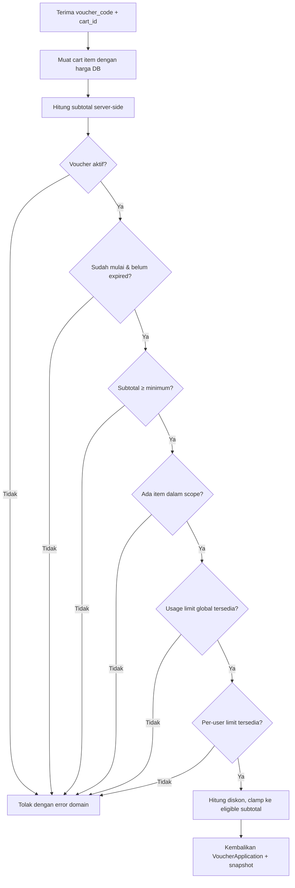
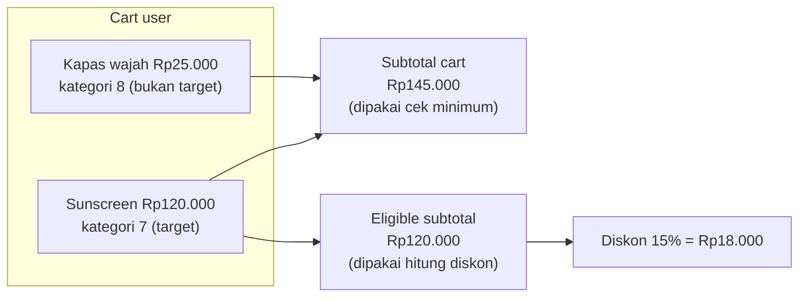
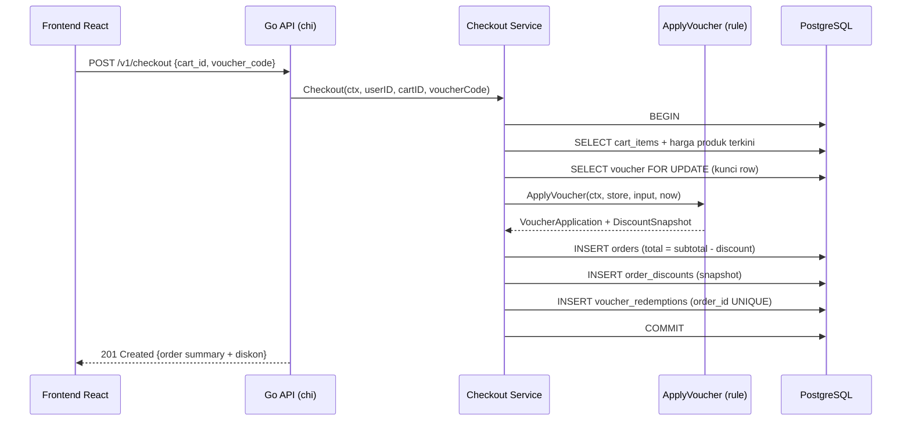
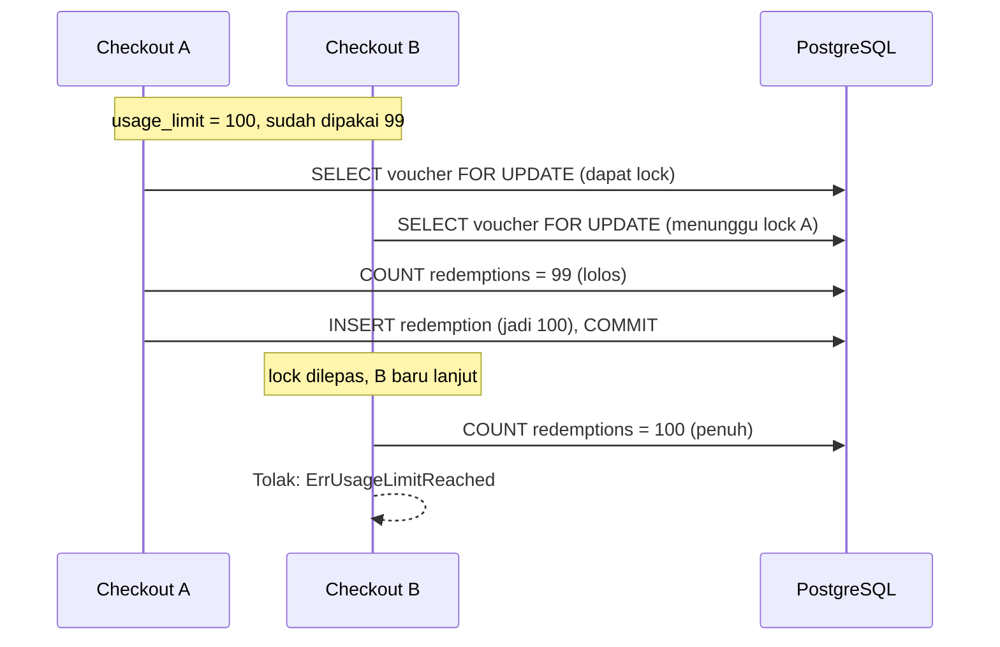

import { Section, Box, Steps, Step, Recap, CardGrid, Card, Chip, Hero, Compare, FileTree, Endpoint, Def } from "@components";

<Hero eyebrow="Roadmap 5 &middot; Online Shop Skincare Domain" title="Promosi dan Voucher<br /><em>yang Sulit Dieksploitasi</em>">
  <p>Voucher terlihat seperti satu input kode promo, tetapi di checkout ia menyentuh uang, stok, batas penggunaan, waktu, scope produk, dan audit diskon sekaligus.</p>
  <Fragment slot="meta">
    <Chip icon="code">Bahasa: <b>Go 1.26</b></Chip>
    <Chip icon="gift">Domain: <b>Promotion</b></Chip>
    <Chip icon="database">PostgreSQL + pgx</Chip>
    <Chip icon="clock">~70 menit baca</Chip>
  </Fragment>
</Hero>

<Section num="01" id="intro" title="Kenapa Voucher Perlu Dirancang Serius?" sub="Di backend, voucher bukan UI kecil, melainkan aturan bisnis yang mengubah nilai transaksi">

<p class="lead">Di frontend, voucher sering terasa seperti satu kotak input kode promo dan satu angka diskon. Di backend, voucher adalah aturan bisnis yang mengubah nilai uang yang benar-benar ditagih ke pelanggan.</p>

Di React atau Next.js, kamu mungkin menghitung preview diskon di klien supaya UI terasa responsif: user mengetik `GLOW15`, angka potongan langsung muncul. Di Laravel, mungkin kamu menaruh rule di sebuah service atau action lalu memanggilnya dari controller checkout. Di Go, kita membuat pemisahan yang lebih eksplisit: checkout service mengambil cart dari server, memanggil fungsi domain `ApplyVoucher`, lalu menyimpan snapshot diskon ke order di dalam satu transaksi database. Tidak ada framework yang diam-diam mengurus aturannya, kita yang memegang kendali penuh.

<Box variant="bridge" icon="🌉" label="Jembatan: dari discount preview di UI ke domain rule di server"><p>Preview di frontend boleh membantu user melihat angka lebih cepat, tetapi keputusan final harus selalu dari backend, karena user bisa mengubah request JSON: harga, quantity, isi cart, bahkan nilai diskon yang dikirim balik. Anggap semua angka dari klien sebagai "saran", bukan "kebenaran".</p></Box>

Voucher yang salah desain menghasilkan bug yang langsung menyentuh uang dan sulit dipulihkan. Diskon dipakai setelah expired. Voucher dipakai berkali-kali oleh user yang sama padahal seharusnya sekali. Diskon percentage bocor ke produk yang tidak termasuk promo. Total order menjadi negatif karena fixed discount lebih besar dari subtotal. Dua checkout bersamaan sama-sama lolos batas penggunaan terakhir. Modul ini memetakan tiap masalah itu ke satu aturan domain yang menutupnya, memakai baseline [Go 1.26](https://go.dev/doc/go1.26).

<Endpoint method="POST" path="/v1/vouchers/apply" desc="Preview voucher untuk cart aktif, menghitung diskon tanpa membuat redemption" />
<Endpoint method="POST" path="/v1/checkout" desc="Checkout final dengan voucher_code opsional, menyimpan snapshot diskon dalam transaksi" />

<Box variant="analogy" icon="🎟️" label="Analogi: tiket konser, bukan stiker harga"><p>Voucher lebih mirip tiket konser daripada stiker diskon. Tiket punya tanggal berlaku, kursi tertentu (scope), jumlah terbatas (usage limit), dan satu orang tidak boleh memakai tiket yang sama dua kali (per-user limit). Petugas di pintu (backend) yang memutuskan tiket sah, bukan gambar tiket yang terlihat cantik di layar HP.</p></Box>

</Section>

<Section num="02" id="model-promo-voucher" title="Model Promo dan Voucher" sub="Pisahkan domain promotion dari checkout, tetapi finalisasi tetap di checkout">

<p class="lead">Voucher bukan sekadar kolom `code`, melainkan kumpulan aturan yang harus dievaluasi secara konsisten setiap kali dipakai. Memodelkannya dengan benar di awal menghemat banyak tambalan di kemudian hari.</p>

Dalam proyek online shop skincare, kita pisahkan domain promosi dari domain checkout, tetapi checkout tetap menjadi tempat finalisasi. Promotion domain tahu aturan voucher dan cara membaca usage count. Checkout domain tahu cart, order, payment intent, dan snapshot. Pemisahan ini bukan microservice, ini tetap modular monolith yang sama: dua package di bawah `internal/` yang berbagi pool database lewat boundary repository.

<FileTree title="File domain promosi dan checkout" tree={`
internal/
  promotion/
    model.go              # Voucher, DiscountType, VoucherScope, error domain
    voucher.go            # ApplyVoucher dan rule murni (tanpa SQL)
    repository.go         # interface VoucherStore (didefinisikan di sisi pemakai)
    pgx_repository.go     # implementasi PostgreSQL: query voucher dan usage
  checkout/
    service.go            # orchestration checkout, panggil ApplyVoucher
    snapshot.go           # DiscountSnapshot yang ditulis ke order
  shared/
    money.go              # tipe PriceRupiah berbasis int64 (dari Roadmap 3)
db/
  migrations/
    058_create_vouchers.up.sql
    059_create_order_discounts.up.sql
go.mod
`} />

<Def term="Voucher"><p>Entitas aturan diskon: punya code, tipe diskon, minimum purchase, usage limit, per-user limit, expiry date, scope, dan active flag. Ia mendeskripsikan "boleh apa", bukan "sudah dipakai berapa".</p></Def>

<Def term="Redemption"><p>Catatan bahwa voucher benar-benar dipakai pada satu order tertentu. Preview voucher bukan redemption. Quota baru berkurang saat redemption tercatat, bukan saat user mengetik kode.</p></Def>

Skema minimalnya seperti di bawah. Perhatikan disiplin uang: semua nominal disimpan sebagai `BIGINT` (rupiah bilangan bulat), bukan `NUMERIC` apalagi `FLOAT`, supaya operasi diskon deterministik dan cocok dengan tipe domain `PriceRupiah int64` yang kita pakai sejak Roadmap 3. Persentase disimpan sebagai basis point di `INTEGER`, bukan pecahan.

```sql title="db/migrations/058_create_vouchers.up.sql"
CREATE TABLE vouchers (
    id               BIGSERIAL PRIMARY KEY,
    code             TEXT NOT NULL UNIQUE,
    name             TEXT NOT NULL,
    active           BOOLEAN NOT NULL DEFAULT TRUE,
    type             TEXT NOT NULL CHECK (type IN ('fixed_amount', 'percentage')),
    discount_amount  BIGINT  NOT NULL DEFAULT 0 CHECK (discount_amount >= 0),
    percent_bps      INTEGER NOT NULL DEFAULT 0 CHECK (percent_bps BETWEEN 0 AND 10000),
    max_discount     BIGINT  NOT NULL DEFAULT 0 CHECK (max_discount >= 0),
    minimum_purchase BIGINT  NOT NULL DEFAULT 0 CHECK (minimum_purchase >= 0),
    usage_limit      INTEGER NOT NULL DEFAULT 0 CHECK (usage_limit >= 0),
    per_user_limit   INTEGER NOT NULL DEFAULT 0 CHECK (per_user_limit >= 0),
    scope            TEXT NOT NULL DEFAULT 'all' CHECK (scope IN ('all', 'products', 'categories')),
    starts_at        TIMESTAMPTZ NOT NULL DEFAULT now(),
    expires_at       TIMESTAMPTZ,
    created_at       TIMESTAMPTZ NOT NULL DEFAULT now(),
    updated_at       TIMESTAMPTZ NOT NULL DEFAULT now()
);

CREATE TABLE voucher_products (
    voucher_id BIGINT NOT NULL REFERENCES vouchers(id) ON DELETE CASCADE,
    product_id BIGINT NOT NULL REFERENCES products(id) ON DELETE CASCADE,
    PRIMARY KEY (voucher_id, product_id)
);

CREATE TABLE voucher_categories (
    voucher_id  BIGINT NOT NULL REFERENCES vouchers(id) ON DELETE CASCADE,
    category_id BIGINT NOT NULL REFERENCES categories(id) ON DELETE CASCADE,
    PRIMARY KEY (voucher_id, category_id)
);

CREATE TABLE voucher_redemptions (
    id               BIGSERIAL PRIMARY KEY,
    voucher_id       BIGINT NOT NULL REFERENCES vouchers(id),
    user_id          BIGINT NOT NULL REFERENCES users(id),
    order_id         BIGINT NOT NULL UNIQUE REFERENCES orders(id),
    discount_amount  BIGINT NOT NULL CHECK (discount_amount >= 0),
    redeemed_at      TIMESTAMPTZ NOT NULL DEFAULT now()
);

CREATE INDEX idx_voucher_redemptions_voucher_user
    ON voucher_redemptions (voucher_id, user_id);
```

Tiga keputusan skema di atas membayar dirinya nanti. Pertama, `order_id` di `voucher_redemptions` diberi constraint `UNIQUE`: satu order tidak mungkin punya dua redemption voucher yang sama, sehingga retry checkout tidak menggandakan quota. Kedua, scope produk dan kategori dipisah ke join table, bukan kolom array, agar query "produk mana yang eligible" tetap bisa di-index dan di-join. Ketiga, `expires_at` boleh `NULL` untuk voucher tanpa batas waktu, jadi kode Go harus menangani kasus "tidak ada expiry" secara eksplisit.

PostgreSQL menyediakan tipe [`timestamp with time zone`](https://www.postgresql.org/docs/current/datatype-datetime.html) yang menormalkan waktu ke UTC saat menyimpan, cocok untuk expiry yang adil lintas zona waktu, dan `now()` sebagai default mengikuti [dokumentasi resmi PostgreSQL](https://www.postgresql.org/docs/current/functions-datetime.html).

<Box variant="bridge" icon="🌉" label="Jembatan: dari Eloquent model ke struct plus migration eksplisit"><p>Di Laravel, model voucher dan migration sering didefinisikan terpisah, dan Eloquent menambah magic seperti casts dan accessor. Di Go, struct domain dan skema SQL ditulis tangan dan harus konsisten satu sama lain, tanpa magic. Lebih banyak ketikan, tetapi tipe kolom (`BIGINT` vs `INTEGER`) dan tipe Go (`PriceRupiah` vs `int64` polos) terlihat jelas dan tidak ada konversi tersembunyi yang mengejutkan saat produksi.</p></Box>

</Section>

<Section num="03" id="tipe-diskon" title="Tipe Diskon: Fixed dan Percentage" sub="Dua tipe paling umum, dua risiko numerik yang berbeda">

<p class="lead">Dua tipe diskon yang paling umum, fixed amount dan percentage, punya risiko numerik yang berbeda. Memahami risikonya menentukan cara kita menyimpan dan menghitungnya.</p>

<Compare aLabel="JS / PHP: yang sering terjadi" bLabel="Go: yang kita inginkan" aTone="muted" bTone="violet">
  <Fragment slot="a"><ul><li>Percentage dihitung dengan `float`, lalu rounding berbeda antara frontend dan backend, total tidak cocok dengan invoice.</li><li>Fixed discount membuat total negatif saat subtotal lebih kecil dari diskon (`80.000 - 100.000`).</li><li>Persen disimpan sebagai `0.15`, rawan kesalahan pembacaan dan presisi float.</li></ul></Fragment>
  <Fragment slot="b"><ul><li>Semua nominal uang pakai `PriceRupiah` (`int64` rupiah), percentage pakai basis point integer (`1500` untuk 15 persen).</li><li>Diskon selalu di-clamp ke eligible subtotal, sehingga total tidak pernah negatif by construction.</li><li>Perhitungan deterministik: input sama selalu menghasilkan output sama di mesin mana pun.</li></ul></Fragment>
</Compare>

<CardGrid cols={2}>
  <Card><h4>Fixed amount</h4><p>Contoh: `SKIN50K` memberi potongan Rp50.000. Aman bila hasil akhirnya di-clamp ke eligible subtotal, sehingga cart Rp30.000 tidak menghasilkan total minus.</p></Card>
  <Card><h4>Percentage</h4><p>Contoh: `GLOW15` memberi potongan 15 persen. Simpan sebagai `percent_bps = 1500`, lalu sering dibatasi `max_discount` agar campaign tidak jebol di cart besar.</p></Card>
</CardGrid>

<Def term="basis point (bps)"><p>Satuan 1 per 10.000. Nilai 10000 berarti 100 persen, 1500 berarti 15 persen, dan 250 berarti 2,5 persen. Menyimpan persen sebagai integer bps menghindari float dan membuat perhitungan diskon tetap bilangan bulat.</p></Def>

Kenapa basis point, bukan menyimpan `0.15` saja? Karena uang di sistem ini adalah integer rupiah, dan kita ingin perkalian diskon tetap di ranah integer. Rumusnya `diskon = eligible_subtotal * percent_bps / 10000`, semua operand integer, hasilnya integer, pembagian terakhir membuang pecahan (floor). Tidak ada `float64` yang bisa menghasilkan `17999.9999998` di satu mesin dan `18000` di mesin lain.

<Box variant="warn" icon="⚠️" label="Urutan operasi pada integer division penting"><p>Tulis `eligibleSubtotal * percentBps / 10000`, bukan `eligibleSubtotal * (percentBps / 10000)`. Versi kedua menghitung `percentBps / 10000` lebih dulu (integer), yang hampir selalu jadi 0, sehingga semua diskon hilang. Kalikan dulu, bagi belakangan, dan pastikan tipe cukup lebar (`int64`) agar perkalian tidak overflow pada cart besar.</p></Box>

<Box variant="tip" icon="💡" label="Best practice uang"><p>Gunakan integer untuk uang, simpan satuan rupiah terkecil yang dipakai aplikasi, dan format ke "Rp50.000" hanya di boundary response (saat menyusun JSON), bukan di dalam logika diskon.</p></Box>

</Section>

<Section num="04" id="aturan-validasi" title="Enam Aturan Validasi Voucher" sub="Tiap aturan menutup satu jalur eksploitasi yang berbeda">

<p class="lead">Validasi voucher harus berlapis, karena tiap aturan menutup jalur eksploitasi yang berbeda. Melewatkan satu lapis berarti membuka satu pintu kebocoran uang.</p>

<CardGrid cols={3}>
  <Card><h4>Minimum purchase</h4><p>Voucher ditolak bila subtotal server-side lebih kecil dari `minimum_purchase`. Menutup: voucher Rp50rb dipakai pada cart Rp10rb.</p></Card>
  <Card><h4>Usage limit</h4><p>Voucher ditolak bila total redemption global sudah mencapai limit. Menutup: campaign 100 kupon dipakai 5.000 kali.</p></Card>
  <Card><h4>Per-user limit</h4><p>Voucher ditolak bila user yang sama sudah mencapai limit miliknya. Menutup: satu user menyedot seluruh quota.</p></Card>
  <Card><h4>Expiry date</h4><p>Voucher ditolak bila waktu server sudah mencapai atau melewati `expires_at`. Menutup: kupon flash sale dipakai minggu depan.</p></Card>
  <Card><h4>Scope</h4><p>Voucher hanya menghitung item yang masuk product atau category target. Menutup: promo sunscreen bocor ke seluruh cart.</p></Card>
  <Card><h4>Active flag</h4><p>Voucher bisa dinonaktifkan tanpa menghapus data. Menutup: admin perlu mematikan kupon bocor cepat tanpa kehilangan histori.</p></Card>
</CardGrid>

Urutan evaluasi juga penting, dan pilihannya bukan acak. Kita memeriksa yang murah dan tidak butuh query database dulu (active, expiry, minimum purchase, scope dari data cart yang sudah ada), baru memeriksa yang butuh `COUNT` ke database (usage limit, per-user limit). Cek mahal hanya dijalankan bila cek murah sudah lolos, sehingga voucher expired tidak membuang query usage yang percuma.

<Box variant="warn" icon="⚠️" label="Jangan percaya subtotal dari request"><p>Subtotal wajib dihitung ulang dari cart server-side dan harga produk di database, bukan diambil dari body request. Client hanya boleh mengirim `voucher_code` (dan identitas cart), tidak pernah nilai subtotal atau diskon final.</p></Box>



<p class="fig-cap"><b>Gambar 1.</b> Validasi berlapis dari cek murah (tanpa query) ke cek mahal (butuh COUNT), semua berbasis data server, bukan angka dari frontend.</p>

<Box variant="bridge" icon="🌉" label="Jembatan: Laravel FormRequest vs domain rule"><p>Di Laravel, `FormRequest` cocok untuk validasi bentuk: `voucher_code` wajib string, panjang maksimal sekian. Tetapi expired, scope mismatch, usage limit, dan per-user limit bukan validasi bentuk, melainkan business rule yang butuh data (waktu sekarang, isi cart, hitungan redemption). Aturan ini tinggal di service domain, bukan di lapisan validasi request, persis seperti aturan "stok cukup" bukan urusan FormRequest.</p></Box>

</Section>

<Section num="05" id="scope-produk-kategori" title="Scope: Produk dan Kategori" sub="Promo realistis menargetkan sebagian item, bukan seluruh cart">

<p class="lead">Scope membuat voucher realistis. Promo skincare jarang berlaku untuk semua, lebih sering menargetkan kategori sunscreen, lini serum vitamin C, atau paket acne care tertentu.</p>

Karena cart bisa berisi banyak item dari kategori berbeda, diskon tidak boleh dihitung dari seluruh subtotal bila voucher hanya berlaku untuk sebagian item. Di sinilah konsep eligible subtotal muncul: subtotal yang dihitung HANYA dari item yang cocok dengan scope voucher, terpisah dari subtotal cart penuh.

<Compare aLabel="Tanpa scope (rawan)" bLabel="Dengan scope (terkendali)" aTone="red" bTone="teal">
  <Fragment slot="a"><ul><li>`GLOW15` dipakai untuk semua item, termasuk produk bermargin tipis yang tidak diniatkan ikut promo.</li><li>Tim marketing sulit mengontrol campaign karena backend tidak tahu produk target.</li><li>Diskon membengkak tak terduga saat cart penuh barang non-promo.</li></ul></Fragment>
  <Fragment slot="b"><ul><li>`GLOW15` hanya menghitung eligible subtotal dari product atau category yang cocok.</li><li>Produk lain tetap masuk order dan tetap dibayar penuh, hanya tidak ikut basis diskon.</li><li>Campaign bisa ditarget per kategori, sesuai rencana tim product.</li></ul></Fragment>
</Compare>

Mari kunci dengan satu contoh konkret. User membeli sunscreen Rp120.000 (kategori 7) dan kapas wajah Rp25.000 (kategori 8). Voucher `SUN15` adalah percentage 15 persen, scope `categories` ke kategori 7, minimum purchase Rp100.000.



<p class="fig-cap"><b>Gambar 2.</b> Dua subtotal berbeda dari satu cart: subtotal penuh menentukan kelolosan minimum purchase, eligible subtotal menentukan nominal diskon.</p>

Perhatikan dua angka yang berbeda dari satu cart. Minimum purchase dicek terhadap subtotal cart penuh Rp145.000 (lolos, karena >= Rp100.000). Tetapi diskon percentage dihitung dari eligible subtotal Rp120.000, bukan Rp145.000, sehingga potongannya Rp18.000, bukan Rp21.750. Kapas wajah tetap dibayar penuh.

<Box variant="note" icon="📝" label="Keputusan bisnis yang wajib ditulis eksplisit"><p>Apakah minimum purchase mengacu ke subtotal cart atau ke eligible subtotal? Di modul ini kita pilih: minimum purchase memakai subtotal cart, diskon memakai eligible subtotal. Itu keputusan bisnis, bukan kebenaran teknis. Kalau bisnis ingin minimum purchase juga scoped, ubah rule dengan sadar dan tambahkan test case yang menegaskan pilihan baru itu, supaya product, frontend, dan backend sepakat.</p></Box>

</Section>

<Section num="06" id="apply-voucher" title="Fungsi Domain ApplyVoucher" sub="Rule murni yang menerima data tepercaya dan mengembalikan snapshot">

<p class="lead">Inti modul ini adalah satu fungsi domain: `ApplyVoucher`. Ia menerima data yang sudah dipercaya dari server (item cart dengan harga database), lalu mengembalikan hasil yang bisa langsung disimpan sebagai snapshot.</p>

Pola Go yang kita pakai konsisten dengan seluruh proyek. [`context.Context`](https://pkg.go.dev/context) menjadi parameter pertama untuk membawa cancellation dan deadline antar boundary. `now time.Time` disuntikkan sebagai argumen, bukan dipanggil `time.Now()` di dalam, supaya fungsi bisa diuji deterministik. Hasilnya `(*VoucherApplication, error)`, bukan exception yang dilempar seperti `throw` di JavaScript. Tiap kegagalan punya error domain bernama (`ErrVoucherExpired`, `ErrMinimumPurchase`) yang bisa diterjemahkan handler menjadi pesan dan status HTTP yang tepat.

Pertama, model dan error domain. Uang memakai `shared.PriceRupiah` (alias `int64` rupiah dari Roadmap 3), bukan tipe baru, agar konsisten dengan katalog, cart, dan order.

```go title="internal/promotion/model.go"
package promotion

import (
	"errors"
	"time"

	"github.com/kamu/skincare-backend/internal/shared"
)

type DiscountType string

const (
	DiscountFixedAmount DiscountType = "fixed_amount"
	DiscountPercentage  DiscountType = "percentage"
)

type VoucherScope string

const (
	ScopeAll        VoucherScope = "all"
	ScopeProducts   VoucherScope = "products"
	ScopeCategories VoucherScope = "categories"
)

var (
	ErrVoucherNotFound      = errors.New("voucher not found")
	ErrVoucherInactive      = errors.New("voucher inactive")
	ErrVoucherNotStarted    = errors.New("voucher not started")
	ErrVoucherExpired       = errors.New("voucher expired")
	ErrMinimumPurchase      = errors.New("minimum purchase not reached")
	ErrScopeMismatch        = errors.New("voucher scope does not match cart")
	ErrUsageLimitReached    = errors.New("voucher usage limit reached")
	ErrPerUserLimitReached  = errors.New("voucher per-user limit reached")
	ErrVoucherMisconfigured = errors.New("voucher misconfigured")
)

// Voucher adalah aturan diskon. ProductIDs/CategoryIDs dipakai sebagai set
// (lookup O(1)) untuk cek scope tanpa loop bersarang.
type Voucher struct {
	ID              int64
	Code            string
	Active          bool
	Type            DiscountType
	Amount          shared.PriceRupiah // untuk fixed_amount
	PercentBps      int64              // untuk percentage, 1500 = 15%
	MaxDiscount     shared.PriceRupiah // 0 berarti tanpa batas
	MinimumPurchase shared.PriceRupiah
	UsageLimit      int64 // 0 berarti tanpa batas global
	PerUserLimit    int64 // 0 berarti tanpa batas per user
	StartsAt        time.Time
	ExpiresAt       time.Time // zero value berarti tanpa expiry
	Scope           VoucherScope
	ProductIDs      map[int64]struct{}
	CategoryIDs     map[int64]struct{}
}

// CheckoutItem adalah satu baris cart yang sudah dimuat dengan harga DB.
type CheckoutItem struct {
	ProductID  int64
	CategoryID int64
	Quantity   int
	UnitPrice  shared.PriceRupiah
}

type ApplyVoucherInput struct {
	UserID int64
	Code   string
	Items  []CheckoutItem
}

// VoucherApplication adalah hasil siap-pakai untuk checkout.
type VoucherApplication struct {
	VoucherID        int64
	Code             string
	Type             DiscountType
	EligibleSubtotal shared.PriceRupiah
	DiscountAmount   shared.PriceRupiah
	Snapshot         DiscountSnapshot
}

// DiscountSnapshot dibekukan ke order saat checkout, tidak pernah dibaca ulang
// dari tabel vouchers setelah ini.
type DiscountSnapshot struct {
	VoucherID        int64
	Code             string
	Type             DiscountType
	Scope            VoucherScope
	MinimumPurchase  shared.PriceRupiah
	EligibleSubtotal shared.PriceRupiah
	DiscountAmount   shared.PriceRupiah
	AppliedAt        time.Time
}
```

Kedua, interface `VoucherStore` didefinisikan di sisi pemakai (idiom Go "accept interfaces"), hanya berisi tiga method yang benar-benar dibutuhkan rule. Implementasi pgx-nya hidup di `pgx_repository.go` dan tidak bocor ke sini.

```go title="internal/promotion/voucher.go"
package promotion

import (
	"context"
	"errors"
	"fmt"
	"time"

	"github.com/kamu/skincare-backend/internal/shared"
)

// VoucherStore adalah kontrak kecil yang dibutuhkan ApplyVoucher.
// Implementasi konkret (pgx) dipenuhi di luar package ini.
type VoucherStore interface {
	FindVoucherByCode(ctx context.Context, code string) (Voucher, error)
	CountUsage(ctx context.Context, voucherID int64) (int64, error)
	CountUsageByUser(ctx context.Context, voucherID, userID int64) (int64, error)
}

// ApplyVoucher mengevaluasi seluruh aturan voucher terhadap cart server-side.
// Urutan cek: murah dulu (tanpa query), mahal belakangan (COUNT ke DB).
func ApplyVoucher(ctx context.Context, store VoucherStore, in ApplyVoucherInput, now time.Time) (*VoucherApplication, error) {
	if in.UserID <= 0 {
		return nil, fmt.Errorf("apply voucher: user is required")
	}
	if len(in.Items) == 0 {
		return nil, fmt.Errorf("apply voucher: cart is empty")
	}

	v, err := store.FindVoucherByCode(ctx, in.Code)
	if err != nil {
		if errors.Is(err, ErrVoucherNotFound) {
			return nil, ErrVoucherNotFound
		}
		return nil, fmt.Errorf("find voucher by code: %w", err)
	}

	// --- Cek murah: tidak butuh query tambahan ---
	if !v.Active {
		return nil, ErrVoucherInactive
	}
	if !v.StartsAt.IsZero() && now.Before(v.StartsAt) {
		return nil, ErrVoucherNotStarted
	}
	// expires_at NULL -> zero value -> tanpa expiry. Tepat di expires_at = sudah expired.
	if !v.ExpiresAt.IsZero() && !now.Before(v.ExpiresAt) {
		return nil, ErrVoucherExpired
	}

	subtotal := calculateSubtotal(in.Items)
	if subtotal < v.MinimumPurchase {
		return nil, ErrMinimumPurchase
	}

	eligible := calculateEligibleSubtotal(v, in.Items)
	if eligible <= 0 {
		return nil, ErrScopeMismatch
	}

	// --- Cek mahal: query usage hanya bila cek murah lolos ---
	if v.UsageLimit > 0 {
		used, err := store.CountUsage(ctx, v.ID)
		if err != nil {
			return nil, fmt.Errorf("count usage: %w", err)
		}
		if used >= v.UsageLimit {
			return nil, ErrUsageLimitReached
		}
	}
	if v.PerUserLimit > 0 {
		usedByUser, err := store.CountUsageByUser(ctx, v.ID, in.UserID)
		if err != nil {
			return nil, fmt.Errorf("count usage by user: %w", err)
		}
		if usedByUser >= v.PerUserLimit {
			return nil, ErrPerUserLimitReached
		}
	}

	discount, err := calculateDiscount(v, eligible)
	if err != nil {
		return nil, err
	}

	return &VoucherApplication{
		VoucherID:        v.ID,
		Code:             v.Code,
		Type:             v.Type,
		EligibleSubtotal: eligible,
		DiscountAmount:   discount,
		Snapshot: DiscountSnapshot{
			VoucherID:        v.ID,
			Code:             v.Code,
			Type:             v.Type,
			Scope:            v.Scope,
			MinimumPurchase:  v.MinimumPurchase,
			EligibleSubtotal: eligible,
			DiscountAmount:   discount,
			AppliedAt:        now,
		},
	}, nil
}

func calculateSubtotal(items []CheckoutItem) shared.PriceRupiah {
	var subtotal shared.PriceRupiah
	for _, it := range items {
		subtotal += it.UnitPrice * shared.PriceRupiah(it.Quantity)
	}
	return subtotal
}

func calculateEligibleSubtotal(v Voucher, items []CheckoutItem) shared.PriceRupiah {
	var subtotal shared.PriceRupiah
	for _, it := range items {
		if itemEligible(v, it) {
			subtotal += it.UnitPrice * shared.PriceRupiah(it.Quantity)
		}
	}
	return subtotal
}

func itemEligible(v Voucher, it CheckoutItem) bool {
	switch v.Scope {
	case ScopeAll:
		return true
	case ScopeProducts:
		_, ok := v.ProductIDs[it.ProductID]
		return ok
	case ScopeCategories:
		_, ok := v.CategoryIDs[it.CategoryID]
		return ok
	default:
		return false
	}
}

// calculateDiscount selalu meng-clamp hasil ke eligible subtotal, sehingga
// total order tidak pernah negatif, berapa pun nilai voucher.
func calculateDiscount(v Voucher, eligible shared.PriceRupiah) (shared.PriceRupiah, error) {
	switch v.Type {
	case DiscountFixedAmount:
		if v.Amount <= 0 {
			return 0, ErrVoucherMisconfigured
		}
		return min(v.Amount, eligible), nil
	case DiscountPercentage:
		if v.PercentBps <= 0 || v.PercentBps > 10000 {
			return 0, ErrVoucherMisconfigured
		}
		// Kalikan dulu (int64), bagi belakangan: hasil floor, deterministik.
		discount := shared.PriceRupiah(int64(eligible) * v.PercentBps / 10000)
		if v.MaxDiscount > 0 {
			discount = min(discount, v.MaxDiscount)
		}
		return min(discount, eligible), nil
	default:
		return 0, ErrVoucherMisconfigured
	}
}
```

<Box variant="tip" icon="💡" label="Idiom Go: min builtin sejak 1.21"><p>`min` dan `max` adalah builtin sejak Go 1.21, jadi tidak perlu helper `minMoney` sendiri. `min(v.Amount, eligible)` bekerja langsung pada `PriceRupiah` karena tipenya tetap berbasis `int64` yang ordered.</p></Box>

<Box variant="warn" icon="⚠️" label="ApplyVoucher tidak menerima subtotal dari request"><p>Fungsi ini hanya menerima `Items` yang sudah dimuat dari database dengan harga server. Ia menghitung subtotal, eligible subtotal, dan diskon sendiri. Tidak ada satu pun angka uang yang berasal dari body request user, dan itulah pertahanan utama melawan manipulasi diskon.</p></Box>

</Section>

<Section num="07" id="snapshot-diskon" title="Snapshot Diskon di Order" sub="Order membekukan diskon saat checkout, bukan membaca ulang voucher nanti">

<p class="lead">Order wajib menyimpan diskon yang terjadi saat checkout sebagai snapshot, bukan membaca ulang tabel `vouchers` setiap kali invoice dibuka. Voucher hidup dan bisa diedit, order adalah catatan sejarah yang tidak boleh berubah.</p>

Bayangkan tanpa snapshot. Voucher `GLOW15` hari ini punya `max_discount` Rp30.000. Minggu depan tim marketing menurunkannya jadi Rp20.000 untuk campaign berikutnya. Kalau invoice membaca ulang voucher, order lama tiba-tiba menampilkan diskon Rp20.000, padahal pelanggan dulu benar-benar membayar dengan potongan Rp30.000. Angka di mata uang tidak boleh berubah retroaktif. Snapshot membekukan kebenaran saat itu.

```sql title="db/migrations/059_create_order_discounts.up.sql"
CREATE TABLE order_discounts (
    id                BIGSERIAL PRIMARY KEY,
    order_id          BIGINT NOT NULL REFERENCES orders(id) ON DELETE CASCADE,
    voucher_id        BIGINT REFERENCES vouchers(id), -- nullable: voucher boleh di-soft-delete
    voucher_code      TEXT   NOT NULL,
    discount_type     TEXT   NOT NULL,
    scope             TEXT   NOT NULL,
    minimum_purchase  BIGINT NOT NULL,
    eligible_subtotal BIGINT NOT NULL,
    discount_amount   BIGINT NOT NULL CHECK (discount_amount >= 0),
    applied_at        TIMESTAMPTZ NOT NULL,
    created_at        TIMESTAMPTZ NOT NULL DEFAULT now()
);
```

Snapshot menyimpan `voucher_code`, `discount_type`, `scope`, `minimum_purchase`, `eligible_subtotal`, `discount_amount`, dan `applied_at`. Kolom `voucher_id` sengaja nullable: kalau kelak voucher historis dihapus (soft delete dengan menghilangkan baris), invoice lama tetap valid karena ia tidak bergantung pada baris voucher yang masih ada. Snapshot berdiri sendiri.



<p class="fig-cap"><b>Gambar 3.</b> Diskon dibekukan ke order di dalam satu transaksi checkout. Snapshot, redemption, dan order ditulis bersama lalu di-commit sekali.</p>

Perhatikan bahwa snapshot, `order_discounts`, dan `voucher_redemptions` ditulis di transaksi yang sama dengan `orders`. Kalau ada langkah yang gagal (misalnya stok ternyata habis), seluruh transaksi rollback dan tidak ada redemption yang terhitung. Quota baru benar-benar berkurang hanya ketika `COMMIT` sukses.

<Box variant="bridge" icon="🌉" label="Jembatan: snapshot diskon mirip price snapshot di order item"><p>Konsep ini sama persis dengan menyimpan harga produk ke `order_items` saat checkout, bukan membaca ulang harga produk yang bisa berubah. Order selalu menyimpan "berapa yang disepakati saat itu". Diskon hanyalah satu kolom lagi dalam catatan sejarah yang sama, dengan alasan yang identik: invoice tidak boleh berubah saat dunia di luarnya berubah.</p></Box>

</Section>

<Section num="08" id="anti-eksploitasi" title="Race Condition dan Redemption Aman" sub="Validasi benar masih bisa bocor saat dua checkout berjalan bersamaan">

<p class="lead">Validasi yang benar masih bisa bocor bila dua request checkout berjalan bersamaan. Inilah perbedaan antara kode yang benar di unit test dan kode yang benar di produksi dengan trafik nyata.</p>

Kasus klasiknya: voucher `usage_limit = 100`, saat ini sudah dipakai 99 kali, lalu dua user checkout di milidetik yang sama. Kalau backend hanya melakukan `COUNT(*)` tanpa kontrol concurrency, dua request bisa sama-sama membaca angka 99, dua-duanya menyimpulkan "masih ada slot terakhir", dan dua-duanya menulis redemption. Quota jebol jadi 101.



<p class="fig-cap"><b>Gambar 4.</b> Dengan SELECT FOR UPDATE, checkout B menunggu sampai A commit. B lalu membaca hitungan terbaru (100) dan ditolak, sehingga quota tidak jebol.</p>

Kuncinya: di checkout final, baca row voucher dengan `FOR UPDATE`, hitung penggunaan, validasi, insert redemption, dan commit dalam transaksi yang sama. Lock pada row voucher memaksa checkout lain mengantre, sehingga hitungan usage selalu terbaca setelah redemption sebelumnya tercatat.

```sql title="internal/promotion/pgx_repository.go (query di dalam tx)"
-- 1) Kunci baris voucher. Checkout lain pada voucher yang sama akan menunggu.
SELECT id, code, usage_limit, per_user_limit
FROM vouchers
WHERE code = $1
FOR UPDATE;

-- 2) Hitung penggunaan global (terbaca setelah lock didapat).
SELECT count(*) FROM voucher_redemptions WHERE voucher_id = $1;

-- 3) Hitung penggunaan oleh user ini.
SELECT count(*) FROM voucher_redemptions WHERE voucher_id = $1 AND user_id = $2;
```

[`SELECT ... FOR UPDATE`](https://www.postgresql.org/docs/current/explicit-locking.html#LOCKING-ROWS) di PostgreSQL membuat request lain yang ingin mengunci baris voucher yang sama menunggu sampai transaksi pertama commit atau rollback. Ini bukan pengganti unique constraint, melainkan pasangannya. Constraint `order_id UNIQUE` di `voucher_redemptions` adalah jaring kedua: andai dua percobaan untuk order yang sama menyusup (retry, double submit), database menolak insert kedua, dan kita perlakukan sebagai "sudah ter-redeem", bukan error.

<Compare aLabel="Preview voucher" bLabel="Checkout final" aTone="blue" bTone="violet">
  <Fragment slot="a"><ul><li>Endpoint `/v1/vouchers/apply` boleh tanpa lock berat, karena tidak mengurangi quota.</li><li>Hasilnya informasi sementara untuk UI: "kalau kamu checkout sekarang, diskonnya sekian".</li><li>`COUNT` boleh agak basi, tidak masalah karena keputusan final bukan di sini.</li></ul></Fragment>
  <Fragment slot="b"><ul><li>Endpoint `/v1/checkout` wajib dalam transaksi dengan `SELECT ... FOR UPDATE`.</li><li>Validasi limit, insert redemption, dan snapshot ditulis bersama lalu commit sekali.</li><li>Di sinilah quota benar-benar berkurang dan race condition harus mati.</li></ul></Fragment>
</Compare>

<Box variant="warn" icon="⚠️" label="Bedakan beban preview dan beban checkout"><p>Jangan memakai lock berat di preview voucher yang dipanggil tiap user mengetik kode, itu akan mengantrekan request tanpa perlu. Lock hanya di checkout final, di mana keputusan benar-benar mengurangi quota. Salah menempatkan lock membuat sistem lambat tanpa menambah keamanan.</p></Box>

<Box variant="note" icon="🕐" label="Waktu dan zona selalu dari server"><p>Simpan `starts_at`, `expires_at`, dan `redeemed_at` sebagai `TIMESTAMPTZ`. Di Go, bandingkan dengan `time.Time` yang disuntikkan dari server (`now` argumen `ApplyVoucher`), bukan waktu yang dikirim client. Jam HP user tidak boleh menentukan apakah voucher masih berlaku.</p></Box>

</Section>

<Section num="09" id="hands-on" title="Hands-on: Uji Aturan Bisnis" sub="Test tanpa database, karena rule murni bisa difake">

<p class="lead">Latihan ini menutup celah yang biasanya tidak terlihat dari happy path checkout. Karena `ApplyVoucher` adalah rule murni yang bergantung pada interface kecil, kita bisa mengujinya tanpa database sama sekali.</p>

<Steps>
  <Step><b>Buat migration voucher</b><p>Tambahkan `vouchers`, join table scope, `voucher_redemptions`, dan `order_discounts` seperti skema di section 02 dan 07.</p></Step>
  <Step><b>Implementasikan repository pgx</b><p>Buat `FindVoucherByCode`, `CountUsage`, dan `CountUsageByUser` dengan pgx, plus query `FOR UPDATE` untuk jalur checkout.</p></Step>
  <Step><b>Pasang di checkout</b><p>Panggil `ApplyVoucher` setelah cart item dimuat dari database, sebelum order total dihitung, di dalam transaksi yang sama.</p></Step>
  <Step><b>Tulis unit test rule</b><p>Uji fixed amount, percentage, minimum purchase, expiry, per-user limit, scope mismatch, dan clamp ke eligible subtotal.</p></Step>
</Steps>

Fake store di bawah memenuhi interface `VoucherStore` hanya dengan field biasa, tanpa mock library. Inilah keuntungan interface kecil: implementasi palsu cukup beberapa baris.

```go title="internal/promotion/voucher_test.go"
package promotion

import (
	"context"
	"errors"
	"testing"
	"time"
)

type fakeStore struct {
	voucher    Voucher
	used       int64
	usedByUser int64
}

func (f fakeStore) FindVoucherByCode(_ context.Context, code string) (Voucher, error) {
	if f.voucher.Code != code {
		return Voucher{}, ErrVoucherNotFound
	}
	return f.voucher, nil
}

func (f fakeStore) CountUsage(_ context.Context, _ int64) (int64, error) {
	return f.used, nil
}

func (f fakeStore) CountUsageByUser(_ context.Context, _, _ int64) (int64, error) {
	return f.usedByUser, nil
}

func baseVoucher(now time.Time) Voucher {
	return Voucher{
		ID:              1,
		Code:            "SUN15",
		Active:          true,
		Type:            DiscountPercentage,
		PercentBps:      1500,
		MinimumPurchase: 100_000,
		UsageLimit:      100,
		PerUserLimit:    1,
		StartsAt:        now.Add(-24 * time.Hour),
		ExpiresAt:       now.Add(24 * time.Hour),
		Scope:           ScopeCategories,
		CategoryIDs:     map[int64]struct{}{7: {}},
	}
}

func sunscreenCart() []CheckoutItem {
	return []CheckoutItem{
		{ProductID: 10, CategoryID: 7, Quantity: 1, UnitPrice: 120_000}, // eligible
		{ProductID: 11, CategoryID: 8, Quantity: 1, UnitPrice: 25_000},  // bukan target
	}
}

func TestApplyVoucher_PercentageScopedToCategory(t *testing.T) {
	now := time.Date(2026, 6, 9, 10, 0, 0, 0, time.UTC)
	store := fakeStore{voucher: baseVoucher(now)}
	in := ApplyVoucherInput{UserID: 99, Code: "SUN15", Items: sunscreenCart()}

	got, err := ApplyVoucher(context.Background(), store, in, now)
	if err != nil {
		t.Fatalf("ApplyVoucher error: %v", err)
	}
	// Eligible hanya sunscreen Rp120.000, diskon 15% = Rp18.000.
	if got.EligibleSubtotal != 120_000 {
		t.Fatalf("eligible = %d, want 120000", got.EligibleSubtotal)
	}
	if got.DiscountAmount != 18_000 {
		t.Fatalf("discount = %d, want 18000", got.DiscountAmount)
	}
}

func TestApplyVoucher_Expired(t *testing.T) {
	now := time.Date(2026, 6, 9, 10, 0, 0, 0, time.UTC)
	v := baseVoucher(now)
	v.ExpiresAt = now.Add(-time.Second) // sudah lewat
	store := fakeStore{voucher: v}
	in := ApplyVoucherInput{UserID: 99, Code: "SUN15", Items: sunscreenCart()}

	_, err := ApplyVoucher(context.Background(), store, in, now)
	if !errors.Is(err, ErrVoucherExpired) {
		t.Fatalf("err = %v, want ErrVoucherExpired", err)
	}
}

func TestApplyVoucher_PerUserLimitReached(t *testing.T) {
	now := time.Date(2026, 6, 9, 10, 0, 0, 0, time.UTC)
	store := fakeStore{voucher: baseVoucher(now), usedByUser: 1} // limit 1, sudah 1
	in := ApplyVoucherInput{UserID: 99, Code: "SUN15", Items: sunscreenCart()}

	_, err := ApplyVoucher(context.Background(), store, in, now)
	if !errors.Is(err, ErrPerUserLimitReached) {
		t.Fatalf("err = %v, want ErrPerUserLimitReached", err)
	}
}

func TestApplyVoucher_FixedClampedToEligible(t *testing.T) {
	now := time.Date(2026, 6, 9, 10, 0, 0, 0, time.UTC)
	v := baseVoucher(now)
	v.Type = DiscountFixedAmount
	v.Amount = 200_000 // lebih besar dari eligible
	v.MinimumPurchase = 0
	store := fakeStore{voucher: v}
	in := ApplyVoucherInput{UserID: 99, Code: "SUN15", Items: sunscreenCart()}

	got, err := ApplyVoucher(context.Background(), store, in, now)
	if err != nil {
		t.Fatalf("ApplyVoucher error: %v", err)
	}
	// Diskon di-clamp ke eligible Rp120.000, tidak membuat total negatif.
	if got.DiscountAmount != 120_000 {
		t.Fatalf("discount = %d, want 120000 (clamped)", got.DiscountAmount)
	}
}
```

<Box variant="tip" icon="💡" label="Table test untuk cabang error"><p>Empat test di atas sengaja eksplisit agar mudah dibaca, tetapi cabang error (`ErrVoucherInactive`, `ErrMinimumPurchase`, `ErrScopeMismatch`, `ErrUsageLimitReached`) cocok ditulis sebagai satu table-driven test yang memetakan kondisi voucher ke error yang diharapkan. Itu pola idiomatik Go untuk menguji banyak jalur penolakan dalam satu fungsi.</p></Box>

</Section>

<Section num="10" id="jebakan-umum" title="Jebakan Umum dari JS/PHP" sub="Bukan salah konsep, tetapi menaruh rule di tempat yang salah">

<p class="lead">Pendatang dari JavaScript atau PHP biasanya bukan salah konsep, tetapi terbiasa menaruh rule terlalu dekat dengan UI atau controller, dan melewatkan lapisan yang baru terasa di produksi.</p>

<CardGrid cols={2}>
  <Card><h4>Diskon final dihitung di frontend</h4><p>Frontend boleh preview, tetapi backend harus menghitung ulang semua angka dari cart dan harga database. Angka dari klien hanya saran.</p></Card>
  <Card><h4>Float untuk uang</h4><p>`float64` menimbulkan pecahan yang berbeda antar mesin dan tidak cocok dengan invoice. Pakai `PriceRupiah` (int64) dan basis point untuk persen.</p></Card>
  <Card><h4>Limit dicek di luar transaksi</h4><p>Dua checkout bersamaan meloloskan slot terakhir yang sama. Gunakan `SELECT ... FOR UPDATE` plus `order_id UNIQUE` saat checkout final.</p></Card>
  <Card><h4>Snapshot tidak disimpan</h4><p>Invoice lama berubah saat admin mengedit voucher. Bekukan diskon ke `order_discounts` di transaksi checkout.</p></Card>
  <Card><h4>Per-user limit lupa dihitung</h4><p>Limit global saja tidak cukup: satu user bisa menyedot seluruh quota. Hitung redemption per user juga.</p></Card>
  <Card><h4>Scope berlaku ke semua item</h4><p>Voucher kategori harus menghitung eligible subtotal, bukan subtotal cart penuh, agar diskon tidak bocor ke item non-promo.</p></Card>
</CardGrid>

<Box variant="warn" icon="⚠️" label="Jangan biarkan total order negatif"><p>Fixed discount lebih besar dari subtotal adalah footgun klasik. Tanpa clamp, `80.000 - 100.000` menghasilkan total `-20.000` yang berarti kamu seolah membayar pelanggan. Selalu `min(diskon, eligible_subtotal)` di satu tempat, di `calculateDiscount`, bukan tersebar di banyak handler.</p></Box>

<Box variant="bridge" icon="🌉" label="Jembatan: Laravel validation vs domain rule, sekali lagi"><p>Laravel request validation cocok untuk format (`voucher_code` wajib string). Tetapi expired, scope, usage limit, per-user limit, dan clamp diskon adalah business rule yang butuh data dan transaksi, jadi tempatnya di service domain. Aturan sederhananya: kalau aturan butuh membaca cart, waktu, atau hitungan redemption, ia bukan validasi request, melainkan rule domain.</p></Box>

</Section>

<Section num="11" id="ringkasan" title="Ringkasan & Poin Penting" sub="Voucher yang aman adalah aturan diskon yang konsisten, transactional, dan tercatat">

<p class="lead">Voucher yang aman bukan soal kode promo yang terlihat cantik, melainkan aturan diskon yang konsisten, dihitung server-side, dibekukan sebagai snapshot, dan aman dari race condition saat redemption.</p>

<Recap title="Yang Wajib Menempel">
  <ul>
    <li>Voucher punya dua tipe (`fixed_amount`, `percentage`), uang sebagai `PriceRupiah` (int64 rupiah, kolom `BIGINT`), persen sebagai basis point integer, bukan float.</li>
    <li>Enam aturan divalidasi server-side dengan urutan murah-ke-mahal: active, expiry, minimum purchase, scope, usage limit, per-user limit.</li>
    <li>Scope produk/kategori menentukan eligible subtotal, sehingga diskon tidak bocor ke item di luar campaign, dan minimum purchase tetap mengacu subtotal cart penuh (keputusan bisnis eksplisit).</li>
    <li>`ApplyVoucher` adalah rule murni: menerima item tepercaya dari database dan `now` tersuntik, mengembalikan `(*VoucherApplication, error)` plus snapshot, tanpa SQL di dalamnya.</li>
    <li>Diskon selalu di-clamp ke eligible subtotal di satu tempat, sehingga total order tidak pernah negatif.</li>
    <li>Checkout final menulis `orders`, `order_discounts` (snapshot), dan `voucher_redemptions` dalam satu transaksi, dengan `SELECT ... FOR UPDATE` plus `order_id UNIQUE` melawan race condition.</li>
    <li>Preview voucher tidak mengurangi quota. Quota berkurang hanya saat transaksi checkout COMMIT.</li>
  </ul>
</Recap>

Di proyek online shop skincare, modul ini menyatukan benang yang sudah dirajut sebelumnya: katalog menentukan item dan harga, cart menyimpan niat beli, checkout membuat order, inventory menjaga stok, dan kini promotion mengatur diskon secara aman dan tercatat. Snapshot diskon duduk berdampingan dengan price snapshot di order item, dengan alasan yang sama: order adalah catatan sejarah yang kebal terhadap perubahan dunia di luarnya.

Langkah berikutnya tersambung rapi. Payment dan order lifecycle memakai total setelah diskon ini sebagai jumlah yang ditagih dan dilacak statusnya. Roadmap 6 menguji rule voucher dengan fake store (seperti contoh hands-on) dan menguji jalur transaksi dengan integration test. Roadmap 7 memperkuat sisi keamanan input dan otorisasi siapa boleh membuat voucher. Roadmap 8 men-deploy semuanya ke RDS dan ECS, tempat `SELECT ... FOR UPDATE` benar-benar diuji oleh trafik nyata.

</Section>
