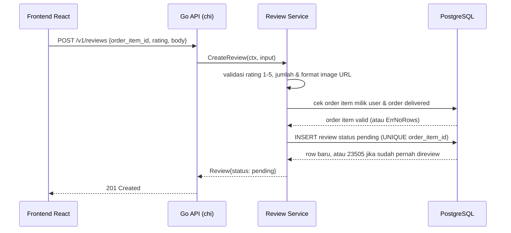
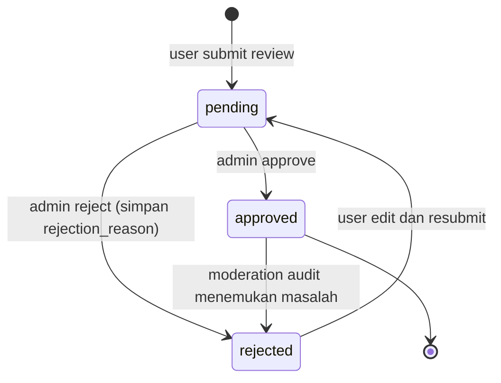
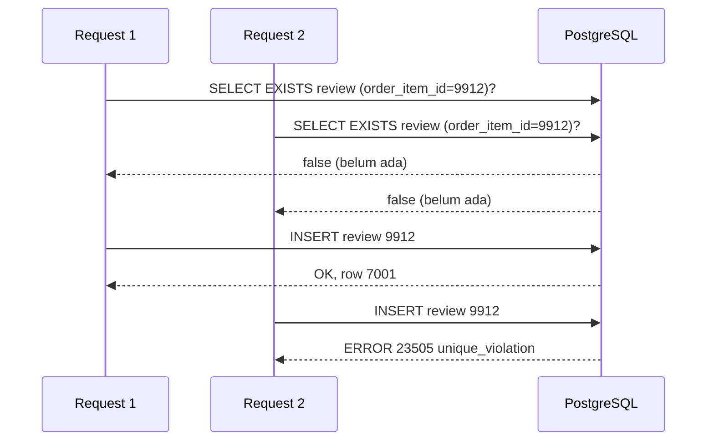

import { Section, Box, Steps, Step, Recap, CardGrid, Card, Chip, Hero, Compare, FileTree, Endpoint, Def } from "@components";

<Hero eyebrow="Roadmap 5 &middot; Domain Online Shop" title="Review dan Rating <em>Domain</em><br />Review Produk yang Tepercaya">
  <p>Review bukan sekadar komentar di bawah produk, tetapi sinyal trust yang memutuskan apakah pembeli lain berani checkout. Modul ini membangun domain review yang ketat: hanya pembeli valid yang boleh bicara, moderasi menyaring sebelum publik, dan rata-rata rating dihitung hanya dari review yang layak dipercaya.</p>
  <Fragment slot="meta">
    <Chip icon="code">Bahasa: <b>Go 1.26</b></Chip>
    <Chip icon="database">DB: <b>PostgreSQL + pgx</b></Chip>
    <Chip icon="shield">Trust layer</Chip>
    <Chip icon="clock">~65 menit baca</Chip>
  </Fragment>
</Hero>

<Section num="01" id="intro" title="Review adalah Trust Layer" sub="Di toko skincare, review menggantikan kesempatan mencoba produk langsung">

<p class="lead">Di toko skincare online, pembeli tidak bisa mencium teksturnya atau mengoles sampel di punggung tangan. Mereka bersandar pada review orang lain untuk menilai cocok atau tidaknya sebuah serum. Itu sebabnya review bukan fitur pelengkap, melainkan lapisan kepercayaan yang menggerakkan penjualan.</p>

Di React atau Laravel, review gampang terlihat seperti CRUD biasa: user mengirim rating dan komentar, data muncul di halaman produk. Mental model itu cukup untuk blog. Untuk e-commerce nyata, ia berbahaya. Kalau siapa pun bisa memberi bintang 5 tanpa pernah membeli, kompetitor bisa menjatuhkan rating produk pesaing, dan brand bisa menyuntik review palsu untuk produknya sendiri. Rata-rata rating yang seharusnya jadi sinyal jujur berubah jadi angka yang bisa dibeli.

<Box variant="bridge" icon="🌉" label="Jembatan: review di Tokopedia/Shopee"><p>Marketplace besar menandai review dengan label "Pembelian terverifikasi" justru karena angka tanpa bukti beli tidak bernilai. Backend harus membuktikan user pernah membeli item itu, bukan percaya pada tombol yang muncul di frontend. Tombol UI hanya saran, sumber kebenaran ada di database.</p></Box>

Di Go, aturan kepercayaan ini kita taruh di **service layer**. Pembagian tugasnya tegas: handler hanya membaca JSON dan menulis response, repository hanya menjalankan query, dan service memutuskan apakah review boleh dibuat. Apakah rating dalam rentang sah, apakah order item benar milik user, apakah order sudah diterima, apakah review sudah pernah dibuat, semua diputuskan di satu tempat yang gampang dibaca dan gampang dites.

<Def term="trust layer"><p>Lapisan aturan yang memastikan data yang tampil ke publik berasal dari sumber yang bisa dipercaya. Untuk review, ini berarti hanya pembeli valid yang ratingnya ikut dihitung dan ditampilkan.</p></Def>

<Def term="verified purchase review"><p>Review yang hanya boleh dibuat jika user memiliki order item untuk produk tersebut, idealnya setelah order berstatus delivered (produk sudah diterima, bukan sekadar dibayar).</p></Def>

<Def term="aggregate rating"><p>Nilai ringkasan seperti rata-rata rating dan jumlah review, dihitung dari review approved saja, supaya review pending atau rejected tidak ikut memengaruhi halaman produk.</p></Def>

</Section>

<Section num="02" id="aturan-domain" title="Aturan Domain Review" sub="Lima pagar yang harus dijaga backend, bukan frontend">

<p class="lead">Domain review wajib ketat karena output-nya dipakai pembeli lain untuk mengambil keputusan. Aturannya sederhana untuk dijelaskan, tetapi harus dijaga di backend tanpa kompromi. Frontend boleh menyembunyikan tombol, namun backend tetap satu-satunya sumber kebenaran.</p>

<CardGrid cols={3}>
  <Card><h4>Verified purchase</h4><p>User hanya bisa review jika punya order item untuk produk itu, dari order yang sudah delivered.</p></Card>
  <Card><h4>Rating 1 sampai 5</h4><p>Rating di luar rentang ini ditolak di service sebelum menyentuh database, dan dijaga ulang oleh CHECK constraint.</p></Card>
  <Card><h4>One review per order item</h4><p>Satu baris order item hanya menghasilkan satu review, sehingga spam terkontrol tanpa melarang pembelian ulang.</p></Card>
  <Card><h4>Moderasi</h4><p>Review baru masuk status pending, lalu admin approve atau reject sebelum tampil publik.</p></Card>
  <Card><h4>Images sebagai URL</h4><p>Review menyimpan array URL gambar, bukan binary file. File fisik tinggal di object storage.</p></Card>
  <Card><h4>Aggregate approved</h4><p>Rata-rata rating dan jumlah review hanya dihitung dari review approved.</p></Card>
</CardGrid>

<Box variant="warn" icon="⚠️" label="Jangan percaya product_id dari frontend saja"><p>User bisa mengirim `product_id` dan `order_item_id` apa pun lewat curl. Backend harus mengecek relasi `order_items`, `orders`, dan `users` di database, bukan mengandalkan body request yang sudah dipoles frontend.</p></Box>

Dalam proyek skincare, review bisa memuat pengalaman kaya: tekstur ringan atau berat, efek di kulit berminyak, apakah cocok untuk kulit sensitif, sampai foto before-after pemakaian. Konten boleh kaya, tetapi pagar trust tetap sama. Satu komentar pendek dari pembeli valid lebih berharga daripada paragraf panjang dari akun yang tidak pernah membeli.

<Box variant="bridge" icon="🌉" label="Jembatan: dari Form Request Laravel ke service rule Go"><p>Di Laravel, kamu mungkin menaruh validasi rating di Form Request dan aturan beli di Policy. Di Go kita memisahkan dua hal ini dengan sengaja: input validation (rating 1 sampai 5, jumlah gambar, format URL) adalah satu lapisan, business rule (verified purchase, anti duplikat) lapisan lain. Pemisahan ini membuat unit test lebih tajam, karena tiap aturan diuji terpisah.</p></Box>

</Section>

<Section num="03" id="model-data" title="Model Data dan Constraint" sub="Database ikut menjaga aturan, bukan hanya kode Go">

<p class="lead">Aturan domain yang penting tidak boleh hanya hidup di kode Go. Kode bisa di-bypass oleh bug, race condition, atau jalur baru yang lupa memanggil validasi. Database adalah pagar terakhir yang selalu menjaga, apa pun yang terjadi di lapisan atas.</p>

Struktur domain review berada di modul `internal/review/`, mengikuti pola modular monolith yang sama dengan domain lain di proyek ini.

<FileTree title="Struktur modul review" tree={`
internal/
  review/
    model.go          # tipe domain Review, ReviewStatus, RatingSummary
    service.go        # business rules: verified purchase, anti spam, validasi
    repository.go     # interface Repository (dibuat di sisi pemakai)
    postgres.go       # implementasi pgx dari Repository
    handler.go        # endpoint HTTP review
    errors.go         # error domain bersama (ErrInvalidRating, dll)
go.mod
`} />

Skema SQL berikut menaruh tiga pagar di level database: rating wajib 1 sampai 5 lewat `CHECK`, status terbatas ke tiga nilai sah, dan satu `order_item_id` hanya boleh punya satu review lewat `UNIQUE` index.

```sql title="db/migrations/059_create_reviews.up.sql"
CREATE TABLE reviews (
    id               BIGINT GENERATED ALWAYS AS IDENTITY PRIMARY KEY,
    user_id          BIGINT NOT NULL REFERENCES users(id),
    product_id       BIGINT NOT NULL REFERENCES products(id),
    order_item_id    BIGINT NOT NULL REFERENCES order_items(id),
    rating           SMALLINT NOT NULL CHECK (rating BETWEEN 1 AND 5),
    body             TEXT NOT NULL DEFAULT '',
    image_urls       TEXT[] NOT NULL DEFAULT '{}',
    status           TEXT NOT NULL DEFAULT 'pending'
                       CHECK (status IN ('pending', 'approved', 'rejected')),
    rejection_reason TEXT NOT NULL DEFAULT '',
    created_at       TIMESTAMPTZ NOT NULL DEFAULT now(),
    updated_at       TIMESTAMPTZ NOT NULL DEFAULT now(),
    moderated_at     TIMESTAMPTZ,
    moderated_by     BIGINT REFERENCES users(id)
);

-- Pagar anti spam: satu order item, satu review.
CREATE UNIQUE INDEX uniq_reviews_order_item_id ON reviews (order_item_id);

-- Listing publik per produk, terbaru dulu.
CREATE INDEX idx_reviews_product_status_created
    ON reviews (product_id, status, created_at DESC);

-- Filter "lihat review bintang 5" dan agregasi per produk.
CREATE INDEX idx_reviews_product_status_rating
    ON reviews (product_id, status, rating);
```

<Box variant="tip" icon="💡" label="Kenapa unik per order_item_id, bukan per product_id"><p>Kalau user membeli toner yang sama di dua order berbeda, ia berhak menulis dua review karena pengalaman belinya memang dua kali (mungkin batch produksi atau kondisi kulit berbeda). Tapi satu baris order item tetap hanya boleh menghasilkan satu review. `order_item_id` adalah identitas pengalaman beli yang paling presisi.</p></Box>

Review images disimpan sebagai `TEXT[]` karena file gambar idealnya di-upload ke object storage seperti S3, lalu review hanya menyimpan URL final. Validasi jumlah gambar, format URL, dan ukuran file tetap dilakukan di service review atau di modul media saat upload. Database review tidak perlu tahu byte gambarnya.

```go title="internal/review/model.go"
package review

import "time"

type ReviewStatus string

const (
	ReviewStatusPending  ReviewStatus = "pending"
	ReviewStatusApproved ReviewStatus = "approved"
	ReviewStatusRejected ReviewStatus = "rejected"
)

// Review adalah satu baris review produk dari satu pembelian spesifik.
type Review struct {
	ID              int64
	UserID          int64
	ProductID       int64
	OrderItemID     int64
	Rating          int
	Body            string
	ImageURLs       []string
	Status          ReviewStatus
	RejectionReason string
	CreatedAt       time.Time
	UpdatedAt       time.Time
	ModeratedAt     *time.Time // nil selama masih pending
	ModeratedBy     *int64     // nil selama belum dimoderasi
}

// RatingSummary adalah ringkasan rating produk untuk halaman katalog.
type RatingSummary struct {
	AverageRating float64
	ReviewCount   int64
}
```

<Box variant="note" icon="📝" label="Pointer untuk nilai yang boleh kosong"><p>`ModeratedAt` dan `ModeratedBy` adalah pointer (`*time.Time`, `*int64`) supaya bisa bernilai `nil` selama review belum dimoderasi. Di JS, ini padanan dari `null` yang berbeda dari `0` atau string kosong. Pakai pointer hanya saat "tidak ada nilai" bermakna beda dari zero value, bukan untuk semua kolom.</p></Box>

</Section>

<Section num="04" id="verified-purchase" title="Verified Purchase Review" sub="Pagar utama agar rating tidak bisa dibeli">

<p class="lead">Verified purchase adalah pagar paling penting. Tanpa ini, semua aturan lain runtuh karena rata-rata rating bisa diisi siapa saja. Aturannya: user boleh membuat review jika ada `order_items.id` yang cocok, order itu miliknya, item mengarah ke produk yang direview, dan order sudah delivered.</p>

Kenapa harus delivered, bukan cukup paid atau shipped? Karena status paid berarti uang sudah masuk, tetapi produk belum tentu sampai. User belum bisa menilai tekstur serum yang masih di gudang. Menunggu delivered menjamin reviewer benar-benar sudah memegang dan mencoba produknya.



<p class="fig-cap"><b>Gambar 1.</b> Review baru dibuat hanya setelah service membuktikan pembelian valid. Validasi murni (rating, URL) jalan duluan karena murah, baru cek database yang lebih mahal.</p>

Urutan langkah di service sengaja menaruh validasi murah dulu. Cek rating dan format URL tidak menyentuh database, jadi request sampah (rating 99, URL ngawur) ditolak tanpa membebani PostgreSQL. Baru setelah lolos, service menanyakan database apakah pembelian valid.

Query validasi memakai `order_item_id`, bukan hanya `product_id`. Kalau user pernah membeli produk yang sama beberapa kali, `order_item_id` memberi identitas pengalaman beli yang spesifik, dan join memastikan item itu memang milik user dari order yang sudah delivered.

```sql title="queries/reviewable_order_item.sql"
SELECT oi.id, oi.product_id
FROM order_items oi
JOIN orders o ON o.id = oi.order_id
WHERE oi.id = $1
  AND oi.product_id = $2
  AND o.user_id = $3
  AND o.status = 'delivered';
```

<Box variant="bridge" icon="🌉" label="Jembatan: Laravel Policy vs service rule Go"><p>Di Laravel, kamu mungkin menaruh aturan ini di Policy (`ReviewPolicy@create`) yang dipanggil otomatis oleh `authorize()`. Di Go tidak ada magic itu. Aturan tinggal eksplisit di method service, dipanggil langsung. Lebih banyak baris, tetapi handler, repository, dan test tetap bersih karena setiap keputusan kelihatan di satu tempat.</p></Box>

</Section>

<Section num="05" id="moderasi" title="Moderasi: Pending, Approved, Rejected" sub="Memisahkan input user dari data yang dipercaya publik">

<p class="lead">Moderasi memisahkan apa yang dikirim user dari apa yang dipercaya publik. Review baru tidak langsung tampil di halaman produk. Statusnya pending, lalu admin atau sistem moderasi mengubahnya menjadi approved jika layak, atau rejected jika mengandung spam, data sensitif, klaim medis berlebihan, ujaran kebencian, atau gambar tak relevan.</p>



<p class="fig-cap"><b>Gambar 2.</b> State review menjaga halaman produk tetap bersih. Hanya status approved yang tampil publik dan ikut rata-rata rating. Audit memungkinkan review approved ditarik kembali jika ternyata melanggar.</p>

Perhatikan transisi `approved --> rejected`. Moderasi tidak berhenti saat review disetujui. Kadang laporan dari pembeli lain atau audit internal menemukan review approved yang ternyata bermasalah, dan ia bisa ditarik. Karena agregat rating hanya menghitung approved, menarik satu review otomatis memperbaiki rata-rata tanpa langkah tambahan.

<Compare aLabel="Frontend mindset" bLabel="Backend domain mindset" aTone="muted" bTone="violet">
  <Fragment slot="a"><ul><li>Tombol review muncul jika order terlihat selesai di UI.</li><li>Review baru langsung terasa final di layar, seolah sudah tampil ke semua orang.</li><li>Rata-rata rating diasumsikan ikut update seketika.</li></ul></Fragment>
  <Fragment slot="b"><ul><li>Hak review dicek ulang di service, bukan dipercaya dari state UI.</li><li>Review pending belum masuk listing publik maupun agregat rating.</li><li>Rata-rata hanya berubah saat review berpindah ke atau dari status approved.</li></ul></Fragment>
</Compare>

Setiap perpindahan status, simpan `moderated_by`, `moderated_at`, dan untuk reject simpan `rejection_reason`. Jejak ini membuat tim support bisa menjawab pertanyaan user dengan jelas ("review kamu ditolak karena memuat nomor telepon") tanpa menebak-nebak.

```sql title="queries/moderate_review.sql"
UPDATE reviews
SET status = $2,
    rejection_reason = $3,
    moderated_by = $4,
    moderated_at = now(),
    updated_at = now()
WHERE id = $1
  AND status <> $2;
```

<Box variant="note" icon="📝" label="Kenapa status <> $2 di WHERE"><p>Klausa `status <> $2` membuat update idempoten secara halus: meng-approve review yang sudah approved tidak menulis ulang `moderated_at`. Hasilnya, `RowsAffected() == 0` bisa kamu pakai untuk membedakan "tidak ada perubahan" dari "review berhasil dimoderasi".</p></Box>

</Section>

<Section num="06" id="rating-average" title="Rata-rata Rating yang Akurat" sub="Hitung dari data yang layak tampil, bukan semua row mentah">

<p class="lead">Rata-rata rating harus dihitung hanya dari review yang layak dipercaya. Review pending belum diverifikasi manusia, dan review rejected memang tidak boleh memengaruhi keputusan pembeli. Jadi rumusnya bukan `AVG(rating)` dari semua row, melainkan `AVG` dan `COUNT` dari review berstatus approved saja.</p>

```sql title="queries/product_rating_summary.sql"
SELECT
    COALESCE(ROUND(AVG(rating)::numeric, 1), 0) AS average_rating,
    COUNT(*)                                    AS review_count
FROM reviews
WHERE product_id = $1
  AND status = 'approved';
```

<Box variant="note" icon="📝" label="Kenapa COALESCE dan rounding di query"><p>`AVG` mengembalikan `NULL` jika belum ada review approved, jadi `COALESCE(..., 0)` mengubahnya jadi `0` agar Go tidak perlu menangani null. `ROUND(..., 1)` membuat rating tampil stabil seperti `4.6`, bukan `4.5999999`. Untuk analitik internal yang butuh presisi penuh, hitung versi tanpa rounding terpisah.</p></Box>

Ada dua strategi menghitung agregat, dan keduanya sah tergantung skala.

<Compare aLabel="Strategi A: hitung saat dibaca (read-time)" bLabel="Strategi B: denormalized summary (write-time)" aTone="blue" bTone="teal">
  <Fragment slot="a"><ul><li>Jalankan aggregate query setiap halaman produk dibuka.</li><li>Sederhana, selalu konsisten, tidak ada data ganda.</li><li>Cukup untuk awal dan traffic sedang, ditopang index `(product_id, status)`.</li></ul></Fragment>
  <Fragment slot="b"><ul><li>Simpan `average_rating` dan `review_count` di kolom produk atau tabel ringkasan.</li><li>Update saat review masuk atau keluar status approved.</li><li>Lebih cepat untuk katalog ramai, tetapi butuh jaga konsistensi tambahan.</li></ul></Fragment>
</Compare>

<Box variant="bridge" icon="🌉" label="Jembatan: useMemo vs cache yang harus di-invalidate"><p>Strategi B mirip caching nilai turunan di frontend. Seperti `useMemo` yang harus tahu kapan dependency-nya berubah, kolom `average_rating` harus di-update setiap review berpindah ke atau dari approved. Lupa invalidate berarti angka basi. Untuk proyek ini mulai dari Strategi A yang selalu benar, pindah ke B hanya saat profiling menunjukkan query agregat jadi hotspot.</p></Box>

Listing review publik juga memfilter ke approved, dan menyediakan filter opsional per rating untuk UX seperti "lihat semua review bintang 1". Pagination wajib karena review tumbuh jauh lebih cepat daripada katalog produk.

```sql title="queries/list_product_reviews.sql"
SELECT id, user_id, product_id, order_item_id, rating, body, image_urls, status, created_at
FROM reviews
WHERE product_id = $1
  AND status = 'approved'
  AND ($2::int IS NULL OR rating = $2)
ORDER BY created_at DESC
LIMIT $3 OFFSET $4;
```

Trik `($2::int IS NULL OR rating = $2)` membuat satu query melayani dua kasus sekaligus: kalau `$2` nil maka filter rating diabaikan, kalau berisi angka maka hanya rating itu yang tampil. Tidak perlu menulis dua query atau menyusun SQL string secara dinamis, dan tetap aman dari injection karena tetap parameterized.

</Section>

<Section num="07" id="endpoint" title="Endpoint Review dan Rating" sub="Pisahkan listing publik dari aksi user yang butuh autentikasi">

<p class="lead">Endpoint review dibagi jelas antara listing yang publik dan aksi yang butuh autentikasi. Halaman produk siapa pun boleh membaca review approved, tetapi membuat review butuh user yang login dan terbukti membeli.</p>

<Endpoint method="GET" path="/v1/products/{id}/reviews" desc="Review approved untuk produk, paginated, opsional filter by rating. Publik." />
<Endpoint method="POST" path="/v1/reviews" desc="Buat review dari order item delivered yang belum pernah direview. Butuh auth." />
<Endpoint method="GET" path="/v1/products/{id}/rating" desc="Ringkasan rating: average_rating dan review_count. Publik." />

Request listing memakai query param standar. `rating` opsional, `page` dan `per_page` untuk pagination.

```text title="HTTP"
GET /v1/products/120/reviews?rating=5&page=1&per_page=20
```

Request membuat review membawa `order_item_id` agar backend bisa membuktikan review berasal dari pembelian spesifik. `product_id` boleh dikirim untuk kenyamanan, tetapi backend tetap memverifikasinya terhadap order item.

```json title="POST /v1/reviews"
{
  "product_id": 120,
  "order_item_id": 9912,
  "rating": 5,
  "body": "Teksturnya ringan dan cocok untuk kulit berminyak saya.",
  "image_urls": [
    "https://cdn.example.com/reviews/9912-before.jpg",
    "https://cdn.example.com/reviews/9912-after.jpg"
  ]
}
```

Response sukses sengaja menegaskan bahwa review belum tampil publik. Statusnya pending, dan pesan ke user jujur soal itu agar mereka tidak bingung kenapa review-nya belum kelihatan di halaman produk.

```json title="201 Created"
{
  "data": {
    "id": 7001,
    "product_id": 120,
    "order_item_id": 9912,
    "rating": 5,
    "status": "pending",
    "message": "Review kamu sedang menunggu moderasi."
  }
}
```

<Box variant="warn" icon="⚠️" label="Jangan expose review pending di endpoint publik"><p>Endpoint `/v1/products/{id}/reviews` hanya boleh mengembalikan review approved. Review pending milik user boleh ditampilkan di halaman akun "Review saya", bukan di halaman produk publik. Memcampur keduanya membocorkan konten yang belum dimoderasi.</p></Box>

</Section>

<Section num="08" id="service-go" title="Implementasi Service di Go" sub="Tempat verified purchase, rating, image URL, dan anti spam bertemu">

<p class="lead">Service adalah jantung domain review. Ia menerima interface repository (bukan struct konkret), sehingga aturan domain bisa dites tanpa database asli. Inilah idiom Go yang sudah dipakai di seluruh proyek: accept interfaces, return structs.</p>

Pertama, error domain dikumpulkan di satu file agar handler bisa memetakannya ke status HTTP yang tepat, dan agar test bisa mencocokkan dengan `errors.Is`.

```go title="internal/review/errors.go"
package review

import "errors"

var (
	ErrInvalidRating       = errors.New("rating must be between 1 and 5")
	ErrInvalidImageURL     = errors.New("review image URL is invalid")
	ErrTooManyImages       = errors.New("review images exceed limit")
	ErrNotVerifiedPurchase = errors.New("review requires verified purchase")
	ErrReviewAlreadyExists = errors.New("review for order item already exists")
)

const maxReviewImages = 5
```

Service mendeklarasikan interface `Repository` yang ia butuhkan, lalu mengeksekusi aturan secara berurutan: validasi murni dulu, baru cek database. Detail koneksi `pgx` tidak pernah bocor ke sini.

```go title="internal/review/service.go"
package review

import (
	"context"
	"net/url"
	"strings"
)

type Repository interface {
	FindReviewableOrderItem(ctx context.Context, userID, productID, orderItemID int64) (OrderItemRef, error)
	CreateReview(ctx context.Context, input CreateReviewInput) (Review, error)
}

type Service struct {
	repo Repository
}

func NewService(repo Repository) *Service {
	return &Service{repo: repo}
}

type OrderItemRef struct {
	ID        int64
	ProductID int64
}

type CreateReviewInput struct {
	UserID      int64
	ProductID   int64
	OrderItemID int64
	Rating      int
	Body        string
	ImageURLs   []string
	Status      ReviewStatus
}

func (s *Service) CreateReview(ctx context.Context, input CreateReviewInput) (Review, error) {
	// 1. Validasi murni (tanpa I/O): tolak sampah sebelum menyentuh database.
	if input.Rating < 1 || input.Rating > 5 {
		return Review{}, ErrInvalidRating
	}
	if len(input.ImageURLs) > maxReviewImages {
		return Review{}, ErrTooManyImages
	}
	for _, rawURL := range input.ImageURLs {
		if !isValidHTTPURL(rawURL) {
			return Review{}, ErrInvalidImageURL
		}
	}

	// 2. Verified purchase: order item harus milik user dan dari order delivered.
	if _, err := s.repo.FindReviewableOrderItem(ctx, input.UserID, input.ProductID, input.OrderItemID); err != nil {
		return Review{}, err // repo memetakan ErrNoRows -> ErrNotVerifiedPurchase
	}

	// 3. Normalisasi lalu serahkan ke repository. INSERT dengan UNIQUE index
	//    adalah pagar anti-duplikat sesungguhnya; lihat section race condition.
	input.Body = strings.TrimSpace(input.Body)
	input.Status = ReviewStatusPending

	return s.repo.CreateReview(ctx, input)
}

func isValidHTTPURL(rawURL string) bool {
	parsed, err := url.ParseRequestURI(rawURL)
	if err != nil {
		return false
	}
	return parsed.Scheme == "http" || parsed.Scheme == "https"
}
```

<Box variant="tip" icon="💡" label="Context sebagai parameter pertama"><p>Setiap method yang bisa menyentuh I/O menerima `context.Context` sebagai parameter pertama. Saat user menutup tab di tengah submit review, cancellation menjalar dari HTTP request sampai ke query database, sehingga query yang sudah tak diperlukan ikut dibatalkan. Ini idiom Go yang konsisten dari handler sampai repository.</p></Box>

<Box variant="bridge" icon="🌉" label="Jembatan: validasi murni vs business rule"><p>Di React, kamu memisahkan validasi form (field wajib, format email) dari logika bisnis (boleh checkout atau tidak). Di Go pemisahan ini eksplisit dalam urutan kode: blok 1 adalah validasi murni yang gampang dites tanpa mock, blok 2 dan 3 adalah business rule yang butuh repository. Test untuk "rating 6 ditolak" tidak perlu menyiapkan fake database sama sekali.</p></Box>

Handler tetap tipis. Ia membaca JSON, mengambil `userID` dari context (diisi middleware auth di Roadmap 7), memanggil service, lalu memetakan error ke status HTTP. Detail autentikasi diasumsikan sudah ada.

```go title="internal/review/handler.go"
package review

import (
	"encoding/json"
	"errors"
	"net/http"
	"strconv"

	"github.com/go-chi/chi/v5"
)

type Handler struct {
	service *Service
}

func NewHandler(service *Service) *Handler {
	return &Handler{service: service}
}

func (h *Handler) RegisterRoutes(r chi.Router) {
	r.Get("/v1/products/{id}/reviews", h.ListProductReviews)
	r.Post("/v1/reviews", h.CreateReview)
}

type createReviewRequest struct {
	ProductID   int64    `json:"product_id"`
	OrderItemID int64    `json:"order_item_id"`
	Rating      int      `json:"rating"`
	Body        string   `json:"body"`
	ImageURLs   []string `json:"image_urls"`
}

func (h *Handler) CreateReview(w http.ResponseWriter, r *http.Request) {
	var req createReviewRequest
	if err := json.NewDecoder(r.Body).Decode(&req); err != nil {
		http.Error(w, "invalid JSON body", http.StatusBadRequest)
		return
	}

	userID := mustUserIDFromContext(r) // diisi middleware auth (Roadmap 7)
	created, err := h.service.CreateReview(r.Context(), CreateReviewInput{
		UserID:      userID,
		ProductID:   req.ProductID,
		OrderItemID: req.OrderItemID,
		Rating:      req.Rating,
		Body:        req.Body,
		ImageURLs:   req.ImageURLs,
	})
	if err != nil {
		writeReviewError(w, err)
		return
	}

	w.Header().Set("Content-Type", "application/json")
	w.WriteHeader(http.StatusCreated)
	_ = json.NewEncoder(w).Encode(map[string]any{
		"data": map[string]any{
			"id":            created.ID,
			"product_id":    created.ProductID,
			"order_item_id": created.OrderItemID,
			"rating":        created.Rating,
			"status":        created.Status,
			"message":       "Review kamu sedang menunggu moderasi.",
		},
	})
}

// writeReviewError memetakan error domain ke status HTTP yang sesuai.
func writeReviewError(w http.ResponseWriter, err error) {
	switch {
	case errors.Is(err, ErrInvalidRating),
		errors.Is(err, ErrInvalidImageURL),
		errors.Is(err, ErrTooManyImages):
		http.Error(w, err.Error(), http.StatusBadRequest)
	case errors.Is(err, ErrNotVerifiedPurchase):
		http.Error(w, "kamu hanya bisa review produk yang sudah kamu terima", http.StatusForbidden)
	case errors.Is(err, ErrReviewAlreadyExists):
		http.Error(w, "kamu sudah pernah review pembelian ini", http.StatusConflict)
	default:
		http.Error(w, "internal error", http.StatusInternalServerError)
	}
}

func (h *Handler) ListProductReviews(w http.ResponseWriter, r *http.Request) {
	productID, err := strconv.ParseInt(chi.URLParam(r, "id"), 10, 64)
	if err != nil || productID <= 0 {
		http.Error(w, "invalid product id", http.StatusBadRequest)
		return
	}
	// Listing memanggil repository dengan filter status approved + pagination.
	// Disederhanakan di sini agar fokus pada alur create review.
	_ = productID
	w.WriteHeader(http.StatusNotImplemented)
}
```

<Box variant="tip" icon="💡" label="Error domain menentukan status HTTP"><p>`writeReviewError` menerjemahkan error domain ke status yang bermakna: validasi gagal jadi 400, bukan pembeli valid jadi 403, sudah pernah review jadi 409 Conflict. Memetakan error di satu tempat membuat handler tetap tipis dan response konsisten di seluruh endpoint review.</p></Box>

</Section>

<Section num="09" id="repository-pgx" title="Query Repository dengan pgx" sub="Aturan service menjadi query yang aman dan parameterized">

<p class="lead">Repository mengubah aturan service menjadi query PostgreSQL yang aman. Ia memakai `pgxpool.Pool`, parameter `$1`, `$2`, `$3`, dan menerjemahkan error database (seperti `pgx.ErrNoRows`) menjadi error domain yang sudah dikenal service.</p>

```go title="internal/review/postgres.go"
package review

import (
	"context"
	"errors"

	"github.com/jackc/pgx/v5"
	"github.com/jackc/pgx/v5/pgxpool"
)

type PostgresRepository struct {
	pool *pgxpool.Pool
}

func NewPostgresRepository(pool *pgxpool.Pool) *PostgresRepository {
	return &PostgresRepository{pool: pool}
}

// FindReviewableOrderItem memetakan "tidak ada baris" menjadi ErrNotVerifiedPurchase,
// sehingga service tidak perlu tahu soal pgx.ErrNoRows.
func (r *PostgresRepository) FindReviewableOrderItem(ctx context.Context, userID, productID, orderItemID int64) (OrderItemRef, error) {
	const query = `
SELECT oi.id, oi.product_id
FROM order_items oi
JOIN orders o ON o.id = oi.order_id
WHERE oi.id = $1
  AND oi.product_id = $2
  AND o.user_id = $3
  AND o.status = 'delivered'`

	var ref OrderItemRef
	err := r.pool.QueryRow(ctx, query, orderItemID, productID, userID).
		Scan(&ref.ID, &ref.ProductID)
	if errors.Is(err, pgx.ErrNoRows) {
		return OrderItemRef{}, ErrNotVerifiedPurchase
	}
	if err != nil {
		return OrderItemRef{}, err
	}
	return ref, nil
}

func (r *PostgresRepository) GetRatingSummary(ctx context.Context, productID int64) (RatingSummary, error) {
	const query = `
SELECT
    COALESCE(ROUND(AVG(rating)::numeric, 1), 0) AS average_rating,
    COUNT(*)                                    AS review_count
FROM reviews
WHERE product_id = $1
  AND status = 'approved'`

	var summary RatingSummary
	err := r.pool.QueryRow(ctx, query, productID).
		Scan(&summary.AverageRating, &summary.ReviewCount)
	if err != nil {
		return RatingSummary{}, err
	}
	return summary, nil
}
```

Untuk listing review, repository menerima filter dengan `rating *int` yang opsional. Pointer nil berarti "tanpa filter rating", dan `pgx` memetakan `*int` nil menjadi `NULL` di parameter, sehingga klausa `($2::int IS NULL OR rating = $2)` bekerja sesuai rencana.

```go title="internal/review/repository.go"
package review

type ListReviewsFilter struct {
	ProductID int64
	Rating    *int // nil = semua rating
	Limit     int
	Offset    int
}
```

```go title="internal/review/postgres.go (listing)"
func (r *PostgresRepository) ListProductReviews(ctx context.Context, f ListReviewsFilter) ([]Review, error) {
	const query = `
SELECT id, user_id, product_id, order_item_id, rating, body, image_urls, status, created_at, updated_at
FROM reviews
WHERE product_id = $1
  AND status = 'approved'
  AND ($2::int IS NULL OR rating = $2)
ORDER BY created_at DESC
LIMIT $3 OFFSET $4`

	rows, err := r.pool.Query(ctx, query, f.ProductID, f.Rating, f.Limit, f.Offset)
	if err != nil {
		return nil, err
	}
	defer rows.Close()

	var reviews []Review
	for rows.Next() {
		var rv Review
		if err := rows.Scan(
			&rv.ID, &rv.UserID, &rv.ProductID, &rv.OrderItemID,
			&rv.Rating, &rv.Body, &rv.ImageURLs, &rv.Status,
			&rv.CreatedAt, &rv.UpdatedAt,
		); err != nil {
			return nil, err
		}
		reviews = append(reviews, rv)
	}
	return reviews, rows.Err()
}
```

<Box variant="tip" icon="💡" label="Selalu cek rows.Err() setelah loop"><p>`rows.Next()` mengembalikan `false` baik saat data habis maupun saat terjadi error di tengah iterasi. Tanpa `rows.Err()` di akhir, kamu bisa diam-diam mengembalikan hasil parsial seolah sukses. Ini jebakan halus pgx yang gampang terlewat. `defer rows.Close()` juga wajib agar koneksi kembali ke pool.</p></Box>

Scanning `TEXT[]` ke `[]string` berjalan otomatis di pgx v5, jadi `image_urls` di-scan langsung ke field `ImageURLs []string` tanpa konversi manual. Hal yang dulu merepotkan dengan `database/sql` polos jadi mulus di pgx.

</Section>

<Section num="10" id="race-idempoten" title="Race Condition dan Pagar Database" sub="Cek-lalu-insert tidak cukup, UNIQUE index yang menjamin">

<p class="lead">Pola "cek dulu apakah review ada, baru insert" terlihat aman, tetapi punya celah halus. Dua request dari user yang sama (misalnya double tap di mobile) bisa lolos pengecekan secara bersamaan, lalu sama-sama insert. Inilah race condition klasik, dan jawabannya bukan menambah pengecekan, melainkan menyerahkan jaminan ke database.</p>



<p class="fig-cap"><b>Gambar 3.</b> Kedua request lolos pengecekan EXISTS karena keduanya jalan sebelum INSERT pertama selesai. UNIQUE index pada order_item_id menjegal INSERT kedua dengan error 23505.</p>

Karena itu, kita tidak repot dengan `SELECT EXISTS` terlebih dahulu. Langsung INSERT, lalu tangani kasus duplikat dari error yang dikembalikan database. PostgreSQL mengembalikan kode error `23505` (unique_violation) saat `UNIQUE` index dilanggar, dan pgx membungkusnya dalam `*pgconn.PgError` yang bisa kita periksa dengan `errors.As`.

```go title="internal/review/postgres.go (create)"
package review

import (
	"context"
	"errors"

	"github.com/jackc/pgx/v5/pgconn"
)

// pgUniqueViolation adalah kode SQLSTATE untuk pelanggaran UNIQUE constraint.
const pgUniqueViolation = "23505"

func (r *PostgresRepository) CreateReview(ctx context.Context, input CreateReviewInput) (Review, error) {
	const query = `
INSERT INTO reviews (user_id, product_id, order_item_id, rating, body, image_urls, status)
VALUES ($1, $2, $3, $4, $5, $6, $7)
RETURNING id, user_id, product_id, order_item_id, rating, body, image_urls, status, created_at, updated_at`

	var rv Review
	err := r.pool.QueryRow(ctx, query,
		input.UserID, input.ProductID, input.OrderItemID,
		input.Rating, input.Body, input.ImageURLs, input.Status,
	).Scan(
		&rv.ID, &rv.UserID, &rv.ProductID, &rv.OrderItemID,
		&rv.Rating, &rv.Body, &rv.ImageURLs, &rv.Status,
		&rv.CreatedAt, &rv.UpdatedAt,
	)

	// Duplikat order_item_id melanggar UNIQUE index -> error domain yang ramah.
	var pgErr *pgconn.PgError
	if errors.As(err, &pgErr) && pgErr.Code == pgUniqueViolation {
		return Review{}, ErrReviewAlreadyExists
	}
	if err != nil {
		return Review{}, err
	}
	return rv, nil
}
```

<Box variant="warn" icon="⚠️" label="Impor pgconn yang benar di pgx v5"><p>Gunakan `github.com/jackc/pgx/v5/pgconn`, bukan `github.com/jackc/pgconn` yang lama. Dua paket ini punya tipe `PgError` dengan nama sama tetapi path berbeda, sehingga `errors.As` akan gagal diam-diam (selalu `false`) kalau kamu memakai path yang salah. Bug ini terkenal menyebalkan karena kodenya terlihat benar tetapi tidak pernah cocok.</p></Box>

<Box variant="bridge" icon="🌉" label="Jembatan: dari upsert Laravel ke INSERT lalu tangani 23505"><p>Di Laravel kamu mungkin pakai `firstOrCreate` atau menangkap `QueryException` lalu memeriksa `$e->errorInfo[1]`. Polanya identik di Go: andalkan UNIQUE constraint sebagai sumber kebenaran, lalu ubah pelanggarannya menjadi pesan ramah. Database yang memutuskan siapa yang menang dalam balapan, bukan kode aplikasi yang berebut.</p></Box>

Kalau kamu tetap ingin pesan error yang lebih cepat untuk kasus umum (user yang sudah jelas pernah review), boleh menambah `SELECT EXISTS` sebagai optimasi UX. Tetapi ingat: itu hanya optimasi, bukan jaminan. `UNIQUE` index tetap pagar terakhir yang tak bisa ditawar.

</Section>

<Section num="11" id="hands-on" title="Hands-on Ringan" sub="Hubungkan review ke checkout, order lifecycle, dan katalog">

<p class="lead">Latihan ini menyambungkan review ke chapter sebelumnya: katalog produk, checkout, dan order lifecycle. Tujuannya membuktikan bahwa pagar trust benar-benar bekerja, bukan sekadar ada di kode.</p>

<Steps>
  <Step><b>Tambahkan migration reviews</b><p>Buat tabel `reviews`, `UNIQUE` index untuk `order_item_id`, plus dua index listing.</p></Step>
  <Step><b>Seed order delivered</b><p>Siapkan satu user, satu produk toner, satu order berstatus `delivered`, dan satu order item.</p></Step>
  <Step><b>Kirim review valid</b><p>Panggil `POST /v1/reviews` dengan `order_item_id` valid dan rating 5. Pastikan response 201 dengan status `pending`.</p></Step>
  <Step><b>Coba spam (duplikat)</b><p>Kirim request yang sama dua kali. Request kedua harus gagal 409 karena order item sudah direview.</p></Step>
  <Step><b>Coba review palsu</b><p>Pakai `order_item_id` milik user lain. Service harus menolak 403 sebagai bukan verified purchase.</p></Step>
  <Step><b>Approve lalu cek agregat</b><p>Ubah status jadi `approved`, lalu panggil `GET /v1/products/{id}/rating` dan pastikan `average_rating` dan `review_count` ikut.</p></Step>
</Steps>

Seed sederhana untuk menyiapkan produk skincare yang bisa direview.

```sql title="db/seeds/review_demo.sql"
INSERT INTO brands (id, name) VALUES (1, 'Wardah') ON CONFLICT DO NOTHING;
INSERT INTO categories (id, name) VALUES (1, 'Toner') ON CONFLICT DO NOTHING;

INSERT INTO products (id, brand_id, category_id, name, slug, status)
VALUES (120, 1, 1, 'Wardah Hydrating Toner', 'wardah-hydrating-toner', 'active')
ON CONFLICT DO NOTHING;

INSERT INTO product_variants (id, product_id, sku, name, price, status)
VALUES (301, 120, 'WRD-TONER-100ML', '100ml', 42000, 'active')
ON CONFLICT DO NOTHING;
```

<Box variant="note" icon="📝" label="Harga tetap rupiah bilangan bulat"><p>Kolom `price` di seed bernilai `42000` (Rp 42.000), tipe `BIGINT`, dipetakan ke `PriceRupiah int64` di domain. Konsisten dengan modul katalog dan checkout: uang tidak pernah `float`, selalu rupiah bulat agar tidak ada pembulatan yang menggerogoti angka.</p></Box>

<Box variant="note" icon="🧭" label="Latihan realistis"><p>Di aplikasi nyata, order dan order item dibuat lewat checkout, bukan seed. Seed hanya dipakai agar latihan review bisa fokus pada domain review tanpa mengulang alur checkout penuh.</p></Box>

</Section>

<Section num="12" id="jebakan" title="Jebakan Umum dari JS dan PHP" sub="Kesalahan review datang dari batas trust yang kabur">

<p class="lead">Kesalahan review jarang soal query yang sulit. Hampir selalu soal batas kepercayaan yang kabur: backend terlalu percaya pada frontend, atau menghitung agregat dari data yang belum layak. Empat jebakan ini paling sering muncul.</p>

<Compare aLabel="Kebiasaan JS/PHP" bLabel="Arah Go yang lebih aman" aTone="muted" bTone="violet">
  <Fragment slot="a"><ul><li>Mengandalkan tombol UI untuk mencegah user yang belum membeli.</li><li>Menghitung rata-rata dari semua row review, termasuk pending.</li><li>Menganggap validasi Form Request cukup untuk business rule.</li><li>Cek-lalu-insert dianggap aman dari duplikat.</li></ul></Fragment>
  <Fragment slot="b"><ul><li>Service tetap memvalidasi order item, user, product, dan status order delivered.</li><li>Agregat hanya dari review approved, ditegakkan di klausa WHERE.</li><li>Input validation dan business rule dipisah agar test lebih tajam.</li><li>UNIQUE index plus penanganan 23505 jadi pagar anti-duplikat.</li></ul></Fragment>
</Compare>

<CardGrid cols={2}>
  <Card><h4>Review tanpa order item</h4><p>Membuka pintu rating palsu untuk siapa saja. Selalu validasi `order_item_id` terhadap order milik user yang sudah delivered.</p></Card>
  <Card><h4>Unik per user saja, terlalu ketat</h4><p>`UNIQUE(user_id, product_id)` melarang review untuk pembelian ulang yang sah. Pakai `order_item_id` agar tiap pengalaman beli bisa direview.</p></Card>
  <Card><h4>Pending ikut agregat</h4><p>Review pending belum dimoderasi, jadi tidak boleh ikut `AVG(rating)`. Filter `status = 'approved'` di setiap query agregat.</p></Card>
  <Card><h4>Gambar sebagai binary di database</h4><p>Menyimpan byte gambar di `bytea` membengkakkan tabel dan backup. Simpan di object storage, database cukup URL.</p></Card>
</CardGrid>

<Box variant="warn" icon="⚠️" label="Jebakan race condition pada review duplikat"><p>Dua request paralel bisa sama-sama lolos `SELECT EXISTS`, lalu sama-sama insert. Tanpa `UNIQUE` index, kamu dapat dua review untuk satu order item. Dengan UNIQUE index, INSERT kedua dijegal kode `23505` yang kamu petakan menjadi `ErrReviewAlreadyExists`. Database yang menang balapan, bukan kode aplikasi.</p></Box>

<Box variant="bridge" icon="🌉" label="Jembatan: dari double submit React ke duplikat di backend"><p>Seperti tombol submit yang bisa terklik dua kali sebelum di-disable, request review juga bisa datang ganda. Di frontend kamu men-disable tombol; di backend kamu memasang UNIQUE constraint. Keduanya solusi untuk masalah yang sama (operasi yang tak boleh terjadi dua kali), hanya di lapisan berbeda. Yang backend jaga adalah yang tak bisa di-bypass.</p></Box>

</Section>

<Section num="13" id="ringkasan" title="Ringkasan & Poin Penting" sub="Review yang tepercaya menutup domain online shop skincare">

<p class="lead">Review dan rating memperkuat trust katalog, tetapi hanya jika domain rule-nya dijaga ketat di service dan ditegakkan di database. Modul ini melengkapi rangkaian domain online shop: katalog, search, cart, checkout, inventory, payment, order lifecycle, promosi, dan kini review.</p>

<Recap title="Yang Wajib Menempel">
  <ul>
    <li>Review adalah trust layer, bukan CRUD biasa. Hanya pembeli valid yang ratingnya ikut dihitung dan ditampilkan.</li>
    <li>Verified purchase berarti user harus punya order item untuk produk itu, dari order berstatus `delivered`, divalidasi di service lewat join `order_items`, `orders`, `users`.</li>
    <li>Rating wajib 1 sampai 5, dijaga dua lapis: validasi murni di service dan `CHECK` constraint di database.</li>
    <li>Review baru masuk `pending`, lalu hanya `approved` yang tampil publik dan ikut agregat. Status `rejected` menyimpan `rejection_reason` untuk audit.</li>
    <li>Rata-rata rating memakai `AVG`, `COUNT`, `COALESCE`, dan `ROUND`, hanya dari review `approved`. Mulai dari hitung read-time, pindah ke denormalized summary hanya saat profiling menuntut.</li>
    <li>One review per order item ditegakkan `UNIQUE` index, bukan `SELECT EXISTS`. Tangani kode `23505` lewat `errors.As` dengan `*pgconn.PgError` dari `pgx/v5/pgconn`.</li>
    <li>Review images disimpan sebagai array URL (`TEXT[]`), file fisik berada di object storage seperti S3.</li>
    <li>Service menerima interface repository (accept interfaces, return structs), `context.Context` sebagai parameter pertama, dan error domain dipetakan ke status HTTP di handler.</li>
  </ul>
</Recap>

Di proyek online shop skincare, modul ini menutup lingkaran pengalaman pelanggan. Setelah order delivered, user memberi review yang masuk moderasi. Setelah approved, review tampil di halaman produk dan rating summary membantu pembeli berikutnya memilih dengan percaya diri. Domain yang tadinya satu arah (toko ke pembeli) kini punya umpan balik yang menggerakkan penjualan.

Langkah berikutnya adalah Roadmap 6: testing. Domain review adalah kandidat sempurna untuk unit test service tanpa database, dengan fake repository: rating invalid ditolak, order item bukan milik user ditolak, review duplikat dipetakan ke `ErrReviewAlreadyExists`, review valid masuk `pending`, dan agregat hanya menghitung approved. Karena aturannya terkumpul di service yang menerima interface, semua skenario itu bisa diuji cepat dan tajam.

</Section>
