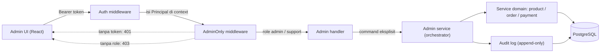
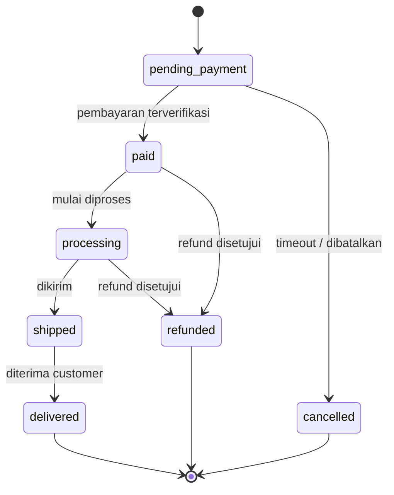
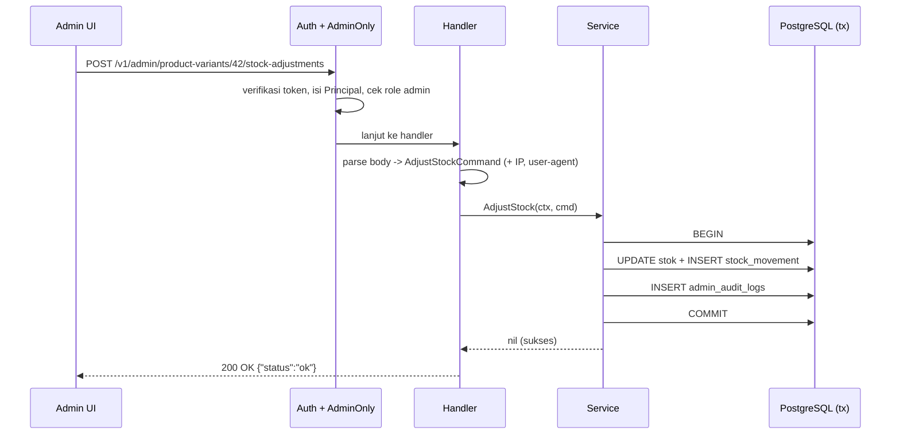

import { Section, Box, Steps, Step, Recap, CardGrid, Card, Chip, Hero, Compare, FileTree, Endpoint, Def } from "@components";

<Hero eyebrow="Roadmap 5 &middot; Domain Mastery" title="Admin dan <em>Backoffice</em> Domain<br />Operasi Internal yang Aman dan Terlacak">
  <p>Backoffice bukan halaman dashboard, melainkan domain operasi internal: jalur yang punya izin lebih besar, risiko lebih besar, dan karena itu butuh batas akses tegas plus jejak audit untuk setiap tindakan.</p>
  <Fragment slot="meta">
    <Chip icon="shield">Domain: <b>Backoffice</b></Chip>
    <Chip icon="code">Go <b>1.26</b></Chip>
    <Chip icon="database">pgx <b>v5</b></Chip>
    <Chip icon="clock">~70 menit baca</Chip>
  </Fragment>
</Hero>

<Section num="01" id="intro" title="Kenapa Backoffice Itu Domain, Bukan Sekadar Halaman" sub="Admin punya izin lebih besar, jadi risikonya juga lebih besar">

<p class="lead">Di online shop skincare, admin bisa mengubah produk, stok, status order, dan memicu refund. Bug kecil di route admin tidak berakhir di layar yang jelek, tetapi di stok yang minus, order yang loncat status, atau uang yang keluar dua kali.</p>

Di frontend React, backoffice sering terasa cuma "halaman lain" di `/admin`: route terproteksi, menu disembunyikan berdasarkan role di state, selesai. Cara berpikir itu wajar di sisi klien, tetapi berbahaya kalau dibawa ke backend. Di backend Go, backoffice lebih tepat diperlakukan sebagai **domain operasi internal**: ia punya batas akses sendiri, aturan orkestrasi sendiri, dan jejak audit sendiri. Yang tampil di UI hanyalah ujung dari kontrak yang dijaga server.

<Box variant="bridge" icon="🌉" label="Jembatan: dari Laravel Nova/Filament ke service Go eksplisit"><p>Di Laravel, Nova atau Filament memberi scaffolding admin panel lengkap dengan guard `auth:admin`, policy, dan activity log otomatis. Di Go tidak ada yang gratis: route admin adalah `http.Handler` biasa, batas akses kita tulis sebagai middleware `AdminOnly`, dan jejak perubahan kita catat sendiri ke tabel audit. Lebih banyak kode, tetapi tidak ada perilaku tersembunyi yang menggigit saat investigasi.</p></Box>

Desain backoffice yang sehat menjawab empat pertanyaan, dan keempatnya harus eksplisit di kode, bukan diasumsikan:

<CardGrid cols={2}>
  <Card><h4>Siapa yang boleh masuk?</h4><p>Authentication: request harus membawa identitas yang sudah diverifikasi server, bukan sekadar token yang "kelihatannya" admin.</p></Card>
  <Card><h4>Aksi apa yang boleh?</h4><p>Authorization: role admin dan support punya izin berbeda. Izin diperiksa di server pada setiap request, bukan di state React.</p></Card>
  <Card><h4>Data apa yang berubah?</h4><p>Setiap operasi tetap lewat aturan domain (state machine order, stock movement), bukan UPDATE kolom liar.</p></Card>
  <Card><h4>Bukti apa yang tersimpan?</h4><p>Audit log append-only: siapa mengubah apa, kapan, dari IP mana, dengan nilai sebelum dan sesudah.</p></Card>
</CardGrid>

<Def term="backoffice domain"><p>Bagian backend untuk operasi internal bisnis (kelola produk, stok, order, payment, support) yang hanya boleh diakses user dengan role internal, dengan kontrol akses dan jejak audit yang lebih ketat dari route publik.</p></Def>

Pada modul ini kita membangun lapisan admin untuk proyek skincare di atas domain yang sudah jadi dari chapter sebelumnya (katalog, inventory, order lifecycle, payment). Targetnya: admin login dan role check, product management dan stock adjustment, order management lewat state machine, payment inspection, customer support view, dan audit log untuk semua tindakan admin.

</Section>

<Section num="02" id="ruang-lingkup" title="Ruang Lingkup dan Boundary Admin" sub="Admin mengorkestrasi domain lain, tidak menggantikannya">

<p class="lead">Godaan terbesar saat membangun admin adalah menjadikannya jalan pintas: "kan admin, biarkan saja UPDATE langsung". Justru di situ backoffice mulai membusuk. Admin boleh mengorkestrasi domain lain, tetapi tidak boleh membuat aturan bisnis tandingan.</p>

Kita pakai konsep **admin boundary**. Handler di `internal/admin/` boleh memanggil fitur product, inventory, order, dan payment, tetapi business rule tetap tinggal di domain asalnya. Update status order manual tetap lewat state machine order dari modul Order Lifecycle. Stock adjustment tetap menghasilkan stock movement dari modul Inventory. Refund tetap lewat payment service dari modul Payment. Admin adalah orchestrator, bukan pemilik aturan.

<Compare aLabel="Anti-pola: admin sebagai bypass" bLabel="Idiomatik: admin sebagai orchestrator" aTone="red" bTone="violet">
  <Fragment slot="a"><ul><li>Handler admin menjalankan `UPDATE orders SET status = $1` langsung.</li><li>State machine, stok, dan audit terlewati karena "admin pasti benar".</li><li>Riwayat hilang, bug operasional sulit ditelusuri.</li></ul></Fragment>
  <Fragment slot="b"><ul><li>Handler admin memanggil service domain yang sama dengan jalur otomatis.</li><li>Transisi status, stock movement, dan refund tetap tervalidasi.</li><li>Setiap tindakan menghasilkan baris audit yang bisa diinvestigasi.</li></ul></Fragment>
</Compare>

Ruang lingkup yang kita garap di proyek skincare:

<CardGrid cols={2}>
  <Card><h4>Product management</h4><p>List produk termasuk inactive dan archived, buat dan ubah produk, kelola variant dan harga, plus stock adjustment berbasis delta dan reason yang tercatat sebagai movement.</p></Card>
  <Card><h4>Order management</h4><p>Lihat order lintas user dengan filter operasional, dan update status manual untuk kasus nyata (webhook tertunda, koreksi), tetap lewat state machine.</p></Card>
  <Card><h4>Payment inspection</h4><p>Lihat payment intent dan event log webhook, lalu picu refund lewat payment service dengan reason dan audit, bukan akses gateway mentah.</p></Card>
  <Card><h4>Customer support view</h4><p>Cari order berdasarkan email, user ID, atau nomor order. Read-only untuk role support, tanpa membuka koneksi database langsung.</p></Card>
</CardGrid>

<Box variant="warn" icon="⚠️" label="Route admin boleh berkuasa, tetapi tidak boleh melanggar domain"><p>Admin boleh punya izin lebih luas, bukan izin tanpa aturan. Admin tetap tidak boleh menggeser order dari `delivered` ke `pending_payment` kalau state machine melarangnya. Kekuasaan admin ada pada akses, bukan pada hak mengabaikan invariant bisnis.</p></Box>

</Section>

<Section num="03" id="alur-request" title="Alur Request Admin End-to-End" sub="Auth, guard role, handler, service domain, lalu audit">

<p class="lead">Sebelum menulis kode, kunci dulu bentuk alurnya dalam satu gambar. Setiap request admin melewati lapisan yang sama: autentikasi, guard role, handler, service domain, dan audit log yang commit bersama operasi bisnis.</p>



<p class="fig-cap"><b>Gambar 1.</b> Request admin tetap HTTP biasa, tetapi melewati dua gerbang (auth lalu guard role) sebelum menyentuh operasi bisnis. Operasi domain dan penulisan audit terjadi dalam transaksi yang sama.</p>

Perhatikan dua hal yang membedakan jalur admin dari jalur publik. Pertama, ada **dua gerbang berurutan**: auth (kamu siapa) lalu guard role (kamu boleh apa). Memisahkan keduanya membuat respons benar, yaitu `401` untuk tanpa token dan `403` untuk token sah tapi tanpa role. Kedua, **audit log menempel pada operasi**, bukan tertinggal di belakang sebagai log opsional. Kalau operasi bisnis commit, audit ikut commit. Kalau gagal, keduanya rollback bersama.

<Box variant="bridge" icon="🌉" label="Jembatan: dari middleware Express/Laravel ke fungsi http.Handler"><p>Di Express kamu menumpuk `app.use(auth)` lalu `app.use(adminOnly)`. Di Laravel kamu menulis `Route::middleware(['auth:sanctum', 'role:admin'])`. Di Go, middleware adalah fungsi yang menerima `http.Handler` dan mengembalikan `http.Handler` baru, lalu dipasang dengan `r.Use(...)` di chi. Polanya identik, hanya lebih telanjang: tidak ada registry middleware ajaib, kamu lihat persis urutan dan isinya.</p></Box>

</Section>

<Section num="04" id="login-role" title="Admin Login dan Role Check" sub="Payload sama dengan customer, aturan penerimaan yang berbeda">

<p class="lead">Admin login bisa dibuat sebagai endpoint terpisah atau memakai login yang sama dengan role check. Untuk proyek ini kita pilih endpoint terpisah, tetapi prinsipnya tetap satu: role harus diverifikasi server, bukan dipercaya dari klien.</p>

Ada dua pola umum, dan keduanya sah. Pertama, `POST /v1/admin/login` terpisah. Ini enak untuk backoffice karena bisa diberi rate limit ketat dan audit login sendiri, terpisah dari traffic customer. Kedua, `POST /v1/auth/login` dipakai bersama, lalu akses admin ditolak kalau user tidak punya role internal. Kita ambil yang pertama, tetapi tetap di atas tabel `users` dan mekanisme auth yang sama dari Roadmap 7. Yang berbeda bukan cara memverifikasi password, melainkan **aturan penerimaan**: email dan password valid tetap ditolak kalau user tidak punya role `admin` atau `support`.

<Compare aLabel="JS/Laravel: guard dan menu role" bLabel="Go: verifikasi server di tiap request" aTone="muted" bTone="violet">
  <Fragment slot="a"><ul><li>Laravel memakai guard, middleware `role:admin`, atau policy untuk halaman admin.</li><li>React menyembunyikan menu admin berdasarkan role di state agar UX rapi.</li></ul></Fragment>
  <Fragment slot="b"><ul><li>Go API memverifikasi token dan role di server untuk setiap request admin.</li><li>Menyembunyikan tombol membantu UX, tetapi tidak pernah jadi security. Server yang memutuskan.</li></ul></Fragment>
</Compare>

<Endpoint method="POST" path="/v1/admin/login" desc="Login admin, menghasilkan access token dengan role internal" />
<Endpoint method="GET" path="/v1/admin/me" desc="Cek identitas admin yang sedang login" />

Bentuk request dan response login tidak perlu istimewa. Yang penting, response membawa role agar UI bisa menata menu, tetapi UI tidak pernah jadi sumber kebenaran izin.

```json title="request.json"
{
  "email": "admin@skincare.test",
  "password": "secret-admin-password"
}
```

```json title="response.json"
{
  "access_token": "eyJhbGciOi...",
  "token_type": "Bearer",
  "expires_in": 900,
  "admin": {
    "id": 7,
    "email": "admin@skincare.test",
    "roles": ["admin"]
  }
}
```

Token boleh menyimpan role sebagai claim agar middleware tidak perlu query database tiap request. Tetapi access token yang berumur pendek (misalnya 15 menit) hanya memindahkan masalah, bukan menghapusnya: kalau admin di-nonaktifkan, ia masih bisa beraksi sampai token kedaluwarsa. Untuk operasi sensitif (refund, perubahan harga), tambahkan satu lapis: cek `users.is_active` atau token version di server saat aksi dijalankan.

<Box variant="tip" icon="💡" label="Token membawa role, server tetap pegang cabut akses"><p>Claim role di token mempercepat guard, tetapi kebenaran akhir ada di server. Sediakan jalur pencabutan (disable user, token version, atau revocation list) untuk aksi admin yang sensitif, jangan hanya bergantung pada masa berlaku token.</p></Box>

</Section>

<Section num="05" id="route-protection" title="Route Protection dengan AdminOnly" sub="Middleware kecil, satu tugas, mudah diuji">

<p class="lead">Middleware admin harus kecil dan punya satu tugas: memastikan request sudah terautentikasi dan principal punya role yang diizinkan. Semakin kecil, semakin mudah diuji dan semakin sulit salah.</p>

Mulai dari model. `Principal` adalah identitas yang sudah diverifikasi auth middleware lalu disimpan di `context.Context`. Menyimpan nilai di context adalah cara idiomatik Go meneruskan data per-request lintas middleware dan handler, dengan kunci tipe privat agar tidak bentrok dengan package lain.

```go title="internal/admin/model.go"
package admin

import "context"

type Role string

const (
	RoleAdmin   Role = "admin"
	RoleSupport Role = "support"
)

type Principal struct {
	UserID int64
	Email  string
	Roles  []Role
}

func (p Principal) HasRole(role Role) bool {
	for _, item := range p.Roles {
		if item == role {
			return true
		}
	}
	return false
}

// HasAny benar bila principal punya salah satu dari role yang diminta.
func (p Principal) HasAny(roles ...Role) bool {
	for _, want := range roles {
		if p.HasRole(want) {
			return true
		}
	}
	return false
}

// principalKey adalah tipe privat agar key context tidak bentrok antar-package.
type principalKey struct{}

func WithPrincipal(ctx context.Context, principal Principal) context.Context {
	return context.WithValue(ctx, principalKey{}, principal)
}

func PrincipalFromContext(ctx context.Context) (Principal, bool) {
	principal, ok := ctx.Value(principalKey{}).(Principal)
	return principal, ok
}
```

<Box variant="bridge" icon="🌉" label="Jembatan: dari req.user/Auth::user() ke context.Context"><p>Di Express, auth middleware menempel `req.user`, dan handler membacanya. Di Laravel, `Auth::user()` mengambil user dari guard yang sudah resolve. Di Go padanannya adalah menyimpan `Principal` di `context.Context` dengan `WithPrincipal`, lalu handler memanggil `PrincipalFromContext`. Bedanya, context bersifat immutable dan menjalar otomatis ke setiap call yang menerima `ctx`, termasuk query database, jadi identitas pemanggil tidak pernah hilang di tengah jalan.</p></Box>

Guard-nya kecil dan tegas. Tanpa principal berarti belum auth, jadi `401`. Ada principal tapi tanpa role internal berarti dilarang, jadi `403`. Membedakan keduanya bukan kosmetik: `401` artinya "silakan login dulu", `403` artinya "kamu login, tapi tidak berhak". Klien dan log memperlakukan keduanya berbeda.

```go title="internal/admin/middleware.go"
package admin

import "net/http"

// AdminOnly memastikan request sudah terautentikasi dan principal punya
// salah satu dari role internal yang diizinkan.
func RequireRole(roles ...Role) func(http.Handler) http.Handler {
	return func(next http.Handler) http.Handler {
		return http.HandlerFunc(func(w http.ResponseWriter, r *http.Request) {
			principal, ok := PrincipalFromContext(r.Context())
			if !ok {
				http.Error(w, "unauthorized", http.StatusUnauthorized)
				return
			}
			if !principal.HasAny(roles...) {
				http.Error(w, "forbidden: insufficient role", http.StatusForbidden)
				return
			}
			next.ServeHTTP(w, r)
		})
	}
}

// AdminOnly hanya mengizinkan role admin.
func AdminOnly(next http.Handler) http.Handler {
	return RequireRole(RoleAdmin)(next)
}

// InternalOnly mengizinkan admin maupun support (untuk view read-only).
func InternalOnly(next http.Handler) http.Handler {
	return RequireRole(RoleAdmin, RoleSupport)(next)
}
```

<Box variant="warn" icon="⚠️" label="Jangan pernah percaya role dari klien"><p>Role tidak boleh datang dari body, query string, atau header bebas seperti `X-Role`. Itu sama saja membiarkan penyerang mengetik `X-Role: admin`. Role hanya berasal dari token yang sudah diverifikasi atau session server-side, lalu masuk ke `Principal` lewat auth middleware.</p></Box>

Di chi, route admin dikelompokkan di bawah `/v1/admin`. Endpoint login terbuka (tanpa guard), sisanya dibungkus grup yang memasang auth lalu guard role. Perhatikan support view memakai `InternalOnly` (admin atau support), sedangkan aksi yang mengubah data memakai `AdminOnly`.

```go title="internal/admin/route.go"
package admin

import (
	"net/http"

	"github.com/go-chi/chi/v5"
)

type AuthMiddleware func(http.Handler) http.Handler

func MountRoutes(r chi.Router, h *Handler, auth AuthMiddleware) {
	r.Route("/v1/admin", func(r chi.Router) {
		r.Post("/login", h.Login)

		// Read-only untuk admin dan support.
		r.Group(func(r chi.Router) {
			r.Use(auth)
			r.Use(InternalOnly)

			r.Get("/me", h.Me)
			r.Get("/orders", h.ListOrders)
			r.Get("/orders/{orderID}", h.GetOrder)
			r.Get("/payments/{paymentID}/logs", h.PaymentLogs)
			r.Get("/support/orders", h.SearchSupportOrders)
			r.Get("/audit-logs", h.ListAuditLogs)
		})

		// Aksi mengubah data: khusus admin.
		r.Group(func(r chi.Router) {
			r.Use(auth)
			r.Use(AdminOnly)

			r.Get("/products", h.ListProducts)
			r.Post("/products", h.CreateProduct)
			r.Patch("/products/{productID}", h.UpdateProduct)
			r.Post("/product-variants/{variantID}/stock-adjustments", h.AdjustStock)
			r.Patch("/orders/{orderID}/status", h.UpdateOrderStatus)
			r.Post("/payments/{paymentID}/refund", h.TriggerRefund)
		})
	})
}
```

<Box variant="tip" icon="💡" label="Pisahkan baca dan ubah sejak awal"><p>Memecah grup read-only (`InternalOnly`) dari grup mutasi (`AdminOnly`) sejak awal membuat prinsip least privilege otomatis terbawa. Support bisa menelusuri masalah customer tanpa pernah menyentuh tombol refund atau stok. Saat bisnis membesar dan role bertambah (`finance_admin`, `catalog_manager`), strukturnya sudah siap.</p></Box>

</Section>

<Section num="06" id="struktur" title="Struktur internal/admin sebagai Orchestrator" sub="Boundary orkestrasi, bukan gudang semua logic">

<p class="lead">Folder admin gampang berubah menjadi "god domain": tempat semua query produk, order, dan payment menumpuk tanpa aturan. Kuncinya menjaga `internal/admin` sebagai lapisan orkestrasi tipis di atas domain yang sudah ada.</p>

<FileTree title="Struktur domain admin" tree={`
internal/
  admin/
    route.go          # semua route /v1/admin dan pemasangan guard
    middleware.go     # RequireRole, AdminOnly, InternalOnly
    handler.go        # parse request -> command, panggil service, tulis response
    service.go        # orkestrasi operasi admin + audit, jalankan transaksi
    repository.go     # InTx dan query khusus backoffice
    model.go          # Principal, Role, command, result
    audit.go          # AuditEntry dan helper JSON before/after
    dto.go            # request/response khusus admin
  product/
    service.go        # aturan katalog dan harga tetap di domain product
  inventory/
    service.go        # stock movement tetap di domain inventory
  order/
    service.go        # state machine order tetap di domain order
  payment/
    service.go        # refund dan payment log tetap terkontrol
cmd/
  api/
    main.go           # mount route publik dan route admin
`} />

Aturan mainnya: `internal/admin` boleh memanggil service domain lain, tetapi tidak menyalin aturannya. Stock adjustment memanggil operasi inventory yang mencatat stock movement, bukan `UPDATE` kolom stok mentah. Update status order memanggil pengecekan transisi dari domain order. Refund memanggil payment service. Admin merangkai, domain memutuskan.

<Box variant="bridge" icon="🌉" label="Jembatan: dari controller gemuk ke service tipis"><p>Di Laravel, godaan klasik adalah menulis seluruh logic di controller admin sampai gemuk dan tak teruji. Di React Admin, godaannya adalah menumpuk banyak data provider yang langsung memukul endpoint bebas. Di Go kita menahan godaan itu dengan disiplin boundary: handler tipis (parse dan tulis response), service tipis (orkestrasi dan audit), dan business rule tetap di domain asalnya. Hasilnya, admin tidak pernah menjadi pintu belakang yang melewati invariant.</p></Box>

</Section>

<Section num="07" id="product-management" title="Product Management dan Stock Adjustment" sub="Operasi katalog mudah, konsistensi data tetap terjaga">

<p class="lead">Route produk admin berbeda tujuan dari route katalog publik. Publik menampilkan produk aktif untuk customer. Admin perlu melihat produk inactive dan archived, mengubah draft, memperbaiki variant dan harga, serta melakukan stock adjustment yang tercatat.</p>

<Endpoint method="GET" path="/v1/admin/products" desc="List semua produk termasuk inactive dan archived, dengan filter backoffice" />
<Endpoint method="POST" path="/v1/admin/products" desc="Buat produk baru beserta atribut skincare dan harga dasar" />
<Endpoint method="PATCH" path="/v1/admin/products/:productID" desc="Ubah nama, slug, status, nomor BPOM, gambar, harga, dan atribut skincare" />
<Endpoint method="POST" path="/v1/admin/product-variants/:variantID/stock-adjustments" desc="Tambah atau kurangi stok lewat stock movement yang tercatat" />

Soal harga, ingat konvensi proyek: uang adalah `PriceRupiah int64` (rupiah bulat) dengan kolom `BIGINT`, bukan `float`. Float untuk uang adalah footgun klasik karena pembulatan biner, dan `int` 32-bit bisa overflow untuk total order besar. Admin yang mengubah harga harus memakai tipe yang sama dengan seluruh domain.

```go title="internal/admin/dto.go"
package admin

// PriceRupiah adalah tipe domain uang: rupiah bulat, disimpan sebagai BIGINT.
// Sama persis dengan tipe yang dipakai domain product dan order.
type PriceRupiah int64

type UpdateProductRequest struct {
	Name       *string      `json:"name"`
	Slug       *string      `json:"slug"`
	Status     *string      `json:"status"`      // active | inactive | archived
	BPOMNumber *string      `json:"bpom_number"`
	BasePrice  *PriceRupiah `json:"base_price"`  // rupiah bulat, bukan float
}
```

Untuk stok, ini bagian paling penting. Jangan beri admin endpoint seperti "set stock = 999". Pakai **stock adjustment** berbasis `delta` dan `reason`. Alasannya bukan estetika, melainkan keterlacakan: stok naik 12 karena restock, stok turun 2 karena koreksi barang rusak. Nilai stok akhir menjadi hasil dari rentetan movement yang bisa diaudit, bukan angka yang ditempel manual tanpa cerita.

<Compare aLabel="Anti-pola: set absolut" bLabel="Idiomatik: delta + reason" aTone="red" bTone="blue">
  <Fragment slot="a"><ul><li>`PATCH stock = 999`, tanpa alasan dan tanpa jejak.</li><li>Dua admin set bersamaan, satu overwrite yang lain (lost update).</li><li>Saat stok salah, tidak ada riwayat untuk menelusuri kapan dan kenapa.</li></ul></Fragment>
  <Fragment slot="b"><ul><li>`delta: +12, reason: "restock"` menghasilkan satu movement.</li><li>Stok akhir = saldo movement, aman dari overwrite karena operasi relatif.</li><li>Setiap perubahan punya alasan, referensi, dan timestamp yang bisa diaudit.</li></ul></Fragment>
</Compare>

```json title="request.json"
{
  "delta": 12,
  "reason": "Restock dari supplier batch Juni",
  "reference_no": "PO-20260606-001"
}
```

Service stock adjustment menjalankan dua hal dalam satu transaksi: mengubah stok lewat operasi inventory yang mencatat movement, lalu menulis audit log. Keduanya commit bersama. Kalau audit gagal ditulis, perubahan stok ikut rollback. Inilah kenapa orkestrasi admin selalu lewat `InTx`.

```go title="internal/admin/service.go"
package admin

import (
	"context"
	"errors"
	"strings"
)

var (
	ErrInvalidStockDelta = errors.New("stock delta must not be zero")
	ErrReasonRequired    = errors.New("reason is required")
)

type AdjustStockCommand struct {
	Admin       Principal
	VariantID   int64
	Delta       int
	Reason      string
	ReferenceNo string
	IPAddress   string
	UserAgent   string
}

// AdminStore membuka transaksi; semua operasi admin berjalan di dalamnya.
type AdminStore interface {
	InTx(ctx context.Context, fn func(ctx context.Context, tx AdminTx) error) error
}

// AdminTx adalah kumpulan operasi yang aman dipanggil dalam satu transaksi.
type AdminTx interface {
	AdjustVariantStock(ctx context.Context, variantID int64, delta int, reason, referenceNo string) (newStock int, err error)
	InsertAuditLog(ctx context.Context, entry AuditEntry) error
}

type Service struct {
	store AdminStore
}

func NewService(store AdminStore) *Service {
	return &Service{store: store}
}

func (s *Service) AdjustStock(ctx context.Context, cmd AdjustStockCommand) error {
	if cmd.Delta == 0 {
		return ErrInvalidStockDelta
	}
	if strings.TrimSpace(cmd.Reason) == "" {
		return ErrReasonRequired
	}

	return s.store.InTx(ctx, func(ctx context.Context, tx AdminTx) error {
		newStock, err := tx.AdjustVariantStock(ctx, cmd.VariantID, cmd.Delta, cmd.Reason, cmd.ReferenceNo)
		if err != nil {
			return err
		}

		return tx.InsertAuditLog(ctx, AuditEntry{
			AdminUserID: cmd.Admin.UserID,
			Action:      "stock.adjusted",
			EntityType:  "product_variant",
			EntityID:    cmd.VariantID,
			AfterData: MustAuditJSON(map[string]any{
				"delta":        cmd.Delta,
				"reason":       cmd.Reason,
				"reference_no": cmd.ReferenceNo,
				"new_stock":    newStock,
			}),
			IPAddress: cmd.IPAddress,
			UserAgent: cmd.UserAgent,
		})
	})
}
```

<Box variant="tip" icon="💡" label="Kenapa delta lebih aman dari set absolut"><p>Operasi relatif (`stok = stok + delta`) di SQL bersifat atomik per baris dan tahan terhadap lost update tanpa perlu membaca dulu. Dua admin yang menambah stok bersamaan menghasilkan saldo yang benar. Operasi set absolut (`stok = 999`) harus membaca lalu menulis, dan tanpa locking, perubahan satu admin bisa hilang ditimpa admin lain.</p></Box>

</Section>

<Section num="08" id="order-management" title="Order Management Lewat State Machine" sub="Manual bukan berarti bebas, justru harus lebih ketat">

<p class="lead">Order management membantu tim operasional memperbaiki kasus nyata: webhook pembayaran tertunda, order nyangkut di status salah, koreksi manual. Tetapi update status manual harus tetap lewat state machine order, karena update inilah yang paling sering merusak lifecycle.</p>

Admin perlu melihat semua order, bukan hanya miliknya. Endpoint list harus punya filter operasional yang berguna: status, nomor order, email customer, rentang tanggal, payment status, fulfillment status.

<Endpoint method="GET" path="/v1/admin/orders" desc="List order lintas user dengan filter status, email, nomor order, dan tanggal" />
<Endpoint method="GET" path="/v1/admin/orders/:orderID" desc="Detail order lengkap untuk operasional internal" />
<Endpoint method="PATCH" path="/v1/admin/orders/:orderID/status" desc="Update status manual dengan reason wajib dan audit log" />

```json title="request.json"
{
  "status": "processing",
  "reason": "Pembayaran valid, webhook tertunda, order diproses manual"
}
```

Mengubah status order bukan sekadar `UPDATE orders SET status = $1`. Status yang sah membentuk graf transisi: order hanya boleh berpindah ke status yang diizinkan dari status sekarang. Diagram berikut adalah lifecycle yang kita jaga, dan admin manual harus menghormatinya sama seperti jalur otomatis.



<p class="fig-cap"><b>Gambar 2.</b> Lifecycle order. Update manual admin hanya boleh mengikuti panah yang ada. Mencoba menggeser `delivered` ke `pending_payment` harus ditolak, walau pelakunya admin.</p>

Di service, jangan tulis SQL update status langsung dari handler. Baca status sekarang dengan `SELECT ... FOR UPDATE` agar baris terkunci selama transaksi (mencegah dua admin mengubah order yang sama bersamaan), cek transisi lewat aturan domain order, baru update dan tulis audit.

```go title="internal/admin/order_service.go"
package admin

import (
	"context"
	"errors"
	"strings"
)

var (
	ErrStatusReasonRequired = errors.New("status change reason is required")
	ErrInvalidTransition    = errors.New("invalid order status transition")
)

type UpdateOrderStatusCommand struct {
	Admin     Principal
	OrderID   int64
	NewStatus string
	Reason    string
	IPAddress string
	UserAgent string
}

// OrderTransitioner berasal dari domain order; admin tidak menyalin aturannya.
type OrderTransitioner interface {
	CanTransition(from, to string) bool
}

// OrderAdminTx adalah operasi order yang aman dalam transaksi admin.
type OrderAdminTx interface {
	AdminTx
	// GetOrderStatusForUpdate mengunci baris order (SELECT ... FOR UPDATE).
	GetOrderStatusForUpdate(ctx context.Context, orderID int64) (string, error)
	UpdateOrderStatus(ctx context.Context, orderID int64, status, reason string) error
}

func (s *Service) UpdateOrderStatus(ctx context.Context, cmd UpdateOrderStatusCommand, transitions OrderTransitioner) error {
	if strings.TrimSpace(cmd.Reason) == "" {
		return ErrStatusReasonRequired
	}

	return s.store.InTx(ctx, func(ctx context.Context, tx AdminTx) error {
		orderTx, ok := tx.(OrderAdminTx)
		if !ok {
			return errors.New("admin tx does not support order operations")
		}

		currentStatus, err := orderTx.GetOrderStatusForUpdate(ctx, cmd.OrderID)
		if err != nil {
			return err
		}

		if !transitions.CanTransition(currentStatus, cmd.NewStatus) {
			return ErrInvalidTransition
		}

		if err := orderTx.UpdateOrderStatus(ctx, cmd.OrderID, cmd.NewStatus, cmd.Reason); err != nil {
			return err
		}

		return orderTx.InsertAuditLog(ctx, AuditEntry{
			AdminUserID: cmd.Admin.UserID,
			Action:      "order.status_updated",
			EntityType:  "order",
			EntityID:    cmd.OrderID,
			BeforeData:  MustAuditJSON(map[string]any{"status": currentStatus}),
			AfterData:   MustAuditJSON(map[string]any{"status": cmd.NewStatus, "reason": cmd.Reason}),
			IPAddress:   cmd.IPAddress,
			UserAgent:   cmd.UserAgent,
		})
	})
}
```

<Box variant="warn" icon="⚠️" label="Manual harus lebih ketat dari otomatis"><p>Update manual sering terjadi saat situasi sedang kacau (komplain, webhook macet, deadline kirim). Justru di momen panik itu invariant paling gampang dilanggar. Reason wajib, transisi dicek, baris dikunci `FOR UPDATE`, dan audit dicatat. Tiga jaring pengaman untuk satu tombol yang dipakai saat panik.</p></Box>

<Box variant="bridge" icon="🌉" label="Jembatan: dari optimistic update React ke FOR UPDATE Postgres"><p>Di React kamu mencegah double submit dengan men-disable tombol atau optimistic locking version. Di backend, padanannya untuk mencegah dua admin menabrak order yang sama adalah `SELECT ... FOR UPDATE`: baris terkunci sampai transaksi selesai, jadi admin kedua menunggu giliran dan membaca status terbaru, bukan status basi. Sama-sama mencegah race, tetapi yang ini di level data, tempat kebenaran sesungguhnya tinggal.</p></Box>

</Section>

<Section num="09" id="payment-support" title="Payment Inspection dan Customer Support" sub="Tim internal menjawab masalah tanpa membuka database mentah">

<p class="lead">Payment inspection dan support view membantu tim internal menjawab masalah customer tanpa membuka koneksi database langsung. Tujuannya jelas: kurangi akses mentah, tambah jejak, sajikan data secukupnya.</p>

Payment gateway seperti Midtrans, Xendit, atau Nicepay bisa mengirim webhook lebih dari sekali, terlambat, atau dengan status yang perlu rekonsiliasi. Admin butuh view untuk melihat payment intent, event log webhook, dan raw status gateway yang sudah disimpan di modul Payment. Refund harus lewat payment service, bukan memanggil API gateway dari handler admin.

<Endpoint method="GET" path="/v1/admin/payments/:paymentID/logs" desc="Lihat event log payment: webhook masuk dan hasil verifikasi" />
<Endpoint method="POST" path="/v1/admin/payments/:paymentID/refund" desc="Picu refund lewat payment service dengan reason dan audit log" />
<Endpoint method="GET" path="/v1/admin/support/orders" desc="Cari order berdasarkan email, user ID, atau nomor order untuk support" />

Support view sebaiknya read-only untuk role `support` (lihat grup `InternalOnly` di section 05). Role `admin` boleh melakukan mutasi. Saat bisnis membesar, role bisa dipecah lebih halus (`catalog_manager`, `ops_admin`, `finance_admin`, `support_agent`) tanpa mengubah pola guard.

```go title="internal/admin/support_dto.go"
package admin

import "time"

type SupportOrderSearchQuery struct {
	Email       string
	UserID      int64
	OrderNumber string
	Limit       int
	Offset      int
}

type SupportOrderResult struct {
	OrderID       int64       `json:"order_id"`
	OrderNumber   string      `json:"order_number"`
	CustomerEmail string      `json:"customer_email"`
	Status        string      `json:"status"`
	PaymentStatus string      `json:"payment_status"`
	GrandTotal    PriceRupiah `json:"grand_total"` // rupiah bulat, BIGINT di DB
	CreatedAt     time.Time   `json:"created_at"`
}
```

Query support memakai parameter opsional dengan pola "kosong berarti abaikan filter". Perhatikan pemakaian placeholder `$1..$5` (pgx memakai parameter ternomor, bukan `?`), `ILIKE` untuk pencarian email case-insensitive, dan `LIMIT/OFFSET` agar hasil tidak membanjiri response.

```sql title="internal/admin/support_search.sql"
SELECT
  o.id,
  o.order_number,
  u.email AS customer_email,
  o.status,
  p.status AS payment_status,
  o.grand_total,
  o.created_at
FROM orders o
JOIN users u ON u.id = o.user_id
LEFT JOIN payments p ON p.order_id = o.id
WHERE
  ($1 = '' OR u.email ILIKE '%' || $1 || '%')
  AND ($2 = 0 OR u.id = $2)
  AND ($3 = '' OR o.order_number = $3)
ORDER BY o.created_at DESC
LIMIT $4 OFFSET $5;
```

<Box variant="note" icon="📝" label="Sajikan data secukupnya"><p>Support view tidak perlu menampilkan token payment, raw credential gateway, password hash, atau kolom sensitif lain. Pilih kolom secara eksplisit di SELECT, jangan `SELECT *`. Privacy adalah bagian dari desain, bukan tambahan belakangan.</p></Box>

<Box variant="bridge" icon="🌉" label="Jembatan: dari refund manual di dashboard gateway ke service terkontrol"><p>Tim ops yang terbiasa membuka dashboard Midtrans dan klik refund kehilangan jejak di sistem sendiri: order tidak tahu uangnya sudah dikembalikan. Dengan menyalurkan refund lewat `POST /v1/admin/payments/:id/refund` yang memanggil payment service, satu aksi sekaligus memanggil gateway, menggeser status order ke `refunded` lewat state machine, dan menulis audit. Satu tombol, tiga efek yang konsisten.</p></Box>

</Section>

<Section num="10" id="audit-log" title="Audit Log Append-only" sub="Sabuk pengaman backoffice: siapa mengubah apa, kapan, dan kenapa">

<p class="lead">Audit log adalah sabuk pengaman backoffice. Setiap operasi internal yang mengubah data harus bisa ditelusuri: siapa pelakunya, aksi apa, entitas mana, kapan, dari IP mana, dengan nilai sebelum dan sesudah. Tanpa ini, investigasi insiden hanya menebak-nebak.</p>

Audit log harus **append-only**: aplikasi hanya menambah baris baru, tidak pernah mengubah atau menghapus baris lama. Append-only-lah yang membuat log layak dipercaya saat dispute. Jangan beri aplikasi izin `UPDATE` atau `DELETE` pada tabel ini.

```sql title="db/migrations/048_create_admin_audit_logs.up.sql"
CREATE TABLE admin_audit_logs (
  id            BIGINT GENERATED ALWAYS AS IDENTITY PRIMARY KEY,
  admin_user_id BIGINT NOT NULL REFERENCES users(id),
  action        TEXT NOT NULL,            -- contoh: stock.adjusted, order.status_updated
  entity_type   TEXT NOT NULL,            -- contoh: product_variant, order, payment
  entity_id     BIGINT,
  before_data   JSONB,                    -- snapshot sebelum perubahan
  after_data    JSONB,                    -- snapshot sesudah perubahan
  ip_address    INET,                     -- tipe INET, bukan TEXT
  user_agent    TEXT,
  created_at    TIMESTAMPTZ NOT NULL DEFAULT now()
);

-- Telusuri "apa saja yang dilakukan admin ini".
CREATE INDEX idx_admin_audit_admin_created
  ON admin_audit_logs (admin_user_id, created_at DESC);

-- Telusuri "siapa saja yang menyentuh entitas ini".
CREATE INDEX idx_admin_audit_entity_created
  ON admin_audit_logs (entity_type, entity_id, created_at DESC);
```

```sql title="db/migrations/048_create_admin_audit_logs.down.sql"
DROP TABLE IF EXISTS admin_audit_logs;
```

Beberapa keputusan skema yang sengaja diambil. `entity_id` adalah `BIGINT` agar selaras dengan ID entitas lain (uang `BIGINT`, ID `BIGINT`). `before_data` dan `after_data` memakai `JSONB` agar bentuk snapshot fleksibel per jenis entitas tanpa membuat kolom baru tiap kali. `ip_address` memakai tipe `INET` bawaan Postgres, bukan `TEXT`, sehingga validasi format dan query rentang IP gratis. Dua index komposit menjawab dua pertanyaan investigasi paling umum: "apa saja yang admin X lakukan" dan "siapa saja yang menyentuh order Y".

```go title="internal/admin/audit.go"
package admin

import (
	"encoding/json"
	"time"
)

type AuditEntry struct {
	ID          int64
	AdminUserID int64
	Action      string
	EntityType  string
	EntityID    int64
	BeforeData  json.RawMessage
	AfterData   json.RawMessage
	IPAddress   string
	UserAgent   string
	CreatedAt   time.Time
}

// MustAuditJSON menyusun snapshot before/after menjadi JSON untuk kolom JSONB.
// Audit tidak boleh menggagalkan operasi bisnis hanya karena marshal gagal,
// jadi kegagalan diturunkan menjadi null, bukan panic.
func MustAuditJSON(value any) json.RawMessage {
	data, err := json.Marshal(value)
	if err != nil {
		return json.RawMessage(`null`)
	}
	return data
}
```

Repository menyediakan `InTx` agar operasi domain dan audit commit bersama. Inilah implementasi konkret di atas pgx v5: `Begin` membuka transaksi, `defer Rollback` aman dipanggil walau sudah commit (pgx menjadikannya no-op), dan `Commit` di akhir hanya jika callback sukses.

```go title="internal/admin/repository.go"
package admin

import (
	"context"
	"errors"

	"github.com/jackc/pgx/v5"
	"github.com/jackc/pgx/v5/pgxpool"
)

type Repository struct {
	pool *pgxpool.Pool
}

func NewRepository(pool *pgxpool.Pool) *Repository {
	return &Repository{pool: pool}
}

func (r *Repository) InTx(ctx context.Context, fn func(ctx context.Context, tx AdminTx) error) error {
	tx, err := r.pool.Begin(ctx)
	if err != nil {
		return err
	}
	// Aman walau sudah Commit: Rollback setelah Commit menjadi no-op di pgx v5.
	defer tx.Rollback(ctx)

	if err := fn(ctx, txAdapter{tx: tx}); err != nil {
		return err
	}
	return tx.Commit(ctx)
}

// txAdapter memenuhi AdminTx dan OrderAdminTx di atas pgx.Tx.
type txAdapter struct {
	tx pgx.Tx
}

func (t txAdapter) AdjustVariantStock(ctx context.Context, variantID int64, delta int, reason, referenceNo string) (int, error) {
	var newStock int
	err := t.tx.QueryRow(ctx, `
		UPDATE product_variants
		SET available_stock = available_stock + $1, updated_at = now()
		WHERE id = $2 AND available_stock + $1 >= 0
		RETURNING available_stock
	`, delta, variantID).Scan(&newStock)
	if errors.Is(err, pgx.ErrNoRows) {
		return 0, errors.New("variant not found or insufficient stock")
	}
	if err != nil {
		return 0, err
	}

	_, err = t.tx.Exec(ctx, `
		INSERT INTO stock_movements (product_variant_id, delta, reason, reference_no, created_at)
		VALUES ($1, $2, $3, $4, now())
	`, variantID, delta, reason, referenceNo)
	return newStock, err
}

func (t txAdapter) InsertAuditLog(ctx context.Context, entry AuditEntry) error {
	_, err := t.tx.Exec(ctx, `
		INSERT INTO admin_audit_logs (
			admin_user_id, action, entity_type, entity_id,
			before_data, after_data, ip_address, user_agent
		)
		VALUES ($1, $2, $3, $4, $5, $6, NULLIF($7, '')::inet, $8)
	`, entry.AdminUserID, entry.Action, entry.EntityType, entry.EntityID,
		entry.BeforeData, entry.AfterData, entry.IPAddress, entry.UserAgent)
	return err
}
```

<Box variant="tip" icon="💡" label="Audit log bukan application log"><p>Application log (slog) membantu engineer membaca apa yang terjadi di proses saat debugging, dan boleh hilang setelah rotasi. Audit log membantu bisnis menjawab siapa mengubah data apa, kapan, dan kenapa, dan harus awet. Keduanya beda tujuan, beda umur simpan, beda pembaca. Jangan satukan.</p></Box>

<Box variant="bridge" icon="🌉" label="Jembatan: dari Laravel activity log/Telescope ke tabel audit eksplisit"><p>Paket seperti `spatie/laravel-activitylog` mencatat perubahan model otomatis lewat event Eloquent. Di Go kita tidak punya ORM event hook, jadi audit ditulis eksplisit di dalam transaksi yang sama dengan operasi. Lebih banyak baris kode, tetapi kamu mengontrol persis apa yang dicatat dan kapan, dan audit tidak pernah commit terpisah dari perubahan yang ia catat.</p></Box>

</Section>

<Section num="11" id="hands-on" title="Hands-on: Stock Adjustment End-to-End" sub="Satu flow nyata yang polanya bisa diulang untuk order, refund, dan support">

<p class="lead">Sekarang kita rangkai handler, middleware, dan service untuk satu flow nyata: admin melakukan stock adjustment pada satu variant produk. Fokusnya bukan menyelesaikan semua fitur, tetapi menanam pola yang bisa diulang untuk update status order, refund, dan support view.</p>



<p class="fig-cap"><b>Gambar 3.</b> Stock adjustment end-to-end. Perubahan stok, movement, dan audit log commit dalam satu transaksi. Kalau salah satu gagal, semuanya rollback.</p>

<Steps>
  <Step><b>Ubah request menjadi command eksplisit</b><p>Jangan teruskan body mentah ke service. Bangun `AdjustStockCommand` berisi admin principal, target entity, reason, dan metadata request (IP, user-agent).</p></Step>
  <Step><b>Pisahkan validasi bentuk dan validasi rule</b><p>Handler memvalidasi bentuk JSON dan ID. Service memvalidasi rule bisnis: delta tidak boleh nol, reason wajib ada.</p></Step>
  <Step><b>Jalankan dalam satu transaksi</b><p>Stok, movement, dan audit log commit bersama lewat `InTx`. Gagal di satu titik berarti rollback total.</p></Step>
  <Step><b>Balas response kecil</b><p>Admin UI cukup butuh status sukses. Detail perubahan bisa dibaca lewat audit log atau stock movement, bukan dijejalkan ke response.</p></Step>
</Steps>

```go title="internal/admin/handler.go"
package admin

import (
	"encoding/json"
	"errors"
	"net"
	"net/http"
	"strconv"

	"github.com/go-chi/chi/v5"
)

type Handler struct {
	service *Service
}

func NewHandler(service *Service) *Handler {
	return &Handler{service: service}
}

type adjustStockRequest struct {
	Delta       int    `json:"delta"`
	Reason      string `json:"reason"`
	ReferenceNo string `json:"reference_no"`
}

func (h *Handler) AdjustStock(w http.ResponseWriter, r *http.Request) {
	principal, ok := PrincipalFromContext(r.Context())
	if !ok {
		http.Error(w, "unauthorized", http.StatusUnauthorized)
		return
	}

	variantID, err := strconv.ParseInt(chi.URLParam(r, "variantID"), 10, 64)
	if err != nil || variantID <= 0 {
		http.Error(w, "invalid variant id", http.StatusBadRequest)
		return
	}

	var req adjustStockRequest
	if err := json.NewDecoder(r.Body).Decode(&req); err != nil {
		http.Error(w, "invalid json body", http.StatusBadRequest)
		return
	}

	cmd := AdjustStockCommand{
		Admin:       principal,
		VariantID:   variantID,
		Delta:       req.Delta,
		Reason:      req.Reason,
		ReferenceNo: req.ReferenceNo,
		IPAddress:   clientIP(r),
		UserAgent:   r.UserAgent(),
	}

	if err := h.service.AdjustStock(r.Context(), cmd); err != nil {
		// Pemetaan error domain ke status HTTP yang sesuai.
		switch {
		case errors.Is(err, ErrInvalidStockDelta), errors.Is(err, ErrReasonRequired):
			http.Error(w, err.Error(), http.StatusUnprocessableEntity)
		default:
			http.Error(w, err.Error(), http.StatusUnprocessableEntity)
		}
		return
	}

	writeJSON(w, http.StatusOK, map[string]any{"status": "ok"})
}

func clientIP(r *http.Request) string {
	ip, _, err := net.SplitHostPort(r.RemoteAddr)
	if err != nil {
		return r.RemoteAddr
	}
	return ip
}

func writeJSON(w http.ResponseWriter, status int, payload any) {
	w.Header().Set("Content-Type", "application/json")
	w.WriteHeader(status)
	_ = json.NewEncoder(w).Encode(payload)
}
```

Terakhir, perakitan di `cmd/api`. Repository, service, dan handler disuntikkan lewat constructor (dependency injection eksplisit ala Go), lalu route dipasang dengan auth middleware nyata dari domain auth.

```go title="cmd/api/admin_routes.go"
package main

import (
	"github.com/go-chi/chi/v5"
	"github.com/jackc/pgx/v5/pgxpool"

	"github.com/kamu/skincare-backend/internal/admin"
)

func mountAdminRoutes(r chi.Router, pool *pgxpool.Pool, auth admin.AuthMiddleware) {
	repo := admin.NewRepository(pool)
	service := admin.NewService(repo)
	handler := admin.NewHandler(service)

	admin.MountRoutes(r, handler, auth)
}
```

<Box variant="note" icon="📝" label="Auth middleware nyata datang dari Roadmap 7"><p>`auth admin.AuthMiddleware` di sini adalah middleware yang memverifikasi JWT atau session, lalu mengisi `Principal` dengan `WithPrincipal`. Implementasinya dibangun di Roadmap 7 (Security dan Authentication). Di modul ini kita memakai kontraknya: middleware yang menjamin `PrincipalFromContext` mengembalikan identitas tepercaya.</p></Box>

</Section>

<Section num="12" id="jebakan" title="Jebakan Umum" sub="Bug admin lahir dari terlalu percaya bahwa admin selalu benar">

<p class="lead">Sebagian besar bug backoffice bukan karena routing sulit, tetapi karena backend terlalu percaya bahwa admin selalu melakukan hal yang benar. Empat jebakan ini paling sering muncul di proyek nyata.</p>

<CardGrid cols={2}>
  <Card><h4>Role hanya dicek di frontend</h4><p>Menu admin yang disembunyikan di React bukan security. Backend wajib memverifikasi token dan role pada setiap route admin.</p></Card>
  <Card><h4>Admin update langsung ke tabel</h4><p>Endpoint yang mengubah kolom mentah tanpa service domain merusak state machine, stok, dan audit. Selalu lewat service.</p></Card>
  <Card><h4>Audit log tidak lengkap</h4><p>Audit tanpa admin ID, entity ID, reason, atau before/after sulit dipakai saat investigasi. Catat semua dimensi sejak awal.</p></Card>
  <Card><h4>Support kebanyakan akses</h4><p>Role support sering tidak perlu refund, stok, atau data sensitif. Pisahkan baca dan mutasi sejak awal, walau sederhana.</p></Card>
</CardGrid>

Jebakan kelima yang halus: menyamakan `401` dan `403`. Request tanpa token sah harus `401 Unauthorized` ("login dulu"). Request dengan token valid tetapi tanpa role admin harus `403 Forbidden` ("kamu login, tetapi tidak berhak"). Membedakannya membantu klien menampilkan pesan yang benar dan membantu kamu membaca log saat audit keamanan.

<Box variant="warn" icon="⚠️" label="Hindari hard delete dari admin"><p>Untuk produk, order, dan payment, jangan beri tombol hard delete. Pakai status `archived`, `cancelled`, atau catatan koreksi, agar riwayat bisnis tidak lenyap. Data yang sudah dihapus permanen tidak bisa dipakai saat investigasi atau rekonsiliasi, dan audit log pun kehilangan entitas yang ia rujuk.</p></Box>

<Box variant="bridge" icon="🌉" label="Jembatan: dari soft delete Laravel ke status domain Go"><p>Laravel punya `SoftDeletes` yang menambah kolom `deleted_at` dan menyembunyikan baris dari query default. Di Go kita biasanya lebih eksplisit dengan kolom `status` (`archived`/`cancelled`) yang memang punya makna bisnis, bukan sekadar penanda hapus. Hasilnya sama (data tidak lenyap), tetapi status kita membawa cerita: bukan "dihapus", melainkan "diarsipkan" atau "dibatalkan" dengan alasan.</p></Box>

</Section>

<Section num="13" id="ringkasan" title="Ringkasan & Poin Penting" sub="Backoffice menutup Roadmap 5 dengan operasi internal yang aman">

<p class="lead">Admin dan backoffice adalah lapisan operasi internal yang menjembatani domain katalog, inventory, order, payment, dan support dengan kontrol akses ketat dan jejak audit lengkap. Modul ini menutup Roadmap 5 dengan sisi bisnis yang realistis.</p>

<Recap title="Yang Wajib Menempel">
  <ul><li>Backoffice adalah domain, bukan halaman. Ia punya boundary, aturan orkestrasi, dan audit sendiri, dengan jawaban eksplisit atas siapa boleh masuk, boleh apa, mengubah apa, dan bukti apa yang tersimpan.</li><li>Dua gerbang berurutan: auth (`401` tanpa token) lalu guard role (`403` tanpa role). `Principal` mengalir lewat `context.Context`, dan role hanya berasal dari token tepercaya, tidak pernah dari klien.</li><li>`internal/admin` adalah orchestrator tipis. Stock adjustment lewat inventory, update status lewat state machine order, refund lewat payment service. Admin merangkai, domain memutuskan.</li><li>Stok diubah dengan delta plus reason yang menghasilkan stock movement, bukan set absolut. Operasi relatif aman dari lost update dan selalu meninggalkan riwayat.</li><li>Update status order manual tetap dicek transisinya dan baris dikunci `SELECT ... FOR UPDATE`. Manual harus lebih ketat dari otomatis, bukan lebih bebas.</li><li>Payment inspection dan refund lewat payment service, support view read-only dan menyajikan data secukupnya. Uang adalah `PriceRupiah int64` dengan kolom `BIGINT`, bukan float.</li><li>Audit log append-only mencatat admin ID, action, entity, before/after (JSONB), IP (INET), user-agent, dan timestamp, lalu commit dalam transaksi yang sama dengan operasi bisnis.</li></ul>
</Recap>

Dalam proyek skincare, modul ini melengkapi sisi bisnis: setelah customer bisa melihat produk, checkout, membayar, menerima order, dan memberi review, tim internal kini bisa mengelola katalog, stok, order, payment, dan support tanpa pernah membuka koneksi database mentah, dan setiap tindakan mereka meninggalkan jejak.

Langkah berikutnya, Roadmap 6 (Testing), sangat cocok dimulai dari route admin. Middleware `AdminOnly` adalah fungsi murni yang gampang diuji unit, service admin bisa diuji dengan fake `AdminStore`, handler diuji dengan `httptest`, dan audit log diuji lewat integration test ke PostgreSQL untuk memastikan operasi dan audit benar-benar commit bersama.

</Section>
