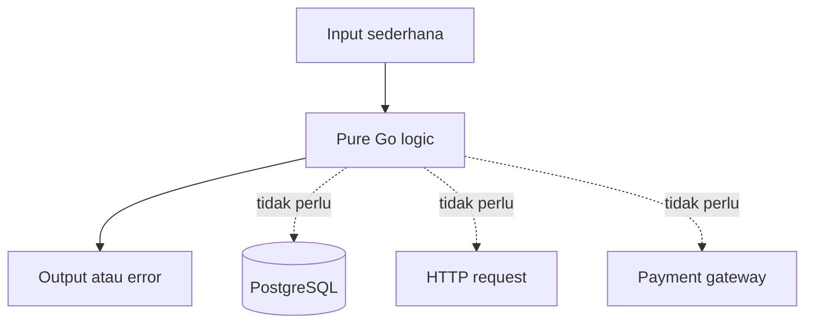
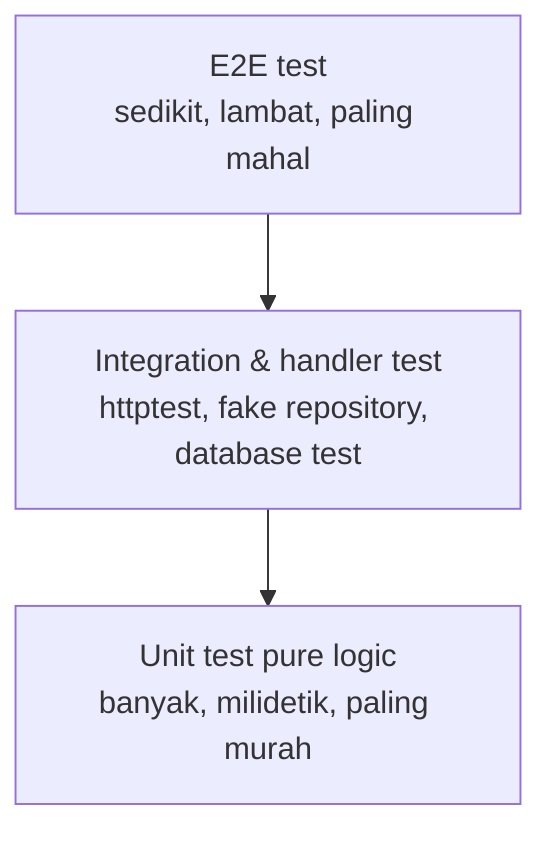
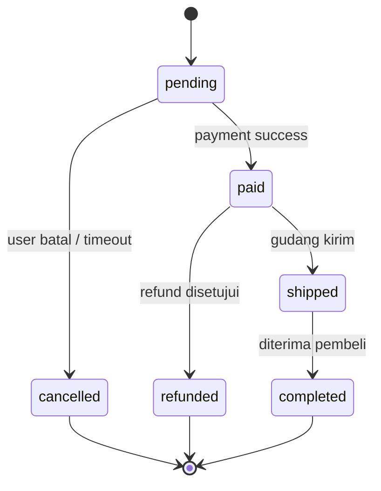

import { Section, Box, Steps, Step, Recap, CardGrid, Card, Chip, Hero, Compare, FileTree, Def } from "@components";

<Hero eyebrow="Roadmap 6 &middot; Testing Go Backend Applications" title="Unit Testing Dasar di Go<br /><em>logic dulu, integrasi nanti</em>">
  <p>Mulai testing backend dari fungsi murni yang mudah dipercaya sebelum masuk ke HTTP handler, database, dan worker.</p>
  <Fragment slot="meta">
    <Chip icon="code">Bahasa: <b>Go 1.26</b></Chip>
    <Chip icon="target">Diskon, stok, status order</Chip>
    <Chip icon="clock">~70 menit baca</Chip>
  </Fragment>
</Hero>

<Section num="01" id="intro" title="Kenapa Unit Test Dulu?" sub="Roadmap 6 dimulai dari test yang tidak menyentuh database dan HTTP">

<p class="lead">Unit test adalah cara paling murah untuk membuktikan aturan bisnis berjalan benar, terutama aturan cart, voucher, dan stok.</p>

Di React, kamu mungkin pernah menguji helper seperti `formatPrice` atau reducer tanpa mount komponen. Di Laravel, padanannya mirip menguji service class tanpa boot database. Di Go, titik awalnya sama: ambil logic yang tidak butuh jaringan, file, database, atau HTTP request, lalu uji dengan package `testing` bawaan.

<Box variant="bridge" icon="🌉" label="Jembatan: dari helper JS ke pure Go function"><p>Kalau di JS kamu suka memisahkan fungsi pure agar mudah dites, di Go kebiasaan itu bahkan lebih penting karena handler HTTP dan repository PostgreSQL sebaiknya tipis.</p></Box>

Pada backend online shop skincare, tiga aturan bisnis ini paling sering rusak diam-diam dan paling murah diuji sebagai fungsi murni: hitung diskon voucher, validasi stok, dan transisi status order (pending &rarr; paid &rarr; shipped). Modul ini fokus menuntaskan ketiganya. Test seperti ini cepat, stabil, dan ideal dijalankan setiap kali kamu menyimpan perubahan.


<p class="fig-cap"><b>Gambar 1.</b> Unit test di modul ini hanya menguji logic, bukan database, HTTP, atau gateway eksternal.</p>

Roadmap 6 mengikuti bentuk test pyramid: banyak unit test yang murah dan cepat di bawah, sedikit handler dan integration test di tengah, sedikit e2e di puncak. Modul ini membangun dasar piramida itu, dan modul berikutnya naik selapis demi selapis.


<p class="fig-cap"><b>Gambar 2.</b> Test pyramid: modul ini mengisi lapisan paling bawah, fondasi yang menanggung sebagian besar kepercayaan terhadap aturan bisnis.</p>

<Def term="unit test"><p>Test kecil yang memverifikasi satu unit logic, biasanya fungsi atau method, dengan input terkontrol dan output yang bisa diprediksi.</p></Def>

</Section>

<Section num="02" id="testing-bawaan-go" title="Package testing Bawaan Go" sub="Tidak perlu Jest, PHPUnit, atau assertion library dulu">

<p class="lead">Go membawa package `testing` di standard library, dan command `go test` sudah tahu cara menemukan serta menjalankan test.</p>

Dokumentasi resmi Go menjelaskan bahwa package `testing` dipakai bersama command `go test`, dan fungsi test berbentuk `TestXxx` dengan parameter `*testing.T`. Karena ini bawaan toolchain, kamu tidak perlu memasang library eksternal untuk memulai unit test.

<Box variant="tip" icon="💡" label="Prinsip Go"><p>Mulai dari standard library. Assertion library boleh dipakai nanti, tetapi dasar yang wajib kamu kuasai adalah `testing.T`, `t.Run`, `t.Errorf`, dan `t.Fatalf`.</p></Box>

Di banyak ekosistem JavaScript, test runner, assertion, dan mocking sering datang dari paket berbeda. Di Go, pengalaman awalnya lebih sederhana: file test berakhiran `_test.go`, function test diawali `Test`, lalu jalankan `go test`.

<CardGrid cols={3}>
  <Card><h4>Test runner</h4><p>`go test` adalah command resmi untuk compile dan menjalankan test.</p></Card>
  <Card><h4>Test file</h4><p>File test diletakkan di package yang sama atau package eksternal dengan suffix `_test.go`.</p></Card>
  <Card><h4>Test function</h4><p>Nama test diawali `Test`, lalu menerima parameter `t *testing.T`.</p></Card>
</CardGrid>

```go title="internal/cart/calculator_test.go"
package cart

import "testing"

func TestCalculateCartTotal(t *testing.T) {
	got := int64(20_000 + 35_000)
	want := int64(55_000)

	if got != want {
		t.Errorf("got %d, want %d", got, want)
	}
}
```

</Section>

<Section num="03" id="anatomi-test" title="Anatomi Test Function" sub="Nama, parameter, arrange, act, assert">

<p class="lead">Bentuk dasar test Go sengaja sederhana agar fokusnya ada di behavior, bukan framework.</p>

Nama test mengikuti pola `TestNamaFungsi`. Parameter `t *testing.T` adalah handle untuk melaporkan kegagalan, membuat subtest, menulis log, dan menghentikan test saat kondisi fatal.

<Steps>
  <Step><b>Arrange</b><p>Siapkan input: item cart, voucher, stok, atau status order.</p></Step>
  <Step><b>Act</b><p>Panggil fungsi yang diuji, misalnya `CalculateCartTotal`.</p></Step>
  <Step><b>Assert</b><p>Bandingkan hasil aktual dengan hasil yang diharapkan, lalu panggil `t.Errorf` atau `t.Fatalf` bila salah.</p></Step>
</Steps>

```go title="internal/promotion/voucher_anatomy_test.go"
func TestApplyVoucherAnatomy(t *testing.T) {
	// arrange
	now := time.Date(2026, 6, 6, 10, 0, 0, 0, time.UTC)
	subtotal := int64(100_000)
	voucher := Voucher{Code: "GLOW25", Type: DiscountFixed, Value: 25_000, ExpiresAt: now.Add(24 * time.Hour)}

	// act
	got, err := ApplyVoucher(now, subtotal, voucher)

	// assert
	if err != nil {
		t.Fatalf("ApplyVoucher returned error: %v", err)
	}
	if got != 75_000 {
		t.Errorf("got %d, want %d", got, int64(75_000))
	}
}
```

<Box variant="note" icon="📝" label="Catatan"><p>Komentar arrange, act, assert tidak wajib di setiap test, tetapi berguna saat kamu sedang belajar atau saat skenario bisnisnya kompleks.</p></Box>

</Section>

<Section num="04" id="errorf-vs-fatalf" title="t.Errorf vs t.Fatalf" sub="Kapan lanjut, kapan berhenti">

<p class="lead">`t.Errorf` menandai test gagal tetapi eksekusi lanjut, sedangkan `t.Fatalf` menandai gagal dan langsung menghentikan test saat itu.</p>

Gunakan `t.Fatalf` saat kondisi berikutnya tidak aman diperiksa. Contohnya, kalau fungsi mengembalikan error padahal harus sukses, hasil output mungkin tidak valid untuk dibandingkan. Gunakan `t.Errorf` saat kamu masih bisa mengumpulkan beberapa perbedaan sekaligus.

<Compare aLabel="JS / PHP" bLabel="Go" aTone="muted" bTone="violet">
  <Fragment slot="a"><ul><li>Jest sering memakai `expect` yang langsung memberi laporan assertion.</li><li>PHPUnit juga punya method assertion seperti `assertSame` dan `assertTrue`.</li></ul></Fragment>
  <Fragment slot="b"><ul><li>Go standard library memakai logika biasa: `if got != want`, lalu laporkan lewat `t.Errorf` atau `t.Fatalf`.</li><li>Perbandingan eksplisit membuat test mudah dibaca tanpa DSL tambahan.</li></ul></Fragment>
</Compare>

```go title="internal/cart/errorf_vs_fatalf_test.go"
func TestErrorfVsFatalf(t *testing.T) {
	got, err := CalculateCartTotal([]CartItem{{SKU: "TONER-100", Quantity: 2, UnitPrice: 35_000}})
	if err != nil {
		t.Fatalf("CalculateCartTotal returned error: %v", err)
	}

	want := int64(70_000)
	if got != want {
		t.Errorf("got %d, want %d", got, want)
	}
}
```

<Box variant="warn" icon="⚠️" label="Jebakan"><p>Jangan lanjut membandingkan field dari hasil yang belum valid. Kalau setup gagal atau error tidak sesuai harapan, pakai `t.Fatalf`.</p></Box>

</Section>

<Section num="05" id="table-driven-test" title="Table-driven Test & Subtest" sub="Idiom paling umum untuk banyak skenario dalam satu test">

<p class="lead">Table-driven test adalah pola Go untuk menaruh daftar skenario dalam slice struct, lalu menjalankannya dengan loop dan `t.Run`.</p>

Di Jest, kamu mungkin memakai `describe`, `it`, atau `test.each`. Di Go, pola idiomatiknya adalah slice struct anonim berisi nama kasus, input, expected output, dan expected error. Pola ini membuat test ringkas tanpa kehilangan konteks bisnis.

<Compare aLabel="Jest describe / it" bLabel="Go table-driven test" aTone="muted" bTone="blue">
  <Fragment slot="a"><ul><li>Skenario sering dipisah menjadi banyak blok `it`.</li><li>`test.each` bisa dipakai untuk data-driven test.</li><li>Assertion biasanya memakai `expect`.</li></ul></Fragment>
  <Fragment slot="b"><ul><li>Skenario ditulis sebagai data dalam `tests`.</li><li>Setiap baris dijalankan sebagai subtest dengan `t.Run`.</li><li>Assertion memakai `if` biasa dan `testing.T`.</li></ul></Fragment>
</Compare>

```go title="internal/cart/table_shape_test.go"
func TestExampleTableShape(t *testing.T) {
	tests := []struct {
		name string
		input int
		want  int
	}{
		{name: "double positive", input: 2, want: 4},
		{name: "double zero", input: 0, want: 0},
	}

	for _, tc := range tests {
		t.Run(tc.name, func(t *testing.T) {
			got := tc.input * 2
			if got != tc.want {
				t.Errorf("got %d, want %d", got, tc.want)
			}
		})
	}
}
```

<Box variant="note" icon="🧭" label="Go 1.26"><p>Materi lama sering menulis `tc := tc` di dalam loop sebelum `t.Run`. Sejak Go 1.22, loop variable dibuat per iterasi, jadi pola ini tidak lagi diperlukan untuk Go 1.26 kecuali kamu harus mendukung versi lama.</p></Box>

Setiap `t.Run` menciptakan subtest dengan nama sendiri, sehingga output `go test -v` jadi rapi dan kamu bisa menjalankan satu kasus saja, misalnya `go test -run TestExampleTableShape/double_zero`. Spasi pada nama kasus otomatis diganti garis bawah pada nama subtest.

Kalau fungsi yang diuji benar-benar murni (tidak berbagi state), kamu boleh menjalankan subtest secara paralel dengan memanggil `t.Parallel()` di awal closure. Ini mempercepat suite besar, tetapi hanya aman untuk fungsi tanpa efek samping bersama, persis tipe fungsi yang kita uji di modul ini.

```go title="internal/cart/table_parallel_test.go"
for _, tc := range tests {
	t.Run(tc.name, func(t *testing.T) {
		t.Parallel() // aman karena fungsi murni, tanpa state bersama
		got := tc.input * 2
		if got != tc.want {
			t.Errorf("got %d, want %d", got, tc.want)
		}
	})
}
```

<Box variant="bridge" icon="🌉" label="Jembatan: dari it.each ke t.Run"><p>Subtest `t.Run` adalah padanan blok `it` di dalam `describe` pada Jest, sedangkan tabel skenarionya menggantikan `test.each`. Bedanya, di Go semuanya data biasa plus loop, bukan API runner khusus.</p></Box>

</Section>

<Section num="06" id="test-cart-total" title="Contoh: CalculateCartTotal" sub="Menguji total cart tanpa database">

<p class="lead">Cart total adalah contoh unit test ideal karena input dan outputnya jelas, tanpa perlu mengambil harga dari PostgreSQL.</p>

Pada domain cart, total dihitung dari `quantity * unit price`. Dalam sistem nyata, harga item biasanya berasal dari product variant saat response cart dibangun. Tetapi fungsi hitung total tetap bisa dibuat murni agar mudah diuji.

```go title="internal/cart/calculator.go"
package cart

import "errors"

var (
	ErrEmptyCart       = errors.New("cart is empty")
	ErrInvalidQuantity = errors.New("cart item quantity must be positive")
	ErrInvalidPrice    = errors.New("cart item price must be positive")
)

type CartItem struct {
	SKU       string
	Quantity  int
	UnitPrice int64
}

func CalculateCartTotal(items []CartItem) (int64, error) {
	if len(items) == 0 {
		return 0, ErrEmptyCart
	}

	var total int64
	for _, item := range items {
		if item.Quantity <= 0 {
			return 0, ErrInvalidQuantity
		}
		if item.UnitPrice <= 0 {
			return 0, ErrInvalidPrice
		}
		total += int64(item.Quantity) * item.UnitPrice
	}

	return total, nil
}
```

```go title="internal/cart/calculator_test.go"
package cart

import (
	"errors"
	"testing"
)

func TestCalculateCartTotal(t *testing.T) {
	tests := []struct {
		name    string
		items   []CartItem
		want    int64
		wantErr error
	}{
		{
			name: "single item",
			items: []CartItem{
				{SKU: "TONER-100", Quantity: 2, UnitPrice: 35_000},
			},
			want: 70_000,
		},
		{
			name: "multiple items",
			items: []CartItem{
				{SKU: "TONER-100", Quantity: 2, UnitPrice: 35_000},
				{SKU: "SERUM-30", Quantity: 1, UnitPrice: 120_000},
			},
			want: 190_000,
		},
		{
			name:    "empty cart",
			items:   []CartItem{},
			wantErr: ErrEmptyCart,
		},
		{
			name: "invalid quantity",
			items: []CartItem{
				{SKU: "TONER-100", Quantity: 0, UnitPrice: 35_000},
			},
			wantErr: ErrInvalidQuantity,
		},
		{
			name: "invalid price",
			items: []CartItem{
				{SKU: "SERUM-30", Quantity: 1, UnitPrice: 0},
			},
			wantErr: ErrInvalidPrice,
		},
	}

	for _, tc := range tests {
		t.Run(tc.name, func(t *testing.T) {
			got, err := CalculateCartTotal(tc.items)
			if !errors.Is(err, tc.wantErr) {
				t.Fatalf("error = %v, want %v", err, tc.wantErr)
			}
			if got != tc.want {
				t.Errorf("total = %d, want %d", got, tc.want)
			}
		})
	}
}
```

<Box variant="tip" icon="💡" label="Kenapa table-driven?"><p>Satu fungsi test bisa menutup happy path dan edge case sekaligus, sehingga reviewer langsung melihat aturan bisnis cart dalam satu tempat.</p></Box>

</Section>

<Section num="07" id="test-apply-voucher" title="Contoh: ApplyVoucher" sub="Menguji diskon tanpa checkout flow lengkap">

<p class="lead">Voucher punya banyak aturan bisnis, jadi table-driven test membantu mencegah diskon bocor atau bisa dieksploitasi.</p>

Di proyek skincare, voucher tidak boleh hanya diuji dari endpoint checkout. Logic diskon harus punya test sendiri agar bug seperti minimum purchase terlewat, voucher expired masih berlaku, atau fixed discount melebihi subtotal bisa ditangkap cepat.

```go title="internal/promotion/voucher.go"
package promotion

import (
	"errors"
	"time"
)

var (
	ErrInvalidSubtotal = errors.New("subtotal must be positive")
	ErrVoucherExpired = errors.New("voucher expired")
	ErrMinimumPurchase = errors.New("minimum purchase not met")
	ErrUsageLimit      = errors.New("voucher usage limit reached")
	ErrUserLimit       = errors.New("voucher user limit reached")
	ErrInvalidDiscount = errors.New("invalid discount")
)

type DiscountType string

const (
	DiscountFixed      DiscountType = "fixed"
	DiscountPercentage DiscountType = "percentage"
)

type Voucher struct {
	Code            string
	Type            DiscountType
	Value           int64
	MinimumSubtotal int64
	UsageLimit      int
	UsedCount       int
	PerUserLimit    int
	UserUsedCount   int
	ExpiresAt       time.Time
}

func ApplyVoucher(now time.Time, subtotal int64, voucher Voucher) (int64, error) {
	if subtotal <= 0 {
		return 0, ErrInvalidSubtotal
	}
	if !voucher.ExpiresAt.IsZero() && now.After(voucher.ExpiresAt) {
		return 0, ErrVoucherExpired
	}
	if subtotal < voucher.MinimumSubtotal {
		return 0, ErrMinimumPurchase
	}
	if voucher.UsageLimit > 0 && voucher.UsedCount >= voucher.UsageLimit {
		return 0, ErrUsageLimit
	}
	if voucher.PerUserLimit > 0 && voucher.UserUsedCount >= voucher.PerUserLimit {
		return 0, ErrUserLimit
	}

	discount, err := calculateDiscount(subtotal, voucher)
	if err != nil {
		return 0, err
	}
	if discount > subtotal {
		discount = subtotal
	}

	return subtotal - discount, nil
}

func calculateDiscount(subtotal int64, voucher Voucher) (int64, error) {
	switch voucher.Type {
	case DiscountFixed:
		if voucher.Value <= 0 {
			return 0, ErrInvalidDiscount
		}
		return voucher.Value, nil
	case DiscountPercentage:
		if voucher.Value <= 0 || voucher.Value > 100 {
			return 0, ErrInvalidDiscount
		}
		return subtotal * voucher.Value / 100, nil
	default:
		return 0, ErrInvalidDiscount
	}
}
```

```go title="internal/promotion/voucher_test.go"
package promotion

import (
	"errors"
	"testing"
	"time"
)

func TestApplyVoucher(t *testing.T) {
	now := time.Date(2026, 6, 6, 10, 0, 0, 0, time.UTC)

	tests := []struct {
		name     string
		subtotal int64
		voucher  Voucher
		want     int64
		wantErr  error
	}{
		{
			name:     "fixed discount",
			subtotal: 150_000,
			voucher: Voucher{Code: "GLOW25", Type: DiscountFixed, Value: 25_000, ExpiresAt: now.Add(24 * time.Hour)},
			want:     125_000,
		},
		{
			name:     "percentage discount",
			subtotal: 200_000,
			voucher: Voucher{Code: "SERUM10", Type: DiscountPercentage, Value: 10, ExpiresAt: now.Add(24 * time.Hour)},
			want:     180_000,
		},
		{
			name:     "minimum purchase not met",
			subtotal: 80_000,
			voucher:  Voucher{Code: "MIN100", Type: DiscountFixed, Value: 10_000, MinimumSubtotal: 100_000, ExpiresAt: now.Add(24 * time.Hour)},
			wantErr:  ErrMinimumPurchase,
		},
		{
			name:     "expired voucher",
			subtotal: 150_000,
			voucher:  Voucher{Code: "OLD", Type: DiscountFixed, Value: 10_000, ExpiresAt: now.Add(-24 * time.Hour)},
			wantErr:  ErrVoucherExpired,
		},
		{
			name:     "usage limit reached",
			subtotal: 150_000,
			voucher:  Voucher{Code: "FULL", Type: DiscountFixed, Value: 10_000, UsageLimit: 100, UsedCount: 100, ExpiresAt: now.Add(24 * time.Hour)},
			wantErr:  ErrUsageLimit,
		},
		{
			name:     "discount capped by subtotal",
			subtotal: 20_000,
			voucher:  Voucher{Code: "BIG", Type: DiscountFixed, Value: 50_000, ExpiresAt: now.Add(24 * time.Hour)},
			want:     0,
		},
	}

	for _, tc := range tests {
		t.Run(tc.name, func(t *testing.T) {
			got, err := ApplyVoucher(now, tc.subtotal, tc.voucher)
			if !errors.Is(err, tc.wantErr) {
				t.Fatalf("error = %v, want %v", err, tc.wantErr)
			}
			if got != tc.want {
				t.Errorf("final subtotal = %d, want %d", got, tc.want)
			}
		})
	}
}
```

<Box variant="warn" icon="⚠️" label="Jebakan voucher"><p>Jangan menguji voucher hanya dari checkout endpoint. Kalau semua rule diskon tersembunyi di handler, bug akan mahal dicari saat integrasi payment dan inventory ikut terlibat.</p></Box>

</Section>

<Section num="08" id="test-validate-stock" title="Contoh: ValidateStock" sub="Menguji stok tersedia dan safety stock">

<p class="lead">Validasi stok adalah business rule yang harus bisa diuji cepat sebelum kita menulis transaksi database dan row locking.</p>

Pada Roadmap 5, inventory punya `available_stock`, `reserved_stock`, `sold_stock`, dan safety stock. Di modul ini kita mulai dari validasi kecil: apakah variant aktif dan jumlah yang diminta masih berada di atas safety stock.

```go title="internal/inventory/stock.go"
package inventory

import "errors"

var (
	ErrInvalidRequestedQuantity = errors.New("requested quantity must be positive")
	ErrProductInactive          = errors.New("product variant inactive")
	ErrInsufficientStock        = errors.New("insufficient stock")
)

type ProductVariant struct {
	SKU            string
	IsActive       bool
	AvailableStock int
	SafetyStock    int
}

func ValidateStock(variant ProductVariant, requestedQty int) error {
	if requestedQty <= 0 {
		return ErrInvalidRequestedQuantity
	}
	if !variant.IsActive {
		return ErrProductInactive
	}

	sellableStock := variant.AvailableStock - variant.SafetyStock
	if requestedQty > sellableStock {
		return ErrInsufficientStock
	}

	return nil
}
```

```go title="internal/inventory/stock_test.go"
package inventory

import (
	"errors"
	"testing"
)

func TestValidateStock(t *testing.T) {
	tests := []struct {
		name         string
		variant      ProductVariant
		requestedQty int
		wantErr      error
	}{
		{
			name:         "stock available",
			variant:      ProductVariant{SKU: "TONER-100", IsActive: true, AvailableStock: 10, SafetyStock: 2},
			requestedQty: 3,
		},
		{
			name:         "requested quantity must be positive",
			variant:      ProductVariant{SKU: "TONER-100", IsActive: true, AvailableStock: 10, SafetyStock: 2},
			requestedQty: 0,
			wantErr:      ErrInvalidRequestedQuantity,
		},
		{
			name:         "inactive variant",
			variant:      ProductVariant{SKU: "SERUM-30", IsActive: false, AvailableStock: 10, SafetyStock: 2},
			requestedQty: 1,
			wantErr:      ErrProductInactive,
		},
		{
			name:         "safety stock protected",
			variant:      ProductVariant{SKU: "CREAM-50", IsActive: true, AvailableStock: 5, SafetyStock: 2},
			requestedQty: 4,
			wantErr:      ErrInsufficientStock,
		},
	}

	for _, tc := range tests {
		t.Run(tc.name, func(t *testing.T) {
			err := ValidateStock(tc.variant, tc.requestedQty)
			if !errors.Is(err, tc.wantErr) {
				t.Fatalf("error = %v, want %v", err, tc.wantErr)
			}
		})
	}
}
```

<Box variant="bridge" icon="🌉" label="Jembatan: dari Laravel validation ke business rule"><p>Di Laravel, validasi request bisa memakai Form Request, tetapi rule seperti stok cukup sebaiknya tetap ada di service/domain. Di Go, pemisahan ini terlihat jelas karena unit test memanggil fungsi domain langsung.</p></Box>

</Section>

<Section num="09" id="test-order-status" title="Contoh: Transisi Status Order" sub="State machine sebagai pure function yang sangat layak diuji">

<p class="lead">Status order bergerak lewat jalur yang ketat, dan satu transisi salah bisa berarti barang dikirim sebelum dibayar atau order yang sudah selesai dibatalkan.</p>

Status order adalah state machine: dari `pending` hanya boleh ke `paid` atau `cancelled`, dari `paid` ke `shipped` atau `refunded`, dan seterusnya. Aturan ini gampang dilanggar kalau tersebar di banyak handler. Kumpulkan ke satu fungsi murni `CanTransition`, lalu uji seluruh matriks transisinya dengan table-driven test.


<p class="fig-cap"><b>Gambar 3.</b> Lifecycle status order. Hanya panah pada diagram inilah transisi yang sah, semua kombinasi lain harus ditolak.</p>

```go title="internal/order/status.go"
package order

import "errors"

var ErrInvalidTransition = errors.New("invalid order status transition")

type Status string

const (
	StatusPending   Status = "pending"
	StatusPaid      Status = "paid"
	StatusShipped   Status = "shipped"
	StatusCompleted Status = "completed"
	StatusCancelled Status = "cancelled"
	StatusRefunded  Status = "refunded"
)

// allowed memetakan status saat ini ke himpunan status tujuan yang sah.
var allowed = map[Status]map[Status]bool{
	StatusPending:   {StatusPaid: true, StatusCancelled: true},
	StatusPaid:      {StatusShipped: true, StatusRefunded: true},
	StatusShipped:   {StatusCompleted: true},
	StatusCompleted: {},
	StatusCancelled: {},
	StatusRefunded:  {},
}

// CanTransition mengembalikan nil bila perpindahan from -> to diizinkan.
func CanTransition(from, to Status) error {
	if !allowed[from][to] {
		return ErrInvalidTransition
	}
	return nil
}
```

```go title="internal/order/status_test.go"
package order

import (
	"errors"
	"testing"
)

func TestCanTransition(t *testing.T) {
	tests := []struct {
		name    string
		from    Status
		to      Status
		wantErr error
	}{
		{name: "pending to paid", from: StatusPending, to: StatusPaid},
		{name: "paid to shipped", from: StatusPaid, to: StatusShipped},
		{name: "shipped to completed", from: StatusShipped, to: StatusCompleted},
		{name: "pending to cancelled", from: StatusPending, to: StatusCancelled},
		{name: "ship before paid", from: StatusPending, to: StatusShipped, wantErr: ErrInvalidTransition},
		{name: "cancel after completed", from: StatusCompleted, to: StatusCancelled, wantErr: ErrInvalidTransition},
		{name: "refund a shipped order", from: StatusShipped, to: StatusRefunded, wantErr: ErrInvalidTransition},
		{name: "reopen cancelled order", from: StatusCancelled, to: StatusPaid, wantErr: ErrInvalidTransition},
	}

	for _, tc := range tests {
		t.Run(tc.name, func(t *testing.T) {
			err := CanTransition(tc.from, tc.to)
			if !errors.Is(err, tc.wantErr) {
				t.Fatalf("CanTransition(%q, %q) error = %v, want %v", tc.from, tc.to, err, tc.wantErr)
			}
		})
	}
}
```

<Box variant="bridge" icon="🌉" label="Jembatan: dari state machine UI ke domain Go"><p>Kalau di React kamu pernah menjaga transisi state lewat reducer atau XState, ini padanannya di domain backend. Bedanya, di Go state machine cukup berupa map plus satu fungsi murni, dan testnya menutup seluruh sel matriks transisi.</p></Box>

<Box variant="warn" icon="⚠️" label="Jebakan transisi"><p>Jangan menaruh aturan transisi di handler update order. Kalau tersebar, mudah muncul jalur ilegal seperti `shipped` langsung jadi `pending`, dan baru ketahuan saat order nyangkut di produksi.</p></Box>

</Section>

<Section num="10" id="menjalankan-test" title="Menjalankan Test & Race Detector" sub="Command harian yang wajib hafal">

<p class="lead">Setelah file test dibuat, workflow utamanya adalah menjalankan test package tertentu, seluruh module, atau satu test spesifik.</p>

`go test ./...` menjalankan semua package dalam module saat ini. `go test -v` menampilkan output verbose, termasuk nama subtest. `go test -run TestNamaSpesifik` hanya menjalankan test yang cocok dengan pola nama tersebut.

```bash title="Terminal"
go test ./...
go test ./internal/cart
go test ./internal/cart -v
go test ./... -run TestCalculateCartTotal
go test ./... -run TestApplyVoucher
```

<Def term="package list pattern"><p>Pola `./...` berarti semua package di bawah direktori saat ini, sehingga cocok dipakai dari root project saat menjalankan test lokal atau CI.</p></Def>

<Box variant="tip" icon="💡" label="Command favorit saat debugging"><p>Pakai `go test ./internal/promotion -run TestApplyVoucher -v` saat sedang memperbaiki satu fungsi voucher agar feedback tetap cepat.</p></Box>

```text title="Contoh output"
=== RUN   TestCalculateCartTotal
=== RUN   TestCalculateCartTotal/single_item
=== RUN   TestCalculateCartTotal/multiple_items
=== RUN   TestCalculateCartTotal/empty_cart
--- PASS: TestCalculateCartTotal (0.00s)
    --- PASS: TestCalculateCartTotal/single_item (0.00s)
    --- PASS: TestCalculateCartTotal/multiple_items (0.00s)
    --- PASS: TestCalculateCartTotal/empty_cart (0.00s)
PASS
ok      github.com/kamu/skincare-backend/internal/cart   0.003s
```

<h3>Race detector</h3>

<p>Flag `-race` mengaktifkan race detector bawaan Go, yang melaporkan akses memori bersamaan tanpa sinkronisasi.</p>

Untuk fungsi murni di modul ini, `-race` jarang menemukan apa-apa, dan itu memang yang kita harapkan. Tetapi biasakan menjalankannya sejak awal: begitu kode mulai memakai goroutine (worker inventory, pengiriman email, webhook payment), `-race` menjadi penjaga paling murah terhadap bug konkurensi yang sulit direproduksi.

```bash title="Terminal"
go test ./... -race
go test ./internal/order -run TestCanTransition -race -v
```

<Box variant="tip" icon="💡" label="TestMain dan benchmark, sekilas"><p>Untuk setup sekali per package (misalnya seed data uji), Go punya `func TestMain(m *testing.M)`. Untuk mengukur performa fungsi panas, ada `func BenchmarkXxx(b *testing.B)` yang dijalankan dengan `go test -bench`. Keduanya di luar fokus modul ini, cukup tahu bahwa keduanya ada.</p></Box>

</Section>

<Section num="11" id="coverage" title="Test Coverage" sub="Angka coverage adalah sinyal, bukan tujuan akhir">

<p class="lead">Coverage membantu melihat bagian kode yang belum tersentuh test, tetapi coverage tinggi tidak otomatis berarti business rule sudah benar.</p>

Gunakan `go test -cover` untuk ringkasan cepat. Jika butuh laporan HTML, buat profile dengan `-coverprofile`, lalu buka dengan `go tool cover -html`. Ini berguna saat kamu ingin melihat cabang logic voucher mana yang belum diuji.

```bash title="Terminal"
go test ./... -cover
go test ./... -coverprofile=coverage.out
go tool cover -html=coverage.out
```

```text title="Contoh output"
ok      github.com/kamu/skincare-backend/internal/cart        0.003s  coverage: 94.1% of statements
ok      github.com/kamu/skincare-backend/internal/promotion   0.004s  coverage: 88.5% of statements
ok      github.com/kamu/skincare-backend/internal/inventory   0.003s  coverage: 91.7% of statements
```

<Box variant="warn" icon="⚠️" label="Jangan mengejar angka kosong"><p>Coverage 100 persen bisa tetap salah kalau skenario bisnis penting tidak ditulis. Fokus pada risk: uang, stok, status order, payment, dan keamanan.</p></Box>

<CardGrid cols={2}>
  <Card><h4>Coverage bagus</h4><p>Menjawab pertanyaan: baris mana yang sudah pernah dieksekusi test?</p></Card>
  <Card><h4>Coverage belum cukup</h4><p>Tidak menjawab apakah assertion sudah kuat dan semua edge case bisnis sudah masuk.</p></Card>
</CardGrid>

</Section>

<Section num="12" id="struktur-test" title="Struktur File Test" sub="Dekatkan test dengan package yang diuji">

<p class="lead">Untuk unit test dasar, letakkan file `_test.go` berdampingan dengan file production di package yang sama.</p>

Struktur ini membuat test mudah ditemukan dan menjaga package tetap kecil. Saat nanti masuk handler test, repository integration test, dan e2e test, kita bisa menambah folder khusus bila dibutuhkan.

<FileTree title="Struktur unit test dasar" tree={`
internal/
  cart/
    calculator.go       # pure cart logic
    calculator_test.go  # unit test cart
  promotion/
    voucher.go          # pure voucher logic
    voucher_test.go     # unit test voucher
  inventory/
    stock.go            # pure stock validation
    stock_test.go       # unit test stock
  order/
    status.go           # pure status transition rule
    status_test.go      # unit test transisi status
go.mod
`} />

<Box variant="note" icon="🗂️" label="Package yang sama atau beda?"><p>Pakai package yang sama untuk unit test internal logic. Package eksternal seperti `cart_test` cocok saat kamu ingin menguji hanya API publik package tersebut.</p></Box>

</Section>

<Section num="13" id="jebakan-umum" title="Jebakan Umum" sub="Kesalahan yang sering dibawa dari JS, PHP, dan test framework besar">

<p class="lead">Unit test Go terlihat sederhana, tetapi ada beberapa kebiasaan yang bisa membuat test lambat, rapuh, atau sulit dipercaya.</p>

<CardGrid cols={2}>
  <Card><h4>Terlalu cepat menyentuh database</h4><p>Untuk logic cart total, voucher, dan stock validation, database hanya membuat test lambat dan rentan setup.</p></Card>
  <Card><h4>Test hanya happy path</h4><p>Business rule penting biasanya rusak di edge case: cart kosong, stok safety, voucher expired, dan batas diskon.</p></Card>
  <Card><h4>Assertion kurang jelas</h4><p>Pesan error seperti `failed` tidak membantu. Tulis `got` dan `want` agar debugging cepat.</p></Card>
  <Card><h4>Menyembunyikan logic di handler</h4><p>Handler yang terlalu gemuk sulit diunit test. Pindahkan rule ke fungsi atau service murni.</p></Card>
</CardGrid>

<Box variant="warn" icon="⚠️" label="Jebakan dari dunia Jest"><p>Jangan mencari `describe` sebagai struktur wajib. Di Go, `t.Run` dan table-driven test sudah cukup untuk mengelompokkan skenario dengan jelas.</p></Box>

<Box variant="warn" icon="⚠️" label="Jebakan dari dunia Laravel"><p>Jangan menganggap semua test harus boot aplikasi dan database. Unit test Go yang baik sering kali hanya compile package, panggil fungsi, lalu selesai dalam milidetik.</p></Box>

</Section>

<Section num="14" id="hands-on" title="Hands-on Ringan" sub="Latihan 30 sampai 45 menit sebelum masuk handler test">

<p class="lead">Latihan ini membuat fondasi testing kamu siap sebelum modul berikutnya menguji HTTP handler dan service dengan dependency palsu.</p>

<Steps>
  <Step><b>Buat empat package kecil</b><p>Buat `internal/cart`, `internal/promotion`, `internal/inventory`, dan `internal/order` sesuai contoh di modul ini.</p></Step>
  <Step><b>Tulis production function dulu</b><p>Mulai dari `CalculateCartTotal`, `ApplyVoucher`, `ValidateStock`, dan `CanTransition` tanpa database dan HTTP.</p></Step>
  <Step><b>Tulis table-driven test</b><p>Minimal tiga skenario per fungsi: satu happy path dan dua edge case. Untuk transisi status, tutup minimal dua transisi sah dan dua transisi ilegal.</p></Step>
  <Step><b>Jalankan semua test</b><p>Pakai `go test ./...`, lalu ulang dengan `go test ./... -v` untuk melihat nama subtest, dan `go test ./... -race` sebagai kebiasaan.</p></Step>
  <Step><b>Cek coverage</b><p>Pakai `go test ./... -cover`, lalu tambah case bila cabang bisnis penting belum teruji.</p></Step>
</Steps>

```bash title="Terminal"
go test ./...
go test ./... -v
go test ./... -run TestCanTransition
go test ./... -race
go test ./... -cover
```

<Box variant="tip" icon="✅" label="Target latihan"><p>Setelah hands-on ini, kamu harus bisa menambah satu rule bisnis baru dan langsung menulis testnya tanpa menunggu endpoint atau database siap.</p></Box>

</Section>

<Section num="15" id="ringkasan" title="Ringkasan & Poin Penting">

<p class="lead">Unit testing dasar adalah fondasi Roadmap 6: kita belajar memastikan logic domain benar sebelum menambah HTTP, database, mock, dan integrasi.</p>

<Recap title="Yang Wajib Menempel">
  <ul><li>Go menyediakan package `testing` dan command `go test` sebagai tool utama unit test, tanpa library eksternal.</li><li>Nama test mengikuti pola `TestNamaFungsi` dan menerima parameter `t *testing.T`.</li><li>`t.Errorf` melaporkan gagal lalu lanjut, sedangkan `t.Fatalf` melaporkan gagal lalu berhenti.</li><li>Table-driven test plus subtest `t.Run` adalah idiom utama Go untuk banyak skenario bisnis dalam satu fungsi test, dan `t.Parallel` mempercepat fungsi murni.</li><li>`go test ./...`, `go test -v`, `go test -run`, `go test -race`, dan `go test -cover` adalah command harian yang wajib hafal.</li><li>Tiga aturan bisnis inti sudah punya test sendiri di modul ini: diskon voucher (`ApplyVoucher`), validasi stok (`ValidateStock`), dan transisi status order (`CanTransition`).</li><li>Transisi status order paling rapi diuji sebagai state machine murni: satu map plus satu fungsi, lalu tutup transisi sah dan ilegal.</li><li>Langkah berikutnya di Roadmap 6 adalah menguji handler HTTP dengan `net/http/httptest`, lalu service dengan fake repository.</li></ul>
</Recap>

<Box variant="bridge" icon="🌉" label="Peta ke proyek skincare"><p>Mulai dari pure function membuat domain lebih bersih. Saat checkout nanti menyentuh PostgreSQL, payment gateway, dan inventory transaction, kamu sudah punya lapisan rule bisnis yang dipercaya.</p></Box>

</Section>
