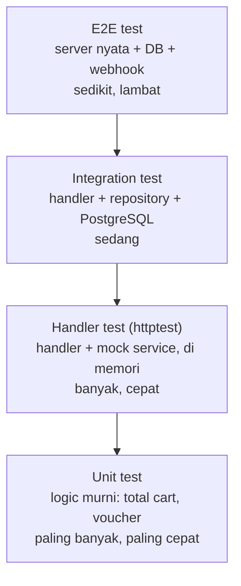
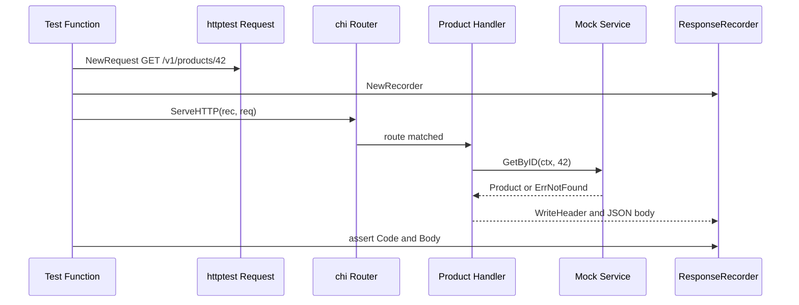
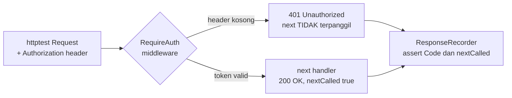

import { Section, Box, Steps, Step, Recap, CardGrid, Card, Chip, Hero, Compare, FileTree, Endpoint, Def } from "@components";

<Hero eyebrow="Roadmap 6 &middot; Testing" title="Testing HTTP Handler<br /><em>dengan httptest</em>">
  <p>Uji perilaku API Go tanpa membuka port, tanpa menjalankan server sungguhan, dan tanpa menyentuh database.</p>
  <Fragment slot="meta">
    <Chip icon="code">Bahasa: <b>Go 1.26</b></Chip>
    <Chip icon="clock">~72 menit baca</Chip>
  </Fragment>
</Hero>

<Section num="01" id="intro" title="Kenapa Handler Perlu Dites?" sub="Handler adalah kontrak HTTP yang dilihat frontend, mobile app, dan integrasi eksternal.">

<p class="lead">Unit test di modul sebelumnya memastikan logic murni benar, sedangkan handler test memastikan logic itu keluar sebagai API behavior yang benar.</p>

Di React atau Next.js, kamu mungkin terbiasa mengetes API call dengan MSW atau Supertest. Di Laravel, kamu mungkin mengenal feature test seperti `getJson()` lalu cek status dan payload. Di Go, untuk level handler, kita bisa memakai package standar [testing](https://pkg.go.dev/testing) dan [net/http/httptest](https://pkg.go.dev/net/http/httptest) tanpa menjalankan server sungguhan.

Di modul ini kita menguji tiga keluarga endpoint inti online shop skincare, bukan hanya produk. Pola yang sama berlaku untuk ketiganya.

<Endpoint method="GET" path="/v1/products/{id}" desc="Ambil detail produk skincare berdasarkan ID produk" />
<Endpoint method="POST" path="/v1/cart/items" desc="Tambah item ke cart milik user yang sedang login" />
<Endpoint method="POST" path="/v1/orders" desc="Checkout cart menjadi order baru dengan total dalam rupiah utuh" />

Tujuan test handler bukan membuktikan SQL benar. Tujuannya membuktikan request HTTP diparse dengan benar, service dipanggil dengan input benar, error domain dipetakan ke status code yang benar, dan response JSON mudah dikonsumsi client.

<p>Letakkan handler test di tengah piramida testing. Ia lebih luas daripada unit test logic murni di modul sebelumnya, tetapi tetap jauh lebih cepat dan stabil daripada integration test yang menyentuh PostgreSQL.</p>



<p class="fig-cap"><b>Gambar 1.</b> Handler test mengisi lapisan kedua dari bawah, menguji kontrak HTTP product, cart, dan order tanpa biaya database.</p>

<Box variant="bridge" icon="🌉" label="Jembatan: dari feature test Laravel ke httptest"><p>Laravel feature test terasa seperti mengirim request ke aplikasi, sedangkan Go handler test biasanya memanggil <code>ServeHTTP</code> langsung di memori. Lebih kecil cakupannya, lebih cepat, dan lebih mudah mengisolasi service.</p></Box>

</Section>

<Section num="02" id="mental-model" title="Mental Model httptest" sub="Kita mengganti jaringan nyata dengan object request dan recorder di memori.">

<p class="lead"><code>httptest</code> membuat simulasi HTTP yang cukup realistis untuk handler, tetapi tetap ringan seperti unit test.</p>

<Def term="httptest.NewRequest"><p>Membuat <code>*http.Request</code> server-side untuk test, misalnya request <code>GET /v1/products/42</code> dengan body nil atau JSON.</p></Def>

<Def term="httptest.NewRecorder"><p>Membuat <code>*httptest.ResponseRecorder</code>, pengganti <code>http.ResponseWriter</code> yang menyimpan status code, header, dan body yang ditulis handler.</p></Def>

<Def term="handler.ServeHTTP(w, r)"><p>Memanggil handler langsung dengan recorder dan request. Tidak ada socket, tidak ada port, tidak ada proses server terpisah.</p></Def>



<p class="fig-cap"><b>Gambar 2.</b> Handler test mengganti request dan response writer nyata dengan object test di memori.</p>

<Compare aLabel="JS / PHP" bLabel="Go" aTone="muted" bTone="violet">
  <Fragment slot="a"><ul><li>Di Jest atau Supertest, kamu sering menulis <code>expect(response.status).toBe(200)</code>.</li><li>Di Laravel, kamu sering menulis <code>assertStatus(200)</code> dan <code>assertJson()</code>.</li></ul></Fragment>
  <Fragment slot="b"><ul><li>Di Go, kamu cek <code>w.Code</code> untuk status dan <code>w.Body.String()</code> atau <code>json.Unmarshal</code> untuk response.</li><li>Dependency luar diganti dengan mock kecil yang memenuhi interface service.</li></ul></Fragment>
</Compare>

</Section>

<Section num="03" id="anatomi-handler" title="Anatomi Handler yang Mudah Dites" sub="Handler yang testable tidak membuat dependency sendiri di dalam method.">

<p class="lead">Agar bisa dites tanpa database, handler menerima service lewat interface.</p>

Struktur kecil untuk domain produk terlihat seperti ini. Handler hanya tahu interface service, bukan pgx, bukan repository konkret, dan bukan koneksi PostgreSQL.

<FileTree title="Struktur handler test per domain" tree={`
internal/
  product/
    handler.go        # GET produk, parse param, tulis JSON
    handler_test.go   # httptest untuk success dan not found
    service.go        # interface ProductService nyata di proyek
    model.go          # Product dan response DTO
  cart/
    handler.go        # POST item ke cart user
    handler_test.go   # httptest untuk add item dan validasi
  order/
    handler.go        # POST checkout cart jadi order
    handler_test.go   # httptest untuk created dan stok habis
  middleware/
    auth.go           # ambil user dari Authorization header
    auth_test.go      # ServeHTTP menguji 401 vs 200
  shared/
    errors.go         # ErrNotFound, ErrValidation, ErrConflict
`} />

<CardGrid cols={3}>
  <Card><h4>Handler</h4><p>Parse route param, panggil service, tulis status code dan JSON response.</p></Card>
  <Card><h4>Service</h4><p>Berisi business logic, misalnya produk aktif, archived, atau tidak ditemukan.</p></Card>
  <Card><h4>Mock service</h4><p>Implementasi kecil di file test untuk mengatur hasil success atau error.</p></Card>
</CardGrid>

<Box variant="tip" icon="💡" label="Prinsip desain"><p>Accept interfaces, return structs. Handler menerima interface service agar test bisa memberi fake, sedangkan service nyata tetap mengembalikan struct domain yang jelas.</p></Box>

</Section>

<Section num="04" id="recorder-request" title="NewRecorder dan NewRequest" sub="Dua object ini adalah pasangan utama di handler test.">

<p class="lead"><code>NewRequest</code> membuat input, <code>NewRecorder</code> menangkap output.</p>

```go title="internal/product/handler_test.go"
req := httptest.NewRequest(http.MethodGet, "/v1/products/42", nil)
w := httptest.NewRecorder()

handler.ServeHTTP(w, req)

if w.Code != http.StatusOK {
	t.Fatalf("status code = %d, want %d", w.Code, http.StatusOK)
}

body := w.Body.String()
if body == "" {
	t.Errorf("response body kosong")
}
```

`httptest.NewRequest()` berbeda dari `http.NewRequest()`. Untuk handler test, gunakan `httptest.NewRequest()` karena request yang dibuat cocok untuk server handler. `httptest.NewRecorder()` mengimplementasikan `http.ResponseWriter`, sehingga handler tidak perlu tahu bahwa ia sedang dites.

<Box variant="warn" icon="⚠️" label="Jebakan: <code>w.Code</code> bisa 0"><p>Jika handler tidak pernah memanggil <code>WriteHeader</code> atau <code>Write</code>, <code>w.Code</code> bisa bernilai <code>0</code>. Untuk API JSON, biasakan menulis status secara eksplisit lewat helper seperti <code>writeJSON(w, status, payload)</code>.</p></Box>

</Section>

<Section num="05" id="serve-http" title="Menjalankan Handler Langsung" sub="Tidak perlu ListenAndServe, tidak perlu port lokal.">

<p class="lead">Setiap <code>http.Handler</code> punya method <code>ServeHTTP</code>, dan itulah titik masuk yang kita panggil di test.</p>

```go title="internal/product/handler_test.go"
handler := NewHandler(service).Routes()
req := httptest.NewRequest(http.MethodGet, "/v1/products/42", nil)
w := httptest.NewRecorder()

handler.ServeHTTP(w, req)
```

Di contoh ini `handler` adalah router chi yang berisi route detail produk. Kita tetap memanggil `ServeHTTP` agar chi punya kesempatan mencocokkan route, mengisi route param, lalu meneruskan request ke method handler yang tepat.

<Box variant="bridge" icon="🌉" label="Jembatan: dari controller Laravel"><p>Laravel test memanggil aplikasi lewat kernel HTTP framework. Di Go, router seperti chi sudah merupakan <code>http.Handler</code>, jadi kita bisa memanggilnya langsung tanpa boot server.</p></Box>

</Section>

<Section num="06" id="mock-service" title="Mock Service Layer dengan Interface" sub="Kita menguji HTTP behavior, bukan database behavior.">

<p class="lead">Mock service membuat handler test tetap fokus pada request, status code, dan response JSON.</p>

Interface service untuk handler produk cukup kecil. Handler tidak peduli apakah implementasinya memakai PostgreSQL, cache, atau fake di test.

```go title="internal/product/handler.go"
type ProductService interface {
	GetByID(ctx context.Context, id int64) (Product, error)
}
```

Di test, kita buat mock manual. Untuk kasus sederhana, mock manual lebih jelas daripada library mocking karena pembaca bisa melihat input dan outputnya langsung.

```go title="internal/product/handler_test.go"
type mockProductService struct {
	getByIDFunc func(ctx context.Context, id int64) (Product, error)
}

func (m mockProductService) GetByID(ctx context.Context, id int64) (Product, error) {
	return m.getByIDFunc(ctx, id)
}
```

<Box variant="note" icon="📝" label="Catatan"><p>Mock manual cocok untuk handler dan service kecil. Saat interface mulai besar, itu sering menjadi sinyal desain bahwa interface terlalu lebar untuk kebutuhan handler.</p></Box>

</Section>

<Section num="07" id="contoh-lengkap" title="Contoh Lengkap: GET Produk" sub="Success dan not found dalam satu file test yang idiomatik.">

<p class="lead">Contoh ini menguji <code>GET /v1/products/42</code> untuk response berhasil dan <code>GET /v1/products/404</code> untuk response tidak ditemukan.</p>

Pertama, bentuk handler produksi yang akan dites. Perhatikan bahwa handler menerima `ProductService`, memakai `chi.URLParam`, dan menulis JSON secara eksplisit.

```go title="internal/product/handler.go"
package product

import (
	"context"
	"encoding/json"
	"errors"
	"net/http"
	"strconv"

	"github.com/go-chi/chi/v5"
)

var ErrNotFound = errors.New("product not found")

type Product struct {
	ID          int64
	Name        string
	Brand       string
	PriceRupiah int64
}

type ProductService interface {
	GetByID(ctx context.Context, id int64) (Product, error)
}

type Handler struct {
	service ProductService
}

func NewHandler(service ProductService) *Handler {
	return &Handler{service: service}
}

func (h *Handler) Routes() http.Handler {
	r := chi.NewRouter()
	r.Get("/v1/products/{id}", h.GetByID)
	return r
}

type productResponse struct {
	ID          int64  `json:"id"`
	Name        string `json:"name"`
	Brand       string `json:"brand"`
	PriceRupiah int64  `json:"price_rupiah"`
}

type errorResponse struct {
	Error string `json:"error"`
}

func (h *Handler) GetByID(w http.ResponseWriter, r *http.Request) {
	id, err := strconv.ParseInt(chi.URLParam(r, "id"), 10, 64)
	if err != nil || id <= 0 {
		writeJSON(w, http.StatusBadRequest, errorResponse{Error: "invalid product id"})
		return
	}

	product, err := h.service.GetByID(r.Context(), id)
	if errors.Is(err, ErrNotFound) {
		writeJSON(w, http.StatusNotFound, errorResponse{Error: "product not found"})
		return
	}
	if err != nil {
		writeJSON(w, http.StatusInternalServerError, errorResponse{Error: "internal server error"})
		return
	}

	writeJSON(w, http.StatusOK, productResponse{
		ID:          product.ID,
		Name:        product.Name,
		Brand:       product.Brand,
		PriceRupiah: product.PriceRupiah,
	})
}

func writeJSON(w http.ResponseWriter, status int, payload any) {
	w.Header().Set("Content-Type", "application/json")
	w.WriteHeader(status)
	_ = json.NewEncoder(w).Encode(payload)
}
```

Sekarang test handlernya. Test ini tidak menjalankan server, tidak membuat koneksi database, dan tidak butuh repository.

```go title="internal/product/handler_test.go"
package product

import (
	"context"
	"encoding/json"
	"errors"
	"net/http"
	"net/http/httptest"
	"strings"
	"testing"
)

type mockProductService struct {
	getByIDFunc func(ctx context.Context, id int64) (Product, error)
}

func (m mockProductService) GetByID(ctx context.Context, id int64) (Product, error) {
	return m.getByIDFunc(ctx, id)
}

func TestProductHandler_GetByID(t *testing.T) {
	tests := []struct {
		name             string
		path             string
		service          mockProductService
		wantStatus       int
		wantID           int64
		wantBodyContains string
	}{
		{
			name: "success",
			path: "/v1/products/42",
			service: mockProductService{
				getByIDFunc: func(ctx context.Context, id int64) (Product, error) {
					if id != 42 {
						return Product{}, errors.New("unexpected id")
					}

					return Product{
						ID:          42,
						Name:        "Hydrating Toner 100ml",
						Brand:       "Wardah",
						PriceRupiah: 35000,
					}, nil
				},
			},
			wantStatus: http.StatusOK,
			wantID:     42,
		},
		{
			name: "not found",
			path: "/v1/products/404",
			service: mockProductService{
				getByIDFunc: func(ctx context.Context, id int64) (Product, error) {
					return Product{}, ErrNotFound
				},
			},
			wantStatus:       http.StatusNotFound,
			wantBodyContains: "product not found",
		},
	}

	for _, tt := range tests {
		t.Run(tt.name, func(t *testing.T) {
			handler := NewHandler(tt.service).Routes()
			req := httptest.NewRequest(http.MethodGet, tt.path, nil)
			w := httptest.NewRecorder()

			handler.ServeHTTP(w, req)

			if w.Code != tt.wantStatus {
				t.Fatalf("status code = %d, want %d, body = %s", w.Code, tt.wantStatus, w.Body.String())
			}

			if tt.wantStatus == http.StatusOK {
				var got productResponse
				if err := json.Unmarshal(w.Body.Bytes(), &got); err != nil {
					t.Fatalf("unmarshal response body: %v", err)
				}

				if got.ID != tt.wantID {
					t.Errorf("product id = %d, want %d", got.ID, tt.wantID)
				}
			}

			if tt.wantBodyContains != "" && !strings.Contains(w.Body.String(), tt.wantBodyContains) {
				t.Errorf("body = %q, want contains %q", w.Body.String(), tt.wantBodyContains)
			}
		})
	}
}
```

<Box variant="tip" icon="💡" label="Kenapa <code>t.Fatalf</code> untuk status code?"><p>Jika status code salah, bentuk body biasanya ikut salah. <code>t.Fatalf</code> menghentikan subtest agar assertion berikutnya tidak membaca JSON dengan format yang tidak sesuai.</p></Box>

</Section>

<Section num="08" id="cek-json" title="Cek JSON Body dengan Unmarshal" sub="String body cukup untuk error sederhana, tetapi JSON success sebaiknya dicek sebagai struct.">

<p class="lead">Response JSON adalah kontrak API. Jangan hanya cek status code lalu menganggap payload benar.</p>

Untuk error kecil, `strings.Contains(w.Body.String(), "product not found")` masih masuk akal. Untuk success response, decode JSON ke struct agar field yang penting benar-benar teruji.

```go title="internal/product/handler_test.go"
var got productResponse
if err := json.Unmarshal(w.Body.Bytes(), &got); err != nil {
	t.Fatalf("unmarshal response body: %v", err)
}

if got.ID != 42 {
	t.Errorf("product id = %d, want 42", got.ID)
}

if got.PriceRupiah != 35000 {
	t.Errorf("price_rupiah = %d, want %d", got.PriceRupiah, 35000)
}
```

<Box variant="note" icon="📝" label="Harga dalam rupiah utuh"><p>Di seluruh proyek skincare, harga disimpan sebagai <code>PriceRupiah int64</code> berisi rupiah satuan utuh, jadi <code>35000</code> berarti Rp35.000. Test JSON ikut memverifikasi kontrak ini agar frontend tidak salah membaca harga sebagai sen.</p></Box>

<CardGrid cols={2}>
  <Card><h4><code>w.Body.String()</code></h4><p>Cocok untuk cek pesan error singkat atau memastikan body tidak kosong.</p></Card>
  <Card><h4><code>json.Unmarshal</code></h4><p>Cocok untuk cek kontrak JSON seperti <code>id</code>, <code>name</code>, <code>brand</code>, dan <code>price_rupiah</code>.</p></Card>
</CardGrid>

<Box variant="warn" icon="⚠️" label="Jangan membandingkan JSON mentah terlalu ketat"><p>Membandingkan string JSON penuh mudah rapuh karena urutan field, whitespace, dan newline. Decode ke struct agar test fokus ke kontrak data.</p></Box>

</Section>

<Section num="09" id="cart-order" title="Menguji Endpoint Cart dan Order" sub="Pola yang sama berlaku untuk request POST dengan body JSON.">

<p class="lead">Produk memakai GET dengan route param, sedangkan cart dan order memakai POST dengan body JSON, jadi kita perlu mengirim body dan cek status <code>201 Created</code> atau <code>409 Conflict</code>.</p>

Handler cart menambah item ke keranjang user. Bedanya dengan produk, kita membaca body JSON request, bukan route param. Service tetap berupa interface kecil agar bisa diganti mock.

```go title="internal/cart/handler.go"
package cart

import (
	"context"
	"encoding/json"
	"errors"
	"net/http"

	"github.com/kamu/skincare-backend/internal/shared"
)

type addItemRequest struct {
	ProductID int64 `json:"product_id"`
	Quantity  int   `json:"quantity"`
}

type cartItemResponse struct {
	ProductID int64 `json:"product_id"`
	Quantity  int   `json:"quantity"`
}

type CartService interface {
	AddItem(ctx context.Context, userID, productID int64, qty int) (CartItem, error)
}

type Handler struct {
	service CartService
}

func (h *Handler) AddItem(w http.ResponseWriter, r *http.Request) {
	var req addItemRequest
	if err := json.NewDecoder(r.Body).Decode(&req); err != nil {
		shared.WriteJSON(w, http.StatusBadRequest, shared.ErrorBody("invalid json body"))
		return
	}
	if req.Quantity <= 0 {
		shared.WriteJSON(w, http.StatusUnprocessableEntity, shared.ErrorBody("quantity must be positive"))
		return
	}

	userID := shared.UserIDFromContext(r.Context())
	item, err := h.service.AddItem(r.Context(), userID, req.ProductID, req.Quantity)
	if errors.Is(err, shared.ErrNotFound) {
		shared.WriteJSON(w, http.StatusNotFound, shared.ErrorBody("product not found"))
		return
	}
	if err != nil {
		shared.WriteJSON(w, http.StatusInternalServerError, shared.ErrorBody("internal server error"))
		return
	}

	shared.WriteJSON(w, http.StatusCreated, cartItemResponse{
		ProductID: item.ProductID,
		Quantity:  item.Quantity,
	})
}
```

Test cart mengirim body JSON lewat `strings.NewReader` lalu memverifikasi status `201` dan isi response. Perhatikan kita set header `Content-Type` pada request, sama seperti client sungguhan.

```go title="internal/cart/handler_test.go"
func TestCartHandler_AddItem(t *testing.T) {
	service := mockCartService{
		addItemFunc: func(ctx context.Context, userID, productID int64, qty int) (CartItem, error) {
			return CartItem{ProductID: productID, Quantity: qty}, nil
		},
	}

	body := `{"product_id": 42, "quantity": 2}`
	req := httptest.NewRequest(http.MethodPost, "/v1/cart/items", strings.NewReader(body))
	req.Header.Set("Content-Type", "application/json")
	w := httptest.NewRecorder()

	NewHandler(service).Routes().ServeHTTP(w, req)

	if w.Code != http.StatusCreated {
		t.Fatalf("status = %d, want %d, body = %s", w.Code, http.StatusCreated, w.Body.String())
	}

	var got cartItemResponse
	if err := json.Unmarshal(w.Body.Bytes(), &got); err != nil {
		t.Fatalf("unmarshal: %v", err)
	}
	if got.Quantity != 2 {
		t.Errorf("quantity = %d, want 2", got.Quantity)
	}
}
```

Order adalah checkout, jadi kasus menariknya adalah stok habis yang dipetakan ke `409 Conflict`. Inilah contoh memetakan error domain ke status code lewat table test yang menjangkau ketiga domain.

```go title="internal/order/handler_test.go"
func TestOrderHandler_Checkout(t *testing.T) {
	tests := []struct {
		name       string
		svcErr     error
		wantStatus int
	}{
		{name: "created", svcErr: nil, wantStatus: http.StatusCreated},
		{name: "stok habis", svcErr: shared.ErrConflict, wantStatus: http.StatusConflict},
		{name: "cart kosong", svcErr: shared.ErrValidation, wantStatus: http.StatusUnprocessableEntity},
	}

	for _, tt := range tests {
		t.Run(tt.name, func(t *testing.T) {
			service := mockOrderService{
				checkoutFunc: func(ctx context.Context, userID int64) (Order, error) {
					if tt.svcErr != nil {
						return Order{}, tt.svcErr
					}
					return Order{ID: 1001, TotalRupiah: 70000}, nil
				},
			}

			req := httptest.NewRequest(http.MethodPost, "/v1/orders", nil)
			req = req.WithContext(shared.WithUserID(req.Context(), 7))
			w := httptest.NewRecorder()

			NewHandler(service).Routes().ServeHTTP(w, req)

			if w.Code != tt.wantStatus {
				t.Errorf("status = %d, want %d", w.Code, tt.wantStatus)
			}
		})
	}
}
```

<Box variant="tip" icon="💡" label="Total order tetap rupiah utuh"><p>Field <code>TotalRupiah int64</code> bernilai <code>70000</code> berarti Rp70.000, konsisten dengan <code>PriceRupiah</code> di katalog. Hindari membuat tipe harga baru di handler test.</p></Box>

</Section>

<Section num="10" id="header-context" title="Header, Authorization, dan Context" sub="Endpoint cart dan order butuh identitas user, dan itu datang dari header lalu context.">

<p class="lead">Banyak bug handler bukan soal logic, melainkan soal request tidak membawa header atau context yang benar.</p>

Di proyek skincare, cart dan order milik user tertentu. User biasanya ditentukan dari token di header `Authorization`, lalu middleware menaruh user ID ke dalam `r.Context()`. Saat menguji handler langsung tanpa middleware, kita perlu menanam context itu sendiri.

```go title="internal/order/handler_test.go"
req := httptest.NewRequest(http.MethodPost, "/v1/orders", nil)
req.Header.Set("Authorization", "Bearer dummy-token")
req = req.WithContext(shared.WithUserID(req.Context(), 7))

w := httptest.NewRecorder()
handler.ServeHTTP(w, req)
```

<Def term="r.WithContext(ctx)"><p>Mengembalikan salinan request dengan context baru. Karena <code>context.Context</code> immutable, kita selalu memakai hasil kembaliannya, bukan memodifikasi request lama.</p></Def>

<Compare aLabel="JS / PHP" bLabel="Go" aTone="muted" bTone="violet">
  <Fragment slot="a"><ul><li>Di Supertest, kamu menulis <code>.set('Authorization', token)</code> pada request builder.</li><li>Di Laravel, kamu memakai <code>actingAs($user)</code> agar request seolah login.</li></ul></Fragment>
  <Fragment slot="b"><ul><li>Di Go, kamu set header lewat <code>req.Header.Set</code> dan menanam user lewat <code>req.WithContext</code>.</li><li>Jika handler hanya baca user dari context, cukup tanam context tanpa header asli.</li></ul></Fragment>
</Compare>

<Box variant="warn" icon="⚠️" label="Context user wajib ada saat handler diuji tanpa middleware"><p>Jika handler memanggil <code>shared.UserIDFromContext</code> tetapi test tidak menanam user, kamu bisa mendapat user ID nol dan status salah. Pastikan context request membawa identitas yang relevan.</p></Box>

</Section>

<Section num="11" id="middleware" title="Menguji Middleware lewat ServeHTTP" sub="Middleware juga http.Handler, jadi ia diuji dengan teknik yang sama.">

<p class="lead">Middleware auth dan recover adalah pagar penting, dan keduanya bisa diuji langsung lewat <code>ServeHTTP</code> dengan handler tiruan di belakangnya.</p>

Middleware auth membaca header `Authorization`, dan menolak request tanpa token dengan `401 Unauthorized`. Kita uji dengan membungkus handler dummy lalu memeriksa apakah handler itu sempat terpanggil.

```go title="internal/middleware/auth_test.go"
func TestRequireAuth(t *testing.T) {
	tests := []struct {
		name       string
		authHeader string
		wantStatus int
		wantNext   bool
	}{
		{name: "tanpa token", authHeader: "", wantStatus: http.StatusUnauthorized, wantNext: false},
		{name: "token valid", authHeader: "Bearer ok", wantStatus: http.StatusOK, wantNext: true},
	}

	for _, tt := range tests {
		t.Run(tt.name, func(t *testing.T) {
			nextCalled := false
			next := http.HandlerFunc(func(w http.ResponseWriter, r *http.Request) {
				nextCalled = true
				w.WriteHeader(http.StatusOK)
			})

			req := httptest.NewRequest(http.MethodGet, "/v1/orders", nil)
			if tt.authHeader != "" {
				req.Header.Set("Authorization", tt.authHeader)
			}
			w := httptest.NewRecorder()

			RequireAuth(next).ServeHTTP(w, req)

			if w.Code != tt.wantStatus {
				t.Errorf("status = %d, want %d", w.Code, tt.wantStatus)
			}
			if nextCalled != tt.wantNext {
				t.Errorf("next called = %v, want %v", nextCalled, tt.wantNext)
			}
		})
	}
}
```



<p class="fig-cap"><b>Gambar 3.</b> Menguji middleware berarti memeriksa dua hal sekaligus, status code yang ditulis dan apakah handler berikutnya sempat dijalankan.</p>

Middleware recover sebaiknya mengubah panic di handler menjadi `500 Internal Server Error` yang rapi, bukan crash. Kita uji dengan handler yang sengaja panic.

```go title="internal/middleware/recover_test.go"
func TestRecover(t *testing.T) {
	panicky := http.HandlerFunc(func(w http.ResponseWriter, r *http.Request) {
		panic("boom saat checkout")
	})

	req := httptest.NewRequest(http.MethodPost, "/v1/orders", nil)
	w := httptest.NewRecorder()

	Recover(panicky).ServeHTTP(w, req)

	if w.Code != http.StatusInternalServerError {
		t.Fatalf("status = %d, want %d", w.Code, http.StatusInternalServerError)
	}
}
```

<Box variant="bridge" icon="🌉" label="Jembatan: dari middleware Express dan Laravel"><p>Di Express, kamu menguji middleware dengan memanggilnya bersama <code>req</code>, <code>res</code>, dan <code>next</code> tiruan. Di Laravel, kamu sering memakai HTTP test untuk route yang dilindungi. Di Go, middleware adalah <code>http.Handler</code> biasa, jadi <code>ServeHTTP</code> dengan recorder sudah cukup.</p></Box>

</Section>

<Section num="12" id="menjalankan-test" title="Menjalankan Handler Test" sub="Perintahnya tetap memakai go test, sama seperti unit test logic murni.">

<p class="lead">Handler test berada di paket Go biasa, jadi seluruh tooling <code>go test</code> tetap berlaku.</p>

```bash title="Terminal"
go test ./...
go test -v ./internal/product ./internal/cart ./internal/order
go test -run TestOrderHandler_Checkout ./internal/order
go test -cover ./internal/cart
```

`go test ./...` menjalankan semua test di semua package, termasuk product, cart, order, dan middleware. `go test -v` menampilkan subtest seperti `created`, `stok_habis`, dan `cart_kosong`. `go test -run TestOrderHandler_Checkout` berguna saat kamu sedang memperbaiki satu handler. `go test -cover` memberi gambaran kasar berapa banyak branch handler yang sudah tersentuh.

<Box variant="note" icon="📝" label="Coverage bukan tujuan akhir"><p>Coverage tinggi tidak otomatis berarti test bagus. Untuk handler, cek kasus behavior penting, misalnya success, input invalid, not found, unauthorized, dan conflict.</p></Box>

</Section>

<Section num="13" id="jebakan-umum" title="Jebakan Umum" sub="Sebagian besar bug handler test muncul dari boundary HTTP yang terlalu dianggap sepele.">

<p class="lead">Handler test yang baik biasanya kecil, eksplisit, dan tidak mencampur lapisan data.</p>

Kadang kamu ingin menguji satu method handler tanpa membangun router penuh, misalnya saat method memakai route param. Untuk itu, chi menyediakan cara menanam route param langsung ke context request.

```go title="internal/product/handler_test.go"
import "github.com/go-chi/chi/v5"

routeCtx := chi.NewRouteContext()
routeCtx.URLParams.Add("id", "42")

req := httptest.NewRequest(http.MethodGet, "/", nil)
req = req.WithContext(context.WithValue(req.Context(), chi.RouteCtxKey, routeCtx))

w := httptest.NewRecorder()
NewHandler(service).GetByID(w, req)
```

<Box variant="note" icon="📝" label="Router penuh tetap lebih realistis"><p>Menanam <code>chi.RouteCtxKey</code> berguna untuk test method yang sangat fokus, tetapi memanggil <code>Routes().ServeHTTP</code> menguji routing dan param sekaligus, jadi itu yang dipakai sebagai default di modul ini.</p></Box>

<CardGrid cols={2}>
  <Card><h4>Memanggil method handler tanpa router</h4><p>Jika handler memakai <code>chi.URLParam</code>, panggil router <code>ServeHTTP</code> atau tanam <code>chi.RouteCtxKey</code>, jangan biarkan param kosong.</p></Card>
  <Card><h4>Mock terlalu pintar</h4><p>Mock cukup mengembalikan output yang dibutuhkan test. Jangan menaruh business logic baru di mock.</p></Card>
  <Card><h4>Lupa cek error JSON</h4><p>Status <code>404</code> saja belum cukup. Client butuh body error yang stabil untuk ditampilkan atau diproses.</p></Card>
  <Card><h4>Test bergantung database</h4><p>Untuk modul ini, database belum masuk. Database test akan dibahas di chapter integrasi.</p></Card>
</CardGrid>

<Box variant="bridge" icon="🌉" label="Jembatan: dari Jest mock ke Go interface"><p>Di Jest kamu mungkin memakai <code>jest.fn()</code>. Di Go, fake sering berupa struct kecil yang memiliki method sesuai interface. Lebih eksplisit, lebih verbose sedikit, tetapi sangat mudah dibaca.</p></Box>

</Section>

<Section num="14" id="hands-on" title="Hands-on Ringan" sub="Tambahkan satu test untuk input invalid agar handler makin siap dipakai frontend.">

<p class="lead">Latihan kecil ini menjaga handler produk tidak menerima ID aneh dari URL.</p>

<Steps>
  <Step><b>Tambahkan case invalid id</b><p>Di table test, tambahkan path <code>/v1/products/abc</code> dengan status <code>http.StatusBadRequest</code>.</p></Step>
  <Step><b>Pastikan service tidak dipanggil</b><p>Buat mock yang memanggil <code>t.Fatalf</code> jika <code>GetByID</code> terpanggil untuk ID invalid.</p></Step>
  <Step><b>Cek body error</b><p>Pastikan body mengandung <code>invalid product id</code> agar client mendapat pesan yang stabil.</p></Step>
</Steps>

```go title="internal/product/handler_test.go"
func TestProductHandler_GetByID_InvalidID(t *testing.T) {
	service := mockProductService{
		getByIDFunc: func(ctx context.Context, id int64) (Product, error) {
			t.Fatalf("service should not be called for invalid id")
			return Product{}, nil
		},
	}

	handler := NewHandler(service).Routes()
	req := httptest.NewRequest(http.MethodGet, "/v1/products/abc", nil)
	w := httptest.NewRecorder()

	handler.ServeHTTP(w, req)

	if w.Code != http.StatusBadRequest {
		t.Fatalf("status code = %d, want %d", w.Code, http.StatusBadRequest)
	}

	if !strings.Contains(w.Body.String(), "invalid product id") {
		t.Errorf("body = %q, want invalid product id", w.Body.String())
	}
}
```

<Box variant="tip" icon="💡" label="Langkah berikutnya"><p>Setelah handler GET produk aman, terapkan langkah serupa untuk satu test cart yang menolak quantity nol dan satu test order yang memetakan stok habis ke <code>409</code>.</p></Box>

</Section>

<Section num="15" id="ringkasan" title="Ringkasan & Poin Penting">

<p class="lead">Handler test adalah pagar pertama agar kontrak API online shop skincare tetap stabil saat service dan repository berkembang.</p>

<Recap title="Yang Wajib Menempel">
  <ul>
    <li><code>httptest.NewRequest()</code> membuat request test untuk handler, bukan request client biasa.</li>
    <li><code>httptest.NewRecorder()</code> menggantikan <code>http.ResponseWriter</code> dan menyimpan status code, header, serta body.</li>
    <li><code>handler.ServeHTTP(w, r)</code> menjalankan router atau handler langsung di memori tanpa membuka port.</li>
    <li><code>w.Code</code> dipakai untuk cek status code, sedangkan <code>w.Body.String()</code> atau <code>json.Unmarshal</code> dipakai untuk cek response body.</li>
    <li>Mock service dengan interface menjaga handler test tetap fokus pada HTTP behavior, bukan database.</li>
    <li>Untuk route chi yang memakai parameter URL, panggil router agar <code>chi.URLParam</code> terisi, atau tanam <code>chi.RouteCtxKey</code> untuk test method tunggal.</li>
    <li>Endpoint cart dan order memakai POST dengan body JSON, di-set <code>Content-Type</code>, lalu dicek status <code>201</code>, <code>409</code>, dan <code>422</code>.</li>
    <li>Identitas user ditanam lewat header <code>Authorization</code> dan <code>req.WithContext</code> agar handler cart dan order tahu siapa pemiliknya.</li>
    <li>Middleware auth dan recover adalah <code>http.Handler</code>, jadi diuji lewat <code>ServeHTTP</code> dengan handler dummy sambil mengecek apakah <code>next</code> terpanggil.</li>
    <li>Harga tetap <code>PriceRupiah int64</code> rupiah utuh di sepanjang test, mis. <code>35000</code> berarti Rp35.000.</li>
    <li>Langkah berikutnya adalah memperluas test ke service yang memakai mock repository, lalu masuk ke integration test dengan PostgreSQL test database.</li>
  </ul>
</Recap>

</Section>
