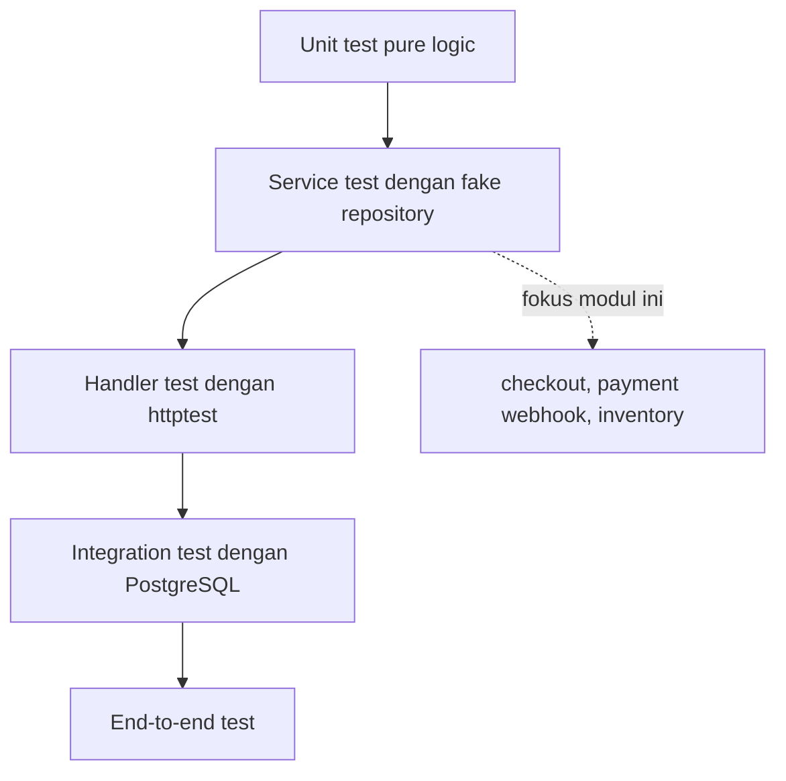
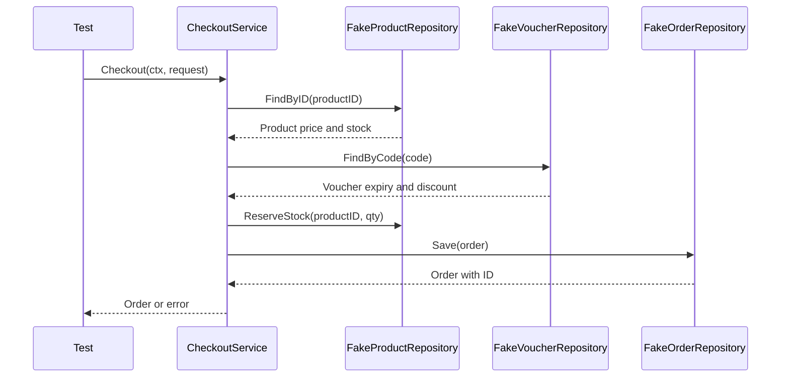
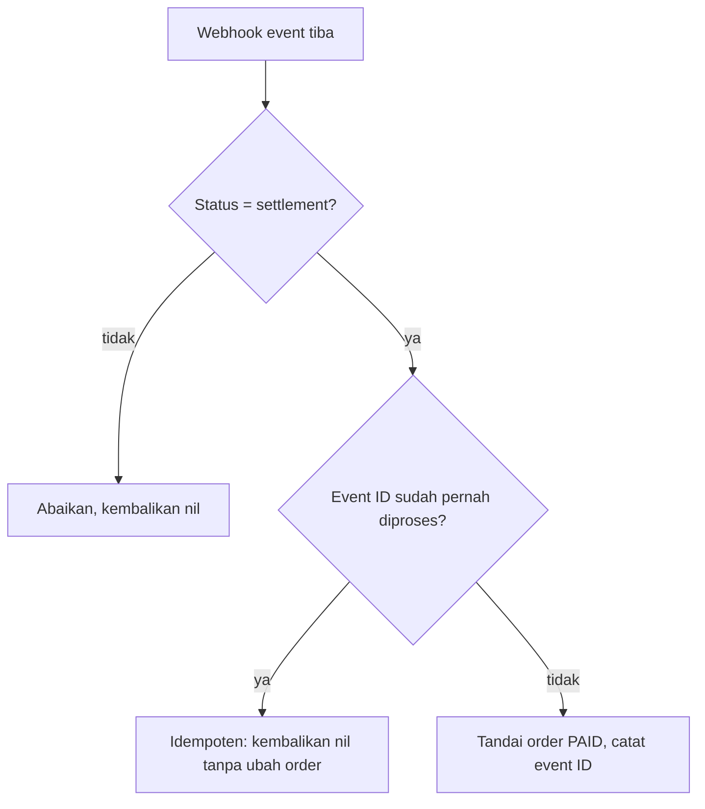

import { Section, Box, Steps, Step, Recap, CardGrid, Card, Chip, Hero, Compare, FileTree, Endpoint, Def } from "@components";

<Hero eyebrow="Roadmap 6 &middot; Testing" title="Testing Service Layer<br /><em>dengan Mock Repository</em>">
  <p>Di modul ini kita menguji keputusan bisnis checkout, payment webhook, dan inventory tanpa database, tanpa HTTP server, dan tanpa payment gateway.</p>
  <Fragment slot="meta">
    <Chip icon="code">Bahasa: <b>Go 1.26</b></Chip>
    <Chip icon="clock">~70 menit baca</Chip>
  </Fragment>
</Hero>

<Section num="01" id="intro" title="Kenapa Service Layer Perlu Ditest?">

<p class="lead">Handler memastikan request dan response benar, tetapi service memastikan bisnis tidak bocor.</p>

Di online shop skincare, bug paling mahal biasanya bukan typo JSON. Bug paling mahal adalah order bisa dibuat saat stok kurang, voucher expired tetap diterima, payment yang sama dihitung dua kali, atau stok berkurang ganda ketika dependency lambat. Semua keputusan seperti itu hidup di service layer.

Pada modul sebelumnya, kamu menguji HTTP handler dengan `httptest`. Di sini kita turun satu lapis. Kita panggil method service langsung, lalu dependency database diganti dengan implementasi fake yang memenuhi interface repository.

<Box variant="bridge" icon="🌉" label="Jembatan: dari Jest mock ke Go interface"><p>Di Jest kamu sering mengganti function dengan `jest.fn`, dan di PHPUnit kamu memakai `createMock` dari container. Di Go, pola yang idiomatik adalah membuat service bergantung pada interface kecil, lalu test menyediakan struct fake yang punya method sama, dan compiler yang memeriksa kecocokannya.</p></Box>

<Def term="service layer"><p>Lapisan yang menjalankan business logic, seperti validasi stok, hitung total, cek voucher, verifikasi status pembayaran, dan menahan stok, tanpa tahu detail HTTP maupun SQL.</p></Def>

<Def term="fake repository"><p>Implementasi repository untuk test yang menyimpan data di memory, biasanya `map`, sehingga test cepat dan deterministik.</p></Def>

Modul ini menyentuh tiga service inti proyek sekaligus: checkout, payment webhook, dan inventory. Ketiganya memakai pola yang sama, yaitu interface kecil plus fake repository, sehingga setelah satu pola kamu kuasai, dua sisanya hanya variasi domain.

</Section>

<Section num="02" id="posisi-service" title="Posisi Service Layer dalam Test Pyramid">

<p class="lead">Test service berada di tengah: lebih realistis dari unit pure function, lebih cepat dari integration test database.</p>

Package [`testing`](https://pkg.go.dev/testing) bawaan Go menjalankan fungsi `TestXxx` dari file berakhiran `_test.go`. Untuk service layer, kita tetap memakai package bawaan ini. Yang berubah hanya objek yang kita siapkan sebelum memanggil method service.



<p class="fig-cap"><b>Gambar 1.</b> Service test memberi sinyal cepat saat business rule rusak, sebelum kita menyentuh database atau HTTP. Di modul ini ia menjaga tiga service inti sekaligus.</p>

<CardGrid cols={3}>
  <Card><h4>Lebih cepat</h4><p>Tidak membuka koneksi PostgreSQL, tidak menjalankan migrasi, dan tidak butuh data seed besar.</p></Card>
  <Card><h4>Lebih fokus</h4><p>Gagal karena business rule, bukan karena DSN, transaksi, atau skema database yang belum siap.</p></Card>
  <Card><h4>Lebih aman di refactor</h4><p>Repository boleh pindah dari pgx ke query builder lain selama kontrak interface tetap sama.</p></Card>
</CardGrid>

<Endpoint method="POST" path="/v1/checkout" desc="Handler memanggil service checkout, tetapi test modul ini langsung menguji service tanpa HTTP layer" />

<Endpoint method="POST" path="/v1/webhooks/payment" desc="Handler memvalidasi signature lalu memanggil service webhook, yang business rule-nya kita uji langsung di sini" />

</Section>

<Section num="03" id="interface-fake-repository" title="Interface dan Fake Repository">

<p class="lead">Interface adalah seam, titik sambungan yang membuat dependency bisa diganti saat test.</p>

Di Go, interface biasanya didefinisikan di sisi pemakai, bukan di sisi implementasi. Service checkout butuh kemampuan mencari produk, menahan stok, mencari voucher, dan menyimpan order. Maka service mendefinisikan interface kecil sesuai kebutuhannya.

<Compare aLabel="JS / PHP" bLabel="Go" aTone="muted" bTone="violet">
  <Fragment slot="a"><ul><li>Mock sering dibuat dari library, container, monkey patch, atau object literal.</li><li>Kontrak kadang baru ketahuan saat runtime jika bentuk object tidak cocok.</li></ul></Fragment>
  <Fragment slot="b"><ul><li>Fake adalah struct biasa yang mengimplementasikan interface secara implisit.</li><li>Compiler memastikan fake punya method yang dibutuhkan service.</li></ul></Fragment>
</Compare>

<Box variant="tip" icon="💡" label="Idiom Go"><p>Accept interfaces, return structs. Service menerima interface dependency, tetapi constructor service mengembalikan concrete struct agar API internal tetap jelas.</p></Box>

<FileTree title="Struktur file untuk test service" tree={`
internal/
  checkout/
    service.go       # business logic checkout
    service_test.go  # fake repository dan test checkout
  payment/
    service.go       # verifikasi status dan idempotensi webhook
    service_test.go  # fake order dan event repository
  inventory/
    service.go       # reserve dan release stok
    service_test.go  # fake stock repository
  product/
    repository.go    # implementasi pgx asli di roadmap database
`} />

</Section>

<Section num="04" id="alur-checkout" title="Skenario Checkout yang Akan Diuji">

<p class="lead">Kita tidak mengetes semua detail checkout sekaligus, kita pilih tiga jalur yang paling mewakili risiko bisnis.</p>

Skenario happy path memastikan order berhasil dibuat, subtotal dihitung dari snapshot harga produk, voucher mengurangi total, dan stok berkurang. Failure path stok kurang memastikan order tidak dibuat dan stok tidak berubah. Edge case voucher expired memastikan validasi voucher terjadi sebelum stok direserve.



<p class="fig-cap"><b>Gambar 2.</b> Semua dependency di diagram adalah fake saat test, sehingga alur bisnis bisa dicek tanpa database.</p>

<Steps>
  <Step><b>Happy path</b><p>Produk tersedia, voucher masih berlaku, order tersimpan, dan stok produk turun sesuai quantity.</p></Step>
  <Step><b>Failure path</b><p>Stok kurang, service mengembalikan `ErrInsufficientStock`, order tidak tersimpan, dan stok tetap.</p></Step>
  <Step><b>Edge case</b><p>Voucher expired, service mengembalikan `ErrVoucherExpired`, stok belum direserve, dan order tidak dibuat.</p></Step>
</Steps>

</Section>

<Section num="05" id="kode-service" title="Service Checkout yang Testable">

<p class="lead">Service berikut sengaja kecil, tetapi sudah menunjukkan bentuk dependency injection yang akan dipakai di proyek nyata.</p>

Perhatikan bahwa `context.Context` menjadi parameter pertama pada method repository dan service. Ini memudahkan handler meneruskan cancelation dari HTTP request, dan nanti berguna saat repository asli memakai pgx. Harga memakai tipe kanonik `PriceRupiah int64`, yaitu rupiah satuan utuh, bukan cents, agar konsisten dengan modul katalog dan checkout di Roadmap 5.

```go title="internal/checkout/service.go"
package checkout

import (
	"context"
	"errors"
	"time"
)

type PriceRupiah int64

type ProductID string

type UserID string

var (
	ErrEmptyCheckout     = errors.New("checkout is empty")
	ErrInvalidQuantity   = errors.New("checkout item quantity must be positive")
	ErrProductNotFound   = errors.New("product not found")
	ErrInsufficientStock = errors.New("insufficient stock")
	ErrVoucherNotFound   = errors.New("voucher not found")
	ErrVoucherExpired    = errors.New("voucher expired")
)

type Product struct {
	ID    ProductID
	Name  string
	Price PriceRupiah
	Stock int
}

type Voucher struct {
	Code           string
	DiscountAmount PriceRupiah
	ExpiresAt      time.Time
}

type CheckoutItem struct {
	ProductID ProductID
	Quantity  int
}

type CheckoutRequest struct {
	UserID      UserID
	Items       []CheckoutItem
	VoucherCode string
	Now         time.Time
}

type OrderItem struct {
	ProductID ProductID
	Quantity  int
	UnitPrice PriceRupiah
	LineTotal PriceRupiah
}

type Order struct {
	ID       string
	UserID   UserID
	Items    []OrderItem
	Subtotal PriceRupiah
	Discount PriceRupiah
	Total    PriceRupiah
}

type ProductRepository interface {
	FindByID(ctx context.Context, id ProductID) (Product, error)
	ReserveStock(ctx context.Context, id ProductID, quantity int) error
}

type VoucherRepository interface {
	FindByCode(ctx context.Context, code string) (Voucher, error)
}

type OrderRepository interface {
	Save(ctx context.Context, order Order) (Order, error)
}

type Service struct {
	products ProductRepository
	vouchers VoucherRepository
	orders   OrderRepository
}

func NewService(products ProductRepository, vouchers VoucherRepository, orders OrderRepository) *Service {
	return &Service{
		products: products,
		vouchers: vouchers,
		orders:   orders,
	}
}

func (s *Service) Checkout(ctx context.Context, req CheckoutRequest) (Order, error) {
	if len(req.Items) == 0 {
		return Order{}, ErrEmptyCheckout
	}

	now := req.Now
	if now.IsZero() {
		now = time.Now()
	}

	order := Order{
		UserID: req.UserID,
		Items:  make([]OrderItem, 0, len(req.Items)),
	}

	for _, item := range req.Items {
		if item.Quantity <= 0 {
			return Order{}, ErrInvalidQuantity
		}

		product, err := s.products.FindByID(ctx, item.ProductID)
		if err != nil {
			return Order{}, err
		}

		if product.Stock < item.Quantity {
			return Order{}, ErrInsufficientStock
		}

		lineTotal := product.Price * PriceRupiah(item.Quantity)
		order.Items = append(order.Items, OrderItem{
			ProductID: product.ID,
			Quantity:  item.Quantity,
			UnitPrice: product.Price,
			LineTotal: lineTotal,
		})
		order.Subtotal += lineTotal
	}

	if req.VoucherCode != "" {
		voucher, err := s.vouchers.FindByCode(ctx, req.VoucherCode)
		if err != nil {
			return Order{}, err
		}

		if !voucher.ExpiresAt.After(now) {
			return Order{}, ErrVoucherExpired
		}

		order.Discount = voucher.DiscountAmount
		if order.Discount > order.Subtotal {
			order.Discount = order.Subtotal
		}
	}

	order.Total = order.Subtotal - order.Discount

	for _, item := range req.Items {
		if err := s.products.ReserveStock(ctx, item.ProductID, item.Quantity); err != nil {
			return Order{}, err
		}
	}

	return s.orders.Save(ctx, order)
}
```

<Box variant="warn" icon="⚠️" label="Urutan business rule penting"><p>Voucher divalidasi sebelum `ReserveStock`, sehingga voucher expired tidak akan mengurangi stok. Test edge case nanti menjaga urutan ini agar tidak rusak saat refactor.</p></Box>

</Section>

<Section num="06" id="kode-fake-test" title="Fake Repository dan Test Checkout">

<p class="lead">Fake repository berikut bukan library khusus, hanya struct Go biasa yang menyimpan state di memory.</p>

File test ini menguji tiga jalur checkout. Tidak ada koneksi DB, tidak ada migration, tidak ada HTTP server. Semua sinyal datang dari return value, error, dan state fake repository setelah service dipanggil. Perhatikan pengecekan error selalu memakai `errors.Is`, bukan perbandingan string, sehingga tetap benar walau error dibungkus dengan `fmt.Errorf("...: %w", err)` di repository asli nanti.

```go title="internal/checkout/service_test.go"
package checkout

import (
	"context"
	"errors"
	"testing"
	"time"
)

type reserveCall struct {
	ProductID ProductID
	Quantity  int
}

type FakeProductRepository struct {
	products     map[ProductID]Product
	reserveCalls []reserveCall
}

func NewFakeProductRepository(products []Product) *FakeProductRepository {
	items := make(map[ProductID]Product, len(products))
	for _, product := range products {
		items[product.ID] = product
	}

	return &FakeProductRepository{products: items}
}

func (r *FakeProductRepository) FindByID(ctx context.Context, id ProductID) (Product, error) {
	product, ok := r.products[id]
	if !ok {
		return Product{}, ErrProductNotFound
	}

	return product, nil
}

func (r *FakeProductRepository) ReserveStock(ctx context.Context, id ProductID, quantity int) error {
	product, ok := r.products[id]
	if !ok {
		return ErrProductNotFound
	}

	if product.Stock < quantity {
		return ErrInsufficientStock
	}

	product.Stock -= quantity
	r.products[id] = product
	r.reserveCalls = append(r.reserveCalls, reserveCall{ProductID: id, Quantity: quantity})
	return nil
}

type FakeVoucherRepository struct {
	vouchers map[string]Voucher
}

func NewFakeVoucherRepository(vouchers []Voucher) *FakeVoucherRepository {
	items := make(map[string]Voucher, len(vouchers))
	for _, voucher := range vouchers {
		items[voucher.Code] = voucher
	}

	return &FakeVoucherRepository{vouchers: items}
}

func (r *FakeVoucherRepository) FindByCode(ctx context.Context, code string) (Voucher, error) {
	voucher, ok := r.vouchers[code]
	if !ok {
		return Voucher{}, ErrVoucherNotFound
	}

	return voucher, nil
}

type FakeOrderRepository struct {
	saved []Order
}

func (r *FakeOrderRepository) Save(ctx context.Context, order Order) (Order, error) {
	if order.ID == "" {
		order.ID = "ord_test_001"
	}

	r.saved = append(r.saved, order)
	return order, nil
}

func TestService_Checkout_Success(t *testing.T) {
	t.Parallel()

	now := time.Date(2026, time.June, 6, 10, 0, 0, 0, time.UTC)
	productRepo := NewFakeProductRepository([]Product{
		{ID: "prod_toner", Name: "Wardah Hydrating Toner", Price: 125000, Stock: 10},
	})
	voucherRepo := NewFakeVoucherRepository([]Voucher{
		{Code: "SKINCARE25", DiscountAmount: 25000, ExpiresAt: now.Add(24 * time.Hour)},
	})
	orderRepo := &FakeOrderRepository{}
	svc := NewService(productRepo, voucherRepo, orderRepo)

	got, err := svc.Checkout(context.Background(), CheckoutRequest{
		UserID:      "user_1",
		VoucherCode: "SKINCARE25",
		Now:         now,
		Items: []CheckoutItem{
			{ProductID: "prod_toner", Quantity: 2},
		},
	})
	if err != nil {
		t.Fatalf("Checkout() error = %v", err)
	}

	if got.ID != "ord_test_001" {
		t.Fatalf("Checkout() order ID = %q, want %q", got.ID, "ord_test_001")
	}
	if got.Subtotal != 250000 {
		t.Fatalf("Checkout() subtotal = %d, want %d", got.Subtotal, PriceRupiah(250000))
	}
	if got.Discount != 25000 {
		t.Fatalf("Checkout() discount = %d, want %d", got.Discount, PriceRupiah(25000))
	}
	if got.Total != 225000 {
		t.Fatalf("Checkout() total = %d, want %d", got.Total, PriceRupiah(225000))
	}
	if len(orderRepo.saved) != 1 {
		t.Fatalf("saved orders = %d, want %d", len(orderRepo.saved), 1)
	}
	if productRepo.products["prod_toner"].Stock != 8 {
		t.Fatalf("remaining stock = %d, want %d", productRepo.products["prod_toner"].Stock, 8)
	}
	if len(productRepo.reserveCalls) != 1 {
		t.Fatalf("reserve calls = %d, want %d", len(productRepo.reserveCalls), 1)
	}
}

func TestService_Checkout_FailsWhenStockIsInsufficient(t *testing.T) {
	t.Parallel()

	now := time.Date(2026, time.June, 6, 10, 0, 0, 0, time.UTC)
	productRepo := NewFakeProductRepository([]Product{
		{ID: "prod_serum", Name: "Brightening Serum", Price: 99000, Stock: 1},
	})
	voucherRepo := NewFakeVoucherRepository(nil)
	orderRepo := &FakeOrderRepository{}
	svc := NewService(productRepo, voucherRepo, orderRepo)

	_, err := svc.Checkout(context.Background(), CheckoutRequest{
		UserID: "user_1",
		Now:    now,
		Items: []CheckoutItem{
			{ProductID: "prod_serum", Quantity: 2},
		},
	})
	if !errors.Is(err, ErrInsufficientStock) {
		t.Fatalf("Checkout() error = %v, want %v", err, ErrInsufficientStock)
	}
	if len(orderRepo.saved) != 0 {
		t.Fatalf("saved orders = %d, want %d", len(orderRepo.saved), 0)
	}
	if productRepo.products["prod_serum"].Stock != 1 {
		t.Fatalf("remaining stock = %d, want %d", productRepo.products["prod_serum"].Stock, 1)
	}
	if len(productRepo.reserveCalls) != 0 {
		t.Fatalf("reserve calls = %d, want %d", len(productRepo.reserveCalls), 0)
	}
}

func TestService_Checkout_FailsWhenVoucherExpired(t *testing.T) {
	t.Parallel()

	now := time.Date(2026, time.June, 6, 10, 0, 0, 0, time.UTC)
	productRepo := NewFakeProductRepository([]Product{
		{ID: "prod_moisturizer", Name: "Barrier Moisturizer", Price: 150000, Stock: 5},
	})
	voucherRepo := NewFakeVoucherRepository([]Voucher{
		{Code: "EXPIRED10", DiscountAmount: 10000, ExpiresAt: now.Add(-time.Hour)},
	})
	orderRepo := &FakeOrderRepository{}
	svc := NewService(productRepo, voucherRepo, orderRepo)

	_, err := svc.Checkout(context.Background(), CheckoutRequest{
		UserID:      "user_1",
		VoucherCode: "EXPIRED10",
		Now:         now,
		Items: []CheckoutItem{
			{ProductID: "prod_moisturizer", Quantity: 1},
		},
	})
	if !errors.Is(err, ErrVoucherExpired) {
		t.Fatalf("Checkout() error = %v, want %v", err, ErrVoucherExpired)
	}
	if len(orderRepo.saved) != 0 {
		t.Fatalf("saved orders = %d, want %d", len(orderRepo.saved), 0)
	}
	if productRepo.products["prod_moisturizer"].Stock != 5 {
		t.Fatalf("remaining stock = %d, want %d", productRepo.products["prod_moisturizer"].Stock, 5)
	}
	if len(productRepo.reserveCalls) != 0 {
		t.Fatalf("reserve calls = %d, want %d", len(productRepo.reserveCalls), 0)
	}
}
```

<Box variant="note" icon="🧭" label="Kenapa tidak pakai database?"><p>Test ini bertanya apakah service mengambil keputusan yang benar. Pertanyaan apakah SQL dan transaksi benar akan dijawab di integration test pada chapter berikutnya.</p></Box>

</Section>

<Section num="07" id="payment-webhook" title="Menguji Payment Webhook dan Idempotensi">

<p class="lead">Payment gateway boleh mengirim notifikasi yang sama berkali-kali, jadi service webhook harus aman diproses ulang.</p>

Gateway seperti Midtrans atau Xendit mengirim webhook untuk memberi tahu status pembayaran. Jaringan tidak sempurna, jadi notifikasi yang sama bisa datang dua kali atau lebih. Tugas service webhook adalah memverifikasi status, lalu menandai order sebagai dibayar tepat satu kali, walaupun event yang sama tiba berulang. Sifat ini disebut idempoten.

<Def term="idempoten"><p>Operasi yang menghasilkan keadaan akhir sama walau dijalankan satu kali atau berkali-kali. Memproses event pembayaran kedua tidak boleh menambah catatan atau mengubah status order yang sudah final.</p></Def>

<Box variant="bridge" icon="🌉" label="Jembatan: webhook di Express atau Laravel"><p>Di Node atau Laravel, kamu mungkin mengandalkan unique index database untuk menolak event ganda dan baru ketahuan saat insert gagal. Di service test kita angkat keputusan itu ke level business logic, dengan fake event repository yang ingat event apa yang sudah diproses, sehingga jalur idempotensi bisa diuji tanpa database.</p></Box>



<p class="fig-cap"><b>Gambar 3.</b> Dua percabangan inti webhook: verifikasi status lalu cek duplikasi. Test wajib menutup kedua cabang ya dan tidak.</p>

Service berikut bergantung pada dua interface kecil. `OrderRepository` mengubah status order, dan `ProcessedEventRepository` mengingat event yang sudah diproses.

```go title="internal/payment/service.go"
package payment

import (
	"context"
	"errors"
)

var (
	ErrOrderNotFound  = errors.New("order not found")
	ErrAmountMismatch = errors.New("paid amount does not match order total")
	ErrUnknownGateway = errors.New("unknown gateway status")
)

type WebhookEvent struct {
	EventID     string
	OrderID     string
	Status      string
	GrossAmount int64
}

type OrderRepository interface {
	FindTotal(ctx context.Context, orderID string) (int64, error)
	MarkPaid(ctx context.Context, orderID string) error
}

type ProcessedEventRepository interface {
	Exists(ctx context.Context, eventID string) (bool, error)
	Record(ctx context.Context, eventID string) error
}

type Service struct {
	orders OrderRepository
	events ProcessedEventRepository
}

func NewService(orders OrderRepository, events ProcessedEventRepository) *Service {
	return &Service{orders: orders, events: events}
}

func (s *Service) HandleWebhook(ctx context.Context, ev WebhookEvent) error {
	switch ev.Status {
	case "settlement", "capture":
		// status sukses, lanjut proses
	case "pending", "deny", "expire", "cancel":
		return nil
	default:
		return ErrUnknownGateway
	}

	processed, err := s.events.Exists(ctx, ev.EventID)
	if err != nil {
		return err
	}
	if processed {
		return nil
	}

	total, err := s.orders.FindTotal(ctx, ev.OrderID)
	if err != nil {
		return err
	}
	if ev.GrossAmount != total {
		return ErrAmountMismatch
	}

	if err := s.orders.MarkPaid(ctx, ev.OrderID); err != nil {
		return err
	}

	return s.events.Record(ctx, ev.EventID)
}
```

Test menutup empat jalur: sukses sekali bayar, idempotensi saat event berulang, edge case amount tidak cocok, dan status non-final yang diabaikan. Fake order repository mencatat berapa kali `MarkPaid` dipanggil, yang adalah bukti utama idempotensi.

```go title="internal/payment/service_test.go"
package payment

import (
	"context"
	"errors"
	"testing"
)

type FakeOrderRepository struct {
	total     int64
	exists    bool
	markPaidN int
}

func (r *FakeOrderRepository) FindTotal(ctx context.Context, orderID string) (int64, error) {
	if !r.exists {
		return 0, ErrOrderNotFound
	}
	return r.total, nil
}

func (r *FakeOrderRepository) MarkPaid(ctx context.Context, orderID string) error {
	r.markPaidN++
	return nil
}

type FakeProcessedEventRepository struct {
	seen map[string]bool
}

func newFakeEvents() *FakeProcessedEventRepository {
	return &FakeProcessedEventRepository{seen: make(map[string]bool)}
}

func (r *FakeProcessedEventRepository) Exists(ctx context.Context, eventID string) (bool, error) {
	return r.seen[eventID], nil
}

func (r *FakeProcessedEventRepository) Record(ctx context.Context, eventID string) error {
	r.seen[eventID] = true
	return nil
}

func TestService_HandleWebhook_MarksOrderPaidOnce(t *testing.T) {
	t.Parallel()

	orders := &FakeOrderRepository{total: 225000, exists: true}
	events := newFakeEvents()
	svc := NewService(orders, events)

	ev := WebhookEvent{EventID: "evt_1", OrderID: "ord_1", Status: "settlement", GrossAmount: 225000}

	if err := svc.HandleWebhook(context.Background(), ev); err != nil {
		t.Fatalf("first HandleWebhook() error = %v", err)
	}
	if err := svc.HandleWebhook(context.Background(), ev); err != nil {
		t.Fatalf("second HandleWebhook() error = %v", err)
	}

	if orders.markPaidN != 1 {
		t.Fatalf("MarkPaid called %d times, want 1 (must be idempotent)", orders.markPaidN)
	}
}

func TestService_HandleWebhook_RejectsAmountMismatch(t *testing.T) {
	t.Parallel()

	orders := &FakeOrderRepository{total: 225000, exists: true}
	events := newFakeEvents()
	svc := NewService(orders, events)

	ev := WebhookEvent{EventID: "evt_2", OrderID: "ord_1", Status: "settlement", GrossAmount: 100000}

	err := svc.HandleWebhook(context.Background(), ev)
	if !errors.Is(err, ErrAmountMismatch) {
		t.Fatalf("HandleWebhook() error = %v, want %v", err, ErrAmountMismatch)
	}
	if orders.markPaidN != 0 {
		t.Fatalf("MarkPaid called %d times, want 0 on mismatch", orders.markPaidN)
	}
}

func TestService_HandleWebhook_IgnoresPendingStatus(t *testing.T) {
	t.Parallel()

	orders := &FakeOrderRepository{total: 225000, exists: true}
	events := newFakeEvents()
	svc := NewService(orders, events)

	ev := WebhookEvent{EventID: "evt_3", OrderID: "ord_1", Status: "pending", GrossAmount: 225000}

	if err := svc.HandleWebhook(context.Background(), ev); err != nil {
		t.Fatalf("HandleWebhook() error = %v, want nil for pending", err)
	}
	if orders.markPaidN != 0 {
		t.Fatalf("MarkPaid called %d times, want 0 for non-final status", orders.markPaidN)
	}
}
```

<Box variant="warn" icon="⚠️" label="Verifikasi nominal itu bukan opsional"><p>Tanpa cek `GrossAmount` terhadap total order, payload yang dirusak bisa menandai order mahal sebagai lunas dengan nominal kecil. Test `RejectsAmountMismatch` menjaga rule ini tetap ada.</p></Box>

</Section>

<Section num="08" id="inventory" title="Menguji Inventory: Reserve dan Release Stok">

<p class="lead">Inventory adalah tempat stok berpindah antara tersedia dan tertahan, jadi salah hitung di sini langsung jadi oversell.</p>

Saat checkout, stok produk ditahan (reserve). Bila pembayaran gagal atau order dibatalkan, stok yang tertahan harus dikembalikan (release). Dua operasi ini cermin satu sama lain, dan di test kita pastikan keduanya menjaga invarian: stok tersedia tidak pernah negatif, dan release tidak pernah melebihi yang pernah direserve.

```go title="internal/inventory/service.go"
package inventory

import (
	"context"
	"errors"
)

var (
	ErrSKUNotFound       = errors.New("sku not found")
	ErrInsufficientStock = errors.New("insufficient available stock")
	ErrInvalidQuantity   = errors.New("quantity must be positive")
	ErrReleaseTooLarge   = errors.New("cannot release more than reserved")
)

type Stock struct {
	SKU       string
	Available int
	Reserved  int
}

type StockRepository interface {
	Get(ctx context.Context, sku string) (Stock, error)
	Save(ctx context.Context, stock Stock) error
}

type Service struct {
	stocks StockRepository
}

func NewService(stocks StockRepository) *Service {
	return &Service{stocks: stocks}
}

func (s *Service) Reserve(ctx context.Context, sku string, qty int) error {
	if qty <= 0 {
		return ErrInvalidQuantity
	}

	stock, err := s.stocks.Get(ctx, sku)
	if err != nil {
		return err
	}
	if stock.Available < qty {
		return ErrInsufficientStock
	}

	stock.Available -= qty
	stock.Reserved += qty
	return s.stocks.Save(ctx, stock)
}

func (s *Service) Release(ctx context.Context, sku string, qty int) error {
	if qty <= 0 {
		return ErrInvalidQuantity
	}

	stock, err := s.stocks.Get(ctx, sku)
	if err != nil {
		return err
	}
	if stock.Reserved < qty {
		return ErrReleaseTooLarge
	}

	stock.Reserved -= qty
	stock.Available += qty
	return s.stocks.Save(ctx, stock)
}
```

Test inventory memakai fake stock repository berbasis `map`, lalu mengecek nilai akhir `Available` dan `Reserved` setelah operasi. Helper kecil membaca state agar assertion ringkas.

```go title="internal/inventory/service_test.go"
package inventory

import (
	"context"
	"errors"
	"testing"
)

type FakeStockRepository struct {
	items map[string]Stock
}

func newFakeStock(seed ...Stock) *FakeStockRepository {
	items := make(map[string]Stock, len(seed))
	for _, s := range seed {
		items[s.SKU] = s
	}
	return &FakeStockRepository{items: items}
}

func (r *FakeStockRepository) Get(ctx context.Context, sku string) (Stock, error) {
	stock, ok := r.items[sku]
	if !ok {
		return Stock{}, ErrSKUNotFound
	}
	return stock, nil
}

func (r *FakeStockRepository) Save(ctx context.Context, stock Stock) error {
	r.items[stock.SKU] = stock
	return nil
}

func TestService_Reserve_MovesAvailableToReserved(t *testing.T) {
	t.Parallel()

	repo := newFakeStock(Stock{SKU: "sku_toner", Available: 10, Reserved: 0})
	svc := NewService(repo)

	if err := svc.Reserve(context.Background(), "sku_toner", 3); err != nil {
		t.Fatalf("Reserve() error = %v", err)
	}

	got := repo.items["sku_toner"]
	if got.Available != 7 || got.Reserved != 3 {
		t.Fatalf("after reserve = {available:%d reserved:%d}, want {7 3}", got.Available, got.Reserved)
	}
}

func TestService_Reserve_FailsWhenNotEnoughAvailable(t *testing.T) {
	t.Parallel()

	repo := newFakeStock(Stock{SKU: "sku_serum", Available: 2, Reserved: 0})
	svc := NewService(repo)

	err := svc.Reserve(context.Background(), "sku_serum", 5)
	if !errors.Is(err, ErrInsufficientStock) {
		t.Fatalf("Reserve() error = %v, want %v", err, ErrInsufficientStock)
	}

	got := repo.items["sku_serum"]
	if got.Available != 2 || got.Reserved != 0 {
		t.Fatalf("stock must be unchanged on failure, got {%d %d}", got.Available, got.Reserved)
	}
}

func TestService_Release_ReturnsReservedToAvailable(t *testing.T) {
	t.Parallel()

	repo := newFakeStock(Stock{SKU: "sku_mask", Available: 4, Reserved: 6})
	svc := NewService(repo)

	if err := svc.Release(context.Background(), "sku_mask", 6); err != nil {
		t.Fatalf("Release() error = %v", err)
	}

	got := repo.items["sku_mask"]
	if got.Available != 10 || got.Reserved != 0 {
		t.Fatalf("after release = {available:%d reserved:%d}, want {10 0}", got.Available, got.Reserved)
	}
}

func TestService_Release_FailsWhenReleasingMoreThanReserved(t *testing.T) {
	t.Parallel()

	repo := newFakeStock(Stock{SKU: "sku_mask", Available: 4, Reserved: 1})
	svc := NewService(repo)

	err := svc.Release(context.Background(), "sku_mask", 3)
	if !errors.Is(err, ErrReleaseTooLarge) {
		t.Fatalf("Release() error = %v, want %v", err, ErrReleaseTooLarge)
	}
}
```

<Box variant="tip" icon="💡" label="Reserve lalu Release adalah round trip"><p>Tes yang kuat sering memanggil Reserve kemudian Release dengan jumlah sama dan memastikan stok kembali ke nilai awal. Properti pulang pergi ini menangkap banyak bug aritmetika sekaligus.</p></Box>

</Section>

<Section num="09" id="manual-vs-testify" title="Mock Manual vs testify/mock">

<p class="lead">Untuk service kecil, mock manual sering lebih mudah dibaca daripada mock framework.</p>

Library [`github.com/stretchr/testify/mock`](https://pkg.go.dev/github.com/stretchr/testify/mock) (seri v1, jalur impor `github.com/stretchr/testify`) populer untuk membuat mock berbasis expectation. Ia berguna saat kamu perlu memverifikasi call tertentu, tetapi untuk domain logic seperti checkout, payment, dan inventory, fake repository manual sering lebih natural karena bisa menyimpan state.

<Compare aLabel="Mock manual" bLabel="testify/mock" aTone="teal" bTone="blue">
  <Fragment slot="a"><ul><li>Lebih eksplisit, cocok untuk fake repository berbasis `map`.</li><li>Bagus untuk menguji efek bisnis seperti stok berkurang dan order tersimpan.</li><li>Tidak menambah dependency test.</li></ul></Fragment>
  <Fragment slot="b"><ul><li>Cepat untuk expectation sederhana, misalnya method dipanggil dengan argumen tertentu.</li><li>Bisa membuat test terlalu fokus ke urutan call jika dipakai berlebihan.</li><li>Menambah dependency eksternal yang harus dipahami tim.</li></ul></Fragment>
</Compare>

```go title="internal/checkout/product_mock_test.go"
package checkout

import (
	"context"

	"github.com/stretchr/testify/mock"
)

type MockProductRepository struct {
	mock.Mock
}

func (m *MockProductRepository) FindByID(ctx context.Context, id ProductID) (Product, error) {
	args := m.Called(ctx, id)
	product, _ := args.Get(0).(Product)
	return product, args.Error(1)
}

func (m *MockProductRepository) ReserveStock(ctx context.Context, id ProductID, quantity int) error {
	args := m.Called(ctx, id, quantity)
	return args.Error(0)
}
```

<Box variant="tip" icon="💡" label="Rekomendasi praktis"><p>Mulai dari mock manual. Pakai `testify/mock` ketika jumlah interface besar, expectation kompleks, atau tim sudah sepakat dengan gaya tersebut.</p></Box>

</Section>

<Section num="10" id="hands-on" title="Hands-on Ringan">

<p class="lead">Sekarang jalankan test, lalu sengaja rusak service untuk melihat apakah test benar-benar menjaga business rule.</p>

<Steps>
  <Step><b>Buat file service</b><p>Simpan kode `service.go` dan `service_test.go` untuk paket `checkout`, `payment`, dan `inventory` sesuai struktur modul.</p></Step>
  <Step><b>Jalankan semua test</b><p>Gunakan `go test ./...` dari root project agar semua package ikut diperiksa.</p></Step>
  <Step><b>Jalankan satu paket spesifik</b><p>Gunakan `go test ./internal/payment -run TestService_HandleWebhook -v` untuk fokus ke jalur webhook.</p></Step>
  <Step><b>Uji idempotensi</b><p>Hapus pengecekan `if processed` di webhook, lalu jalankan test. `MarkPaid` akan terpanggil dua kali dan test idempotensi gagal.</p></Step>
  <Step><b>Uji urutan voucher</b><p>Pindahkan `ReserveStock` sebelum validasi voucher, lalu jalankan test expired voucher. Test seharusnya gagal karena stok berubah.</p></Step>
</Steps>

```bash title="Terminal"
go test ./...
go test ./internal/checkout -run TestService_Checkout_Success -v
go test ./internal/payment -run TestService_HandleWebhook_MarksOrderPaidOnce -v
go test ./internal/inventory -cover
```

<Box variant="analogy" icon="🧪" label="Analogi skincare shop"><p>Fake repository seperti display sample di toko. Kamu bisa menguji proses rekomendasi, pembayaran kasir, dan tahan stok tanpa membuka gudang asli.</p></Box>

</Section>

<Section num="11" id="jebakan-umum" title="Jebakan Umum dari JS dan PHP">

<p class="lead">Pendatang dari JS dan PHP biasanya jatuh bukan karena sintaks test, tetapi karena desain dependency.</p>

<CardGrid cols={2}>
  <Card><h4>Interface terlalu besar</h4><p>Jangan membuat `Repository` raksasa untuk semua domain. Service checkout hanya perlu method yang dipakai checkout.</p></Card>
  <Card><h4>Fake terlalu pintar</h4><p>Fake sebaiknya cukup untuk test. Kalau fake mulai punya query engine sendiri, kamu sedang menulis database kecil di test.</p></Card>
  <Card><h4>Test terlalu tahu implementasi</h4><p>Cek output bisnis dan state penting, bukan setiap private step service.</p></Card>
  <Card><h4>Waktu tidak dikontrol</h4><p>Voucher expired harus memakai waktu deterministik dari request atau clock dependency, bukan selalu `time.Now` langsung di test.</p></Card>
  <Card><h4>Idempotensi dianggap urusan DB</h4><p>Jangan menunda cek event ganda ke unique index. Angkat ke business logic agar bisa diuji tanpa database.</p></Card>
  <Card><h4>Membandingkan error pakai string</h4><p>Pakai `errors.Is`, bukan cocokkan pesan, agar test tetap benar saat error dibungkus `%w`.</p></Card>
</CardGrid>

<Box variant="warn" icon="⚠️" label="Jangan mock yang tidak perlu"><p>Kalau fungsi murni bisa dites langsung, jangan dibuat interface hanya demi mock. Interface dipakai saat ada boundary nyata seperti database, network, file system, atau clock.</p></Box>

</Section>

<Section num="12" id="ringkasan" title="Ringkasan & Poin Penting">

<p class="lead">Service test memastikan aturan bisnis checkout, payment, dan inventory tetap benar meskipun implementasi repository berubah.</p>

<Recap title="Yang Wajib Menempel">
  <ul><li>Service layer adalah tempat terbaik untuk menguji business rule seperti stok cukup, voucher valid, nominal pembayaran cocok, dan total order benar.</li><li>Interface kecil membuat dependency mudah diganti dengan fake repository saat test.</li><li>Fake repository berbasis `map` cocok untuk test domain karena bisa menyimpan state dan memverifikasi efek bisnis.</li><li>Checkout: happy path order berhasil, failure path stok kurang, edge case voucher expired tidak mengurangi stok.</li><li>Payment webhook: verifikasi status, cocokkan nominal, dan jaga idempotensi agar `MarkPaid` hanya sekali walau event berulang.</li><li>Inventory: reserve memindah available ke reserved, release mengembalikannya, dan keduanya menjaga invarian stok tidak negatif.</li><li>Selalu cek error dengan `errors.Is`; mock manual cukup untuk modul ini, `testify/mock` opsional.</li></ul>
</Recap>

Di proyek online shop skincare, pola ini dipakai untuk menguji service cart, checkout, inventory, payment webhook, voucher, dan order lifecycle. Chapter berikutnya naik ke integration test, yaitu memastikan repository pgx dan PostgreSQL benar-benar bekerja dengan skema database nyata.

</Section>
