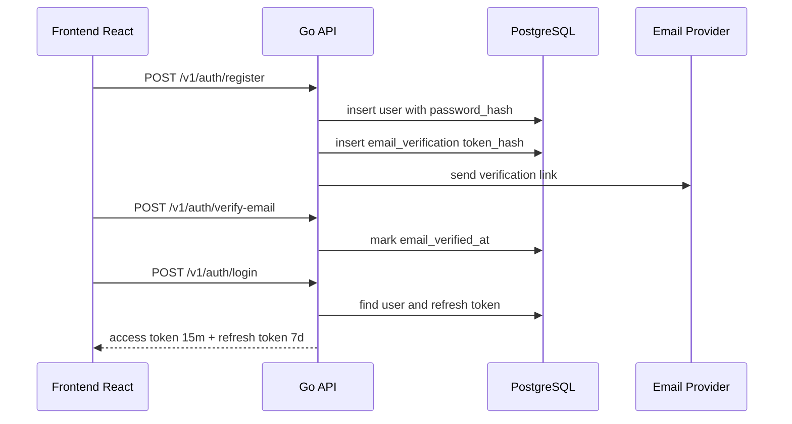
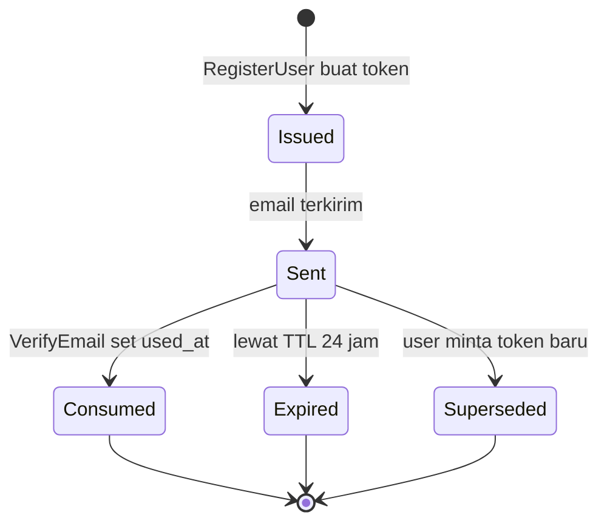
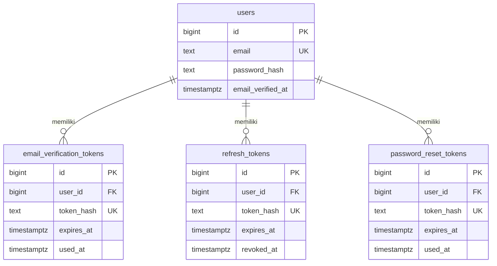
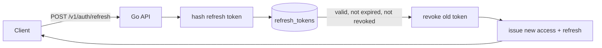
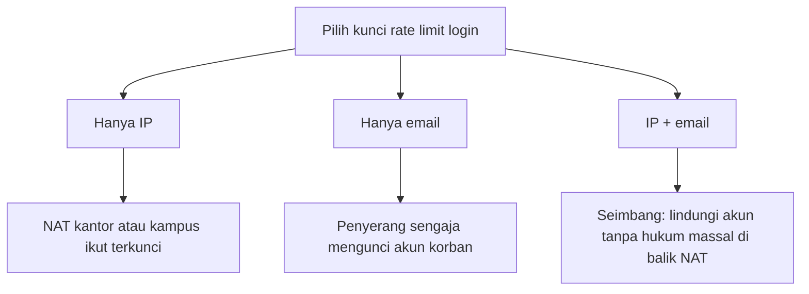
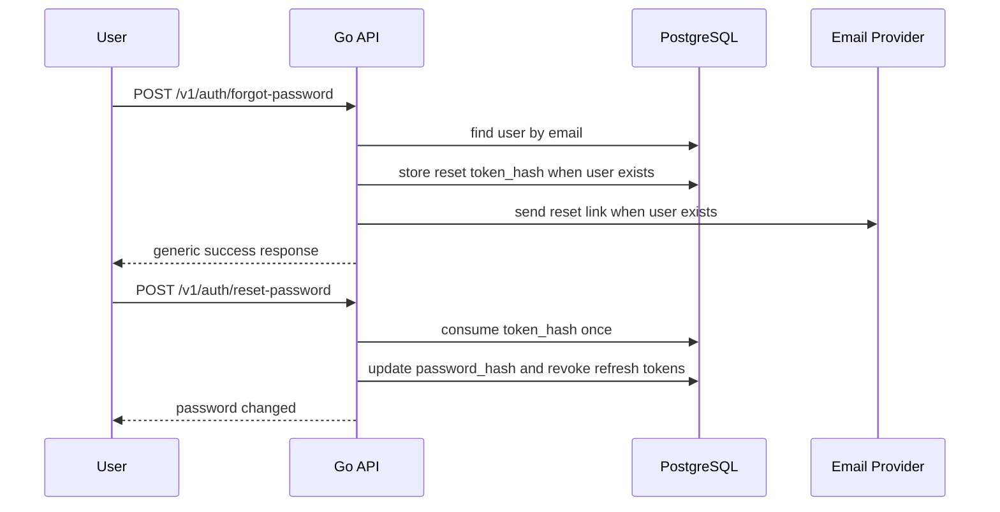
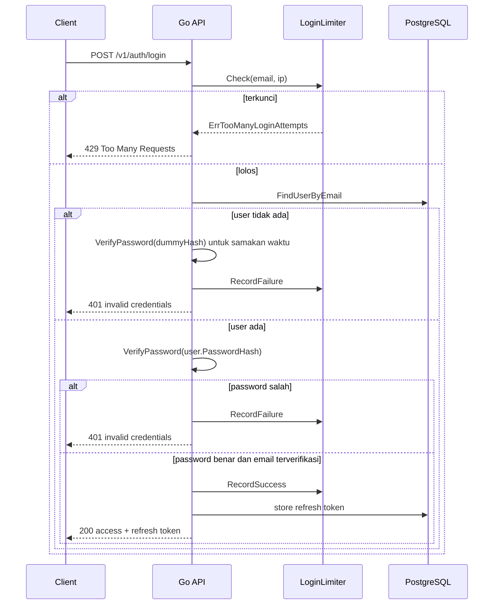
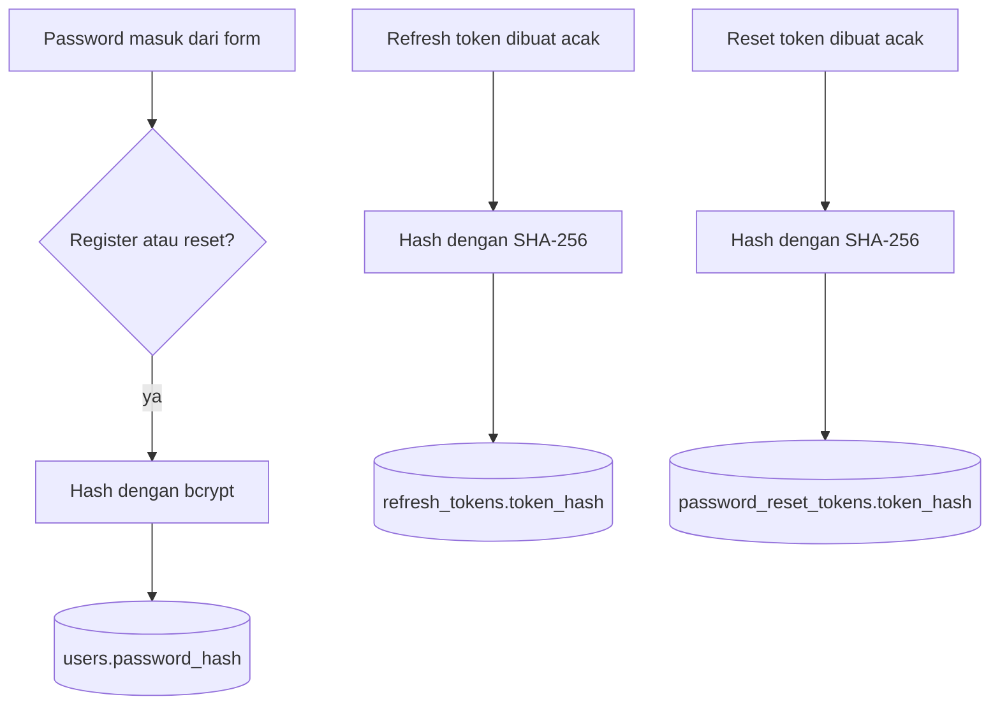

import { Section, Box, Steps, Step, Recap, CardGrid, Card, Chip, Hero, Compare, FileTree, Endpoint, Def } from "@components";

<Hero eyebrow="Roadmap 7 &middot; Security" title="Password dan <em>Auth Security</em><br />untuk Backend Skincare">
  <p>Login yang aman bukan hanya cocokkan email dan password, tetapi rangkaian proteksi dari hash sampai recovery akun.</p>
  <Fragment slot="meta">
    <Chip icon="code">Bahasa: <b>Go 1.26</b></Chip>
    <Chip icon="clock">~70 menit baca</Chip>
  </Fragment>
</Hero>

<Section num="01" id="intro" title="Kenapa auth security tidak boleh seadanya?">

<p class="lead">Di online shop skincare, auth melindungi data pelanggan, alamat pengiriman, riwayat order, dan akses ke proses pembayaran.</p>

Di React, login sering terasa seperti urusan form dan `localStorage`. Di Laravel, kamu mungkin terbiasa dengan `Hash::make()`, `bcrypt()`, middleware auth, dan password reset bawaan. Di Go, semua itu biasanya lebih eksplisit: kamu memilih fungsi hash, menyimpan token, mengatur TTL, dan memetakan error sendiri.

<Box variant="bridge" icon="🌉" label="Jembatan: dari Laravel Auth ke Go"><p>`bcrypt_password()` atau `Hash::make()` di PHP mirip secara konsep dengan `bcrypt.GenerateFromPassword` di Go, tetapi Go tidak menyembunyikan keputusan cost, error, dan storage token di balik framework besar.</p></Box>

<Def term="authentication"><p>Proses membuktikan identitas user, misalnya email dan password benar, lalu server memberi token sesi.</p></Def>

<Def term="authorization"><p>Proses memutuskan user yang sudah login boleh melakukan aksi tertentu, misalnya customer boleh checkout dan admin boleh mengubah status order.</p></Def>

<CardGrid cols={3}>
  <Card><h4>Password hash</h4><p>Password tidak pernah disimpan sebagai teks asli, karena database bisa bocor.</p></Card>
  <Card><h4>Token pendek</h4><p>Access token pendek mengurangi dampak bila token tercuri.</p></Card>
  <Card><h4>Recovery aman</h4><p>Reset password dan verifikasi email harus memakai token sekali pakai yang disimpan sebagai hash.</p></Card>
</CardGrid>



<p class="fig-cap"><b>Gambar 1.</b> Auth security adalah rangkaian proses, bukan satu fungsi login.</p>

<Box variant="note" icon="📌" label="Referensi resmi yang dipakai"><p>Modul ini merujuk ke <a href="https://pkg.go.dev/golang.org/x/crypto/bcrypt">dokumentasi bcrypt Go</a>, <a href="https://go.dev/doc/go1.26">catatan Go 1.26</a>, <a href="https://pkg.go.dev/github.com/go-chi/chi/middleware">middleware chi</a>, dan cheat sheet OWASP untuk <a href="https://cheatsheetseries.owasp.org/cheatsheets/Password_Storage_Cheat_Sheet.html">password storage</a> serta <a href="https://cheatsheetseries.owasp.org/cheatsheets/Forgot_Password_Cheat_Sheet.html">forgot password</a>.</p></Box>

</Section>

<Section num="02" id="bcrypt" title="Password Hashing dengan bcrypt">

<p class="lead">Hash password harus lambat secara sengaja, supaya database bocor tidak langsung berubah menjadi daftar password user.</p>

MD5 dan SHA adalah hash umum yang cepat. Cepat bagus untuk checksum file, tetapi buruk untuk password, karena penyerang bisa mencoba miliaran tebakan dengan GPU atau mesin khusus. `bcrypt` berbeda karena punya <em class="term">adaptive cost factor</em>, artinya biaya komputasi bisa dinaikkan seiring hardware makin cepat.

<Compare aLabel="MD5 / SHA untuk password" bLabel="bcrypt untuk password" aTone="red" bTone="violet">
  <Fragment slot="a"><ul><li>Didisain cepat, sehingga brute force jadi murah.</li><li>Tidak punya cost factor bawaan untuk memperlambat verifikasi.</li><li>Sering terlihat sederhana, tetapi tidak layak untuk password production.</li></ul></Fragment>
  <Fragment slot="b"><ul><li>Didisain untuk password hashing, bukan checksum umum.</li><li>Punya cost factor yang bisa dinaikkan ketika server makin kuat.</li><li>Hash sudah memuat salt dan parameter cost di string hasilnya.</li></ul></Fragment>
</Compare>

<Box variant="warn" icon="⚠️" label="Jangan hash password dengan SHA-256 biasa"><p>SHA-256 boleh dipakai untuk hash token acak berentropi tinggi, tetapi bukan untuk password manusia yang sering pendek dan mudah ditebak.</p></Box>

Kode berikut sengaja memisahkan hashing dan verifikasi. Ini membuat service lebih mudah dites, dan nanti bisa diganti ke algoritma lain tanpa membongkar handler.

```go title="internal/auth/password.go"
package auth

import (
	"errors"
	"fmt"

	"golang.org/x/crypto/bcrypt"
)

// bcrypt.DefaultCost = 10, MinCost = 4, MaxCost = 31.
// 12 dipilih sengaja di atas default: lebih lambat (lebih tahan brute force),
// masih nyaman untuk waktu login. Ini keputusan, bukan magic number.
const BcryptCost = 12

var ErrPasswordTooLong = errors.New("password terlalu panjang untuk bcrypt")

type PasswordHasher struct{}

func (PasswordHasher) HashPassword(plain string) (string, error) {
	passwordBytes := []byte(plain)
	// Cek manual ini opsional: GenerateFromPassword sendiri sudah menolak
	// input > 72 byte dengan bcrypt.ErrPasswordTooLong. Kita cek lebih dulu
	// hanya supaya pesan errornya berbahasa domain kita sendiri.
	if len(passwordBytes) > 72 {
		return "", ErrPasswordTooLong
	}

	hash, err := bcrypt.GenerateFromPassword(passwordBytes, BcryptCost)
	if err != nil {
		return "", fmt.Errorf("hash password: %w", err)
	}

	return string(hash), nil
}

func (PasswordHasher) VerifyPassword(hash string, plain string) bool {
	err := bcrypt.CompareHashAndPassword([]byte(hash), []byte(plain))
	return err == nil
}
```

<Box variant="tip" icon="💡" label="Angka cost adalah keputusan, bukan magic number"><p>`bcrypt.DefaultCost` bernilai 10, dengan `MinCost` 4 dan `MaxCost` 31. Kita pilih 12 di atas default agar lebih tahan brute force. Cost terlalu kecil melemahkan hash, sedangkan terlalu besar membuat login lambat dan membuka peluang denial of service lewat banyak request login.</p></Box>

<Box variant="note" icon="📌" label="bcrypt sudah punya error panjang bawaan"><p>Sejak versi terbaru, `bcrypt.GenerateFromPassword` mengembalikan `bcrypt.ErrPasswordTooLong` sendiri untuk input lebih dari 72 byte, jadi cek manual `len > 72` bersifat opsional. Kita tetap memakainya hanya untuk memberi pesan error berbahasa domain.</p></Box>

<Compare aLabel="bcrypt (default proyek ini)" bLabel="argon2id (opsi tahan-GPU)" aTone="violet" bTone="teal">
  <Fragment slot="a"><ul><li>Sudah teruji lama, mudah dipakai lewat `golang.org/x/crypto/bcrypt`.</li><li>Cost factor tunggal, hash sudah memuat salt dan parameter.</li><li>Batas input 72 byte yang perlu diperhatikan.</li></ul></Fragment>
  <Fragment slot="b"><ul><li>Tersedia di `golang.org/x/crypto/argon2` lewat `argon2.IDKey`.</li><li>Tahan serangan GPU dan ASIC karena memory-hard, butuh banyak memori per hash.</li><li>Butuh menyimpan parameter (memory, time, threads) dan salt sendiri.</li></ul></Fragment>
</Compare>

`bcrypt.GenerateFromPassword` mengembalikan hash dalam bentuk `[]byte`, lalu kita simpan sebagai string di kolom `password_hash`. Untuk verifikasi, jangan hash ulang manual dan membandingkan string sendiri, pakai `CompareHashAndPassword` supaya format bcrypt ditangani oleh package.

```sql title="migrations/202606060701_create_users.sql"
CREATE TABLE users (
  id BIGSERIAL PRIMARY KEY,
  email TEXT NOT NULL UNIQUE,
  password_hash TEXT NOT NULL,
  email_verified_at TIMESTAMPTZ,
  created_at TIMESTAMPTZ NOT NULL DEFAULT now(),
  updated_at TIMESTAMPTZ NOT NULL DEFAULT now()
);
```

<Box variant="bridge" icon="🌉" label="Jembatan: PHP bcrypt ke Go bcrypt"><p>Di PHP kamu biasanya memanggil `password_hash($password, PASSWORD_BCRYPT)` dan `password_verify`; di Go padanannya adalah `GenerateFromPassword` dan `CompareHashAndPassword`, dengan error yang harus diperiksa eksplisit.</p></Box>

</Section>

<Section num="03" id="register-verification" title="Register dan Verifikasi Email">

<p class="lead">User baru tidak seharusnya langsung bisa login sebelum emailnya terbukti bisa menerima link verifikasi.</p>

Untuk aplikasi e-commerce, email bukan hanya identitas login. Email juga dipakai untuk invoice, notifikasi pembayaran, pengiriman, dan recovery akun. Kalau email belum diverifikasi, user bisa salah ketik email lalu kehilangan akses ke order.

<Steps>
  <Step><b>Register</b><p>Handler menerima email dan password, service melakukan normalisasi email, validasi dasar, lalu membuat `password_hash`.</p></Step>
  <Step><b>Buat token verifikasi</b><p>Server membuat token acak, menyimpan hash token di database, lalu mengirim link ke email user.</p></Step>
  <Step><b>Verifikasi</b><p>Ketika link dibuka, server hash token dari request, cari record yang cocok, pastikan belum expired dan belum dipakai, lalu isi `email_verified_at`.</p></Step>
</Steps>

```sql title="migrations/202606060702_create_email_verifications.sql"
CREATE TABLE email_verification_tokens (
  id BIGSERIAL PRIMARY KEY,
  user_id BIGINT NOT NULL REFERENCES users(id) ON DELETE CASCADE,
  token_hash TEXT NOT NULL UNIQUE,
  expires_at TIMESTAMPTZ NOT NULL,
  used_at TIMESTAMPTZ,
  created_at TIMESTAMPTZ NOT NULL DEFAULT now()
);

CREATE INDEX idx_email_verification_tokens_user_id ON email_verification_tokens(user_id);
CREATE INDEX idx_email_verification_tokens_expires_at ON email_verification_tokens(expires_at);
```

<Box variant="note" icon="📌" label="Kenapa token verifikasi juga di-hash?"><p>Token verifikasi mirip kunci sementara. Kalau database bocor dan token tersimpan plaintext, penyerang bisa memverifikasi akun orang lain.</p></Box>

```go title="internal/auth/verification.go"
package auth

import (
	"context"
	"crypto/rand"
	"crypto/sha256"
	"encoding/base64"
	"encoding/hex"
	"fmt"
	"time"
)

const EmailVerificationTTL = 24 * time.Hour

func GenerateOpaqueToken() (string, error) {
	buf := make([]byte, 32)
	if _, err := rand.Read(buf); err != nil {
		return "", fmt.Errorf("generate token: %w", err)
	}
	return base64.RawURLEncoding.EncodeToString(buf), nil
}

func HashOpaqueToken(token string) string {
	sum := sha256.Sum256([]byte(token))
	return hex.EncodeToString(sum[:])
}

type VerificationRepository interface {
	StoreEmailVerification(ctx context.Context, userID int64, tokenHash string, expiresAt time.Time) error
	ConsumeEmailVerification(ctx context.Context, tokenHash string, now time.Time) (int64, error)
	MarkEmailVerified(ctx context.Context, userID int64, verifiedAt time.Time) error
}

type Mailer interface {
	SendVerification(ctx context.Context, email string, token string) error
}
```

<Box variant="warn" icon="⚠️" label="Hash token beda dari hash password"><p>Token acak 32 byte boleh di-hash dengan SHA-256 karena entropinya tinggi, sedangkan password manusia tetap harus memakai password hashing seperti bcrypt.</p></Box>

Interface saja belum cukup untuk memahami alurnya. Berikut service konkret yang merangkai semuanya: `RegisterUser` membuat user, menerbitkan token, lalu mengirim email; `VerifyEmail` meng-consume token sekali pakai dan menandai email terverifikasi.

```go title="internal/auth/registration.go"
package auth

import (
	"context"
	"errors"
	"fmt"
	"strings"
	"time"
)

var ErrInvalidVerificationToken = errors.New("token verifikasi tidak valid")

type RegistrationService struct {
	users  UserRepository
	tokens VerificationRepository
	hasher PasswordHasher
	mailer Mailer
	now    func() time.Time
}

func NewRegistrationService(users UserRepository, tokens VerificationRepository, mailer Mailer) *RegistrationService {
	return &RegistrationService{users: users, tokens: tokens, mailer: mailer, now: time.Now}
}

func (s *RegistrationService) RegisterUser(ctx context.Context, email string, password string) (User, error) {
	email = strings.ToLower(strings.TrimSpace(email))

	passwordHash, err := s.hasher.HashPassword(password)
	if err != nil {
		return User{}, err
	}

	user, err := s.users.CreateUser(ctx, email, passwordHash)
	if err != nil {
		return User{}, fmt.Errorf("create user: %w", err)
	}

	token, err := GenerateOpaqueToken()
	if err != nil {
		return User{}, err
	}

	expiresAt := s.now().UTC().Add(EmailVerificationTTL)
	if err := s.tokens.StoreEmailVerification(ctx, user.ID, HashOpaqueToken(token), expiresAt); err != nil {
		return User{}, fmt.Errorf("store verification token: %w", err)
	}

	// Token asli (bukan hash) yang dikirim ke user lewat email.
	if err := s.mailer.SendVerification(ctx, user.Email, token); err != nil {
		return User{}, fmt.Errorf("send verification email: %w", err)
	}

	return user, nil
}

func (s *RegistrationService) VerifyEmail(ctx context.Context, token string) error {
	now := s.now().UTC()

	// ConsumeEmailVerification mencari record by token_hash (lookup index),
	// memastikan belum expired dan belum dipakai, lalu mengisi used_at.
	userID, err := s.tokens.ConsumeEmailVerification(ctx, HashOpaqueToken(token), now)
	if err != nil {
		return ErrInvalidVerificationToken
	}

	if err := s.tokens.MarkEmailVerified(ctx, userID, now); err != nil {
		return fmt.Errorf("mark email verified: %w", err)
	}

	return nil
}
```

<Box variant="tip" icon="💡" label="Kenapa lookup by token_hash aman secara timing?"><p>Kita tidak membandingkan token string satu per satu. Server hash token dari request, lalu cari record by `token_hash` yang ber-index unik. Pencarian index tidak bocor lewat timing per karakter, jadi tidak perlu `crypto/subtle.ConstantTimeCompare` di sini. Constant-time comparison baru relevan saat membandingkan secret yang TIDAK disimpan sebagai hash, seperti signature HMAC webhook nanti di chapter 4.</p></Box>



<p class="fig-cap"><b>Gambar 2.</b> Satu token verifikasi hanya boleh dipakai sekali, dan akan kedaluwarsa atau digantikan.</p>

<Box variant="bridge" icon="🌉" label="Jembatan: MustVerifyEmail Laravel ke alur manual Go"><p>Di Laravel, contract `MustVerifyEmail` dan event bawaan menangani verifikasi otomatis. Di Go kamu merakit sendiri: tabel `email_verification_tokens`, `RegisterUser`, dan `VerifyEmail`. Scaffolding Laravel sebenarnya adalah building block yang sama, hanya saja di Go semuanya eksplisit.</p></Box>



<p class="fig-cap"><b>Gambar 3.</b> Satu user punya banyak token; semua tabel token menyimpan token_hash unik dan FK ke users dengan ON DELETE CASCADE.</p>

</Section>

<Section num="04" id="token-expiration" title="Access Token Pendek, Refresh Token Panjang">

<p class="lead">Access token sebaiknya pendek umurnya, refresh token lebih panjang tetapi harus bisa dicabut dan dilacak.</p>

Dalam backend ini, kita pakai strategi umum: access token 15 menit dan refresh token 7 hari. Access token dipakai untuk request API biasa, seperti `GET /v1/me`, `POST /v1/cart/items`, dan `POST /v1/orders`. Refresh token dipakai hanya untuk meminta access token baru.

<Def term="access token"><p>Token pendek yang dikirim client untuk membuktikan sesi aktif saat memanggil endpoint API.</p></Def>

<Def term="refresh token"><p>Token lebih panjang yang dipakai untuk menerbitkan access token baru, idealnya disimpan server sebagai hash dan bisa dicabut.</p></Def>

<CardGrid cols={2}>
  <Card><h4>Access token 15 menit</h4><p>Bila tercuri dari browser, masa pakainya pendek sehingga dampak serangan lebih kecil.</p></Card>
  <Card><h4>Refresh token 7 hari</h4><p>User tidak perlu login ulang terus, tetapi server tetap bisa mencabut token ketika logout atau rotasi token.</p></Card>
</CardGrid>

```go title="internal/auth/session.go"
package auth

import (
	"context"
	"fmt"
	"time"
)

const (
	AccessTokenTTL  = 15 * time.Minute
	RefreshTokenTTL = 7 * 24 * time.Hour
)

// SignAccessToken menanam expiresAt sebagai klaim exp di dalam token.
// Cara memvalidasi exp saat request masuk (dengan toleransi clock skew kecil)
// dibahas tuntas di chapter 2 ketika kita pasang JWT dan middleware auth.
type TokenSigner interface {
	SignAccessToken(userID int64, email string, expiresAt time.Time) (string, error)
}

type RefreshTokenRepository interface {
	StoreRefreshToken(ctx context.Context, token RefreshTokenRecord) error
	RevokeRefreshToken(ctx context.Context, tokenHash string, revokedAt time.Time) error
	FindRefreshToken(ctx context.Context, tokenHash string, now time.Time) (RefreshTokenRecord, error)
}

type RefreshTokenRecord struct {
	UserID    int64
	TokenHash string
	ExpiresAt time.Time
	RevokedAt *time.Time
	CreatedAt time.Time
}

type SessionService struct {
	signer TokenSigner
	repo   RefreshTokenRepository
	now    func() time.Time
}

func NewSessionService(signer TokenSigner, repo RefreshTokenRepository) *SessionService {
	return &SessionService{signer: signer, repo: repo, now: time.Now}
}

func (s *SessionService) IssueSession(ctx context.Context, userID int64, email string) (string, string, error) {
	now := s.now().UTC()

	accessToken, err := s.signer.SignAccessToken(userID, email, now.Add(AccessTokenTTL))
	if err != nil {
		return "", "", fmt.Errorf("sign access token: %w", err)
	}

	refreshToken, err := GenerateOpaqueToken()
	if err != nil {
		return "", "", err
	}

	record := RefreshTokenRecord{
		UserID:    userID,
		TokenHash: HashOpaqueToken(refreshToken),
		ExpiresAt: now.Add(RefreshTokenTTL),
		CreatedAt: now,
	}
	if err := s.repo.StoreRefreshToken(ctx, record); err != nil {
		return "", "", fmt.Errorf("store refresh token: %w", err)
	}

	return accessToken, refreshToken, nil
}
```

<Box variant="note" icon="⏱️" label="exp ditegakkan saat verifikasi, bukan saat dibuat"><p>TTL di sini hanya menentukan kapan token kedaluwarsa. Yang benar-benar menolak token expired adalah verifikasi `exp` saat request masuk. Itu dibahas di chapter 2 bersama JWT, termasuk toleransi clock skew kecil supaya server dengan jam sedikit beda tidak salah menolak token yang masih valid.</p></Box>

<Box variant="tip" icon="💡" label="Untuk browser, pertimbangkan cookie HttpOnly"><p>Access token di memory dan refresh token di cookie `HttpOnly`, `Secure`, dan `SameSite` sering lebih aman daripada menyimpan semua token di `localStorage`.</p></Box>

<Compare aLabel="Frontend JS: localStorage mudah" bLabel="Production auth: minimalkan dampak XSS" aTone="muted" bTone="violet">
  <Fragment slot="a"><ul><li>Mudah dibaca oleh kode React.</li><li>Juga mudah dicuri bila ada XSS.</li><li>Sering dipakai untuk demo, bukan selalu cocok untuk production.</li></ul></Fragment>
  <Fragment slot="b"><ul><li>Cookie HttpOnly tidak bisa dibaca JavaScript.</li><li>Token pendek membatasi masa pakai credential yang bocor.</li><li>Logout dan rotasi refresh token tetap butuh storage server-side.</li></ul></Fragment>
</Compare>

</Section>

<Section num="05" id="refresh-token-hash" title="Refresh Token Disimpan sebagai Hash">

<p class="lead">Refresh token adalah credential jangka panjang, maka database hanya boleh menyimpan bentuk hash-nya.</p>

Saat login berhasil, server membuat refresh token acak dan mengirim token asli ke client. Database hanya menyimpan `token_hash`. Saat client memanggil refresh endpoint, server hash token dari request, lalu mencocokkannya ke database.

```sql title="migrations/202606060703_create_refresh_tokens.sql"
CREATE TABLE refresh_tokens (
  id BIGSERIAL PRIMARY KEY,
  user_id BIGINT NOT NULL REFERENCES users(id) ON DELETE CASCADE,
  token_hash TEXT NOT NULL UNIQUE,
  expires_at TIMESTAMPTZ NOT NULL,
  revoked_at TIMESTAMPTZ,
  created_at TIMESTAMPTZ NOT NULL DEFAULT now()
);

CREATE INDEX idx_refresh_tokens_user_id ON refresh_tokens(user_id);
CREATE INDEX idx_refresh_tokens_expires_at ON refresh_tokens(expires_at);
```

```go title="internal/auth/refresh.go"
package auth

import (
	"context"
	"errors"
	"fmt"
	"time"
)

var ErrInvalidRefreshToken = errors.New("refresh token tidak valid")

func (s *SessionService) Refresh(ctx context.Context, refreshToken string, email string) (string, string, error) {
	now := s.now().UTC()
	tokenHash := HashOpaqueToken(refreshToken)

	record, err := s.repo.FindRefreshToken(ctx, tokenHash, now)
	if err != nil {
		return "", "", ErrInvalidRefreshToken
	}
	if record.RevokedAt != nil || !record.ExpiresAt.After(now) {
		return "", "", ErrInvalidRefreshToken
	}

	if err := s.repo.RevokeRefreshToken(ctx, tokenHash, now); err != nil {
		return "", "", fmt.Errorf("revoke old refresh token: %w", err)
	}

	return s.IssueSession(ctx, record.UserID, email)
}
```

<Box variant="note" icon="🔁" label="Rotasi refresh token"><p>Setiap refresh berhasil mencabut refresh token lama dan menerbitkan token baru. Ini membantu mendeteksi reuse token yang dicuri.</p></Box>



<p class="fig-cap"><b>Gambar 4.</b> Refresh token asli tidak pernah disimpan sebagai plaintext di database.</p>

<Box variant="warn" icon="⚠️" label="Jangan samakan refresh token dengan remember me biasa"><p>`remember_token` ala framework sering terlalu longgar bila tidak punya expiry, revoke, dan hash storage yang jelas.</p></Box>

</Section>

<Section num="06" id="login-rate-limiting" title="Login Rate Limiting">

<p class="lead">Endpoint login harus tahan brute force tanpa membuat seluruh API ikut tersendat.</p>

`chi/middleware.Throttle` membatasi jumlah request yang sedang diproses bersamaan. Itu berguna sebagai pagar global terhadap lonjakan concurrency, tetapi bukan rate limiter per user atau per IP. Untuk proteksi login, gunakan counter berbasis IP dan email, biasanya disimpan di Redis agar konsisten di banyak instance API.

<Compare aLabel="chi middleware.Throttle" bLabel="Redis counter untuk login" aTone="muted" bTone="violet">
  <Fragment slot="a"><ul><li>Membatasi request yang sedang berjalan pada satu titik middleware.</li><li>Berguna untuk backpressure global.</li><li>Tidak otomatis membatasi percobaan login per email.</li></ul></Fragment>
  <Fragment slot="b"><ul><li>Menghitung gagal login per IP dan email.</li><li>Bisa dipakai lintas instance API.</li><li>Cocok untuk lockout pendek dan progressive delay.</li></ul></Fragment>
</Compare>

```go title="internal/auth/login_limiter.go"
package auth

import (
	"context"
	"errors"
	"fmt"
	"net/netip"
	"strings"
	"time"
)

var ErrTooManyLoginAttempts = errors.New("terlalu banyak percobaan login")

const (
	LoginWindow       = 10 * time.Minute
	MaxLoginFailures  = 5
	LoginLockDuration = 15 * time.Minute
)

type LoginAttemptStore interface {
	IncrementFailure(ctx context.Context, key string, window time.Duration) (int, error)
	Reset(ctx context.Context, key string) error
	IsLocked(ctx context.Context, key string) (bool, error)
	Lock(ctx context.Context, key string, duration time.Duration) error
}

type LoginLimiter struct {
	store LoginAttemptStore
}

func NewLoginLimiter(store LoginAttemptStore) *LoginLimiter {
	return &LoginLimiter{store: store}
}

func (l *LoginLimiter) Check(ctx context.Context, email string, ip netip.Addr) error {
	key := loginAttemptKey(email, ip)
	locked, err := l.store.IsLocked(ctx, key)
	if err != nil {
		return fmt.Errorf("check login lock: %w", err)
	}
	if locked {
		return ErrTooManyLoginAttempts
	}
	return nil
}

func (l *LoginLimiter) RecordFailure(ctx context.Context, email string, ip netip.Addr) error {
	key := loginAttemptKey(email, ip)
	count, err := l.store.IncrementFailure(ctx, key, LoginWindow)
	if err != nil {
		return fmt.Errorf("record login failure: %w", err)
	}
	if count >= MaxLoginFailures {
		return l.store.Lock(ctx, key, LoginLockDuration)
	}
	return nil
}

func (l *LoginLimiter) RecordSuccess(ctx context.Context, email string, ip netip.Addr) error {
	return l.store.Reset(ctx, loginAttemptKey(email, ip))
}

func loginAttemptKey(email string, ip netip.Addr) string {
	normalizedEmail := strings.ToLower(strings.TrimSpace(email))
	return "login:" + ip.String() + ":" + normalizedEmail
}
```

<Box variant="tip" icon="💡" label="Kunci rate limit jangan hanya email"><p>Batasi dengan kombinasi IP dan email. Kalau hanya email, penyerang bisa mengunci akun korban dengan sengaja. Kalau hanya IP, NAT kantor atau kampus bisa terkena dampak berlebihan.</p></Box>



<p class="fig-cap"><b>Gambar 5.</b> Kombinasi IP dan email menyeimbangkan proteksi akun dengan dampak ke pengguna di balik NAT.</p>

<h3>Mendapatkan IP client dengan aman</h3>

Counter di atas mengunci berdasarkan IP, jadi cara membaca IP itu sendiri menentukan apakah lockout bisa dilewati. `chi/middleware.RealIP` kini dideprekasi karena rentan IP spoofing: ia memutasi `r.RemoteAddr` ke nilai `X-Forwarded-For` paling kiri tanpa memeriksa apakah proxy kamu benar-benar menyetelnya. Pakai salah satu pembaca baru yang tidak memutasi `r.RemoteAddr`, lalu ambil IP via `middleware.GetClientIPAddr` yang mengembalikan `netip.Addr` (pas dengan `loginAttemptKey`).

```go title="cmd/api/main.go"
package main

import (
	"net/http"
	"time"

	"github.com/go-chi/chi/v5"
	"github.com/go-chi/chi/v5/middleware"
	"github.com/go-chi/httprate"
)

func main() {
	r := chi.NewRouter()
	r.Use(middleware.RequestID)
	// Di belakang 1 load balancer (mis. AWS ALB), percayai 1 proxy terdepan.
	// JANGAN pakai middleware.RealIP: dideprekasi, rentan IP spoofing.
	r.Use(middleware.ClientIPFromXFFTrustedProxies(1))
	r.Use(middleware.Recoverer)
	r.Use(middleware.Throttle(100))

	r.Route("/v1/auth", func(r chi.Router) {
		// Pagar tipis berbasis IP + email di depan handler login.
		r.With(loginRateLimit()).Post("/login", handleLogin)
	})

	http.ListenAndServe(":8080", r)
}

func loginRateLimit() func(http.Handler) http.Handler {
	return httprate.Limit(
		10,
		time.Minute,
		httprate.WithKeyFuncs(
			httprate.KeyByIP,
			func(r *http.Request) (string, error) {
				return r.FormValue("email"), nil
			},
		),
	)
}

func handleLogin(w http.ResponseWriter, r *http.Request) {
	ip := middleware.GetClientIPAddr(r.Context()) // netip.Addr, tidak memutasi RemoteAddr
	_ = ip
	w.WriteHeader(http.StatusNotImplemented)
}
```

<Box variant="warn" icon="⚠️" label="middleware.RealIP dideprekasi (IP spoofing)"><p>Karena rate limit login bergantung pada IP, memakai `RealIP` yang mudah dipalsukan berarti penyerang bisa memalsukan header `X-Forwarded-For` untuk lolos lockout. Ganti dengan `ClientIPFromXFFTrustedProxies` (atau `ClientIPFromXFF` dengan daftar CIDR proxy tepercaya), lalu baca via `GetClientIPAddr(ctx)`.</p></Box>

<Box variant="bridge" icon="🌉" label="Jembatan: req.ip Express vs trusted proxy di Go"><p>Di Express, `req.ip` atau membaca `X-Forwarded-For` mentah sering naif dan mudah dipalsukan tanpa `trust proxy`. Di Go, konsep yang sama disebut trusted proxy: kamu menyatakan berapa proxy terdepan yang boleh dipercaya (relevan di balik ALB AWS di Roadmap 8).</p></Box>

`httprate` adalah pembatas berbasis sliding window counter yang cocok sebagai pagar tipis di depan handler. Untuk lockout per akun yang lebih kaya (progressive delay, reset saat sukses), kita tetap pakai `LoginLimiter` di atas. Berikut implementasi `LoginAttemptStore` sederhana di memori untuk satu instance.

```go title="internal/auth/inmemory_store.go"
package auth

import (
	"context"
	"sync"
	"time"
)

// InMemoryLoginStore cocok untuk satu instance / pengembangan.
// Di production multi-container, ganti dengan implementasi berbasis Redis
// agar semua instance berbagi hitungan yang sama.
type InMemoryLoginStore struct {
	mu       sync.Mutex
	failures map[string]int
	lockedTo map[string]time.Time
	now      func() time.Time
}

func NewInMemoryLoginStore() *InMemoryLoginStore {
	return &InMemoryLoginStore{
		failures: make(map[string]int),
		lockedTo: make(map[string]time.Time),
		now:      time.Now,
	}
}

func (s *InMemoryLoginStore) IncrementFailure(_ context.Context, key string, _ time.Duration) (int, error) {
	s.mu.Lock()
	defer s.mu.Unlock()
	s.failures[key]++
	return s.failures[key], nil
}

func (s *InMemoryLoginStore) Reset(_ context.Context, key string) error {
	s.mu.Lock()
	defer s.mu.Unlock()
	delete(s.failures, key)
	delete(s.lockedTo, key)
	return nil
}

func (s *InMemoryLoginStore) IsLocked(_ context.Context, key string) (bool, error) {
	s.mu.Lock()
	defer s.mu.Unlock()
	until, ok := s.lockedTo[key]
	return ok && until.After(s.now()), nil
}

func (s *InMemoryLoginStore) Lock(_ context.Context, key string, duration time.Duration) error {
	s.mu.Lock()
	defer s.mu.Unlock()
	s.lockedTo[key] = s.now().Add(duration)
	return nil
}
```

<Box variant="warn" icon="⚠️" label="Throttle bukan pengganti brute force protection"><p>`middleware.Throttle(100)` hanya membatasi request yang sedang aktif, bukan menghitung lima password salah untuk email yang sama.</p></Box>

<Box variant="note" icon="🗄️" label="Hard 429 vs progressive lockout vs Redis"><p>Pendekatan paling sederhana adalah hard 429 begitu kuota habis. Progressive lockout (kunci 15 menit setelah 5 gagal) lebih ramah pengguna sah tetapi tetap menghukum penyerang. Begitu API berjalan di banyak container, pindahkan counter ke Redis lewat `github.com/go-chi/httprate-redis` (mengimplementasikan `httprate.LimitCounter`) atau store Redis untuk `LoginLimiter`, supaya hitungan konsisten lintas instance.</p></Box>

<Box variant="bridge" icon="🌉" label="Jembatan: express-rate-limit ke httprate"><p>Di Node, `express-rate-limit` default menyimpan hitungan di memori per-proses, sama seperti `InMemoryLoginStore` di atas. Begitu ada banyak instance, per-proses tidak cukup karena tiap container punya hitungan sendiri. Solusinya sama di dua dunia: pindah ke store bersama seperti Redis.</p></Box>

</Section>

<Section num="07" id="forgot-password" title="Forgot Password Flow">

<p class="lead">Forgot password harus membantu user tanpa memberi petunjuk ke penyerang bahwa email tertentu terdaftar.</p>

Flow yang aman punya empat prinsip: response selalu generik, token acak disimpan sebagai hash, token punya expiry pendek, dan token hanya bisa dipakai sekali. Setelah password berhasil direset, cabut refresh token aktif agar sesi lama tidak tetap hidup.

<Steps>
  <Step><b>User meminta reset</b><p>`POST /v1/auth/forgot-password` menerima email dan selalu membalas sukses generik.</p></Step>
  <Step><b>Server membuat token</b><p>Bila email terdaftar, server membuat token acak, menyimpan hash token, lalu mengirim link reset.</p></Step>
  <Step><b>User membuka link</b><p>`POST /v1/auth/reset-password` menerima token dan password baru, lalu server validasi hash token.</p></Step>
  <Step><b>Server mengamankan sesi</b><p>Password di-hash ulang dengan bcrypt, token reset ditandai used, dan refresh token user dicabut.</p></Step>
</Steps>

```sql title="migrations/202606060704_create_password_reset_tokens.sql"
CREATE TABLE password_reset_tokens (
  id BIGSERIAL PRIMARY KEY,
  user_id BIGINT NOT NULL REFERENCES users(id) ON DELETE CASCADE,
  token_hash TEXT NOT NULL UNIQUE,
  expires_at TIMESTAMPTZ NOT NULL,
  used_at TIMESTAMPTZ,
  created_at TIMESTAMPTZ NOT NULL DEFAULT now()
);

CREATE INDEX idx_password_reset_tokens_user_id ON password_reset_tokens(user_id);
CREATE INDEX idx_password_reset_tokens_expires_at ON password_reset_tokens(expires_at);
```

```go title="internal/auth/password_reset.go"
package auth

import (
	"context"
	"fmt"
	"strings"
	"time"
)

const PasswordResetTTL = 30 * time.Minute

type PasswordResetRepository interface {
	FindUserIDByEmail(ctx context.Context, email string) (int64, error)
	StorePasswordReset(ctx context.Context, userID int64, tokenHash string, expiresAt time.Time) error
	ConsumePasswordReset(ctx context.Context, tokenHash string, now time.Time) (int64, error)
	UpdatePasswordHash(ctx context.Context, userID int64, passwordHash string, updatedAt time.Time) error
	RevokeAllRefreshTokens(ctx context.Context, userID int64, revokedAt time.Time) error
}

type ResetMailer interface {
	SendPasswordReset(ctx context.Context, email string, token string) error
}

type PasswordResetService struct {
	repo   PasswordResetRepository
	hasher PasswordHasher
	mailer ResetMailer
	now    func() time.Time
}

func NewPasswordResetService(repo PasswordResetRepository, hasher PasswordHasher, mailer ResetMailer) *PasswordResetService {
	return &PasswordResetService{repo: repo, hasher: hasher, mailer: mailer, now: time.Now}
}

// RequestReset selalu mengembalikan nil ke pemanggil, baik email terdaftar
// maupun tidak. Handler memetakan ini ke response generik yang sama, sehingga
// penyerang tidak bisa membedakan email terdaftar lewat status atau timing.
func (s *PasswordResetService) RequestReset(ctx context.Context, email string) error {
	email = strings.ToLower(strings.TrimSpace(email))

	userID, err := s.repo.FindUserIDByEmail(ctx, email)
	if err != nil {
		// Email tidak ada: diam-diam selesai tanpa membocorkan apa pun.
		return nil
	}

	token, err := GenerateOpaqueToken()
	if err != nil {
		return fmt.Errorf("generate reset token: %w", err)
	}

	expiresAt := s.now().UTC().Add(PasswordResetTTL)
	if err := s.repo.StorePasswordReset(ctx, userID, HashOpaqueToken(token), expiresAt); err != nil {
		return fmt.Errorf("store password reset: %w", err)
	}

	if err := s.mailer.SendPasswordReset(ctx, email, token); err != nil {
		return fmt.Errorf("send reset email: %w", err)
	}

	return nil
}

func (s *PasswordResetService) CompleteReset(ctx context.Context, token string, newPassword string) error {
	now := s.now().UTC()
	userID, err := s.repo.ConsumePasswordReset(ctx, HashOpaqueToken(token), now)
	if err != nil {
		return fmt.Errorf("consume password reset: %w", err)
	}

	passwordHash, err := s.hasher.HashPassword(newPassword)
	if err != nil {
		return err
	}

	if err := s.repo.UpdatePasswordHash(ctx, userID, passwordHash, now); err != nil {
		return fmt.Errorf("update password hash: %w", err)
	}
	if err := s.repo.RevokeAllRefreshTokens(ctx, userID, now); err != nil {
		return fmt.Errorf("revoke sessions: %w", err)
	}

	return nil
}
```

<Box variant="note" icon="✉️" label="Response forgot password harus generik"><p>Balasan seperti `jika email terdaftar, kami akan mengirim link` mencegah email enumeration lewat endpoint recovery. `RequestReset` selalu mengembalikan `nil` untuk email ada maupun tidak, sehingga handler memetakannya ke response yang sama.</p></Box>

<Box variant="warn" icon="⏱️" label="Samakan juga waktunya, bukan hanya pesannya"><p>Kalau cabang email-ada menjalankan generate token, hash, simpan, dan kirim email, sedangkan cabang email-tidak-ada langsung selesai, perbedaan waktu respons bisa membocorkan email terdaftar. Untuk hardening penuh, jalankan kerja yang setara waktunya di kedua cabang, misalnya tetap generate dan hash token meski tidak disimpan, atau pindahkan pengiriman email ke worker async agar latensi tidak bergantung pada keberadaan email.</p></Box>

<Box variant="bridge" icon="🌉" label="Jembatan: Password::sendResetLink Laravel ke Go"><p>Laravel menyediakan `Password::sendResetLink()` dan `Password::reset()` plus tabel `password_reset_tokens` bawaan. Di Go kamu merakit padanannya: `RequestReset`, `CompleteReset`, dan tabel yang kamu buat sendiri. Scaffolding Laravel adalah building block yang sama, hanya saja eksplisit di Go.</p></Box>



<p class="fig-cap"><b>Gambar 6.</b> Forgot password yang aman tidak membocorkan apakah email terdaftar.</p>

</Section>

<Section num="08" id="endpoint-struktur" title="Endpoint dan Struktur Modul Auth">

<p class="lead">Auth perlu batas yang jelas antara handler HTTP, service bisnis, repository database, dan integrasi email.</p>

<FileTree title="Struktur internal/auth" tree={`
cmd/
  api/
    main.go                 # mount router dan middleware
internal/
  auth/
    handler.go              # parse JSON, tulis response HTTP
    service.go              # login, refresh, logout
    registration.go         # register user dan verifikasi email
    password.go             # bcrypt hash dan verify
    verification.go         # email verification token
    password_reset.go       # forgot dan reset password
    login_limiter.go        # counter brute force login
    inmemory_store.go       # LoginAttemptStore in-memory
    repository.go           # kontrak repository auth
    pg_repository.go        # implementasi PostgreSQL dengan pgx
    mailer.go               # kontrak pengiriman email
  shared/
    httperror.go            # mapping error ke HTTP status
migrations/
  202606060701_create_users.sql
  202606060702_create_email_verifications.sql
  202606060703_create_refresh_tokens.sql
  202606060704_create_password_reset_tokens.sql
go.mod
`} />

<Endpoint method="POST" path="/v1/auth/register" desc="Buat user baru, hash password, dan kirim email verification" />
<Endpoint method="POST" path="/v1/auth/verify-email" desc="Verifikasi token email sebelum user boleh login" />
<Endpoint method="POST" path="/v1/auth/login" desc="Verifikasi password, rate limit, lalu terbitkan access token dan refresh token" />
<Endpoint method="POST" path="/v1/auth/refresh" desc="Rotasi refresh token dan buat access token baru" />
<Endpoint method="POST" path="/v1/auth/logout" desc="Cabut refresh token aktif" />
<Endpoint method="POST" path="/v1/auth/forgot-password" desc="Kirim link reset password dengan response generik" />
<Endpoint method="POST" path="/v1/auth/reset-password" desc="Ganti password memakai token reset sekali pakai" />

<Box variant="bridge" icon="🌉" label="Jembatan: controller Laravel vs handler Go"><p>Handler Go mirip controller tipis di Laravel. Bedanya, service dan repository tidak otomatis dibuat framework, sehingga boundary harus kamu disiplinkan sendiri.</p></Box>

```go title="internal/auth/service.go"
package auth

import (
	"context"
	"errors"
	"fmt"
	"net/netip"
	"strings"
	"time"
)

var (
	ErrInvalidCredentials = errors.New("email atau password tidak valid")
	ErrEmailNotVerified   = errors.New("email belum diverifikasi")
)

type User struct {
	ID              int64
	Email           string
	PasswordHash    string
	EmailVerifiedAt *time.Time
}

type UserRepository interface {
	FindUserByEmail(ctx context.Context, email string) (User, error)
	CreateUser(ctx context.Context, email string, passwordHash string) (User, error)
}

type AuthService struct {
	users    UserRepository
	sessions *SessionService
	limiter  *LoginLimiter
	hasher   PasswordHasher
}

// dummyBcryptHash adalah hash bcrypt valid untuk password acak yang tidak
// pernah dipakai. Saat email tidak ditemukan, kita tetap membandingkan password
// ke hash ini supaya waktu respons setara dengan kasus password salah. Tanpa ini,
// "email tidak ada" selesai lebih cepat dan membocorkan email terdaftar via timing.
const dummyBcryptHash = "$2a$12$C6UzMDM.H6dfI/f/IKcEeO5e6X3Q1Q3w0sJ0mN8s8mWpZ9mJ8nF2"

func (s *AuthService) Login(ctx context.Context, email string, password string, ip netip.Addr) (string, string, error) {
	email = strings.ToLower(strings.TrimSpace(email))
	if err := s.limiter.Check(ctx, email, ip); err != nil {
		return "", "", err
	}

	user, err := s.users.FindUserByEmail(ctx, email)
	if err != nil {
		// User tidak ada: jalankan bcrypt dummy agar waktunya setara,
		// lalu kembalikan error yang sama persis dengan password salah.
		s.hasher.VerifyPassword(dummyBcryptHash, password)
		_ = s.limiter.RecordFailure(ctx, email, ip)
		return "", "", ErrInvalidCredentials
	}
	if !s.hasher.VerifyPassword(user.PasswordHash, password) {
		_ = s.limiter.RecordFailure(ctx, email, ip)
		return "", "", ErrInvalidCredentials
	}
	if user.EmailVerifiedAt == nil {
		return "", "", ErrEmailNotVerified
	}

	if err := s.limiter.RecordSuccess(ctx, email, ip); err != nil {
		return "", "", fmt.Errorf("reset login limiter: %w", err)
	}

	return s.sessions.IssueSession(ctx, user.ID, user.Email)
}
```

<Box variant="warn" icon="⚠️" label="Jangan beri pesan error terlalu detail"><p>Untuk login, jangan bedakan `email tidak ditemukan` dan `password salah` di response client. Detail seperti itu membantu email enumeration.</p></Box>

<Box variant="bridge" icon="🌉" label="Jembatan: Auth::attempt + throttle Laravel ke Go"><p>Di Laravel, `Auth::attempt()` plus middleware `throttle` (lewat Fortify atau RouteServiceProvider) menggabungkan verifikasi password dan rate limiting secara implisit. Di Go kamu merakitnya eksplisit: `LoginLimiter.Check` dulu, lalu `bcrypt.CompareHashAndPassword` lewat `VerifyPassword`, lalu `RecordFailure` atau `RecordSuccess`.</p></Box>



<p class="fig-cap"><b>Gambar 7.</b> Alur keputusan login: cek lockout, samakan waktu saat user tidak ada, lalu terbitkan sesi.</p>

</Section>

<Section num="09" id="hands-on" title="Hands-on Mini Auth Service">

<p class="lead">Hands-on ini tidak membuat JWT penuh, tetapi membangun fondasi keamanan yang akan dipakai oleh endpoint auth production.</p>

<Steps>
  <Step><b>Tambahkan dependency bcrypt</b><p>Gunakan modul resmi `golang.org/x/crypto/bcrypt`, lalu jalankan test.</p></Step>
  <Step><b>Buat `PasswordHasher`</b><p>Implementasikan `HashPassword` dan `VerifyPassword` seperti kode di section bcrypt.</p></Step>
  <Step><b>Buat migration auth</b><p>Tambahkan tabel `users`, `refresh_tokens`, `password_reset_tokens`, dan `email_verification_tokens`.</p></Step>
  <Step><b>Tulis test login</b><p>Test happy path, password salah, email belum verified, dan terlalu banyak percobaan login.</p></Step>
</Steps>

```bash title="Terminal"
go get golang.org/x/crypto/bcrypt
go test ./...
```

```go title="internal/auth/password_test.go"
package auth

import "testing"

func TestPasswordHasher(t *testing.T) {
	hasher := PasswordHasher{}

	hash, err := hasher.HashPassword("rahasia-yang-cukup-panjang")
	if err != nil {
		t.Fatalf("HashPassword() error = %v", err)
	}
	if hash == "rahasia-yang-cukup-panjang" {
		t.Fatal("hash tidak boleh sama dengan password asli")
	}
	if !hasher.VerifyPassword(hash, "rahasia-yang-cukup-panjang") {
		t.Fatal("VerifyPassword() harus true untuk password benar")
	}
	if hasher.VerifyPassword(hash, "password-salah") {
		t.Fatal("VerifyPassword() harus false untuk password salah")
	}
}

func TestPasswordHasherRejectsTooLongPassword(t *testing.T) {
	hasher := PasswordHasher{}
	password := "1234567890123456789012345678901234567890123456789012345678901234567890123"

	_, err := hasher.HashPassword(password)
	if err == nil {
		t.Fatal("expected error for password longer than 72 bytes")
	}
}
```

```go title="internal/auth/token_test.go"
package auth

import "testing"

func TestGenerateOpaqueTokenAndHash(t *testing.T) {
	tokenA, err := GenerateOpaqueToken()
	if err != nil {
		t.Fatalf("GenerateOpaqueToken() error = %v", err)
	}
	tokenB, err := GenerateOpaqueToken()
	if err != nil {
		t.Fatalf("GenerateOpaqueToken() error = %v", err)
	}
	if tokenA == tokenB {
		t.Fatal("token acak tidak boleh sama")
	}
	if HashOpaqueToken(tokenA) == tokenA {
		t.Fatal("hash token tidak boleh sama dengan token asli")
	}
	if HashOpaqueToken(tokenA) != HashOpaqueToken(tokenA) {
		t.Fatal("hash token harus deterministik")
	}
}
```

<Box variant="tip" icon="💡" label="Test keamanan harus menguji failure path"><p>Auth test yang hanya menguji login sukses belum cukup. Tambahkan password salah, token expired, token dipakai ulang, dan email belum verified.</p></Box>

</Section>

<Section num="10" id="jebakan" title="Jebakan Umum dari JS/PHP ke Go">

<p class="lead">Sebagian bug auth muncul bukan karena Go sulit, tetapi karena kebiasaan dari stack lama dibawa tanpa adaptasi.</p>

<CardGrid cols={2}>
  <Card><h4>Menyimpan password plaintext</h4><p>Ini fatal. Kolom yang benar adalah `password_hash`, bukan `password`.</p></Card>
  <Card><h4>Memakai SHA untuk password</h4><p>SHA cepat dan tidak cocok untuk password manusia. Pakai bcrypt atau password hashing modern lain.</p></Card>
  <Card><h4>Refresh token plaintext</h4><p>Refresh token harus diperlakukan seperti password sementara, simpan hash-nya saja.</p></Card>
  <Card><h4>Access token terlalu lama</h4><p>Access token berumur beberapa hari membuat pencurian token jauh lebih berbahaya.</p></Card>
  <Card><h4>Error login terlalu detail</h4><p>Pesan `email tidak terdaftar` membantu penyerang memetakan akun valid.</p></Card>
  <Card><h4>Forgot password bocor</h4><p>Response reset password harus generik dan token reset harus sekali pakai.</p></Card>
  <Card><h4>IP dari header dipercaya mentah</h4><p>`middleware.RealIP` dideprekasi; `X-Forwarded-For` bisa dipalsukan untuk lolos lockout. Pakai `ClientIPFromXFFTrustedProxies` lalu `GetClientIPAddr`.</p></Card>
  <Card><h4>Membandingkan secret tanpa hash atau constant-time</h4><p>Token yang disimpan sebagai hash aman dibandingkan via lookup index. Untuk secret yang tidak di-hash, seperti signature HMAC, pakai `crypto/subtle.ConstantTimeCompare`.</p></Card>
</CardGrid>

<Box variant="warn" icon="⚠️" label="bcrypt punya batas panjang input"><p>Paket bcrypt Go tidak menerima password lebih dari 72 byte. Validasi panjang berbasis byte, bukan hanya jumlah karakter, karena emoji dan karakter non-ASCII bisa memakai beberapa byte.</p></Box>

<Box variant="bridge" icon="🌉" label="Jembatan: auth scaffolding vs keputusan eksplisit"><p>Laravel memberi scaffolding dan default yang nyaman. Go cenderung memberi building block. Keuntungannya, kamu tahu persis kapan token dibuat, di-hash, expired, dicabut, dan dicatat.</p></Box>



<p class="fig-cap"><b>Gambar 8.</b> Password manusia dan token acak sama-sama rahasia, tetapi strategi hash-nya berbeda karena sumber entropinya berbeda.</p>

</Section>

<Section num="11" id="ringkasan" title="Ringkasan & Poin Penting">

<p class="lead">Di Roadmap 7, auth mulai diperlakukan sebagai lapisan keamanan production, bukan hanya fitur login.</p>

<Recap title="Yang wajib menempel">
  <ul>
    <li>Password user disimpan sebagai `password_hash` memakai `golang.org/x/crypto/bcrypt`, bukan MD5, SHA, atau plaintext.</li>
    <li>Access token pendek, misalnya 15 menit, mengurangi dampak token bocor.</li>
    <li>Refresh token lebih panjang, misalnya 7 hari, tetapi harus disimpan sebagai hash, punya expiry, bisa dicabut, dan idealnya dirotasi.</li>
    <li>Email verification mencegah akun memakai email yang tidak terbukti milik user.</li>
    <li>Forgot password harus memakai response generik, token acak, hash token di database, expiry pendek, dan pemakaian sekali saja.</li>
    <li>Rate limiting login perlu counter per IP dan email, sedangkan `chi/middleware.Throttle` hanya pagar concurrency global.</li>
    <li>IP client harus dibaca dengan aman: `middleware.RealIP` dideprekasi, pakai `ClientIPFromXFFTrustedProxies` lalu `GetClientIPAddr` agar lockout tidak bisa dilewati lewat `X-Forwarded-For` palsu.</li>
    <li>Samakan waktu respons saat user tidak ada (bcrypt dummy) dan saat forgot password, supaya tidak ada email enumeration lewat timing.</li>
    <li>Dalam proyek online shop skincare, auth melindungi alamat customer, cart, order, pembayaran, dan akses admin.</li>
  </ul>
</Recap>

Pada langkah berikutnya di Roadmap 7, fondasi ini akan dipakai untuk authorization: middleware yang membaca access token, memasukkan user ke `context.Context`, lalu membedakan customer biasa dan admin backoffice.

</Section>
