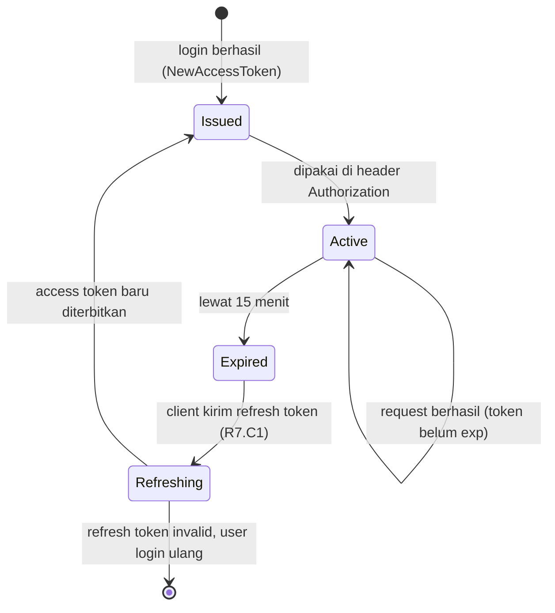
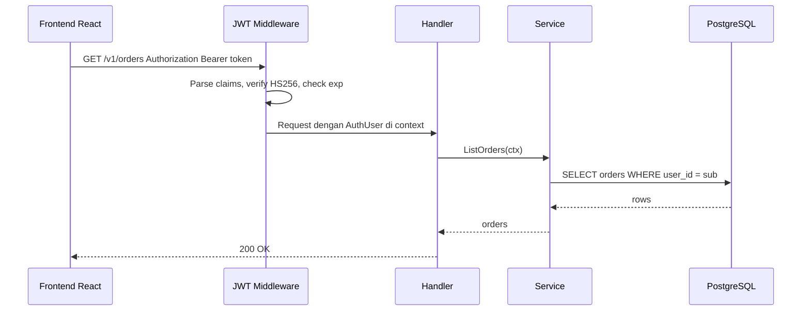
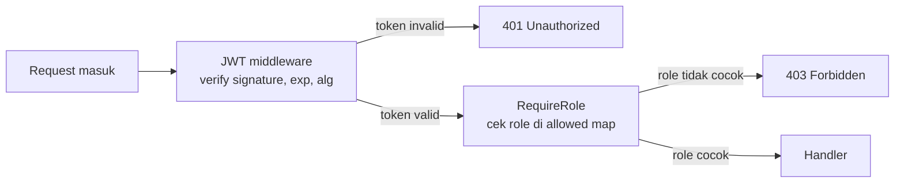
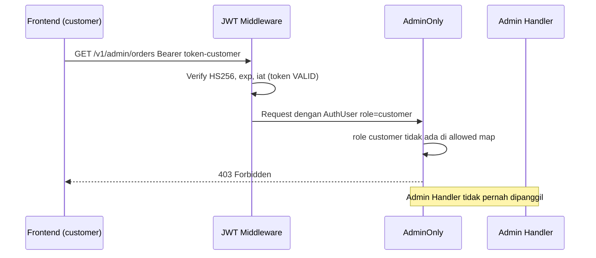
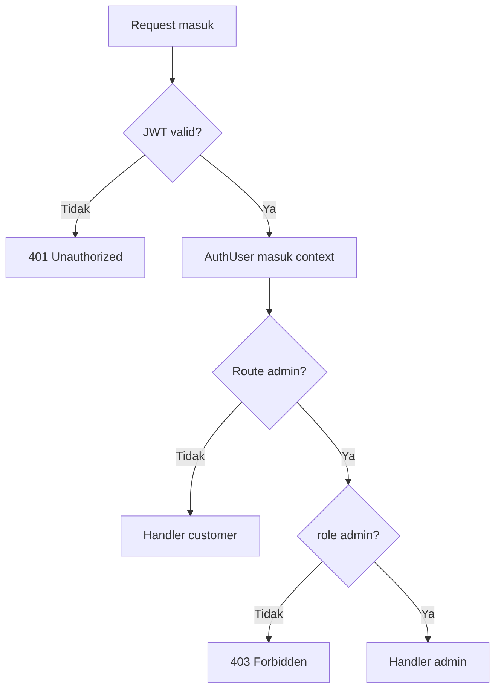

import { Section, Box, Steps, Step, Recap, CardGrid, Card, Chip, Hero, Compare, FileTree, Endpoint, Def } from "@components";

<Hero eyebrow="Roadmap 7 &middot; Security" title="JWT dan <em>Otorisasi</em><br />Route yang Aman">
  <p>Setelah password diverifikasi, API harus tahu siapa user-nya dan route mana yang boleh ia akses.</p>
  <Fragment slot="meta">
    <Chip icon="shield">Bahasa: <b>Go 1.26</b></Chip>
    <Chip icon="clock">~65 menit baca</Chip>
  </Fragment>
</Hero>

<Section num="01" id="intro" title="Dari Login ke Route yang Terproteksi">

<p class="lead">Login bukan akhir proses auth, login hanya menghasilkan bukti sementara agar request berikutnya bisa dikenali.</p>

Di React, setelah user login biasanya frontend menyimpan access token lalu mengirim header `Authorization: Bearer ...` pada request berikutnya. Di Laravel, konsepnya mirip middleware `auth` dan `can`, tetapi Go membuat alurnya lebih eksplisit: middleware membaca token, memverifikasi signature, lalu memasukkan identitas user ke `context.Context` request.

<Box variant="bridge" icon="🌉" label="Jembatan: dari middleware Laravel ke middleware Go"><p>Di Laravel, `auth` middleware sering terasa otomatis karena framework menyuntik user ke request. Di Go, kita sendiri yang menentukan format token, key context, dan role check, hasilnya lebih eksplisit dan mudah dites.</p></Box>

Dalam backend online shop skincare, customer boleh melihat order miliknya, menambah cart, dan checkout. Admin boleh membuka `/v1/admin/*`, mengelola produk, melihat semua order, dan memproses refund. JWT membantu API mengenali user, tetapi otorisasi role menentukan apakah user itu boleh masuk ke route tertentu.

<Def term="Authentication"><p>Proses membuktikan identitas, misalnya email dan password benar lalu API menerbitkan access token.</p></Def>

<Def term="Authorization"><p>Proses memutuskan izin akses, misalnya user dengan role `customer` tidak boleh mengakses route admin.</p></Def>

<Endpoint method="GET" path="/v1/me" desc="Butuh token valid, mengembalikan profil user login" />
<Endpoint method="GET" path="/v1/orders" desc="CustomerOnly, hanya order milik customer login" />
<Endpoint method="GET" path="/v1/admin/orders" desc="AdminOnly, melihat semua order untuk backoffice" />
<Endpoint method="PATCH" path="/v1/admin/products/{id}" desc="AdminOnly, update produk dan stok" />

</Section>

<Section num="02" id="bentuk-jwt" title="Bentuk JWT dan Claims yang Kita Pakai">

<p class="lead">JWT adalah token bertanda tangan, bukan database session dan bukan tempat menyimpan semua data user.</p>

JWT biasanya berisi tiga bagian: header, payload, dan signature. Header menyebut algoritma, payload menyimpan claims, signature membuktikan bahwa token dibuat oleh server yang punya secret. Library yang kita pakai adalah [`github.com/golang-jwt/jwt/v5`](https://pkg.go.dev/github.com/golang-jwt/jwt/v5) (versi terbaru seri v5.3.x per Juni 2026), versi v5 memakai import path `/v5` dan menyediakan `RegisteredClaims` untuk claims standar.

<CardGrid cols={2}>
  <Card><h4>`sub`</h4><p>Subject, kita isi dengan `user_id`. Jangan isi email kalau sistem memakai ID internal.</p></Card>
  <Card><h4>`role`</h4><p>Private claim untuk role aplikasi, misalnya `customer` atau `admin`.</p></Card>
  <Card><h4>`exp`</h4><p>Expiration time. Access token kita buat pendek, 15 menit, agar risiko token bocor lebih kecil.</p></Card>
  <Card><h4>`iat`</h4><p>Issued at. Berguna untuk audit ringan dan validasi waktu penerbitan token.</p></Card>
</CardGrid>

Selain empat claim di atas, `RegisteredClaims` juga menyimpan dua claim standar yang berguna saat sistem tumbuh: `iss` (issuer, siapa yang menerbitkan token) dan `aud` (audience, untuk siapa token ini ditujukan). Di proyek skincare, `iss` bisa diisi `skincare-api` dan `aud` diisi nama environment, sehingga token yang diterbitkan di staging tidak diam-diam diterima di production. Pada fase awal kita belum wajib memakainya, tetapi penting tahu bahwa validasinya tinggal mengaktifkan opsi parser `jwt.WithIssuer` dan `jwt.WithAudience` (dibahas di Section 04).

<Box variant="bridge" icon="🌉" label="Jembatan: payload JWT di TypeScript vs struct Go"><p>Di TS kamu mungkin menulis interface `JwtPayload` dengan field `sub` dan `role`, tetapi itu hanya kontrak compile-time, runtime tetap menerima apa adanya. Di Go, `AccessClaims` diverifikasi saat unmarshal: field yang hilang jadi zero value (`""`, bukan `undefined`). Karena itu kita tetap perlu cek eksplisit `claims.Subject == ""` agar token tanpa subject tidak lolos.</p></Box>

<Box variant="warn" icon="⚠️" label="JWT tidak dienkripsi"><p>Payload JWT hanya di-encode base64url, jadi jangan taruh password, hash password, alamat lengkap, nomor telepon, refresh token, atau data pembayaran di dalam token.</p></Box>

<Compare aLabel="JS / PHP: payload bebas" bLabel="Go: claims bertipe jelas" aTone="muted" bTone="violet">
  <Fragment slot="a"><ul><li>Di banyak tutorial Express atau Laravel, payload sering berbentuk object bebas.</li><li>Risikonya, field yang salah nama baru ketahuan saat runtime.</li></ul></Fragment>
  <Fragment slot="b"><ul><li>Kita buat `AccessClaims` struct agar `sub`, `role`, `exp`, dan `iat` punya bentuk jelas.</li><li>`jwt.RegisteredClaims` menangani claims standar seperti `Subject`, `ExpiresAt`, dan `IssuedAt`.</li></ul></Fragment>
</Compare>

```json title="Contoh payload access token"
{
  "iss": "skincare-api",
  "sub": "user_9f3a",
  "role": "customer",
  "exp": 1780735840,
  "iat": 1780734940
}
```

</Section>

<Section num="03" id="signing-hs256" title="Signing Token dengan HS256">

<p class="lead">HS256 memakai satu secret yang sama untuk membuat dan memverifikasi token.</p>

HMAC-SHA256 cocok untuk modular monolith karena hanya satu API process yang menerbitkan dan memverifikasi token. Secret harus panjang, random, dan diambil dari environment atau secret manager, bukan hardcoded di repository. Untuk HS256, gunakan secret minimal 32 byte (256-bit) supaya kekuatannya setara dengan output HMAC-SHA256, secret yang lebih pendek memperkecil ruang kunci dan melemahkan tanda tangan.

```bash title="Terminal"
# Cara cepat dengan openssl: 32 byte acak, di-encode base64
openssl rand -base64 32
```

Bila ingin men-generate dari Go (misalnya untuk tooling internal), `crypto/rand` adalah sumber acak yang aman secara kriptografis, bukan `math/rand`.

```go title="cmd/gensecret/main.go"
package main

import (
	"crypto/rand"
	"encoding/base64"
	"fmt"
)

func main() {
	buf := make([]byte, 32)
	if _, err := rand.Read(buf); err != nil {
		panic(err)
	}
	fmt.Println(base64.StdEncoding.EncodeToString(buf))
}
```

Saat nanti arsitektur berkembang ke banyak service yang perlu memverifikasi token tanpa boleh menerbitkannya, kita bisa pindah ke asymmetric signing seperti RS256: penerbit memegang private key untuk sign, semua verifier cukup memegang public key. Selama masih satu process yang sign dan verify, HS256 lebih sederhana dan cukup.

<Box variant="tip" icon="💡" label="Prinsip secret"><p>Untuk HS256, anggap secret seperti password master API. Simpan di Secrets Manager atau environment production, rotasi bila bocor, dan jangan pernah masuk Git.</p></Box>

```go title="internal/auth/token.go"
package auth

import (
	"time"

	"github.com/golang-jwt/jwt/v5"
)

type Role string

const (
	RoleCustomer Role = "customer"
	RoleAdmin    Role = "admin"
)

type AccessClaims struct {
	Role string `json:"role"`
	jwt.RegisteredClaims
}

// Issuer membedakan token antar-environment. Validasinya opsional di Section 04.
const Issuer = "skincare-api"

func NewAccessToken(userID string, role Role, secret []byte, now time.Time) (string, error) {
	claims := AccessClaims{
		Role: string(role),
		RegisteredClaims: jwt.RegisteredClaims{
			Issuer:    Issuer,
			Subject:   userID,
			IssuedAt:  jwt.NewNumericDate(now),
			ExpiresAt: jwt.NewNumericDate(now.Add(15 * time.Minute)),
		},
	}

	token := jwt.NewWithClaims(jwt.SigningMethodHS256, claims)
	return token.SignedString(secret)
}
```

<Box variant="note" icon="🧭" label="Refresh token tetap beda strategi"><p>Access token boleh self-contained dan pendek. Refresh token jangan diperlakukan sama, simpan hash refresh token di database seperti yang dibahas di R7.C1.</p></Box>

Access token pendek menimbulkan pertanyaan praktis: apa yang terjadi setiap 15 menit? Inilah siklus penuhnya, menyambung dengan refresh token flow dari R7.C1. Modul ini bertanggung jawab pada bagian "active" dan "expired -> 401", sementara langkah refresh sudah dibahas sebelumnya.



<p class="fig-cap"><b>Gambar 1.</b> Siklus access token: token aktif sebentar, expired memicu 401, lalu client menukar refresh token jadi access token baru.</p>

</Section>

<Section num="04" id="middleware-verifikasi" title="Middleware Verifikasi JWT">

<p class="lead">Middleware auth adalah gerbang pertama sebelum handler membaca data user.</p>

Alur middleware: baca header `Authorization`, ambil token setelah kata `Bearer`, parse claims, validasi algoritma HS256, cek signature, cek `exp`, cek `iat`, pastikan `sub` dan `role` valid, lalu sisipkan user ringkas ke context. Kita memakai `jwt.WithValidMethods` untuk membatasi algoritma agar token dengan algoritma lain tidak diterima.

Sebelum ke kode, perhatikan satu hal desain: `Role`, `AccessClaims`, dan `NewAccessToken` sudah didefinisikan di package `auth` (Section 03). Agar tetap satu sumber kebenaran, middleware **tidak** mendefinisikan ulang tipe-tipe itu, melainkan meng-import dari `auth`. Yang menjadi milik middleware hanyalah `AuthUser` ringkas, key context, dan fungsi guard.



<p class="fig-cap"><b>Gambar 2.</b> Token diverifikasi sekali di middleware, lalu identitas user dibawa lewat context sampai service.</p>

Perhatikan bahwa ada dua lapis penjagaan yang berbeda peran. Lapis pertama adalah authentication (membuktikan token sah), lapis kedua adalah authorization (memutuskan role boleh masuk). Memisahkan keduanya membuat alasan setiap penolakan jelas: 401 untuk token, 403 untuk izin.



<p class="fig-cap"><b>Gambar 3.</b> Dua lapis terpisah: authentication dulu (JWT), baru authorization (RequireRole). Setiap lapis punya kode status sendiri.</p>

```go title="middleware/jwt.go"
package middleware

import (
	"context"
	"errors"
	"net/http"
	"strings"
	"time"

	"github.com/golang-jwt/jwt/v5"

	"github.com/kamu/skincare-backend/internal/auth"
)

type AuthUser struct {
	ID   string
	Role auth.Role
}

type contextKey struct{}

var authUserKey = contextKey{}

func JWT(secret []byte) func(http.Handler) http.Handler {
	return func(next http.Handler) http.Handler {
		return http.HandlerFunc(func(w http.ResponseWriter, r *http.Request) {
			tokenString, err := bearerToken(r.Header.Get("Authorization"))
			if err != nil {
				writeAuthError(w, http.StatusUnauthorized, "missing_or_invalid_authorization_header")
				return
			}

			claims := new(auth.AccessClaims)
			token, err := jwt.ParseWithClaims(
				tokenString,
				claims,
				func(token *jwt.Token) (any, error) {
					return secret, nil
				},
				jwt.WithValidMethods([]string{jwt.SigningMethodHS256.Alg()}),
				jwt.WithIssuer(auth.Issuer),
				jwt.WithExpirationRequired(),
				jwt.WithIssuedAt(),
				jwt.WithLeeway(30*time.Second),
			)
			if err != nil || !token.Valid {
				writeAuthError(w, http.StatusUnauthorized, "invalid_or_expired_token")
				return
			}

			if claims.Subject == "" {
				writeAuthError(w, http.StatusUnauthorized, "missing_subject")
				return
			}

			role := auth.Role(claims.Role)
			if !isKnownRole(role) {
				writeAuthError(w, http.StatusForbidden, "unknown_role")
				return
			}

			user := AuthUser{ID: claims.Subject, Role: role}
			ctx := context.WithValue(r.Context(), authUserKey, user)
			next.ServeHTTP(w, r.WithContext(ctx))
		})
	}
}

func CustomerOnly() func(http.Handler) http.Handler {
	return RequireRole(auth.RoleCustomer)
}

func AdminOnly() func(http.Handler) http.Handler {
	return RequireRole(auth.RoleAdmin)
}

func RequireRole(roles ...auth.Role) func(http.Handler) http.Handler {
	allowed := make(map[auth.Role]struct{}, len(roles))
	for _, role := range roles {
		allowed[role] = struct{}{}
	}

	return func(next http.Handler) http.Handler {
		return http.HandlerFunc(func(w http.ResponseWriter, r *http.Request) {
			user, ok := UserFromContext(r.Context())
			if !ok {
				writeAuthError(w, http.StatusUnauthorized, "unauthenticated")
				return
			}

			if _, ok := allowed[user.Role]; !ok {
				writeAuthError(w, http.StatusForbidden, "forbidden")
				return
			}

			next.ServeHTTP(w, r)
		})
	}
}

func UserFromContext(ctx context.Context) (AuthUser, bool) {
	user, ok := ctx.Value(authUserKey).(AuthUser)
	return user, ok
}

func bearerToken(header string) (string, error) {
	if header == "" {
		return "", errors.New("authorization_header_required")
	}

	const prefix = "Bearer "
	if !strings.HasPrefix(header, prefix) {
		return "", errors.New("bearer_prefix_required")
	}

	token := strings.TrimSpace(strings.TrimPrefix(header, prefix))
	if token == "" {
		return "", errors.New("token_required")
	}

	return token, nil
}

func isKnownRole(role auth.Role) bool {
	switch role {
	case auth.RoleCustomer, auth.RoleAdmin:
		return true
	default:
		return false
	}
}

func writeAuthError(w http.ResponseWriter, code int, message string) {
	w.Header().Set("Content-Type", "application/json")
	w.WriteHeader(code)
	_, _ = w.Write([]byte(`{"error":"` + message + `"}`))
}
```

Lima opsi parser di `ParseWithClaims` bukan hiasan, masing-masing menutup satu celah nyata. Memahaminya membuat kamu tahu persis apa yang dijaga dan apa yang tidak.

<CardGrid cols={2}>
  <Card><h4>`WithValidMethods`</h4><p>Membatasi algoritma yang diterima ke HS256 saja. Ini pertahanan utama melawan alg-confusion (token `alg: none` atau RS256 yang dipaksa diverifikasi sebagai HS256).</p></Card>
  <Card><h4>`WithExpirationRequired`</h4><p>Menolak token yang tidak punya `exp` sama sekali. Tanpa ini, token tanpa expiry akan dianggap valid selamanya, sebuah token abadi yang berbahaya bila bocor.</p></Card>
  <Card><h4>`WithIssuedAt`</h4><p>Mengaktifkan validasi `iat`. Per RFC, `iat` sebenarnya informasional dan default v5 tidak mengeceknya, kita aktifkan demi disiplin audit (menolak token yang waktu terbitnya di masa depan).</p></Card>
  <Card><h4>`WithLeeway`</h4><p>Memberi toleransi 30 detik untuk clock skew antar-server. Tanpa ini, selisih jam beberapa detik antara penerbit dan verifier bisa salah menolak token yang sah.</p></Card>
  <Card><h4>`WithIssuer`</h4><p>Menolak token yang `iss`-nya bukan `skincare-api`. Berguna untuk memastikan token dari environment atau sistem lain tidak diterima begitu saja oleh API ini.</p></Card>
</CardGrid>

<Box variant="note" icon="🧭" label="Kenapa tidak ada cek alg manual di keyfunc"><p>`WithValidMethods` sudah memblokir algoritma non-HS256 sebelum keyfunc dipanggil, jadi menambah `if token.Method.Alg() != ...` di dalam keyfunc adalah pertahanan ganda yang justru membingungkan soal mana yang sebenarnya menjaga. Kita pilih satu sumber kebenaran: andalkan `WithValidMethods`, dan keyfunc cukup mengembalikan secret.</p></Box>

<Box variant="warn" icon="⚠️" label="Jangan cuma decode token"><p>Decode payload tanpa verifikasi signature itu sama seperti percaya header request mentah. Token harus diparse, signature harus cocok, expiry harus valid, dan algoritma harus dibatasi.</p></Box>

Setelah token diverifikasi, peran middleware selesai sebagai authentication. Jalur gagal punya kode status sendiri: token hilang atau invalid menghasilkan 401, sedangkan role yang tidak dikenal langsung 403. Diagram berikut menunjukkan skenario negatif yang paling sering disalahpahami, customer yang tokennya valid tetapi mencoba route admin.



<p class="fig-cap"><b>Gambar 4.</b> Token valid tidak otomatis berarti boleh masuk. Authentication lolos (bukan 401), tetapi authorization menolak (403).</p>

</Section>

<Section num="05" id="context-auth-user" title="Menyimpan User di Context">

<p class="lead">Context membawa data yang scoped ke satu request, bukan tempat menyimpan dependency global.</p>

Package [`context`](https://pkg.go.dev/context) mendefinisikan `Context` untuk membawa deadline, cancellation signal, dan request-scoped values melewati API boundary. Untuk auth, menyimpan `AuthUser` di context masuk akal karena identitas user memang melekat pada request HTTP saat ini.

<Box variant="bridge" icon="🌉" label="Jembatan: dari request user Laravel ke context Go"><p>Di Laravel, kamu sering memanggil `$request->user()`. Di Go, padanannya kita buat sendiri lewat `UserFromContext(ctx)`, sehingga handler dan service tidak perlu tahu cara JWT diverifikasi.</p></Box>

<Box variant="bridge" icon="🌉" label="Jembatan: React Context vs context.Context Go"><p>Nama mirip, cakupan beda. React `Context` plus `useContext` itu component-tree-scoped, hidup selama komponen ter-render dan dipakai untuk state UI lintas komponen. `context.Context` Go itu request-scoped, lahir saat request masuk dan **mati saat request selesai**. Ia bukan global store, jadi jangan perlakukan seperti `useContext` yang menyimpan state aplikasi.</p></Box>

<Box variant="bridge" icon="🌉" label="Jembatan: req.user Express vs r.WithContext Go"><p>Di Express kamu menempel user ke request: `req.user = decoded` lalu memanggil `next()`. Go tidak memutasi request, melainkan membuat request baru dengan context yang diperkaya lewat `r.WithContext(ctx)`, lalu meneruskannya ke handler berikutnya. Karena `*http.Request` bersifat shared, menyalin via context lebih aman daripada menempel field bebas.</p></Box>

Kenapa memakai `type contextKey struct{}` dan variabel private? Karena key context bertipe string raw seperti `"user"` bisa bertabrakan dengan package lain. Tipe private membuat key unik di package middleware, sehingga hanya fungsi resmi seperti `UserFromContext` yang dipakai untuk membaca user.

```go title="internal/order/service.go"
package order

import (
	"context"
	"errors"

	"github.com/kamu/skincare-backend/middleware"
)

var ErrUnauthenticated = errors.New("unauthenticated")

type Repository interface {
	ListByUserID(ctx context.Context, userID string) ([]Order, error)
}

type Service struct {
	repo Repository
}

func (s *Service) ListMine(ctx context.Context) ([]Order, error) {
	user, ok := middleware.UserFromContext(ctx)
	if !ok {
		return nil, ErrUnauthenticated
	}

	return s.repo.ListByUserID(ctx, user.ID)
}
```

<Box variant="tip" icon="💡" label="Batasan context"><p>Context boleh membawa identitas request, request ID, dan deadline. Jangan pakai context untuk menyelundupkan repository, config, atau logger global yang seharusnya menjadi dependency eksplisit.</p></Box>

</Section>

<Section num="06" id="otorisasi-role" title="CustomerOnly dan AdminOnly">

<p class="lead">Authentication menjawab siapa user-nya, authorization menjawab apa yang boleh ia lakukan.</p>

Role-based access sederhana cukup untuk fase awal online shop skincare: `customer` untuk pembeli dan `admin` untuk backoffice. Middleware `CustomerOnly` dan `AdminOnly` membaca `AuthUser` dari context, lalu mengembalikan `403 Forbidden` bila role tidak cocok. Perhatikan bedanya dengan `401 Unauthorized`: `401` berarti belum login atau token invalid, sedangkan `403` berarti sudah dikenali tetapi tidak punya izin.

Kenapa `RequireRole(roles ...auth.Role)` dibuat variadic, bukan satu role saja? Karena begitu role bertambah (misalnya nanti ada role `staff` yang boleh melihat order tetapi tidak boleh refund), kita ingin menggabungkan beberapa role yang diizinkan dalam satu route tanpa menulis middleware baru. Cukup tulis `RequireRole(auth.RoleAdmin, roleStaff)` untuk route yang boleh dimasuki keduanya, sementara `CustomerOnly`/`AdminOnly` tetap menjadi pemanggilan tipis untuk kasus satu role.

<Box variant="bridge" icon="🌉" label="Jembatan: abort(403) Laravel vs status eksplisit Go"><p>Di Laravel kamu menulis `abort(401)` saat belum login dan `abort(403)` saat policy menolak. Padanan Go kita adalah `writeAuthError(w, http.StatusUnauthorized, ...)` dan `writeAuthError(w, http.StatusForbidden, ...)`. Tidak ada framework yang memilih status untukmu, kamu yang menentukan, dan itu justru memaksa boundary 401 vs 403 tetap jelas.</p></Box>

<Compare aLabel="CustomerOnly" bLabel="AdminOnly" aTone="teal" bTone="violet">
  <Fragment slot="a"><ul><li>Dipakai untuk route seperti cart, checkout, order milik customer, dan review produk.</li><li>Customer hanya boleh membaca data yang berhubungan dengan `sub` miliknya.</li></ul></Fragment>
  <Fragment slot="b"><ul><li>Dipakai untuk `/v1/admin/*`, product management, order management, refund, dan audit log.</li><li>Admin boleh membaca data lintas customer, tetapi tetap harus diaudit.</li></ul></Fragment>
</Compare>

<Box variant="warn" icon="⚠️" label="Role di token bisa stale"><p>Kalau role user diubah di database, access token lama tetap membawa role lama sampai expired. Karena itu access token pendek, 15 menit, dan action admin sensitif boleh melakukan lookup user terbaru ke database.</p></Box>



<p class="fig-cap"><b>Gambar 5.</b> Role check dilakukan setelah token valid dan sebelum handler admin dijalankan.</p>

<Box variant="note" icon="🧭" label="Kapan RBAC role-statis perlu naik kelas"><p>Dua role statis cukup selama izin masih sejajar dengan jabatan. Begitu kebutuhan jadi granular (misalnya `staff` boleh lihat order tetapi tidak boleh hapus produk, atau ada izin per-toko di marketplace), role tunggal mulai sesak. Saat itu tiba, naik ke model permission/scope: token membawa daftar permission seperti `order:read` atau `product:write`, dan guard mengecek permission, bukan nama role. RBAC role-statis adalah titik awal yang benar, bukan tujuan akhir.</p></Box>

<Box variant="note" icon="🧾" label="403 vs 404 untuk resource admin"><p>Mengembalikan 403 jujur menyatakan resource ada tetapi kamu tidak punya izin. Untuk resource admin yang keberadaannya saja sensitif, sebagian tim memilih mengembalikan 404 agar customer tidak bisa menyimpulkan endpoint admin itu ada. Ini trade-off antara kejujuran dan menyembunyikan permukaan serang, putuskan per kasus dan konsisten.</p></Box>

</Section>

<Section num="07" id="integrasi-route" title="Integrasi ke Route chi">

<p class="lead">Dengan chi, proteksi route bisa ditempel per group sehingga batas admin dan customer terlihat di file routes.</p>

Struktur route yang baik membuat keamanan mudah diaudit. Route publik seperti login dan register tidak memakai middleware JWT. Route customer memakai JWT plus `CustomerOnly`. Route admin memakai JWT plus `AdminOnly`. Dengan pola ini, developer baru bisa membaca file route dan langsung tahu area mana yang publik, customer, atau admin.

<FileTree title="Potongan struktur auth dan route" tree={`cmd/
  api/
    main.go              # entry point API
    routes.go            # pemasangan middleware dan route group
internal/
  auth/
    handler.go           # login, register, refresh token
    service.go           # password check dan token issuance
  order/
    handler.go           # endpoint order customer
  admin/
    order_handler.go     # endpoint backoffice order
middleware/
  jwt.go                 # JWT, context user, role middleware
go.mod`} />

```go title="cmd/api/routes.go"
package api

import (
	"net/http"

	"github.com/go-chi/chi/v5"
	"github.com/kamu/skincare-backend/middleware"
)

type Handlers struct {
	Auth  AuthHandler
	Me    MeHandler
	Order OrderHandler
	Admin AdminHandler
}

type AuthHandler interface {
	Login(w http.ResponseWriter, r *http.Request)
	Register(w http.ResponseWriter, r *http.Request)
}

type MeHandler interface {
	Show(w http.ResponseWriter, r *http.Request)
}

type OrderHandler interface {
	ListMine(w http.ResponseWriter, r *http.Request)
	Checkout(w http.ResponseWriter, r *http.Request)
}

type AdminHandler interface {
	ListOrders(w http.ResponseWriter, r *http.Request)
	UpdateProduct(w http.ResponseWriter, r *http.Request)
}

func NewRouter(h Handlers, jwtSecret []byte) http.Handler {
	r := chi.NewRouter()

	r.Route("/v1", func(r chi.Router) {
		r.Post("/auth/register", h.Auth.Register)
		r.Post("/auth/login", h.Auth.Login)

		r.Group(func(r chi.Router) {
			r.Use(middleware.JWT(jwtSecret))
			r.Get("/me", h.Me.Show)
		})

		r.Group(func(r chi.Router) {
			r.Use(middleware.JWT(jwtSecret))
			r.Use(middleware.CustomerOnly())
			r.Get("/orders", h.Order.ListMine)
			r.Post("/orders/checkout", h.Order.Checkout)
		})

		r.Route("/admin", func(r chi.Router) {
			r.Use(middleware.JWT(jwtSecret))
			r.Use(middleware.AdminOnly())
			r.Get("/orders", h.Admin.ListOrders)
			r.Patch("/products/{id}", h.Admin.UpdateProduct)
		})
	})

	return r
}
```

<Box variant="note" icon="🧭" label="Kenapa group terpisah"><p>Group terpisah mengurangi risiko route admin lupa diberi `AdminOnly`. Prinsipnya, default harus aman dan area sensitif harus terlihat jelas.</p></Box>

</Section>

<Section num="08" id="handler-service" title="Mengambil User di Handler dan Service">

<p class="lead">Handler boleh membaca user untuk response ringan, tetapi business rule tetap sebaiknya ditegakkan di service.</p>

Untuk endpoint `/v1/me`, handler cukup membaca user dari context dan mengembalikan data dasar. Untuk order, service tetap harus memakai `user.ID` dari context saat query. Jangan menerima `user_id` dari request body untuk operasi customer, karena customer bisa memalsukan ID user lain.

```go title="internal/me/handler.go"
package me

import (
	"encoding/json"
	"net/http"

	"github.com/kamu/skincare-backend/middleware"
)

type Handler struct{}

type response struct {
	UserID string `json:"user_id"`
	Role   string `json:"role"`
}

func (h Handler) Show(w http.ResponseWriter, r *http.Request) {
	user, ok := middleware.UserFromContext(r.Context())
	if !ok {
		http.Error(w, "unauthenticated", http.StatusUnauthorized)
		return
	}

	w.Header().Set("Content-Type", "application/json")
	_ = json.NewEncoder(w).Encode(response{
		UserID: user.ID,
		Role:   string(user.Role),
	})
}
```

```go title="internal/order/handler.go"
package order

import (
	"context"
	"net/http"
)

type Service interface {
	ListMine(ctx context.Context) ([]Order, error)
}

type Handler struct {
	service Service
}

func (h Handler) ListMine(w http.ResponseWriter, r *http.Request) {
	orders, err := h.service.ListMine(r.Context())
	if err != nil {
		writeError(w, err)
		return
	}

	writeJSON(w, http.StatusOK, orders)
}
```

<Box variant="warn" icon="⚠️" label="Jangan percaya user_id dari body"><p>Untuk route customer, sumber kebenaran identitas adalah token yang sudah diverifikasi, bukan body JSON, query string, atau path parameter yang bisa dimanipulasi client.</p></Box>

Bahaya konkretnya bernama IDOR (Insecure Direct Object Reference). Bayangkan endpoint `GET /v1/orders/:id`. Customer A login sah, lalu menebak `order_id` milik customer B dan mengaksesnya. Kalau query hanya `WHERE id = $1`, customer A berhasil membaca order orang lain. Pertahanannya sederhana dan wajib: query selalu menyertakan `user_id` dari context, sehingga order yang bukan miliknya tidak akan pernah ditemukan.

```go title="internal/order/repository.go"
package order

import (
	"context"

	"github.com/jackc/pgx/v5/pgxpool"
)

type PgRepository struct {
	pool *pgxpool.Pool
}

// GetByID selalu mengikat id DAN user_id, jadi customer lain tidak bisa
// membaca order milik orang lain meski menebak id yang benar.
func (r *PgRepository) GetByID(ctx context.Context, id, userID string) (Order, error) {
	const q = `
		SELECT id, user_id, total_rupiah, status
		FROM orders
		WHERE id = $1 AND user_id = $2`

	var o Order
	err := r.pool.QueryRow(ctx, q, id, userID).
		Scan(&o.ID, &o.UserID, &o.TotalRupiah, &o.Status)
	if err != nil {
		return Order{}, err
	}
	return o, nil
}
```

<Box variant="tip" icon="💡" label="Pola anti-IDOR"><p>Untuk action admin yang memang boleh lintas customer, batasannya berbeda: admin boleh tanpa filter `user_id`, tetapi setiap akses harus tercatat di audit log. Otorisasi role menentukan apakah filter itu wajib dipasang.</p></Box>

</Section>

<Section num="09" id="hands-on" title="Hands-on Proteksi Route">

<p class="lead">Latihan ini mengunci alur dari login, token, sampai route admin yang menolak customer.</p>

<Steps>
  <Step><b>Pasang library JWT</b><p>Tambahkan `github.com/golang-jwt/jwt/v5` ke module Go.</p></Step>
  <Step><b>Buat secret development</b><p>Generate secret random minimal 32 byte dengan `openssl rand -base64 32`, lalu pindahkan ke Secrets Manager di production.</p></Step>
  <Step><b>Tempel middleware</b><p>Masukkan `middleware.JWT(secret)`, `CustomerOnly`, dan `AdminOnly` ke route group chi.</p></Step>
  <Step><b>Uji customer</b><p>Login sebagai customer, panggil `/v1/orders`, lalu pastikan `/v1/admin/orders` mengembalikan `403`.</p></Step>
  <Step><b>Uji expiry</b><p>Gunakan token yang sudah expired, semua route protected harus mengembalikan `401`.</p></Step>
</Steps>

```bash title="Terminal"
go get github.com/golang-jwt/jwt/v5
```

```bash title="Terminal"
TOKEN="eyJhbGciOiJIUzI1NiIsInR5cCI6IkpXVCJ9..."

curl -i http://localhost:8080/v1/orders \
  -H "Authorization: Bearer $TOKEN"

curl -i http://localhost:8080/v1/admin/orders \
  -H "Authorization: Bearer $TOKEN"
```

```text title="Expected behavior"
GET /v1/orders
200 OK untuk role customer dengan token valid

GET /v1/admin/orders
403 Forbidden untuk role customer
401 Unauthorized untuk token kosong, salah, atau expired
200 OK untuk role admin dengan token valid
```

<Box variant="tip" icon="💡" label="Test yang wajib ada"><p>Buat test untuk token valid, token expired, signature salah, missing Bearer, customer mengakses admin, dan admin mengakses route admin.</p></Box>

</Section>

<Section num="10" id="jebakan-umum" title="Jebakan Umum JWT untuk Developer JS dan PHP">

<p class="lead">Banyak bug auth bukan karena JWT sulit, tetapi karena boundary authentication dan authorization tidak jelas.</p>

<CardGrid cols={2}>
  <Card><h4>Decode tanpa verify</h4><p>Base64 decode hanya membaca payload, bukan membuktikan token sah. Selalu parse dengan secret dan cek signature.</p></Card>
  <Card><h4>Tidak membatasi `alg`</h4><p>Parser harus membatasi algoritma ke HS256 untuk secret HMAC. Gunakan `jwt.WithValidMethods`.</p></Card>
  <Card><h4>Token terlalu panjang umur</h4><p>Access token 7 hari membuat pencurian token lebih berbahaya. Pakai 15 menit dan refresh token terpisah.</p></Card>
  <Card><h4>Role terlalu dipercaya</h4><p>Role di token bisa tertinggal dari database. Untuk action admin sensitif, cek status user terbaru atau paksa refresh session.</p></Card>
  <Card><h4>Context jadi tempat semua hal</h4><p>Context hanya untuk data request-scoped. Dependency tetap lewat struct constructor.</p></Card>
  <Card><h4>Route admin bercampur</h4><p>Jangan selipkan route admin di group customer. Pisahkan `/v1/admin/*` agar audit keamanan lebih mudah.</p></Card>
</CardGrid>

<Box variant="bridge" icon="🌉" label="Jembatan: dari guard Laravel ke middleware kecil"><p>Laravel punya guard, policy, dan gate yang matang. Di Go, kita susun guard kecil dari middleware biasa, lalu business rule tetap tinggal di service agar tidak bocor ke handler.</p></Box>

<Box variant="note" icon="🧾" label="Log keamanan"><p>Log event penting seperti login gagal, token invalid berulang, akses admin ditolak, dan perubahan role. Jangan log token mentah.</p></Box>

</Section>

<Section num="11" id="ringkasan" title="Ringkasan & Poin Penting">

<p class="lead">JWT memberi identitas request, role middleware menegakkan izin route, dan service tetap menjaga business rule.</p>

<Recap title="Yang Wajib Menempel">
  <ul><li>JWT access token berisi `sub`, `role`, `exp`, `iat`, dan opsional `iss`, tanpa data sensitif.</li><li>Signing HS256 memakai secret yang sama untuk sign dan verify, secret minimal 32 byte dan tidak boleh hardcoded.</li><li>`Role`, `AccessClaims`, dan `NewAccessToken` tinggal di satu package (`auth`); middleware meng-import-nya, tidak menduplikasi.</li><li>Parser dijaga `WithValidMethods` (alg), `WithExpirationRequired` (token abadi), `WithIssuedAt` (audit), `WithLeeway` (clock skew), dan `WithIssuer` (asal token), tanpa cek alg manual ganda di keyfunc.</li><li>`AuthUser` disimpan di context memakai key private `type contextKey struct{}` agar tidak bertabrakan, dan context mati saat request selesai.</li><li>`CustomerOnly` dan `AdminOnly` (di atas `RequireRole` variadic) memisahkan route customer dan backoffice; 401 untuk token, 403 untuk izin.</li><li>Repository selalu mengikat `user_id` dari context untuk mencegah IDOR, bukan percaya `user_id` dari request body.</li></ul>
</Recap>

Untuk proyek online shop skincare, modul ini mengunci fondasi route protection: customer bisa checkout dan melihat order miliknya, sedangkan admin punya jalur backoffice yang terpisah. Di modul berikutnya, pola ini dipakai bersama input validation, CSRF/CORS boundary, secret management, dan audit log agar API siap masuk production.

</Section>
