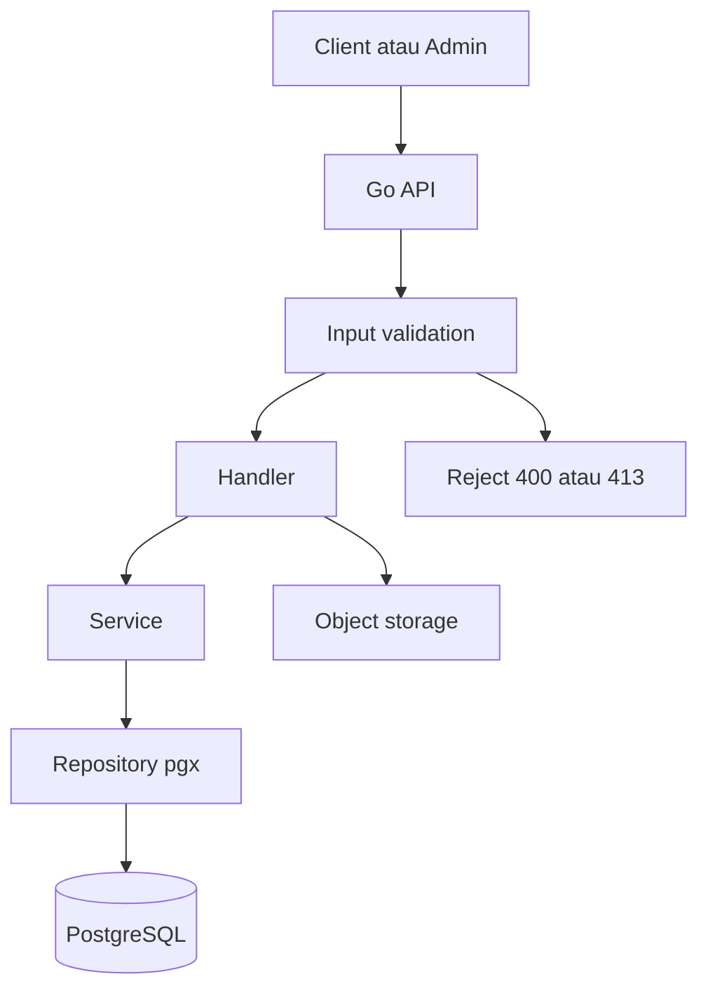
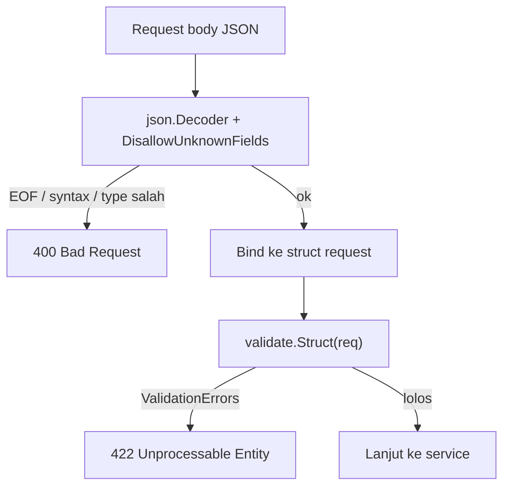
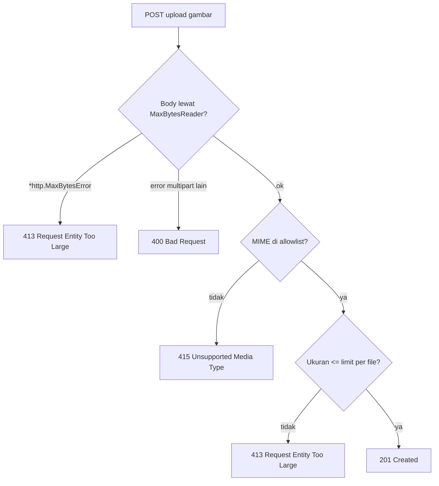
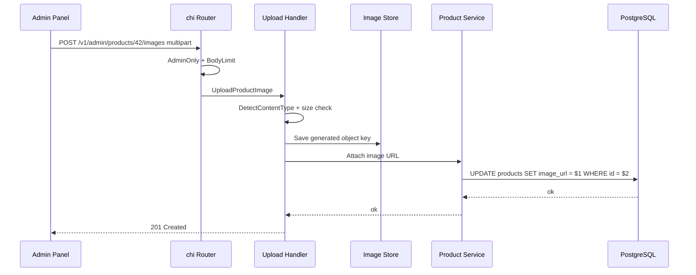

import { Section, Box, Steps, Step, Recap, CardGrid, Card, Chip, Hero, Compare, FileTree, Endpoint, Def } from "@components";

<Hero eyebrow="Roadmap 7 &middot; Security" title="Keamanan <em>Input</em><br />untuk API Produksi">
  <p>Input security adalah pagar pertama sebelum auth, database, storage, dan admin backoffice menerima data dari dunia luar.</p>
  <Fragment slot="meta">
    <Chip icon="code">Bahasa: <b>Go 1.26</b></Chip>
    <Chip icon="clock">~70 menit baca</Chip>
  </Fragment>
</Hero>

<Section num="01" id="intro" title="Kenapa Input Security Tidak Boleh Belakangan">

<p class="lead">Di React atau Laravel, kamu mungkin terbiasa punya form validation, sanitizer, middleware, dan request object yang terasa otomatis. Di Go, semuanya lebih eksplisit.</p>

Input security bukan sekadar memastikan field wajib terisi. Fokus modul ini adalah mencegah input berbahaya merusak sistem, mulai dari query database, text field yang nanti tampil di UI, upload gambar produk, request body raksasa, sampai nama file yang mencoba keluar dari folder storage.

<Box variant="bridge" icon="🌉" label="Jembatan: Laravel Request::validate vs Go eksplisit"><p>Di Laravel, validasi sering dimulai dari <code>Request::validate</code> atau Form Request. Di Go, handler biasanya membaca input, memanggil fungsi validasi, lalu service tetap memvalidasi business rule. Hasilnya lebih verbose, tetapi batas tanggung jawabnya sangat jelas.</p></Box>

<Compare aLabel="Laravel / PHP" bLabel="Go" aTone="muted" bTone="violet">
  <Fragment slot="a"><ul><li><code>Request::validate</code>, middleware, dan ORM membantu banyak guardrail.</li><li>Query builder biasanya otomatis binding parameter ketika dipakai dengan benar.</li><li>Upload sering dibungkus oleh object file framework.</li></ul></Fragment>
  <Fragment slot="b"><ul><li>Handler membaca request dengan <code>net/http</code> lalu validasi ditulis eksplisit.</li><li>Repository pgx memakai placeholder PostgreSQL seperti <code>$1</code> dan args terpisah.</li><li>Upload harus dibatasi ukuran, dicek MIME type, dan disimpan dengan nama buatan server.</li></ul></Fragment>
</Compare>

Pada proyek online shop skincare, input datang dari banyak arah: customer mencari produk, admin mengubah katalog, customer menulis review, payment gateway mengirim webhook, dan admin mengunggah gambar produk. Setiap pintu punya risiko berbeda.

</Section>

<Section num="02" id="permukaan-serangan" title="Permukaan Serangan di Online Shop">

<p class="lead">Sebelum menulis kode, petakan dulu input mana yang bisa menyentuh database, browser, file system, atau resource server.</p>

<CardGrid cols={2}>
  <Card><h4>Search dan filter produk</h4><p>Keyword, brand, category, sort, dan pagination masuk ke SQL. Risiko utamanya SQL injection dan query mahal.</p></Card>
  <Card><h4>Review dan profil customer</h4><p>Text field bisa aman saat disimpan, tetapi menjadi risiko XSS ketika ditampilkan di admin panel, email, atau halaman storefront.</p></Card>
  <Card><h4>Upload gambar produk</h4><p>File upload membawa risiko MIME spoofing, ukuran besar, malware, dan nama file berisi path traversal.</p></Card>
  <Card><h4>Webhook dan form besar</h4><p>Body request bisa terlalu besar sebelum sempat divalidasi. Server perlu membatasi ukuran sejak awal handler atau middleware.</p></Card>
</CardGrid>



<p class="fig-cap"><b>Gambar 1.</b> Input harus melewati validasi sebelum menyentuh database atau storage.</p>

<Def term="input security"><p>Serangkaian guardrail untuk memastikan data dari luar sistem tidak bisa memanipulasi query, merusak tampilan, membebani server, atau mengakses file di luar area yang diizinkan.</p></Def>

</Section>

<Section num="03" id="request-validation" title="Request Validation dengan validator/v10">

<p class="lead">Sebelum input menyentuh service, validasi dulu bentuknya: field wajib ada, panjang masuk akal, format benar, dan nilai enum sesuai allowlist.</p>

Di React kamu mungkin pakai <code>zod</code> atau <code>express-validator</code>. Di Laravel kamu menulis rules di Form Request. Di Go, padanan paling populer adalah <code>github.com/go-playground/validator/v10</code>: kamu menempelkan aturan sebagai struct tag, lalu satu panggilan memeriksa seluruh struct sekaligus.

<Box variant="bridge" icon="🌉" label="Jembatan: zod / express-validator / Form Request ke struct tag"><p>Aturan Laravel <code>required|min:3|max:120</code> dan skema zod <code>z.string().min(3).max(120)</code> punya padanan langsung di tag <code>validate:&quot;required,min=3,max=120&quot;</code>. Bedanya, di Go aturan menempel pada tipe data, bukan pada objek request terpisah, sehingga satu struct bisa dipakai ulang di banyak handler.</p></Box>

<p>Pasang paket dan buat satu instance validator untuk dipakai seluruh handler. Versi terkini per Juni 2026 adalah seri v10.30.x.</p>

```bash title="Terminal"
go get github.com/go-playground/validator/v10
```

Decode JSON dengan aman adalah separuh dari validasi. Pakai <code>json.Decoder</code> dengan <code>DisallowUnknownFields</code> agar field asing ditolak, lalu bedakan tiga jenis kegagalan decode: body kosong, JSON rusak, dan tipe field salah.

```go title="internal/shared/httpx/decode.go"
package httpx

import (
	"encoding/json"
	"errors"
	"fmt"
	"io"
	"net/http"

	"github.com/go-playground/validator/v10"
)

var validate = validator.New(validator.WithRequiredStructEnabled())

// DecodeAndValidate membaca body JSON ke dst lalu memvalidasi struct tag-nya.
func DecodeAndValidate(r *http.Request, dst any) error {
	dec := json.NewDecoder(r.Body)
	dec.DisallowUnknownFields()

	if err := dec.Decode(dst); err != nil {
		var syntaxErr *json.SyntaxError
		var typeErr *json.UnmarshalTypeError
		switch {
		case errors.Is(err, io.EOF):
			return fmt.Errorf("request body is empty")
		case errors.As(err, &syntaxErr):
			return fmt.Errorf("request body has malformed JSON at offset %d", syntaxErr.Offset)
		case errors.As(err, &typeErr):
			return fmt.Errorf("field %q expects %s", typeErr.Field, typeErr.Type)
		default:
			return fmt.Errorf("decode request body: %w", err)
		}
	}

	// Tolak body kedua: client tidak boleh mengirim dua objek JSON.
	if err := dec.Decode(&struct{}{}); !errors.Is(err, io.EOF) {
		return fmt.Errorf("request body must contain a single JSON object")
	}

	if err := validate.Struct(dst); err != nil {
		return err
	}

	return nil
}
```

Setelah decoder beres, definisikan struct request berlabuh ke domain skincare. Aturan validasi menempel langsung di tag. Tag <code>oneof</code> berperan seperti enum allowlist, persis seperti <code>in:newest,price_asc</code> di Laravel.

```go title="internal/review/request.go"
package review

// CreateReviewRequest memetakan body POST /v1/reviews.
type CreateReviewRequest struct {
	ProductID int64  `json:"product_id" validate:"required,gt=0"`
	Rating    int    `json:"rating" validate:"required,min=1,max=5"`
	Title     string `json:"title" validate:"required,min=3,max=120"`
	Body      string `json:"body" validate:"required,min=10,max=2000"`
}

// ProductFilterRequest memetakan query string GET /v1/products.
type ProductFilterRequest struct {
	Keyword string `json:"keyword" validate:"omitempty,max=80"`
	Brand   string `json:"brand" validate:"omitempty,alphanum,max=40"`
	Sort    string `json:"sort" validate:"omitempty,oneof=newest price_asc price_desc"`
	Page    int    `json:"page" validate:"omitempty,min=1,max=1000"`
}
```

Di handler, urutannya jelas: decode dan validasi, lalu map error ke 422, baru lanjut ke service. Status 422 (Unprocessable Entity) memberi sinyal bahwa JSON sudah benar bentuknya tetapi gagal aturan bisnis, berbeda dari 400 untuk JSON rusak.

```go title="internal/review/handler.go"
package review

import (
	"context"
	"errors"
	"net/http"

	"github.com/go-playground/validator/v10"

	"github.com/kamu/skincare-backend/internal/shared/httpx"
)

type Service interface {
	Create(ctx context.Context, customerID int64, req CreateReviewRequest) (int64, error)
}

type Handler struct {
	reviews Service
}

func (h *Handler) CreateReview(w http.ResponseWriter, r *http.Request) {
	var req CreateReviewRequest
	if err := httpx.DecodeAndValidate(r, &req); err != nil {
		var validationErrs validator.ValidationErrors
		if errors.As(err, &validationErrs) {
			httpx.RespondJSON(w, http.StatusUnprocessableEntity, fieldErrors(validationErrs))
			return
		}
		httpx.RespondError(w, http.StatusBadRequest, err.Error())
		return
	}

	customerID := httpx.CustomerID(r.Context())
	id, err := h.reviews.Create(r.Context(), customerID, req)
	if err != nil {
		httpx.RespondError(w, http.StatusInternalServerError, "cannot create review")
		return
	}

	httpx.RespondJSON(w, http.StatusCreated, map[string]int64{"id": id})
}

// fieldErrors mengubah error validator menjadi map field -> aturan yang gagal.
func fieldErrors(errs validator.ValidationErrors) map[string]any {
	out := make(map[string]string, len(errs))
	for _, e := range errs {
		out[e.Field()] = e.Tag()
	}
	return map[string]any{"errors": out}
}
```



<p class="fig-cap"><b>Gambar 2.</b> Pipeline validasi request: decode aman dulu, baru validasi struct, sebelum service tersentuh.</p>

<Box variant="tip" icon="💡" label="Satu validator, dipakai ulang"><p>Buat satu instance <code>validator.New(...)</code> sebagai package-level var. Instance ini aman dipakai banyak goroutine sekaligus dan men-cache hasil parsing tag, jadi jangan buat ulang per request.</p></Box>

</Section>

<Section num="04" id="sql-injection" title="SQL Injection dan Parameterized Query">

<p class="lead">SQL injection terjadi ketika input user ikut menjadi bagian dari teks SQL, bukan dikirim sebagai nilai terpisah.</p>

Di pgx, pola aman adalah menulis SQL dengan placeholder PostgreSQL seperti <code>$1</code>, <code>$2</code>, lalu mengirim nilai user sebagai argumen terpisah. Jangan menggabungkan string dari request ke SQL mentah.

<Box variant="bridge" icon="🌉" label="Jembatan: PDO prepared statement & Eloquent ke pgx placeholder"><p>Di PHP, PDO prepared statement (<code>:keyword</code> atau <code>?</code>) dan Eloquent (<code>where('name', $keyword)</code>) sudah binding nilai otomatis. Konsepnya identik dengan pgx: struktur SQL dipegang server, nilai user dikirim terpisah. Yang berbeda hanya sintaks placeholder, PostgreSQL pakai <code>$1</code>, <code>$2</code> bernomor, sedangkan MySQL/PDO pakai <code>?</code> berurutan.</p></Box>

<Def term="parameterized query"><p>Query yang memisahkan struktur SQL dari nilai input. SQL tetap dikendalikan server, sementara nilai user dikirim sebagai parameter.</p></Def>

```go title="internal/product/repository.go"
package product

import (
	"context"
	"fmt"
	"strings"

	"github.com/jackc/pgx/v5"
	"github.com/jackc/pgx/v5/pgxpool"
)

type Repository struct {
	db *pgxpool.Pool
}

type Product struct {
	ID       int64  `json:"id" db:"id"`
	Name     string `json:"name" db:"name"`
	Slug     string `json:"slug" db:"slug"`
	Brand    string `json:"brand" db:"brand"`
	MinPrice int64  `json:"min_price" db:"min_price"`
}

type ProductFilter struct {
	Keyword    string
	BrandID    *int64
	CategoryID *int64
	Limit      int32
}

func (r *Repository) SearchProducts(ctx context.Context, filter ProductFilter) ([]Product, error) {
	where := []string{"p.status = $1"}
	args := []any{"active"}

	if filter.Keyword != "" {
		args = append(args, filter.Keyword)
		where = append(where, fmt.Sprintf("p.name ILIKE '%%' || $%d || '%%'", len(args)))
	}

	if filter.BrandID != nil {
		args = append(args, *filter.BrandID)
		where = append(where, fmt.Sprintf("p.brand_id = $%d", len(args)))
	}

	if filter.CategoryID != nil {
		args = append(args, *filter.CategoryID)
		where = append(where, fmt.Sprintf("p.category_id = $%d", len(args)))
	}

	limit := filter.Limit
	if limit <= 0 || limit > 50 {
		limit = 20
	}

	args = append(args, limit)
	limitPlaceholder := fmt.Sprintf("$%d", len(args))

	sql := `
		SELECT p.id, p.name, p.slug, b.name AS brand, MIN(v.price) AS min_price
		FROM products p
		JOIN brands b ON b.id = p.brand_id
		JOIN product_variants v ON v.product_id = p.id
		WHERE ` + strings.Join(where, " AND ") + `
		GROUP BY p.id, p.name, p.slug, b.name
		ORDER BY p.created_at DESC
		LIMIT ` + limitPlaceholder

	rows, err := r.db.Query(ctx, sql, args...)
	if err != nil {
		return nil, fmt.Errorf("search products: %w", err)
	}
	defer rows.Close()

	products, err := pgx.CollectRows(rows, pgx.RowToStructByName[Product])
	if err != nil {
		return nil, fmt.Errorf("collect products: %w", err)
	}

	return products, nil
}
```

Perhatikan detail pentingnya: <code>strings.Join</code> hanya menyusun fragmen SQL yang dibuat oleh kode server, bukan dari user. Nilai dari user selalu masuk lewat <code>args</code> sehingga PostgreSQL menerima nilai, bukan potongan perintah SQL.

<Box variant="warn" icon="⚠️" label="Jangan concat input user ke SQL"><p>Input seperti <code>' OR 1=1 --</code> tidak berbahaya ketika dikirim sebagai parameter, tetapi bisa menghancurkan batas data ketika kamu menyisipkannya langsung ke string SQL.</p></Box>

```go title="internal/product/repository_bad.go"
package product

import (
	"context"
	"fmt"
)

func (r *Repository) UnsafeSearchProducts(ctx context.Context, keyword string) error {
	query := fmt.Sprintf("SELECT id, name FROM products WHERE name ILIKE '%%%s%%'", keyword)
	_, err := r.db.Query(ctx, query)
	return err
}
```

Kode buruk di atas terlihat praktis, tetapi ia memberi input user kesempatan mengubah struktur SQL. Dalam proyek produksi, perlakukan semua nilai dari query string, JSON body, header, cookie, dan path param sebagai tidak dipercaya.

<h4>Nilai bisa di-parameterize, identifier tidak</h4>

<p>Ada batas penting: placeholder <code>$n</code> hanya untuk nilai, bukan untuk nama kolom, nama tabel, atau arah sort. Parameter <code>sort</code> di search produk tidak bisa kamu kirim sebagai <code>$n</code> ke klausa <code>ORDER BY</code>. Solusinya bukan concat string, melainkan allowlist: petakan nilai user ke fragmen SQL tetap yang sudah kamu tulis sendiri.</p>

```go title="internal/product/sort.go"
package product

// sortColumns memetakan nilai sort yang diizinkan ke fragmen ORDER BY tetap.
// Nilai user tidak pernah masuk ke SQL; hanya kunci yang dicocokkan.
var sortColumns = map[string]string{
	"newest":     "p.created_at DESC",
	"price_asc":  "min_price ASC",
	"price_desc": "min_price DESC",
}

func orderByClause(sort string) string {
	if clause, ok := sortColumns[sort]; ok {
		return clause
	}
	return "p.created_at DESC" // default aman
}
```

<Box variant="warn" icon="⚠️" label="ORDER BY tidak bisa di-bind"><p>Karena identifier tidak bisa di-parameterize, godaan terbesar adalah <code>fmt.Sprintf(&quot;ORDER BY %s&quot;, sort)</code>. Itu jalur SQL injection langsung. Selalu lewat allowlist map, dan validator <code>oneof</code> di Section sebelumnya menjadi lapisan pertama yang menolak nilai sort asing.</p></Box>

</Section>

<Section num="05" id="xss-awareness" title="XSS Awareness untuk API JSON">

<p class="lead">Go API biasanya mengirim JSON, bukan HTML. Namun text field tetap bisa berubah menjadi XSS ketika dirender di tempat lain.</p>

XSS tidak selalu terjadi di backend. Misalnya customer menulis review berisi tag script, backend menyimpan review sebagai string biasa, lalu admin panel React menampilkannya dengan <code>dangerouslySetInnerHTML</code>. Sumber masalahnya adalah output rendering, tetapi backend tetap perlu sadar bahwa text field bisa membawa payload berbahaya.

<Box variant="bridge" icon="🌉" label="Jembatan: escape by default kecuali kamu memaksa raw"><p>React menampilkan <code>&#123;review.body&#125;</code> sebagai teks, raw hanya lewat <code>dangerouslySetInnerHTML</code>. Blade menampilkan <code>&#123;&#123; $body &#125;&#125;</code> ter-escape, raw hanya lewat <code>&#123;!! $body !!&#125;</code>. Go <code>html/template</code> mengikuti prinsip sama: aman secara default, raw hanya kalau kamu memilih <code>template.HTML</code> secara sadar. Ketiganya: escape by default, raw harus disengaja.</p></Box>

<Compare aLabel="Simpan text field" bLabel="Render text field" aTone="teal" bTone="red">
  <Fragment slot="a"><ul><li>Boleh simpan nama produk, review, dan instruksi pakai sebagai teks biasa.</li><li>Validasi panjang, required, karakter kontrol, dan business rule.</li></ul></Fragment>
  <Fragment slot="b"><ul><li>Jangan render sebagai HTML mentah.</li><li>Untuk HTML server-side, gunakan <code>html/template</code> agar escaping otomatis.</li></ul></Fragment>
</Compare>

```go title="internal/review/render_preview.go"
package review

import (
	"fmt"
	"html/template"
	"io"
)

const reviewPreviewHTML = `<article><h3>Preview review</h3><p>{{.Body}}</p></article>`

func RenderReviewPreview(w io.Writer, body string) error {
	if len(body) > 1000 {
		return fmt.Errorf("review body too long")
	}

	tpl, err := template.New("review-preview").Parse(reviewPreviewHTML)
	if err != nil {
		return fmt.Errorf("parse review preview template: %w", err)
	}

	data := struct {
		Body string
	}{
		Body: body,
	}

	if err := tpl.Execute(w, data); err != nil {
		return fmt.Errorf("execute review preview template: %w", err)
	}

	return nil
}
```

<Box variant="warn" icon="⚠️" label="text/template TIDAK escape"><p>Jebakan umum: paket <code>html/template</code> melakukan context-aware escaping otomatis, tetapi <code>text/template</code> yang namanya mirip TIDAK escape apa pun. Kalau kamu salah impor dan memakai <code>text/template</code> untuk output HTML, semua proteksi XSS hilang diam-diam. Untuk apa pun yang berakhir di browser, pakai <code>html/template</code>.</p></Box>

<Box variant="note" icon="📝" label="json.Marshal aman untuk JSON"><p>Untuk respons JSON biasa kamu tidak perlu escaping HTML manual: <code>json.Marshal</code> Go secara default meng-escape <code>&lt;</code>, <code>&gt;</code>, dan <code>&amp;</code> menjadi <code>\u003c</code>, <code>\u003e</code>, <code>\u0026</code>, sehingga string review tetap aman saat di-embed di HTML. Simpan data sebagai teks domain, lalu escape sesuai konteks output: HTML, attribute, URL, JavaScript, atau plain text.</p></Box>

</Section>

<Section num="06" id="body-limit" title="Batasi Ukuran Request Body">

<p class="lead">Validasi tidak berguna kalau server sudah menghabiskan memori sebelum sempat memvalidasi.</p>

Gunakan <code>http.MaxBytesReader</code> untuk membatasi ukuran request body. Ini penting untuk endpoint JSON, upload gambar, dan webhook. Tanpa limit, client bisa mengirim body sangat besar dan membuat server boros memori atau disk.

<Box variant="bridge" icon="🌉" label="Jembatan: body-parser limit & php.ini ke MaxBytesReader"><p>Di Express kamu set <code>express.json(&#123; limit: '1mb' &#125;)</code>, di PHP kamu atur <code>upload_max_filesize</code> dan <code>post_max_size</code> di <code>php.ini</code> secara global. Go tidak punya knob global; <code>http.MaxBytesReader</code> dipasang eksplisit per handler atau per group route. Lebih verbose, tetapi tiap endpoint bisa punya limit sendiri (JSON kecil, upload besar) tanpa saling mengganggu.</p></Box>

```go title="internal/shared/middleware/body_limit.go"
package middleware

import "net/http"

func BodyLimit(maxBytes int64) func(http.Handler) http.Handler {
	return func(next http.Handler) http.Handler {
		return http.HandlerFunc(func(w http.ResponseWriter, r *http.Request) {
			r.Body = http.MaxBytesReader(w, r.Body, maxBytes)
			next.ServeHTTP(w, r)
		})
	}
}
```

<p>Middleware di atas hanya membungkus body. Limit baru terpicu nanti, saat handler benar-benar membaca body melewati batas. Sejak Go 1.19, <code>MaxBytesReader</code> mengembalikan error bertipe <code>*http.MaxBytesError</code> ketika limit terlampaui. Bedakan ia dari error decode lain dengan <code>errors.As</code> agar status code-nya tepat: 413 untuk terlalu besar, 400 untuk JSON rusak.</p>

```go title="internal/shared/httpx/decode.go"
func mapBodyError(w http.ResponseWriter, err error) {
	var maxBytesErr *http.MaxBytesError
	if errors.As(err, &maxBytesErr) {
		RespondError(w, http.StatusRequestEntityTooLarge, "request body is too large")
		return
	}
	RespondError(w, http.StatusBadRequest, err.Error())
}
```

<Endpoint method="POST" path="/v1/admin/products/{id}/images" desc="Upload gambar produk dengan body limit, MIME validation, dan nama file buatan server" />
<Endpoint method="POST" path="/v1/webhooks/payment" desc="Webhook tetap perlu body limit sebelum signature verification membaca payload" />
<Endpoint method="POST" path="/v1/reviews" desc="Review text perlu limit ukuran JSON dan limit panjang field" />

<Box variant="tip" icon="💡" label="Prinsip ukuran"><p>Limit body endpoint upload biasanya berbeda dari JSON biasa. JSON bisa 1 MB atau lebih kecil, gambar produk bisa 5 MB per file, dan nilai final harus disesuaikan kebutuhan bisnis.</p></Box>

</Section>

<Section num="07" id="upload-gambar-aman" title="Upload Gambar Produk yang Aman">

<p class="lead">Upload file adalah input paling berisiko karena ia menyentuh parser multipart, memori, storage, CDN, dan kadang diproses ulang oleh image pipeline.</p>

Jangan percaya extension file dari user. File bernama <code>serum.jpg</code> belum tentu benar-benar JPEG. Gunakan <code>http.DetectContentType</code> pada awal isi file, batasi ukuran file, dan generate object key sendiri.

<Box variant="bridge" icon="🌉" label="Jembatan: finfo_file & Laravel mimes ke DetectContentType"><p>Di PHP, <code>finfo_file</code> dan rule Laravel <code>image|mimes:jpeg,png</code> mengecek isi file (magic bytes), bukan sekadar extension. <code>http.DetectContentType</code> melakukan hal yang sama: membaca byte awal dan menebak Content-Type. Pola amannya identik, sniff isi lalu cocokkan dengan allowlist tipe yang kamu izinkan.</p></Box>

<Def term="MIME sniffing"><p>Proses membaca byte awal file untuk menebak Content-Type. Di Go, <code>http.DetectContentType</code> membaca maksimal 512 byte awal sesuai algoritma mimesniff WHATWG.</p></Def>

```go title="internal/product/handler_upload.go"
package product

import (
	"bytes"
	"context"
	"crypto/rand"
	"encoding/hex"
	"encoding/json"
	"errors"
	"fmt"
	"io"
	"net/http"
	"strconv"

	"github.com/go-chi/chi/v5"
)

const maxProductImageBytes int64 = 5 << 20
const maxUploadBodyBytes int64 = 6 << 20

var allowedProductImageTypes = map[string]string{
	"image/jpeg": ".jpg",
	"image/png":  ".png",
	"image/webp": ".webp",
}

type Handler struct {
	products ProductService
	images   ImageStore
}

type ProductService interface {
	AttachImage(ctx context.Context, productID int64, imageURL string) error
}

type ImageStore interface {
	Save(ctx context.Context, key string, contentType string, body io.Reader) (string, error)
}

type uploadProductImageResponse struct {
	URL string `json:"url"`
}

func (h *Handler) UploadProductImage(w http.ResponseWriter, r *http.Request) {
	r.Body = http.MaxBytesReader(w, r.Body, maxUploadBodyBytes)
	defer r.Body.Close()

	productID, err := parseProductID(r)
	if err != nil {
		respondError(w, http.StatusBadRequest, "invalid product id")
		return
	}

	if err := r.ParseMultipartForm(maxUploadBodyBytes); err != nil {
		var maxBytesErr *http.MaxBytesError
		if errors.As(err, &maxBytesErr) {
			respondError(w, http.StatusRequestEntityTooLarge, "upload body is too large")
			return
		}
		respondError(w, http.StatusBadRequest, "malformed multipart form")
		return
	}

	file, _, err := r.FormFile("image")
	if err != nil {
		respondError(w, http.StatusBadRequest, "image file is required")
		return
	}
	defer file.Close()

	head := make([]byte, 512)
	n, err := io.ReadFull(file, head)
	if err != nil && !errors.Is(err, io.ErrUnexpectedEOF) && !errors.Is(err, io.EOF) {
		respondError(w, http.StatusBadRequest, "cannot read image")
		return
	}

	contentType := http.DetectContentType(head[:n])
	ext, ok := allowedProductImageTypes[contentType]
	if !ok {
		respondError(w, http.StatusUnsupportedMediaType, "only jpeg, png, and webp images are allowed")
		return
	}

	reader := io.MultiReader(bytes.NewReader(head[:n]), file)
	var buf bytes.Buffer
	size, err := io.Copy(&buf, io.LimitReader(reader, maxProductImageBytes+1))
	if err != nil {
		respondError(w, http.StatusBadRequest, "cannot read image")
		return
	}
	if size > maxProductImageBytes {
		respondError(w, http.StatusRequestEntityTooLarge, "image is too large")
		return
	}

	key, err := productImageKey(productID, ext)
	if err != nil {
		respondError(w, http.StatusInternalServerError, "cannot create image key")
		return
	}

	url, err := h.images.Save(r.Context(), key, contentType, bytes.NewReader(buf.Bytes()))
	if err != nil {
		respondError(w, http.StatusInternalServerError, "cannot store image")
		return
	}

	if err := h.products.AttachImage(r.Context(), productID, url); err != nil {
		respondError(w, http.StatusInternalServerError, "cannot attach image")
		return
	}

	respondJSON(w, http.StatusCreated, uploadProductImageResponse{URL: url})
}

func parseProductID(r *http.Request) (int64, error) {
	productID := chi.URLParam(r, "id")
	return strconv.ParseInt(productID, 10, 64)
}

func productImageKey(productID int64, ext string) (string, error) {
	name, err := randomHex(16)
	if err != nil {
		return "", err
	}

	return fmt.Sprintf("products/%d/%s%s", productID, name, ext), nil
}

func randomHex(size int) (string, error) {
	b := make([]byte, size)
	if _, err := rand.Read(b); err != nil {
		return "", fmt.Errorf("read random bytes: %w", err)
	}
	return hex.EncodeToString(b), nil
}

func respondJSON(w http.ResponseWriter, status int, payload any) {
	w.Header().Set("Content-Type", "application/json")
	w.WriteHeader(status)
	_ = json.NewEncoder(w).Encode(payload)
}

func respondError(w http.ResponseWriter, status int, message string) {
	respondJSON(w, status, map[string]string{"error": message})
}
```

<Steps>
  <Step><b>Limit body lebih awal</b><p><code>http.MaxBytesReader</code> dipasang sebelum parser multipart membaca body.</p></Step>
  <Step><b>Ambil 512 byte awal</b><p><code>http.DetectContentType</code> menentukan MIME type dari isi file, bukan dari nama file.</p></Step>
  <Step><b>Allowlist MIME type</b><p>Hanya <code>image/jpeg</code>, <code>image/png</code>, dan <code>image/webp</code> yang diterima untuk gambar produk.</p></Step>
  <Step><b>Generate nama file</b><p>Nama object dibuat server dengan random bytes, sehingga nama file user tidak pernah menjadi path storage.</p></Step>
</Steps>

<Box variant="warn" icon="⚠️" label="Jangan hanya cek extension"><p>Extension bisa dipalsukan. File <code>shell.php.jpg</code> tetap bisa lolos jika kamu hanya mengecek akhiran nama file.</p></Box>



<p class="fig-cap"><b>Gambar 3.</b> Alur keputusan status code saat upload: tiap kegagalan punya kode yang tepat.</p>

<Box variant="note" icon="📝" label="DetectContentType hanya menebak"><p><code>http.DetectContentType</code> hanya membaca 512 byte awal dan menebak tipe; ia TIDAK menjamin file adalah gambar valid yang bisa di-decode. Untuk validasi lebih kuat, decode header gambar dengan <code>image.DecodeConfig</code> (setelah <code>image/jpeg</code>, <code>image/png</code> di-import). Jika decode gagal, file bukan gambar valid meski byte awalnya menyerupai satu.</p></Box>

<Box variant="note" icon="📝" label="Buffer penuh vs streaming"><p>Contoh di atas membaca seluruh file ke <code>bytes.Buffer</code> agar mudah dibaca. Untuk file besar di produksi, ini sebagian menggugurkan tujuan <code>MaxBytesReader</code> karena memori tetap terpakai penuh. Trade-off-nya: streaming langsung ke object storage (mis. S3 multipart upload) lebih hemat memori, tetapi kamu kehilangan kemudahan memeriksa ukuran final sebelum menulis. Pilih sesuai ukuran file dan beban server.</p></Box>

</Section>

<Section num="08" id="path-traversal" title="Path Traversal dan Nama File">

<p class="lead">Path traversal terjadi ketika input user dipakai sebagai path file dan mencoba keluar dari folder yang kamu izinkan.</p>

Contoh payload klasik adalah <code>../../../../etc/passwd</code>. Untuk object storage seperti S3, dampaknya bukan membaca file OS, tetapi bisa tetap merusak struktur object key, menimpa object lain, atau menghasilkan URL yang tidak sesuai aturan.

<Def term="path traversal"><p>Serangan yang memakai segmen path seperti <code>..</code> untuk keluar dari direktori yang diharapkan.</p></Def>

```go title="internal/shared/storage/local.go"
package storage

import (
	"fmt"
	"os"
	"path/filepath"
	"strings"
)

func JoinUnderRoot(root string, generatedName string) (string, error) {
	fullPath := filepath.Join(root, generatedName)

	rel, err := filepath.Rel(root, fullPath)
	if err != nil {
		return "", fmt.Errorf("calculate relative path: %w", err)
	}

	if rel == ".." || strings.HasPrefix(rel, ".."+string(os.PathSeparator)) || filepath.IsAbs(rel) {
		return "", fmt.Errorf("path escapes storage root")
	}

	return fullPath, nil
}
```

Fungsi di atas berguna untuk local storage ketika kamu sudah punya nama file buatan server. Namun guardrail paling kuat tetap sederhana: jangan pakai nama file dari user sebagai nama file final.

<Box variant="note" icon="📝" label="S3 dan object storage: filepath.Join tidak relevan"><p>Contoh di atas fokus local storage, di mana <code>filepath.Join</code> dan <code>filepath.Rel</code> bekerja dengan pemisah path OS. Untuk S3 atau object storage, object key memakai <code>/</code> sebagai pemisah logis, bukan path OS, jadi <code>filepath.Join</code> tidak tepat (di Windows ia bahkan menghasilkan <code>&#92;</code>). Sanitasi object key dengan cara berbeda: tolak segmen <code>..</code> dan <code>//</code>, batasi ke karakter yang kamu izinkan, dan selalu buat key dari nilai server (productID + random hex), bukan dari nama file user.</p></Box>

<FileTree title="Area input security di proyek skincare" tree={`
internal/
  shared/
    httpx/
      decode.go          # decode JSON aman + validasi struct
    middleware/
      body_limit.go      # limit request body
    storage/
      local.go           # cegah path keluar dari root
  product/
    handler_upload.go    # upload gambar produk aman
    repository.go        # query pgx parameterized
    sort.go              # allowlist ORDER BY
  review/
    request.go           # struct request + tag validator
    handler.go           # map error validasi ke 422
    render_preview.go    # contoh escaping saat render HTML
`} />

</Section>

<Section num="09" id="route-dan-service" title="Integrasi Route, Handler, dan Service">

<p class="lead">Input security bukan hanya kode validasi. Ia harus terpasang di route, handler, service, dan repository.</p>

Endpoint upload gambar produk seharusnya berada di route admin, bukan customer. Auth dan otorisasi dibahas di modul sebelumnya, tetapi input security tetap berlaku setelah user terbukti sebagai admin.

```go title="cmd/api/routes.go"
package main

import (
	"net/http"

	"github.com/go-chi/chi/v5"

	sharedmw "github.com/kamu/skincare-backend/internal/shared/middleware"
)

type ProductImageHandler interface {
	UploadProductImage(w http.ResponseWriter, r *http.Request)
}

func productAdminRoutes(r chi.Router, handler ProductImageHandler) {
	r.Group(func(r chi.Router) {
		r.Use(AdminOnly)
		r.Use(sharedmw.BodyLimit(6 << 20))

		r.Post("/v1/admin/products/{id}/images", handler.UploadProductImage)
	})
}
```



<p class="fig-cap"><b>Gambar 4.</b> Route admin tetap melewati body limit dan validasi file sebelum menyentuh storage atau database.</p>

<Box variant="tip" icon="💡" label="Layering praktis"><p>Handler menjaga format dan keamanan input HTTP. Service menjaga business rule. Repository menjaga query aman dengan parameterized query.</p></Box>

</Section>

<Section num="10" id="hands-on" title="Hands-on Ringan">

<p class="lead">Latihan ini mengecek tiga hal: SQL injection tidak mengubah query, upload palsu ditolak, dan file besar ditolak.</p>

<Steps>
  <Step><b>Uji keyword berbahaya</b><p>Kirim keyword yang terlihat seperti SQL injection dan pastikan response tetap hanya hasil search normal.</p></Step>
  <Step><b>Uji MIME palsu</b><p>Buat file teks dengan extension <code>.jpg</code>, lalu upload sebagai gambar produk. Endpoint harus menolak dengan 415.</p></Step>
  <Step><b>Uji ukuran file</b><p>Buat file lebih besar dari limit upload. Endpoint harus menolak dengan 413.</p></Step>
</Steps>

```bash title="Terminal"
printf 'not really an image' > fake.jpg
truncate -s 7M too-big.jpg

curl -i 'http://localhost:8080/v1/products?q=%27%20OR%201%3D1%20--'

curl -i -X POST 'http://localhost:8080/v1/admin/products/42/images' \
  -H 'Authorization: Bearer <admin-token>' \
  -F 'image=@fake.jpg'

curl -i -X POST 'http://localhost:8080/v1/admin/products/42/images' \
  -H 'Authorization: Bearer <admin-token>' \
  -F 'image=@too-big.jpg'
```

<Box variant="note" icon="🧪" label="Untuk test otomatis"><p>Di Roadmap 6, pola ini bisa diubah menjadi integration test dengan <code>httptest.NewServer</code>, file fixture, dan database test.</p></Box>

</Section>

<Section num="11" id="jebakan-umum" title="Jebakan Umum dari JS dan PHP">

<p class="lead">Pendatang dari JS dan PHP biasanya bukan gagal karena tidak tahu security, tetapi karena mengandalkan kebiasaan framework di tempat yang Go buat eksplisit.</p>

<CardGrid cols={2}>
  <Card><h4>Menyamakan validation dengan sanitization</h4><p>Validasi menjawab apakah input boleh diterima. Escaping menjawab bagaimana output dirender. Keduanya bukan hal yang sama.</p></Card>
  <Card><h4>String concat untuk SQL dinamis</h4><p>Fragmen SQL boleh disusun oleh kode server, tetapi nilai user tetap harus lewat placeholder dan args pgx.</p></Card>
  <Card><h4>Percaya extension file</h4><p>Extension adalah metadata dari user. Isi file harus dicek dengan MIME sniffing dan allowlist.</p></Card>
  <Card><h4>Pakai nama file user</h4><p>Nama file user bisa mengandung karakter aneh, duplikat, atau path traversal. Generate nama file di server.</p></Card>
  <Card><h4>Body limit dipasang terlambat</h4><p>Limit harus dipasang sebelum JSON decoder atau multipart parser membaca body.</p></Card>
  <Card><h4>Escape saat masuk database</h4><p>Untuk text field biasa, simpan nilai domain. Escape saat output sesuai konteks render.</p></Card>
  <Card><h4>Lupa DisallowUnknownFields</h4><p>Tanpa itu, field asing di body diam-diam diabaikan. Tolak input yang tidak dikenal sejak decode agar bug dan typo client cepat ketahuan.</p></Card>
  <Card><h4>Parameterize identifier SQL</h4><p>Nilai bisa di-bind dengan <code>$n</code>, tetapi nama kolom dan arah ORDER BY tidak. Pakai allowlist, bukan concat string.</p></Card>
</CardGrid>

<Box variant="warn" icon="⚠️" label="Jangan pindahkan semua risiko ke frontend"><p>Frontend membantu UX, tetapi attacker bisa memanggil API langsung. Semua validasi keamanan tetap wajib ada di backend.</p></Box>

</Section>

<Section num="12" id="ringkasan" title="Ringkasan & Poin Penting">

<p class="lead">Keamanan input adalah lapisan yang membuat auth, repository, storage, dan admin route tidak mudah disalahgunakan.</p>

<Recap title="Yang Wajib Menempel">
  <ul><li>Request validation lewat <code>validator/v10</code>: decode JSON aman dengan <code>DisallowUnknownFields</code>, validasi struct tag, lalu map <code>ValidationErrors</code> ke 422.</li><li>SQL injection dicegah dengan parameterized query pgx, placeholder <code>$1</code>, <code>$2</code>, dan args terpisah; identifier seperti ORDER BY butuh allowlist, bukan <code>$n</code>.</li><li>XSS tidak hilang hanya karena backend mengirim JSON. Text field tetap harus dirender aman di React, email HTML, atau admin preview.</li><li>Upload gambar produk harus membatasi body, mengecek MIME type dengan <code>http.DetectContentType</code>, allowlist tipe, dan generate nama file server-side.</li><li><code>http.MaxBytesReader</code> dipakai sebelum body dibaca agar request besar tidak memboroskan resource.</li><li>Path traversal dicegah dengan tidak memakai input user sebagai nama file, serta memastikan path lokal tetap berada di storage root.</li><li>Di proyek skincare, guardrail ini melindungi search produk, review, webhook, dan upload gambar admin.</li></ul>
</Recap>

<h3>Rujukan resmi untuk dibaca ulang</h3>

<ul><li><a href="https://go.dev/doc/go1.26">Go 1.26 Release Notes</a> untuk konteks versi bahasa yang dipakai modul.</li><li><a href="https://pkg.go.dev/net/http">Dokumentasi <code>net/http</code></a> untuk <code>http.MaxBytesReader</code>, <code>http.MaxBytesError</code>, dan <code>http.DetectContentType</code>.</li><li><a href="https://pkg.go.dev/github.com/go-playground/validator/v10">Dokumentasi <code>validator/v10</code></a> untuk struct tag dan <code>validator.New(validator.WithRequiredStructEnabled())</code>.</li><li><a href="https://pkg.go.dev/github.com/jackc/pgx/v5">Dokumentasi pgx v5</a> untuk pola query dengan context, SQL string, dan args.</li><li><a href="https://pkg.go.dev/github.com/go-chi/chi/v5">Dokumentasi chi v5</a> untuk router dan integrasi middleware.</li></ul>

Pada modul berikutnya di Roadmap 7, input security ini menjadi dasar untuk topik production safety lain: webhook verification, secret management, audit log, dan hardening konfigurasi sebelum deploy ke AWS.

</Section>
