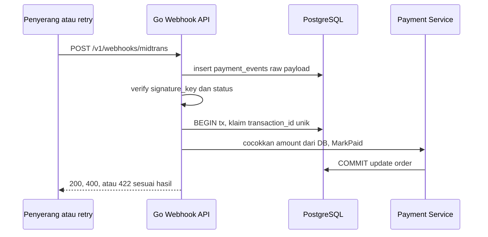
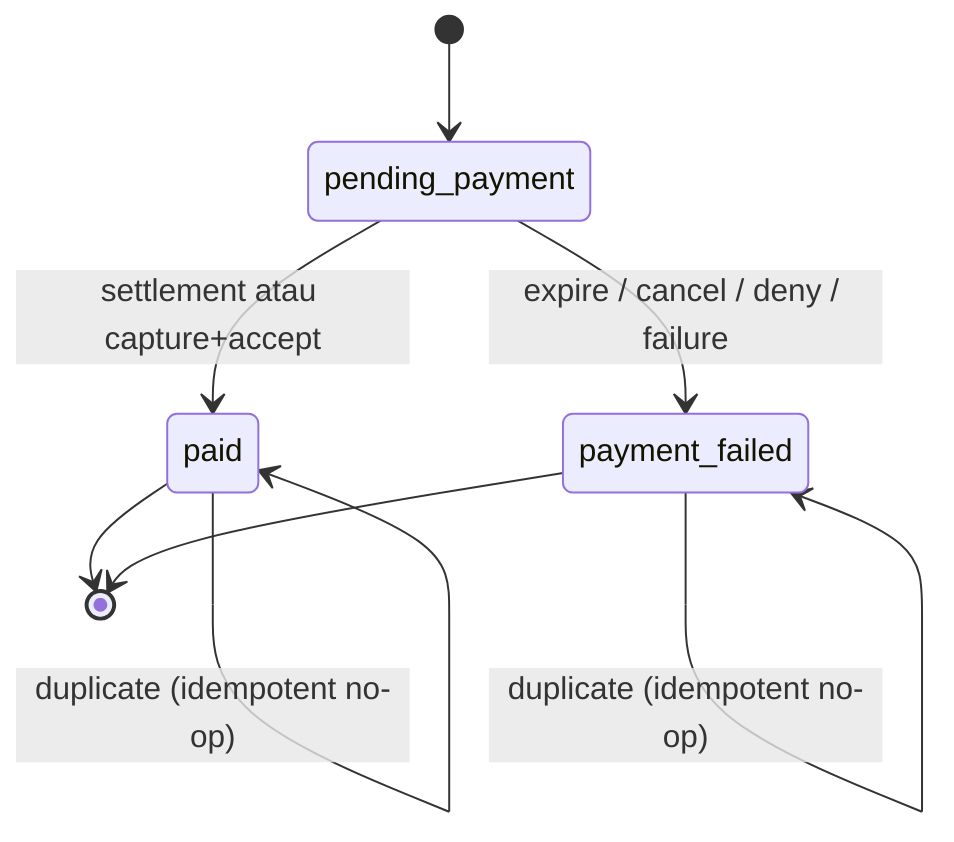
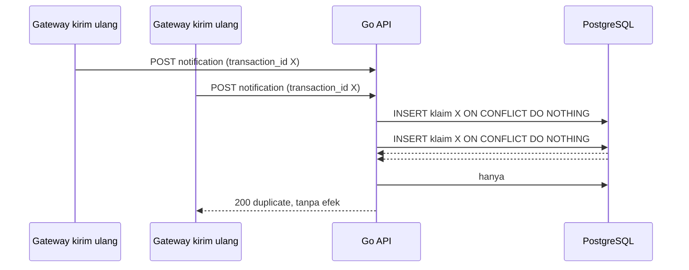
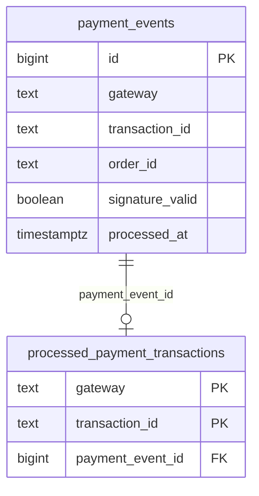
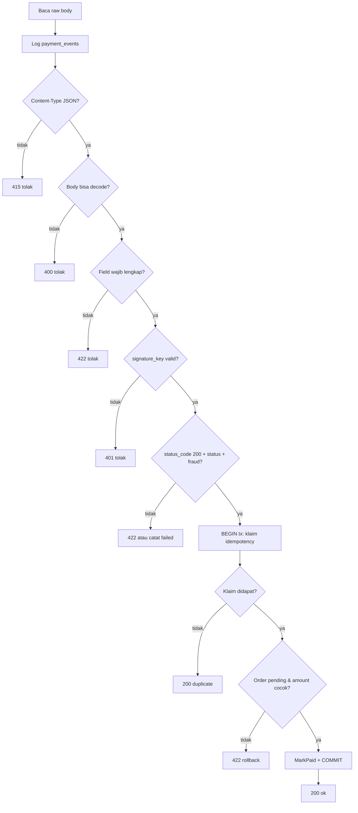

import { Section, Box, Steps, Step, Recap, CardGrid, Card, Chip, Hero, Compare, FileTree, Endpoint, Def } from "@components";

<Hero eyebrow="Roadmap 7 &middot; Security" title="Keamanan Webhook Pembayaran<br /><em>Verifikasi Sebelum Percaya</em>">
  <p>Webhook payment adalah pintu masuk perubahan status order, jadi setiap byte harus dicurigai sampai terbukti valid.</p>
  <Fragment slot="meta">
    <Chip icon="code">Bahasa: <b>Go 1.26</b></Chip>
    <Chip icon="shield">Domain: <b>payment</b></Chip>
    <Chip icon="clock">~70 menit baca</Chip>
  </Fragment>
</Hero>

<Section num="01" id="intro" title="Webhook Pembayaran Menyangkut Uang" sub="Route kecil, risiko besar">

<p class="lead">Di online shop skincare, webhook pembayaran mengubah order dari `pending_payment` menjadi `paid`, mengurangi stok reserved, dan bisa memicu invoice.</p>

Di frontend React, event biasanya datang dari user. Di webhook payment, event datang dari sistem luar seperti gateway pembayaran. Masalahnya, siapa pun di internet bisa mengirim `POST` ke endpoint publik kalau URL bocor atau bisa ditebak. Karena itu handler webhook tidak boleh hanya `json.Unmarshal` lalu update order.

Di Laravel, kamu mungkin terbiasa memakai middleware, `Request::validate`, dan service provider SDK payment. Di Go, kita tetap bisa rapi, tetapi keputusan keamanan dibuat eksplisit di handler, service, dan repository.

<Box variant="bridge" icon="🌉" label="Jembatan: dari webhook Laravel ke handler Go"><p>Paket seperti Spatie Laravel Webhook Client menyimpan `WebhookCall`, memverifikasi signature, lalu menjalankan job sekali lewat queue. Di Go semua lapis itu (simpan raw call, verifikasi signature, proses sekali) kita rakit eksplisit dengan `http.Handler`, `io.Reader`, dan `context.Context`. Tidak ada sihir, jadi batas body, baca raw payload, verifikasi, dan transaksi database harus kita tulis sendiri.</p></Box>

<Endpoint method="POST" path="/v1/webhooks/midtrans" desc="Terima notification payment, log raw payload, verifikasi signature, lalu proses idempotent" />

<Def term="payment webhook"><p>HTTP request dari gateway pembayaran ke backend kita untuk memberi tahu perubahan status transaksi, misalnya `settlement`, `capture`, `expire`, atau `refund`.</p></Def>

</Section>

<Section num="02" id="threat-model" title="Threat Model Webhook" sub="Apa yang bisa salah bila webhook dipercaya mentah-mentah">

<p class="lead">Threat model membantu kita menulis kode defensif tanpa paranoid berlebihan.</p>

Webhook payment punya risiko berbeda dari endpoint customer biasa. Customer tidak boleh bisa membuat order orang lain menjadi `paid`, penyerang tidak boleh bisa mengulang event lama, dan bug retry dari gateway tidak boleh membuat stok berkurang dua kali.

<CardGrid cols={3}>
  <Card><h4>Forged webhook</h4><p>Penyerang mengirim payload palsu berisi `transaction_status=settlement` agar order dianggap lunas.</p></Card>
  <Card><h4>Replay attack</h4><p>Payload lama yang valid dikirim ulang untuk memicu proses berulang.</p></Card>
  <Card><h4>Duplicate delivery</h4><p>Gateway mengirim notification yang sama lebih dari sekali karena retry atau jaringan tidak stabil.</p></Card>
  <Card><h4>Amount tampering</h4><p>Payload mengaku amount tertentu, padahal total order resmi ada di database kita.</p></Card>
  <Card><h4>Log kosong</h4><p>Webhook gagal divalidasi tetapi tidak tercatat, sehingga investigasi dispute sulit.</p></Card>
  <Card><h4>Status salah</h4><p>Handler menganggap semua `status_code=200` sebagai paid tanpa melihat `transaction_status` dan `fraud_status`.</p></Card>
  <Card><h4>Payload malformed</h4><p>Body kosong, bukan JSON, `Content-Type` salah, atau field wajib hilang, tetapi handler tetap mencoba memprosesnya.</p></Card>
  <Card><h4>Klaim hangus</h4><p>Idempotency diklaim sebelum order ter-update, lalu crash, sehingga retry sah ditolak sebagai duplicate.</p></Card>
  <Card><h4>Out of order</h4><p>Notifikasi `settlement` tiba sebelum `pending`, sehingga keputusan dari satu event saja bisa keliru.</p></Card>
</CardGrid>



<p class="fig-cap"><b>Gambar 1.</b> Semua webhook dicatat dulu, tetapi hanya event valid dan belum pernah diproses yang boleh mengubah order, dan perubahan itu terjadi dalam satu transaksi.</p>

<Box variant="warn" icon="⚠️" label="Jangan jadikan webhook sebagai trust boundary"><p>Webhook adalah input publik. Signature valid hanya membuktikan payload cocok dengan secret atau server key, bukan otomatis membuktikan semua field aman untuk dipakai sebagai sumber kebenaran bisnis.</p></Box>

</Section>

<Section num="03" id="signature-verification" title="Signature Verification" sub="HMAC raw body umum, Midtrans punya formula concat khusus">

<p class="lead">Signature verification memastikan payload berasal dari pihak yang tahu secret, bukan dari orang yang sekadar tahu URL webhook.</p>

Ada dua pola besar di lapangan, dan modul ini sengaja memisahkannya agar tidak tercampur. Pola pertama adalah HMAC atas raw body (kadang plus timestamp) memakai secret bersama. Pola kedua adalah formula concat khusus seperti Midtrans, yang menghitung hash dari beberapa field hasil decode, bukan dari raw body.

#### Pola umum: HMAC atas raw body

Banyak gateway (gaya Stripe atau gateway internal) menandatangani raw body dengan HMAC. Di Go, gunakan package standard library [`crypto/hmac`](https://pkg.go.dev/crypto/hmac) dan [`crypto/sha512`](https://pkg.go.dev/crypto/sha512). Yang krusial: signature dihitung dari byte body yang persis sama dengan yang dikirim, jadi kita harus membaca raw body sebelum decode JSON apa pun.

<Box variant="bridge" icon="🌉" label="Jembatan: Stripe constructEvent butuh raw body"><p>Di Node, `stripe.webhooks.constructEvent(rawBody, sig, secret)` WAJIB menerima raw body, bukan objek hasil `JSON.parse`. Banyak bug muncul karena `express.json()` sudah mengonsumsi dan mengubah body sebelum verifikasi. Padanan jebakan itu di Go: jangan pasang middleware yang membaca `r.Body` lebih dulu, panggil `io.ReadAll` sendiri sebelum `json.Unmarshal`.</p></Box>

#### Midtrans: SHA512 dari field hasil decode

Midtrans berbeda. Untuk HTTP notification, `signature_key` dihitung sebagai SHA512 dari gabungan `order_id`, `status_code`, `gross_amount`, dan `ServerKey`, sesuai dokumentasi resmi Midtrans tentang [HTTP Notification Webhooks](https://docs.midtrans.com/docs/https-notification-webhooks). Outputnya hex lowercase sepanjang 128 karakter. Karena formula ini memakai field, bukan raw body, ada ketegangan kecil: kita tetap log raw body dulu untuk audit, lalu decode untuk mendapat field, baru hitung ulang signature.

<Compare aLabel="Gateway umum: HMAC raw body" bLabel="Midtrans: SHA512 concat field" aTone="blue" bTone="violet">
  <Fragment slot="a"><ul><li>Payload yang ditandatangani adalah raw body (kadang plus timestamp).</li><li>Secret key dipakai sebagai key HMAC, output dibandingkan timing-safe.</li><li>Replay protection bisa kuat bila timestamp ikut ditandatangani.</li></ul></Fragment>
  <Fragment slot="b"><ul><li>Input hash adalah `order_id + status_code + gross_amount + ServerKey`.</li><li>`ServerKey` tetap rahasia dan tidak boleh masuk frontend.</li><li>Midtrans tidak mengirim header HMAC atau timestamp signed, jadi replay dijaga idempotency.</li></ul></Fragment>
</Compare>

```go title="internal/payment/webhook_security.go"
package payment

import (
	"crypto/hmac"
	"crypto/sha512"
	"encoding/hex"
	"errors"
	"fmt"
	"strconv"
	"strings"
	"time"
)

var (
	ErrMissingTimestamp = errors.New("missing webhook timestamp")
	ErrStaleWebhook     = errors.New("stale webhook")
	ErrFutureWebhook    = errors.New("webhook timestamp is too far in the future")
)

// VerifyMidtransSignature memverifikasi signature_key Midtrans.
// Formula dari dokumentasi notifikasi Midtrans:
// SHA512(order_id + status_code + gross_amount + server_key), output hex lowercase.
func VerifyMidtransSignature(orderID, statusCode, grossAmount, signatureKey, serverKey string) bool {
	if orderID == "" || statusCode == "" || grossAmount == "" || signatureKey == "" || serverKey == "" {
		return false
	}

	message := orderID + statusCode + grossAmount + serverKey
	sum := sha512.Sum512([]byte(message))

	expected := make([]byte, hex.EncodedLen(len(sum)))
	hex.Encode(expected, sum[:])

	// Normalkan input dari Midtrans: trim spasi dan paksa lowercase agar
	// perbandingan adil melawan hex lowercase hasil hitungan kita.
	provided := []byte(strings.ToLower(strings.TrimSpace(signatureKey)))

	// hmac.Equal adalah pembungkus subtle.ConstantTimeCompare, jadi
	// perbandingan dua digest sepanjang sama bersifat timing-safe.
	return hmac.Equal(provided, expected)
}

// VerifyHMACSHA512 memverifikasi pola signature gateway generik.
// Message yang ditandatangani adalah "timestamp.rawBody" sehingga timestamp
// tidak bisa diedit diam-diam. Ini BUKAN jalur Midtrans.
func VerifyHMACSHA512(rawBody []byte, timestamp, providedSignature, secret string) bool {
	if len(rawBody) == 0 || timestamp == "" || providedSignature == "" || secret == "" {
		return false
	}

	mac := hmac.New(sha512.New, []byte(secret))
	mac.Write([]byte(timestamp))
	mac.Write([]byte("."))
	mac.Write(rawBody)
	expected := mac.Sum(nil)

	provided, err := hex.DecodeString(strings.TrimSpace(providedSignature))
	if err != nil {
		return false
	}

	return hmac.Equal(provided, expected)
}

// VerifyFreshTimestamp menolak webhook yang di luar skew untuk gateway yang
// menandatangani timestamp. Untuk Midtrans, fungsi ini TIDAK dipakai.
func VerifyFreshTimestamp(timestamp string, now time.Time, maxSkew time.Duration) error {
	if timestamp == "" {
		return ErrMissingTimestamp
	}

	sec, err := strconv.ParseInt(timestamp, 10, 64)
	if err != nil {
		return fmt.Errorf("parse webhook timestamp: %w", err)
	}

	eventTime := time.Unix(sec, 0)
	if now.Sub(eventTime) > maxSkew {
		return ErrStaleWebhook
	}
	if eventTime.Sub(now) > maxSkew {
		return ErrFutureWebhook
	}

	return nil
}
```

<Box variant="bridge" icon="🌉" label="Jembatan: kenapa bukan == untuk membandingkan signature"><p>Di Node ada `crypto.timingSafeEqual(a, b)`, padanan langsung dari `hmac.Equal` dan `subtle.ConstantTimeCompare` di Go. Perbandingan string biasa (`==`) berhenti di byte pertama yang berbeda, sehingga durasinya bocor dan bisa dipakai menebak signature byte demi byte. Versi constant-time selalu memeriksa seluruh panjang.</p></Box>

Contoh unit test memastikan formula benar, memakai server key dummy. Vektor ini juga jadi alat verifikasi cepat saat integrasi.

```go title="internal/payment/webhook_security_test.go"
package payment

import (
	"crypto/sha512"
	"encoding/hex"
	"testing"
)

func TestVerifyMidtransSignature(t *testing.T) {
	const serverKey = "SB-Mid-server-DUMMYKEY1234567890"
	orderID := "INV-20260606-0001"
	statusCode := "200"
	grossAmount := "250000.00"

	// Hitung signature yang sah seperti yang dilakukan Midtrans.
	sum := sha512.Sum512([]byte(orderID + statusCode + grossAmount + serverKey))
	validSig := hex.EncodeToString(sum[:])

	if !VerifyMidtransSignature(orderID, statusCode, grossAmount, validSig, serverKey) {
		t.Fatal("signature valid seharusnya diterima")
	}

	// Ubah satu byte amount: signature lama harus ditolak.
	if VerifyMidtransSignature(orderID, statusCode, "1000.00", validSig, serverKey) {
		t.Fatal("amount diubah seharusnya menolak signature lama")
	}

	// Field kosong selalu ditolak.
	if VerifyMidtransSignature("", statusCode, grossAmount, validSig, serverKey) {
		t.Fatal("order_id kosong seharusnya ditolak")
	}
}
```

<Box variant="tip" icon="💡" label="Prinsip perbandingan signature"><p>Hitung ulang signature di server, normalkan formatnya (hex lowercase untuk Midtrans), lalu bandingkan memakai `hmac.Equal`, bukan `==`.</p></Box>

</Section>

<Section num="04" id="replay-protection" title="Replay Protection" sub="Payload valid tidak selalu payload baru">

<p class="lead">Replay protection mencegah payload lama yang pernah valid dipakai ulang untuk memicu efek bisnis baru.</p>

Untuk gateway yang mengirim timestamp yang ikut ditandatangani, tolak webhook yang lebih tua dari 5 menit. Lima menit cukup ketat untuk kebanyakan callback payment, tetapi tetap sesuaikan dengan SLA gateway dan pola retry mereka.

Untuk Midtrans, kenyataannya lebih sederhana sekaligus lebih menuntut. Midtrans tidak mengirim header HMAC maupun timestamp yang ditandatangani, dan formula `signature_key` tidak memasukkan waktu. Artinya kita tidak bisa mengandalkan freshness timestamp sama sekali. Replay protection untuk Midtrans sepenuhnya bersandar pada idempotency dan, bila notifikasi tampak datang tidak berurutan, verifikasi status langsung ke Midtrans.

<Def term="replay attack"><p>Serangan ketika payload yang valid dikirim ulang setelah waktu aslinya, biasanya untuk memicu side effect kedua kali.</p></Def>

<Box variant="note" icon="🔁" label="Kapan re-fetch status dari gateway"><p>Midtrans menyebut kasus langka di mana `settlement` tiba sebelum `pending`. Bila urutan event meragukan atau ada selisih dengan state lokal, panggil GET Status API Midtrans untuk `order_id` itu dan pakai status terbaru dari respons resmi, bukan dari payload notifikasi yang mungkin out of order.</p></Box>



<p class="fig-cap"><b>Gambar 2.</b> Transisi order yang dikunci modul ini. `MarkPaid` pada order yang sudah `paid` adalah no-op, sehingga duplicate aman.</p>

<Box variant="warn" icon="⚠️" label="Timestamp yang tidak signed bukan replay protection"><p>Kalau timestamp tidak ikut signature, penyerang yang punya payload valid lama bisa mengganti timestamp agar terlihat baru. Jangan jadikan field seperti itu sebagai satu-satunya perlindungan. Untuk Midtrans, gabungan idempotency dan guard transisi status adalah lapisan yang nyata.</p></Box>

</Section>

<Section num="05" id="logging-idempotency" title="Logging dan Idempotency" sub="Catat semua, proses sekali saja">

<p class="lead">Webhook yang buruk tetap harus meninggalkan jejak, tetapi hanya webhook yang valid dan unik yang boleh mengubah state order.</p>

Requirement pentingnya adalah log semua webhook masuk sebelum validasi. Ini berbeda dari kebiasaan hanya mencatat request sukses. Untuk dispute payment, fraud investigation, dan debugging gateway, payload invalid sering justru paling berharga.

#### Apa yang layak di-log untuk audit

Tabel `payment_events` menyimpan jejak observasi mentah. Untuk dispute dan investigasi, catat: gateway, raw payload, `order_id` dan `transaction_id` hasil decode, IP sumber, ringkasan header signature, hasil verifikasi (`signature_valid`), kode HTTP yang kita balas, durasi proses, dan kapan diproses. Jangan menyaring sebelum mencatat. Soal retensi dan PII: Midtrans tidak mengirim nomor kartu penuh (PAN), tetapi prinsipnya tegas, jangan pernah menyimpan PAN, CVV, atau data sensitif lain di log, dan terapkan retensi terbatas plus akses terkontrol pada tabel audit.

Selain tabel DB, log terstruktur dengan `log/slog` (standard library) memudahkan pencarian saat insiden. Catat keputusan, bukan hanya kejadian.

```go title="internal/payment/logging.go"
package payment

import (
	"context"
	"log/slog"
)

// logDecision mencatat keputusan webhook secara terstruktur untuk audit cepat.
// Tidak ada raw payload di sini agar tidak membocorkan data sensitif ke log
// aplikasi; raw payload cukup di tabel payment_events dengan akses terbatas.
func logDecision(ctx context.Context, logger *slog.Logger, gateway, orderID string, eventID int64, signatureValid bool, httpStatus int, decision string) {
	logger.LogAttrs(ctx, slog.LevelInfo, "webhook_decision",
		slog.String("gateway", gateway),
		slog.String("order_id", orderID),
		slog.Int64("event_id", eventID),
		slog.Bool("signature_valid", signatureValid),
		slog.Int("http_status", httpStatus),
		slog.String("decision", decision),
	)
}
```

#### Idempotency: pilih key dengan sadar

Best practice Midtrans menyarankan memakai `order_id` sebagai kunci pelacakan idempotency. `transaction_id` juga unik, tetapi ada jebakan: satu `order_id` bisa menghasilkan beberapa `transaction_id`, misalnya pelanggan membayar ulang setelah attempt pertama expire. Kalau dedup hanya pada `transaction_id`, dua event sukses untuk order yang sama bisa lolos.

Solusi yang aman adalah dua lapis. Lapis pertama: dedup event pada `transaction_id` agar pengiriman ulang persis dari gateway tidak diproses dua kali. Lapis kedua: guard transisi status pada order, yaitu `MarkPaid` harus idempotent dan jadi no-op bila order sudah `paid`. Lapis kedua inilah yang menutup kasus dua `transaction_id` berbeda untuk satu order.

<Box variant="bridge" icon="🌉" label="Jembatan: Idempotency-Key Stripe ke unique constraint Postgres"><p>Saat memanggil Stripe API, kamu mengirim header `Idempotency-Key` dan Stripe menjamin pemrosesan sekali di sisi mereka. Untuk webhook masuk, kita yang jadi penjamin. Padanannya di Go bukan cek-di-aplikasi (race-prone), melainkan unique constraint database: `INSERT ... ON CONFLICT (gateway, transaction_id) DO NOTHING`. Database, bukan kode aplikasi, yang memutuskan siapa pemenang klaim.</p></Box>



<p class="fig-cap"><b>Gambar 3.</b> Dua pengiriman bersamaan masuk ke INSERT yang sama. Unique constraint memastikan hanya satu yang menang, jadi race tertutup di lapisan DB.</p>

<FileTree title="Struktur domain payment untuk webhook" tree={`
internal/
  payment/
    webhook_handler.go       # HTTP handler untuk callback Midtrans
    webhook_security.go      # signature Midtrans, HMAC generik, timestamp
    logging.go               # structured logging keputusan webhook
    service.go               # business logic payment status
    repository.go            # log event, idempotency claim, transaksi
    model.go                 # payload dan domain type payment
  order/
    repository.go            # update order paid dalam transaksi yang sama
migrations/
  007_payment_webhook_security.sql
`} />

```sql title="migrations/007_payment_webhook_security.sql"
CREATE TABLE payment_events (
    id BIGSERIAL PRIMARY KEY,
    gateway TEXT NOT NULL,
    transaction_id TEXT,
    order_id TEXT,
    source_ip TEXT,
    received_at TIMESTAMPTZ NOT NULL DEFAULT now(),
    signature_valid BOOLEAN,
    http_status INTEGER,
    validation_error TEXT,
    raw_payload TEXT NOT NULL,
    processed_at TIMESTAMPTZ
);

CREATE INDEX idx_payment_events_gateway_received_at
    ON payment_events (gateway, received_at DESC);

CREATE INDEX idx_payment_events_order_id
    ON payment_events (order_id);

-- Tabel klaim idempotency terpisah dari audit log.
-- Unique key memastikan satu transaction_id hanya diproses sekali.
CREATE TABLE processed_payment_transactions (
    gateway TEXT NOT NULL,
    transaction_id TEXT NOT NULL,
    payment_event_id BIGINT NOT NULL REFERENCES payment_events(id),
    created_at TIMESTAMPTZ NOT NULL DEFAULT now(),
    PRIMARY KEY (gateway, transaction_id)
);
```



<p class="fig-cap"><b>Gambar 4.</b> `payment_events` adalah audit (boleh duplicate), `processed_payment_transactions` adalah klaim (unique per gateway+transaction_id).</p>

```go title="internal/payment/repository.go"
package payment

import (
	"context"
	"errors"

	"github.com/jackc/pgx/v5"
	"github.com/jackc/pgx/v5/pgxpool"
)

type Repository struct {
	pool *pgxpool.Pool
}

func NewRepository(pool *pgxpool.Pool) *Repository {
	return &Repository{pool: pool}
}

type PaymentEventLog struct {
	Gateway    string
	SourceIP   string
	RawPayload []byte
}

func (r *Repository) InsertPaymentEvent(ctx context.Context, event PaymentEventLog) (int64, error) {
	const query = `
		INSERT INTO payment_events (gateway, source_ip, raw_payload)
		VALUES ($1, NULLIF($2, ''), $3)
		RETURNING id
	`

	var id int64
	err := r.pool.QueryRow(ctx, query, event.Gateway, event.SourceIP, string(event.RawPayload)).Scan(&id)
	if err != nil {
		return 0, err
	}

	return id, nil
}

func (r *Repository) MarkValidation(ctx context.Context, eventID int64, transactionID, orderID string, signatureValid bool, httpStatus int, validationErr string) error {
	const query = `
		UPDATE payment_events
		SET transaction_id = NULLIF($2, ''),
		    order_id = NULLIF($3, ''),
		    signature_valid = $4,
		    http_status = $5,
		    validation_error = NULLIF($6, '')
		WHERE id = $1
	`

	_, err := r.pool.Exec(ctx, query, eventID, transactionID, orderID, signatureValid, httpStatus, validationErr)
	return err
}
```

<Box variant="note" icon="🧾" label="Audit log bukan business table"><p>`payment_events` adalah catatan observasi dari luar. Status order resmi tetap berada di tabel order dan payment internal yang dikontrol service, dan diubah hanya di dalam transaksi yang juga mengklaim idempotency.</p></Box>

</Section>

<Section num="06" id="handler-webhook" title="Handler Webhook yang Aman" sub="Urutan validasi menentukan keamanan">

<p class="lead">Handler Midtrans yang aman membaca raw body sekali, log payload, validasi `Content-Type` dan ukuran, decode, verifikasi `signature_key`, cek `status_code` plus status, lalu klaim idempotency dan update order dalam SATU transaksi.</p>

Gunakan [`http.MaxBytesReader`](https://pkg.go.dev/net/http#MaxBytesReader) untuk membatasi request body. Batas 1 MiB lebih dari cukup untuk JSON payment dan mencegah client membuang resource server. Kalau body melewati batas, `io.ReadAll` mengembalikan `*http.MaxBytesError`, dan kita balas `413` yang akurat.

Perhatikan tiga keputusan desain penting di handler ini. Pertama, tidak ada `VerifyFreshTimestamp` atau `VerifyHMACSHA512` di jalur Midtrans, karena Midtrans tidak mengirim header itu, sehingga memaksakannya akan menolak webhook asli. Kedua, klaim idempotency dan update order dijalankan dalam satu transaksi `pgx` lewat `service.ProcessMidtransNotification`, jadi crash di tengah tidak meninggalkan klaim hangus. Ketiga, keputusan `paid` mengecek `status_code == "200"` bersama `transaction_status` dan `fraud_status`, bukan hanya satu field.

```go title="internal/payment/webhook_handler.go"
package payment

import (
	"encoding/json"
	"errors"
	"io"
	"log/slog"
	"net/http"
	"strings"
)

const maxWebhookBodySize = 1 << 20 // 1 MiB

type WebhookHandler struct {
	repo              *Repository
	service           *Service
	midtransServerKey string
	logger            *slog.Logger
}

func NewWebhookHandler(repo *Repository, service *Service, midtransServerKey string, logger *slog.Logger) *WebhookHandler {
	return &WebhookHandler{
		repo:              repo,
		service:           service,
		midtransServerKey: midtransServerKey,
		logger:            logger,
	}
}

type MidtransNotification struct {
	OrderID           string `json:"order_id"`
	StatusCode        string `json:"status_code"`
	GrossAmount       string `json:"gross_amount"`
	SignatureKey      string `json:"signature_key"`
	TransactionID     string `json:"transaction_id"`
	TransactionStatus string `json:"transaction_status"`
	FraudStatus       string `json:"fraud_status"`
}

func (h *WebhookHandler) HandleMidtransWebhook(w http.ResponseWriter, r *http.Request) {
	ctx := r.Context()

	// Tolak Content-Type yang bukan JSON sebelum membaca body.
	if ct := r.Header.Get("Content-Type"); !strings.HasPrefix(ct, "application/json") {
		http.Error(w, "unsupported media type", http.StatusUnsupportedMediaType)
		return
	}

	r.Body = http.MaxBytesReader(w, r.Body, maxWebhookBodySize)
	raw, err := io.ReadAll(r.Body)
	if err != nil {
		var tooLarge *http.MaxBytesError
		if errors.As(err, &tooLarge) {
			http.Error(w, "request body too large", http.StatusRequestEntityTooLarge)
			return
		}
		http.Error(w, "failed to read body", http.StatusBadRequest)
		return
	}

	// Log raw payload SEBELUM validasi apa pun, demi audit dan dispute.
	eventID, err := h.repo.InsertPaymentEvent(ctx, PaymentEventLog{
		Gateway:    "midtrans",
		SourceIP:   clientIP(r),
		RawPayload: raw,
	})
	if err != nil {
		http.Error(w, "failed to log webhook", http.StatusInternalServerError)
		return
	}

	reject := func(status int, transactionID, orderID, reason string) {
		_ = h.repo.MarkValidation(ctx, eventID, transactionID, orderID, false, status, reason)
		logDecision(ctx, h.logger, "midtrans", orderID, eventID, false, status, reason)
		http.Error(w, reason, status)
	}

	if len(raw) == 0 {
		reject(http.StatusBadRequest, "", "", "empty body")
		return
	}

	var payload MidtransNotification
	if err := json.Unmarshal(raw, &payload); err != nil {
		reject(http.StatusBadRequest, "", "", "invalid json")
		return
	}

	// Field wajib harus ada sebelum kita repotkan signature.
	if payload.OrderID == "" || payload.TransactionID == "" || payload.TransactionStatus == "" {
		reject(http.StatusUnprocessableEntity, payload.TransactionID, payload.OrderID, "missing required fields")
		return
	}

	if !VerifyMidtransSignature(payload.OrderID, payload.StatusCode, payload.GrossAmount, payload.SignatureKey, h.midtransServerKey) {
		// 401: payload tidak terbukti dari Midtrans. Jangan retry.
		reject(http.StatusUnauthorized, payload.TransactionID, payload.OrderID, "invalid signature")
		return
	}

	// Mulai sini signature terbukti sah. Serahkan klaim idempotency dan
	// update order ke service yang membungkusnya dalam satu transaksi.
	result, err := h.service.ProcessMidtransNotification(ctx, payload, eventID)
	if err != nil {
		// Error sementara (DB down): minta gateway retry dengan 5xx.
		_ = h.repo.MarkValidation(ctx, eventID, payload.TransactionID, payload.OrderID, true, http.StatusInternalServerError, err.Error())
		logDecision(ctx, h.logger, "midtrans", payload.OrderID, eventID, true, http.StatusInternalServerError, "transient error")
		http.Error(w, "temporary error, please retry", http.StatusInternalServerError)
		return
	}

	status := result.HTTPStatus()
	_ = h.repo.MarkValidation(ctx, eventID, payload.TransactionID, payload.OrderID, true, status, string(result))
	logDecision(ctx, h.logger, "midtrans", payload.OrderID, eventID, true, status, string(result))
	w.WriteHeader(status)
	_, _ = w.Write([]byte(result))
}

func clientIP(r *http.Request) string {
	if fwd := r.Header.Get("X-Forwarded-For"); fwd != "" {
		if i := strings.IndexByte(fwd, ','); i >= 0 {
			return strings.TrimSpace(fwd[:i])
		}
		return strings.TrimSpace(fwd)
	}
	return r.RemoteAddr
}
```

<Box variant="warn" icon="⚠️" label="Jangan balas 5xx untuk error bisnis"><p>Balas `5xx` hanya untuk kegagalan sementara yang ingin di-retry gateway, misalnya database sedang down. Untuk hasil yang tidak berubah dengan retry (duplicate, amount mismatch, order tidak valid), balas `2xx` atau `4xx` non-retryable agar gateway berhenti mengirim ulang.</p></Box>

</Section>

<Section num="07" id="amount-dari-database" title="Amount Harus dari Database" sub="Webhook memberi sinyal, bukan sumber kebenaran uang">

<p class="lead">Payload gateway boleh dipakai untuk verifikasi dan pencocokan, tetapi amount resmi harus berasal dari order yang kita buat sendiri, dan klaim idempotency plus update order harus dalam satu transaksi.</p>

Jangan pernah melakukan `order.total = webhook.gross_amount`. Flow yang benar: dalam satu transaksi, klaim `transaction_id`, ambil order berdasarkan `order_id`, pastikan order itu memang ada dan berstatus `pending_payment`, cocokkan amount, lalu `MarkPaid`. Bandingkan amount sebagai integer Rupiah (strip `.00`, parse ke `int64`), bukan sebagai string, agar tahan variasi format seperti `250000.00` versus `250000.0`.

Membungkus semuanya dalam satu transaksi menutup celah klaim hangus: bila update order gagal, transaksi di-rollback dan klaim ikut hilang, sehingga retry sah dari gateway masih bisa memproses order. `MarkPaid` sendiri idempotent dan jadi no-op bila order sudah `paid`, ini menjaga kasus dua `transaction_id` untuk satu order.

```go title="internal/payment/service.go"
package payment

import (
	"context"
	"errors"
	"fmt"
	"net/http"
	"strconv"
	"strings"

	"github.com/jackc/pgx/v5"
	"github.com/jackc/pgx/v5/pgxpool"
)

var (
	ErrPaymentNotAccepted = errors.New("payment status is not accepted")
	ErrAmountMismatch     = errors.New("payment amount does not match order total")
	ErrOrderNotPending    = errors.New("order is not awaiting payment")
)

// Decision adalah hasil bisnis yang dipetakan ke kode HTTP balasan.
type Decision string

const (
	DecisionPaid      Decision = "ok"
	DecisionFailed    Decision = "payment failed recorded"
	DecisionDuplicate Decision = "duplicate ignored"
	DecisionRejected  Decision = "rejected"
)

// HTTPStatus memetakan keputusan bisnis ke kode HTTP yang menghentikan retry
// gateway untuk hasil non-retryable, dan 200 untuk sukses serta duplicate.
func (d Decision) HTTPStatus() int {
	switch d {
	case DecisionPaid, DecisionFailed, DecisionDuplicate:
		return http.StatusOK
	default:
		return http.StatusUnprocessableEntity
	}
}

type Service struct {
	pool *pgxpool.Pool
}

func NewService(pool *pgxpool.Pool) *Service {
	return &Service{pool: pool}
}

// ProcessMidtransNotification menjalankan klaim idempotency dan update order
// dalam SATU transaksi. Bila apa pun gagal, transaksi rollback dan klaim batal.
func (s *Service) ProcessMidtransNotification(ctx context.Context, n MidtransNotification, eventID int64) (Decision, error) {
	tx, err := s.pool.Begin(ctx)
	if err != nil {
		return "", err
	}
	defer func() { _ = tx.Rollback(ctx) }()

	// Klaim idempotency: pemenang dapat baris, duplicate dapat ErrNoRows.
	claimed, err := claimTransaction(ctx, tx, "midtrans", n.TransactionID, eventID)
	if err != nil {
		return "", err
	}
	if !claimed {
		if err := tx.Commit(ctx); err != nil {
			return "", err
		}
		return DecisionDuplicate, nil
	}

	order, err := findPaymentSnapshotForUpdate(ctx, tx, n.OrderID)
	if errors.Is(err, pgx.ErrNoRows) {
		return DecisionRejected, nil // order_id tidak dikenal
	}
	if err != nil {
		return "", err
	}

	// Cocokkan amount sebagai integer Rupiah, bukan string.
	gotRupiah, err := parseGrossAmountRupiah(n.GrossAmount)
	if err != nil || gotRupiah != order.TotalRupiah {
		return DecisionRejected, nil // amount mismatch, tidak retryable
	}

	if !isAccepted(n) {
		if isFailure(n.TransactionStatus) {
			if order.Status == "pending_payment" {
				if err := markPaymentFailed(ctx, tx, n.OrderID, n.TransactionID, n.TransactionStatus); err != nil {
					return "", err
				}
			}
			if err := tx.Commit(ctx); err != nil {
				return "", err
			}
			return DecisionFailed, nil
		}
		return DecisionRejected, nil
	}

	// Guard transisi: MarkPaid idempotent, no-op bila order sudah paid.
	if order.Status == "pending_payment" {
		if err := markPaid(ctx, tx, n.OrderID, n.TransactionID); err != nil {
			return "", err
		}
	}
	if err := tx.Commit(ctx); err != nil {
		return "", err
	}
	return DecisionPaid, nil
}

// isAccepted mengikuti best practice Midtrans: status_code 200 +
// transaction_status settlement/capture + fraud_status accept (atau kosong).
func isAccepted(n MidtransNotification) bool {
	if n.StatusCode != "200" {
		return false
	}
	switch n.TransactionStatus {
	case "settlement":
		return true
	case "capture":
		return n.FraudStatus == "" || n.FraudStatus == "accept"
	default:
		return false
	}
}

func isFailure(status string) bool {
	switch status {
	case "expire", "cancel", "deny", "failure":
		return true
	default:
		return false
	}
}

// parseGrossAmountRupiah mengubah "250000.00" jadi 250000 (int64).
// Hanya valid bila amount selalu Rupiah bulat; bila ada sen, format berbeda.
func parseGrossAmountRupiah(gross string) (int64, error) {
	whole := gross
	if i := strings.IndexByte(gross, '.'); i >= 0 {
		whole = gross[:i]
	}
	return strconv.ParseInt(whole, 10, 64)
}

func formatMidtransGrossAmount(totalRupiah int64) string {
	return fmt.Sprintf("%d.00", totalRupiah)
}
```

<Box variant="bridge" icon="🌉" label="Jembatan: Notification class midtrans-php ke verifikasi eksplisit Go"><p>Paket `midtrans/midtrans-php` punya class `Notification` yang otomatis mengambil status dan memverifikasi signature. Di Go kita tidak menyembunyikan langkah itu: decode field, hitung ulang `signature_key`, cek status, cocokkan amount dari DB, semua terlihat berurutan. Lebih banyak baris, tetapi tidak ada perilaku tersembunyi yang harus ditebak saat dispute.</p></Box>

<Compare aLabel="Salah: percaya payload" bLabel="Benar: payload sebagai bukti cocok" aTone="red" bTone="teal">
  <Fragment slot="a"><ul><li>Ambil `gross_amount` dari webhook lalu jadikan total paid.</li><li>Update order hanya dari `transaction_status` tanpa baca order internal.</li><li>Tidak cek apakah `order_id` milik order valid yang masih `pending_payment`.</li></ul></Fragment>
  <Fragment slot="b"><ul><li>Ambil total resmi dari database berdasarkan `order_id`.</li><li>Cocokkan amount sebagai integer, plus `status_code`, status, dan `fraud_status`.</li><li>Tolak bila order tidak ada atau sudah bukan `pending_payment`.</li></ul></Fragment>
</Compare>

<Box variant="tip" icon="💡" label="Status sukses yang layak diproses"><p>Untuk Midtrans, sukses berarti `status_code` `200` DAN `transaction_status` `settlement` atau `capture`, dengan `fraud_status` kosong atau `accept`. Ketiganya harus benar, bukan salah satu.</p></Box>

<Box variant="note" icon="🧮" label="Catatan amount kanonik"><p>`formatMidtransGrossAmount` benar untuk Rupiah bulat. Untuk ketahanan ekstra, simpan `gross_amount` kanonik dari respons Charge saat checkout, lalu cocokkan dengan itu alih-alih merekonstruksi string. Cara ini selamat bila kelak ada mata uang dengan pecahan sen.</p></Box>

</Section>

<Section num="08" id="taksonomi-penolakan" title="Taksonomi Penolakan dan Kode Status" sub="Bukan semua penolakan sama, dan gateway membaca kode balasan">

<p class="lead">Menolak payload invalid bukan sekadar mengembalikan error, tetapi memilih kode status yang benar agar gateway tahu harus retry atau berhenti.</p>

Kode HTTP yang kita balas bukan hanya kosmetik. Banyak gateway memutuskan retry berdasarkan kode itu. Aturan praktisnya: `5xx` mengundang retry (pakai hanya untuk kegagalan sementara), sedangkan `2xx` dan sebagian besar `4xx` memberi tahu gateway untuk berhenti. Duplicate dibalas `200` justru agar gateway tenang.

<div class="tbl-wrap">
<table>
<thead><tr><th>Kondisi</th><th>Kode</th><th>Retry gateway?</th><th>Alasan</th></tr></thead>
<tbody>
<tr><td>Content-Type bukan JSON</td><td>415</td><td>Tidak</td><td>Request salah bentuk, retry tak menolong.</td></tr>
<tr><td>Body melebihi 1 MiB</td><td>413</td><td>Tidak</td><td>Payload tak masuk akal untuk notifikasi payment.</td></tr>
<tr><td>Body kosong atau JSON rusak</td><td>400</td><td>Tidak</td><td>Tidak bisa di-decode, payload cacat.</td></tr>
<tr><td>Field wajib hilang</td><td>422</td><td>Tidak</td><td>Bentuk benar, isi tidak lengkap.</td></tr>
<tr><td>Signature tidak valid</td><td>401</td><td>Tidak</td><td>Tidak terbukti dari gateway, jangan diproses.</td></tr>
<tr><td>Amount mismatch / order tak valid</td><td>422</td><td>Tidak</td><td>Keputusan bisnis final, retry tak mengubah hasil.</td></tr>
<tr><td>Duplicate (sudah diproses)</td><td>200</td><td>Tidak</td><td>Idempotent, akui terima tanpa efek baru.</td></tr>
<tr><td>Sukses diproses</td><td>200</td><td>Tidak</td><td>Order ter-update, selesai.</td></tr>
<tr><td>Database down sementara</td><td>500</td><td>Ya</td><td>Kegagalan transien, retry diinginkan.</td></tr>
</tbody>
</table>
</div>

<p class="fig-cap"><b>Tabel 1.</b> Peta kondisi ke kode status dan ekspektasi retry. Sebagian gateway tetap retry pada `4xx`, jadi idempotency wajib bukan opsional.</p>



<p class="fig-cap"><b>Gambar 5.</b> Pipeline validasi webhook Midtrans. Urutan ini yang menentukan keamanan: log dulu, murahan dulu, baru kerja berat di dalam transaksi.</p>

<Box variant="warn" icon="⚠️" label="Membalas 4xx bukan jaminan gateway berhenti"><p>Beberapa gateway tetap retry untuk `4xx` tertentu. Karena itu kode status adalah sinyal, bukan kontrol mutlak. Pertahanan sebenarnya tetap idempotency, sehingga retry apa pun aman tanpa efek ganda.</p></Box>

</Section>

<Section num="09" id="hands-on" title="Hands-on Ringan" sub="Simulasikan valid, duplicate, invalid, dan field hilang">

<p class="lead">Latihan ini membuat kamu melihat bahwa response HTTP saja tidak cukup, state database harus ikut diperiksa.</p>

<Steps>
  <Step><b>Buat order pending</b><p>Insert order `INV-20260606-0001` dengan total resmi `250000` dan status `pending_payment`.</p></Step>
  <Step><b>Kirim webhook valid</b><p>Hitung `signature_key` dari `order_id`, `status_code`, `gross_amount`, dan server key sandbox, lalu kirim. Order harus jadi `paid`.</p></Step>
  <Step><b>Kirim ulang payload yang sama</b><p>Pastikan response `200 duplicate ignored`, baris `payment_events` bertambah, tetapi order tidak diproses ulang.</p></Step>
  <Step><b>Ubah amount</b><p>Ubah `gross_amount` menjadi `1000.00` tanpa menyesuaikan signature, handler harus menolak `401` karena signature gagal.</p></Step>
  <Step><b>Hapus field wajib</b><p>Kirim payload tanpa `transaction_id`, handler harus return `422` dan tidak menyentuh order.</p></Step>
</Steps>

```json title="testdata/midtrans_settlement.json"
{
  "order_id": "INV-20260606-0001",
  "status_code": "200",
  "gross_amount": "250000.00",
  "signature_key": "ganti-dengan-hash-sha512-valid",
  "transaction_id": "0c8b481d-8b99-4c6a-b735-aec18be92f28",
  "transaction_status": "settlement",
  "fraud_status": "accept"
}
```

```bash title="Terminal"
# Hitung signature_key Midtrans: SHA512(order_id + status_code + gross_amount + server_key)
export MIDTRANS_SERVER_KEY="SB-Mid-server-DUMMYKEY1234567890"
SIG=$(printf "%s%s%s%s" "INV-20260606-0001" "200" "250000.00" "$MIDTRANS_SERVER_KEY" \
  | openssl dgst -sha512 | awk '{print $2}')

# Sisipkan signature ke payload lalu kirim
jq --arg sig "$SIG" '.signature_key = $sig' testdata/midtrans_settlement.json \
  | curl -i -X POST http://localhost:8080/v1/webhooks/midtrans \
      -H "Content-Type: application/json" \
      --data-binary @-
```

```sql title="debug_payment_events.sql"
SELECT id, gateway, transaction_id, order_id, signature_valid, http_status, processed_at
FROM payment_events
ORDER BY id DESC
LIMIT 10;

SELECT gateway, transaction_id, payment_event_id, created_at
FROM processed_payment_transactions
ORDER BY created_at DESC
LIMIT 10;
```

<Box variant="note" icon="🧪" label="Test yang sebaiknya ada"><p>Tambahkan unit test untuk `VerifyMidtransSignature`, `parseGrossAmountRupiah`, klaim duplicate dalam satu transaksi, service yang menolak amount mismatch, dan service yang no-op saat order sudah `paid`.</p></Box>

</Section>

<Section num="10" id="jebakan-umum" title="Jebakan Umum" sub="Kesalahan kecil yang bisa jadi kerugian besar">

<p class="lead">Banyak bug webhook bukan karena algoritma sulit, tetapi karena urutan kerja dan asumsi trust yang salah.</p>

<CardGrid cols={2}>
  <Card><h4>Memakai `==` untuk signature</h4><p>Gunakan `hmac.Equal` agar perbandingan tidak membocorkan timing information.</p></Card>
  <Card><h4>Decode JSON sebelum simpan raw payload</h4><p>Kalau JSON rusak, kamu tetap perlu bukti request yang masuk untuk audit.</p></Card>
  <Card><h4>Unique constraint di tabel log</h4><p>`payment_events` harus bisa menyimpan duplicate. Unique idempotency taruh di tabel klaim terpisah.</p></Card>
  <Card><h4>Pakai amount webhook sebagai total paid</h4><p>Amount webhook hanya untuk pencocokan. Total resmi order berasal dari snapshot checkout di database.</p></Card>
  <Card><h4>Klaim idempotency commit sebelum update order</h4><p>Bila crash setelah klaim tetapi sebelum update, retry sah ditolak sebagai duplicate. Bungkus keduanya dalam satu transaksi.</p></Card>
  <Card><h4>Membalas 5xx untuk error bisnis</h4><p>Amount mismatch atau order tidak valid tidak akan berubah dengan retry, jadi balas `4xx` non-retryable, bukan `5xx`.</p></Card>
  <Card><h4>Tidak cek order_id milik order valid</h4><p>Pastikan `order_id` ada dan masih `pending_payment`, jangan asal `MarkPaid`.</p></Card>
  <Card><h4>Lupa cek status_code dan fraud_status</h4><p>Signature valid tidak berarti paid. `status_code` `200` plus status plus `fraud_status` harus dicek bersama.</p></Card>
  <Card><h4>Memaksa HMAC timestamp ke Midtrans</h4><p>Midtrans tidak mengirim header itu, jadi memaksanya akan menolak webhook asli. Pakai `signature_key` plus idempotency.</p></Card>
</CardGrid>

<Box variant="bridge" icon="🌉" label="Jembatan: dari middleware Laravel ke handler Go"><p>Di Laravel, kamu mungkin menaruh proteksi di middleware global atau verifier signature bawaan paket webhook. Di Go, komposisi handler membuat urutan mudah terlihat, tetapi kamu harus disiplin menaruh limit body, log, verify, dan idempotency transaksional sebelum service dipanggil.</p></Box>

</Section>

<Section num="11" id="ringkasan" title="Ringkasan &amp; Poin Penting">

<p class="lead">Webhook payment aman bila setiap event dicatat, diverifikasi, dicegah replay, dibuat idempotent dua lapis, dan diproses memakai data internal dalam satu transaksi.</p>

<Recap title="Yang Wajib Menempel">
  <ul>
    <li>Webhook payment adalah endpoint publik yang menyangkut uang, jadi default-nya tidak dipercaya.</li>
    <li>Gateway umum sering memakai HMAC atas raw body, sementara Midtrans memakai `SHA512(order_id+status_code+gross_amount+ServerKey)` untuk `signature_key` dengan output hex lowercase.</li>
    <li>Midtrans tidak mengirim header HMAC atau timestamp signed, jadi jangan memaksakan `VerifyFreshTimestamp` ke jalur Midtrans karena akan menolak webhook asli.</li>
    <li>Log semua webhook ke `payment_events` sebelum validasi, termasuk raw payload, IP sumber, hasil verifikasi, dan kode balasan, tanpa menyimpan data sensitif seperti PAN.</li>
    <li>Idempotency dua lapis: dedup event pada `transaction_id` lewat unique constraint, dan guard transisi status agar `MarkPaid` no-op bila order sudah `paid`.</li>
    <li>Klaim idempotency dan update order harus dalam satu transaksi `pgx` agar crash di tengah tidak meninggalkan klaim hangus.</li>
    <li>Keputusan paid butuh `status_code` `200` plus `transaction_status` `settlement`/`capture` plus `fraud_status` accept, bukan hanya satu field.</li>
    <li>Amount resmi diambil dari database dan dibandingkan sebagai integer Rupiah, bukan dari payload dan bukan sebagai string.</li>
    <li>Pilih kode status balasan dengan sadar: `5xx` mengundang retry (hanya untuk error transien), `2xx`/`4xx` menghentikannya, dan duplicate dibalas `200`.</li>
    <li>Langkah berikutnya adalah mengamankan secret gateway, rotation, environment variable, dan operational safety di Roadmap 7 berikutnya.</li>
  </ul>
</Recap>

</Section>
