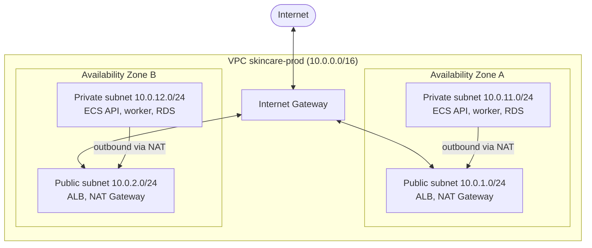
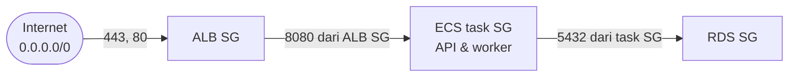
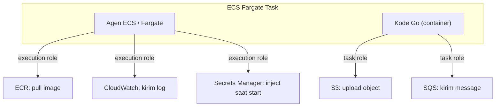
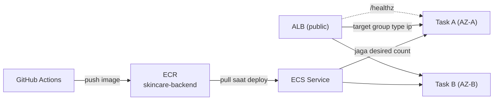
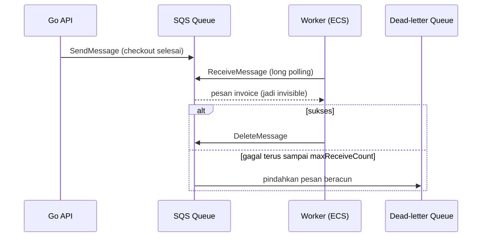
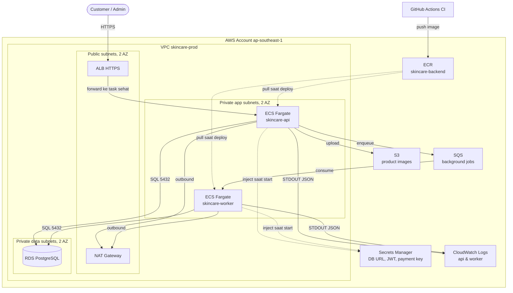

import { Section, Box, Steps, Step, Recap, CardGrid, Card, Chip, Hero, Compare, FileTree, Endpoint, Def } from "@components";

<Hero eyebrow="Roadmap 8 &middot; Docker, CI/CD, dan AWS" title="AWS <em>Foundation</em><br />Peta Layanan Backend Skincare">
  <p>Sebelum men-deploy, kamu butuh peta: jaringan, izin, container, database, file, log, secret, dan antrian. Modul ini memberi kosakata itu.</p>
  <Fragment slot="meta">
    <Chip icon="code">Bahasa: <b>Go 1.26</b></Chip>
    <Chip icon="server">Target: <b>ECS Fargate</b></Chip>
    <Chip icon="clock">~70 menit baca</Chip>
  </Fragment>
</Hero>

<Section num="01" id="intro" title="Kenapa Backend Perlu Peta AWS" sub="Deploy bukan sekadar menjalankan binary, tetapi menempatkan binary di jaringan, izin, dan layanan yang benar.">

<p class="lead">Di Roadmap 8 kita tidak hanya membuat Docker image, kita menaruh image itu ke lingkungan cloud yang punya jaringan privat, permission eksplisit, database managed, object storage, log aggregation, secret store, dan queue.</p>

Sampai Roadmap 7, backend skincare berjalan di laptop: `go run ./cmd/api`, PostgreSQL lokal, file `.env`, dan log mengalir ke terminal. Production di AWS mengubah hampir semua asumsi itu. Database hidup di server terpisah yang tak bisa kamu SSH. Log hilang begitu container mati. Secret tidak boleh ada di disk. Dan ada firewall di setiap lapisan yang harus kamu rancang, bukan diwariskan dari panel hosting.

<Box variant="bridge" icon="🌉" label="Jembatan: dari panel hosting ke arsitektur cloud eksplisit"><p>Di shared hosting atau Laravel Forge, banyak keputusan disembunyikan oleh panel: nginx, firewall, dan environment sudah disiapkan. Di AWS, tiap keputusan itu menjadi layanan yang kamu beri nama dan izin: VPC untuk jaringan, Security Group untuk firewall, ECS untuk container, RDS untuk database, S3 untuk file, CloudWatch untuk log, Secrets Manager untuk credential, dan SQS untuk antrian. Lebih banyak kontrol, lebih banyak tanggung jawab.</p></Box>

Modul ini sengaja bukan deep dive konfigurasi (itu jatah Chapter 5 sampai 9). Targetnya: kamu bisa membaca diagram arsitektur, menyebut layanan yang benar untuk tiap kebutuhan, tahu data bergerak ke mana, dan bisa berdiskusi dengan DevOps, SRE, atau cloud engineer tanpa kehilangan arah. Anggap ini seperti membaca peta sebelum menyetir, bukan menghafal tiap belokan.

<Def term="AWS Foundation"><p>Lapisan layanan minimum yang membuat backend Go siap production: jaringan privat (VPC), firewall (Security Group), runtime container (ECS Fargate), registry image (ECR), load balancer (ALB), database managed (RDS), object storage (S3), logging (CloudWatch), secret management (Secrets Manager), permission (IAM Role), dan antrian (SQS).</p></Def>

<Compare aLabel="Lokal (Roadmap 1 sampai 7)" bLabel="AWS production (Roadmap 8)" aTone="muted" bTone="blue">
  <Fragment slot="a"><ul><li>`go run` langsung, PostgreSQL lokal, `.env` di disk.</li><li>Log ke terminal, hilang saat proses berhenti.</li><li>Tidak ada firewall antar komponen, semua di localhost.</li></ul></Fragment>
  <Fragment slot="b"><ul><li>Docker image immutable dijalankan ECS Fargate.</li><li>Log keluar ke CloudWatch, bertahan walau container diganti.</li><li>Tiap lapisan punya Security Group, secret dari Secrets Manager via IAM Role.</li></ul></Fragment>
</Compare>

</Section>

<Section num="02" id="vpc-subnet" title="VPC, Subnet, dan Availability Zone" sub="VPC adalah jaringan privatmu di AWS, subnet membaginya, dan Availability Zone membuatnya tahan gangguan.">

<p class="lead">Semua resource backend skincare (ALB, ECS task, RDS) hidup di dalam satu VPC. Memahami VPC dulu membuat layanan lain masuk akal, karena hampir semuanya ditempatkan relatif terhadap jaringan ini.</p>

<Def term="VPC (Virtual Private Cloud)"><p>Jaringan virtual terisolasi milikmu di satu Region AWS, dengan rentang alamat IP sendiri (CIDR, mis. `10.0.0.0/16`). Resource di dalamnya berkomunikasi lewat IP privat, dan kamu yang menentukan apa yang boleh keluar atau masuk.</p></Def>

CIDR seperti `10.0.0.0/16` berarti VPC ini memiliki sekitar 65 ribu alamat IP privat (`10.0.0.0` sampai `10.0.255.255`). Angka `/16` adalah panjang prefix: makin kecil angkanya, makin besar blok alamat. Kamu memecah blok besar ini menjadi subnet yang lebih kecil, misalnya `10.0.1.0/24` (256 alamat) untuk satu subnet.

<Box variant="bridge" icon="🌉" label="Jembatan: dari Docker network ke VPC"><p>Saat Roadmap 8 Chapter 2 kamu memakai Docker Compose, container API, worker, dan PostgreSQL berbagi satu bridge network dan saling memanggil lewat nama service. VPC adalah versi cloud dari ide itu: satu jaringan privat tempat resource saling kenal lewat IP internal, tetapi dengan kontrol routing dan firewall yang jauh lebih eksplisit.</p></Box>

<Def term="Availability Zone (AZ)"><p>Data center terisolasi secara fisik dalam satu Region. Region `ap-southeast-1` (Singapura) punya beberapa AZ. Menyebar resource ke dua AZ atau lebih membuat aplikasi tetap hidup walau satu AZ bermasalah.</p></Def>

Subnet adalah pecahan dari CIDR VPC, dan tiap subnet terikat ke tepat satu AZ. Inilah dua sumbu yang harus selalu kamu pikirkan: sumbu fungsi (public vs private) dan sumbu ketahanan (AZ mana). Production yang sehat menyebar tiap peran ke minimal dua AZ.

<Compare aLabel="Public subnet" bLabel="Private subnet" aTone="blue" bTone="violet">
  <Fragment slot="a"><ul><li>Route table punya rute `0.0.0.0/0` menuju Internet Gateway.</li><li>Resource di sini bisa dijangkau dan menjangkau internet langsung.</li><li>Tempat untuk ALB dan NAT Gateway, bukan untuk database.</li></ul></Fragment>
  <Fragment slot="b"><ul><li>Tidak punya rute langsung ke Internet Gateway.</li><li>Untuk outbound (pull image, panggil API), jalurnya lewat NAT Gateway.</li><li>Tempat untuk ECS API, ECS worker, dan RDS.</li></ul></Fragment>
</Compare>

Yang membedakan public dari private bukan label, tetapi route table-nya. Public subnet punya rute `0.0.0.0/0 → Internet Gateway`. Private subnet tidak. Untuk keluar ke internet, private subnet mengarahkan `0.0.0.0/0 → NAT Gateway` yang dipasang di public subnet.

<Def term="NAT Gateway"><p>Pintu outbound satu arah. Memungkinkan resource di private subnet melakukan koneksi keluar (mis. menarik image dari ECR, memanggil payment gateway) tanpa membuka koneksi masuk dari internet. Diletakkan di public subnet, berbayar per jam dan per GB.</p></Def>

<Box variant="warn" icon="⚠️" label="Jebakan: private subnet bukan berarti offline"><p>Private subnet artinya tidak bisa diakses langsung dari internet, bukan tidak bisa keluar. Task di private subnet tetap perlu outbound untuk menarik image, mengirim log, atau memanggil AWS API, lewat NAT Gateway atau VPC endpoint. Banyak deploy pertama gagal hanya karena lupa menyiapkan jalur outbound ini.</p></Box>



<p class="fig-cap"><b>Gambar 1.</b> VPC dengan public dan private subnet tersebar di dua AZ. Internet hanya menyentuh public subnet, private subnet keluar lewat NAT.</p>

</Section>

<Section num="03" id="security-group" title="Security Group, NACL, dan Traffic Berlapis" sub="Subnet menentukan ke mana paket bisa dirutekan, Security Group menentukan paket mana yang diizinkan.">

<p class="lead">Setelah jaringan terbentuk, kita perlu firewall. Di AWS ada dua lapis: Security Group di level resource dan Network ACL di level subnet. Untuk backend skincare, Security Group adalah alat utama yang kamu pakai sehari-hari.</p>

<Def term="Security Group"><p>Firewall virtual yang menempel ke resource (ENI milik ECS task, RDS, atau ALB). Bersifat stateful: jika request masuk diizinkan, reply-nya otomatis diizinkan keluar tanpa rule tambahan. Hanya berisi rule allow, tidak ada deny.</p></Def>

Kata kunci paling penting: stateful. Kamu cukup mengizinkan inbound, dan AWS otomatis mengizinkan reply keluar. Ini sangat berbeda dari Network ACL yang stateless.

<div class="tbl-wrap">
<table>
<thead><tr><th>Aspek</th><th>Security Group</th><th>Network ACL (NACL)</th></tr></thead>
<tbody>
<tr><td>Level</td><td>Per resource (task, RDS, ALB)</td><td>Per subnet</td></tr>
<tr><td>State</td><td>Stateful (reply otomatis diizinkan)</td><td>Stateless (inbound dan outbound terpisah)</td></tr>
<tr><td>Jenis rule</td><td>Allow saja</td><td>Allow dan Deny</td></tr>
<tr><td>Evaluasi</td><td>Semua rule</td><td>Berurutan menurut nomor rule</td></tr>
<tr><td>Pemakaian harian</td><td>Alat utama backend</td><td>Pagar tambahan tingkat subnet</td></tr>
</tbody>
</table>
</div>

<Box variant="bridge" icon="🌉" label="Jembatan: dari middleware CORS/auth ke Security Group"><p>Di Express atau Laravel, kamu membatasi siapa yang boleh memanggil endpoint lewat middleware (CORS, rate limit, auth). Security Group bekerja satu lapis lebih bawah, di level paket jaringan, sebelum request bahkan mencapai kode Go-mu. Keduanya saling melengkapi: SG menjaga port, middleware menjaga logika.</p></Box>

Pola paling kuat adalah merujuk Security Group lain sebagai sumber, bukan rentang IP. Untuk skincare, traffic mengalir berlapis: internet hanya boleh menyentuh ALB, ALB hanya boleh menyentuh API, dan RDS hanya boleh disentuh API serta worker. Database tidak pernah membuka port ke internet maupun ke ALB.



<p class="fig-cap"><b>Gambar 2.</b> Setiap lapisan hanya menerima dari Security Group lapisan di atasnya. RDS tidak pernah menerima dari internet atau ALB.</p>

<Box variant="tip" icon="💡" label="Rujuk Security Group, bukan IP"><p>Daripada mengizinkan `10.0.11.0/24` ke RDS, izinkan source berupa Security Group milik ECS task. Saat task naik turun dengan IP berbeda akibat auto scaling, rule tetap benar tanpa kamu sentuh, karena yang dirujuk adalah identitas SG, bukan alamat yang berubah-ubah.</p></Box>

Network ACL ada di level subnet dan stateless: kamu harus mengizinkan inbound dan outbound secara terpisah, termasuk port ephemeral untuk reply. Karena itu NACL jarang dipakai untuk aturan harian. Biarkan default-nya allow, dan andalkan Security Group untuk kontrol yang presisi. NACL berguna untuk pagar kasar tingkat subnet, misalnya memblokir rentang IP tertentu di seluruh subnet sekaligus.

</Section>

<Section num="04" id="iam-role" title="IAM Role: Identitas Tanpa Access Key Statis" sub="IAM menjawab pertanyaan siapa boleh melakukan apa pada resource mana, dan Role memberi izin tanpa credential abadi.">

<p class="lead">Jaringan mengatur paket, IAM mengatur izin. Di AWS, kode Go-mu tidak login dengan username dan password, ia mengasumsikan Role yang memberi credential sementara dan berputar otomatis.</p>

<Compare aLabel="IAM User" bLabel="IAM Role" aTone="muted" bTone="violet">
  <Fragment slot="a"><ul><li>Identitas tetap dengan credential jangka panjang (access key).</li><li>Cocok untuk manusia atau alat di luar AWS, tetapi rawan bocor.</li><li>Hindari untuk workload yang berjalan di dalam AWS.</li></ul></Fragment>
  <Fragment slot="b"><ul><li>Identitas yang di-assume sementara, memberi credential temporer.</li><li>Credential berputar otomatis, tidak ada secret abadi di container.</li><li>Cara yang benar bagi ECS task memanggil AWS API.</li></ul></Fragment>
</Compare>

<Box variant="bridge" icon="🌉" label="Jembatan: dari API key di .env ke IAM Role"><p>Di banyak proyek Node atau Laravel, integrasi cloud memakai access key yang dijejalkan ke `.env`. IAM Role membalik pola itu: tidak ada key di mana-mana. ECS menyuntik credential sementara ke container, SDK Go membacanya otomatis, dan credential itu kedaluwarsa serta diperbarui sendiri. Anggap seperti badge tamu yang diperpanjang otomatis, bukan kunci master yang kamu titipkan.</p></Box>

Untuk ECS, ada dua Role berbeda yang sering tertukar. Memisahkan keduanya adalah inti keamanan workload, jadi pahami siapa pemakainya, bukan sekadar namanya.

<Def term="Task execution role"><p>Dipakai oleh agen ECS atau Fargate (bukan kode aplikasimu). Memberi izin untuk menarik image dari ECR privat, mengirim log ke CloudWatch (driver `awslogs`), dan mengambil secret saat startup untuk disuntik ke container. Trust principal: `ecs-tasks.amazonaws.com`.</p></Def>

<Def term="Task role"><p>Dipakai oleh kode aplikasi di dalam container untuk memanggil AWS API lewat SDK, misalnya upload ke S3 atau kirim message ke SQS. Credential ECR, Logs, dan Secrets dari execution role tidak terekspos ke kode aplikasi.</p></Def>



<p class="fig-cap"><b>Gambar 3.</b> Dua Role berbeda. Execution role untuk pekerjaan runtime ECS, task role untuk kode aplikasimu.</p>

Prinsip yang membungkus semuanya adalah least privilege: beri hanya action dan resource ARN yang dibutuhkan, bukan `*`. Untuk skincare, task role API cukup boleh `s3:PutObject` ke bucket gambar produk dan `sqs:SendMessage` ke queue tertentu, bukan akses penuh ke semua S3 dan semua queue.

```json title="iam/skincare-api-task-role.json"
{
  "Version": "2012-10-17",
  "Statement": [
    {
      "Sid": "PutProductImages",
      "Effect": "Allow",
      "Action": ["s3:PutObject", "s3:GetObject"],
      "Resource": "arn:aws:s3:::skincare-product-images/*"
    },
    {
      "Sid": "EnqueueBackgroundJobs",
      "Effect": "Allow",
      "Action": ["sqs:SendMessage"],
      "Resource": "arn:aws:sqs:ap-southeast-1:123456789012:skincare-jobs"
    }
  ]
}
```

<Box variant="note" icon="🔁" label="OIDC untuk pipeline CI"><p>Pipeline di Chapter 3 juga butuh izin AWS untuk push image ke ECR dan update ECS. Daripada menyimpan access key statis di GitHub Actions, CI meng-assume IAM Role lewat federasi OIDC. Trust policy membatasi repo dan branch tertentu, lalu CI menerima credential temporer. Tidak ada secret abadi yang disimpan di pengaturan CI.</p></Box>

</Section>

<Section num="05" id="ecr-ecs-alb" title="ECR, ECS Fargate, dan ALB" sub="Tiga layanan yang mengubah Docker image hasil CI menjadi API yang bisa diakses user.">

<p class="lead">Setelah CI membangun Docker image, perjalanannya jelas: image disimpan di ECR, dijalankan oleh ECS Fargate, lalu diekspos ke user lewat ALB. Tiga huruf ini adalah tulang punggung deployment.</p>

<Def term="ECR (Elastic Container Registry)"><p>Registry image privat per akun dan Region. Pipeline Chapter 3 melakukan `docker build`, login ke ECR, lalu push image multi-stage Go (binary kecil) ke repository seperti `skincare-backend`. ECS menariknya saat deployment.</p></Def>

<Box variant="bridge" icon="🌉" label="Jembatan: dari npm registry ke ECR"><p>Saat publish package ke npm, kamu push artefak bernama versi ke registry, lalu konsumen menariknya dengan tag. ECR adalah ide yang sama untuk Docker image: kamu push `skincare-backend:git-sha`, dan ECS menarik tag itu saat deploy. Bedanya, yang berpindah ke production adalah image immutable, bukan source code yang di-build ulang di server.</p></Box>

ECR juga punya lifecycle policy: aturan otomatis menghapus image lama atau untagged, misalnya simpan 10 tag terbaru, agar storage tidak menggembung dari setiap commit yang menghasilkan image baru.

<Def term="ECS Fargate"><p>Cara menjalankan container tanpa mengelola server EC2. Tidak ada patch OS, tidak ada kapasitas node yang kamu urus. Kamu cukup mendeklarasikan CPU, memory, image, port, IAM Role, dan penempatan jaringan dalam task definition.</p></Def>

Task definition adalah blueprint berversi (tiap perubahan menghasilkan revisi baru). Inilah dokumen yang menyatukan hampir semua konsep modul ini: image dari ECR, port aplikasi, log ke CloudWatch, secret dari Secrets Manager, serta dua IAM Role tadi.

```json title="deploy/aws/skincare-api-taskdef.json"
{
  "family": "skincare-api",
  "networkMode": "awsvpc",
  "requiresCompatibilities": ["FARGATE"],
  "cpu": "256",
  "memory": "512",
  "executionRoleArn": "arn:aws:iam::123456789012:role/ecsTaskExecutionRole",
  "taskRoleArn": "arn:aws:iam::123456789012:role/skincare-api-task-role",
  "containerDefinitions": [
    {
      "name": "api",
      "image": "123456789012.dkr.ecr.ap-southeast-1.amazonaws.com/skincare-backend:git-sha",
      "portMappings": [{ "containerPort": 8080, "protocol": "tcp" }],
      "environment": [
        { "name": "APP_ENV", "value": "production" },
        { "name": "HTTP_ADDR", "value": ":8080" }
      ],
      "secrets": [
        {
          "name": "DATABASE_URL",
          "valueFrom": "arn:aws:secretsmanager:ap-southeast-1:123456789012:secret:skincare/db-AbCdEf"
        }
      ],
      "logConfiguration": {
        "logDriver": "awslogs",
        "options": {
          "awslogs-group": "/ecs/skincare-api",
          "awslogs-region": "ap-southeast-1",
          "awslogs-stream-prefix": "api"
        }
      }
    }
  ]
}
```

Perhatikan `networkMode: awsvpc` yang wajib untuk Fargate: setiap task mendapat ENI dan IP privat sendiri di dalam subnet. Perhatikan juga pemisahan tegas antara `environment` (key-value biasa, terlihat di `docker inspect`) dan `secrets` (di-resolve dari ARN Secrets Manager saat startup oleh execution role). Bagian secret ini kita perdalam di Section berikutnya.

<Def term="ECS Service"><p>Penjaga task. Memastikan desired count task tetap berjalan, mengganti task yang mati, mengelola deployment rolling, dan mendaftarkan task ke target group ALB. Inilah yang membuat API tetap hidup walau satu task crash.</p></Def>

ALB (Application Load Balancer) adalah pintu masuk HTTP dan HTTPS. Listener-nya mendengarkan port (mis. 443 untuk HTTPS, 80 untuk redirect ke HTTPS), lalu meneruskan ke target group. Untuk Fargate, target group wajib bertipe `ip` (bukan `instance`), karena tiap task punya IP sendiri.

<Endpoint method="GET" path="/healthz" desc="Endpoint ringan yang dipanggil ALB berkala. Hanya task yang sehat menerima traffic, task unhealthy dideregistrasi otomatis." />

<CardGrid cols={3}>
  <Card><h4>ECR</h4><p>Menyimpan image immutable hasil CI, dengan lifecycle policy agar storage rapi.</p></Card>
  <Card><h4>ECS Fargate</h4><p>Menjalankan container API dan worker tanpa mengelola server, lewat task definition dan service.</p></Card>
  <Card><h4>ALB</h4><p>Pintu HTTPS, health check, dan distribusi traffic ke task sehat di banyak AZ.</p></Card>
</CardGrid>



<p class="fig-cap"><b>Gambar 4.</b> Alur dari CI ke production: image di ECR, dijalankan ECS Service di banyak AZ, diekspos lewat ALB yang health-check tiap task.</p>

<Box variant="bridge" icon="🌉" label="Jembatan: dari node app + pm2 ke ECS Service"><p>Di Node, pm2 atau systemd menjaga proses tetap hidup dan me-restart saat crash. ECS Service melakukan hal serupa, tetapi di level container dan tersebar di banyak mesin: ia menjaga jumlah task, mengganti yang mati, dan melakukan rolling deploy. Yang berbeda, kamu tidak menyentuh server sama sekali, semua diatur lewat task definition dan konfigurasi service.</p></Box>

</Section>

<Section num="06" id="rds-s3" title="RDS PostgreSQL dan S3" sub="Data transaksi dan file produk punya karakter berbeda, maka tempatnya pun berbeda.">

<p class="lead">Order, payment, dan stock butuh transaksi relasional. Gambar produk butuh storage murah berkapasitas besar. PostgreSQL untuk yang pertama, S3 untuk yang kedua, dan keduanya saling melengkapi.</p>

<Def term="RDS (Relational Database Service)"><p>PostgreSQL terkelola: AWS mengurus server, backup, patching, dan high availability. Kamu mengaksesnya hanya lewat SQL client atau driver (pgx), tidak ada SSH ke host. Port default tetap 5432.</p></Def>

Untuk skincare, RDS menyimpan semua data relasional dari Roadmap 3 sampai 5: user, produk, variant, cart, order, payment, voucher, inventory movement, dan audit log. Versi PostgreSQL 17 sudah tersedia di RDS (GA sejak akhir 2024). Pilih major version, dan RDS mengisi minor terbaru. Cek versi yang tersedia di Region-mu dengan `aws rds describe-db-engine-versions --engine postgres --default-only` sebelum provisioning.

<Box variant="bridge" icon="🌉" label="Jembatan: dari PostgreSQL lokal Docker ke RDS"><p>Di Chapter 2, PostgreSQL berjalan sebagai container Compose yang kamu kelola penuh. RDS memindahkan tanggung jawab operasional itu ke AWS: backup otomatis, failover Multi-AZ, dan patching jadi urusan layanan. Kode Go-mu hampir tak berubah, hanya `DATABASE_URL` yang kini menunjuk endpoint RDS di private subnet, bukan `localhost`.</p></Box>

Tiga hal operasional RDS yang relevan sejak awal:

<CardGrid cols={3}>
  <Card><h4>Multi-AZ</h4><p>Standby sinkron di AZ lain dengan failover otomatis. Satu AZ tumbang, database tetap melayani.</p></Card>
  <Card><h4>Automated backup</h4><p>Retensi 1 sampai 35 hari memungkinkan Point-in-Time Recovery, restore ke detik tertentu.</p></Card>
  <Card><h4>Parameter group</h4><p>Kumpulan parameter engine seperti `max_connections`, basis untuk menghitung ukuran connection pool.</p></Card>
</CardGrid>

Penempatan dan keamanan RDS mengikuti pelajaran Section 2 dan 3: DB subnet group di private subnet (minimal 2 AZ), bukan `publicly accessible`, dan Security Group inbound 5432 hanya dari Security Group ECS, bukan dari CIDR `0.0.0.0/0`.

<Box variant="warn" icon="⚠️" label="Jebakan: connection pool melebihi kapasitas RDS"><p>Tiap task ECS membuka pgxpool sendiri. Jika `max_connections` RDS = 100 dan kamu menjalankan 4 task dengan `MaxConns` 30, totalnya 120 koneksi, melebihi kapasitas dan menyisakan nol slot untuk admin. Rumusnya: (MaxConns per task x jumlah task) + headroom harus lebih kecil dari `max_connections` RDS. Untuk 4 task dan limit 100, `MaxConns` sekitar 18 sampai 20 per task masuk akal.</p></Box>

Satu jebakan lain yang khas: jangan menjalankan migration saat boot tiap task. Kalau 4 task naik bersamaan dan semuanya mencoba `migrate up`, terjadi race condition. Pola yang benar adalah menjalankan migration sebagai one-off task terpisah (mis. ECS RunTask dengan command `migrate up`) atau sebagai langkah pipeline sebelum service di-update.

<Def term="S3 (Simple Storage Service)"><p>Object storage. Bucket adalah container global-unik, object key adalah path file (mis. `products/uuid/main.webp`). Bucket baru default privat: Block Public Access aktif dan ACL nonaktif, akses diatur lewat bucket policy berbasis IAM.</p></Def>

S3 menyimpan gambar produk, foto review, invoice PDF, dan export laporan. PostgreSQL cukup menyimpan metadata: `s3_key`, `content_type`, `size_bytes`, dan `cdn_url`. Memisahkan file fisik dari metadata membuat database tetap ramping dan storage tetap murah.

<Compare aLabel="RDS PostgreSQL" bLabel="S3" aTone="teal" bTone="blue">
  <Fragment slot="a"><ul><li>Query relasional, transaksi, constraint, row locking.</li><li>Untuk order, payment, stock, voucher, user, audit log.</li><li>Diakses dari Go lewat pgx dan connection pool.</li></ul></Fragment>
  <Fragment slot="b"><ul><li>Object storage murah untuk file besar dan metadata object.</li><li>Untuk gambar produk, foto review, invoice, dan export.</li><li>Diakses lewat AWS SDK Go atau pre-signed URL.</li></ul></Fragment>
</Compare>

<Box variant="tip" icon="💡" label="Pola upload tanpa membebani backend"><p>Untuk upload gambar produk, backend Go membuat pre-signed PUT URL lewat `s3.NewPresignClient(client).PresignPutObject(ctx, ...)`, browser meng-upload file langsung ke S3 dengan URL itu, lalu backend hanya mencatat metadata. File fisik tidak pernah melewati memori aplikasimu, hemat bandwidth dan RAM. Detailnya di Chapter 8.</p></Box>

</Section>

<Section num="07" id="secrets-cloudwatch" title="Secrets Manager dan CloudWatch" sub="Production butuh credential aman dan jejak observability, bukan hanya bisa jalan.">

<p class="lead">Dua layanan ini menutup sisi yang sering diabaikan saat pertama deploy: dari mana secret datang, dan ke mana log pergi saat container mati.</p>

<Def term="Secrets Manager"><p>Penyimpanan terenkripsi (KMS) untuk credential production seperti `DATABASE_URL`, `JWT_SECRET`, dan payment key. Mendukung rotation otomatis. Alternatif lebih murah untuk config sederhana adalah SSM Parameter Store tipe SecureString.</p></Def>

Roadmap 7 sudah membahas pola konsumsi secret dari kode Go. Di sini fokusnya cara ECS menyuntikkan secret ke container. Di task definition, field `secrets` memakai `valueFrom` berisi ARN secret. Saat task start, execution role memanggil `GetSecretValue`, lalu menyuntikkan nilainya sebagai environment variable ke container.

```json title="deploy/aws/secrets-block.json"
{
  "secrets": [
    {
      "name": "DATABASE_URL",
      "valueFrom": "arn:aws:secretsmanager:ap-southeast-1:123456789012:secret:skincare/db-AbCdEf"
    },
    {
      "name": "JWT_SECRET",
      "valueFrom": "arn:aws:secretsmanager:ap-southeast-1:123456789012:secret:skincare/auth-GhIjKl:JWT_SECRET::"
    }
  ]
}
```

Baris kedua menunjukkan pengambilan satu key dari secret JSON: tambahkan `:JWT_SECRET::` di akhir ARN. Inilah yang membuat satu secret JSON bisa menampung banyak nilai sekaligus.

<Box variant="warn" icon="⚠️" label="Jebakan: secret berubah tidak otomatis terbaca"><p>Karena secret disuntik sebagai environment variable saat startup, mengubah nilai di Secrets Manager tidak langsung berlaku. Container yang sudah jalan masih memegang nilai lama. Kamu harus force new deployment agar task baru membaca nilai terbaru. Untuk reload lebih cepat, alternatifnya aplikasi membaca langsung dari Secrets Manager via SDK memakai task role.</p></Box>

<Box variant="bridge" icon="🌉" label="Jembatan: dari .env di server ke secrets inject"><p>Di Laravel atau Node, secret production sering berakhir sebagai `.env` yang di-scp ke server. Di ECS, file itu tidak ada. Execution role mengambil secret dari Secrets Manager dan menyuntiknya sebagai env var saat container start. Kode Go-mu tetap membaca `os.Getenv("DATABASE_URL")` seperti biasa, hanya asal nilainya yang berubah, dan tidak ada file rahasia di disk.</p></Box>

<Def term="CloudWatch Logs"><p>Tempat log container berkumpul dan bertahan. Log group (mis. `/ecs/skincare-api`) berisi banyak log stream (satu per task). Driver `awslogs` meneruskan STDOUT dan STDERR container ke sini, dengan retention diset di level log group.</p></Def>

Inilah alasan structured logging dari Roadmap 4 berbuah di production. Karena aplikasi Go menulis JSON ke STDOUT lewat `slog.NewJSONHandler`, dan `awslogs` meneruskannya apa adanya, setiap field (level, `order_id`, `latency_ms`, `trace_id`) bisa di-query lewat CloudWatch Logs Insights.

```go title="cmd/api/main.go (logger production)"
package main

import (
	"log/slog"
	"os"
)

func newLogger() *slog.Logger {
	// JSON ke STDOUT: awslogs meneruskannya ke CloudWatch apa adanya.
	handler := slog.NewJSONHandler(os.Stdout, &slog.HandlerOptions{
		Level: slog.LevelInfo,
	})
	return slog.New(handler)
}
```

```text title="CloudWatch Logs Insights"
fields @timestamp, level, msg, order_id
| filter level = "ERROR"
| stats count() by msg
| sort count() desc
```

<Box variant="warn" icon="⚠️" label="Jebakan: log container itu fana"><p>Container Fargate bisa mati dan diganti kapan saja oleh ECS Service. Jika kamu hanya menulis log ke file di dalam container, log itu hilang bersama task. Selalu tulis ke STDOUT atau STDERR sejak awal agar `awslogs` menangkapnya ke CloudWatch.</p></Box>

</Section>

<Section num="08" id="sqs" title="SQS untuk Background Job" sub="Tidak semua pekerjaan harus selesai di dalam request HTTP user.">

<p class="lead">Saat customer checkout, mengirim invoice email atau resize gambar produk tidak perlu menahan response. API cukup menaruh pesan di antrian, lalu worker memprosesnya terpisah. SQS adalah antrian managed itu.</p>

<Def term="SQS (Simple Queue Service)"><p>Antrian pesan terkelola yang memisahkan producer dari consumer. API (producer) mengirim message JSON dengan `SendMessage`, worker (consumer) menariknya dengan `ReceiveMessage`, memproses, lalu menghapusnya dengan `DeleteMessage` setelah sukses.</p></Def>

<Compare aLabel="Laravel Queue" bLabel="Go + SQS" aTone="muted" bTone="violet">
  <Fragment slot="a"><ul><li>Job di-dispatch ke driver, worker membaca dan menjalankan handler.</li><li>Retry dan failed_jobs terasa terintegrasi dengan framework.</li></ul></Fragment>
  <Fragment slot="b"><ul><li>API kirim message JSON ke SQS, worker Go polling lalu hapus setelah sukses.</li><li>Visibility timeout, retry, dan dead-letter queue harus dipahami eksplisit sejak awal.</li></ul></Fragment>
</Compare>

Untuk skincare, pilih jenis queue sesuai kebutuhan. Standard queue (throughput tinggi, urutan tidak dijamin, at-least-once) cocok untuk notifikasi email atau push. FIFO queue (urutan terjamin per group, exactly-once processing) cocok untuk event pembayaran yang urutan dan dedup-nya kritis.

```json title="sqs/send-invoice-message.json"
{
  "type": "send_invoice_email",
  "order_id": "INV-20260606-8F3A",
  "user_id": "usr_01HYZ9G5M0",
  "attempt": 1,
  "trace_id": "req_01J0AWSFOUNDATION"
}
```

Dua mekanisme SQS yang wajib kamu pahami sebelum menulis worker:

<Def term="Visibility timeout"><p>Setelah worker memanggil `ReceiveMessage`, pesan menjadi invisible (default 30 detik). Jika worker tidak menghapusnya sebelum timeout (mis. karena crash), pesan muncul lagi dan diproses ulang. Inilah retry otomatis bawaan SQS.</p></Def>

<Def term="Dead-letter queue (DLQ)"><p>Antrian terpisah untuk pesan yang gagal diproses berkali-kali. Redrive policy menetapkan `maxReceiveCount` (mis. 5). Setelah pesan diterima sebanyak itu tanpa dihapus, ia dipindah ke DLQ agar tidak memblokir antrian utama, lalu bisa diinvestigasi.</p></Def>



<p class="fig-cap"><b>Gambar 5.</b> Siklus pesan SQS: diproses dan dihapus saat sukses, atau dipindah ke DLQ setelah gagal berulang.</p>

<Box variant="tip" icon="💡" label="Worker wajib idempotent"><p>Karena Standard queue bersifat at-least-once, anggap pesan bisa diterima lebih dari sekali. Worker harus idempotent: cek `email_sent_at` sebelum mengirim invoice ulang, atau simpan `payment_id` di tabel `processed_events` dengan unique constraint. Tanpa ini, retry bisa berarti double email atau double charge.</p></Box>

Karakter beban yang naik turun (banyak checkout sore hari, sepi tengah malam) membuat worker cocok di-scale otomatis. ECS Service Auto Scaling bisa menambah jumlah task worker berdasarkan panjang antrian, dengan pola Backlog per Task (`ApproximateNumberOfMessagesVisible` dibagi jumlah task). Saat antrian kosong, `MinCapacity=0` memungkinkan scale-to-zero agar hemat biaya. Detail scaling worker diperdalam di Chapter 6.

</Section>

<Section num="09" id="arsitektur-skincare" title="Arsitektur AWS Proyek Skincare" sub="Menyatukan semua layanan menjadi satu peta yang bisa kamu baca dari kiri ke kanan.">

<p class="lead">Sekarang semua kepingan bertemu. Diagram ini adalah peta layanan minimum backend skincare di AWS, dan menjadi rujukan untuk seluruh Chapter berikutnya di Roadmap 8.</p>



<p class="fig-cap"><b>Gambar 6.</b> Arsitektur ringkas backend skincare: ALB publik, API dan worker di private app subnet, RDS di private data subnet, serta layanan managed untuk image, file, secret, log, dan antrian.</p>

Baca alurnya seperti perjalanan satu request checkout. User mengetuk ALB lewat HTTPS, ALB meneruskan ke task API yang sehat di private subnet, API menulis order ke RDS dalam satu transaksi, lalu mengirim pesan `send_invoice_email` ke SQS dan langsung membalas user. Worker mengambil pesan itu, memproses, dan mengirim email. Sepanjang itu, secret datang dari Secrets Manager, log mengalir ke CloudWatch, dan outbound ke payment gateway lewat NAT.

<FileTree title="Peta file deployment di repo skincare-backend" tree={`
.github/
  workflows/
    ci.yml                       # build, test, push image ke ECR (OIDC)
cmd/
  api/
    main.go                      # entrypoint HTTP API
  worker/
    main.go                      # entrypoint SQS consumer
internal/
  platform/
    aws/
      s3.go                      # adapter pre-signed URL & upload
      sqs.go                     # adapter enqueue & consume job
      secrets.go                 # adapter baca secret runtime (opsional)
deploy/
  aws/
    skincare-api-taskdef.json    # task definition API
    skincare-worker-taskdef.json # task definition worker
    service.env.example          # daftar env non-secret
Dockerfile                       # image multi-stage API & worker
docker-compose.yml               # stack lokal, bukan production AWS
`} />

<Box variant="note" icon="🗺️" label="Peta ke Chapter berikutnya"><p>Chapter 5 mengubah task definition API jadi ECS Service di belakang ALB. Chapter 6 melakukan hal sama untuk worker dan SQS consumer. Chapter 7 memperdalam RDS. Chapter 8 menambah S3 dan CloudFront untuk gambar. Chapter 9 melengkapi observability dengan metric dan alarm. Modul ini adalah peta induknya.</p></Box>

</Section>

<Section num="10" id="hands-on" title="Hands-on: Membaca Peta Infrastruktur" sub="Latihan ringan: bukan membuat semua resource, tetapi melatih membaca resource yang nanti dipakai saat deploy.">

<p class="lead">Sebelum membuat resource production (yang sebaiknya lewat IaC, bukan klik manual), latih dulu membacanya dengan AWS CLI. Tujuannya membangun mental model, bukan menghafal perintah.</p>

<Steps>
  <Step><b>Cek identitas AWS aktif</b><p>Pastikan CLI menunjuk akun dan Region yang benar sebelum menyentuh resource production.</p></Step>
  <Step><b>Cek registry image</b><p>Pastikan repository ECR untuk `skincare-backend` sudah ada atau akan dibuat oleh IaC.</p></Step>
  <Step><b>Cek service ECS</b><p>Lihat apakah service API dan worker berjalan di cluster yang sama dengan desired count yang benar.</p></Step>
  <Step><b>Inspeksi Security Group RDS</b><p>Pastikan inbound 5432 hanya dari Security Group ECS, bukan dari `0.0.0.0/0`.</p></Step>
  <Step><b>Baca log aplikasi</b><p>Pakai CloudWatch Logs untuk melihat error startup, panic, koneksi database, dan health check.</p></Step>
</Steps>

```bash title="Terminal"
# 1. Identitas dan Region aktif
aws sts get-caller-identity
aws configure get region

# 2. Repository image di ECR
aws ecr describe-repositories \
  --repository-names skincare-backend

# 3. Service ECS di cluster skincare-prod
aws ecs describe-services \
  --cluster skincare-prod \
  --services skincare-api skincare-worker \
  --query "services[].{name:serviceName,desired:desiredCount,running:runningCount}"

# 4. Versi PostgreSQL default yang tersedia di Region
aws rds describe-db-engine-versions \
  --engine postgres \
  --default-only \
  --query "DBEngineVersions[].EngineVersion"

# 5. Ikuti log API secara live
aws logs tail /ecs/skincare-api \
  --follow \
  --since 10m
```

<Box variant="note" icon="📝" label="Membaca dulu, mengubah belakangan"><p>Semua perintah di atas hanya membaca resource. Untuk membuat atau mengubah resource production, kita pakai pendekatan terkontrol lewat IaC atau pipeline, bukan klik manual berulang yang sulit diaudit dan mudah menyimpang antar environment.</p></Box>

<Box variant="tip" icon="✅" label="Tujuan hands-on"><p>Setelah latihan ini, kamu bisa menunjuk pada diagram Gambar 6 dan memetakan tiap kotak ke perintah CLI yang membacanya. Itulah tanda peta sudah menempel di kepala, bukan sekadar di layar.</p></Box>

</Section>

<Section num="11" id="jebakan" title="Jebakan Umum Pendatang JS/PHP" sub="Kebanyakan masalah deploy pertama bukan karena Go, tetapi karena mental model hosting lama dibawa ke arsitektur cloud.">

<p class="lead">Bug AWS pertama biasanya bukan soal sintaks, tetapi soal asumsi: menganggap jaringan, secret, dan log berperilaku seperti di VPS atau shared hosting.</p>

<CardGrid cols={2}>
  <Card><h4>Menganggap private subnet sama dengan offline</h4><p>Private subnet tetap bisa outbound lewat NAT Gateway atau VPC endpoint, hanya tidak menerima inbound langsung dari internet.</p></Card>
  <Card><h4>Membuka RDS ke internet</h4><p>RDS cukup menerima 5432 dari Security Group ECS. `publicly accessible` dan `0.0.0.0/0` adalah resep insiden.</p></Card>
  <Card><h4>Memakai access key statis di container</h4><p>ECS task memakai IAM Role agar credential temporer dikelola dan diputar otomatis oleh AWS.</p></Card>
  <Card><h4>Menyimpan file besar di database</h4><p>Gambar produk di S3, database cukup menyimpan `s3_key`, `content_type`, `size_bytes`, dan `cdn_url`.</p></Card>
  <Card><h4>Menganggap log container permanen</h4><p>Container bisa mati dan diganti. Tulis log ke STDOUT JSON agar `awslogs` menangkapnya ke CloudWatch.</p></Card>
  <Card><h4>Menganggap queue pasti sekali proses</h4><p>SQS Standard at-least-once. Worker harus idempotent karena retry dan delivery ulang itu normal.</p></Card>
  <Card><h4>Menjalankan migration saat boot tiap task</h4><p>4 task `migrate up` bersamaan memicu race condition. Jalankan migration sebagai one-off task atau langkah pipeline.</p></Card>
  <Card><h4>Mengira secret langsung update</h4><p>Secret yang disuntik sebagai env butuh force new deployment agar nilai baru terbaca task yang sudah jalan.</p></Card>
</CardGrid>

<Box variant="bridge" icon="🌉" label="Jembatan: dari `.env` Laravel ke secret production"><p>Di Laravel lokal, `.env` terasa cukup. Di AWS production, `.env` bukan tempat akhir credential sensitif: tidak ada file itu di container. ECS mengambil secret dari Secrets Manager lewat execution role dan menyuntiknya sebagai env var, atau kode Go membacanya langsung via task role. Kebiasaan scp `.env` ke server adalah pola yang harus ditinggalkan.</p></Box>

<Compare aLabel="Mental model VPS / shared hosting" bLabel="Mental model AWS cloud" aTone="muted" bTone="blue">
  <Fragment slot="a"><ul><li>Satu server, semua komponen di localhost, firewall diwariskan panel.</li><li>Secret di file `.env`, log di file disk, restart manual.</li></ul></Fragment>
  <Fragment slot="b"><ul><li>Banyak layanan eksplisit, tiap lapisan punya Security Group dan IAM Role.</li><li>Secret dari Secrets Manager, log ke CloudWatch, ECS Service menjaga task.</li></ul></Fragment>
</Compare>

</Section>

<Section num="12" id="ringkasan" title="Ringkasan & Poin Penting" sub="Peta AWS memberi kosakata bersama sebelum kita masuk ke deployment detail.">

<p class="lead">AWS Foundation bukan tentang menghafal tiap tombol konsol, tetapi tentang punya peta: tahu layanan apa untuk kebutuhan apa, dan ke mana data bergerak di backend skincare.</p>

<Recap title="Yang Wajib Menempel">
  <ul><li>VPC adalah jaringan privatmu di satu Region; subnet membaginya jadi public (punya rute ke Internet Gateway, untuk ALB dan NAT) dan private (untuk ECS dan RDS, keluar lewat NAT Gateway); sebar tiap peran ke minimal 2 AZ.</li><li>Security Group adalah firewall stateful per resource dan alat utama harian; rujuk SG lain sebagai source (internet ke ALB SG, ALB SG ke task SG, task SG ke RDS SG), bukan rentang IP. NACL adalah pagar kasar tingkat subnet.</li><li>IAM Role memberi credential temporer tanpa access key statis. ECS memakai dua role: execution role (agen ECS: pull ECR, kirim log, inject secret) dan task role (kode aplikasi: S3, SQS). Selalu least privilege ke ARN spesifik.</li><li>ECR menyimpan image immutable hasil CI; ECS Fargate menjalankan container lewat task definition (`networkMode: awsvpc`, cpu/memory, environment vs secrets) dan ECS Service menjaga desired count; ALB (target group type `ip`) jadi pintu HTTPS dengan health check `/healthz`.</li><li>RDS PostgreSQL untuk data transaksi (private subnet, 5432 hanya dari SG ECS, Multi-AZ, backup, hati-hati ukuran pgxpool dan race migration); S3 untuk file dan metadata object dengan pola pre-signed URL.</li><li>Secrets Manager menyuntik credential ke container lewat `secrets`/`valueFrom` saat startup (ubah secret butuh force new deployment); CloudWatch Logs menampung STDOUT JSON dari `slog` lewat driver `awslogs` agar log tidak hilang saat container mati.</li><li>SQS memisahkan request HTTP dari background job (invoice email, resize image, sync payment); pahami visibility timeout dan DLQ, dan buat worker idempotent karena delivery at-least-once.</li></ul>
</Recap>

Di proyek online shop skincare, peta ini menyatukan seluruh roadmap sebelumnya: domain dari Roadmap 5 hidup di RDS, security dari Roadmap 7 berlabuh ke IAM dan Secrets Manager, dan structured logging dari Roadmap 4 berbuah di CloudWatch. Langkah berikutnya adalah mengubah peta menjadi deployment konkret. Chapter 5 men-deploy API ke ECS Fargate di belakang ALB, Chapter 6 menjalankan worker dan SQS consumer, lalu Chapter 7 sampai 9 memperdalam database, gambar produk, dan observability. Mulai dari sini, kamu tidak lagi menebak nama layanan, kamu memetakannya.

</Section>
