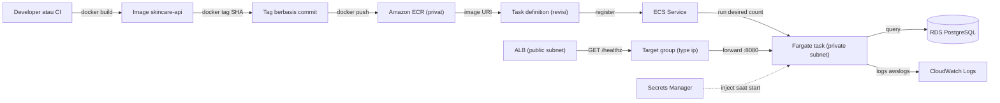
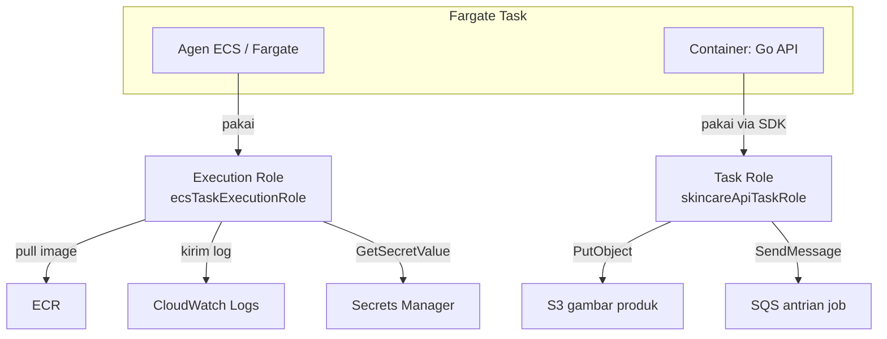
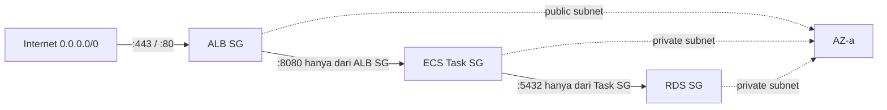
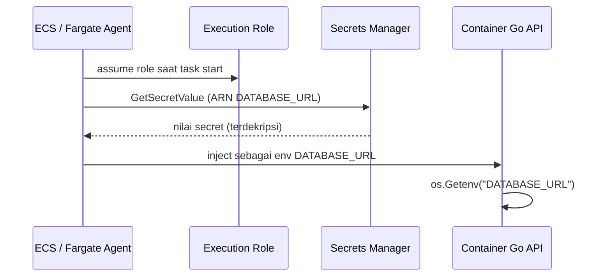
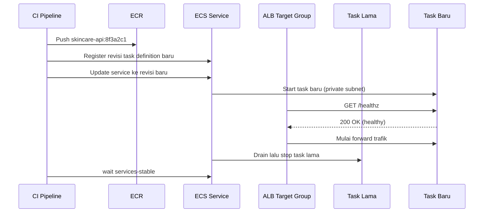

import { Section, Box, Steps, Step, Recap, CardGrid, Card, Chip, Hero, Compare, FileTree, Endpoint, Def } from "@components";

<Hero eyebrow="Roadmap 8 &middot; AWS Deployment" title="Deploy Go API ke <em>ECS Fargate</em><br />dari ECR sampai ALB">
  <p>Image Go API skincare yang sudah kamu container-kan akan didorong ke ECR, dijalankan sebagai task Fargate di private subnet, dan menerima trafik lewat ALB tanpa downtime.</p>
  <Fragment slot="meta">
    <Chip icon="code">Bahasa: <b>Go 1.26</b></Chip>
    <Chip icon="server">Runtime: <b>ECS Fargate</b></Chip>
    <Chip icon="clock">~70 menit baca</Chip>
  </Fragment>
</Hero>

<Section num="01" id="intro" title="Dari Image Lokal ke Service Production" sub="ECS Fargate mengubah Docker image menjadi task yang hidup di VPC AWS">

<p class="lead">Di Chapter 1 sampai 4 Roadmap 8 kamu sudah punya Docker image multi-stage, docker compose lokal, CI pipeline, dan paham fondasi AWS. Sekarang image itu harus benar-benar hidup sebagai API production yang menerima trafik pelanggan.</p>

Kalau kamu terbiasa deploy React ke Vercel atau Laravel ke VPS lewat `git pull` dan `php artisan migrate`, ECS terasa jauh lebih banyak langkah. Ia sengaja memisahkan registry (ECR), runtime (Fargate), jaringan (VPC dan subnet), load balancer (ALB), identitas (IAM role), log (CloudWatch), dan rahasia (Secrets Manager) menjadi bagian-bagian terpisah. Pemisahan ini terlihat ramai, tetapi itulah yang memberi kontrol untuk backend yang menyimpan data pelanggan, order, inventory, dan pembayaran.

<Box variant="bridge" icon="🌉" label="Jembatan: dari Vercel atau Cloud Run ke ECS Fargate"><p>Vercel dan Cloud Run menyembunyikan hampir semua detail container. ECS Fargate masih serverless (kamu tidak mengelola EC2 atau patch OS), tetapi memberi kontrol eksplisit atas subnet, security group, target group, IAM role, jumlah task, dan strategi rolling update. Lebih banyak knob, tetapi setiap knob bisa diaudit.</p></Box>

<Def term="serverless container (Fargate)"><p>Fargate menjalankan container tanpa kamu menyediakan atau mengelola server EC2. Kamu cukup memilih CPU, memory, jaringan, dan image, lalu AWS yang menyiapkan kapasitas dan menjalankan task.</p></Def>

<Def term="ECS task"><p>Satu eksekusi dari task definition. Untuk API skincare, satu task biasanya berarti satu container Go yang listen di port 8080 dan punya ENI serta IP privat sendiri.</p></Def>

<Def term="ECS service"><p>Controller yang menjaga jumlah task (desired count) tetap berjalan, mengganti task yang mati, menjalankan rolling deployment, dan mendaftarkan task ke target group ALB.</p></Def>

Sebelum bicara registry dan load balancer, satu hal harus benar lebih dulu: aplikasi Go-mu wajib punya endpoint health check yang ringan.

<Endpoint method="GET" path="/healthz" desc="Dipanggil ALB secara berkala untuk menentukan apakah task Go API siap menerima trafik" />

<Box variant="note" icon="📝" label="Prasyarat modul ini"><p>Kita asumsikan Dockerfile production (multi-stage, binary kecil), VPC dengan public dan private subnet, NAT Gateway, security group, ECR repository, CloudWatch log group, dan Secrets Manager sudah ada dari Chapter 1 dan Chapter 4. Modul ini fokus pada langkah deploy API-nya.</p></Box>

</Section>

<Section num="02" id="peta-deploy" title="Peta Deploy ECS Fargate" sub="Build, push ke ECR, register task definition, update service, lalu trafik mengalir lewat ALB">

<p class="lead">Deploy ke ECS bukan satu perintah ajaib. Ia rangkaian perubahan kecil yang masing-masing bisa diaudit, dan diagram berikut adalah peta mental yang akan kita pakai sepanjang modul.</p>



<p class="fig-cap"><b>Gambar 1.</b> Jalur deploy Go API skincare dari image sampai menerima trafik publik melalui ALB.</p>

Perhatikan arah trafik dan arah outbound. Request masuk dari internet ke ALB di public subnet, lalu diteruskan ke task di private subnet. Sebaliknya, task yang butuh keluar (menarik image dari ECR, mengambil secret, memanggil API gateway pembayaran) jalannya lewat NAT Gateway, karena task tidak punya IP publik.

<CardGrid cols={3}>
  <Card><h4>ECR</h4><p>Registry image privat per akun dan region. ECS menarik image dari sini saat task baru start, bukan dari laptopmu.</p></Card>
  <Card><h4>Task definition</h4><p>Blueprint JSON ber-revisi: image, port, CPU, memory, environment, secrets, dua IAM role, dan log driver.</p></Card>
  <Card><h4>ECS service</h4><p>Menjaga desired count, mendaftarkan task ke target group, dan mengganti task lama saat rolling deploy.</p></Card>
</CardGrid>

<Compare aLabel="Deploy Laravel ke VPS" bLabel="Deploy Go API ke ECS Fargate" aTone="muted" bTone="violet">
  <Fragment slot="a"><ul><li>Artifact = source code, dependency di-install di server.</li><li>Server dikelola manual (OS, PHP-FPM, Nginx, deployer).</li><li>Rollback berarti checkout commit lama lalu deploy ulang.</li></ul></Fragment>
  <Fragment slot="b"><ul><li>Artifact = Docker image immutable berisi binary Go.</li><li>Tidak ada server yang dikelola, AWS menjalankan task dari image.</li><li>Rollback = arahkan service ke revisi task definition lama.</li></ul></Fragment>
</Compare>

<FileTree title="File deployment yang relevan di repo" tree={`
Dockerfile                 # multi-stage, dari Chapter 1
task-definition.json       # blueprint ECS task
cmd/
  api/
    main.go                # entry point Go API
internal/
  config/
    config.go              # baca env dan secret
  httpapi/
    router.go              # mount route chi
    health.go              # handler GET /healthz dan /readyz
.github/
  workflows/
    deploy.yml             # push image dan update service
`} />

</Section>

<Section num="03" id="health-readiness" title="Health Check yang Layak Production" sub="ALB hanya mengirim trafik ke target sehat, jadi endpoint ini menentukan apakah deploy dianggap berhasil">

<p class="lead">Health check adalah kontrak antara aplikasimu dan ALB. Kalau ia tidak pernah balas 200, target tidak pernah jadi healthy, dan rolling deployment akan menggantung lalu di-rollback otomatis.</p>

Di dunia Kubernetes atau Cloud Run kamu mungkin kenal istilah liveness dan readiness probe. Bedakan dua hal serupa juga di sini: liveness (apakah proses hidup) dan readiness (apakah siap menerima trafik, termasuk koneksi database). ALB target group hanya menerima satu path health check, jadi pola umum yang aman adalah membuat `/healthz` super ringan untuk ALB dan `/readyz` yang mengecek dependency untuk dipakai investigasi.

<Box variant="bridge" icon="🌉" label="Jembatan: dari /api/health di Express ke /healthz di Go"><p>Di Express atau Laravel kamu sering bikin route `/health` yang return `{ status: "ok" }`. Polanya sama di Go, tetapi awas: ALB memanggil endpoint ini setiap beberapa detik per task. Jangan menaruh query berat, panggilan ke payment gateway, atau pengecekan eksternal yang tidak perlu, karena itu memperlambat dan bisa membuat task sehat dianggap unhealthy.</p></Box>

```go title="internal/httpapi/health.go"
package httpapi

import (
	"context"
	"encoding/json"
	"net/http"
	"time"

	"github.com/go-chi/chi/v5"
	"github.com/jackc/pgx/v5/pgxpool"
)

type healthResponse struct {
	Status string `json:"status"`
}

// RegisterHealthRoutes memasang /healthz (liveness, dipakai ALB) dan
// /readyz (readiness, mengecek koneksi database untuk investigasi).
func RegisterHealthRoutes(r chi.Router, pool *pgxpool.Pool) {
	r.Get("/healthz", livenessHandler)
	r.Get("/readyz", readinessHandler(pool))
}

func livenessHandler(w http.ResponseWriter, _ *http.Request) {
	writeJSON(w, http.StatusOK, healthResponse{Status: "ok"})
}

func readinessHandler(pool *pgxpool.Pool) http.HandlerFunc {
	return func(w http.ResponseWriter, r *http.Request) {
		ctx, cancel := context.WithTimeout(r.Context(), 2*time.Second)
		defer cancel()

		if err := pool.Ping(ctx); err != nil {
			writeJSON(w, http.StatusServiceUnavailable, healthResponse{Status: "db_unavailable"})
			return
		}
		writeJSON(w, http.StatusOK, healthResponse{Status: "ready"})
	}
}

func writeJSON(w http.ResponseWriter, status int, body any) {
	w.Header().Set("Content-Type", "application/json")
	w.WriteHeader(status)
	_ = json.NewEncoder(w).Encode(body)
}
```

<Box variant="tip" icon="💡" label="Listen di 0.0.0.0, bukan localhost"><p>Di dalam container, server HTTP harus listen pada `:8080` atau `0.0.0.0:8080`. Kalau kamu listen di `127.0.0.1:8080`, ALB dari ENI lain tidak akan bisa menjangkaunya, dan health check selalu gagal walau aplikasi jalan normal.</p></Box>

<Box variant="warn" icon="⚠️" label="Jangan gabungkan dependency berat ke /healthz"><p>Kalau `/healthz` ikut mengecek RDS, S3, dan payment gateway sekaligus, satu hiccup database bisa membuat ALB membunuh semua task sehat lalu memicu cascading failure. Pisahkan: `/healthz` cukup membuktikan proses hidup, `/readyz` untuk pengecekan dependency yang kamu pantau manual.</p></Box>

</Section>

<Section num="04" id="ecr-push" title="Build, Tag, Login, dan Push ke ECR" sub="Image lokal belum bisa dipakai ECS sampai ia ada di registry yang bisa ditarik task execution role">

<p class="lead">Amazon ECR adalah Docker registry privat milik AWS. ECS tidak menarik image dari mesinmu, melainkan dari repository ECR yang sudah berisi image dengan tag tertentu.</p>

Alurnya empat langkah: build image dari Dockerfile, beri tag yang mengandung URI registry plus tag commit, login Docker ke registry ECR dengan token sementara, lalu push. Token login ECR berumur pendek (sekitar 12 jam) dan diminta lewat AWS CLI, bukan password statik.

```bash title="Terminal"
export AWS_ACCOUNT_ID="123456789012"
export AWS_REGION="ap-southeast-1"
export ECR_REPO="skincare-api"
export IMAGE_TAG="$(git rev-parse --short HEAD)"
export ECR_REGISTRY="$AWS_ACCOUNT_ID.dkr.ecr.$AWS_REGION.amazonaws.com"
export ECR_URI="$ECR_REGISTRY/$ECR_REPO"

# 1. Build image dari Dockerfile multi-stage (binary Go kecil)
docker build -t "$ECR_REPO:$IMAGE_TAG" .

# 2. Tag ke URI registry ECR
docker tag "$ECR_REPO:$IMAGE_TAG" "$ECR_URI:$IMAGE_TAG"

# 3. Login Docker ke ECR dengan token sementara dari AWS CLI
aws ecr get-login-password --region "$AWS_REGION" \
  | docker login --username AWS --password-stdin "$ECR_REGISTRY"

# 4. Push image ke repository privat
docker push "$ECR_URI:$IMAGE_TAG"
```

<Box variant="tip" icon="💡" label="Tag dengan commit SHA, bukan latest"><p>Tag `latest` enak untuk demo tetapi buruk untuk audit dan rollback. Tag berbasis commit SHA membuat setiap image unik dan bisa dilacak balik ke kode persis yang berjalan. Saat insiden production, kamu bisa langsung tahu image mana yang sedang melayani trafik.</p></Box>

Repository ECR perlu dibuat sekali. Aktifkan scan-on-push agar image dipindai kerentanan, dan pertimbangkan immutable tags agar tag yang sama tidak bisa ditimpa diam-diam.

```bash title="Terminal"
aws ecr create-repository \
  --repository-name skincare-api \
  --image-scanning-configuration scanOnPush=true \
  --image-tag-mutability IMMUTABLE \
  --region "$AWS_REGION"
```

Image lama menumpuk dan memakan storage berbayar. Lifecycle policy menghapusnya otomatis, misalnya hanya menyimpan 10 tag terbaru dan membuang image untagged setelah satu hari.

```json title="ecr-lifecycle-policy.json"
{
  "rules": [
    {
      "rulePriority": 1,
      "description": "Hapus image untagged setelah 1 hari",
      "selection": {
        "tagStatus": "untagged",
        "countType": "sinceImagePushed",
        "countUnit": "days",
        "countNumber": 1
      },
      "action": { "type": "expire" }
    },
    {
      "rulePriority": 2,
      "description": "Simpan 10 image bertag terbaru",
      "selection": {
        "tagStatus": "any",
        "countType": "imageCountMoreThan",
        "countNumber": 10
      },
      "action": { "type": "expire" }
    }
  ]
}
```

<Box variant="note" icon="📝" label="ECR sebagai endpoint privat"><p>Karena task berada di private subnet, outbound ke ECR lewat NAT Gateway berbayar per GB. Untuk hemat biaya dan keamanan, banyak tim memasang VPC interface endpoint untuk ECR (api dan dkr) plus gateway endpoint S3, sehingga tarikan image tidak lewat internet sama sekali.</p></Box>

</Section>

<Section num="05" id="task-definition" title="Task Definition sebagai Blueprint Container" sub="Di sinilah image, CPU, memory, port, environment, secrets, IAM role, dan log dikunci jadi satu revisi">

<p class="lead">Task definition adalah kontrak runtime ber-versi. ECS service tidak menyimpan detail container langsung, ia menunjuk ke sebuah revisi task definition. Ganti satu hal, kamu membuat revisi baru.</p>

<Box variant="bridge" icon="🌉" label="Jembatan: dari docker-compose.yml ke task-definition.json"><p>Kalau di Chapter 2 kamu menulis service di `docker-compose.yml` (image, ports, environment, depends_on), task definition adalah versi AWS-nya untuk satu task. Bedanya: setiap perubahan menghasilkan revisi baru yang immutable, port harus eksplisit di `portMappings`, dan secret tidak ditaruh inline tetapi dirujuk via ARN.</p></Box>

Untuk Fargate, `cpu` dan `memory` ditetapkan di level task dengan kombinasi valid tertentu (misalnya 256 CPU / 512 MiB, atau 512 CPU / 1024 MiB). `networkMode` wajib `awsvpc`, yang membuat tiap task dapat ENI dan IP privat sendiri.

```json title="task-definition.json"
{
  "family": "skincare-api",
  "networkMode": "awsvpc",
  "requiresCompatibilities": ["FARGATE"],
  "cpu": "512",
  "memory": "1024",
  "executionRoleArn": "arn:aws:iam::123456789012:role/ecsTaskExecutionRole",
  "taskRoleArn": "arn:aws:iam::123456789012:role/skincareApiTaskRole",
  "runtimePlatform": {
    "operatingSystemFamily": "LINUX",
    "cpuArchitecture": "ARM64"
  },
  "containerDefinitions": [
    {
      "name": "skincare-api",
      "image": "123456789012.dkr.ecr.ap-southeast-1.amazonaws.com/skincare-api:8f3a2c1",
      "essential": true,
      "portMappings": [
        {
          "name": "http",
          "containerPort": 8080,
          "protocol": "tcp",
          "appProtocol": "http"
        }
      ],
      "environment": [
        { "name": "APP_ENV", "value": "production" },
        { "name": "HTTP_ADDR", "value": ":8080" },
        { "name": "AWS_REGION", "value": "ap-southeast-1" }
      ],
      "secrets": [
        {
          "name": "DATABASE_URL",
          "valueFrom": "arn:aws:secretsmanager:ap-southeast-1:123456789012:secret:skincare/prod/database-url-AbCdEf"
        },
        {
          "name": "JWT_SECRET",
          "valueFrom": "arn:aws:secretsmanager:ap-southeast-1:123456789012:secret:skincare/prod/jwt-secret-AbCdEf"
        }
      ],
      "logConfiguration": {
        "logDriver": "awslogs",
        "options": {
          "awslogs-group": "/ecs/skincare-api",
          "awslogs-region": "ap-southeast-1",
          "awslogs-stream-prefix": "api"
        }
      },
      "readonlyRootFilesystem": true
    }
  ]
}
```

<Box variant="tip" icon="💡" label="ARM64 (Graviton) lebih murah untuk Go"><p>Go mengompilasi ke ARM64 dengan mudah, jadi `cpuArchitecture: ARM64` di Fargate (Graviton) sering lebih hemat biaya per vCPU dibanding X86_64. Syaratnya: build image multi-arch atau build khusus `linux/arm64` di Dockerfile, dan pastikan dependensi CGO (kalau ada) ikut mendukung ARM.</p></Box>

Register task definition lewat CLI. Setiap register menghasilkan revisi baru (`skincare-api:1`, `skincare-api:2`, dan seterusnya).

```bash title="Terminal"
aws ecs register-task-definition \
  --cli-input-json file://task-definition.json \
  --region "$AWS_REGION"
```

<Box variant="warn" icon="⚠️" label="readonlyRootFilesystem bisa menggigit"><p>`readonlyRootFilesystem: true` bagus untuk keamanan, tetapi kalau aplikasimu menulis file sementara (cache, upload temp, sqlite lokal), kamu harus menyediakan `mountPoints` ke volume `tmpfs` atau menulis hanya ke `/tmp`. Banyak deploy gagal misterius karena binary mencoba menulis ke filesystem yang read-only.</p></Box>

</Section>

<Section num="06" id="iam-roles" title="Dua IAM Role: Execution vs Task" sub="ECS memakai dua role berbeda untuk dua tujuan berbeda, dan mencampurnya adalah sumber kebingungan klasik">

<p class="lead">Ini bagian yang paling sering bikin developer baru ECS bingung. Ada dua role di task definition, dan keduanya bukan untuk hal yang sama.</p>

<Box variant="bridge" icon="🌉" label="Jembatan: dari IAM user dengan access key ke role yang di-assume"><p>Di banyak tutorial PHP lama, kamu menaruh `AWS_ACCESS_KEY_ID` dan `AWS_SECRET_ACCESS_KEY` di `.env`. Itu kredensial jangka panjang yang berbahaya kalau bocor. Di ECS, workload memakai role yang di-assume sementara: kredensial temporer yang dirotasi otomatis oleh AWS, tanpa key statik tersimpan di mana pun.</p></Box>

<Compare aLabel="Task execution role (untuk agen ECS)" bLabel="Task role (untuk kode aplikasimu)" aTone="blue" bTone="violet">
  <Fragment slot="a"><ul><li>Dipakai oleh agen ECS atau Fargate, bukan kodemu.</li><li>Menarik image dari ECR private.</li><li>Mengirim log ke CloudWatch via driver awslogs.</li><li>Mengambil secret dari Secrets Manager saat inject valueFrom.</li><li>Managed policy: AmazonECSTaskExecutionRolePolicy.</li></ul></Fragment>
  <Fragment slot="b"><ul><li>Dipakai oleh kode Go di dalam container via SDK.</li><li>Memanggil AWS API, misalnya upload gambar produk ke S3.</li><li>Mengirim event ke SQS untuk background job.</li><li>Membaca secret langsung dari Secrets Manager (pola alternatif).</li><li>Kredensial muncul lewat metadata endpoint, dipakai SDK otomatis.</li></ul></Fragment>
</Compare>



<p class="fig-cap"><b>Gambar 2.</b> Execution role melayani infrastruktur task (pull, log, inject secret). Task role melayani panggilan AWS dari kode aplikasimu.</p>

Kredensial ECR, log, dan secret dari execution role tidak terekspos ke dalam container. Jadi kalau kode Go-mu butuh memanggil S3 atau SQS, ia harus pakai task role, bukan menumpang execution role.

Terapkan least privilege. Untuk execution role yang menarik secret kustom, tambahkan inline policy yang membatasi `secretsmanager:GetSecretValue` hanya ke ARN secret yang dipakai, bukan `*`.

```json title="exec-role-secrets-policy.json"
{
  "Version": "2012-10-17",
  "Statement": [
    {
      "Effect": "Allow",
      "Action": ["secretsmanager:GetSecretValue"],
      "Resource": [
        "arn:aws:secretsmanager:ap-southeast-1:123456789012:secret:skincare/prod/database-url-*",
        "arn:aws:secretsmanager:ap-southeast-1:123456789012:secret:skincare/prod/jwt-secret-*"
      ]
    }
  ]
}
```

<Box variant="warn" icon="⚠️" label="Lupa izin secret = task gagal start"><p>Kalau task definition merujuk secret tetapi execution role tidak punya `secretsmanager:GetSecretValue` untuk ARN itu (atau `kms:Decrypt` bila pakai custom KMS key), task gagal start dengan error ResourceInitializationError. Aplikasimu tidak pernah jalan, dan errornya muncul di event service, bukan di log aplikasi.</p></Box>

</Section>

<Section num="07" id="service-alb" title="ECS Service, ALB, dan Target Group" sub="Service menjaga task tetap hidup, ALB menyalurkan trafik hanya ke task sehat di banyak AZ">

<p class="lead">Untuk API publik, polanya berlapis: ALB di public subnet menerima internet, task ECS di private subnet menerima trafik hanya dari ALB, dan RDS di private subnet menerima koneksi hanya dari task.</p>

Inti keamanannya ada di security group yang saling mereferensikan, bukan membuka IP. ALB SG menerima 80/443 dari internet, task SG menerima port 8080 hanya dari ALB SG, dan RDS SG menerima 5432 hanya dari task SG. Security group bersifat stateful, jadi reply otomatis diizinkan tanpa aturan outbound terpisah.



<p class="fig-cap"><b>Gambar 3.</b> Security group berlapis. RDS tidak pernah membuka 5432 ke internet maupun ke ALB, hanya ke source security group task.</p>

<Box variant="bridge" icon="🌉" label="Jembatan: dari Nginx reverse proxy ke ALB"><p>Di VPS Laravel, Nginx jadi reverse proxy yang menerima 443 lalu proxy_pass ke PHP-FPM. ALB memainkan peran serupa di level cloud: listener di 443/80, lalu forward ke target group. Bedanya, ALB juga melakukan health check, menyebar trafik ke banyak task across AZ, dan otomatis mengeluarkan task unhealthy.</p></Box>

Target group untuk Fargate dengan `awsvpc` wajib bertipe `ip` (bukan `instance`), karena setiap task punya IP sendiri. Health check path mengarah ke `/healthz`, dan hanya target healthy yang menerima trafik.

```bash title="Terminal"
aws elbv2 create-target-group \
  --name skincare-api-tg \
  --protocol HTTP \
  --port 8080 \
  --vpc-id vpc-0123456789abcdef0 \
  --target-type ip \
  --health-check-protocol HTTP \
  --health-check-path /healthz \
  --matcher HttpCode=200 \
  --health-check-interval-seconds 15 \
  --healthy-threshold-count 2 \
  --region "$AWS_REGION"
```

Buat service yang menjaga 2 task, di private subnet across dua AZ, terhubung ke target group, tanpa public IP.

```bash title="Terminal"
aws ecs create-service \
  --cluster skincare-prod \
  --service-name skincare-api \
  --task-definition skincare-api \
  --desired-count 2 \
  --launch-type FARGATE \
  --network-configuration "awsvpcConfiguration={subnets=[subnet-private-a,subnet-private-b],securityGroups=[sg-ecs-api],assignPublicIp=DISABLED}" \
  --load-balancers "targetGroupArn=arn:aws:elasticloadbalancing:ap-southeast-1:123456789012:targetgroup/skincare-api-tg/abc123,containerName=skincare-api,containerPort=8080" \
  --health-check-grace-period-seconds 30 \
  --deployment-configuration "minimumHealthyPercent=100,maximumPercent=200" \
  --region "$AWS_REGION"
```

<CardGrid cols={2}>
  <Card><h4>desired-count = 2</h4><p>Dua task across dua AZ memberi high availability dan ruang bagi rolling update untuk menambah task baru sebelum membuang yang lama.</p></Card>
  <Card><h4>target-type = ip</h4><p>Wajib untuk Fargate awsvpc, karena tiap task punya ENI dan IP privat sendiri, bukan dipetakan ke instance EC2.</p></Card>
  <Card><h4>assignPublicIp = DISABLED</h4><p>Task tidak butuh IP publik. Internet masuk lewat ALB, outbound lewat NAT Gateway atau VPC endpoint.</p></Card>
  <Card><h4>health-check-grace-period</h4><p>Beri waktu task booting (koneksi pool, migrasi cek) sebelum health check pertama dihitung, agar task baru tidak dibunuh prematur.</p></Card>
</CardGrid>

</Section>

<Section num="08" id="secrets-env" title="Environment vs Secrets di Production" sub="Konfigurasi biasa boleh plain, tetapi credential sensitif harus lewat Secrets Manager">

<p class="lead">Di Go, konfigurasi production dibaca dari environment variable. Bedanya di ECS: tidak semua environment variable boleh ditulis sebagai plain value di task definition.</p>

Field `environment` berisi key/value polos yang terlihat di task definition dan `docker inspect`. Field `secrets` berisi `valueFrom` yang menunjuk ARN Secrets Manager atau SSM Parameter Store. Saat task start, execution role mengambil nilai secret lalu menyuntikkannya sebagai environment variable ke container, sehingga aplikasimu tetap membacanya lewat `os.Getenv`.



<p class="fig-cap"><b>Gambar 4.</b> Secret di-resolve saat startup oleh execution role, lalu disuntik sebagai env. Kode Go tetap membaca dari os.Getenv.</p>

<Compare aLabel="Local development" bLabel="Production di ECS" aTone="muted" bTone="violet">
  <Fragment slot="a"><ul><li>File .env nyaman untuk laptop dan docker compose.</li><li>Developer bisa melihat nilai env untuk debugging.</li><li>Tidak masalah kalau nilainya dummy atau lokal.</li></ul></Fragment>
  <Fragment slot="b"><ul><li>Secret disimpan terenkripsi KMS di Secrets Manager.</li><li>Diinjeksi lewat field secrets, tidak tertulis di JSON.</li><li>Execution role harus punya izin GetSecretValue ke ARN itu.</li></ul></Fragment>
</Compare>

Dari sisi aplikasi Go, env biasa dan secret yang diinjeksi sama-sama muncul sebagai environment variable. Maka kode config-mu tidak perlu tahu bedanya, ia cukup membaca dan memvalidasi.

```go title="internal/config/config.go"
package config

import (
	"fmt"
	"os"
)

type Config struct {
	Env         string
	HTTPAddr    string
	DatabaseURL string
	JWTSecret   string
}

func Load() (Config, error) {
	cfg := Config{
		Env:         getenv("APP_ENV", "development"),
		HTTPAddr:    getenv("HTTP_ADDR", ":8080"),
		DatabaseURL: os.Getenv("DATABASE_URL"),
		JWTSecret:   os.Getenv("JWT_SECRET"),
	}

	// Fail fast: lebih baik task gagal start daripada jalan tanpa kredensial.
	if cfg.DatabaseURL == "" {
		return Config{}, fmt.Errorf("config: DATABASE_URL wajib diisi")
	}
	if cfg.JWTSecret == "" {
		return Config{}, fmt.Errorf("config: JWT_SECRET wajib diisi")
	}

	return cfg, nil
}

func getenv(key, fallback string) string {
	if v := os.Getenv(key); v != "" {
		return v
	}
	return fallback
}
```

<Box variant="warn" icon="⚠️" label="Secret bukan cuma password database"><p>JWT signing key, payment server key (Midtrans atau Xendit), API key email provider, dan credential integrasi semuanya secret. Aturan praktisnya: kalau nilainya bocor bisa membahayakan uang atau data pelanggan, ia masuk Secrets Manager, bukan environment.</p></Box>

Untuk mengambil satu key spesifik di dalam JSON secret, tambahkan nama key ke ARN dengan format `...:secret:name-XXXXX:DATABASE_URL::`.

```json title="task-definition.json (potongan secrets dari JSON key)"
{
  "secrets": [
    {
      "name": "DATABASE_URL",
      "valueFrom": "arn:aws:secretsmanager:ap-southeast-1:123456789012:secret:skincare/prod/app-AbCdEf:DATABASE_URL::"
    },
    {
      "name": "JWT_SECRET",
      "valueFrom": "arn:aws:secretsmanager:ap-southeast-1:123456789012:secret:skincare/prod/app-AbCdEf:JWT_SECRET::"
    }
  ]
}
```

<Box variant="note" icon="📝" label="Secret berubah butuh deployment baru"><p>Kalau kamu memutar (rotate) nilai secret di Secrets Manager, task yang sudah berjalan tetap memegang nilai lama, karena injeksi terjadi sekali saat startup. Untuk membaca nilai baru, jalankan force new deployment agar task baru mengambil ulang secret. Alternatif untuk hot reload: aplikasi membaca langsung dari Secrets Manager via SDK memakai task role.</p></Box>

</Section>

<Section num="09" id="rolling-deployment" title="Rolling Deployment tanpa Downtime" sub="Register revisi baru, update service, lalu ECS mengganti task bertahap hanya setelah yang baru sehat">

<p class="lead">Rolling deployment membuat task baru berjalan dan lulus health check lebih dulu, baru task lama dihentikan. Pelanggan tidak pernah melihat 503, asalkan health check dan kapasitas diatur benar.</p>



<p class="fig-cap"><b>Gambar 5.</b> Rolling deployment bergantung pada health check yang benar dan kapasitas minimal task sehat selama transisi.</p>

`minimumHealthyPercent=100` berarti ECS menjaga jumlah task sehat tidak pernah turun di bawah desired count selama deploy. `maximumPercent=200` memberi ruang menjalankan task baru di samping task lama (sampai dua kali desired count) sebelum yang lama dibuang. Kombinasi ini menghasilkan deploy tanpa penurunan kapasitas.

```bash title="Terminal"
# 1. Register revisi baru dan tangkap ARN-nya
NEW_TD_ARN=$(aws ecs register-task-definition \
  --cli-input-json file://task-definition.json \
  --query "taskDefinition.taskDefinitionArn" \
  --output text \
  --region "$AWS_REGION")

# 2. Arahkan service ke revisi baru
aws ecs update-service \
  --cluster skincare-prod \
  --service skincare-api \
  --task-definition "$NEW_TD_ARN" \
  --region "$AWS_REGION"

# 3. Tunggu sampai deployment stabil (atau timeout)
aws ecs wait services-stable \
  --cluster skincare-prod \
  --services skincare-api \
  --region "$AWS_REGION"
```

<Box variant="tip" icon="💡" label="Aktifkan deployment circuit breaker"><p>Tambahkan `deploymentCircuitBreaker` dengan `rollback: true` di deployment configuration. Kalau task baru terus gagal health check, ECS otomatis menghentikan deploy dan mengembalikan ke revisi sehat terakhir, jadi deploy buruk tidak menjebol production.</p></Box>

Pasangkan dengan CI. Setelah job quality (lint, test, build) lulus dan image ber-SHA terdorong ke ECR, job deploy mengganti `image` di task definition lalu register dan update service. OIDC membuat GitHub Actions assume role tanpa access key statik.

```yaml title=".github/workflows/deploy.yml"
name: Deploy
on:
  push:
    branches: [ main ]
permissions:
  id-token: write
  contents: read
jobs:
  deploy:
    runs-on: ubuntu-latest
    steps:
      - uses: actions/checkout@v4
      - uses: aws-actions/configure-aws-credentials@v4
        with:
          role-to-assume: arn:aws:iam::123456789012:role/gha-ecs-deploy
          aws-region: ap-southeast-1
      - id: ecr
        uses: aws-actions/amazon-ecr-login@v2
      - uses: docker/setup-buildx-action@v3
      - uses: docker/build-push-action@v7
        with:
          context: .
          push: true
          tags: ${{ steps.ecr.outputs.registry }}/skincare-api:${{ github.sha }}
          cache-from: type=gha
          cache-to: type=gha,mode=max
      - name: Render task definition dengan image baru
        id: td
        uses: aws-actions/amazon-ecs-render-task-definition@v1
        with:
          task-definition: task-definition.json
          container-name: skincare-api
          image: ${{ steps.ecr.outputs.registry }}/skincare-api:${{ github.sha }}
      - name: Deploy ke ECS dan tunggu stabil
        uses: aws-actions/amazon-ecs-deploy-task-definition@v2
        with:
          task-definition: ${{ steps.td.outputs.task-definition }}
          service: skincare-api
          cluster: skincare-prod
          wait-for-service-stability: true
```

<Box variant="warn" icon="⚠️" label="Hati-hati dengan tag mutable saat deploy"><p>Kalau task definition tetap menunjuk `:latest`, register revisi baru belum tentu mengganti image yang kamu kira, karena `latest` bisa menunjuk image berbeda dari waktu ke waktu. Pakai tag immutable berbasis SHA agar setiap revisi terikat ke image persis, dan rollback presisi tetap mungkin.</p></Box>

</Section>

<Section num="10" id="hands-on" title="Hands-on Deploy API Skincare" sub="Latihan minimal dari image lokal sampai service stabil yang menerima trafik lewat ALB">

<p class="lead">Latihan ini mengasumsikan VPC, subnet, security group, ALB, listener, ECR repository, CloudWatch log group, dan secret di Secrets Manager sudah ada. Fokusnya: mendorong image dan menggerakkan service.</p>

<Steps>
  <Step><b>Pastikan health endpoint benar</b><p>Jalankan lokal, lalu `curl -i http://localhost:8080/healthz` harus mengembalikan HTTP 200 dengan cepat dan tanpa query berat.</p></Step>
  <Step><b>Build image dari root project</b><p>Pakai `docker build -t skincare-api:$(git rev-parse --short HEAD) .` agar image memakai Dockerfile production dari Chapter 1.</p></Step>
  <Step><b>Tag image ke ECR URI</b><p>Pakai tag commit SHA, bukan latest, agar deployment bisa dilacak dan di-rollback presisi.</p></Step>
  <Step><b>Login dan push ke ECR</b><p>Pakai `aws ecr get-login-password` lalu `docker push` ke repository privat skincare-api.</p></Step>
  <Step><b>Set image di task-definition.json</b><p>Ganti field image dengan ECR URI plus tag commit terbaru sebelum register.</p></Step>
  <Step><b>Register revisi task definition</b><p>Jalankan `aws ecs register-task-definition` dan simpan ARN revisi baru ke variabel shell.</p></Step>
  <Step><b>Update service dan tunggu stabil</b><p>Jalankan `aws ecs update-service` ke revisi baru, lalu `aws ecs wait services-stable` sampai deploy selesai.</p></Step>
  <Step><b>Validasi end-to-end</b><p>Cek target health, deployment events, CloudWatch Logs, dan akses endpoint publik lewat DNS ALB.</p></Step>
</Steps>

```bash title="Terminal"
curl -i http://localhost:8080/healthz

docker build -t "$ECR_REPO:$IMAGE_TAG" .
docker tag "$ECR_REPO:$IMAGE_TAG" "$ECR_URI:$IMAGE_TAG"

aws ecr get-login-password --region "$AWS_REGION" \
  | docker login --username AWS --password-stdin "$ECR_REGISTRY"

docker push "$ECR_URI:$IMAGE_TAG"
```

Setelah service di-update, validasi statusnya. Lihat deployment yang sedang berjalan dan jumlah task yang running.

```bash title="Terminal"
# Status deployment dan running count
aws ecs describe-services \
  --cluster skincare-prod \
  --services skincare-api \
  --query "services[0].{running:runningCount,desired:desiredCount,deployments:deployments[].status}" \
  --region "$AWS_REGION"

# Kesehatan target di target group
aws elbv2 describe-target-health \
  --target-group-arn "$TG_ARN" \
  --query "TargetHealthDescriptions[].TargetHealth.State" \
  --region "$AWS_REGION"

# Hit endpoint publik lewat DNS ALB
curl -i "http://$ALB_DNS/healthz"
```

<Box variant="tip" icon="💡" label="Baca event service kalau macet"><p>Kalau deployment menggantung, jangan langsung panik. Jalankan `aws ecs describe-services` dan baca array events. Pesan seperti unable to pull image, ResourceInitializationError (secret), atau task gagal health check menunjuk langsung ke akar masalah.</p></Box>

</Section>

<Section num="11" id="jebakan-umum" title="Jebakan Umum dari JS/PHP ke ECS" sub="Deploy ECS gagal biasanya bukan karena Go, melainkan network, IAM, image tag, dan health check">

<p class="lead">Binary Go jarang jadi penyebab utama deploy gagal. Yang sering bermasalah adalah asumsi dari pola deploy lama yang tidak cocok dengan model ECS.</p>

<CardGrid cols={2}>
  <Card><h4>Task tidak bisa pull image</h4><p>Periksa execution role, izin ECR, region image, dan URI repository. Satu typo region atau VPC tanpa NAT dan tanpa endpoint ECR cukup membuat task stuck.</p></Card>
  <Card><h4>Health check selalu gagal</h4><p>Pastikan container listen di 0.0.0.0:8080, path target group benar (/healthz), dan respons 200 cepat. Salah port atau localhost adalah penyebab klasik.</p></Card>
  <Card><h4>Task di public subnet</h4><p>Pola production yang lebih aman: ALB public, task private, database private. Task tidak perlu public IP, cukup ALB sebagai pintu masuk.</p></Card>
  <Card><h4>Secret tertulis di JSON</h4><p>Jangan taruh password database, JWT secret, atau payment key di environment. Pakai secrets dengan ARN dan beri execution role izin GetSecretValue.</p></Card>
  <Card><h4>Tag latest bikin rollback kabur</h4><p>Tag immutable berbasis SHA membuat revisi dan rollback jelas. latest mudah menipu saat debugging insiden.</p></Card>
  <Card><h4>desired count cuma 1</h4><p>Rolling update aman butuh minimal 2 task, agar satu task lama tetap melayani saat task baru dipanaskan.</p></Card>
  <Card><h4>readonlyRootFilesystem menggigit</h4><p>Aplikasi yang menulis ke disk butuh volume tmpfs atau /tmp, atau task crash karena filesystem read-only.</p></Card>
  <Card><h4>SIGTERM diabaikan</h4><p>Saat scale-in atau deploy, ECS kirim SIGTERM. Go harus graceful shutdown server agar request in-flight tidak terputus.</p></Card>
</CardGrid>

Soal SIGTERM penting dan sering terlupa. Saat rolling deploy menghentikan task lama, ECS mengirim SIGTERM lalu menunggu sebentar sebelum SIGKILL. Server Go harus menangkapnya dan menyelesaikan request yang sedang jalan.

```go title="cmd/api/main.go"
package main

import (
	"context"
	"errors"
	"net/http"
	"os"
	"os/signal"
	"syscall"
	"time"
)

func runServer(srv *http.Server) error {
	// Tangkap sinyal dari ECS saat task akan dihentikan.
	ctx, stop := signal.NotifyContext(context.Background(),
		syscall.SIGINT, syscall.SIGTERM)
	defer stop()

	errCh := make(chan error, 1)
	go func() {
		if err := srv.ListenAndServe(); err != nil &&
			!errors.Is(err, http.ErrServerClosed) {
			errCh <- err
		}
	}()

	select {
	case err := <-errCh:
		return err
	case <-ctx.Done():
		// SIGTERM diterima: drain request in-flight, jangan terima yang baru.
		shutdownCtx, cancel := context.WithTimeout(context.Background(), 15*time.Second)
		defer cancel()
		return srv.Shutdown(shutdownCtx)
	}
}

var _ = os.Stdout
```

<Box variant="bridge" icon="🌉" label="Jembatan: dari Laravel queue worker ke ECS service terpisah"><p>Di Laravel, web dan queue worker hidup di proses berbeda (php-fpm vs queue:work). Di ECS, API dan worker skincare sebaiknya jadi task definition dan service terpisah, agar scaling dan permission lebih presisi. Worker yang mengonsumsi SQS dibahas di Chapter 6.</p></Box>

<Box variant="warn" icon="⚠️" label="Jangan debug production dengan SSH ke server"><p>Fargate bukan VPS, tidak ada host yang bisa kamu SSH. Debug lewat CloudWatch Logs, deployment events, task status, dan target health. Untuk eksekusi perintah di dalam container yang berjalan, pakai ECS Exec (aws ecs execute-command), bukan SSH.</p></Box>

</Section>

<Section num="12" id="ringkasan" title="Ringkasan & Poin Penting">

<p class="lead">Deploy ke ECS Fargate adalah proses mengubah Docker image menjadi service yang stabil, aman, terukur, dan bisa di-rollback presisi, untuk backend skincare yang menyimpan data pelanggan dan transaksi nyata.</p>

<Recap title="Yang Wajib Menempel">
  <ul>
    <li>Health check ringan adalah fondasi: /healthz untuk ALB harus listen di 0.0.0.0:8080, balas 200 cepat, dan tidak bergantung dependency berat.</li>
    <li>ECS menarik image dari ECR, bukan dari laptopmu. Build, tag dengan commit SHA, login via aws ecr get-login-password, lalu docker push.</li>
    <li>Task definition adalah blueprint ber-revisi: image, CPU, memory, port 8080, environment, secrets, execution role, task role, dan log awslogs ke CloudWatch.</li>
    <li>Dua IAM role berbeda: execution role (agen ECS untuk pull image, log, inject secret) dan task role (kode aplikasi untuk panggil S3, SQS via SDK).</li>
    <li>ALB di public subnet, task di private subnet, RDS di private subnet, dengan security group berlapis yang saling mereferensikan, bukan membuka IP.</li>
    <li>Target group wajib type ip untuk Fargate awsvpc, dan hanya target healthy yang menerima trafik.</li>
    <li>Secret production lewat field secrets dengan valueFrom ARN Secrets Manager, di-resolve execution role saat startup, bukan plain di environment.</li>
    <li>Rolling deployment tanpa downtime butuh health check benar, desired count memadai, minimumHealthyPercent 100, maximumPercent 200, dan idealnya circuit breaker.</li>
    <li>Graceful shutdown atas SIGTERM dan tag image immutable membuat deploy dan rollback aman serta dapat diaudit.</li>
  </ul>
</Recap>

Dengan API skincare sudah hidup di ECS, langkah berikutnya di Roadmap 8 adalah melengkapi sistem production: deploy worker SQS terpisah (Chapter 6), menyambung RDS PostgreSQL privat dengan connection pool yang tepat (Chapter 7), menyimpan gambar produk di S3 dengan CloudFront (Chapter 8), lalu memasang observability berupa CloudWatch alarm untuk CPU, memory, ALB 5xx, dan backlog antrian (Chapter 9). Pola yang kamu kunci di sini, image immutable, secret terpisah, jaringan berlapis, dan deploy tanpa downtime, akan dipakai ulang di setiap service berikutnya.

</Section>
