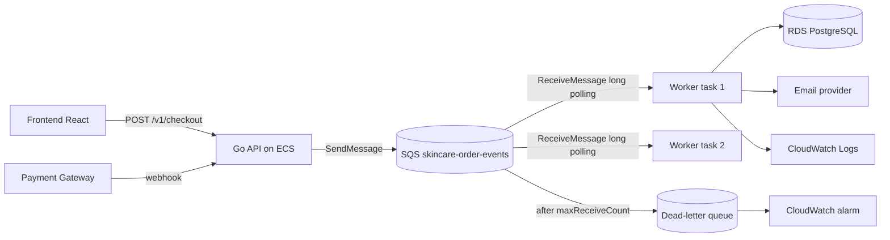
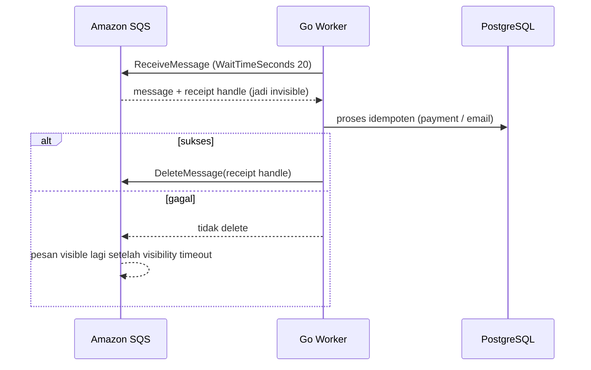
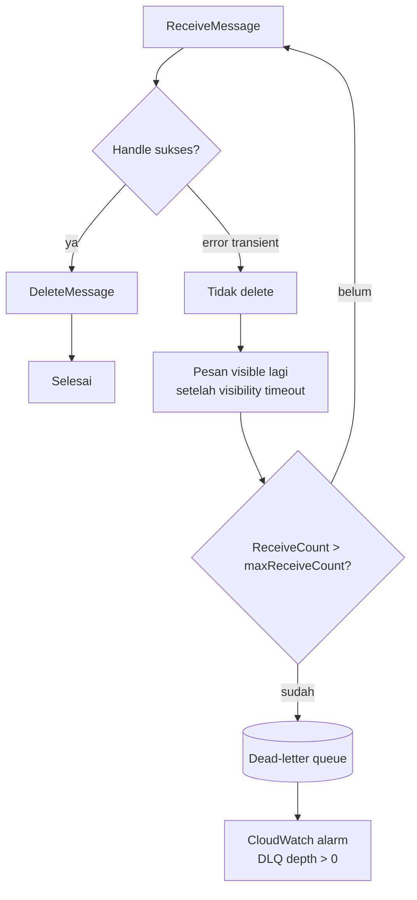
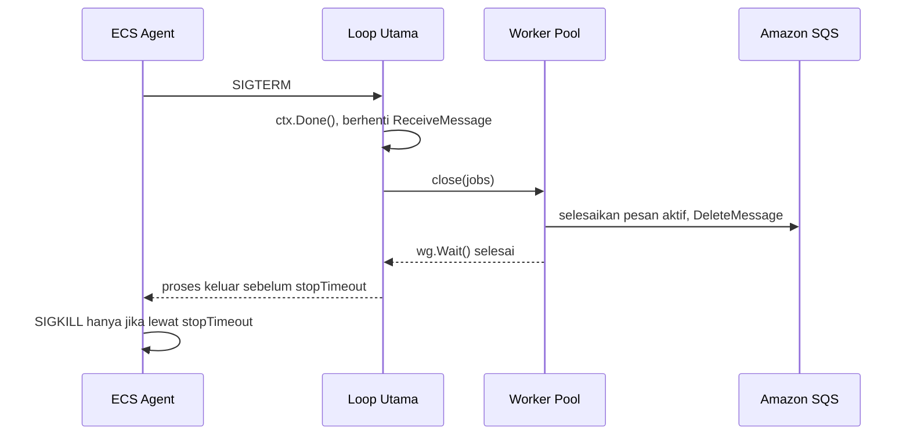
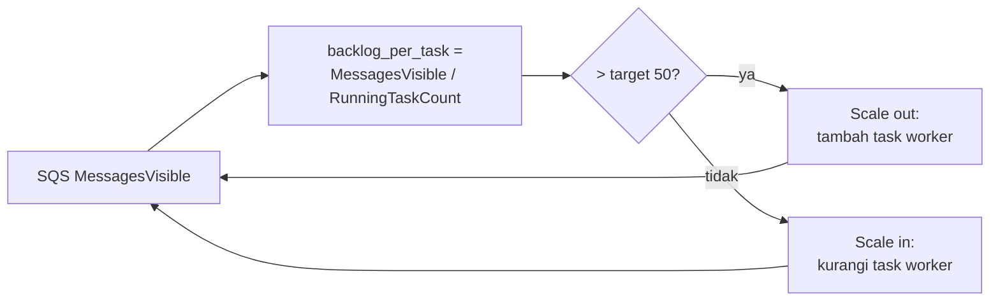

import { Section, Box, Steps, Step, Recap, CardGrid, Card, Chip, Hero, Compare, FileTree, Endpoint, Def } from "@components";

<Hero eyebrow="Roadmap 8 &middot; AWS Deployment" title="Deploy Worker ke <em>ECS</em><br />Consumer SQS yang Reliable">
  <p>Worker pembayaran dan notifikasi kita pisah dari API agar checkout tetap cepat, sementara email order dan event payment diproses async dengan retry, DLQ, dan scaling sendiri.</p>
  <Fragment slot="meta">
    <Chip icon="code">Bahasa: <b>Go 1.26</b></Chip>
    <Chip icon="server">Runtime: <b>ECS Fargate</b></Chip>
    <Chip icon="clock">~70 menit baca</Chip>
  </Fragment>
</Hero>

<Section num="01" id="intro" title="Kenapa Worker Dipisah dari API?" sub="API butuh latency rendah, worker butuh retry dan throughput, dan keduanya jarang punya pola beban yang sama.">

<p class="lead">Di Chapter 5 kamu sudah men-deploy Go API skincare ke ECS Fargate di belakang ALB. Sekarang giliran sisi gelapnya: pekerjaan yang tidak boleh menahan response checkout, tetapi tetap wajib selesai.</p>

Saat pelanggan menekan bayar, API harus segera mengembalikan 201 Created. Tetapi di belakang layar ada email konfirmasi order, pemrosesan event pembayaran dari gateway (Midtrans atau Xendit), sinkronisasi inventory, dan indexing produk. Kalau semua itu dijalankan inline di handler HTTP, satu email provider yang lambat bisa membuat checkout terasa macet, dan satu kegagalan downstream bisa menggagalkan order yang sebenarnya sudah valid.

<Def term="background worker"><p>Program terpisah yang membaca pekerjaan dari queue lalu menjalankannya tanpa menahan response HTTP user. Di proyek skincare, worker memproses event `payment.processed` dan `order.confirmed` lalu mengirim notifikasi.</p></Def>

Kita memisahkan worker dari API karena karakter bebannya berbeda. API butuh latency rendah, port HTTP, dan health check ALB. Worker butuh retry, idempotency, throughput, dan observability. Menyatukannya dalam satu task ECS membuat scaling rancu: saat queue payment menumpuk, kamu terpaksa menaikkan jumlah API task padahal masalahnya ada di sisi consumer, bukan di sisi request masuk.

<Compare aLabel="JS / Laravel: queue worker" bLabel="Go di ECS: consumer SQS" aTone="muted" bTone="violet">
  <Fragment slot="a"><ul><li>Laravel `queue:work` menjalankan job class dari Redis, database, atau SQS dengan banyak abstraksi (retry, failed_jobs, backoff bawaan).</li><li>Node.js sering pakai BullMQ di atas Redis: worker terpisah membaca queue lalu menjalankan processor.</li></ul></Fragment>
  <Fragment slot="b"><ul><li>Worker Go adalah binary berbeda, misalnya `cmd/worker/main.go`, yang melakukan loop `ReceiveMessage` sendiri.</li><li>ECS service worker punya task definition, autoscaling, log group, dan alarm sendiri, terpisah penuh dari API.</li></ul></Fragment>
</Compare>

<Box variant="bridge" icon="🌉" label="Jembatan: dari Laravel Queue ke consumer SQS"><p>Laravel menyembunyikan banyak hal: retry count, backoff, dan failed_jobs terasa otomatis. Di Go dengan SQS semuanya eksplisit dan justru itu kekuatannya: kamu yang menentukan `VisibilityTimeout`, `maxReceiveCount`, kapan `DeleteMessage` dipanggil, dan bagaimana idempotency dijamin. Lebih banyak knob, tetapi setiap knob bisa diaudit saat insiden pembayaran.</p></Box>

<Box variant="note" icon="📝" label="Prasyarat modul ini"><p>Kita asumsikan VPC dengan private subnet, NAT Gateway atau VPC endpoint, ECR repository, CloudWatch log group, Secrets Manager, serta SQS queue plus DLQ sudah ada dari Chapter 4. Pola enqueue dan job di level kode sudah dibahas di Roadmap 4. Modul ini fokus pada deploy worker-nya ke ECS dan membuatnya reliable di production.</p></Box>

</Section>

<Section num="02" id="arsitektur-worker" title="Arsitektur Worker di ECS" sub="Worker berjalan sebagai ECS service tanpa ALB, tanpa port publik, hanya butuh akses SQS dan downstream.">

<p class="lead">Setelah API hidup di ECS, kita tambahkan service baru bernama `skincare-worker`. Service ini bisa memakai image yang sama dengan API, tetapi command-nya menjalankan binary worker, bukan server HTTP.</p>

Bentuknya satu image dengan dua binary: `/app/api` untuk handler HTTP, `/app/worker` untuk consumer SQS. Task definition API menjalankan command API plus port mapping dan target group ALB. Task definition worker menjalankan command worker tanpa port mapping sama sekali, karena worker tidak menerima trafik dari internet, ia justru yang menarik pesan dari SQS.



<p class="fig-cap"><b>Gambar 1.</b> API hanya enqueue event, worker menarik pesan dari SQS lalu memanggil database, email provider, dan menulis log, dengan DLQ sebagai jaring pengaman.</p>

<CardGrid cols={3}>
  <Card><h4>API service</h4><p>Fokus pada HTTP request, validasi, transaksi utama, response cepat, dan health check ALB. Hanya enqueue, tidak memproses job berat.</p></Card>
  <Card><h4>SQS queue</h4><p>Buffer yang menyerap spike checkout sore hari agar lonjakan tidak langsung membanjiri worker, database, atau email provider.</p></Card>
  <Card><h4>Worker service</h4><p>Fokus pada proses async, retry, idempotency, log detail, dan scaling berdasarkan backlog antrian, bukan berdasarkan trafik HTTP.</p></Card>
</CardGrid>

<Box variant="bridge" icon="🌉" label="Jembatan: dari web vs queue:work ke dua ECS service"><p>Di Laravel kamu menjalankan php-fpm untuk web dan proses terpisah `php artisan queue:work` untuk worker. Di ECS, padanannya adalah dua ECS service dari satu image: service `skincare-api` dengan ALB, dan service `skincare-worker` tanpa ALB. Pemisahan ini membuat scaling, permission IAM, shutdown, dan incident response masing-masing presisi.</p></Box>

<Box variant="note" icon="🧭" label="Worker tidak butuh ALB"><p>Worker tidak butuh target group ALB, health check HTTP, maupun public IP, karena ia tidak menerima request masuk. Kesehatannya diukur dari hal lain: apakah backlog queue turun, apakah DLQ tetap kosong, dan apakah log `message processed` terus mengalir.</p></Box>

</Section>

<Section num="03" id="kontrak-sqs" title="Kontrak SQS: Poll, Process, Delete" sub="Consumer yang benar mengikuti satu kontrak: terima pesan, proses sampai selesai, baru hapus.">

<p class="lead">Sebelum menulis satu baris Go, kunci dulu kontrak SQS-nya, karena urutan yang salah di sini menyebabkan kelas bug yang paling mahal di sistem pembayaran: pesan hilang dan event payment yang menggantung.</p>

<Def term="visibility timeout"><p>Durasi (default 30 detik, maksimum 12 jam) saat pesan yang sudah diterima satu consumer disembunyikan dari consumer lain. Jika tidak dihapus sebelum timeout, pesan terlihat lagi dan bisa diproses ulang. Ini retry otomatis bawaan SQS.</p></Def>

<Def term="receipt handle"><p>Token sementara yang dikembalikan `ReceiveMessage` untuk satu penerimaan pesan. `DeleteMessage` membutuhkan receipt handle ini, bukan message ID, dan handle berubah setiap kali pesan diterima ulang.</p></Def>

Alur minimal worker bukan `receive` lalu `delete` lalu `process`. Urutan itu berbahaya karena pesan hilang permanen jika proses gagal setelah delete. Urutan yang benar adalah `receive`, proses sampai selesai, baru `delete`. Dengan kata lain, `DeleteMessage` adalah commit acknowledgement: ia berarti "aku sudah benar-benar memproses ini".



<p class="fig-cap"><b>Gambar 2.</b> DeleteMessage adalah acknowledgement dari worker ke SQS. Tanpa delete, pesan kembali untuk diproses ulang setelah visibility timeout.</p>

<Box variant="warn" icon="⚠️" label="Jangan delete di awal"><p>Menghapus pesan sebelum proses sukses membuat event hilang tanpa jejak saat worker crash, database timeout, atau email provider gagal. Untuk event `payment.processed`, ini berarti order yang sudah dibayar tidak pernah dikonfirmasi, dan pelanggan komplain tanpa kamu bisa melacaknya.</p></Box>

<Box variant="tip" icon="💡" label="Long polling, bukan busy loop"><p>Set `WaitTimeSeconds` ke 20 (maksimum SQS). Long polling membuat `ReceiveMessage` menunggu sampai ada pesan atau 20 detik berlalu, sehingga worker tidak membakar CPU dan biaya request dengan short polling yang menanyakan queue kosong terus-menerus.</p></Box>

</Section>

<Section num="04" id="enqueue-dari-api" title="API Mengirim Event ke Queue" sub="API tidak menjalankan pekerjaan berat, ia hanya membuat event kecil yang stabil untuk worker.">

<p class="lead">Endpoint checkout dan webhook pembayaran tetap dimiliki API. Setelah perubahan utama tersimpan dalam transaksi database, API mengirim event ke SQS, bukan menjalankan emailnya sendiri.</p>

Event tidak perlu membawa seluruh snapshot order. Cukup ID dan metadata minimum, lalu worker membaca data terbaru dari database memakai `order_id`. Event kecil lebih tahan perubahan skema dan tidak akan basi saat worker memprosesnya beberapa detik kemudian.

<Endpoint method="POST" path="/v1/checkout" desc="Buat order dalam satu transaksi, lalu enqueue event order.confirmed untuk email dan downstream" />
<Endpoint method="POST" path="/v1/payments/webhook" desc="Terima notifikasi gateway, lalu enqueue event payment.processed untuk worker" />

Di proyek skincare, harga selalu `int64` rupiah (`PriceRupiah`), bukan float, agar tidak ada pembulatan diam-diam. Event payment membawa `amount` sebagai `int64` itu juga.

```go title="internal/checkout/enqueue.go"
package checkout

import (
	"context"
	"encoding/json"
	"fmt"
	"time"

	"github.com/aws/aws-sdk-go-v2/aws"
	"github.com/aws/aws-sdk-go-v2/service/sqs"
)

// QueuePublisher adalah port kecil: hanya operasi SQS yang dipakai API,
// bukan seluruh *sqs.Client. Ini idiom "accept interfaces".
type QueuePublisher interface {
	SendMessage(ctx context.Context, params *sqs.SendMessageInput, optFns ...func(*sqs.Options)) (*sqs.SendMessageOutput, error)
}

type PaymentProcessedEvent struct {
	EventID     string    `json:"event_id"`
	EventType   string    `json:"event_type"`
	OrderID     string    `json:"order_id"`
	PaymentID   string    `json:"payment_id"`
	UserID      string    `json:"user_id"`
	AmountRupiah int64    `json:"amount_rupiah"`
	CreatedAt   time.Time `json:"created_at"`
}

func EnqueuePaymentProcessed(ctx context.Context, q QueuePublisher, queueURL string, ev PaymentProcessedEvent) error {
	body, err := json.Marshal(ev)
	if err != nil {
		return fmt.Errorf("marshal payment processed event: %w", err)
	}

	_, err = q.SendMessage(ctx, &sqs.SendMessageInput{
		QueueUrl:    aws.String(queueURL),
		MessageBody: aws.String(string(body)),
	})
	if err != nil {
		return fmt.Errorf("send payment processed message: %w", err)
	}

	return nil
}
```

<Box variant="tip" icon="💡" label="Enqueue hanya setelah commit"><p>Kirim event ke SQS hanya setelah transaksi order benar-benar commit. Enqueue di tengah transaksi yang lalu rollback menghasilkan event hantu: worker mencari order yang tidak pernah ada. Pola amannya: commit dulu, baru `SendMessage`, dan terima bahwa enqueue yang gagal cukup di-retry dari sisi API.</p></Box>

<Box variant="bridge" icon="🌉" label="Jembatan: event kecil seperti dispatch job ringan"><p>Di Laravel kamu dispatch `SendOrderConfirmation::dispatch($order->id)`, hanya mengirim ID, bukan seluruh model. Polanya sama di sini: simpan fakta penting di database, kirim referensi ke queue, lalu biarkan worker memuat ulang data terbaru saat memproses.</p></Box>

</Section>

<Section num="05" id="consumer-loop-go" title="Consumer Loop di Go" sub="Worker Go adalah loop panjang dengan context sebagai parameter pertama, long polling, dan error sebagai nilai.">

<p class="lead">Strukturnya tetap testable. Jangan kunci kode langsung ke `*sqs.Client`. Terima interface kecil untuk operasi SQS yang dipakai, lalu inject handler domain. Ini idiom Go: accept interfaces, return structs.</p>

<FileTree title="Struktur worker di modular monolith" tree={`
cmd/
  api/
    main.go                 # entry point API (Chapter 5)
  worker/
    main.go                 # entry point worker ECS
internal/
  worker/
    sqs_worker.go           # receive, process, delete
  payments/
    async_handler.go        # proses event payment.processed
  checkout/
    enqueue.go              # API enqueue event ke SQS
go.mod                      # module github.com/kamu/skincare-backend
`} />

Worker memproses pesan dalam worker pool goroutine. Channel `jobs` jadi buffer internal, dan beberapa goroutine memproses pesan paralel sambil loop utama tetap fokus menarik pesan baru dengan long polling.

```go title="internal/worker/sqs_worker.go"
package worker

import (
	"context"
	"encoding/json"
	"fmt"
	"log/slog"
	"sync"
	"time"

	"github.com/aws/aws-sdk-go-v2/aws"
	"github.com/aws/aws-sdk-go-v2/service/sqs"
	"github.com/aws/aws-sdk-go-v2/service/sqs/types"
)

// SQSClient adalah port: hanya tiga operasi yang dipakai worker.
type SQSClient interface {
	ReceiveMessage(ctx context.Context, params *sqs.ReceiveMessageInput, optFns ...func(*sqs.Options)) (*sqs.ReceiveMessageOutput, error)
	DeleteMessage(ctx context.Context, params *sqs.DeleteMessageInput, optFns ...func(*sqs.Options)) (*sqs.DeleteMessageOutput, error)
}

// Handler adalah logika domain: memproses satu event sampai selesai.
type Handler interface {
	Handle(ctx context.Context, msg Message) error
}

type Message struct {
	EventID   string          `json:"event_id"`
	EventType string          `json:"event_type"`
	OrderID   string          `json:"order_id"`
	PaymentID string          `json:"payment_id"`
	UserID    string          `json:"user_id"`
	Raw       json.RawMessage `json:"-"`
}

type Worker struct {
	client            SQSClient
	queueURL          string
	handler           Handler
	logger            *slog.Logger
	maxMessages       int32
	waitTimeSeconds   int32
	visibilityTimeout int32
	concurrency       int
	processTimeout    time.Duration
	deleteTimeout     time.Duration
}

func New(client SQSClient, queueURL string, handler Handler, logger *slog.Logger) *Worker {
	return &Worker{
		client:            client,
		queueURL:          queueURL,
		handler:           handler,
		logger:            logger,
		maxMessages:       10,  // batch maksimum ReceiveMessage
		waitTimeSeconds:   20,  // long polling maksimum SQS
		visibilityTimeout: 120, // lebih besar dari processTimeout
		concurrency:       5,
		processTimeout:    90 * time.Second,
		deleteTimeout:     10 * time.Second,
	}
}

// Run menjalankan loop sampai context dibatalkan (SIGTERM).
func (w *Worker) Run(ctx context.Context) error {
	jobs := make(chan types.Message)
	var wg sync.WaitGroup

	// Worker pool: beberapa goroutine memproses pesan paralel.
	for i := 0; i < w.concurrency; i++ {
		wg.Add(1)
		go func() {
			defer wg.Done()
			for sqsMsg := range jobs {
				w.handleOne(sqsMsg)
			}
		}()
	}

	for {
		select {
		case <-ctx.Done():
			w.logger.Info("worker stop polling, menunggu pesan aktif selesai")
			close(jobs)
			wg.Wait()
			return nil
		default:
		}

		out, err := w.client.ReceiveMessage(ctx, &sqs.ReceiveMessageInput{
			QueueUrl:            aws.String(w.queueURL),
			MaxNumberOfMessages: w.maxMessages,
			WaitTimeSeconds:     w.waitTimeSeconds,
			VisibilityTimeout:   w.visibilityTimeout,
		})
		if err != nil {
			if ctx.Err() != nil {
				close(jobs)
				wg.Wait()
				return nil
			}
			w.logger.Error("receive message gagal", "error", err)
			continue
		}

		for _, sqsMsg := range out.Messages {
			jobs <- sqsMsg
		}
	}
}

func (w *Worker) handleOne(sqsMsg types.Message) {
	msg, err := decodeMessage(aws.ToString(sqsMsg.Body))
	if err != nil {
		// Payload rusak: log lalu biarkan menuju DLQ via maxReceiveCount.
		w.logger.Error("decode message gagal", "error", err)
		return
	}

	// Context proses terpisah agar pesan aktif tetap punya waktu saat SIGTERM.
	processCtx, cancel := context.WithTimeout(context.Background(), w.processTimeout)
	defer cancel()

	if err := w.handler.Handle(processCtx, msg); err != nil {
		w.logger.Error("proses message gagal", "event_id", msg.EventID, "order_id", msg.OrderID, "error", err)
		return // tidak delete: SQS akan retry setelah visibility timeout
	}

	deleteCtx, cancelDelete := context.WithTimeout(context.Background(), w.deleteTimeout)
	defer cancelDelete()

	_, err = w.client.DeleteMessage(deleteCtx, &sqs.DeleteMessageInput{
		QueueUrl:      aws.String(w.queueURL),
		ReceiptHandle: sqsMsg.ReceiptHandle,
	})
	if err != nil {
		w.logger.Error("delete message gagal", "event_id", msg.EventID, "error", err)
		return
	}

	w.logger.Info("message processed", "event_id", msg.EventID, "order_id", msg.OrderID)
}

func decodeMessage(body string) (Message, error) {
	var msg Message
	if err := json.Unmarshal([]byte(body), &msg); err != nil {
		return Message{}, fmt.Errorf("decode worker message: %w", err)
	}
	msg.Raw = json.RawMessage(body)
	return msg, nil
}
```

`cmd/worker/main.go` adalah program Go biasa: setup logger JSON, load AWS config, buat client SQS, lalu jalankan loop dengan context yang mendengar SIGTERM.

```go title="cmd/worker/main.go"
package main

import (
	"context"
	"log/slog"
	"os"
	"os/signal"
	"syscall"

	"github.com/aws/aws-sdk-go-v2/config"
	"github.com/aws/aws-sdk-go-v2/service/sqs"

	"github.com/kamu/skincare-backend/internal/payments"
	"github.com/kamu/skincare-backend/internal/worker"
)

func main() {
	logger := slog.New(slog.NewJSONHandler(os.Stdout, nil)).With(
		"service", "skincare-worker",
		"env", getenv("APP_ENV", "development"),
	)

	// signal.NotifyContext mengubah SIGTERM dari ECS jadi pembatalan context.
	ctx, stop := signal.NotifyContext(context.Background(), syscall.SIGINT, syscall.SIGTERM)
	defer stop()

	queueURL := os.Getenv("ORDER_EVENTS_QUEUE_URL")
	if queueURL == "" {
		logger.Error("ORDER_EVENTS_QUEUE_URL wajib diisi")
		os.Exit(1)
	}

	cfg, err := config.LoadDefaultConfig(ctx)
	if err != nil {
		logger.Error("load aws config gagal", "error", err)
		os.Exit(1)
	}

	sqsClient := sqs.NewFromConfig(cfg)
	handler := payments.NewAsyncHandler(logger)
	runner := worker.New(sqsClient, queueURL, handler, logger)

	if err := runner.Run(ctx); err != nil {
		logger.Error("worker berhenti dengan error", "error", err)
		os.Exit(1)
	}

	logger.Info("worker shutdown selesai")
}

func getenv(key, fallback string) string {
	if v := os.Getenv(key); v != "" {
		return v
	}
	return fallback
}
```

<Box variant="note" icon="📌" label="Kenapa context.Background saat memproses pesan?"><p>Context utama (yang mendengar SIGTERM) dipakai untuk berhenti menarik pesan baru. Tetapi pesan yang sudah terlanjur diambil diberi context proses sendiri dengan timeout, agar tidak langsung dibatalkan saat sinyal datang. Ini yang membuat shutdown graceful: berhenti menerima yang baru, selesaikan yang sudah di tangan.</p></Box>

<Box variant="tip" icon="💡" label="AWS SDK = aws-sdk-go-v2"><p>Selalu pakai modul v2: `github.com/aws/aws-sdk-go-v2/config`, `.../service/sqs`, dan `.../service/sqs/types` untuk tipe seperti `types.Message`. Konfigurasi di-load lewat `config.LoadDefaultConfig`, dan di ECS ia otomatis memakai kredensial dari task role lewat container metadata, tanpa access key statik di mana pun.</p></Box>

</Section>

<Section num="06" id="idempotency" title="Idempotency untuk Payment Event" sub="SQS Standard bersifat at-least-once, jadi handler payment wajib aman saat memproses event yang sama dua kali.">

<p class="lead">Inilah Student Outcome inti Chapter 6: memproses payment event dan notifikasi secara async dengan benar. Dan kebenaran di sini berarti satu hal yang tidak boleh ditawar: idempotency.</p>

SQS Standard queue menjamin pengiriman at-least-once, bukan exactly-once. Artinya satu event `payment.processed` bisa sampai dua kali ke worker, entah karena retry visibility timeout atau karena duplikasi internal SQS. Tanpa perlindungan, retry yang sehat justru menyebabkan double email konfirmasi atau, jauh lebih parah, double credit ke order yang sama.

<Def term="idempotency"><p>Sifat operasi yang menghasilkan efek sama walau dijalankan berkali-kali dengan input sama. Untuk worker payment, memproses event yang sama dua kali harus menghasilkan tepat satu order terkonfirmasi dan tepat satu email terkirim.</p></Def>

Polanya: simpan kunci unik tiap event di tabel `processed_events` dengan unique constraint pada `event_id`. Sebelum memproses, coba klaim event itu. Jika klaim gagal karena sudah ada, lewati tanpa error (anggap sudah selesai). Database yang menegakkan unique constraint, bukan kode aplikasi yang menebak.

```sql title="migrations/0007_processed_events.sql"
CREATE TABLE processed_events (
    event_id     TEXT PRIMARY KEY,
    event_type   TEXT NOT NULL,
    order_id     TEXT NOT NULL,
    processed_at TIMESTAMPTZ NOT NULL DEFAULT now()
);
```

```go title="internal/payments/async_handler.go"
package payments

import (
	"context"
	"errors"
	"fmt"
	"log/slog"

	"github.com/jackc/pgx/v5"
	"github.com/jackc/pgx/v5/pgxpool"

	"github.com/kamu/skincare-backend/internal/worker"
)

// ErrAlreadyProcessed dipakai untuk menandai event yang sudah pernah diproses.
var ErrAlreadyProcessed = errors.New("event sudah diproses")

type AsyncHandler struct {
	pool   *pgxpool.Pool
	mailer Mailer
	logger *slog.Logger
}

type Mailer interface {
	SendOrderConfirmation(ctx context.Context, orderID, userID string) error
}

func NewAsyncHandler(pool *pgxpool.Pool, mailer Mailer, logger *slog.Logger) *AsyncHandler {
	return &AsyncHandler{pool: pool, mailer: mailer, logger: logger}
}

func (h *AsyncHandler) Handle(ctx context.Context, msg worker.Message) error {
	switch msg.EventType {
	case "payment.processed", "order.confirmed":
		// jenis event yang kita tangani
	default:
		// Event tak dikenal: anggap selesai, jangan retry selamanya.
		h.logger.Warn("event type tak didukung, dilewati", "event_type", msg.EventType, "event_id", msg.EventID)
		return nil
	}

	// 1. Klaim event lewat unique constraint. Duplikat = sudah diproses.
	if err := h.claimEvent(ctx, msg); err != nil {
		if errors.Is(err, ErrAlreadyProcessed) {
			h.logger.Info("event duplikat dilewati", "event_id", msg.EventID, "order_id", msg.OrderID)
			return nil
		}
		return fmt.Errorf("klaim event: %w", err)
	}

	// 2. Efek samping bisnis: kirim notifikasi setelah klaim sukses.
	if err := h.mailer.SendOrderConfirmation(ctx, msg.OrderID, msg.UserID); err != nil {
		return fmt.Errorf("kirim konfirmasi order: %w", err)
	}

	h.logger.Info("payment event diproses", "event_id", msg.EventID, "order_id", msg.OrderID)
	return nil
}

// claimEvent menyisipkan event_id. Jika sudah ada, kembalikan ErrAlreadyProcessed.
func (h *AsyncHandler) claimEvent(ctx context.Context, msg worker.Message) error {
	const q = `
		INSERT INTO processed_events (event_id, event_type, order_id)
		VALUES ($1, $2, $3)
		ON CONFLICT (event_id) DO NOTHING`

	tag, err := h.pool.Exec(ctx, q, msg.EventID, msg.EventType, msg.OrderID)
	if err != nil && !errors.Is(err, pgx.ErrNoRows) {
		return err
	}
	if tag.RowsAffected() == 0 {
		return ErrAlreadyProcessed
	}
	return nil
}
```

<Box variant="warn" icon="⚠️" label="Retry tidak menggantikan idempotency"><p>Retry SQS membuat sistem tahan error sementara, tetapi tidak melindungi dari pemrosesan ganda. Keduanya wajib bersama: retry untuk tidak kehilangan event, idempotency untuk tidak menggandakan efeknya. Salah satu saja tidak cukup untuk uang pelanggan.</p></Box>

<Box variant="bridge" icon="🌉" label="Jembatan: dari ShouldBeUnique ke unique constraint"><p>Di Laravel kamu mungkin pakai `ShouldBeUnique` atau cache lock untuk mencegah job ganda. Di Go kita tidak mengandalkan lock di memori, melainkan sumber kebenaran yang sama dengan order: PostgreSQL. Unique constraint pada `event_id` adalah penjaga idempotency yang tahan crash, restart, dan banyak task worker sekaligus.</p></Box>

</Section>

<Section num="07" id="retry-dlq" title="Retry, Backoff, dan Dead-Letter Queue" sub="Retry sementara biar SQS yang urus, retry di dalam handler pakai backoff, kegagalan permanen jatuh ke DLQ.">

<p class="lead">Retry di SQS terjadi otomatis ketika worker gagal menghapus pesan sebelum visibility timeout habis. Worker tidak perlu sleep dan mengirim ulang pesan sendiri untuk kegagalan antar-redelivery.</p>

Jika handler mengembalikan error dan worker tidak memanggil `DeleteMessage`, SQS membuat pesan terlihat lagi setelah visibility timeout, lalu menambah `ReceiveCount`. Setelah `ReceiveCount` melewati `maxReceiveCount`, redrive policy memindahkan pesan ke DLQ. Inilah retry tingkat-pesan yang dijamin SQS.

```json title="infra/sqs-redrive-policy.json"
{
  "RedrivePolicy": "{\"deadLetterTargetArn\":\"arn:aws:sqs:ap-southeast-1:123456789012:skincare-order-events-dlq\",\"maxReceiveCount\":\"5\"}"
}
```



<p class="fig-cap"><b>Gambar 3.</b> Alur retry SQS: gagal berarti tidak delete, pesan kembali sampai maxReceiveCount, lalu jatuh ke DLQ yang memicu alarm.</p>

Ada dua tingkat retry yang perlu kamu bedakan. Tingkat pesan diurus SQS (visibility timeout plus maxReceiveCount). Tingkat operasi diurus handler: untuk satu panggilan downstream yang sering gagal sesaat, seperti email provider rate limit, retry lokal dengan exponential backoff lebih cepat dan tidak membebani siklus visibility timeout.

```go title="internal/payments/backoff.go"
package payments

import (
	"context"
	"time"
)

// retryWithBackoff mengulang fn dengan jeda yang membesar (250ms, 500ms, 1s).
// Hormati context: berhenti segera saat dibatalkan, mis. saat SIGTERM.
func retryWithBackoff(ctx context.Context, attempts int, fn func() error) error {
	delay := 250 * time.Millisecond
	var err error
	for i := 0; i < attempts; i++ {
		if err = fn(); err == nil {
			return nil
		}
		select {
		case <-ctx.Done():
			return ctx.Err()
		case <-time.After(delay):
			delay *= 2
		}
	}
	return err
}
```

<CardGrid cols={3}>
  <Card><h4>Transient error</h4><p>Database timeout, email provider rate limit, atau network blip. Biarkan SQS retry, atau retry lokal dengan backoff untuk satu operasi.</p></Card>
  <Card><h4>Permanent error</h4><p>Payload tidak valid atau order tidak ada. Log detail dan lewati (return nil) atau biarkan menuju DLQ, jangan retry tanpa batas.</p></Card>
  <Card><h4>Poison message</h4><p>Pesan yang selalu gagal. DLQ mengisolasinya agar queue utama tetap bergerak dan tidak macet oleh satu pesan rusak.</p></Card>
</CardGrid>

<Box variant="warn" icon="⚠️" label="Visibility timeout harus lebih besar dari waktu proses"><p>Jika handler payment butuh 90 detik tetapi visibility timeout 30 detik, pesan muncul lagi saat masih diproses, dan task lain ikut memprosesnya paralel. Hasilnya double processing. Patokan aman: `visibilityTimeout` jauh lebih besar dari `processTimeout`, dengan margin untuk delete.</p></Box>

<Box variant="bridge" icon="🌉" label="Jembatan: dari failed_jobs ke DLQ"><p>Di Laravel, job yang gagal melewati `$tries` masuk ke tabel `failed_jobs` dan bisa di-`queue:retry`. Di AWS, padanannya adalah DLQ: pesan yang gagal lebih dari `maxReceiveCount` pindah ke sana, lalu kamu bisa men-redrive-nya kembali ke queue utama setelah akar masalahnya diperbaiki.</p></Box>

</Section>

<Section num="08" id="graceful-shutdown" title="Graceful Shutdown saat ECS Kirim SIGTERM" sub="Berhenti menarik pesan baru, selesaikan pesan yang sudah di tangan, baru biarkan container mati.">

<p class="lead">Saat rolling deploy, scale-in, atau penghentian task, ECS mengirim SIGTERM lalu menunggu sebelum SIGKILL. Worker harus memanfaatkan jendela itu, bukan mati di tengah memproses payment.</p>

Di API server, graceful shutdown berarti berhenti menerima HTTP request lalu menunggu request in-flight selesai (`srv.Shutdown`). Di worker, artinya berhenti memanggil `ReceiveMessage`, lalu memberi waktu pesan yang sudah diterima untuk selesai diproses dan dihapus dari SQS. Loop di Section 5 sudah melakukan ini: saat `ctx.Done()`, ia menutup channel `jobs` dan menunggu worker pool dengan `wg.Wait()`.



<p class="fig-cap"><b>Gambar 4.</b> Urutan graceful shutdown worker. Pesan yang sedang diproses tetap diselesaikan dan dihapus sebelum container benar-benar berhenti.</p>

<Steps>
  <Step><b>Tangkap SIGTERM</b><p>`signal.NotifyContext` mengubah sinyal dari ECS menjadi pembatalan context utama yang dipakai loop polling.</p></Step>
  <Step><b>Stop polling</b><p>Loop worker keluar sebelum memanggil `ReceiveMessage` berikutnya, lalu menutup channel `jobs`.</p></Step>
  <Step><b>Selesaikan pesan aktif</b><p>Handler memakai context proses terpisah dengan timeout, jadi pesan yang sudah diterima tetap punya waktu untuk diproses dan dihapus.</p></Step>
  <Step><b>Atur stopTimeout ECS</b><p>`stopTimeout` di container definition harus lebih besar dari durasi normal memproses satu pesan, agar Fargate tidak SIGKILL prematur.</p></Step>
</Steps>

<Box variant="tip" icon="💡" label="Patokan tiga angka"><p>Urutkan begini: `processTimeout` kurang dari `visibilityTimeout`, dan `stopTimeout` ECS cukup besar untuk menampung pesan aktif paling lambat. Misalnya processTimeout 90 detik, visibilityTimeout 120 detik, stopTimeout 120 detik. Pesan yang tidak sempat selesai saat shutdown tidak hilang, ia hanya kembali ke queue lalu diproses task lain.</p></Box>

</Section>

<Section num="09" id="task-definition-service" title="Task Definition dan ECS Service Worker" sub="Mirip task definition API, tetapi tanpa portMappings, tanpa ALB, dengan IAM task role yang lebih sempit.">

<p class="lead">Satu image membawa dua binary. Task definition worker mengarahkan command ke `/app/worker` dan, berbeda dengan API, tidak punya `portMappings` maupun target group ALB.</p>

<Box variant="bridge" icon="🌉" label="Jembatan: dari task-definition API ke task-definition worker"><p>Dibanding task definition API di Chapter 5, perbedaannya jelas: tidak ada `portMappings`, tidak ada `load-balancers` di service, dan `command` menunjuk binary worker. Yang tetap sama: `awslogs` ke CloudWatch, secret via `valueFrom`, dan dua IAM role (execution role untuk infra, task role untuk kode).</p></Box>

```json title="task-definition-worker.json"
{
  "family": "skincare-worker",
  "networkMode": "awsvpc",
  "requiresCompatibilities": ["FARGATE"],
  "cpu": "512",
  "memory": "1024",
  "executionRoleArn": "arn:aws:iam::123456789012:role/ecsTaskExecutionRole",
  "taskRoleArn": "arn:aws:iam::123456789012:role/skincare-worker-task-role",
  "containerDefinitions": [
    {
      "name": "worker",
      "image": "123456789012.dkr.ecr.ap-southeast-1.amazonaws.com/skincare-api:8f3a2c1",
      "essential": true,
      "command": ["/app/worker"],
      "stopTimeout": 120,
      "environment": [
        { "name": "APP_ENV", "value": "production" },
        { "name": "AWS_REGION", "value": "ap-southeast-1" },
        { "name": "ORDER_EVENTS_QUEUE_URL", "value": "https://sqs.ap-southeast-1.amazonaws.com/123456789012/skincare-order-events" }
      ],
      "secrets": [
        {
          "name": "DATABASE_URL",
          "valueFrom": "arn:aws:secretsmanager:ap-southeast-1:123456789012:secret:skincare/prod/database-url-AbCdEf"
        }
      ],
      "logConfiguration": {
        "logDriver": "awslogs",
        "options": {
          "awslogs-group": "/ecs/skincare-worker",
          "awslogs-region": "ap-southeast-1",
          "awslogs-stream-prefix": "worker"
        }
      },
      "readonlyRootFilesystem": true
    }
  ]
}
```

Task role worker harus presisi. Worker hanya butuh menarik pesan, menghapusnya, membaca atribut queue, dan akses secret yang benar-benar dipakai. Jangan beri `sqs:*` atau resource `*`.

```json title="worker-task-role-policy.json"
{
  "Version": "2012-10-17",
  "Statement": [
    {
      "Effect": "Allow",
      "Action": [
        "sqs:ReceiveMessage",
        "sqs:DeleteMessage",
        "sqs:DeleteMessageBatch",
        "sqs:GetQueueAttributes"
      ],
      "Resource": "arn:aws:sqs:ap-southeast-1:123456789012:skincare-order-events"
    }
  ]
}
```

Register task definition, lalu buat ECS service tanpa load balancer, di private subnet, mulai dari satu task.

```bash title="Terminal"
aws ecs register-task-definition \
  --cli-input-json file://task-definition-worker.json \
  --region ap-southeast-1

aws ecs create-service \
  --cluster skincare-prod \
  --service-name skincare-worker \
  --task-definition skincare-worker \
  --desired-count 1 \
  --launch-type FARGATE \
  --network-configuration "awsvpcConfiguration={subnets=[subnet-private-a,subnet-private-b],securityGroups=[sg-worker],assignPublicIp=DISABLED}" \
  --region ap-southeast-1
```

<CardGrid cols={2}>
  <Card><h4>Tanpa portMappings</h4><p>Worker tidak listen di port apa pun. Tidak ada containerPort, tidak ada appProtocol, karena ia menarik pesan, bukan menerima request.</p></Card>
  <Card><h4>Tanpa load-balancers</h4><p>`create-service` worker tidak punya flag `--load-balancers`. Kesehatannya diukur dari backlog dan DLQ, bukan health check ALB.</p></Card>
  <Card><h4>Private subnet</h4><p>Worker hidup di private subnet tanpa public IP. Outbound ke SQS dan Secrets Manager lewat NAT Gateway atau VPC endpoint.</p></Card>
  <Card><h4>stopTimeout 120</h4><p>Memberi worker waktu menyelesaikan pesan aktif saat SIGTERM, sebelum Fargate mengirim SIGKILL.</p></Card>
</CardGrid>

<Box variant="warn" icon="⚠️" label="Task role, bukan execution role, untuk SQS"><p>Izin `sqs:ReceiveMessage` dan `sqs:DeleteMessage` dipakai oleh kode Go via SDK, jadi ia masuk task role, bukan execution role. Execution role hanya mengurus pull image, awslogs, dan inject secret. Salah menaruh izin SQS di execution role membuat worker gagal mengakses queue dengan AccessDenied saat runtime.</p></Box>

</Section>

<Section num="10" id="scaling-worker" title="Scaling Worker dari Backlog Queue" sub="Worker diskalakan dari panjang antrian, bukan dari CPU saja, karena bottleneck-nya sering di downstream.">

<p class="lead">Untuk worker SQS, CPU bisa rendah walau queue panjang, karena bottleneck sering ada di database, email provider, atau rate limit gateway. Metrik yang lebih dekat ke masalah adalah jumlah pesan yang menunggu diproses.</p>

AWS menyebut `ApproximateNumberOfMessagesVisible` sebagai metrik backlog antrian. Pola scaling yang direkomendasikan untuk worker adalah Backlog per Task: bagi jumlah pesan visible dengan jumlah task running, lalu target tracking menjaga angka itu di nilai tertentu (misalnya 50 pesan per task). Saat backlog naik, jumlah task bertambah; saat queue kosong, task menyusut.



<p class="fig-cap"><b>Gambar 5.</b> Target tracking berbasis backlog per task: jumlah task worker mengikuti panjang antrian, bukan utilisasi CPU.</p>

Daftarkan service worker sebagai scalable target lebih dulu, dengan kapasitas minimum dan maksimum.

```bash title="Terminal"
aws application-autoscaling register-scalable-target \
  --service-namespace ecs \
  --scalable-dimension ecs:service:DesiredCount \
  --resource-id service/skincare-prod/skincare-worker \
  --min-capacity 1 \
  --max-capacity 10 \
  --region ap-southeast-1
```

Kebijakan target tracking memakai metric math untuk menghitung backlog per task dari dua metrik: `ApproximateNumberOfMessagesVisible` (AWS/SQS) dibagi `RunningTaskCount` (ECS Container Insights).

```json title="worker-scaling-policy.json"
{
  "TargetValue": 50,
  "ScaleOutCooldown": 60,
  "ScaleInCooldown": 300,
  "CustomizedMetricSpecification": {
    "Metrics": [
      {
        "Id": "m1",
        "MetricStat": {
          "Metric": {
            "Namespace": "AWS/SQS",
            "MetricName": "ApproximateNumberOfMessagesVisible",
            "Dimensions": [
              { "Name": "QueueName", "Value": "skincare-order-events" }
            ]
          },
          "Stat": "Sum"
        },
        "ReturnData": false
      },
      {
        "Id": "m2",
        "MetricStat": {
          "Metric": {
            "Namespace": "ECS/ContainerInsights",
            "MetricName": "RunningTaskCount",
            "Dimensions": [
              { "Name": "ClusterName", "Value": "skincare-prod" },
              { "Name": "ServiceName", "Value": "skincare-worker" }
            ]
          },
          "Stat": "Average"
        },
        "ReturnData": false
      },
      {
        "Id": "e1",
        "Expression": "m1 / MAX([m2, 1])",
        "Label": "backlog_per_task",
        "ReturnData": true
      }
    ]
  }
}
```

```bash title="Terminal"
aws application-autoscaling put-scaling-policy \
  --service-namespace ecs \
  --scalable-dimension ecs:service:DesiredCount \
  --resource-id service/skincare-prod/skincare-worker \
  --policy-name skincare-worker-backlog-per-task \
  --policy-type TargetTrackingScaling \
  --target-tracking-scaling-policy-configuration file://worker-scaling-policy.json \
  --region ap-southeast-1
```

<Box variant="tip" icon="💡" label="Scale out cepat, scale in pelan"><p>`ScaleOutCooldown` kecil (60 detik) agar worker cepat menambah kapasitas saat backlog menumpuk. `ScaleInCooldown` besar (300 detik) agar penyusutan tidak terlalu agresif dan tidak gonta-ganti task saat backlog naik turun. Asimetri ini menghindari flapping.</p></Box>

<Box variant="note" icon="📊" label="Container Insights perlu aktif"><p>Metrik `RunningTaskCount` di `ECS/ContainerInsights` hanya tersedia bila Container Insights aktif di cluster. Jika belum, aktifkan di level cluster, atau publikasikan jumlah task sebagai custom metric sendiri dari aplikasi. Tanpa salah satunya, metric math backlog per task tidak punya pembagi.</p></Box>

</Section>

<Section num="11" id="hands-on" title="Hands-on Deploy Worker" sub="Dorong image dua-binary, buat SQS plus DLQ, register task definition worker, jalankan service, pasang scaling dan alarm.">

<p class="lead">Latihan ini mengasumsikan API skincare sudah hidup di ECS dari Chapter 5. Fokusnya menambahkan service worker yang reliable dengan retry, idempotency, dan scaling.</p>

<Steps>
  <Step><b>Tambah dependency AWS SDK</b><p>Pasang `config` dan `service/sqs` dari aws-sdk-go-v2 agar worker bisa memakai IAM task role dari ECS.</p></Step>
  <Step><b>Build image dua binary</b><p>Dockerfile multi-stage membangun `/app/api` dan `/app/worker`, lalu task definition memilih command yang sesuai.</p></Step>
  <Step><b>Buat SQS dan DLQ</b><p>Atur redrive policy dengan `maxReceiveCount` realistis (misalnya 5) untuk pekerjaan yang aman diulang seperti email dan event payment.</p></Step>
  <Step><b>Register task definition worker</b><p>Pakai task role yang hanya boleh ReceiveMessage, DeleteMessage, GetQueueAttributes, dan baca secret yang diperlukan.</p></Step>
  <Step><b>Create ECS service worker</b><p>Jalankan di private subnet tanpa load balancer, mulai dari desired-count 1.</p></Step>
  <Step><b>Pasang autoscaling dan alarm</b><p>Scale dari backlog per task, lalu buat alarm DLQ depth lebih besar dari nol agar pesan gagal tidak diam-diam.</p></Step>
</Steps>

```bash title="Terminal"
go get github.com/aws/aws-sdk-go-v2/config github.com/aws/aws-sdk-go-v2/service/sqs
go test ./...

docker build -t skincare-api:$(git rev-parse --short HEAD) .
docker tag skincare-api:$(git rev-parse --short HEAD) \
  123456789012.dkr.ecr.ap-southeast-1.amazonaws.com/skincare-api:$(git rev-parse --short HEAD)
docker push 123456789012.dkr.ecr.ap-southeast-1.amazonaws.com/skincare-api:$(git rev-parse --short HEAD)
```

Buat DLQ lebih dulu, lalu queue utama yang menunjuk DLQ lewat redrive policy.

```bash title="Terminal"
# 1. Buat dead-letter queue
DLQ_URL=$(aws sqs create-queue \
  --queue-name skincare-order-events-dlq \
  --query QueueUrl --output text --region ap-southeast-1)

DLQ_ARN=$(aws sqs get-queue-attributes \
  --queue-url "$DLQ_URL" \
  --attribute-names QueueArn \
  --query "Attributes.QueueArn" --output text --region ap-southeast-1)

# 2. Buat queue utama dengan redrive ke DLQ (maxReceiveCount 5)
aws sqs create-queue \
  --queue-name skincare-order-events \
  --attributes "{\"RedrivePolicy\":\"{\\\"deadLetterTargetArn\\\":\\\"$DLQ_ARN\\\",\\\"maxReceiveCount\\\":\\\"5\\\"}\",\"VisibilityTimeout\":\"120\"}" \
  --region ap-southeast-1
```

Setelah service jalan, alarm DLQ adalah jaring pengaman wajib. Satu pesan di DLQ berarti ada event payment atau notifikasi yang gagal berulang dan butuh mata manusia.

```bash title="Terminal"
aws cloudwatch put-metric-alarm \
  --alarm-name skincare-worker-dlq-not-empty \
  --namespace AWS/SQS \
  --metric-name ApproximateNumberOfMessagesVisible \
  --dimensions Name=QueueName,Value=skincare-order-events-dlq \
  --statistic Sum \
  --period 60 \
  --evaluation-periods 1 \
  --threshold 0 \
  --comparison-operator GreaterThanThreshold \
  --alarm-description "DLQ worker skincare berisi pesan gagal" \
  --alarm-actions arn:aws:sns:ap-southeast-1:123456789012:skincare-prod-alerts \
  --treat-missing-data notBreaching \
  --region ap-southeast-1
```

<Box variant="tip" icon="✅" label="Validasi deploy"><p>Kirim satu pesan test ke SQS, lihat log `message processed` di `/ecs/skincare-worker`, lalu pastikan pesan tidak muncul lagi di queue utama dan DLQ tetap kosong. Kirim pesan dengan `event_id` yang sama dua kali untuk membuktikan idempotency: hanya satu yang diproses, satu lagi dilewati.</p></Box>

<Box variant="warn" icon="⚠️" label="Fargate bukan VPS"><p>Worker tidak bisa kamu SSH. Debug lewat CloudWatch Logs (`aws logs tail /ecs/skincare-worker --follow`), deployment events service, dan kedalaman DLQ. Untuk masuk ke container yang berjalan, pakai ECS Exec (`aws ecs execute-command`), bukan SSH.</p></Box>

</Section>

<Section num="12" id="ringkasan" title="Ringkasan & Poin Penting" sub="Worker ECS membuat backend skincare tahan spike, observable, dan bisa diskalakan mandiri.">

<p class="lead">Dengan worker SQS terpisah, checkout tetap cepat, sementara email order dan event pembayaran diproses async dengan jaminan retry, idempotency, dan scaling sendiri.</p>

<Recap title="Yang Wajib Menempel">
  <ul>
    <li>Worker adalah ECS service terpisah dari API: satu image, dua binary, command worker tanpa portMappings dan tanpa ALB.</li>
    <li>Kontrak SQS yang benar adalah ReceiveMessage (long polling 20 detik), proses idempoten, lalu DeleteMessage hanya setelah sukses; delete adalah acknowledgement.</li>
    <li>Loop Go memakai context sebagai parameter pertama, worker pool goroutine, dan error sebagai nilai, dengan context proses terpisah agar pesan aktif selesai saat SIGTERM.</li>
    <li>SQS Standard bersifat at-least-once, jadi handler payment wajib idempoten lewat unique constraint event_id di tabel processed_events, bukan lock di memori.</li>
    <li>Retry tingkat pesan diurus SQS (visibility timeout plus maxReceiveCount), retry tingkat operasi pakai exponential backoff yang menghormati context.</li>
    <li>DLQ menampung poison message setelah maxReceiveCount, dan alarm DLQ depth &gt; 0 wajib karena tiap pesan di DLQ berarti order, payment, atau email tidak selesai.</li>
    <li>Graceful shutdown berarti berhenti polling, selesaikan pesan aktif, lalu keluar sebelum stopTimeout; atur processTimeout &lt; visibilityTimeout &le; stopTimeout.</li>
    <li>Scaling worker memakai backlog per task (MessagesVisible dibagi RunningTaskCount), bukan CPU, dengan scale out cepat dan scale in pelan.</li>
    <li>Task role worker sempit (ReceiveMessage, DeleteMessage, GetQueueAttributes, secret terbatas), terpisah dari execution role yang mengurus pull image dan awslogs.</li>
  </ul>
</Recap>

Untuk proyek online shop skincare, pola ini menjalankan email konfirmasi order, pemrosesan event `payment.processed` dari gateway, sinkronisasi inventory, dan indexing produk, semua tanpa menahan response checkout. Custom metric `OrdersCreated` dan `PaymentProcessed` dari Roadmap 5 mengalir lewat worker ini, dan alarm SQS backlog plus DLQ depth dari Chapter 9 menjaganya tetap sehat.

<Box variant="note" icon="🧭" label="Langkah berikutnya"><p>Setelah worker hidup, Chapter 7 menyambung RDS PostgreSQL privat dengan connection pool yang tepat (ingat: banyak task worker berarti banyak koneksi), Chapter 8 menyimpan gambar produk di S3 dan CloudFront, lalu Chapter 9 memasang observability penuh untuk CPU, memory, ALB 5xx, backlog SQS, dan DLQ depth yang sudah kamu mulai di sini.</p></Box>

</Section>
