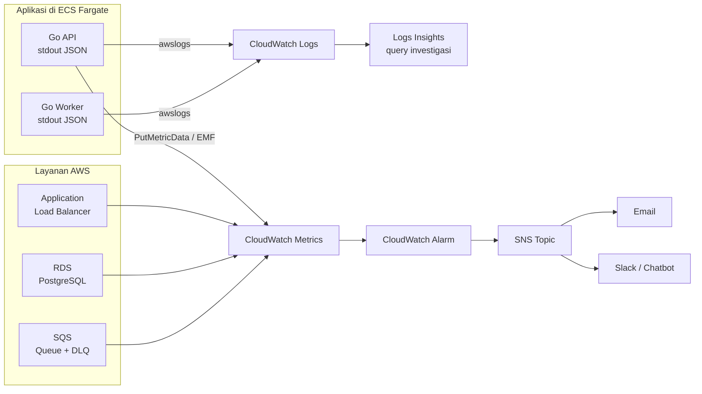
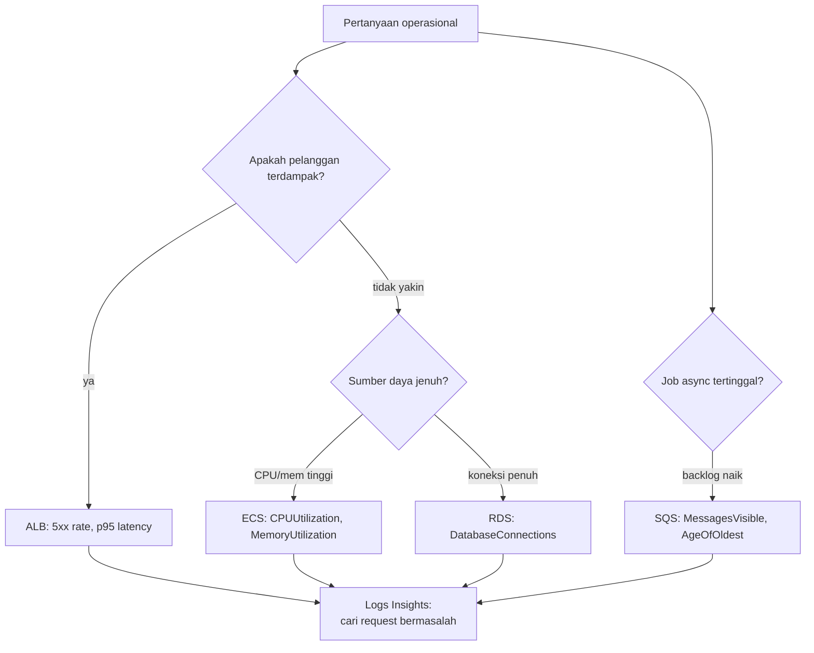
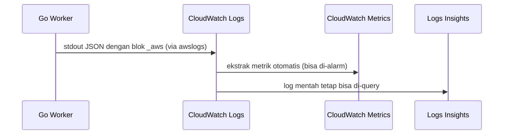
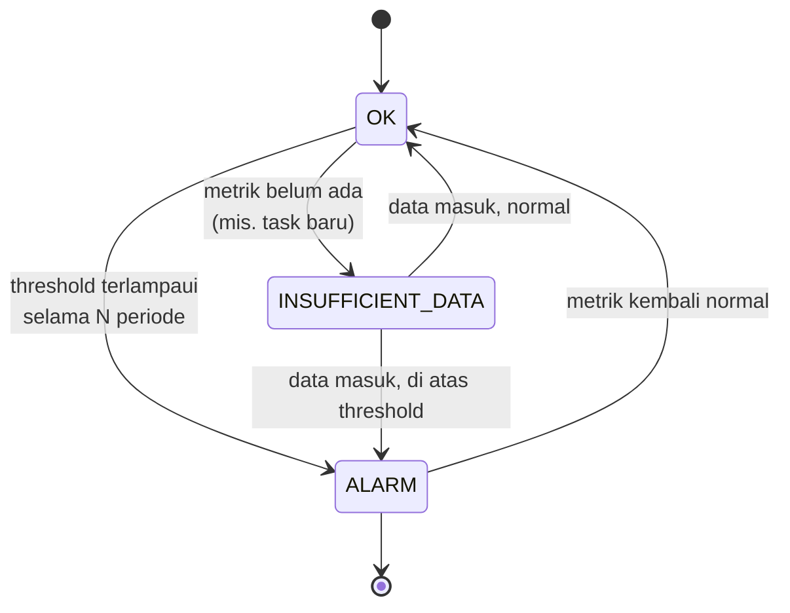
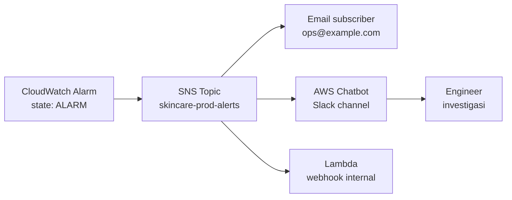

import { Section, Box, Steps, Step, Recap, CardGrid, Card, Chip, Hero, Compare, FileTree, Endpoint, Def } from "@components";

<Hero eyebrow="Roadmap 8 &middot; Docker, CI/CD, dan AWS Deployment" title="Observability:<br /><em>Memantau Backend</em> di Production">
  <p>Setelah backend skincare berjalan di ECS, kita butuh sinyal yang jelas dari log, metrik, alarm, dan notifikasi, bukan menatap layar dan menebak.</p>
  <Fragment slot="meta">
    <Chip icon="code">Bahasa: <b>Go 1.26</b></Chip>
    <Chip icon="server">Stack: <b>ECS &middot; CloudWatch &middot; SNS</b></Chip>
    <Chip icon="clock">~75 menit baca</Chip>
  </Fragment>
</Hero>

<Section num="01" id="intro" title="Kenapa Observability?" sub="Production bukan tempat menebak, ia harus memberi sinyal sebelum pelanggan melihat error.">

<p class="lead">Di local development kamu menatap terminal, menaruh `fmt.Println`, lalu restart server. Di production hal itu tidak mungkin, dan justru di sanalah uang pelanggan berpindah.</p>

Di mesin lokal, satu request adalah dunia yang utuh. Kamu lihat log-nya, set breakpoint, ulangi sampai paham. Di production backend skincare, API berjalan di beberapa ECS task sekaligus, worker memproses event pembayaran di task lain, database ada di RDS, dan ribuan request datang dari banyak pelanggan secara bersamaan. Tidak ada satu terminal yang bisa kamu tatap. Kalau checkout melambat pukul dua pagi, kamu butuh sistem yang sudah merekam jawaban sebelum pertanyaannya muncul.

<Box variant="bridge" icon="🌉" label="Jembatan: dari console.log ke observability"><p>Di React atau Laravel, `console.log` dan `storage/logs/laravel.log` cukup untuk debugging awal di satu mesin. Di AWS, log harus terpusat (semua task menulis ke satu tempat), bisa dicari (query, bukan scroll), punya metrik (angka agregat lintas waktu), dan bisa memicu alarm saat pola buruk mulai muncul. Idenya sama, skalanya beda.</p></Box>

<Def term="observability"><p>Kemampuan sistem menjelaskan apa yang sedang terjadi dari luar, lewat log, metrics, dan alarm, tanpa kamu harus SSH ke server atau menambah kode baru tiap kali ada pertanyaan baru.</p></Def>

Tiga pilar yang kita pakai di modul ini punya peran berbeda dan saling melengkapi. Memahami beda perannya penting agar kamu tidak memaksa satu pilar menjawab pertanyaan yang bukan bidangnya.

<CardGrid cols={3}>
  <Card><h4>Logs &rarr; "apa yang terjadi"</h4><p>Catatan per-kejadian yang kaya konteks. Bagus untuk investigasi satu order atau satu request yang gagal.</p></Card>
  <Card><h4>Metrics &rarr; "seberapa parah"</h4><p>Angka agregat lintas waktu. Bagus untuk melihat tren, p95 latency, dan kesehatan sistem secara kuantitatif.</p></Card>
  <Card><h4>Alarms &rarr; "kapan bertindak"</h4><p>Aturan di atas metrik yang memicu notifikasi. Bagus agar manusia atau autoscaling bereaksi tepat waktu.</p></Card>
</CardGrid>

Fokus modul ini adalah observability minimal yang realistis untuk backend online shop skincare: log dari ECS masuk ke CloudWatch Logs, investigasi memakai Logs Insights, metrik infrastruktur datang dari ECS, ALB, RDS, dan SQS, metrik bisnis datang dari aplikasi Go, lalu alarm dikirim ke SNS dan diteruskan ke channel yang dipantau tim.

<Box variant="note" icon="📌" label="Sumber resmi yang perlu kamu buka saat implementasi"><p>Rujukan utama: <a href="https://docs.aws.amazon.com/AmazonECS/latest/developerguide/using_awslogs.html">ECS awslogs</a>, <a href="https://docs.aws.amazon.com/AmazonCloudWatch/latest/logs/CWL_QuerySyntax.html">CloudWatch Logs Insights</a>, <a href="https://docs.aws.amazon.com/AmazonECS/latest/developerguide/cloudwatch-metrics.html">ECS metrics</a>, dan <a href="https://docs.aws.amazon.com/AmazonCloudWatch/latest/monitoring/CloudWatch_Embedded_Metric_Format.html">Embedded Metric Format</a>.</p></Box>

</Section>

<Section num="02" id="peta-observability" title="Peta Observability Production" sub="Observability bukan satu fitur, melainkan alur sinyal dari aplikasi ke manusia yang perlu bertindak.">

<p class="lead">Sebelum menyentuh kode, pegang dulu peta besarnya: dari mana sinyal lahir, di mana ia disimpan, dan bagaimana ia sampai ke mata manusia.</p>



<p class="fig-cap"><b>Gambar 1.</b> Alur observability minimal: aplikasi dan layanan AWS mengirim log dan metrik ke CloudWatch, alarm menilai kondisi, lalu SNS meneruskan notifikasi ke manusia.</p>

Perhatikan dua jalur yang berpisah. Jalur kiri (log) bersifat naratif dan kaya detail, dipakai saat kamu sudah tahu ada masalah dan ingin tahu kenapa. Jalur kanan (metric ke alarm) bersifat agregat dan otomatis, dipakai agar kamu tahu ada masalah sejak awal. Sistem observability yang sehat memakai keduanya: alarm menunjuk ke jam dan service yang bermasalah, Logs Insights menjawab detail per request di jam itu.

<Compare aLabel="Datadog / New Relic / Sentry" bLabel="CloudWatch native AWS" aTone="muted" bTone="violet">
  <Fragment slot="a"><ul><li>UI dashboard matang, korelasi otomatis, dan pengalaman lintas cloud lebih nyaman.</li><li>Biasanya butuh agent atau SDK, integrasi, dan biaya tambahan per host atau per usage.</li></ul></Fragment>
  <Fragment slot="b"><ul><li>Terintegrasi langsung dengan ECS, ALB, RDS, SQS, dan SNS tanpa agent pihak ketiga.</li><li>Cocok untuk fase awal: bisa dimulai hari ini, dekat dengan infrastruktur, dan kamu hanya bayar yang kamu pakai.</li></ul></Fragment>
</Compare>

<Box variant="bridge" icon="🌉" label="Jembatan: mirip Sentry/Datadog, tapi native"><p>Kalau di frontend kamu terbiasa Sentry mengumpulkan error dan New Relic memantau APM, CloudWatch adalah versi AWS-native yang menggabungkan tempat log, metrik, query, alarm, dashboard, dan notifikasi jadi satu, dengan trade-off UI yang lebih AWS-centric dan korelasi yang lebih manual.</p></Box>

</Section>

<Section num="03" id="cloudwatch-logs" title="CloudWatch Logs dari ECS" sub="Di Fargate, log container dikirim ke CloudWatch Logs lewat driver awslogs di task definition.">

<p class="lead">ECS tidak otomatis tahu ke mana `stdout` dan `stderr` container harus mengalir. Kamu harus menyatakannya secara eksplisit di task definition.</p>

Pada Fargate, kamu tidak punya akses ke node EC2 di bawah container, jadi tidak ada cara membaca file log lokal. Solusinya adalah `logConfiguration` dengan driver `awslogs`: driver ini meneruskan apa pun yang container tulis ke `stdout` dan `stderr` langsung ke CloudWatch Logs. Konsekuensinya jelas: aplikasi Go cukup menulis log ke `stdout`, dan biarkan AWS yang mengangkutnya.

<Box variant="tip" icon="💡" label="Prinsip container logging (12-factor)"><p>Perlakukan log sebagai aliran event ke `stdout`, bukan sebagai file yang kamu kelola. File log lokal di dalam container akan hilang saat task diganti, dan tidak terlihat oleh siapa pun. Tulis ke `stdout`, biarkan platform yang merutekan.</p></Box>

Sebelum bicara struktur log, kenali dulu kosakata CloudWatch Logs karena tiga istilah ini sering tertukar.

<CardGrid cols={3}>
  <Card><h4>Log group</h4><p>Wadah seperti `/ecs/skincare-api`. Di level inilah retention, izin akses, dan metric filter diatur.</p></Card>
  <Card><h4>Log stream</h4><p>Urutan event dari satu sumber, biasanya satu task atau container. Banyak stream di dalam satu group.</p></Card>
  <Card><h4>Log event</h4><p>Satu baris: timestamp plus message UTF-8. Inilah satu entri log JSON yang ditulis aplikasimu.</p></Card>
</CardGrid>

Berikut potongan task definition Fargate yang relevan. Bagian `logConfiguration` adalah yang membuat log mengalir; sisanya konteks dari modul ECS sebelumnya.

```json title="infra/aws/task-definition.json"
{
  "family": "skincare-api",
  "networkMode": "awsvpc",
  "requiresCompatibilities": ["FARGATE"],
  "cpu": "512",
  "memory": "1024",
  "executionRoleArn": "arn:aws:iam::123456789012:role/ecsTaskExecutionRole",
  "taskRoleArn": "arn:aws:iam::123456789012:role/skincare-api-task-role",
  "containerDefinitions": [
    {
      "name": "api",
      "image": "123456789012.dkr.ecr.ap-southeast-1.amazonaws.com/skincare-api:latest",
      "essential": true,
      "portMappings": [
        { "containerPort": 8080, "protocol": "tcp" }
      ],
      "logConfiguration": {
        "logDriver": "awslogs",
        "options": {
          "awslogs-group": "/ecs/skincare-api",
          "awslogs-region": "ap-southeast-1",
          "awslogs-stream-prefix": "api"
        }
      }
    }
  ]
}
```

`awslogs-group` adalah tempat log dikumpulkan. `awslogs-stream-prefix` membantu membedakan stream per container dan task, sehingga nama stream menjadi `api/api/<task-id>`. Untuk production yang rapi, buat log group lebih dulu lewat IaC dengan retention eksplisit (misalnya 30 hari), supaya kamu tidak diam-diam membayar penyimpanan log selamanya.

<Box variant="bridge" icon="🌉" label="Jembatan: izin pull image vs izin kode aplikasi"><p>Yang mengirim log ke CloudWatch lewat `awslogs` adalah agen ECS, memakai <b>task execution role</b> (`ecsTaskExecutionRole`), bukan kode Go-mu. Izin `logs:CreateLogStream` dan `logs:PutLogEvents` sudah ada di managed policy `AmazonECSTaskExecutionRolePolicy`. Ini role yang sama yang menarik image dari ECR dan mengambil secret. Beda dengan <b>task role</b> yang nanti dipakai kode Go-mu untuk memanggil `cloudwatch:PutMetricData`.</p></Box>

<Box variant="warn" icon="⚠️" label="Jangan simpan log sensitif"><p>Log bisa tersimpan lama dan banyak orang operasional bisa mengaksesnya. Jangan pernah me-log password, refresh token, JWT mentah, payment key, nomor kartu, atau payload pribadi pelanggan. Sekali tertulis ke CloudWatch, ia ikut retention dan audit.</p></Box>

<FileTree title="Letak observability di proyek" tree={`
cmd/
  api/
    main.go                 # setup logger, router, server
internal/
  observability/
    logger.go               # konfigurasi slog JSON
    metrics.go              # publish custom metrics (PutMetricData)
    emf.go                  # emit Embedded Metric Format ke stdout
  httpmw/
    request_logger.go       # middleware log tiap request
infra/
  aws/
    task-definition.json    # awslogs driver untuk ECS
    task-role-policy.json   # izin PutMetricData
go.mod                      # module github.com/kamu/skincare-backend
`} />

</Section>

<Section num="04" id="json-log-insights" title="Log JSON dan Logs Insights" sub="Log production harus mudah dicari oleh mesin, bukan hanya nyaman dibaca manusia.">

<p class="lead">Selisih antara "punya log" dan "bisa men-debug dari log" terletak pada struktur. Log teks bebas tidak bisa di-filter; log JSON bisa.</p>

Go modern punya `log/slog` di standard library sejak Go 1.21, jadi kamu tidak perlu dependency eksternal. Untuk production, pakai JSON handler. Dengan begitu CloudWatch Logs Insights bisa memperlakukan tiap field (`level`, `path`, `status`, `latency_ms`, `order_id`, `request_id`) sebagai kolom yang bisa difilter dan diagregasi, bukan sekadar string.

<Box variant="bridge" icon="🌉" label="Jembatan: dari Laravel log context ke slog attrs"><p>Di Laravel kamu memberi context array ke logger: <code>Log::info('checkout', ['order_id' =&gt; $id])</code>. Di Go dengan `slog`, context itu menjadi pasangan key-value variadic setelah pesan: setiap pasangan jadi field JSON yang bisa di-query. Sama seperti Winston atau Pino di Node yang menulis JSON line, lalu di-tail oleh pengangkut log.</p></Box>

Mulai dari logger dasar yang menulis JSON ke `stdout` dan menempelkan field tetap (`service`, `env`) ke setiap baris. Field tetap ini yang nanti membedakan log API dari log worker saat keduanya ada di satu pencarian.

```go title="internal/observability/logger.go"
package observability

import (
	"log/slog"
	"os"
)

// NewLogger membuat logger JSON untuk production. Semua log menempel
// field service dan env, jadi mudah difilter di Logs Insights.
func NewLogger(service string) *slog.Logger {
	handler := slog.NewJSONHandler(os.Stdout, &slog.HandlerOptions{
		Level: slog.LevelInfo,
	})

	return slog.New(handler).With(
		"service", service,
		"env", getenv("APP_ENV", "development"),
	)
}

func getenv(key, fallback string) string {
	if v := os.Getenv(key); v != "" {
		return v
	}
	return fallback
}
```

Berikutnya, middleware yang mencatat setiap request HTTP dengan field stabil. Trik `statusRecorder` membungkus `http.ResponseWriter` agar kita bisa membaca status code yang akhirnya ditulis handler, sesuatu yang tidak terekspos oleh interface standar.

```go title="internal/httpmw/request_logger.go"
package httpmw

import (
	"log/slog"
	"net/http"
	"time"
)

type statusRecorder struct {
	http.ResponseWriter
	status int
}

func (r *statusRecorder) WriteHeader(code int) {
	r.status = code
	r.ResponseWriter.WriteHeader(code)
}

// RequestLogger mencatat satu baris JSON per request dengan field stabil.
func RequestLogger(log *slog.Logger) func(http.Handler) http.Handler {
	return func(next http.Handler) http.Handler {
		return http.HandlerFunc(func(w http.ResponseWriter, r *http.Request) {
			started := time.Now()
			rec := &statusRecorder{ResponseWriter: w, status: http.StatusOK}

			next.ServeHTTP(rec, r)

			log.InfoContext(r.Context(), "http_request",
				"method", r.Method,
				"path", r.URL.Path,
				"status", rec.status,
				"latency_ms", time.Since(started).Milliseconds(),
				"request_id", r.Header.Get("X-Request-Id"),
			)
		})
	}
}
```

Satu baris log yang dihasilkan akan terlihat seperti ini di CloudWatch. Inilah bentuk yang bisa di-query field demi field.

```json title="Contoh satu log event di CloudWatch"
{"time":"2026-06-09T03:14:07Z","level":"INFO","msg":"http_request","service":"skincare-api","env":"production","method":"POST","path":"/v1/checkout","status":201,"latency_ms":284,"request_id":"req_01JZK7"}
```

<p class="lead">Logs Insights adalah bahasa query di atas log group. Ia membaca field JSON-mu sebagai kolom. Tiga query berikut menutupi mayoritas kebutuhan investigasi awal.</p>

Pertama, cari error 5xx dalam rentang waktu terpilih, untuk menjawab "ada apa barusan".

```text title="Logs Insights: error 5xx terbaru"
fields @timestamp, level, msg, path, status, latency_ms, request_id
| filter level = "ERROR" or status >= 500
| sort @timestamp desc
| limit 50
```

Kedua, cari endpoint paling lambat dengan percentile, untuk menjawab "apa yang bikin lambat". Percentile jauh lebih jujur daripada rata-rata saat melihat latency.

```text title="Logs Insights: endpoint paling lambat (p95)"
fields path, latency_ms
| filter msg = "http_request"
| stats pct(latency_ms, 95) as p95_ms, avg(latency_ms) as avg_ms, count(*) as n by path
| sort p95_ms desc
| limit 20
```

Ketiga, ikuti jejak satu order lintas service, untuk menjawab "kenapa order ini gagal". Karena `order_id` konsisten di API dan worker, satu query menyatukan ceritanya.

```text title="Logs Insights: lacak satu order"
fields @timestamp, service, msg, order_id, payment_id, status, request_id
| filter order_id = "ord_01JZSKINCARE"
| sort @timestamp asc
```

<Box variant="tip" icon="💡" label="Pakai nama field yang stabil lintas service"><p>Sepakati kosakata field sekali, lalu pakai di mana-mana: `order_id`, `payment_id`, `user_id`, `request_id`, `latency_ms`, `status`. Field yang sama di API dan worker membuat satu query bisa menelusuri perjalanan order dari checkout sampai pembayaran selesai.</p></Box>

<Box variant="warn" icon="⚠️" label="slog itu key-value, bukan format string"><p>Jebakan umum dari kebiasaan `fmt.Sprintf`: jangan menempel data ke dalam pesan seperti `log.Info("order " + id + " gagal")`. Itu mengembalikanmu ke teks bebas yang tak bisa difilter. Selalu pisahkan: pesan tetap konstan (`"checkout_failed"`), data jadi field (`"order_id", id`).</p></Box>

</Section>

<Section num="05" id="cloudwatch-metrics" title="CloudWatch Metrics yang Wajib Dilihat" sub="Metrik menjawab kesehatan sistem secara kuantitatif, log menjawab detail per kejadian.">

<p class="lead">ECS, ALB, RDS, dan SQS sudah otomatis mengirim banyak metrik ke CloudWatch. Tugasmu bukan menyalakan semua grafik, melainkan memilih sinyal yang benar.</p>

<Def term="metric"><p>Seri data numerik berbasis waktu di sebuah namespace, dengan dimensi sebagai label. Contoh: `CPUUtilization` 72 persen pada pukul 10:15 untuk service `skincare-api`, atau `ApproximateNumberOfMessagesVisible` 128 untuk queue order.</p></Def>

Tiap layanan AWS punya namespace sendiri (`AWS/ECS`, `AWS/ApplicationELB`, `AWS/RDS`, `AWS/SQS`) dan metrik bawaan. Berikut metrik yang benar-benar dipakai untuk backend skincare, dikelompokkan per sumber.

<CardGrid cols={2}>
  <Card><h4>ECS API dan worker (AWS/ECS)</h4><p>Pantau `CPUUtilization` dan `MemoryUtilization` plus jumlah task running. CPU tinggi bisa berarti traffic naik atau query berat. ECS mempublikasikan metrik tiap 1 menit.</p></Card>
  <Card><h4>ALB (AWS/ApplicationELB)</h4><p>Pantau `RequestCount`, `TargetResponseTime`, `HTTPCode_Target_5XX_Count`, dan `HTTPCode_ELB_5XX_Count`. Inilah pengalaman request dari pintu masuk.</p></Card>
  <Card><h4>RDS PostgreSQL (AWS/RDS)</h4><p>Pantau `DatabaseConnections`, `CPUUtilization`, `FreeableMemory`, dan read/write latency. Koneksi penuh sering berasal dari pool yang terlalu besar.</p></Card>
  <Card><h4>SQS worker (AWS/SQS)</h4><p>Pantau `ApproximateNumberOfMessagesVisible` (backlog) dan `ApproximateAgeOfOldestMessage`. Queue yang tumbuh berarti worker tertinggal dari produksi job.</p></Card>
</CardGrid>

<Box variant="warn" icon="⚠️" label="Jangan cuma lihat average"><p>Average bisa menutupi masalah tajam. Untuk latency endpoint, lihat percentile (p95, p99): rata-rata 120 ms terdengar sehat padahal p99 bisa 4 detik bagi sebagian pelanggan. Untuk CPU ECS, average berguna untuk keputusan scaling, tapi maximum membantu melihat satu task yang timpang.</p></Box>

Khusus error rate ALB, jangan ber-alarm pada jumlah 5xx absolut. Saat traffic naik, 10 error per menit bisa wajar; saat traffic sepi, 10 error berarti gawat. Hitung rasio dengan metric math, sehingga thresholdnya bermakna di segala kondisi traffic.

```text title="ALB error rate sebagai persentase (metric math)"
m1 = HTTPCode_ELB_5XX_Count       (AWS/ApplicationELB)
m2 = HTTPCode_Target_5XX_Count    (AWS/ApplicationELB)
m3 = RequestCount                 (AWS/ApplicationELB)

expression e1 = 100 * (m1 + m2) / m3   -> persen 5xx terhadap total request
```

Untuk fase awal, satu dashboard CloudWatch sudah cukup. Susun panel berikut dalam satu layar: ALB request count, ALB 5xx rate (metric math di atas), ALB p95 `TargetResponseTime`, ECS API CPU dan memory, ECS worker CPU, SQS `ApproximateNumberOfMessagesVisible`, RDS `DatabaseConnections` dan CPU, lalu custom metric order dan payment.



<p class="fig-cap"><b>Gambar 2.</b> Dari pertanyaan operasional ke metrik yang tepat, lalu turun ke Logs Insights untuk detail per kejadian.</p>

</Section>

<Section num="06" id="custom-metrics" title="Custom Metrics dari Aplikasi Go" sub="Metrik AWS memberi tahu infrastruktur sehat, custom metric memberi tahu bisnis sehat.">

<p class="lead">CloudWatch tidak tahu bahwa `POST /v1/checkout` berarti order baru, atau bahwa payment success rate di bawah 95 persen langsung memukul revenue. Sinyal bisnis seperti itu harus dikirim dari aplikasi.</p>

<CardGrid cols={3}>
  <Card><h4>Orders created</h4><p>Jumlah order berhasil per periode. Drop mendadak menandai gangguan conversion meski infrastruktur tampak sehat.</p></Card>
  <Card><h4>Payment success rate</h4><p>Persentase payment sukses terhadap total attempt. Penurunan menandai gangguan gateway pembayaran.</p></Card>
  <Card><h4>Checkout failed</h4><p>Jumlah checkout gagal karena stok, voucher, atau error DB. Memisahkan masalah bisnis dari masalah teknis.</p></Card>
</CardGrid>

Cara paling langsung adalah memanggil `PutMetricData` lewat `aws-sdk-go-v2`. Bungkus dalam tipe kecil agar service layer tidak perlu tahu detail SDK. Perhatikan `context.Context` sebagai parameter pertama, idiom Go yang konsisten kita pakai sejak modul awal.

```bash title="Terminal"
go get github.com/aws/aws-sdk-go-v2/config \
  github.com/aws/aws-sdk-go-v2/service/cloudwatch
```

```go title="internal/observability/metrics.go"
package observability

import (
	"context"
	"time"

	"github.com/aws/aws-sdk-go-v2/aws"
	"github.com/aws/aws-sdk-go-v2/config"
	"github.com/aws/aws-sdk-go-v2/service/cloudwatch"
	"github.com/aws/aws-sdk-go-v2/service/cloudwatch/types"
)

type MetricPublisher struct {
	client    *cloudwatch.Client
	namespace string
	service   string
}

func NewMetricPublisher(ctx context.Context, namespace, service string) (*MetricPublisher, error) {
	cfg, err := config.LoadDefaultConfig(ctx)
	if err != nil {
		return nil, err
	}
	return &MetricPublisher{
		client:    cloudwatch.NewFromConfig(cfg),
		namespace: namespace,
		service:   service,
	}, nil
}

// PutCount mengirim satu datapoint count, mis. order dibuat.
func (p *MetricPublisher) PutCount(ctx context.Context, name string, value float64) error {
	_, err := p.client.PutMetricData(ctx, &cloudwatch.PutMetricDataInput{
		Namespace: aws.String(p.namespace),
		MetricData: []types.MetricDatum{{
			MetricName: aws.String(name),
			Timestamp:  aws.Time(time.Now()),
			Value:      aws.Float64(value),
			Unit:       types.StandardUnitCount,
			Dimensions: []types.Dimension{{
				Name:  aws.String("Service"),
				Value: aws.String(p.service),
			}},
		}},
	})
	return err
}
```

Di service layer, jangan jadikan publikasi metric sebagai dependency beton. Definisikan interface kecil milik domain (`Metrics`) lalu suntikkan implementasinya. Ini idiom "accept interfaces, return structs" dan memudahkan pengujian tanpa memanggil AWS.

```go title="internal/order/service.go"
package order

import "context"

// Metrics adalah port yang dibutuhkan order, bukan tipe AWS konkret.
type Metrics interface {
	PutCount(ctx context.Context, name string, value float64) error
}

type Service struct {
	repo    Repository
	metrics Metrics
}

func (s *Service) Checkout(ctx context.Context, in CheckoutInput) (*Order, error) {
	order, err := s.repo.CreateOrderFromCart(ctx, in.UserID, in.CartID)
	if err != nil {
		// Metric gagal kirim tidak boleh menggagalkan checkout: cukup catat.
		_ = s.metrics.PutCount(ctx, "CheckoutFailed", 1)
		return nil, err
	}
	_ = s.metrics.PutCount(ctx, "OrdersCreated", 1)
	return order, nil
}
```

<Box variant="tip" icon="💡" label="Metric jangan merusak jalur utama"><p>Jika `PutMetricData` gagal (jaringan, throttle), checkout tidak boleh ikut gagal. Abaikan error metric secara sengaja, log ringan kalau perlu, lalu lanjutkan response ke pelanggan. Observability adalah pengamat, bukan penghalang transaksi.</p></Box>

<Box variant="bridge" icon="🌉" label="Jembatan: PutMetricData adalah panggilan API, bukan gratis"><p>Beda dengan `console.count()` di browser yang lokal dan instan, tiap `PutMetricData` adalah HTTP request ke AWS yang menambah latency dan biaya. Memanggilnya satu per satu untuk tiap order berisiko menjadi bottleneck. Untuk volume tinggi, agregasi dulu (hitung di memori, kirim periodik), atau pakai EMF di section berikutnya yang menumpang jalur log.</p></Box>

Karena custom metric dikirim oleh kode aplikasi, izinnya harus ada di <b>task role</b> (yang dipakai container), bukan task execution role. Batasi ke namespace milikmu agar tidak terlalu lebar.

```json title="infra/aws/task-role-policy.json"
{
  "Version": "2012-10-17",
  "Statement": [
    {
      "Effect": "Allow",
      "Action": ["cloudwatch:PutMetricData"],
      "Resource": "*",
      "Condition": {
        "StringEquals": { "cloudwatch:namespace": "SkincareShop/Production" }
      }
    }
  ]
}
```

<Box variant="note" icon="📌" label="Namespace custom metric"><p>Pakai namespace milik aplikasi seperti `SkincareShop/Production`. Hindari awalan `AWS/` karena itu dipesan untuk layanan AWS dan akan ditolak. Namespace memisahkan metrik bisnismu dari metrik infrastruktur di konsol.</p></Box>

</Section>

<Section num="07" id="emf" title="Embedded Metric Format (EMF)" sub="Satu tulisan ke stdout yang sekaligus menjadi log terstruktur dan custom metric.">

<p class="lead">`PutMetricData` baik untuk metric jarang, tapi boros untuk volume tinggi. EMF memberi jalan lebih hemat: kamu menulis JSON ke `stdout`, CloudWatch mengekstrak metriknya otomatis.</p>

<Def term="Embedded Metric Format (EMF)"><p>Spesifikasi JSON terstruktur dengan blok metadata `_aws`. Saat log seperti ini sampai ke CloudWatch Logs (lewat `awslogs`), CloudWatch otomatis mengekstrak field bertanda menjadi custom metric yang bisa di-alarm, sambil log mentahnya tetap bisa di-query Logs Insights.</p></Def>

Kenapa ini menarik untuk worker dan API di Fargate? Karena container itu ephemeral dan bisa banyak. Memanggil `PutMetricData` dari ribuan event akan throttle dan mahal. EMF menumpang jalur log yang sudah ada (`stdout` ke `awslogs`), jadi tidak ada panggilan API tambahan, dan izinnya cukup `logs:PutLogEvents` yang sudah dimiliki execution role.



<p class="fig-cap"><b>Gambar 3.</b> Satu tulisan EMF ke stdout bercabang menjadi metric (kanan) dan log yang bisa di-query (bawah) tanpa panggilan API tambahan.</p>

<Compare aLabel="PutMetricData (panggil API)" bLabel="EMF (tulis stdout)" aTone="muted" bTone="violet">
  <Fragment slot="a"><ul><li>Satu HTTP request per kirim, menambah latency dan biaya request.</li><li>Butuh izin `cloudwatch:PutMetricData` di task role.</li><li>Cocok untuk metric jarang dan terkontrol.</li></ul></Fragment>
  <Fragment slot="b"><ul><li>Hanya menulis ke stdout, ikut jalur log yang sudah ada.</li><li>Cukup `logs:PutLogEvents` di execution role.</li><li>Cocok untuk volume tinggi dan resource ephemeral.</li></ul></Fragment>
</Compare>

Berikut emitter EMF manual sesuai spesifikasi. Inti formatnya: objek `_aws` berisi `Timestamp` dan `CloudWatchMetrics` yang mendeklarasikan namespace, dimensi, dan daftar metric; nilai metric dan dimensi ada sebagai field biasa di level atas objek yang sama.

```go title="internal/observability/emf.go"
package observability

import (
	"encoding/json"
	"os"
	"time"
)

// EmitEMF menulis satu log EMF ke stdout. CloudWatch akan mengekstrak
// "PaymentProcessed" sebagai custom metric, sekaligus log tetap bisa di-query.
func EmitEMF(service, metricName string, value float64, unit string) error {
	now := time.Now().UnixMilli()
	doc := map[string]any{
		"_aws": map[string]any{
			"Timestamp": now,
			"CloudWatchMetrics": []map[string]any{{
				"Namespace":  "SkincareShop/Production",
				"Dimensions": [][]string{{"Service"}},
				"Metrics":    []map[string]string{{"Name": metricName, "Unit": unit}},
			}},
		},
		"Service":  service,
		metricName: value,
	}

	line, err := json.Marshal(doc)
	if err != nil {
		return err
	}
	_, err = os.Stdout.Write(append(line, '\n'))
	return err
}
```

Memakainya dari worker pembayaran terlihat seperti menulis log biasa, padahal sekaligus menghasilkan metric `PaymentProcessed` dan `EmailSendLatencyMs`.

```go title="internal/payment/worker.go"
func (w *Worker) handlePaymentEvent(ctx context.Context, ev PaymentEvent) error {
	if err := w.processor.Apply(ctx, ev); err != nil {
		_ = observability.EmitEMF("skincare-worker", "PaymentFailed", 1, "Count")
		return err
	}
	_ = observability.EmitEMF("skincare-worker", "PaymentProcessed", 1, "Count")
	return nil
}
```

<Box variant="warn" icon="⚠️" label="Hati-hati dimensi high-cardinality"><p>Tiap kombinasi unik nilai dimensi menjadi satu custom metric tersendiri dengan biaya sendiri. Memakai `order_id` atau `request_id` sebagai dimensi akan meledakkan jumlah metric dan tagihan. Jadikan field high-cardinality sebagai properti log biasa (untuk Logs Insights), bukan dimensi metric. Dimensi cukup rendah: `Service`, `Env`, atau `Gateway`.</p></Box>

<Box variant="note" icon="📌" label="Library siap pakai"><p>Untuk produksi kamu bisa memakai `aws-embedded-metrics-go` yang menyembunyikan detail format dan buffering. Format manual di atas berguna untuk memahami apa yang sebenarnya terjadi di balik library itu.</p></Box>

</Section>

<Section num="08" id="alarms" title="Alarm yang Benar-benar Dipakai" sub="Alarm yang baik tidak sekadar berisik, ia menunjuk kondisi yang perlu tindakan.">

<p class="lead">Alarm production awal untuk backend skincare tidak perlu puluhan. Mulai dari empat sinyal yang jelas, lalu tambah saat kamu paham pola normal aplikasimu.</p>

<Def term="alarm"><p>Aturan di atas satu metrik: statistic (Average, Sum, p95) plus threshold plus jumlah evaluation period. Misalnya "Average `CPUUtilization` &gt; 80 selama 5 periode 1 menit berturut-turut" memindahkan alarm ke state ALARM lalu menjalankan action.</p></Def>

<CardGrid cols={2}>
  <Card><h4>ECS CPU &gt; 80%</h4><p>API jenuh: scale out atau investigasi endpoint berat. Untuk worker, CPU tinggi bisa berarti job CPU-bound yang tertahan.</p></Card>
  <Card><h4>ALB 5xx &gt; 1%</h4><p>Error rate naik: pakai metric math (total 5xx dibagi request count), bukan jumlah absolut, agar adil di segala traffic.</p></Card>
  <Card><h4>RDS connections &gt; 80%</h4><p>Pool mendekati penuh: `DatabaseConnections` melewati 80 persen dari `max_connections` menandai pool exhaustion yang akan datang.</p></Card>
  <Card><h4>SQS backlog &gt; 100</h4><p>Worker tertinggal: `ApproximateNumberOfMessagesVisible` terus tinggi berarti produksi job mengalahkan konsumsi.</p></Card>
</CardGrid>

State sebuah alarm bukan cuma OK dan ALARM. Memahami ketiganya mencegah kebingungan saat sebuah alarm "diam" padahal metriknya belum cukup data.



<p class="fig-cap"><b>Gambar 4.</b> Tiga state CloudWatch Alarm. INSUFFICIENT_DATA muncul saat metrik belum punya datapoint, misalnya tepat setelah deploy task baru.</p>

Spesifikasi keempat alarm awal, ditulis sebagai catatan target yang bisa kamu terjemahkan ke konsol, CLI, atau IaC.

```text title="observability/alarm-targets.txt"
ECS API CPU:
  Namespace: AWS/ECS
  Metric:    CPUUtilization
  Dimension: ClusterName=skincare-prod, ServiceName=skincare-api
  Condition: Average > 80 selama 5 x 1 menit
  Action:    notifikasi + pertimbangkan scale out

ALB 5xx rate:
  Namespace: AWS/ApplicationELB
  Metrics:   HTTPCode_ELB_5XX_Count, HTTPCode_Target_5XX_Count, RequestCount
  Math:      100 * (elb_5xx + target_5xx) / request_count
  Condition: > 1 selama 5 x 1 menit
  Action:    notifikasi engineer

RDS connections:
  Namespace: AWS/RDS
  Metric:    DatabaseConnections
  Dimension: DBInstanceIdentifier=skincare-prod
  Condition: Average > floor(max_connections * 0.8) selama 5 x 1 menit
  Action:    notifikasi + review pool sizing

SQS backlog:
  Namespace: AWS/SQS
  Metric:    ApproximateNumberOfMessagesVisible
  Dimension: QueueName=skincare-order-worker-prod
  Condition: Average > 100 selama 10 x 1 menit
  Action:    notifikasi + scale worker
```

Satu alarm lagi yang wajib untuk worker async: kedalaman DLQ. Jika ada satu pesan saja di Dead-Letter Queue, berarti ada payload yang gagal diproses berulang kali (poison message), dan itu selalu butuh mata manusia.

```text title="observability/dlq-alarm.txt"
DLQ depth:
  Namespace: AWS/SQS
  Metric:    ApproximateNumberOfMessagesVisible
  Dimension: QueueName=skincare-order-worker-dlq
  Condition: Sum > 0 selama 1 x 1 menit
  Action:    notifikasi (ada pesan gagal yang perlu diinspeksi)
```

<Box variant="warn" icon="⚠️" label="Threshold bukan hukum alam"><p>Angka 80 persen, 1 persen, dan 100 pesan adalah baseline awal yang masuk akal, bukan kebenaran abadi. Setelah punya traffic nyata, revisi threshold berdasarkan pola normal: alarm yang terlalu sensitif sama buruknya dengan yang terlalu longgar.</p></Box>

<Def term="alarm fatigue"><p>Kondisi ketika terlalu banyak alarm tak penting membuat tim mengabaikan alarm penting. Obatnya: setiap alarm harus actionable (ada tindakan jelas yang diharapkan), bukan sekadar informatif.</p></Def>

</Section>

<Section num="09" id="notification" title="Notifikasi: SNS ke Email atau Slack" sub="Alarm tanpa notifikasi hanya lampu merah yang tidak dilihat siapa pun.">

<p class="lead">CloudWatch Alarm bisa menjalankan action saat state berubah. Action paling umum adalah publish ke SNS topic, dan dari sana sinyal bercabang ke manusia.</p>

SNS (Simple Notification Service) adalah hub pub/sub: alarm mem-publish satu pesan ke topic, lalu setiap subscriber menerimanya. Satu topic bisa punya banyak subscriber sekaligus, jadi satu alarm bisa mengirim email ke tim ops dan notifikasi ke Slack secara bersamaan tanpa konfigurasi ganda di alarm.



<p class="fig-cap"><b>Gambar 5.</b> Satu SNS topic menyebar ke banyak subscriber. Tambah atau cabut channel tanpa menyentuh konfigurasi alarm.</p>

<Box variant="bridge" icon="🌉" label="Jembatan: SNS topic seperti EventEmitter terdistribusi"><p>Kalau di Node kamu kenal pola pub/sub dengan `EventEmitter` atau message bus, SNS adalah versi terkelola dan terdistribusinya. Publisher (alarm) tidak tahu siapa subscriber-nya; menambah pendengar baru (Slack, paging) tidak mengubah publisher. Fan-out, decoupled, persis seperti event bus.</p></Box>

Buat topic dan langganan email lewat CLI. Perhatikan: langganan email butuh konfirmasi manual sebelum aktif.

```bash title="Terminal"
aws sns create-topic \
  --name skincare-prod-alerts \
  --region ap-southeast-1

aws sns subscribe \
  --topic-arn arn:aws:sns:ap-southeast-1:123456789012:skincare-prod-alerts \
  --protocol email \
  --notification-endpoint ops@example.com \
  --region ap-southeast-1
```

<Box variant="note" icon="📌" label="Email subscription perlu konfirmasi"><p>Setelah `sns subscribe`, AWS mengirim email konfirmasi. Notifikasi tidak akan terkirim sampai penerima menekan tautan konfirmasi di email itu. Banyak orang lupa langkah ini lalu mengira alarm rusak.</p></Box>

Untuk Slack, jalur resmi adalah AWS Chatbot yang menjembatani SNS ke Slack channel tanpa kamu menulis kode. Bila tim lebih suka webhook internal, taruh sebuah Lambda sebagai subscriber yang memformat pesan lalu mem-post ke Incoming Webhook.

<Box variant="warn" icon="⚠️" label="Jangan taruh webhook URL di task definition"><p>Slack Incoming Webhook URL adalah kredensial: siapa pun yang memilikinya bisa mengirim pesan atas nama channelmu. Simpan di Secrets Manager dan baca lewat task role, jangan hardcode di task definition, environment plain, atau repository.</p></Box>

</Section>

<Section num="10" id="hands-on" title="Hands-on: Observability Minimal" sub="Target hands-on ini adalah observability pertama yang berguna, bukan dashboard paling cantik.">

<p class="lead">Ikuti lima langkah ini secara berurutan. Setelah selesai, backend skincare-mu sudah punya log terstruktur, dashboard, dan alarm yang benar-benar memberi tahu saat ada masalah.</p>

<Steps>
  <Step><b>Aktifkan awslogs di kedua task definition</b><p>Pastikan container `api` dan `worker` punya `logConfiguration` driver `awslogs` dengan log group berbeda (`/ecs/skincare-api`, `/ecs/skincare-worker`) dan stream prefix yang jelas.</p></Step>
  <Step><b>Pindah ke logger JSON di aplikasi Go</b><p>Ganti log ad-hoc menjadi `slog` JSON dengan field stabil: `service`, `env`, `path`, `status`, `latency_ms`, `request_id`, dan `order_id` di jalur order.</p></Step>
  <Step><b>Simpan tiga query Logs Insights</b><p>Simpan query error 5xx, endpoint lambat (p95), dan lacak satu order, agar investigasi incident tidak dimulai dari layar kosong saat panik.</p></Step>
  <Step><b>Susun satu dashboard CloudWatch</b><p>Panel ALB request count, ALB 5xx rate, ECS CPU dan memory, RDS connections, SQS backlog, dan custom metric `OrdersCreated` serta `PaymentProcessed`.</p></Step>
  <Step><b>Buat SNS topic dan empat alarm pertama</b><p>Hubungkan alarm ECS CPU, ALB 5xx rate, RDS connections, dan SQS backlog (plus DLQ depth) ke SNS topic yang dipantau tim.</p></Step>
</Steps>

Verifikasi cepat bahwa log benar-benar mengalir, dengan men-tail log group dari terminal.

```bash title="Terminal"
aws logs tail /ecs/skincare-api \
  --since 15m \
  --follow \
  --region ap-southeast-1
```

Buat alarm CPU pertama lewat CLI. Threshold dan period di sini cocok untuk memulai, sesuaikan setelah ada data nyata.

```bash title="Terminal"
aws cloudwatch put-metric-alarm \
  --alarm-name skincare-api-cpu-high \
  --namespace AWS/ECS \
  --metric-name CPUUtilization \
  --dimensions Name=ClusterName,Value=skincare-prod Name=ServiceName,Value=skincare-api \
  --statistic Average \
  --period 60 \
  --evaluation-periods 5 \
  --threshold 80 \
  --comparison-operator GreaterThanThreshold \
  --alarm-actions arn:aws:sns:ap-southeast-1:123456789012:skincare-prod-alerts \
  --region ap-southeast-1
```

Endpoint yang relevan dengan observability di API skincare, agar dashboard dan alarm punya konteks bisnis yang jelas.

<Endpoint method="GET" path="/healthz" desc="Health check yang dipanggil ALB target group, harus murah dan cepat" />
<Endpoint method="POST" path="/v1/checkout" desc="Sumber metric OrdersCreated dan CheckoutFailed" />
<Endpoint method="POST" path="/v1/payments/webhook" desc="Sumber metric PaymentProcessed dan PaymentFailed di worker" />

<Box variant="tip" icon="💡" label="Uji alarm secara aman"><p>Buktikan jalur notifikasi berfungsi dengan alarm non-kritis berthreshold rendah di staging, atau set alarm sementara dengan threshold yang pasti terlampaui. Jangan pernah sengaja membebani production hanya untuk membuktikan alarm menyala.</p></Box>

</Section>

<Section num="11" id="jebakan-umum" title="Jebakan Umum" sub="Banyak sistem punya CloudWatch tapi tetap sulit di-debug, karena sinyalnya tidak didesain.">

<p class="lead">Punya log dan metrik tidak otomatis membuatmu bisa men-debug. Empat jebakan ini yang paling sering membuat observability terasa percuma.</p>

<CardGrid cols={2}>
  <Card><h4>Log berupa kalimat bebas</h4><p>`"payment gagal bro"` mustahil difilter. Pakai JSON dengan field `payment_id`, `order_id`, `reason`, `gateway_status` agar bisa di-query dan diagregasi.</p></Card>
  <Card><h4>Alarm masuk inbox yang jarang dibuka</h4><p>Email cocok untuk laporan, bukan incident. Alarm kritis harus masuk channel yang benar-benar dipantau (Slack, paging), agar tidak tenggelam di antara newsletter.</p></Card>
  <Card><h4>RDS pool tidak dihitung lintas task</h4><p>6 ECS task masing-masing pool 30 koneksi berarti potensi 180 koneksi. Ini bisa menyentuh `max_connections` RDS jauh lebih cepat dari yang terlihat dari satu task.</p></Card>
  <Card><h4>Custom metric terlalu granular</h4><p>Dimensi `user_id` atau `order_id` meledakkan cardinality dan biaya. Jadikan field high-cardinality sebagai properti log; dimensi metric cukup `Service`, `Env`, `Gateway`.</p></Card>
</CardGrid>

Jebakan kelima, paling halus dan paling mahal kalau terjadi: idempotency worker. Karena SQS Standard bersifat at-least-once, satu pesan bisa terkirim dua kali. Jika observability menunjukkan `PaymentProcessed` naik tapi jumlah order tidak, kamu mungkin sedang double-charge tanpa alarm yang menangkapnya.

<Box variant="warn" icon="⚠️" label="At-least-once berarti worker harus idempoten"><p>SQS Standard bisa mengirim pesan yang sama lebih dari sekali. Worker pembayaran wajib idempoten: simpan kunci unik (`payment_id`) di tabel `processed_events` dengan unique constraint, lalu skip jika sudah ada. Tanpa ini, retry yang sehat justru menyebabkan double email atau double charge, dan metric `PaymentProcessed` akan menipu.</p></Box>

<Box variant="warn" icon="⚠️" label="Jangan log semua payload mentah"><p>Payment webhook, alamat pelanggan, dan token auth bisa mengandung data sensitif. Log metadata secukupnya untuk investigasi (`payment_id`, `order_id`, `gateway_status`), bukan body mentah. Sekali data pribadi masuk CloudWatch, ia ikut retention dan jadi beban kepatuhan.</p></Box>

<Box variant="bridge" icon="🌉" label="Jembatan: observability bukan debugging manual"><p>Di local kamu mencari bug dari satu request yang kamu ulang. Di production kamu mencari pola dari ribuan request yang tidak bisa diulang. Karena itu log harus terstruktur (bisa difilter), metric harus agregat (bisa di-tren), dan alarm harus actionable (memicu tindakan). Mindset berubah dari "menatap" menjadi "mendesain sinyal".</p></Box>

</Section>

<Section num="12" id="ringkasan" title="Ringkasan & Poin Penting" sub="Observability membuat backend skincare aman dioperasikan setelah masuk production.">

<p class="lead">Setelah modul ini, API, worker, RDS, SQS, dan ALB tidak lagi menjadi kotak hitam. Saat sesuatu melambat atau gagal, kamu punya jalur investigasi yang jelas.</p>

<Recap title="Yang Wajib Menempel">
  <ul>
    <li>CloudWatch Logs menerima log ECS lewat driver `awslogs` di task definition; aplikasi Go cukup menulis log JSON ke `stdout`, dan agen ECS (task execution role) yang mengangkutnya.</li>
    <li>`log/slog` dengan JSON handler membuat field (`level`, `path`, `status`, `latency_ms`, `order_id`, `request_id`) bisa difilter dan diagregasi di Logs Insights; pesan tetap konstan, data jadi field.</li>
    <li>Metric AWS bawaan (ECS, ALB, RDS, SQS) memberi sinyal infrastruktur; custom metric lewat `PutMetricData` atau EMF memberi sinyal bisnis seperti `OrdersCreated` dan `PaymentProcessed`.</li>
    <li>EMF menumpang jalur log (`stdout` ke `awslogs`) sehingga hemat untuk volume tinggi dan resource ephemeral; hati-hati dimensi high-cardinality.</li>
    <li>Empat alarm awal yang praktis: ECS CPU &gt; 80 persen, ALB 5xx &gt; 1 persen (metric math), RDS `DatabaseConnections` &gt; 80 persen batas, SQS backlog &gt; 100, plus DLQ depth &gt; 0.</li>
    <li>SNS menyebar alarm ke email dan Slack secara fan-out; alarm harus actionable agar terhindar dari alarm fatigue.</li>
  </ul>
</Recap>

Di proyek online shop skincare, modul ini menutup gap penting setelah deploy. Custom metric `OrdersCreated` dan `PaymentProcessed` memetakan langsung ke domain checkout dan payment yang kamu bangun di Roadmap 5; alarm SQS backlog dan DLQ depth menjaga worker async dari Roadmap 6 (ECS) agar tidak diam-diam tertinggal; dan alarm RDS connections menahan pool dari modul database agar tidak menghabiskan koneksi RDS. Saat checkout melambat, payment webhook gagal, atau worker tertinggal, kamu sudah punya log terstruktur, dashboard, dan alarm yang menunjuk jam dan service yang tepat.

Langkah berikutnya adalah menguatkan praktik operasional dari sisi biaya dan reliability untuk menutup Roadmap 8. Setelah itu, Roadmap 9 masuk ke advanced scaling: profiling dengan pprof, caching, optimasi search, dan event-driven pattern, di mana metric dan alarm yang kamu pasang di sini menjadi alat ukur sebelum dan sesudah setiap optimasi.

</Section>
