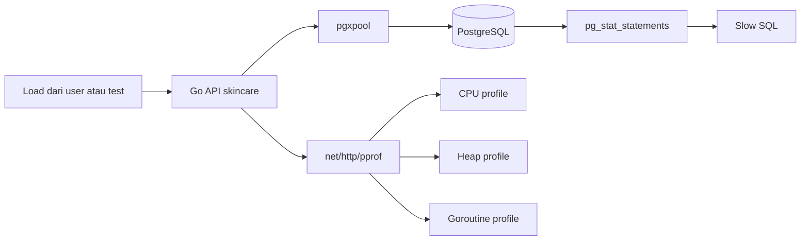
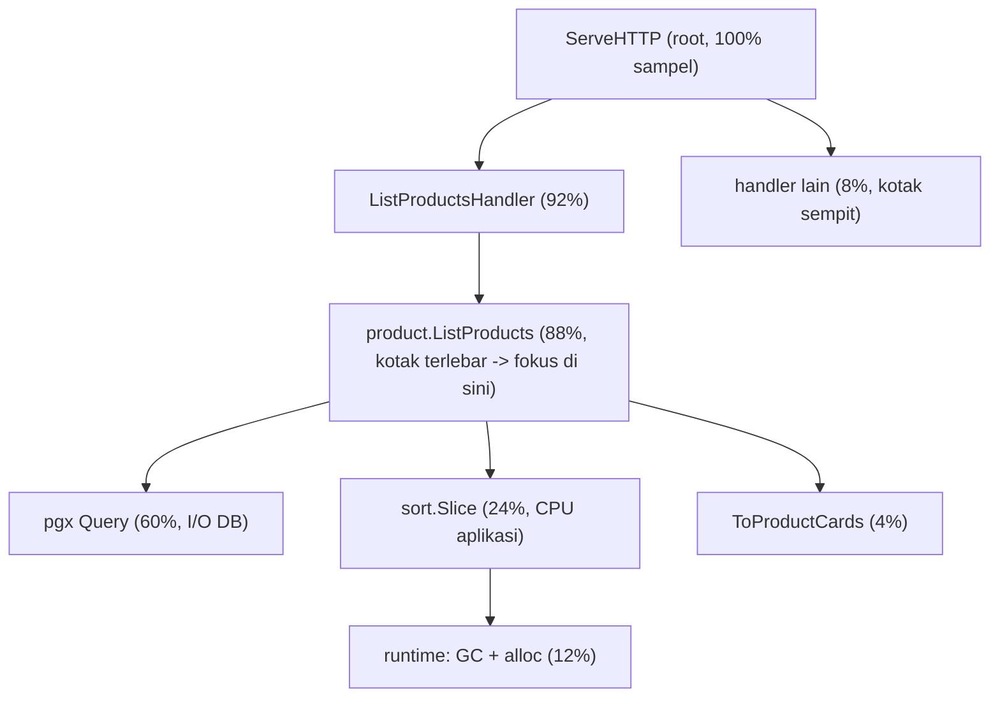
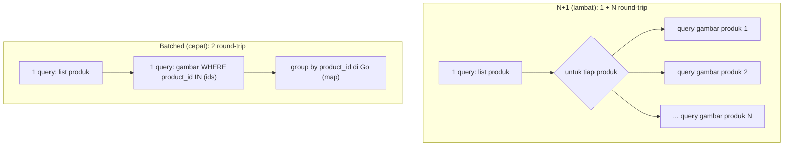
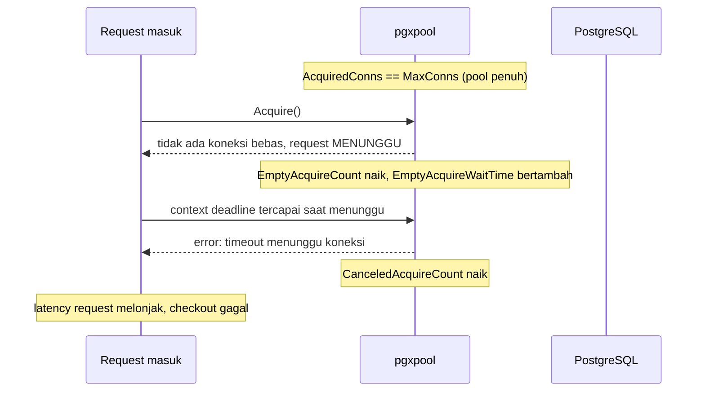
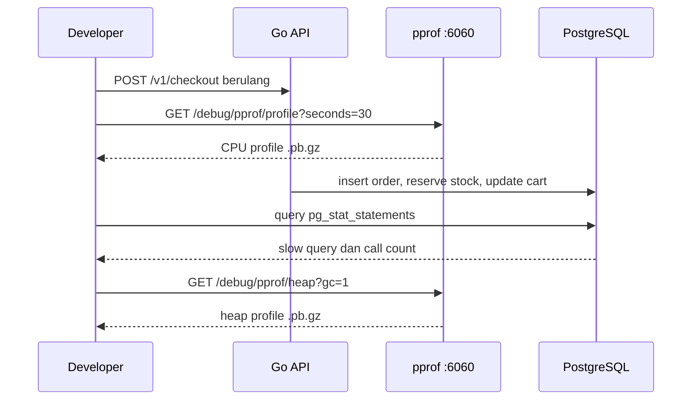
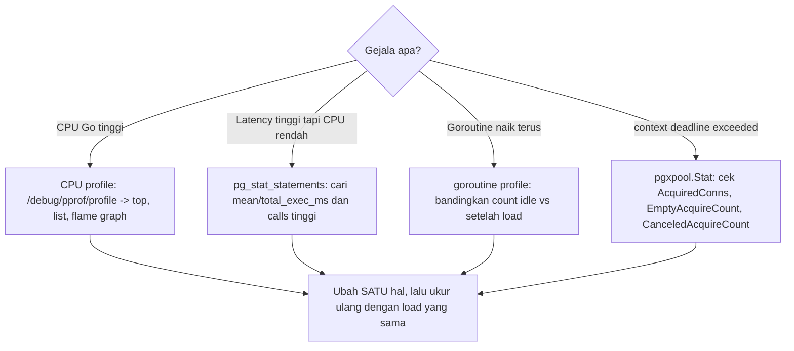

import { Section, Box, Steps, Step, Recap, CardGrid, Card, Chip, Hero, Compare, FileTree, Endpoint, Def } from "@components";

<Hero eyebrow="Roadmap 9 &middot; Advanced Scaling" title="Performance Profiling<br /><em>Go Backend</em>">
  <p>Temukan bottleneck backend skincare dengan data runtime, bukan firasat developer senior.</p>
  <Fragment slot="meta">
    <Chip icon="code">Bahasa: <b>Go 1.26</b></Chip>
    <Chip icon="clock">~75 menit baca</Chip>
  </Fragment>
</Hero>

<Section num="01" id="intro" title="Profiling Sebelum Optimasi">

<p class="lead">Di React, kamu mungkin membuka React DevTools Profiler sebelum memecah komponen. Di Laravel, kamu mungkin membuka Telescope, Debugbar, atau query log sebelum menambah cache.</p>

Di Go, kebiasaan yang sama harus dibawa ke backend. Jangan mulai dari mengganti loop, menambah goroutine, atau menambah cache Redis. Mulai dari mengukur bagian mana yang benar-benar mahal: CPU, alokasi heap, goroutine yang bocor, SQL lambat, jumlah query per request, atau koneksi PostgreSQL yang habis.

<Def term="profiling"><p>Profiling adalah proses mengambil sampel runtime aplikasi untuk melihat fungsi, alokasi, goroutine, atau operasi eksternal mana yang paling banyak memakai resource.</p></Def>

<Box variant="note" icon="📝" label="Prinsip"><p>Jangan optimasi sebelum profil, ini berlaku double di Go.</p></Box>

<Compare aLabel="JS/PHP: profiler sering di framework" bLabel="Go: profiler ada di runtime" aTone="muted" bTone="violet">
  <Fragment slot="a"><ul><li>React Profiler fokus ke render komponen, Laravel Debugbar sering fokus ke request dan query.</li><li>Kamu sering melihat data dari tool yang dipasang di level framework.</li></ul></Fragment>
  <Fragment slot="b"><ul><li>`net/http/pprof` dan `runtime/pprof` membaca data langsung dari runtime Go.</li><li>Profiling tidak peduli kamu pakai chi, net/http bawaan, atau framework lain.</li></ul></Fragment>
</Compare>



<p class="fig-cap"><b>Gambar 1.</b> Profiling Go API tidak berhenti di proses Go, karena bottleneck sering muncul di SQL dan pool koneksi.</p>

<CardGrid cols={3}>
  <Card><h4>CPU</h4><p>Cari fungsi yang paling sering muncul di sampel CPU ketika endpoint sedang diberi load.</p></Card>
  <Card><h4>Heap</h4><p>Cari alokasi yang tidak perlu, terutama response besar, mapping DTO, dan parsing JSON.</p></Card>
  <Card><h4>Database</h4><p>Cari query lambat, N+1 query, dan pool yang menunggu koneksi terlalu lama.</p></Card>
</CardGrid>

Sumber resmi yang dipakai untuk modul ini: [net/http/pprof](https://pkg.go.dev/net/http/pprof), [runtime/pprof](https://pkg.go.dev/runtime/pprof), [pg_stat_statements](https://www.postgresql.org/docs/current/pgstatstatements.html), dan [pgxpool](https://pkg.go.dev/github.com/jackc/pgx/v5/pgxpool).

</Section>

<Section num="02" id="pprof-server" title="Menambahkan net/http/pprof">

<p class="lead">`net/http/pprof` menambahkan endpoint debug yang bisa dibaca oleh `go tool pprof`.</p>

Pola paling aman untuk proyek skincare adalah menjalankan pprof di server terpisah dari API publik. API tetap berjalan di `:8080`, sementara pprof berjalan di address internal seperti `127.0.0.1:6060` untuk local process, atau address private yang tidak pernah masuk ke ALB production.

<Endpoint method="GET" path="/debug/pprof/" desc="Index profil yang tersedia" />
<Endpoint method="GET" path="/debug/pprof/profile" desc="CPU profile, biasanya diambil selama 30 detik" />
<Endpoint method="GET" path="/debug/pprof/heap" desc="Heap allocation dan in-use memory" />
<Endpoint method="GET" path="/debug/pprof/goroutine" desc="Snapshot goroutine yang sedang hidup" />

<Box variant="warn" icon="⚠️" label="Jangan expose pprof ke internet"><p>Endpoint pprof bisa membocorkan stack, nama fungsi, path file, dan pola traffic. Jangan mount ke router publik `/v1` dan jangan pasang di ALB tanpa proteksi jaringan.</p></Box>

<FileTree title="File yang disentuh untuk profiling" tree={`
cmd/
  api/
    main.go                         # panggil profiling server saat app start
internal/
  platform/
    profiling/
      pprof.go                      # pprof server terpisah
    perfstats/
      context.go                    # query count per request
      middleware.go                 # log statistik request
    db/
      pool_stats.go                 # snapshot pgxpool stats
ops/
  sql/
    pg-stat-statements.sql          # query slow SQL
`} />

```go title="internal/platform/profiling/pprof.go"
package profiling

import (
	"context"
	"errors"
	"log/slog"
	"net/http"
	_ "net/http/pprof"
	"time"
)

func StartPprofServer(ctx context.Context, logger *slog.Logger, addr string, enabled bool) *http.Server {
	if !enabled {
		return nil
	}

	if addr == "" {
		addr = "127.0.0.1:6060"
	}

	srv := &http.Server{
		Addr:              addr,
		Handler:           http.DefaultServeMux,
		ReadHeaderTimeout: 5 * time.Second,
	}

	go func() {
		logger.Info("pprof server listening", slog.String("addr", addr))
		if err := srv.ListenAndServe(); err != nil && !errors.Is(err, http.ErrServerClosed) {
			logger.Error("pprof server failed", slog.Any("error", err))
		}
	}()

	go func() {
		<-ctx.Done()

		shutdownCtx, cancel := context.WithTimeout(context.Background(), 5*time.Second)
		defer cancel()

		if err := srv.Shutdown(shutdownCtx); err != nil {
			logger.Error("pprof shutdown failed", slog.Any("error", err))
		}
	}()

	return srv
}
```

```go title="cmd/api/main.go"
package main

import (
	"context"
	"log/slog"
	"os"
	"os/signal"
	"syscall"

	"github.com/kamu/skincare-backend/internal/platform/profiling"
)

func main() {
	logger := slog.New(slog.NewJSONHandler(os.Stdout, nil))
	ctx, stop := signal.NotifyContext(context.Background(), os.Interrupt, syscall.SIGTERM)
	defer stop()

	profiling.StartPprofServer(
		ctx,
		logger,
		os.Getenv("PPROF_ADDR"),
		os.Getenv("ENABLE_PPROF") == "true",
	)

	// Start API server normal di :8080.
	// Shutdown API server juga memakai ctx yang sama.
}
```

<Box variant="bridge" icon="🌉" label="Jembatan: debug route bukan route user"><p>Anggap pprof seperti Laravel Telescope yang hanya boleh masuk lewat environment private. Bedanya, pprof membaca runtime Go langsung, jadi data yang bocor lebih rendah levelnya.</p></Box>

Untuk local process, cukup jalankan API dengan environment ini.

```bash title="Terminal"
ENABLE_PPROF=true PPROF_ADDR=127.0.0.1:6060 go run ./cmd/api
curl -s http://localhost:6060/debug/pprof/ | head
```

Kalau API berjalan di Docker lokal, bind service di container ke `:6060`, lalu batasi port mapping di host ke `127.0.0.1`.

```bash title="Terminal"
docker run --rm \
  -e ENABLE_PPROF=true \
  -e PPROF_ADDR=:6060 \
  -p 8080:8080 \
  -p 127.0.0.1:6060:6060 \
  skincare-api
```

<h3>net/http/pprof vs runtime/pprof: kapan pakai yang mana</h3>

<p>`net/http/pprof` cocok untuk server yang sedang hidup, baik lokal maupun di lingkungan private production: kamu tarik profil lewat HTTP saat ada traffic. Tetapi untuk benchmark dan CI, kamu jarang punya server berjalan. Di situ pakai package `runtime/pprof` secara programatik, atau yang paling praktis, biarkan `go test` menuliskannya untukmu lewat flag `-cpuprofile` dan `-memprofile`. Anggap ini seperti memilih antara membuka DevTools di tab yang sedang live (HTTP) versus menjalankan benchmark headless di CI (go test).</p>

```bash title="Terminal"
# Profil dari benchmark, ideal untuk membandingkan dua implementasi di CI.
go test ./internal/product/ -run=^$ -bench=BenchmarkListProductCards \
  -cpuprofile=cpu.out -memprofile=mem.out -benchmem

go tool pprof cpu.out
go tool pprof mem.out
```

```go title="internal/product/list_bench_test.go"
package product

import "testing"

func BenchmarkListProductCards(b *testing.B) {
	svc := newBenchService(b) // helper menyiapkan repo dan data uji
	ctx := b.Context()
	filter := ListFilter{SkinType: "oily", Limit: 24}

	b.ReportAllocs()
	for b.Loop() {
		if _, err := svc.ListProductCards(ctx, filter); err != nil {
			b.Fatal(err)
		}
	}
}
```

<Box variant="note" icon="📝" label="Profil tanpa endpoint HTTP"><p>Untuk CLI atau worker yang bukan server, `runtime/pprof` punya `pprof.StartCPUProfile(w)` plus `pprof.StopCPUProfile()` untuk menulis profil ke file. Tidak ada endpoint, tetapi hasilnya sama-sama dibaca oleh `go tool pprof`.</p></Box>

</Section>

<Section num="03" id="cpu-profiling" title="CPU Profiling">

<p class="lead">CPU profiling menjawab pertanyaan: fungsi apa yang paling sering menghabiskan waktu CPU saat request berjalan?</p>

Di online shop skincare, CPU biasanya naik saat endpoint melakukan filtering produk yang terlalu berat, encode JSON response besar, validasi checkout yang berulang, hashing password dengan cost terlalu tinggi, atau rendering data rekomendasi produk tanpa batas jelas.

```bash title="Terminal"
# Jalankan API dan pprof.
ENABLE_PPROF=true PPROF_ADDR=127.0.0.1:6060 go run ./cmd/api

# Di terminal lain, beri traffic ke endpoint yang mau diuji.
for i in $(seq 1 200); do
  curl -s "http://localhost:8080/v1/products?skin_type=oily&sort=popular" > /dev/null &
done
wait

# Ambil CPU profile selama 30 detik.
go tool pprof http://localhost:6060/debug/pprof/profile?seconds=30
```

Di shell `pprof`, mulai dari `top`, lalu lanjut ke `list` untuk fungsi milik aplikasi.

```text title="pprof shell"
(pprof) top
(pprof) list SearchProducts
(pprof) list EncodeProductCards
(pprof) web
```

<Box variant="tip" icon="💡" label="Cara membaca top"><p>Lihat kolom flat untuk biaya fungsi itu sendiri, lalu cum untuk biaya fungsi tersebut plus fungsi yang dipanggilnya.</p></Box>

Contoh masalah yang sering muncul di service produk adalah sorting di Go setelah mengambil terlalu banyak row dari PostgreSQL. Untuk katalog skincare, filter dan sort yang bisa dikerjakan database sebaiknya dikerjakan di SQL dengan index yang tepat.

```go title="internal/product/service.go"
package product

import (
	"context"
	"sort"
)

type Service struct {
	repo Repository
}

func (s *Service) ListProducts(ctx context.Context, filter ListFilter) ([]ProductCard, error) {
	products, err := s.repo.ListProducts(ctx, filter)
	if err != nil {
		return nil, err
	}

	// Kandidat bottleneck kalau products berisi ribuan item.
	sort.Slice(products, func(i, j int) bool {
		return products[i].PopularityScore > products[j].PopularityScore
	})

	return products, nil
}
```

Catatan idiom: sejak Go 1.21 cara modern untuk sort di Go adalah `slices.SortFunc` dari package stdlib `slices` dengan comparator `cmp.Compare`, bukan `sort.Slice`. Keduanya valid, tetapi poin utama section ini justru memindahkan sort ke SQL, jadi pilihan komparator di Go menjadi sekunder.

Versi yang lebih sehat adalah membatasi data di repository, lalu mengandalkan `ORDER BY`, `LIMIT`, dan index PostgreSQL. Ini bukan aturan absolut, tetapi pilihan default yang lebih mudah diprofilkan dan lebih hemat CPU API.

```sql title="internal/product/query.sql"
SELECT id, name, slug, price, image_url, popularity_score
FROM products
WHERE skin_type = $1
  AND is_active = true
ORDER BY popularity_score DESC, id DESC
LIMIT $2 OFFSET $3;
```

<Def term="hot path"><p>Hot path adalah jalur kode yang sering dilalui dan banyak mengonsumsi resource, misalnya list produk, add to cart, checkout, dan payment webhook.</p></Def>

</Section>

<Section num="04" id="memory-profiling" title="Memory Profiling">

<p class="lead">Memory profiling melihat alokasi heap, bukan sekadar total RAM proses di dashboard.</p>

Di Go, banyak alokasi kecil bisa membuat garbage collector bekerja lebih sering. Kamu tidak perlu takut alokasi, tetapi kamu perlu tahu kapan alokasi terjadi di hot path. Untuk API skincare, sumber alokasi umum adalah mapping entity ke DTO, membangun slice tanpa kapasitas awal, decode JSON body besar, dan membuat string sementara di loop.

```bash title="Terminal"
# Profil heap saat aplikasi sedang diberi traffic.
go tool pprof http://localhost:6060/debug/pprof/heap

# Buka UI lokal, pilih view top, graph, atau flame graph.
go tool pprof -http=:0 http://localhost:6060/debug/pprof/heap

# Fokus ke total alokasi sejak proses hidup.
go tool pprof -alloc_space http://localhost:6060/debug/pprof/heap

# Fokus ke memori yang masih hidup saat profil diambil.
go tool pprof -inuse_space http://localhost:6060/debug/pprof/heap
```

<Box variant="note" icon="📝" label="Heap profile bukan RSS"><p>Heap profile menunjukkan alokasi Go yang disampling. Angka ini tidak selalu sama dengan RSS container di CloudWatch atau `docker stats`.</p></Box>

<Box variant="warn" icon="⚠️" label="Heap profile itu SAMPLED, bukan sensus penuh"><p>Secara default Go hanya merekam satu sampel tiap kira-kira 512KB alokasi (`runtime.MemProfileRate = 524288`). Jadi angka heap profile adalah estimasi statistik, bukan hitungan setiap byte. Itu sebabnya alokasi kecil yang jarang bisa tidak muncul. Untuk debugging lokal yang butuh presisi tinggi kamu bisa menurunkan `runtime.MemProfileRate` (mis. ke 1 berarti setiap alokasi direkam), tapi jangan lakukan ini di production karena overhead-nya berat.</p></Box>

<p>Pilih flag sesuai pertanyaan yang ingin kamu jawab. Pakai `-inuse_space` ketika menyelidiki memori yang ditahan terus (kandidat kebocoran, cache yang tidak dilepas, RSS yang naik dan tidak turun). Pakai `-alloc_space` ketika menyelidiki tekanan GC, yaitu fungsi yang menghasilkan banyak alokasi sementara di hot path meski memori itu cepat dibebaskan. Singkatnya: `inuse_space` menjawab "apa yang masih dipegang sekarang", `alloc_space` menjawab "siapa yang paling banyak bikin sampah".</p>

Contoh sederhana: mapping response produk bisa membuat alokasi ekstra kalau slice tumbuh berulang kali. Ini bukan optimasi besar, tetapi di endpoint yang dipanggil ribuan kali per menit, kebiasaan ini membuat heap lebih tenang.

```go title="internal/product/response.go"
package product

type Product struct {
	ID          int64
	Name        string
	Slug        string
	Price       int64
	ImageURL    string
	Description string
}

type ProductCard struct {
	ID       int64  `json:"id"`
	Name     string `json:"name"`
	Slug     string `json:"slug"`
	Price    int64  `json:"price"`
	ImageURL string `json:"image_url"`
}

func ToProductCards(products []Product) []ProductCard {
	cards := make([]ProductCard, 0, len(products))
	for _, p := range products {
		cards = append(cards, ProductCard{
			ID:       p.ID,
			Name:     p.Name,
			Slug:     p.Slug,
			Price:    p.Price,
			ImageURL: p.ImageURL,
		})
	}
	return cards
}
```

<Compare aLabel="JS: GC terasa jauh" bLabel="Go: GC terlihat di profil" aTone="muted" bTone="blue">
  <Fragment slot="a"><ul><li>Di Node.js, kamu sering melihat heap snapshot dan event loop delay.</li><li>Bottleneck bisa terasa sebagai latency naik tanpa stack Go.</li></ul></Fragment>
  <Fragment slot="b"><ul><li>Di Go, heap profile bisa menunjukkan fungsi yang menghasilkan alokasi.</li><li>Optimasi kecil seperti preallocate slice hanya masuk akal setelah profil menunjukkan fungsi itu panas.</li></ul></Fragment>
</Compare>

<Box variant="bridge" icon="🌉" label="Jembatan: PHP request-scoped vs Go long-running"><p>Di Laravel/PHP klasik (PHP-FPM), memori bersifat shared-nothing: tiap request mendapat memori segar dan dibebaskan seluruhnya saat request selesai, jadi kebocoran kecil jarang terasa. Di Go, satu proses hidup terus melayani ribuan request, sehingga alokasi yang menumpuk dan goroutine yang bocor PERSISTEN antar request. Inilah kenapa heap dan goroutine profiling penting di Go padahal jarang dipikirkan di PHP: di sini kamu sendiri yang memegang siklus hidup memori antar request.</p></Box>

Jebakan umum: memakai `sync.Pool` terlalu cepat. `sync.Pool` berguna di kasus tertentu, tetapi bisa membuat kode sulit dibaca dan tidak selalu mengurangi latency. Untuk aplikasi CRUD dan checkout, mulai dari query lebih kecil, response lebih kecil, dan alokasi yang jelas.

</Section>

<Section num="05" id="goroutine-profiling" title="Goroutine Profiling">

<p class="lead">Goroutine profiling membantu melihat apakah goroutine menumpuk, tertahan, atau bocor.</p>

Goroutine leak di backend sering muncul ketika ada worker internal, retry async, timeout yang tidak dihormati, atau channel yang tidak pernah dibaca. Di proyek skincare, contoh rawan adalah enrichment produk paralel, worker payment event, dan SQS consumer yang tidak berhenti bersih saat ECS mengirim SIGTERM.

```bash title="Terminal"
# Snapshot stack semua goroutine.
go tool pprof http://localhost:6060/debug/pprof/goroutine

# Format plaintext untuk inspeksi cepat.
curl "http://localhost:6060/debug/pprof/goroutine?debug=2" | less
```

<Box variant="tip" icon="💡" label="Indikasi leak"><p>Jumlah goroutine naik terus setelah traffic berhenti, lalu stack yang sama muncul berulang di channel send, channel receive, lock, atau network read.</p></Box>

Contoh kode berikut rawan bocor. Akar masalahnya bukan loop variable (sejak Go 1.22 itu sudah per-iterasi), melainkan kombinasi channel UNbuffered plus reader yang berhenti lebih awal. Jika satu request enrichment gagal, loop penerima `return` di tengah jalan, lalu goroutine lain tertahan selamanya di `ch <-` karena tidak ada lagi yang membaca channel.

```go title="internal/product/enrichment_bad.go"
package product

import "context"

type enrichmentResult struct {
	card ProductCard
	err  error
}

func (s *Service) EnrichCardsBad(ctx context.Context, ids []int64) ([]ProductCard, error) {
	ch := make(chan enrichmentResult)

	for _, id := range ids {
		// Sejak Go 1.22 loop variable sudah per-iterasi, jadi id aman ditangkap langsung.
		go func() {
			card, err := s.repo.GetProductCard(ctx, id)
			ch <- enrichmentResult{card: card, err: err}
		}()
	}

	cards := make([]ProductCard, 0, len(ids))
	for range ids {
		r := <-ch
		if r.err != nil {
			return nil, r.err
		}
		cards = append(cards, r.card)
	}

	return cards, nil
}
```

Versi yang lebih aman memakai context cancellation dan buffered channel sebesar jumlah pekerjaan. Kapasitas `len(ids)` dipilih dengan sengaja: pengirim tidak akan pernah blok permanen, jadi sekalipun penerima keluar lebih awal saat error, setiap goroutine masih bisa menaruh hasilnya di buffer lalu selesai. Goroutine yang belum sempat kirim akan lolos lewat `<-ctx.Done()` setelah `cancel()` dipanggil. Ini bukan solusi terbaik untuk semua kasus, tetapi cukup untuk menunjukkan pola anti-leak tanpa library tambahan.

```go title="internal/product/enrichment.go"
package product

import "context"

func (s *Service) EnrichCards(ctx context.Context, ids []int64) ([]ProductCard, error) {
	ctx, cancel := context.WithCancel(ctx)
	defer cancel()

	ch := make(chan enrichmentResult, len(ids))

	for _, id := range ids {
		// Go 1.22+ per-iterasi: tidak perlu lagi "id := id" seperti di Go lama.
		go func() {
			card, err := s.repo.GetProductCard(ctx, id)
			select {
			case ch <- enrichmentResult{card: card, err: err}:
			case <-ctx.Done():
			}
		}()
	}

	cards := make([]ProductCard, 0, len(ids))
	for range ids {
		r := <-ch
		if r.err != nil {
			cancel()
			return nil, r.err
		}
		cards = append(cards, r.card)
	}

	return cards, nil
}
```

<Box variant="bridge" icon="🌉" label="Jembatan: di produksi, errgroup lebih ringkas"><p>Pola channel manual di atas bagus untuk memahami mekanismenya, tetapi di produksi nyata `errgroup.WithContext` dari `golang.org/x/sync/errgroup` menangani cancellation, first-error, dan batas concurrency dengan jauh lebih ringkas. Anggap channel manual ini seperti menulis `Promise.all` dengan AbortController sendiri, sedangkan errgroup adalah helper matang yang sudah membungkus semua itu.</p></Box>

<Box variant="warn" icon="⚠️" label="Goroutine bukan obat semua latency"><p>Menambah goroutine untuk query database sering hanya memindahkan bottleneck ke PostgreSQL dan pgxpool. Ukur dulu pool, slow query, dan jumlah query.</p></Box>

<h3>Mendiagnosis leak: bandingkan snapshot idle vs setelah load</h3>

<p>Cara paling konkret mendeteksi leak adalah membandingkan jumlah goroutine sebelum dan sesudah load. Ambil snapshot saat idle, beri traffic, tunggu traffic berhenti, lalu ambil snapshot lagi. Jika count tidak kembali ke baseline, ada yang tidak berhenti bersih.</p>

```bash title="Terminal"
# Baris pertama "goroutine profile: total N" menunjukkan jumlah agregat.
curl -s "http://localhost:6060/debug/pprof/goroutine?debug=1" | head -1

# Beri load (lihat contoh CPU profiling di Section 03), tunggu selesai, lalu cek lagi.
# Count yang terus naik dan tidak turun setelah idle = sinyal leak.
curl -s "http://localhost:6060/debug/pprof/goroutine?debug=1" | head -1
```

<p>Pada output `debug=1`, tiap stack diawali angka yang menyatakan berapa goroutine sedang berhenti di stack itu. Stack yang sama dengan count membengkak (misalnya semua tertahan di `chan send` enrichment) menunjuk langsung ke lokasi leak.</p>

<h3>Profil goroutineleak eksperimental (Go 1.26)</h3>

<p>Go 1.26 memperkenalkan profil eksperimental `goroutineleak` di package `runtime/pprof`, diaktifkan dengan `GOEXPERIMENT=goroutineleakprofile` saat build. Mengaktifkan experiment ini juga membuka endpoint HTTP `/debug/pprof/goroutineleak` dan akses programatik `pprof.Lookup("goroutineleak")`. Implementasinya sudah disebut production-ready, statusnya hanya "experiment" untuk mengumpulkan masukan API, dan direncanakan menyala default mulai Go 1.27.</p>

```bash title="Terminal"
# Build dengan experiment menyala, lalu jalankan.
GOEXPERIMENT=goroutineleakprofile go build -o bin/api ./cmd/api
ENABLE_PPROF=true PPROF_ADDR=127.0.0.1:6060 ./bin/api

# Profil ini langsung melaporkan goroutine yang terdeteksi bocor.
go tool pprof http://localhost:6060/debug/pprof/goroutineleak
```

<p>Untuk modul ini, gunakan `goroutine` profile standar dulu karena tersedia tanpa flag, lalu pakai `goroutineleak` saat kamu ingin sinyal leak yang lebih langsung tanpa membaca stack satu per satu.</p>

</Section>

<Section num="06" id="flame-graph" title="Membaca Flame Graph">

<p class="lead">Flame graph membantu melihat jalur call stack yang paling banyak mengonsumsi resource.</p>

Di flame graph pprof Go, root (caller paling atas seperti `net/http` handler) ada di bagian atas, dan fungsi yang dipanggil melebar ke bawah mengikuti kedalaman call stack. Yang benar-benar load-bearing untuk dibaca adalah lebar kotak: lebar menunjukkan proporsi sampel, jadi fokuslah ke kotak terlebar, bukan ke warna. Warna di pprof hanya pembeda visual, bukan tanda prioritas.

Sejak Go 1.26, UI web `go tool pprof -http` langsung membuka tampilan flame graph sebagai view default, jadi kamu tidak perlu lagi memilih menu Flame Graph secara manual. Tampilan graph lama kini ada di menu `View -> Graph` atau path `/ui/graph`.

```bash title="Terminal"
# Ambil CPU profile dan buka UI interaktif lokal.
# Browser langsung menampilkan flame graph (default sejak Go 1.26).
go tool pprof -http=:0 http://localhost:6060/debug/pprof/profile?seconds=30
```



<p class="fig-cap"><b>Gambar 2.</b> Anatomi flame graph pprof: root di atas, callee melebar ke bawah, lebar = proporsi sampel. Kotak terlebar dari package aplikasi (`product.ListProducts`) adalah tempat memulai investigasi, bukan kotak yang paling tinggi atau paling berwarna.</p>

<CardGrid cols={2}>
  <Card><h4>Kotak lebar</h4><p>Fungsi atau jalur stack ini sering muncul di sampel. Mulai investigasi dari sini.</p></Card>
  <Card><h4>Kotak tinggi</h4><p>Call stack panjang. Ini bisa normal, tetapi kadang tanda abstraksi terlalu banyak di hot path.</p></Card>
  <Card><h4>runtime mendominasi</h4><p>Bisa berarti GC, map access, allocation, lock contention, atau scheduling goroutine sedang mahal.</p></Card>
  <Card><h4>fungsi aplikasi mendominasi</h4><p>Lebih mudah diperbaiki. Cari query berulang, loop besar, sorting di Go, atau transformasi response.</p></Card>
</CardGrid>

<Steps>
  <Step><b>Mulai dari top</b><p>Gunakan `top` untuk melihat fungsi panas sebelum masuk ke visual.</p></Step>
  <Step><b>Buka flame graph</b><p>Cari kotak paling lebar yang berasal dari package aplikasi, misalnya `internal/product` atau `internal/order`.</p></Step>
  <Step><b>Validasi dengan list</b><p>Gunakan `list NamaFungsi` untuk melihat baris kode yang muncul di sampel.</p></Step>
  <Step><b>Ubah satu hal</b><p>Perbaiki satu kandidat, lalu ambil profil ulang dengan traffic yang sama.</p></Step>
</Steps>

<Box variant="bridge" icon="🌉" label="Jembatan: seperti performance tab, tapi berbasis stack"><p>Kalau Chrome Performance menunjukkan main thread dan call stack JavaScript, flame graph pprof menunjukkan call stack Go yang disampling saat program berjalan. React DevTools Profiler juga sudah memakai metafora yang sama di tampilan flamegraph commit-nya: lebar batang = biaya. Intuisi "cari batang terlebar" yang sudah kamu punya dari React langsung berlaku di pprof.</p></Box>

Jangan menyimpulkan dari satu profil saat traffic tidak stabil. Ambil profil dengan durasi dan load yang mirip, simpan hasil sebelum dan sesudah, lalu bandingkan.

```bash title="Terminal"
mkdir -p profiles
curl -o profiles/products-before.pb.gz "http://localhost:6060/debug/pprof/profile?seconds=30"
# lakukan perubahan kode atau SQL
curl -o profiles/products-after.pb.gz "http://localhost:6060/debug/pprof/profile?seconds=30"
go tool pprof -http=:0 profiles/products-before.pb.gz
```

</Section>

<Section num="07" id="slow-sql" title="Slow SQL dengan pg_stat_statements">

<p class="lead">pprof melihat proses Go, sedangkan `pg_stat_statements` melihat query PostgreSQL yang paling mahal.</p>

Di production, endpoint lambat sering terlihat sebagai CPU Go rendah, tetapi latency request tinggi. Itu tanda API sedang menunggu I/O, biasanya database, network, atau service eksternal. Untuk PostgreSQL, `pg_stat_statements` memberi statistik eksekusi query yang sudah dinormalisasi.

<Box variant="bridge" icon="🌉" label="Jembatan: dari DB::listen dan Telescope ke pg_stat_statements"><p>Di Laravel kamu terbiasa melihat query lewat `DB::listen()`, tab Queries di Telescope, query log, atau Clockwork, semuanya bekerja di level aplikasi PHP. `pg_stat_statements` bekerja satu lapis lebih dalam, di dalam PostgreSQL sendiri. Keunggulannya: ia melihat SEMUA query dari semua koneksi (termasuk worker dan migration), sudah dinormalisasi (parameter diganti placeholder), dan tetap akurat meski aplikasi Go-mu tidak punya logger query. Kelemahannya: ia tidak tahu endpoint mana yang memicu query, itu PR-mu untuk dikorelasikan.</p></Box>

<Box variant="note" icon="📝" label="RDS PostgreSQL"><p>Di RDS, `pg_stat_statements` biasanya perlu diaktifkan lewat parameter group karena membutuhkan `shared_preload_libraries`, lalu database instance perlu restart sesuai prosedur maintenance. Parameter `pg_stat_statements.track` mengatur statement mana yang dilacak (mis. `top` atau `all`), dan `pg_stat_statements.max` membatasi berapa banyak statement berbeda yang disimpan.</p></Box>

```sql title="ops/sql/pg-stat-statements.sql"
CREATE EXTENSION IF NOT EXISTS pg_stat_statements;

SELECT
  calls,
  round(total_exec_time::numeric, 2) AS total_exec_ms,
  round(mean_exec_time::numeric, 2) AS mean_exec_ms,
  rows,
  left(query, 240) AS query
FROM pg_stat_statements
WHERE query NOT ILIKE '%pg_stat_statements%'
ORDER BY mean_exec_time DESC
LIMIT 20;
```

Untuk checkout skincare, cari query yang muncul di payment flow dan inventory flow. Query dengan `mean_exec_ms` tinggi bisa membuat request lambat, sedangkan query dengan `calls` sangat tinggi bisa menunjukkan N+1 query atau polling yang terlalu sering.

```sql title="ops/sql/checkout-slow-query.sql"
SELECT
  calls,
  round(mean_exec_time::numeric, 2) AS mean_exec_ms,
  round(total_exec_time::numeric, 2) AS total_exec_ms,
  rows,
  left(query, 240) AS query
FROM pg_stat_statements
WHERE query ILIKE '%orders%'
   OR query ILIKE '%order_items%'
   OR query ILIKE '%inventory%'
ORDER BY total_exec_time DESC
LIMIT 20;
```

<CardGrid cols={2}>
  <Card><h4>mean_exec_ms tinggi</h4><p>Query per panggilan lambat. Periksa index, filter, join, dan jumlah row yang dibaca.</p></Card>
  <Card><h4>calls tinggi</h4><p>Query terlalu sering dipanggil. Periksa N+1, polling, atau loop repository.</p></Card>
  <Card><h4>rows tinggi</h4><p>API mengambil data terlalu banyak. Tambahkan pagination, limit, atau kolom response yang lebih kecil.</p></Card>
  <Card><h4>total_exec_ms tinggi</h4><p>Dampak total besar. Ini kandidat prioritas karena menghabiskan waktu database paling banyak.</p></Card>
</CardGrid>

Setelah menemukan query kandidat, lanjutkan dengan `EXPLAIN (ANALYZE, BUFFERS)` di database non-production atau window aman. Jangan menjalankan analisis berat sembarangan di jam traffic tinggi.

```sql title="ops/sql/explain-product-list.sql"
EXPLAIN (ANALYZE, BUFFERS)
SELECT id, name, slug, price, image_url
FROM products
WHERE skin_type = 'oily'
  AND is_active = true
ORDER BY popularity_score DESC, id DESC
LIMIT 24;
```

<h3>Ukur bersih: reset sebelum dan sesudah perubahan</h3>

<p>Statistik `pg_stat_statements` bersifat kumulatif sejak terakhir di-reset, jadi angka lama bisa mengaburkan dampak perubahanmu. Sejalan dengan tema modul "satu perubahan, ukur ulang", reset statistik tepat sebelum mengukur agar before dan after benar-benar bersih.</p>

```sql title="ops/sql/measure-clean.sql"
-- Sebelum: nolkan statistik, lalu beri load yang konsisten ke endpoint uji.
SELECT pg_stat_statements_reset();

-- Setelah load: baca kandidat, catat calls dan total_exec_ms.
-- Ubah satu hal (index, batched query), reset lagi, ulangi load yang sama, bandingkan.
SELECT calls, round(total_exec_time::numeric, 2) AS total_exec_ms, query
FROM pg_stat_statements
WHERE query ILIKE '%orders%'
ORDER BY total_exec_time DESC
LIMIT 10;
```

<Box variant="tip" icon="💡" label="Membaca N+1 dari pg_stat_statements"><p>Kolom `calls` adalah detektor N+1 di production. Jika satu query item (mis. `SELECT ... FROM product_images WHERE product_id = $1`) punya `calls` puluhan kali lipat lebih besar dari query list induknya, hampir pasti itu N+1. Karena `pg_stat_statements` menormalisasi parameter, semua eksekusi per-item tersebut menyatu jadi satu baris dengan `calls` membengkak, jadi sangat mudah terlihat.</p></Box>

</Section>

<Section num="08" id="n-plus-one-query" title="Detect N+1 Query">

<p class="lead">N+1 query terjadi ketika satu request melakukan satu query utama, lalu satu query tambahan untuk setiap item hasil.</p>

Di React, pola mirip N+1 muncul saat komponen anak melakukan fetch sendiri-sendiri setelah list dirender. Di Laravel, ini sering terjadi saat relasi Eloquent tidak di-eager load. Di Go dengan pgx, masalahnya lebih eksplisit karena repository biasanya memanggil SQL manual di dalam loop.



<p class="fig-cap"><b>Gambar 3.</b> N+1 mengirim 1 query list ditambah satu query per item (total 1+N round-trip ke DB), sedangkan versi batched menggabungkan semua gambar dalam satu `WHERE product_id IN (...)` lalu mengelompokkannya di Go (total 2 round-trip, berapa pun jumlah item).</p>

<Box variant="bridge" icon="🌉" label="Jembatan: with() Eloquent vs batched-load manual di Go"><p>Di Laravel kamu cukup menulis `Product::with('images')->get()` dan Eloquent diam-diam menjalankan satu query `WHERE product_id IN (...)` lalu memetakan hasilnya ke tiap model. Di Go tidak ada magic itu: kamu MEMBANGUN batched-load tersebut sendiri lewat `ListImagesByProductIDs(ids)` plus pemetaan `map[product_id]`. Kode Go memang lebih bertele-tele, tetapi lebih jujur, kamu melihat persis berapa round-trip yang terjadi dan tidak ada query tersembunyi yang muncul di belakang layar.</p></Box>

```go title="internal/product/service_bad.go"
package product

import "context"

func (s *Service) ListProductCardsBad(ctx context.Context, filter ListFilter) ([]ProductCard, error) {
	products, err := s.repo.ListProducts(ctx, filter)
	if err != nil {
		return nil, err
	}

	cards := make([]ProductCard, 0, len(products))
	for _, p := range products {
		images, err := s.repo.ListProductImages(ctx, p.ID)
		if err != nil {
			return nil, err
		}
		cards = append(cards, NewProductCard(p, images))
	}

	return cards, nil
}
```

Solusi umumnya adalah mengambil data relasi dengan query batched, lalu group di Go berdasarkan `product_id`.

```go title="internal/product/service.go"
package product

import "context"

func (s *Service) ListProductCards(ctx context.Context, filter ListFilter) ([]ProductCard, error) {
	products, err := s.repo.ListProducts(ctx, filter)
	if err != nil {
		return nil, err
	}

	ids := make([]int64, 0, len(products))
	for _, p := range products {
		ids = append(ids, p.ID)
	}

	imagesByProductID, err := s.repo.ListImagesByProductIDs(ctx, ids)
	if err != nil {
		return nil, err
	}

	cards := make([]ProductCard, 0, len(products))
	for _, p := range products {
		cards = append(cards, NewProductCard(p, imagesByProductID[p.ID]))
	}

	return cards, nil
}
```

Untuk mendeteksi N+1 sejak development, tambahkan query counter di context request. Ini tidak menggantikan tracing production, tetapi sangat berguna untuk menemukan endpoint yang tiba-tiba melakukan ratusan query.

```go title="internal/platform/perfstats/context.go"
package perfstats

import (
	"context"
	"sync/atomic"
)

type contextKey struct{}

type RequestStats struct {
	queryCount atomic.Int64
}

func NewRequestStats() *RequestStats {
	return &RequestStats{}
}

func WithStats(ctx context.Context, stats *RequestStats) context.Context {
	return context.WithValue(ctx, contextKey{}, stats)
}

func FromContext(ctx context.Context) *RequestStats {
	stats, _ := ctx.Value(contextKey{}).(*RequestStats)
	return stats
}

func CountQuery(ctx context.Context) {
	stats := FromContext(ctx)
	if stats == nil {
		return
	}
	stats.queryCount.Add(1)
}

func (s *RequestStats) QueryCount() int64 {
	return s.queryCount.Load()
}
```

```go title="internal/platform/perfstats/middleware.go"
package perfstats

import (
	"log/slog"
	"net/http"
	"time"
)

func Middleware(logger *slog.Logger) func(http.Handler) http.Handler {
	return func(next http.Handler) http.Handler {
		return http.HandlerFunc(func(w http.ResponseWriter, r *http.Request) {
			stats := NewRequestStats()
			start := time.Now()

			next.ServeHTTP(w, r.WithContext(WithStats(r.Context(), stats)))

			logger.Info("request performance",
				slog.String("method", r.Method),
				slog.String("path", r.URL.Path),
				slog.Int64("query_count", stats.QueryCount()),
				slog.Duration("duration", time.Since(start)),
			)
		})
	}
}
```

```go title="internal/product/repository.go"
package product

import (
	"context"

	"github.com/kamu/skincare-backend/internal/platform/perfstats"
)

func (r *Repository) ListProducts(ctx context.Context, filter ListFilter) ([]Product, error) {
	perfstats.CountQuery(ctx)

	rows, err := r.db.Query(ctx, `
		SELECT id, name, slug, price, image_url
		FROM products
		WHERE skin_type = $1 AND is_active = true
		ORDER BY popularity_score DESC, id DESC
		LIMIT $2 OFFSET $3
	`, filter.SkinType, filter.Limit, filter.Offset)
	if err != nil {
		return nil, err
	}
	defer rows.Close()

	products := make([]Product, 0, filter.Limit)
	for rows.Next() {
		var p Product
		if err := rows.Scan(&p.ID, &p.Name, &p.Slug, &p.Price, &p.ImageURL); err != nil {
			return nil, err
		}
		products = append(products, p)
	}

	if err := rows.Err(); err != nil {
		return nil, err
	}

	return products, nil
}
```

<Box variant="warn" icon="⚠️" label="Jangan hitung query dengan global variable"><p>Query count harus menempel ke `context.Context` request. Global counter hanya memberi total aplikasi, bukan jumlah query per request.</p></Box>

<h3>Mendeteksi N+1 di production</h3>

<p>Query counter manual di atas bagus untuk development, tetapi outcome modul ini juga mencakup diagnosis di production. Ada dua jalur yang berjalan tanpa harus menambah counter di tiap repository. Pertama, pasang `QueryTracer` di config pgxpool (atau instrumentasi OpenTelemetry untuk pgx) sehingga tiap query terekam sebagai span atau metrik per request, lalu N+1 terlihat sebagai satu request dengan puluhan span query identik. Kedua, korelasikan dengan `pg_stat_statements`: query item dengan `calls` yang membengkak relatif terhadap query list induknya adalah sidik jari N+1, seperti dibahas di Section 07. Gabungan tracing per-request dan agregat `calls` memberi gambaran lengkap tanpa menebak.</p>

</Section>

<Section num="09" id="connection-pool" title="Connection Pool Exhaustion">

<p class="lead">Connection pool exhaustion terjadi ketika goroutine menunggu koneksi database karena semua koneksi pgxpool sedang dipakai.</p>

Gejalanya sering membingungkan: CPU Go tidak tinggi, PostgreSQL mungkin belum penuh, tetapi latency API naik dan context deadline exceeded mulai muncul. Penyebabnya bisa query lambat, transaksi terlalu lama, pool terlalu kecil, atau jumlah task ECS dikali pool per task melebihi kapasitas RDS.



<p class="fig-cap"><b>Gambar 4.</b> Rantai sebab pool exhaustion: saat semua koneksi terpakai, request berikutnya menunggu (`EmptyAcquireCount` naik), dan jika context keburu timeout sebelum dapat koneksi, `CanceledAcquireCount` naik. Empat metrik di kartu bawah memetakan ke tahap-tahap ini.</p>

`pgxpool.Stat()` memberi snapshot pool. Mulai dari `AcquiredConns`, `IdleConns`, `TotalConns`, `MaxConns`, `EmptyAcquireCount`, `EmptyAcquireWaitTime`, dan `CanceledAcquireCount`.

```go title="internal/platform/db/pool_stats.go"
package db

import (
	"encoding/json"
	"net/http"
	"time"

	"github.com/jackc/pgx/v5/pgxpool"
)

type PoolSnapshot struct {
	AcquireCount          int64         `json:"acquire_count"`
	AcquireDuration       time.Duration `json:"acquire_duration"`
	AcquiredConns         int32         `json:"acquired_conns"`
	CanceledAcquireCount  int64         `json:"canceled_acquire_count"`
	ConstructingConns     int32         `json:"constructing_conns"`
	EmptyAcquireCount     int64         `json:"empty_acquire_count"`
	EmptyAcquireWaitTime  time.Duration `json:"empty_acquire_wait_time"`
	IdleConns             int32         `json:"idle_conns"`
	MaxConns              int32         `json:"max_conns"`
	TotalConns            int32         `json:"total_conns"`
	NewConnsCount         int64         `json:"new_conns_count"`
	MaxIdleDestroyCount   int64         `json:"max_idle_destroy_count"`
	MaxLifetimeDestroyCount int64       `json:"max_lifetime_destroy_count"`
}

func SnapshotPool(pool *pgxpool.Pool) PoolSnapshot {
	stat := pool.Stat()
	return PoolSnapshot{
		AcquireCount:            stat.AcquireCount(),
		AcquireDuration:         stat.AcquireDuration(),
		AcquiredConns:           stat.AcquiredConns(),
		CanceledAcquireCount:    stat.CanceledAcquireCount(),
		ConstructingConns:       stat.ConstructingConns(),
		EmptyAcquireCount:       stat.EmptyAcquireCount(),
		EmptyAcquireWaitTime:    stat.EmptyAcquireWaitTime(),
		IdleConns:               stat.IdleConns(),
		MaxConns:                stat.MaxConns(),
		TotalConns:              stat.TotalConns(),
		NewConnsCount:           stat.NewConnsCount(),
		MaxIdleDestroyCount:     stat.MaxIdleDestroyCount(),
		MaxLifetimeDestroyCount: stat.MaxLifetimeDestroyCount(),
	}
}

func PoolStatsHandler(pool *pgxpool.Pool) http.HandlerFunc {
	return func(w http.ResponseWriter, r *http.Request) {
		w.Header().Set("Content-Type", "application/json")
		_ = json.NewEncoder(w).Encode(SnapshotPool(pool))
	}
}
```

```go title="internal/platform/db/connect.go"
package db

import (
	"context"
	"time"

	"github.com/jackc/pgx/v5/pgxpool"
)

func OpenPool(ctx context.Context, databaseURL string, maxConns int32) (*pgxpool.Pool, error) {
	config, err := pgxpool.ParseConfig(databaseURL)
	if err != nil {
		return nil, err
	}

	config.MaxConns = maxConns
	config.MinConns = 2
	config.MaxConnLifetime = 30 * time.Minute
	config.MaxConnIdleTime = 5 * time.Minute
	config.HealthCheckPeriod = 1 * time.Minute

	pool, err := pgxpool.NewWithConfig(ctx, config)
	if err != nil {
		return nil, err
	}

	pingCtx, cancel := context.WithTimeout(ctx, 5*time.Second)
	defer cancel()

	if err := pool.Ping(pingCtx); err != nil {
		pool.Close()
		return nil, err
	}

	return pool, nil
}
```

<Box variant="note" icon="📝" label="Membaca Duration di JSON snapshot"><p>`AcquireDuration` dan `EmptyAcquireWaitTime` bertipe `time.Duration`. Saat di-encode JSON, Go menulisnya sebagai nanodetik integer (mis. `1500000000` berarti 1.5 detik), bukan string `"1.5s"`. Untuk endpoint debug yang dibaca manusia, pertimbangkan custom marshal ke `.String()` atau ke milidetik agar tidak salah baca angka besar.</p></Box>

<h3>Menentukan MaxConns: hitung, jangan asal besar</h3>

<p>Mendeteksi exhaustion baru setengah pekerjaan. Bagian yang sering terlewat adalah TUNING angkanya. Aturan praktisnya: pool yang terlalu besar tidak membuat lebih cepat, ia justru memindahkan antrian dari aplikasi ke PostgreSQL dan bisa menjenuhkan DB. Ukuran pool sebaiknya dikaitkan ke kapasitas database dan jumlah core, bukan ke optimisme.</p>

<p>Kunci di deployment ECS: tiap task punya pool sendiri. Jadi total koneksi ke RDS adalah `jumlah task` dikali `MaxConns per task`, dan angka itu harus muat di `max_connections` RDS dengan sisa headroom untuk migration, admin, worker, dan monitoring. Contoh kuantitatif konkret untuk RDS dengan `max_connections = 100`:</p>

```text title="Worked example: 4 ECS task, RDS max_connections = 100"
MaxConns per task            = 10
jumlah ECS task (API)        = 4
total koneksi API            = 4 x 10           = 40
worker order/payment (1 task x 5)               = 5
migration job sesekali                          = 5
admin + monitoring + cadangan                   = 10
---------------------------------------------------------
total terpakai puncak        = 40 + 5 + 5 + 10  = 60
sisa headroom                = 100 - 60         = 40  (aman)
```

<p>Kalau nanti API di-scale ke 8 task tanpa mengubah `MaxConns`, total API menjadi `8 x 10 = 80`, ditambah komponen lain sudah menembus 100 dan request mulai gagal Acquire. Pada titik itu pilihannya adalah menurunkan `MaxConns` per task, menaikkan `max_connections` RDS, atau menaruh PgBouncer di depan untuk multiplexing koneksi.</p>

<CardGrid cols={2}>
  <Card><h4>`MaxConns`</h4><p>Batas atas koneksi per task. Naikkan hanya jika DB belum jenuh dan pool benar-benar penuh, bukan sebagai reaksi pertama atas latency.</p></Card>
  <Card><h4>`MinConns`</h4><p>Koneksi yang dijaga tetap hangat. Mengurangi latency burst pertama setelah idle, tetapi tetap memakan slot `max_connections` walau menganggur.</p></Card>
  <Card><h4>`MaxConnLifetime`</h4><p>Umur maksimal koneksi sebelum diganti. Mencegah koneksi basi dan membantu rebalancing saat RDS failover atau di belakang proxy.</p></Card>
  <Card><h4>`MaxConnIdleTime`</h4><p>Berapa lama koneksi idle dipertahankan sebelum ditutup. Melepas koneksi nganggur saat traffic turun agar slot DB kembali bebas.</p></Card>
</CardGrid>

<CardGrid cols={2}>
  <Card><h4>`AcquiredConns` dekat `MaxConns`</h4><p>Pool sedang penuh. Cari query lambat, transaksi lama, atau pool terlalu kecil.</p></Card>
  <Card><h4>`EmptyAcquireCount` naik</h4><p>Request pernah menunggu koneksi. Korelasikan dengan latency API.</p></Card>
  <Card><h4>`CanceledAcquireCount` naik</h4><p>Context timeout terjadi saat menunggu koneksi. Ini sinyal serius untuk checkout dan payment.</p></Card>
  <Card><h4>`IdleConns` selalu nol</h4><p>Pool tidak punya ruang napas. Bisa karena traffic tinggi atau query terlalu lama.</p></Card>
</CardGrid>

<Box variant="bridge" icon="🌉" label="Jembatan: mirip pool worker di Node"><p>Kalau di Node kamu membatasi concurrency worker atau pool database client, di Go kamu juga wajib menghitung pool per proses karena setiap ECS task punya pool sendiri.</p></Box>

<Box variant="bridge" icon="🌉" label="Jembatan: PHP-FPM worker vs satu pgxpool bersama"><p>Di PHP-FPM klasik, tiap proses worker membuka koneksinya sendiri dan biasanya tanpa pooling di level aplikasi, sehingga pengelolaan koneksi sering didelegasikan ke PgBouncer di depan. Di Go, satu proses long-running berbagi satu `pgxpool` antar ribuan goroutine. Implikasinya: `MaxConns per proses` adalah knob baru yang harus kamu pikirkan sendiri, sesuatu yang jarang dihadapi developer Laravel secara langsung. Mental model bergeser dari "tiap request punya koneksi" ke "semua goroutine antre di satu kolam koneksi bersama".</p></Box>

</Section>

<Section num="10" id="hands-on-profiling" title="Hands-on Profiling Checkout">

<p class="lead">Latihan ini memakai flow checkout karena ia menyentuh CPU ringan, query inventory, transaksi, dan update order.</p>

Tujuan hands-on bukan membuat benchmark ilmiah. Tujuannya membangun kebiasaan: reproduksi, ambil profil, baca kandidat, perbaiki satu hal, ukur ulang.

<Steps>
  <Step><b>Aktifkan pprof</b><p>Jalankan API dengan `ENABLE_PPROF=true` dan pastikan `/debug/pprof/` hanya bisa diakses dari mesin developer.</p></Step>
  <Step><b>Siapkan data</b><p>Seed 100 produk skincare, beberapa variant stok, satu customer, dan satu cart berisi 5 item.</p></Step>
  <Step><b>Beri traffic</b><p>Panggil endpoint checkout beberapa kali dengan data test dan webhook payment palsu.</p></Step>
  <Step><b>Ambil CPU dan heap profile</b><p>Simpan file `.pb.gz` agar bisa dibandingkan setelah perubahan.</p></Step>
  <Step><b>Cek slow SQL</b><p>Jalankan query `pg_stat_statements` untuk melihat query order dan inventory yang paling mahal.</p></Step>
  <Step><b>Cek query count</b><p>Baca log `query_count` per request, lalu pastikan checkout tidak melakukan query per item secara tidak perlu.</p></Step>
</Steps>

```bash title="Terminal"
mkdir -p profiles

ENABLE_PPROF=true PPROF_ADDR=127.0.0.1:6060 go run ./cmd/api

curl -o profiles/checkout-cpu.pb.gz "http://localhost:6060/debug/pprof/profile?seconds=30"
curl -o profiles/checkout-heap.pb.gz "http://localhost:6060/debug/pprof/heap?gc=1"

go tool pprof -http=:0 profiles/checkout-cpu.pb.gz
go tool pprof -http=:0 profiles/checkout-heap.pb.gz
```

```bash title="Terminal"
# Contoh request checkout test. Sesuaikan token dan cart_id dengan data lokal.
curl -s -X POST "http://localhost:8080/v1/checkout" \
  -H "Authorization: Bearer $ACCESS_TOKEN" \
  -H "Content-Type: application/json" \
  -d '{"cart_id":"cart_test_001","shipping_method":"regular"}'
```



<p class="fig-cap"><b>Gambar 5.</b> Profiling checkout perlu melihat runtime Go dan statistik PostgreSQL sekaligus.</p>

<Box variant="warn" icon="⚠️" label="Satu perubahan sekali ukur"><p>Jangan mengubah SQL, pool size, JSON response, dan goroutine sekaligus. Kamu akan kehilangan bukti perubahan mana yang benar-benar membantu.</p></Box>

Checklist keputusan setelah hands-on, dipetakan dari gejala ke alat yang tepat:



<p class="fig-cap"><b>Gambar 6.</b> Pohon keputusan: mulai dari gejala yang terlihat, bukan dari alat favorit. Tiap cabang mengarah ke satu alat diagnosis, lalu bermuara ke disiplin yang sama, ubah satu hal dan ukur ulang.</p>

<ul><li>Jika CPU panas di fungsi mapping response, perkecil payload atau optimalkan transformasi.</li><li>Jika heap panas di encode JSON, periksa ukuran response dan struktur DTO.</li><li>Jika goroutine naik terus, cari worker atau channel yang tidak berhenti saat context selesai.</li><li>Jika slow SQL dominan, optimalkan index, query, atau pola transaksi.</li><li>Jika pool penuh, cari query lambat dulu sebelum menaikkan `MaxConns`.</li></ul>

</Section>

<Section num="11" id="ringkasan" title="Ringkasan & Poin Penting">

<p class="lead">Profiling adalah disiplin membaca data sebelum mengubah arsitektur.</p>

<Recap title="Yang Wajib Menempel">
  <ul><li>`net/http/pprof` menyediakan endpoint `/debug/pprof/` untuk server hidup, sedangkan `runtime/pprof` plus `go test -cpuprofile/-memprofile` dipakai untuk benchmark dan CI.</li><li>Jalankan pprof di server terpisah dan jangan expose endpoint debug ke internet.</li><li>CPU profile menjawab fungsi mana yang paling mahal saat traffic berjalan.</li><li>Heap profile itu SAMPLED (default tiap 512KB lewat `MemProfileRate`); pakai `inuse_space` untuk memori tertahan, `alloc_space` untuk tekanan GC.</li><li>Goroutine profile mendeteksi leak dengan membandingkan count idle vs setelah load; Go 1.26 menambah profil eksperimental `goroutineleak`.</li><li>Flame graph dibaca dari lebar stack, bukan dari warna; sejak Go 1.26 UI web default ke flame graph.</li><li>`pg_stat_statements` melengkapi pprof; `calls` membengkak adalah sidik jari N+1, dan `pg_stat_statements_reset()` membuat pengukuran before/after bersih.</li><li>N+1 query dideteksi dengan query count per request atau tracing pgx di production, lalu diperbaiki dengan query batched `WHERE IN (...)` (padanan eager-load `with()` Laravel).</li><li>`pgxpool.Stat()` membantu melihat pool penuh, acquire wait, dan acquire yang dibatalkan context.</li><li>Tuning pool itu kuantitatif: `jumlah task x MaxConns + headroom` harus muat di `max_connections` RDS, jangan asal besarkan pool.</li><li>Untuk proyek skincare, profiling pertama yang penting adalah list produk, checkout, payment webhook, dan worker order.</li></ul>
</Recap>

<Steps>
  <Step><b>Map ke proyek</b><p>Tambahkan pprof server internal, query count middleware, SQL `pg_stat_statements`, dan endpoint internal untuk pgxpool stats.</p></Step>
  <Step><b>Map ke operasi production</b><p>Di AWS, akses pprof hanya lewat jaringan private atau sesi debug terbatas, bukan lewat ALB publik.</p></Step>
  <Step><b>Langkah berikutnya</b><p>Setelah tahu bottleneck, modul berikutnya masuk ke strategi cache agar optimasi tidak sekadar menambah kompleksitas.</p></Step>
</Steps>

<Box variant="tip" icon="💡" label="Mental model"><p>Go cepat bukan karena semua kode Go otomatis cepat. Go cepat ketika kamu menulis kode sederhana, mengukur hot path, lalu memperbaiki bagian yang terbukti mahal.</p></Box>

</Section>
