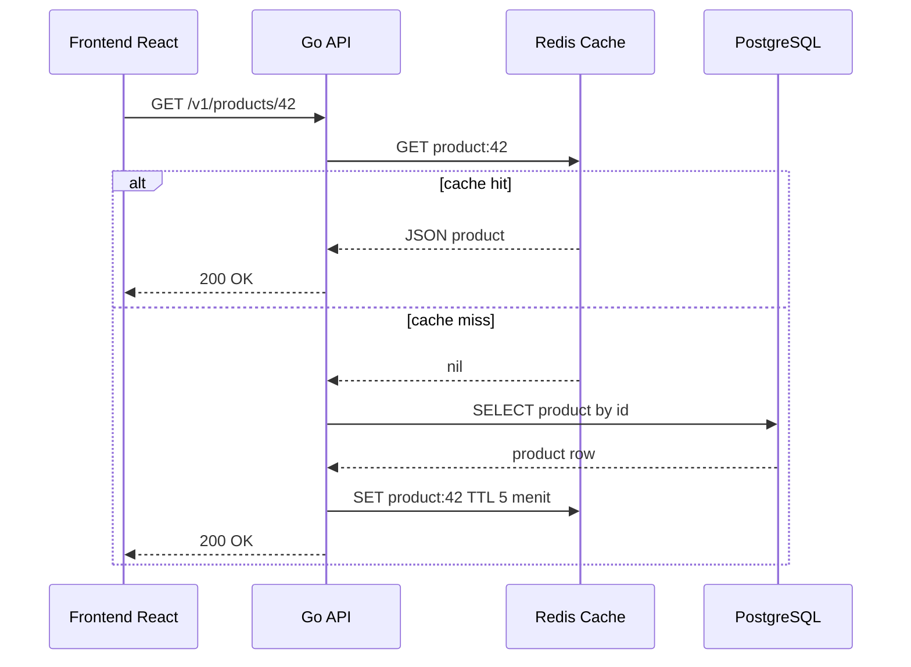
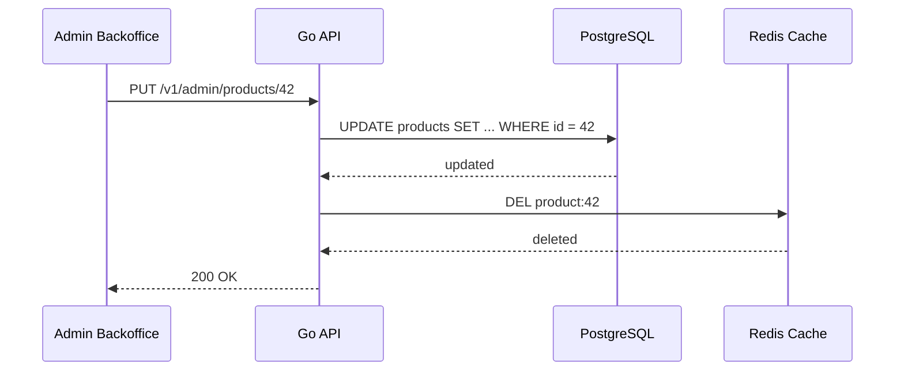
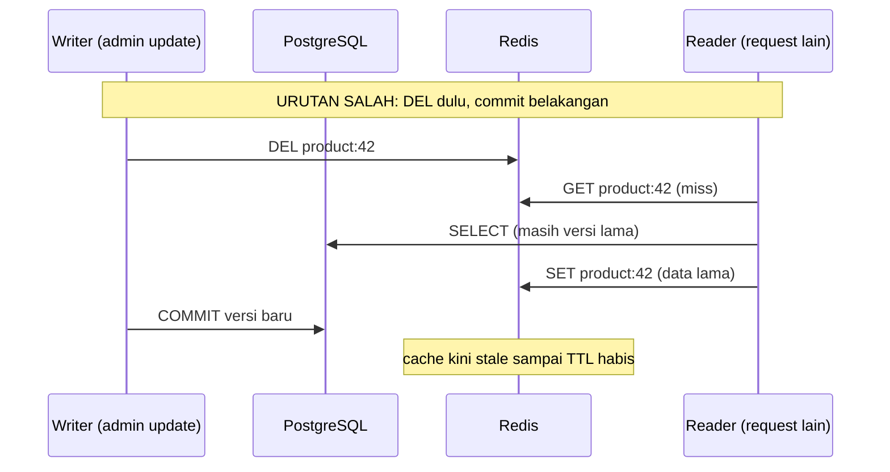
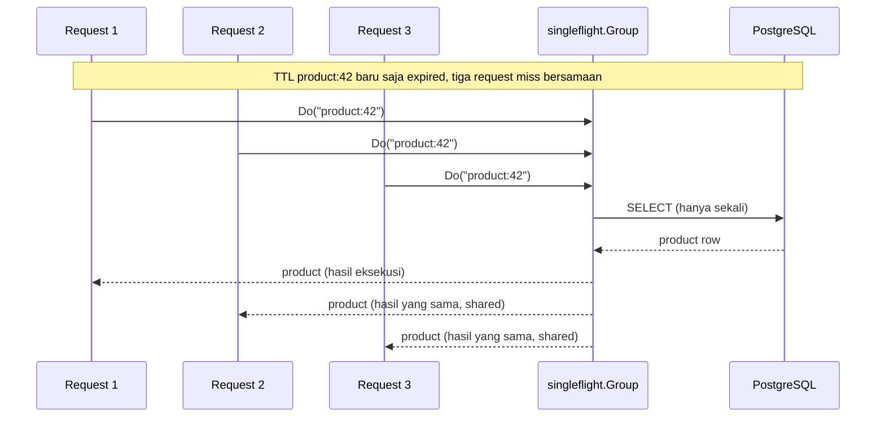
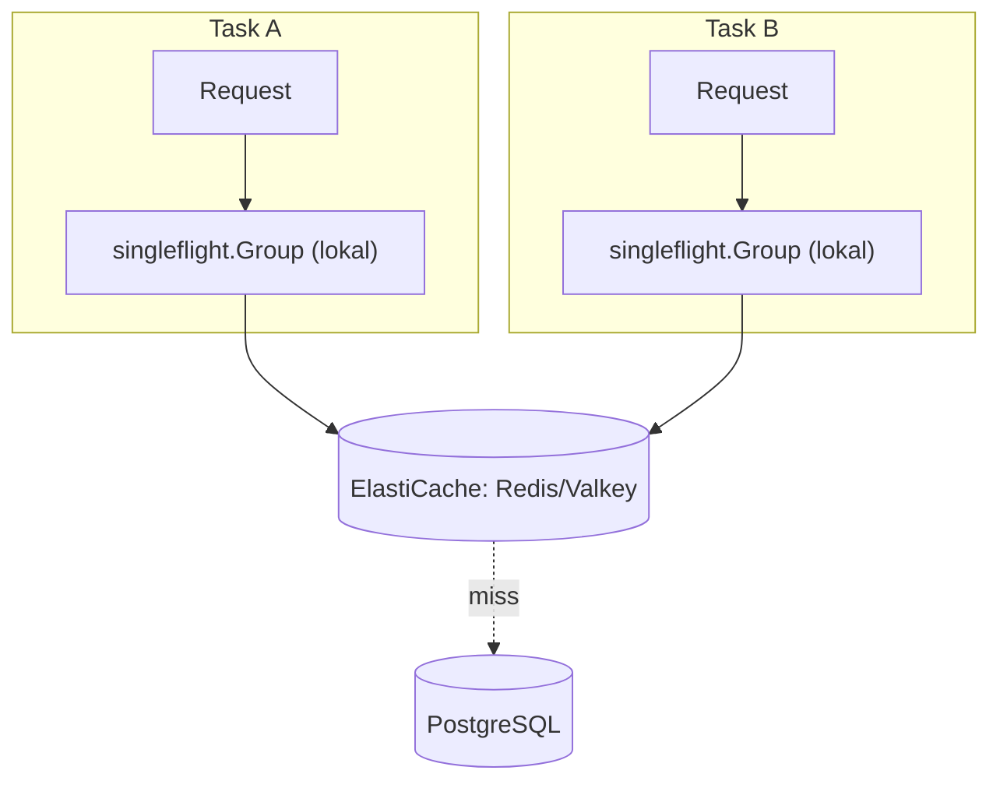
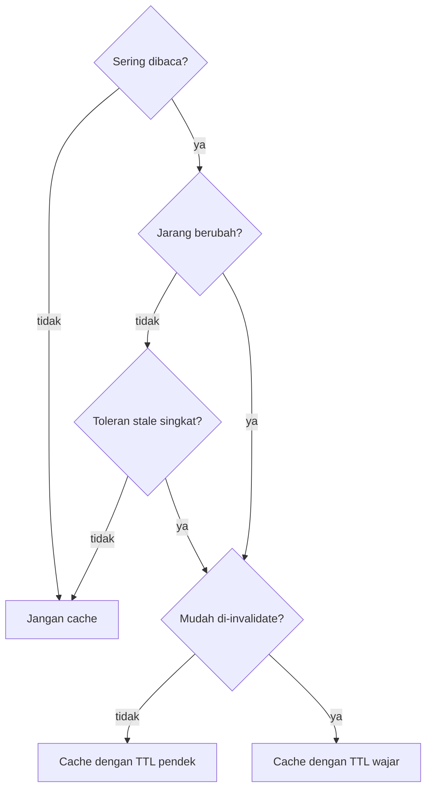

import { Section, Box, Steps, Step, Recap, CardGrid, Card, Chip, Hero, Compare, FileTree, Endpoint, Def } from "@components";

<Hero eyebrow="Roadmap 9 &middot; Advanced Scaling" title="Caching Strategy dengan <em>Redis</em><br />Bottleneck Dibantu, Konsistensi Dijaga">
  <p>Cache yang baik bukan cache sebanyak mungkin, tetapi cache yang mempercepat read path tanpa membuat data bisnis jadi menipu.</p>
  <Fragment slot="meta">
    <Chip icon="code">Bahasa: <b>Go 1.26</b></Chip>
    <Chip icon="clock">~75 menit baca</Chip>
  </Fragment>
</Hero>

<Section num="01" id="intro" title="Kenapa Caching Harus Selektif" sub="Tambah cache di tempat yang tepat, bukan semua query di-cache">

<p class="lead">Di React kamu mungkin mengenal cache lewat TanStack Query, SWR, atau CDN, sedangkan di Laravel ada Cache facade yang membuat operasi cache terasa sangat singkat.</p>

Di backend Go, caching biasanya dibuat lebih eksplisit. Kita memilih key, TTL, invalidation, dan fallback ketika Redis bermasalah. Itu sedikit lebih manual dibanding Laravel, tetapi hasilnya lebih mudah diaudit saat sistem skincare mulai ramai dan performa tidak boleh ditebak.

<Box variant="note" icon="🧭" label="Prinsip modul ini"><p>Jangan optimasi sebelum profil - ini berlaku double di Go.</p></Box>

<Def term="cache"><p>Cache adalah salinan data yang disimpan di media lebih cepat dari sumber utama, biasanya dengan batas waktu atau aturan invalidation agar staleness tetap terkendali.</p></Def>

Caching cocok untuk data yang sering dibaca, relatif jarang berubah, dan toleran terhadap stale singkat. Pada online shop skincare, contoh terbaiknya adalah detail produk dan daftar kategori. Contoh terburuknya adalah stok, isi cart, dan status order.

<Compare aLabel="Laravel Cache facade" bLabel="Go manual cache" aTone="muted" bTone="violet">
  <Fragment slot="a"><ul><li>`Cache::remember('key', 300, fn () =&gt; DB::...)` menyembunyikan banyak detail di balik facade.</li><li>Sebenarnya `Cache::remember` adalah cache-aside, dan `Cache::lock` (atomic lock di Redis) yang bisa mencegah stampede.</li><li>Nyaman untuk produktivitas, tetapi invalidation sering tersebar di banyak tempat.</li></ul></Fragment>
  <Fragment slot="b"><ul><li>Kita membuat interface cache, key convention, TTL, dan invalidation secara eksplisit.</li><li>Stampede ditahan dengan `singleflight` (peran setara `Cache::lock` / Redis `SETNX`).</li><li>Lebih banyak kode, tetapi lebih jelas saat debugging latency, stale data, dan Redis outage.</li></ul></Fragment>
</Compare>

<Box variant="bridge" icon="🌉" label="Jembatan: Cache::remember bukan sihir"><p>Pembaca Laravel sering mengira `Cache::remember` ajaib. Sebenarnya isinya cache-aside biasa plus opsi locking bawaan, persis yang kita rakit manual di Go dengan `singleflight` + Redis. Bedanya hanya: di Go semua langkahnya terlihat.</p></Box>

Endpoint yang akan kita pakai sebagai konteks:

<Endpoint method="GET" path="/v1/products/{id}" desc="Baca product detail, kandidat cache 5 menit" />
<Endpoint method="GET" path="/v1/categories" desc="Baca daftar kategori, kandidat cache 1 jam" />
<Endpoint method="PUT" path="/v1/admin/products/{id}" desc="Update produk, wajib invalidasi cache product detail" />

</Section>

<Section num="02" id="cache-aside" title="Cache-Aside Pattern" sub="Aplikasi cek cache dulu, database tetap sumber kebenaran">

<p class="lead">Cache-aside adalah pattern paling masuk akal untuk proyek ini karena aplikasi Go tetap mengontrol kapan membaca Redis, kapan fallback ke PostgreSQL, dan kapan menghapus cache.</p>

Menurut dokumentasi Redis, cache-aside dipakai untuk repeated reads dengan staleness yang dibatasi TTL. AWS menyebut pola yang sama sebagai lazy loading (pendekatan reaktif: cache diisi setelah request membutuhkannya), lawannya write-through (proaktif: cache diisi saat data ditulis). Dokumentasi ElastiCache (Redis OSS / Valkey) memakai istilah ini. Intinya sederhana: cek Redis, kalau hit langsung return, kalau miss ambil dari PostgreSQL, lalu simpan hasilnya ke Redis.



<p class="fig-cap"><b>Gambar 1.</b> Alur cache-aside untuk product detail, Redis mempercepat request berikutnya tetapi PostgreSQL tetap sumber data utama.</p>

<CardGrid cols={3}>
  <Card><h4>Hit</h4><p>Redis punya data, API tidak perlu query PostgreSQL.</p></Card>
  <Card><h4>Miss</h4><p>Redis kosong atau expired, API query PostgreSQL lalu mengisi Redis.</p></Card>
  <Card><h4>Invalidate</h4><p>Data utama berubah, API menghapus key terkait agar request berikutnya mengambil data segar.</p></Card>
</CardGrid>

<Box variant="bridge" icon="🌉" label="Jembatan: dari TanStack Query ke Redis"><p>TanStack Query menyimpan cache di browser per user, sedangkan Redis menyimpan cache di server lintas instance API, sehingga semua task ECS bisa berbagi cache yang sama.</p></Box>

Padanan konsepnya cukup rapi, tetapi ada satu yang tidak ada padanannya di server. Itu bagus untuk diingat agar tidak salah menyamakan cache klien dengan cache server.

<Compare aLabel="TanStack Query (klien)" bLabel="Redis cache-aside (server)" aTone="muted" bTone="violet">
  <Fragment slot="a"><ul><li>`staleTime` menentukan berapa lama data dianggap segar.</li><li>`invalidateQueries()` menandai cache basi agar di-refetch.</li><li>`refetchOnWindowFocus` memuat ulang saat tab kembali fokus.</li></ul></Fragment>
  <Fragment slot="b"><ul><li>TTL Redis berperan seperti `staleTime`, tetapi expiry-nya keras (key hilang).</li><li>`DEL key` setara `invalidateQueries()`, menghapus entri agar miss berikutnya mengisi ulang.</li><li>Tidak ada padanan `refetchOnWindowFocus`, karena server tidak tahu kapan user kembali. Inilah beda mendasar cache klien dan cache server.</li></ul></Fragment>
</Compare>

</Section>

<Section num="03" id="redis-client" title="Redis Client di Go" sub="Pakai github.com/redis/go-redis/v9 dengan wrapper kecil">

<p class="lead">Library yang kita pakai adalah `github.com/redis/go-redis/v9`, klien Go resmi yang di-maintain oleh Redis, dan tetap dipanggil dengan `context.Context` seperti operasi I/O Go lain.</p>

Dokumentasi go-redis memasang paket dengan `go get github.com/redis/go-redis/v9`. Pakai go-redis v9.20.x atau yang lebih baru agar API yang kita pakai di modul ini cocok. Perlu dicatat, v9 mensyaratkan minimal Go 1.24 dan hanya menjamin dua versi Go terakhir, jadi Go 1.26 di repo ini aman. Untuk Go 1.26, modul tetap dideklarasikan di `go.mod`, dan dependency eksternal masuk lewat Go Modules.

```bash title="Terminal"
go get github.com/redis/go-redis/v9@v9.20.0
go get golang.org/x/sync/singleflight@v0.21.0
```

<h4>Redis mana yang kita pakai</h4>

Sebelum menulis kode, tentukan dulu engine target di production. Modul ini mengasumsikan Redis 8 (image `redis:8-alpine`, seri 8.8.x). Satu catatan lisensi yang penting: sejak Maret 2024 Redis pindah dari BSD ke lisensi ganda (RSALv2/SSPLv1), sehingga banyak tim memilih drop-in pengganti Valkey (BSD, di bawah Linux Foundation) lewat image `valkey/valkey:8-alpine`. Untuk kode kita ini tidak ada bedanya, karena go-redis berbicara lewat protokol RESP yang sama, jadi go-redis tetap kompatibel dengan Redis 8 maupun Valkey 8. Di AWS, padanan terkelolanya adalah ElastiCache (Redis OSS / Valkey).

<Box variant="bridge" icon="🌉" label="Jembatan: dari node-redis/ioredis ke go-redis"><p>Buat pembaca Node, go-redis kira-kira berperan seperti `ioredis` atau `node-redis`, tetapi `context.Context` menggantikan timeout/`AbortController`, dan sentinel `redis.Nil` saat key tidak ada setara dengan reply `null` di node-redis.</p></Box>

Struktur yang akan kita tambahkan:

<FileTree title="Struktur caching di modular monolith" tree={`
internal/
  cache/
    redis_client.go      # koneksi go-redis
    store.go             # wrapper JSON cache dengan ErrMiss
  product/
    model.go
    repository.go
    service.go           # satu Service: cache-aside, singleflight, invalidation
cmd/
  api/
    main.go              # wiring Redis client + logger ke service
`} />

Pertama, buat koneksi Redis sebagai dependency aplikasi. Jangan membuat client baru per request, karena client sudah mengelola koneksi di balik layar.

```go title="internal/cache/redis_client.go"
package cache

import (
	"context"
	"fmt"
	"time"

	redis "github.com/redis/go-redis/v9"
)

type RedisConfig struct {
	Addr     string
	Password string
	DB       int
}

func NewRedisClient(cfg RedisConfig) *redis.Client {
	return redis.NewClient(&redis.Options{
		Addr:     cfg.Addr,
		Password: cfg.Password,
		DB:       cfg.DB,
	})
}

func PingRedis(ctx context.Context, client *redis.Client) error {
	ctx, cancel := context.WithTimeout(ctx, 2*time.Second)
	defer cancel()

	if err := client.Ping(ctx).Err(); err != nil {
		return fmt.Errorf("ping redis: %w", err)
	}

	return nil
}
```

Lalu bungkus Redis dengan interface kecil agar service layer tidak penuh detail serialization.

```go title="internal/cache/store.go"
package cache

import (
	"context"
	"encoding/json"
	"errors"
	"fmt"
	"time"

	redis "github.com/redis/go-redis/v9"
)

var ErrMiss = errors.New("cache miss")

type Store interface {
	GetJSON(ctx context.Context, key string, dst any) error
	SetJSON(ctx context.Context, key string, value any, ttl time.Duration) error
	GetManyJSON(ctx context.Context, keys []string) (map[string][]byte, error)
	Delete(ctx context.Context, keys ...string) error
}

type RedisStore struct {
	client *redis.Client
}

func NewRedisStore(client *redis.Client) *RedisStore {
	return &RedisStore{client: client}
}

func (s *RedisStore) GetJSON(ctx context.Context, key string, dst any) error {
	raw, err := s.client.Get(ctx, key).Bytes()
	if errors.Is(err, redis.Nil) {
		return ErrMiss
	}
	if err != nil {
		return fmt.Errorf("get redis key %q: %w", key, err)
	}
	if len(raw) == 0 {
		// Value kosong jarang terjadi, tetapi anggap saja miss agar caller jatuh ke database.
		return ErrMiss
	}
	if err := json.Unmarshal(raw, dst); err != nil {
		return fmt.Errorf("decode redis key %q: %w", key, err)
	}

	return nil
}

func (s *RedisStore) SetJSON(ctx context.Context, key string, value any, ttl time.Duration) error {
	raw, err := json.Marshal(value)
	if err != nil {
		return fmt.Errorf("encode redis key %q: %w", key, err)
	}
	if err := s.client.Set(ctx, key, raw, ttl).Err(); err != nil {
		return fmt.Errorf("set redis key %q: %w", key, err)
	}

	return nil
}

func (s *RedisStore) Delete(ctx context.Context, keys ...string) error {
	if len(keys) == 0 {
		return nil
	}
	if err := s.client.Del(ctx, keys...).Err(); err != nil {
		return fmt.Errorf("delete redis keys: %w", err)
	}

	return nil
}
```

<Box variant="tip" icon="💡" label="Idiom Go"><p>Service menerima interface `cache.Store`, tetapi constructor mengembalikan struct konkret `*Service`. Ini menjaga dependency mudah dites tanpa membuat API internal terlalu abstrak.</p></Box>

</Section>

<Section num="04" id="cache-product-detail" title="Cache Product Detail" sub="Key product:&#123;id&#125;, TTL 5 menit">

<p class="lead">Product detail adalah kandidat cache yang bagus karena banyak user membaca produk yang sama, sementara perubahan nama, harga, deskripsi, dan gambar tidak terjadi setiap detik.</p>

Key convention yang dipakai adalah format `product:42` untuk produk ID 42. Di modul ini, format umumnya adalah product:&#123;id&#125;, dengan TTL 5 menit.

```go title="internal/product/model.go"
package product

import "time"

type Product struct {
	ID          int64     `json:"id"`
	Name        string    `json:"name"`
	Slug        string    `json:"slug"`
	CategoryID  int64     `json:"category_id"`
	PriceCents  int64     `json:"price_cents"`
	Description string    `json:"description"`
	ImageURL    string    `json:"image_url"`
	UpdatedAt   time.Time `json:"updated_at"`
}

type Category struct {
	ID   int64  `json:"id"`
	Name string `json:"name"`
	Slug string `json:"slug"`
}
```

Kita pakai satu `Service` sebagai rumah tunggal untuk product detail, category list, invalidation, dan nanti singleflight. Service ini menerima `*slog.Logger` (paket `log/slog` standar sejak Go 1.21) sehingga error Redis benar-benar dicatat, bukan ditelan diam-diam. Logger di-pass sebagai dependency, bukan global, agar mudah dites dan konsisten dengan request id dari middleware.

```go title="internal/product/service.go"
package product

import (
	"context"
	"errors"
	"fmt"
	"log/slog"
	"time"

	"github.com/kamu/skincare-backend/internal/cache"
	"golang.org/x/sync/singleflight"
)

const productDetailTTL = 5 * time.Minute

type Repository interface {
	GetByID(ctx context.Context, id int64) (Product, error)
	GetByIDs(ctx context.Context, ids []int64) ([]Product, error)
	ListCategories(ctx context.Context) ([]Category, error)
	Update(ctx context.Context, p Product) error
	RenameCategory(ctx context.Context, categoryID int64, name string) error
}

type Service struct {
	repo  Repository
	cache cache.Store
	log   *slog.Logger
	group singleflight.Group
}

func NewService(repo Repository, cacheStore cache.Store, log *slog.Logger) *Service {
	return &Service{
		repo:  repo,
		cache: cacheStore,
		log:   log,
	}
}

func (s *Service) GetProduct(ctx context.Context, id int64) (Product, error) {
	key := productCacheKey(id)

	var cached Product
	if err := s.cache.GetJSON(ctx, key, &cached); err == nil {
		return cached, nil
	} else if !errors.Is(err, cache.ErrMiss) {
		// Cache harus mempercepat sistem, bukan membuat endpoint gagal saat Redis sedang bermasalah.
		s.log.WarnContext(ctx, "cache read failed, falling back to db", "key", key, "err", err)
	}

	p, err := s.repo.GetByID(ctx, id)
	if err != nil {
		return Product{}, fmt.Errorf("get product from repository: %w", err)
	}

	if err := s.cache.SetJSON(ctx, key, p, productDetailTTL); err != nil {
		// Cache write failure tidak boleh menggagalkan read dari database.
		s.log.WarnContext(ctx, "cache write failed", "key", key, "err", err)
	}

	return p, nil
}

func productCacheKey(id int64) string {
	return fmt.Sprintf("product:%d", id)
}
```

<Box variant="warn" icon="⚠️" label="Jebakan: cache error jangan selalu jadi HTTP 500"><p>Jika PostgreSQL berhasil mengembalikan product tetapi Redis gagal menyimpan cache, response ke user tetap harus sukses karena Redis bukan source of truth.</p></Box>

<Box variant="note" icon="📌" label="Satu Service, jangan disalin"><p>`Service` menyimpan `singleflight.Group` sebagai field nilai (zero value-nya langsung siap pakai). `Group` tidak boleh disalin setelah dipakai, jadi konstruktor sengaja mengembalikan `*Service` dan kita selalu mengoper pointer, bukan menyalin `Service` setelah dibuat.</p></Box>

</Section>

<Section num="05" id="cache-category-list" title="Cache Category List" sub="Key categories, TTL 1 jam">

<p class="lead">Daftar kategori skincare jauh lebih statis daripada product detail, sehingga TTL bisa lebih panjang.</p>

Kategori seperti cleanser, toner, serum, sunscreen, dan moisturizer biasanya jarang berubah. Dengan cache key `categories` dan TTL 1 jam, halaman katalog tidak perlu terus membaca tabel kategori.

```go title="internal/product/category_service.go"
package product

import (
	"context"
	"errors"
	"fmt"
	"time"

	"github.com/kamu/skincare-backend/internal/cache"
)

const categoryListKey = "categories"
const categoryListTTL = time.Hour

func (s *Service) ListCategories(ctx context.Context) ([]Category, error) {
	var cached []Category
	if err := s.cache.GetJSON(ctx, categoryListKey, &cached); err == nil {
		return cached, nil
	} else if !errors.Is(err, cache.ErrMiss) {
		s.log.WarnContext(ctx, "cache read failed, falling back to db", "key", categoryListKey, "err", err)
	}

	categories, err := s.repo.ListCategories(ctx)
	if err != nil {
		return nil, fmt.Errorf("list categories from repository: %w", err)
	}

	if err := s.cache.SetJSON(ctx, categoryListKey, categories, categoryListTTL); err != nil {
		s.log.WarnContext(ctx, "cache write failed", "key", categoryListKey, "err", err)
	}

	return categories, nil
}
```

<Box variant="bridge" icon="🌉" label="Jembatan: dari cache helper ke domain rule"><p>Di Laravel kamu bisa memakai `Cache::remember`, tetapi di Go kita menaruh cache di service agar domain tahu data mana yang aman stale dan data mana yang harus selalu live.</p></Box>

</Section>

<Section num="06" id="cache-invalidation" title="Cache Invalidation Saat Update" sub="Update database dulu, lalu hapus cache">

<p class="lead">TTL membatasi umur cache, tetapi invalidation membuat perubahan penting terlihat lebih cepat.</p>

Untuk update produk, urutan aman adalah menulis ke PostgreSQL lebih dulu, lalu menghapus cache product detail. Jika delete cache gagal, data stale bisa bertahan sampai TTL habis. Karena itu, error invalidation perlu dicatat sebagai log atau metric, walaupun endpoint update bisa tetap berhasil sesuai kebijakan bisnis.



<p class="fig-cap"><b>Gambar 2.</b> Invalidation dilakukan setelah write sukses ke PostgreSQL agar cache tidak menyimpan versi lama terlalu lama.</p>

```go title="internal/product/update_service.go"
package product

import (
	"context"
	"fmt"
)

func (s *Service) UpdateProduct(ctx context.Context, p Product) error {
	if err := s.repo.Update(ctx, p); err != nil {
		return fmt.Errorf("update product: %w", err)
	}

	if err := s.cache.Delete(ctx, productCacheKey(p.ID)); err != nil {
		// Pilihan production: return error jika admin butuh konsistensi ketat, atau log dan lanjut jika TTL pendek.
		return fmt.Errorf("invalidate product cache: %w", err)
	}

	return nil
}
```

Jika update produk juga mengubah kategori, misalnya admin mengganti nama kategori atau memindahkan produk ke kategori baru yang memengaruhi daftar navigasi, hapus juga key `categories`.

```go title="internal/product/category_update_service.go"
package product

import (
	"context"
	"fmt"
)

func (s *Service) RenameCategory(ctx context.Context, categoryID int64, name string) error {
	if err := s.repo.RenameCategory(ctx, categoryID, name); err != nil {
		return fmt.Errorf("rename category: %w", err)
	}

	if err := s.cache.Delete(ctx, categoryListKey); err != nil {
		return fmt.Errorf("invalidate category cache: %w", err)
	}

	return nil
}
```

<Box variant="warn" icon="⚠️" label="Jebakan: delete sebelum update"><p>Jika cache dihapus sebelum database commit sukses, request lain bisa mengisi cache dengan data lama dari PostgreSQL, lalu stale bertahan sampai TTL selesai.</p></Box>

Kenapa urutan write-DB-dulu-baru-DEL itu penting bisa dilihat sebagai dua request yang berlomba. Jika DEL dikerjakan sebelum commit, ada celah waktu saat reader mengisi ulang cache dari data lama.



<p class="fig-cap"><b>Gambar 3.</b> Race "delete sebelum commit": reader sempat mengisi ulang cache dengan data lama sebelum writer commit, sehingga stale bertahan sampai TTL. Menulis DB lalu DEL setelah commit menutup celah ini.</p>

<h4>Invalidation yang lebih sulit: banyak key sekaligus</h4>

Sejauh ini invalidation kita masih satu key per perubahan (`product:42`, `categories`). Masalah muncul ketika satu perubahan memengaruhi banyak key. Contoh nyata di katalog skincare: admin mengganti nama kategori "Serum", dan kita meng-cache daftar produk per kategori dengan key seperti `category:7:products`. Satu rename idealnya membuat semua key produk di kategori itu basi, bukan hanya satu.

Godaan pertama adalah menyapu key dengan pola, misalnya hapus semua `product:*`. Hindari `KEYS product:*` di production: perintah itu memblokir Redis selama memindai seluruh keyspace. Bahkan `SCAN` yang lebih aman pun tetap berarti memindai banyak key dan memberi beban; tidak ideal sebagai jalur invalidation panas.

Dua pola yang lebih aman:

<CardGrid cols={2}>
  <Card><h4>Set-of-keys</h4><p>Saat menulis `category:7:products`, daftarkan key itu ke sebuah Set Redis `cat:7:keys`. Saat kategori 7 berubah, baca anggota Set, `DEL` semuanya sekaligus, lalu hapus Set-nya. Invalidation terarah, tanpa memindai keyspace.</p></Card>
  <Card><h4>Key versioning</h4><p>Selipkan nomor versi ke dalam key, mis. `category:7:v3:products`. Saat kategori 7 berubah, cukup `INCR cat:7:ver`. Key versi lama tidak dihapus, ia tinggal kedaluwarsa sendiri lewat TTL, sementara request baru langsung membentuk key versi baru.</p></Card>
</CardGrid>

<Box variant="bridge" icon="🌉" label="Jembatan: cache tags Laravel"><p>Di Laravel kamu bisa `Cache::tags(['products'])->flush()` untuk membuang semua entri bertag sekaligus. Go tidak punya cache tags bawaan, jadi invalidation multi-key harus kita rancang sendiri, dan pola Set-of-keys di atas pada dasarnya adalah cara manual membangun "tag" itu.</p></Box>

</Section>

<Section num="07" id="stampede-protection" title="Stampede Protection dengan singleflight" sub="Cegah banyak goroutine memukul database untuk key yang sama">

<p class="lead">Cache stampede terjadi ketika key populer expired, lalu banyak request bersamaan sama-sama miss dan semuanya query database.</p>

Paket `golang.org/x/sync/singleflight` (modul `golang.org/x/sync` v0.21.x) menyediakan `Group.Do`, yang memastikan hanya satu eksekusi berjalan untuk key tertentu, sementara pemanggil duplikat menunggu hasil yang sama. Ini proteksi lokal di satu proses Go. Jika API berjalan di banyak task ECS, tiap task tetap punya group sendiri, sehingga Redis TTL jitter dan observability tetap dibutuhkan.



<p class="fig-cap"><b>Gambar 4.</b> Tanpa singleflight, ketiga request memukul PostgreSQL. Dengan singleflight, hanya satu yang query, dua sisanya menunggu lalu memakai hasil yang sama.</p>

Kita tidak membuat tipe service kedua. `singleflight` menjadi evolusi dari `Service` yang sama: cukup tambahkan method `GetProductSingleflight` (atau ganti `GetProduct` begitu kamu yakin), memakai field `group` yang sudah ada di `Service`.

```go title="internal/product/service_singleflight.go"
package product

import (
	"context"
	"errors"
	"fmt"
	"math/rand/v2"
	"time"

	"github.com/kamu/skincare-backend/internal/cache"
)

func (s *Service) GetProductSingleflight(ctx context.Context, id int64) (Product, error) {
	key := productCacheKey(id)

	var cached Product
	if err := s.cache.GetJSON(ctx, key, &cached); err == nil {
		return cached, nil
	} else if !errors.Is(err, cache.ErrMiss) {
		s.log.WarnContext(ctx, "cache read failed, falling back to db", "key", key, "err", err)
	}

	value, err, _ := s.group.Do(key, func() (any, error) {
		p, err := s.repo.GetByID(ctx, id)
		if err != nil {
			return Product{}, fmt.Errorf("get product from repository: %w", err)
		}

		ttl := productTTLWithJitter(productDetailTTL)
		if err := s.cache.SetJSON(ctx, key, p, ttl); err != nil {
			s.log.WarnContext(ctx, "cache write failed", "key", key, "err", err)
		}

		return p, nil
	})
	if err != nil {
		return Product{}, err
	}

	p, ok := value.(Product)
	if !ok {
		return Product{}, fmt.Errorf("unexpected singleflight value for key %s", key)
	}

	return p, nil
}

func productTTLWithJitter(base time.Duration) time.Duration {
	// Jitter acak nyata: sebar expiry hingga +60 detik agar key tidak expired serempak.
	// rand.N tersedia di math/rand/v2 (Go 1.22+) dan aman dipakai konkuren.
	return base + time.Duration(rand.N(60))*time.Second
}
```

<Box variant="warn" icon="⚠️" label="Jebakan: hasil singleflight dipakai bersama"><p>Nilai yang dikembalikan `Group.Do` dipakai bersama (shared) oleh semua pemanggil duplikat. Jangan memutasi struct hasil tanpa menyalin lebih dulu. Di modul ini aman karena `Product` di-pass by value, jadi tiap pemanggil memegang salinannya sendiri.</p></Box>

<Box variant="tip" icon="💡" label="Kenapa jitter harus acak"><p>Jika TTL persis 5 menit untuk semua product populer sejak warmup, banyak key expired di detik yang sama dan membuat spike ke PostgreSQL. Yang memecah herd adalah randomisasi (`base + rand`), bukan offset konstan: menambah +15 detik tetap ke semua key tidak menyebar expiry sama sekali, semuanya tetap kedaluwarsa serempak.</p></Box>

<Box variant="note" icon="📌" label="Batas singleflight"><p>`singleflight` hanya mengurangi duplikasi dalam satu proses Go. Untuk koordinasi lintas instance, tetap andalkan TTL yang sehat, Redis yang stabil, dan kapasitas PostgreSQL yang realistis.</p></Box>

Diagram berikut menegaskan batas itu: tiap task ECS punya `singleflight.Group` lokal sendiri, tetapi semuanya berbagi satu ElastiCache. Stampede ditahan per task, bukan lintas task.



<p class="fig-cap"><b>Gambar 5.</b> Tiga task berbagi satu Redis/ElastiCache, tetapi tiap task punya singleflight lokal. Maka pada miss serempak, paling buruk ada satu query DB per task, bukan per request.</p>

</Section>

<Section num="08" id="ttl-strategy" title="Memilih TTL yang Tepat" sub="Data statis boleh lama, data dinamis harus pendek atau tidak di-cache">

<p class="lead">TTL bukan angka magis. TTL adalah kontrak berapa lama sistem boleh menampilkan versi lama.</p>

<CardGrid cols={3}>
  <Card><h4>Product detail</h4><p>TTL 5 menit masuk akal untuk nama, deskripsi, gambar, dan harga jika admin update tidak terlalu sering.</p></Card>
  <Card><h4>Category list</h4><p>TTL 1 jam masuk akal karena kategori skincare biasanya sangat jarang berubah.</p></Card>
  <Card><h4>Campaign banner</h4><p>TTL pendek atau invalidation eksplisit karena jadwal promo bisa sensitif terhadap waktu.</p></Card>
</CardGrid>

Gunakan pertanyaan ini saat memilih TTL:

<Steps>
  <Step><b>Berapa mahal query-nya</b><p>Query murah yang jarang dipanggil tidak perlu cache hanya karena bisa di-cache.</p></Step>
  <Step><b>Berapa sering data berubah</b><p>Data yang berubah tiap detik biasanya bukan kandidat cache-aside sederhana.</p></Step>
  <Step><b>Apa risiko stale</b><p>Stale pada deskripsi produk mungkin diterima, stale pada stok bisa membuat overselling.</p></Step>
  <Step><b>Bagaimana invalidation dilakukan</b><p>Semakin sulit invalidation, semakin pendek TTL atau semakin kuat alasan untuk tidak cache.</p></Step>
</Steps>

Empat pertanyaan di atas bisa dirangkai jadi satu alur keputusan "cache atau jangan". Pemetaannya: katalog (product detail, category list) jatuh ke jalur cache, sedangkan inventory, cart, dan order status jatuh ke jalur jangan cache.



<p class="fig-cap"><b>Gambar 6.</b> Alur keputusan cache. Product detail dan category list menempuh jalur "Cache", sedangkan stok, cart, dan order status berakhir di "Jangan cache".</p>

<Box variant="analogy" icon="🧴" label="Analogi skincare"><p>Cache itu seperti tester produk di etalase. Bagus untuk melihat deskripsi dan contoh kemasan, tetapi jangan pakai tester untuk menghitung stok gudang.</p></Box>

</Section>

<Section num="09" id="negative-caching" title="Negative Caching dan Cache Penetration" sub="Lindungi database dari id yang tidak ada dan request sampah">

<p class="lead">Cache-aside klasik hanya menyimpan data yang ada. Id yang tidak ada selalu miss, lalu memukul PostgreSQL berulang kali, dan itu celah yang nyata untuk katalog read-heavy.</p>

Bayangkan bot atau link rusak terus meminta `GET /v1/products/999999999` untuk produk yang tidak ada. Setiap request miss di Redis, jatuh ke PostgreSQL, dapat "not found", dan tidak ada yang tersimpan. Lain kali polanya berulang. Inilah yang disebut cache penetration: request yang tidak pernah bisa di-cache menembus lapisan cache dan terus menekan database.

<h4>Negative caching</h4>

Solusinya adalah menyimpan fakta "tidak ada" itu sendiri dengan TTL pendek (sengaja lebih pendek dari TTL data normal, agar produk yang baru dibuat tidak tertahan terlalu lama). Kita pakai sentinel kecil sebagai penanda negatif.

```go title="internal/product/service_negative.go"
package product

import (
	"context"
	"errors"
	"fmt"
	"time"

	"github.com/kamu/skincare-backend/internal/cache"
)

const productMissTTL = 30 * time.Second

// ErrNotFound dikembalikan repository saat row tidak ada.
var ErrNotFound = errors.New("product not found")

func (s *Service) GetProductNegative(ctx context.Context, id int64) (Product, error) {
	key := productCacheKey(id)
	missKey := key + ":miss"

	// Cek penanda negatif lebih dulu: kalau pernah "not found", jangan repotkan database.
	var tombstone bool
	if err := s.cache.GetJSON(ctx, missKey, &tombstone); err == nil {
		return Product{}, ErrNotFound
	} else if !errors.Is(err, cache.ErrMiss) {
		s.log.WarnContext(ctx, "negative cache read failed", "key", missKey, "err", err)
	}

	var cached Product
	if err := s.cache.GetJSON(ctx, key, &cached); err == nil {
		return cached, nil
	} else if !errors.Is(err, cache.ErrMiss) {
		s.log.WarnContext(ctx, "cache read failed, falling back to db", "key", key, "err", err)
	}

	p, err := s.repo.GetByID(ctx, id)
	if errors.Is(err, ErrNotFound) {
		// Simpan penanda negatif dengan TTL pendek.
		if setErr := s.cache.SetJSON(ctx, missKey, true, productMissTTL); setErr != nil {
			s.log.WarnContext(ctx, "negative cache write failed", "key", missKey, "err", setErr)
		}
		return Product{}, ErrNotFound
	}
	if err != nil {
		return Product{}, fmt.Errorf("get product from repository: %w", err)
	}

	if err := s.cache.SetJSON(ctx, key, p, productDetailTTL); err != nil {
		s.log.WarnContext(ctx, "cache write failed", "key", key, "err", err)
	}

	return p, nil
}
```

<Box variant="warn" icon="⚠️" label="Jebakan: negative TTL kepanjangan"><p>Jika produk baru dibuat dengan id yang sebelumnya pernah ditandai negatif, ia akan terlihat "tidak ada" sampai penanda kedaluwarsa. Karena itu TTL negatif sengaja pendek, dan saat membuat produk baru, hapus juga key `:miss`-nya.</p></Box>

<h4>Batas negative caching dan early expiration</h4>

Negative caching menutup id sampah yang berulang, tetapi tidak menutup id acak yang selalu berbeda (penetration murni). Untuk itu, di sistem besar orang memakai Bloom filter atau membatasi rentang id yang valid di lapisan validasi. Untuk modul ini, validasi id dan rate limit di gateway sudah cukup; cukup tahu trade-off-nya.

Ada juga teknik probabilistic early expiration (kadang disebut "early recompute"): satu request beruntung me-refresh cache sedikit sebelum TTL benar-benar habis, sehingga tidak ada momen "semua miss serempak". Itu pelengkap singleflight, bukan pengganti. Untuk skincare-backend, kombinasi TTL berjitter + singleflight sudah memadai, jadi early expiration cukup dicatat sebagai opsi lanjutan.

<Box variant="bridge" icon="🌉" label="Jembatan: null di node-redis"><p>Di node-redis, key yang tidak ada mengembalikan reply `null`, mirip `redis.Nil` di Go. Negative caching berarti kita sengaja menyimpan nilai untuk "tidak ada", jadi `null` berikutnya berubah menjadi "ada penanda tidak-ada", bukan miss kosong.</p></Box>

</Section>

<Section num="10" id="batch-read" title="Serialisasi dan Batch Read" sub="JSON, ukuran payload, dan MGet untuk daftar produk">

<p class="lead">Sampai sini kita meng-cache satu produk per key. Untuk daftar katalog, membaca puluhan key satu per satu boros round-trip ke Redis.</p>

<h4>Pilihan serialisasi</h4>

Kita memakai `encoding/json` karena mudah dibaca, mudah didebug (`redis-cli GET product:42` langsung terbaca manusia), dan cukup cepat untuk payload katalog. Jika nanti payload besar atau hit rate sangat tinggi dan profiling menunjuk serialisasi sebagai bottleneck, alternatif biner seperti MessagePack atau protobuf menghemat ukuran dan CPU. Untuk skincare-backend, JSON adalah default yang sehat; jangan ganti tanpa angka dari profiling.

<h4>MGet untuk daftar produk</h4>

Saat menampilkan daftar produk (mis. hasil pencarian atau halaman kategori), kita punya banyak id sekaligus. Daripada `GET` satu per satu, pakai `MGET` agar Redis mengembalikan semua nilai dalam satu round-trip, lalu sisanya kita ambil dari PostgreSQL hanya untuk id yang miss.

```go title="internal/cache/store.go"
func (s *RedisStore) GetManyJSON(ctx context.Context, keys []string) (map[string][]byte, error) {
	if len(keys) == 0 {
		return map[string][]byte{}, nil
	}

	vals, err := s.client.MGet(ctx, keys...).Result()
	if err != nil {
		return nil, fmt.Errorf("mget redis keys: %w", err)
	}

	hits := make(map[string][]byte, len(keys))
	for i, v := range vals {
		// MGET mengembalikan nil untuk key yang tidak ada; lewati saja sebagai miss.
		if v == nil {
			continue
		}
		if s, ok := v.(string); ok {
			hits[keys[i]] = []byte(s)
		}
	}

	return hits, nil
}
```

```go title="internal/product/service_batch.go"
func (s *Service) GetProducts(ctx context.Context, ids []int64) ([]Product, error) {
	keys := make([]string, len(ids))
	for i, id := range ids {
		keys[i] = productCacheKey(id)
	}

	hits, err := s.cache.GetManyJSON(ctx, keys)
	if err != nil {
		s.log.WarnContext(ctx, "batch cache read failed, falling back to db", "err", err)
		hits = map[string][]byte{} // perlakukan seluruhnya sebagai miss
	}

	result := make([]Product, 0, len(ids))
	var missing []int64
	for _, id := range ids {
		raw, ok := hits[productCacheKey(id)]
		if !ok {
			missing = append(missing, id)
			continue
		}
		var p Product
		if err := json.Unmarshal(raw, &p); err != nil {
			missing = append(missing, id)
			continue
		}
		result = append(result, p)
	}

	if len(missing) > 0 {
		fromDB, err := s.repo.GetByIDs(ctx, missing)
		if err != nil {
			return nil, fmt.Errorf("get missing products: %w", err)
		}
		// Isi ulang cache untuk id yang tadi miss (set per key, atau pipeline).
		result = append(result, fromDB...)
	}

	return result, nil
}
```

<Box variant="note" icon="📌" label="Production sizing dan eviction"><p>Di ElastiCache (Redis OSS / Valkey), set `maxmemory-policy` ke `allkeys-lru` agar key yang jarang dipakai otomatis tergusur saat memori penuh, cocok untuk cache murni seperti katalog. Hitung kapasitas dari ukuran payload rata-rata dikali jumlah produk aktif dikali faktor jitter, lalu beri ruang lega. Untuk cache (bukan source of truth), kehilangan key bukan bencana, ia hanya menjadi miss berikutnya.</p></Box>

<Box variant="bridge" icon="🌉" label="Jembatan: dari Promise.all ke MGet"><p>Di frontend kamu sering menggabungkan banyak fetch dengan `Promise.all`. `MGET` adalah versi server satu round-trip: satu perjalanan jaringan untuk banyak key, bukan banyak round-trip kecil yang menumpuk latensi.</p></Box>

</Section>

<Section num="11" id="jangan-cache" title="Data yang Tidak Boleh Di-cache" sub="Inventory, cart, dan order status punya risiko bisnis tinggi">

<p class="lead">Tidak semua read path harus dipercepat dengan Redis cache-aside.</p>

<CardGrid cols={3}>
  <Card><h4>Inventory</h4><p>Stok harus konsisten dengan transaksi checkout. Cache stale bisa menyebabkan overselling.</p></Card>
  <Card><h4>Cart</h4><p>Cart sangat personal dan sering berubah. Simpan di database atau Redis sebagai state eksplisit, bukan cache read-only yang mudah stale.</p></Card>
  <Card><h4>Order status</h4><p>Status order terkait pembayaran, pengiriman, refund, dan customer support. Stale bisa menyesatkan pelanggan.</p></Card>
</CardGrid>

Perhatikan bedanya Redis sebagai cache dan Redis sebagai storage state. Modul ini membahas Redis cache-aside untuk read optimization. Kalau nanti Redis dipakai untuk session, rate limit, lock, atau queue, aturan konsistensinya berbeda dan harus didesain sebagai fitur terpisah.

<Box variant="warn" icon="⚠️" label="Jebakan: cache order status"><p>Jika webhook payment sudah mengubah order menjadi paid tetapi cache masih menampilkan pending, pelanggan bisa membayar ulang atau menghubungi support karena informasi salah.</p></Box>

<Box variant="bridge" icon="🌉" label="Jembatan: session driver=redis di Laravel"><p>Di Laravel, `SESSION_DRIVER=redis` menaruh cart atau state user di Redis, tetapi di situ Redis adalah source of truth, bukan cache. Bedakan tegas: cache boleh hilang tanpa konsekuensi (jadi miss), sedangkan state cart yang hilang berarti kehilangan data nyata. Aturan TTL dan invalidation modul ini hanya untuk peran cache.</p></Box>

</Section>

<Section num="12" id="hands-on" title="Hands-on Ringan" sub="Jalankan Redis lokal, pasang wrapper, lalu ukur hit dan miss">

<p class="lead">Latihan ini menambahkan Redis lokal dan menguji cache-aside untuk product detail tanpa mengubah semua query repository.</p>

Tambahkan Redis ke local development stack. Jika modul Docker Compose sebelumnya sudah punya file lengkap, cukup tambahkan service Redis seperti ini.

```yaml title="docker-compose.redis.yml"
services:
  redis:
    image: redis:8-alpine
    ports:
      - "6379:6379"
    command: ["redis-server", "--appendonly", "no"]
```

Kalau tim memilih jalur lisensi BSD, tukar saja image-nya ke `valkey/valkey:8-alpine`. Karena protokol RESP sama, kode go-redis dan port 6379 tidak berubah sama sekali.

Jalankan Redis dan API, lalu hit endpoint product yang sama dua kali.

```bash title="Terminal"
docker compose -f docker-compose.redis.yml up -d redis
export REDIS_ADDR=localhost:6379
go run ./cmd/api
curl -s http://localhost:8080/v1/products/42
curl -s http://localhost:8080/v1/products/42
```

Tambahkan wiring Redis di `main.go`.

```go title="cmd/api/main.go"
package main

import (
	"context"
	"log/slog"
	"os"

	"github.com/kamu/skincare-backend/internal/cache"
	"github.com/kamu/skincare-backend/internal/product"
)

func main() {
	ctx := context.Background()
	logger := slog.New(slog.NewJSONHandler(os.Stdout, nil))

	redisClient := cache.NewRedisClient(cache.RedisConfig{
		Addr:     env("REDIS_ADDR", "localhost:6379"),
		Password: os.Getenv("REDIS_PASSWORD"),
		DB:       0,
	})
	defer redisClient.Close()

	// Cache sengaja dianggap dependency opsional: jika Redis mati, API tetap jalan
	// dan membaca langsung dari PostgreSQL (graceful degradation), bukan gagal start.
	if err := cache.PingRedis(ctx, redisClient); err != nil {
		logger.Warn("redis unavailable, API will still start", "err", err)
	}

	cacheStore := cache.NewRedisStore(redisClient)
	productRepo := product.NewPostgresRepository(nil)
	productService := product.NewService(productRepo, cacheStore, logger)

	_ = productService
	// Router chi dan HTTP server disambungkan seperti modul Roadmap 2 dan Roadmap 4.
}

func env(key string, fallback string) string {
	value := os.Getenv(key)
	if value == "" {
		return fallback
	}
	return value
}
```

Contoh repository constructor di atas memakai `nil` hanya sebagai placeholder agar fokus tetap di caching. Di repo asli, masukkan `*pgxpool.Pool` dari wiring aplikasi.

```go title="internal/product/repository.go"
package product

import (
	"context"

	"github.com/jackc/pgx/v5/pgxpool"
)

type PostgresRepository struct {
	pool *pgxpool.Pool
}

func NewPostgresRepository(pool *pgxpool.Pool) *PostgresRepository {
	return &PostgresRepository{pool: pool}
}

func (r *PostgresRepository) GetByID(ctx context.Context, id int64) (Product, error) {
	// Implementasi SQL asli mengikuti modul PostgreSQL dan pgx.
	// Kembalikan ErrNotFound saat row tidak ada agar negative caching bekerja.
	panic("implement me")
}

func (r *PostgresRepository) GetByIDs(ctx context.Context, ids []int64) ([]Product, error) {
	// Implementasi SQL asli: SELECT ... WHERE id = ANY($1) untuk batch read.
	panic("implement me")
}

func (r *PostgresRepository) ListCategories(ctx context.Context) ([]Category, error) {
	// Implementasi SQL asli mengikuti modul PostgreSQL dan pgx.
	panic("implement me")
}

func (r *PostgresRepository) Update(ctx context.Context, p Product) error {
	// Implementasi SQL asli mengikuti modul PostgreSQL dan pgx.
	panic("implement me")
}

func (r *PostgresRepository) RenameCategory(ctx context.Context, categoryID int64, name string) error {
	// Implementasi SQL asli mengikuti modul PostgreSQL dan pgx.
	panic("implement me")
}
```

Checklist observasi sederhana:

<Steps>
  <Step><b>Request pertama</b><p>Harus miss, query PostgreSQL, lalu mengisi Redis dengan key `product:42`.</p></Step>
  <Step><b>Request kedua</b><p>Harus hit, tidak memanggil repository untuk product yang sama selama TTL aktif.</p></Step>
  <Step><b>Id yang tidak ada</b><p>Hit `product:999999999` dua kali, request kedua harus berhenti di penanda negatif tanpa memukul PostgreSQL.</p></Step>
  <Step><b>Update produk</b><p>Setelah `PUT /v1/admin/products/42`, key `product:42` harus hilang.</p></Step>
  <Step><b>Redis mati</b><p>Matikan Redis, endpoint product tetap membaca dari PostgreSQL dan error Redis tercatat sebagai log atau metric.</p></Step>
</Steps>

<Box variant="tip" icon="💡" label="Langkah lanjut observability"><p>Tambahkan metric `cache_hit_total`, `cache_miss_total`, dan `cache_error_total`. Untuk tracing siap pakai, instrumentasi client dengan `github.com/redis/go-redis/extra/redisotel/v9` agar tiap perintah Redis muncul sebagai span OpenTelemetry, menyambung ke Roadmap 8 Observability.</p></Box>

</Section>

<Section num="13" id="ringkasan" title="Ringkasan & Poin Penting">

<p class="lead">Caching yang sehat mempercepat read path tanpa mengubah PostgreSQL sebagai sumber kebenaran.</p>

<Recap title="Yang Wajib Menempel">
  <ul><li>Cache-aside berarti API cek Redis dulu, fallback ke PostgreSQL saat miss, lalu menyimpan hasil ke Redis dengan TTL.</li><li>Product detail memakai key `product:42` dengan TTL 5 menit, category list memakai key `categories` dengan TTL 1 jam.</li><li>Invalidation dilakukan setelah update database sukses, bukan sebelum update; untuk banyak key pakai Set-of-keys atau key versioning, hindari `KEYS`.</li><li>TTL diberi jitter acak (`math/rand/v2`), bukan offset konstan, agar key tidak expired serempak.</li><li>`singleflight` menahan request duplikat dalam satu proses Go; hasilnya shared, jangan dimutasi tanpa salinan.</li><li>Negative caching menyimpan "not found" dengan TTL pendek agar id sampah tidak terus memukul PostgreSQL.</li><li>`MGET` membaca banyak key katalog dalam satu round-trip; set `maxmemory-policy allkeys-lru` di ElastiCache.</li><li>Inventory, cart, dan order status tidak boleh diperlakukan sebagai cache read-only karena risiko bisnisnya tinggi.</li></ul>
</Recap>

Di proyek online shop skincare, modul ini menambah lapisan performa untuk katalog. Setelah R9.C1 profiling menemukan bottleneck read path, R9.C2 memberi strategi untuk mengurangi beban PostgreSQL secara terukur. Langkah berikutnya di Roadmap 9 bisa masuk ke search, event-driven processing, dan scaling yang lebih sadar data.

Sumber resmi yang relevan untuk pendalaman: [Go 1.26 release notes](https://go.dev/doc/go1.26), [go-redis guide](https://redis.io/docs/latest/develop/clients/go/), [Redis cache-aside](https://redis.io/docs/latest/develop/use-cases/cache-aside/), [ElastiCache caching strategies](https://docs.aws.amazon.com/AmazonElastiCache/latest/red-ug/Strategies.html), dan [singleflight package](https://pkg.go.dev/golang.org/x/sync/singleflight). Whitepaper [AWS database caching strategies](https://docs.aws.amazon.com/whitepapers/latest/database-caching-strategies-using-redis/caching-patterns.html) kini berstatus arsip (historical reference), pakai halaman ElastiCache di atas sebagai rujukan utama.

</Section>
