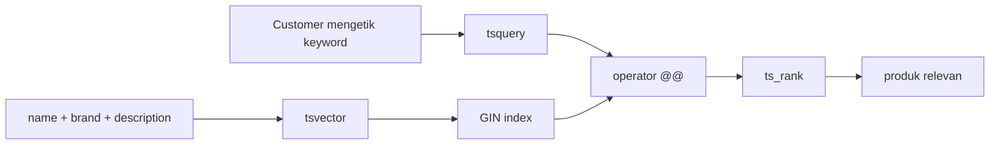
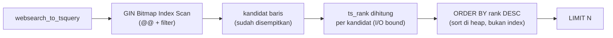
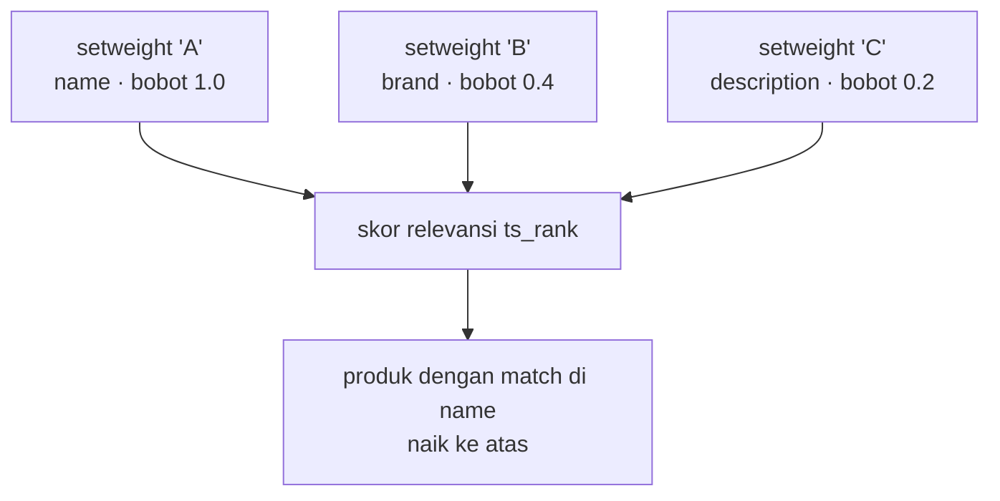
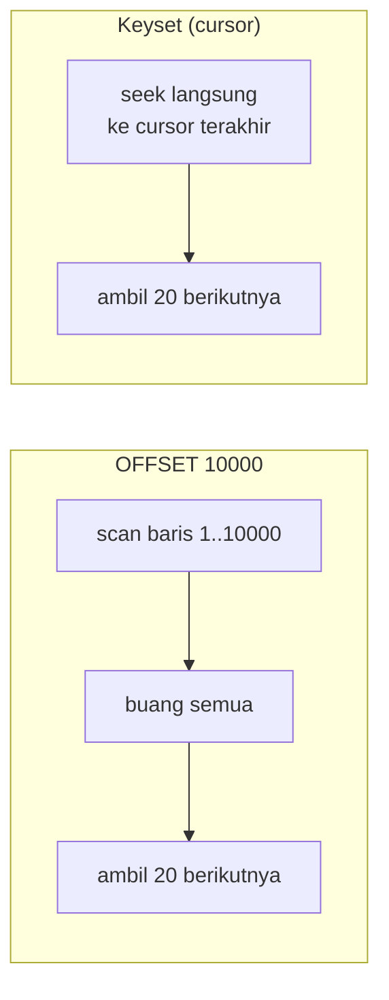
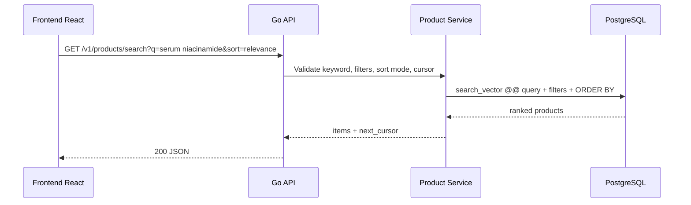
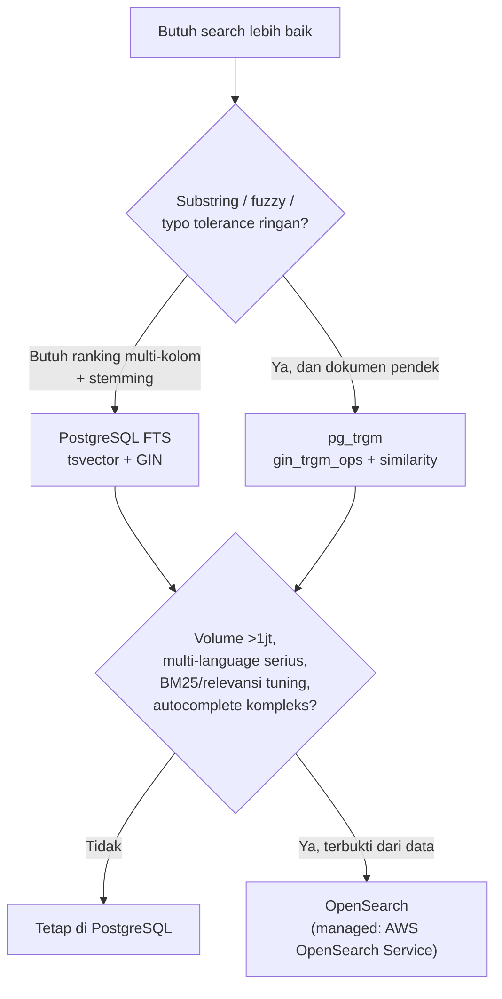
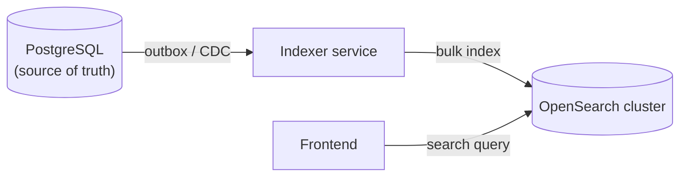

import { Section, Box, Steps, Step, Recap, CardGrid, Card, Chip, Hero, Compare, FileTree, Endpoint, Def } from "@components";

<Hero eyebrow="Roadmap 9 &middot; Advanced Backend Engineering" title="Optimasi Pencarian <em>Produk</em><br />dengan PostgreSQL">
  <p>Pencarian produk yang baik bukan hanya cepat, tetapi juga relevan saat customer mengetik nama bahan, brand, atau masalah kulit.</p>
  <Fragment slot="meta">
    <Chip icon="database">Bahasa: <b>Go 1.26.x</b></Chip>
    <Chip icon="clock">~80 menit baca</Chip>
  </Fragment>
</Hero>

<Section num="01" id="intro" title="Kenapa Search Perlu Dioptimasi?" sub="Dari LIKE sederhana menuju search yang bisa dipakai customer sungguhan">

<p class="lead">Di katalog skincare, customer jarang mencari dengan satu pola rapi seperti `name = 'Sunscreen SPF 50'`.</p>

Mereka bisa mengetik `sunscreen oily skin`, `niacinamide serum`, `wardah acne`, atau `moisturizer ceramide`. Kalau API hanya memakai `ILIKE '%keyword%'`, database harus banyak membaca teks mentah dan relevansi hasil sulit diurutkan.

Di Roadmap 5 kita sudah membangun fondasi discovery (filter, sort, ILIKE, pagination) untuk katalog kecil. Modul ini adalah lapis berikutnya: bagaimana membuat pencarian tetap cepat dan relevan saat katalog tumbuh, keyword makin bebas, dan tim mulai berdebat apakah perlu search engine terpisah.

<Box variant="bridge" icon="🌉" label="Jembatan: dari LIKE ke full-text search"><p>Di Laravel atau SQL biasa, `LIKE` mirip mencari substring. PostgreSQL full-text search memecah teks menjadi token yang dapat dicari, diindeks, dan diberi ranking, mirip dengan cara Laravel Scout mengirim dokumen ke engine eksternal, hanya saja semua tetap di dalam PostgreSQL.</p></Box>

<Compare aLabel="LIKE / ILIKE" bLabel="PostgreSQL full-text search" aTone="muted" bTone="violet">
  <Fragment slot="a"><ul><li>Cocok untuk pencarian substring sederhana.</li><li>Sulit memberi ranking berbasis relevansi.</li><li>`%keyword%` tidak bisa dipercepat indeks B-tree biasa.</li></ul></Fragment>
  <Fragment slot="b"><ul><li>Cocok untuk dokumen teks seperti nama, brand, dan deskripsi produk.</li><li>Mendukung operator query, stemming sesuai konfigurasi bahasa, dan ranking relevansi.</li><li>Dapat dipercepat dengan GIN index pada `tsvector`.</li></ul></Fragment>
</Compare>

Di modul ini kita tetap memakai PostgreSQL, bukan langsung menambah layanan baru. Prinsip scaling yang sehat adalah mengoptimalkan tempat yang tepat lebih dulu, lalu baru menambah komponen seperti `pg_trgm` atau OpenSearch saat kebutuhan sudah jelas.

</Section>

<Section num="02" id="search-basics" title="PostgreSQL Search Basics: LIKE, B-tree, pg_trgm" sub="Kenapa ILIKE '%kw%' lambat, dan jembatan native sebelum lompat ke FTS">

<p class="lead">Sebelum full-text search, pahami dulu kenapa pendekatan paling polos justru jadi mahal saat katalog membesar.</p>

Bentuk paling sederhana adalah `LIKE` (case-sensitive) dan `ILIKE` (case-insensitive). Untuk pencocokan prefix seperti `name ILIKE 'sunscreen%'`, indeks B-tree masih bisa menolong karena pola ter-anchor di kiri. Tetapi customer hampir selalu mencari substring di tengah: `'%sunscreen%'`.

<Box variant="warn" icon="⚠️" label="Kenapa B-tree gagal untuk '%kw%'"><p>Indeks B-tree mengurutkan nilai dari karakter pertama. Pola `'%kw%'` tidak ter-anchor di kiri, jadi PostgreSQL tidak tahu dari mana mulai menelusuri pohon dan jatuh ke Seq Scan: baca semua baris, cocokkan satu per satu. Makin besar katalog, makin lambat.</p></Box>

```sql title="sql/like-vs-prefix.sql"
-- Bisa pakai B-tree (left-anchored prefix)
SELECT id, name FROM products WHERE name ILIKE 'sunscreen%';

-- TIDAK bisa pakai B-tree biasa -> Seq Scan
SELECT id, name FROM products WHERE name ILIKE '%sunscreen%';
```

Di sinilah ekstensi `pg_trgm` masuk sebagai jembatan native PostgreSQL. `pg_trgm` memecah teks menjadi trigram (potongan tiga karakter) dan menyediakan indeks GIN `gin_trgm_ops` yang bisa mempercepat `ILIKE '%kw%'` tanpa perlu anchor kiri, plus fungsi `similarity()` dan `word_similarity()` untuk toleransi typo ringan.

```sql title="migrations/202606060901_enable_pg_trgm.sql"
CREATE EXTENSION IF NOT EXISTS pg_trgm;

-- Mempercepat ILIKE '%kw%' dan regex, tanpa harus anchor kiri
CREATE INDEX idx_products_name_trgm
ON products
USING GIN (name gin_trgm_ops);
```

```sql title="sql/trgm-fuzzy.sql"
-- Operator '%' : threshold similarity default 0.3 (pg_trgm.similarity_threshold)
SELECT name, similarity(name, 'niasinamide') AS score
FROM products
WHERE name % 'niasinamide'        -- typo 'niasinamide' tetap menemukan 'niacinamide'
ORDER BY score DESC
LIMIT 5;
```

<Box variant="tip" icon="💡" label="pg_trgm = typo tolerance Postgres-native"><p>`pg_trgm` memberi fuzzy match dan autocomplete ringan tanpa keluar dari PostgreSQL. Ini sering jadi langkah-antara yang cukup, sebelum benar-benar perlu OpenSearch. Kita bahas posisinya di Section 12.</p></Box>

<Box variant="bridge" icon="🌉" label="Jembatan: Eloquent whereFullText &amp; LIKE"><p>Di Laravel, `where('name', 'LIKE', "%$kw%")` setara `ILIKE` di sini, dan `whereFullText()` memetakan ke MySQL FULLTEXT. PostgreSQL FTS berbeda: MySQL FULLTEXT memakai indeks bawaan engine, sedangkan di PostgreSQL kita eksplisit membangun `tsvector` + GIN sendiri, sehingga lebih bisa dikontrol bobot dan konfigurasinya.</p></Box>

Jadi tiga lapis native PostgreSQL: `LIKE/ILIKE` untuk substring sederhana, `pg_trgm` untuk fuzzy dan `'%kw%'` cepat, dan full-text search untuk pencarian dokumen multi-kolom dengan ranking. Sisa modul fokus pada lapis ketiga, karena itu yang paling kuat untuk pencarian produk.

</Section>

<Section num="03" id="mental-model" title="Mental Model Full-Text Search" sub="Dokumen, query, match, ranking">

<p class="lead">PostgreSQL full-text search bekerja dengan dua tipe utama, `tsvector` untuk dokumen dan `tsquery` untuk pertanyaan pencarian.</p>

<Def term="tsvector"><p>Representasi dokumen yang sudah dinormalisasi menjadi lexeme. Untuk produk skincare, dokumennya gabungan nama produk, brand, dan deskripsi.</p></Def>

<Def term="tsquery"><p>Representasi query pencarian. Contoh terkontrol: `sunscreen & spf`, artinya hasil harus mengandung lexeme `sunscreen` dan `spf`.</p></Def>

<Def term="@@"><p>Operator match PostgreSQL yang mengevaluasi apakah `tsvector` memenuhi `tsquery`.</p></Def>

<Def term="ts_rank"><p>Fungsi ranking yang memberi skor relevansi `float4` berdasarkan frekuensi dan bobot lexeme yang cocok. Ada juga `ts_rank_cd` yang memperhitungkan kedekatan antar-lexeme.</p></Def>

<Def term="GIN"><p>Generalized Inverted Index, tipe indeks PostgreSQL yang cocok untuk mencari elemen di dalam nilai komposit seperti daftar lexeme pada `tsvector`.</p></Def>



<p class="fig-cap"><b>Gambar 1.</b> Full-text search mengubah teks produk dan input pencarian menjadi bentuk yang bisa dicocokkan dan diurutkan.</p>

<Box variant="bridge" icon="🌉" label="Jembatan: mental model Elasticsearch/Algolia"><p>Pernah pakai Algolia atau Elasticsearch di proyek JS/PHP? Petakan saja istilahnya: inverted index &rarr; GIN, analyzer/tokenizer &rarr; text search configuration (`simple`/`english`), dan BM25 &rarr; `ts_rank` (tetapi `ts_rank` tidak memakai statistik frekuensi lintas-korpus seperti BM25, jadi kualitas relevansinya lebih sederhana).</p></Box>

<Box variant="note" icon="📘" label="Rujukan resmi"><p>Konsep `tsvector`, `tsquery`, operator `@@`, ranking, dan indeks untuk full-text search dijelaskan di dokumentasi PostgreSQL Chapter 12: [Full Text Search](https://www.postgresql.org/docs/current/textsearch.html).</p></Box>

</Section>

<Section num="04" id="search-vector" title="Membangun tsvector dari Banyak Kolom" sub="Nama produk lebih penting dari deskripsi panjang">

<p class="lead">Untuk katalog skincare, pencarian biasanya harus membaca lebih dari satu kolom.</p>

Kita akan membuat kolom `search_vector` dari `name`, `brand`, dan `description`. Nama produk diberi bobot lebih tinggi karena customer yang mencari `sunscreen` biasanya ingin produk yang namanya mengandung sunscreen muncul di atas deskripsi yang hanya menyebut kata itu sekilas.

<Box variant="tip" icon="💡" label="Pilih konfigurasi bahasa dengan sadar"><p>Contoh ini memakai konfigurasi `simple`: kamus `simple` melipat token ke lowercase tetapi TIDAK membuang stop word dan TIDAK melakukan stemming, jadi `niacinamide` atau `COSRX` tetap utuh. Trade-off-nya, `simple` tidak menyatukan jamak/derivasi (`serums` bukan `serum`). Konfigurasi `english` menerapkan stemmer Snowball plus stop words, lebih bagus untuk kalimat Inggris penuh tetapi berisiko over-stemming nama brand atau bahan aktif.</p></Box>

```sql title="migrations/202606060903_add_product_search.sql"
ALTER TABLE products
ADD COLUMN search_vector tsvector
GENERATED ALWAYS AS (
  setweight(to_tsvector('simple', coalesce(name, '')), 'A') ||
  setweight(to_tsvector('simple', coalesce(brand, '')), 'B') ||
  setweight(to_tsvector('simple', coalesce(description, '')), 'C')
) STORED;

CREATE INDEX idx_products_search_vector
ON products
USING GIN (search_vector);
```

Kolom generated membuat aplikasi Go tidak perlu mengingat kapan harus mengisi ulang `search_vector`. Setiap kali `name`, `brand`, atau `description` berubah, PostgreSQL menghitung ulang nilai tersebut secara otomatis.

<Box variant="note" icon="📘" label="Generated column &gt; trigger lama"><p>Dulu cara klasik adalah `tsvector_update_trigger`. Dokumentasi PostgreSQL kini menyatakan metode trigger itu sudah usang (obsoleted) dan menyarankan stored generated column seperti di atas. Generated column lebih ringkas, deklaratif, dan tidak bisa lupa di-fire saat ada jalur update baru.</p></Box>

<Compare aLabel="Trigger lama (obsolete)" bLabel="Generated column STORED" aTone="muted" bTone="blue">
  <Fragment slot="a"><ul><li>`CREATE TRIGGER ... tsvector_update_trigger(...)`.</li><li>Harus didaftarkan dan dijaga manual.</li><li>Rentan lupa saat tabel berubah skema.</li></ul></Fragment>
  <Fragment slot="b"><ul><li>Definisi menyatu dengan kolom, satu sumber kebenaran.</li><li>PostgreSQL menjaga `search_vector` selalu sinkron.</li><li>Direkomendasikan dokumentasi resmi.</li></ul></Fragment>
</Compare>

<Box variant="warn" icon="⚠️" label="Production migration"><p>Untuk tabel besar, `CREATE INDEX CONCURRENTLY` lebih aman karena mengurangi blocking write, tetapi tidak boleh dijalankan di dalam transaction migration yang sama.</p></Box>

```sql title="migrations/202606060904_add_product_search_index_concurrent.sql"
CREATE INDEX CONCURRENTLY IF NOT EXISTS idx_products_search_vector
ON products
USING GIN (search_vector);
```

<Box variant="tip" icon="💡" label="Normalisasi diakritik (opsional)"><p>Bila katalog memuat istilah beraksen (mis. nama Prancis), ekstensi `unaccent` bisa dirangkai ke `to_tsvector` agar `crème` cocok dengan `creme`. Tambahkan hanya jika benar dibutuhkan, karena menambah satu lapis konfigurasi.</p></Box>

</Section>

<Section num="05" id="gin-index" title="GIN Index untuk Search Vector" sub="Agar search tidak scan seluruh katalog">

<p class="lead">GIN index membuat PostgreSQL bisa menemukan produk yang mengandung lexeme tertentu tanpa membaca semua baris satu per satu.</p>

GIN bekerja seperti inverted index: lexeme menunjuk ke daftar row yang memilikinya. Ini mirip struktur internal search engine, tetapi tetap berada di PostgreSQL.

```sql title="sql/explain-search.sql"
EXPLAIN (ANALYZE, BUFFERS)
SELECT id, name, brand
FROM products
WHERE search_vector @@ websearch_to_tsquery('simple', 'sunscreen spf')
ORDER BY ts_rank(search_vector, websearch_to_tsquery('simple', 'sunscreen spf')) DESC
LIMIT 20;
```

Saat indeks efektif, plan biasanya menunjukkan Bitmap Index Scan pada indeks GIN, lalu Bitmap Heap Scan untuk mengambil row produk. Tetapi ada satu hal penting: GIN hanya mempercepat tahap match `@@`, bukan tahap `ORDER BY rank`.



<p class="fig-cap"><b>Gambar 2.</b> Pipeline dua fase: GIN menyaring kandidat, lalu ranking dan sorting dihitung hanya pada kandidat itu. GIN tidak mempercepat sorting.</p>

<Box variant="warn" icon="⚠️" label="Ranking itu I/O-bound"><p>Dokumentasi PostgreSQL memperingatkan bahwa ranking bisa mahal karena harus membaca `tsvector` tiap dokumen yang cocok, sehingga cenderung I/O-bound dan lambat. Itulah alasan kuat untuk membatasi kandidat lebih dulu dengan filter dan `@@`, baru menghitung `ts_rank` pada sisa yang kecil, lalu `LIMIT`.</p></Box>

<CardGrid cols={3}>
  <Card><h4>Search match</h4><p>`search_vector @@ query` cocok untuk GIN index.</p></Card>
  <Card><h4>Ranking</h4><p>`ts_rank` membantu urutan relevansi, tetapi bukan indeks urutan dan dihitung di heap.</p></Card>
  <Card><h4>Filter domain</h4><p>Kategori, status aktif, dan rentang harga tetap butuh indeks B-tree yang sesuai.</p></Card>
</CardGrid>

</Section>

<Section num="06" id="ranking-query" title="Query Search, Ranking, dan Highlight" sub="to_tsquery untuk query terkontrol, websearch_to_tsquery untuk input customer">

<p class="lead">`to_tsquery` powerful, tetapi input customer bebas lebih aman diproses dengan `websearch_to_tsquery`.</p>

`to_tsquery` menerima sintaks khusus seperti `&`, `|`, `!`, dan operator phrase. Ini bagus untuk query yang dibangun aplikasi atau admin, tetapi melempar error jika string dari customer tidak valid. Untuk search box publik, `websearch_to_tsquery` lebih ramah: ia menerima gaya pencarian web, tidak pernah melempar error sintaks, dan mengenali frasa berkutip, kata kunci `or`, serta tanda minus untuk negasi.

```sql title="sql/tsquery-examples.sql"
SELECT to_tsvector('simple', 'Azarine Hydrasoothe Sunscreen Gel SPF 45');

-- Frasa berkutip -> 'fat' <-> 'rat' (harus berurutan)
SELECT websearch_to_tsquery('simple', '"low ph cleanser"');

-- OR eksplisit
SELECT websearch_to_tsquery('simple', 'serum or essence');

-- Negasi dengan tanda minus
SELECT websearch_to_tsquery('simple', 'sunscreen -spray');
```

Query utama untuk katalog menggabungkan match, ranking, dan filter status aktif.

```sql title="sql/search-products-ranked.sql"
WITH q AS (
  SELECT websearch_to_tsquery('simple', $1) AS query
)
SELECT
  p.id,
  p.name,
  p.brand,
  p.slug,
  p.price,
  p.image_url,
  ts_rank(p.search_vector, q.query) AS rank
FROM products p
CROSS JOIN q
WHERE p.is_active = true
  AND p.deleted_at IS NULL
  AND p.search_vector @@ q.query
ORDER BY rank DESC, p.id DESC
LIMIT $2;
```

Jika admin panel punya mode query lanjutan, barulah `to_tsquery` masuk akal karena user internal memahami sintaks `sunscreen & spf`.

```sql title="sql/search-products-admin-advanced.sql"
WITH q AS (
  SELECT to_tsquery('simple', $1) AS query
)
SELECT
  p.id,
  p.name,
  p.brand,
  ts_rank(p.search_vector, q.query) AS rank
FROM products p
CROSS JOIN q
WHERE p.search_vector @@ q.query
ORDER BY rank DESC, p.id DESC
LIMIT 50;
```

<h3>ts_rank vs ts_rank_cd dan parameter normalization</h3>

`ts_rank` punya saudara `ts_rank_cd` (cover density) yang memperhitungkan kedekatan antar-lexeme yang cocok, berguna saat posisi kata penting (frasa). Keduanya menerima parameter `normalization` opsional, sebuah bitmask yang mengatur apakah skor dinormalisasi terhadap panjang dokumen. Default `0` mengabaikan panjang dokumen.

```sql title="sql/ts-rank-variants.sql"
-- Bobot default array: {D, C, B, A} = {0.1, 0.2, 0.4, 1.0}
-- name(A)=1.0, brand(B)=0.4, description(C)=0.2 -> nama produk menang.

-- normalization = 2 -> bagi skor dengan log panjang dokumen
SELECT p.name,
       ts_rank(p.search_vector, q.query, 2)    AS rank_norm,
       ts_rank_cd(p.search_vector, q.query)    AS rank_cd
FROM products p
CROSS JOIN websearch_to_tsquery('simple', 'low ph cleanser') AS q(query)
WHERE p.search_vector @@ q.query
ORDER BY rank_norm DESC
LIMIT 10;
```



<p class="fig-cap"><b>Gambar 3.</b> `setweight` memetakan kolom ke label A/B/C/D yang punya bobot default berbeda, sehingga match pada nama produk berkontribusi lebih besar ke skor.</p>

<h3>Highlight hasil dengan ts_headline</h3>

UI e-commerce sering menampilkan cuplikan yang menyorot kata yang cocok. `ts_headline` membuat snippet itu langsung dari teks asli.

```sql title="sql/ts-headline.sql"
SELECT p.name,
       ts_headline('simple', p.description, q.query,
                   'StartSel=<mark>, StopSel=</mark>, MaxWords=20, MinWords=8') AS snippet
FROM products p
CROSS JOIN websearch_to_tsquery('simple', 'ceramide barrier') AS q(query)
WHERE p.search_vector @@ q.query
LIMIT 5;
```

<Box variant="warn" icon="⚠️" label="Jangan concat SQL query"><p>Tetap kirim keyword sebagai parameter SQL. Parameter mencegah SQL injection, sedangkan fungsi seperti `websearch_to_tsquery` mengubah input teks jadi query full-text yang aman.</p></Box>

</Section>

<Section num="07" id="filter-strategy" title="Filtering Strategy: Facet dan Index" sub="Search jarang berdiri sendiri di katalog skincare">

<p class="lead">Di produk skincare, search hampir selalu digabung dengan kategori, brand, range harga, tipe kulit, dan status stok.</p>

Filter bukan sekadar menempel `AND` di SQL. Sebagai strategi, ada tiga keputusan: facet apa yang ditawarkan, indeks apa yang menopangnya, dan urutan evaluasi filter vs match GIN.

<CardGrid cols={2}>
  <Card><h4>Facet umum katalog</h4><p>Kategori (`category_slug`), brand, rentang harga, tipe kulit, dan status aktif. Inilah dimensi yang biasa muncul di sidebar filter.</p></Card>
  <Card><h4>Index pendukung</h4><p>B-tree pada `category_slug`, `brand`, dan `price`; partial index pada baris aktif agar lebih ramping.</p></Card>
</CardGrid>

```sql title="migrations/202606060905_add_filter_indexes.sql"
-- Equality filter umum
CREATE INDEX idx_products_category ON products (category_slug);
CREATE INDEX idx_products_brand    ON products (brand);

-- Range harga (PriceRupiah disimpan sebagai bigint)
CREATE INDEX idx_products_price    ON products (price);

-- Partial index: hanya baris yang benar-benar tampil di katalog
CREATE INDEX idx_products_active
ON products (category_slug)
WHERE is_active = true AND deleted_at IS NULL;
```

Contoh API: customer mencari `serum niacinamide`, lalu memfilter kategori `serum`, brand tertentu, dan harga di bawah batas. SQL-nya tetap satu query, dengan filter dan match digabung di `WHERE` yang sama.

```sql title="sql/search-products-filtered.sql"
WITH q AS (
  SELECT websearch_to_tsquery('simple', $1) AS query
)
SELECT
  p.id,
  p.name,
  p.brand,
  p.slug,
  p.price,
  ts_rank(p.search_vector, q.query) AS rank
FROM products p
CROSS JOIN q
WHERE p.is_active = true
  AND p.deleted_at IS NULL
  AND ($2::text   IS NULL OR p.category_slug = $2)   -- facet kategori
  AND ($3::text   IS NULL OR p.brand = $3)           -- facet brand
  AND ($4::bigint IS NULL OR p.price <= $4)          -- facet harga (PriceRupiah)
  AND ($5::text   IS NULL OR p.skin_type = $5)       -- facet tipe kulit
  AND p.search_vector @@ q.query
ORDER BY rank DESC, p.id DESC
LIMIT $6;
```

<Box variant="note" icon="📘" label="Urutan evaluasi: serahkan ke planner"><p>Kamu tidak perlu menebak filter mana dijalankan dulu. Planner PostgreSQL memilih jalur termurah: bisa GIN dulu lalu saring filter, atau filter selektif dulu lalu cek `@@`. Tugasmu adalah menyediakan indeks yang tepat (GIN untuk `@@`, B-tree untuk facet) dan menjaga statistik tetap segar (`ANALYZE`).</p></Box>

<Box variant="warn" icon="⚠️" label="Inventory bukan filter search sembarangan"><p>Jangan jadikan full-text search sebagai sumber kebenaran stok. Filter `in_stock` boleh ada di query katalog, tetapi angka stok yang dipakai untuk checkout harus tetap dihitung dari domain inventory karena nilainya sangat dinamis.</p></Box>

</Section>

<Section num="08" id="sort-strategy" title="Sorting Strategy: Multi-Mode Katalog" sub="Relevansi hanya satu dari banyak cara customer mengurutkan">

<p class="lead">Search bukan satu-satunya urutan. Katalog skincare butuh mode sort yang beragam: paling relevan, terbaru, termurah, termahal, terlaris, dan A-Z.</p>

Setiap mode sort memetakan ke kolom dan tie-breaker yang berbeda. Kunci sehatnya: selalu akhiri `ORDER BY` dengan kolom unik dan deterministik (`id`) supaya urutan stabil antar-halaman, dan supaya keyset pagination bisa bekerja.

<div class="tbl-wrap">
<table>
<thead><tr><th>Mode</th><th>Kolom sort</th><th>Tie-breaker</th></tr></thead>
<tbody>
<tr><td>Relevansi</td><td>`ts_rank(...) DESC`</td><td>`id DESC`</td></tr>
<tr><td>Terbaru</td><td>`created_at DESC`</td><td>`id DESC`</td></tr>
<tr><td>Termurah</td><td>`price ASC`</td><td>`id ASC`</td></tr>
<tr><td>Termahal</td><td>`price DESC`</td><td>`id DESC`</td></tr>
<tr><td>Terlaris</td><td>`sold_count DESC`</td><td>`id DESC`</td></tr>
<tr><td>A-Z</td><td>`name ASC`</td><td>`id ASC`</td></tr>
</tbody>
</table>
</div>

<Box variant="warn" icon="⚠️" label="Whitelist mode sort, jangan terima kolom mentah"><p>Jangan pernah memasukkan nama kolom dari query string langsung ke SQL. Petakan mode sort yang valid ke ekspresi `ORDER BY` lewat `switch` di Go. Mode tak dikenal jatuh ke default. Ini mencegah SQL injection lewat parameter sort.</p></Box>

```go title="internal/product/sort.go"
package product

// sortClause memetakan mode sort yang di-whitelist ke ekspresi ORDER BY.
// Tie-breaker id menjaga urutan stabil dan cocok untuk keyset pagination.
func sortClause(mode string) string {
	switch mode {
	case "newest":
		return "p.created_at DESC, p.id DESC"
	case "price_asc":
		return "p.price ASC, p.id ASC"
	case "price_desc":
		return "p.price DESC, p.id DESC"
	case "best_selling":
		return "p.sold_count DESC, p.id DESC"
	case "name_asc":
		return "p.name ASC, p.id ASC"
	default: // "relevance"
		return "rank DESC, p.id DESC"
	}
}
```

<Box variant="note" icon="📘" label="Index untuk sort, bukan hanya filter"><p>Sort `created_at DESC` atau `price ASC` pada katalog besar terbantu indeks B-tree composite seperti `(category_slug, price)` agar PostgreSQL bisa membaca terurut tanpa sort terpisah. Mode `relevance` adalah pengecualian: `ts_rank` selalu di-sort di heap karena bukan kolom terindeks.</p></Box>

<Box variant="bridge" icon="🌉" label="Jembatan: Eloquent orderBy vs whitelist Go"><p>Di Laravel kamu mungkin terbiasa `Product::orderBy($request->sort)`. Itu rapuh karena `$request->sort` bisa diisi apa saja. Versi Go di atas memilih eksplisit lewat `switch`, sehingga hanya mode yang kamu izinkan yang pernah menyentuh SQL.</p></Box>

</Section>

<Section num="09" id="keyset-pagination" title="Keyset Pagination yang Benar" sub="OFFSET besar lambat, dan keyset pada float rank itu jebakan">

<p class="lead">`OFFSET` besar lambat karena PostgreSQL tetap membaca lalu membuang ribuan baris sebelum mengembalikan halaman berikutnya.</p>



<p class="fig-cap"><b>Gambar 4.</b> OFFSET membaca lalu membuang baris yang dilewati (scan-and-discard), sedangkan keyset langsung melompat ke posisi cursor lalu membaca maju.</p>

Untuk search yang bisa di-scroll, gunakan keyset pagination. Idenya: simpan nilai kolom sort dari item terakhir sebagai cursor, lalu minta baris setelahnya.

<Box variant="warn" icon="⚠️" label="Jangan jadikan ts_rank kunci keyset polos"><p>Godaan pertama adalah `WHERE rank < $cursor_rank OR (rank = $cursor_rank AND id < $cursor_id)`. Masalahnya, `ts_rank` mengembalikan `float4` yang dihitung ulang tiap query, dan perbandingan kesetaraan float (`rank = $cursor_rank`) rapuh: pembulatan bisa membuat baris batas tidak pernah cocok, sehingga item terlewat atau duplikat antar-halaman. Selain itu `rank` bukan kolom unik dan tidak terindeks.</p></Box>

Solusinya: pakai row-value (tuple) comparison. Karena `rank` dan `id` sama-sama menurun (`DESC`), tuple comparison `(rank, id) < (cursor_rank, cursor_id)` sah dan setara dengan bentuk `OR` panjang, tetapi lebih ringkas dan menghindari perangkap float. Cursor harus menyimpan nilai `rank` EKSAK dari baris terakhir, bukan dihitung ulang.

```sql title="sql/search-products-keyset.sql"
WITH q AS (
  SELECT websearch_to_tsquery('simple', $1) AS query
), ranked AS (
  SELECT
    p.id,
    p.name,
    p.brand,
    p.slug,
    p.price,
    ts_rank(p.search_vector, q.query) AS rank
  FROM products p
  CROSS JOIN q
  WHERE p.is_active = true
    AND p.deleted_at IS NULL
    AND ($2::text IS NULL OR p.category_slug = $2)
    AND p.search_vector @@ q.query
)
SELECT id, name, brand, slug, price, rank
FROM ranked
-- tuple comparison: keduanya DESC, jadi (rank, id) < (cursor_rank, cursor_id)
WHERE $3::real IS NULL
   OR (rank, id) < ($3::real, $4::bigint)
ORDER BY rank DESC, id DESC
LIMIT $5;
```

<Box variant="tip" icon="💡" label="Mode non-relevansi lebih cocok untuk keyset dalam"><p>Karena `rank` adalah float non-unik, halaman yang sangat dalam pada mode relevansi tetap berisiko. Untuk scroll panjang, mode deterministik seperti terbaru atau harga lebih kokoh: cursor-nya `(created_at, id)` atau `(price, id)` yang terindeks dan stabil. Beri mode relevansi disclaimer bahwa halaman dalam mungkin tidak sempurna stabil.</p></Box>

```sql title="sql/keyset-newest.sql"
-- Mode 'terbaru': cursor (created_at, id), keduanya DESC -> tuple comparison
SELECT id, name, brand, slug, price, created_at
FROM products
WHERE is_active = true
  AND deleted_at IS NULL
  AND ($1::timestamptz IS NULL
       OR (created_at, id) < ($1::timestamptz, $2::bigint))
ORDER BY created_at DESC, id DESC
LIMIT $3;
```

<Box variant="warn" icon="⚠️" label="Tuple comparison butuh arah sort sama"><p>`(a, b) < (x, y)` setara `a < x OR (a = x AND b < y)` dan hanya benar bila kedua kolom searah (sama-sama DESC atau sama-sama ASC). Untuk mode campur seperti `price ASC, id DESC`, tuple comparison polos tidak berlaku, kamu harus menulis bentuk `OR` eksplisit dengan arah yang sesuai per kolom.</p></Box>

<Box variant="tip" icon="💡" label="Cursor search"><p>Response API cukup mengirim `next_cursor` yang meng-encode nilai kolom sort dan `id` terakhir (mis. base64 dari JSON `{"rank":0.061,"id":842}`). Request berikutnya mengirim cursor itu kembali, dan server men-decode-nya menjadi parameter SQL.</p></Box>

</Section>

<Section num="10" id="implementasi-go" title="Implementasi Repository dengan pgx" sub="Go menjaga SQL tetap eksplisit dan mudah diukur">

<p class="lead">Di Go, repository menyimpan SQL yang jelas, menerima `context.Context` sebagai parameter pertama, lalu mengembalikan struct hasil pencarian.</p>

<FileTree title="Potongan struktur search produk" tree={`internal/
  product/
    search_repository.go  # query full-text search dengan pgxpool
    search_service.go     # validasi input dan cursor (sumber kebenaran limit)
    sort.go               # whitelist mode sort
    handler.go            # HTTP handler untuk /v1/products/search
migrations/
  202606060903_add_product_search.sql
go.mod
`} />

Konvensi proyek menaruh validasi (clamp limit, normalisasi keyword) di service layer, agar repository hanya mengeksekusi query yang sudah bersih. Repository fokus pada SQL dan pemetaan baris.

```go title="internal/product/search_repository.go"
package product

import (
	"context"
	"fmt"

	"github.com/jackc/pgx/v5"
	"github.com/jackc/pgx/v5/pgxpool"
)

// SearchRepository menerima *pgxpool.Pool yang sudah dikonfigurasi
// (MaxConns, MaxConnLifetime) di lapisan bootstrap, lihat modul
// connection-pool tuning di Roadmap 9 Chapter 1.
type SearchRepository struct {
	pool *pgxpool.Pool
}

func NewSearchRepository(pool *pgxpool.Pool) *SearchRepository {
	return &SearchRepository{pool: pool}
}

// SearchProductsParams sudah tervalidasi di service: keyword bersih,
// Limit sudah di-clamp. Repository tidak memvalidasi ulang.
type SearchProductsParams struct {
	Keyword      string
	CategorySlug *string
	LastRank     *float32 // nilai rank EKSAK dari baris terakhir (cursor)
	LastID       *int64
	Limit        int32
}

type SearchProductRow struct {
	ID          int64
	Name        string
	Brand       string
	Slug        string
	PriceRupiah int64 `db:"price"` // harga sebagai int64 Rupiah
	Rank        float32
}

// Pemetaan parameter:
//   $1 keyword | $2 category_slug | $3 last_rank | $4 last_id | $5 limit
const searchProductsQuery = `
WITH q AS (
  SELECT websearch_to_tsquery('simple', $1) AS query
), ranked AS (
  SELECT
    p.id, p.name, p.brand, p.slug, p.price,
    ts_rank(p.search_vector, q.query) AS rank
  FROM products p
  CROSS JOIN q
  WHERE p.is_active = true
    AND p.deleted_at IS NULL
    AND ($2::text IS NULL OR p.category_slug = $2)
    AND p.search_vector @@ q.query
)
SELECT id, name, brand, slug, price, rank
FROM ranked
WHERE $3::real IS NULL
   OR (rank, id) < ($3::real, $4::bigint)
ORDER BY rank DESC, id DESC
LIMIT $5`

func (r *SearchRepository) SearchProducts(ctx context.Context, params SearchProductsParams) ([]SearchProductRow, error) {
	rows, err := r.pool.Query(ctx, searchProductsQuery,
		params.Keyword, params.CategorySlug, params.LastRank, params.LastID, params.Limit)
	if err != nil {
		return nil, fmt.Errorf("search products: %w", err)
	}
	defer rows.Close()

	products, err := pgx.CollectRows(rows, pgx.RowToStructByName[SearchProductRow])
	if err != nil {
		return nil, fmt.Errorf("search products collect: %w", err)
	}

	// pgx.CollectRows mengembalikan slice kosong (bukan error) saat tak ada baris.
	return products, nil
}
```

Validasi yang dipakai repository di atas tinggal di service, satu tempat (DRY).

```go title="internal/product/search_service.go"
package product

import (
	"context"
	"errors"
	"strings"
)

var ErrEmptyKeyword = errors.New("keyword is required")

const defaultLimit = 20
const maxLimit = 50

type SearchService struct {
	repo *SearchRepository
}

func NewSearchService(repo *SearchRepository) *SearchService {
	return &SearchService{repo: repo}
}

func (s *SearchService) Search(ctx context.Context, params SearchProductsParams) ([]SearchProductRow, error) {
	params.Keyword = strings.TrimSpace(params.Keyword)
	if params.Keyword == "" {
		return nil, ErrEmptyKeyword
	}

	// Clamp limit di service: satu sumber kebenaran.
	if params.Limit <= 0 || params.Limit > maxLimit {
		params.Limit = defaultLimit
	}

	return s.repo.SearchProducts(ctx, params)
}
```

<Box variant="bridge" icon="🌉" label="Jembatan: dari Eloquent &amp; Scout ke pgx"><p>Di Laravel, builder atau Laravel Scout menyembunyikan SQL di balik driver. Di Go dengan pgx, SQL terlihat jelas sehingga lebih mudah di-`EXPLAIN`, dioptimasi, dan dibahas dengan DBA. Scout-style external engine (analog OpenSearch) baru dipertimbangkan saat PostgreSQL tidak lagi cukup, bukan sebagai default.</p></Box>

Kode di atas sengaja tidak membuat query builder dinamis. Untuk search produk yang kritikal, query eksplisit lebih mudah di-review daripada string SQL yang disusun dari banyak cabang.

</Section>

<Section num="11" id="api-domain" title="Skenario API Online Shop Skincare" sub="Search menjadi bagian dari customer journey, bukan fitur terpisah">

<p class="lead">Customer journey katalog dimulai dari browse, filter, search, lalu masuk ke product detail.</p>

<Endpoint method="GET" path="/v1/products/search?q=sunscreen&amp;category=suncare&amp;sort=relevance" desc="Cari produk aktif dengan full-text search, filter kategori, dan mode sort" />
<Endpoint method="GET" path="/v1/products?category=suncare&amp;sort=price_asc" desc="Browse katalog tanpa keyword, tetap memakai filter, sort, dan keyset pagination" />
<Endpoint method="GET" path="/v1/products/{slug}" desc="Product detail, cocok digabung dengan cache dari modul sebelumnya" />



<p class="fig-cap"><b>Gambar 5.</b> Search tetap lewat service layer agar validasi domain, whitelist sort, dan aturan pagination tidak bocor ke handler.</p>

<Box variant="bridge" icon="🌉" label="Jembatan: cursor &rarr; useInfiniteQuery di React"><p>`next_cursor` cocok dengan pola infinite scroll TanStack Query: kembalikan cursor dari `getNextPageParam`, dan `useInfiniteQuery` akan mengirimnya kembali di request berikut. Cursor (bukan nomor halaman) memang pas untuk scroll karena halaman bertambah, bukan melompat. Tambahkan debounce plus `AbortController` di search box agar tiap keystroke tidak menembak FTS yang I/O-bound.</p></Box>

<CardGrid cols={3}>
  <Card><h4>Keyword</h4><p>Dipakai untuk full-text search pada nama, brand, dan deskripsi.</p></Card>
  <Card><h4>Filter</h4><p>Kategori, brand, harga, tipe kulit, dan status aktif dipakai di `WHERE` yang sama.</p></Card>
  <Card><h4>Cursor + sort</h4><p>Frontend menyimpan cursor halaman terakhir dan mode sort, bukan angka halaman besar.</p></Card>
</CardGrid>

<Box variant="note" icon="📌" label="Relasi dengan cache"><p>Search result lebih dinamis daripada product detail. Cache product detail boleh agresif, tetapi search result perlu hati-hati karena kombinasi keyword, filter, sort, dan ranking membuat ruang cache key meledak.</p></Box>

</Section>

<Section num="12" id="opensearch" title="pg_trgm dan Kapan Perlu OpenSearch?" sub="Jangan menambah sistem baru hanya karena terdengar enterprise">

<p class="lead">PostgreSQL, dengan FTS dan `pg_trgm`, sudah cukup untuk banyak online shop kecil sampai menengah.</p>

Ada langkah-antara yang sering terlewat sebelum lompat ke OpenSearch: `pg_trgm`. Ekstensi ini memberi typo tolerance dan autocomplete ringan secara native, jadi pohon keputusannya bukan biner "FTS sekarang vs OpenSearch nanti".



<p class="fig-cap"><b>Gambar 6.</b> `pg_trgm` adalah node tengah Postgres-native antara FTS dan OpenSearch, bukan langkah yang dilompati.</p>

OpenSearch mulai masuk akal ketika kebutuhan search melampaui kemampuan PostgreSQL sebagai database utama. AWS OpenSearch Service adalah managed service untuk klaster OpenSearch (fork dari Elasticsearch 7.10.2 berlisensi ALv2), kuat untuk relevansi BM25, fuzzy/typo, autocomplete, faceting, dan analitik log.

<Box variant="note" icon="📘" label="Keterbatasan resmi PostgreSQL FTS"><p>Sebelum memutuskan, kenali batasnya: PostgreSQL FTS tidak punya fuzzy/typo tolerance bawaan (itu tugas `pg_trgm`), tidak memakai BM25, dan skor `ts_rank` tidak memakai statistik frekuensi lintas-korpus. Untuk relevansi yang benar-benar kompleks, inilah celah yang ditutup OpenSearch.</p></Box>

<CardGrid cols={2}>
  <Card><h4>Tetap PostgreSQL dulu</h4><p>Katalog masih ratusan ribu produk, bahasa terbatas, typo tolerance ringan cukup dengan `pg_trgm`, dan query bisa dijaga dengan indeks.</p></Card>
  <Card><h4>Pertimbangkan OpenSearch</h4><p>Volume sangat besar, multi-language serius, fuzzy/relevansi kompleks wajib, autocomplete canggih, dan tim siap mengelola sinkronisasi data.</p></Card>
</CardGrid>

<Box variant="warn" icon="⚠️" label="Biaya kompleksitas"><p>OpenSearch berarti ada pipeline sinkronisasi, reindex, monitoring cluster, mapping, dan failure mode baru. Ambang "1 juta produk" hanyalah indikatif; sumber lain bahkan menyebut PG FTS nyaman sampai ratusan ribu baris sebelum tuning serius. Putuskan dari sinyal kebutuhan, bukan satu angka kaku, dan hanya setelah bottleneck terbukti lewat data.</p></Box>



<p class="fig-cap"><b>Gambar 7.</b> Saat pindah ke OpenSearch, data tetap dimiliki PostgreSQL; sebuah indexer (lewat outbox atau CDC) menjaga indeks tetap sinkron. Pola outbox ini menyiapkan jembatan ke modul Event-Driven (Chapter 4).</p>

<Compare aLabel="PostgreSQL (FTS + pg_trgm)" bLabel="OpenSearch" aTone="blue" bTone="teal">
  <Fragment slot="a"><ul><li>Satu sumber data, transaksi tetap sederhana.</li><li>Bagus untuk search katalog yang masih dekat dengan SQL filter.</li><li>Lebih mudah dioperasikan bersama RDS PostgreSQL.</li></ul></Fragment>
  <Fragment slot="b"><ul><li>Lebih kuat untuk fuzzy search, autocomplete, multi-language, dan relevansi BM25.</li><li>Butuh sinkronisasi dari database utama.</li><li>Menambah biaya infrastruktur dan observability.</li></ul></Fragment>
</Compare>

</Section>

<Section num="13" id="jebakan" title="Jebakan Umum Search Optimization" sub="Bug search jarang error keras, lebih sering hasil salah diam-diam">

<p class="lead">Sebagian besar masalah search bukan crash, melainkan hasil yang salah urut, terlewat, atau lambat tanpa alasan jelas.</p>

<CardGrid cols={2}>
  <Card><h4>Keyset pada float rank</h4><p>Memakai `rank = $cursor` pada `float4` membuat baris batas tidak cocok. Pakai tuple comparison dan simpan rank eksak, atau keyset pada kolom deterministik.</p></Card>
  <Card><h4>Lupa tie-breaker id</h4><p>`ORDER BY rank DESC` tanpa `id` membuat urutan tidak stabil, halaman bisa menampilkan baris yang sama atau melompat.</p></Card>
  <Card><h4>to_tsquery untuk input publik</h4><p>`to_tsquery` melempar error pada input bebas customer. Pakai `websearch_to_tsquery` untuk search box.</p></Card>
  <Card><h4>Mengharap GIN mempercepat sort</h4><p>GIN hanya untuk `@@`. `ORDER BY rank` tetap di-sort di heap; batasi kandidat dengan filter lebih dulu.</p></Card>
  <Card><h4>String interpolation ke SQL</h4><p>Menyusun `WHERE name ILIKE '%' || kw` atau kolom sort dari query string membuka SQL injection. Selalu parameter dan whitelist.</p></Card>
  <Card><h4>english vs simple asal pilih</h4><p>`english` bisa over-stemming brand/bahan. Untuk katalog penuh nama produk, `simple` sering lebih aman.</p></Card>
</CardGrid>

<Box variant="warn" icon="⚠️" label="Ranking mahal saat kandidat tidak dibatasi"><p>Jika `@@` mencocokkan puluhan ribu baris, `ts_rank` dihitung untuk semuanya sebelum `LIMIT`. Selalu sempitkan dengan filter selektif (kategori, status) supaya ranking hanya berjalan pada kandidat yang relevan.</p></Box>

</Section>

<Section num="14" id="hands-on" title="Hands-on Ringan" sub="Tambahkan search ke katalog lokal dan ukur plan-nya">

<p class="lead">Hands-on ini fokus pada validasi search dengan SQL dan repository Go, bukan membuat UI.</p>

<Steps>
  <Step><b>Aktifkan pg_trgm dan kolom search vector</b><p>Jalankan `CREATE EXTENSION pg_trgm`, migration `ADD COLUMN search_vector`, dan GIN index pada tabel `products`.</p></Step>
  <Step><b>Seed produk skincare</b><p>Masukkan beberapa produk sunscreen, serum, moisturizer, dan cleanser dengan brand serta deskripsi realistis.</p></Step>
  <Step><b>Uji query ranking dan highlight</b><p>Jalankan `websearch_to_tsquery` untuk keyword `sunscreen spf`, pastikan produk paling relevan di atas, lalu coba `ts_headline`.</p></Step>
  <Step><b>Uji fuzzy dengan pg_trgm</b><p>Ketik typo seperti `niasinamide` dan pastikan `similarity()` tetap menemukan produk niacinamide.</p></Step>
  <Step><b>Bandingkan plan</b><p>Gunakan `EXPLAIN (ANALYZE, BUFFERS)` sebelum dan sesudah GIN index untuk melihat perbedaan Seq Scan vs Bitmap Index Scan.</p></Step>
  <Step><b>Hubungkan repository Go</b><p>Pakai `SearchService.Search` dari handler `GET /v1/products/search` dengan keyset cursor.</p></Step>
</Steps>

```sql title="sql/seed-search-products.sql"
INSERT INTO products (name, brand, slug, description, price, category_slug, is_active)
VALUES
  ('Hydrating Sunscreen Gel SPF 50', 'Azarine', 'azarine-hydrating-sunscreen-gel-spf-50', 'Lightweight sunscreen gel for oily skin and daily outdoor use', 65000, 'suncare', true),
  ('Niacinamide Brightening Serum', 'Somethinc', 'somethinc-niacinamide-brightening-serum', 'Serum with niacinamide for uneven tone and dull skin', 89000, 'serum', true),
  ('Ceramide Barrier Moisturizer', 'Skintific', 'skintific-ceramide-barrier-moisturizer', 'Moisturizer with ceramide to support skin barrier', 125000, 'moisturizer', true),
  ('Gentle Low pH Cleanser', 'COSRX', 'cosrx-gentle-low-ph-cleanser', 'Daily cleanser for sensitive and acne prone skin', 99000, 'cleanser', true);
```

```bash title="Terminal"
psql "$DATABASE_URL" -f migrations/202606060901_enable_pg_trgm.sql
psql "$DATABASE_URL" -f migrations/202606060903_add_product_search.sql
psql "$DATABASE_URL" -f sql/seed-search-products.sql
psql "$DATABASE_URL" -f sql/explain-search.sql
go test ./...
```

<Box variant="tip" icon="✅" label="Kriteria selesai"><p>Query search memakai GIN index, hasil punya ranking, filter kategori dan mode sort bekerja, fuzzy `pg_trgm` menangani typo ringan, dan halaman berikutnya memakai cursor tuple, bukan `OFFSET` besar.</p></Box>

</Section>

<Section num="15" id="ringkasan" title="Ringkasan &amp; Poin Penting">

<p class="lead">Search optimization di proyek skincare berarti membuat katalog mudah ditemukan tanpa buru-buru menambah search engine terpisah.</p>

<Recap title="Yang Wajib Menempel">
  <ul><li>PostgreSQL search punya tiga lapis native: `LIKE/ILIKE` untuk substring, `pg_trgm` (`gin_trgm_ops`, `similarity`) untuk fuzzy dan `'%kw%'` cepat, dan full-text search untuk dokumen multi-kolom dengan ranking.</li><li>B-tree gagal mempercepat `ILIKE '%kw%'` karena tidak ter-anchor di kiri; GIN dengan `gin_trgm_ops` atau `tsvector` menutup celah itu.</li><li>`search_vector` dibangun lewat stored generated column (`setweight` A/B/C), cara modern yang menggantikan trigger lama yang kini usang.</li><li>GIN hanya mempercepat match `@@`; `ts_rank` itu I/O-bound dan di-sort di heap, jadi batasi kandidat dengan filter lebih dulu.</li><li>Filtering strategy: facet (kategori, brand, harga, tipe kulit) ditopang B-tree dan partial index, digabung di `WHERE` yang sama dengan match.</li><li>Sorting strategy multi-mode (relevansi, terbaru, harga, terlaris, A-Z) di-whitelist lewat `switch` di Go, selalu dengan tie-breaker `id` deterministik.</li><li>Keyset pagination memakai tuple comparison `(rank, id) < (cursor_rank, cursor_id)` untuk arah sort sama; hindari kesetaraan float, dan untuk halaman dalam pilih kolom deterministik seperti `(created_at, id)`.</li><li>`websearch_to_tsquery` aman untuk search box publik; `to_tsquery` hanya untuk admin atau query yang dibangun aplikasi.</li><li>`pg_trgm` adalah langkah-antara sebelum OpenSearch; OpenSearch baru dipertimbangkan saat volume, multi-language, fuzzy/relevansi BM25, dan autocomplete kompleks terbukti jadi kebutuhan nyata.</li></ul>
</Recap>

Di proyek online shop skincare, modul ini memperkuat katalog produk. Setelah product detail bisa di-cache dan search bisa memakai indeks, langkah scaling berikutnya adalah memisahkan proses berat seperti notifikasi, email, dan integrasi payment ke arsitektur event-driven, persis pola outbox yang kita pakai untuk menyinkronkan indeks pencarian.

</Section>
