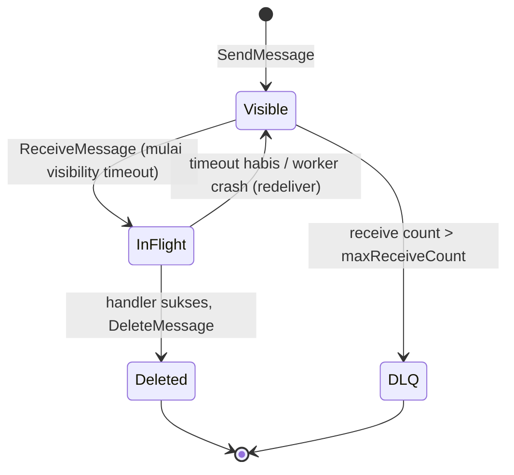
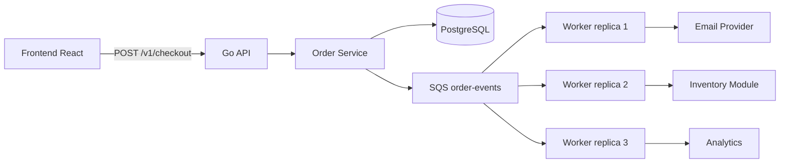
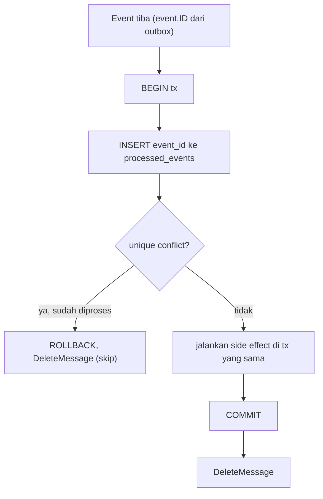
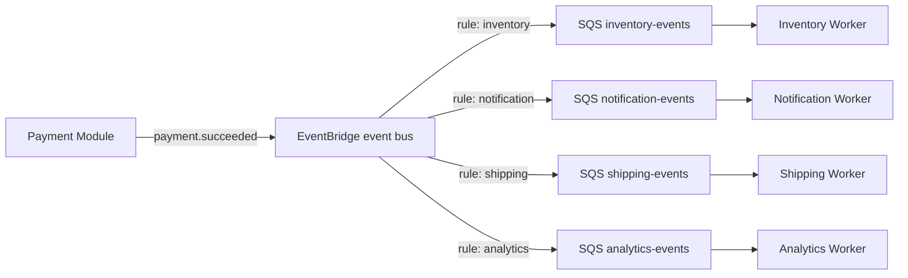
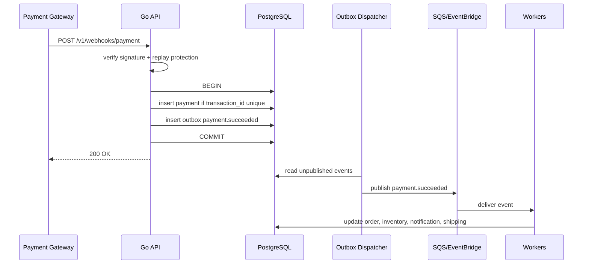
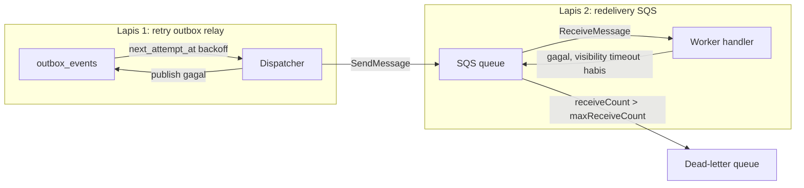

import { Section, Box, Steps, Step, Recap, CardGrid, Card, Chip, Hero, Compare, FileTree, Endpoint, Def } from "@components";

<Hero eyebrow="Roadmap 9 &middot; Advanced Scaling" title="Event-Driven Architecture<br /><em>dengan SQS</em>">
  <p>Di modul ini, checkout tetap cepat karena order disimpan dulu, sementara email, inventory, shipping, dan notifikasi diproses lewat event.</p>
  <Fragment slot="meta">
    <Chip icon="code">Bahasa: <b>Go 1.26</b></Chip>
    <Chip icon="clock">~60 menit baca</Chip>
  </Fragment>
</Hero>

<Section num="01" id="intro" title="Kenapa Event-Driven?">

<p class="lead">Di React, kita sering memisahkan state update dari side effect lewat event handler dan effect. Di backend, pola yang mirip dipakai untuk memisahkan transaksi inti dari pekerjaan sampingan.</p>

Pada checkout skincare shop, core flow yang wajib cepat dan konsisten adalah membuat order, menghitung total, mengunci harga, dan menyimpan status awal. Setelah itu ada banyak side effect: kirim email, kurangi stok fisik, request shipping, update analytics, dan trigger notifikasi. Bila semuanya dijalankan sinkron di request `POST /v1/checkout`, pelanggan menunggu lebih lama dan satu integrasi lambat bisa menggagalkan order yang sebenarnya valid.

<Def term="Event-driven architecture"><p>Pola arsitektur di mana perubahan penting dalam domain dinyatakan sebagai event, lalu komponen lain bereaksi terhadap event itu secara asynchronous.</p></Def>

<Def term="Domain event"><p>Fakta bisnis yang sudah terjadi, dinamai dengan bentuk lampau, misalnya `OrderCreated`, `PaymentSucceeded`, `StockReserved`, dan `NotificationRequested`.</p></Def>

<Box variant="bridge" icon="🌉" label="Jembatan: dari Laravel event ke Go event"><p>Di Laravel kamu mungkin memakai event dan listener. Di Go, kita biasanya membuat struct event eksplisit, interface publisher, dan worker consumer yang membaca queue.</p></Box>

<Compare aLabel="Flow sinkron" bLabel="Flow event-driven" aTone="red" bTone="violet">
  <Fragment slot="a"><ul><li>Request checkout menunggu payment hook, email, inventory, shipping, dan analytics.</li><li>Error email bisa ikut menggagalkan response walau order sudah valid.</li><li>Latency makin buruk ketika downstream bertambah.</li></ul></Fragment>
  <Fragment slot="b"><ul><li>Request checkout cukup menyimpan order dan event.</li><li>Worker memproses side effect di luar request utama.</li><li>Downstream gagal bisa retry tanpa membuat pelanggan menunggu.</li></ul></Fragment>
</Compare>

Di AWS, Amazon SQS adalah queue terkelola untuk memisahkan producer dan consumer. Producer mengirim message, consumer mengambil message, memprosesnya, lalu menghapus message setelah sukses. Untuk routing event ke banyak subscriber, Amazon EventBridge lebih cocok karena satu rule dapat mengirim event ke beberapa target.

<h3>Dari pemanggilan service langsung ke event</h3>

Outcome modul ini adalah kamu bisa berpindah dari memanggil service lain secara langsung menjadi alur berbasis event ketika memang dibutuhkan. Mari lihat titik awalnya. Handler checkout versi sinkron memanggil email, inventory, dan shipping secara berurutan di dalam request, semuanya menempel pada satu transaksi mental yang sama.

```go title="internal/order/handler.go (SEBELUM: semua sinkron)"
func (h *Handler) Checkout(w http.ResponseWriter, r *http.Request) {
	order, err := h.orders.CreateOrder(r.Context(), input)
	if err != nil {
		writeError(w, err)
		return
	}

	// Semua side effect menempel di request checkout.
	if err := h.email.SendOrderConfirmation(r.Context(), order.ID); err != nil {
		writeError(w, err) // email lambat atau down menggagalkan order yang valid
		return
	}
	if err := h.inventory.Reserve(r.Context(), order.ID); err != nil {
		writeError(w, err)
		return
	}
	if err := h.shipping.RequestPickup(r.Context(), order.ID); err != nil {
		writeError(w, err)
		return
	}

	writeJSON(w, http.StatusCreated, order)
}
```

Versi event-driven membalik tanggung jawab. Handler hanya membuat order dan mencatat fakta bahwa order itu terjadi. Email, inventory, dan shipping bereaksi belakangan, di luar jalur request, dan boleh gagal lalu retry tanpa membuat pelanggan menunggu.

```go title="internal/order/handler.go (SESUDAH: fakta dulu, reaksi belakangan)"
func (h *Handler) Checkout(w http.ResponseWriter, r *http.Request) {
	// CreateOrder menyimpan order DAN event order.created dalam satu transaksi.
	order, err := h.orders.CreateOrder(r.Context(), input)
	if err != nil {
		writeError(w, err)
		return
	}

	// Selesai. Tidak ada email, inventory, atau shipping di sini.
	writeJSON(w, http.StatusCreated, order)
}
```

<Box variant="warn" icon="⚠️" label="Bukan semua harus event"><p>Refactor ini hanya untuk side effect yang boleh telat sedikit. Validasi stok yang harus menolak checkout di tempat, atau perhitungan total, tetap sinkron di dalam request. Event untuk pekerjaan yang boleh diproses ulang, bukan untuk keputusan yang harus terjadi sebelum balasan ke pelanggan.</p></Box>

</Section>

<Section num="02" id="domain-event" title="Domain Event di Go">

<p class="lead">Event di Go sebaiknya bukan `map[string]any` liar. Buat kontrak eksplisit agar payload mudah dites, divalidasi, dan diubah secara aman.</p>

Event harus menjawab empat hal: apa yang terjadi, kapan terjadi, entity mana yang berubah, dan data minimal apa yang dibutuhkan subscriber. Hindari memasukkan seluruh row database ke event, karena itu membuat event rapuh terhadap perubahan schema internal.

<Box variant="tip" icon="💡" label="Idiom Go"><p>Pakailah event envelope kecil dan payload typed. Envelope memudahkan metadata umum, payload typed menjaga business meaning tetap jelas.</p></Box>

```go title="internal/events/event.go"
package events

import (
	"encoding/json"
	"time"
)

type Type string

const (
	OrderCreated          Type = "order.created"
	PaymentSucceeded      Type = "payment.succeeded"
	StockReserved         Type = "stock.reserved"
	NotificationRequested Type = "notification.requested"
)

type Event struct {
	ID            string          `json:"id"`
	Type          Type            `json:"type"`
	AggregateType string          `json:"aggregate_type"`
	AggregateID   string          `json:"aggregate_id"`
	OccurredAt    time.Time       `json:"occurred_at"`
	Payload       json.RawMessage `json:"payload"`
}

type OrderCreatedPayload struct {
	OrderID    string `json:"order_id"`
	CustomerID string `json:"customer_id"`
	Total      int64  `json:"total"`
	Currency   string `json:"currency"`
}

type PaymentSucceededPayload struct {
	OrderID       string    `json:"order_id"`
	PaymentID     string    `json:"payment_id"`
	TransactionID string    `json:"transaction_id"`
	PaidAmount    int64     `json:"paid_amount"`
	PaidAt        time.Time `json:"paid_at"`
}

type StockReservedPayload struct {
	OrderID       string `json:"order_id"`
	ReservationID string `json:"reservation_id"`
	SKU           string `json:"sku"`
	Quantity      int    `json:"quantity"`
}

type NotificationRequestedPayload struct {
	Channel    string `json:"channel"`     // email, whatsapp, push
	Template   string `json:"template"`    // order_confirmation, payment_success
	CustomerID string `json:"customer_id"`
	OrderID    string `json:"order_id"`
}
```

Nama event memakai dotted name seperti `payment.succeeded` untuk message body dan queue. Nama struct Go tetap `PaymentSucceededPayload` karena idiom Go lebih mudah dibaca dengan PascalCase untuk exported type. Keempat payload di atas memetakan langsung ke empat event di katalog (`OrderCreated`, `PaymentSucceeded`, `StockReserved`, `NotificationRequested`), jadi tiap event punya bentuk data yang jelas, bukan kantong serbaguna.

<Box variant="bridge" icon="🌉" label="Jembatan: payload typed vs object/array longgar"><p>Di JS payload sering object polos dan di PHP sering array asosiatif, keduanya tanpa pengecekan saat compile. Di Go, `Payload` di-bungkus `json.RawMessage` di envelope (decode ditunda sampai handler yang tepat), lalu di-unmarshal ke `*StockReservedPayload` atau `*PaymentSucceededPayload` yang typed. Hasilnya: salah ketik field ketahuan saat compile, dan evolusi schema lebih aman karena kontraknya eksplisit, bukan `map[string]any` liar.</p></Box>

<Box variant="note" icon="🧭" label="StockReserved dan NotificationRequested di modul ini"><p>`OrderCreated` dan `PaymentSucceeded` kita pakai end to end di sepanjang modul. `StockReserved` dan `NotificationRequested` punya payload dan akan dipakai di handler inventory dan notification (Section 10), serta diperdalam di Chapter 5 saat membahas konsistensi inventory. Mendefinisikan payload-nya sekarang menjaga katalog tetap utuh.</p></Box>

<Def term="Event envelope"><p>Wrapper metadata umum event, misalnya `id`, `type`, `aggregate_id`, `occurred_at`, dan `payload`.</p></Def>

<Def term="Aggregate"><p>Entity domain utama yang menjadi pusat perubahan, misalnya order, payment, stock reservation, atau notification request.</p></Def>

<Box variant="warn" icon="⚠️" label="Jangan jadikan event sebagai database dump"><p>Event adalah kontrak antar bagian sistem. Bila payload berisi semua kolom internal, setiap perubahan schema bisa memecahkan consumer.</p></Box>

</Section>

<Section num="03" id="event-catalog" title="Katalog Event Skincare Shop">

<p class="lead">Event catalog adalah daftar event resmi yang boleh dipublish oleh domain. Ini mirip API contract, tetapi untuk komunikasi asynchronous.</p>

<CardGrid cols={2}>
  <Card><h4>OrderCreated</h4><p>Diterbitkan setelah order valid tersimpan. Dipakai untuk email konfirmasi awal, analytics, dan proses payment instruction.</p></Card>
  <Card><h4>PaymentSucceeded</h4><p>Diterbitkan setelah webhook payment valid dan idempotent. Dipakai untuk update order, inventory, email, dan shipping.</p></Card>
  <Card><h4>StockReserved</h4><p>Diterbitkan setelah stok berhasil direservasi untuk order. Dipakai untuk audit inventory dan notifikasi stok rendah.</p></Card>
  <Card><h4>NotificationRequested</h4><p>Diterbitkan ketika sistem ingin mengirim email, WhatsApp, atau push notification melalui worker terpisah.</p></Card>
</CardGrid>

Event tidak selalu berarti microservice. Di modular monolith Go, event tetap berguna untuk memisahkan module `order`, `payment`, `inventory`, dan `notification` tanpa memanggil semuanya secara langsung dari handler checkout.

<FileTree title="Struktur event-driven modular monolith" tree={`cmd/
  api/
    main.go                 # HTTP API
  worker/
    main.go                 # SQS consumer
internal/
  events/
    event.go                # envelope dan payload event
    publisher.go            # interface publisher
    sqs_publisher.go        # implementasi AWS SQS
  order/
    service.go              # create order + outbox event
  payment/
    webhook_handler.go      # validasi payment webhook
    event_handler.go        # handle payment.succeeded
  inventory/
    event_handler.go        # handle stock update
  notification/
    event_handler.go        # kirim email atau WhatsApp
  outbox/
    dispatcher.go           # publish event tersimpan ke SQS
`} />

<Endpoint method="POST" path="/v1/checkout" desc="Membuat order dan event `order.created`" />
<Endpoint method="POST" path="/v1/webhooks/payment" desc="Memvalidasi webhook dan membuat event `payment.succeeded`" />

<Box variant="note" icon="🧭" label="Event bukan command"><p>`OrderCreated` berarti order sudah terjadi. `CreateOrder` adalah perintah untuk melakukan sesuatu. Jangan campur keduanya.</p></Box>

</Section>

<Section num="04" id="publish-ke-sqs" title="Publish Event ke SQS">

<p class="lead">Publisher adalah boundary. Service domain cukup tahu ada `Publisher`, bukan tahu detail AWS SDK.</p>

Pertama, buat interface kecil. Pola ini konsisten dengan gaya Go: dependency menerima interface yang dibutuhkan, sedangkan implementasi konkret berada di package infrastructure.

```go title="internal/events/publisher.go"
package events

import "context"

type Publisher interface {
	Publish(ctx context.Context, event Event) error
}
```

Implementasi SQS memakai AWS SDK for Go V2. Message body berisi envelope event. Kita juga melampirkan message attributes `event_type` dan `aggregate_id`. Catatan penting: attributes ini hanya berguna bila consumer secara eksplisit memintanya saat receive (lihat Section 05). Tanpa itu, SQS tidak mengembalikan attributes dan publisher sia-sia melampirkannya.

```go title="internal/events/sqs_publisher.go"
package events

import (
	"context"
	"encoding/json"
	"fmt"

	"github.com/aws/aws-sdk-go-v2/aws"
	"github.com/aws/aws-sdk-go-v2/service/sqs"
	"github.com/aws/aws-sdk-go-v2/service/sqs/types"
)

type SQSPublisher struct {
	client   *sqs.Client
	queueURL string
}

func NewSQSPublisher(client *sqs.Client, queueURL string) *SQSPublisher {
	return &SQSPublisher{client: client, queueURL: queueURL}
}

func (p *SQSPublisher) Publish(ctx context.Context, event Event) error {
	body, err := json.Marshal(event)
	if err != nil {
		return fmt.Errorf("marshal event %s: %w", event.Type, err)
	}

	_, err = p.client.SendMessage(ctx, &sqs.SendMessageInput{
		QueueUrl:    aws.String(p.queueURL),
		MessageBody: aws.String(string(body)),
		MessageAttributes: map[string]types.MessageAttributeValue{
			"event_type": {
				DataType:    aws.String("String"),
				StringValue: aws.String(string(event.Type)),
			},
			"aggregate_id": {
				DataType:    aws.String("String"),
				StringValue: aws.String(event.AggregateID),
			},
		},
	})
	if err != nil {
		return fmt.Errorf("send event %s to sqs: %w", event.Type, err)
	}

	return nil
}
```

Konfigurasi client SQS biasanya dilakukan di `cmd/api/main.go` atau wiring layer. Jangan membuat client SQS baru setiap publish, karena client didesain untuk dipakai ulang.

```go title="cmd/api/main.go"
package main

import (
	"context"
	"log"
	"os"

	"github.com/aws/aws-sdk-go-v2/config"
	"github.com/aws/aws-sdk-go-v2/service/sqs"

	"github.com/kamu/skincare-backend/internal/events"
)

func main() {
	ctx := context.Background()

	awsConfig, err := config.LoadDefaultConfig(ctx)
	if err != nil {
		log.Fatalf("load aws config: %v", err)
	}

	sqsClient := sqs.NewFromConfig(awsConfig)
	publisher := events.NewSQSPublisher(sqsClient, os.Getenv("ORDER_EVENTS_QUEUE_URL"))

	_ = publisher
}
```

<Box variant="bridge" icon="🌉" label="Jembatan: mirip dispatch job di Laravel"><p>Bedanya, di Go kamu menulis interface dan implementasi queue secara eksplisit. Tidak ada facade global, sehingga dependency lebih mudah dites.</p></Box>

</Section>

<Section num="05" id="subscriber-worker" title="Subscriber Worker">

<p class="lead">Subscriber adalah proses worker yang hidup terpisah dari API. Ia melakukan long polling ke SQS, memproses event, lalu delete message hanya setelah sukses.</p>

SQS bekerja dengan model receive dan delete. Saat message diterima, message menjadi invisible selama visibility timeout. Bila worker sukses, worker menghapus message. Bila worker gagal atau mati sebelum delete, message akan muncul lagi setelah timeout dan bisa diproses ulang.



<p class="fig-cap"><b>Gambar 1.</b> Siklus hidup satu message SQS. Selama InFlight (sudah di-receive, belum di-delete) message tidak terlihat consumer lain. Kalau handler tidak sempat delete sebelum visibility timeout habis, message kembali Visible dan dikirim ulang. Setelah gagal melebihi maxReceiveCount, ia pindah ke DLQ.</p>

```go title="internal/events/handler.go"
package events

import "context"

type Handler interface {
	Handle(ctx context.Context, event Event) error
}

type HandlerFunc func(ctx context.Context, event Event) error

func (fn HandlerFunc) Handle(ctx context.Context, event Event) error {
	return fn(ctx, event)
}
```

Dua hal penting di worker. Pertama, kalau publisher melampirkan message attributes, consumer wajib meminta `MessageAttributeNames` saat receive, kalau tidak SQS tidak mengembalikannya. Kedua, kita bedakan error yang retriable (downstream 5xx, timeout jaringan) dari error non-retriable (JSON rusak, tipe event tak dikenal). Hanya error retriable yang dibiarkan kembali ke queue untuk dikirim ulang. Error non-retriable adalah poison message: percuma diulang ribuan kali, lebih baik segera dipindahkan agar tidak menyumbat queue.

```go title="internal/events/sqs_worker.go"
package events

import (
	"context"
	"encoding/json"
	"errors"
	"fmt"
	"log/slog"
	"time"

	"github.com/aws/aws-sdk-go-v2/aws"
	"github.com/aws/aws-sdk-go-v2/service/sqs"
	"github.com/aws/aws-sdk-go-v2/service/sqs/types"
)

// ErrNonRetriable menandai message yang tidak boleh dikirim ulang
// (JSON rusak, tipe event tak dikenal). Message seperti ini langsung di-delete.
var ErrNonRetriable = errors.New("non-retriable message")

var ErrNoHandler = fmt.Errorf("%w: no handler registered", ErrNonRetriable)

type SQSWorker struct {
	client   *sqs.Client
	queueURL string
	handlers map[Type]Handler
	log      *slog.Logger
}

func NewSQSWorker(client *sqs.Client, queueURL string, handlers map[Type]Handler, log *slog.Logger) *SQSWorker {
	return &SQSWorker{client: client, queueURL: queueURL, handlers: handlers, log: log}
}

func (w *SQSWorker) Run(ctx context.Context) error {
	for {
		if err := ctx.Err(); err != nil {
			return err
		}

		output, err := w.client.ReceiveMessage(ctx, &sqs.ReceiveMessageInput{
			QueueUrl:              aws.String(w.queueURL),
			MaxNumberOfMessages:   10,
			WaitTimeSeconds:       20, // long polling, maksimum 20 detik
			VisibilityTimeout:     60,
			MessageAttributeNames: []string{"All"}, // tanpa ini, attributes publisher hilang
		})
		if err != nil {
			w.log.Error("receive sqs messages", slog.Any("error", err))
			time.Sleep(2 * time.Second)
			continue
		}

		for _, msg := range output.Messages {
			err := w.handleMessage(ctx, msg)
			if err != nil && !errors.Is(err, ErrNonRetriable) {
				// Error retriable: JANGAN delete. Biarkan visibility timeout habis
				// agar SQS mengirim ulang, lalu eskalasi ke DLQ via maxReceiveCount.
				w.log.Warn("retriable handler failure, leaving message for redelivery",
					slog.String("message_id", aws.ToString(msg.MessageId)),
					slog.Any("error", err))
				continue
			}
			if err != nil {
				// Error non-retriable (poison): delete agar tidak diulang selamanya.
				w.log.Error("poison message, deleting",
					slog.String("message_id", aws.ToString(msg.MessageId)),
					slog.Any("error", err))
			}

			if _, delErr := w.client.DeleteMessage(ctx, &sqs.DeleteMessageInput{
				QueueUrl:      aws.String(w.queueURL),
				ReceiptHandle: msg.ReceiptHandle,
			}); delErr != nil {
				w.log.Error("delete sqs message", slog.Any("error", delErr))
			}
		}
	}
}

func (w *SQSWorker) handleMessage(ctx context.Context, msg types.Message) error {
	var event Event
	if err := json.Unmarshal([]byte(aws.ToString(msg.Body)), &event); err != nil {
		return fmt.Errorf("%w: decode event: %v", ErrNonRetriable, err)
	}

	// Attributes hanya terisi karena ReceiveMessage meminta MessageAttributeNames.
	log := w.log.With(
		slog.String("event_id", event.ID),
		slog.String("event_type", string(event.Type)),
		slog.String("aggregate_id", event.AggregateID),
	)

	handler, ok := w.handlers[event.Type]
	if !ok {
		return fmt.Errorf("%w: %s", ErrNoHandler, event.Type)
	}

	if err := handler.Handle(ctx, event); err != nil {
		log.Error("handle event failed", slog.Any("error", err))
		return fmt.Errorf("handle event %s: %w", event.Type, err)
	}

	log.Info("event handled")
	return nil
}
```

<Box variant="warn" icon="⚠️" label="At-least-once berarti bisa duplikat"><p>Handler worker wajib idempotent. Jangan asumsikan satu event pasti hanya diproses satu kali. Cara menutup celah ini ada di Section 08 (inbox).</p></Box>

<Box variant="note" icon="🔢" label="Gotcha v2: MaxNumberOfMessages, WaitTimeSeconds, VisibilityTimeout adalah int32 nilai, bukan pointer"><p>Di AWS SDK Go v2, kebanyakan field opsional bertipe pointer (`QueueUrl *string`, makanya pakai `aws.String`). Tapi ketiga field ini bertipe `int32` nilai, jadi literal `10`, `20`, `60` bisa langsung ditulis. Kalau nilainya kamu simpan di variabel, variabel itu harus bertipe `int32`, bukan `int`. Long polling `WaitTimeSeconds` maksimum 20 detik.</p></Box>

<Box variant="tip" icon="⚙️" label="Sekuensial cukup untuk belajar, batch perlu concurrency"><p>Worker di atas memproses message satu per satu. Karena `MaxNumberOfMessages` bisa sampai 10, satu batch berisi hingga 10 message. Di produksi, kamu bisa memproses batch itu paralel dengan `errgroup` atau worker pool kecil agar throughput naik, asalkan tiap message tetap punya `ReceiptHandle` sendiri saat delete. Untuk modul ini sekuensial lebih mudah dibaca.</p></Box>

<Box variant="bridge" icon="🌉" label="Jembatan: dari BullMQ / Laravel queue worker"><p>Kalau kamu kenal BullMQ (Node) atau `queue:work` (Laravel), polanya mirip: message = job, worker = consumer, `maxReceiveCount` = `attempts`, visibility timeout = lock/timeout job, dan DLQ = `failed_jobs` di Laravel. Bedanya di Go semua loop receive/handle/delete kamu tulis eksplisit, tidak ada framework yang menyembunyikannya.</p></Box>

```go title="cmd/worker/main.go"
package main

import (
	"context"
	"errors"
	"log/slog"
	"os"
	"os/signal"
	"syscall"

	"github.com/aws/aws-sdk-go-v2/config"
	"github.com/aws/aws-sdk-go-v2/service/sqs"

	"github.com/kamu/skincare-backend/internal/events"
)

func main() {
	logger := slog.New(slog.NewJSONHandler(os.Stdout, nil))

	ctx, stop := signal.NotifyContext(context.Background(), syscall.SIGINT, syscall.SIGTERM)
	defer stop()

	awsConfig, err := config.LoadDefaultConfig(ctx)
	if err != nil {
		logger.Error("load aws config", slog.Any("error", err))
		os.Exit(1)
	}

	sqsClient := sqs.NewFromConfig(awsConfig)
	handlers := buildHandlers(logger)

	worker := events.NewSQSWorker(sqsClient, os.Getenv("ORDER_EVENTS_QUEUE_URL"), handlers, logger)
	if err := worker.Run(ctx); err != nil && !errors.Is(err, context.Canceled) {
		logger.Error("run worker", slog.Any("error", err))
		os.Exit(1)
	}
}

func buildHandlers(logger *slog.Logger) map[events.Type]events.Handler {
	return map[events.Type]events.Handler{
		events.OrderCreated: events.HandlerFunc(func(ctx context.Context, event events.Event) error {
			logger.Info("order created", slog.String("aggregate_id", event.AggregateID))
			return nil
		}),
		events.PaymentSucceeded: events.HandlerFunc(func(ctx context.Context, event events.Event) error {
			logger.Info("payment succeeded", slog.String("aggregate_id", event.AggregateID))
			return nil
		}),
	}
}
```

<Box variant="bridge" icon="🌉" label="Jembatan: structured logging vs console.log"><p>`log/slog` (standar sejak Go 1.21) menulis log sebagai key-value, mirip pino di Node atau Monolog dengan context di Laravel, bukan string mentah seperti `console.log`. Field seperti `event_id` dan `event_type` jadi bisa di-query di CloudWatch atau Loki. Jebakan "Tidak ada observability" di Section 12 justru ditutup dengan kebiasaan ini.</p></Box>

</Section>

<Section num="06" id="alur-sqs" title="Alur Order Service ke Worker">

<p class="lead">SQS membantu request utama selesai cepat, tetapi penting memahami bahwa satu queue bukan broadcast ke semua consumer.</p>



<p class="fig-cap"><b>Gambar 2.</b> Worker di satu SQS queue adalah consumer pool. Mereka membagi pekerjaan, bukan masing-masing menerima salinan event yang sama.</p>

Untuk fanout sungguhan, gunakan EventBridge atau SNS dengan beberapa SQS queue. Satu queue cocok untuk banyak replica dari worker yang sama. Banyak queue cocok untuk banyak tipe subscriber yang masing-masing harus menerima salinan event.

<Compare aLabel="Satu SQS queue" bLabel="EventBridge ke banyak queue" aTone="muted" bTone="violet">
  <Fragment slot="a"><ul><li>Beberapa worker bersaing mengambil message.</li><li>Cocok untuk scale-out satu jenis pekerjaan.</li><li>Tidak cocok bila email, inventory, dan shipping semuanya wajib menerima event yang sama.</li></ul></Fragment>
  <Fragment slot="b"><ul><li>Event dicocokkan rule lalu dikirim ke target berbeda.</li><li>Cocok untuk fanout `payment.succeeded` ke beberapa subscriber.</li><li>Setiap subscriber punya queue sendiri dan retry policy sendiri.</li></ul></Fragment>
</Compare>

<Box variant="tip" icon="💡" label="Prinsip desain"><p>Mulai dengan satu queue untuk satu kategori pekerjaan. Tambahkan EventBridge ketika fanout dan routing event mulai nyata, bukan sejak hari pertama.</p></Box>

</Section>

<Section num="07" id="outbox-pattern" title="Outbox Pattern">

<p class="lead">Masalah klasik event-driven adalah dual write: transaksi database sukses, tetapi publish ke SQS gagal, atau sebaliknya.</p>

Tanpa outbox, service order biasanya melakukan dua hal berurutan: insert order ke PostgreSQL, lalu publish event ke SQS. Bila insert order sukses tetapi publish gagal, downstream tidak pernah tahu ada order baru. Bila publish sukses tetapi commit database gagal, downstream menerima event untuk order yang tidak ada.

```mermaid
flowchart TB
  subgraph A["a. Insert dulu, publish belakangan"]
    A1["INSERT order OK"] --> A2["publish SQS GAGAL"]
    A2 --> A3["Event hilang: downstream tak tahu"]
  end
  subgraph B["b. Publish dulu, commit belakangan"]
    B1["publish SQS OK"] --> B2["COMMIT db GAGAL"]
    B2 --> B3["Phantom event: order tak ada"]
  end
  subgraph C["c. Outbox: satu transaksi"]
    C1["BEGIN"] --> C2["INSERT order"]
    C2 --> C3["INSERT outbox_events"]
    C3 --> C4["COMMIT"]
    C4 --> C5["Dispatcher publish belakangan"]
  end
```



<p class="fig-cap"><b>Gambar 3.</b> Dua kelas bug dual write. Outbox menyatukan perubahan domain dan event ke dalam satu transaksi, sehingga keduanya commit bersama atau gagal bersama. Publish ke broker baru terjadi setelah commit, lewat dispatcher terpisah.</p>

<Def term="Outbox pattern"><p>Pola yang menyimpan event ke tabel database dalam transaksi yang sama dengan perubahan domain, lalu proses terpisah menerbitkan event itu ke broker.</p></Def>

```sql title="migrations/202606060904_create_outbox_events.sql"
CREATE EXTENSION IF NOT EXISTS pgcrypto;

CREATE TABLE outbox_events (
  id uuid PRIMARY KEY DEFAULT gen_random_uuid(),
  event_type text NOT NULL,
  aggregate_type text NOT NULL,
  aggregate_id uuid NOT NULL,
  payload jsonb NOT NULL,
  occurred_at timestamptz NOT NULL DEFAULT now(),
  published_at timestamptz,
  attempts integer NOT NULL DEFAULT 0,
  next_attempt_at timestamptz NOT NULL DEFAULT now(),
  last_error text
);

CREATE INDEX idx_outbox_events_ready
  ON outbox_events (next_attempt_at, occurred_at)
  WHERE published_at IS NULL;
```

Sekarang order dan event disimpan dalam satu transaksi PostgreSQL. Request checkout tidak perlu publish langsung ke SQS.

```go title="internal/order/service.go"
package order

import (
	"context"
	"encoding/json"
	"fmt"

	"github.com/jackc/pgx/v5/pgxpool"

	"github.com/kamu/skincare-backend/internal/events"
)

type Service struct {
	db *pgxpool.Pool
}

func NewService(db *pgxpool.Pool) *Service {
	return &Service{db: db}
}

type CreateOrderInput struct {
	CustomerID string
	Total      int64
	Currency   string
}

type Order struct {
	ID         string
	CustomerID string
	Total      int64
	Currency   string
}

func (s *Service) CreateOrder(ctx context.Context, input CreateOrderInput) (Order, error) {
	// TxOptions kosong, jadi Begin lebih idiomatik daripada BeginTx(ctx, pgx.TxOptions{}).
	tx, err := s.db.Begin(ctx)
	if err != nil {
		return Order{}, fmt.Errorf("begin create order tx: %w", err)
	}
	defer tx.Rollback(ctx)

	var order Order
	err = tx.QueryRow(ctx, `
		INSERT INTO orders (customer_id, total, currency, status, created_at)
		VALUES ($1, $2, $3, 'pending_payment', now())
		RETURNING id, customer_id, total, currency
	`, input.CustomerID, input.Total, input.Currency).Scan(&order.ID, &order.CustomerID, &order.Total, &order.Currency)
	if err != nil {
		return Order{}, fmt.Errorf("insert order: %w", err)
	}

	payload, err := json.Marshal(events.OrderCreatedPayload{
		OrderID:    order.ID,
		CustomerID: order.CustomerID,
		Total:      order.Total,
		Currency:   order.Currency,
	})
	if err != nil {
		return Order{}, fmt.Errorf("marshal order.created payload: %w", err)
	}

	// occurred_at memakai DEFAULT now() dari kolom: satu sumber waktu (DB),
	// jadi tidak ada dua jam yang bersaing antara Go dan PostgreSQL.
	_, err = tx.Exec(ctx, `
		INSERT INTO outbox_events (event_type, aggregate_type, aggregate_id, payload)
		VALUES ($1, 'order', $2, $3)
	`, events.OrderCreated, order.ID, payload)
	if err != nil {
		return Order{}, fmt.Errorf("insert outbox event: %w", err)
	}

	if err := tx.Commit(ctx); err != nil {
		return Order{}, fmt.Errorf("commit create order tx: %w", err)
	}

	return order, nil
}
```

Dispatcher berjalan di worker terpisah. Ia mengambil event yang belum dipublish, mengirim ke SQS, lalu menandai `published_at`.

```go title="internal/outbox/dispatcher.go"
package outbox

import (
	"context"
	"encoding/json"
	"fmt"
	"time"

	"github.com/jackc/pgx/v5/pgxpool"

	"github.com/kamu/skincare-backend/internal/events"
)

type Dispatcher struct {
	db        *pgxpool.Pool
	publisher events.Publisher
}

func NewDispatcher(db *pgxpool.Pool, publisher events.Publisher) *Dispatcher {
	return &Dispatcher{db: db, publisher: publisher}
}

type rowEvent struct {
	ID            string
	EventType     events.Type
	AggregateType string
	AggregateID   string
	Payload       json.RawMessage
	OccurredAt    time.Time
}

func (d *Dispatcher) DispatchOnce(ctx context.Context, limit int) error {
	tx, err := d.db.Begin(ctx)
	if err != nil {
		return fmt.Errorf("begin outbox tx: %w", err)
	}
	defer tx.Rollback(ctx)

	rows, err := tx.Query(ctx, `
		SELECT id, event_type, aggregate_type, aggregate_id, payload, occurred_at
		FROM outbox_events
		WHERE published_at IS NULL
		  AND next_attempt_at <= now()
		ORDER BY occurred_at
		LIMIT $1
		FOR UPDATE SKIP LOCKED
	`, limit)
	if err != nil {
		return fmt.Errorf("select outbox events: %w", err)
	}
	defer rows.Close()

	for rows.Next() {
		var item rowEvent
		if err := rows.Scan(&item.ID, &item.EventType, &item.AggregateType, &item.AggregateID, &item.Payload, &item.OccurredAt); err != nil {
			return fmt.Errorf("scan outbox event: %w", err)
		}

		event := events.Event{
			ID:            item.ID,
			Type:          item.EventType,
			AggregateType: item.AggregateType,
			AggregateID:   item.AggregateID,
			OccurredAt:    item.OccurredAt,
			Payload:       item.Payload,
		}

		if err := d.publisher.Publish(ctx, event); err != nil {
			_, updateErr := tx.Exec(ctx, `
				UPDATE outbox_events
				SET attempts = attempts + 1,
				    next_attempt_at = now() + interval '30 seconds',
				    last_error = $2
				WHERE id = $1
			`, item.ID, err.Error())
			if updateErr != nil {
				return fmt.Errorf("record publish failure: %w", updateErr)
			}
			continue
		}

		_, err = tx.Exec(ctx, `
			UPDATE outbox_events
			SET published_at = now(), last_error = NULL
			WHERE id = $1
		`, item.ID)
		if err != nil {
			return fmt.Errorf("mark outbox event published: %w", err)
		}
	}

	if err := rows.Err(); err != nil {
		return fmt.Errorf("iterate outbox events: %w", err)
	}

	if err := tx.Commit(ctx); err != nil {
		return fmt.Errorf("commit outbox tx: %w", err)
	}

	return nil
}
```

<Box variant="warn" icon="⚠️" label="Outbox tetap butuh idempotency"><p>Bila publish sukses tetapi update `published_at` gagal, dispatcher bisa mengirim event yang sama lagi. Consumer tetap harus aman terhadap duplikasi. Inilah pasangan wajib outbox, dibahas di Section 08.</p></Box>

<Box variant="note" icon="🔑" label="UUID baris outbox adalah kunci idempotency"><p>Saat insert, kolom `id` tidak diisi dari Go; ia diisi `gen_random_uuid()` oleh PostgreSQL. Dispatcher membaca `id` itu kembali ke `Event.ID`. Karena nilainya stabil dan ikut terbawa ke message, `Event.ID` inilah kunci yang dipakai consumer untuk dedup di tabel inbox. Satu event, satu UUID, dari outbox sampai inbox.</p></Box>

<Box variant="tip" icon="⏱️" label="Jaga jendela kunci tetap pendek"><p>`FOR UPDATE SKIP LOCKED` mengunci baris yang sedang diproses. Di kode di atas, `publish()` (panggilan jaringan ke SQS) terjadi sambil baris masih terkunci dan transaksi terbuka. Untuk volume kecil ini aman dan mudah dibaca. Saat throughput naik, batasi `limit`, atau publish dulu lalu update status agar jendela kunci tidak ikut menunggu latency broker. Lock-hold-time yang panjang menghambat dispatcher lain.</p></Box>

</Section>

<Section num="08" id="idempotency-inbox" title="Idempotency dan Inbox">

<p class="lead">Outbox menjamin event tidak hilang. Inbox menjamin event tidak diproses dua kali. Keduanya pasangan, bukan pilihan.</p>

SQS Standard adalah at-least-once: satu event bisa sampai lebih dari sekali, entah karena dispatcher mengirim ulang (publish sukses tapi `published_at` gagal di-update), karena worker crash sebelum delete, atau karena SQS sendiri sesekali menduplikasi. Karena itu, "consumer wajib idempotent" yang kita ulang sejak Section 05 harus benar-benar diwujudkan, bukan sekadar diharapkan.

<Def term="Idempotent"><p>Operasi yang aman diulang: menjalankannya dua kali dengan input sama memberi hasil akhir yang sama dengan menjalankannya sekali.</p></Def>

<Def term="Inbox pattern"><p>Tabel di sisi consumer yang mencatat `event_id` yang sudah diproses dengan unique constraint, dicek di dalam transaksi yang sama dengan side effect, sehingga duplikat ditolak diam-diam.</p></Def>

Idenya sederhana: sebelum mengerjakan side effect, coba insert `event_id` ke tabel `processed_events`. Bila berhasil, ini event baru, kerjakan side effect di transaksi yang sama lalu commit. Bila kena unique violation, event ini sudah pernah diproses, lewati saja dan hapus message dari queue.

```sql title="migrations/202606061015_create_processed_events.sql"
CREATE TABLE processed_events (
  event_id uuid PRIMARY KEY,
  handler text NOT NULL,
  processed_at timestamptz NOT NULL DEFAULT now()
);
```

Kunci primernya adalah `event_id`, yaitu UUID baris outbox yang dibawa di `Event.ID`. Bila satu event punya beberapa handler (inventory dan notification), tambahkan `handler` ke primary key agar tiap handler punya catatan dedup sendiri.

```sql title="migrations (varian: dedup per handler)"
ALTER TABLE processed_events DROP CONSTRAINT processed_events_pkey;
ALTER TABLE processed_events ADD PRIMARY KEY (event_id, handler);
```



<p class="fig-cap"><b>Gambar 4.</b> Alur inbox dedup. Insert `event_id` dan side effect berada di satu transaksi, jadi keduanya sukses bersama atau gagal bersama. Inilah yang mengubah at-least-once menjadi effectively-once di sisi efek.</p>

Berikut helper yang membungkus pola ini. Handler cukup memanggilnya, lalu menaruh side effect di dalam callback. Kuncinya `INSERT ... ON CONFLICT DO NOTHING`: kalau baris penanda sudah ada, `Exec` melaporkan `RowsAffected() == 0`, dan itulah sinyal duplikat. Tidak perlu query kedua.

```go title="internal/events/inbox.go"
package events

import (
	"context"
	"fmt"

	"github.com/jackc/pgx/v5"
	"github.com/jackc/pgx/v5/pgxpool"
)

// ProcessOnce menjalankan fn tepat sekali untuk pasangan (eventID, handler).
// Insert penanda dan side effect berada di transaksi yang sama, sehingga
// keduanya commit bersama atau gagal bersama.
func ProcessOnce(ctx context.Context, db *pgxpool.Pool, eventID, handler string, fn func(pgx.Tx) error) error {
	tx, err := db.Begin(ctx)
	if err != nil {
		return fmt.Errorf("begin inbox tx: %w", err)
	}
	defer tx.Rollback(ctx)

	tag, err := tx.Exec(ctx, `
		INSERT INTO processed_events (event_id, handler)
		VALUES ($1, $2)
		ON CONFLICT (event_id, handler) DO NOTHING
	`, eventID, handler)
	if err != nil {
		return fmt.Errorf("claim event %s: %w", eventID, err)
	}

	if tag.RowsAffected() == 0 {
		// Penanda sudah ada: event ini sudah diproses handler ini.
		// Commit kosong, biarkan worker delete message tanpa mengulang side effect.
		return tx.Commit(ctx)
	}

	if err := fn(tx); err != nil {
		return fmt.Errorf("run handler side effect: %w", err)
	}
	return tx.Commit(ctx)
}
```

Sekarang handler payment dari Section 10 cukup membungkus side effect-nya. Karena `MarkPaid` berjalan di `tx` yang sama dengan insert penanda, dua delivery untuk satu `Event.ID` hanya menghasilkan satu update order.

```go title="internal/payment/event_handler.go (dengan inbox)"
func (h *PaymentSucceededHandler) Handle(ctx context.Context, event events.Event) error {
	var payload events.PaymentSucceededPayload
	if err := json.Unmarshal(event.Payload, &payload); err != nil {
		return fmt.Errorf("%w: decode payment.succeeded: %v", events.ErrNonRetriable, err)
	}

	return events.ProcessOnce(ctx, h.db, event.ID, "payment.mark_paid", func(tx pgx.Tx) error {
		return h.orders.MarkPaidTx(ctx, tx, payload.OrderID, payload.PaymentID)
	})
}
```

<Box variant="warn" icon="⚠️" label="Dedup harus satu transaksi dengan side effect"><p>Kalau penanda di-insert di transaksi terpisah dari side effect, kamu kembali ke dual write: bisa saja penanda commit tapi side effect gagal, lalu event yang sebenarnya belum selesai dianggap sudah selesai. Taruh keduanya dalam satu `tx`.</p></Box>

<Box variant="bridge" icon="🌉" label="Jembatan: dari unique job id Laravel"><p>Di Laravel, `ShouldBeUnique` mencegah job kembar antri, tapi tidak menjamin efek hanya terjadi sekali bila job tetap lolos dua kali. Inbox di sisi consumer adalah jaminan yang lebih kuat: keputusan "sudah pernah?" diambil di dalam transaksi database yang sama dengan efeknya, bukan di lapisan antrian.</p></Box>

</Section>

<Section num="09" id="eventbridge-routing" title="Routing dengan EventBridge">

<p class="lead">SQS adalah queue. EventBridge adalah router event. Gunakan sesuai masalahnya.</p>

Jika hanya ada satu worker untuk memproses `order.created`, SQS cukup. Jika `payment.succeeded` harus diterima oleh inventory, email, shipping, dan analytics secara terpisah, EventBridge membuat routing lebih bersih. Order service publish ke EventBridge, lalu rule mengirim event ke queue masing-masing subscriber.



<p class="fig-cap"><b>Gambar 5.</b> EventBridge cocok saat satu event perlu dirutekan ke banyak target tanpa membuat publisher tahu semua subscriber.</p>

<CardGrid cols={3}>
  <Card><h4>SQS saja</h4><p>Cocok untuk satu kategori pekerjaan dengan banyak replica worker, misalnya `notification-events`.</p></Card>
  <Card><h4>EventBridge + SQS</h4><p>Cocok untuk fanout dan routing event berdasarkan `source`, `detail-type`, atau isi payload.</p></Card>
  <Card><h4>Jangan terlalu cepat</h4><p>Untuk monolith kecil, outbox + satu queue sudah cukup. EventBridge masuk saat kebutuhan routing nyata.</p></Card>
</CardGrid>

Contoh event untuk EventBridge biasanya memakai field `source`, `detail-type`, dan `detail`. Detail tetap bisa memakai payload event yang sama agar kontrak domain tidak bercabang terlalu jauh.

```json title="eventbridge-payment-succeeded.json"
{
  "source": "skincare.payment",
  "detail-type": "payment.succeeded",
  "detail": {
    "event_id": "2fb6d62a-1d20-4c50-bc0d-18e2abf40b7a",
    "order_id": "9faad6d5-f191-4d62-97e4-574ffb506d39",
    "payment_id": "3da133b5-9b0b-4c4e-b801-a8a7e3c35c1a",
    "transaction_id": "MID-20260606-0001",
    "paid_amount": 299000,
    "paid_at": "2026-06-06T12:00:00Z"
  }
}
```

Karena publisher hanyalah boundary (Section 04), kita bisa membuat implementasi kedua dari interface `Publisher` yang sama untuk EventBridge. Dispatcher outbox tidak peduli ujungnya SQS atau EventBridge, ia cukup memanggil `Publish`.

```go title="internal/events/eventbridge_publisher.go"
package events

import (
	"context"
	"encoding/json"
	"fmt"

	"github.com/aws/aws-sdk-go-v2/aws"
	"github.com/aws/aws-sdk-go-v2/service/eventbridge"
	"github.com/aws/aws-sdk-go-v2/service/eventbridge/types"
)

type EventBridgePublisher struct {
	client  *eventbridge.Client
	busName string
	source  string
}

func NewEventBridgePublisher(client *eventbridge.Client, busName, source string) *EventBridgePublisher {
	return &EventBridgePublisher{client: client, busName: busName, source: source}
}

func (p *EventBridgePublisher) Publish(ctx context.Context, event Event) error {
	// Detail WAJIB string JSON, bukan objek. Marshal dulu, lalu aws.String.
	detail, err := json.Marshal(event)
	if err != nil {
		return fmt.Errorf("marshal event %s: %w", event.Type, err)
	}

	_, err = p.client.PutEvents(ctx, &eventbridge.PutEventsInput{
		Entries: []types.PutEventsRequestEntry{
			{
				EventBusName: aws.String(p.busName),
				Source:       aws.String(p.source),           // mis. "skincare.payment"
				DetailType:   aws.String(string(event.Type)), // mis. "payment.succeeded"
				Detail:       aws.String(string(detail)),     // string JSON, bukan map
				Resources:    []string{event.AggregateID},
			},
		},
	})
	if err != nil {
		return fmt.Errorf("put event %s to eventbridge: %w", event.Type, err)
	}

	return nil
}
```

<Box variant="warn" icon="⚠️" label="Detail adalah *string JSON, bukan objek"><p>Trap paling sering di EventBridge SDK: `Detail` bertipe `*string`, isinya harus string JSON yang sudah di-marshal (`aws.String(string(detail))`), bukan struct atau map. EventBridge memperlakukan `Detail` sebagai dokumen JSON mentah. Salah di sini menyebabkan rule pattern tidak pernah cocok karena bentuk yang dikirim bukan JSON yang valid.</p></Box>

<Box variant="bridge" icon="🌉" label="Jembatan: in-process event bus vs cross-process durable"><p>EventEmitter di Node atau event bus di React itu in-process dan fire-and-forget: kalau tidak ada listener saat event terbit, event hilang tanpa jejak. SQS dan EventBridge adalah lintas proses dengan durabilitas at-least-once: event tersimpan sampai consumer berhasil. Justru karena lebih kuat, kontraknya harus serius, versioning, idempotency, dan observability wajib dipikirkan, bukan opsional seperti di frontend.</p></Box>

</Section>

<Section num="10" id="payment-succeeded" title="Contoh PaymentSucceeded">

<p class="lead">`PaymentSucceeded` adalah event paling penting di shop, karena uang sudah diterima dan beberapa perubahan bisnis harus terjadi.</p>

Alur yang aman: webhook payment divalidasi, payment record dibuat idempotent, event `payment.succeeded` disimpan ke outbox, lalu worker subscriber memproses side effect sesuai tanggung jawabnya.



<p class="fig-cap"><b>Gambar 6.</b> Webhook tidak langsung melakukan semua side effect. Ia hanya membuat fakta bisnis yang bisa diproses ulang.</p>

Handler payment menggabungkan dua hal yang sudah kita bangun: dedup inbox dari Section 08 dan side effect domain. `MarkPaidTx` menerima `pgx.Tx` agar update order berada di transaksi yang sama dengan penanda dedup, sehingga dua delivery hanya menghasilkan satu perubahan.

```go title="internal/payment/event_handler.go"
package payment

import (
	"context"
	"encoding/json"
	"fmt"

	"github.com/jackc/pgx/v5"
	"github.com/jackc/pgx/v5/pgxpool"

	"github.com/kamu/skincare-backend/internal/events"
)

type OrderRepository interface {
	MarkPaidTx(ctx context.Context, tx pgx.Tx, orderID, paymentID string) error
}

type PaymentSucceededHandler struct {
	db     *pgxpool.Pool
	orders OrderRepository
}

func NewPaymentSucceededHandler(db *pgxpool.Pool, orders OrderRepository) *PaymentSucceededHandler {
	return &PaymentSucceededHandler{db: db, orders: orders}
}

func (h *PaymentSucceededHandler) Handle(ctx context.Context, event events.Event) error {
	var payload events.PaymentSucceededPayload
	if err := json.Unmarshal(event.Payload, &payload); err != nil {
		// JSON rusak tidak akan membaik dengan retry: tandai non-retriable.
		return fmt.Errorf("%w: decode payment.succeeded: %v", events.ErrNonRetriable, err)
	}

	return events.ProcessOnce(ctx, h.db, event.ID, "payment.mark_paid", func(tx pgx.Tx) error {
		return h.orders.MarkPaidTx(ctx, tx, payload.OrderID, payload.PaymentID)
	})
}
```

Untuk inventory, email, dan shipping, buat handler terpisah. Jangan masukkan semua side effect ke satu handler raksasa karena retry dan ownership menjadi sulit.

Ada dua gaya untuk notifikasi, dan keduanya sah. Gaya pertama: handler notification ikut mendengarkan `payment.succeeded` dan langsung mengirim email. Sederhana, cocok bila notifikasi hanya dipicu satu jenis event.

```go title="internal/notification/event_handler.go"
package notification

import (
	"context"
	"encoding/json"
	"fmt"

	"github.com/kamu/skincare-backend/internal/events"
)

type EmailSender interface {
	SendPaymentSuccessEmail(ctx context.Context, orderID string) error
}

type PaymentSucceededHandler struct {
	email EmailSender
}

func NewPaymentSucceededHandler(email EmailSender) *PaymentSucceededHandler {
	return &PaymentSucceededHandler{email: email}
}

func (h *PaymentSucceededHandler) Handle(ctx context.Context, event events.Event) error {
	var payload events.PaymentSucceededPayload
	if err := json.Unmarshal(event.Payload, &payload); err != nil {
		return fmt.Errorf("%w: decode payment.succeeded: %v", events.ErrNonRetriable, err)
	}

	if err := h.email.SendPaymentSuccessEmail(ctx, payload.OrderID); err != nil {
		return fmt.Errorf("send payment success email: %w", err)
	}

	return nil
}
```

Gaya kedua menjadikan `NotificationRequested` event kelas satu. Handler payment tidak tahu cara kirim email; ia hanya menerbitkan `notification.requested` ke outbox, lalu satu notification worker yang memutuskan channel dan template. Ini berguna saat banyak event berbeda (order dibuat, payment sukses, refund) semuanya berakhir sebagai notifikasi, sehingga logika kirim terpusat di satu tempat.

```go title="internal/notification/requested_handler.go"
func (h *RequestedHandler) Handle(ctx context.Context, event events.Event) error {
	var payload events.NotificationRequestedPayload
	if err := json.Unmarshal(event.Payload, &payload); err != nil {
		return fmt.Errorf("%w: decode notification.requested: %v", events.ErrNonRetriable, err)
	}

	switch payload.Channel {
	case "email":
		return h.email.Send(ctx, payload.Template, payload.CustomerID, payload.OrderID)
	case "whatsapp":
		return h.wa.Send(ctx, payload.Template, payload.CustomerID, payload.OrderID)
	default:
		// channel tak dikenal tidak akan membaik dengan retry.
		return fmt.Errorf("%w: unknown channel %q", events.ErrNonRetriable, payload.Channel)
	}
}
```

<Box variant="note" icon="🧭" label="Kapan memilih event notifikasi terpisah"><p>Gaya pertama (dengar `payment.succeeded` langsung) lebih sedikit kode. Gaya kedua (terbitkan `notification.requested`) memusatkan kebijakan notifikasi dan memungkinkan banyak sumber memicu notifikasi yang sama. Mulai dari gaya pertama, naik ke kedua saat jenis pemicu notifikasi bertambah.</p></Box>

<Box variant="warn" icon="⚠️" label="Jangan percaya event untuk data uang"><p>Untuk amount final, order total, dan ownership customer, worker boleh mengambil ulang dari database sendiri. Event cukup membawa identifier dan fakta minimal.</p></Box>

</Section>

<Section num="11" id="hands-on" title="Hands-on Ringan">

<p class="lead">Hands-on ini membuat satu jalur minimum: create order, simpan outbox, publish ke SQS, worker membaca event, lalu dedup dengan inbox.</p>

<Steps>
  <Step><b>Buat package event</b><p>Tambahkan `internal/events/event.go`, `publisher.go`, dan `sqs_publisher.go`.</p></Step>
  <Step><b>Tambahkan migration outbox dan inbox</b><p>Jalankan migration `outbox_events` dan `processed_events` di database lokal dan CI.</p></Step>
  <Step><b>Ubah service order</b><p>`CreateOrder` menyimpan event `order.created` di transaksi yang sama dengan insert order.</p></Step>
  <Step><b>Jalankan dispatcher</b><p>Worker memanggil `DispatchOnce` berkala untuk publish event yang belum terkirim.</p></Step>
  <Step><b>Jalankan SQS worker</b><p>Worker lain membaca queue, dispatch event ke handler sesuai `event.Type`, lalu delete message setelah sukses atau saat poison.</p></Step>
  <Step><b>Bungkus handler dengan inbox</b><p>Handler memanggil `ProcessOnce(event.ID, ...)` agar side effect aman terhadap duplikat.</p></Step>
</Steps>

```bash title="Terminal"
go get github.com/aws/aws-sdk-go-v2/config@latest

go get github.com/aws/aws-sdk-go-v2/service/sqs@latest

go get github.com/aws/aws-sdk-go-v2/service/eventbridge@latest

go get github.com/jackc/pgx/v5@latest

go test ./...
```

Untuk local development, kamu bisa memakai LocalStack, ElasticMQ, atau antrian in-memory kecil untuk test unit. Jangan jadikan LocalStack syarat unit test, karena unit test harus tetap cepat. Pakai LocalStack untuk integration test worker dan pipeline CI terpisah.

```go title="internal/events/memory_publisher_test.go"
package events

import "context"

type MemoryPublisher struct {
	Events []Event
}

func (p *MemoryPublisher) Publish(ctx context.Context, event Event) error {
	p.Events = append(p.Events, event)
	return nil
}
```

<Box variant="tip" icon="💡" label="Testing strategy"><p>Unit test service cukup memastikan event masuk outbox. Integration test memastikan dispatcher benar-benar mengirim ke SQS compatible queue.</p></Box>

</Section>

<Section num="12" id="jebakan-umum" title="Jebakan Umum">

<p class="lead">Event-driven membuat sistem lebih scalable, tetapi juga menambah failure mode baru. Jangan hanya mengejar kata asynchronous.</p>

<CardGrid cols={2}>
  <Card><h4>Menganggap SQS sebagai broadcast</h4><p>Satu queue dengan banyak consumer adalah work queue. Untuk semua subscriber menerima event yang sama, pakai beberapa queue melalui EventBridge atau SNS.</p></Card>
  <Card><h4>Tidak idempotent</h4><p>SQS Standard bisa mengirim message lebih dari sekali. Implementasikan inbox (`processed_events`) yang dicek di dalam transaksi handler, jangan cuma berniat idempotent di komentar.</p></Card>
  <Card><h4>Publish sebelum commit</h4><p>Consumer bisa membaca event sebelum data order benar-benar committed. Outbox menghindari kelas bug ini.</p></Card>
  <Card><h4>Payload terlalu besar</h4><p>Event bukan snapshot seluruh database. Simpan data minimal dan ambil ulang detail sensitif dari database bila perlu.</p></Card>
  <Card><h4>Handler terlalu besar</h4><p>Satu handler yang melakukan email, inventory, shipping, dan analytics membuat retry tidak presisi. Pisahkan ownership side effect.</p></Card>
  <Card><h4>Tidak ada observability</h4><p>Log `event_id`, `event_type`, `aggregate_id`, attempts, dan error dengan `slog`. Tanpa ini, debugging async flow akan melelahkan.</p></Card>
</CardGrid>

<h3>FIFO vs Standard</h3>

Standard queue adalah default: throughput tinggi, at-least-once, urutan best-effort, dan kadang duplikat. FIFO queue menjaga urutan dan exactly-once processing, tetapi exactly-once-nya hanya berlaku di dalam jendela deduplikasi 5 menit, bukan jaminan global selamanya. Pilih berdasarkan apakah urutan per-aggregate penting.

<Compare aLabel="SQS Standard" bLabel="SQS FIFO" aTone="blue" bTone="violet">
  <Fragment slot="a"><ul><li>Throughput sangat tinggi, urutan best-effort.</li><li>At-least-once, bisa duplikat, jadi inbox tetap wajib.</li><li>Cocok untuk side effect yang tidak peduli urutan, mis. kirim email.</li></ul></Fragment>
  <Fragment slot="b"><ul><li>`MessageGroupId` menjaga urutan per grup, mis. `order_id`.</li><li>`MessageDeduplicationId` menolak duplikat dalam jendela 5 menit.</li><li>Cocok saat transisi status order harus berurutan (pending, paid, shipped).</li></ul></Fragment>
</Compare>

<Box variant="tip" icon="🧭" label="Aturan praktis FIFO"><p>Pakai FIFO hanya saat urutan per-aggregate benar-benar penting, dan jadikan `MessageGroupId = order_id` agar order berbeda tetap diproses paralel sementara satu order tetap berurutan. Untuk sebagian besar side effect skincare shop, Standard plus inbox sudah cukup.</p></Box>

<h3>Visibility timeout dan dua lapis retry</h3>

`VisibilityTimeout: 60` di worker harus lebih panjang dari durasi terburuk handler. Kalau handler memerlukan 80 detik tapi visibility cuma 60, SQS mengira worker mati dan mengirim ulang message yang sebenarnya masih diproses, menghasilkan eksekusi ganda. Untuk handler yang kadang lama, perpanjang `VisibilityTimeout`, atau panggil `ChangeMessageVisibility` untuk memperpanjang sambil bekerja.



<p class="fig-cap"><b>Gambar 7.</b> Ada dua loop retry yang sering tertukar. Lapis 1 adalah dispatcher outbox mengirim ulang ke SQS pakai `next_attempt_at`. Lapis 2 adalah SQS mengirim ulang ke worker lewat visibility timeout. Keduanya independen; DLQ hanya menampung kegagalan lapis 2.</p>

<Box variant="note" icon="🧯" label="DLQ dan redrive"><p>DLQ dipasang lewat RedrivePolicy di source queue dengan `maxReceiveCount`, misalnya 5. Setelah message gagal di-receive lebih dari itu, SQS memindahkannya ke DLQ. Setel retention DLQ lebih panjang dari source agar ada waktu investigasi, dan ingat source FIFO butuh DLQ FIFO juga. DLQ bukan tempat sampah, melainkan sinyal ada bug atau data yang perlu dilihat manusia.</p></Box>

<Box variant="warn" icon="⚠️" label="Jangan jadikan event sebagai jalan pintas transaksi"><p>Untuk perubahan yang harus atomic dalam satu database, tetap gunakan transaksi PostgreSQL. Event dipakai untuk side effect dan integrasi antar boundary.</p></Box>

<h3>Peta padanan dari Laravel</h3>

<div class="tbl-wrap">
<table>
  <thead><tr><th>Laravel</th><th>Modul ini (Go + SQS)</th></tr></thead>
  <tbody>
    <tr><td>Event + Listener</td><td><code>events.Event</code> + <code>Handler</code></td></tr>
    <tr><td><code>dispatch()</code> / <code>ShouldQueue</code></td><td><code>SendMessage</code> ke SQS</td></tr>
    <tr><td><code>queue:work</code> / Horizon</td><td>loop consumer di <code>cmd/worker</code></td></tr>
    <tr><td><code>failed_jobs</code></td><td>Dead-letter queue (DLQ)</td></tr>
    <tr><td><code>attempts</code> / <code>backoff</code></td><td><code>maxReceiveCount</code> + visibility timeout</td></tr>
    <tr><td><code>ShouldBeUnique</code></td><td>inbox <code>processed_events</code></td></tr>
  </tbody>
</table>
</div>

<Box variant="bridge" icon="🌉" label="Jembatan: afterCommit dispatch vs outbox"><p>Di Laravel banyak orang memakai `DB::afterCommit` atau `$event->afterCommit` agar job baru di-enqueue setelah commit. Itu memperkecil celah, tapi tidak menutupnya: kalau proses mati setelah commit tapi sebelum enqueue, job hilang. Outbox menutup celah ini karena event ikut ter-commit di transaksi yang sama, dan pengiriman ke broker dijamin oleh dispatcher yang membaca dari tabel, bukan dari memori proses.</p></Box>

</Section>

<Section num="13" id="ringkasan" title="Ringkasan & Poin Penting">

<p class="lead">Event-driven architecture membuat backend skincare lebih responsif dan siap scaling, asalkan event diperlakukan sebagai kontrak bisnis yang serius.</p>

<Recap title="Yang Wajib Menempel">
  <ul><li>Berpindah ke event berarti handler checkout cukup mencatat fakta (order dibuat), lalu side effect bereaksi di luar request, dan ini hanya untuk pekerjaan yang boleh telat.</li><li>Domain event adalah fakta bisnis lampau dengan payload typed, misalnya `OrderCreated`, `PaymentSucceeded`, `StockReserved`, dan `NotificationRequested`.</li><li>Publisher adalah boundary: implementasi SQS dan EventBridge memenuhi interface yang sama, dan `Detail` EventBridge wajib string JSON.</li><li>Worker melakukan long polling, membedakan error retriable dari poison, lalu delete message hanya saat sukses atau saat poison.</li><li>Outbox menutup dual write antara PostgreSQL dan broker; inbox (`processed_events`) menutup duplikasi at-least-once di sisi consumer.</li><li>Ada dua lapis retry: relay outbox (`next_attempt_at`) dan redelivery SQS (visibility timeout), dengan DLQ via `maxReceiveCount`.</li><li>Standard plus inbox cukup untuk kebanyakan kasus; FIFO dengan `MessageGroupId` dipakai saat urutan per-aggregate penting.</li></ul>
</Recap>

Untuk proyek online shop skincare, modul ini mengubah checkout dari flow sinkron yang rapuh menjadi flow yang lebih tahan gangguan. Order dibuat dan tersimpan lebih dulu, lalu event menggerakkan pekerjaan lanjutan. Langkah berikutnya di Roadmap 9 adalah melihat bagaimana pola scaling ini berhubungan dengan observability, retry policy, DLQ, dan keputusan kapan sebuah modular monolith perlu dipecah menjadi service terpisah.

</Section>
