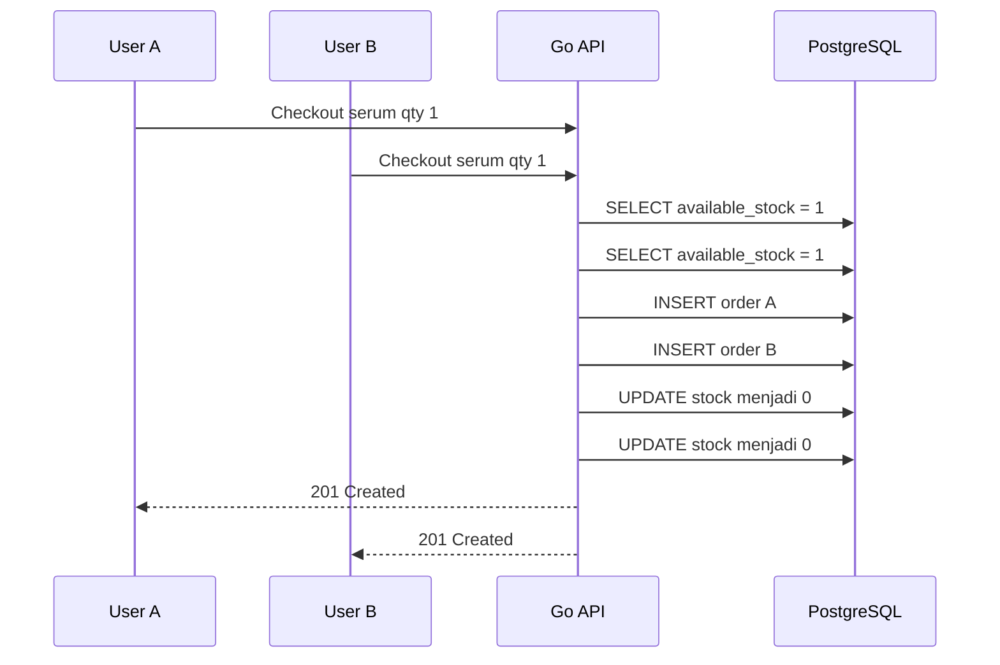
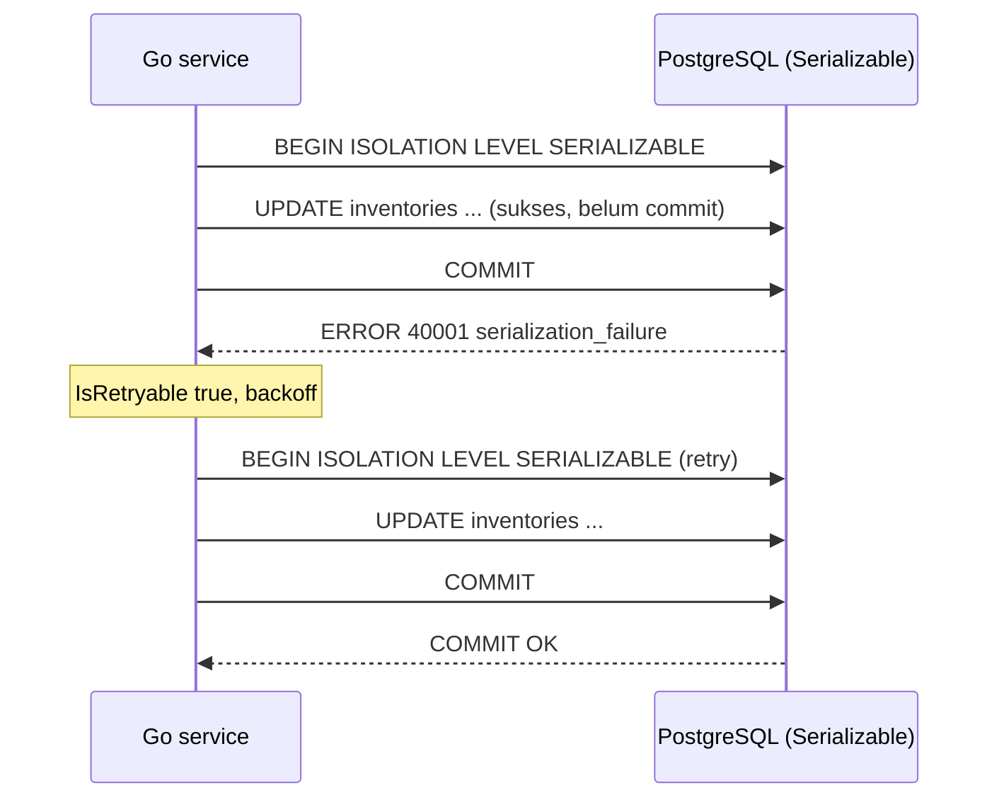
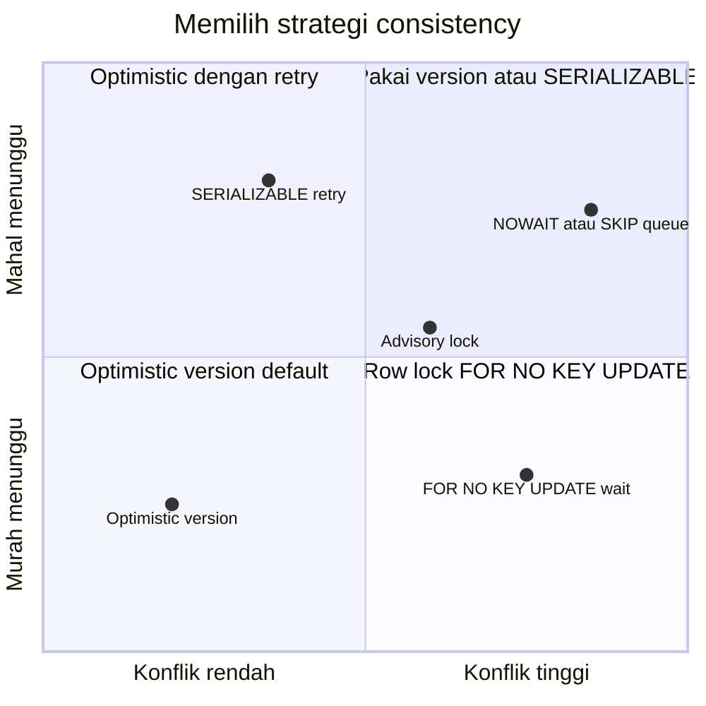
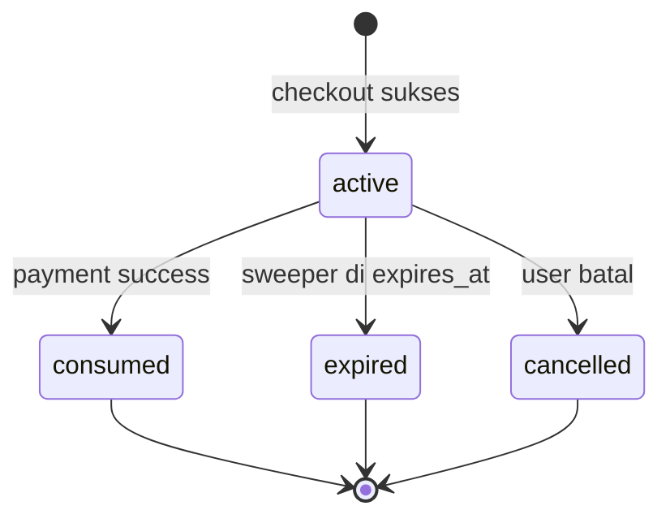
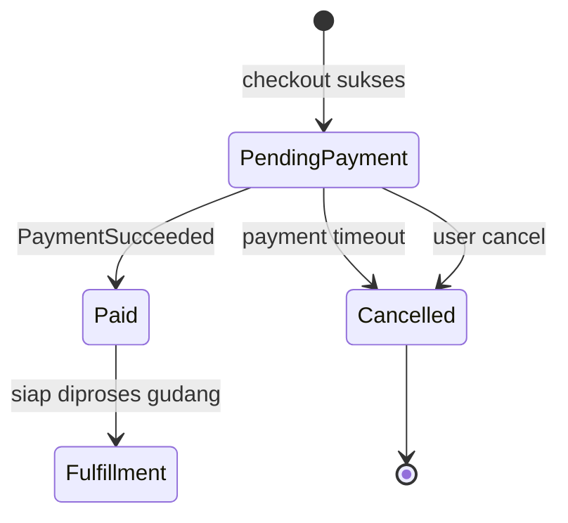
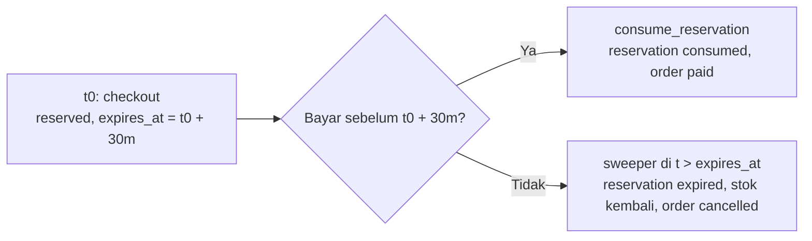
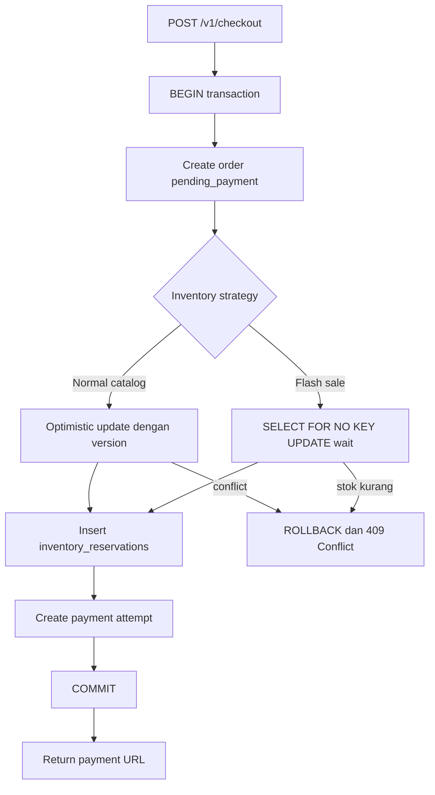

import { Section, Box, Steps, Step, Recap, CardGrid, Card, Chip, Hero, Compare, FileTree, Endpoint, Def } from "@components";

<Hero eyebrow="Roadmap 9 &middot; Scaling" title="Order dan Inventory <em>Konsisten</em><br />di High Traffic">
  <p>Cegah overselling saat ratusan user checkout produk skincare yang stoknya terbatas.</p>
  <Fragment slot="meta">
    <Chip icon="code">Bahasa: <b>Go 1.26.x</b></Chip>
    <Chip icon="database">PostgreSQL 18</Chip>
    <Chip icon="clock">~75 menit baca</Chip>
  </Fragment>
</Hero>

<Section num="01" id="intro" title="Masalah Konsistensi di Checkout" sub="Traffic tinggi membuat bug kecil di inventory menjadi kerugian nyata">

<p class="lead">Di online shop skincare, flash sale serum populer bisa membuat ratusan checkout menabrak stok yang sama dalam detik yang sama.</p>

Di React atau Laravel, kamu mungkin sering berpikir checkout sebagai satu request biasa: validasi cart, hitung total, simpan order, lalu arahkan user ke pembayaran. Di high traffic, cara berpikir itu belum cukup. Dua request bisa membaca stok yang sama, sama-sama merasa aman, lalu sama-sama membuat order.

<Def term="overselling"><p>Overselling adalah kondisi ketika sistem menerima lebih banyak order daripada stok fisik yang benar-benar tersedia, biasanya karena operasi baca stok dan kurangi stok tidak dilindungi secara atomik.</p></Def>

<Def term="race condition"><p>Race condition terjadi ketika hasil akhir bergantung pada urutan eksekusi beberapa operasi concurrent, misalnya dua checkout yang sama-sama membaca stok 1 sebelum salah satunya menulis perubahan.</p></Def>

<Box variant="bridge" icon="🌉" label="Jembatan: dari Laravel transaction ke Go"><p>Di Laravel kamu memakai `DB::transaction()` untuk membungkus beberapa query. Di Go dengan pgx, kita tetap memakai transaksi PostgreSQL, tetapi error handling, context, commit, dan rollback harus ditulis eksplisit supaya alur konsistensi terlihat jelas.</p></Box>

Modul ini fokus ke satu target: ketika stok tersedia 1 dan ada 100 user checkout bersamaan, maksimal hanya 1 order yang berhasil mereservasi stok. Yang lain harus mendapat respons yang jujur, misalnya `409 Conflict` atau pesan stok habis.

Sumber resmi yang relevan, semua mengacu ke versi mutakhir per Juni 2026 (Go 1.26.x, pgx v5.10.0, PostgreSQL 18): [Go 1.26 release notes](https://go.dev/doc/go1.26), [pgxpool](https://pkg.go.dev/github.com/jackc/pgx/v5/pgxpool), [pgconn PgError](https://pkg.go.dev/github.com/jackc/pgx/v5/pgconn), [pgerrcode](https://pkg.go.dev/github.com/jackc/pgerrcode), [PostgreSQL SELECT](https://www.postgresql.org/docs/current/sql-select.html), [PostgreSQL explicit locking](https://www.postgresql.org/docs/current/explicit-locking.html), [PostgreSQL transaction isolation](https://www.postgresql.org/docs/current/transaction-iso.html), [SQS delay queues](https://docs.aws.amazon.com/AWSSimpleQueueService/latest/SQSDeveloperGuide/sqs-delay-queues.html), dan [Grafana k6 docs](https://grafana.com/docs/k6/latest/).

</Section>

<Section num="02" id="race-condition" title="Race Condition Saat Stok Terakhir" sub="Bug muncul ketika check dan update dipisah tanpa guard atomik">

<p class="lead">Race paling umum adalah read-check-write: baca stok, cek cukup, lalu update di query terpisah.</p>

Contoh buruknya terlihat aman saat diuji manual, tetapi gagal saat request berjalan paralel. Masalahnya bukan Go atau PostgreSQL yang lambat. Masalahnya adalah operasi bisnis tidak dibuat atomik.



<p class="fig-cap"><b>Gambar 1.</b> Dua checkout membaca stok yang sama sebelum update, hasilnya dua order untuk satu barang.</p>

Query seperti ini wajib dihindari pada checkout production.

```sql title="contoh-buruk.sql"
SELECT available_stock
FROM inventories
WHERE product_id = $1;

-- Aplikasi mengecek stok di memory.
-- Kalau cukup, baru update.

UPDATE inventories
SET available_stock = available_stock - $2
WHERE product_id = $1;
```

<Box variant="warn" icon="⚠️" label="Jebakan: cek stok di aplikasi saja tidak cukup"><p>Validasi `if stock >= qty` di Go hanya valid untuk snapshot yang baru dibaca. Saat request lain mengubah database sebelum update kamu, keputusan itu bisa basi.</p></Box>

Solusinya adalah membuat keputusan dan perubahan stok terjadi dalam satu operasi database yang aman, atau mengunci baris inventory selama transaksi checkout berlangsung.

</Section>

<Section num="03" id="model-data" title="Model Data Inventory dan Reservation" sub="Pisahkan stok tersedia, stok tertahan, dan status order">

<p class="lead">Inventory yang scalable tidak hanya punya angka stok, tetapi juga status reservasi yang bisa expired.</p>

Untuk proyek skincare, kita akan memakai tiga konsep utama. `available_stock` adalah stok yang masih bisa direbut checkout baru. `reserved_stock` adalah stok yang sudah dikunci untuk order pending payment. `inventory_reservations` adalah catatan reservasi per order agar bisa di-cancel atau di-consume dengan aman.

<FileTree title="File yang disentuh modul ini" tree={`
internal/
  checkout/
    service.go        # orchestration checkout dalam transaksi
    handler.go        # map error domain ke status HTTP (409/422/410/500)
  inventory/
    repository.go     # reserve optimistic, snapshot
    pessimistic.go    # reserve dengan FOR NO KEY UPDATE
    advisory.go       # advisory lock per produk
  order/
    repository.go     # create order dan update status
  postgres/
    dbtx.go           # interface transaksi
    retry.go          # retry 40001 dan 40P01 via pgerrcode
  worker/
    expire_orders.go  # worker atau cron untuk payment timeout
migrations/
  0905_inventory_consistency.sql
loadtest/
  checkout.js         # simulasi concurrent checkout dengan k6
`} />

```sql title="migrations/0905_inventory_consistency.sql"
CREATE TABLE inventories (
    product_id BIGINT PRIMARY KEY REFERENCES products(id),
    available_stock INTEGER NOT NULL CHECK (available_stock >= 0),
    reserved_stock INTEGER NOT NULL DEFAULT 0 CHECK (reserved_stock >= 0),
    version BIGINT NOT NULL DEFAULT 1,
    updated_at TIMESTAMPTZ NOT NULL DEFAULT now()
);

CREATE TABLE inventory_reservations (
    id BIGSERIAL PRIMARY KEY,
    order_id BIGINT NOT NULL REFERENCES orders(id),
    product_id BIGINT NOT NULL REFERENCES products(id),
    qty INTEGER NOT NULL CHECK (qty > 0),
    status TEXT NOT NULL CHECK (status IN ('active', 'consumed', 'expired', 'cancelled')),
    expires_at TIMESTAMPTZ NOT NULL,
    created_at TIMESTAMPTZ NOT NULL DEFAULT now(),
    updated_at TIMESTAMPTZ NOT NULL DEFAULT now(),
    UNIQUE (order_id, product_id)
);

CREATE INDEX idx_inventory_reservations_expiry
ON inventory_reservations (expires_at)
WHERE status = 'active';

ALTER TABLE orders
ADD COLUMN IF NOT EXISTS payment_expires_at TIMESTAMPTZ,
ADD COLUMN IF NOT EXISTS cancel_reason TEXT;
```

<Box variant="tip" icon="💡" label="Kenapa ada reserved_stock?"><p>`available_stock` turun saat checkout dibuat, bukan saat payment sukses. Dengan begitu user lain tidak bisa mengambil stok yang sedang menunggu pembayaran.</p></Box>

<Compare aLabel="JS/PHP sederhana" bLabel="Go + PostgreSQL production" aTone="muted" bTone="violet">
  <Fragment slot="a"><ul><li>Cart dibuat di session atau cache.</li><li>Stok sering dicek saat user klik bayar.</li><li>Race jarang terlihat di local development.</li></ul></Fragment>
  <Fragment slot="b"><ul><li>Stok dikurangi dalam transaksi database.</li><li>Reservasi punya masa berlaku.</li><li>Payment timeout mengembalikan stok secara eksplisit.</li></ul></Fragment>
</Compare>

</Section>

<Section num="04" id="isolation-levels" title="Isolation Level dan Snapshot" sub="Memahami snapshot transaksi sebelum memilih strategi locking">

<p class="lead">Sebelum bicara optimistic atau pessimistic, kamu perlu tahu apa yang dilihat satu transaksi saat transaksi lain bergerak bersamaan. Itulah isolation level.</p>

Default pgx dan PostgreSQL adalah `READ COMMITTED`. Artinya tiap statement di dalam transaksi melihat snapshot terbaru yang sudah commit saat statement itu mulai. Ini penting: dua `SELECT` di transaksi yang sama bisa mengembalikan stok berbeda jika ada commit di antaranya. Snapshot bisa basi tepat di celah antara baca dan tulis, dan di situlah race condition lahir.

<Def term="isolation level"><p>Aturan seberapa terisolasi satu transaksi dari perubahan transaksi lain yang berjalan bersamaan. PostgreSQL mendukung READ COMMITTED (default), REPEATABLE READ, dan SERIALIZABLE.</p></Def>

<Box variant="bridge" icon="🌉" label="Jembatan: dari Prisma/Knex ke pgx"><p>Di Node dengan Prisma atau Knex kamu menulis `isolationLevel: 'Serializable'` lalu wajib me-retry error write conflict (Prisma `P2034`). Di Go dengan pgx sama persis: ini properti PostgreSQL, bukan keistimewaan satu ORM. Yang berubah hanya cara kamu mendeteksi dan me-retry errornya.</p></Box>

<CardGrid cols={3}>
  <Card><h4>READ COMMITTED</h4><p>Default. Tiap statement lihat snapshot terbaru. Murah, tetapi pola read-check-write tetap rawan tanpa guard atau lock di query update.</p></Card>
  <Card><h4>REPEATABLE READ</h4><p>Snapshot dibekukan sejak statement pertama transaksi. Baca konsisten, tetapi update yang bentrok bisa gagal dengan error 40001 saat dieksekusi.</p></Card>
  <Card><h4>SERIALIZABLE</h4><p>Seolah transaksi berjalan satu per satu. Paling aman, tetapi konflik sering muncul sebagai error 40001 justru saat COMMIT, bukan saat UPDATE.</p></Card>
</CardGrid>

Fakta yang kontra-intuitif bagi pembaca dari Laravel atau JS: pada `REPEATABLE READ` dan `SERIALIZABLE`, error serialization failure (`SQLSTATE 40001`) sering muncul saat `COMMIT`, bukan saat `UPDATE`. Maka retry loop tidak boleh hanya membungkus statement, tetapi seluruh transaksi termasuk commit-nya.

```go title="internal/postgres/retry.go"
package postgres

import (
	"context"
	"errors"
	"time"

	"github.com/jackc/pgerrcode"
	"github.com/jackc/pgx/v5/pgconn"
)

// IsRetryable mendeteksi error konkuren yang aman untuk diulang.
// Pakai konstanta pgerrcode, bukan string literal "40001".
func IsRetryable(err error) bool {
	var pgErr *pgconn.PgError
	if !errors.As(err, &pgErr) {
		return false
	}
	switch pgErr.Code {
	case pgerrcode.SerializationFailure, // 40001
		pgerrcode.DeadlockDetected: // 40P01
		return true
	default:
		return false
	}
}

// RunSerializable membungkus seluruh transaksi (termasuk Commit) dalam retry
// berbatas dengan backoff. Korban serialization failure cukup diulang dari awal.
func RunSerializable(ctx context.Context, fn func() error) error {
	const maxAttempts = 5
	var err error
	for attempt := 1; attempt <= maxAttempts; attempt++ {
		err = fn()
		if err == nil {
			return nil
		}
		if !IsRetryable(err) {
			return err
		}
		// Backoff sederhana; produksi sebaiknya pakai jitter.
		select {
		case <-ctx.Done():
			return ctx.Err()
		case <-time.After(time.Duration(attempt) * 10 * time.Millisecond):
		}
	}
	return err
}
```



<p class="fig-cap"><b>Gambar 2.</b> Pada SERIALIZABLE, konflik sering terdeteksi saat COMMIT. Korban di-retry dari awal dengan backoff, bukan dianggap error fatal.</p>

<Box variant="note" icon="📝" label="Kapan menaikkan isolation"><p>Untuk checkout skincare kita tetap di `READ COMMITTED` dan mengandalkan guard di query plus row lock. SERIALIZABLE+retry adalah alternatif sah untuk logika multi-baris yang sulit dikunci manual, tetapi harganya adalah retry yang wajib kamu siapkan.</p></Box>

</Section>

<Section num="05" id="optimistic-locking" title="Optimistic Locking" sub="Cocok ketika konflik jarang, tetapi tetap harus aman">

<p class="lead">Optimistic locking mengasumsikan konflik jarang terjadi, lalu mendeteksi konflik dengan kolom `version` saat update.</p>

Di frontend, konsep ini punya dua padanan yang sangat dekat. Pertama, optimistic UI update di React: kamu menerapkan perubahan di layar lebih dulu, lalu rollback bila server menolak. Kedua, HTTP `ETag` plus header `If-Match`: server menolak `PUT`/`PATCH` dengan `412 Precondition Failed` bila resource sudah berubah. Mekanisme keduanya identik dengan optimistic locking DB, hanya beda lapisan.

<Def term="optimistic locking"><p>Strategi concurrency yang tidak mengunci baris saat membaca, tetapi menolak update jika data sudah berubah sejak dibaca.</p></Def>

<Box variant="bridge" icon="🌉" label="Jembatan: ETag/If-Match, optimistic UI, dan kolom version"><p>Tiga hal ini saudara kandung. Di HTTP, `ETag` (versi resource) dikirim balik lewat `If-Match` dan gagal jadi `412`/`409`. Di React, optimistic update rollback bila server menolak. Di DB, kolom `version` di-cek lewat `WHERE version = $3` dan gagal jadi `409 Conflict`. Pola pikirnya sama: bawa versi yang kamu baca, tolak bila sudah berubah.</p></Box>

SQL intinya seperti ini.

```sql title="sql/reserve_optimistic.sql"
UPDATE inventories
SET
    available_stock = available_stock - $2,
    reserved_stock = reserved_stock + $2,
    version = version + 1,
    updated_at = now()
WHERE product_id = $1
  AND available_stock >= $2
  AND version = $3
RETURNING version;
```

Kalau tidak ada row yang kembali, ada dua kemungkinan: stok tidak cukup, atau version sudah berubah karena request lain menang lebih dulu. Untuk user, dua kondisi ini bisa dipetakan ke pesan yang sama: stok baru saja habis, silakan refresh cart.

```go title="internal/inventory/repository.go"
package inventory

import (
	"context"
	"errors"
	"fmt"

	"github.com/jackc/pgx/v5"

	"github.com/kamu/skincare-backend/internal/postgres"
)

var ErrStockConflict = errors.New("inventory conflict or insufficient stock")

type Repository struct{}

type Snapshot struct {
	ProductID      int64
	AvailableStock int
	ReservedStock  int
	Version        int64
}

func (r Repository) GetSnapshot(ctx context.Context, db postgres.DBTX, productID int64) (Snapshot, error) {
	const q = `
SELECT product_id, available_stock, reserved_stock, version
FROM inventories
WHERE product_id = $1`

	var s Snapshot
	err := db.QueryRow(ctx, q, productID).Scan(
		&s.ProductID,
		&s.AvailableStock,
		&s.ReservedStock,
		&s.Version,
	)
	if err != nil {
		return Snapshot{}, fmt.Errorf("get inventory snapshot: %w", err)
	}

	return s, nil
}

func (r Repository) ReserveOptimistic(
	ctx context.Context,
	db postgres.DBTX,
	orderID int64,
	productID int64,
	qty int,
	expectedVersion int64,
) error {
	const updateInventory = `
UPDATE inventories
SET
    available_stock = available_stock - $2,
    reserved_stock = reserved_stock + $2,
    version = version + 1,
    updated_at = now()
WHERE product_id = $1
  AND available_stock >= $2
  AND version = $3
RETURNING version`

	var newVersion int64
	err := db.QueryRow(ctx, updateInventory, productID, qty, expectedVersion).Scan(&newVersion)
	if errors.Is(err, pgx.ErrNoRows) {
		return ErrStockConflict
	}
	if err != nil {
		return fmt.Errorf("reserve inventory optimistically: %w", err)
	}

	// expires_at dihitung di DB (now() + interval), bukan jam aplikasi,
	// agar konsisten dengan worker expiry yang juga memakai now() server DB.
	const insertReservation = `
INSERT INTO inventory_reservations (order_id, product_id, qty, status, expires_at)
VALUES ($1, $2, $3, 'active', now() + interval '30 minutes')`

	if _, err := db.Exec(ctx, insertReservation, orderID, productID, qty); err != nil {
		return fmt.Errorf("insert inventory reservation: %w", err)
	}

	return nil
}
```

<Box variant="note" icon="📝" label="Catatan pgx"><p>`pgxpool` adalah connection pool concurrency-safe (rilis stabil pgx v5.10.0 per Juni 2026), sedangkan transaksi checkout tetap dijalankan lewat satu `pgx.Tx` agar semua perubahan commit atau rollback bersama.</p></Box>

<Box variant="tip" icon="💡" label="Pecah metric konflik untuk observability"><p>Memetakan dua sebab kegagalan (version mismatch vs stok kurang) ke satu `ErrStockConflict` itu rapi untuk user, tetapi membutakan observability. Bila ingin `stock_conflict_total` terpecah, jalankan satu `SELECT available_stock` ringan setelah konflik untuk membedakan keduanya. Trade-off-nya satu query ekstra hanya di jalur gagal, yang frekuensinya seharusnya rendah pada optimistic.</p></Box>

Optimistic locking cocok untuk katalog normal, misalnya moisturizer dengan stok ratusan dan traffic stabil. Saat konflik terjadi, aplikasi bisa retry sekali atau langsung meminta user refresh cart. Jangan retry tanpa batas karena akan memperparah tekanan ke database.

</Section>

<Section num="06" id="pessimistic-locking" title="Pessimistic Locking" sub="Cocok untuk flash sale dan stok sangat terbatas">

<p class="lead">Pessimistic locking mengunci row inventory selama transaksi, sehingga request lain harus menunggu giliran sebelum mengevaluasi stok terbaru.</p>

PostgreSQL mendukung row-level lock dengan `SELECT ... FOR UPDATE`. Untuk reservasi inventory, lock yang lebih tepat justru `SELECT ... FOR NO KEY UPDATE`. Dokumentasi PostgreSQL menyarankan: selama kamu tidak menghapus row atau mengubah kolom kunci, selalu pakai `FOR NO KEY UPDATE` karena lock-nya lebih ringan dan tidak memblok `FOR KEY SHARE` (pengecekan foreign key). Reservasi kita hanya mengubah `available_stock` dan `reserved_stock`, dua kolom non-key, jadi `FOR NO KEY UPDATE` pas.

<Def term="pessimistic locking"><p>Strategi concurrency yang mengunci data lebih dulu karena konflik dianggap mungkin terjadi, lalu update dilakukan saat lock masih dipegang oleh transaksi.</p></Def>

<Box variant="warn" icon="⚠️" label="Koreksi penting: jangan pakai SKIP LOCKED untuk checkout"><p>`SKIP LOCKED` MELEWATI row yang sedang dikunci transaksi lain, bukan menunggu. Untuk merebut satu row inventory spesifik, ini fatal: saat pemenang sah memegang lock, checkout lain langsung melihat 0 row dan kamu salah menyimpulkan stok habis, padahal stok masih ada. Akibatnya bukan mencegah oversell, melainkan under-sell (penolakan palsu) yang merusak konversi flash sale. Dokumentasi PostgreSQL 18 menyebut SKIP LOCKED memberi view tidak konsisten, cocok untuk tabel mirip antrian, BUKAN untuk mengunci resource tertentu.</p></Box>

<p>Pola yang benar untuk flash sale stok tipis adalah pembeli MENUNGGU giliran lock (`FOR NO KEY UPDATE`), lalu mengevaluasi stok terbaru. Selama stok masih ada, mereka tetap bisa menang. SKIP LOCKED baru tepat dipakai di sweeper worker (lihat Section 08), bukan di sini.</p>

<h3>Default: single product, satu UPDATE atomik</h3>

Untuk checkout satu produk (kasus mayoritas flash sale serum), kamu tidak butuh `SELECT` terpisah sama sekali. Satu `UPDATE` dengan guard `available_stock >= qty` sudah atomik dan mengunci row yang sama.

```sql title="sql/reserve_single.sql"
UPDATE inventories
SET
    available_stock = available_stock - $2,
    reserved_stock = reserved_stock + $2,
    version = version + 1,
    updated_at = now()
WHERE product_id = $1
  AND available_stock >= $2
RETURNING available_stock;
```

Bila tidak ada row yang kembali (`pgx.ErrNoRows`), berarti stok tidak cukup. Tidak ada race: `UPDATE` mengunci row dan mengevaluasi `available_stock >= $2` di bawah lock yang sama.

<h3>Multi item: lock dulu dengan urutan deterministik</h3>

Untuk checkout berisi beberapa produk yang butuh evaluasi lintas baris, barulah kita lock eksplisit. Kuncinya: urutkan id sebelum mengunci DAN sebelum menulis, supaya semua transaksi mengunci dalam urutan yang sama dan deadlock dihindari.

```sql title="sql/reserve_pessimistic.sql"
-- Lock semua row inventory dalam urutan product_id yang sama untuk semua transaksi.
-- FOR NO KEY UPDATE: menunggu giliran lock, lebih ringan dari FOR UPDATE.
-- Tambahkan NOWAIT bila ingin fail-fast (error 55P03) alih-alih menunggu.
SELECT product_id, available_stock
FROM inventories
WHERE product_id = ANY($1::bigint[])
ORDER BY product_id
FOR NO KEY UPDATE;
```

```go title="internal/inventory/pessimistic.go"
package inventory

import (
	"context"
	"fmt"
	"sort"

	"github.com/kamu/skincare-backend/internal/postgres"
)

type ReserveItem struct {
	ProductID int64
	Qty       int
}

func (r Repository) ReservePessimistic(
	ctx context.Context,
	db postgres.DBTX,
	orderID int64,
	items []ReserveItem,
) error {
	qtyByProduct := make(map[int64]int, len(items))
	for _, item := range items {
		qtyByProduct[item.ProductID] += item.Qty
	}

	// Iterasi map di Go ACAK. Untuk anti-deadlock, urutkan id lebih dulu
	// dan pakai urutan itu untuk SEMUA operasi tulis, bukan hanya SELECT.
	productIDs := make([]int64, 0, len(qtyByProduct))
	for id := range qtyByProduct {
		productIDs = append(productIDs, id)
	}
	sort.Slice(productIDs, func(i, j int) bool { return productIDs[i] < productIDs[j] })

	const lockRows = `
SELECT product_id, available_stock
FROM inventories
WHERE product_id = ANY($1::bigint[])
ORDER BY product_id
FOR NO KEY UPDATE`

	rows, err := db.Query(ctx, lockRows, productIDs)
	if err != nil {
		return fmt.Errorf("lock inventory rows: %w", err)
	}
	defer rows.Close()

	lockedStock := make(map[int64]int, len(productIDs))
	for rows.Next() {
		var productID int64
		var availableStock int
		if err := rows.Scan(&productID, &availableStock); err != nil {
			return fmt.Errorf("scan locked inventory row: %w", err)
		}
		lockedStock[productID] = availableStock
	}
	if err := rows.Err(); err != nil {
		return fmt.Errorf("iterate locked inventory rows: %w", err)
	}

	// Dengan FOR NO KEY UPDATE (bukan SKIP LOCKED), semua row yang ada PASTI
	// terkunci untuk kita. Jumlah kurang berarti ada product_id yang memang
	// tidak punya baris inventory.
	if len(lockedStock) != len(qtyByProduct) {
		return ErrStockConflict
	}

	// Tulis dalam urutan id yang sama dengan urutan lock.
	for _, productID := range productIDs {
		qty := qtyByProduct[productID]
		if lockedStock[productID] < qty {
			return ErrStockConflict
		}

		const updateInventory = `
UPDATE inventories
SET
    available_stock = available_stock - $2,
    reserved_stock = reserved_stock + $2,
    version = version + 1,
    updated_at = now()
WHERE product_id = $1`

		if _, err := db.Exec(ctx, updateInventory, productID, qty); err != nil {
			return fmt.Errorf("update reserved inventory: %w", err)
		}

		const insertReservation = `
INSERT INTO inventory_reservations (order_id, product_id, qty, status, expires_at)
VALUES ($1, $2, $3, 'active', now() + interval '30 minutes')`

		if _, err := db.Exec(ctx, insertReservation, orderID, productID, qty); err != nil {
			return fmt.Errorf("insert inventory reservation: %w", err)
		}
	}

	return nil
}
```

Perhatikan dua perbaikan kecil yang besar dampaknya. Pertama, `productIDs` di-`sort` sehingga urutan lock dan urutan tulis identik di semua transaksi, mematikan kelas deadlock multi item. Kedua, `expires_at` dihitung di DB lewat `now() + interval '30 minutes'`, bukan jam aplikasi, sehingga argumen `expiresAt time.Time` dihapus dari signature. Satu sumber waktu (jam server DB) dipakai konsisten oleh checkout dan worker expiry, mencegah drift clock antara aplikasi dan database.

```mermaid
sequenceDiagram
  participant A as User A
  participant B as User B
  participant DB as PostgreSQL
  A->>DB: BEGIN; SELECT ... FOR NO KEY UPDATE (stok 1)
  B->>DB: BEGIN; SELECT ... FOR NO KEY UPDATE
  Note over B,DB: B MENUNGGU lock A, tidak dilewati
  A->>DB: UPDATE available_stock 1 to 0; COMMIT
  DB-->>B: lock dilepas, B dapat giliran
  B->>DB: baca available_stock 0
  Note over B: stok kurang, ROLLBACK
  DB-->>B: ditolak 409 Conflict
```

<p class="fig-cap"><b>Gambar 3.</b> Solusi anti-oversell yang benar: B menunggu lock A (bukan dilewati SKIP LOCKED), lalu membaca stok 0 dan ditolak 409. Bandingkan dengan race di Gambar 1.</p>

<Box variant="bridge" icon="🌉" label="Jembatan: lockForUpdate() di Laravel"><p>Di Laravel kamu menulis `Inventory::where('product_id',$id)->lockForUpdate()->first()` di dalam `DB::transaction()`. Itu persis `SELECT ... FOR UPDATE` yang MENUNGGU giliran. Eloquent tidak punya SKIP LOCKED bawaan, jadi instingmu dari Laravel sudah benar: untuk checkout, lock berbasis-tunggu adalah default yang tepat. Yang ditambahkan Go hanya pilihan `FOR NO KEY UPDATE` yang lebih ringan.</p></Box>

Untuk flash sale, pola ini mudah diprediksi: pemenang mendapat lock, request lain menunggu sebentar lalu mengevaluasi stok terbaru. Selama stok ada, mereka tetap bisa menang. Bila ingin fail-fast tanpa menunggu lama, tambahkan `NOWAIT` agar transaksi yang gagal mendapat lock langsung melempar error `55P03` (lock_not_available) untuk dipetakan ke `409`.

</Section>

<Section num="07" id="memilih-strategi" title="Memilih Strategi Locking" sub="Optimistic dan pessimistic sama-sama benar jika dipakai pada konteks yang tepat">

<p class="lead">Tidak ada satu locking strategy yang selalu menang. Pilih berdasarkan tingkat konflik, stok, dan pengalaman user.</p>

<CardGrid cols={3}>
  <Card><h4>Optimistic</h4><p>Cocok untuk produk normal dengan stok cukup dan konflik rendah. Query cepat, lock eksplisit minim, tetapi butuh handling conflict.</p></Card>
  <Card><h4>Pessimistic</h4><p>Cocok untuk flash sale, stok tipis, atau produk viral. Lebih ketat, tetapi transaksi harus pendek agar lock tidak menumpuk.</p></Card>
  <Card><h4>Hybrid</h4><p>Gunakan optimistic sebagai default, lalu aktifkan pessimistic untuk campaign tertentu lewat feature flag atau field `sale_mode`.</p></Card>
</CardGrid>

<Compare aLabel="Optimistic locking" bLabel="Pessimistic locking" aTone="blue" bTone="red">
  <Fragment slot="a"><ul><li>Konflik dianggap jarang.</li><li>Gagal saat `version` berubah.</li><li>Baik untuk traffic normal.</li><li>Butuh retry atau pesan stok berubah.</li></ul></Fragment>
  <Fragment slot="b"><ul><li>Konflik dianggap sering.</li><li>Row dikunci selama transaksi.</li><li>Baik untuk flash sale.</li><li>Butuh transaksi sangat pendek.</li></ul></Fragment>
</Compare>

<h3>Peta dari konsep generik ke mekanisme PostgreSQL</h3>

Istilah optimistic dan pessimistic itu generik. Di PostgreSQL keduanya punya wujud konkret yang sering tercampur. Pessimistic = lock-based (`FOR UPDATE` / `FOR NO KEY UPDATE` / advisory lock). Optimistic = conflict-detection, dan ini tidak hanya berarti kolom `version`: `SERIALIZABLE` juga optimistic karena tidak mengunci, melainkan mendeteksi konflik di akhir lalu menolak lewat error `40001`.

<div class="tbl-wrap">
<table>
<thead><tr><th>Pendekatan</th><th>Wujud di PostgreSQL</th><th>Cara gagal</th><th>Kapan dipakai</th></tr></thead>
<tbody>
<tr><td>Optimistic (versi)</td><td>Kolom <code>version</code> + <code>WHERE version = $n</code></td><td>0 row terupdate, dipetakan ke 409</td><td>Katalog normal, konflik rendah</td></tr>
<tr><td>Optimistic (conflict-detection)</td><td><code>SERIALIZABLE</code> + retry</td><td>Error 40001, sering saat COMMIT</td><td>Logika multi-baris yang sulit dikunci manual</td></tr>
<tr><td>Pessimistic (row lock)</td><td><code>FOR NO KEY UPDATE</code> (wait) atau <code>NOWAIT</code></td><td>Menunggu, lalu evaluasi, atau 55P03</td><td>Flash sale, stok tipis, row sudah ada</td></tr>
<tr><td>Pessimistic (advisory)</td><td><code>pg_advisory_xact_lock(key)</code></td><td>Serialize per key, lepas di akhir tx</td><td>Row belum ada, atau gembok per-produk</td></tr>
</tbody>
</table>
</div>



<p class="fig-cap"><b>Gambar 4.</b> Sumbu konflik (kiri-kanan) dan biaya menunggu (bawah-atas) memetakan strategi. Konflik rendah cenderung optimistic, konflik tinggi cenderung row lock.</p>

<h3>Advisory lock: gembok per produk yang lepas otomatis</h3>

Kadang row inventory belum ada (produk baru pertama kali di-stok), atau kamu ingin men-serialize seluruh checkout per produk tanpa bergantung pada keberadaan row tertentu. PostgreSQL menyediakan advisory lock: gembok berbasis angka yang kamu definisikan sendiri. Varian `pg_advisory_xact_lock` otomatis lepas saat transaksi selesai, jadi tidak ada risiko lupa unlock.

```go title="internal/inventory/advisory.go"
package inventory

import (
	"context"
	"fmt"

	"github.com/kamu/skincare-backend/internal/postgres"
)

// LockProduct menahan gembok per-produk selama transaksi berjalan.
// Cocok saat row inventory mungkin belum ada, atau ingin serialize
// seluruh logika checkout untuk satu product_id.
func (r Repository) LockProduct(ctx context.Context, db postgres.DBTX, productID int64) error {
	const q = `SELECT pg_advisory_xact_lock($1)`
	if _, err := db.Exec(ctx, q, productID); err != nil {
		return fmt.Errorf("acquire advisory lock for product %d: %w", productID, err)
	}
	return nil
}
```

<Box variant="note" icon="📝" label="Row lock dulu, advisory belakangan"><p>Untuk skincare yang row inventory-nya selalu ada, `FOR NO KEY UPDATE` lebih natural karena langsung mengunci data yang akan diubah. Advisory lock berguna untuk kasus tepi: row belum ada, atau koordinasi lintas tabel per produk. Jangan pakai keduanya bersamaan untuk resource yang sama tanpa alasan kuat.</p></Box>

Aturan praktis untuk proyek skincare:

<Steps>
  <Step><b>Produk katalog biasa</b><p>Pakai optimistic locking. Konflik rendah, throughput bagus, dan failure bisa ditangani dengan pesan stok berubah.</p></Step>
  <Step><b>Produk stok rendah</b><p>Pakai optimistic dengan retry satu kali, tetapi jangan retry tanpa batas. Kalau conflict rate naik, pindahkan ke pessimistic.</p></Step>
  <Step><b>Flash sale atau bundle viral</b><p>Pakai pessimistic locking `FOR NO KEY UPDATE` dengan transaksi pendek, id ter-`sort` saat multi item, dan `NOWAIT` bila ingin respons cepat ketika lock tidak didapat.</p></Step>
</Steps>

<Box variant="tip" icon="💡" label="Gunakan data, bukan feeling"><p>Catat metric `stock_conflict_total`, `checkout_latency_ms`, dan `reservation_expired_total`. Strategi locking sebaiknya berubah karena data production, bukan karena preferensi pribadi.</p></Box>

</Section>

<Section num="08" id="reservation-expiry" title="Reservation Expiry" sub="Stok yang tidak dibayar harus kembali otomatis">

<p class="lead">Reservasi stok tanpa expiry akan mengunci barang selamanya saat user meninggalkan halaman pembayaran.</p>

Saat checkout berhasil dibuat, order masuk status `pending_payment` dan semua reservation punya `expires_at`, dihitung di DB sebagai `now() + interval '30 minutes'`. Jika payment tidak sukses sampai batas itu, reservation berubah menjadi `expired` dan stok dikembalikan.

Reservasi punya state machine sendiri, terpisah dari state order. Memahami transisi ini penting karena sweeper, checkout, dan webhook payment sama-sama menyentuhnya.



<p class="fig-cap"><b>Gambar 5.</b> Lifecycle satu reservation. Dari <code>active</code> hanya ada tiga jalan keluar, dan semuanya final. Tidak ada jalan kembali ke <code>active</code>.</p>

<Box variant="note" icon="📝" label="SQS delay 30 menit"><p>Amazon SQS delay queues dan message timers hanya mendukung delay sampai 15 menit (default 0). Untuk expiry 30 menit, gunakan cron scanner berbasis database atau EventBridge Scheduler yang mendukung one-time schedule tanpa batas tersebut.</p></Box>

<Box variant="bridge" icon="🌉" label="Jembatan: dari delay() Laravel ke SQS"><p>Di Laravel kamu menulis `SomeJob::dispatch()->delay(now()->addMinutes(30))` dan terasa tak terbatas, karena driver database atau Redis tidak punya plafon. Begitu job itu dipindah ke driver SQS, plafon 15 menit muncul mendadak. Jadi jangan kaget: yang berubah bukan Laravel-nya, melainkan kapasitas SQS. Untuk timeout 30 menit, sweeper berbasis DB atau EventBridge Scheduler adalah jawabannya.</p></Box>

Cron scanner sederhana lebih mudah untuk modular monolith. Worker berjalan tiap 1 menit, mencari reservation aktif yang sudah expired, mengubah status order, lalu mengembalikan stok dalam satu transaksi.

```sql title="sql/expire_reservations.sql"
WITH expired_reservations AS (
    UPDATE inventory_reservations
    SET
        status = 'expired',
        updated_at = now()
    WHERE status = 'active'
      AND expires_at <= now()
    RETURNING order_id, product_id, qty
), totals AS (
    SELECT product_id, SUM(qty)::INTEGER AS qty
    FROM expired_reservations
    GROUP BY product_id
), expired_orders AS (
    SELECT DISTINCT order_id
    FROM expired_reservations
)
UPDATE inventories AS i
SET
    available_stock = i.available_stock + totals.qty,
    reserved_stock = GREATEST(i.reserved_stock - totals.qty, 0),
    version = i.version + 1,
    updated_at = now()
FROM totals
WHERE i.product_id = totals.product_id;

UPDATE orders
SET
    status = 'cancelled',
    cancel_reason = 'payment_timeout',
    updated_at = now()
WHERE status = 'pending_payment'
  AND payment_expires_at <= now();
```

Versi Go worker-nya menjaga semua operasi di satu transaksi.

```go title="internal/worker/expire_orders.go"
package worker

import (
	"context"
	"fmt"

	"github.com/jackc/pgx/v5/pgxpool"
)

type ExpireOrdersWorker struct {
	pool *pgxpool.Pool
}

func NewExpireOrdersWorker(pool *pgxpool.Pool) ExpireOrdersWorker {
	return ExpireOrdersWorker{pool: pool}
}

func (w ExpireOrdersWorker) RunOnce(ctx context.Context) error {
	tx, err := w.pool.Begin(ctx)
	if err != nil {
		return fmt.Errorf("begin expire orders transaction: %w", err)
	}
	defer tx.Rollback(ctx)

	const releaseExpiredStock = `
WITH expired_reservations AS (
    UPDATE inventory_reservations
    SET
        status = 'expired',
        updated_at = now()
    WHERE status = 'active'
      AND expires_at <= now()
    RETURNING product_id, qty
), totals AS (
    SELECT product_id, SUM(qty)::INTEGER AS qty
    FROM expired_reservations
    GROUP BY product_id
)
UPDATE inventories AS i
SET
    available_stock = i.available_stock + totals.qty,
    reserved_stock = GREATEST(i.reserved_stock - totals.qty, 0),
    version = i.version + 1,
    updated_at = now()
FROM totals
WHERE i.product_id = totals.product_id`

	if _, err := tx.Exec(ctx, releaseExpiredStock); err != nil {
		return fmt.Errorf("release expired stock: %w", err)
	}

	const cancelExpiredOrders = `
UPDATE orders
SET
    status = 'cancelled',
    cancel_reason = 'payment_timeout',
    updated_at = now()
WHERE status = 'pending_payment'
  AND payment_expires_at <= now()`

	if _, err := tx.Exec(ctx, cancelExpiredOrders); err != nil {
		return fmt.Errorf("cancel expired orders: %w", err)
	}

	if err := tx.Commit(ctx); err != nil {
		return fmt.Errorf("commit expire orders transaction: %w", err)
	}

	return nil
}
```

<Box variant="warn" icon="⚠️" label="Jangan release stok dua kali"><p>Semua query release harus memfilter `status = 'active'` dan mengubah status menjadi final. Ini membuat proses expiry aman dijalankan berulang.</p></Box>

<Box variant="tip" icon="💡" label="Kenapa race release vs consume aman"><p>Bayangkan user membayar tepat di detik expiry: query consume dan query release berlomba untuk reservation yang sama. Keduanya memfilter `WHERE status = 'active'`, dan `UPDATE` bersifat atomik di tingkat baris. Hanya SATU yang berhasil memindahkan baris dari `active` ke status final, yang lain melihat 0 row terupdate. Jadi reservation tidak mungkin di-consume sekaligus di-expire. Inilah jaminan yang membuat sweeper aman berjalan bersama checkout.</p></Box>

<h3>Sweeper yang scalable: di SINI SKIP LOCKED benar</h3>

Worker satu-transaksi-untuk-semua di atas sederhana, tetapi pada volume tinggi ia mengunci banyak baris reservation lama sekaligus dan hanya bisa berjalan satu instance. Di sinilah pelajaran emasnya: `inventory_reservations` yang expired adalah tabel mirip antrian, dan `FOR UPDATE SKIP LOCKED` justru TEPAT di sini. Beberapa instance worker bisa memungut batch reservation berbeda tanpa saling memblok, karena melewati baris yang sudah dipegang worker lain memang yang kita inginkan.

```sql title="sql/sweep_expired_batch.sql"
-- Pola QUEUE: ambil batch reservation expired yang BEBAS, lewati yang
-- sedang diproses worker lain. SKIP LOCKED tepat justru di sini.
WITH batch AS (
    SELECT id
    FROM inventory_reservations
    WHERE status = 'active'
      AND expires_at <= now()
    ORDER BY expires_at
    LIMIT 200
    FOR UPDATE SKIP LOCKED
)
UPDATE inventory_reservations AS r
SET status = 'expired', updated_at = now()
FROM batch
WHERE r.id = batch.id
RETURNING r.product_id, r.qty;
```

<Box variant="warn" icon="⚠️" label="Kontras yang wajib menempel"><p>SKIP LOCKED SALAH di checkout (merebut row spesifik, lihat Section 06) tetapi BENAR di sweeper (memungut pekerjaan apa pun yang bebas). Bedanya bukan teknologinya, melainkan polanya: checkout butuh row tertentu, sweeper butuh row apa saja. Ironi yang sering terjadi di kode produksi adalah memakai SKIP LOCKED di checkout dan tidak memakainya di sweeper, persis terbalik.</p></Box>

</Section>

<Section num="09" id="payment-timeout" title="Payment Timeout" sub="Order dan inventory harus bergerak sebagai satu state machine">

<p class="lead">Payment timeout bukan hanya urusan payment gateway, tetapi juga lifecycle stok yang sedang di-reserve.</p>

Saat payment sukses, reservation tidak dikembalikan ke `available_stock`. Stok tersebut sudah dibeli. Yang dilakukan sistem adalah mengubah reservation menjadi `consumed`, mengurangi `reserved_stock`, lalu mengubah order menjadi `paid`.



<p class="fig-cap"><b>Gambar 6.</b> Order pending payment harus berakhir ke paid atau cancelled, tidak boleh menggantung.</p>

Reservation expiry (Section 08) dan payment timeout sebenarnya satu cerita dilihat dari sudut berbeda. Timeline berikut menyatukannya.



<p class="fig-cap"><b>Gambar 7.</b> Satu cabang waktu menentukan nasib reservation: dibayar tepat waktu jadi <code>consumed</code>, lewat tenggat jadi <code>expired</code> oleh sweeper.</p>

```sql title="sql/consume_reservation.sql"
WITH target_order AS (
    UPDATE orders
    SET
        status = 'paid',
        updated_at = now()
    WHERE id = $1
      AND status = 'pending_payment'
      AND payment_expires_at > now()
    RETURNING id
), consumed AS (
    UPDATE inventory_reservations AS r
    SET
        status = 'consumed',
        updated_at = now()
    FROM target_order
    WHERE r.order_id = target_order.id
      AND r.status = 'active'
    RETURNING r.product_id, r.qty
), totals AS (
    SELECT product_id, SUM(qty)::INTEGER AS qty
    FROM consumed
    GROUP BY product_id
)
UPDATE inventories AS i
SET
    reserved_stock = GREATEST(i.reserved_stock - totals.qty, 0),
    version = i.version + 1,
    updated_at = now()
FROM totals
WHERE i.product_id = totals.product_id;
```

<Box variant="bridge" icon="🌉" label="Jembatan: dari webhook Laravel ke Go worker idempotent"><p>Di Laravel, webhook sering langsung update order di controller. Di Go, jadikan webhook tipis: verifikasi signature, simpan event, lalu service idempotent mengubah order dan reservation dalam transaksi. Idempotency itu kuncinya, karena gateway sering mengirim event yang sama dua kali.</p></Box>

Idempotency di Go tidak butuh framework khusus. Simpan `event_id` dari gateway ke tabel `processed_events` dengan `UNIQUE` constraint, lalu skip bila sudah ada. Ini padanan langsung dari job `ShouldBeUnique` di Laravel: keduanya memastikan satu event hanya diproses sekali.

```sql title="sql/processed_events.sql"
CREATE TABLE processed_events (
    event_id TEXT PRIMARY KEY,
    processed_at TIMESTAMPTZ NOT NULL DEFAULT now()
);

-- Di awal transaksi consume: gagal diam-diam bila event sudah pernah diproses.
INSERT INTO processed_events (event_id) VALUES ($1)
ON CONFLICT (event_id) DO NOTHING
RETURNING event_id;
```

Bila `RETURNING` tidak mengembalikan baris, event sudah pernah diproses, jadi service cukup berhenti tanpa menyentuh stok lagi. Untuk timeout, jangan hanya mengandalkan frontend. Browser bisa ditutup, jaringan user bisa putus, dan webhook gateway bisa terlambat. Database tetap harus menjadi sumber kebenaran status order.

</Section>

<Section num="10" id="checkout-flow" title="Checkout Flow yang Konsisten" sub="Semua perubahan inti terjadi dalam transaksi pendek">

<p class="lead">Checkout yang aman membungkus create order, reserve inventory, dan create payment attempt dalam satu transaksi pendek.</p>

Endpoint utama tetap sederhana dari sudut pandang HTTP.

<Endpoint method="POST" path="/v1/checkout" desc="Buat order dari cart dan reserve stok selama 30 menit" />
<Endpoint method="POST" path="/v1/webhooks/payment" desc="Terima event payment, consume reservation, dan ubah order menjadi paid" />



<p class="fig-cap"><b>Gambar 8.</b> Core checkout harus commit cepat, side effect seperti email dan shipping diproses setelah state inti aman.</p>

Contoh service berikut memakai strategi pessimistic untuk campaign flash sale. Untuk katalog normal, ganti pemanggilan `ReservePessimistic` dengan `ReserveOptimistic` setelah membaca snapshot.

```go title="internal/checkout/service.go"
package checkout

import (
	"context"
	"errors"
	"fmt"

	"github.com/jackc/pgx/v5/pgxpool"

	"github.com/kamu/skincare-backend/internal/inventory"
	"github.com/kamu/skincare-backend/internal/postgres"
)

var (
	ErrCheckoutConflict = errors.New("some products are no longer available")
	ErrProductNotFound  = errors.New("product not found")
	ErrCartExpired      = errors.New("cart expired")
)

// Repository menghitung expiry dengan now() + interval '30 minutes' DI DB,
// bukan jam aplikasi. Satu sumber waktu (jam server DB) dipakai konsisten
// oleh checkout, sweeper, dan consume agar tidak ada drift clock.
type OrderRepository interface {
	CreatePending(ctx context.Context, db postgres.DBTX, input CreateOrderInput) (int64, error)
	AttachPaymentExpiry(ctx context.Context, db postgres.DBTX, orderID int64) error
}

type InventoryRepository interface {
	ReservePessimistic(ctx context.Context, db postgres.DBTX, orderID int64, items []inventory.ReserveItem) error
}

type PaymentRepository interface {
	CreateAttempt(ctx context.Context, db postgres.DBTX, orderID int64) error
}

type Service struct {
	pool        *pgxpool.Pool
	orders      OrderRepository
	inventories InventoryRepository
	payments    PaymentRepository
}

type CreateOrderInput struct {
	CustomerID int64
	Items      []inventory.ReserveItem
}

func (s Service) Checkout(ctx context.Context, input CreateOrderInput) (int64, error) {
	tx, err := s.pool.Begin(ctx)
	if err != nil {
		return 0, fmt.Errorf("begin checkout transaction: %w", err)
	}
	defer tx.Rollback(ctx)

	orderID, err := s.orders.CreatePending(ctx, tx, input)
	if err != nil {
		return 0, fmt.Errorf("create pending order: %w", err)
	}

	if err := s.inventories.ReservePessimistic(ctx, tx, orderID, input.Items); err != nil {
		if errors.Is(err, inventory.ErrStockConflict) {
			return 0, ErrCheckoutConflict
		}
		return 0, fmt.Errorf("reserve inventory: %w", err)
	}

	if err := s.orders.AttachPaymentExpiry(ctx, tx, orderID); err != nil {
		return 0, fmt.Errorf("attach payment expiry: %w", err)
	}

	if err := s.payments.CreateAttempt(ctx, tx, orderID); err != nil {
		return 0, fmt.Errorf("create payment attempt: %w", err)
	}

	if err := tx.Commit(ctx); err != nil {
		return 0, fmt.Errorf("commit checkout transaction: %w", err)
	}

	return orderID, nil
}
```

Karena `time` tidak lagi dipakai di service (expiry dihitung di DB), hapus importnya agar `gofmt` dan `go vet` bersih. Inilah konsekuensi memindahkan satu sumber waktu ke server database.

<Box variant="tip" icon="💡" label="Interface kecil untuk transaksi"><p>Repository menerima `postgres.DBTX`, bukan `*pgxpool.Pool`. Dengan begitu service bisa mengirim `pgx.Tx` saat checkout, tetapi repository tetap mudah dites.</p></Box>

Boundary repository menerima interface kecil, sehingga service bisa mengontrol transaksi dan test bisa memberi fake database jika diperlukan.

```go title="internal/postgres/dbtx.go"
package postgres

import (
	"context"

	"github.com/jackc/pgx/v5"
	"github.com/jackc/pgx/v5/pgconn"
)

type DBTX interface {
	Exec(ctx context.Context, sql string, arguments ...any) (pgconn.CommandTag, error)
	Query(ctx context.Context, sql string, args ...any) (pgx.Rows, error)
	QueryRow(ctx context.Context, sql string, args ...any) pgx.Row
}
```

<Box variant="note" icon="📝" label="Kontrak: repository tidak commit"><p>`DBTX` sengaja tidak mengekspos `Begin`, `Commit`, atau `Rollback`. Kontraknya tegas: repository hanya mengeksekusi statement di transaksi yang DIBERIKAN service. Commit dan rollback adalah tanggung jawab service yang memegang `pgx.Tx`. Memisahkan ini mencegah repository diam-diam menutup transaksi yang masih dipakai pemanggil.</p></Box>

<h3>Memetakan error domain ke status HTTP</h3>

Target modul ini, mencegah oversell saat checkout konkuren, baru lengkap ketika handler HTTP menerjemahkan error domain dengan benar. `409 Conflict` untuk konflik stok, `500` hanya untuk error tak terduga. Jangan sampai konflik stok bocor sebagai `500`, karena itu menyembunyikan masalah konsistensi di balik error generik.

```go title="internal/checkout/handler.go"
package checkout

import (
	"encoding/json"
	"errors"
	"net/http"
)

type Handler struct {
	service Service
}

func (h Handler) Create(w http.ResponseWriter, r *http.Request) {
	var input CreateOrderInput
	if err := json.NewDecoder(r.Body).Decode(&input); err != nil {
		writeError(w, http.StatusBadRequest, "invalid request body")
		return
	}

	orderID, err := h.service.Checkout(r.Context(), input)
	if err != nil {
		writeCheckoutError(w, err)
		return
	}

	w.Header().Set("Content-Type", "application/json")
	w.WriteHeader(http.StatusCreated)
	_ = json.NewEncoder(w).Encode(map[string]int64{"order_id": orderID})
}

// writeCheckoutError memetakan tiap error domain ke status yang jujur.
func writeCheckoutError(w http.ResponseWriter, err error) {
	switch {
	case errors.Is(err, ErrCheckoutConflict):
		// Stok direbut transaksi lain: konflik, bukan kesalahan server.
		writeError(w, http.StatusConflict, "some products are no longer available")
	case errors.Is(err, ErrProductNotFound):
		writeError(w, http.StatusUnprocessableEntity, "product not found")
	case errors.Is(err, ErrCartExpired):
		writeError(w, http.StatusGone, "cart expired, please rebuild")
	default:
		// Error tak terduga: jangan bocorkan detail, log di middleware.
		writeError(w, http.StatusInternalServerError, "internal error")
	}
}

func writeError(w http.ResponseWriter, status int, message string) {
	w.Header().Set("Content-Type", "application/json")
	w.WriteHeader(status)
	_ = json.NewEncoder(w).Encode(map[string]string{"error": message})
}
```

Perhatikan pemetaan yang membedakan tiga jenis penolakan: `409` untuk konflik stok (resource sedang diperebutkan), `422` untuk produk tidak valid (request bisa diproses tetapi datanya salah), dan `410` untuk cart yang sudah kedaluwarsa. Membedakan ini membantu frontend memberi pesan yang tepat: refresh cart untuk `409`, perbaiki item untuk `422`, mulai ulang untuk `410`.

<Box variant="tip" icon="💡" label="Transaksi harus pendek"><p>Jangan panggil payment gateway, email provider, atau API shipping saat transaksi inventory masih memegang lock. Simpan state inti dulu, commit, lalu side effect berjalan lewat event atau worker.</p></Box>

</Section>

<Section num="11" id="load-test" title="Load Test Concurrent Checkout" sub="Buktikan tidak oversell dengan simulasi paralel">

<p class="lead">Konsistensi tidak cukup dibuktikan dengan unit test. Kamu perlu simulasi request concurrent terhadap stok kecil.</p>

Target test: set stok produk menjadi 1, kirim 100 request checkout bersamaan, lalu pastikan hanya 1 yang mendapat `201 Created`. Sisanya harus `409 Conflict`, bukan `500`, bukan order sukses ganda.

<h3>Seed stok rendah</h3>

```sql title="loadtest/seed_flash_sale.sql"
UPDATE inventories
SET
    available_stock = 1,
    reserved_stock = 0,
    version = version + 1,
    updated_at = now()
WHERE product_id = 101;

DELETE FROM inventory_reservations
WHERE product_id = 101;
```

<h3>Opsi cepat dengan hey</h3>

`hey` cocok untuk smoke load test sederhana. Repository `rakyll/hey` mendeskripsikannya sebagai HTTP load generator yang menjalankan sejumlah request pada tingkat concurrency tertentu.

```bash title="Terminal"
go install github.com/rakyll/hey@latest

hey \
  -n 100 \
  -c 100 \
  -m POST \
  -T 'application/json' \
  -H 'Authorization: Bearer test-customer-token' \
  -d '{"items":[{"product_id":101,"qty":1}]}' \
  http://localhost:8080/v1/checkout
```

<h3>Opsi lebih realistis dengan k6</h3>

k6 lebih nyaman untuk skenario bertahap, threshold, dan script yang bisa masuk CI. Simpan file berikut, lalu jalankan `k6 run loadtest/checkout.js`.

Ada jebakan halus di test consistency dengan k6: secara default k6 menandai status 4xx/5xx sebagai `failed`. Untuk stok 1 dan 100 request, 99 di antaranya membalas `409`, sehingga 99 persen request terhitung gagal. Cara yang benar BUKAN melonggarkan threshold ke `rate<0.99` (itu menyesatkan), melainkan memberi tahu k6 bahwa `409` memang status yang DIHARAPKAN lewat `http.expectedStatuses`, lalu menghitung 201 vs 409 dengan `Counter` kustom.

```text title="loadtest/checkout.js"
import http from 'k6/http';
import { check } from 'k6';
import { Counter } from 'k6/metrics';

// 409 adalah hasil yang DIHARAPKAN di test ini, bukan kegagalan.
http.setResponseCallback(http.expectedStatuses(201, 409));

const createdCount = new Counter('checkout_created');
const conflictCount = new Counter('checkout_conflict');

export const options = {
  vus: 100,
  iterations: 100,
  thresholds: {
    // Sekarang 'failed' = benar-benar error (5xx, koneksi gagal), jadi ambang
    // ketat kembali masuk akal. Jangan jadikan rate<0.99 template produksi.
    http_req_failed: ['rate<0.01'],
    http_req_duration: ['p(95)<1000'],
    checkout_created: ['count<=1'],
  },
};

export default function () {
  const payload = JSON.stringify({
    items: [{ product_id: 101, qty: 1 }],
  });

  const params = {
    headers: {
      'Content-Type': 'application/json',
      Authorization: 'Bearer test-customer-token',
    },
  };

  const res = http.post('http://localhost:8080/v1/checkout', payload, params);

  if (res.status === 201) {
    createdCount.add(1);
  } else if (res.status === 409) {
    conflictCount.add(1);
  }

  check(res, {
    'created or conflict': (r) => r.status === 201 || r.status === 409,
    'no server error': (r) => r.status < 500,
  });
}
```

<Box variant="warn" icon="⚠️" label="Jangan jadikan rate<0.99 template threshold"><p>Threshold `http_req_failed: ['rate<0.99']` hanya masuk akal jika kamu sengaja mengharapkan banyak `409`. Untuk endpoint produksi biasa, ambang lazimnya `rate<0.01`. Dengan `expectedStatuses` di atas, `409` tidak lagi terhitung gagal, jadi kamu bisa kembali ke ambang ketat dan tetap memantau `p(95)` durasi sebagai sinyal latency.</p></Box>

<h3>Verifikasi database setelah test</h3>

```sql title="loadtest/assert_no_oversell.sql"
SELECT available_stock, reserved_stock
FROM inventories
WHERE product_id = 101;

SELECT status, COUNT(*)
FROM orders
WHERE created_at >= now() - interval '5 minutes'
GROUP BY status
ORDER BY status;

SELECT status, COUNT(*)
FROM inventory_reservations
WHERE product_id = 101
  AND created_at >= now() - interval '5 minutes'
GROUP BY status
ORDER BY status;
```

<Box variant="note" icon="📝" label="Interpretasi hasil"><p>Kalau ada lebih dari satu order pending atau paid untuk stok 1, locking kamu bocor. Kalau banyak `500`, error mapping kamu belum production-ready. Kalau latency tinggi, transaksi mungkin terlalu panjang.</p></Box>

</Section>

<Section num="12" id="jebakan-umum" title="Jebakan Umum" sub="Masalah consistency biasanya muncul dari detail kecil">

<p class="lead">Kesalahan paling berbahaya adalah kode yang terlihat benar di local tetapi tidak aman saat concurrent.</p>

<CardGrid cols={2}>
  <Card><h4>Read lalu update tanpa guard</h4><p>Query `SELECT stock`, validasi di Go, lalu `UPDATE stock` tanpa `available_stock >= qty` membuka race condition.</p></Card>
  <Card><h4>SKIP LOCKED di checkout</h4><p>Memakai `SKIP LOCKED` untuk merebut row inventory spesifik menyebabkan penolakan palsu (under-sell), bukan mencegah oversell. Pakai `FOR NO KEY UPDATE`.</p></Card>
  <Card><h4>Transaksi terlalu panjang</h4><p>Memanggil payment gateway saat row terkunci membuat request lain menunggu dan memperbesar timeout.</p></Card>
  <Card><h4>Lock multi item tanpa urutan</h4><p>Dua checkout dengan item A dan B bisa deadlock (error `40P01`) jika transaksi mengunci dalam urutan berbeda. Korban harus di-retry.</p></Card>
  <Card><h4>Iterasi map untuk menulis</h4><p>Urutan iterasi `range map` di Go acak, jadi urutan UPDATE jadi acak dan strategi anti-deadlock rusak. Selalu `sort` id dulu.</p></Card>
  <Card><h4>Expiry tidak idempotent</h4><p>Worker yang bisa release stok dua kali akan membuat stok tersedia lebih tinggi daripada stok fisik.</p></Card>
  <Card><h4>Retry liar</h4><p>Retry tanpa backoff dan batas akan mengubah conflict kecil menjadi badai query ke database.</p></Card>
  <Card><h4>Status order menggantung</h4><p>Order `pending_payment` tanpa `payment_expires_at` membuat reserved stock tidak pernah kembali.</p></Card>
</CardGrid>

<Box variant="warn" icon="⚠️" label="Deadlock 40P01: deteksi otomatis, korban di-retry"><p>Bila dua checkout mengunci produk A dan B dalam urutan terbalik, PostgreSQL mendeteksi deadlock dan otomatis membatalkan salah satu transaksi dengan error `SQLSTATE 40P01` (deadlock_detected). Korban tidak crash database, ia hanya gagal dan WAJIB di-retry, sama seperti serialization failure `40001`. Deteksi pakai `errors.As` ke `*pgconn.PgError` lalu bandingkan `pgErr.Code` dengan `pgerrcode.DeadlockDetected`, bukan string `"40P01"`. Pencegahan terbaik tetap mengunci dalam urutan id yang sudah di-`sort`.</p></Box>

<Box variant="bridge" icon="🌉" label="Jembatan: optimistic UI React vs optimistic locking DB"><p>Di React, optimistic update menerapkan perubahan di layar lalu rollback bila server menolak. Di DB, optimistic locking menerapkan UPDATE lalu menolak bila `version` berubah. Istilahnya mirip karena mekanismenya memang sama: bertindak dulu dengan asumsi sukses, sediakan jalan mundur saat konflik. Stale state di React selesai dengan refetch, stale state di checkout harus dicegah di database karena uang dan stok bergantung padanya.</p></Box>

Checklist minimal sebelum production:

<Steps>
  <Step><b>Guard di query update</b><p>Pastikan update stok punya kondisi `available_stock >= qty` atau row lock yang sudah diverifikasi.</p></Step>
  <Step><b>Lock berbasis tunggu, id ter-sort</b><p>Pakai `FOR NO KEY UPDATE` (bukan `SKIP LOCKED`) untuk checkout, dan `sort` id sebelum mengunci serta menulis.</p></Step>
  <Step><b>Retry error konkuren</b><p>Tangani `40001` dan `40P01` lewat `pgerrcode` dengan retry berbatas plus backoff, jangan anggap fatal.</p></Step>
  <Step><b>Transaksi pendek</b><p>Simpan order dan reservation saja di transaksi inti. Side effect berjalan setelah commit.</p></Step>
  <Step><b>Expiry idempotent</b><p>Worker hanya memproses reservation `active`, lalu mengubahnya ke status final sebelum stok dikembalikan.</p></Step>
  <Step><b>Load test stok kecil</b><p>Simulasikan 100 checkout untuk stok 1 dan cek hasil database, bukan hanya status HTTP.</p></Step>
</Steps>

</Section>

<Section num="13" id="ringkasan" title="Ringkasan & Poin Penting" sub="Konsistensi inventory adalah fondasi scaling checkout">

<p class="lead">Di modul ini, kita mengubah checkout dari flow CRUD biasa menjadi flow konsisten yang tahan traffic tinggi.</p>

<Recap title="Yang Wajib Menempel"><ul><li>Overselling terjadi saat cek stok dan update stok tidak atomik.</li><li>Default isolation pgx/PostgreSQL adalah READ COMMITTED, jadi snapshot bisa basi di celah baca-tulis.</li><li>Optimistic locking memakai `version`, cocok untuk konflik rendah dan katalog normal. SERIALIZABLE adalah optimistic lewat conflict-detection (error `40001` sering muncul saat COMMIT).</li><li>Pessimistic locking untuk checkout memakai `SELECT ... FOR NO KEY UPDATE` yang MENUNGGU giliran lock, BUKAN `SKIP LOCKED`. SKIP LOCKED akan menyebabkan penolakan palsu (under-sell).</li><li>`SKIP LOCKED` justru benar di sweeper worker (pola queue), tempat beberapa instance memungut reservation expired berbeda tanpa saling memblok.</li><li>Error konkuren `40001` (serialization) dan `40P01` (deadlock) dideteksi via `pgconn.PgError` + `pgerrcode`, lalu di-retry berbatas dengan backoff.</li><li>Reservasi stok harus punya expiry, dihitung di DB `now() + interval '30 minutes'`, satu sumber waktu agar tidak drift.</li><li>SQS delay biasa hanya sampai 15 menit, jadi expiry 30 menit lebih aman memakai cron scanner atau EventBridge Scheduler.</li><li>Payment success mengubah reservation menjadi `consumed`, sedangkan payment timeout mengubah reservation menjadi `expired` dan mengembalikan stok; webhook harus idempotent.</li><li>Handler memetakan `ErrCheckoutConflict` ke `409`, dan error tak terduga ke `500`. Konflik stok tidak boleh bocor sebagai `500`.</li><li>Load test dengan k6 harus membuktikan hanya satu checkout menang saat stok tinggal satu, dengan `409` ditandai sebagai status yang diharapkan.</li></ul></Recap>

Dalam proyek online shop skincare, modul ini membuat checkout siap menghadapi campaign besar. User boleh datang bersamaan, payment boleh terlambat, dan worker boleh berjalan berulang, tetapi database tetap menjaga fakta utama: stok tidak boleh negatif dan order tidak boleh melebihi barang yang tersedia.

Langkah berikutnya di Roadmap 9 adalah membawa pola consistency ini ke skala yang lebih luas: observability khusus untuk conflict rate, tuning connection pool saat flash sale, dan keputusan kapan inventory perlu dipisah menjadi service sendiri.

</Section>
