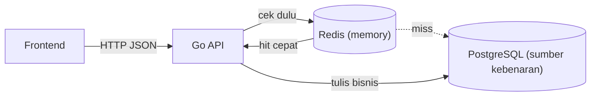
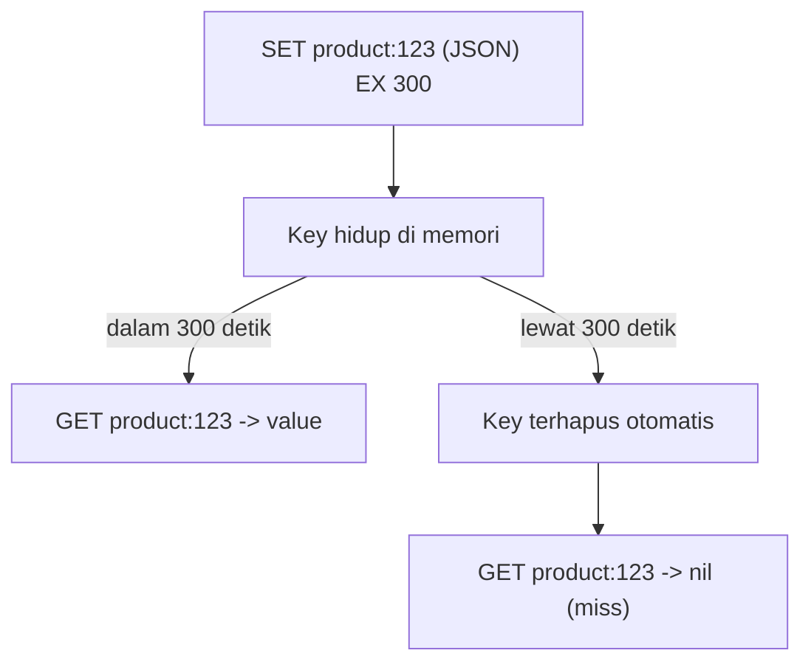

import { Section, Box, Recap, CardGrid, Card, Chip, Hero, Compare, Def } from "@components";

<Hero eyebrow="Chapter 01 &middot; Redis" title="Fondasi &amp; <em>Mental Model</em> Redis" sub="Kenapa Redis, kapan berbahaya, dan cara berpikir key/value/TTL">
  
Sebelum menyentuh satu command, satu chapter untuk membangun fondasi: kenapa Redis layak dipakai, kapan ia justru berbahaya, model pikir key/value/TTL, dan cara memilih tipe data dari operasinya.

  <Fragment slot="meta">
    <Chip icon="database">Memory <b>layer</b></Chip>
    <Chip icon="bolt">key / value / <b>TTL</b></Chip>
    <Chip icon="clock">~24 menit baca</Chip>
  </Fragment>
</Hero>

Chapter pembuka ini satu busur belajar yang utuh: kita mulai dari **kenapa** Redis bisa membuat backend terasa instan dan **kapan** ia berubah jadi sumber bug yang merugikan, lalu mengunci **model pikir** intinya (key, value, TTL), dan menutup dengan **memilih tipe data** yang tepat dari operasi yang dibutuhkan. Urutannya sengaja: tanpa model mental dan disiplin "kapan berbahaya", semua command Redis terasa seperti tombol ajaib yang dipasang di mana-mana, dan justru di situlah backend pemula tersandung. Setelah chapter ini, cache-aside di Chapter 2 akan terbaca logis, bukan magis.

<Section num="01" id="kenapa-redis" title="Kenapa Redis (dan Kapan Berbahaya)" sub="Akselerator opsional, bukan sumber kebenaran">

Redis adalah penyimpanan key-value berbasis memori yang sangat cepat. Ia menolong untuk cache, session, rate limit, dan data sementara, tetapi ia bukan pengganti PostgreSQL untuk data bisnis yang harus permanen dan konsisten.

Banyak masalah performa backend berbentuk sama: satu query database yang sama dijalankan ribuan kali untuk data yang jarang berubah. Halaman detail produk, daftar kategori, dan profil publik dibaca jauh lebih sering daripada diubah. Di sinilah Redis bersinar. Ia menyimpan hasil di memori dan mengembalikannya dalam hitungan mikrodetik, sehingga database tidak menjadi titik panas tiap request.

Tetapi kecepatan itu datang dengan syarat. Redis menyimpan salinan data, dan salinan bisa basi. Begitu kamu menaruh data yang sensitif terhadap konsistensi (stok, status pesanan, status pembayaran) di Redis tanpa disiplin, kamu menukar bug yang jarang dengan bug yang sering, dan biasanya bug yang merugikan uang. Aturan mental yang dipegang sepanjang course ini: Redis adalah akselerator opsional, bukan sumber kebenaran.

<Box variant="bridge" icon="🌉" label="Jembatan: dari React Query dan Laravel Cache ke shared cache">
Di React Query, cache hidup di memori satu browser dan hilang saat tab ditutup. Di Laravel, `Cache::remember` menyimpan hasil agar tidak menghitung ulang. Redis adalah versi shared dari ide yang sama: satu cache yang dipakai bersama oleh semua instance backend dan semua user, bukan per-tab atau per-proses.
</Box>

<b>Gambar 1.</b> Redis duduk di depan PostgreSQL sebagai akselerator baca. PostgreSQL tetap satu-satunya sumber kebenaran untuk data bisnis.

Supaya konkret, bayangkan online shop skincare yang kita bangun di seluruh course ini. Halaman detail satu produk laris bisa dibuka ribuan kali per menit saat kampanye, sementara admin hanya mengubah harga atau deskripsinya beberapa kali sehari. Asimetri baca-tulis seperti inilah kandidat cache yang sehat: data nyaris diam, tapi dibaca terus-menerus. Sebaliknya, stok produk itu berubah tiap kali ada yang checkout, dan salinan stok yang basi langsung berarti oversell. Topik yang sama, keputusan cache yang berlawanan, dan bedanya cuma satu pertanyaan: kalau telat, siapa yang rugi?

<CardGrid cols={2}>
  <Card><h4>Redis menolong</h4>
Cache hasil baca yang mahal, session dengan TTL alami, rate limit counter, ranking, dan event log ringan.
</Card>
  <Card><h4>Redis berbahaya</h4>
Saat dipakai menyimpan stok, status order, atau saldo sebagai kebenaran. Salinan basi di sana berubah jadi kerugian nyata.
</Card>
  <Card><h4>Redis bukan database utama</h4>
Data di memori bisa hilang saat restart bila tidak dikonfigurasi persisten. Jangan menaruh data yang tidak boleh hilang hanya di Redis.
</Card>
  <Card><h4>Redis itu opsional</h4>
API harus tetap melayani request walau Redis mati. Kalau Redis jadi syarat hidup, kamu menambah titik kegagalan baru.
</Card>
</CardGrid>

<Compare aLabel="PostgreSQL: sumber kebenaran" bLabel="Redis: akselerator" aTone="blue" bTone="teal">
  <Fragment slot="a"><ul><li>Permanen dan durable: data selamat dari restart.</li><li>Transaksi ACID: stok, order, dan pembayaran konsisten.</li><li>Wajib benar; boleh sedikit lebih lambat.</li></ul></Fragment>
  <Fragment slot="b"><ul><li>Sementara dan bisa dibuang: boleh hilang saat restart.</li><li>Cepat di memori: cache, session, counter, ranking.</li><li>Wajib cepat; isinya selalu bisa dibangun ulang dari sumber.</li></ul></Fragment>
</Compare>

<Box variant="warn" icon="⚠️" label="Refleks yang harus dilawan">
Refleks "cache semua GET biar cepat" adalah sumber bug paling umum di backend pemula. Sebelum cache apa pun, tanya: kalau data ini telat update beberapa detik atau menit, siapa yang rugi? Bila jawabannya pelanggan atau uang, jangan cache dulu.
</Box>

<Box variant="tip" icon="💡" label="Peta belajar course ini">
Chapter ini membangun model pikir. **Chapter 2** menerapkan cache-aside pertama dengan go-redis. **Chapter 3** menajamkan disiplin caching (key, TTL, invalidasi, batas). **Chapter 4** memakai sifat atomic dan TTL untuk rate limit, session, dan transaksi. **Chapter 5** soal resilience, observability, dan stack lokal. **Chapter 6** menutup dengan topik lanjutan dan rangkuman.
</Box>

Kita sudah tahu kapan Redis menolong dan kapan berbahaya. Tetapi "key", "value", dan "TTL" tadi sebenarnya apa? Mari kunci tiga kata itu sebelum menyentuh command apa pun.

</Section>

<Section num="02" id="mental-model" title="Mental Model: Key, Value, TTL" sub="Berpikir memory-first sebelum menghafal command">

Sebelum menghafal command, pegang model intinya: Redis adalah peta besar dari key ke value yang hidup di memori, dan setiap key bisa diberi waktu hidup (TTL) yang otomatis menghapusnya saat kedaluwarsa.

Tiga konsep ini lebih dulu dari sintaks command apa pun. Key adalah string unik yang menjadi alamat data. Value adalah isinya, yang bisa berupa string, hash, list, set, dan tipe lain. TTL adalah durasi sebelum key dihapus sendiri. Begitu kamu berpikir dalam tiga kata ini, sebagian besar keputusan caching jadi jelas.

<Def term="memory-first thinking">
Kebiasaan menaruh di Redis hanya data yang cepat berubah atau bisa dibuat ulang dari sumber lain. Bila data hilang dari Redis, sistem harus tetap benar, cukup sedikit lebih lambat.
</Def>

<Box variant="bridge" icon="🌉" label="Jembatan: dari object cache JavaScript ke key terstruktur">
Di JavaScript kamu mungkin menyimpan `cache[productId] = data` di sebuah object. Redis adalah object raksasa yang dipakai bersama lintas proses, dengan key berbentuk string terstruktur seperti `product:123` dan kemampuan auto-expire yang tidak dimiliki object biasa.
</Box>

Key yang baik bersifat deskriptif dan berpola namespace, dipisah titik dua. Pola `entitas:id` atau `entitas:id:atribut` membuat key mudah dibaca manusia dan mudah dikelola. Contohnya `product:123` untuk detail produk, `category:list` untuk daftar kategori, dan `session:abc123` untuk sesi login. Konvensi penamaan ini akan kita perdalam jadi sebuah disiplin di Chapter 3.

TTL adalah fitur yang membuat Redis ideal untuk data sementara. Kamu tidak perlu job pembersih yang menghapus data lama; Redis melakukannya sendiri. Inilah alasan session, rate limit window, dan cache berumur pendek terasa alami di Redis.

<b>Gambar 2.</b> Siklus hidup satu key dengan TTL 5 menit. Setelah kedaluwarsa, key hilang sendiri tanpa job pembersih.

Sebagai latihan model pikir, bayangkan menyimpan detail produk dengan TTL 5 menit. Selama 5 menit pertama, semua request membaca dari memori. Setelah itu, request pertama yang datang akan miss, mengambil ulang dari database, lalu mengisi cache lagi. Toleransi 5 menit ini adalah keputusan bisnis: harga dan deskripsi produk yang telat 5 menit hampir tidak pernah merugikan, dan inilah kandidat cache yang sehat.

<Box variant="note" icon="📝" label="TTL adalah keputusan, bukan default">
Setiap key cache sebaiknya punya TTL eksplisit. Key tanpa TTL akan menumpuk di memori selamanya sampai dihapus manual atau di-evict. Pemilihan durasi TTL dan kapan harus menghapus eksplisit kita bahas tuntas di Chapter 3.
</Box>

Key + value + TTL adalah kerangkanya, tetapi value tidak harus selalu string. Redis punya beberapa tipe data, dan memilih tipe yang tepat adalah keputusan desain yang lebih penting daripada hafal command. Mari petakan.

</Section>

<Section num="03" id="data-types" title="Data Types Redis" sub="Satu peta keputusan: pilih tipe sebelum menulis command">

Redis bukan sekadar penyimpan string. Ia punya beberapa tipe data inti, dan memilih tipe yang tepat adalah keputusan desain yang lebih penting daripada hafal sintaks command.

Menurut [dokumentasi Redis](https://redis.io/docs/latest/develop/data-types/), tipe inti yang sering dipakai adalah String, Hash, List, Set, Sorted Set, dan Stream. Tiap tipe punya kasus pakai yang berbeda. Jangan memaksakan satu tipe untuk semua; pilih berdasar bentuk data dan operasi yang dibutuhkan.

<table><thead><tr><th>Tipe</th><th>Bentuk</th><th>Kasus pakai khas</th><th>Command kunci</th></tr></thead><tbody><tr><td>String</td><td>Satu nilai (teks, angka, JSON)</td><td>Cache JSON produk, counter, flag</td><td>SET, GET, INCR</td></tr><tr><td>Hash</td><td>Map field ke value dalam satu key</td><td>Object ringan: ringkasan kartu produk</td><td>HSET, HGET, HGETALL</td></tr><tr><td>List</td><td>Urutan terurut, akses ujung</td><td>Antrian ringan, log terbaru</td><td>LPUSH, RPUSH, BRPOP</td></tr><tr><td>Set</td><td>Kumpulan anggota unik</td><td>Favorit unik, tag, membership</td><td>SADD, SISMEMBER, SMEMBERS</td></tr><tr><td>Sorted Set</td><td>Anggota dengan score terurut</td><td>Ranking, top viewed, leaderboard</td><td>ZADD, ZRANGE, ZREVRANGE</td></tr><tr><td>Stream</td><td>Log append-only dengan ID</td><td>Event log, event-driven worker</td><td>XADD, XREAD, XREADGROUP</td></tr></tbody></table>

<Box variant="bridge" icon="🌉" label="Jembatan: dari struktur data JavaScript ke tipe Redis">
Pemetaan kasarnya: object atau `Map` di JS menjadi Hash, array menjadi List, `Set` menjadi Set, dan array yang diurutkan berdasar skor menjadi Sorted Set. Bedanya, operasi ini berjalan di server Redis dan dibagi semua proses, bukan di memori satu runtime.
</Box>

### String vs Hash untuk object

Untuk menyimpan satu produk, ada dua pilihan umum. String JSON menyimpan seluruh produk sebagai satu blob JSON. Hash menyimpan tiap field terpisah dalam satu key. Pilihannya bergantung pada apakah kamu sering memperbarui satu field saja.

<Compare aLabel="String JSON" bLabel="Hash" aTone="blue" bTone="teal">
  <Fragment slot="a"><ul><li>Simpan seluruh object sebagai satu blob: `SET product:123 (json)`.</li><li>Ambil sekali, decode di aplikasi. Sederhana dan cocok untuk cache baca utuh.</li><li>Memperbarui satu field berarti baca, ubah, tulis ulang seluruh JSON.</li></ul></Fragment>
  <Fragment slot="b"><ul><li>Simpan per field: `HSET product:123 name "..." price 129000`.</li><li>Bisa ambil atau ubah satu field tanpa menyentuh sisanya: `HGET product:123 price`.</li><li>Cocok untuk ringkasan kartu produk yang field-nya kadang diperbarui terpisah.</li></ul></Fragment>
</Compare>

Untuk cache-aside produk yang dibaca utuh lalu dikirim ke frontend, String JSON biasanya lebih praktis karena satu kali GET dan satu kali decode. Hash menang ketika kamu butuh memperbarui atau membaca sebagian field tanpa memuat seluruh object.

### List vs Stream untuk urutan event

List bisa dipakai sebagai antrian sederhana: `LPUSH` di satu ujung, `BRPOP` di ujung lain. Ini cukup untuk tugas ringan. Tetapi begitu kamu butuh banyak consumer yang membaca event yang sama, perlu acknowledgement, atau perlu memutar ulang event, List mulai kewalahan. Di titik itu, Stream adalah jawabannya.

[Redis Streams](https://redis.io/docs/latest/develop/data-types/streams/) didesain sebagai struktur data append-only log untuk event processing, dengan dukungan consumer group dan pending messages. Detail consumer group sengaja kita tunda ke Chapter 6 agar fokus chapter ini tetap pada pemilihan tipe.

### Set dan Sorted Set untuk fitur cepat

Set menyimpan anggota unik tanpa urutan, ideal untuk daftar favorit user (`SADD favorites:user:42 product:123`) karena `SADD` otomatis menolak duplikat. Sorted Set menambahkan score ke tiap anggota dan menjaganya tetap terurut, ideal untuk ranking seperti produk paling banyak dilihat (`ZADD top:viewed 1 product:123`, lalu `ZREVRANGE` untuk ambil teratas).

Di dunia nyata, Sorted Set adalah tulang punggung hampir semua leaderboard dan widget "paling laris" atau "trending": skornya bisa berupa jumlah view, jumlah penjualan, atau timestamp, dan Redis menjaga peringkat tetap terurut secara real time tanpa query `ORDER BY ... LIMIT` yang berat ke database tiap kali halaman dibuka. Itu sebabnya rubrik "trending sekarang" terasa instan.

<Box variant="tip" icon="💡" label="Pilih tipe dari operasi, bukan dari data">
Pertanyaan kuncinya bukan "data ini bentuknya apa" melainkan "operasi apa yang sering saya jalankan". Sering ambil satu field? Hash. Butuh keunikan? Set. Butuh urutan berdasar skor? Sorted Set. Butuh log event yang bisa dibaca banyak consumer? Stream.
</Box>

Kita sekarang punya model pikir (key/value/TTL) dan peta tipe data. Saatnya menerjemahkannya ke kode Go nyata. Di Chapter 2 kita pasang `go-redis/v9` dan menerapkan pola caching pertama, cache-aside, pada endpoint detail produk.

</Section>

<Section num="04" id="ringkasan" title="Ringkasan" sub="Fondasi yang menopang seluruh course">

Chapter ini menanamkan model mental Redis: kapan ia menolong dan kapan berbahaya, kerangka key/value/TTL, dan cara memilih tipe data dari operasinya.

Kita mulai dari asimetri baca-tulis yang membuat cache masuk akal, lalu mengunci aturan emasnya: Redis akselerator opsional, PostgreSQL sumber kebenaran. Kita kunci tiga kata kunci, key sebagai alamat, value sebagai isi, dan TTL sebagai masa hidup yang otomatis membersihkan dirinya, lalu memetakan enam tipe data inti dan belajar memilih tipe dari operasi yang sering dijalankan, bukan dari bentuk datanya saja.

<Recap title="Yang Wajib Menempel">
<ul>
<li>Redis adalah memory layer untuk cache, session, rate limit, dan data sementara, bukan sumber kebenaran data bisnis.</li>
<li>Cache aman untuk data yang jarang berubah dan tidak merugikan bila telat; berbahaya untuk stok, status order, dan pembayaran.</li>
<li>Model intinya key + value + TTL: key adalah alamat, value isinya, TTL menghapus key sendiri tanpa job pembersih.</li>
<li>Key berpola namespace `entitas:id` mudah dibaca dan dikelola; setiap key cache sebaiknya punya TTL eksplisit.</li>
<li>Tipe inti: String, Hash, List, Set, Sorted Set, Stream. Pilih dari operasi yang dibutuhkan, bukan dari bentuk data.</li>
<li>API harus tetap hidup walau Redis mati; isi Redis selalu bisa dibangun ulang dari sumber kebenaran.</li>
</ul>
</Recap>

Dengan model mental ini, langkah berikutnya adalah membuat caching benar-benar bekerja. Di **Chapter 2** kita memasang client `go-redis/v9`, memahami kenapa `redis.Nil` berarti cache miss (bukan error), dan menerapkan cache-aside pada `GET /v1/products/{id}` tanpa mengubah kontrak API.

</Section>
