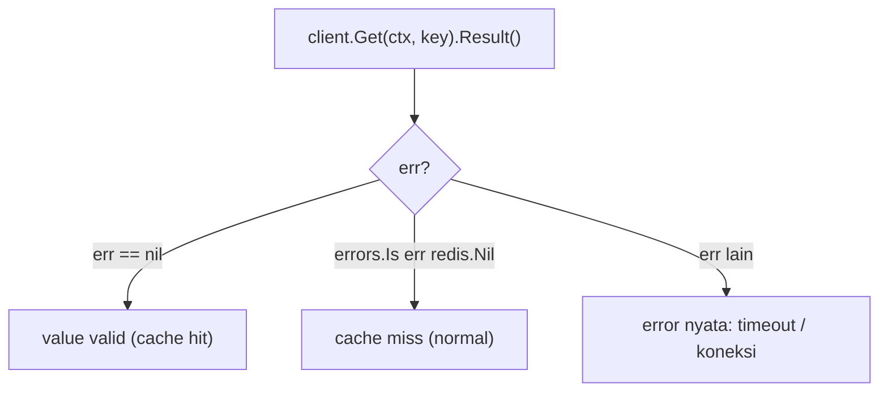
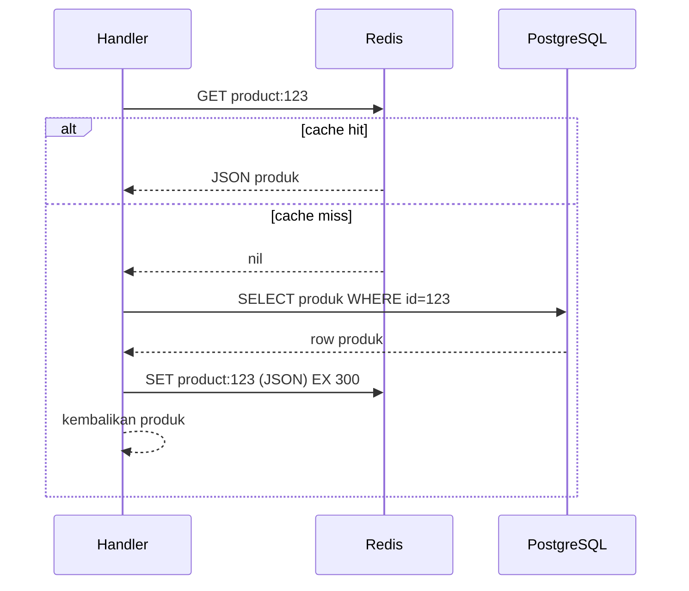

import { Section, Box, Steps, Step, Recap, Chip, Hero, Compare, Endpoint } from "@components";

<Hero eyebrow="Chapter 02 &middot; Redis" title="Cache-Aside Pertama<br />dengan <em>go-redis</em>" sub="Client go-redis/v9, redis.Nil, dan pola caching paling aman">
  <p>Saatnya turun ke kode: pasang client `go-redis/v9`, pahami kenapa key yang tidak ada bukan error, lalu terapkan cache-aside pada endpoint nyata tanpa mengubah satu pun kontrak API.</p>
  <Fragment slot="meta">
    <Chip icon="code">go-redis <b>v9.20.1</b></Chip>
    <Chip icon="bolt">pola <b>cache-aside</b></Chip>
    <Chip icon="clock">~20 menit baca</Chip>
  </Fragment>
</Hero>

Chapter ini menyatukan dua hal yang memang satu busur: pertama **menghubungkan** Go ke Redis dengan client resmi dan memahami idiomnya (context dulu, `redis.Nil` sebagai miss), lalu langsung memakai pemahaman itu untuk **menerapkan** pola caching pertama, cache-aside. Keduanya tidak bisa dipisah, sebab seluruh gunanya memasang client adalah untuk pola seperti inilah. Di akhir chapter, `GET /v1/products/{id}` akan dilayani dari memori saat panas dan dari PostgreSQL saat dingin, dengan frontend yang tidak tahu bedanya.

<Section num="01" id="go-redis" title="Memakai go-redis/v9 di Go" sub="Client resmi, context sebagai parameter pertama">

<p class="lead">Client Go resmi untuk Redis adalah `github.com/redis/go-redis/v9`. Versi terbaru saat course ini ditulis adalah v9.20.1 (rilis 11 Juni 2026), berlisensi BSD-2-Clause, dan kompatibel dengan Redis 7.0 ke atas.</p>

Pola di go-redis konsisten: setiap command menerima `context.Context` sebagai parameter pertama, lalu argumen command, dan mengembalikan sebuah objek hasil yang nilainya diambil lewat `.Result()` atau `.Err()`. Karena context jadi parameter pertama, kamu bisa memasang timeout dan pembatalan dengan rapi, persis seperti pada query pgx di modul PostgreSQL.

<Box variant="bridge" icon="🌉" label="Jembatan: dari Redis client Node.js ke idiom Go"><p>Di Node.js kamu menulis `await client.get(key)` dan key yang tidak ada mengembalikan `null`. Di Laravel, `Redis::get($key)` mengembalikan `null` juga. Di go-redis, key yang tidak ada bukan nilai kosong biasa; ia mengembalikan error khusus `redis.Nil`. Membedakan `redis.Nil` dari error sungguhan adalah inti dari menangani cache miss dengan benar.</p></Box>

Pertama, pasang dependency.

```bash title="Terminal"
go get github.com/redis/go-redis/v9@v9.20.1
```

Lalu buat client. `redis.NewClient` menerima `*redis.Options`, dan untuk lokal cukup mengisi `Addr`. Setelah itu, `Ping` memverifikasi koneksi.

```go title="internal/cache/redis.go"
package cache

import (
	"context"
	"time"

	"github.com/redis/go-redis/v9"
)

// New membuat client Redis dan memverifikasi koneksi dengan Ping.
func New(ctx context.Context, addr string) (*redis.Client, error) {
	client := redis.NewClient(&redis.Options{
		Addr: addr,
	})

	pingCtx, cancel := context.WithTimeout(ctx, 2*time.Second)
	defer cancel()

	if err := client.Ping(pingCtx).Err(); err != nil {
		return nil, err
	}

	return client, nil
}
```

<Box variant="tip" icon="💡" label="Satu client, bukan satu koneksi per request"><p>`redis.Client` aman dipakai banyak goroutine sekaligus dan otomatis mengelola connection pool (defaultnya sekitar 10 koneksi per CPU). Buat satu kali saat startup, simpan, lalu pakai di seluruh aplikasi. Membuat client baru tiap request adalah kesalahan klasik yang menghabiskan koneksi dan memperlambat semuanya.</p></Box>

Sekarang operasi dasar Set dan Get. Perhatikan `context.WithTimeout` per operasi dan penanganan `redis.Nil` sebagai cache miss, bukan error.

```go title="internal/cache/redis.go"
import (
	"context"
	"errors"
	"time"

	"github.com/redis/go-redis/v9"
)

// SetString menyimpan value string dengan TTL.
func SetString(ctx context.Context, client *redis.Client, key, value string, ttl time.Duration) error {
	ctx, cancel := context.WithTimeout(ctx, 200*time.Millisecond)
	defer cancel()

	return client.Set(ctx, key, value, ttl).Err()
}

// GetString mengembalikan value, found=false bila key tidak ada (cache miss).
func GetString(ctx context.Context, client *redis.Client, key string) (value string, found bool, err error) {
	ctx, cancel := context.WithTimeout(ctx, 200*time.Millisecond)
	defer cancel()

	value, err = client.Get(ctx, key).Result()
	if errors.Is(err, redis.Nil) {
		return "", false, nil // cache miss, bukan error
	}
	if err != nil {
		return "", false, err // error sungguhan (timeout, koneksi putus)
	}
	return value, true, nil
}
```

<Box variant="warn" icon="⚠️" label="redis.Nil bukan error yang harus digagalkan"><p>Kesalahan klasik adalah memperlakukan `redis.Nil` sebagai kegagalan dan mengembalikan 500 ke client. Padahal `redis.Nil` cuma berarti "key tidak ada", yaitu cache miss yang sepenuhnya normal. Periksa `errors.Is(err, redis.Nil)` lebih dulu, dan hanya error setelahnya yang dianggap kegagalan nyata.</p></Box>



<p class="fig-cap"><b>Gambar 1.</b> Tiga cabang hasil dari satu Get. Hanya cabang paling kanan yang benar-benar kegagalan.</p>

<Box variant="tip" icon="💡" label="Bungkus client, jangan sebar di mana-mana"><p>Letakkan client Redis di `internal/cache` dan ekspos fungsi berdomain (mis. `GetProductCache`, `SetProductCache`) alih-alih membiarkan handler memanggil `client.Get` langsung. Ini menjaga key dan TTL terpusat, mudah diuji, dan mudah diganti.</p></Box>

Pembedaan tiga cabang ini, hit, miss, dan error nyata, adalah fondasi pola caching yang sebentar lagi kita tulis. Mari rakit ketiganya jadi satu alur utuh: cache-aside.

</Section>

<Section num="02" id="cache-aside" title="Pola Cache-Aside" sub="Cek Redis dulu, miss baru ke PostgreSQL, lalu isi cache">

<p class="lead">Cache-aside adalah pola caching paling umum dan paling aman untuk dipelajari pertama: aplikasi mengecek Redis dulu, kalau miss baru mengambil dari PostgreSQL, lalu mengisi Redis untuk request berikutnya.</p>

Disebut "aside" karena cache berdiri di samping database, bukan di tengah jalur tulis. Aplikasi yang memegang kendali kapan membaca dan kapan mengisi cache. Pola ini cocok untuk data baca-berat yang jarang berubah, seperti detail produk. Bukan kebetulan [dokumentasi Redis sendiri](https://redis.io/docs/latest/develop/use-cases/cache-aside/) menjadikan cache-aside sebagai pola default yang direkomendasikan: ia sederhana, eksplisit, dan gagal dengan aman karena database selalu jadi jaring pengaman.



<p class="fig-cap"><b>Gambar 2.</b> Alur cache-aside. Database hanya tersentuh saat miss, sehingga ia tidak menjadi titik panas tiap request.</p>

<Box variant="bridge" icon="🌉" label="Jembatan: dari React Query stale data ke cache bersama"><p>React Query menyimpan data agar komponen tidak fetch ulang terus-menerus, tetapi cache itu milik satu browser. Cache-aside di Redis adalah ide yang sama di sisi server: satu salinan dipakai semua user, sehingga query database benar-benar berkurang secara global, bukan per pengunjung.</p></Box>

Sebelum menulis kodenya, kunci dulu tiga langkah pola ini sebagai satu prosedur yang akan kamu ulang untuk hampir semua cache baca.

<Steps>
<Step><b>Cek cache lebih dulu</b><p>`GET product:{id}` ke Redis. Bila hit dan JSON valid, kembalikan langsung; ini jalur cepat yang melayani mayoritas request.</p></Step>
<Step><b>Miss, ambil dari sumber kebenaran</b><p>Bila `redis.Nil` (atau JSON rusak, atau Redis error), jatuh ke PostgreSQL lewat repository. Database adalah jaring pengaman yang selalu benar.</p></Step>
<Step><b>Isi cache untuk request berikutnya</b><p>Marshal hasil ke JSON lalu `SET product:{id} EX 300`, best-effort. Request berikutnya untuk produk yang sama akan hit.</p></Step>
</Steps>

Berikut penerapan pada `GET /v1/products/{id}` tanpa mengubah kontrak API. Service mencoba cache lebih dulu, jatuh ke repository bila miss, lalu menyimpan hasilnya.

<Endpoint method="GET" path="/v1/products/{id}" desc="Detail produk; dilayani dari cache bila tersedia, dari PostgreSQL bila miss" />

```go title="internal/product/service.go"
package product

import (
	"context"
	"encoding/json"
	"errors"
	"strconv"
	"time"

	"github.com/redis/go-redis/v9"
)

const productTTL = 5 * time.Minute

type Repository interface {
	FindByID(ctx context.Context, id int64) (Product, error)
}

type Service struct {
	repo  Repository
	redis *redis.Client
}

func NewService(repo Repository, rdb *redis.Client) *Service {
	return &Service{repo: repo, redis: rdb}
}

// GetByID menerapkan cache-aside: cek Redis, miss baru ke PostgreSQL.
func (s *Service) GetByID(ctx context.Context, id int64) (Product, error) {
	key := productKey(id)

	// 1. Cek cache.
	cached, err := s.redis.Get(ctx, key).Result()
	if err == nil {
		var p Product
		if jsonErr := json.Unmarshal([]byte(cached), &p); jsonErr == nil {
			return p, nil // cache hit
		}
		// JSON rusak: anggap miss, lanjut ke database.
	} else if !errors.Is(err, redis.Nil) {
		// Error Redis nyata: jangan gagalkan request, lanjut ke database.
		// (Resilience dibahas tuntas di Chapter 5.)
	}

	// 2. Cache miss: ambil dari sumber kebenaran.
	p, err := s.repo.FindByID(ctx, id)
	if err != nil {
		return Product{}, err
	}

	// 3. Isi cache untuk request berikutnya (best-effort).
	if blob, marshalErr := json.Marshal(p); marshalErr == nil {
		_ = s.redis.Set(ctx, key, blob, productTTL).Err()
	}

	return p, nil
}

func productKey(id int64) string {
	return "product:" + strconv.FormatInt(id, 10)
}
```

<Box variant="warn" icon="⚠️" label="Mengisi cache bersifat best-effort"><p>Perhatikan langkah 3 memakai `_ =` untuk mengabaikan error Set. Bila Redis gagal menyimpan, request tetap mengembalikan data yang benar dari database. Caching yang menggagalkan request hanya karena gagal mengisi cache adalah desain yang salah; cache seharusnya menambah, bukan mengurangi, keandalan.</p></Box>

<Box variant="note" icon="📝" label="Kontrak API tidak berubah"><p>Frontend tidak tahu dan tidak peduli apakah respons datang dari Redis atau PostgreSQL. Bentuk JSON, status code, dan path tetap sama. Caching adalah optimasi internal, bukan perubahan kontrak.</p></Box>

Cache-aside sudah jalan, tetapi kode di atas menyimpan satu pertanyaan besar yang sengaja kita lewati: bentuk key `product:{id}` itu dari mana, kapan isi cache dianggap basi, dan data apa yang sebenarnya tidak boleh masuk ke sini sama sekali. Tiga pertanyaan itu adalah disiplin caching, dan itulah seluruh isi Chapter 3.

</Section>

<Section num="03" id="ringkasan" title="Ringkasan" sub="Caching pertama yang bekerja dan aman">

<p class="lead">Chapter ini membawa Redis dari konsep ke kode: memasang client go-redis, memahami idiomnya, dan menerapkan cache-aside pada endpoint nyata.</p>

Kita pasang `go-redis/v9`, membuat satu client yang dibagi seluruh aplikasi, dan mengunci idiom intinya: context sebagai parameter pertama, dan `redis.Nil` sebagai cache miss yang normal, bukan kegagalan. Lalu kita rakit ketiga cabang itu (hit, miss, error) menjadi cache-aside: cek Redis dulu, jatuh ke PostgreSQL saat miss, isi cache best-effort untuk request berikutnya, semuanya tanpa menyentuh kontrak API.

<Recap title="Yang Wajib Menempel">
<ul>
<li>Client resmi `github.com/redis/go-redis/v9` (v9.20.1) memakai `context.Context` sebagai parameter pertama di setiap command.</li>
<li>`redis.Nil` berarti key tidak ada (cache miss) yang normal; periksa dengan `errors.Is`, jangan kembalikan 500.</li>
<li>Buat satu `redis.Client` saat startup dan pakai bersama; ia aman untuk banyak goroutine dan mengelola connection pool sendiri.</li>
<li>Cache-aside: cek Redis dulu, miss baru ke PostgreSQL, lalu isi cache untuk request berikutnya.</li>
<li>Mengisi cache bersifat best-effort: kegagalan Redis tidak boleh menggagalkan request yang datanya benar dari database.</li>
<li>Caching adalah optimasi internal; bentuk JSON, status code, dan path tetap sama bagi frontend.</li>
</ul>
</Recap>

Cache-aside membuat caching bekerja, tetapi belum tentu benar. Di **Chapter 3** kita menambahkan disiplin: merancang cache key yang konsisten dan mudah diinvalidasi, memilih antara TTL dan delete-on-write, dan yang paling penting, menentukan data apa yang tidak boleh di-cache sama sekali.

</Section>
