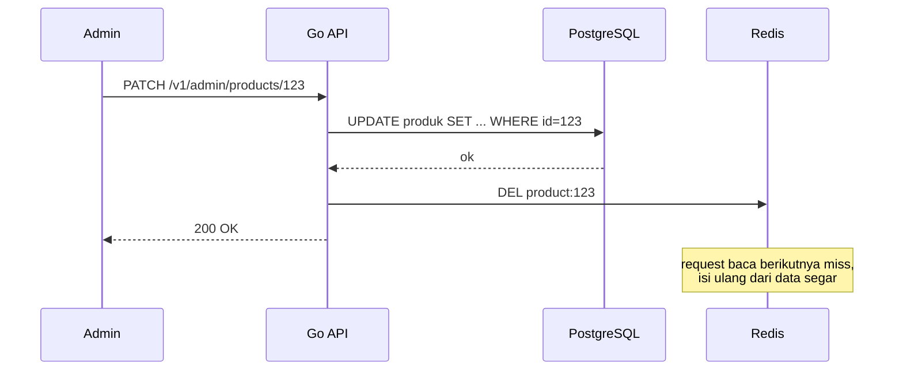
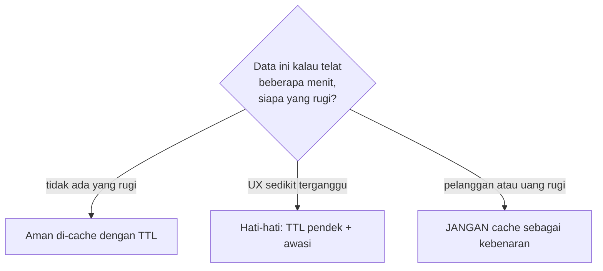

import { Section, Box, Recap, Chip, Hero } from "@components";

<Hero eyebrow="Chapter 03 &middot; Redis" title="Caching yang <em>Berdisiplin</em><br />Key, TTL &amp; Batas" sub="Desain key, invalidasi, dan data yang tidak boleh di-cache">
  <p>Cache-aside membuat caching bekerja. Chapter ini membuatnya benar: key yang mudah diinvalidasi, strategi kapan data dianggap basi, dan garis tegas tentang apa yang tidak boleh di-cache.</p>
  <Fragment slot="meta">
    <Chip icon="route">desain <b>key</b></Chip>
    <Chip icon="clock">TTL &amp; <b>invalidasi</b></Chip>
    <Chip icon="ban">batas <b>cache</b></Chip>
  </Fragment>
</Hero>

Caching yang naif gampang ditulis dan gampang merugikan. Chapter ini tiga lapis disiplin yang membuat cache aman: pertama **desain key** yang konsisten supaya kelak bisa dihapus berkelompok, lalu **strategi invalidasi** (TTL vs delete-on-write) supaya data tidak basi terlalu lama, dan terakhir **batas tegas** tentang data apa yang justru tidak boleh masuk cache sama sekali. Ketiganya menjawab tiga pertanyaan yang sengaja kita gantung di Chapter 2: dari mana bentuk key, kapan isinya basi, dan apa yang tidak boleh ada di sana.

<Section num="01" id="cache-key-design" title="Desain Cache Key" sub="Key yang konsisten menentukan kemudahan invalidasi">

<p class="lead">Key yang dirancang dengan disiplin menentukan seberapa mudah kamu menghapus dan memperbarui cache nanti. Key yang berantakan membuat invalidasi jadi mimpi buruk.</p>

Key yang baik punya struktur yang konsisten dan dapat ditebak. Pola yang umum dan kuat adalah menyusun komponen yang dipisah titik dua, dari yang paling umum ke paling spesifik.

<div class="tbl-wrap"><table><thead><tr><th>Komponen</th><th>Contoh</th><th>Tujuan</th></tr></thead><tbody><tr><td>Environment prefix</td><td>prod, staging</td><td>Memisahkan cache antar lingkungan</td></tr><tr><td>Versi skema cache</td><td>v1</td><td>Membuang seluruh cache lama saat bentuk berubah</td></tr><tr><td>Entitas</td><td>product, category</td><td>Mengelompokkan jenis data</td></tr><tr><td>ID atau hash query</td><td>123, list, q hash</td><td>Mengidentifikasi item atau hasil spesifik</td></tr></tbody></table></div>

Dengan pola itu, beberapa contoh key untuk online shop terlihat seperti ini.

```text title="Contoh cache key"
prod:v1:product:123                detail produk id 123
prod:v1:category:list              daftar kategori
prod:v1:search:8f3a1c              hasil pencarian (8f3a1c = hash query)
prod:v1:session:abc123             sesi login
```

<Box variant="bridge" icon="🌉" label="Jembatan: dari naming route ke naming data"><p>Kamu sudah terbiasa menamai route frontend secara konsisten, mis. `/products/:id`. Anggap cache key sebagai naming yang sama untuk data backend: terstruktur, dapat ditebak, dan stabil, sehingga siapa pun di tim tahu bentuk key tanpa menebak.</p></Box>

Untuk hasil yang bergantung pada banyak parameter (pencarian dengan filter dan paginasi), jangan menempelkan seluruh query mentah ke key karena panjang dan rawan karakter aneh. Buat hash pendek yang deterministik dari parameter yang sudah dinormalkan.

```go title="internal/product/cachekey.go"
package product

import (
	"crypto/sha1"
	"encoding/hex"
	"fmt"
)

// searchKey membuat key stabil dari parameter pencarian yang sudah dinormalkan.
func searchKey(env, q, category string, page int) string {
	raw := fmt.Sprintf("q=%s&cat=%s&page=%d", q, category, page)
	sum := sha1.Sum([]byte(raw))
	short := hex.EncodeToString(sum[:])[:6]
	return fmt.Sprintf("%s:v1:search:%s", env, short)
}
```

<Box variant="tip" icon="💡" label="Versi di key adalah tombol panic"><p>Menyisipkan `v1` di key memberi cara murah membuang seluruh cache sekaligus. Saat kamu mengubah bentuk JSON yang disimpan, naikkan ke `v2`. Key lama `v1` tidak akan pernah dibaca lagi dan akan kedaluwarsa sendiri lewat TTL, tanpa perlu menghapus satu per satu.</p></Box>

<Box variant="warn" icon="⚠️" label="Hindari key yang tidak bisa dihapus berkelompok"><p>Bila key tersebar tanpa pola (mis. `produk_123_cache` di satu tempat dan `cacheProduct123` di tempat lain), kamu tidak bisa menemukan dan menghapusnya saat data berubah. Konsistensi penamaan adalah fondasi invalidasi yang kita bahas berikutnya.</p></Box>

Key yang konsisten baru separuh cerita. Pertanyaan yang lebih sulit adalah: setelah disimpan, kapan isinya dianggap basi, dan bagaimana membuangnya?

</Section>

<Section num="02" id="ttl-invalidation" title="TTL dan Invalidation" sub="Kapan data cache dianggap basi dan bagaimana membuangnya">

<p class="lead">Pertanyaan tersulit dalam caching bukan cara menyimpan, melainkan kapan data cache dianggap basi dan bagaimana membuangnya. Ada dua alat utama: TTL dan penghapusan eksplisit saat data berubah.</p>

TTL membuat cache kedaluwarsa sendiri setelah durasi tertentu. Ini cocok untuk data yang boleh sedikit telat. Penghapusan eksplisit (delete-on-write) membuang key cache segera setelah sumbernya berubah, sehingga request berikutnya pasti mengambil data segar. Keduanya sering dipakai bersama.

<div class="tbl-wrap"><table><thead><tr><th>Strategi</th><th>Cara kerja</th><th>Cocok untuk</th><th>Risiko</th></tr></thead><tbody><tr><td>TTL pendek</td><td>Key hidup beberapa detik sampai menit</td><td>Data yang boleh telat sebentar</td><td>Hit rate lebih rendah, database sedikit lebih sibuk</td></tr><tr><td>TTL panjang</td><td>Key hidup jam sampai hari</td><td>Data yang sangat jarang berubah</td><td>Stale lama bila tidak ada invalidasi</td></tr><tr><td>Delete-on-write</td><td>Hapus key saat sumber diubah</td><td>Data yang harus segar setelah update</td><td>Harus konsisten dipanggil di setiap jalur tulis</td></tr></tbody></table></div>

<Box variant="bridge" icon="🌉" label="Jembatan: dari invalidate React Query setelah mutation"><p>Di React Query, setelah mutation kamu memanggil `queryClient.invalidateQueries` agar data lama dibuang dan di-fetch ulang. Delete-on-write di Redis adalah versi server dari kebiasaan itu: setelah menulis ke PostgreSQL, hapus key cache yang terkait supaya pembaca berikutnya mendapat data segar.</p></Box>

Pola paling jelas untuk online shop adalah menghapus `product:{id}` setelah admin memperbarui produk. Update menulis ke PostgreSQL dulu (sumber kebenaran), baru menghapus cache. Urutan ini penting: tulis dulu, baru buang cache.

```go title="internal/product/service.go"
// Update menulis ke PostgreSQL lalu membuang cache produk terkait.
func (s *Service) Update(ctx context.Context, p Product) error {
	// 1. Tulis ke sumber kebenaran dulu.
	if err := s.repo.Update(ctx, p); err != nil {
		return err
	}

	// 2. Buang cache (best-effort). Request berikutnya akan miss
	//    lalu mengisi ulang dari data yang sudah segar.
	_ = s.redis.Del(ctx, productKey(p.ID)).Err()

	return nil
}
```



<p class="fig-cap"><b>Gambar 1.</b> Delete-on-write. Tulis ke PostgreSQL dulu, baru hapus cache, agar tidak ada jendela di mana cache terisi data lama setelah database sudah baru.</p>

<Box variant="warn" icon="⚠️" label="Jangan hapus cache sebelum menulis database"><p>Bila kamu menghapus cache lebih dulu lalu menulis database, ada celah waktu di mana request lain bisa miss, membaca data lama dari database (karena update belum selesai), lalu mengisi cache dengan data basi yang justru baru saja kamu hapus. Selalu tulis sumber kebenaran dulu, baru buang cache.</p></Box>

### Jitter TTL: menghindari kedaluwarsa berjamaah

Ada jebakan halus pada TTL yang seragam. Bila ribuan key dibuat dalam lonjakan yang sama (misalnya saat cache dingin setelah deploy lalu langsung diserbu traffic), semuanya akan kedaluwarsa nyaris bersamaan pula. Saat detik kedaluwarsa itu tiba, semua request miss serentak dan menyerbu database sekaligus. Dalam skenario nyata, satu hot key di endpoint 10k request per detik dengan TTL 60 detik bisa mengirim ribuan query ke database dalam satu detik begitu key itu kedaluwarsa di semua tempat sekaligus.

Penangkal paling murah adalah memberi sedikit variasi acak (jitter) pada TTL, misalnya 300 detik plus 0 sampai 60 detik acak, sehingga key tersebar kedaluwarsanya alih-alih meledak bersamaan.

```go title="internal/cache/ttl.go"
import (
	"math/rand/v2"
	"time"
)

// withJitter menambah variasi acak agar key tidak kedaluwarsa serentak.
func withJitter(base time.Duration, spread time.Duration) time.Duration {
	return base + time.Duration(rand.Int64N(int64(spread)))
}

// pemakaian: TTL 5 menit + 0..60 detik acak.
// ttl := withJitter(5*time.Minute, 60*time.Second)
```

<Box variant="note" icon="🧩" label="Jitter meredam, belum menuntaskan"><p>Jitter mengurangi peluang kedaluwarsa berjamaah, tetapi hot key tunggal yang mahal di-rebuild tetap bisa menimbulkan badai miss saat ia kedaluwarsa. Penuntasannya (singleflight dan stale-while-revalidate) adalah topik cache stampede di Chapter 6.</p></Box>

<Box variant="tip" icon="💡" label="Kapan cukup TTL saja?"><p>Bila data tidak punya jalur tulis yang jelas atau update-nya jarang dan tidak kritikal (mis. daftar kategori), TTL pendek saja sudah cukup. Pakai delete-on-write hanya saat kamu butuh kesegaran segera setelah perubahan dan punya satu tempat jelas untuk memicu penghapusan.</p></Box>

Sampai sini kita sudah tahu cara cache yang benar. Tetapi keterampilan yang sama pentingnya adalah tahu kapan TIDAK cache sama sekali.

</Section>

<Section num="03" id="jangan-cache" title="Apa yang TIDAK Boleh Di-cache" sub="Melawan refleks cache semua GET">

<p class="lead">Section ini adalah pertahanan. Tidak semua data layak di-cache, dan beberapa data justru berbahaya bila di-cache. Mengetahui apa yang tidak boleh di-cache sama pentingnya dengan tahu cara cache.</p>

Aturan keputusannya sederhana: cache aman untuk data yang jarang berubah dan tidak merugikan bila telat. Cache berbahaya untuk data yang harus selalu akurat saat itu juga, terutama yang menyangkut uang, stok, dan status transaksi.

<div class="tbl-wrap"><table><thead><tr><th>Klasifikasi</th><th>Contoh data online shop</th><th>Alasan</th></tr></thead><tbody><tr><td>Aman di-cache</td><td>Katalog produk, daftar kategori, detail produk, konten halaman statis</td><td>Jarang berubah, telat beberapa menit hampir tak merugikan</td></tr><tr><td>Hati-hati</td><td>Hasil pencarian, ranking produk</td><td>Boleh di-cache dengan TTL pendek, tetapi awasi kesegarannya</td></tr><tr><td>Dilarang di-cache (sebagai kebenaran)</td><td>Stok inventory, cart aktif, status order, status payment, data privat user</td><td>Salinan basi langsung berubah jadi bug yang merugikan uang atau kepercayaan</td></tr></tbody></table></div>

<Box variant="warn" icon="⚠️" label="Cache stok adalah jebakan paling mahal"><p>Bila stok di-cache, pelanggan bisa melihat "tersedia" untuk produk yang sebenarnya sudah habis, lalu checkout gagal di langkah terakhir, atau lebih buruk, dua pelanggan membeli unit terakhir yang sama. Stok harus dibaca dan dikurangi dari PostgreSQL dalam transaksi, bukan dari salinan memori yang bisa basi.</p></Box>

<Box variant="warn" icon="⚠️" label="Status order dan payment harus selalu segar"><p>Pelanggan yang baru membayar lalu melihat status "menunggu pembayaran" karena cache basi akan kehilangan kepercayaan. Status order dan payment menggerakkan keputusan dan emosi pelanggan; baca selalu dari sumber kebenaran.</p></Box>



<p class="fig-cap"><b>Gambar 2.</b> Pohon keputusan satu pertanyaan yang bisa langsung dipakai tim sebelum memutuskan cache.</p>

<Box variant="bridge" icon="🌉" label="Jembatan: dari 'semua GET bisa cache' ke realita domain"><p>Di tutorial caching umum, semua endpoint GET sering diperlakukan setara. Realita online shop berbeda: `GET /v1/products` aman di-cache, tetapi `GET /v1/orders/{id}` dan `GET /v1/cart` tidak, karena keduanya state hidup milik satu user yang harus akurat.</p></Box>

<Box variant="note" icon="📝" label="Data privat user butuh kehati-hatian ganda"><p>Selain soal kesegaran, data privat user (alamat, riwayat order) berisiko bocor bila key cache tidak mengikat ke user yang benar. Bila terpaksa cache data per-user, pastikan user ID jadi bagian key dan TTL pendek, dan jangan pernah cache data privat di key yang bisa dibaca lintas user.</p></Box>

Pohon keputusan satu pertanyaan ini adalah inti seluruh chapter: cache memperbaiki performa hanya bila dipasang pada data yang benar. Itu pula yang membedakan caching yang menolong dari caching yang merugikan.

</Section>

<Section num="04" id="ringkasan" title="Ringkasan" sub="Cache yang benar, bukan sekadar cepat">

<p class="lead">Chapter ini mengubah cache-aside dari "bekerja" menjadi "benar" lewat tiga lapis disiplin: desain key, strategi invalidasi, dan batas data.</p>

Kita rancang key berpola `env:versi:entitas:id` supaya konsisten, dapat ditebak, dan bisa dibuang berkelompok (versi key sebagai tombol panic). Kita pilih antara TTL untuk data yang boleh telat dan delete-on-write untuk kesegaran segera, selalu menulis database dulu baru menghapus cache, dan menambah jitter TTL agar key tidak kedaluwarsa berjamaah. Terakhir kita tarik garis tegas: stok, cart, status order dan payment, serta data privat tidak boleh di-cache sebagai kebenaran.

<Recap title="Yang Wajib Menempel">
<ul>
<li>Key konsisten berpola `env:versi:entitas:id` menentukan kemudahan invalidasi; hash pendek untuk hasil ber-parameter banyak.</li>
<li>Versi di key (`v1`, `v2`) adalah tombol panic untuk membuang seluruh cache lama tanpa hapus satu per satu.</li>
<li>TTL untuk data yang boleh telat; delete-on-write untuk kesegaran segera, selalu tulis database dulu baru hapus cache.</li>
<li>Beri jitter pada TTL agar banyak key tidak kedaluwarsa serentak dan menyerbu database.</li>
<li>Jangan cache stok, status order, status payment, cart aktif, dan data privat sebagai kebenaran.</li>
<li>Pertanyaan penentu sebelum cache: kalau data ini telat beberapa menit, siapa yang rugi?</li>
</ul>
</Recap>

Sampai sini Redis sudah kita pakai untuk caching yang benar. Tetapi Redis bukan cuma cache. Di **Chapter 4** kita memakai dua sifat khasnya, operasi atomic dan TTL alami, untuk tiga hal di luar caching: rate limiting, session dan token store, serta operasi multi-langkah yang aman.

</Section>
