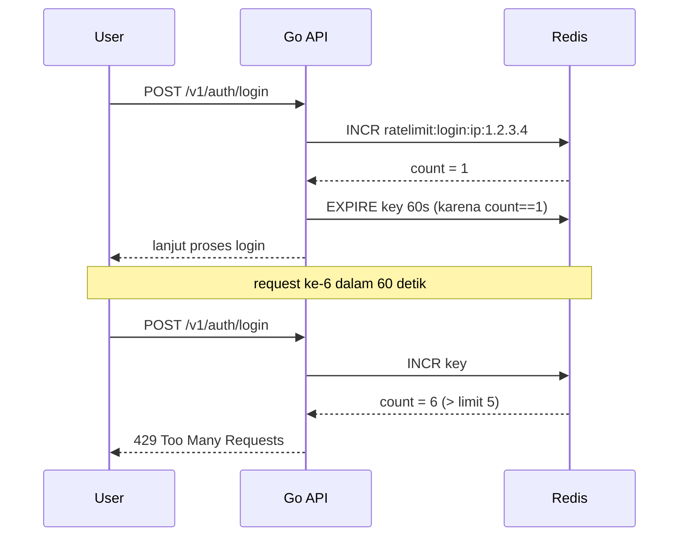
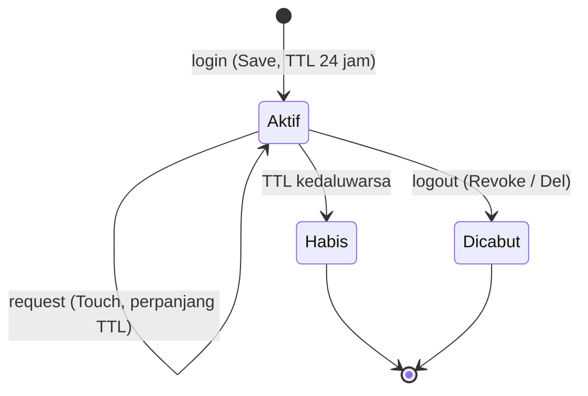
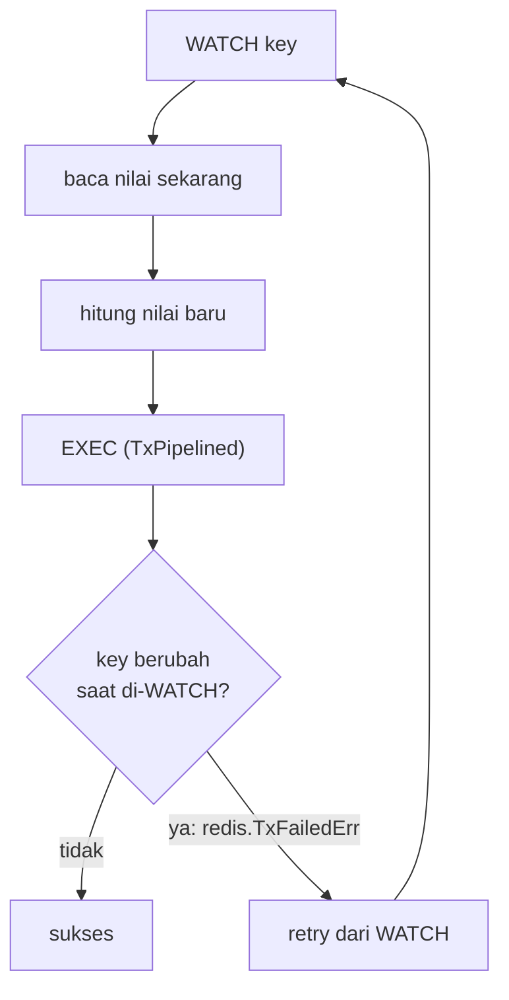

import { Section, Box, Recap, Chip, Hero, Endpoint } from "@components";

<Hero eyebrow="Chapter 04 &middot; Redis" title="Atomicity &amp; <em>TTL</em><br />Di Luar Caching" sub="Rate limit, session, dan transaksi dengan sifat khas Redis">
  <p>Redis bukan cuma cache. Dua sifatnya, operasi atomic dan TTL yang otomatis menghapus key, membuka tiga pemakaian penting: rate limiting, session store, dan operasi multi-langkah yang aman.</p>
  <Fragment slot="meta">
    <Chip icon="shield">rate <b>limit</b></Chip>
    <Chip icon="check">session &amp; <b>token</b></Chip>
    <Chip icon="bolt">atomic &amp; <b>transaksi</b></Chip>
  </Fragment>
</Hero>

Tiga section chapter ini diikat oleh satu benang merah: keduanya memanfaatkan **operasi atomic** Redis (counter yang aman dari race) dan **TTL alami** (data yang otomatis kedaluwarsa). Rate limiting memakai counter atomic plus jendela TTL. Session dan token store memakai TTL untuk masa berlaku tanpa job pembersih. Dan operasi atomic naik level menjadi pipeline serta optimistic transaction untuk langkah yang harus berjalan sebagai satu unit. Semuanya di luar caching, tetapi semuanya tetap berpegang pada aturan emas course ini: PostgreSQL yang menjaga kebenaran, Redis yang mempercepat dan menyimpan sementara.

<Section num="01" id="rate-limiting" title="Rate Limiting dengan INCR dan EXPIRE" sub="Memanfaatkan operasi atomic untuk membatasi laju request">

<p class="lead">Redis sangat cocok untuk rate limiting karena `INCR` bersifat atomic: menaikkan counter aman walau banyak request datang bersamaan, sehingga hitungan tidak pernah salah karena race.</p>

Pola paling sederhana adalah fixed window: untuk tiap kombinasi subjek dan jendela waktu, naikkan counter, dan bila ini kenaikan pertama, pasang TTL sepanjang jendela. Saat counter melewati batas, tolak request dengan status 429.

<Box variant="bridge" icon="🌉" label="Jembatan: dari throttle middleware Laravel ke implementasi eksplisit"><p>Di Laravel, `throttle:60,1` memberi rate limit nyaris tanpa kamu memikirkan mekanismenya. Di Go kita membangunnya eksplisit dengan `INCR` dan `EXPIRE` di Redis. Lebih banyak baris, tetapi kamu paham persis bagaimana batas dihitung dan bisa menyesuaikannya per endpoint.</p></Box>

```go title="internal/ratelimit/fixedwindow.go"
package ratelimit

import (
	"context"
	"time"

	"github.com/redis/go-redis/v9"
)

// Allow menaikkan counter untuk key di jendela tetap.
// Mengembalikan true bila request masih di bawah limit.
func Allow(ctx context.Context, rdb *redis.Client, key string, limit int64, window time.Duration) (bool, error) {
	count, err := rdb.Incr(ctx, key).Result()
	if err != nil {
		return false, err
	}

	// Saat counter baru dibuat (nilai 1), pasang TTL jendela.
	if count == 1 {
		if err := rdb.Expire(ctx, key, window).Err(); err != nil {
			return false, err
		}
	}

	return count <= limit, nil
}
```

Karena `INCR` mengembalikan nilai baru secara atomic, dua request bersamaan tidak akan membaca nilai lama yang sama lalu menimpanya. Inilah yang membuat counter aman tanpa lock manual.



<p class="fig-cap"><b>Gambar 1.</b> Fixed window limit 5 per 60 detik pada login per-IP. Request keenam ditolak sampai jendela reset.</p>

Terapkan ini ke endpoint sensitif seperti login (per-IP, melawan brute force) dan checkout (per-user, melawan klik ganda atau abuse). Kunci key membedakan subjek: `ratelimit:login:ip:{ip}` dan `ratelimit:checkout:user:{id}`.

<Endpoint method="POST" path="/v1/auth/login" desc="Login; dibatasi per-IP untuk meredam brute force" />
<Endpoint method="POST" path="/v1/checkout" desc="Checkout; dibatasi per-user untuk meredam abuse" />

Di dunia nyata, rate limit per-IP pada endpoint login adalah pertahanan baris depan melawan credential stuffing, serangan yang mencoba ribuan kombinasi email-password curian dengan kecepatan tinggi. Membatasi, misalnya, 5 percobaan gagal per IP per menit mengubah serangan yang seharusnya selesai dalam hitungan menit menjadi butuh berhari-hari, dan itu sudah cukup untuk membuat penyerang menyerah atau ketahuan. Pola key yang sama dipakai untuk kuota API per-API-key, sehingga satu klien yang mengamuk tidak menghabiskan kapasitas untuk yang lain.

<Box variant="note" icon="🧩" label="Fixed window vs sliding window"><p>Fixed window sederhana tetapi punya efek tepi: dua lonjakan di akhir satu jendela dan awal jendela berikut bisa melebihi limit sesaat. Sliding window menghaluskan ini dengan memperhitungkan waktu lebih halus (mis. memakai Sorted Set berisi timestamp). Untuk perlindungan dasar, fixed window sudah cukup; sliding window dipakai saat kamu butuh batas yang lebih ketat.</p></Box>

<Box variant="warn" icon="⚠️" label="Jangan jadikan rate limit penjaga konsistensi"><p>Rate limit melindungi dari laju berlebih, bukan menjamin konsistensi data. Mencegah klik ganda di checkout dengan rate limit itu bagus, tetapi pencegahan pesanan ganda yang benar tetap butuh idempotency key dan transaksi di PostgreSQL.</p></Box>

Rate limit memakai counter atomic plus TTL jendela. Pemakaian berikutnya, session dan token, memakai sisi lain TTL: masa berlaku yang membersihkan dirinya sendiri.

</Section>

<Section num="02" id="session-token" title="Session dan Token Store" sub="State autentikasi sementara dengan TTL alami">

<p class="lead">Redis ideal untuk session store dan token blacklist karena keduanya secara alami punya masa hidup. TTL Redis menghapus session kedaluwarsa dan token tercabut tanpa job pembersih.</p>

Session adalah state autentikasi sementara: ID acak yang menunjuk ke data user yang sedang login, dengan TTL sebagai masa berlaku. Token blacklist menyimpan token yang sengaja dicabut (mis. setelah logout) sampai token itu kedaluwarsa sendiri. Keduanya bukan sumber kebenaran identitas; identitas tetap ada di PostgreSQL.

<Box variant="bridge" icon="🌉" label="Jembatan: dari Laravel Redis session driver"><p>Laravel bisa menyimpan session di Redis lewat `SESSION_DRIVER=redis`, dan kamu jarang melihat mekanismenya. Di Go kita melakukannya eksplisit: simpan JSON session di `session:{id}` dengan TTL, baca saat request, perpanjang saat aktif, hapus saat logout.</p></Box>

```go title="internal/auth/session.go"
package auth

import (
	"context"
	"encoding/json"
	"errors"
	"time"

	"github.com/redis/go-redis/v9"
)

const sessionTTL = 24 * time.Hour

type Session struct {
	UserID int64  `json:"user_id"`
	Role   string `json:"role"`
}

type Store struct {
	redis *redis.Client
}

func NewStore(rdb *redis.Client) *Store {
	return &Store{redis: rdb}
}

// Save menyimpan session dengan TTL.
func (s *Store) Save(ctx context.Context, id string, sess Session) error {
	blob, err := json.Marshal(sess)
	if err != nil {
		return err
	}
	return s.redis.Set(ctx, "session:"+id, blob, sessionTTL).Err()
}

// Get membaca session; found=false bila tidak ada atau sudah kedaluwarsa.
func (s *Store) Get(ctx context.Context, id string) (Session, bool, error) {
	blob, err := s.redis.Get(ctx, "session:"+id).Result()
	if errors.Is(err, redis.Nil) {
		return Session{}, false, nil
	}
	if err != nil {
		return Session{}, false, err
	}
	var sess Session
	if err := json.Unmarshal([]byte(blob), &sess); err != nil {
		return Session{}, false, err
	}
	return sess, true, nil
}

// Touch memperpanjang masa hidup session yang masih aktif.
func (s *Store) Touch(ctx context.Context, id string) error {
	return s.redis.Expire(ctx, "session:"+id, sessionTTL).Err()
}

// Revoke menghapus session saat logout.
func (s *Store) Revoke(ctx context.Context, id string) error {
	return s.redis.Del(ctx, "session:"+id).Err()
}
```



<p class="fig-cap"><b>Gambar 2.</b> Siklus hidup session. TTL menghapus session diam yang tidak aktif; logout mencabut segera.</p>

<Box variant="tip" icon="💡" label="Token blacklist untuk JWT yang dicabut"><p>Bila kamu memakai JWT stateless, logout tidak benar-benar membatalkan token sampai ia kedaluwarsa. Solusinya: simpan ID token tercabut di Redis (`revoked:{jti}`) dengan TTL sepanjang sisa umur token, lalu periksa setiap request. Setelah token kedaluwarsa, key blacklist-nya juga hilang sendiri, jadi memori tidak menumpuk.</p></Box>

<Box variant="warn" icon="⚠️" label="Session di Redis bisa hilang saat restart"><p>Bila Redis tidak dikonfigurasi persisten, restart akan menghapus semua session dan semua user terpaksa login ulang. Itu merepotkan, tetapi tidak merusak data bisnis karena identitas tetap aman di PostgreSQL. Ini menegaskan: session adalah state sementara, bukan sumber kebenaran identitas.</p></Box>

Counter rate limit dan session sama-sama mengandalkan command tunggal yang atomic. Tetapi bagaimana bila kamu butuh beberapa command berjalan sebagai satu unit yang tak terpisahkan? Di situ kita harus memahami batas atomicity Redis.

</Section>

<Section num="03" id="atomic-transaction" title="Atomic Operation dan Transaction" sub="Atomicity Redis lebih terbatas dari transaksi PostgreSQL">

<p class="lead">Banyak command Redis bersifat atomic per command, tetapi menggabungkan beberapa langkah jadi satu unit yang aman butuh desain. Atomicity Redis lebih terbatas dibanding transaksi PostgreSQL.</p>

Ada tiga tingkat. Pertama, command tunggal seperti `INCR` sudah atomic, jadi counter dan flag aman tanpa usaha tambahan. Kedua, `MULTI/EXEC` (lewat `TxPipelined` di go-redis) mengirim beberapa command sebagai satu blok yang dijalankan berurutan tanpa disela command lain. Ketiga, optimistic transaction dengan `WATCH` (lewat `client.Watch`) untuk operasi baca-ubah-tulis yang harus gagal bila data berubah di tengah.

<Box variant="bridge" icon="🌉" label="Jembatan: dari transaksi PostgreSQL ke atomicity Redis"><p>Transaksi PostgreSQL memberi ACID penuh: kamu bisa membaca, memutuskan, dan menulis dalam satu transaksi dengan rollback otomatis bila ada konflik. Redis lebih ramping. `MULTI/EXEC` tidak punya rollback bila satu command gagal di tengah, dan baca-ubah-tulis aman butuh pola `WATCH` yang gagal lalu di-retry, bukan locking otomatis.</p></Box>

Untuk command atomic tunggal seperti counter view produk, cukup `INCR`. Tidak perlu transaksi.

```go title="internal/product/views.go"
// IncrViews menaikkan penghitung tampilan produk secara atomic.
func IncrViews(ctx context.Context, rdb *redis.Client, productID int64) (int64, error) {
	return rdb.Incr(ctx, viewsKey(productID)).Result()
}
```

Untuk beberapa command yang harus berjalan sebagai satu blok, pakai `TxPipelined`. Contoh: menaikkan counter rate limit dan memasang TTL dalam satu kirim. Ini juga merapikan pola `Allow` dari section pertama menjadi satu kali round-trip.

```go title="internal/ratelimit/pipeline.go"
import "github.com/redis/go-redis/v9"

// AllowPipelined menjalankan INCR + EXPIRE sebagai satu blok MULTI/EXEC.
func AllowPipelined(ctx context.Context, rdb *redis.Client, key string, limit int64, window time.Duration) (bool, error) {
	var incr *redis.IntCmd
	_, err := rdb.TxPipelined(ctx, func(pipe redis.Pipeliner) error {
		incr = pipe.Incr(ctx, key)
		pipe.Expire(ctx, key, window)
		return nil
	})
	if err != nil {
		return false, err
	}
	return incr.Val() <= limit, nil
}
```

Untuk baca-ubah-tulis yang harus konsisten, pakai `client.Watch`. Menurut [panduan transaksi Redis](https://redis.io/docs/latest/develop/clients/transpipe/), bila key yang di-`WATCH` berubah sebelum `Exec`, transaksi gagal dengan `redis.TxFailedErr` dan perlu di-retry dalam loop.

```go title="internal/cache/optimistic.go"
import (
	"context"
	"errors"

	"github.com/redis/go-redis/v9"
)

// IncrementBy melakukan baca-ubah-tulis aman dengan optimistic transaction.
func IncrementBy(ctx context.Context, rdb *redis.Client, key string, delta int64) error {
	const maxRetries = 3

	txf := func(tx *redis.Tx) error {
		current, err := tx.Get(ctx, key).Int64()
		if err != nil && !errors.Is(err, redis.Nil) {
			return err
		}
		next := current + delta
		// Exec hanya jalan bila key yang di-WATCH tidak berubah.
		_, err = tx.TxPipelined(ctx, func(pipe redis.Pipeliner) error {
			pipe.Set(ctx, key, next, 0)
			return nil
		})
		return err
	}

	for i := 0; i < maxRetries; i++ {
		err := rdb.Watch(ctx, txf, key)
		if err == nil {
			return nil // sukses
		}
		if errors.Is(err, redis.TxFailedErr) {
			continue // key berubah, coba lagi
		}
		return err // error nyata
	}
	return errors.New("optimistic transaction gagal setelah retry")
}
```



<p class="fig-cap"><b>Gambar 3.</b> Pola optimistic transaction. Bila ada yang menyentuh key di tengah, EXEC gagal dan kita ulang dari WATCH.</p>

<Box variant="note" icon="🧩" label="Lua script untuk atomic kompleks"><p>Untuk logika atomic yang lebih rumit (beberapa baca dan tulis bersyarat dalam satu eksekusi tak terinterupsi), Redis mendukung Lua script yang dijalankan server secara atomic. Ini opsi kuat tetapi menambah kompleksitas; pakai hanya saat `WATCH` dan pipeline tidak cukup, dan jangan dipakai sebelum kebutuhannya jelas.</p></Box>

<Box variant="warn" icon="⚠️" label="Atomicity Redis bukan pengganti transaksi bisnis"><p>Untuk operasi business-critical seperti mengurangi stok saat checkout, gunakan transaksi PostgreSQL, bukan transaksi Redis. Atomic di Redis cocok untuk counter, rate limit, dan flag; konsistensi uang dan stok adalah urusan database relasional.</p></Box>

Tiga pemakaian ini menunjukkan Redis sebagai lebih dari cache, tetapi semuanya tetap mengandaikan Redis selalu ada dan sehat. Itu asumsi yang berbahaya di produksi. Chapter berikutnya membuat Redis boleh gagal tanpa menjatuhkan API.

</Section>

<Section num="04" id="ringkasan" title="Ringkasan" sub="Atomicity dan TTL bekerja di luar caching">

<p class="lead">Chapter ini memakai dua sifat khas Redis, operasi atomic dan TTL alami, untuk tiga kebutuhan di luar caching: rate limiting, session, dan operasi multi-langkah.</p>

Kita bangun rate limiting fixed window dengan `INCR` plus `EXPIRE` yang atomic, menerapkannya pada login per-IP dan checkout per-user. Kita simpan session dan token blacklist dengan TTL alami sehingga keduanya membersihkan diri tanpa job pembersih. Lalu kita petakan tiga tingkat atomicity Redis: command tunggal, `TxPipelined` untuk satu blok, dan `Watch` untuk baca-ubah-tulis yang di-retry saat konflik, sambil menegaskan batasnya: konsistensi uang dan stok tetap urusan PostgreSQL.

<Recap title="Yang Wajib Menempel">
<ul>
<li>`INCR` atomic membuat counter rate limit aman dari race; pasang `EXPIRE` saat counter pertama dibuat (nilai 1).</li>
<li>Rate limit per-IP pada login meredam brute force; per-user pada checkout meredam abuse; key membedakan subjek.</li>
<li>Session dan token blacklist memakai TTL alami Redis sehingga kedaluwarsa otomatis tanpa job pembersih.</li>
<li>Session bukan sumber kebenaran identitas; identitas tetap di PostgreSQL, jadi restart Redis hanya memaksa login ulang.</li>
<li>Atomicity bertingkat: command tunggal atomic, `TxPipelined` untuk satu blok, `Watch` untuk optimistic transaction yang di-retry saat `redis.TxFailedErr`.</li>
<li>Atomicity Redis bukan pengganti transaksi bisnis: stok dan pembayaran tetap pakai transaksi PostgreSQL.</li>
</ul>
</Recap>

Sampai sini kita memperlakukan Redis seolah selalu hidup. Di **Chapter 5** kita menghadapi kenyataan produksi: Redis boleh mati, dan saat itu terjadi API harus tetap melayani dari PostgreSQL. Kita juga belajar memantau apakah cache benar-benar menolong, dan merakit stack lokal dengan Docker Compose.

</Section>
