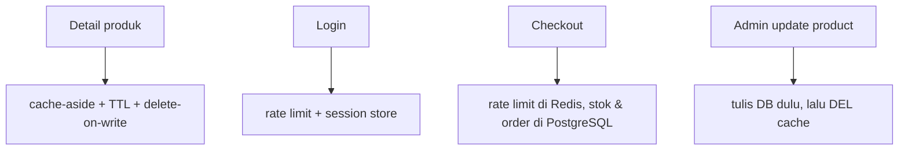

import { Section, Box, Recap, Chip, Hero } from "@components";

<Hero eyebrow="Chapter 06 &middot; Redis" title="Topik Lanjutan<br />&amp; <em>Rangkuman</em>" sub="Yang sengaja ditunda, peringatannya, dan rangkuman seluruh course">
  <p>Chapter penutup: menyebut jujur topik yang sengaja ditunda lengkap dengan peringatannya, lalu merangkum seluruh perjalanan ke dalam empat flow nyata online shop.</p>
  <Fragment slot="meta">
    <Chip icon="book">topik <b>lanjutan</b></Chip>
    <Chip icon="check">rangkuman <b>course</b></Chip>
    <Chip icon="clock">~16 menit baca</Chip>
  </Fragment>
</Hero>

Course ini sengaja memfokuskan diri pada fondasi caching dan state sementara, dan menunda beberapa topik yang besar. Chapter penutup ini melakukan dua hal: pertama **menyebutnya secara jujur** lengkap dengan peringatan dan arah lanjutan, supaya tidak ada yang hilang diam-diam, lalu **merangkum** seluruh course ke dalam empat flow nyata online shop. Yang ditunda di sini bukan "kurang penting", melainkan "butuh fondasi yang sudah kamu punya sekarang".

<Section num="01" id="topik-lanjutan" title="Topik Lanjutan & Langkah Berikutnya" sub="Apa yang sengaja ditunda, lengkap dengan peringatannya">

<p class="lead">Course ini sengaja menunda beberapa topik agar fokus tetap pada fondasi caching dan state sementara. Bagian ini menyebutnya secara jujur, lengkap dengan peringatan dan arah lanjutan, supaya tidak ada yang hilang diam-diam.</p>

### Pub/Sub dan batasannya

Redis Pub/Sub memungkinkan satu proses mem-publish pesan ke channel dan proses lain men-subscribe untuk menerimanya, cocok untuk broadcast realtime ringan seperti memberi tahu antar proses bahwa sebuah cache perlu di-invalidasi. Tetapi menurut [dokumentasi Pub/Sub Redis](https://redis.io/docs/latest/develop/pubsub/), Pub/Sub bersifat at-most-once: pesan dikirim sekali saja, tidak dipersistensi, dan bila subscriber sedang tidak bisa menerima (error atau disconnect), pesan itu hilang selamanya.

<Box variant="warn" icon="⚠️" label="Jangan pakai Pub/Sub untuk payment atau order"><p>Karena pesan bisa hilang permanen, Pub/Sub tidak boleh dipakai untuk proses yang harus bisa retry seperti pemrosesan pembayaran atau order. Untuk jaminan at-least-once, pakai Redis Streams. Pub/Sub hanya untuk notifikasi ringan yang boleh hilang.</p></Box>

### Distributed lock dengan SET NX PX

Lock terdistribusi memakai `SET key value NX PX` untuk memastikan hanya satu proses memegang lock pada satu waktu, dengan expiry (PX) dan token kepemilikan agar unlock aman. Ide ini menggoda, tetapi mudah salah.

<Box variant="warn" icon="⚠️" label="Kapan JANGAN pakai distributed lock"><p>Pada Redis single-instance, lock adalah single point of failure, dan karena replikasi Redis asinkron, failover bisa membuat dua proses sama-sama mengira memegang lock. Martin Kleppmann mengkritik Redlock sebagai tidak aman untuk correctness yang bergantung pada asumsi waktu (lihat [tulisannya](https://martin.kleppmann.com/2016/02/08/how-to-do-distributed-locking.html)). Maka jangan pakai lock Redis untuk operasi business-critical seperti mengurangi stok checkout; itu urusan transaksi PostgreSQL. Lock Redis boleh untuk hal ringan seperti melindungi refresh cache mahal agar tidak dikerjakan banyak proses sekaligus.</p></Box>

### Cache stampede dan singleflight

Cache stampede terjadi ketika banyak request miss bersamaan (mis. tepat saat key kedaluwarsa) lalu serentak menyerang database, mengubah cache miss jadi database spike. Ini persis badai miss yang jitter TTL di Chapter 3 baru meredam, belum menuntaskan. Solusi di Go adalah menekan panggilan duplikat dengan [`golang.org/x/sync/singleflight`](https://pkg.go.dev/golang.org/x/sync/singleflight), yang menyediakan `Group.Do`: untuk key yang sama, fungsi dieksekusi sekali dan hasilnya dibagikan ke semua pemanggil konkuren.

```go title="internal/product/singleflight.go"
import "golang.org/x/sync/singleflight"

var group singleflight.Group

// GetByIDDeduped memastikan hanya satu pengambilan database per key
// walau banyak request miss bersamaan.
func (s *Service) GetByIDDeduped(ctx context.Context, id int64) (Product, error) {
	key := productKey(id)
	v, err, _ := group.Do(key, func() (any, error) {
		return s.GetByIDResilient(ctx, id)
	})
	if err != nil {
		return Product{}, err
	}
	return v.(Product), nil
}
```

Selain singleflight, teknik pelengkap adalah pola stale-while-revalidate yang menyajikan data lama sebentar sambil menyegarkan di latar.

<Box variant="note" icon="🧩" label="Stale-while-revalidate: dua TTL"><p>Redis tidak punya stale-while-revalidate bawaan, tetapi mudah ditiru di aplikasi dengan dua ambang waktu: sebuah TTL "segar" dan sebuah TTL "stale" yang lebih panjang. Selama masih segar, data dilayani apa adanya. Setelah lewat segar tapi belum lewat stale, data lama tetap dilayani cepat sementara satu goroutine menyegarkannya di latar. Pembaca tidak pernah menunggu rebuild, dan database tidak diserbu, kombinasi yang ampuh untuk hot key mahal.</p></Box>

### Redis Streams dan consumer group

Stream adalah log append-only untuk event processing. Berbeda dari Pub/Sub, pesan di Stream dipersistensi dan mendukung at-least-once, sehingga cocok untuk event-driven backend dan worker. Consumer group memungkinkan banyak worker membagi beban membaca event yang sama, dengan pending messages dan acknowledgement agar tidak ada event yang hilang. Ini adalah pintu masuk ke materi scaling berikutnya.

<Box variant="note" icon="🧩" label="Ke mana setelah ini"><p>Topik di atas membawa kamu ke caching strategy lanjutan (stampede, stale-while-revalidate), arsitektur worker (Streams + consumer group), dan event-driven backend. Semuanya adalah fondasi untuk backend high-traffic yang men-scale, di luar cakupan course pengantar ini.</p></Box>

Itu semua peta jalan ke depan. Sekarang mari menoleh ke belakang dan merangkai seluruh course menjadi satu gambar utuh.

</Section>

<Section num="02" id="ringkasan" title="Ringkasan & Poin Penting" sub="Pakai Redis di tempat yang benar, bukan di mana-mana">

<p class="lead">Seluruh materi bermuara pada satu prinsip: pakai Redis di tempat yang benar, bukan di mana-mana. Redis adalah tool performa dan state sementara, bukan pengganti desain database yang benar.</p>

Mari petakan ke empat flow nyata online shop. Pada detail produk, cache-aside dengan TTL dan delete-on-write membuat database tidak menjadi titik panas. Pada login, rate limit `INCR`+`EXPIRE` melindungi dari brute force, dan session disimpan di Redis dengan TTL alami. Pada checkout, Redis boleh membatasi laju, tetapi pengurangan stok dan pembuatan order tetap transaksi PostgreSQL. Pada admin update product, tulis ke PostgreSQL dulu lalu hapus `product:{id}` agar pembaca berikutnya mendapat data segar.



<p class="fig-cap"><b>Gambar 1.</b> Empat flow, satu prinsip: Redis mempercepat dan menyimpan sementara; PostgreSQL menjaga kebenaran.</p>

<Recap title="Yang Wajib Menempel"><ul><li>Redis adalah memory layer untuk cache, session, rate limit, dan data sementara, bukan sumber kebenaran data bisnis.</li><li>Model intinya key + value + TTL; pilih tipe data (String, Hash, List, Set, Sorted Set, Stream) dari operasi yang dibutuhkan.</li><li>Client resmi `github.com/redis/go-redis/v9` (v9.20.1) memakai `context.Context` sebagai parameter pertama; `redis.Nil` berarti cache miss, bukan error.</li><li>Cache-aside: cek Redis dulu, miss baru ke PostgreSQL, lalu isi cache best-effort tanpa menggagalkan request.</li><li>Desain key konsisten (env, versi, entitas, id/hash) menentukan kemudahan invalidasi; versi key adalah tombol panic.</li><li>TTL untuk data yang boleh telat; delete-on-write untuk kesegaran segera, selalu tulis database dulu baru hapus cache; beri jitter agar tak kedaluwarsa berjamaah.</li><li>Jangan cache stok, status order, status payment, cart aktif, dan data privat sebagai kebenaran.</li><li>`INCR`+`EXPIRE` yang atomic untuk rate limit; session dan token blacklist memakai TTL alami Redis.</li><li>Atomicity Redis terbatas: command tunggal atomic, `TxPipelined` untuk MULTI/EXEC, `Watch` untuk optimistic transaction yang di-retry saat `redis.TxFailedErr`.</li><li>Redis boleh gagal: timeout pendek + fallback database menjadikannya akselerator, bukan single point of failure; pantau hit rate, latency, memori, eviction, dan slowlog.</li></ul></Recap>

Langkah berikutnya menuju backend high-traffic adalah memperdalam caching strategy (stampede protection, stale-while-revalidate), membangun worker dan event-driven flow dengan Redis Streams, serta merancang observability yang matang. Tetapi prinsip yang kamu pegang di sini tidak berubah: tempatkan Redis di tempat yang benar, jaga PostgreSQL tetap menjadi sumber kebenaran, dan biarkan kecepatan datang dari desain yang disiplin, bukan dari cache yang dipasang di mana-mana.

</Section>
